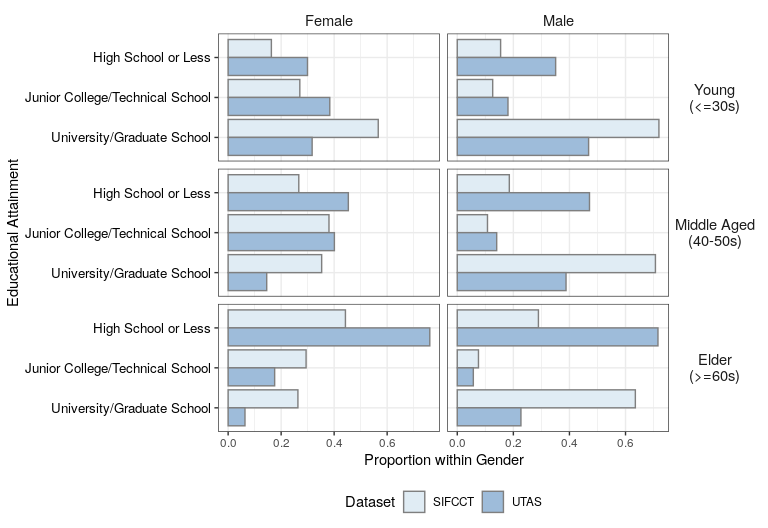
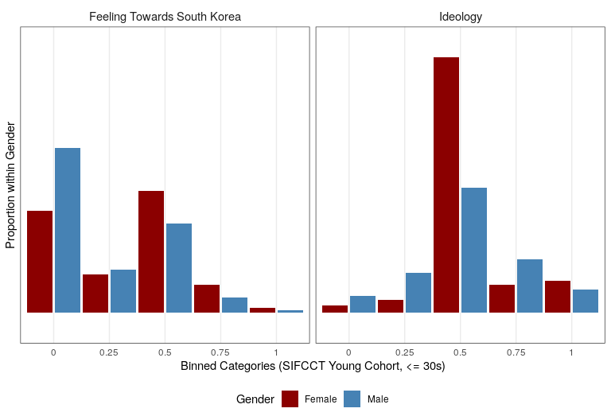
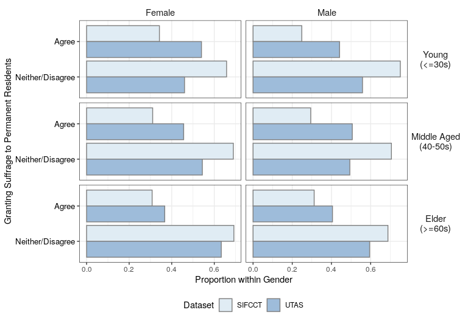

Main Descriptive Statistics
================
Fan Lu & Gento Kato
Jan 1, 2020

# Preparation

``` r
## Clean Up Space
rm(list=ls())

## Set Working Directory (Automatically) ##
require(rstudioapi); require(rprojroot)
if (rstudioapi::isAvailable()==TRUE) {
  setwd(dirname(rstudioapi::getActiveDocumentContext()$path)); 
} 
projdir <- find_root(has_file("thisishome.txt"))
cat(paste("Working Directory Set to:\n",projdir))
```

    ## Working Directory Set to:
    ##  /home/gentok/Documents/Projects/ForeignerJapan

``` r
setwd(projdir)

## Find Data Directory
datadir1 <- paste0(projdir, "/data/sifcct_latest_v4.rds")
datadir2 <- paste0(projdir, "/data/utas_latest_v4.rds")

## Import Original Data
sifcct <- readRDS(datadir1)
utas <- readRDS(datadir2)

## packages
# devtools::install_github("gentok/estvis")
require(estvis)
require(multiwayvcov)
require(lmtest)
require(MASS)
require(ggplot2)
require(VGAM)
require(texreg)
```

# Regression Formulas

``` r
# Baseline
basemodA <- formula(  ~ edu * agecat + knowledge + polint + employed
                      + evecon + income + lvpr + as.factor(wave)) # sifcct
basemodB <- formula(  ~ edu * agecat + knowledge + employed + evecon + as.factor(year)) # utas
```

# Dropping NAs from Data

``` r
## Drop missing cases
sifcct <- sifcct[complete.cases(sifcct[,c("foreignsuff",
                                          "familialityFT_KOR",
                                          "ideology",
                                          "zip_pref",all.vars(basemodA))]),]
utas <- utas[complete.cases(utas[,c("foreignsuff",
                                    "add_pref",all.vars(basemodB))]),]
```

# Education

``` r
# Plotting Data
# tmp1 <- table(sifcct[sifcct$female==1,]$edu, sifcct[sifcct$female==1,]$agecat)/rowSums(table(sifcct[sifcct$female==1,]$edu, sifcct[sifcct$female==1,]$agecat))
# tmp2 <- table(sifcct[sifcct$female==0,]$edu, sifcct[sifcct$female==0,]$agecat)/rowSums(table(sifcct[sifcct$female==0,]$edu, sifcct[sifcct$female==0,]$agecat))
# tmp3 <- table(utas[utas$female==1,]$edu, utas[utas$female==1,]$agecat)/rowSums(table(utas[utas$female==1,]$edu, utas[utas$female==1,]$agecat))
# tmp4 <- table(utas[utas$female==0,]$edu, utas[utas$female==0,]$agecat)/rowSums(table(utas[utas$female==0,]$edu, utas[utas$female==0,]$agecat))
tmp1 <- t(t(table(sifcct[sifcct$female==1,]$edu, sifcct[sifcct$female==1,]$agecat))/colSums(table(sifcct[sifcct$female==1,]$edu, sifcct[sifcct$female==1,]$agecat)))
tmp2 <- t(t(table(sifcct[sifcct$female==0,]$edu, sifcct[sifcct$female==0,]$agecat))/colSums(table(sifcct[sifcct$female==0,]$edu, sifcct[sifcct$female==0,]$agecat)))
tmp3 <- t(t(table(utas[utas$female==1,]$edu, utas[utas$female==1,]$agecat))/colSums(table(utas[utas$female==1,]$edu, utas[utas$female==1,]$agecat)))
tmp4 <- t(t(table(utas[utas$female==0,]$edu, utas[utas$female==0,]$agecat))/colSums(table(utas[utas$female==0,]$edu, utas[utas$female==0,]$agecat)))

pd <- data.frame(prop=c(tmp1[,1],tmp2[,1],tmp3[,1],tmp4[,1],
                        tmp1[,2],tmp2[,2],tmp3[,2],tmp4[,2],
                        tmp1[,3],tmp2[,3],tmp3[,3],tmp4[,3]))
pd$gender <- factor(rep(c("Female","Male"),each=3), levels=c("Female","Male"))
pd$cat <- rep(c("High School or Less",
                "Junior College/Technical School",
                "University/Graduate School"),each=1)
pd$cat <- factor(pd$cat, levels=rev(unique(pd$cat)))
pd$sample <- rep(c("SIFCCT",
                   "UTAS"),each=6)
pd$sample <- factor(pd$sample, levels=unique(pd$sample))
pd$agecat <- rep(c("Young\n(<=30s)",
                   "Middle Aged\n(40-50s)","Elder\n(>=60s)"),each=12)
pd$agecat <- factor(pd$agecat, levels=unique(pd$agecat))

# Plot
p <- ggplot(data=pd, aes(x=cat,y=prop)) + 
  geom_col(aes(fill=sample), color = "gray50", position=position_dodge(width=-0.9)) +  
  facet_grid(agecat~gender, scale="free_x") +
  coord_flip() + 
  xlab("Educational Attainment") + ylab("Proportion within Gender") +
  scale_fill_brewer(name="Dataset", type = "seq", palette = 3) + 
  #scale_y_continuous(limits=c(0,0.7)) +
  theme_bw() + 
  theme(legend.position = "bottom",
        strip.text.x = element_text(size=11),
        strip.text.y = element_text(angle=0,size=11),
        strip.background = element_rect(fill=NA,color=NA),
        plot.caption = element_text(hjust=0),
        plot.caption.position = "plot",
        axis.text.y = element_text(size=10, color="black"))
```

``` r
p
```

<!-- -->

``` r
png_save(p, w=850, h=550, file=paste0(projdir,"/out/descrplot_edu.png"))
```

# Potential Mediators

``` r
## Limit Education to University or over and SHS or under
table(sifcct$edu)
```

    ## 
    ##                <=SHS >SHS & <College(4yr)       >=College(4yr) 
    ##                 7667                 6579                18629

``` r
sifcct <- sifcct[which(sifcct$edu!=">SHS & <College(4yr)"),]
sifcct$edu <- ifelse(sifcct$edu==">=College(4yr)",1,0)
table(utas$edu)
```

    ## 
    ##                <=SHS >SHS & <College(4yr)       >=College(4yr) 
    ##                 2689                 1036                 1188

``` r
utas <- utas[which(utas$edu!=">SHS & <College(4yr)"),]
utas$edu <- ifelse(utas$edu==">=College(4yr)",1,0)

## FT South Korea
tmp1 <- density(sifcct[which(sifcct$female==1 & sifcct$agecat=="Young (<=30s)"),]$familialityFT_KOR, n=5, from=0, to=1)
tmp2 <- density(sifcct[which(sifcct$female==0 & sifcct$agecat=="Young (<=30s)"),]$familialityFT_KOR, n=5, from=0, to=1)
tmp3 <- density(sifcct[which(sifcct$female==1 & sifcct$agecat=="Middle Aged (40-50s)"),]$familialityFT_KOR, n=5, from=0, to=1)
tmp4 <- density(sifcct[which(sifcct$female==0 & sifcct$agecat=="Middle Aged (40-50s)"),]$familialityFT_KOR, n=5, from=0, to=1)
tmp5 <- density(sifcct[which(sifcct$female==1 & sifcct$agecat=="Elder (>=60s)"),]$familialityFT_KOR, n=5, from=0, to=1)
tmp6 <- density(sifcct[which(sifcct$female==0 & sifcct$agecat=="Elder (>=60s)"),]$familialityFT_KOR, n=5, from=0, to=1)

pd1 <- data.frame(prop=c(tmp1$y,tmp2$y,tmp3$y,tmp4$y,tmp5$y,tmp6$y),
                 x = tmp1$x)
pd1$gender <- factor(rep(c("Female","Male"),each=5), levels=c("Female","Male"))
pd1$agecat <- rep(c("Young\n(<=30s)",
                   "Middle Aged\n(40-50s)","Elder\n(>=60s)"),each=5*2)
pd1$agecat <- factor(pd1$agecat, levels=unique(pd1$agecat))
pd1$v <- "Feeling Towards South Korea"

## Ideology
tmp1 <- density(sifcct[which(sifcct$female==1 & sifcct$agecat=="Young (<=30s)"),]$ideology, n=5, from=0, to=1)
tmp2 <- density(sifcct[which(sifcct$female==0 & sifcct$agecat=="Young (<=30s)"),]$ideology, n=5, from=0, to=1)
tmp3 <- density(sifcct[which(sifcct$female==1 & sifcct$agecat=="Middle Aged (40-50s)"),]$ideology, n=5, from=0, to=1)
tmp4 <- density(sifcct[which(sifcct$female==0 & sifcct$agecat=="Middle Aged (40-50s)"),]$ideology, n=5, from=0, to=1)
tmp5 <- density(sifcct[which(sifcct$female==1 & sifcct$agecat=="Elder (>=60s)"),]$ideology, n=5, from=0, to=1)
tmp6 <- density(sifcct[which(sifcct$female==0 & sifcct$agecat=="Elder (>=60s)"),]$ideology, n=5, from=0, to=1)

pd2 <- data.frame(prop=c(tmp1$y,tmp2$y,tmp3$y,tmp4$y,tmp5$y,tmp6$y),
                  x = tmp1$x)
pd2$gender <- factor(rep(c("Female","Male"),each=5), levels=c("Female","Male"))
pd2$agecat <- rep(c("Young\n(<=30s)",
                    "Middle Aged\n(40-50s)","Elder\n(>=60s)"),each=5*2)
pd2$agecat <- factor(pd2$agecat, levels=unique(pd2$agecat))
pd2$v <- "Ideology"

pd <- rbind(pd1,pd2)
pd$v <- factor(pd$v, levels=unique(pd$v))

# Plot
p <- ggplot(data=pd[which(pd$agecat=="Young\n(<=30s)"),], aes(x=as.factor(x),y=prop)) + 
  geom_col(aes(fill=gender), position=position_dodge(width=1)) +  
  facet_grid(~v, scale="free_x") +
  xlab("Binned Categories (SIFCCT Young Cohort, <= 30s)") + ylab("Proportion within Gender") +
  scale_fill_manual(name="Gender", values=c("red4","steelblue")) + 
  scale_y_discrete(labels=c(0,0.25,0.5,0.75,1)) +
  scale_x_discrete(labels=c(0,0.25,0.5,0.75,1)) +
  theme_bw() + 
  theme(legend.position = "bottom",
        axis.ticks = element_blank(),
        strip.text.x = element_text(size=11),
        strip.text.y = element_text(angle=0,size=11),
        strip.background = element_rect(fill=NA,color=NA),
        plot.caption = element_text(hjust=0),
        plot.caption.position = "plot",
        axis.text.y = element_text(size=10, color="black"))
```

``` r
p
```

<!-- -->

``` r
png_save(p, w=800, h=450, file=paste0(projdir,"/out/descrplot_med.png"))
```

# Outcome Policy Variable

``` r
# Plotting Data
tmp1 <- t(t(table(sifcct[sifcct$female==1,]$foreignsuff>=0.75, sifcct[sifcct$female==1,]$agecat))/colSums(table(sifcct[sifcct$female==1,]$foreignsuff>=0.75, sifcct[sifcct$female==1,]$agecat)))
tmp2 <- t(t(table(sifcct[sifcct$female==0,]$foreignsuff>=0.75, sifcct[sifcct$female==0,]$agecat))/colSums(table(sifcct[sifcct$female==0,]$foreignsuff>=0.75, sifcct[sifcct$female==0,]$agecat)))
tmp3 <- t(t(table(utas[utas$female==1,]$foreignsuff>=0.75, utas[utas$female==1,]$agecat))/colSums(table(utas[utas$female==1,]$foreignsuff>=0.75, utas[utas$female==1,]$agecat)))
tmp4 <- t(t(table(utas[utas$female==0,]$foreignsuff>=0.75, utas[utas$female==0,]$agecat))/colSums(table(utas[utas$female==0,]$foreignsuff>=0.75, utas[utas$female==0,]$agecat)))

pd <- data.frame(prop=c(tmp1[,1],tmp2[,1],tmp3[,1],tmp4[,1],
                        tmp1[,2],tmp2[,2],tmp3[,2],tmp4[,2],
                        tmp1[,3],tmp2[,3],tmp3[,3],tmp4[,3]))
pd$gender <- factor(rep(c("Female","Male"),each=2), levels=c("Female","Male"))
pd$cat <- c("Neither/Disagree","Agree")
pd$cat <- factor(pd$cat, levels=(unique(pd$cat)))
pd$sample <- rep(c("SIFCCT",
                   "UTAS"),each=4)
pd$sample <- factor(pd$sample, levels=unique(pd$sample))
pd$agecat <- rep(c("Young\n(<=30s)",
                   "Middle Aged\n(40-50s)","Elder\n(>=60s)"),each=8)
pd$agecat <- factor(pd$agecat, levels=unique(pd$agecat))

# Plot
p <- ggplot(data=pd, aes(x=cat,y=prop)) + 
  geom_col(aes(fill=sample), color = "gray50", position=position_dodge(width=-0.9)) +  
  facet_grid(agecat~gender, scale="free_x") +
  coord_flip() + 
  xlab("Granting Suffrage to Permanent Residents") + ylab("Proportion within Gender") +
  scale_fill_brewer(name="Dataset", type = "seq", palette = 3) + 
  # scale_y_continuous(limits=c(0,0.7)) +
  theme_bw() + 
  theme(legend.position = "bottom",
        strip.text.x = element_text(size=11),
        strip.text.y = element_text(angle=0,size=11),
        strip.background = element_rect(fill=NA,color=NA),
        plot.caption = element_text(hjust=0),
        plot.caption.position = "plot",
        axis.text.y = element_text(size=10, color="black"))
```

``` r
p
```

<!-- -->

``` r
png_save(p, w=800, h=550, file=paste0(projdir,"/out/descrplot_out.png"))
```
