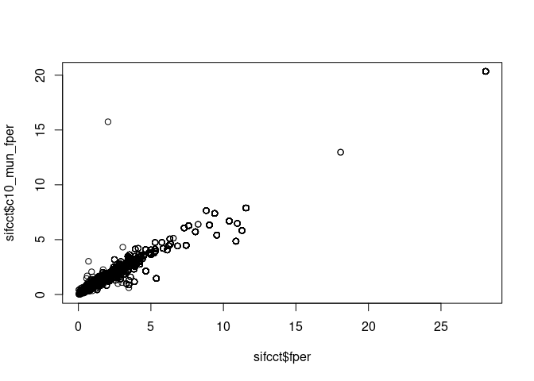

Analysis 1: Main Analysis with Original and Mail-In Data
================
Fan Lu & Gento Kato
January 26, 2021

# Analytical Strategy

## Variables

  - Outcome: Foreigner Suffrage (min 0, max 1)

  - Mediator 1: (Objective) Political Knowledge (min = 0, max = 1)

  - Mediator 2: Ideology (min 0 = left/liberal, max 1 =
    right/conservative)

  - Mediator 3: LDP - DPJ FT (min 0 = favor DPJ, max 1 = favor LDP)

  - Mediator 4: Favorability of South Korea (min = 0, max = 1)  

  - Mediator 5: Favorability of China (min = 0, max = 1)  

  - Mediator 6: Favorability of USA (min = 0, max = 1)  

  - Mediator 7: Income (percentile, min = 0, max = 1)

  - Independent Variable: University Education (0 = Junior College or
    Less, 1 = University or More)

  - Moderator 1: Gender (0 = Female, 1 = Male), This means that all
    “base” coefficients are for female.

  - Moderator 2: Age (by 10 years, centered at 20). Reasoning: Two
    trends may influence the role of university education. (1) There is
    an evident increase in number of university graduates over the
    years, especially among women. This trend may impies that university
    experience may be more gendered in the past than today. (2) There is
    a trend of “internationalization” in university education in recent
    days. Therefore, the diversifying and liberalizing effect of
    education may be stronger for younger generation.

  - Control 1: Percent in life residing locally. More locally-identified
    individuals may dislike outsiders more.

  - Control 2: (ZIP level) Residing in densely inhabited district (DID)

  - Control 3: (ZIP level) Percent of foreigners in neighborhood
    (transformed by square root)  

  - Control 4: (ZIP level) Percent of university graduates in
    neighborhood (by 10 percent)

  - Control 5: (Municipality level) Percent of residents residing in DID

  - Control 6: (Municipality level) Percent of foreigners (transformed
    by square root)

  - Control 7: (Municipality level) Percent of university graduates (by
    10 percent)

## Subset Data

Analysis is conducted on the following subset.

If age - years of local ZIP residence is 15 or smaller. 15 is the age of
entering high school in Japan. Assuming that an individual is living in
the local ZIP continuously, this condition implies that one spend
significant time before college in the ZIP of current residence. This
filters out the possibility that education changes attitudes through the
movement in residence.

## Modeling Strategy

All models are estimated by OLS. For outcome model, alternative model is
estimated by the multinomial logit model, with 3 category DV (disagree,
neither, agree), with disagree as a reference category.

## Robustness Check (in this file)

SIFCCT has one special survey where they conducted a survey through
mail. Mail survey contains identical set of variables as online survey.
So I replicated the analysis with the mail survey.

# Preparation

``` r
## Clean Up Space
rm(list=ls())

## Set Working Directory (Automatically) ##
require(rstudioapi); require(rprojroot)
if (rstudioapi::isAvailable()==TRUE) {
  setwd(dirname(rstudioapi::getActiveDocumentContext()$path)); 
} 
projdir <- find_root(has_file("thisishome.txt"))
cat(paste("Working Directory Set to:\n",projdir))
```

    ## Working Directory Set to:
    ##  /home/gentok/GoogleDrive/Projects/Fan-Gento-Lab/ForeignerJapan

``` r
setwd(projdir)

## Original Data
datadir1a <- paste0(projdir, "/data/sifcct_zip_latest_v5.rds")
datadir1b <- paste0(projdir, "/data/sifcct_zip_latest_panel_v5.rds")
datadir2 <- paste0(projdir, "/data/mail_zip_latest_v5.rds")

## packages
require(sandwich)
require(lmtest)
require(MASS)
# devtools::install_github("tidyverse/ggplot2") # Need development version (as of Dec 31, 2019)
require(ggplot2)
require(texreg)
require(mlogit)
require(Formula)
```

# Import and clean data

``` r
###################
## SIFCCT Online ##
###################

sifcct <- rbind(readRDS(datadir1a),readRDS(datadir1b))

## Knowledge Variable (Replaced)
sifcct$knowledge[sifcct$panel==1 & sifcct$wave==2] <- sifcct$knowledge[sifcct$panel==1 & sifcct$wave==1][match(sifcct$panelid[sifcct$panel==1 & sifcct$wave==2],sifcct$panelid[sifcct$panel==1 & sifcct$wave==1])]
sifcct$knowledge[sifcct$panel==1 & sifcct$wave==3] <- sifcct$knowledge[sifcct$panel==1 & sifcct$wave==1][match(sifcct$panelid[sifcct$panel==1 & sifcct$wave==3],sifcct$panelid[sifcct$panel==1 & sifcct$wave==1])]
sifcct$knowledge[sifcct$panel==1 & sifcct$wave==4] <- sifcct$knowledge[sifcct$panel==1 & sifcct$wave==1][match(sifcct$panelid[sifcct$panel==1 & sifcct$wave==4],sifcct$panelid[sifcct$panel==1 & sifcct$wave==1])]
sifcct$knowledge[sifcct$panel==1 & sifcct$wave==5] <- sifcct$knowledge[sifcct$panel==1 & sifcct$wave==1][match(sifcct$panelid[sifcct$panel==1 & sifcct$wave==5],sifcct$panelid[sifcct$panel==1 & sifcct$wave==1])]
sifcct$knowledge[sifcct$panel==1 & sifcct$wave==6] <- sifcct$knowledge[sifcct$panel==1 & sifcct$wave==1][match(sifcct$panelid[sifcct$panel==1 & sifcct$wave==6],sifcct$panelid[sifcct$panel==1 & sifcct$wave==1])]
sifcct$knowledge[sifcct$panel==1 & sifcct$wave==7] <- sifcct$knowledge[sifcct$panel==1 & sifcct$wave==1][match(sifcct$panelid[sifcct$panel==1 & sifcct$wave==7],sifcct$panelid[sifcct$panel==1 & sifcct$wave==1])]
sifcct$knowledge[sifcct$panel==1 & sifcct$wave==8] <- sifcct$knowledge[sifcct$panel==1 & sifcct$wave==1][match(sifcct$panelid[sifcct$panel==1 & sifcct$wave==8],sifcct$panelid[sifcct$panel==1 & sifcct$wave==1])]
sifcct$knowledge[sifcct$panel==1 & sifcct$wave==9] <- sifcct$knowledge[sifcct$panel==1 & sifcct$wave==1][match(sifcct$panelid[sifcct$panel==1 & sifcct$wave==9],sifcct$panelid[sifcct$panel==1 & sifcct$wave==1])]
sifcct$knowledge[sifcct$panel==1 & sifcct$wave==10] <- sifcct$knowledge[sifcct$panel==1 & sifcct$wave==1][match(sifcct$panelid[sifcct$panel==1 & sifcct$wave==10],sifcct$panelid[sifcct$panel==1 & sifcct$wave==1])]
sifcct$knowledge[sifcct$panel==1 & sifcct$wave==11] <- sifcct$knowledge[sifcct$panel==1 & sifcct$wave==1][match(sifcct$panelid[sifcct$panel==1 & sifcct$wave==11],sifcct$panelid[sifcct$panel==1 & sifcct$wave==1])]
sifcct$knowledge[sifcct$panel==1 & sifcct$wave==12] <- sifcct$knowledge[sifcct$panel==1 & sifcct$wave==1][match(sifcct$panelid[sifcct$panel==1 & sifcct$wave==12],sifcct$panelid[sifcct$panel==1 & sifcct$wave==1])]
## Knowledge Variable (Replaced)
sifcct$knowledge[sifcct$panel==1 & sifcct$wave==14] <- sifcct$knowledge[sifcct$panel==1 & sifcct$wave==13][match(sifcct$panelid[sifcct$panel==1 & sifcct$wave==14],sifcct$panelid[sifcct$panel==1 & sifcct$wave==13])]
sifcct$knowledge[sifcct$panel==1 & sifcct$wave==15] <- sifcct$knowledge[sifcct$panel==1 & sifcct$wave==13][match(sifcct$panelid[sifcct$panel==1 & sifcct$wave==15],sifcct$panelid[sifcct$panel==1 & sifcct$wave==13])]
sifcct$knowledge[sifcct$panel==1 & sifcct$wave==16] <- sifcct$knowledge[sifcct$panel==1 & sifcct$wave==13][match(sifcct$panelid[sifcct$panel==1 & sifcct$wave==16],sifcct$panelid[sifcct$panel==1 & sifcct$wave==13])]
sifcct$knowledge[sifcct$panel==1 & sifcct$wave==17] <- sifcct$knowledge[sifcct$panel==1 & sifcct$wave==13][match(sifcct$panelid[sifcct$panel==1 & sifcct$wave==17],sifcct$panelid[sifcct$panel==1 & sifcct$wave==13])]
sifcct$knowledge[sifcct$panel==1 & sifcct$wave==18] <- sifcct$knowledge[sifcct$panel==1 & sifcct$wave==13][match(sifcct$panelid[sifcct$panel==1 & sifcct$wave==18],sifcct$panelid[sifcct$panel==1 & sifcct$wave==13])]
sifcct$knowledge[sifcct$panel==1 & sifcct$wave==19] <- sifcct$knowledge[sifcct$panel==1 & sifcct$wave==13][match(sifcct$panelid[sifcct$panel==1 & sifcct$wave==19],sifcct$panelid[sifcct$panel==1 & sifcct$wave==13])]
sifcct$knowledge[sifcct$panel==1 & sifcct$wave==20] <- sifcct$knowledge[sifcct$panel==1 & sifcct$wave==13][match(sifcct$panelid[sifcct$panel==1 & sifcct$wave==20],sifcct$panelid[sifcct$panel==1 & sifcct$wave==13])]
sifcct$knowledge[sifcct$panel==1 & sifcct$wave==21] <- sifcct$knowledge[sifcct$panel==1 & sifcct$wave==13][match(sifcct$panelid[sifcct$panel==1 & sifcct$wave==21],sifcct$panelid[sifcct$panel==1 & sifcct$wave==13])]
sifcct$knowledge[sifcct$panel==1 & sifcct$wave==22] <- sifcct$knowledge[sifcct$panel==1 & sifcct$wave==13][match(sifcct$panelid[sifcct$panel==1 & sifcct$wave==22],sifcct$panelid[sifcct$panel==1 & sifcct$wave==13])]
sifcct$knowledge[sifcct$panel==1 & sifcct$wave==23] <- sifcct$knowledge[sifcct$panel==1 & sifcct$wave==13][match(sifcct$panelid[sifcct$panel==1 & sifcct$wave==23],sifcct$panelid[sifcct$panel==1 & sifcct$wave==13])]
sifcct$knowledge[sifcct$panel==1 & sifcct$wave==24] <- sifcct$knowledge[sifcct$panel==1 & sifcct$wave==13][match(sifcct$panelid[sifcct$panel==1 & sifcct$wave==24],sifcct$panelid[sifcct$panel==1 & sifcct$wave==13])]

## Subset Waves
sifcct <- subset(sifcct, !wave%in%c(1,23,24) & !(panel==1 & wave%in%c(1,3:12,14:24)))
table(sifcct$wave,sifcct$panel)
```

    ##     
    ##         0    1
    ##   2  1626 1054
    ##   3  1748    0
    ##   4  1918    0
    ##   5  1873    0
    ##   6  1916    0
    ##   7  1779    0
    ##   8  1774    0
    ##   9  1789    0
    ##   10 1674    0
    ##   11 1731    0
    ##   12 1668    0
    ##   13 1636  982
    ##   14 1648    0
    ##   15 1758    0
    ##   16 1744    0
    ##   17 1673    0
    ##   18 1724    0
    ##   19 1728    0
    ##   20 1672    0
    ##   21 1717    0
    ##   22 1787    0

``` r
## sreg with no population as NA
sifcct$c10_sreg_pop[which(sifcct$c10_sreg_pop==0)] <- NA 

## Income Missing Percentage (8.9%)
table(is.na(sifcct$income))/sum(table(is.na(sifcct$income)))
```

    ## 
    ##      FALSE       TRUE 
    ## 0.91032911 0.08967089

``` r
## Exclude Missing Values
sifcctx <- sifcct[,c("id","foreignsuff","foreignsuff3","foreignsuff3x",
           "knowledge","polint","ideology","ldpdpjft",
           "familiarityFT_KOR","familiarityFT_CHN","familiarityFT_USA",
           # "evecon","evecon_verybad","evecon_bad","evecon_notbad","evecon_qtype",
           "income", #"employed",
           "female","male","edu","edu2","age","agecat","bornyr",
           "lvlen","lvpr",
           "zip_did","c10_sreg_foreignN","c10_sreg_pop",
           "c10_sreg_edu_ugsP","c10_sreg_edu_ugs","c10_sreg_edu_graduated",
           "didper","c10_mun_foreignN","c10_mun_pop",
           "c10_mun_edu_ugsP","c10_mun_edu_ugs","c10_mun_edu_graduated",
           "zip","c10_name_pref","c10_name_mun","c10_name_sreg",
           "zip_lat","zip_lon",
           "wave","panel")]
sifcctx <- na.omit(sifcctx)
nrow(sifcctx)
```

    ## [1] 34703

``` r
## Add Income and fper
sifcctx$income <- sifcct$income[match(paste(sifcctx$id,sifcctx$wave),paste(sifcct$id,sifcct$wave))]
summary(sifcctx$income)
```

    ##    Min. 1st Qu.  Median    Mean 3rd Qu.    Max. 
    ## 0.04098 0.18484 0.40915 0.50079 0.78565 0.97505

``` r
sifcctx$fper <- sifcct$fper[match(paste(sifcctx$id,sifcctx$wave),paste(sifcct$id,sifcct$wave))]
summary(sifcctx$fper)
```

    ##     Min.  1st Qu.   Median     Mean  3rd Qu.     Max. 
    ##  0.03136  0.77811  1.35848  1.79431  2.24808 28.08225

``` r
## Replace Data
sifcct <- sifcctx
rm(sifcctx)

nrow(sifcct[which(sifcct$age - sifcct$lvlen<=15),])
```

    ## [1] 7827

``` r
#################
## SIFCCT Mail ##
#################

mail <- readRDS(datadir2)

## sreg with no population as NA
mail$c10_sreg_pop[which(mail$c10_sreg_pop==0)] <- NA 

## Exclude Missing Values
mailx <- mail[,c("id","foreignsuff","foreignsuff3","foreignsuff3x",
                     "knowledge","polint","ideology","ldpdpjft",
                     "familiarityFT_KOR","familiarityFT_CHN","familiarityFT_USA",
                     # "evecon","evecon_verybad","evecon_bad","evecon_notbad","evecon_qtype",
                     # "income","employed",
                     "female","male","edu","edu2","age","agecat","bornyr",
                     "lvlen","lvpr",
                     "zip_did","c10_sreg_foreignN","c10_sreg_pop",
                     "c10_sreg_edu_ugsP","c10_sreg_edu_ugs","c10_sreg_edu_graduated",
                     "didper","c10_mun_foreignN","c10_mun_pop",
                     "c10_mun_edu_ugsP","c10_mun_edu_ugs","c10_mun_edu_graduated",
                     "zip","c10_name_pref","c10_name_mun","c10_name_sreg",
                     "zip_lat","zip_lon")]
mailx <- na.omit(mailx)
nrow(mailx)
```

    ## [1] 1000

``` r
## Add Income & fper
mailx$income <- mail$income[match(paste(mailx$id),paste(mail$id))]
summary(mailx$income)
```

    ##    Min. 1st Qu.  Median    Mean 3rd Qu.    Max.    NA's 
    ## 0.05033 0.23742 0.48322 0.53321 0.82203 0.98067     105

``` r
mailx$fper <- mail$fper[match(paste(mailx$id),paste(mail$id))]
summary(mailx$fper)
```

    ##    Min. 1st Qu.  Median    Mean 3rd Qu.    Max. 
    ##  0.0000  0.6821  1.2061  1.5734  1.9266 10.9614

``` r
## Replace Data
mail <- mailx
rm(mailx)
```

# Recoding Variables

``` r
## SIFCCT ##

## Binary Age Cohort (50s or over)
sifcct$age2 <- ifelse(sifcct$age >= 50, 1, 0)
sifcct$agex <- sifcct$age/10 - 4.5
## Small Region Foreiner Percent
sifcct$c10_sreg_fper <- sifcct$c10_sreg_foreignN/sifcct$c10_sreg_pop*100
## Municipality Foreigner Percent
sifcct$c10_mun_fper <- sifcct$c10_mun_foreignN/sifcct$c10_mun_pop*100
## Compare Census and Foreinger Registry Numbers
plot(sifcct$fper, sifcct$c10_mun_fper)
```

<!-- -->

``` r
cor(sifcct$fper, sifcct$c10_mun_fper, use="pairwise")
```

    ## [1] 0.972352

``` r
plot(sifcct$c10_mun_fper, sifcct$c10_sreg_fper)
```

<!-- -->

``` r
cor(sifcct$c10_mun_fper, sifcct$c10_sreg_fper, use="pairwise")
```

    ## [1] 0.6087222

``` r
## MAIL ##

## Binary Age Cohort (50s or over)
mail$age2 <- ifelse(mail$age >= 50, 1, 0)
mail$agex <- mail$age/10 - 4.5
## Small Region Foreiner Percent
mail$c10_sreg_fper <- mail$c10_sreg_foreignN/mail$c10_sreg_pop*100
## Municipality Foreigner Percent
mail$c10_mun_fper <- mail$c10_mun_foreignN/mail$c10_mun_pop*100
## Compare Census and Foreinger Registry Numbers
plot(mail$fper, mail$c10_mun_fper)
```

<!-- -->

``` r
cor(mail$fper, mail$c10_mun_fper, use="pairwise")
```

    ## [1] 0.9782127

``` r
plot(mail$c10_mun_fper, mail$c10_sreg_fper)
```

<!-- -->

``` r
cor(mail$c10_mun_fper, mail$c10_sreg_fper, use="pairwise")
```

    ## [1] 0.7526452

``` r
## Formula (SIFCCT) ##

basemod0 <- formula(  ~ edu2*male*agex + lvpr +  
                        as.factor(wave)) # sifcct
basemodA <- formula(  ~ edu2*male*agex + lvpr +  
                        zip_did + sqrt(c10_sreg_fper) + I(c10_sreg_edu_ugsP/10) + 
                        as.factor(wave)) # sifcct
basemodB <- formula(  ~ edu2*male*agex + lvpr +  
                        didper + sqrt(c10_mun_fper) + I(c10_mun_edu_ugsP/10) + 
                        as.factor(wave)) # sifcct
basemodC <- formula(  ~ edu2*male*agex + lvpr +  
                        zip_did + sqrt(c10_sreg_fper) + I(c10_sreg_edu_ugsP/10) + 
                        didper + sqrt(c10_mun_fper) + I(c10_mun_edu_ugsP/10) + 
                        as.factor(wave)) # sifcct

## Formula (SIFCCT.mlogit) ##

outmod0.mlogit <- Formula(foreignsuff3x  ~ 0 | edu2*male*agex + lvpr +  
                            as.factor(wave)) # sifcct
outmodA.mlogit <- Formula(foreignsuff3x  ~ 0 | edu2*male*agex + lvpr +  
                            zip_did + sqrt(c10_sreg_fper) + I(c10_sreg_edu_ugsP/10) + 
                            as.factor(wave)) # sifcct
outmodB.mlogit <- Formula(foreignsuff3x  ~ 0 | edu2*male*agex + lvpr +  
                            didper + sqrt(c10_mun_fper) + I(c10_mun_edu_ugsP/10) + 
                            as.factor(wave)) # sifcct
outmodC.mlogit <- Formula(foreignsuff3x  ~ 0 | edu2*male*agex + lvpr +  
                            zip_did + sqrt(c10_sreg_fper) + I(c10_sreg_edu_ugsP/10) + 
                            didper + sqrt(c10_mun_fper) + I(c10_mun_edu_ugsP/10) + 
                            as.factor(wave)) # sifcct

## Formula (MAIL) ##

basemod0m <- formula(  ~ edu2*male*agex + lvpr) # sifcct
basemodAm <- formula(  ~ edu2*male*agex + lvpr +  
                         zip_did + sqrt(c10_sreg_fper) + I(c10_sreg_edu_ugsP/10)) # sifcct
basemodBm <- formula(  ~ edu2*male*agex + lvpr +  
                         didper + sqrt(c10_mun_fper) + I(c10_mun_edu_ugsP/10)) # sifcct
basemodCm <- formula(  ~ edu2*male*agex + lvpr +  
                         zip_did + sqrt(c10_sreg_fper) + I(c10_sreg_edu_ugsP/10) + 
                         didper + sqrt(c10_mun_fper) + I(c10_mun_edu_ugsP/10)) # sifcct

## Formula (MAIL.mlogit) ##

outmod0m.mlogit <- Formula(foreignsuff3x  ~ 0 | edu2*male*agex + lvpr) # sifcct
outmodAm.mlogit <- Formula(foreignsuff3x  ~ 0 | edu2*male*agex + lvpr +  
                            zip_did + sqrt(c10_sreg_fper) + I(c10_sreg_edu_ugsP/10)) # sifcct
outmodBm.mlogit <- Formula(foreignsuff3x  ~ 0 | edu2*male*agex + lvpr +  
                            didper + sqrt(c10_mun_fper) + I(c10_mun_edu_ugsP/10)) # sifcct
outmodCm.mlogit <- Formula(foreignsuff3x  ~ 0 | edu2*male*agex + lvpr +  
                            zip_did + sqrt(c10_sreg_fper) + I(c10_sreg_edu_ugsP/10) + 
                            didper + sqrt(c10_mun_fper) + I(c10_mun_edu_ugsP/10)) # sifcct

## Variable Names ##

vnmap <- list("edu2" = "University education",
              "edu2 (1)" = "University education",
              "female" = "Gender (female)",
              "male" = "Gender (male)",
              "age2" = "Age 50s or older",
              "agex" = "Age (by 10 years, centered at 45)",
              "edu2:female" = "University * Female",
              "edu2:male" = "University * Male",
              "edu2 (2)" = "University * Male",
              "edu2:age2" = "University * >=50s",
              "edu2:agex" = "University * Age",
              "edu2 (3)" = "University * Age",
              "edu2:female:age2" = "University * Female * >=50s",
              "edu2:male:age2" = "University * Male * >=50s",
              "edu2:female:agex" = "University * Female * Age",
              "edu2:male:agex" = "University * Male * Age",
              "edu2 (4)" = "University * Male * Age",
              "female:age2" = "Female * >=50s",
              "male:age2" = "Male * >=50s",
              "female:agex" = "Female * Age",
              "male:agex" = "Male * Age",
              "male (2)" = "Male * Age",
              "agecatMiddle Aged (40-50s)" = "Middle Aged (40-50s)",
              "agecatElder (>=60s)" = "Elder (>=60s)",
              "lvpr" = "% of Life Residing Locally (zip)",
              "zip_did" = "DID residence (zip)",
              "sqrt(c10_sreg_fper)" = "Foreigner % sqrt. (zip)",
              "c10_sreg_edu_ugsP" = "University % (zip)",
              "I(c10_sreg_edu_ugsP/10)" = "University % by 10% (zip)",
              "didper" = "DID proportion (mun.)",
              "sqrt(c10_mun_fper)" = "Foreigner % sqrt. (mun.)",
              "I(c10_mun_edu_ugsP/10)" = "University % by 10% (mun.)",
              "c10_mun_edu_ugsP" = "University % (mun.)")
```

# SIFCCT: Outcome Model

``` r
## Living in Local ZIP since at least age 15 ##

smo_10 <- lm(update(foreignsuff ~ ., basemod0), data=sifcct[which(sifcct$age - sifcct$lvlen<=15),])
smo_1A <- lm(update(foreignsuff ~ ., basemodA), data=sifcct[which(sifcct$age - sifcct$lvlen<=15),])
smo_1B <- lm(update(foreignsuff ~ ., basemodB), data=sifcct[which(sifcct$age - sifcct$lvlen<=15),])
smo_1C <- lm(update(foreignsuff ~ ., basemodC), data=sifcct[which(sifcct$age - sifcct$lvlen<=15),])

screenreg(list(smo_10,smo_1A,smo_1B,smo_1C), digits = 4, # single.row = T,
          override.se = list(coeftest(smo_10,vcov.=vcovHC(smo_10))[,2],
                             coeftest(smo_1A,vcov.=vcovHC(smo_1A))[,2],
                             coeftest(smo_1B,vcov.=vcovHC(smo_1B))[,2],
                             coeftest(smo_1C,vcov.=vcovHC(smo_1C))[,2]),
          override.pvalues = list(coeftest(smo_10,vcov.=vcovHC(smo_10))[,4],
                                  coeftest(smo_1A,vcov.=vcovHC(smo_1A))[,4],
                                  coeftest(smo_1B,vcov.=vcovHC(smo_1B))[,4],
                                  coeftest(smo_1C,vcov.=vcovHC(smo_1C))[,4]),
          omit.coef = "(wave)",stars = c(0.1,0.05,0.01,0.001), symbol = "+",
          custom.coef.map = vnmap, 
          custom.model.names = c("Base","ZIP","Municipality","Full"))
```

    ## 
    ## =============================================================================================
    ##                                    Base           ZIP            Municipality   Full         
    ## ---------------------------------------------------------------------------------------------
    ## University education                 -0.0345 *      -0.0331 *      -0.0325 *      -0.0327 *  
    ##                                      (0.0136)       (0.0137)       (0.0137)       (0.0137)   
    ## Gender (male)                        -0.1089 ***    -0.1094 ***    -0.1096 ***    -0.1097 ***
    ##                                      (0.0108)       (0.0108)       (0.0108)       (0.0108)   
    ## Age (by 10 years, centered at 45)     0.0013         0.0014         0.0014         0.0013    
    ##                                      (0.0057)       (0.0057)       (0.0057)       (0.0057)   
    ## University * Male                     0.0341 *       0.0340 *       0.0343 *       0.0343 *  
    ##                                      (0.0169)       (0.0170)       (0.0170)       (0.0170)   
    ## University * Age                     -0.0149        -0.0150        -0.0151        -0.0149    
    ##                                      (0.0092)       (0.0092)       (0.0092)       (0.0092)   
    ## University * Male * Age               0.0150         0.0151         0.0150         0.0151    
    ##                                      (0.0118)       (0.0118)       (0.0118)       (0.0118)   
    ## Male * Age                            0.0107         0.0106         0.0107         0.0106    
    ##                                      (0.0081)       (0.0081)       (0.0081)       (0.0081)   
    ## % of Life Residing Locally (zip)     -0.0356        -0.0359        -0.0358        -0.0358    
    ##                                      (0.0294)       (0.0295)       (0.0295)       (0.0296)   
    ## DID residence (zip)                                  0.0065                        0.0110    
    ##                                                     (0.0092)                      (0.0113)   
    ## Foreigner % sqrt. (zip)                             -0.0151 *                     -0.0129    
    ##                                                     (0.0066)                      (0.0089)   
    ## University % by 10% (zip)                           -0.0013                        0.0004    
    ##                                                     (0.0051)                      (0.0073)   
    ## DID proportion (mun.)                                              -0.0029        -0.0129    
    ##                                                                    (0.0162)       (0.0198)   
    ## Foreigner % sqrt. (mun.)                                           -0.0150        -0.0031    
    ##                                                                    (0.0093)       (0.0124)   
    ## University % by 10% (mun.)                                         -0.0012        -0.0012    
    ##                                                                    (0.0074)       (0.0103)   
    ## ---------------------------------------------------------------------------------------------
    ## R^2                                   0.0281         0.0288         0.0285         0.0289    
    ## Adj. R^2                              0.0246         0.0249         0.0247         0.0246    
    ## Num. obs.                          7827           7827           7827           7827         
    ## =============================================================================================
    ## *** p < 0.001; ** p < 0.01; * p < 0.05; + p < 0.1

# SIFCCT: Outcome Model 2

``` r
## Living in Local ZIP since at least age 15 ##

require(nnet)
smo2_10 <- multinom(update(foreignsuff3x ~ ., basemod0), data=sifcct[which(sifcct$age - sifcct$lvlen<=15),])
```

    ## # weights:  90 (58 variable)
    ## initial  value 8598.838383 
    ## iter  10 value 8276.717582
    ## iter  20 value 8254.943927
    ## iter  30 value 8249.294653
    ## iter  40 value 8248.353430
    ## final  value 8248.335241 
    ## converged

``` r
smo2_1A <- multinom(update(foreignsuff3x ~ ., basemodA), data=sifcct[which(sifcct$age - sifcct$lvlen<=15),])
```

    ## # weights:  99 (64 variable)
    ## initial  value 8598.838383 
    ## iter  10 value 8343.875666
    ## iter  20 value 8289.185217
    ## iter  30 value 8249.698803
    ## iter  40 value 8244.254566
    ## iter  50 value 8243.808758
    ## final  value 8243.793638 
    ## converged

``` r
smo2_1B <- multinom(update(foreignsuff3x ~ ., basemodB), data=sifcct[which(sifcct$age - sifcct$lvlen<=15),])
```

    ## # weights:  99 (64 variable)
    ## initial  value 8598.838383 
    ## iter  10 value 8345.896359
    ## iter  20 value 8266.970395
    ## iter  30 value 8249.664297
    ## iter  40 value 8243.592555
    ## iter  50 value 8243.110333
    ## final  value 8243.104809 
    ## converged

``` r
smo2_1C <- multinom(update(foreignsuff3x ~ ., basemodC), data=sifcct[which(sifcct$age - sifcct$lvlen<=15),])
```

    ## # weights:  108 (70 variable)
    ## initial  value 8598.838383 
    ## iter  10 value 8308.687907
    ## iter  20 value 8275.760125
    ## iter  30 value 8248.754268
    ## iter  40 value 8240.611153
    ## iter  50 value 8239.256612
    ## iter  60 value 8239.145675
    ## final  value 8239.143575 
    ## converged

``` r
sifcct.mlogit <- dfidx(sifcct[which(sifcct$age - sifcct$lvlen<=15),],
                       shape = "wide", choice = "foreignsuff3x")
# levels(sifcct.mlogit$idx$id2) <- c("Disagree","Neither","Agree")
smo2_10 <- mlogit(outmod0.mlogit, data=sifcct.mlogit, reflevel="Disagree")
smo2_1A <- mlogit(outmodA.mlogit, data=sifcct.mlogit, reflevel="Disagree")
smo2_1B <- mlogit(outmodB.mlogit, data=sifcct.mlogit, reflevel="Disagree")
smo2_1C <- mlogit(outmodC.mlogit, data=sifcct.mlogit, reflevel="Disagree")

screenreg(list(smo2_10,smo2_1A), digits = 4, # single.row = T,
          override.se = list(coeftest(smo2_10,vcov=sandwich)[grep(":Neither",names(coef(smo2_10))),2],
                             coeftest(smo2_10,vcov=sandwich)[grep(":Agree",names(coef(smo2_10))),2],
                             coeftest(smo2_1A,vcov=sandwich)[grep(":Neither",names(coef(smo2_1A))),2],
                             coeftest(smo2_1A,vcov=sandwich)[grep(":Agree",names(coef(smo2_1A))),2]),
          override.pvalues = list(coeftest(smo2_10,vcov=sandwich)[grep(":Neither",names(coef(smo2_10))),4],
                                  coeftest(smo2_10,vcov=sandwich)[grep(":Agree",names(coef(smo2_10))),4],
                                  coeftest(smo2_1A,vcov=sandwich)[grep(":Neither",names(coef(smo2_1A))),4],
                                  coeftest(smo2_1A,vcov=sandwich)[grep(":Agree",names(coef(smo2_1A))),4]),
          beside = T,
          custom.coef.map = vnmap,
          custom.model.names = c("Base: Agree","Base: Neither",
                                 "ZIP: Agree","ZIP: Neither"),
          # custom.model.names = c("Base: Neither","Base: Agree",
          #                        "ZIP: Neither","ZIP: Agree"),
          omit.coef = "(wave)",stars = c(0.1,0.05,0.01,0.001), symbol = "+")
```

    ## 
    ## ==============================================================================================
    ##                                    Base: Agree     Base: Neither  ZIP: Agree      ZIP: Neither
    ## ----------------------------------------------------------------------------------------------
    ## University education                  -0.2366 ***     -0.5074 *      -0.2280 ***     -0.4878 *
    ##                                       (0.1019)        (0.1026)       (0.1029)        (0.1034) 
    ## Age (by 10 years, centered at 45)      0.0267 +       -0.0845         0.0274 +       -0.0818  
    ##                                       (0.0447)        (0.0464)       (0.0448)        (0.0464) 
    ## University * Male                      0.3166 *        0.3177 *       0.3170 *        0.3198 *
    ##                                       (0.1256)        (0.1270)       (0.1258)        (0.1272) 
    ## University * Age                      -0.1114          0.0384        -0.1120          0.0358  
    ##                                       (0.0689)        (0.0701)       (0.0689)        (0.0701) 
    ## University * Male * Age                0.0813          0.0493         0.0821          0.0522  
    ##                                       (0.0877)        (0.0884)       (0.0877)        (0.0884) 
    ## Male * Age                             0.0955         -0.0154         0.0949         -0.0175  
    ##                                       (0.0620)        (0.0634)       (0.0620)        (0.0634) 
    ## % of Life Residing Locally (zip)      -0.1575          0.1758        -0.1588          0.1545  
    ##                                       (0.2161)        (0.2144)       (0.2174)        (0.2153) 
    ## DID residence (zip)                                                   0.0404          0.0117  
    ##                                                                      (0.0679)        (0.0677) 
    ## Foreigner % sqrt. (zip)                                              -0.1095 *       -0.1045 *
    ##                                                                      (0.0477)        (0.0494) 
    ## University % by 10% (zip)                                            -0.0057         -0.0319  
    ##                                                                      (0.0373)        (0.0370) 
    ## ----------------------------------------------------------------------------------------------
    ## AIC                                16612.6702      16612.6702     16615.5868      16615.5868  
    ## Log Likelihood                     -8248.3351      -8248.3351     -8243.7934      -8243.7934  
    ## Num. obs.                           7827            7827           7827            7827       
    ## K                                      3               3              3               3       
    ## ==============================================================================================
    ## *** p < 0.001; ** p < 0.01; * p < 0.05; + p < 0.1

``` r
screenreg(list(smo2_1B,smo2_1C), digits = 4, # single.row = T,
          override.se = list(coeftest(smo2_1B,vcov=sandwich)[grep(":Neither",names(coef(smo2_1B))),2],
                             coeftest(smo2_1B,vcov=sandwich)[grep(":Agree",names(coef(smo2_1B))),2],
                             coeftest(smo2_1C,vcov=sandwich)[grep(":Neither",names(coef(smo2_1C))),2],
                             coeftest(smo2_1C,vcov=sandwich)[grep(":Agree",names(coef(smo2_1C))),2]),
          override.pvalues = list(coeftest(smo2_1B,vcov=sandwich)[grep(":Neither",names(coef(smo2_1B))),4],
                                  coeftest(smo2_1B,vcov=sandwich)[grep(":Agree",names(coef(smo2_1B))),4],
                                  coeftest(smo2_1C,vcov=sandwich)[grep(":Neither",names(coef(smo2_1C))),4],
                                  coeftest(smo2_1C,vcov=sandwich)[grep(":Agree",names(coef(smo2_1C))),4]),
          beside = T,
          # custom.coef.map = vnmap,
          custom.model.names = c("Mun.: Agree","Mun.: Neither",
                                 "Full: Agree","Full: Neither"),
          # custom.model.names = c("Mun.: Neither","Mun.: Agree",
          #                        "Full: Neither","Full: Agree"),
          omit.coef = "(wave)",stars = c(0.1,0.05,0.01,0.001), symbol = "+")
```

    ## 
    ## ====================================================================================
    ##                       Mun.: Agree     Mun.: Neither   Full: Agree     Full: Neither 
    ## ------------------------------------------------------------------------------------
    ## (Intercept)               0.2119          0.0490          0.2067          0.0595    
    ##                          (0.2541)        (0.2528)        (0.2545)        (0.2532)   
    ## edu2 (1)                 -0.2225 ***     -0.4957 *       -0.2250 ***     -0.4884 *  
    ##                          (0.1027)        (0.1033)        (0.1029)        (0.1036)   
    ## male (1)                 -0.7863 ***     -0.8100 ***     -0.7877 ***     -0.8149 ***
    ##                          (0.0817)        (0.0857)        (0.0819)        (0.0857)   
    ## agex                      0.0273 +       -0.0823          0.0267 +       -0.0816    
    ##                          (0.0448)        (0.0464)        (0.0448)        (0.0464)   
    ## lvpr                     -0.1593          0.1667         -0.1588          0.1554    
    ##                          (0.2175)        (0.2150)        (0.2178)        (0.2153)   
    ## didper                    0.0063 *       -0.2650         -0.0445 **      -0.3924    
    ##                          (0.1195)        (0.1198)        (0.1434)        (0.1455)   
    ## sqrt(c10_mun_fper)       -0.1130         -0.0532 +       -0.0283          0.0716    
    ##                          (0.0671)        (0.0677)        (0.0917)        (0.0929)   
    ## c10_mun_edu_ugsP/10      -0.0143          0.0418         -0.0233          0.1103    
    ##                          (0.0554)        (0.0540)        (0.0759)        (0.0746)   
    ## edu2 (2)                  0.3170 **       0.3288 *        0.3177 **       0.3265 *  
    ##                          (0.1257)        (0.1272)        (0.1258)        (0.1273)   
    ## edu2 (3)                 -0.1124          0.0360         -0.1117          0.0359    
    ##                          (0.0689)        (0.0701)        (0.0689)        (0.0701)   
    ## male (2)                  0.0962         -0.0180          0.0953         -0.0205    
    ##                          (0.0621)        (0.0634)        (0.0622)        (0.0634)   
    ## edu2 (4)                  0.0807          0.0515          0.0818          0.0541    
    ##                          (0.0877)        (0.0884)        (0.0878)        (0.0884)   
    ## zip_did                                                   0.0576 +        0.1353    
    ##                                                          (0.0821)        (0.0823)   
    ## sqrt(c10_sreg_fper)                                      -0.0909 *       -0.1365    
    ##                                                          (0.0665)        (0.0678)   
    ## c10_sreg_edu_ugsP/10                                      0.0115         -0.0661    
    ##                                                          (0.0530)        (0.0525)   
    ## ------------------------------------------------------------------------------------
    ## AIC                   16614.2088      16614.2088      16618.2864      16618.2864    
    ## Log Likelihood        -8243.1044      -8243.1044      -8239.1432      -8239.1432    
    ## Num. obs.              7827            7827            7827            7827         
    ## K                         3               3               3               3         
    ## ====================================================================================
    ## *** p < 0.001; ** p < 0.01; * p < 0.05; + p < 0.1

# SIFCCT: Mediator Models

## Knowledge

``` r
smm01_10 <- lm(update(knowledge ~ ., basemod0), data=sifcct[which(sifcct$age - sifcct$lvlen<=15),])
smm01_1A <- lm(update(knowledge ~ ., basemodA), data=sifcct[which(sifcct$age - sifcct$lvlen<=15),])
smm01_1B <- lm(update(knowledge ~ ., basemodB), data=sifcct[which(sifcct$age - sifcct$lvlen<=15),])
smm01_1C <- lm(update(knowledge ~ ., basemodC), data=sifcct[which(sifcct$age - sifcct$lvlen<=15),])
screenreg(list(smm01_10,smm01_1A,smm01_1B,smm01_1C), digits = 4, # single.row = T,
          override.se = list(coeftest(smm01_10,vcov.=vcovHC(smm01_10))[,2],
                             coeftest(smm01_1A,vcov.=vcovHC(smm01_1A))[,2],
                             coeftest(smm01_1B,vcov.=vcovHC(smm01_1B))[,2],
                             coeftest(smm01_1C,vcov.=vcovHC(smm01_1C))[,2]),
          override.pvalues = list(coeftest(smm01_10,vcov.=vcovHC(smm01_10))[,4],
                                  coeftest(smm01_1A,vcov.=vcovHC(smm01_1A))[,4],
                                  coeftest(smm01_1B,vcov.=vcovHC(smm01_1B))[,4],
                                  coeftest(smm01_1C,vcov.=vcovHC(smm01_1C))[,4]),
          omit.coef = "(wave)", stars = c(0.1,0.05,0.01,0.001), symbol = "+",
          custom.coef.map = vnmap, 
          custom.model.names = c("Base","ZIP","Municipality","Full"))
```

    ## 
    ## =============================================================================================
    ##                                    Base           ZIP            Municipality   Full         
    ## ---------------------------------------------------------------------------------------------
    ## University education                  0.1553 ***     0.1483 ***     0.1510 ***     0.1486 ***
    ##                                      (0.0125)       (0.0126)       (0.0126)       (0.0126)   
    ## Gender (male)                         0.1842 ***     0.1857 ***     0.1859 ***     0.1867 ***
    ##                                      (0.0100)       (0.0100)       (0.0100)       (0.0100)   
    ## Age (by 10 years, centered at 45)     0.0542 ***     0.0536 ***     0.0540 ***     0.0537 ***
    ##                                      (0.0053)       (0.0053)       (0.0053)       (0.0053)   
    ## University * Male                    -0.0287 +      -0.0278 +      -0.0293 +      -0.0285 +  
    ##                                      (0.0152)       (0.0152)       (0.0152)       (0.0152)   
    ## University * Age                     -0.0158 +      -0.0151 +      -0.0153 +      -0.0151 +  
    ##                                      (0.0083)       (0.0083)       (0.0083)       (0.0083)   
    ## University * Male * Age               0.0054         0.0048         0.0046         0.0044    
    ##                                      (0.0104)       (0.0104)       (0.0104)       (0.0104)   
    ## Male * Age                            0.0020         0.0025         0.0025         0.0028    
    ##                                      (0.0074)       (0.0074)       (0.0074)       (0.0074)   
    ## % of Life Residing Locally (zip)     -0.1088 ***    -0.0984 ***    -0.0987 ***    -0.0961 ***
    ##                                      (0.0257)       (0.0257)       (0.0257)       (0.0257)   
    ## DID residence (zip)                                 -0.0117                       -0.0206 *  
    ##                                                     (0.0079)                      (0.0096)   
    ## Foreigner % sqrt. (zip)                             -0.0016                        0.0083    
    ##                                                     (0.0057)                      (0.0077)   
    ## University % by 10% (zip)                            0.0205 ***                    0.0178 ** 
    ##                                                     (0.0043)                      (0.0061)   
    ## DID proportion (mun.)                                               0.0052         0.0256    
    ##                                                                    (0.0137)       (0.0167)   
    ## Foreigner % sqrt. (mun.)                                           -0.0157 +      -0.0228 *  
    ##                                                                    (0.0081)       (0.0107)   
    ## University % by 10% (mun.)                                          0.0209 ***     0.0032    
    ##                                                                    (0.0062)       (0.0084)   
    ## ---------------------------------------------------------------------------------------------
    ## R^2                                   0.1892         0.1916         0.1912         0.1924    
    ## Adj. R^2                              0.1863         0.1884         0.1880         0.1888    
    ## Num. obs.                          7827           7827           7827           7827         
    ## =============================================================================================
    ## *** p < 0.001; ** p < 0.01; * p < 0.05; + p < 0.1

## Ideology

``` r
smm02_10 <- lm(update(ideology ~ ., basemod0), data=sifcct[which(sifcct$age - sifcct$lvlen<=15),])
smm02_1A <- lm(update(ideology ~ ., basemodA), data=sifcct[which(sifcct$age - sifcct$lvlen<=15),])
smm02_1B <- lm(update(ideology ~ ., basemodB), data=sifcct[which(sifcct$age - sifcct$lvlen<=15),])
smm02_1C <- lm(update(ideology ~ ., basemodC), data=sifcct[which(sifcct$age - sifcct$lvlen<=15),])
screenreg(list(smm02_10,smm02_1A,smm02_1B,smm02_1C), digits = 4, # single.row = T,
          override.se = list(coeftest(smm02_10,vcov.=vcovHC(smm02_10))[,2],
                             coeftest(smm02_1A,vcov.=vcovHC(smm02_1A))[,2],
                             coeftest(smm02_1B,vcov.=vcovHC(smm02_1B))[,2],
                             coeftest(smm02_1C,vcov.=vcovHC(smm02_1C))[,2]),
          override.pvalues = list(coeftest(smm02_10,vcov.=vcovHC(smm02_10))[,4],
                                  coeftest(smm02_1A,vcov.=vcovHC(smm02_1A))[,4],
                                  coeftest(smm02_1B,vcov.=vcovHC(smm02_1B))[,4],
                                  coeftest(smm02_1C,vcov.=vcovHC(smm02_1C))[,4]),
          omit.coef = "(wave)", stars = c(0.1,0.05,0.01,0.001), symbol = "+",
          custom.coef.map = vnmap, 
          custom.model.names = c("Base","ZIP","Municipality","Full"))
```

    ## 
    ## =============================================================================================
    ##                                    Base           ZIP            Municipality   Full         
    ## ---------------------------------------------------------------------------------------------
    ## University education                 -0.0120        -0.0130        -0.0127        -0.0126    
    ##                                      (0.0083)       (0.0083)       (0.0083)       (0.0083)   
    ## Gender (male)                        -0.0254 ***    -0.0251 ***    -0.0262 ***    -0.0260 ***
    ##                                      (0.0070)       (0.0070)       (0.0070)       (0.0070)   
    ## Age (by 10 years, centered at 45)    -0.0052        -0.0053        -0.0051        -0.0053    
    ##                                      (0.0034)       (0.0034)       (0.0034)       (0.0034)   
    ## University * Male                     0.0147         0.0148         0.0154         0.0152    
    ##                                      (0.0107)       (0.0107)       (0.0107)       (0.0107)   
    ## University * Age                     -0.0046        -0.0044        -0.0046        -0.0044    
    ##                                      (0.0055)       (0.0055)       (0.0055)       (0.0055)   
    ## University * Male * Age               0.0104         0.0103         0.0104         0.0102    
    ##                                      (0.0074)       (0.0074)       (0.0074)       (0.0074)   
    ## Male * Age                           -0.0003        -0.0002        -0.0004        -0.0003    
    ##                                      (0.0051)       (0.0051)       (0.0051)       (0.0051)   
    ## % of Life Residing Locally (zip)      0.0190         0.0211         0.0215         0.0223    
    ##                                      (0.0183)       (0.0183)       (0.0183)       (0.0184)   
    ## DID residence (zip)                                  0.0014                        0.0112    
    ##                                                     (0.0060)                      (0.0070)   
    ## Foreigner % sqrt. (zip)                             -0.0040                       -0.0008    
    ##                                                     (0.0042)                      (0.0057)   
    ## University % by 10% (zip)                            0.0033                        0.0004    
    ##                                                     (0.0033)                      (0.0045)   
    ## DID proportion (mun.)                                              -0.0207 +      -0.0316 *  
    ##                                                                    (0.0107)       (0.0125)   
    ## Foreigner % sqrt. (mun.)                                           -0.0067        -0.0062    
    ##                                                                    (0.0060)       (0.0081)   
    ## University % by 10% (mun.)                                          0.0104 *       0.0100    
    ##                                                                    (0.0048)       (0.0064)   
    ## ---------------------------------------------------------------------------------------------
    ## R^2                                   0.0054         0.0057         0.0063         0.0066    
    ## Adj. R^2                              0.0018         0.0017         0.0023         0.0023    
    ## Num. obs.                          7827           7827           7827           7827         
    ## =============================================================================================
    ## *** p < 0.001; ** p < 0.01; * p < 0.05; + p < 0.1

## LDP - DPJ FT

``` r
smm03_10 <- lm(update(ldpdpjft ~ ., basemod0), data=sifcct[which(sifcct$age - sifcct$lvlen<=15),])
smm03_1A <- lm(update(ldpdpjft ~ ., basemodA), data=sifcct[which(sifcct$age - sifcct$lvlen<=15),])
smm03_1B <- lm(update(ldpdpjft ~ ., basemodB), data=sifcct[which(sifcct$age - sifcct$lvlen<=15),])
smm03_1C <- lm(update(ldpdpjft ~ ., basemodC), data=sifcct[which(sifcct$age - sifcct$lvlen<=15),])
screenreg(list(smm03_10,smm03_1A,smm03_1B,smm03_1C), digits = 4, # single.row = T,
          override.se = list(coeftest(smm03_10,vcov.=vcovHC(smm03_10))[,2],
                             coeftest(smm03_1A,vcov.=vcovHC(smm03_1A))[,2],
                             coeftest(smm03_1B,vcov.=vcovHC(smm03_1B))[,2],
                             coeftest(smm03_1C,vcov.=vcovHC(smm03_1C))[,2]),
          override.pvalues = list(coeftest(smm03_10,vcov.=vcovHC(smm03_10))[,4],
                                  coeftest(smm03_1A,vcov.=vcovHC(smm03_1A))[,4],
                                  coeftest(smm03_1B,vcov.=vcovHC(smm03_1B))[,4],
                                  coeftest(smm03_1C,vcov.=vcovHC(smm03_1C))[,4]),
          omit.coef = "(wave)", stars = c(0.1,0.05,0.01,0.001), symbol = "+",
          custom.coef.map = vnmap, 
          custom.model.names = c("Base","ZIP","Municipality","Full"))
```

    ## 
    ## =============================================================================================
    ##                                    Base           ZIP            Municipality   Full         
    ## ---------------------------------------------------------------------------------------------
    ## University education                 -0.0038        -0.0045        -0.0035        -0.0042    
    ##                                      (0.0068)       (0.0069)       (0.0069)       (0.0069)   
    ## Gender (male)                         0.0220 ***     0.0222 ***     0.0216 ***     0.0220 ***
    ##                                      (0.0053)       (0.0054)       (0.0054)       (0.0054)   
    ## Age (by 10 years, centered at 45)    -0.0020        -0.0020        -0.0019        -0.0022    
    ##                                      (0.0028)       (0.0028)       (0.0028)       (0.0028)   
    ## University * Male                     0.0038         0.0039         0.0041         0.0041    
    ##                                      (0.0085)       (0.0086)       (0.0086)       (0.0086)   
    ## University * Age                     -0.0057        -0.0057        -0.0058        -0.0057    
    ##                                      (0.0046)       (0.0045)       (0.0046)       (0.0046)   
    ## University * Male * Age               0.0062         0.0062         0.0064         0.0062    
    ##                                      (0.0059)       (0.0059)       (0.0059)       (0.0059)   
    ## Male * Age                           -0.0135 ***    -0.0135 ***    -0.0137 ***    -0.0134 ***
    ##                                      (0.0041)       (0.0041)       (0.0041)       (0.0041)   
    ## % of Life Residing Locally (zip)      0.0194         0.0199         0.0178         0.0192    
    ##                                      (0.0142)       (0.0142)       (0.0142)       (0.0142)   
    ## DID residence (zip)                                 -0.0024                        0.0002    
    ##                                                     (0.0046)                      (0.0056)   
    ## Foreigner % sqrt. (zip)                              0.0042                        0.0043    
    ##                                                     (0.0033)                      (0.0044)   
    ## University % by 10% (zip)                            0.0012                        0.0058 +  
    ##                                                     (0.0025)                      (0.0035)   
    ## DID proportion (mun.)                                              -0.0055        -0.0057    
    ##                                                                    (0.0081)       (0.0098)   
    ## Foreigner % sqrt. (mun.)                                            0.0059         0.0020    
    ##                                                                    (0.0047)       (0.0062)   
    ## University % by 10% (mun.)                                         -0.0019        -0.0078    
    ##                                                                    (0.0038)       (0.0051)   
    ## ---------------------------------------------------------------------------------------------
    ## R^2                                   0.0989         0.0991         0.0992         0.0996    
    ## Adj. R^2                              0.0956         0.0955         0.0956         0.0957    
    ## Num. obs.                          7827           7827           7827           7827         
    ## =============================================================================================
    ## *** p < 0.001; ** p < 0.01; * p < 0.05; + p < 0.1

## Favorability of South Korea

``` r
smm04_10 <- lm(update(familiarityFT_KOR ~ ., basemod0), data=sifcct[which(sifcct$age - sifcct$lvlen<=15),])
smm04_1A <- lm(update(familiarityFT_KOR ~ ., basemodA), data=sifcct[which(sifcct$age - sifcct$lvlen<=15),])
smm04_1B <- lm(update(familiarityFT_KOR ~ ., basemodB), data=sifcct[which(sifcct$age - sifcct$lvlen<=15),])
smm04_1C <- lm(update(familiarityFT_KOR ~ ., basemodC), data=sifcct[which(sifcct$age - sifcct$lvlen<=15),])
screenreg(list(smm04_10,smm04_1A,smm04_1B,smm04_1C), digits = 4, # single.row = T,
          override.se = list(coeftest(smm04_10,vcov.=vcovHC(smm04_10))[,2],
                             coeftest(smm04_1A,vcov.=vcovHC(smm04_1A))[,2],
                             coeftest(smm04_1B,vcov.=vcovHC(smm04_1B))[,2],
                             coeftest(smm04_1C,vcov.=vcovHC(smm04_1C))[,2]),
          override.pvalues = list(coeftest(smm04_10,vcov.=vcovHC(smm04_10))[,4],
                                  coeftest(smm04_1A,vcov.=vcovHC(smm04_1A))[,4],
                                  coeftest(smm04_1B,vcov.=vcovHC(smm04_1B))[,4],
                                  coeftest(smm04_1C,vcov.=vcovHC(smm04_1C))[,4]),
          omit.coef = "(wave)", stars = c(0.1,0.05,0.01,0.001), symbol = "+",
          custom.coef.map = vnmap, 
          custom.model.names = c("Base","ZIP","Municipality","Full"))
```

    ## 
    ## =============================================================================================
    ##                                    Base           ZIP            Municipality   Full         
    ## ---------------------------------------------------------------------------------------------
    ## University education                 -0.0088        -0.0106        -0.0107        -0.0113    
    ##                                      (0.0104)       (0.0105)       (0.0105)       (0.0105)   
    ## Gender (male)                        -0.0580 ***    -0.0581 ***    -0.0578 ***    -0.0580 ***
    ##                                      (0.0083)       (0.0083)       (0.0083)       (0.0084)   
    ## Age (by 10 years, centered at 45)     0.0094 *       0.0094 *       0.0093 *       0.0096 *  
    ##                                      (0.0046)       (0.0046)       (0.0046)       (0.0046)   
    ## University * Male                     0.0153         0.0159         0.0155         0.0159    
    ##                                      (0.0127)       (0.0127)       (0.0127)       (0.0127)   
    ## University * Age                     -0.0141 +      -0.0141 *      -0.0140 +      -0.0142 *  
    ##                                      (0.0072)       (0.0072)       (0.0072)       (0.0072)   
    ## University * Male * Age               0.0073         0.0073         0.0073         0.0075    
    ##                                      (0.0090)       (0.0090)       (0.0090)       (0.0090)   
    ## Male * Age                            0.0190 **      0.0190 **      0.0189 **      0.0188 ** 
    ##                                      (0.0063)       (0.0063)       (0.0063)       (0.0063)   
    ## % of Life Residing Locally (zip)     -0.0103        -0.0087        -0.0088        -0.0096    
    ##                                      (0.0227)       (0.0227)       (0.0227)       (0.0227)   
    ## DID residence (zip)                                 -0.0109                       -0.0127    
    ##                                                     (0.0068)                      (0.0082)   
    ## Foreigner % sqrt. (zip)                              0.0030                       -0.0037    
    ##                                                     (0.0047)                      (0.0065)   
    ## University % by 10% (zip)                            0.0055                        0.0023    
    ##                                                     (0.0038)                      (0.0053)   
    ## DID proportion (mun.)                                              -0.0084         0.0044    
    ##                                                                    (0.0118)       (0.0143)   
    ## Foreigner % sqrt. (mun.)                                            0.0086         0.0124    
    ##                                                                    (0.0068)       (0.0092)   
    ## University % by 10% (mun.)                                          0.0063         0.0042    
    ##                                                                    (0.0056)       (0.0076)   
    ## ---------------------------------------------------------------------------------------------
    ## R^2                                   0.0740         0.0744         0.0744         0.0747    
    ## Adj. R^2                              0.0706         0.0707         0.0707         0.0707    
    ## Num. obs.                          7827           7827           7827           7827         
    ## =============================================================================================
    ## *** p < 0.001; ** p < 0.01; * p < 0.05; + p < 0.1

## Favorability of China

``` r
smm05_10 <- lm(update(familiarityFT_CHN ~ ., basemod0), data=sifcct[which(sifcct$age - sifcct$lvlen<=15),])
smm05_1A <- lm(update(familiarityFT_CHN ~ ., basemodA), data=sifcct[which(sifcct$age - sifcct$lvlen<=15),])
smm05_1B <- lm(update(familiarityFT_CHN ~ ., basemodB), data=sifcct[which(sifcct$age - sifcct$lvlen<=15),])
smm05_1C <- lm(update(familiarityFT_CHN ~ ., basemodC), data=sifcct[which(sifcct$age - sifcct$lvlen<=15),])
screenreg(list(smm05_10,smm05_1A,smm05_1B,smm05_1C), digits = 4, # single.row = T,
          override.se = list(coeftest(smm05_10,vcov.=vcovHC(smm05_10))[,2],
                             coeftest(smm05_1A,vcov.=vcovHC(smm05_1A))[,2],
                             coeftest(smm05_1B,vcov.=vcovHC(smm05_1B))[,2],
                             coeftest(smm05_1C,vcov.=vcovHC(smm05_1C))[,2]),
          override.pvalues = list(coeftest(smm05_10,vcov.=vcovHC(smm05_10))[,4],
                                  coeftest(smm05_1A,vcov.=vcovHC(smm05_1A))[,4],
                                  coeftest(smm05_1B,vcov.=vcovHC(smm05_1B))[,4],
                                  coeftest(smm05_1C,vcov.=vcovHC(smm05_1C))[,4]),
          omit.coef = "(wave)", stars = c(0.1,0.05,0.01,0.001), symbol = "+",
          custom.coef.map = vnmap, 
          custom.model.names = c("Base","ZIP","Municipality","Full"))
```

    ## 
    ## =========================================================================================
    ##                                    Base          ZIP           Municipality  Full        
    ## -----------------------------------------------------------------------------------------
    ## University education                 -0.0055       -0.0052       -0.0053       -0.0053   
    ##                                      (0.0088)      (0.0089)      (0.0089)      (0.0089)  
    ## Gender (male)                        -0.0185 **    -0.0192 **    -0.0195 **    -0.0197 **
    ##                                      (0.0072)      (0.0072)      (0.0072)      (0.0072)  
    ## Age (by 10 years, centered at 45)    -0.0051       -0.0049       -0.0050       -0.0049   
    ##                                      (0.0041)      (0.0041)      (0.0041)      (0.0041)  
    ## University * Male                     0.0131        0.0136        0.0138        0.0139   
    ##                                      (0.0108)      (0.0108)      (0.0108)      (0.0108)  
    ## University * Age                     -0.0122 *     -0.0124 *     -0.0124 *     -0.0124 * 
    ##                                      (0.0062)      (0.0062)      (0.0062)      (0.0062)  
    ## University * Male * Age               0.0043        0.0045        0.0045        0.0046   
    ##                                      (0.0078)      (0.0078)      (0.0078)      (0.0078)  
    ## Male * Age                            0.0071        0.0070        0.0069        0.0068   
    ##                                      (0.0056)      (0.0056)      (0.0056)      (0.0056)  
    ## % of Life Residing Locally (zip)     -0.0446 *     -0.0454 *     -0.0449 *     -0.0456 * 
    ##                                      (0.0195)      (0.0195)      (0.0195)      (0.0195)  
    ## DID residence (zip)                                -0.0060                     -0.0006   
    ##                                                    (0.0058)                    (0.0069)  
    ## Foreigner % sqrt. (zip)                            -0.0044                     -0.0072   
    ##                                                    (0.0041)                    (0.0056)  
    ## University % by 10% (zip)                           0.0008                     -0.0009   
    ##                                                    (0.0032)                    (0.0045)  
    ## DID proportion (mun.)                                            -0.0182 +     -0.0173   
    ##                                                                  (0.0102)      (0.0122)  
    ## Foreigner % sqrt. (mun.)                                         -0.0008        0.0060   
    ##                                                                  (0.0057)      (0.0077)  
    ## University % by 10% (mun.)                                        0.0039        0.0050   
    ##                                                                  (0.0047)      (0.0065)  
    ## -----------------------------------------------------------------------------------------
    ## R^2                                   0.0332        0.0336        0.0337        0.0339   
    ## Adj. R^2                              0.0298        0.0297        0.0298        0.0297   
    ## Num. obs.                          7827          7827          7827          7827        
    ## =========================================================================================
    ## *** p < 0.001; ** p < 0.01; * p < 0.05; + p < 0.1

## Favorability of USA

``` r
smm06_10 <- lm(update(familiarityFT_USA ~ ., basemod0), data=sifcct[which(sifcct$age - sifcct$lvlen<=15),])
smm06_1A <- lm(update(familiarityFT_USA ~ ., basemodA), data=sifcct[which(sifcct$age - sifcct$lvlen<=15),])
smm06_1B <- lm(update(familiarityFT_USA ~ ., basemodB), data=sifcct[which(sifcct$age - sifcct$lvlen<=15),])
smm06_1C <- lm(update(familiarityFT_USA ~ ., basemodC), data=sifcct[which(sifcct$age - sifcct$lvlen<=15),])
screenreg(list(smm06_10,smm06_1A,smm06_1B,smm06_1C), digits = 4, # single.row = T,
          override.se = list(coeftest(smm06_10,vcov.=vcovHC(smm06_10))[,2],
                             coeftest(smm06_1A,vcov.=vcovHC(smm06_1A))[,2],
                             coeftest(smm06_1B,vcov.=vcovHC(smm06_1B))[,2],
                             coeftest(smm06_1C,vcov.=vcovHC(smm06_1C))[,2]),
          override.pvalues = list(coeftest(smm06_10,vcov.=vcovHC(smm06_10))[,4],
                                  coeftest(smm06_1A,vcov.=vcovHC(smm06_1A))[,4],
                                  coeftest(smm06_1B,vcov.=vcovHC(smm06_1B))[,4],
                                  coeftest(smm06_1C,vcov.=vcovHC(smm06_1C))[,4]),
          omit.coef = "(wave)", stars = c(0.1,0.05,0.01,0.001), symbol = "+",
          custom.coef.map = vnmap, 
          custom.model.names = c("Base","ZIP","Municipality","Full"))
```

    ## 
    ## =============================================================================================
    ##                                    Base           ZIP            Municipality   Full         
    ## ---------------------------------------------------------------------------------------------
    ## University education                 -0.0085        -0.0102        -0.0108        -0.0111    
    ##                                      (0.0090)       (0.0091)       (0.0091)       (0.0091)   
    ## Gender (male)                         0.0263 ***     0.0268 ***     0.0274 ***     0.0271 ***
    ##                                      (0.0073)       (0.0073)       (0.0073)       (0.0073)   
    ## Age (by 10 years, centered at 45)     0.0066 +       0.0064         0.0065 +       0.0067 +  
    ##                                      (0.0039)       (0.0039)       (0.0039)       (0.0039)   
    ## University * Male                     0.0211 +       0.0212 +       0.0207 +       0.0210 +  
    ##                                      (0.0112)       (0.0112)       (0.0112)       (0.0112)   
    ## University * Age                     -0.0136 *      -0.0133 *      -0.0133 *      -0.0134 *  
    ##                                      (0.0061)       (0.0061)       (0.0061)       (0.0061)   
    ## University * Male * Age               0.0134 +       0.0133 +       0.0132 +       0.0135 +  
    ##                                      (0.0078)       (0.0078)       (0.0078)       (0.0078)   
    ## Male * Age                            0.0043         0.0044         0.0044         0.0042    
    ##                                      (0.0055)       (0.0055)       (0.0055)       (0.0055)   
    ## % of Life Residing Locally (zip)     -0.0302        -0.0271        -0.0268        -0.0277    
    ##                                      (0.0192)       (0.0193)       (0.0193)       (0.0194)   
    ## DID residence (zip)                                 -0.0002                       -0.0048    
    ##                                                     (0.0060)                      (0.0071)   
    ## Foreigner % sqrt. (zip)                             -0.0032                       -0.0100 +  
    ##                                                     (0.0042)                      (0.0058)   
    ## University % by 10% (zip)                            0.0054                        0.0005    
    ##                                                     (0.0034)                      (0.0048)   
    ## DID proportion (mun.)                                               0.0068         0.0121    
    ##                                                                    (0.0107)       (0.0127)   
    ## Foreigner % sqrt. (mun.)                                            0.0018         0.0113    
    ##                                                                    (0.0060)       (0.0080)   
    ## University % by 10% (mun.)                                          0.0065         0.0063    
    ##                                                                    (0.0050)       (0.0068)   
    ## ---------------------------------------------------------------------------------------------
    ## R^2                                   0.0230         0.0235         0.0238         0.0243    
    ## Adj. R^2                              0.0195         0.0196         0.0199         0.0200    
    ## Num. obs.                          7827           7827           7827           7827         
    ## =============================================================================================
    ## *** p < 0.001; ** p < 0.01; * p < 0.05; + p < 0.1

## Income

``` r
smm07_10 <- lm(update(income ~ ., basemod0), data=sifcct[which(sifcct$age - sifcct$lvlen<=15),])
smm07_1A <- lm(update(income ~ ., basemodA), data=sifcct[which(sifcct$age - sifcct$lvlen<=15),])
smm07_1B <- lm(update(income ~ ., basemodB), data=sifcct[which(sifcct$age - sifcct$lvlen<=15),])
smm07_1C <- lm(update(income ~ ., basemodC), data=sifcct[which(sifcct$age - sifcct$lvlen<=15),])
screenreg(list(smm07_10,smm07_1A,smm07_1B,smm07_1C), digits = 4, # single.row = T,
          override.se = list(coeftest(smm07_10,vcov.=vcovHC(smm07_10))[,2],
                             coeftest(smm07_1A,vcov.=vcovHC(smm07_1A))[,2],
                             coeftest(smm07_1B,vcov.=vcovHC(smm07_1B))[,2],
                             coeftest(smm07_1C,vcov.=vcovHC(smm07_1C))[,2]),
          override.pvalues = list(coeftest(smm07_10,vcov.=vcovHC(smm07_10))[,4],
                                  coeftest(smm07_1A,vcov.=vcovHC(smm07_1A))[,4],
                                  coeftest(smm07_1B,vcov.=vcovHC(smm07_1B))[,4],
                                  coeftest(smm07_1C,vcov.=vcovHC(smm07_1C))[,4]),
          omit.coef = "(wave)", stars = c(0.1,0.05,0.01,0.001), symbol = "+",
          custom.coef.map = vnmap, 
          custom.model.names = c("Base","ZIP","Municipality","Full"))
```

    ## 
    ## =============================================================================================
    ##                                    Base           ZIP            Municipality   Full         
    ## ---------------------------------------------------------------------------------------------
    ## University education                  0.1449 ***     0.1313 ***     0.1328 ***     0.1294 ***
    ##                                      (0.0116)       (0.0117)       (0.0116)       (0.0117)   
    ## Gender (male)                         0.0169 +       0.0211 *       0.0197 *       0.0206 *  
    ##                                      (0.0090)       (0.0090)       (0.0090)       (0.0090)   
    ## Age (by 10 years, centered at 45)     0.0092 +       0.0077         0.0088 +       0.0082    
    ##                                      (0.0050)       (0.0050)       (0.0050)       (0.0050)   
    ## University * Male                    -0.0295 *      -0.0289 *      -0.0296 *      -0.0287 *  
    ##                                      (0.0143)       (0.0142)       (0.0142)       (0.0142)   
    ## University * Age                     -0.0014         0.0002        -0.0004         0.0000    
    ##                                      (0.0081)       (0.0081)       (0.0081)       (0.0081)   
    ## University * Male * Age               0.0153         0.0139         0.0147         0.0145    
    ##                                      (0.0102)       (0.0102)       (0.0101)       (0.0102)   
    ## Male * Age                           -0.0088        -0.0077        -0.0087        -0.0084    
    ##                                      (0.0069)       (0.0069)       (0.0069)       (0.0069)   
    ## % of Life Residing Locally (zip)     -0.0650 **     -0.0450 +      -0.0508 *      -0.0470 +  
    ##                                      (0.0250)       (0.0249)       (0.0250)       (0.0250)   
    ## DID residence (zip)                                 -0.0102                       -0.0087    
    ##                                                     (0.0075)                      (0.0091)   
    ## Foreigner % sqrt. (zip)                              0.0107 *                     -0.0076    
    ##                                                     (0.0054)                      (0.0070)   
    ## University % by 10% (zip)                            0.0348 ***                    0.0248 ***
    ##                                                     (0.0042)                      (0.0061)   
    ## DID proportion (mun.)                                              -0.0187        -0.0088    
    ##                                                                    (0.0133)       (0.0159)   
    ## Foreigner % sqrt. (mun.)                                            0.0265 ***     0.0343 ***
    ##                                                                    (0.0075)       (0.0098)   
    ## University % by 10% (mun.)                                          0.0407 ***     0.0166 +  
    ##                                                                    (0.0062)       (0.0087)   
    ## ---------------------------------------------------------------------------------------------
    ## R^2                                   0.0562         0.0664         0.0662         0.0685    
    ## Adj. R^2                              0.0528         0.0627         0.0625         0.0644    
    ## Num. obs.                          7827           7827           7827           7827         
    ## =============================================================================================
    ## *** p < 0.001; ** p < 0.01; * p < 0.05; + p < 0.1

# MAIL: Outcome Model

``` r
## Living in Local ZIP since at least age 15 ##

mmo_10 <- lm(update(foreignsuff ~ ., basemod0m), data=mail[which(mail$age - mail$lvlen<=15),])
mmo_1A <- lm(update(foreignsuff ~ ., basemodAm), data=mail[which(mail$age - mail$lvlen<=15),])
mmo_1B <- lm(update(foreignsuff ~ ., basemodBm), data=mail[which(mail$age - mail$lvlen<=15),])
mmo_1C <- lm(update(foreignsuff ~ ., basemodCm), data=mail[which(mail$age - mail$lvlen<=15),])
screenreg(list(mmo_10,mmo_1A,mmo_1B,mmo_1C), digits = 4, # single.row = T,
          override.se = list(coeftest(mmo_10,vcov.=vcovHC(mmo_10))[,2],
                             coeftest(mmo_1A,vcov.=vcovHC(mmo_1A))[,2],
                             coeftest(mmo_1B,vcov.=vcovHC(mmo_1B))[,2],
                             coeftest(mmo_1C,vcov.=vcovHC(mmo_1C))[,2]),
          override.pvalues = list(coeftest(mmo_10,vcov.=vcovHC(mmo_10))[,4],
                                  coeftest(mmo_1A,vcov.=vcovHC(mmo_1A))[,4],
                                  coeftest(mmo_1B,vcov.=vcovHC(mmo_1B))[,4],
                                  coeftest(mmo_1C,vcov.=vcovHC(mmo_1C))[,4]),
          omit.coef = "(wave)",stars = c(0.1,0.05,0.01,0.001), symbol = "+",
          custom.coef.map = vnmap, 
          custom.model.names = c("Base","ZIP","Municipality","Full"))
```

    ## 
    ## ================================================================================
    ##                                    Base       ZIP        Municipality  Full     
    ## --------------------------------------------------------------------------------
    ## University education                 0.0053    -0.0011     0.0003       -0.0077 
    ##                                     (0.1338)   (0.1346)   (0.1405)      (0.1361)
    ## Gender (male)                       -0.0427    -0.0421    -0.0435       -0.0420 
    ##                                     (0.0622)   (0.0633)   (0.0633)      (0.0647)
    ## Age (by 10 years, centered at 45)   -0.0229    -0.0236    -0.0221       -0.0229 
    ##                                     (0.0289)   (0.0298)   (0.0296)      (0.0307)
    ## University * Male                   -0.0827    -0.0792    -0.0843       -0.0755 
    ##                                     (0.1496)   (0.1498)   (0.1543)      (0.1495)
    ## University * Age                    -0.0015     0.0008    -0.0055       -0.0051 
    ##                                     (0.0784)   (0.0782)   (0.0811)      (0.0758)
    ## University * Male * Age             -0.0184    -0.0237    -0.0160       -0.0205 
    ##                                     (0.0868)   (0.0864)   (0.0893)      (0.0851)
    ## Male * Age                           0.0303     0.0335     0.0306        0.0336 
    ##                                     (0.0357)   (0.0364)   (0.0361)      (0.0374)
    ## % of Life Residing Locally (zip)    -0.1284    -0.1189    -0.1324       -0.1249 
    ##                                     (0.1822)   (0.1832)   (0.1849)      (0.1902)
    ## DID residence (zip)                            -0.0492                  -0.0739 
    ##                                                (0.0664)                 (0.0846)
    ## Foreigner % sqrt. (zip)                         0.0250                   0.0160 
    ##                                                (0.0410)                 (0.0658)
    ## University % by 10% (zip)                       0.0290                   0.0481 
    ##                                                (0.0463)                 (0.0683)
    ## DID proportion (mun.)                                      0.0157        0.0657 
    ##                                                           (0.1172)      (0.1441)
    ## Foreigner % sqrt. (mun.)                                   0.0255        0.0156 
    ##                                                           (0.0721)      (0.1087)
    ## University % by 10% (mun.)                                -0.0051       -0.0428 
    ##                                                           (0.0669)      (0.0918)
    ## --------------------------------------------------------------------------------
    ## R^2                                  0.0267     0.0310     0.0279        0.0333 
    ## Adj. R^2                            -0.0142    -0.0260    -0.0293       -0.0402 
    ## Num. obs.                          199        199        199           199      
    ## ================================================================================
    ## *** p < 0.001; ** p < 0.01; * p < 0.05; + p < 0.1

# MAIL: Outcome Model 2

``` r
## Living in Local ZIP since at least age 15 ##

# require(nnet)
# mmo2_10 <- multinom(update(foreignsuff3x ~ ., basemod0), data=mail[which(mail$age - mail$lvlen<=15),])
# mmo2_1A <- multinom(update(foreignsuff3x ~ ., basemodA), data=mail[which(mail$age - mail$lvlen<=15),])
# mmo2_1B <- multinom(update(foreignsuff3x ~ ., basemodB), data=mail[which(mail$age - mail$lvlen<=15),])
# mmo2_1C <- multinom(update(foreignsuff3x ~ ., basemodC), data=mail[which(mail$age - mail$lvlen<=15),])

mail.mlogit <- dfidx(mail[which(mail$age - mail$lvlen<=15),],
                       shape = "wide", choice = "foreignsuff3x")
levels(mail.mlogit$idx$id2) <- c("Disagree","Neither","Agree")
mmo2_10 <- mlogit(outmod0m.mlogit, data=mail.mlogit, reflevel="Disagree")
mmo2_1A <- mlogit(outmodAm.mlogit, data=mail.mlogit, reflevel="Disagree")
mmo2_1B <- mlogit(outmodBm.mlogit, data=mail.mlogit, reflevel="Disagree")
mmo2_1C <- mlogit(outmodCm.mlogit, data=mail.mlogit, reflevel="Disagree")

screenreg(list(mmo2_10,mmo2_1A), digits = 4, # single.row = T,
          override.se = list(coeftest(mmo2_10,vcov=sandwich)[grep(":Neither",names(coef(mmo2_10))),2],
                             coeftest(mmo2_10,vcov=sandwich)[grep(":Agree",names(coef(mmo2_10))),2],
                             coeftest(mmo2_1A,vcov=sandwich)[grep(":Neither",names(coef(mmo2_1A))),2],
                             coeftest(mmo2_1A,vcov=sandwich)[grep(":Agree",names(coef(mmo2_1A))),2]),
          override.pvalues = list(coeftest(mmo2_10,vcov=sandwich)[grep(":Neither",names(coef(mmo2_10))),4],
                                  coeftest(mmo2_10,vcov=sandwich)[grep(":Agree",names(coef(mmo2_10))),4],
                                  coeftest(mmo2_1A,vcov=sandwich)[grep(":Neither",names(coef(mmo2_1A))),4],
                                  coeftest(mmo2_1A,vcov=sandwich)[grep(":Agree",names(coef(mmo2_1A))),4]),
          beside = T,
          omit.coef = "(wave)",stars = c(0.1,0.05,0.01,0.001), symbol = "+", 
          custom.model.names = c("Base: Neither","Base: Agree",
                                 "ZIP: Neither","ZIP: Agree"),
          custom.coef.map = vnmap)
```

    ## 
    ## =======================================================================================
    ##                                    Base: Neither  Base: Agree  ZIP: Neither  ZIP: Agree
    ## ---------------------------------------------------------------------------------------
    ## University education                  0.1088        -1.6221       0.1142       -1.6189 
    ##                                      (0.7689)       (1.1743)     (0.7657)      (1.1057)
    ## Age (by 10 years, centered at 45)     0.1283         0.0922       0.1408        0.1117 
    ##                                      (0.2191)       (0.1839)     (0.2215)      (0.1832)
    ## University * Male                     0.1487         1.1528       0.1020        1.0696 
    ##                                      (0.8858)       (1.2673)     (0.8813)      (1.2150)
    ## University * Age                      0.1483        -0.3160       0.1362       -0.3369 
    ##                                      (0.4161)       (0.5497)     (0.4225)      (0.5170)
    ## University * Male * Age              -0.1414         0.5556      -0.1074        0.5642 
    ##                                      (0.4784)       (0.6223)     (0.4837)      (0.5911)
    ## Male * Age                           -0.1208        -0.3786      -0.1287       -0.3715 
    ##                                      (0.2627)       (0.2465)     (0.2669)      (0.2470)
    ## % of Life Residing Locally (zip)      0.8626         0.0160       0.7963       -0.0379 
    ##                                      (1.2584)       (1.3450)     (1.2557)      (1.3643)
    ## DID residence (zip)                                               0.4314        0.2208 
    ##                                                                  (0.4382)      (0.5296)
    ## Foreigner % sqrt. (zip)                                          -0.2632        0.1631 
    ##                                                                  (0.3198)      (0.3099)
    ## University % by 10% (zip)                                        -0.0614        0.0225 
    ##                                                                  (0.3031)      (0.3093)
    ## ---------------------------------------------------------------------------------------
    ## AIC                                 457.8725       457.8725     467.3754      467.3754 
    ## Log Likelihood                     -210.9363      -210.9363    -209.6877     -209.6877 
    ## Num. obs.                           199            199          199           199      
    ## K                                     3              3            3             3      
    ## =======================================================================================
    ## *** p < 0.001; ** p < 0.01; * p < 0.05; + p < 0.1

``` r
screenreg(list(mmo2_1B,mmo2_1C), digits = 4, # single.row = T,
          override.se = list(coeftest(mmo2_1B,vcov=sandwich)[grep(":Neither",names(coef(mmo2_1B))),2],
                             coeftest(mmo2_1B,vcov=sandwich)[grep(":Agree",names(coef(mmo2_1B))),2],
                             coeftest(mmo2_1C,vcov=sandwich)[grep(":Neither",names(coef(mmo2_1C))),2],
                             coeftest(mmo2_1C,vcov=sandwich)[grep(":Agree",names(coef(mmo2_1C))),2]),
          override.pvalues = list(coeftest(mmo2_1B,vcov=sandwich)[grep(":Neither",names(coef(mmo2_1B))),4],
                                  coeftest(mmo2_1B,vcov=sandwich)[grep(":Agree",names(coef(mmo2_1B))),4],
                                  coeftest(mmo2_1C,vcov=sandwich)[grep(":Neither",names(coef(mmo2_1C))),4],
                                  coeftest(mmo2_1C,vcov=sandwich)[grep(":Agree",names(coef(mmo2_1C))),4]),
          beside = T,
          omit.coef = "(wave)",stars = c(0.1,0.05,0.01,0.001), symbol = "+",
          custom.coef.map = vnmap,
          custom.model.names = c("Mun.: Neither","Mun.: Agree",
                                 "Full: Neither","Full: Agree"))
```

    ## 
    ## =========================================================================================
    ##                                    Mun.: Neither  Mun.: Agree  Full: Neither  Full: Agree
    ## -----------------------------------------------------------------------------------------
    ## University education                  0.0812        -1.6238       0.1724        -1.4900  
    ##                                      (0.7893)       (1.1895)     (0.7879)       (1.1848) 
    ## Age (by 10 years, centered at 45)     0.1236         0.0957       0.1313         0.1151  
    ##                                      (0.2177)       (0.1856)     (0.2251)       (0.1844) 
    ## University * Male                     0.1631         1.1631       0.0639         1.0535  
    ##                                      (0.8900)       (1.2872)     (0.8894)       (1.2779) 
    ## University * Age                      0.2052        -0.3282       0.1980        -0.3675  
    ##                                      (0.4158)       (0.5703)     (0.4006)       (0.5829) 
    ## University * Male * Age              -0.1739         0.5692      -0.1403         0.5907  
    ##                                      (0.4757)       (0.6385)     (0.4659)       (0.6454) 
    ## Male * Age                           -0.1161        -0.3863      -0.1259        -0.3685  
    ##                                      (0.2595)       (0.2485)     (0.2699)       (0.2467) 
    ## % of Life Residing Locally (zip)      0.9242         0.0014       0.7750        -0.0732  
    ##                                      (1.2735)       (1.3321)     (1.2976)       (1.3363) 
    ## DID residence (zip)                                               0.7033         0.3284  
    ##                                                                  (0.5286)       (0.6035) 
    ## Foreigner % sqrt. (zip)                                          -0.1966         0.4919  
    ##                                                                  (0.4525)       (0.4162) 
    ## University % by 10% (zip)                                        -0.2701         0.2821  
    ##                                                                  (0.4292)       (0.4301) 
    ## DID proportion (mun.)                -0.2239         0.1751      -0.7669        -0.2687  
    ##                                      (0.7515)       (0.8298)     (0.9087)       (0.9338) 
    ## Foreigner % sqrt. (mun.)             -0.1831        -0.0599      -0.0592        -0.5681  
    ##                                      (0.4956)       (0.5183)     (0.6956)       (0.6812) 
    ## University % by 10% (mun.)            0.2584        -0.1007       0.4692        -0.3363  
    ##                                      (0.4119)       (0.3889)     (0.5388)       (0.4958) 
    ## -----------------------------------------------------------------------------------------
    ## AIC                                 468.9033       468.9033     475.2584       475.2584  
    ## Log Likelihood                     -210.4516      -210.4516    -207.6292      -207.6292  
    ## Num. obs.                           199            199          199            199       
    ## K                                     3              3            3              3       
    ## =========================================================================================
    ## *** p < 0.001; ** p < 0.01; * p < 0.05; + p < 0.1

# MAIL: Mediator Models

## Knowledge

``` r
mmm01_10 <- lm(update(knowledge ~ ., basemod0m), data=mail[which(mail$age - mail$lvlen<=15),])
mmm01_1A <- lm(update(knowledge ~ ., basemodAm), data=mail[which(mail$age - mail$lvlen<=15),])
mmm01_1B <- lm(update(knowledge ~ ., basemodBm), data=mail[which(mail$age - mail$lvlen<=15),])
mmm01_1C <- lm(update(knowledge ~ ., basemodCm), data=mail[which(mail$age - mail$lvlen<=15),])
screenreg(list(mmm01_10,mmm01_1A,mmm01_1B,mmm01_1C), digits = 4, # single.row = T,
          override.se = list(coeftest(mmm01_10,vcov.=vcovHC(mmm01_10))[,2],
                             coeftest(mmm01_1A,vcov.=vcovHC(mmm01_1A))[,2],
                             coeftest(mmm01_1B,vcov.=vcovHC(mmm01_1B))[,2],
                             coeftest(mmm01_1C,vcov.=vcovHC(mmm01_1C))[,2]),
          override.pvalues = list(coeftest(mmm01_10,vcov.=vcovHC(mmm01_10))[,4],
                                  coeftest(mmm01_1A,vcov.=vcovHC(mmm01_1A))[,4],
                                  coeftest(mmm01_1B,vcov.=vcovHC(mmm01_1B))[,4],
                                  coeftest(mmm01_1C,vcov.=vcovHC(mmm01_1C))[,4]),
          omit.coef = "(wave)", stars = c(0.1,0.05,0.01,0.001), symbol = "+",
          custom.coef.map = vnmap, 
          custom.model.names = c("Base","ZIP","Municipality","Full"))
```

    ## 
    ## ================================================================================
    ##                                    Base       ZIP        Municipality  Full     
    ## --------------------------------------------------------------------------------
    ## University education                 0.2138     0.2119     0.1992        0.1997 
    ##                                     (0.1362)   (0.1453)   (0.1447)      (0.1481)
    ## Gender (male)                       -0.0142    -0.0146    -0.0146       -0.0158 
    ##                                     (0.0596)   (0.0611)   (0.0608)      (0.0620)
    ## Age (by 10 years, centered at 45)   -0.0263    -0.0247    -0.0248       -0.0244 
    ##                                     (0.0281)   (0.0288)   (0.0286)      (0.0290)
    ## University * Male                    0.0122     0.0072     0.0095        0.0121 
    ##                                     (0.1465)   (0.1546)   (0.1538)      (0.1576)
    ## University * Age                     0.0353     0.0324     0.0305        0.0314 
    ##                                     (0.0704)   (0.0756)   (0.0751)      (0.0772)
    ## University * Male * Age             -0.0287    -0.0290    -0.0259       -0.0274 
    ##                                     (0.0765)   (0.0817)   (0.0809)      (0.0830)
    ## Male * Age                           0.0362     0.0379     0.0375        0.0371 
    ##                                     (0.0347)   (0.0353)   (0.0349)      (0.0359)
    ## % of Life Residing Locally (zip)     0.2451     0.2480     0.2402        0.2488 
    ##                                     (0.1619)   (0.1645)   (0.1646)      (0.1698)
    ## DID residence (zip)                            -0.0052                  -0.0171 
    ##                                                (0.0625)                 (0.0665)
    ## Foreigner % sqrt. (zip)                         0.0384                   0.0235 
    ##                                                (0.0470)                 (0.0631)
    ## University % by 10% (zip)                       0.0113                  -0.0006 
    ##                                                (0.0391)                 (0.0540)
    ## DID proportion (mun.)                                      0.0186        0.0330 
    ##                                                           (0.0976)      (0.1069)
    ## Foreigner % sqrt. (mun.)                                   0.0453        0.0224 
    ##                                                           (0.0688)      (0.0908)
    ## University % by 10% (mun.)                                 0.0113        0.0121 
    ##                                                           (0.0496)      (0.0652)
    ## --------------------------------------------------------------------------------
    ## R^2                                  0.1151     0.1208     0.1215        0.1226 
    ## Adj. R^2                             0.0778     0.0691     0.0698        0.0559 
    ## Num. obs.                          199        199        199           199      
    ## ================================================================================
    ## *** p < 0.001; ** p < 0.01; * p < 0.05; + p < 0.1

## Ideology

``` r
mmm02_10 <- lm(update(ideology ~ ., basemod0m), data=mail[which(mail$age - mail$lvlen<=15),])
mmm02_1A <- lm(update(ideology ~ ., basemodAm), data=mail[which(mail$age - mail$lvlen<=15),])
mmm02_1B <- lm(update(ideology ~ ., basemodBm), data=mail[which(mail$age - mail$lvlen<=15),])
mmm02_1C <- lm(update(ideology ~ ., basemodCm), data=mail[which(mail$age - mail$lvlen<=15),])
screenreg(list(mmm02_10,mmm02_1A,mmm02_1B,mmm02_1C), digits = 4, # single.row = T,
          override.se = list(coeftest(mmm02_10,vcov.=vcovHC(mmm02_10))[,2],
                             coeftest(mmm02_1A,vcov.=vcovHC(mmm02_1A))[,2],
                             coeftest(mmm02_1B,vcov.=vcovHC(mmm02_1B))[,2],
                             coeftest(mmm02_1C,vcov.=vcovHC(mmm02_1C))[,2]),
          override.pvalues = list(coeftest(mmm02_10,vcov.=vcovHC(mmm02_10))[,4],
                                  coeftest(mmm02_1A,vcov.=vcovHC(mmm02_1A))[,4],
                                  coeftest(mmm02_1B,vcov.=vcovHC(mmm02_1B))[,4],
                                  coeftest(mmm02_1C,vcov.=vcovHC(mmm02_1C))[,4]),
          omit.coef = "(wave)", stars = c(0.1,0.05,0.01,0.001), symbol = "+",
          custom.coef.map = vnmap, 
          custom.model.names = c("Base","ZIP","Municipality","Full"))
```

    ## 
    ## =========================================================================================
    ##                                    Base          ZIP           Municipality  Full        
    ## -----------------------------------------------------------------------------------------
    ## University education                -0.0643       -0.0713       -0.0548       -0.0460    
    ##                                     (0.0438)      (0.0477)      (0.0461)      (0.0458)   
    ## Gender (male)                       -0.0549       -0.0509       -0.0508       -0.0472    
    ##                                     (0.0371)      (0.0376)      (0.0373)      (0.0377)   
    ## Age (by 10 years, centered at 45)    0.0401 **     0.0384 *      0.0394 **     0.0397 *  
    ##                                     (0.0148)      (0.0156)      (0.0151)      (0.0158)   
    ## University * Male                    0.0862        0.0921        0.0941        0.0873    
    ##                                     (0.0616)      (0.0653)      (0.0634)      (0.0638)   
    ## University * Age                    -0.1347 ***   -0.1294 ***   -0.1227 ***   -0.1237 ***
    ##                                     (0.0184)      (0.0229)      (0.0216)      (0.0233)   
    ## University * Male * Age              0.1326 ***    0.1296 ***    0.1273 ***    0.1255 ***
    ##                                     (0.0304)      (0.0335)      (0.0320)      (0.0336)   
    ## Male * Age                          -0.0084       -0.0071       -0.0109       -0.0080    
    ##                                     (0.0205)      (0.0212)      (0.0208)      (0.0215)   
    ## % of Life Residing Locally (zip)    -0.1325       -0.1344       -0.1194       -0.1229    
    ##                                     (0.1068)      (0.1049)      (0.1037)      (0.1028)   
    ## DID residence (zip)                               -0.0187                     -0.0008    
    ##                                                   (0.0447)                    (0.0494)   
    ## Foreigner % sqrt. (zip)                           -0.0358                      0.0273    
    ##                                                   (0.0281)                    (0.0371)   
    ## University % by 10% (zip)                          0.0204                      0.0406    
    ##                                                   (0.0309)                    (0.0360)   
    ## DID proportion (mun.)                                            0.0000       -0.0178    
    ##                                                                 (0.0726)      (0.0834)   
    ## Foreigner % sqrt. (mun.)                                        -0.1062 *     -0.1307 *  
    ##                                                                 (0.0460)      (0.0604)   
    ## University % by 10% (mun.)                                       0.0087       -0.0243    
    ##                                                                 (0.0390)      (0.0456)   
    ## -----------------------------------------------------------------------------------------
    ## R^2                                  0.1086        0.1191        0.1407        0.1515    
    ## Adj. R^2                             0.0711        0.0673        0.0902        0.0869    
    ## Num. obs.                          199           199           199           199         
    ## =========================================================================================
    ## *** p < 0.001; ** p < 0.01; * p < 0.05; + p < 0.1

## LDP - DPJ FT

``` r
mmm03_10 <- lm(update(ldpdpjft ~ ., basemod0m), data=mail[which(mail$age - mail$lvlen<=15),])
mmm03_1A <- lm(update(ldpdpjft ~ ., basemodAm), data=mail[which(mail$age - mail$lvlen<=15),])
mmm03_1B <- lm(update(ldpdpjft ~ ., basemodBm), data=mail[which(mail$age - mail$lvlen<=15),])
mmm03_1C <- lm(update(ldpdpjft ~ ., basemodCm), data=mail[which(mail$age - mail$lvlen<=15),])
screenreg(list(mmm03_10,mmm03_1A,mmm03_1B,mmm03_1C), digits = 4, # single.row = T,
          override.se = list(coeftest(mmm03_10,vcov.=vcovHC(mmm03_10))[,2],
                             coeftest(mmm03_1A,vcov.=vcovHC(mmm03_1A))[,2],
                             coeftest(mmm03_1B,vcov.=vcovHC(mmm03_1B))[,2],
                             coeftest(mmm03_1C,vcov.=vcovHC(mmm03_1C))[,2]),
          override.pvalues = list(coeftest(mmm03_10,vcov.=vcovHC(mmm03_10))[,4],
                                  coeftest(mmm03_1A,vcov.=vcovHC(mmm03_1A))[,4],
                                  coeftest(mmm03_1B,vcov.=vcovHC(mmm03_1B))[,4],
                                  coeftest(mmm03_1C,vcov.=vcovHC(mmm03_1C))[,4]),
          omit.coef = "(wave)", stars = c(0.1,0.05,0.01,0.001), symbol = "+",
          custom.coef.map = vnmap, 
          custom.model.names = c("Base","ZIP","Municipality","Full"))
```

    ## 
    ## ===================================================================================
    ##                                    Base        ZIP         Municipality  Full      
    ## -----------------------------------------------------------------------------------
    ## University education                -0.0859     -0.0929     -0.0818       -0.0737  
    ##                                     (0.0545)    (0.0625)    (0.0602)      (0.0613) 
    ## Gender (male)                        0.0060      0.0103      0.0086        0.0115  
    ##                                     (0.0263)    (0.0268)    (0.0267)      (0.0274) 
    ## Age (by 10 years, centered at 45)   -0.0016     -0.0023     -0.0033       -0.0031  
    ##                                     (0.0127)    (0.0135)    (0.0127)      (0.0136) 
    ## University * Male                    0.1293 *    0.1313 +    0.1317 +      0.1230 +
    ##                                     (0.0621)    (0.0694)    (0.0670)      (0.0676) 
    ## University * Age                    -0.0437     -0.0405     -0.0329       -0.0342  
    ##                                     (0.0319)    (0.0373)    (0.0345)      (0.0353) 
    ## University * Male * Age              0.0612 +    0.0598      0.0544        0.0552  
    ##                                     (0.0360)    (0.0408)    (0.0383)      (0.0393) 
    ## Male * Age                          -0.0093     -0.0078     -0.0087       -0.0072  
    ##                                     (0.0163)    (0.0173)    (0.0163)      (0.0175) 
    ## % of Life Residing Locally (zip)     0.1398 +    0.1355 +    0.1501 +      0.1404 +
    ##                                     (0.0811)    (0.0812)    (0.0832)      (0.0843) 
    ## DID residence (zip)                             -0.0050                    0.0290  
    ##                                                 (0.0301)                  (0.0394) 
    ## Foreigner % sqrt. (zip)                         -0.0251                    0.0007  
    ##                                                 (0.0187)                  (0.0272) 
    ## University % by 10% (zip)                        0.0202                    0.0169  
    ##                                                 (0.0191)                  (0.0309) 
    ## DID proportion (mun.)                                       -0.0556       -0.0900  
    ##                                                             (0.0452)      (0.0585) 
    ## Foreigner % sqrt. (mun.)                                    -0.0418       -0.0426  
    ##                                                             (0.0295)      (0.0413) 
    ## University % by 10% (mun.)                                   0.0374        0.0231  
    ##                                                             (0.0257)      (0.0408) 
    ## -----------------------------------------------------------------------------------
    ## R^2                                  0.0598      0.0729      0.0844        0.0950  
    ## Adj. R^2                             0.0202      0.0183      0.0305        0.0261  
    ## Num. obs.                          199         199         199           199       
    ## ===================================================================================
    ## *** p < 0.001; ** p < 0.01; * p < 0.05; + p < 0.1

## Favorability of South Korea

``` r
mmm04_10 <- lm(update(familiarityFT_KOR ~ ., basemod0m), data=mail[which(mail$age - mail$lvlen<=15),])
mmm04_1A <- lm(update(familiarityFT_KOR ~ ., basemodAm), data=mail[which(mail$age - mail$lvlen<=15),])
mmm04_1B <- lm(update(familiarityFT_KOR ~ ., basemodBm), data=mail[which(mail$age - mail$lvlen<=15),])
mmm04_1C <- lm(update(familiarityFT_KOR ~ ., basemodCm), data=mail[which(mail$age - mail$lvlen<=15),])
screenreg(list(mmm04_10,mmm04_1A,mmm04_1B,mmm04_1C), digits = 4, # single.row = T,
          override.se = list(coeftest(mmm04_10,vcov.=vcovHC(mmm04_10))[,2],
                             coeftest(mmm04_1A,vcov.=vcovHC(mmm04_1A))[,2],
                             coeftest(mmm04_1B,vcov.=vcovHC(mmm04_1B))[,2],
                             coeftest(mmm04_1C,vcov.=vcovHC(mmm04_1C))[,2]),
          override.pvalues = list(coeftest(mmm04_10,vcov.=vcovHC(mmm04_10))[,4],
                                  coeftest(mmm04_1A,vcov.=vcovHC(mmm04_1A))[,4],
                                  coeftest(mmm04_1B,vcov.=vcovHC(mmm04_1B))[,4],
                                  coeftest(mmm04_1C,vcov.=vcovHC(mmm04_1C))[,4]),
          omit.coef = "(wave)", stars = c(0.1,0.05,0.01,0.001), symbol = "+",
          custom.coef.map = vnmap, 
          custom.model.names = c("Base","ZIP","Municipality","Full"))
```

    ## 
    ## ================================================================================
    ##                                    Base       ZIP        Municipality  Full     
    ## --------------------------------------------------------------------------------
    ## University education                -0.0295    -0.0402    -0.0290       -0.0409 
    ##                                     (0.1112)   (0.0995)   (0.1102)      (0.1012)
    ## Gender (male)                       -0.0555    -0.0505    -0.0523       -0.0494 
    ##                                     (0.0532)   (0.0542)   (0.0543)      (0.0553)
    ## Age (by 10 years, centered at 45)   -0.0089    -0.0116    -0.0085       -0.0101 
    ##                                     (0.0242)   (0.0247)   (0.0249)      (0.0252)
    ## University * Male                    0.0233     0.0330     0.0290        0.0368 
    ##                                     (0.1213)   (0.1105)   (0.1205)      (0.1122)
    ## University * Age                    -0.0500    -0.0422    -0.0431       -0.0437 
    ##                                     (0.0612)   (0.0545)   (0.0602)      (0.0538)
    ## University * Male * Age              0.0821     0.0762     0.0799        0.0773 
    ##                                     (0.0668)   (0.0615)   (0.0664)      (0.0617)
    ## Male * Age                           0.0148     0.0175     0.0129        0.0164 
    ##                                     (0.0295)   (0.0305)   (0.0305)      (0.0313)
    ## % of Life Residing Locally (zip)    -0.2059    -0.2042    -0.1978       -0.2010 
    ##                                     (0.1571)   (0.1631)   (0.1618)      (0.1686)
    ## DID residence (zip)                            -0.0441                  -0.0604 
    ##                                                (0.0533)                 (0.0687)
    ## Foreigner % sqrt. (zip)                        -0.0381                  -0.0218 
    ##                                                (0.0356)                 (0.0533)
    ## University % by 10% (zip)                       0.0351                   0.0485 
    ##                                                (0.0299)                 (0.0499)
    ## DID proportion (mun.)                                      0.0204        0.0608 
    ##                                                           (0.0904)      (0.1074)
    ## Foreigner % sqrt. (mun.)                                  -0.0703       -0.0428 
    ##                                                           (0.0554)      (0.0819)
    ## University % by 10% (mun.)                                 0.0075       -0.0309 
    ##                                                           (0.0465)      (0.0686)
    ## --------------------------------------------------------------------------------
    ## R^2                                  0.0432     0.0552     0.0508        0.0588 
    ## Adj. R^2                             0.0029    -0.0004    -0.0050       -0.0128 
    ## Num. obs.                          199        199        199           199      
    ## ================================================================================
    ## *** p < 0.001; ** p < 0.01; * p < 0.05; + p < 0.1

## Favorability of China

``` r
mmm05_10 <- lm(update(familiarityFT_CHN ~ ., basemod0m), data=mail[which(mail$age - mail$lvlen<=15),])
mmm05_1A <- lm(update(familiarityFT_CHN ~ ., basemodAm), data=mail[which(mail$age - mail$lvlen<=15),])
mmm05_1B <- lm(update(familiarityFT_CHN ~ ., basemodBm), data=mail[which(mail$age - mail$lvlen<=15),])
mmm05_1C <- lm(update(familiarityFT_CHN ~ ., basemodCm), data=mail[which(mail$age - mail$lvlen<=15),])
screenreg(list(mmm05_10,mmm05_1A,mmm05_1B,mmm05_1C), digits = 4, # single.row = T,
          override.se = list(coeftest(mmm05_10,vcov.=vcovHC(mmm05_10))[,2],
                             coeftest(mmm05_1A,vcov.=vcovHC(mmm05_1A))[,2],
                             coeftest(mmm05_1B,vcov.=vcovHC(mmm05_1B))[,2],
                             coeftest(mmm05_1C,vcov.=vcovHC(mmm05_1C))[,2]),
          override.pvalues = list(coeftest(mmm05_10,vcov.=vcovHC(mmm05_10))[,4],
                                  coeftest(mmm05_1A,vcov.=vcovHC(mmm05_1A))[,4],
                                  coeftest(mmm05_1B,vcov.=vcovHC(mmm05_1B))[,4],
                                  coeftest(mmm05_1C,vcov.=vcovHC(mmm05_1C))[,4]),
          omit.coef = "(wave)", stars = c(0.1,0.05,0.01,0.001), symbol = "+",
          custom.coef.map = vnmap, 
          custom.model.names = c("Base","ZIP","Municipality","Full"))
```

    ## 
    ## ================================================================================
    ##                                    Base       ZIP        Municipality  Full     
    ## --------------------------------------------------------------------------------
    ## University education                 0.0614     0.0566     0.0709        0.0619 
    ##                                     (0.1195)   (0.1093)   (0.1171)      (0.1096)
    ## Gender (male)                       -0.0270    -0.0240    -0.0262       -0.0231 
    ##                                     (0.0428)   (0.0437)   (0.0437)      (0.0446)
    ## Age (by 10 years, centered at 45)   -0.0001    -0.0024    -0.0009       -0.0025 
    ##                                     (0.0179)   (0.0181)   (0.0184)      (0.0183)
    ## University * Male                   -0.0524    -0.0445    -0.0495       -0.0463 
    ##                                     (0.1263)   (0.1168)   (0.1237)      (0.1165)
    ## University * Age                    -0.0313    -0.0255    -0.0274       -0.0286 
    ##                                     (0.0659)   (0.0595)   (0.0644)      (0.0585)
    ## University * Male * Age              0.0301     0.0270     0.0282        0.0279 
    ##                                     (0.0711)   (0.0657)   (0.0701)      (0.0649)
    ## Male * Age                           0.0218     0.0224     0.0206        0.0233 
    ##                                     (0.0235)   (0.0240)   (0.0242)      (0.0243)
    ## % of Life Residing Locally (zip)     0.0035     0.0029     0.0077       -0.0025 
    ##                                     (0.1198)   (0.1218)   (0.1226)      (0.1239)
    ## DID residence (zip)                            -0.0213                  -0.0269 
    ##                                                (0.0451)                 (0.0554)
    ## Foreigner % sqrt. (zip)                        -0.0408                  -0.0375 
    ##                                                (0.0289)                 (0.0400)
    ## University % by 10% (zip)                       0.0131                   0.0346 
    ##                                                (0.0272)                 (0.0388)
    ## DID proportion (mun.)                                     -0.0040        0.0115 
    ##                                                           (0.0739)      (0.0908)
    ## Foreigner % sqrt. (mun.)                                  -0.0419       -0.0011 
    ##                                                           (0.0488)      (0.0666)
    ## University % by 10% (mun.)                                -0.0085       -0.0362 
    ##                                                           (0.0400)      (0.0524)
    ## --------------------------------------------------------------------------------
    ## R^2                                  0.0357     0.0478     0.0431        0.0512 
    ## Adj. R^2                            -0.0049    -0.0082    -0.0132       -0.0210 
    ## Num. obs.                          199        199        199           199      
    ## ================================================================================
    ## *** p < 0.001; ** p < 0.01; * p < 0.05; + p < 0.1

## Favorability of USA

``` r
mmm06_10 <- lm(update(familiarityFT_USA ~ ., basemod0m), data=mail[which(mail$age - mail$lvlen<=15),])
mmm06_1A <- lm(update(familiarityFT_USA ~ ., basemodAm), data=mail[which(mail$age - mail$lvlen<=15),])
mmm06_1B <- lm(update(familiarityFT_USA ~ ., basemodBm), data=mail[which(mail$age - mail$lvlen<=15),])
mmm06_1C <- lm(update(familiarityFT_USA ~ ., basemodCm), data=mail[which(mail$age - mail$lvlen<=15),])
screenreg(list(mmm06_10,mmm06_1A,mmm06_1B,mmm06_1C), digits = 4, # single.row = T,
          override.se = list(coeftest(mmm06_10,vcov.=vcovHC(mmm06_10))[,2],
                             coeftest(mmm06_1A,vcov.=vcovHC(mmm06_1A))[,2],
                             coeftest(mmm06_1B,vcov.=vcovHC(mmm06_1B))[,2],
                             coeftest(mmm06_1C,vcov.=vcovHC(mmm06_1C))[,2]),
          override.pvalues = list(coeftest(mmm06_10,vcov.=vcovHC(mmm06_10))[,4],
                                  coeftest(mmm06_1A,vcov.=vcovHC(mmm06_1A))[,4],
                                  coeftest(mmm06_1B,vcov.=vcovHC(mmm06_1B))[,4],
                                  coeftest(mmm06_1C,vcov.=vcovHC(mmm06_1C))[,4]),
          omit.coef = "(wave)", stars = c(0.1,0.05,0.01,0.001), symbol = "+",
          custom.coef.map = vnmap, 
          custom.model.names = c("Base","ZIP","Municipality","Full"))
```

    ## 
    ## ===================================================================================
    ##                                    Base        ZIP         Municipality  Full      
    ## -----------------------------------------------------------------------------------
    ## University education                 0.0086      0.0066      0.0056        0.0027  
    ##                                     (0.0501)    (0.0494)    (0.0513)      (0.0527) 
    ## Gender (male)                        0.0217      0.0216      0.0208        0.0206  
    ##                                     (0.0355)    (0.0361)    (0.0357)      (0.0365) 
    ## Age (by 10 years, centered at 45)    0.0064      0.0065      0.0059        0.0057  
    ##                                     (0.0146)    (0.0143)    (0.0145)      (0.0146) 
    ## University * Male                    0.0379      0.0380      0.0346        0.0373  
    ##                                     (0.0622)    (0.0623)    (0.0629)      (0.0643) 
    ## University * Age                    -0.0511 *   -0.0511 *   -0.0522 *     -0.0520 *
    ##                                     (0.0210)    (0.0207)    (0.0217)      (0.0222) 
    ## University * Male * Age              0.0581 *    0.0564 +    0.0575 +      0.0569 +
    ##                                     (0.0288)    (0.0294)    (0.0293)      (0.0301) 
    ## Male * Age                          -0.0002      0.0010      0.0015        0.0017  
    ##                                     (0.0209)    (0.0212)    (0.0212)      (0.0215) 
    ## % of Life Residing Locally (zip)    -0.1033     -0.0995     -0.1054       -0.1035  
    ##                                     (0.1061)    (0.1044)    (0.1051)      (0.1056) 
    ## DID residence (zip)                             -0.0165                   -0.0147  
    ##                                                 (0.0404)                  (0.0465) 
    ## Foreigner % sqrt. (zip)                          0.0166                   -0.0009  
    ##                                                 (0.0274)                  (0.0362) 
    ## University % by 10% (zip)                        0.0101                    0.0039  
    ##                                                 (0.0227)                  (0.0292) 
    ## DID proportion (mun.)                                       -0.0297       -0.0172  
    ##                                                             (0.0675)      (0.0780) 
    ## Foreigner % sqrt. (mun.)                                     0.0385        0.0403  
    ##                                                             (0.0433)      (0.0540) 
    ## University % by 10% (mun.)                                   0.0144        0.0115  
    ##                                                             (0.0287)      (0.0351) 
    ## -----------------------------------------------------------------------------------
    ## R^2                                  0.0342      0.0372      0.0400        0.0405  
    ## Adj. R^2                            -0.0065     -0.0194     -0.0165       -0.0325  
    ## Num. obs.                          199         199         199           199       
    ## ===================================================================================
    ## *** p < 0.001; ** p < 0.01; * p < 0.05; + p < 0.1

## Income

``` r
mmm07_10 <- lm(update(income ~ ., basemod0m), data=mail[which(mail$age - mail$lvlen<=15),])
mmm07_1A <- lm(update(income ~ ., basemodAm), data=mail[which(mail$age - mail$lvlen<=15),])
mmm07_1B <- lm(update(income ~ ., basemodBm), data=mail[which(mail$age - mail$lvlen<=15),])
mmm07_1C <- lm(update(income ~ ., basemodCm), data=mail[which(mail$age - mail$lvlen<=15),])
screenreg(list(mmm07_10,mmm07_1A,mmm07_1B,mmm07_1C), digits = 4, # single.row = T,
          override.se = list(coeftest(mmm07_10,vcov.=vcovHC(mmm07_10))[,2],
                             coeftest(mmm07_1A,vcov.=vcovHC(mmm07_1A))[,2],
                             coeftest(mmm07_1B,vcov.=vcovHC(mmm07_1B))[,2],
                             coeftest(mmm07_1C,vcov.=vcovHC(mmm07_1C))[,2]),
          override.pvalues = list(coeftest(mmm07_10,vcov.=vcovHC(mmm07_10))[,4],
                                  coeftest(mmm07_1A,vcov.=vcovHC(mmm07_1A))[,4],
                                  coeftest(mmm07_1B,vcov.=vcovHC(mmm07_1B))[,4],
                                  coeftest(mmm07_1C,vcov.=vcovHC(mmm07_1C))[,4]),
          omit.coef = "(wave)", stars = c(0.1,0.05,0.01,0.001), symbol = "+",
          custom.coef.map = vnmap, 
          custom.model.names = c("Base","ZIP","Municipality","Full"))
```

    ## 
    ## ===================================================================================
    ##                                    Base        ZIP         Municipality  Full      
    ## -----------------------------------------------------------------------------------
    ## University education                -0.0608     -0.0753     -0.0740       -0.0944  
    ##                                     (0.0858)    (0.1044)    (0.0933)      (0.1004) 
    ## Gender (male)                        0.0576      0.0689      0.0614        0.0654  
    ##                                     (0.0551)    (0.0530)    (0.0545)      (0.0547) 
    ## Age (by 10 years, centered at 45)   -0.0408 +   -0.0425 +   -0.0438 +     -0.0447 +
    ##                                     (0.0242)    (0.0222)    (0.0242)      (0.0233) 
    ## University * Male                    0.1228      0.1262      0.1309        0.1201  
    ##                                     (0.1029)    (0.1190)    (0.1084)      (0.1145) 
    ## University * Age                    -0.0540     -0.0459     -0.0371       -0.0427  
    ##                                     (0.0415)    (0.0516)    (0.0467)      (0.0502) 
    ## University * Male * Age              0.1088 *    0.1087 +    0.0977 +      0.1116 +
    ##                                     (0.0545)    (0.0631)    (0.0585)      (0.0606) 
    ## Male * Age                           0.0103      0.0092      0.0134        0.0085  
    ##                                     (0.0318)    (0.0298)    (0.0324)      (0.0313) 
    ## % of Life Residing Locally (zip)     0.0572      0.0402      0.0790        0.0731  
    ##                                     (0.1808)    (0.1752)    (0.1853)      (0.1835) 
    ## DID residence (zip)                              0.0174                    0.0356  
    ##                                                 (0.0684)                  (0.0797) 
    ## Foreigner % sqrt. (zip)                         -0.0933 *                 -0.1470 *
    ##                                                 (0.0459)                  (0.0608) 
    ## University % by 10% (zip)                        0.0278                   -0.0271  
    ##                                                 (0.0410)                  (0.0584) 
    ## DID proportion (mun.)                                       -0.0615       -0.0769  
    ##                                                             (0.1028)      (0.1221) 
    ## Foreigner % sqrt. (mun.)                                    -0.0346        0.1156  
    ##                                                             (0.0712)      (0.0892) 
    ## University % by 10% (mun.)                                   0.0676        0.0912  
    ##                                                             (0.0474)      (0.0653) 
    ## -----------------------------------------------------------------------------------
    ## R^2                                  0.0868      0.1216      0.1007        0.1475  
    ## Adj. R^2                             0.0409      0.0596      0.0373        0.0695  
    ## Num. obs.                          168         168         168           168       
    ## ===================================================================================
    ## *** p < 0.001; ** p < 0.01; * p < 0.05; + p < 0.1

# Plotting

``` r
extout <- function(gender,ageset,sub=1) {
  
  if (gender=="Male") sifcct$gender <- sifcct$female
  if (gender=="Female") sifcct$gender <- sifcct$male
  sifcct$ageset <- (sifcct$age - ageset)/10
  
  if (sub==1) {
    modset <- lm(foreignsuff ~ edu2 * gender * ageset + lvpr + zip_did + sqrt(c10_sreg_fper) + 
                   I(c10_sreg_edu_ugsP/10) + didper + sqrt(c10_mun_fper) + I(c10_mun_edu_ugsP/10) + 
                   as.factor(wave), data=sifcct[which(sifcct$age - sifcct$lvlen<=15),])
    subname = "Stayed"
  } else {
    modset <- lm(foreignsuff ~ edu2 * gender * ageset + lvpr + as.factor(wave), 
                 data=sifcct[which(sifcct$age - sifcct$lvlen>=23),])
    subname = "Moved"
  }
  
  res <- c(gender,ageset,coef(modset)[2],
           coefci(modset, vcov.=vcovHC(modset), level = 0.95)[2,],
           coefci(modset, vcov.=vcovHC(modset), level = 0.90)[2,],
           coeftest(modset, vcov.=vcovHC(modset))[2,c(2,4)],
           subname)
  names(res) <- c("gender","age","est","lci95","uci95","lci90","uci90","se","p","lv")
  
  return(res)
  
}

outdt0 <- rbind(extout("Female",25,1),
                 extout("Female",35,1),
                 extout("Female",45,1),
                 extout("Female",55,1),
                 extout("Female",65,1),
                 extout("Male",25,1),
                 extout("Male",35,1),
                 extout("Male",45,1),
                 extout("Male",55,1),
                 extout("Male",65,1))
outdt0 <- as.data.frame(outdt0)
for(i in 2:9) outdt0[,i] <- as.numeric(outdt0[,i])
outdt0$gender <- factor(outdt0$gender, levels=unique(outdt0$gender))
summary(outdt0)
```

    ##     gender       age          est                 lci95              uci95               lci90         
    ##  Female:5   Min.   :25   Min.   :-0.0625514   Min.   :-0.11568   Min.   :-0.009569   Min.   :-0.10714  
    ##  Male  :5   1st Qu.:35   1st Qu.:-0.0289301   1st Qu.:-0.05548   1st Qu.:-0.002376   1st Qu.:-0.05121  
    ##             Median :45   Median :-0.0007147   Median :-0.03598   Median : 0.024121   Median :-0.03027  
    ##             Mean   :45   Mean   :-0.0155266   Mean   :-0.04755   Mean   : 0.016493   Mean   :-0.04240  
    ##             3rd Qu.:55   3rd Qu.: 0.0015798   3rd Qu.:-0.02615   3rd Qu.: 0.031033   3rd Qu.:-0.02168  
    ##             Max.   :65   Max.   : 0.0018743   Max.   :-0.01882   Max.   : 0.037822   Max.   :-0.01553  
    ##      uci90                 se                p                lv           
    ##  Min.   :-0.017963   Min.   :0.01042   Min.   :0.01417   Length:10         
    ##  1st Qu.:-0.006646   1st Qu.:0.01297   1st Qu.:0.05919   Class :character  
    ##  Median : 0.020491   Median :0.01579   Median :0.87686   Mode  :character  
    ##  Mean   : 0.011344   Mean   :0.01633   Mean   :0.56376                     
    ##  3rd Qu.: 0.025778   3rd Qu.:0.01823   3rd Qu.:0.90307                     
    ##  Max.   : 0.032042   Max.   :0.02710   Max.   :0.93969

``` r
extout <- function(gender,ageset,sub=1) {
  
  if (gender=="Male") mail$gender <- mail$female
  if (gender=="Female") mail$gender <- mail$male
  mail$ageset <- (mail$age - ageset)/10
  
  if (sub==1) {
    modset <- lm(foreignsuff ~ edu2 * gender * ageset + lvpr + zip_did + sqrt(c10_sreg_fper) + 
                   I(c10_sreg_edu_ugsP/10) + didper + sqrt(c10_mun_fper) + I(c10_mun_edu_ugsP/10),
                 data=mail[which(mail$age - mail$lvlen<=15),])
    subname = "Stayed"
  } else {
    modset <- lm(foreignsuff ~ edu2 * gender * ageset + lvpr, 
                 data=mail[which(mail$age - mail$lvlen>=23),])
    subname = "Moved"
  }

  res <- c(gender,ageset,coef(modset)[2],
           coefci(modset, vcov.=vcovHC(modset), level = 0.95)[2,],
           coefci(modset, vcov.=vcovHC(modset), level = 0.90)[2,],
           coeftest(modset, vcov.=vcovHC(modset))[2,c(2,4)],
           subname)
  names(res) <- c("gender","age","est","lci95","uci95","lci90","uci90","se","p","lv")
  
  return(res)
  
}

outdtm <- rbind(extout("Female",25,1),
                 extout("Female",35,1),
                 extout("Female",45,1),
                 extout("Female",55,1),
                 extout("Female",65,1),
                 extout("Male",25,1),
                 extout("Male",35,1),
                 extout("Male",45,1),
                 extout("Male",55,1),
                 extout("Male",65,1))
outdtm <- as.data.frame(outdtm)
for(i in 2:9) outdtm[,i] <- as.numeric(outdtm[,i])
outdtm$gender <- factor(outdtm$gender, levels=unique(outdtm$gender))
summary(outdtm)
```

    ##     gender       age          est                lci95             uci95             lci90             uci90        
    ##  Female:5   Min.   :25   Min.   :-0.134364   Min.   :-0.4846   Min.   :0.05219   Min.   :-0.4090   Min.   :0.02610  
    ##  Male  :5   1st Qu.:35   1st Qu.:-0.076821   1st Qu.:-0.3378   1st Qu.:0.08337   1st Qu.:-0.2969   1st Qu.:0.05119  
    ##             Median :45   Median :-0.024958   Median :-0.2730   Median :0.22105   Median :-0.2382   Median :0.18242  
    ##             Mean   :45   Mean   :-0.045444   Mean   :-0.3023   Mean   :0.21138   Mean   :-0.2606   Mean   :0.16976  
    ##             3rd Qu.:55   3rd Qu.:-0.008946   3rd Qu.:-0.2535   3rd Qu.:0.31036   3rd Qu.:-0.2164   3rd Qu.:0.26005  
    ##             Max.   :65   Max.   : 0.002503   Max.   :-0.2255   Max.   :0.44892   Max.   :-0.1983   Max.   :0.37327  
    ##        se                p               lv           
    ##  Min.   :0.07305   Min.   :0.1841   Length:10         
    ##  1st Qu.:0.09025   1st Qu.:0.3168   Class :character  
    ##  Median :0.12082   Median :0.8566   Mode  :character  
    ##  Mean   :0.13017   Mean   :0.6728                     
    ##  3rd Qu.:0.15733   3rd Qu.:0.9520                     
    ##  Max.   :0.23659   Max.   :0.9879

``` r
outdt0$data <- "Online"
outdtm$data <- "Mail-in"

visdt <- rbind(outdt0,outdtm)
visdt$data <- factor(visdt$data, levels=c("Online","Mail-in"))

visdt$pstar <- factor(ifelse(visdt$p>=.1,"n.s.",ifelse(visdt$p>=.05,"p<.1","p<.05")),
                       levels = c("p<.05","p<.1","n.s."))

saveRDS(subset(visdt, data=="Mail-in"), paste0(projdir, "/out/visdt_mail_ols.rds"))

require(ggplot2)
p <- ggplot(visdt, aes(x=factor(age, levels=rev(names(table(age)))), y=est)) +
  geom_hline(aes(yintercept=0), linetype=2) +
  geom_errorbar(aes(ymin=lci95,ymax=uci95,colour="1",alpha=pstar), 
                position=position_dodge(width=-0.7), size=0.5, width=0.3) +
  geom_errorbar(aes(ymin=lci90,ymax=uci90,colour="1",alpha=pstar),
                position=position_dodge(width=-0.7), size=1.5, width=0.0) +
  geom_point(aes(shape=lv, colour="1",alpha=pstar),
             position=position_dodge(width=-0.7), size=3) +
  facet_grid(gender ~ data) +
  scale_y_continuous(breaks = c(-0.1,-0.05,0.00,0.05)) + 
  scale_shape_discrete(name="Change in residece after university") +
  scale_color_manual(name="Change in residece after university",values=rep("black", 1)) +
  scale_alpha_manual(name="Significance",values=c(1,0.5,0.2)) +
  ylab("(Thin Line = 95% CI; Thick Line 90% CI)") +
  xlab("Age") +
  labs(caption="Treatment: University education (1:attained, 0:not attained). Outcome: Agreement with granting suffrage to permanent residents (rescaled to 0-1).") +
  coord_flip() + theme_bw() +
  theme(legend.position = "bottom",
        strip.text.x = element_text(size=9),
        strip.text.y = element_text(angle=0,size=11),
        strip.background = element_rect(fill=NA,color=NA),
        plot.caption = element_text(hjust=0),
        plot.subtitle = element_text(hjust=0.5))
p
```

    ## Warning: position_dodge requires non-overlapping x intervals
    
    ## Warning: position_dodge requires non-overlapping x intervals
    
    ## Warning: position_dodge requires non-overlapping x intervals
    
    ## Warning: position_dodge requires non-overlapping x intervals

<!-- -->

``` r
ggsave(paste0(projdir,"/out/mailineffectplot.png"),p,width=8,height=5)
```

    ## Warning: position_dodge requires non-overlapping x intervals
    
    ## Warning: position_dodge requires non-overlapping x intervals
    
    ## Warning: position_dodge requires non-overlapping x intervals
    
    ## Warning: position_dodge requires non-overlapping x intervals

``` r
## Multinomial Logit ##

extout <- function(gender,ageset,sub=1) {
  
  if (gender=="Male") sifcct$gender <- sifcct$female
  if (gender=="Female") sifcct$gender <- sifcct$male
  sifcct$ageset <- (sifcct$age - ageset)/10
  
  if (sub==1) {
    # modset <- multinom(foreignsuff3x ~ edu2 * gender * ageset + lvpr + zip_did + sqrt(c10_sreg_fper) + 
    #                      I(c10_sreg_edu_ugsP/10) + didper + sqrt(c10_mun_fper) + I(c10_mun_edu_ugsP/10) + 
    #                      as.factor(wave), data=sifcct[which(sifcct$age - sifcct$lvlen<=15),],
    #                    Hess = TRUE)
    sifcct.mlogit.tmp <- dfidx(sifcct[which(sifcct$age - sifcct$lvlen<=15),],
                           shape = "wide", choice = "foreignsuff3x")
    # levels(sifcct.mlogit.tmp$idx$id2) <- c("Disagree","Neither","Agree")
    modset <- mlogit(foreignsuff3x ~ 0 | edu2 * gender * ageset + lvpr + zip_did + sqrt(c10_sreg_fper) + 
                         I(c10_sreg_edu_ugsP/10) + didper + sqrt(c10_mun_fper) + I(c10_mun_edu_ugsP/10) + 
                         as.factor(wave), data=sifcct.mlogit.tmp, reflevel="Disagree")
    subname = "Stayed"
  } else {
    # modset <- multinom(foreignsuff3x ~ edu2 * gender * ageset + lvpr + as.factor(wave), 
    #                    data=sifcct[which(sifcct$age - sifcct$lvlen>=23),],
    #                    Hess = TRUE)
    sifcct.mlogit.tmp <- dfidx(sifcct[which(sifcct$age - sifcct$lvlen>=23),],
                           shape = "wide", choice = "foreignsuff3x")
    # levels(sifcct.mlogit.tmp$idx$id2) <- c("Disagree","Neither","Agree")
    modset <- mlogit(foreignsuff3x ~ 0 | edu2 * gender * ageset + lvpr + as.factor(wave), 
                       data=sifcct.mlogit.tmp, reflevel="Disagree")
    subname = "Moved"
  }

  # modres <- extract(modset)
  
  # res <- c(gender,ageset,modres@coef[grep("^Agree: edu2$",modres@coef.names)],
  #          modres@coef[grep("^Agree: edu2$",modres@coef.names)] - qnorm(0.975)*modres@se[grep("^Agree: edu2$",modres@coef.names)],
  #          modres@coef[grep("^Agree: edu2$",modres@coef.names)] + qnorm(0.975)*modres@se[grep("^Agree: edu2$",modres@coef.names)],
  #          modres@coef[grep("^Agree: edu2$",modres@coef.names)] - qnorm(0.95)*modres@se[grep("^Agree: edu2$",modres@coef.names)],
  #          modres@coef[grep("^Agree: edu2$",modres@coef.names)] + qnorm(0.95)*modres@se[grep("^Agree: edu2$",modres@coef.names)],
  #          modres@se[grep("^Agree: edu2$",modres@coef.names)],
  #          modres@pvalues[grep("^Agree: edu2$",modres@coef.names)],
  #          subname)
  res <- c(gender,ageset,coef(modset)[3],
           coefci(modset, vcov=sandwich, level = 0.95)[3,],
           coefci(modset, vcov=sandwich, level = 0.90)[3,],
           coeftest(modset, vcov=sandwich)[3,c(2,4)],
           subname)
  
  names(res) <- c("gender","age","est","lci95","uci95","lci90","uci90","se","p","lv")
  
  return(res)
  
}

outdt0 <- rbind(extout("Female",25,1),
                 extout("Female",35,1),
                 extout("Female",45,1),
                 extout("Female",55,1),
                 extout("Female",65,1),
                 extout("Male",25,1),
                 extout("Male",35,1),
                 extout("Male",45,1),
                 extout("Male",55,1),
                 extout("Male",65,1))
outdt0 <- as.data.frame(outdt0)
for(i in 2:9) outdt0[,i] <- as.numeric(outdt0[,i])
outdt0$gender <- factor(outdt0$gender, levels=unique(outdt0$gender))
summary(outdt0)
```

    ##     gender       age          est               lci95              uci95               lci90         
    ##  Female:5   Min.   :25   Min.   :-0.44832   Min.   :-0.84560   Min.   :-0.052650   Min.   :-0.78171  
    ##  Male  :5   1st Qu.:35   1st Qu.:-0.19705   1st Qu.:-0.39904   1st Qu.: 0.004953   1st Qu.:-0.36656  
    ##             Median :45   Median : 0.01565   Median :-0.24651   Median : 0.241227   Median :-0.20435  
    ##             Mean   :45   Mean   :-0.06611   Mean   :-0.30558   Mean   : 0.173355   Mean   :-0.26707  
    ##             3rd Qu.:55   3rd Qu.: 0.08526   3rd Qu.:-0.11455   3rd Qu.: 0.280028   3rd Qu.:-0.07653  
    ##             Max.   :65   Max.   : 0.15257   Max.   :-0.05757   Max.   : 0.422067   Max.   :-0.03340  
    ##      uci90                se                p                lv           
    ##  Min.   :-0.11494   Min.   :0.07668   Min.   :0.02017   Length:10         
    ##  1st Qu.:-0.02753   1st Qu.:0.09837   1st Qu.:0.07434   Class :character  
    ##  Median : 0.21494   Median :0.11539   Median :0.24534   Mode  :character  
    ##  Mean   : 0.13485   Mean   :0.12216   Mean   :0.33148                     
    ##  3rd Qu.: 0.23890   3rd Qu.:0.13957   3rd Qu.:0.43096                     
    ##  Max.   : 0.37873   Max.   :0.20266   Max.   :0.99087

``` r
extout <- function(gender,ageset,sub=1) {
  
  if (gender=="Male") mail$gender <- mail$female
  if (gender=="Female") mail$gender <- mail$male
  mail$ageset <- (mail$age - ageset)/10
  
  if (sub==1) {
    # modset <- multinom(foreignsuff3x ~ edu2 * gender * ageset + lvpr + zip_did + sqrt(c10_sreg_fper) +
    #                      I(c10_sreg_edu_ugsP/10) + didper + sqrt(c10_mun_fper) + I(c10_mun_edu_ugsP/10),
    #                    data=mail[which(mail$age - mail$lvlen<=15),],
    #                    Hess = TRUE)
    mail.mlogit.tmp <- dfidx(mail[which(mail$age - mail$lvlen<=15),],
                               shape = "wide", choice = "foreignsuff3x")
    # levels(mail.mlogit.tmp$idx$id2) <- c("Disagree","Neither","Agree")
    modset <- mlogit(foreignsuff3x ~ 0 | edu2 * gender * ageset + lvpr + zip_did + sqrt(c10_sreg_fper) + 
                       I(c10_sreg_edu_ugsP/10) + didper + sqrt(c10_mun_fper) + I(c10_mun_edu_ugsP/10), 
                     data=mail.mlogit.tmp, reflevel="Disagree")
    subname = "Stayed"
  } else {
    # modset <- multinom(foreignsuff3x ~ edu2 * gender * ageset + lvpr, 
    #                    data=mail[which(mail$age - mail$lvlen>=23),],
    #                    Hess = TRUE)
    mail.mlogit.tmp <- dfidx(mail[which(mail$age - mail$lvlen>=23),],
                               shape = "wide", choice = "foreignsuff3x")
    # levels(mail.mlogit.tmp$idx$id2) <- c("Disagree","Neither","Agree")
    modset <- mlogit(foreignsuff3x ~ 0 | edu2 * gender * ageset + lvpr, 
                     data=mail.mlogit.tmp, reflevel="Disagree")
    subname = "Moved"
  }
  
  # modres <- extract(modset)
  
  # res <- c(gender,ageset,modres@coef[grep("^Agree: edu2$",modres@coef.names)],
  #          modres@coef[grep("^Agree: edu2$",modres@coef.names)] - qnorm(0.975)*modres@se[grep("^Agree: edu2$",modres@coef.names)],
  #          modres@coef[grep("^Agree: edu2$",modres@coef.names)] + qnorm(0.975)*modres@se[grep("^Agree: edu2$",modres@coef.names)],
  #          modres@coef[grep("^Agree: edu2$",modres@coef.names)] - qnorm(0.95)*modres@se[grep("^Agree: edu2$",modres@coef.names)],
  #          modres@coef[grep("^Agree: edu2$",modres@coef.names)] + qnorm(0.95)*modres@se[grep("^Agree: edu2$",modres@coef.names)],
  #          modres@se[grep("^Agree: edu2$",modres@coef.names)],
  #          modres@pvalues[grep("^Agree: edu2$",modres@coef.names)],
  #          subname)
  res <- c(gender,ageset,coef(modset)[3],
           coefci(modset, vcov=sandwich, level = 0.95)[3,],
           coefci(modset, vcov=sandwich, level = 0.90)[3,],
           coeftest(modset, vcov=sandwich)[3,c(2,4)],
           subname)
  
  names(res) <- c("gender","age","est","lci95","uci95","lci90","uci90","se","p","lv")
  
  return(res)
  
}

outdtm <- rbind(extout("Female",25,1),
                 extout("Female",35,1),
                 extout("Female",45,1),
                 extout("Female",55,1),
                 extout("Female",65,1),
                 extout("Male",25,1),
                 extout("Male",35,1),
                 extout("Male",45,1),
                 extout("Male",55,1),
                 extout("Male",65,1))
outdtm <- as.data.frame(outdtm)
for(i in 2:9) outdtm[,i] <- as.numeric(outdtm[,i])
outdtm$gender <- factor(outdtm$gender, levels=unique(outdtm$gender))
summary(outdtm)
```

    ##     gender       age          est              lci95            uci95            lci90            uci90       
    ##  Female:5   Min.   :25   Min.   :-0.5684   Min.   :-2.987   Min.   :0.6797   Min.   :-2.595   Min.   :0.5222  
    ##  Male  :5   1st Qu.:35   1st Qu.:-0.3373   1st Qu.:-1.762   1st Qu.:0.9037   1st Qu.:-1.469   1st Qu.:0.7071  
    ##             Median :45   Median :-0.2075   Median :-1.590   Median :1.3569   Median :-1.367   Median :1.1130  
    ##             Mean   :45   Mean   :-0.2044   Mean   :-1.719   Mean   :1.3103   Mean   :-1.473   Mean   :1.0647  
    ##             3rd Qu.:55   3rd Qu.:-0.1338   3rd Qu.:-1.357   3rd Qu.:1.5994   3rd Qu.:-1.163   3rd Qu.:1.3281  
    ##             Max.   :65   Max.   : 0.2235   Max.   :-1.152   Max.   :2.2209   Max.   :-1.004   Max.   :1.8970  
    ##        se               p               lv           
    ##  Min.   :0.4640   Min.   :0.5521   Length:10         
    ##  1st Qu.:0.5785   1st Qu.:0.6192   Class :character  
    ##  Median :0.7616   Median :0.7236   Mode  :character  
    ##  Mean   :0.7673   Mean   :0.7329                     
    ##  3rd Qu.:0.9151   3rd Qu.:0.8266                     
    ##  Max.   :1.2253   Max.   :0.9750

``` r
outdt0$data <- "Online"
outdtm$data <- "Mail-in"

visdt <- rbind(outdt0,outdtm)
visdt$data <- factor(visdt$data, levels=c("Online","Mail-in"))

visdt$pstar <- factor(ifelse(visdt$p>=.1,"n.s.",ifelse(visdt$p>=.05,"p<.1","p<.05")),
                       levels = c("p<.05","p<.1","n.s."))

saveRDS(subset(visdt, data=="Mail-in"), paste0(projdir, "/out/visdt_mail_multinom.rds"))

require(ggplot2)
p <- ggplot(visdt, aes(x=factor(age, levels=rev(names(table(age)))), y=est)) +
  geom_hline(aes(yintercept=0), linetype=2) +
  geom_errorbar(aes(ymin=lci95,ymax=uci95,colour="1",alpha=pstar), 
                position=position_dodge(width=-0.7), size=0.5, width=0.3) +
  geom_errorbar(aes(ymin=lci90,ymax=uci90,colour="1",alpha=pstar),
                position=position_dodge(width=-0.7), size=1.5, width=0.0) +
  geom_point(aes(shape=lv, colour="1",alpha=pstar),
             position=position_dodge(width=-0.7), size=3) +
  facet_grid(gender ~ data) +
  #scale_y_continuous(breaks = c(-0.1,-0.05,0.00,0.05)) + 
  scale_shape_discrete(name="Change in residece after university") +
  scale_color_manual(name="Change in residece after university",values=rep("black", 1)) +
  scale_alpha_manual(name="Significance",values=c(1,0.5,0.2)) +
  ylab("(Thin Line = 95% CI; Thick Line 90% CI)") +
  xlab("Age") +
  labs(caption="Treatment: University education (1:attained, 0:not attained). Outcome: Agreement with granting suffrage to permanent residents (rescaled to 0-1).") +
  coord_flip() + theme_bw() +
  theme(legend.position = "bottom",
        strip.text.x = element_text(size=9),
        strip.text.y = element_text(angle=0,size=11),
        strip.background = element_rect(fill=NA,color=NA),
        plot.caption = element_text(hjust=0),
        plot.subtitle = element_text(hjust=0.5))
p
```

    ## Warning: position_dodge requires non-overlapping x intervals
    
    ## Warning: position_dodge requires non-overlapping x intervals
    
    ## Warning: position_dodge requires non-overlapping x intervals
    
    ## Warning: position_dodge requires non-overlapping x intervals

<!-- -->

``` r
ggsave(paste0(projdir,"/out/mailineffectplot_multinom.png"),p,width=8,height=5)
```

    ## Warning: position_dodge requires non-overlapping x intervals
    
    ## Warning: position_dodge requires non-overlapping x intervals
    
    ## Warning: position_dodge requires non-overlapping x intervals
    
    ## Warning: position_dodge requires non-overlapping x intervals

# Save Image

``` r
save.image(file=paste0(projdir,"/out/heavy/analysis_1_original_mail_v5.RData"))
```
