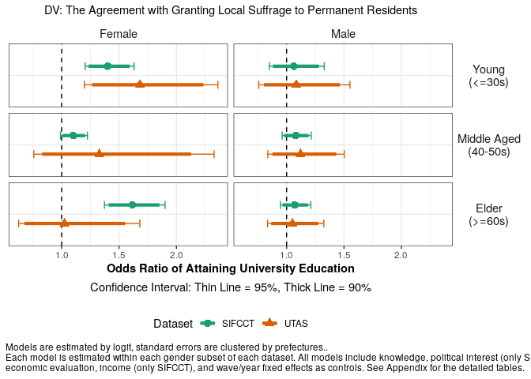
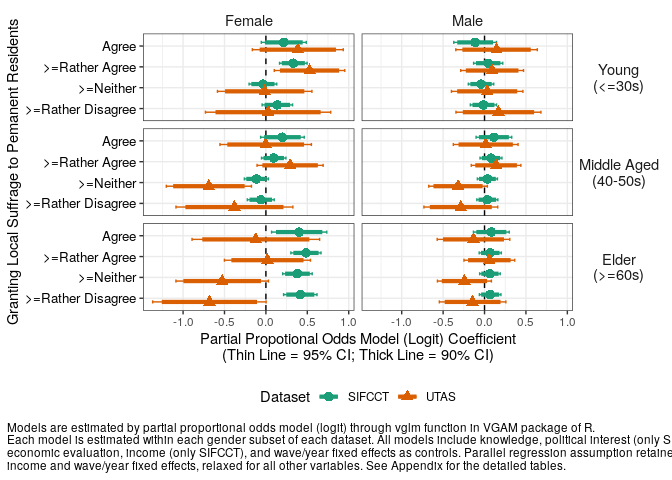
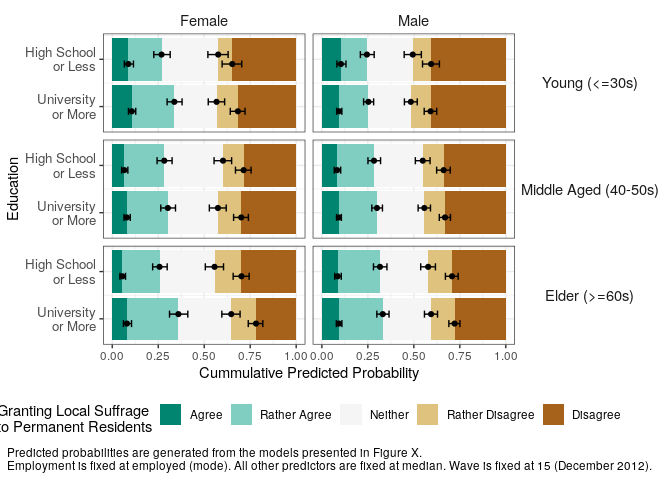
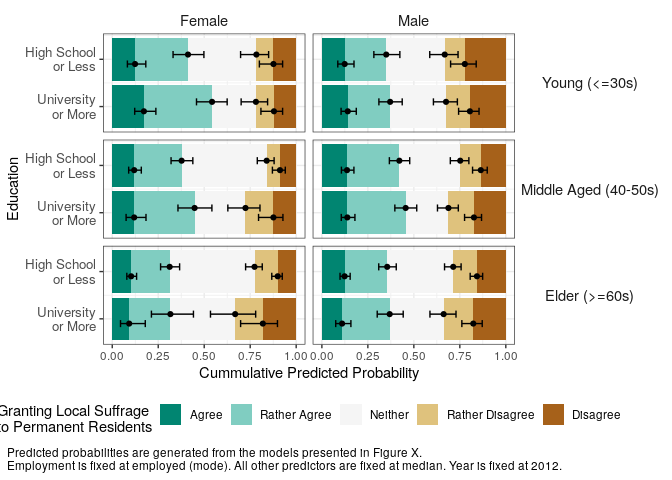

Analysis 1: Main Analysis with Unmatched Data
================
Fan Lu & Gento Kato
Jan 1, 2020

# Preparation

``` r
## Clean Up Space
rm(list=ls())

## Set Working Directory (Automatically) ##
require(rstudioapi); require(rprojroot)
if (rstudioapi::isAvailable()==TRUE) {
  setwd(dirname(rstudioapi::getActiveDocumentContext()$path)); 
} 
projdir <- find_root(has_file("thisishome.txt"))
cat(paste("Working Directory Set to:\n",projdir))
```

    ## Working Directory Set to:
    ##  /home/gentok/Documents/Projects/ForeignerJapan

``` r
setwd(projdir)

## Find Data Directory
datadir1 <- paste0(projdir, "/data/sifcct_latest_v4.rds")
datadir2 <- paste0(projdir, "/data/utas_latest_v4.rds")

## Import Original Data
sifcct <- readRDS(datadir1)
utas <- readRDS(datadir2)

## packages
# devtools::install_github("gentok/estvis")
require(estvis)
require(multiwayvcov)
require(sandwich)
require(lmtest)
require(MASS)
# devtools::install_github("tidyverse/ggplot2") # Need development version (as of Dec 31, 2019)
library(ggplot2)
require(texreg)
require(brant)
require(VGAM)
```

# Regression Formulas

``` r
# Baseline
basemodA <- formula(  ~ edu * agecat + knowledge + polint + employed
                      + evecon + income + lvpr + as.factor(wave)) # sifcct
basemodB <- formula(  ~ edu * agecat + knowledge + employed + evecon + as.factor(year)) # utas
```

# Dropping NAs from Data

``` r
## Drop missing cases
sifcct <- sifcct[complete.cases(sifcct[,c("foreignsuff",
                                          "familialityFT_KOR",
                                          "ideology",
                                          "zip_pref",all.vars(basemodA))]),]
utas <- utas[complete.cases(utas[,c("foreignsuff",
                                    "add_pref",all.vars(basemodB))]),]

## Limit Education to University or over and SHS or under
table(sifcct$edu)
```

    ## 
    ##                <=SHS >SHS & <College(4yr)       >=College(4yr) 
    ##                 7667                 6579                18629

``` r
sifcct <- sifcct[which(sifcct$edu!=">SHS & <College(4yr)"),]
sifcct$edu <- ifelse(sifcct$edu==">=College(4yr)",1,0)
table(utas$edu)
```

    ## 
    ##                <=SHS >SHS & <College(4yr)       >=College(4yr) 
    ##                 2689                 1036                 1188

``` r
utas <- utas[which(utas$edu!=">SHS & <College(4yr)"),]
utas$edu <- ifelse(utas$edu==">=College(4yr)",1,0)

## Factor Variables for Brant Test
sifcct$foreignsuff_fac <- as.factor(sifcct$foreignsuff)
utas$foreignsuff_fac <- as.factor(utas$foreignsuff)
sifcct$wave_fac <- as.factor(sifcct$wave)
utas$year_fac <- as.factor(utas$year)
sifcct$edu_agecat <- paste(sifcct$edu,sifcct$agecat,sep="_")
utas$edu_agecat <- paste(utas$edu,utas$agecat,sep="_")
```

# Suffrage Models

## SIFCCT

``` r
## Ordered Logit
# Female
smof_1 <- polr(update(as.factor(foreignsuff) ~ ., basemodA), data=sifcct[which(sifcct$female==1),], Hess=TRUE)
coeftest(smof_1, vcov.=vcovCL(smof_1,factor(sifcct[which(sifcct$female==1),]$zip_pref)))
```

    ## 
    ## t test of coefficients:
    ## 
    ##                                 Estimate Std. Error  t value  Pr(>|t|)    
    ## edu                             0.178622   0.062568   2.8548  0.004315 ** 
    ## agecatMiddle Aged (40-50s)      0.099723   0.069357   1.4378  0.150517    
    ## agecatElder (>=60s)            -0.019819   0.088394  -0.2242  0.822595    
    ## knowledge                      -0.687497   0.060312 -11.3991 < 2.2e-16 ***
    ## polint                         -0.301507   0.097284  -3.0992  0.001946 ** 
    ## employed                        0.087794   0.045152   1.9444  0.051873 .  
    ## evecon                          0.419757   0.107325   3.9111 9.249e-05 ***
    ## income                          0.010153   0.060952   0.1666  0.867709    
    ## lvpr                           -0.092721   0.068831  -1.3471  0.177984    
    ## as.factor(wave)3               -0.074929   0.106418  -0.7041  0.481389    
    ## as.factor(wave)4                0.059152   0.091233   0.6484  0.516762    
    ## as.factor(wave)5                0.076942   0.124275   0.6191  0.535847    
    ## as.factor(wave)6                0.055765   0.077824   0.7166  0.473664    
    ## as.factor(wave)7                0.193889   0.083734   2.3155  0.020604 *  
    ## as.factor(wave)8                0.092638   0.104448   0.8869  0.375138    
    ## as.factor(wave)9               -0.119582   0.095994  -1.2457  0.212893    
    ## as.factor(wave)10              -0.078144   0.098851  -0.7905  0.429239    
    ## as.factor(wave)11              -0.169203   0.109789  -1.5412  0.123308    
    ## as.factor(wave)12              -0.152438   0.125618  -1.2135  0.224964    
    ## as.factor(wave)13              -0.178020   0.119542  -1.4892  0.136472    
    ## as.factor(wave)14              -0.201662   0.111399  -1.8103  0.070286 .  
    ## as.factor(wave)15              -0.127763   0.106413  -1.2006  0.229920    
    ## as.factor(wave)16              -0.147163   0.089909  -1.6368  0.101703    
    ## as.factor(wave)17              -0.127998   0.143683  -0.8908  0.373038    
    ## as.factor(wave)18              -0.204219   0.121092  -1.6865  0.091736 .  
    ## as.factor(wave)19              -0.112343   0.117036  -0.9599  0.337129    
    ## as.factor(wave)20              -0.167911   0.076634  -2.1911  0.028469 *  
    ## as.factor(wave)21              -0.223580   0.125832  -1.7768  0.075631 .  
    ## as.factor(wave)22              -0.037096   0.115627  -0.3208  0.748350    
    ## edu:agecatMiddle Aged (40-50s) -0.163458   0.089862  -1.8190  0.068943 .  
    ## edu:agecatElder (>=60s)         0.246255   0.091258   2.6985  0.006978 ** 
    ## ---
    ## Signif. codes:  0 '***' 0.001 '**' 0.01 '*' 0.05 '.' 0.1 ' ' 1

``` r
# Male
smom_1 <- polr(update(as.factor(foreignsuff) ~ ., basemodA), data=sifcct[which(sifcct$female==0),], Hess=TRUE)
coeftest(smom_1, vcov.=vcovCL(smom_1,factor(sifcct[which(sifcct$female==0),]$zip_pref)))
```

    ## 
    ## t test of coefficients:
    ## 
    ##                                  Estimate Std. Error  t value  Pr(>|t|)    
    ## edu                            -0.0105943  0.0873181  -0.1213  0.903431    
    ## agecatMiddle Aged (40-50s)      0.2074091  0.0656134   3.1611  0.001575 ** 
    ## agecatElder (>=60s)             0.3788822  0.0628330   6.0300 1.675e-09 ***
    ## knowledge                      -0.6363042  0.0603831 -10.5378 < 2.2e-16 ***
    ## polint                         -0.4317842  0.0788754  -5.4743 4.458e-08 ***
    ## employed                        0.0918711  0.0549651   1.6714  0.094653 .  
    ## evecon                          0.2320527  0.0714252   3.2489  0.001161 ** 
    ## income                          0.1236142  0.0626015   1.9746  0.048328 *  
    ## lvpr                           -0.2366764  0.0581814  -4.0679 4.766e-05 ***
    ## as.factor(wave)3               -0.0935872  0.0968553  -0.9663  0.333930    
    ## as.factor(wave)4                0.0079068  0.0842149   0.0939  0.925199    
    ## as.factor(wave)5               -0.0157308  0.0613527  -0.2564  0.797646    
    ## as.factor(wave)6                0.1173757  0.0853892   1.3746  0.169276    
    ## as.factor(wave)7                0.1837039  0.0897307   2.0473  0.040646 *  
    ## as.factor(wave)8                0.0748506  0.0912069   0.8207  0.411847    
    ## as.factor(wave)9                0.0834895  0.0894425   0.9334  0.350605    
    ## as.factor(wave)10               0.1820084  0.0801305   2.2714  0.023136 *  
    ## as.factor(wave)11              -0.1537240  0.1185927  -1.2962  0.194913    
    ## as.factor(wave)12               0.0489235  0.1129074   0.4333  0.664798    
    ## as.factor(wave)13              -0.0809929  0.0850591  -0.9522  0.341012    
    ## as.factor(wave)14              -0.0536859  0.1024831  -0.5239  0.600389    
    ## as.factor(wave)15               0.0742509  0.1267674   0.5857  0.558068    
    ## as.factor(wave)16               0.0689528  0.0837396   0.8234  0.410282    
    ## as.factor(wave)17               0.0967902  0.0951661   1.0171  0.309137    
    ## as.factor(wave)18               0.0550518  0.0977842   0.5630  0.573448    
    ## as.factor(wave)19               0.0582264  0.1016512   0.5728  0.566784    
    ## as.factor(wave)20              -0.0142286  0.0829539  -0.1715  0.863814    
    ## as.factor(wave)21               0.0067410  0.1265758   0.0533  0.957528    
    ## as.factor(wave)22               0.0730546  0.0841007   0.8687  0.385048    
    ## edu:agecatMiddle Aged (40-50s)  0.0747236  0.0766556   0.9748  0.329676    
    ## edu:agecatElder (>=60s)         0.0794483  0.0839711   0.9461  0.344092    
    ## ---
    ## Signif. codes:  0 '***' 0.001 '**' 0.01 '*' 0.05 '.' 0.1 ' ' 1

``` r
## Linear Models for robustness Check
# Female
smof_2 <- lm(update(foreignsuff ~ ., basemodA), data=sifcct[which(sifcct$female==1),])
coeftest(smof_2, vcov.=vcovCL(smof_2,factor(sifcct[which(sifcct$female==1),]$zip_pref)))
```

    ## 
    ## t test of coefficients:
    ## 
    ##                                   Estimate  Std. Error  t value  Pr(>|t|)    
    ## (Intercept)                     0.51308986  0.01701044  30.1632 < 2.2e-16 ***
    ## edu                             0.02756948  0.01068514   2.5802 0.0098894 ** 
    ## agecatMiddle Aged (40-50s)      0.01719338  0.01263460   1.3608 0.1736024    
    ## agecatElder (>=60s)            -0.00432448  0.01557515  -0.2777 0.7812850    
    ## knowledge                      -0.12861557  0.01043403 -12.3265 < 2.2e-16 ***
    ## polint                         -0.06292493  0.01630940  -3.8582 0.0001149 ***
    ## employed                        0.01644425  0.00806314   2.0394 0.0414332 *  
    ## evecon                          0.07134280  0.01867040   3.8212 0.0001336 ***
    ## income                          0.00082767  0.01072481   0.0772 0.9384872    
    ## lvpr                           -0.01824903  0.01237115  -1.4751 0.1402099    
    ## as.factor(wave)3               -0.01030809  0.01864793  -0.5528 0.5804309    
    ## as.factor(wave)4                0.01276953  0.01564348   0.8163 0.4143571    
    ## as.factor(wave)5                0.01763773  0.02075051   0.8500 0.3953510    
    ## as.factor(wave)6                0.00924223  0.01366142   0.6765 0.4987262    
    ## as.factor(wave)7                0.03499991  0.01375274   2.5449 0.0109446 *  
    ## as.factor(wave)8                0.02096190  0.01823893   1.1493 0.2504625    
    ## as.factor(wave)9               -0.01851105  0.01626472  -1.1381 0.2551019    
    ## as.factor(wave)10              -0.01229252  0.01692994  -0.7261 0.4678060    
    ## as.factor(wave)11              -0.02483607  0.01996050  -1.2443 0.2134329    
    ## as.factor(wave)12              -0.02599777  0.02138488  -1.2157 0.2241252    
    ## as.factor(wave)13              -0.02801691  0.01999652  -1.4011 0.1612186    
    ## as.factor(wave)14              -0.03391470  0.01985130  -1.7084 0.0875865 .  
    ## as.factor(wave)15              -0.01877393  0.01966218  -0.9548 0.3396897    
    ## as.factor(wave)16              -0.02291200  0.01600921  -1.4312 0.1524112    
    ## as.factor(wave)17              -0.02058326  0.02434948  -0.8453 0.3979490    
    ## as.factor(wave)18              -0.03475582  0.02151671  -1.6153 0.1062788    
    ## as.factor(wave)19              -0.01895483  0.02079598  -0.9115 0.3620721    
    ## as.factor(wave)20              -0.02591190  0.01326109  -1.9540 0.0507318 .  
    ## as.factor(wave)21              -0.03401598  0.02313938  -1.4700 0.1415807    
    ## as.factor(wave)22              -0.00750760  0.01953189  -0.3844 0.7007076    
    ## edu:agecatMiddle Aged (40-50s) -0.02613861  0.01560032  -1.6755 0.0938644 .  
    ## edu:agecatElder (>=60s)         0.04489386  0.01593845   2.8167 0.0048616 ** 
    ## ---
    ## Signif. codes:  0 '***' 0.001 '**' 0.01 '*' 0.05 '.' 0.1 ' ' 1

``` r
# Male
smom_2 <- lm(update(foreignsuff ~ ., basemodA), data=sifcct[which(sifcct$female==0),])
coeftest(smom_2, vcov.=vcovCL(smom_2,factor(sifcct[which(sifcct$female==0),]$zip_pref)))
```

    ## 
    ## t test of coefficients:
    ## 
    ##                                   Estimate  Std. Error  t value  Pr(>|t|)    
    ## (Intercept)                     0.45281732  0.01985792  22.8029 < 2.2e-16 ***
    ## edu                            -0.00244087  0.01613150  -0.1513  0.879732    
    ## agecatMiddle Aged (40-50s)      0.03618410  0.01262929   2.8651  0.004174 ** 
    ## agecatElder (>=60s)             0.06625670  0.01235837   5.3613 8.376e-08 ***
    ## knowledge                      -0.12312202  0.01214628 -10.1366 < 2.2e-16 ***
    ## polint                         -0.07416014  0.01415883  -5.2377 1.646e-07 ***
    ## employed                        0.01639708  0.01037528   1.5804  0.114035    
    ## evecon                          0.03995632  0.01314955   3.0386  0.002381 ** 
    ## income                          0.02302539  0.01193423   1.9294  0.053704 .  
    ## lvpr                           -0.04501810  0.01100716  -4.0899 4.336e-05 ***
    ## as.factor(wave)3               -0.01925578  0.01848930  -1.0415  0.297680    
    ## as.factor(wave)4                0.00068979  0.01670771   0.0413  0.967069    
    ## as.factor(wave)5               -0.00261636  0.01107946  -0.2361  0.813323    
    ## as.factor(wave)6                0.02228764  0.01596342   1.3962  0.162682    
    ## as.factor(wave)7                0.03508297  0.01764551   1.9882  0.046805 *  
    ## as.factor(wave)8                0.01355530  0.01708353   0.7935  0.427515    
    ## as.factor(wave)9                0.01339200  0.01667588   0.8031  0.421943    
    ## as.factor(wave)10               0.03339428  0.01515967   2.2028  0.027620 *  
    ## as.factor(wave)11              -0.02847856  0.02173480  -1.3103  0.190121    
    ## as.factor(wave)12               0.00862983  0.02166129   0.3984  0.690341    
    ## as.factor(wave)13              -0.01624487  0.01605485  -1.0118  0.311631    
    ## as.factor(wave)14              -0.00887112  0.01911544  -0.4641  0.642596    
    ## as.factor(wave)15               0.01312557  0.02386445   0.5500  0.582323    
    ## as.factor(wave)16               0.01478135  0.01557533   0.9490  0.342623    
    ## as.factor(wave)17               0.02061011  0.01818980   1.1331  0.257206    
    ## as.factor(wave)18               0.01112325  0.01832526   0.6070  0.543866    
    ## as.factor(wave)19               0.01195866  0.01901928   0.6288  0.529512    
    ## as.factor(wave)20              -0.00359302  0.01541510  -0.2331  0.815699    
    ## as.factor(wave)21               0.00183213  0.02425088   0.0755  0.939779    
    ## as.factor(wave)22               0.01393474  0.01583067   0.8802  0.378744    
    ## edu:agecatMiddle Aged (40-50s)  0.01502652  0.01447985   1.0378  0.299400    
    ## edu:agecatElder (>=60s)         0.01520538  0.01577625   0.9638  0.335153    
    ## ---
    ## Signif. codes:  0 '***' 0.001 '**' 0.01 '*' 0.05 '.' 0.1 ' ' 1

``` r
## Brant Test for Parallel Regression Assumption (Violation Found)
require(brant)
smof_1b <- polr(foreignsuff_fac ~ edu_agecat + knowledge + polint + 
                  employed + evecon + income + lvpr + wave_fac, 
               data=sifcct[which(sifcct$female==1),], Hess=TRUE)
(smof_1bt <- brant(smof_1b, by.var=T))
```

    ## -------------------------------------------- 
    ## Test for X2  df  probability 
    ## -------------------------------------------- 
    ## Omnibus      703.71  93  0
    ## edu_agecat   105.15  15  0
    ## knowledge    175.76  3   0
    ## polint       169.69  3   0
    ## employed 0.95    3   0.81
    ## evecon       7.79    3   0.05
    ## income       4.31    3   0.23
    ## lvpr     8.72    3   0.03
    ## wave_fac 62.7    60  0.38
    ## -------------------------------------------- 
    ## 
    ## H0: Parallel Regression Assumption holds

    ## Warning in brant(smof_1b, by.var = T): 4 combinations in table(dv,ivs) do not occur. Because of that, the test results might be invalid.

    ##                     X2 df  probability
    ## Omnibus    703.7068967 93 1.597242e-94
    ## edu_agecat 105.1484018 15 1.368524e-15
    ## knowledge  175.7607382  3 7.259251e-38
    ## polint     169.6870649  3 1.486701e-36
    ## employed     0.9462629  3 8.142516e-01
    ## evecon       7.7866192  3 5.063376e-02
    ## income       4.3110643  3 2.297748e-01
    ## lvpr         8.7153168  3 3.332543e-02
    ## wave_fac    62.6969452 60 3.808369e-01

``` r
smom_1b <- polr(foreignsuff_fac ~ edu_agecat + knowledge + polint + 
                  employed + evecon + income + lvpr + wave_fac, 
               data=sifcct[which(sifcct$female==0),], Hess=TRUE)
(smom_1bt <- brant(smom_1b, by.var=T))
```

    ## -------------------------------------------- 
    ## Test for X2  df  probability 
    ## -------------------------------------------- 
    ## Omnibus      830 93  0
    ## edu_agecat   84.97   15  0
    ## knowledge    191 3   0
    ## polint       300.56  3   0
    ## employed 1.5 3   0.68
    ## evecon       29.76   3   0
    ## income       5.08    3   0.17
    ## lvpr     4.94    3   0.18
    ## wave_fac 56.33   60  0.61
    ## -------------------------------------------- 
    ## 
    ## H0: Parallel Regression Assumption holds

    ## Warning in brant(smom_1b, by.var = T): 3 combinations in table(dv,ivs) do not occur. Because of that, the test results might be invalid.

    ##                    X2 df   probability
    ## Omnibus    830.003656 93 1.072878e-118
    ## edu_agecat  84.974169 15  8.505418e-12
    ## knowledge  191.000199  3  3.711478e-41
    ## polint     300.555625  3  7.542506e-65
    ## employed     1.496422  3  6.830965e-01
    ## evecon      29.760825  3  1.549534e-06
    ## income       5.076264  3  1.662971e-01
    ## lvpr         4.938097  3  1.763865e-01
    ## wave_fac    56.328701 60  6.106492e-01

``` r
## Generalized Ordered Logit of Foreigner's Suffrage
require(VGAM)
# Female
smof_3 <- vglm(update(foreignsuff*4+1 ~ ., basemodA), 
               data=sifcct[which(sifcct$female==1),], 
               family=cumulative(link="logit", 
                                 parallel=TRUE ~ -1 + employed + income + as.factor(wave), 
                                 reverse=TRUE))
smof_3_sum <- summary(smof_3) 
smof_3_sum
```

    ## 
    ## Call:
    ## vglm(formula = update(foreignsuff * 4 + 1 ~ ., basemodA), family = cumulative(link = "logit", 
    ##     parallel = TRUE ~ -1 + employed + income + as.factor(wave), 
    ##     reverse = TRUE), data = sifcct[which(sifcct$female == 1), 
    ##     ])
    ## 
    ## Pearson residuals:
    ##                        Min      1Q  Median      3Q   Max
    ## logitlink(P[Y>=2]) -3.7751  0.1321  0.2522  0.3742 3.248
    ## logitlink(P[Y>=3]) -3.4300 -0.6043  0.3200  0.6899 2.611
    ## logitlink(P[Y>=4]) -2.4761 -0.8220 -0.2798  0.5855 2.302
    ## logitlink(P[Y>=5]) -0.9219 -0.2937 -0.1930 -0.1435 5.263
    ## 
    ## Coefficients: 
    ##                                   Estimate Std. Error z value Pr(>|z|)    
    ## (Intercept):1                     2.108503   0.137590  15.325  < 2e-16 ***
    ## (Intercept):2                     1.432696   0.128023  11.191  < 2e-16 ***
    ## (Intercept):3                    -1.085287   0.127314  -8.525  < 2e-16 ***
    ## (Intercept):4                    -2.707243   0.180668 -14.985  < 2e-16 ***
    ## edu:1                             0.138172   0.093772   1.473 0.140617    
    ## edu:2                            -0.036233   0.085198  -0.425 0.670631    
    ## edu:3                             0.330934   0.084940   3.896 9.78e-05 ***
    ## edu:4                             0.216046   0.138615   1.559 0.119090    
    ## agecatMiddle Aged (40-50s):1      0.286257   0.103768   2.759 0.005804 ** 
    ## agecatMiddle Aged (40-50s):2      0.108816   0.093449   1.164 0.244244    
    ## agecatMiddle Aged (40-50s):3      0.073640   0.093209   0.790 0.429497    
    ## agecatMiddle Aged (40-50s):4     -0.305153   0.161109  -1.894 0.058215 .  
    ## agecatElder (>=60s):1             0.229778   0.103886   2.212 0.026978 *  
    ## agecatElder (>=60s):2            -0.080899   0.094289  -0.858 0.390899    
    ## agecatElder (>=60s):3            -0.056348   0.097152  -0.580 0.561920    
    ## agecatElder (>=60s):4            -0.497239   0.171210  -2.904 0.003681 ** 
    ## knowledge:1                      -1.188448   0.084570 -14.053  < 2e-16 ***
    ## knowledge:2                      -1.034883   0.076016 -13.614  < 2e-16 ***
    ## knowledge:3                      -0.211126   0.077218  -2.734 0.006254 ** 
    ## knowledge:4                       0.022775   0.131343   0.173 0.862338    
    ## polint:1                         -1.068926   0.101420 -10.540  < 2e-16 ***
    ## polint:2                         -0.719602   0.089003  -8.085 6.21e-16 ***
    ## polint:3                          0.229131   0.088496   2.589 0.009620 ** 
    ## polint:4                          0.571213   0.152705   3.741 0.000184 ***
    ## employed                          0.094026   0.038160   2.464 0.013740 *  
    ## evecon:1                          0.523301   0.099976   5.234 1.66e-07 ***
    ## evecon:2                          0.439162   0.090187   4.869 1.12e-06 ***
    ## evecon:3                          0.388311   0.091408   4.248 2.16e-05 ***
    ## evecon:4                          0.030360   0.152883   0.199 0.842589    
    ## income                            0.012882   0.068193   0.189 0.850164    
    ## lvpr:1                           -0.226048   0.075946  -2.976 0.002916 ** 
    ## lvpr:2                           -0.113866   0.068595  -1.660 0.096917 .  
    ## lvpr:3                            0.002113   0.069295   0.030 0.975675    
    ## lvpr:4                           -0.038051   0.116838  -0.326 0.744670    
    ## as.factor(wave)3                 -0.073437   0.118958  -0.617 0.537011    
    ## as.factor(wave)4                  0.062655   0.115070   0.544 0.586101    
    ## as.factor(wave)5                  0.075573   0.117203   0.645 0.519053    
    ## as.factor(wave)6                  0.046708   0.114367   0.408 0.682980    
    ## as.factor(wave)7                  0.204473   0.118841   1.721 0.085331 .  
    ## as.factor(wave)8                  0.106332   0.118516   0.897 0.369614    
    ## as.factor(wave)9                 -0.138573   0.118529  -1.169 0.242363    
    ## as.factor(wave)10                -0.057458   0.121856  -0.472 0.637264    
    ## as.factor(wave)11                -0.167691   0.118080  -1.420 0.155563    
    ## as.factor(wave)12                -0.120802   0.119269  -1.013 0.311129    
    ## as.factor(wave)13                -0.174814   0.120849  -1.447 0.148025    
    ## as.factor(wave)14                -0.201238   0.122253  -1.646 0.099747 .  
    ## as.factor(wave)15                -0.128223   0.118590  -1.081 0.279596    
    ## as.factor(wave)16                -0.134293   0.118308  -1.135 0.256326    
    ## as.factor(wave)17                -0.121074   0.119661  -1.012 0.311632    
    ## as.factor(wave)18                -0.210785   0.117851  -1.789 0.073683 .  
    ## as.factor(wave)19                -0.122686   0.119974  -1.023 0.306496    
    ## as.factor(wave)20                -0.163494   0.119123  -1.372 0.169912    
    ## as.factor(wave)21                -0.229976   0.117992  -1.949 0.051285 .  
    ## as.factor(wave)22                -0.039061   0.116948  -0.334 0.738381    
    ## edu:agecatMiddle Aged (40-50s):1 -0.199919   0.122394  -1.633 0.102384    
    ## edu:agecatMiddle Aged (40-50s):2 -0.078799   0.110232  -0.715 0.474704    
    ## edu:agecatMiddle Aged (40-50s):3 -0.236499   0.110500  -2.140 0.032333 *  
    ## edu:agecatMiddle Aged (40-50s):4 -0.016516   0.188971  -0.087 0.930354    
    ## edu:agecatElder (>=60s):1         0.277028   0.137231   2.019 0.043519 *  
    ## edu:agecatElder (>=60s):2         0.416965   0.122601   3.401 0.000671 ***
    ## edu:agecatElder (>=60s):3         0.152590   0.123765   1.233 0.217613    
    ## edu:agecatElder (>=60s):4         0.185550   0.216723   0.856 0.391908    
    ## ---
    ## Signif. codes:  0 '***' 0.001 '**' 0.01 '*' 0.05 '.' 0.1 ' ' 1
    ## 
    ## Names of linear predictors: logitlink(P[Y>=2]), logitlink(P[Y>=3]), logitlink(P[Y>=4]), logitlink(P[Y>=5])
    ## 
    ## Residual deviance: 28934.94 on 39678 degrees of freedom
    ## 
    ## Log-likelihood: -14467.47 on 39678 degrees of freedom
    ## 
    ## Number of Fisher scoring iterations: 6 
    ## 
    ## No Hauck-Donner effect found in any of the estimates
    ## 
    ## 
    ## Exponentiated coefficients:
    ##                            edu:1                            edu:2                            edu:3                            edu:4 
    ##                        1.1481734                        0.9644154                        1.3922686                        1.2411592 
    ##     agecatMiddle Aged (40-50s):1     agecatMiddle Aged (40-50s):2     agecatMiddle Aged (40-50s):3     agecatMiddle Aged (40-50s):4 
    ##                        1.3314348                        1.1149574                        1.0764192                        0.7370108 
    ##            agecatElder (>=60s):1            agecatElder (>=60s):2            agecatElder (>=60s):3            agecatElder (>=60s):4 
    ##                        1.2583211                        0.9222869                        0.9452105                        0.6082076 
    ##                      knowledge:1                      knowledge:2                      knowledge:3                      knowledge:4 
    ##                        0.3046938                        0.3552680                        0.8096718                        1.0230361 
    ##                         polint:1                         polint:2                         polint:3                         polint:4 
    ##                        0.3433771                        0.4869458                        1.2575071                        1.7704128 
    ##                         employed                         evecon:1                         evecon:2                         evecon:3 
    ##                        1.0985880                        1.6875896                        1.5514070                        1.4744885 
    ##                         evecon:4                           income                           lvpr:1                           lvpr:2 
    ##                        1.0308255                        1.0129656                        0.7976796                        0.8923774 
    ##                           lvpr:3                           lvpr:4                 as.factor(wave)3                 as.factor(wave)4 
    ##                        1.0021151                        0.9626635                        0.9291946                        1.0646596 
    ##                 as.factor(wave)5                 as.factor(wave)6                 as.factor(wave)7                 as.factor(wave)8 
    ##                        1.0785019                        1.0478157                        1.2268781                        1.1121909 
    ##                 as.factor(wave)9                as.factor(wave)10                as.factor(wave)11                as.factor(wave)12 
    ##                        0.8705998                        0.9441611                        0.8456148                        0.8862096 
    ##                as.factor(wave)13                as.factor(wave)14                as.factor(wave)15                as.factor(wave)16 
    ##                        0.8396135                        0.8177174                        0.8796570                        0.8743335 
    ##                as.factor(wave)17                as.factor(wave)18                as.factor(wave)19                as.factor(wave)20 
    ##                        0.8859687                        0.8099478                        0.8845415                        0.8491716 
    ##                as.factor(wave)21                as.factor(wave)22 edu:agecatMiddle Aged (40-50s):1 edu:agecatMiddle Aged (40-50s):2 
    ##                        0.7945524                        0.9616925                        0.8187974                        0.9242255 
    ## edu:agecatMiddle Aged (40-50s):3 edu:agecatMiddle Aged (40-50s):4        edu:agecatElder (>=60s):1        edu:agecatElder (>=60s):2 
    ##                        0.7893869                        0.9836198                        1.3192034                        1.5173490 
    ##        edu:agecatElder (>=60s):3        edu:agecatElder (>=60s):4 
    ##                        1.1648474                        1.2038803

``` r
# Male
smom_3 <- vglm(update(foreignsuff*4+1 ~ ., basemodA), 
               data=sifcct[which(sifcct$female==0),], 
               family=cumulative(link="logit", 
                                 parallel=TRUE ~ -1 + employed + income + as.factor(wave), 
                                 reverse=TRUE))
smom_3_sum <- summary(smom_3) 
smom_3_sum
```

    ## 
    ## Call:
    ## vglm(formula = update(foreignsuff * 4 + 1 ~ ., basemodA), family = cumulative(link = "logit", 
    ##     parallel = TRUE ~ -1 + employed + income + as.factor(wave), 
    ##     reverse = TRUE), data = sifcct[which(sifcct$female == 0), 
    ##     ])
    ## 
    ## Pearson residuals:
    ##                       Min      1Q  Median      3Q   Max
    ## logitlink(P[Y>=2]) -2.670 -0.9633  0.2801  0.4756 3.597
    ## logitlink(P[Y>=3]) -2.799 -0.5306  0.2414  0.6249 2.449
    ## logitlink(P[Y>=4]) -1.869 -0.5199 -0.2622  0.5790 2.636
    ## logitlink(P[Y>=5]) -1.546 -0.2817 -0.1748 -0.1455 5.317
    ## 
    ## Coefficients: 
    ##                                   Estimate Std. Error z value Pr(>|z|)    
    ## (Intercept):1                     1.551237   0.119881  12.940  < 2e-16 ***
    ## (Intercept):2                     0.855159   0.115889   7.379 1.59e-13 ***
    ## (Intercept):3                    -1.329493   0.124520 -10.677  < 2e-16 ***
    ## (Intercept):4                    -2.858798   0.171799 -16.640  < 2e-16 ***
    ## edu:1                            -0.013172   0.080703  -0.163 0.870348    
    ## edu:2                            -0.042327   0.078327  -0.540 0.588927    
    ## edu:3                             0.044085   0.089789   0.491 0.623434    
    ## edu:4                            -0.113363   0.131571  -0.862 0.388903    
    ## agecatMiddle Aged (40-50s):1      0.291675   0.092373   3.158 0.001591 ** 
    ## agecatMiddle Aged (40-50s):2      0.218122   0.088833   2.455 0.014072 *  
    ## agecatMiddle Aged (40-50s):3      0.198970   0.100474   1.980 0.047669 *  
    ## agecatMiddle Aged (40-50s):4     -0.243164   0.153557  -1.584 0.113298    
    ## agecatElder (>=60s):1             0.503515   0.092906   5.420 5.97e-08 ***
    ## agecatElder (>=60s):2             0.337572   0.089563   3.769 0.000164 ***
    ## agecatElder (>=60s):3             0.353520   0.100594   3.514 0.000441 ***
    ## agecatElder (>=60s):4            -0.205615   0.151908  -1.354 0.175878    
    ## knowledge:1                      -1.019152   0.066829 -15.250  < 2e-16 ***
    ## knowledge:2                      -0.905883   0.063305 -14.310  < 2e-16 ***
    ## knowledge:3                      -0.186623   0.068435  -2.727 0.006391 ** 
    ## knowledge:4                       0.032124   0.107562   0.299 0.765202    
    ## polint:1                         -1.038006   0.071736 -14.470  < 2e-16 ***
    ## polint:2                         -0.733518   0.067567 -10.856  < 2e-16 ***
    ## polint:3                          0.194067   0.073842   2.628 0.008585 ** 
    ## polint:4                          0.928707   0.121332   7.654 1.94e-14 ***
    ## employed                          0.096855   0.042402   2.284 0.022360 *  
    ## evecon:1                          0.317257   0.067350   4.711 2.47e-06 ***
    ## evecon:2                          0.294093   0.065228   4.509 6.52e-06 ***
    ## evecon:3                          0.215325   0.070571   3.051 0.002279 ** 
    ## evecon:4                         -0.198937   0.107419  -1.852 0.064029 .  
    ## income                            0.127402   0.055223   2.307 0.021053 *  
    ## lvpr:1                           -0.278763   0.051473  -5.416 6.10e-08 ***
    ## lvpr:2                           -0.219898   0.049955  -4.402 1.07e-05 ***
    ## lvpr:3                           -0.207962   0.055322  -3.759 0.000171 ***
    ## lvpr:4                           -0.313194   0.087487  -3.580 0.000344 ***
    ## as.factor(wave)3                 -0.094859   0.092348  -1.027 0.304335    
    ## as.factor(wave)4                 -0.003219   0.090685  -0.035 0.971683    
    ## as.factor(wave)5                 -0.017831   0.091868  -0.194 0.846101    
    ## as.factor(wave)6                  0.103560   0.090743   1.141 0.253771    
    ## as.factor(wave)7                  0.170260   0.091563   1.859 0.062957 .  
    ## as.factor(wave)8                  0.064887   0.093210   0.696 0.486339    
    ## as.factor(wave)9                  0.074467   0.092824   0.802 0.422412    
    ## as.factor(wave)10                 0.186214   0.093369   1.994 0.046108 *  
    ## as.factor(wave)11                -0.161643   0.094427  -1.712 0.086927 .  
    ## as.factor(wave)12                 0.043436   0.094708   0.459 0.646499    
    ## as.factor(wave)13                -0.090585   0.094951  -0.954 0.340074    
    ## as.factor(wave)14                -0.055557   0.093513  -0.594 0.552439    
    ## as.factor(wave)15                 0.065005   0.092602   0.702 0.482692    
    ## as.factor(wave)16                 0.063178   0.093718   0.674 0.500229    
    ## as.factor(wave)17                 0.092533   0.093967   0.985 0.324751    
    ## as.factor(wave)18                 0.045963   0.095490   0.481 0.630279    
    ## as.factor(wave)19                 0.039738   0.094589   0.420 0.674404    
    ## as.factor(wave)20                -0.019947   0.096216  -0.207 0.835765    
    ## as.factor(wave)21                -0.008439   0.096079  -0.088 0.930006    
    ## as.factor(wave)22                 0.074742   0.095785   0.780 0.435206    
    ## edu:agecatMiddle Aged (40-50s):1  0.047153   0.102004   0.462 0.643888    
    ## edu:agecatMiddle Aged (40-50s):2  0.077097   0.098323   0.784 0.432973    
    ## edu:agecatMiddle Aged (40-50s):3  0.033791   0.110838   0.305 0.760466    
    ## edu:agecatMiddle Aged (40-50s):4  0.226587   0.169319   1.338 0.180823    
    ## edu:agecatElder (>=60s):1         0.081189   0.103474   0.785 0.432667    
    ## edu:agecatElder (>=60s):2         0.107643   0.099755   1.079 0.280555    
    ## edu:agecatElder (>=60s):3         0.025124   0.111693   0.225 0.822027    
    ## edu:agecatElder (>=60s):4         0.195654   0.170271   1.149 0.250524    
    ## ---
    ## Signif. codes:  0 '***' 0.001 '**' 0.01 '*' 0.05 '.' 0.1 ' ' 1
    ## 
    ## Names of linear predictors: logitlink(P[Y>=2]), logitlink(P[Y>=3]), logitlink(P[Y>=4]), logitlink(P[Y>=5])
    ## 
    ## Residual deviance: 47334.98 on 65242 degrees of freedom
    ## 
    ## Log-likelihood: -23667.49 on 65242 degrees of freedom
    ## 
    ## Number of Fisher scoring iterations: 5 
    ## 
    ## No Hauck-Donner effect found in any of the estimates
    ## 
    ## 
    ## Exponentiated coefficients:
    ##                            edu:1                            edu:2                            edu:3                            edu:4 
    ##                        0.9869143                        0.9585561                        1.0450714                        0.8928269 
    ##     agecatMiddle Aged (40-50s):1     agecatMiddle Aged (40-50s):2     agecatMiddle Aged (40-50s):3     agecatMiddle Aged (40-50s):4 
    ##                        1.3386672                        1.2437389                        1.2201453                        0.7841431 
    ##            agecatElder (>=60s):1            agecatElder (>=60s):2            agecatElder (>=60s):3            agecatElder (>=60s):4 
    ##                        1.6545261                        1.4015402                        1.4240721                        0.8141462 
    ##                      knowledge:1                      knowledge:2                      knowledge:3                      knowledge:4 
    ##                        0.3609008                        0.4041849                        0.8297566                        1.0326458 
    ##                         polint:1                         polint:2                         polint:3                         polint:4 
    ##                        0.3541602                        0.4802164                        1.2141774                        2.5312332 
    ##                         employed                         evecon:1                         evecon:2                         evecon:3 
    ##                        1.1017006                        1.3733550                        1.3419089                        1.2402644 
    ##                         evecon:4                           income                           lvpr:1                           lvpr:2 
    ##                        0.8196012                        1.1358739                        0.7567190                        0.8026004 
    ##                           lvpr:3                           lvpr:4                 as.factor(wave)3                 as.factor(wave)4 
    ##                        0.8122375                        0.7311084                        0.9095014                        0.9967861 
    ##                 as.factor(wave)5                 as.factor(wave)6                 as.factor(wave)7                 as.factor(wave)8 
    ##                        0.9823269                        1.1091119                        1.1856129                        1.0670389 
    ##                 as.factor(wave)9                as.factor(wave)10                as.factor(wave)11                as.factor(wave)12 
    ##                        1.0773102                        1.2046803                        0.8507449                        1.0443933 
    ##                as.factor(wave)13                as.factor(wave)14                as.factor(wave)15                as.factor(wave)16 
    ##                        0.9133963                        0.9459581                        1.0671641                        1.0652167 
    ##                as.factor(wave)17                as.factor(wave)18                as.factor(wave)19                as.factor(wave)20 
    ##                        1.0969496                        1.0470352                        1.0405380                        0.9802508 
    ##                as.factor(wave)21                as.factor(wave)22 edu:agecatMiddle Aged (40-50s):1 edu:agecatMiddle Aged (40-50s):2 
    ##                        0.9915962                        1.0776065                        1.0482827                        1.0801465 
    ## edu:agecatMiddle Aged (40-50s):3 edu:agecatMiddle Aged (40-50s):4        edu:agecatElder (>=60s):1        edu:agecatElder (>=60s):2 
    ##                        1.0343686                        1.2543111                        1.0845760                        1.1136499 
    ##        edu:agecatElder (>=60s):3        edu:agecatElder (>=60s):4 
    ##                        1.0254422                        1.2161060

``` r
## Logit (>=Rather Agree)
# Female
smof_4 <- glm(update(foreignsuff>=0.75 ~ ., basemodA), 
              data=sifcct[which(sifcct$female==1),],
              family = binomial("logit"))
coeftest(smof_4, vcov.=vcovCL(smof_4,factor(sifcct[which(sifcct$female==1),]$zip_pref)))
```

    ## 
    ## z test of coefficients:
    ## 
    ##                                  Estimate Std. Error z value  Pr(>|z|)    
    ## (Intercept)                    -0.9895784  0.1081828 -9.1473 < 2.2e-16 ***
    ## edu                             0.3376513  0.0773400  4.3658 1.267e-05 ***
    ## agecatMiddle Aged (40-50s)      0.0793812  0.0847707  0.9364 0.3490552    
    ## agecatElder (>=60s)            -0.0492386  0.1095020 -0.4497 0.6529565    
    ## knowledge                      -0.1910556  0.0609425 -3.1350 0.0017184 ** 
    ## polint                          0.2266464  0.1074735  2.1089 0.0349568 *  
    ## employed                        0.0934842  0.0453658  2.0607 0.0393341 *  
    ## evecon                          0.3697796  0.1069254  3.4583 0.0005436 ***
    ## income                         -0.0069900  0.0708050 -0.0987 0.9213592    
    ## lvpr                            0.0028677  0.0675369  0.0425 0.9661315    
    ## as.factor(wave)3               -0.1822830  0.1023024 -1.7818 0.0747811 .  
    ## as.factor(wave)4               -0.0648506  0.1078788 -0.6011 0.5477444    
    ## as.factor(wave)5               -0.0360383  0.1370371 -0.2630 0.7925644    
    ## as.factor(wave)6               -0.0063097  0.1041893 -0.0606 0.9517099    
    ## as.factor(wave)7                0.0956432  0.1053881  0.9075 0.3641250    
    ## as.factor(wave)8               -0.0338297  0.1231136 -0.2748 0.7834816    
    ## as.factor(wave)9               -0.2572040  0.1276721 -2.0146 0.0439501 *  
    ## as.factor(wave)10              -0.0602422  0.1103706 -0.5458 0.5851913    
    ## as.factor(wave)11              -0.4259252  0.1299545 -3.2775 0.0010473 ** 
    ## as.factor(wave)12              -0.1476241  0.1354532 -1.0899 0.2757777    
    ## as.factor(wave)13              -0.2469992  0.1372770 -1.7993 0.0719750 .  
    ## as.factor(wave)14              -0.2770696  0.1204623 -2.3001 0.0214453 *  
    ## as.factor(wave)15              -0.2607770  0.1028857 -2.5346 0.0112567 *  
    ## as.factor(wave)16              -0.2522724  0.1030062 -2.4491 0.0143214 *  
    ## as.factor(wave)17              -0.1581252  0.1602596 -0.9867 0.3237987    
    ## as.factor(wave)18              -0.2858855  0.1574175 -1.8161 0.0693555 .  
    ## as.factor(wave)19              -0.1682716  0.1203117 -1.3986 0.1619238    
    ## as.factor(wave)20              -0.2916149  0.1071835 -2.7207 0.0065143 ** 
    ## as.factor(wave)21              -0.3836220  0.1145735 -3.3483 0.0008132 ***
    ## as.factor(wave)22              -0.0855046  0.1408055 -0.6073 0.5436830    
    ## edu:agecatMiddle Aged (40-50s) -0.2414034  0.1006938 -2.3974 0.0165118 *  
    ## edu:agecatElder (>=60s)         0.1418611  0.1006529  1.4094 0.1587142    
    ## ---
    ## Signif. codes:  0 '***' 0.001 '**' 0.01 '*' 0.05 '.' 0.1 ' ' 1

``` r
# Male
smom_4 <- glm(update(foreignsuff>=0.75 ~ ., basemodA), 
              data=sifcct[which(sifcct$female==0),],
             family = binomial("logit"))
coeftest(smom_4, vcov.=vcovCL(smom_4,factor(sifcct[which(sifcct$female==0),]$zip_pref)))
```

    ## 
    ## z test of coefficients:
    ## 
    ##                                  Estimate Std. Error z value  Pr(>|z|)    
    ## (Intercept)                    -1.2580956  0.1411522 -8.9130 < 2.2e-16 ***
    ## edu                             0.0605065  0.1139156  0.5312 0.5953136    
    ## agecatMiddle Aged (40-50s)      0.2146399  0.1042291  2.0593 0.0394647 *  
    ## agecatElder (>=60s)             0.3635974  0.0954685  3.8086 0.0001398 ***
    ## knowledge                      -0.1570411  0.0886323 -1.7718 0.0764233 .  
    ## polint                          0.1717265  0.0710856  2.4158 0.0157019 *  
    ## employed                        0.0661410  0.0567519  1.1654 0.2438407    
    ## evecon                          0.1750437  0.0772635  2.2655 0.0234795 *  
    ## income                          0.1512346  0.0687273  2.2005 0.0277713 *  
    ## lvpr                           -0.1951758  0.0711227 -2.7442 0.0060657 ** 
    ## as.factor(wave)3               -0.2380106  0.1193448 -1.9943 0.0461181 *  
    ## as.factor(wave)4               -0.0946247  0.1294738 -0.7308 0.4648766    
    ## as.factor(wave)5               -0.1187840  0.0894769 -1.3275 0.1843306    
    ## as.factor(wave)6                0.0211302  0.1229833  0.1718 0.8635841    
    ## as.factor(wave)7                0.1567134  0.1134093  1.3818 0.1670212    
    ## as.factor(wave)8               -0.0069517  0.1158828 -0.0600 0.9521644    
    ## as.factor(wave)9                0.0383397  0.1089593  0.3519 0.7249344    
    ## as.factor(wave)10               0.0523171  0.1040637  0.5027 0.6151461    
    ## as.factor(wave)11              -0.1164623  0.1169673 -0.9957 0.3194041    
    ## as.factor(wave)12              -0.0289141  0.1464947 -0.1974 0.8435354    
    ## as.factor(wave)13              -0.2176552  0.1314318 -1.6560 0.0977155 .  
    ## as.factor(wave)14              -0.1567560  0.1379213 -1.1366 0.2557219    
    ## as.factor(wave)15               0.0164885  0.1555016  0.1060 0.9155549    
    ## as.factor(wave)16               0.0052992  0.0953936  0.0556 0.9556993    
    ## as.factor(wave)17               0.0768975  0.1207243  0.6370 0.5241456    
    ## as.factor(wave)18              -0.0372270  0.1252772 -0.2972 0.7663467    
    ## as.factor(wave)19              -0.0266757  0.1261504 -0.2115 0.8325288    
    ## as.factor(wave)20              -0.0949738  0.1236336 -0.7682 0.4423756    
    ## as.factor(wave)21              -0.1108327  0.1581251 -0.7009 0.4833544    
    ## as.factor(wave)22               0.0484125  0.1222706  0.3959 0.6921454    
    ## edu:agecatMiddle Aged (40-50s)  0.0166003  0.1297477  0.1279 0.8981940    
    ## edu:agecatElder (>=60s)         0.0073996  0.1180870  0.0627 0.9500354    
    ## ---
    ## Signif. codes:  0 '***' 0.001 '**' 0.01 '*' 0.05 '.' 0.1 ' ' 1

## UTAS

``` r
## Ordered Logit
# Female
umof_1 <- polr(update(as.factor(foreignsuff) ~ ., basemodB), 
               data=utas[which(utas$female==1),], Hess=TRUE)
nobs(umof_1)
```

    ## [1] 1756

``` r
coeftest(umof_1, vcov.=vcovCL(umof_1,factor(utas[which(utas$female==1),]$add_pref)))
```

    ## 
    ## t test of coefficients:
    ## 
    ##                                  Estimate Std. Error t value Pr(>|t|)   
    ## edu                             0.3864689  0.1606323  2.4059 0.016235 * 
    ## agecatMiddle Aged (40-50s)      0.0026117  0.1890740  0.0138 0.988981   
    ## agecatElder (>=60s)            -0.2697952  0.1855726 -1.4539 0.146167   
    ## knowledge                      -0.3614677  0.2396397 -1.5084 0.131639   
    ## employed                       -0.0694575  0.1003187 -0.6924 0.488798   
    ## evecon                         -0.5611691  0.2254177 -2.4895 0.012886 * 
    ## as.factor(year)2012            -0.4269513  0.1325479 -3.2211 0.001301 **
    ## as.factor(year)2014            -0.3316302  0.1577600 -2.1021 0.035686 * 
    ## edu:agecatMiddle Aged (40-50s) -0.3884481  0.3694449 -1.0514 0.293204   
    ## edu:agecatElder (>=60s)        -0.6362004  0.2934177 -2.1682 0.030275 * 
    ## ---
    ## Signif. codes:  0 '***' 0.001 '**' 0.01 '*' 0.05 '.' 0.1 ' ' 1

``` r
# Male
umom_1 <- polr(update(as.factor(foreignsuff) ~ ., basemodB), 
               data=utas[which(utas$female==0),], Hess=TRUE)
nobs(umom_1)
```

    ## [1] 2117

``` r
coeftest(umom_1, vcov.=vcovCL(umom_1,factor(utas[which(utas$female==0),]$add_pref)))
```

    ## 
    ## t test of coefficients:
    ## 
    ##                                 Estimate Std. Error t value  Pr(>|t|)    
    ## edu                             0.089754   0.162110  0.5537 0.5798719    
    ## agecatMiddle Aged (40-50s)      0.311092   0.169258  1.8380 0.0662075 .  
    ## agecatElder (>=60s)             0.113767   0.174976  0.6502 0.5156424    
    ## knowledge                      -0.569462   0.212788 -2.6762 0.0075041 ** 
    ## employed                        0.104322   0.113761  0.9170 0.3592328    
    ## evecon                         -0.555140   0.167037 -3.3235 0.0009043 ***
    ## as.factor(year)2012            -0.532170   0.086201 -6.1736 7.989e-10 ***
    ## as.factor(year)2014            -0.294043   0.106830 -2.7524 0.0059662 ** 
    ## edu:agecatMiddle Aged (40-50s) -0.120728   0.186196 -0.6484 0.5168022    
    ## edu:agecatElder (>=60s)        -0.164680   0.203348 -0.8098 0.4181225    
    ## ---
    ## Signif. codes:  0 '***' 0.001 '**' 0.01 '*' 0.05 '.' 0.1 ' ' 1

``` r
## Linear Models for Robustness Check
# Female
umof_2 <- lm(update(foreignsuff ~ ., basemodB), data=utas[which(utas$female==1),])
nobs(umof_2)
```

    ## [1] 1756

``` r
coeftest(umof_2, vcov.=vcovCL(umof_2,factor(utas[which(utas$female==1),]$add_pref)))
```

    ## 
    ## t test of coefficients:
    ## 
    ##                                  Estimate Std. Error t value  Pr(>|t|)    
    ## (Intercept)                     0.6790054  0.0253864 26.7468 < 2.2e-16 ***
    ## edu                             0.0460886  0.0243517  1.8926 0.0585736 .  
    ## agecatMiddle Aged (40-50s)      0.0093736  0.0287925  0.3256 0.7447981    
    ## agecatElder (>=60s)            -0.0315482  0.0276930 -1.1392 0.2547708    
    ## knowledge                      -0.0667842  0.0343517 -1.9441 0.0520398 .  
    ## employed                       -0.0136373  0.0141688 -0.9625 0.3359382    
    ## evecon                         -0.0836351  0.0355662 -2.3515 0.0188067 *  
    ## as.factor(year)2012            -0.0628115  0.0179925 -3.4910 0.0004932 ***
    ## as.factor(year)2014            -0.0489064  0.0234500 -2.0856 0.0371630 *  
    ## edu:agecatMiddle Aged (40-50s) -0.0601728  0.0492871 -1.2209 0.2223028    
    ## edu:agecatElder (>=60s)        -0.0869964  0.0429247 -2.0267 0.0428428 *  
    ## ---
    ## Signif. codes:  0 '***' 0.001 '**' 0.01 '*' 0.05 '.' 0.1 ' ' 1

``` r
# Male
umom_2 <- lm(update(foreignsuff ~ ., basemodB), data=utas[which(utas$female==0),])
nobs(umom_2)
```

    ## [1] 2117

``` r
coeftest(umom_2, vcov.=vcovCL(umom_2,factor(utas[which(utas$female==0),]$add_pref)))
```

    ## 
    ## t test of coefficients:
    ## 
    ##                                 Estimate Std. Error t value  Pr(>|t|)    
    ## (Intercept)                     0.633731   0.029496 21.4850 < 2.2e-16 ***
    ## edu                             0.015248   0.027254  0.5595  0.575891    
    ## agecatMiddle Aged (40-50s)      0.055926   0.028899  1.9352  0.053101 .  
    ## agecatElder (>=60s)             0.022181   0.031063  0.7141  0.475268    
    ## knowledge                      -0.103439   0.035085 -2.9483  0.003231 ** 
    ## employed                        0.017673   0.020742  0.8520  0.394300    
    ## evecon                         -0.090835   0.029443 -3.0851  0.002061 ** 
    ## as.factor(year)2012            -0.095702   0.013989 -6.8410 1.027e-11 ***
    ## as.factor(year)2014            -0.051763   0.018091 -2.8613  0.004260 ** 
    ## edu:agecatMiddle Aged (40-50s) -0.029813   0.032881 -0.9067  0.364663    
    ## edu:agecatElder (>=60s)        -0.032247   0.035196 -0.9162  0.359664    
    ## ---
    ## Signif. codes:  0 '***' 0.001 '**' 0.01 '*' 0.05 '.' 0.1 ' ' 1

``` r
## Brant Test for Parallel Regression Assumption (Violation Found)
require(brant)
umof_1b <- polr(foreignsuff_fac ~ edu_agecat + knowledge + employed + evecon + year_fac, 
               data=utas[which(utas$female==1),], Hess=TRUE)
(umof_1bt <- brant(umof_1b, by.var=T))
```

    ## -------------------------------------------- 
    ## Test for X2  df  probability 
    ## -------------------------------------------- 
    ## Omnibus      72.55   30  0
    ## edu_agecat   43.1    15  0
    ## knowledge    18.71   3   0
    ## employed 3.21    3   0.36
    ## evecon       2.17    3   0.54
    ## year_fac 3.49    6   0.74
    ## -------------------------------------------- 
    ## 
    ## H0: Parallel Regression Assumption holds

    ##                   X2 df  probability
    ## Omnibus    72.553356 30 2.191312e-05
    ## edu_agecat 43.096435 15 1.521142e-04
    ## knowledge  18.708267  3 3.141200e-04
    ## employed    3.213180  3 3.599104e-01
    ## evecon      2.168551  3 5.381694e-01
    ## year_fac    3.492311  6 7.449924e-01

``` r
umom_1b <- polr(foreignsuff_fac ~ edu_agecat + knowledge + employed + evecon + year_fac, 
               data=utas[which(utas$female==0),], Hess=TRUE)
(umom_1bt <- brant(umom_1b, by.var=T))
```

    ## -------------------------------------------- 
    ## Test for X2  df  probability 
    ## -------------------------------------------- 
    ## Omnibus      63.11   30  0
    ## edu_agecat   23.61   15  0.07
    ## knowledge    16.9    3   0
    ## employed 2.04    3   0.56
    ## evecon       4.02    3   0.26
    ## year_fac 14.14   6   0.03
    ## -------------------------------------------- 
    ## 
    ## H0: Parallel Regression Assumption holds

    ##                   X2 df  probability
    ## Omnibus    63.105771 30 0.0003812005
    ## edu_agecat 23.607915 15 0.0720579793
    ## knowledge  16.901429  3 0.0007405092
    ## employed    2.038588  3 0.5644364175
    ## evecon      4.019644  3 0.2593507485
    ## year_fac   14.141067  6 0.0280994537

``` r
## Then Generalized Ordered Logit (Education Only Works to >=Rather Agree)
require(VGAM)
# Female
umof_3 <- vglm(update(foreignsuff*4+1 ~ ., basemodB), 
               data=utas[which(utas$female==1),], 
               family=cumulative(link="logit", 
                                 parallel=TRUE ~ -1 + employed + as.factor(year), 
                                 reverse=TRUE))
umof_3_sum <- summary(umof_3)
umof_3_sum
```

    ## 
    ## Call:
    ## vglm(formula = update(foreignsuff * 4 + 1 ~ ., basemodB), family = cumulative(link = "logit", 
    ##     parallel = TRUE ~ -1 + employed + as.factor(year), reverse = TRUE), 
    ##     data = utas[which(utas$female == 1), ])
    ## 
    ## Pearson residuals:
    ##                        Min      1Q  Median      3Q   Max
    ## logitlink(P[Y>=2]) -5.2688  0.1336  0.1669  0.2250 2.124
    ## logitlink(P[Y>=3]) -4.5626  0.1664  0.2655  0.5260 1.253
    ## logitlink(P[Y>=4]) -1.9088 -0.8793 -0.3127  1.0083 1.812
    ## logitlink(P[Y>=5]) -0.8982 -0.6352 -0.2600 -0.1734 3.466
    ## 
    ## Coefficients: 
    ##                                  Estimate Std. Error z value Pr(>|z|)    
    ## (Intercept):1                     3.39273    0.33939   9.996  < 2e-16 ***
    ## (Intercept):2                     2.40021    0.25762   9.317  < 2e-16 ***
    ## (Intercept):3                     0.27986    0.19754   1.417 0.156547    
    ## (Intercept):4                    -1.29597    0.25545  -5.073 3.91e-07 ***
    ## edu:1                             0.02616    0.38584   0.068 0.945938    
    ## edu:2                            -0.01458    0.29097  -0.050 0.960023    
    ## edu:3                             0.52683    0.21710   2.427 0.015238 *  
    ## edu:4                             0.38516    0.28011   1.375 0.169116    
    ## agecatMiddle Aged (40-50s):1      0.37870    0.34599   1.095 0.273722    
    ## agecatMiddle Aged (40-50s):2      0.36803    0.26287   1.400 0.161507    
    ## agecatMiddle Aged (40-50s):3     -0.14584    0.18497  -0.788 0.430449    
    ## agecatMiddle Aged (40-50s):4     -0.04227    0.25217  -0.168 0.866862    
    ## agecatElder (>=60s):1             0.23199    0.31337   0.740 0.459108    
    ## agecatElder (>=60s):2            -0.05837    0.23785  -0.245 0.806130    
    ## agecatElder (>=60s):3            -0.43378    0.17805  -2.436 0.014838 *  
    ## agecatElder (>=60s):4            -0.21080    0.24195  -0.871 0.383629    
    ## knowledge:1                      -1.74254    0.37101  -4.697 2.64e-06 ***
    ## knowledge:2                      -0.92056    0.27560  -3.340 0.000837 ***
    ## knowledge:3                      -0.10407    0.21966  -0.474 0.635669    
    ## knowledge:4                       0.07931    0.30156   0.263 0.792558    
    ## employed                         -0.06312    0.09793  -0.645 0.519236    
    ## evecon:1                         -0.33103    0.40565  -0.816 0.414468    
    ## evecon:2                         -0.69183    0.30129  -2.296 0.021663 *  
    ## evecon:3                         -0.41302    0.24890  -1.659 0.097040 .  
    ## evecon:4                         -0.87533    0.35542  -2.463 0.013786 *  
    ## as.factor(year)2012              -0.41750    0.10857  -3.845 0.000120 ***
    ## as.factor(year)2014              -0.30891    0.12157  -2.541 0.011053 *  
    ## edu:agecatMiddle Aged (40-50s):1 -0.40620    0.52692  -0.771 0.440769    
    ## edu:agecatMiddle Aged (40-50s):2 -0.67390    0.39109  -1.723 0.084865 .  
    ## edu:agecatMiddle Aged (40-50s):3 -0.23474    0.29685  -0.791 0.429082    
    ## edu:agecatMiddle Aged (40-50s):4 -0.38776    0.39655  -0.978 0.328161    
    ## edu:agecatElder (>=60s):1        -0.70847    0.52070  -1.361 0.173640    
    ## edu:agecatElder (>=60s):2        -0.51313    0.40723  -1.260 0.207651    
    ## edu:agecatElder (>=60s):3        -0.50808    0.34236  -1.484 0.137798    
    ## edu:agecatElder (>=60s):4        -0.50689    0.48238  -1.051 0.293343    
    ## ---
    ## Signif. codes:  0 '***' 0.001 '**' 0.01 '*' 0.05 '.' 0.1 ' ' 1
    ## 
    ## Names of linear predictors: logitlink(P[Y>=2]), logitlink(P[Y>=3]), logitlink(P[Y>=4]), logitlink(P[Y>=5])
    ## 
    ## Residual deviance: 4904.558 on 6989 degrees of freedom
    ## 
    ## Log-likelihood: -2452.279 on 6989 degrees of freedom
    ## 
    ## Number of Fisher scoring iterations: 7 
    ## 
    ## Warning: Hauck-Donner effect detected in the following estimate(s):
    ## '(Intercept):1'
    ## 
    ## 
    ## Exponentiated coefficients:
    ##                            edu:1                            edu:2                            edu:3                            edu:4 
    ##                        1.0265083                        0.9855211                        1.6935547                        1.4698486 
    ##     agecatMiddle Aged (40-50s):1     agecatMiddle Aged (40-50s):2     agecatMiddle Aged (40-50s):3     agecatMiddle Aged (40-50s):4 
    ##                        1.4603878                        1.4448832                        0.8642999                        0.9586066 
    ##            agecatElder (>=60s):1            agecatElder (>=60s):2            agecatElder (>=60s):3            agecatElder (>=60s):4 
    ##                        1.2611108                        0.9432982                        0.6480550                        0.8099398 
    ##                      knowledge:1                      knowledge:2                      knowledge:3                      knowledge:4 
    ##                        0.1750743                        0.3982961                        0.9011662                        1.0825378 
    ##                         employed                         evecon:1                         evecon:2                         evecon:3 
    ##                        0.9388321                        0.7181810                        0.5006576                        0.6616476 
    ##                         evecon:4              as.factor(year)2012              as.factor(year)2014 edu:agecatMiddle Aged (40-50s):1 
    ##                        0.4167232                        0.6586940                        0.7342502                        0.6661787 
    ## edu:agecatMiddle Aged (40-50s):2 edu:agecatMiddle Aged (40-50s):3 edu:agecatMiddle Aged (40-50s):4        edu:agecatElder (>=60s):1 
    ##                        0.5097154                        0.7907802                        0.6785764                        0.4923966 
    ##        edu:agecatElder (>=60s):2        edu:agecatElder (>=60s):3        edu:agecatElder (>=60s):4 
    ##                        0.5986165                        0.6016478                        0.6023657

``` r
# Male
umom_3 <- vglm(update(foreignsuff*4+1 ~ ., basemodB), 
               data=utas[which(utas$female==0),], 
               family=cumulative(link="logit", 
                                 parallel=TRUE ~ -1 + employed + as.factor(year), 
                                 reverse=TRUE))
umom_3_sum <- summary(umom_3)
umom_3_sum
```

    ## 
    ## Call:
    ## vglm(formula = update(foreignsuff * 4 + 1 ~ ., basemodB), family = cumulative(link = "logit", 
    ##     parallel = TRUE ~ -1 + employed + as.factor(year), reverse = TRUE), 
    ##     data = utas[which(utas$female == 0), ])
    ## 
    ## Pearson residuals:
    ##                        Min      1Q  Median      3Q   Max
    ## logitlink(P[Y>=2]) -3.6518  0.1545  0.2114  0.3030 1.994
    ## logitlink(P[Y>=3]) -3.7534 -0.5246  0.2925  0.6915 1.584
    ## logitlink(P[Y>=4]) -1.9009 -0.9845 -0.2681  1.0902 1.803
    ## logitlink(P[Y>=5]) -0.9513 -0.6885 -0.2763 -0.1562 3.156
    ## 
    ## Coefficients: 
    ##                                  Estimate Std. Error z value Pr(>|z|)    
    ## (Intercept):1                     2.30751    0.25137   9.180  < 2e-16 ***
    ## (Intercept):2                     1.76009    0.21825   8.065 7.35e-16 ***
    ## (Intercept):3                     0.07900    0.19543   0.404  0.68604    
    ## (Intercept):4                    -1.25664    0.24138  -5.206 1.93e-07 ***
    ## edu:1                             0.16800    0.26166   0.642  0.52086    
    ## edu:2                             0.03196    0.22021   0.145  0.88460    
    ## edu:3                             0.09180    0.19345   0.475  0.63509    
    ## edu:4                             0.14542    0.25107   0.579  0.56245    
    ## agecatMiddle Aged (40-50s):1      0.59996    0.25628   2.341  0.01923 *  
    ## agecatMiddle Aged (40-50s):2      0.41172    0.21152   1.946  0.05160 .  
    ## agecatMiddle Aged (40-50s):3      0.30148    0.17874   1.687  0.09166 .  
    ## agecatMiddle Aged (40-50s):4      0.11201    0.23363   0.479  0.63165    
    ## agecatElder (>=60s):1             0.43298    0.23124   1.872  0.06114 .  
    ## agecatElder (>=60s):2             0.21660    0.19578   1.106  0.26858    
    ## agecatElder (>=60s):3             0.02332    0.17234   0.135  0.89235    
    ## agecatElder (>=60s):4            -0.00365    0.22560  -0.016  0.98709    
    ## knowledge:1                      -1.20983    0.27180  -4.451 8.54e-06 ***
    ## knowledge:2                      -1.04766    0.22022  -4.757 1.96e-06 ***
    ## knowledge:3                      -0.26008    0.19530  -1.332  0.18296    
    ## knowledge:4                      -0.23556    0.26464  -0.890  0.37341    
    ## employed                          0.10468    0.10322   1.014  0.31052    
    ## evecon:1                         -0.17490    0.28757  -0.608  0.54305    
    ## evecon:2                         -0.51027    0.23630  -2.159  0.03082 *  
    ## evecon:3                         -0.63164    0.21903  -2.884  0.00393 ** 
    ## evecon:4                         -0.68090    0.29645  -2.297  0.02163 *  
    ## as.factor(year)2012              -0.51486    0.09230  -5.578 2.43e-08 ***
    ## as.factor(year)2014              -0.28002    0.10897  -2.570  0.01018 *  
    ## edu:agecatMiddle Aged (40-50s):1 -0.45425    0.34535  -1.315  0.18839    
    ## edu:agecatMiddle Aged (40-50s):2 -0.35163    0.28376  -1.239  0.21528    
    ## edu:agecatMiddle Aged (40-50s):3  0.04759    0.24567   0.194  0.84639    
    ## edu:agecatMiddle Aged (40-50s):4 -0.13138    0.31964  -0.411  0.68106    
    ## edu:agecatElder (>=60s):1        -0.31207    0.33070  -0.944  0.34534    
    ## edu:agecatElder (>=60s):2        -0.27481    0.27472  -1.000  0.31714    
    ## edu:agecatElder (>=60s):3        -0.03372    0.24772  -0.136  0.89174    
    ## edu:agecatElder (>=60s):4        -0.27857    0.33518  -0.831  0.40592    
    ## ---
    ## Signif. codes:  0 '***' 0.001 '**' 0.01 '*' 0.05 '.' 0.1 ' ' 1
    ## 
    ## Names of linear predictors: logitlink(P[Y>=2]), logitlink(P[Y>=3]), logitlink(P[Y>=4]), logitlink(P[Y>=5])
    ## 
    ## Residual deviance: 6398.878 on 8433 degrees of freedom
    ## 
    ## Log-likelihood: -3199.439 on 8433 degrees of freedom
    ## 
    ## Number of Fisher scoring iterations: 5 
    ## 
    ## No Hauck-Donner effect found in any of the estimates
    ## 
    ## 
    ## Exponentiated coefficients:
    ##                            edu:1                            edu:2                            edu:3                            edu:4 
    ##                        1.1829303                        1.0324786                        1.0961485                        1.1565294 
    ##     agecatMiddle Aged (40-50s):1     agecatMiddle Aged (40-50s):2     agecatMiddle Aged (40-50s):3     agecatMiddle Aged (40-50s):4 
    ##                        1.8220493                        1.5094142                        1.3518595                        1.1185197 
    ##            agecatElder (>=60s):1            agecatElder (>=60s):2            agecatElder (>=60s):3            agecatElder (>=60s):4 
    ##                        1.5418503                        1.2418418                        1.0235975                        0.9963562 
    ##                      knowledge:1                      knowledge:2                      knowledge:3                      knowledge:4 
    ##                        0.2982485                        0.3507595                        0.7709931                        0.7901266 
    ##                         employed                         evecon:1                         evecon:2                         evecon:3 
    ##                        1.1103536                        0.8395394                        0.6003321                        0.5317211 
    ##                         evecon:4              as.factor(year)2012              as.factor(year)2014 edu:agecatMiddle Aged (40-50s):1 
    ##                        0.5061623                        0.5975824                        0.7557659                        0.6349224 
    ## edu:agecatMiddle Aged (40-50s):2 edu:agecatMiddle Aged (40-50s):3 edu:agecatMiddle Aged (40-50s):4        edu:agecatElder (>=60s):1 
    ##                        0.7035383                        1.0487423                        0.8768874                        0.7319291 
    ##        edu:agecatElder (>=60s):2        edu:agecatElder (>=60s):3        edu:agecatElder (>=60s):4 
    ##                        0.7597123                        0.9668465                        0.7568672

``` r
## Logit (>=Rather Agree)
# Female
umof_4 <- glm(update(foreignsuff>=0.75 ~ ., basemodB), 
              data=utas[which(utas$female==1),],
              family = binomial("logit"))
nobs(umof_2)
```

    ## [1] 1756

``` r
coeftest(umof_4, vcov.=vcovCL(umof_4,factor(utas[which(utas$female==1),]$add_pref)))
```

    ## 
    ## z test of coefficients:
    ## 
    ##                                 Estimate Std. Error z value Pr(>|z|)   
    ## (Intercept)                     0.228069   0.203954  1.1182 0.263465   
    ## edu                             0.519716   0.173100  3.0024 0.002679 **
    ## agecatMiddle Aged (40-50s)     -0.150609   0.195052 -0.7721 0.440026   
    ## agecatElder (>=60s)            -0.427281   0.197896 -2.1591 0.030841 * 
    ## knowledge                      -0.075764   0.221289 -0.3424 0.732068   
    ## employed                       -0.026626   0.110073 -0.2419 0.808864   
    ## evecon                         -0.434080   0.241149 -1.8001 0.071853 . 
    ## as.factor(year)2012            -0.374178   0.155376 -2.4082 0.016031 * 
    ## as.factor(year)2014            -0.259113   0.163235 -1.5874 0.112432   
    ## edu:agecatMiddle Aged (40-50s) -0.235901   0.381843 -0.6178 0.536711   
    ## edu:agecatElder (>=60s)        -0.494917   0.278180 -1.7791 0.075220 . 
    ## ---
    ## Signif. codes:  0 '***' 0.001 '**' 0.01 '*' 0.05 '.' 0.1 ' ' 1

``` r
# Male
umom_4 <- glm(update(foreignsuff>=0.75 ~ ., basemodB), 
              data=utas[which(utas$female==0),],
             family = binomial("logit"))
nobs(umom_4)
```

    ## [1] 2117

``` r
coeftest(umom_4, vcov.=vcovCL(umom_4,factor(utas[which(utas$female==0),]$add_pref)))
```

    ## 
    ## z test of coefficients:
    ## 
    ##                                  Estimate Std. Error z value  Pr(>|z|)    
    ## (Intercept)                    -0.0072354  0.1718146 -0.0421  0.966410    
    ## edu                             0.0810670  0.1828808  0.4433  0.657565    
    ## agecatMiddle Aged (40-50s)      0.2817649  0.1879844  1.4989  0.133906    
    ## agecatElder (>=60s)             0.0035241  0.1699378  0.0207  0.983455    
    ## knowledge                      -0.1979440  0.2112326 -0.9371  0.348712    
    ## employed                        0.1265355  0.1093196  1.1575  0.247075    
    ## evecon                         -0.6328941  0.2073060 -3.0529  0.002266 ** 
    ## as.factor(year)2012            -0.3807660  0.0948767 -4.0133 5.988e-05 ***
    ## as.factor(year)2014            -0.2211119  0.1439463 -1.5361  0.124521    
    ## edu:agecatMiddle Aged (40-50s)  0.0331352  0.2141947  0.1547  0.877061    
    ## edu:agecatElder (>=60s)        -0.0310115  0.2091405 -0.1483  0.882121    
    ## ---
    ## Signif. codes:  0 '***' 0.001 '**' 0.01 '*' 0.05 '.' 0.1 ' ' 1

# Regression Tables

## Prepartion

``` r
# Modifying extract function of texreg to export GOLogit table
extract.vglm <- function (model, 
                          include.aic = TRUE,
                          include.bic = TRUE,
                          include.loglik = TRUE, 
                          include.df = FALSE, 
                          include.nobs = TRUE,
                          beside = TRUE,
                          resp.names = NA,
                          ...)
{
  s <- summary(model)
  gof <- numeric()
  gof.names <- character()
  gof.decimal <- logical()
  if (include.aic == TRUE) {
    gof <- c(gof, AIC(model))
    gof.names <- c(gof.names, "AIC")
    gof.decimal <- c(gof.decimal, TRUE)
  }
  if (include.bic == TRUE) {
    gof <- c(gof, BIC(model))
    gof.names <- c(gof.names, "BIC")
    gof.decimal <- c(gof.decimal, TRUE)
  }
  if (include.loglik == TRUE) {
    gof <- c(gof, VGAM::logLik.vlm(model))
    gof.names <- c(gof.names, "Log Likelihood")
    gof.decimal <- c(gof.decimal, TRUE)
  }
  if (include.df == TRUE) {
    gof <- c(gof, df <- s@df[2])
    gof.names <- c(gof.names, "DF")
    gof.decimal <- c(gof.decimal, FALSE)
  }
  if (include.nobs == TRUE) {
    gof <- c(gof, nobs(s))
    gof.names <- c(gof.names, "Num.\\ obs.")
    gof.decimal <- c(gof.decimal, FALSE)
  }
  
  besidereq <- nrow(s@coef3) > 
    length(s@extra$colnames.y) - 1 + length(all.vars(s@terms$terms)[-1])

  if (beside == TRUE & besidereq==TRUE) {
    trlist <- list()
    
    respcol <- seq(1, length(s@extra$colnames.y), by=1)
    if (is.na(resp.names)) resp.names <- respcol
    if (length(resp.names)!=length(respcol)) {
      warning("resp.names length does not match with number of response categories")
      resp.names <- respcol
    }
    
    for (i in 1:(length(respcol)-1)) {
      names <- rownames(coef(s))
      resploc <- grep(paste0(":",respcol[i],"$"),names)
      names <- gsub(paste0(":",respcol[i],"$"),"",names[resploc])
      co <- s@coef3[resploc, 1]
      se <- s@coef3[resploc, 2]
      pval <- s@coef3[resploc, 4]
      if (i==1) {
        tr <- createTexreg(coef.names = names, coef = co, se = se, 
                           pvalues = pval, gof.names = gof.names, 
                           gof = gof, gof.decimal = gof.decimal,
                           model.name = paste(resp.names[i],resp.names[i+1],sep="|"))
      } else {
        tr <- createTexreg(coef.names = names, coef = co, se = se, 
                           pvalues = pval, gof.names = character(), 
                           gof = numeric(), gof.decimal = logical(),
                           model.name = paste(resp.names[i],resp.names[i+1],sep="|"))
      }
      trlist <- c(trlist, tr)
    }
    if (length(trlist) == 1) {
      return(trlist[[1]])
    }
    else {
      return(trlist)
    }
  }
  else {
    names <- rownames(coef(s))
    co <- s@coef3[, 1]
    se <- s@coef3[, 2]
    pval <- s@coef3[, 4]
    tr <- createTexreg(coef.names = names, coef = co, se = se, 
                       pvalues = pval, gof.names = gof.names, gof = gof, gof.decimal = gof.decimal)
    return(tr)
  }
  
}
setMethod("extract", signature = className("vglm"), definition = extract.vglm)

# Modifying extract function of texreg to export brant test table
extract.brant <- function (model, 
                          ...)
{
  createTexreg(coef.names = rownames(model), coef = model[,1], se = numeric(), 
               pvalues = model[,3])
}
setMethod("extract", signature = "brant", definition = extract.brant)
```

    ## in method for 'extract' with signature '"brant"': no definition for class "brant"

``` r
## Variable Names Assignment
coef_assign_sifcct <- list("(Intercept)"="(Intercept)",
                           'edu'='University Education',
                           'agecatMiddle Aged (40-50s)'='Middle Aged (40-50s)',
                           'agecatElder (>=60s)'='Elder (>=60s)',
                           'edu:agecatMiddle Aged (40-50s)'='University*Middle Aged',
                           'edu:agecatElder (>=60s)'='University*Elder',
                           'knowledge'='Knowledge',
                           'polint'='Political Interest',
                           'employed'='Employed',
                           'evecon'='Economic Evaluation',
                           'income'='Income',
                           'lvpr'='Length of Residence')
coef_assign_sifcct_ol <- coef_assign_sifcct[-which(names(coef_assign_sifcct)%in%c('(Intercept)'))]
coef_assign_sifcct_notpr <- coef_assign_sifcct[-which(names(coef_assign_sifcct)%in%c('employed','income'))]
coef_assign_sifcct_pr <- coef_assign_sifcct[which(names(coef_assign_sifcct)%in%c('employed','income'))]
coef_assign_utas <- coef_assign_sifcct[-which(names(coef_assign_sifcct)%in%c('polint','income','lvpr'))]
coef_assign_utas_ol <- coef_assign_utas[-which(names(coef_assign_utas)%in%c('(Intercept)'))]
coef_assign_utas_notpr <- coef_assign_sifcct[-which(names(coef_assign_sifcct)%in%c('employed','polint','income','lvpr'))]
coef_assign_utas_pr <- coef_assign_sifcct[which(names(coef_assign_sifcct)%in%c('employed'))]
coef_assign_brant <- c(list('Omnibus'=NA,'edu_agecat'="University*Age Category"),
                       coef_assign_sifcct[-c(1,2,3,4,5)],
                       list('wave_fac'='SIFCCT Waves','year_fac'='UTAS Years'))

## Footnote
golnote_sifcct <- "%stars. Wave fixed effects omitted from the output.\nResponse ranges from 1 = disagree to 5 = agree for supporting permanent resident's local suffrage.\nThe model is estimated by partial proportional odds model (logit) through \\texttt{vglm} function in \\texttt{VGAM} package of \\texttt{R}."
golnote_utas <- gsub("Wave","Year",golnote_sifcct)
olnote_sifcct <- gsub("partial proportional odds model (logit) through \\texttt{vglm} function in \\texttt{VGAM} package of \\texttt{R}",
                      "ordered logit through \\texttt{polr} function in \\texttt{MASS}",
                      golnote_sifcct, fixed=TRUE)
olnote_utas <- gsub("Wave","Year",olnote_sifcct)
olnote_brant <- "%stars. Null Hypothesis is H0: parallel regression assumtion holds."
lmnote_sifcct <- gsub("partial proportional odds model (logit) through \\texttt{vglm} function in \\texttt{VGAM} package of \\texttt{R}",
                      "OLS regression, standard errors are clustered by prefectures.",
                      golnote_sifcct, fixed=TRUE)
lmnote_utas <- gsub("Wave","Year",lmnote_sifcct)
lgnote_sifcct <- gsub("partial proportional odds model (logit) through \\texttt{vglm} function in \\texttt{VGAM} package of \\texttt{R}",
                      "logit, standard errors are clustered by prefectures.",
                      golnote_sifcct, fixed=TRUE)
lgnote_utas <- gsub("Wave","Year",lgnote_sifcct)
```

## Partial Propotional Odds Model Tables

``` r
# SIFCCT GOLogit Female
goltab_smof <- texreg(list(smof_3), single.row = FALSE, 
                   caption = "Education and the Support for Foreigner's Local Suffrage (Female, SIFCCT): Variables with Partial Proportional Odds Assumption Relaxed.", 
                   label = "goltab_smof",
                   stars = c(0.001,0.01,0.05,0.1), symbol="\\dagger",
                   booktabs = TRUE, use.packages = FALSE,
                   custom.coef.map = coef_assign_sifcct_notpr,
                   custom.note = gsub("\n","LINEBREAK",golnote_sifcct, fixed=TRUE),
                   caption.above = TRUE, digits = 3)
goltab_smof <- gsub("\\{dagger\\}","\\{\\\\dagger\\}", goltab_smof)
goltab_smof <- gsub("LINEBREAK","\\}\\} \\\\\\\\ \\\\multicolumn\\{5\\}\\{l\\}\\{\\\\scriptsize\\{", goltab_smof)
goltab_smof
```

    ## 
    ## \begin{table}
    ## \caption{Education and the Support for Foreigner's Local Suffrage (Female, SIFCCT): Variables with Partial Proportional Odds Assumption Relaxed.}
    ## \begin{center}
    ## \begin{tabular}{l c c c c }
    ## \toprule
    ##  & 1|2 & 2|3 & 3|4 & 4|5 \\
    ## \midrule
    ## (Intercept)            & $2.109^{***}$  & $1.433^{***}$      & $-1.085^{***}$ & $-2.707^{***}$     \\
    ##                        & $(0.138)$      & $(0.128)$          & $(0.127)$      & $(0.181)$          \\
    ## University Education   & $0.138$        & $-0.036$           & $0.331^{***}$  & $0.216$            \\
    ##                        & $(0.094)$      & $(0.085)$          & $(0.085)$      & $(0.139)$          \\
    ## Middle Aged (40-50s)   & $0.286^{**}$   & $0.109$            & $0.074$        & $-0.305^{\dagger}$ \\
    ##                        & $(0.104)$      & $(0.093)$          & $(0.093)$      & $(0.161)$          \\
    ## Elder ($>$=60s)        & $0.230^{*}$    & $-0.081$           & $-0.056$       & $-0.497^{**}$      \\
    ##                        & $(0.104)$      & $(0.094)$          & $(0.097)$      & $(0.171)$          \\
    ## University*Middle Aged & $-0.200$       & $-0.079$           & $-0.236^{*}$   & $-0.017$           \\
    ##                        & $(0.122)$      & $(0.110)$          & $(0.110)$      & $(0.189)$          \\
    ## University*Elder       & $0.277^{*}$    & $0.417^{***}$      & $0.153$        & $0.186$            \\
    ##                        & $(0.137)$      & $(0.123)$          & $(0.124)$      & $(0.217)$          \\
    ## Knowledge              & $-1.188^{***}$ & $-1.035^{***}$     & $-0.211^{**}$  & $0.023$            \\
    ##                        & $(0.085)$      & $(0.076)$          & $(0.077)$      & $(0.131)$          \\
    ## Political Interest     & $-1.069^{***}$ & $-0.720^{***}$     & $0.229^{**}$   & $0.571^{***}$      \\
    ##                        & $(0.101)$      & $(0.089)$          & $(0.088)$      & $(0.153)$          \\
    ## Economic Evaluation    & $0.523^{***}$  & $0.439^{***}$      & $0.388^{***}$  & $0.030$            \\
    ##                        & $(0.100)$      & $(0.090)$          & $(0.091)$      & $(0.153)$          \\
    ## Length of Residence    & $-0.226^{**}$  & $-0.114^{\dagger}$ & $0.002$        & $-0.038$           \\
    ##                        & $(0.076)$      & $(0.069)$          & $(0.069)$      & $(0.117)$          \\
    ## \midrule
    ## AIC                    & 29058.936      &                    &                &                    \\
    ## BIC                    & 29505.573      &                    &                &                    \\
    ## Log Likelihood         & -14467.468     &                    &                &                    \\
    ## Num.\ obs.             & 9935           &                    &                &                    \\
    ## \bottomrule
    ## \multicolumn{5}{l}{\scriptsize{$^{***}p<0.001$, $^{**}p<0.01$, $^*p<0.05$, $^{\dagger}p<0.1$. Wave fixed effects omitted from the output.}} \\ \multicolumn{5}{l}{\scriptsize{Response ranges from 1 = disagree to 5 = agree for supporting permanent resident's local suffrage.}} \\ \multicolumn{5}{l}{\scriptsize{The model is estimated by partial proportional odds model (logit) through \texttt{vglm} function in \texttt{VGAM} package of \texttt{R}.}}
    ## \end{tabular}
    ## \label{goltab_smof}
    ## \end{center}
    ## \end{table}

``` r
goltab_smof_pr <- texreg(list(smof_3), single.row = TRUE, beside = FALSE, 
                      caption = "Education and the Support for Foreigner's Local Suffrage (Female, SIFCCT): Variables with Partial Proportional Odds Assumption Retained.", 
                      custom.model.names = "Proportional Odds Coefficients",
                      label = "goltab_smof_pr",
                      stars = c(0.001,0.01,0.05,0.1), symbol="\\dagger",
                      booktabs = TRUE, use.packages = FALSE,
                      custom.coef.map = coef_assign_sifcct_pr,
                      custom.note = gsub("\n","LINEBREAK",golnote_sifcct, fixed=TRUE), 
                      caption.above = TRUE, digits = 3)
goltab_smof_pr <- gsub("\\{dagger\\}","\\{\\\\dagger\\}", goltab_smof_pr)
goltab_smof_pr <- gsub("LINEBREAK","\\}\\} \\\\\\\\ \\\\multicolumn\\{2\\}\\{l\\}\\{\\\\scriptsize\\{", goltab_smof_pr)
goltab_smof_pr
```

    ## 
    ## \begin{table}
    ## \caption{Education and the Support for Foreigner's Local Suffrage (Female, SIFCCT): Variables with Partial Proportional Odds Assumption Retained.}
    ## \begin{center}
    ## \begin{tabular}{l c }
    ## \toprule
    ##  & Proportional Odds Coefficients \\
    ## \midrule
    ## Employed       & $0.094 \; (0.038)^{*}$ \\
    ## Income         & $0.013 \; (0.068)$     \\
    ## \midrule
    ## AIC            & 29058.936              \\
    ## BIC            & 29505.573              \\
    ## Log Likelihood & -14467.468             \\
    ## Num.\ obs.     & 9935                   \\
    ## \bottomrule
    ## \multicolumn{2}{l}{\scriptsize{$^{***}p<0.001$, $^{**}p<0.01$, $^*p<0.05$, $^{\dagger}p<0.1$. Wave fixed effects omitted from the output.}} \\ \multicolumn{2}{l}{\scriptsize{Response ranges from 1 = disagree to 5 = agree for supporting permanent resident's local suffrage.}} \\ \multicolumn{2}{l}{\scriptsize{The model is estimated by partial proportional odds model (logit) through \texttt{vglm} function in \texttt{VGAM} package of \texttt{R}.}}
    ## \end{tabular}
    ## \label{goltab_smof_pr}
    ## \end{center}
    ## \end{table}

``` r
# SIFCCT GOLogit Male
goltab_smom <- texreg(list(smom_3), single.row = FALSE, 
                      caption = "Education and the Support for Foreigner's Local Suffrage (Male, SIFCCT): Variables with Partial Proportional Odds Assumption Relaxed.", 
                      label = "goltab_smom",
                      stars = c(0.001,0.01,0.05,0.1), symbol="\\dagger",
                      booktabs = TRUE, use.packages = FALSE,
                      custom.coef.map = coef_assign_sifcct_notpr,
                      custom.note = gsub("\n","LINEBREAK",golnote_sifcct, fixed=TRUE),
                      caption.above = TRUE, digits = 3)
goltab_smom <- gsub("\\{dagger\\}","\\{\\\\dagger\\}", goltab_smom)
goltab_smom <- gsub("LINEBREAK","\\}\\} \\\\\\\\ \\\\multicolumn\\{5\\}\\{l\\}\\{\\\\scriptsize\\{", goltab_smom)
goltab_smom
```

    ## 
    ## \begin{table}
    ## \caption{Education and the Support for Foreigner's Local Suffrage (Male, SIFCCT): Variables with Partial Proportional Odds Assumption Relaxed.}
    ## \begin{center}
    ## \begin{tabular}{l c c c c }
    ## \toprule
    ##  & 1|2 & 2|3 & 3|4 & 4|5 \\
    ## \midrule
    ## (Intercept)            & $1.551^{***}$  & $0.855^{***}$  & $-1.329^{***}$ & $-2.859^{***}$     \\
    ##                        & $(0.120)$      & $(0.116)$      & $(0.125)$      & $(0.172)$          \\
    ## University Education   & $-0.013$       & $-0.042$       & $0.044$        & $-0.113$           \\
    ##                        & $(0.081)$      & $(0.078)$      & $(0.090)$      & $(0.132)$          \\
    ## Middle Aged (40-50s)   & $0.292^{**}$   & $0.218^{*}$    & $0.199^{*}$    & $-0.243$           \\
    ##                        & $(0.092)$      & $(0.089)$      & $(0.100)$      & $(0.154)$          \\
    ## Elder ($>$=60s)        & $0.504^{***}$  & $0.338^{***}$  & $0.354^{***}$  & $-0.206$           \\
    ##                        & $(0.093)$      & $(0.090)$      & $(0.101)$      & $(0.152)$          \\
    ## University*Middle Aged & $0.047$        & $0.077$        & $0.034$        & $0.227$            \\
    ##                        & $(0.102)$      & $(0.098)$      & $(0.111)$      & $(0.169)$          \\
    ## University*Elder       & $0.081$        & $0.108$        & $0.025$        & $0.196$            \\
    ##                        & $(0.103)$      & $(0.100)$      & $(0.112)$      & $(0.170)$          \\
    ## Knowledge              & $-1.019^{***}$ & $-0.906^{***}$ & $-0.187^{**}$  & $0.032$            \\
    ##                        & $(0.067)$      & $(0.063)$      & $(0.068)$      & $(0.108)$          \\
    ## Political Interest     & $-1.038^{***}$ & $-0.734^{***}$ & $0.194^{**}$   & $0.929^{***}$      \\
    ##                        & $(0.072)$      & $(0.068)$      & $(0.074)$      & $(0.121)$          \\
    ## Economic Evaluation    & $0.317^{***}$  & $0.294^{***}$  & $0.215^{**}$   & $-0.199^{\dagger}$ \\
    ##                        & $(0.067)$      & $(0.065)$      & $(0.071)$      & $(0.107)$          \\
    ## Length of Residence    & $-0.279^{***}$ & $-0.220^{***}$ & $-0.208^{***}$ & $-0.313^{***}$     \\
    ##                        & $(0.051)$      & $(0.050)$      & $(0.055)$      & $(0.087)$          \\
    ## \midrule
    ## AIC                    & 47458.983      &                &                &                    \\
    ## BIC                    & 47936.415      &                &                &                    \\
    ## Log Likelihood         & -23667.492     &                &                &                    \\
    ## Num.\ obs.             & 16326          &                &                &                    \\
    ## \bottomrule
    ## \multicolumn{5}{l}{\scriptsize{$^{***}p<0.001$, $^{**}p<0.01$, $^*p<0.05$, $^{\dagger}p<0.1$. Wave fixed effects omitted from the output.}} \\ \multicolumn{5}{l}{\scriptsize{Response ranges from 1 = disagree to 5 = agree for supporting permanent resident's local suffrage.}} \\ \multicolumn{5}{l}{\scriptsize{The model is estimated by partial proportional odds model (logit) through \texttt{vglm} function in \texttt{VGAM} package of \texttt{R}.}}
    ## \end{tabular}
    ## \label{goltab_smom}
    ## \end{center}
    ## \end{table}

``` r
goltab_smom_pr <- texreg(list(smom_3), single.row = TRUE, beside = FALSE, 
                      caption = "Education and the Support for Foreigner's Local Suffrage (Male, SIFCCT): Variables with Partial Proportional Odds Assumption Retained.", 
                      label = "goltab_smom_pr",
                      custom.model.names = "Proportional Odds Coefficients",
                      stars = c(0.001,0.01,0.05,0.1), symbol="\\dagger",
                      booktabs = TRUE, use.packages = FALSE,
                      custom.coef.map = coef_assign_sifcct_pr,
                      custom.note = gsub("\n","LINEBREAK",golnote_sifcct, fixed=TRUE),
                      caption.above = TRUE, digits = 3)
goltab_smom_pr <- gsub("\\{dagger\\}","\\{\\\\dagger\\}", goltab_smom_pr)
goltab_smom_pr <- gsub("LINEBREAK","\\}\\} \\\\\\\\ \\\\multicolumn\\{2\\}\\{l\\}\\{\\\\scriptsize\\{", goltab_smom_pr)
goltab_smom_pr
```

    ## 
    ## \begin{table}
    ## \caption{Education and the Support for Foreigner's Local Suffrage (Male, SIFCCT): Variables with Partial Proportional Odds Assumption Retained.}
    ## \begin{center}
    ## \begin{tabular}{l c }
    ## \toprule
    ##  & Proportional Odds Coefficients \\
    ## \midrule
    ## Employed       & $0.097 \; (0.042)^{*}$ \\
    ## Income         & $0.127 \; (0.055)^{*}$ \\
    ## \midrule
    ## AIC            & 47458.983              \\
    ## BIC            & 47936.415              \\
    ## Log Likelihood & -23667.492             \\
    ## Num.\ obs.     & 16326                  \\
    ## \bottomrule
    ## \multicolumn{2}{l}{\scriptsize{$^{***}p<0.001$, $^{**}p<0.01$, $^*p<0.05$, $^{\dagger}p<0.1$. Wave fixed effects omitted from the output.}} \\ \multicolumn{2}{l}{\scriptsize{Response ranges from 1 = disagree to 5 = agree for supporting permanent resident's local suffrage.}} \\ \multicolumn{2}{l}{\scriptsize{The model is estimated by partial proportional odds model (logit) through \texttt{vglm} function in \texttt{VGAM} package of \texttt{R}.}}
    ## \end{tabular}
    ## \label{goltab_smom_pr}
    ## \end{center}
    ## \end{table}

``` r
# UTAS GOLogit Female
goltab_umof <- texreg(list(umof_3), single.row = FALSE, 
                      caption = "Education and the Support for Foreigner's Local Suffrage (Female, UTAS): Variables with Partial Proportional Odds Assumption Relaxed.", 
                      label = "goltab_umof",
                      stars = c(0.001,0.01,0.05,0.1), symbol="\\dagger",
                      booktabs = TRUE, use.packages = FALSE,
                      custom.coef.map = coef_assign_utas_notpr,
                      custom.note = gsub("\n","LINEBREAK",golnote_utas, fixed=TRUE),
                      caption.above = TRUE, digits = 3)
goltab_umof <- gsub("\\{dagger\\}","\\{\\\\dagger\\}", goltab_umof)
goltab_umof <- gsub("LINEBREAK","\\}\\} \\\\\\\\ \\\\multicolumn\\{5\\}\\{l\\}\\{\\\\scriptsize\\{", goltab_umof)
goltab_umof
```

    ## 
    ## \begin{table}
    ## \caption{Education and the Support for Foreigner's Local Suffrage (Female, UTAS): Variables with Partial Proportional Odds Assumption Relaxed.}
    ## \begin{center}
    ## \begin{tabular}{l c c c c }
    ## \toprule
    ##  & 1|2 & 2|3 & 3|4 & 4|5 \\
    ## \midrule
    ## (Intercept)            & $3.393^{***}$  & $2.400^{***}$      & $0.280$            & $-1.296^{***}$ \\
    ##                        & $(0.339)$      & $(0.258)$          & $(0.198)$          & $(0.255)$      \\
    ## University Education   & $0.026$        & $-0.015$           & $0.527^{*}$        & $0.385$        \\
    ##                        & $(0.386)$      & $(0.291)$          & $(0.217)$          & $(0.280)$      \\
    ## Middle Aged (40-50s)   & $0.379$        & $0.368$            & $-0.146$           & $-0.042$       \\
    ##                        & $(0.346)$      & $(0.263)$          & $(0.185)$          & $(0.252)$      \\
    ## Elder ($>$=60s)        & $0.232$        & $-0.058$           & $-0.434^{*}$       & $-0.211$       \\
    ##                        & $(0.313)$      & $(0.238)$          & $(0.178)$          & $(0.242)$      \\
    ## University*Middle Aged & $-0.406$       & $-0.674^{\dagger}$ & $-0.235$           & $-0.388$       \\
    ##                        & $(0.527)$      & $(0.391)$          & $(0.297)$          & $(0.397)$      \\
    ## University*Elder       & $-0.708$       & $-0.513$           & $-0.508$           & $-0.507$       \\
    ##                        & $(0.521)$      & $(0.407)$          & $(0.342)$          & $(0.482)$      \\
    ## Knowledge              & $-1.743^{***}$ & $-0.921^{***}$     & $-0.104$           & $0.079$        \\
    ##                        & $(0.371)$      & $(0.276)$          & $(0.220)$          & $(0.302)$      \\
    ## Economic Evaluation    & $-0.331$       & $-0.692^{*}$       & $-0.413^{\dagger}$ & $-0.875^{*}$   \\
    ##                        & $(0.406)$      & $(0.301)$          & $(0.249)$          & $(0.355)$      \\
    ## \midrule
    ## AIC                    & 4974.558       &                    &                    &                \\
    ## BIC                    & 5166.036       &                    &                    &                \\
    ## Log Likelihood         & -2452.279      &                    &                    &                \\
    ## Num.\ obs.             & 1756           &                    &                    &                \\
    ## \bottomrule
    ## \multicolumn{5}{l}{\scriptsize{$^{***}p<0.001$, $^{**}p<0.01$, $^*p<0.05$, $^{\dagger}p<0.1$. Year fixed effects omitted from the output.}} \\ \multicolumn{5}{l}{\scriptsize{Response ranges from 1 = disagree to 5 = agree for supporting permanent resident's local suffrage.}} \\ \multicolumn{5}{l}{\scriptsize{The model is estimated by partial proportional odds model (logit) through \texttt{vglm} function in \texttt{VGAM} package of \texttt{R}.}}
    ## \end{tabular}
    ## \label{goltab_umof}
    ## \end{center}
    ## \end{table}

``` r
goltab_umof_pr <- texreg(list(umof_3), single.row = FALSE, beside = FALSE,
                      caption = "Education and the Support for Foreigner's Local Suffrage (Female, UTAS): Variables with Partial Proportional Odds Assumption Retained.", 
                      label = "goltab_umof_pr",
                      stars = c(0.001,0.01,0.05,0.1), symbol="\\dagger",
                      booktabs = TRUE, use.packages = FALSE,
                      custom.coef.map = coef_assign_utas_pr,
                      custom.note = gsub("\n","LINEBREAK",golnote_utas, fixed=TRUE),
                      caption.above = TRUE, digits = 3)
goltab_umof_pr <- gsub("\\{dagger\\}","\\{\\\\dagger\\}", goltab_umof_pr)
goltab_umof_pr <- gsub("LINEBREAK","\\}\\} \\\\\\\\ \\\\multicolumn\\{2\\}\\{l\\}\\{\\\\scriptsize\\{", goltab_umof_pr)
goltab_umof_pr
```

    ## 
    ## \begin{table}
    ## \caption{Education and the Support for Foreigner's Local Suffrage (Female, UTAS): Variables with Partial Proportional Odds Assumption Retained.}
    ## \begin{center}
    ## \begin{tabular}{l c }
    ## \toprule
    ##  & Model 1 \\
    ## \midrule
    ## Employed       & $-0.063$  \\
    ##                & $(0.098)$ \\
    ## \midrule
    ## AIC            & 4974.558  \\
    ## BIC            & 5166.036  \\
    ## Log Likelihood & -2452.279 \\
    ## Num.\ obs.     & 1756      \\
    ## \bottomrule
    ## \multicolumn{2}{l}{\scriptsize{$^{***}p<0.001$, $^{**}p<0.01$, $^*p<0.05$, $^{\dagger}p<0.1$. Year fixed effects omitted from the output.}} \\ \multicolumn{2}{l}{\scriptsize{Response ranges from 1 = disagree to 5 = agree for supporting permanent resident's local suffrage.}} \\ \multicolumn{2}{l}{\scriptsize{The model is estimated by partial proportional odds model (logit) through \texttt{vglm} function in \texttt{VGAM} package of \texttt{R}.}}
    ## \end{tabular}
    ## \label{goltab_umof_pr}
    ## \end{center}
    ## \end{table}

``` r
# UTAS GOLogit Male
goltab_umom <- texreg(list(umom_3), single.row = FALSE, 
                      caption = "Education and the Support for Foreigner's Local Suffrage (Male, UTAS): Variables with Partial Proportional Odds Assumption Relaxed.", 
                      label = "goltab_umom",
                      stars = c(0.001,0.01,0.05,0.1), symbol="\\dagger",
                      booktabs = TRUE, use.packages = FALSE,
                      custom.coef.map = coef_assign_utas_notpr,
                      custom.note = gsub("\n","LINEBREAK",golnote_utas, fixed=TRUE),
                      caption.above = TRUE, digits = 3)
goltab_umom <- gsub("\\{dagger\\}","\\{\\\\dagger\\}", goltab_umom)
goltab_umom <- gsub("LINEBREAK","\\}\\} \\\\\\\\ \\\\multicolumn\\{5\\}\\{l\\}\\{\\\\scriptsize\\{", goltab_umom)
goltab_umom
```

    ## 
    ## \begin{table}
    ## \caption{Education and the Support for Foreigner's Local Suffrage (Male, UTAS): Variables with Partial Proportional Odds Assumption Relaxed.}
    ## \begin{center}
    ## \begin{tabular}{l c c c c }
    ## \toprule
    ##  & 1|2 & 2|3 & 3|4 & 4|5 \\
    ## \midrule
    ## (Intercept)            & $2.308^{***}$     & $1.760^{***}$     & $0.079$           & $-1.257^{***}$ \\
    ##                        & $(0.251)$         & $(0.218)$         & $(0.195)$         & $(0.241)$      \\
    ## University Education   & $0.168$           & $0.032$           & $0.092$           & $0.145$        \\
    ##                        & $(0.262)$         & $(0.220)$         & $(0.193)$         & $(0.251)$      \\
    ## Middle Aged (40-50s)   & $0.600^{*}$       & $0.412^{\dagger}$ & $0.301^{\dagger}$ & $0.112$        \\
    ##                        & $(0.256)$         & $(0.212)$         & $(0.179)$         & $(0.234)$      \\
    ## Elder ($>$=60s)        & $0.433^{\dagger}$ & $0.217$           & $0.023$           & $-0.004$       \\
    ##                        & $(0.231)$         & $(0.196)$         & $(0.172)$         & $(0.226)$      \\
    ## University*Middle Aged & $-0.454$          & $-0.352$          & $0.048$           & $-0.131$       \\
    ##                        & $(0.345)$         & $(0.284)$         & $(0.246)$         & $(0.320)$      \\
    ## University*Elder       & $-0.312$          & $-0.275$          & $-0.034$          & $-0.279$       \\
    ##                        & $(0.331)$         & $(0.275)$         & $(0.248)$         & $(0.335)$      \\
    ## Knowledge              & $-1.210^{***}$    & $-1.048^{***}$    & $-0.260$          & $-0.236$       \\
    ##                        & $(0.272)$         & $(0.220)$         & $(0.195)$         & $(0.265)$      \\
    ## Economic Evaluation    & $-0.175$          & $-0.510^{*}$      & $-0.632^{**}$     & $-0.681^{*}$   \\
    ##                        & $(0.288)$         & $(0.236)$         & $(0.219)$         & $(0.296)$      \\
    ## \midrule
    ## AIC                    & 6468.878          &                   &                   &                \\
    ## BIC                    & 6666.899          &                   &                   &                \\
    ## Log Likelihood         & -3199.439         &                   &                   &                \\
    ## Num.\ obs.             & 2117              &                   &                   &                \\
    ## \bottomrule
    ## \multicolumn{5}{l}{\scriptsize{$^{***}p<0.001$, $^{**}p<0.01$, $^*p<0.05$, $^{\dagger}p<0.1$. Year fixed effects omitted from the output.}} \\ \multicolumn{5}{l}{\scriptsize{Response ranges from 1 = disagree to 5 = agree for supporting permanent resident's local suffrage.}} \\ \multicolumn{5}{l}{\scriptsize{The model is estimated by partial proportional odds model (logit) through \texttt{vglm} function in \texttt{VGAM} package of \texttt{R}.}}
    ## \end{tabular}
    ## \label{goltab_umom}
    ## \end{center}
    ## \end{table}

``` r
goltab_umom_pr <- texreg(list(umom_3), single.row = FALSE, beside = FALSE,
                      caption = "Education and the Support for Foreigner's Local Suffrage (Male, UTAS): Variables with Partial Proportional Odds Assumption Retained.", 
                      label = "goltab_umom_pr",
                      stars = c(0.001,0.01,0.05,0.1), symbol="\\dagger",
                      booktabs = TRUE, use.packages = FALSE,
                      custom.coef.map = coef_assign_utas_pr,
                      custom.note = gsub("\n","LINEBREAK",golnote_utas, fixed=TRUE),
                      caption.above = TRUE, digits = 3)
goltab_umom_pr <- gsub("\\{dagger\\}","\\{\\\\dagger\\}", goltab_umom_pr)
goltab_umom_pr <- gsub("LINEBREAK","\\}\\} \\\\\\\\ \\\\multicolumn\\{2\\}\\{l\\}\\{\\\\scriptsize\\{", goltab_umom_pr)
goltab_umom_pr
```

    ## 
    ## \begin{table}
    ## \caption{Education and the Support for Foreigner's Local Suffrage (Male, UTAS): Variables with Partial Proportional Odds Assumption Retained.}
    ## \begin{center}
    ## \begin{tabular}{l c }
    ## \toprule
    ##  & Model 1 \\
    ## \midrule
    ## Employed       & $0.105$   \\
    ##                & $(0.103)$ \\
    ## \midrule
    ## AIC            & 6468.878  \\
    ## BIC            & 6666.899  \\
    ## Log Likelihood & -3199.439 \\
    ## Num.\ obs.     & 2117      \\
    ## \bottomrule
    ## \multicolumn{2}{l}{\scriptsize{$^{***}p<0.001$, $^{**}p<0.01$, $^*p<0.05$, $^{\dagger}p<0.1$. Year fixed effects omitted from the output.}} \\ \multicolumn{2}{l}{\scriptsize{Response ranges from 1 = disagree to 5 = agree for supporting permanent resident's local suffrage.}} \\ \multicolumn{2}{l}{\scriptsize{The model is estimated by partial proportional odds model (logit) through \texttt{vglm} function in \texttt{VGAM} package of \texttt{R}.}}
    ## \end{tabular}
    ## \label{goltab_umom_pr}
    ## \end{center}
    ## \end{table}

``` r
# Save Tex Files for GOLogit Tables
writeLines(goltab_smof, paste0(projdir, "/out/goltab_smof.tex"), useBytes=T)
writeLines(goltab_smom, paste0(projdir, "/out/goltab_smom.tex"), useBytes=T)
writeLines(goltab_umof, paste0(projdir, "/out/goltab_umof.tex"), useBytes=T)
writeLines(goltab_umom, paste0(projdir, "/out/goltab_umom.tex"), useBytes=T)
writeLines(goltab_smof_pr, paste0(projdir, "/out/goltab_smof_pr.tex"), useBytes=T)
writeLines(goltab_smom_pr, paste0(projdir, "/out/goltab_smom_pr.tex"), useBytes=T)
writeLines(goltab_umof_pr, paste0(projdir, "/out/goltab_umof_pr.tex"), useBytes=T)
writeLines(goltab_umom_pr, paste0(projdir, "/out/goltab_umom_pr.tex"), useBytes=T)
```

## Ordered Logit Tables

``` r
smof_1_test <- coeftest(smof_1, vcov.=vcovCL(smof_1,factor(sifcct[which(sifcct$female==1),]$zip_pref)))
smom_1_test <- coeftest(smom_1, vcov.=vcovCL(smom_1,factor(sifcct[which(sifcct$female==0),]$zip_pref)))
umof_1_test <- coeftest(umof_1, vcov.=vcovCL(umof_1,factor(utas[which(utas$female==1),]$add_pref)))
umom_1_test <- coeftest(umom_1, vcov.=vcovCL(umom_1,factor(utas[which(utas$female==0),]$add_pref)))

# SIFCCT OLogit Table
oltab_smo <- texreg(list(smof_1,smom_1), single.row = TRUE, 
                    caption = "Education and the Support for Foreigner's Local Suffrage (Ordered Logit, SIFCCT)", 
                    label = "oltab_smo",
                    custom.model.names = c("Female","Male"),
                    # include.thresholds = TRUE,
                    override.se = list(smof_1_test[,2],smom_1_test[,2]),
                    override.pvalues =  list(smof_1_test[,4],smom_1_test[,4]),
                    stars = c(0.001,0.01,0.05,0.1), symbol="\\dagger",
                    booktabs = TRUE, use.packages = FALSE,
                    custom.coef.map = coef_assign_sifcct_ol,
                    custom.note = gsub("\n","LINEBREAK",olnote_sifcct, fixed=TRUE),
                    caption.above = TRUE, digits = 3)
oltab_smo <- gsub("\\{dagger\\}","\\{\\\\dagger\\}", oltab_smo)
oltab_smo <- gsub("LINEBREAK","\\}\\} \\\\\\\\ \\\\multicolumn\\{3\\}\\{l\\}\\{\\\\scriptsize\\{", oltab_smo)
oltab_smo
```

    ## 
    ## \begin{table}
    ## \caption{Education and the Support for Foreigner's Local Suffrage (Ordered Logit, SIFCCT)}
    ## \begin{center}
    ## \begin{tabular}{l c c }
    ## \toprule
    ##  & Female & Male \\
    ## \midrule
    ## University Education   & $0.179 \; (0.063)^{**}$       & $-0.011 \; (0.087)$          \\
    ## Middle Aged (40-50s)   & $0.100 \; (0.069)$            & $0.207 \; (0.066)^{**}$      \\
    ## Elder ($>$=60s)        & $-0.020 \; (0.088)$           & $0.379 \; (0.063)^{***}$     \\
    ## University*Middle Aged & $-0.163 \; (0.090)^{\dagger}$ & $0.075 \; (0.077)$           \\
    ## University*Elder       & $0.246 \; (0.091)^{**}$       & $0.079 \; (0.084)$           \\
    ## Knowledge              & $-0.687 \; (0.060)^{***}$     & $-0.636 \; (0.060)^{***}$    \\
    ## Political Interest     & $-0.302 \; (0.097)^{**}$      & $-0.432 \; (0.079)^{***}$    \\
    ## Employed               & $0.088 \; (0.045)^{\dagger}$  & $0.092 \; (0.055)^{\dagger}$ \\
    ## Economic Evaluation    & $0.420 \; (0.107)^{***}$      & $0.232 \; (0.071)^{**}$      \\
    ## Income                 & $0.010 \; (0.061)$            & $0.124 \; (0.063)^{*}$       \\
    ## Length of Residence    & $-0.093 \; (0.069)$           & $-0.237 \; (0.058)^{***}$    \\
    ## \midrule
    ## AIC                    & 29599.813                     & 48205.913                    \\
    ## BIC                    & 29851.947                     & 48475.431                    \\
    ## Log Likelihood         & -14764.907                    & -24067.956                   \\
    ## Deviance               & 29529.813                     & 48135.913                    \\
    ## Num. obs.              & 9935                          & 16326                        \\
    ## \bottomrule
    ## \multicolumn{3}{l}{\scriptsize{$^{***}p<0.001$, $^{**}p<0.01$, $^*p<0.05$, $^{\dagger}p<0.1$. Wave fixed effects omitted from the output.}} \\ \multicolumn{3}{l}{\scriptsize{Response ranges from 1 = disagree to 5 = agree for supporting permanent resident's local suffrage.}} \\ \multicolumn{3}{l}{\scriptsize{The model is estimated by ordered logit through \texttt{polr} function in \texttt{MASS}.}}
    ## \end{tabular}
    ## \label{oltab_smo}
    ## \end{center}
    ## \end{table}

``` r
# UTAS OLogit Table
oltab_umo <- texreg(list(umof_1,umom_1), single.row = TRUE, 
                    caption = "Education and the Support for Foreigner's Local Suffrage (Ordered Logit, UTAS)", 
                    label = "oltab_umo",
                    custom.model.names = c("Female","Male"),
                    # include.thresholds = TRUE,
                    override.se = list(umof_1_test[,2],umom_1_test[,2]),
                    override.pvalues =  list(umof_1_test[,4],umom_1_test[,4]),
                    stars = c(0.001,0.01,0.05,0.1), symbol="\\dagger",
                    booktabs = TRUE, use.packages = FALSE,
                    custom.coef.map = coef_assign_utas_ol,
                    custom.note = gsub("\n","LINEBREAK",olnote_utas, fixed=TRUE),
                    caption.above = TRUE, digits = 3)
oltab_umo <- gsub("\\{dagger\\}","\\{\\\\dagger\\}", oltab_umo)
oltab_umo <- gsub("LINEBREAK","\\}\\} \\\\\\\\ \\\\multicolumn\\{3\\}\\{l\\}\\{\\\\scriptsize\\{", oltab_umo)
oltab_umo
```

    ## 
    ## \begin{table}
    ## \caption{Education and the Support for Foreigner's Local Suffrage (Ordered Logit, UTAS)}
    ## \begin{center}
    ## \begin{tabular}{l c c }
    ## \toprule
    ##  & Female & Male \\
    ## \midrule
    ## University Education   & $0.386 \; (0.161)^{*}$  & $0.090 \; (0.162)$           \\
    ## Middle Aged (40-50s)   & $0.003 \; (0.189)$      & $0.311 \; (0.169)^{\dagger}$ \\
    ## Elder ($>$=60s)        & $-0.270 \; (0.186)$     & $0.114 \; (0.175)$           \\
    ## University*Middle Aged & $-0.388 \; (0.369)$     & $-0.121 \; (0.186)$          \\
    ## University*Elder       & $-0.636 \; (0.293)^{*}$ & $-0.165 \; (0.203)$          \\
    ## Knowledge              & $-0.361 \; (0.240)$     & $-0.569 \; (0.213)^{**}$     \\
    ## Employed               & $-0.069 \; (0.100)$     & $0.104 \; (0.114)$           \\
    ## Economic Evaluation    & $-0.561 \; (0.225)^{*}$ & $-0.555 \; (0.167)^{***}$    \\
    ## \midrule
    ## AIC                    & 4994.050                & 6470.418                     \\
    ## BIC                    & 5070.641                & 6549.627                     \\
    ## Log Likelihood         & -2483.025               & -3221.209                    \\
    ## Deviance               & 4966.050                & 6442.418                     \\
    ## Num. obs.              & 1756                    & 2117                         \\
    ## \bottomrule
    ## \multicolumn{3}{l}{\scriptsize{$^{***}p<0.001$, $^{**}p<0.01$, $^*p<0.05$, $^{\dagger}p<0.1$. Year fixed effects omitted from the output.}} \\ \multicolumn{3}{l}{\scriptsize{Response ranges from 1 = disagree to 5 = agree for supporting permanent resident's local suffrage.}} \\ \multicolumn{3}{l}{\scriptsize{The model is estimated by ordered logit through \texttt{polr} function in \texttt{MASS}.}}
    ## \end{tabular}
    ## \label{oltab_umo}
    ## \end{center}
    ## \end{table}

``` r
# Brant Test
class(smof_1bt) <- class(smom_1bt) <- class(umof_1bt) <- class(umom_1bt) <- "brant"
oltab_brant <- texreg(list(smof_1bt,smom_1bt,umof_1bt,umom_1bt), single.row = TRUE, 
                      caption = "Brant Test for Ordered Logit Models", 
                      label = "oltab_brant",
                      custom.model.names = c("Female (SIFCCT)","Male (SIFCCT)","Female (UTAS)","Male (UTAS)"),
                      stars = c(0.001,0.01,0.05,0.1), symbol="\\dagger",
                      booktabs = TRUE, use.packages = FALSE,
                      custom.coef.map = coef_assign_brant,
                      custom.note = gsub("\n","LINEBREAK",olnote_brant, fixed=TRUE),
                      caption.above = TRUE, digits = 3)
oltab_brant <- gsub("\\{dagger\\}","\\{\\\\dagger\\}", oltab_brant)
oltab_brant<- gsub("LINEBREAK","\\}\\} \\\\\\\\ \\\\multicolumn\\{5\\}\\{l\\}\\{\\\\scriptsize\\{", oltab_brant)
oltab_brant
```

    ## 
    ## \begin{table}
    ## \caption{Brant Test for Ordered Logit Models}
    ## \begin{center}
    ## \begin{tabular}{l c c c c }
    ## \toprule
    ##  & Female (SIFCCT) & Male (SIFCCT) & Female (UTAS) & Male (UTAS) \\
    ## \midrule
    ## Omnibus                 & $703.707^{***}$   & $830.004^{***}$ & $72.553^{***}$ & $63.106^{***}$     \\
    ## University*Age Category & $105.148^{***}$   & $84.974^{***}$  & $43.096^{***}$ & $23.608^{\dagger}$ \\
    ## Knowledge               & $175.761^{***}$   & $191.000^{***}$ & $18.708^{***}$ & $16.901^{***}$     \\
    ## Political Interest      & $169.687^{***}$   & $300.556^{***}$ &                &                    \\
    ## Employed                & $0.946$           & $1.496$         & $3.213$        & $2.039$            \\
    ## Economic Evaluation     & $7.787^{\dagger}$ & $29.761^{***}$  & $2.169$        & $4.020$            \\
    ## Income                  & $4.311$           & $5.076$         &                &                    \\
    ## Length of Residence     & $8.715^{*}$       & $4.938$         &                &                    \\
    ## SIFCCT Waves            & $62.697$          & $56.329$        &                &                    \\
    ## UTAS Years              &                   &                 & $3.492$        & $14.141^{*}$       \\
    ## \bottomrule
    ## \multicolumn{5}{l}{\scriptsize{$^{***}p<0.001$, $^{**}p<0.01$, $^*p<0.05$, $^{\dagger}p<0.1$. Null Hypothesis is H0: parallel regression assumtion holds.}}
    ## \end{tabular}
    ## \label{oltab_brant}
    ## \end{center}
    ## \end{table}

``` r
# Save Tex Files for OLogit Tables
writeLines(oltab_smo, paste0(projdir, "/out/oltab_smo.tex"), useBytes=T)
writeLines(oltab_umo, paste0(projdir, "/out/oltab_umo.tex"), useBytes=T)
writeLines(oltab_brant, paste0(projdir, "/out/oltab_brant.tex"), useBytes=T)
```

## OLS Linear Regression Tables

``` r
smof_2_test <- coeftest(smof_2, vcov.=vcovCL(smof_2,factor(sifcct[which(sifcct$female==1),]$zip_pref)))
smom_2_test <- coeftest(smom_2, vcov.=vcovCL(smom_2,factor(sifcct[which(sifcct$female==0),]$zip_pref)))
umof_2_test <- coeftest(umof_2, vcov.=vcovCL(umof_2,factor(utas[which(utas$female==1),]$add_pref)))
umom_2_test <- coeftest(umom_2, vcov.=vcovCL(umom_2,factor(utas[which(utas$female==0),]$add_pref)))

# SIFCCT OLS Table
lmtab_smo <- texreg(list(smof_2,smom_2), single.row = TRUE, 
                    caption = "Education and the Support for Foreigner's Local Suffrage (OLS Regression, SIFCCT)", 
                    label = "lmtab_smo",
                    custom.model.names = c("Female","Male"),
                    override.se = list(smof_2_test[,2],smom_2_test[,2]),
                    override.pvalues =  list(smof_2_test[,4],smom_2_test[,4]),
                    stars = c(0.001,0.01,0.05,0.1), symbol="\\dagger",
                    booktabs = TRUE, use.packages = FALSE,
                    custom.coef.map = coef_assign_sifcct,
                    custom.note = gsub("\n","LINEBREAK",lmnote_sifcct, fixed=TRUE),
                    caption.above = TRUE, digits = 3)
lmtab_smo <- gsub("\\{dagger\\}","\\{\\\\dagger\\}", lmtab_smo)
lmtab_smo <- gsub("LINEBREAK","\\}\\} \\\\\\\\ \\\\multicolumn\\{3\\}\\{l\\}\\{\\\\scriptsize\\{", lmtab_smo)
lmtab_smo
```

    ## 
    ## \begin{table}
    ## \caption{Education and the Support for Foreigner's Local Suffrage (OLS Regression, SIFCCT)}
    ## \begin{center}
    ## \begin{tabular}{l c c }
    ## \toprule
    ##  & Female & Male \\
    ## \midrule
    ## (Intercept)            & $0.513 \; (0.017)^{***}$      & $0.453 \; (0.020)^{***}$     \\
    ## University Education   & $0.028 \; (0.011)^{**}$       & $-0.002 \; (0.016)$          \\
    ## Middle Aged (40-50s)   & $0.017 \; (0.013)$            & $0.036 \; (0.013)^{**}$      \\
    ## Elder ($>$=60s)        & $-0.004 \; (0.016)$           & $0.066 \; (0.012)^{***}$     \\
    ## University*Middle Aged & $-0.026 \; (0.016)^{\dagger}$ & $0.015 \; (0.014)$           \\
    ## University*Elder       & $0.045 \; (0.016)^{**}$       & $0.015 \; (0.016)$           \\
    ## Knowledge              & $-0.129 \; (0.010)^{***}$     & $-0.123 \; (0.012)^{***}$    \\
    ## Political Interest     & $-0.063 \; (0.016)^{***}$     & $-0.074 \; (0.014)^{***}$    \\
    ## Employed               & $0.016 \; (0.008)^{*}$        & $0.016 \; (0.010)$           \\
    ## Economic Evaluation    & $0.071 \; (0.019)^{***}$      & $0.040 \; (0.013)^{**}$      \\
    ## Income                 & $0.001 \; (0.011)$            & $0.023 \; (0.012)^{\dagger}$ \\
    ## Length of Residence    & $-0.018 \; (0.012)$           & $-0.045 \; (0.011)^{***}$    \\
    ## \midrule
    ## R$^2$                  & 0.031                         & 0.021                        \\
    ## Adj. R$^2$             & 0.028                         & 0.019                        \\
    ## Num. obs.              & 9935                          & 16326                        \\
    ## RMSE                   & 0.312                         & 0.344                        \\
    ## \bottomrule
    ## \multicolumn{3}{l}{\scriptsize{$^{***}p<0.001$, $^{**}p<0.01$, $^*p<0.05$, $^{\dagger}p<0.1$. Wave fixed effects omitted from the output.}} \\ \multicolumn{3}{l}{\scriptsize{Response ranges from 1 = disagree to 5 = agree for supporting permanent resident's local suffrage.}} \\ \multicolumn{3}{l}{\scriptsize{The model is estimated by OLS regression, standard errors are clustered by prefectures..}}
    ## \end{tabular}
    ## \label{lmtab_smo}
    ## \end{center}
    ## \end{table}

``` r
# UTAS OLS Table
lmtab_umo <- texreg(list(umof_2,umom_2), single.row = TRUE, 
                    caption = "Education and the Support for Foreigner's Local Suffrage (OLS Regression, UTAS)", 
                    label = "lmtab_umo",
                    override.se = list(umof_2_test[,2],umom_2_test[,2]),
                    override.pvalues =  list(umof_2_test[,4],umom_2_test[,4]),
                    stars = c(0.001,0.01,0.05,0.1), symbol="\\dagger",
                    booktabs = TRUE, use.packages = FALSE,
                    custom.coef.map = coef_assign_utas,
                    custom.note = gsub("\n","LINEBREAK",lmnote_utas, fixed=TRUE),
                    caption.above = TRUE, digits = 3)
lmtab_umo <- gsub("\\{dagger\\}","\\{\\\\dagger\\}", lmtab_umo)
lmtab_umo <- gsub("LINEBREAK","\\}\\} \\\\\\\\ \\\\multicolumn\\{3\\}\\{l\\}\\{\\\\scriptsize\\{", lmtab_umo)
lmtab_umo
```

    ## 
    ## \begin{table}
    ## \caption{Education and the Support for Foreigner's Local Suffrage (OLS Regression, UTAS)}
    ## \begin{center}
    ## \begin{tabular}{l c c }
    ## \toprule
    ##  & Model 1 & Model 2 \\
    ## \midrule
    ## (Intercept)            & $0.679 \; (0.025)^{***}$      & $0.634 \; (0.029)^{***}$     \\
    ## University Education   & $0.046 \; (0.024)^{\dagger}$  & $0.015 \; (0.027)$           \\
    ## Middle Aged (40-50s)   & $0.009 \; (0.029)$            & $0.056 \; (0.029)^{\dagger}$ \\
    ## Elder ($>$=60s)        & $-0.032 \; (0.028)$           & $0.022 \; (0.031)$           \\
    ## University*Middle Aged & $-0.060 \; (0.049)$           & $-0.030 \; (0.033)$          \\
    ## University*Elder       & $-0.087 \; (0.043)^{*}$       & $-0.032 \; (0.035)$          \\
    ## Knowledge              & $-0.067 \; (0.034)^{\dagger}$ & $-0.103 \; (0.035)^{**}$     \\
    ## Employed               & $-0.014 \; (0.014)$           & $0.018 \; (0.021)$           \\
    ## Economic Evaluation    & $-0.084 \; (0.036)^{*}$       & $-0.091 \; (0.029)^{**}$     \\
    ## \midrule
    ## R$^2$                  & 0.029                         & 0.033                        \\
    ## Adj. R$^2$             & 0.024                         & 0.029                        \\
    ## Num. obs.              & 1756                          & 2117                         \\
    ## RMSE                   & 0.269                         & 0.310                        \\
    ## \bottomrule
    ## \multicolumn{3}{l}{\scriptsize{$^{***}p<0.001$, $^{**}p<0.01$, $^*p<0.05$, $^{\dagger}p<0.1$. Year fixed effects omitted from the output.}} \\ \multicolumn{3}{l}{\scriptsize{Response ranges from 1 = disagree to 5 = agree for supporting permanent resident's local suffrage.}} \\ \multicolumn{3}{l}{\scriptsize{The model is estimated by OLS regression, standard errors are clustered by prefectures..}}
    ## \end{tabular}
    ## \label{lmtab_umo}
    ## \end{center}
    ## \end{table}

``` r
# Save Tex Files for OLS Tables
writeLines(lmtab_smo, paste0(projdir, "/out/lmtab_smo.tex"), useBytes=T)
writeLines(lmtab_umo, paste0(projdir, "/out/lmtab_umo.tex"), useBytes=T)
```

## Logit Tables

``` r
smof_4_test <- coeftest(smof_4, vcov.=vcovCL(smof_4,factor(sifcct[which(sifcct$female==1),]$zip_pref)))
smom_4_test <- coeftest(smom_4, vcov.=vcovCL(smom_4,factor(sifcct[which(sifcct$female==0),]$zip_pref)))
umof_4_test <- coeftest(umof_4, vcov.=vcovCL(umof_4,factor(utas[which(utas$female==1),]$add_pref)))
umom_4_test <- coeftest(umom_4, vcov.=vcovCL(umom_4,factor(utas[which(utas$female==0),]$add_pref)))

# SIFCCT Logit Table
lgtab_smo <- texreg(list(smof_4,smom_4), single.row = TRUE, 
                    caption = "Education and the Support for Foreigner's Local Suffrage (Logit, SIFCCT)", 
                    label = "lgtab_smo",
                    custom.model.names = c("Female","Male"),
                    override.se = list(smof_4_test[,2],smom_4_test[,2]),
                    override.pvalues =  list(smof_4_test[,4],smom_4_test[,4]),
                    stars = c(0.001,0.01,0.05,0.1), symbol="\\dagger",
                    booktabs = TRUE, use.packages = FALSE,
                    custom.coef.map = coef_assign_sifcct,
                    custom.note = gsub("\n","LINEBREAK",lgnote_sifcct, fixed=TRUE),
                    caption.above = TRUE, digits = 3)
lgtab_smo <- gsub("\\{dagger\\}","\\{\\\\dagger\\}", lgtab_smo)
lgtab_smo <- gsub("LINEBREAK","\\}\\} \\\\\\\\ \\\\multicolumn\\{3\\}\\{l\\}\\{\\\\scriptsize\\{", lgtab_smo)
lgtab_smo
```

    ## 
    ## \begin{table}
    ## \caption{Education and the Support for Foreigner's Local Suffrage (Logit, SIFCCT)}
    ## \begin{center}
    ## \begin{tabular}{l c c }
    ## \toprule
    ##  & Female & Male \\
    ## \midrule
    ## (Intercept)            & $-0.990 \; (0.108)^{***}$ & $-1.258 \; (0.141)^{***}$     \\
    ## University Education   & $0.338 \; (0.077)^{***}$  & $0.061 \; (0.114)$            \\
    ## Middle Aged (40-50s)   & $0.079 \; (0.085)$        & $0.215 \; (0.104)^{*}$        \\
    ## Elder ($>$=60s)        & $-0.049 \; (0.110)$       & $0.364 \; (0.095)^{***}$      \\
    ## University*Middle Aged & $-0.241 \; (0.101)^{*}$   & $0.017 \; (0.130)$            \\
    ## University*Elder       & $0.142 \; (0.101)$        & $0.007 \; (0.118)$            \\
    ## Knowledge              & $-0.191 \; (0.061)^{**}$  & $-0.157 \; (0.089)^{\dagger}$ \\
    ## Political Interest     & $0.227 \; (0.107)^{*}$    & $0.172 \; (0.071)^{*}$        \\
    ## Employed               & $0.093 \; (0.045)^{*}$    & $0.066 \; (0.057)$            \\
    ## Economic Evaluation    & $0.370 \; (0.107)^{***}$  & $0.175 \; (0.077)^{*}$        \\
    ## Income                 & $-0.007 \; (0.071)$       & $0.151 \; (0.069)^{*}$        \\
    ## Length of Residence    & $0.003 \; (0.068)$        & $-0.195 \; (0.071)^{**}$      \\
    ## \midrule
    ## AIC                    & 12437.805                 & 19485.290                     \\
    ## BIC                    & 12668.327                 & 19731.706                     \\
    ## Log Likelihood         & -6186.902                 & -9710.645                     \\
    ## Deviance               & 12373.805                 & 19421.290                     \\
    ## Num. obs.              & 9935                      & 16326                         \\
    ## \bottomrule
    ## \multicolumn{3}{l}{\scriptsize{$^{***}p<0.001$, $^{**}p<0.01$, $^*p<0.05$, $^{\dagger}p<0.1$. Wave fixed effects omitted from the output.}} \\ \multicolumn{3}{l}{\scriptsize{Response ranges from 1 = disagree to 5 = agree for supporting permanent resident's local suffrage.}} \\ \multicolumn{3}{l}{\scriptsize{The model is estimated by logit, standard errors are clustered by prefectures..}}
    ## \end{tabular}
    ## \label{lgtab_smo}
    ## \end{center}
    ## \end{table}

``` r
# UTAS Logit Table
lgtab_umo <- texreg(list(umof_4,umom_4), single.row = TRUE, 
                    caption = "Education and the Support for Foreigner's Local Suffrage (Logit, UTAS)", 
                    label = "lgtab_umo",
                    override.se = list(umof_4_test[,2],umom_4_test[,2]),
                    override.pvalues =  list(umof_4_test[,4],umom_4_test[,4]),
                    stars = c(0.001,0.01,0.05,0.1), symbol="\\dagger",
                    booktabs = TRUE, use.packages = FALSE,
                    custom.coef.map = coef_assign_utas,
                    custom.note = gsub("\n","LINEBREAK",lgnote_utas, fixed=TRUE),
                    caption.above = TRUE, digits = 3)
lgtab_umo <- gsub("\\{dagger\\}","\\{\\\\dagger\\}", lgtab_umo)
lgtab_umo <- gsub("LINEBREAK","\\}\\} \\\\\\\\ \\\\multicolumn\\{3\\}\\{l\\}\\{\\\\scriptsize\\{", lgtab_umo)
lgtab_umo
```

    ## 
    ## \begin{table}
    ## \caption{Education and the Support for Foreigner's Local Suffrage (Logit, UTAS)}
    ## \begin{center}
    ## \begin{tabular}{l c c }
    ## \toprule
    ##  & Model 1 & Model 2 \\
    ## \midrule
    ## (Intercept)            & $0.228 \; (0.204)$            & $-0.007 \; (0.172)$      \\
    ## University Education   & $0.520 \; (0.173)^{**}$       & $0.081 \; (0.183)$       \\
    ## Middle Aged (40-50s)   & $-0.151 \; (0.195)$           & $0.282 \; (0.188)$       \\
    ## Elder ($>$=60s)        & $-0.427 \; (0.198)^{*}$       & $0.004 \; (0.170)$       \\
    ## University*Middle Aged & $-0.236 \; (0.382)$           & $0.033 \; (0.214)$       \\
    ## University*Elder       & $-0.495 \; (0.278)^{\dagger}$ & $-0.031 \; (0.209)$      \\
    ## Knowledge              & $-0.076 \; (0.221)$           & $-0.198 \; (0.211)$      \\
    ## Employed               & $-0.027 \; (0.110)$           & $0.127 \; (0.109)$       \\
    ## Economic Evaluation    & $-0.434 \; (0.241)^{\dagger}$ & $-0.633 \; (0.207)^{**}$ \\
    ## \midrule
    ## AIC                    & 2365.709                      & 2888.057                 \\
    ## BIC                    & 2425.888                      & 2950.292                 \\
    ## Log Likelihood         & -1171.854                     & -1433.028                \\
    ## Deviance               & 2343.709                      & 2866.057                 \\
    ## Num. obs.              & 1756                          & 2117                     \\
    ## \bottomrule
    ## \multicolumn{3}{l}{\scriptsize{$^{***}p<0.001$, $^{**}p<0.01$, $^*p<0.05$, $^{\dagger}p<0.1$. Year fixed effects omitted from the output.}} \\ \multicolumn{3}{l}{\scriptsize{Response ranges from 1 = disagree to 5 = agree for supporting permanent resident's local suffrage.}} \\ \multicolumn{3}{l}{\scriptsize{The model is estimated by logit, standard errors are clustered by prefectures..}}
    ## \end{tabular}
    ## \label{lgtab_umo}
    ## \end{center}
    ## \end{table}

``` r
# Save Tex Files for OLS Tables
writeLines(lgtab_smo, paste0(projdir, "/out/lgtab_smo.tex"), useBytes=T)
writeLines(lgtab_umo, paste0(projdir, "/out/lgtab_umo.tex"), useBytes=T)
```

# Coefficient Plot of Logit

``` r
## Logit with Different Age Base Category
# Middle Aged As Base Category
sifcct$agecat <- factor(sifcct$agecat, levels=c("Middle Aged (40-50s)",
                                                "Young (<=30s)",
                                                "Elder (>=60s)"))
smof_4m <- glm(update(foreignsuff>=0.75 ~ ., basemodA), 
              data=sifcct[which(sifcct$female==1),],
              family = binomial("logit"))
smom_4m <- glm(update(foreignsuff>=0.75 ~ ., basemodA), 
              data=sifcct[which(sifcct$female==0),],
              family = binomial("logit"))
# Elder As Base Category
sifcct$agecat <- factor(sifcct$agecat, levels=c("Elder (>=60s)",
                                                "Young (<=30s)",
                                                "Middle Aged (40-50s)"))
smof_4e <- glm(update(foreignsuff>=0.75 ~ ., basemodA), 
               data=sifcct[which(sifcct$female==1),],
               family = binomial("logit"))
smom_4e <- glm(update(foreignsuff>=0.75 ~ ., basemodA), 
               data=sifcct[which(sifcct$female==0),],
               family = binomial("logit"))
## Put All Back
sifcct$agecat <- factor(sifcct$agecat, levels=c("Young (<=30s)",
                                                "Middle Aged (40-50s)",
                                                "Elder (>=60s)"))

# Middle Aged As Base Category
utas$agecat <- factor(utas$agecat, levels=c("Middle Aged (40-50s)",
                                                "Young (<=30s)",
                                                "Elder (>=60s)"))
umof_4m <- glm(update(foreignsuff>=0.75 ~ ., basemodB), 
               data=utas[which(utas$female==1),],
               family = binomial("logit"))
umom_4m <- glm(update(foreignsuff>=0.75 ~ ., basemodB), 
               data=utas[which(utas$female==0),],
               family = binomial("logit"))
# Elder As Base Category
utas$agecat <- factor(utas$agecat, levels=c("Elder (>=60s)",
                                                "Young (<=30s)",
                                                "Middle Aged (40-50s)"))
umof_4e <- glm(update(foreignsuff>=0.75 ~ ., basemodB), 
               data=utas[which(utas$female==1),],
               family = binomial("logit"))
umom_4e <- glm(update(foreignsuff>=0.75 ~ ., basemodB), 
               data=utas[which(utas$female==0),],
               family = binomial("logit"))
## Put All Back
utas$agecat <- factor(utas$agecat, levels=c("Young (<=30s)",
                                                "Middle Aged (40-50s)",
                                                "Elder (>=60s)"))

smof_4m_test <- coeftest(smof_4m, vcov.=vcovCL(smof_4m,factor(sifcct[which(sifcct$female==1),]$zip_pref)))
smom_4m_test <- coeftest(smom_4m, vcov.=vcovCL(smom_4m,factor(sifcct[which(sifcct$female==0),]$zip_pref)))
umof_4m_test <- coeftest(umof_4m, vcov.=vcovCL(umof_4m,factor(utas[which(utas$female==1),]$add_pref)))
umom_4m_test <- coeftest(umom_4m, vcov.=vcovCL(umom_4m,factor(utas[which(utas$female==0),]$add_pref)))
smof_4e_test <- coeftest(smof_4e, vcov.=vcovCL(smof_4e,factor(sifcct[which(sifcct$female==1),]$zip_pref)))
smom_4e_test <- coeftest(smom_4e, vcov.=vcovCL(smom_4e,factor(sifcct[which(sifcct$female==0),]$zip_pref)))
umof_4e_test <- coeftest(umof_4e, vcov.=vcovCL(umof_4e,factor(utas[which(utas$female==1),]$add_pref)))
umom_4e_test <- coeftest(umom_4e, vcov.=vcovCL(umom_4e,factor(utas[which(utas$female==0),]$add_pref)))

smof_4_ci90 <- coefci(smof_4, vcov.=vcovCL(smof_4,factor(sifcct[which(sifcct$female==1),]$zip_pref)), level=0.90)
smom_4_ci90 <- coefci(smom_4, vcov.=vcovCL(smom_4,factor(sifcct[which(sifcct$female==0),]$zip_pref)), level=0.90)
umof_4_ci90 <- coefci(umof_4, vcov.=vcovCL(umof_4,factor(utas[which(utas$female==1),]$add_pref)), level=0.90)
umom_4_ci90 <- coefci(umom_4, vcov.=vcovCL(umom_4,factor(utas[which(utas$female==0),]$add_pref)), level=0.90)
smof_4_ci95 <- coefci(smof_4, vcov.=vcovCL(smof_4,factor(sifcct[which(sifcct$female==1),]$zip_pref)), level=0.95)
smom_4_ci95 <- coefci(smom_4, vcov.=vcovCL(smom_4,factor(sifcct[which(sifcct$female==0),]$zip_pref)), level=0.95)
umof_4_ci95 <- coefci(umof_4, vcov.=vcovCL(umof_4,factor(utas[which(utas$female==1),]$add_pref)), level=0.95)
umom_4_ci95 <- coefci(umom_4, vcov.=vcovCL(umom_4,factor(utas[which(utas$female==0),]$add_pref)), level=0.95)
smof_4m_ci90 <- coefci(smof_4m, vcov.=vcovCL(smof_4m,factor(sifcct[which(sifcct$female==1),]$zip_pref)), level=0.90)
smom_4m_ci90 <- coefci(smom_4m, vcov.=vcovCL(smom_4m,factor(sifcct[which(sifcct$female==0),]$zip_pref)), level=0.90)
umof_4m_ci90 <- coefci(umof_4m, vcov.=vcovCL(umof_4m,factor(utas[which(utas$female==1),]$add_pref)), level=0.90)
umom_4m_ci90 <- coefci(umom_4m, vcov.=vcovCL(umom_4m,factor(utas[which(utas$female==0),]$add_pref)), level=0.90)
smof_4m_ci95 <- coefci(smof_4m, vcov.=vcovCL(smof_4m,factor(sifcct[which(sifcct$female==1),]$zip_pref)), level=0.95)
smom_4m_ci95 <- coefci(smom_4m, vcov.=vcovCL(smom_4m,factor(sifcct[which(sifcct$female==0),]$zip_pref)), level=0.95)
umof_4m_ci95 <- coefci(umof_4m, vcov.=vcovCL(umof_4m,factor(utas[which(utas$female==1),]$add_pref)), level=0.95)
umom_4m_ci95 <- coefci(umom_4m, vcov.=vcovCL(umom_4m,factor(utas[which(utas$female==0),]$add_pref)), level=0.95)
smof_4e_ci90 <- coefci(smof_4e, vcov.=vcovCL(smof_4e,factor(sifcct[which(sifcct$female==1),]$zip_pref)), level=0.90)
smom_4e_ci90 <- coefci(smom_4e, vcov.=vcovCL(smom_4e,factor(sifcct[which(sifcct$female==0),]$zip_pref)), level=0.90)
umof_4e_ci90 <- coefci(umof_4e, vcov.=vcovCL(umof_4e,factor(utas[which(utas$female==1),]$add_pref)), level=0.90)
umom_4e_ci90 <- coefci(umom_4e, vcov.=vcovCL(umom_4e,factor(utas[which(utas$female==0),]$add_pref)), level=0.90)
smof_4e_ci95 <- coefci(smof_4e, vcov.=vcovCL(smof_4e,factor(sifcct[which(sifcct$female==1),]$zip_pref)), level=0.95)
smom_4e_ci95 <- coefci(smom_4e, vcov.=vcovCL(smom_4e,factor(sifcct[which(sifcct$female==0),]$zip_pref)), level=0.95)
umof_4e_ci95 <- coefci(umof_4e, vcov.=vcovCL(umof_4e,factor(utas[which(utas$female==1),]$add_pref)), level=0.95)
umom_4e_ci95 <- coefci(umom_4e, vcov.=vcovCL(umom_4e,factor(utas[which(utas$female==0),]$add_pref)), level=0.95)

lgcfdt <- as.data.frame(rbind(
  c(smof_4_test[2,],smof_4_ci90[2,],smof_4_ci95[2,]),
  c(smof_4m_test[2,],smof_4m_ci90[2,],smof_4m_ci95[2,]),
  c(smof_4e_test[2,],smof_4e_ci90[2,],smof_4e_ci95[2,]),
  c(smom_4_test[2,],smom_4_ci90[2,],smom_4_ci95[2,]),
  c(smom_4m_test[2,],smom_4m_ci90[2,],smom_4m_ci95[2,]),
  c(smom_4e_test[2,],smom_4e_ci90[2,],smom_4e_ci95[2,]),
  c(umof_4_test[2,],umof_4_ci90[2,],umof_4_ci95[2,]),
  c(umof_4m_test[2,],umof_4m_ci90[2,],umof_4m_ci95[2,]),
  c(umof_4e_test[2,],umof_4e_ci90[2,],umof_4e_ci95[2,]),
  c(umom_4_test[2,],umom_4_ci90[2,],umom_4_ci95[2,]),
  c(umom_4m_test[2,],umom_4m_ci90[2,],umom_4m_ci95[2,]),
  c(umom_4e_test[2,],umom_4e_ci90[2,],umom_4e_ci95[2,])
  ))
colnames(lgcfdt) <- c("est","se","z","p","lci90","uci90","lci95","uci95")

lgcfdt$gender <- rep(c("Female","Male"), each=3)
lgcfdt$gender <- factor(lgcfdt$gender, levels=unique(lgcfdt$gender))
lgcfdt$agecat <- c("Young\n(<=30s)","Middle Aged\n(40-50s)","Elder\n(>=60s)")
lgcfdt$agecat <- factor(lgcfdt$agecat, levels=unique(lgcfdt$agecat))
lgcfdt$data <- factor(rep(c("SIFCCT","UTAS"),each=6),levels=c("SIFCCT","UTAS"))

cfpnote <- gsub("^%stars.*\\n|\\}","",lgnote_sifcct)
cfpnote <- gsub("\\texttt{","",cfpnote,fixed=TRUE)
cfpnote <- gsub("The model is","Models are", cfpnote)
cfpnote <- paste0(cfpnote,
                  "\nEach model is estimated within each gender subset of each dataset. All models include knowledge, political interest (only SIFCCT), employment,",
                  "\neconomic evaluation, income (only SIFCCT), and wave/year fixed effects as controls. See Appendix for the detailed tables.")

require(ggplot2)
p <- ggplot(lgcfdt, aes(x=agecat, y=exp(est))) + 
  geom_hline(aes(yintercept=1), linetype=2) + 
  geom_errorbar(aes(ymin=exp(lci95),ymax=exp(uci95),colour=data), #linetype=pstar 
                position=position_dodge(width=-0.7), size=0.5, width=0.3) + 
  geom_errorbar(aes(ymin=exp(lci90),ymax=exp(uci90),colour=data),
                position=position_dodge(width=-0.7), size=1.5, width=0.0) +
  geom_point(aes(shape=data, colour=data), 
             position=position_dodge(width=-0.7), size=3) + 
  facet_grid(agecat ~ gender, scales = "free_y") + 
  scale_shape_discrete(name="Dataset") + 
  scale_color_brewer(name="Dataset",type="qual", palette = 2) + 
  #scale_linetype_manual(name="Significance",values=c("solid","longdash","dotted")) + 
  ylab(bquote(atop(bold("Odds Ratio of Attaining University Education"),
                   "Confidence Interval: Thin Line = 95%, Thick Line = 90%"))) + 
  xlab(NULL) + 
  labs(caption=cfpnote, subtitle = "DV: The Agreement with Granting Local Suffrage to Permanent Residents") + 
  coord_flip() + theme_bw() + 
  theme(legend.position = "bottom",
        strip.text.x = element_text(size=11),
        strip.text.y = element_text(angle=0,size=11),
        strip.background = element_rect(fill=NA,color=NA),
        axis.text.y.left = element_blank(),
        axis.ticks.y = element_blank(),
        plot.caption = element_text(hjust=0),
        plot.caption.position = "plot",
        plot.subtitle = element_text(hjust=0.5),
        axis.text.y = element_text(size=10, color="black"))
p
```

    ## Warning: position_dodge requires non-overlapping x intervals
    
    ## Warning: position_dodge requires non-overlapping x intervals
    
    ## Warning: position_dodge requires non-overlapping x intervals
    
    ## Warning: position_dodge requires non-overlapping x intervals
    
    ## Warning: position_dodge requires non-overlapping x intervals
    
    ## Warning: position_dodge requires non-overlapping x intervals

<!-- -->

``` r
ggsave(paste0(projdir,"/out/lgcoefplot_smoumo_3.png"),p,width=8,height=5)
```

    ## Warning: position_dodge requires non-overlapping x intervals
    
    ## Warning: position_dodge requires non-overlapping x intervals
    
    ## Warning: position_dodge requires non-overlapping x intervals
    
    ## Warning: position_dodge requires non-overlapping x intervals
    
    ## Warning: position_dodge requires non-overlapping x intervals
    
    ## Warning: position_dodge requires non-overlapping x intervals

# Coefficient Plot of GOLogit

``` r
# Extracting Coefficients
estlist_smof_3 <- list()
for (i in 1:4) {
  cf1 <- smof_3_sum@coef3[grep(paste0("^(edu).*:",i,"$"),rownames(smof_3_sum@coef3)),]
  rownames(cf1) <- gsub(paste0(":",i,"$"),"",rownames(cf1))
  vcov1 <- smof_3_sum@cov.unscaled[grep(paste0("^(edu).*:",i,"$"),rownames(smof_3_sum@cov.unscaled)),
                                   grep(paste0("^(edu).*:",i,"$"),colnames(smof_3_sum@cov.unscaled))]
  rownames(vcov1) <- gsub(paste0(":",i,"$"),"",rownames(vcov1))
  colnames(vcov1) <- gsub(paste0(":",i,"$"),"",colnames(vcov1))
  estlist_smof_3[[i]] <- list(cf1,vcov1)
}
estlist_smof_3
```

    ## [[1]]
    ## [[1]][[1]]
    ##                                  Estimate Std. Error   z value   Pr(>|z|)
    ## edu                             0.1381723 0.09377166  1.473498 0.14061686
    ## edu:agecatMiddle Aged (40-50s) -0.1999186 0.12239366 -1.633407 0.10238351
    ## edu:agecatElder (>=60s)         0.2770281 0.13723100  2.018699 0.04351853
    ## 
    ## [[1]][[2]]
    ##                                         edu edu:agecatMiddle Aged (40-50s) edu:agecatElder (>=60s)
    ## edu                             0.008793125                   -0.008453394            -0.008518859
    ## edu:agecatMiddle Aged (40-50s) -0.008453394                    0.014980207             0.008452155
    ## edu:agecatElder (>=60s)        -0.008518859                    0.008452155             0.018832346
    ## 
    ## 
    ## [[2]]
    ## [[2]][[1]]
    ##                                   Estimate Std. Error    z value     Pr(>|z|)
    ## edu                            -0.03623314 0.08519786 -0.4252823 0.6706308828
    ## edu:agecatMiddle Aged (40-50s) -0.07879914 0.11023217 -0.7148471 0.4747035433
    ## edu:agecatElder (>=60s)         0.41696475 0.12260108  3.4009876 0.0006714287
    ## 
    ## [[2]][[2]]
    ##                                         edu edu:agecatMiddle Aged (40-50s) edu:agecatElder (>=60s)
    ## edu                             0.007258675                   -0.006962582            -0.007012842
    ## edu:agecatMiddle Aged (40-50s) -0.006962582                    0.012151130             0.006966616
    ## edu:agecatElder (>=60s)        -0.007012842                    0.006966616             0.015031024
    ## 
    ## 
    ## [[3]]
    ## [[3]][[1]]
    ##                                  Estimate Std. Error   z value     Pr(>|z|)
    ## edu                             0.3309345 0.08494041  3.896078 0.0000977628
    ## edu:agecatMiddle Aged (40-50s) -0.2364987 0.11049970 -2.140266 0.0323332768
    ## edu:agecatElder (>=60s)         0.1525901 0.12376524  1.232900 0.2176132448
    ## 
    ## [[3]][[2]]
    ##                                         edu edu:agecatMiddle Aged (40-50s) edu:agecatElder (>=60s)
    ## edu                             0.007214873                   -0.006895201            -0.006964786
    ## edu:agecatMiddle Aged (40-50s) -0.006895201                    0.012210183             0.006907693
    ## edu:agecatElder (>=60s)        -0.006964786                    0.006907693             0.015317834
    ## 
    ## 
    ## [[4]]
    ## [[4]][[1]]
    ##                                   Estimate Std. Error     z value  Pr(>|z|)
    ## edu                             0.21604575  0.1386150  1.55860342 0.1190903
    ## edu:agecatMiddle Aged (40-50s) -0.01651587  0.1889708 -0.08739907 0.9303543
    ## edu:agecatElder (>=60s)         0.18554996  0.2167227  0.85616285 0.3919077
    ## 
    ## [[4]][[2]]
    ##                                        edu edu:agecatMiddle Aged (40-50s) edu:agecatElder (>=60s)
    ## edu                             0.01921411                    -0.01843569             -0.01864538
    ## edu:agecatMiddle Aged (40-50s) -0.01843569                     0.03570995              0.01844518
    ## edu:agecatElder (>=60s)        -0.01864538                     0.01844518              0.04696875

``` r
estlist_smom_3 <- list()
for (i in 1:4) {
  cf1 <- smom_3_sum@coef3[grep(paste0("^(edu).*:",i,"$"),rownames(smom_3_sum@coef3)),]
  rownames(cf1) <- gsub(paste0(":",i,"$"),"",rownames(cf1))
  vcov1 <- smom_3_sum@cov.unscaled[grep(paste0("^(edu).*:",i,"$"),rownames(smom_3_sum@cov.unscaled)),
                                   grep(paste0("^(edu).*:",i,"$"),colnames(smom_3_sum@cov.unscaled))]
  rownames(vcov1) <- gsub(paste0(":",i,"$"),"",rownames(vcov1))
  colnames(vcov1) <- gsub(paste0(":",i,"$"),"",colnames(vcov1))
  estlist_smom_3[[i]] <- list(cf1,vcov1)
}
estlist_smom_3
```

    ## [[1]]
    ## [[1]][[1]]
    ##                                   Estimate Std. Error    z value  Pr(>|z|)
    ## edu                            -0.01317207 0.08070321 -0.1632162 0.8703482
    ## edu:agecatMiddle Aged (40-50s)  0.04715333 0.10200383  0.4622702 0.6438876
    ## edu:agecatElder (>=60s)         0.08118914 0.10347369  0.7846356 0.4326673
    ## 
    ## [[1]][[2]]
    ##                                         edu edu:agecatMiddle Aged (40-50s) edu:agecatElder (>=60s)
    ## edu                             0.006513008                   -0.006364611            -0.006408595
    ## edu:agecatMiddle Aged (40-50s) -0.006364611                    0.010404782             0.006373685
    ## edu:agecatElder (>=60s)        -0.006408595                    0.006373685             0.010706804
    ## 
    ## 
    ## [[2]]
    ## [[2]][[1]]
    ##                                   Estimate Std. Error    z value  Pr(>|z|)
    ## edu                            -0.04232720 0.07832700 -0.5403909 0.5889275
    ## edu:agecatMiddle Aged (40-50s)  0.07709668 0.09832318  0.7841150 0.4329726
    ## edu:agecatElder (>=60s)         0.10764282 0.09975493  1.0790727 0.2805553
    ## 
    ## [[2]][[2]]
    ##                                         edu edu:agecatMiddle Aged (40-50s) edu:agecatElder (>=60s)
    ## edu                             0.006135118                   -0.005991184            -0.006033474
    ## edu:agecatMiddle Aged (40-50s) -0.005991184                    0.009667448             0.006001565
    ## edu:agecatElder (>=60s)        -0.006033474                    0.006001565             0.009951046
    ## 
    ## 
    ## [[3]]
    ## [[3]][[1]]
    ##                                  Estimate Std. Error   z value  Pr(>|z|)
    ## edu                            0.04408521  0.0897885 0.4909895 0.6234339
    ## edu:agecatMiddle Aged (40-50s) 0.03379119  0.1108382 0.3048695 0.7604656
    ## edu:agecatElder (>=60s)        0.02512390  0.1116925 0.2249380 0.8220275
    ## 
    ## [[3]][[2]]
    ##                                         edu edu:agecatMiddle Aged (40-50s) edu:agecatElder (>=60s)
    ## edu                             0.008061975                   -0.007890636            -0.007941868
    ## edu:agecatMiddle Aged (40-50s) -0.007890636                    0.012285108             0.007897167
    ## edu:agecatElder (>=60s)        -0.007941868                    0.007897167             0.012475221
    ## 
    ## 
    ## [[4]]
    ## [[4]][[1]]
    ##                                  Estimate Std. Error    z value  Pr(>|z|)
    ## edu                            -0.1133626  0.1315708 -0.8616091 0.3889027
    ## edu:agecatMiddle Aged (40-50s)  0.2265865  0.1693185  1.3382265 0.1808226
    ## edu:agecatElder (>=60s)         0.1956540  0.1702705  1.1490771 0.2505242
    ## 
    ## [[4]][[2]]
    ##                                        edu edu:agecatMiddle Aged (40-50s) edu:agecatElder (>=60s)
    ## edu                             0.01731086                    -0.01696219             -0.01706578
    ## edu:agecatMiddle Aged (40-50s) -0.01696219                     0.02866876              0.01694302
    ## edu:agecatElder (>=60s)        -0.01706578                     0.01694302              0.02899205

``` r
estlist_umof_3 <- list()
for (i in 1:4) {
  cf1 <- umof_3_sum@coef3[grep(paste0("^(edu).*:",i,"$"),rownames(umof_3_sum@coef3)),]
  rownames(cf1) <- gsub(paste0(":",i,"$"),"",rownames(cf1))
  vcov1 <- umof_3_sum@cov.unscaled[grep(paste0("^(edu).*:",i,"$"),rownames(umof_3_sum@cov.unscaled)),
                                   grep(paste0("^(edu).*:",i,"$"),colnames(umof_3_sum@cov.unscaled))]
  rownames(vcov1) <- gsub(paste0(":",i,"$"),"",rownames(vcov1))
  colnames(vcov1) <- gsub(paste0(":",i,"$"),"",colnames(vcov1))
  estlist_umof_3[[i]] <- list(cf1,vcov1)
}
estlist_umof_3
```

    ## [[1]]
    ## [[1]][[1]]
    ##                                   Estimate Std. Error     z value  Pr(>|z|)
    ## edu                             0.02616302  0.3858362  0.06780863 0.9459380
    ## edu:agecatMiddle Aged (40-50s) -0.40619739  0.5269159 -0.77089598 0.4407686
    ## edu:agecatElder (>=60s)        -0.70847079  0.5207045 -1.36060038 0.1736400
    ## 
    ## [[1]][[2]]
    ##                                       edu edu:agecatMiddle Aged (40-50s) edu:agecatElder (>=60s)
    ## edu                             0.1488695                     -0.1484347              -0.1489312
    ## edu:agecatMiddle Aged (40-50s) -0.1484347                      0.2776404               0.1489389
    ## edu:agecatElder (>=60s)        -0.1489312                      0.1489389               0.2711332
    ## 
    ## 
    ## [[2]]
    ## [[2]][[1]]
    ##                                   Estimate Std. Error     z value   Pr(>|z|)
    ## edu                            -0.01458478  0.2909733 -0.05012413 0.96002347
    ## edu:agecatMiddle Aged (40-50s) -0.67390281  0.3910919 -1.72313181 0.08486469
    ## edu:agecatElder (>=60s)        -0.51313417  0.4072329 -1.26005073 0.20765106
    ## 
    ## [[2]][[2]]
    ##                                        edu edu:agecatMiddle Aged (40-50s) edu:agecatElder (>=60s)
    ## edu                             0.08466544                    -0.08438956             -0.08463635
    ## edu:agecatMiddle Aged (40-50s) -0.08438956                     0.15295284              0.08473708
    ## edu:agecatElder (>=60s)        -0.08463635                     0.08473708              0.16583867
    ## 
    ## 
    ## [[3]]
    ## [[3]][[1]]
    ##                                  Estimate Std. Error   z value  Pr(>|z|)
    ## edu                             0.5268297  0.2170994  2.426675 0.0152379
    ## edu:agecatMiddle Aged (40-50s) -0.2347352  0.2968461 -0.790764 0.4290817
    ## edu:agecatElder (>=60s)        -0.5080830  0.3423647 -1.484040 0.1377983
    ## 
    ## [[3]][[2]]
    ##                                        edu edu:agecatMiddle Aged (40-50s) edu:agecatElder (>=60s)
    ## edu                             0.04713215                    -0.04691177             -0.04706012
    ## edu:agecatMiddle Aged (40-50s) -0.04691177                     0.08811758              0.04712492
    ## edu:agecatElder (>=60s)        -0.04706012                     0.04712492              0.11721361
    ## 
    ## 
    ## [[4]]
    ## [[4]][[1]]
    ##                                  Estimate Std. Error    z value  Pr(>|z|)
    ## edu                             0.3851594  0.2801056  1.3750506 0.1691158
    ## edu:agecatMiddle Aged (40-50s) -0.3877582  0.3965515 -0.9778257 0.3281605
    ## edu:agecatElder (>=60s)        -0.5068905  0.4823779 -1.0508160 0.2933431
    ## 
    ## [[4]][[2]]
    ##                                        edu edu:agecatMiddle Aged (40-50s) edu:agecatElder (>=60s)
    ## edu                             0.07845916                    -0.07816724             -0.07834396
    ## edu:agecatMiddle Aged (40-50s) -0.07816724                     0.15725309              0.07850856
    ## edu:agecatElder (>=60s)        -0.07834396                     0.07850856              0.23268848

``` r
estlist_umom_3 <- list()
for (i in 1:4) {
  cf1 <- umom_3_sum@coef3[grep(paste0("^(edu).*:",i,"$"),rownames(umom_3_sum@coef3)),]
  rownames(cf1) <- gsub(paste0(":",i,"$"),"",rownames(cf1))
  vcov1 <- umom_3_sum@cov.unscaled[grep(paste0("^(edu).*:",i,"$"),rownames(umom_3_sum@cov.unscaled)),
                                   grep(paste0("^(edu).*:",i,"$"),colnames(umom_3_sum@cov.unscaled))]
  rownames(vcov1) <- gsub(paste0(":",i,"$"),"",rownames(vcov1))
  colnames(vcov1) <- gsub(paste0(":",i,"$"),"",colnames(vcov1))
  estlist_umom_3[[i]] <- list(cf1,vcov1)
}
estlist_umom_3
```

    ## [[1]]
    ## [[1]][[1]]
    ##                                  Estimate Std. Error    z value  Pr(>|z|)
    ## edu                             0.1679947  0.2616647  0.6420227 0.5208584
    ## edu:agecatMiddle Aged (40-50s) -0.4542526  0.3453446 -1.3153602 0.1883889
    ## edu:agecatElder (>=60s)        -0.3120717  0.3307003 -0.9436692 0.3453387
    ## 
    ## [[1]][[2]]
    ##                                        edu edu:agecatMiddle Aged (40-50s) edu:agecatElder (>=60s)
    ## edu                             0.06846843                    -0.06802228             -0.06791761
    ## edu:agecatMiddle Aged (40-50s) -0.06802228                     0.11926291              0.06796806
    ## edu:agecatElder (>=60s)        -0.06791761                     0.06796806              0.10936270
    ## 
    ## 
    ## [[2]]
    ## [[2]][[1]]
    ##                                   Estimate Std. Error    z value  Pr(>|z|)
    ## edu                             0.03196228  0.2202095  0.1451449 0.8845965
    ## edu:agecatMiddle Aged (40-50s) -0.35163302  0.2837649 -1.2391703 0.2152825
    ## edu:agecatElder (>=60s)        -0.27481546  0.2747210 -1.0003440 0.3171441
    ## 
    ## [[2]][[2]]
    ##                                        edu edu:agecatMiddle Aged (40-50s) edu:agecatElder (>=60s)
    ## edu                             0.04849220                    -0.04821577             -0.04816086
    ## edu:agecatMiddle Aged (40-50s) -0.04821577                     0.08052252              0.04821546
    ## edu:agecatElder (>=60s)        -0.04816086                     0.04821546              0.07547161
    ## 
    ## 
    ## [[3]]
    ## [[3]][[1]]
    ##                                   Estimate Std. Error    z value  Pr(>|z|)
    ## edu                             0.09180268  0.1934447  0.4745681 0.6350948
    ## edu:agecatMiddle Aged (40-50s)  0.04759163  0.2456711  0.1937209 0.8463944
    ## edu:agecatElder (>=60s)        -0.03371554  0.2477164 -0.1361054 0.8917380
    ## 
    ## [[3]][[2]]
    ##                                        edu edu:agecatMiddle Aged (40-50s) edu:agecatElder (>=60s)
    ## edu                             0.03742085                    -0.03721308             -0.03718331
    ## edu:agecatMiddle Aged (40-50s) -0.03721308                     0.06035429              0.03725423
    ## edu:agecatElder (>=60s)        -0.03718331                     0.03725423              0.06136344
    ## 
    ## 
    ## [[4]]
    ## [[4]][[1]]
    ##                                  Estimate Std. Error    z value  Pr(>|z|)
    ## edu                             0.1454236  0.2510733  0.5792077 0.5624491
    ## edu:agecatMiddle Aged (40-50s) -0.1313767  0.3196411 -0.4110131 0.6810629
    ## edu:agecatElder (>=60s)        -0.2785674  0.3351843 -0.8310873 0.4059243
    ## 
    ## [[4]][[2]]
    ##                                        edu edu:agecatMiddle Aged (40-50s) edu:agecatElder (>=60s)
    ## edu                             0.06303781                    -0.06273285             -0.06268637
    ## edu:agecatMiddle Aged (40-50s) -0.06273285                     0.10217043              0.06277595
    ## edu:agecatElder (>=60s)        -0.06268637                     0.06277595              0.11234850

``` r
# Extracting Coefficients and SE

coefdt <- data.frame(data=factor(rep(c("SIFCCT","UTAS"),each=24),levels=c("SIFCCT","UTAS")),
                     cat=factor(rep(rep(c(">=Rather Disagree",">=Neither",
                                      ">=Rather Agree","Agree"), each=3),4),
                                levels=c(">=Rather Disagree",">=Neither",
                                         ">=Rather Agree","Agree")),
                     gender=factor(rep(rep(c("Female","Male"),each=12),2), levels=c("Female","Male")),
                     agecat=factor(rep(c("Young\n(<=30s)","Middle Aged\n(40-50s)","Elder\n(>=60s)"),16),
                                   levels=c("Young\n(<=30s)","Middle Aged\n(40-50s)","Elder\n(>=60s)"))
                     )

coefdt$est <- 
  c(estlist_smof_3[[1]][[1]][1,1],
  estlist_smof_3[[1]][[1]][1,1] + estlist_smof_3[[1]][[1]][2,1],
  estlist_smof_3[[1]][[1]][1,1] + estlist_smof_3[[1]][[1]][3,1],
  estlist_smof_3[[2]][[1]][1,1],
  estlist_smof_3[[2]][[1]][1,1] + estlist_smof_3[[2]][[1]][2,1],
  estlist_smof_3[[2]][[1]][1,1] + estlist_smof_3[[2]][[1]][3,1],
  estlist_smof_3[[3]][[1]][1,1],
  estlist_smof_3[[3]][[1]][1,1] + estlist_smof_3[[3]][[1]][2,1],
  estlist_smof_3[[3]][[1]][1,1] + estlist_smof_3[[3]][[1]][3,1],
  estlist_smof_3[[4]][[1]][1,1],
  estlist_smof_3[[4]][[1]][1,1] + estlist_smof_3[[4]][[1]][2,1],
  estlist_smof_3[[4]][[1]][1,1] + estlist_smof_3[[4]][[1]][3,1],
  estlist_smom_3[[1]][[1]][1,1],
  estlist_smom_3[[1]][[1]][1,1] + estlist_smom_3[[1]][[1]][2,1],
  estlist_smom_3[[1]][[1]][1,1] + estlist_smom_3[[1]][[1]][3,1],
  estlist_smom_3[[2]][[1]][1,1],
  estlist_smom_3[[2]][[1]][1,1] + estlist_smom_3[[2]][[1]][2,1],
  estlist_smom_3[[2]][[1]][1,1] + estlist_smom_3[[2]][[1]][3,1],
  estlist_smom_3[[3]][[1]][1,1],
  estlist_smom_3[[3]][[1]][1,1] + estlist_smom_3[[3]][[1]][2,1],
  estlist_smom_3[[3]][[1]][1,1] + estlist_smom_3[[3]][[1]][3,1],
  estlist_smom_3[[4]][[1]][1,1],
  estlist_smom_3[[4]][[1]][1,1] + estlist_smom_3[[4]][[1]][2,1],
  estlist_smom_3[[4]][[1]][1,1] + estlist_smom_3[[4]][[1]][3,1],
  estlist_umof_3[[1]][[1]][1,1],
  estlist_umof_3[[1]][[1]][1,1] + estlist_umof_3[[1]][[1]][2,1],
  estlist_umof_3[[1]][[1]][1,1] + estlist_umof_3[[1]][[1]][3,1],
  estlist_umof_3[[2]][[1]][1,1],
  estlist_umof_3[[2]][[1]][1,1] + estlist_umof_3[[2]][[1]][2,1],
  estlist_umof_3[[2]][[1]][1,1] + estlist_umof_3[[2]][[1]][3,1],
  estlist_umof_3[[3]][[1]][1,1],
  estlist_umof_3[[3]][[1]][1,1] + estlist_umof_3[[3]][[1]][2,1],
  estlist_umof_3[[3]][[1]][1,1] + estlist_umof_3[[3]][[1]][3,1],
  estlist_umof_3[[4]][[1]][1,1],
  estlist_umof_3[[4]][[1]][1,1] + estlist_umof_3[[4]][[1]][2,1],
  estlist_umof_3[[4]][[1]][1,1] + estlist_umof_3[[4]][[1]][3,1],
  estlist_umom_3[[1]][[1]][1,1],
  estlist_umom_3[[1]][[1]][1,1] + estlist_umom_3[[1]][[1]][2,1],
  estlist_umom_3[[1]][[1]][1,1] + estlist_umom_3[[1]][[1]][3,1],
  estlist_umom_3[[2]][[1]][1,1],
  estlist_umom_3[[2]][[1]][1,1] + estlist_umom_3[[2]][[1]][2,1],
  estlist_umom_3[[2]][[1]][1,1] + estlist_umom_3[[2]][[1]][3,1],
  estlist_umom_3[[3]][[1]][1,1],
  estlist_umom_3[[3]][[1]][1,1] + estlist_umom_3[[3]][[1]][2,1],
  estlist_umom_3[[3]][[1]][1,1] + estlist_umom_3[[3]][[1]][3,1],
  estlist_umom_3[[4]][[1]][1,1],
  estlist_umom_3[[4]][[1]][1,1] + estlist_umom_3[[4]][[1]][2,1],
  estlist_umom_3[[4]][[1]][1,1] + estlist_umom_3[[4]][[1]][3,1])

coefdt$se <- 
c(sqrt(estlist_smof_3[[1]][[2]][1,1]),
  sqrt(estlist_smof_3[[1]][[2]][1,1] + estlist_smof_3[[1]][[2]][2,2] + 2*estlist_smof_3[[1]][[2]][2,1]),
  sqrt(estlist_smof_3[[1]][[2]][1,1] + estlist_smof_3[[1]][[2]][3,3] + 2*estlist_smof_3[[1]][[2]][3,1]),
  sqrt(estlist_smof_3[[2]][[2]][1,1]),
  sqrt(estlist_smof_3[[2]][[2]][1,1] + estlist_smof_3[[2]][[2]][2,2] + 2*estlist_smof_3[[2]][[2]][2,1]),
  sqrt(estlist_smof_3[[2]][[2]][1,1] + estlist_smof_3[[2]][[2]][3,3] + 2*estlist_smof_3[[2]][[2]][3,1]),
  sqrt(estlist_smof_3[[3]][[2]][1,1]),
  sqrt(estlist_smof_3[[3]][[2]][1,1] + estlist_smof_3[[3]][[2]][2,2] + 2*estlist_smof_3[[3]][[2]][2,1]),
  sqrt(estlist_smof_3[[3]][[2]][1,1] + estlist_smof_3[[3]][[2]][3,3] + 2*estlist_smof_3[[3]][[2]][3,1]),
  sqrt(estlist_smof_3[[4]][[2]][1,1]),
  sqrt(estlist_smof_3[[4]][[2]][1,1] + estlist_smof_3[[4]][[2]][2,2] + 2*estlist_smof_3[[4]][[2]][2,1]),
  sqrt(estlist_smof_3[[4]][[2]][1,1] + estlist_smof_3[[4]][[2]][3,3] + 2*estlist_smof_3[[4]][[2]][3,1]),
  sqrt(estlist_smom_3[[1]][[2]][1,1]),
  sqrt(estlist_smom_3[[1]][[2]][1,1] + estlist_smom_3[[1]][[2]][2,2] + 2*estlist_smom_3[[1]][[2]][2,1]),
  sqrt(estlist_smom_3[[1]][[2]][1,1] + estlist_smom_3[[1]][[2]][3,3] + 2*estlist_smom_3[[1]][[2]][3,1]),
  sqrt(estlist_smom_3[[2]][[2]][1,1]),
  sqrt(estlist_smom_3[[2]][[2]][1,1] + estlist_smom_3[[2]][[2]][2,2] + 2*estlist_smom_3[[2]][[2]][2,1]),
  sqrt(estlist_smom_3[[2]][[2]][1,1] + estlist_smom_3[[2]][[2]][3,3] + 2*estlist_smom_3[[2]][[2]][3,1]),
  sqrt(estlist_smom_3[[3]][[2]][1,1]),
  sqrt(estlist_smom_3[[3]][[2]][1,1] + estlist_smom_3[[3]][[2]][2,2] + 2*estlist_smom_3[[3]][[2]][2,1]),
  sqrt(estlist_smom_3[[3]][[2]][1,1] + estlist_smom_3[[3]][[2]][3,3] + 2*estlist_smom_3[[3]][[2]][3,1]),
  sqrt(estlist_smom_3[[4]][[2]][1,1]),
  sqrt(estlist_smom_3[[4]][[2]][1,1] + estlist_smom_3[[4]][[2]][2,2] + 2*estlist_smom_3[[4]][[2]][2,1]),
  sqrt(estlist_smom_3[[4]][[2]][1,1] + estlist_smom_3[[4]][[2]][3,3] + 2*estlist_smom_3[[4]][[2]][3,1]),
  sqrt(estlist_umof_3[[1]][[2]][1,1]),
  sqrt(estlist_umof_3[[1]][[2]][1,1] + estlist_umof_3[[1]][[2]][2,2] + 2*estlist_umof_3[[1]][[2]][2,1]),
  sqrt(estlist_umof_3[[1]][[2]][1,1] + estlist_umof_3[[1]][[2]][3,3] + 2*estlist_umof_3[[1]][[2]][3,1]),
  sqrt(estlist_umof_3[[2]][[2]][1,1]),
  sqrt(estlist_umof_3[[2]][[2]][1,1] + estlist_umof_3[[2]][[2]][2,2] + 2*estlist_umof_3[[2]][[2]][2,1]),
  sqrt(estlist_umof_3[[2]][[2]][1,1] + estlist_umof_3[[2]][[2]][3,3] + 2*estlist_umof_3[[2]][[2]][3,1]),
  sqrt(estlist_umof_3[[3]][[2]][1,1]),
  sqrt(estlist_umof_3[[3]][[2]][1,1] + estlist_umof_3[[3]][[2]][2,2] + 2*estlist_umof_3[[3]][[2]][2,1]),
  sqrt(estlist_umof_3[[3]][[2]][1,1] + estlist_umof_3[[3]][[2]][3,3] + 2*estlist_umof_3[[3]][[2]][3,1]),
  sqrt(estlist_umof_3[[4]][[2]][1,1]),
  sqrt(estlist_umof_3[[4]][[2]][1,1] + estlist_umof_3[[4]][[2]][2,2] + 2*estlist_umof_3[[4]][[2]][2,1]),
  sqrt(estlist_umof_3[[4]][[2]][1,1] + estlist_umof_3[[4]][[2]][3,3] + 2*estlist_umof_3[[4]][[2]][3,1]),
  sqrt(estlist_umom_3[[1]][[2]][1,1]),
  sqrt(estlist_umom_3[[1]][[2]][1,1] + estlist_umom_3[[1]][[2]][2,2] + 2*estlist_umom_3[[1]][[2]][2,1]),
  sqrt(estlist_umom_3[[1]][[2]][1,1] + estlist_umom_3[[1]][[2]][3,3] + 2*estlist_umom_3[[1]][[2]][3,1]),
  sqrt(estlist_umom_3[[2]][[2]][1,1]),
  sqrt(estlist_umom_3[[2]][[2]][1,1] + estlist_umom_3[[2]][[2]][2,2] + 2*estlist_umom_3[[2]][[2]][2,1]),
  sqrt(estlist_umom_3[[2]][[2]][1,1] + estlist_umom_3[[2]][[2]][3,3] + 2*estlist_umom_3[[2]][[2]][3,1]),
  sqrt(estlist_umom_3[[3]][[2]][1,1]),
  sqrt(estlist_umom_3[[3]][[2]][1,1] + estlist_umom_3[[3]][[2]][2,2] + 2*estlist_umom_3[[3]][[2]][2,1]),
  sqrt(estlist_umom_3[[3]][[2]][1,1] + estlist_umom_3[[3]][[2]][3,3] + 2*estlist_umom_3[[3]][[2]][3,1]),
  sqrt(estlist_umom_3[[4]][[2]][1,1]),
  sqrt(estlist_umom_3[[4]][[2]][1,1] + estlist_umom_3[[4]][[2]][2,2] + 2*estlist_umom_3[[4]][[2]][2,1]),
  sqrt(estlist_umom_3[[4]][[2]][1,1] + estlist_umom_3[[4]][[2]][3,3] + 2*estlist_umom_3[[4]][[2]][3,1]))

coefdt$p <- round((1-pnorm(abs(coefdt$est/coefdt$se)))*2,3)
coefdt$pstar <- ifelse(coefdt$p<0.05, "p < 0.05", ifelse(coefdt$p<0.1, "p < 0.10", "n.s."))
coefdt$pstar <- factor(coefdt$pstar, levels=c("p < 0.05","p < 0.10","n.s."))

coefdt$lci95 <- coefdt$est - coefdt$se*qnorm(0.975)
coefdt$uci95 <- coefdt$est + coefdt$se*qnorm(0.975)
coefdt$lci90 <- coefdt$est - coefdt$se*qnorm(0.95)
coefdt$uci90 <- coefdt$est + coefdt$se*qnorm(0.95)

cfpnote <- gsub("^%stars.*\\n|\\}","",golnote_sifcct)
cfpnote <- gsub("\\texttt{","",cfpnote,fixed=TRUE)
cfpnote <- gsub("The model is","Models are", cfpnote)
cfpnote <- paste0(cfpnote,
                  "\nEach model is estimated within each gender subset of each dataset. All models include knowledge, political interest (only SIFCCT), employment,",
                  "\neconomic evaluation, income (only SIFCCT), and wave/year fixed effects as controls. Parallel regression assumption retained for employment,",
                  "\nincome and wave/year fixed effects, relaxed for all other variables. See Appendix for the detailed tables.")
require(ggplot2)
p <- ggplot(coefdt, aes(x=cat, y=est)) + 
  geom_hline(aes(yintercept=0), linetype=2) + 
  geom_errorbar(aes(ymin=lci95,ymax=uci95,colour=data), #linetype=pstar 
                position=position_dodge(width=-0.7), size=0.5, width=0.3) + 
  geom_errorbar(aes(ymin=lci90,ymax=uci90,colour=data),
                position=position_dodge(width=-0.7), size=1.5, width=0.0) +
  geom_point(aes(shape=data, colour=data), 
             position=position_dodge(width=-0.7), size=3) + 
  facet_grid(agecat ~ gender) + 
  scale_shape_discrete(name="Dataset") + 
  scale_color_brewer(name="Dataset",type="qual", palette = 2) + 
  #scale_linetype_manual(name="Significance",values=c("solid","longdash","dotted")) + 
  ylab("Partial Propotional Odds Model (Logit) Coefficient\n(Thin Line = 95% CI; Thick Line = 90% CI)") + 
  xlab("Granting Local Suffrage to Pemanent Residents") + 
  labs(caption=cfpnote) + 
  coord_flip() + theme_bw() + 
  theme(legend.position = "bottom",
        strip.text.x = element_text(size=11),
        strip.text.y = element_text(angle=0,size=11),
        strip.background = element_rect(fill=NA,color=NA),
        plot.caption = element_text(hjust=0),
        plot.caption.position = "plot",
        axis.text.y = element_text(size=10, color="black"))
p
```

    ## Warning: position_dodge requires non-overlapping x intervals
    
    ## Warning: position_dodge requires non-overlapping x intervals
    
    ## Warning: position_dodge requires non-overlapping x intervals
    
    ## Warning: position_dodge requires non-overlapping x intervals
    
    ## Warning: position_dodge requires non-overlapping x intervals
    
    ## Warning: position_dodge requires non-overlapping x intervals

<!-- -->

``` r
ggsave(paste0(projdir,"/out/golcoefplot_smoumo_3.png"),p,width=8,height=5)
```

    ## Warning: position_dodge requires non-overlapping x intervals
    
    ## Warning: position_dodge requires non-overlapping x intervals
    
    ## Warning: position_dodge requires non-overlapping x intervals
    
    ## Warning: position_dodge requires non-overlapping x intervals
    
    ## Warning: position_dodge requires non-overlapping x intervals
    
    ## Warning: position_dodge requires non-overlapping x intervals

# Predicted Probabilities from GOLogit

``` r
# Footnote Description
golprfootnote_sifcct <-  
"Predicted probabilities are generated from the models presented in Figure X.
Employment is fixed at employed (mode). All other predictors are fixed at median. Wave is fixed at 15 (December 2012)."
golprfootnote_utas <- gsub("Wave is fixed at 15 (December 2012)",
                           "Year is fixed at 2012", golprfootnote_sifcct, fixed=TRUE)
```

## SIFCCT

``` r
sifcct_newdt <- data.frame(edu = rep(c(0,1),each=3), 
                           agecat = rep(c("Young (<=30s)","Middle Aged (40-50s)","Elder (>=60s)"),2), 
                           knowledge = median(sifcct$knowledge),
                           polint = median(sifcct$polint),
                           employed = median(sifcct$employed),
                           evecon = median(sifcct$evecon),
                           income = median(sifcct$income),
                           lvpr = median(sifcct$lvpr),
                           wave = 15)

sifcct_prdt <- rbind(sifcct_newdt,sifcct_newdt,sifcct_newdt,sifcct_newdt,sifcct_newdt)
sifcct_prdt$cat <- rep(c("Disagree","Rather Disagree","Neither","Rather Agree","Agree"),each=6)
sifcct_prdt$cat <- factor(sifcct_prdt$cat, levels=unique(sifcct_prdt$cat))
sifcct_prdt <- rbind(sifcct_prdt,sifcct_prdt)
sifcct_prdt$gender <- rep(c("Female","Male"),each=30)
sifcct_prdt$agecat <- factor(sifcct_prdt$agecat, levels=c("Young (<=30s)","Middle Aged (40-50s)","Elder (>=60s)"))

sifcct_prdt2 <- rbind(sifcct_newdt,sifcct_newdt)
sifcct_prdt2$gender <- rep(c("Female","Male"),each=6)
sifcct_prdt2$agecat <- factor(sifcct_prdt2$agecat, levels=c("Young (<=30s)","Middle Aged (40-50s)","Elder (>=60s)"))

require(faraway)
smof_pred <- predict(smof_3, newdata = sifcct_newdt, se.fit=TRUE)
f_est <- c(1 - ilogit(smof_pred$fitted.values[,1]),
           ilogit(smof_pred$fitted.values[,1]) - ilogit(smof_pred$fitted.values[,2]),
           ilogit(smof_pred$fitted.values[,2]) - ilogit(smof_pred$fitted.values[,3]),
           ilogit(smof_pred$fitted.values[,3]) - ilogit(smof_pred$fitted.values[,4]),
           ilogit(smof_pred$fitted.values[,4]))
f_est_12 <- ilogit(smof_pred$fitted.values[,1])
f_lci_12 <- ilogit(smof_pred$fitted.values[,1] - qnorm(0.975)*smof_pred$se.fit[,1])
f_uci_12 <- ilogit(smof_pred$fitted.values[,1] + qnorm(0.975)*smof_pred$se.fit[,1])
f_est_23 <- ilogit(smof_pred$fitted.values[,2])
f_lci_23 <- ilogit(smof_pred$fitted.values[,2] - qnorm(0.975)*smof_pred$se.fit[,2])
f_uci_23 <- ilogit(smof_pred$fitted.values[,2] + qnorm(0.975)*smof_pred$se.fit[,2])
f_est_34 <- ilogit(smof_pred$fitted.values[,3])
f_lci_34 <- ilogit(smof_pred$fitted.values[,3] - qnorm(0.975)*smof_pred$se.fit[,3])
f_uci_34 <- ilogit(smof_pred$fitted.values[,3] + qnorm(0.975)*smof_pred$se.fit[,3])
f_est_45 <- ilogit(smof_pred$fitted.values[,4])
f_lci_45 <- ilogit(smof_pred$fitted.values[,4] - qnorm(0.975)*smof_pred$se.fit[,4])
f_uci_45 <- ilogit(smof_pred$fitted.values[,4] + qnorm(0.975)*smof_pred$se.fit[,4])

smom_pred <- predict(smom_3, newdata = sifcct_newdt, se.fit=TRUE)
m_est <- c(1 - ilogit(smom_pred$fitted.values[,1]),
           ilogit(smom_pred$fitted.values[,1]) - ilogit(smom_pred$fitted.values[,2]),
           ilogit(smom_pred$fitted.values[,2]) - ilogit(smom_pred$fitted.values[,3]),
           ilogit(smom_pred$fitted.values[,3]) - ilogit(smom_pred$fitted.values[,4]),
           ilogit(smom_pred$fitted.values[,4]))
m_est_12 <- ilogit(smom_pred$fitted.values[,1])
m_lci_12 <- ilogit(smom_pred$fitted.values[,1] - qnorm(0.975)*smom_pred$se.fit[,1])
m_uci_12 <- ilogit(smom_pred$fitted.values[,1] + qnorm(0.975)*smom_pred$se.fit[,1])
m_est_23 <- ilogit(smom_pred$fitted.values[,2])
m_lci_23 <- ilogit(smom_pred$fitted.values[,2] - qnorm(0.975)*smom_pred$se.fit[,2])
m_uci_23 <- ilogit(smom_pred$fitted.values[,2] + qnorm(0.975)*smom_pred$se.fit[,2])
m_est_34 <- ilogit(smom_pred$fitted.values[,3])
m_lci_34 <- ilogit(smom_pred$fitted.values[,3] - qnorm(0.975)*smom_pred$se.fit[,3])
m_uci_34 <- ilogit(smom_pred$fitted.values[,3] + qnorm(0.975)*smom_pred$se.fit[,3])
m_est_45 <- ilogit(smom_pred$fitted.values[,4])
m_lci_45 <- ilogit(smom_pred$fitted.values[,4] - qnorm(0.975)*smom_pred$se.fit[,4])
m_uci_45 <- ilogit(smom_pred$fitted.values[,4] + qnorm(0.975)*smom_pred$se.fit[,4])

sifcct_prdt$est <- c(f_est,m_est)
sifcct_prdt2$est_12 <- c(f_est_12,m_est_12)
sifcct_prdt2$lci_12 <- c(f_lci_12,m_lci_12)
sifcct_prdt2$uci_12 <- c(f_uci_12,m_uci_12)
sifcct_prdt2$est_23 <- c(f_est_23,m_est_23)
sifcct_prdt2$lci_23 <- c(f_lci_23,m_lci_23)
sifcct_prdt2$uci_23 <- c(f_uci_23,m_uci_23)
sifcct_prdt2$est_34 <- c(f_est_34,m_est_34)
sifcct_prdt2$lci_34 <- c(f_lci_34,m_lci_34)
sifcct_prdt2$uci_34 <- c(f_uci_34,m_uci_34)
sifcct_prdt2$est_45 <- c(f_est_45,m_est_45)
sifcct_prdt2$lci_45 <- c(f_lci_45,m_lci_45)
sifcct_prdt2$uci_45 <- c(f_uci_45,m_uci_45)

require(ggplot2)
p <- ggplot(sifcct_prdt, aes(x=1-edu)) + 
  geom_col(aes(fill=cat, y=est), position=position_stack()) + 
  geom_errorbar(data=sifcct_prdt2, aes(x=1-edu-0.1,ymin=lci_12,ymax=uci_12),width=0.15) +
  geom_point(data=sifcct_prdt2, aes(x=1-edu-0.1,y=est_12)) +
  geom_errorbar(data=sifcct_prdt2, aes(x=1-edu+0.1,ymin=lci_23,ymax=uci_23),width=0.15,position=position_dodge(width=0.1)) +
  geom_point(data=sifcct_prdt2, aes(x=1-edu+0.1,y=est_23)) +
  geom_errorbar(data=sifcct_prdt2, aes(x=1-edu+0.1,ymin=lci_34,ymax=uci_34),width=0.15) +
  geom_point(data=sifcct_prdt2, aes(x=1-edu+0.1,y=est_34)) +
  geom_errorbar(data=sifcct_prdt2, aes(x=1-edu-0.1,ymin=lci_45,ymax=uci_45),width=0.15,position=position_dodge(width=0.1)) +
  geom_point(data=sifcct_prdt2, aes(x=1-edu-0.1,y=est_45)) +
  coord_flip() + 
  facet_grid(agecat ~ gender, ) + 
  #geom_area(aes(fill=cat)) + 
  scale_fill_brewer(name="Granting Local Suffrage\nto Permanent Residents", type="div") +
  ylab("Cummulative Predicted Probability") + 
  xlab("Education") + 
  #ggtitle("Cummulative Predicted Probability from Ordinal Logit") + 
  scale_x_continuous(breaks=c(1,0),labels=c("High School\nor Less","University\nor More")) + # No Expansion of axis
  scale_y_continuous() + 
  labs(caption=golprfootnote_sifcct) + 
  guides(fill = guide_legend(reverse = TRUE)) +  
  theme_bw() + 
  theme(legend.position = "bottom",
        strip.text.x = element_text(size=11),
        strip.text.y = element_text(angle=0,size=11),
        strip.background = element_rect(fill=NA,color=NA),
        plot.caption = element_text(hjust=0),
        plot.caption.position = "plot",
        axis.text.y = element_text(size=10))
p
```

<!-- -->

``` r
ggsave(paste0(projdir,"/out/golpredplot_smo_3.png"),p,width=8,height=5)
```

## UTAS

``` r
utas_newdt <- data.frame(edu = rep(c(0,1),each=3), 
                         agecat = rep(c("Young (<=30s)","Middle Aged (40-50s)","Elder (>=60s)"),2), 
                         knowledge = median(utas$knowledge),
                         employed = median(utas$employed),
                         evecon = median(utas$evecon),
                         year = 2012)

utas_prdt <- rbind(utas_newdt,utas_newdt,utas_newdt,utas_newdt,utas_newdt)
utas_prdt$cat <- rep(c("Disagree","Rather Disagree","Neither","Rather Agree","Agree"),each=6)
utas_prdt$cat <- factor(utas_prdt$cat, levels=unique(utas_prdt$cat))
utas_prdt <- rbind(utas_prdt,utas_prdt)
utas_prdt$gender <- rep(c("Female","Male"),each=30)
utas_prdt$agecat <- factor(utas_prdt$agecat, levels=c("Young (<=30s)","Middle Aged (40-50s)","Elder (>=60s)"))

utas_prdt2 <- rbind(utas_newdt,utas_newdt)
utas_prdt2$gender <- rep(c("Female","Male"),each=6)
utas_prdt2$agecat <- factor(utas_prdt2$agecat, levels=c("Young (<=30s)","Middle Aged (40-50s)","Elder (>=60s)"))


require(faraway)
umof_pred <- predict(umof_3, newdata = utas_newdt, se.fit=TRUE)
umof_pred
```

    ## $fitted.values
    ##   logitlink(P[Y>=2]) logitlink(P[Y>=3]) logitlink(P[Y>=4]) logitlink(P[Y>=5])
    ## 1           1.958088          1.2863556         -0.3560384          -1.955766
    ## 2           2.336790          1.6543841         -0.5018739          -1.998040
    ## 3           2.190081          1.2279828         -0.7898181          -2.166561
    ## 4           1.984251          1.2717708          0.1707912          -1.570606
    ## 5           1.956756          0.9658965         -0.2097794          -2.000639
    ## 6           1.507774          0.7002639         -0.7710715          -2.288292
    ## 
    ## $se.fit
    ##   logitlink(P[Y>=2]) logitlink(P[Y>=3]) logitlink(P[Y>=4]) logitlink(P[Y>=5])
    ## 1          0.2920057          0.2294377          0.1782367          0.2324833
    ## 2          0.2190258          0.1724371          0.1291098          0.1655282
    ## 3          0.1596035          0.1317901          0.1232465          0.1460278
    ## 4          0.2781611          0.2147821          0.1728997          0.2051672
    ## 5          0.3055310          0.2246665          0.1925638          0.2590082
    ## 6          0.3420683          0.2876632          0.2734175          0.3923215
    ## 
    ## $df
    ## [1] 6989
    ## 
    ## $sigma
    ## [1] 1

``` r
f_est <- c(1 - ilogit(umof_pred$fitted.values[,1]),
           ilogit(umof_pred$fitted.values[,1]) - ilogit(umof_pred$fitted.values[,2]),
           ilogit(umof_pred$fitted.values[,2]) - ilogit(umof_pred$fitted.values[,3]),
           ilogit(umof_pred$fitted.values[,3]) - ilogit(umof_pred$fitted.values[,4]),
           ilogit(umof_pred$fitted.values[,4]))
f_est_12 <- ilogit(umof_pred$fitted.values[,1])
f_lci_12 <- ilogit(umof_pred$fitted.values[,1] - qnorm(0.975)*umof_pred$se.fit[,1])
f_uci_12 <- ilogit(umof_pred$fitted.values[,1] + qnorm(0.975)*umof_pred$se.fit[,1])
f_est_23 <- ilogit(umof_pred$fitted.values[,2])
f_lci_23 <- ilogit(umof_pred$fitted.values[,2] - qnorm(0.975)*umof_pred$se.fit[,2])
f_uci_23 <- ilogit(umof_pred$fitted.values[,2] + qnorm(0.975)*umof_pred$se.fit[,2])
f_est_34 <- ilogit(umof_pred$fitted.values[,3])
f_lci_34 <- ilogit(umof_pred$fitted.values[,3] - qnorm(0.975)*umof_pred$se.fit[,3])
f_uci_34 <- ilogit(umof_pred$fitted.values[,3] + qnorm(0.975)*umof_pred$se.fit[,3])
f_est_45 <- ilogit(umof_pred$fitted.values[,4])
f_lci_45 <- ilogit(umof_pred$fitted.values[,4] - qnorm(0.975)*umof_pred$se.fit[,4])
f_uci_45 <- ilogit(umof_pred$fitted.values[,4] + qnorm(0.975)*umof_pred$se.fit[,4])

umom_pred <- predict(umom_3, newdata = utas_newdt, se.fit=TRUE)
m_est <- c(1 - ilogit(umom_pred$fitted.values[,1]),
           ilogit(umom_pred$fitted.values[,1]) - ilogit(umom_pred$fitted.values[,2]),
           ilogit(umom_pred$fitted.values[,2]) - ilogit(umom_pred$fitted.values[,3]),
           ilogit(umom_pred$fitted.values[,3]) - ilogit(umom_pred$fitted.values[,4]),
           ilogit(umom_pred$fitted.values[,4]))
m_est_12 <- ilogit(umom_pred$fitted.values[,1])
m_lci_12 <- ilogit(umom_pred$fitted.values[,1] - qnorm(0.975)*umom_pred$se.fit[,1])
m_uci_12 <- ilogit(umom_pred$fitted.values[,1] + qnorm(0.975)*umom_pred$se.fit[,1])
m_est_23 <- ilogit(umom_pred$fitted.values[,2])
m_lci_23 <- ilogit(umom_pred$fitted.values[,2] - qnorm(0.975)*umom_pred$se.fit[,2])
m_uci_23 <- ilogit(umom_pred$fitted.values[,2] + qnorm(0.975)*umom_pred$se.fit[,2])
m_est_34 <- ilogit(umom_pred$fitted.values[,3])
m_lci_34 <- ilogit(umom_pred$fitted.values[,3] - qnorm(0.975)*umom_pred$se.fit[,3])
m_uci_34 <- ilogit(umom_pred$fitted.values[,3] + qnorm(0.975)*umom_pred$se.fit[,3])
m_est_45 <- ilogit(umom_pred$fitted.values[,4])
m_lci_45 <- ilogit(umom_pred$fitted.values[,4] - qnorm(0.975)*umom_pred$se.fit[,4])
m_uci_45 <- ilogit(umom_pred$fitted.values[,4] + qnorm(0.975)*umom_pred$se.fit[,4])

utas_prdt$est <- c(f_est,m_est)
utas_prdt2$est_12 <- c(f_est_12,m_est_12)
utas_prdt2$lci_12 <- c(f_lci_12,m_lci_12)
utas_prdt2$uci_12 <- c(f_uci_12,m_uci_12)
utas_prdt2$est_23 <- c(f_est_23,m_est_23)
utas_prdt2$lci_23 <- c(f_lci_23,m_lci_23)
utas_prdt2$uci_23 <- c(f_uci_23,m_uci_23)
utas_prdt2$est_34 <- c(f_est_34,m_est_34)
utas_prdt2$lci_34 <- c(f_lci_34,m_lci_34)
utas_prdt2$uci_34 <- c(f_uci_34,m_uci_34)
utas_prdt2$est_45 <- c(f_est_45,m_est_45)
utas_prdt2$lci_45 <- c(f_lci_45,m_lci_45)
utas_prdt2$uci_45 <- c(f_uci_45,m_uci_45)

require(ggplot2)
p <- ggplot(utas_prdt, aes(x=1-edu)) + 
  geom_col(aes(fill=cat, y=est), position=position_stack()) + 
  geom_errorbar(data=utas_prdt2, aes(x=1-edu-0.1,ymin=lci_12,ymax=uci_12),width=0.15) +
  geom_point(data=utas_prdt2, aes(x=1-edu-0.1,y=est_12)) +
  geom_errorbar(data=utas_prdt2, aes(x=1-edu+0.1,ymin=lci_23,ymax=uci_23),width=0.15,position=position_dodge(width=0.1)) +
  geom_point(data=utas_prdt2, aes(x=1-edu+0.1,y=est_23)) +
  geom_errorbar(data=utas_prdt2, aes(x=1-edu+0.1,ymin=lci_34,ymax=uci_34),width=0.15) +
  geom_point(data=utas_prdt2, aes(x=1-edu+0.1,y=est_34)) +
  geom_errorbar(data=utas_prdt2, aes(x=1-edu-0.1,ymin=lci_45,ymax=uci_45),width=0.15,position=position_dodge(width=0.1)) +
  geom_point(data=utas_prdt2, aes(x=1-edu-0.1,y=est_45)) +
  coord_flip() + 
  facet_grid(agecat ~ gender, ) + 
  #geom_area(aes(fill=cat)) + 
  scale_fill_brewer(name="Granting Local Suffrage\nto Permanent Residents", type="div") +
  ylab("Cummulative Predicted Probability") + 
  xlab("Education") + 
  #ggtitle("Cummulative Predicted Probability from Ordinal Logit") + 
  scale_x_continuous(breaks=c(1,0),labels=c("High School\nor Less","University\nor More")) + # No Expansion of axis
  scale_y_continuous() + 
  labs(caption=golprfootnote_utas) + 
  guides(fill = guide_legend(reverse = TRUE)) +  
  theme_bw() + 
  theme(legend.position = "bottom",
        strip.text.x = element_text(size=11),
        strip.text.y = element_text(angle=0,size=11),
        strip.background = element_rect(fill=NA,color=NA),
        plot.caption = element_text(hjust=0),
        plot.caption.position = "plot",
        axis.text.y = element_text(size=10))
p
```

<!-- -->

``` r
ggsave(paste0(projdir,"/out/golpredplot_umo_3.png"),p,width=8,height=5)
```

# Save Image

``` r
save.image(file=paste0(projdir,"/out/analysis_main_v4.RData"))
```
