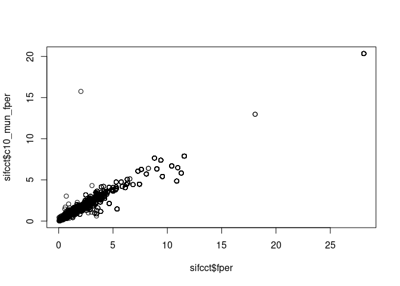
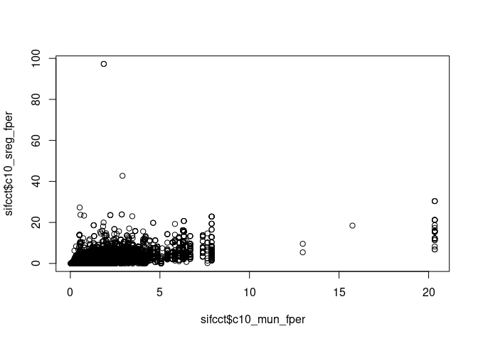
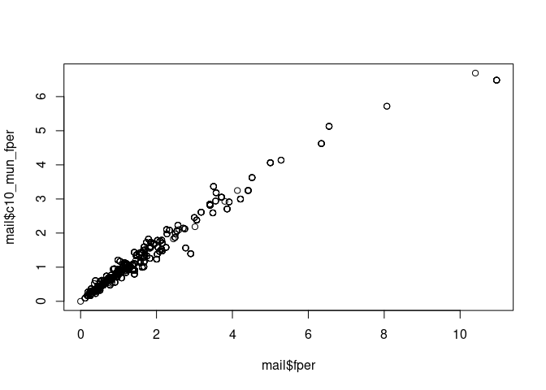
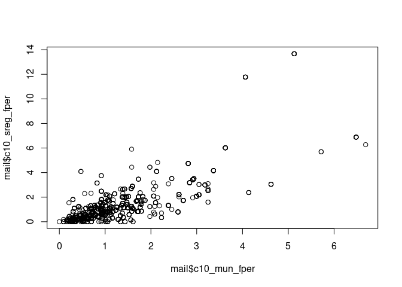
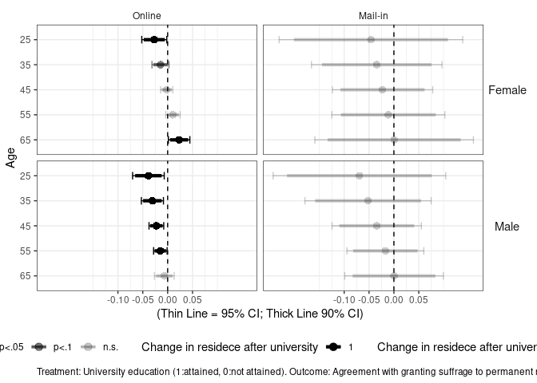
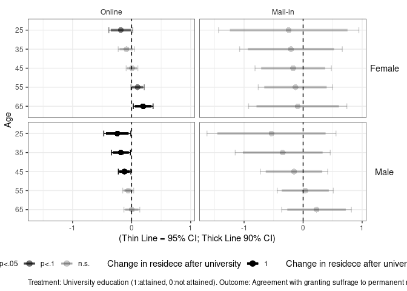

Analysis 2: Supplemental Analysis with Original and Mail-In Data
(Movers)
================
Fan Lu & Gento Kato
January 26, 2021

# Analytical Strategy

## Variables

  - Outcome: Foreigner Suffrage (min 0, max 1)

  - Mediator 1: (Objective) Political Knowledge (min = 0, max = 1)

  - Mediator 2: Ideology (min 0 = left/liberal, max 1 =
    right/conservative)

  - Mediator 3: LDP - DPJ FT (min 0 = favor DPJ, max 1 = favor LDP)

  - Mediator 4: Favorability of South Korea (min = 0, max = 1)  

  - Mediator 5: Favorability of China (min = 0, max = 1)  

  - Mediator 6: Favorability of USA (min = 0, max = 1)  

  - Mediator 7: Income (percentile, min = 0, max = 1)

  - Independent Variable: University Education (0 = Junior College or
    Less, 1 = University or More)

  - Moderator 1: Gender (0 = Female, 1 = Male), This means that all
    “base” coefficients are for female.

  - Moderator 2: Age (by 10 years, centered at 20). Reasoning: Two
    trends may influence the role of university education. (1) There is
    an evident increase in number of university graduates over the
    years, especially among women. This trend may impies that university
    experience may be more gendered in the past than today. (2) There is
    a trend of “internationalization” in university education in recent
    days. Therefore, the diversifying and liberalizing effect of
    education may be stronger for younger generation.

  - Control 1: Percent in life residing locally. More locally-identified
    individuals may dislike outsiders more.

  - Control 2: (ZIP level) Residing in densely inhabited district (DID)

  - Control 3: (ZIP level) Percent of foreigners in neighborhood
    (transformed by square root)  

  - Control 4: (ZIP level) Percent of university graduates in
    neighborhood (by 10 percent)

  - Control 5: (Municipality level) Percent of residents residing in DID

  - Control 6: (Municipality level) Percent of foreigners (transformed
    by square root)

  - Control 7: (Municipality level) Percent of university graduates (by
    10 percent)

## Subset Data

Analysis is conducted on the following subset.

If age - years of local ZIP residence is 23 or larger. 23 is the age of
graduating university (the youngest possible) in Japan. Assuming that an
individual is living in the local ZIP continuously, this condition
implies that one moved to the ZIP of current residence (likely) after
graduating the university. This incorporates the possibility that
education changes attitudes through the movement in residence.

## Modeling Strategy

All models are estimated by OLS. For outcome model, alternative model is
estimated by the multinomial logit model, with 3 category DV (disagree,
neither, agree), with disagree as a reference category.

## Robustness Check (in this file)

SIFCCT has one special survey where they conducted a survey through
mail. Mail survey contains identical set of variables as online survey.
So I replicated the analysis with the mail survey.

# Preparation

``` r
## Clean Up Space
rm(list=ls())

## Set Working Directory (Automatically) ##
require(rstudioapi); require(rprojroot)
if (rstudioapi::isAvailable()==TRUE) {
  setwd(dirname(rstudioapi::getActiveDocumentContext()$path)); 
} 
projdir <- find_root(has_file("thisishome.txt"))
cat(paste("Working Directory Set to:\n",projdir))
```

    ## Working Directory Set to:
    ##  /home/gentok/GoogleDrive/Projects/Fan-Gento-Lab/ForeignerJapan

``` r
setwd(projdir)

## Original Data
datadir1a <- paste0(projdir, "/data/sifcct_zip_latest_v5.rds")
datadir1b <- paste0(projdir, "/data/sifcct_zip_latest_panel_v5.rds")
datadir2 <- paste0(projdir, "/data/mail_zip_latest_v5.rds")

## packages
# devtools::install_github("gentok/estvis")
# require(estvis)
require(multiwayvcov)
require(sandwich)
require(lmtest)
require(MASS)
# devtools::install_github("tidyverse/ggplot2") # Need development version (as of Dec 31, 2019)
library(ggplot2)
require(texreg)
# require(brant)
# require(VGAM)
# require(nnet)
require(mlogit)
require(Formula)
```

# Import and clean data

``` r
###################
## SIFCCT Online ##
###################

sifcct <- rbind(readRDS(datadir1a),readRDS(datadir1b))

## Knowledge Variable (Replaced)
sifcct$knowledge[sifcct$panel==1 & sifcct$wave==2] <- sifcct$knowledge[sifcct$panel==1 & sifcct$wave==1][match(sifcct$panelid[sifcct$panel==1 & sifcct$wave==2],sifcct$panelid[sifcct$panel==1 & sifcct$wave==1])]
sifcct$knowledge[sifcct$panel==1 & sifcct$wave==3] <- sifcct$knowledge[sifcct$panel==1 & sifcct$wave==1][match(sifcct$panelid[sifcct$panel==1 & sifcct$wave==3],sifcct$panelid[sifcct$panel==1 & sifcct$wave==1])]
sifcct$knowledge[sifcct$panel==1 & sifcct$wave==4] <- sifcct$knowledge[sifcct$panel==1 & sifcct$wave==1][match(sifcct$panelid[sifcct$panel==1 & sifcct$wave==4],sifcct$panelid[sifcct$panel==1 & sifcct$wave==1])]
sifcct$knowledge[sifcct$panel==1 & sifcct$wave==5] <- sifcct$knowledge[sifcct$panel==1 & sifcct$wave==1][match(sifcct$panelid[sifcct$panel==1 & sifcct$wave==5],sifcct$panelid[sifcct$panel==1 & sifcct$wave==1])]
sifcct$knowledge[sifcct$panel==1 & sifcct$wave==6] <- sifcct$knowledge[sifcct$panel==1 & sifcct$wave==1][match(sifcct$panelid[sifcct$panel==1 & sifcct$wave==6],sifcct$panelid[sifcct$panel==1 & sifcct$wave==1])]
sifcct$knowledge[sifcct$panel==1 & sifcct$wave==7] <- sifcct$knowledge[sifcct$panel==1 & sifcct$wave==1][match(sifcct$panelid[sifcct$panel==1 & sifcct$wave==7],sifcct$panelid[sifcct$panel==1 & sifcct$wave==1])]
sifcct$knowledge[sifcct$panel==1 & sifcct$wave==8] <- sifcct$knowledge[sifcct$panel==1 & sifcct$wave==1][match(sifcct$panelid[sifcct$panel==1 & sifcct$wave==8],sifcct$panelid[sifcct$panel==1 & sifcct$wave==1])]
sifcct$knowledge[sifcct$panel==1 & sifcct$wave==9] <- sifcct$knowledge[sifcct$panel==1 & sifcct$wave==1][match(sifcct$panelid[sifcct$panel==1 & sifcct$wave==9],sifcct$panelid[sifcct$panel==1 & sifcct$wave==1])]
sifcct$knowledge[sifcct$panel==1 & sifcct$wave==10] <- sifcct$knowledge[sifcct$panel==1 & sifcct$wave==1][match(sifcct$panelid[sifcct$panel==1 & sifcct$wave==10],sifcct$panelid[sifcct$panel==1 & sifcct$wave==1])]
sifcct$knowledge[sifcct$panel==1 & sifcct$wave==11] <- sifcct$knowledge[sifcct$panel==1 & sifcct$wave==1][match(sifcct$panelid[sifcct$panel==1 & sifcct$wave==11],sifcct$panelid[sifcct$panel==1 & sifcct$wave==1])]
sifcct$knowledge[sifcct$panel==1 & sifcct$wave==12] <- sifcct$knowledge[sifcct$panel==1 & sifcct$wave==1][match(sifcct$panelid[sifcct$panel==1 & sifcct$wave==12],sifcct$panelid[sifcct$panel==1 & sifcct$wave==1])]
## Knowledge Variable (Replaced)
sifcct$knowledge[sifcct$panel==1 & sifcct$wave==14] <- sifcct$knowledge[sifcct$panel==1 & sifcct$wave==13][match(sifcct$panelid[sifcct$panel==1 & sifcct$wave==14],sifcct$panelid[sifcct$panel==1 & sifcct$wave==13])]
sifcct$knowledge[sifcct$panel==1 & sifcct$wave==15] <- sifcct$knowledge[sifcct$panel==1 & sifcct$wave==13][match(sifcct$panelid[sifcct$panel==1 & sifcct$wave==15],sifcct$panelid[sifcct$panel==1 & sifcct$wave==13])]
sifcct$knowledge[sifcct$panel==1 & sifcct$wave==16] <- sifcct$knowledge[sifcct$panel==1 & sifcct$wave==13][match(sifcct$panelid[sifcct$panel==1 & sifcct$wave==16],sifcct$panelid[sifcct$panel==1 & sifcct$wave==13])]
sifcct$knowledge[sifcct$panel==1 & sifcct$wave==17] <- sifcct$knowledge[sifcct$panel==1 & sifcct$wave==13][match(sifcct$panelid[sifcct$panel==1 & sifcct$wave==17],sifcct$panelid[sifcct$panel==1 & sifcct$wave==13])]
sifcct$knowledge[sifcct$panel==1 & sifcct$wave==18] <- sifcct$knowledge[sifcct$panel==1 & sifcct$wave==13][match(sifcct$panelid[sifcct$panel==1 & sifcct$wave==18],sifcct$panelid[sifcct$panel==1 & sifcct$wave==13])]
sifcct$knowledge[sifcct$panel==1 & sifcct$wave==19] <- sifcct$knowledge[sifcct$panel==1 & sifcct$wave==13][match(sifcct$panelid[sifcct$panel==1 & sifcct$wave==19],sifcct$panelid[sifcct$panel==1 & sifcct$wave==13])]
sifcct$knowledge[sifcct$panel==1 & sifcct$wave==20] <- sifcct$knowledge[sifcct$panel==1 & sifcct$wave==13][match(sifcct$panelid[sifcct$panel==1 & sifcct$wave==20],sifcct$panelid[sifcct$panel==1 & sifcct$wave==13])]
sifcct$knowledge[sifcct$panel==1 & sifcct$wave==21] <- sifcct$knowledge[sifcct$panel==1 & sifcct$wave==13][match(sifcct$panelid[sifcct$panel==1 & sifcct$wave==21],sifcct$panelid[sifcct$panel==1 & sifcct$wave==13])]
sifcct$knowledge[sifcct$panel==1 & sifcct$wave==22] <- sifcct$knowledge[sifcct$panel==1 & sifcct$wave==13][match(sifcct$panelid[sifcct$panel==1 & sifcct$wave==22],sifcct$panelid[sifcct$panel==1 & sifcct$wave==13])]
sifcct$knowledge[sifcct$panel==1 & sifcct$wave==23] <- sifcct$knowledge[sifcct$panel==1 & sifcct$wave==13][match(sifcct$panelid[sifcct$panel==1 & sifcct$wave==23],sifcct$panelid[sifcct$panel==1 & sifcct$wave==13])]
sifcct$knowledge[sifcct$panel==1 & sifcct$wave==24] <- sifcct$knowledge[sifcct$panel==1 & sifcct$wave==13][match(sifcct$panelid[sifcct$panel==1 & sifcct$wave==24],sifcct$panelid[sifcct$panel==1 & sifcct$wave==13])]

## Subset Waves
sifcct <- subset(sifcct, !wave%in%c(1,23,24) & !(panel==1 & wave%in%c(1,3:12,14:24)))
table(sifcct$wave,sifcct$panel)
```

    ##     
    ##         0    1
    ##   2  1626 1054
    ##   3  1748    0
    ##   4  1918    0
    ##   5  1873    0
    ##   6  1916    0
    ##   7  1779    0
    ##   8  1774    0
    ##   9  1789    0
    ##   10 1674    0
    ##   11 1731    0
    ##   12 1668    0
    ##   13 1636  982
    ##   14 1648    0
    ##   15 1758    0
    ##   16 1744    0
    ##   17 1673    0
    ##   18 1724    0
    ##   19 1728    0
    ##   20 1672    0
    ##   21 1717    0
    ##   22 1787    0

``` r
## sreg with no population as NA
sifcct$c10_sreg_pop[which(sifcct$c10_sreg_pop==0)] <- NA 

## Income Missing Percentage (8.9%)
table(is.na(sifcct$income))/sum(table(is.na(sifcct$income)))
```

    ## 
    ##      FALSE       TRUE 
    ## 0.91032911 0.08967089

``` r
## Exclude Missing Values
sifcctx <- sifcct[,c("id","foreignsuff","foreignsuff3","foreignsuff3x",
                     "knowledge","polint","ideology","ldpdpjft",
                     "familiarityFT_KOR","familiarityFT_CHN","familiarityFT_USA",
                     # "evecon","evecon_verybad","evecon_bad","evecon_notbad","evecon_qtype",
                     "income", #"employed",
                     "female","male","edu","edu2","age","agecat","bornyr",
                     "lvlen","lvpr",
                     "zip_did","c10_sreg_foreignN","c10_sreg_pop",
                     "c10_sreg_edu_ugsP","c10_sreg_edu_ugs","c10_sreg_edu_graduated",
                     "didper","c10_mun_foreignN","c10_mun_pop",
                     "c10_mun_edu_ugsP","c10_mun_edu_ugs","c10_mun_edu_graduated",
                     "zip","c10_name_pref","c10_name_mun","c10_name_sreg",
                     "zip_lat","zip_lon",
                     "wave","panel")]
sifcctx <- na.omit(sifcctx)
nrow(sifcctx)
```

    ## [1] 34703

``` r
## Add Income and fper
sifcctx$income <- sifcct$income[match(paste(sifcctx$id,sifcctx$wave),paste(sifcct$id,sifcct$wave))]
summary(sifcctx$income)
```

    ##    Min. 1st Qu.  Median    Mean 3rd Qu.    Max. 
    ## 0.04098 0.18484 0.40915 0.50079 0.78565 0.97505

``` r
sifcctx$fper <- sifcct$fper[match(paste(sifcctx$id,sifcctx$wave),paste(sifcct$id,sifcct$wave))]
summary(sifcctx$fper)
```

    ##     Min.  1st Qu.   Median     Mean  3rd Qu.     Max. 
    ##  0.03136  0.77811  1.35848  1.79431  2.24808 28.08225

``` r
## Replace Data
sifcct <- sifcctx
rm(sifcctx)

nrow(sifcct[which(sifcct$age - sifcct$lvlen>=23),])
```

    ## [1] 24147

``` r
#################
## SIFCCT Mail ##
#################

mail <- readRDS(datadir2)

## sreg with no population as NA
mail$c10_sreg_pop[which(mail$c10_sreg_pop==0)] <- NA 

## Exclude Missing Values
mailx <- mail[,c("id","foreignsuff","foreignsuff3","foreignsuff3x",
                 "knowledge","polint","ideology","ldpdpjft",
                 "familiarityFT_KOR","familiarityFT_CHN","familiarityFT_USA",
                 # "evecon","evecon_verybad","evecon_bad","evecon_notbad","evecon_qtype",
                 # "income","employed",
                 "female","male","edu","edu2","age","agecat","bornyr",
                 "lvlen","lvpr",
                 "zip_did","c10_sreg_foreignN","c10_sreg_pop",
                 "c10_sreg_edu_ugsP","c10_sreg_edu_ugs","c10_sreg_edu_graduated",
                 "didper","c10_mun_foreignN","c10_mun_pop",
                 "c10_mun_edu_ugsP","c10_mun_edu_ugs","c10_mun_edu_graduated",
                 "zip","c10_name_pref","c10_name_mun","c10_name_sreg",
                 "zip_lat","zip_lon")]
mailx <- na.omit(mailx)
nrow(mailx)
```

    ## [1] 1000

``` r
## Add Income & fper
mailx$income <- mail$income[match(paste(mailx$id),paste(mail$id))]
summary(mailx$income)
```

    ##    Min. 1st Qu.  Median    Mean 3rd Qu.    Max.    NA's 
    ## 0.05033 0.23742 0.48322 0.53321 0.82203 0.98067     105

``` r
mailx$fper <- mail$fper[match(paste(mailx$id),paste(mail$id))]
summary(mailx$fper)
```

    ##    Min. 1st Qu.  Median    Mean 3rd Qu.    Max. 
    ##  0.0000  0.6821  1.2061  1.5734  1.9266 10.9614

``` r
## Replace Data
mail <- mailx
rm(mailx)
```

# Recoding Variables

``` r
## SIFCCT ##

## Binary Age Cohort (50s or over)
sifcct$age2 <- ifelse(sifcct$age >= 50, 1, 0)
sifcct$agex <- sifcct$age/10 - 4.5
## Small Region Foreiner Percent
sifcct$c10_sreg_fper <- sifcct$c10_sreg_foreignN/sifcct$c10_sreg_pop*100
## Municipality Foreigner Percent
sifcct$c10_mun_fper <- sifcct$c10_mun_foreignN/sifcct$c10_mun_pop*100
## Compare Census and Foreinger Registry Numbers
plot(sifcct$fper, sifcct$c10_mun_fper)
```

<!-- -->

``` r
cor(sifcct$fper, sifcct$c10_mun_fper, use="pairwise")
```

    ## [1] 0.972352

``` r
plot(sifcct$c10_mun_fper, sifcct$c10_sreg_fper)
```

<!-- -->

``` r
cor(sifcct$c10_mun_fper, sifcct$c10_sreg_fper, use="pairwise")
```

    ## [1] 0.6087222

``` r
## MAIL ##

## Binary Age Cohort (50s or over)
mail$age2 <- ifelse(mail$age >= 50, 1, 0)
mail$agex <- mail$age/10 - 4.5
## Small Region Foreiner Percent
mail$c10_sreg_fper <- mail$c10_sreg_foreignN/mail$c10_sreg_pop*100
## Municipality Foreigner Percent
mail$c10_mun_fper <- mail$c10_mun_foreignN/mail$c10_mun_pop*100
## Compare Census and Foreinger Registry Numbers
plot(mail$fper, mail$c10_mun_fper)
```

<!-- -->

``` r
cor(mail$fper, mail$c10_mun_fper, use="pairwise")
```

    ## [1] 0.9782127

``` r
plot(mail$c10_mun_fper, mail$c10_sreg_fper)
```

<!-- -->

``` r
cor(mail$c10_mun_fper, mail$c10_sreg_fper, use="pairwise")
```

    ## [1] 0.7526452

``` r
## Formula (SIFCCT) ##

basemod0 <- formula(  ~ edu2*male*agex + lvpr +  
                        as.factor(wave)) # sifcct
basemodA <- formula(  ~ edu2*male*agex + lvpr +  
                        zip_did + sqrt(c10_sreg_fper) + I(c10_sreg_edu_ugsP/10) + 
                        as.factor(wave)) # sifcct
basemodB <- formula(  ~ edu2*male*agex + lvpr +  
                        didper + sqrt(c10_mun_fper) + I(c10_mun_edu_ugsP/10) + 
                        as.factor(wave)) # sifcct
basemodC <- formula(  ~ edu2*male*agex + lvpr +  
                        zip_did + sqrt(c10_sreg_fper) + I(c10_sreg_edu_ugsP/10) + 
                        didper + sqrt(c10_mun_fper) + I(c10_mun_edu_ugsP/10) + 
                        as.factor(wave)) # sifcct

## Formula (SIFCCT.mlogit) ##

outmod0.mlogit <- Formula(foreignsuff3x  ~ 0 | edu2*male*agex + lvpr +  
                            as.factor(wave)) # sifcct
outmodA.mlogit <- Formula(foreignsuff3x  ~ 0 | edu2*male*agex + lvpr +  
                            zip_did + sqrt(c10_sreg_fper) + I(c10_sreg_edu_ugsP/10) + 
                            as.factor(wave)) # sifcct
outmodB.mlogit <- Formula(foreignsuff3x  ~ 0 | edu2*male*agex + lvpr +  
                            didper + sqrt(c10_mun_fper) + I(c10_mun_edu_ugsP/10) + 
                            as.factor(wave)) # sifcct
outmodC.mlogit <- Formula(foreignsuff3x  ~ 0 | edu2*male*agex + lvpr +  
                            zip_did + sqrt(c10_sreg_fper) + I(c10_sreg_edu_ugsP/10) + 
                            didper + sqrt(c10_mun_fper) + I(c10_mun_edu_ugsP/10) + 
                            as.factor(wave)) # sifcct

## Formula (MAIL) ##

basemod0m <- formula(  ~ edu2*male*agex + lvpr) # sifcct
basemodAm <- formula(  ~ edu2*male*agex + lvpr +  
                         zip_did + sqrt(c10_sreg_fper) + I(c10_sreg_edu_ugsP/10)) # sifcct
basemodBm <- formula(  ~ edu2*male*agex + lvpr +  
                         didper + sqrt(c10_mun_fper) + I(c10_mun_edu_ugsP/10)) # sifcct
basemodCm <- formula(  ~ edu2*male*agex + lvpr +  
                         zip_did + sqrt(c10_sreg_fper) + I(c10_sreg_edu_ugsP/10) + 
                         didper + sqrt(c10_mun_fper) + I(c10_mun_edu_ugsP/10)) # sifcct

## Formula (MAIL.mlogit) ##

outmod0m.mlogit <- Formula(foreignsuff3x  ~ 0 | edu2*male*agex + lvpr) # sifcct
outmodAm.mlogit <- Formula(foreignsuff3x  ~ 0 | edu2*male*agex + lvpr +  
                             zip_did + sqrt(c10_sreg_fper) + I(c10_sreg_edu_ugsP/10)) # sifcct
outmodBm.mlogit <- Formula(foreignsuff3x  ~ 0 | edu2*male*agex + lvpr +  
                             didper + sqrt(c10_mun_fper) + I(c10_mun_edu_ugsP/10)) # sifcct
outmodCm.mlogit <- Formula(foreignsuff3x  ~ 0 | edu2*male*agex + lvpr +  
                             zip_did + sqrt(c10_sreg_fper) + I(c10_sreg_edu_ugsP/10) + 
                             didper + sqrt(c10_mun_fper) + I(c10_mun_edu_ugsP/10)) # sifcct

## Variable Names ##

vnmap <- list("edu2" = "University education",
              "edu2 (1)" = "University education",
              "female" = "Gender (female)",
              "male" = "Gender (male)",
              "male (1)" = "Gender (male)",
              "age2" = "Age 50s or older",
              "agex" = "Age (by 10 years, centered at 45)",
              "edu2:female" = "University * Female",
              "edu2:male" = "University * Male",
              "edu2 (2)" = "University * Male",
              "edu2:age2" = "University * >=50s",
              "edu2:agex" = "University * Age",
              "edu2 (3)" = "University * Age",
              "edu2:female:age2" = "University * Female * >=50s",
              "edu2:male:age2" = "University * Male * >=50s",
              "edu2:female:agex" = "University * Female * Age",
              "edu2:male:agex" = "University * Male * Age",
              "edu2 (4)" = "University * Male * Age",
              "female:age2" = "Female * >=50s",
              "male:age2" = "Male * >=50s",
              "female:agex" = "Female * Age",
              "male:agex" = "Male * Age",
              "male (2)" = "Male * Age",
              "agecatMiddle Aged (40-50s)" = "Middle Aged (40-50s)",
              "agecatElder (>=60s)" = "Elder (>=60s)",
              "lvpr" = "% of Life Residing Locally (zip)",
              "zip_did" = "DID residence (zip)",
              "sqrt(c10_sreg_fper)" = "Foreigner % sqrt. (zip)",
              "c10_sreg_edu_ugsP" = "University % (zip)",
              "I(c10_sreg_edu_ugsP/10)" = "University % by 10% (zip)",
              "didper" = "DID proportion (mun.)",
              "sqrt(c10_mun_fper)" = "Foreigner % sqrt. (mun.)",
              "I(c10_mun_edu_ugsP/10)" = "University % by 10% (mun.)",
              "c10_mun_edu_ugsP" = "University % (mun.)")
```

# SIFCCT: Outcome Model

``` r
## Living in Local ZIP since at least age 15 ##

smo_10 <- lm(update(foreignsuff ~ ., basemod0), data=sifcct[which(sifcct$age - sifcct$lvlen>=23),])
smo_1A <- lm(update(foreignsuff ~ ., basemodA), data=sifcct[which(sifcct$age - sifcct$lvlen>=23),])
smo_1B <- lm(update(foreignsuff ~ ., basemodB), data=sifcct[which(sifcct$age - sifcct$lvlen>=23),])
smo_1C <- lm(update(foreignsuff ~ ., basemodC), data=sifcct[which(sifcct$age - sifcct$lvlen>=23),])

screenreg(list(smo_10,smo_1A,smo_1B,smo_1C), digits = 4, #single.row = T,
          override.se = list(coeftest(smo_10,vcov.=vcovHC(smo_10))[,2],
                             coeftest(smo_1A,vcov.=vcovHC(smo_1A))[,2],
                             coeftest(smo_1B,vcov.=vcovHC(smo_1B))[,2],
                             coeftest(smo_1C,vcov.=vcovHC(smo_1C))[,2]),
          override.pvalues = list(coeftest(smo_10,vcov.=vcovHC(smo_10))[,4],
                                  coeftest(smo_1A,vcov.=vcovHC(smo_1A))[,4],
                                  coeftest(smo_1B,vcov.=vcovHC(smo_1B))[,4],
                                  coeftest(smo_1C,vcov.=vcovHC(smo_1C))[,4]),
          omit.coef = "(wave)",stars = c(0.1,0.05,0.01,0.001), symbol = "+",
          custom.coef.map = vnmap, 
          custom.model.names = c("Base","ZIP","Municipality","Full"))
```

    ## 
    ## =================================================================================================
    ##                                    Base            ZIP             Municipality    Full          
    ## -------------------------------------------------------------------------------------------------
    ## University education                  -0.0019         -0.0002         -0.0012         -0.0002    
    ##                                       (0.0063)        (0.0064)        (0.0063)        (0.0064)   
    ## Gender (male)                         -0.0560 ***     -0.0566 ***     -0.0564 ***     -0.0566 ***
    ##                                       (0.0076)        (0.0076)        (0.0076)        (0.0076)   
    ## Age (by 10 years, centered at 45)     -0.0126 ***     -0.0122 ***     -0.0124 ***     -0.0123 ***
    ##                                       (0.0034)        (0.0034)        (0.0034)        (0.0034)   
    ## University * Male                     -0.0208 *       -0.0204 *       -0.0206 *       -0.0205 *  
    ##                                       (0.0098)        (0.0098)        (0.0098)        (0.0098)   
    ## University * Age                       0.0125 *        0.0122 *        0.0123 *        0.0122 *  
    ##                                       (0.0051)        (0.0051)        (0.0051)        (0.0051)   
    ## University * Male * Age               -0.0045         -0.0041         -0.0043         -0.0041    
    ##                                       (0.0076)        (0.0076)        (0.0076)        (0.0076)   
    ## Male * Age                             0.0170 **       0.0166 **       0.0167 **       0.0166 ** 
    ##                                       (0.0057)        (0.0057)        (0.0057)        (0.0057)   
    ## % of Life Residing Locally (zip)      -0.0276 +       -0.0307 *       -0.0290 +       -0.0305 *  
    ##                                       (0.0149)        (0.0149)        (0.0149)        (0.0150)   
    ## DID residence (zip)                                   -0.0162 **                      -0.0190 ** 
    ##                                                       (0.0056)                        (0.0066)   
    ## Foreigner % sqrt. (zip)                               -0.0037                         -0.0021    
    ##                                                       (0.0039)                        (0.0054)   
    ## University % by 10% (zip)                             -0.0001                         -0.0024    
    ##                                                       (0.0025)                        (0.0036)   
    ## DID proportion (mun.)                                                 -0.0103          0.0077    
    ##                                                                       (0.0101)        (0.0119)   
    ## Foreigner % sqrt. (mun.)                                              -0.0071         -0.0049    
    ##                                                                       (0.0053)        (0.0074)   
    ## University % by 10% (mun.)                                             0.0012          0.0036    
    ##                                                                       (0.0038)        (0.0052)   
    ## -------------------------------------------------------------------------------------------------
    ## R^2                                    0.0122          0.0127          0.0124          0.0128    
    ## Adj. R^2                               0.0110          0.0115          0.0111          0.0114    
    ## Num. obs.                          24147           24147           24147           24147         
    ## =================================================================================================
    ## *** p < 0.001; ** p < 0.01; * p < 0.05; + p < 0.1

# SIFCCT: Outcome Model 2

``` r
## Living in Local ZIP since at least age 15 ##

# require(nnet)
# smo2_10 <- multinom(update(foreignsuff3x ~ ., basemod0), data=sifcct[which(sifcct$age - sifcct$lvlen>=23),])
# smo2_1A <- multinom(update(foreignsuff3x ~ ., basemodA), data=sifcct[which(sifcct$age - sifcct$lvlen>=23),])
# smo2_1B <- multinom(update(foreignsuff3x ~ ., basemodB), data=sifcct[which(sifcct$age - sifcct$lvlen>=23),])
# smo2_1C <- multinom(update(foreignsuff3x ~ ., basemodC), data=sifcct[which(sifcct$age - sifcct$lvlen>=23),])

sifcct.mlogit <- dfidx(sifcct[which(sifcct$age - sifcct$lvlen>=23),],
                       shape = "wide", choice = "foreignsuff3x")
# levels(sifcct.mlogit$idx$id2) <- c("Disagree","Neither","Agree")
smo2_10 <- mlogit(outmod0.mlogit, data=sifcct.mlogit, reflevel="Disagree")
smo2_1A <- mlogit(outmodA.mlogit, data=sifcct.mlogit, reflevel="Disagree")
smo2_1B <- mlogit(outmodB.mlogit, data=sifcct.mlogit, reflevel="Disagree")
smo2_1C <- mlogit(outmodC.mlogit, data=sifcct.mlogit, reflevel="Disagree")

screenreg(list(smo2_10,smo2_1A), digits = 4, #single.row = T,
          override.se = list(coeftest(smo2_10,vcov=sandwich)[grep(":Neither",names(coef(smo2_10))),2],
                             coeftest(smo2_10,vcov=sandwich)[grep(":Agree",names(coef(smo2_10))),2],
                             coeftest(smo2_1A,vcov=sandwich)[grep(":Neither",names(coef(smo2_1A))),2],
                             coeftest(smo2_1A,vcov=sandwich)[grep(":Agree",names(coef(smo2_1A))),2]),
          override.pvalues = list(coeftest(smo2_10,vcov=sandwich)[grep(":Neither",names(coef(smo2_10))),4],
                                  coeftest(smo2_10,vcov=sandwich)[grep(":Agree",names(coef(smo2_10))),4],
                                  coeftest(smo2_1A,vcov=sandwich)[grep(":Neither",names(coef(smo2_1A))),4],
                                  coeftest(smo2_1A,vcov=sandwich)[grep(":Agree",names(coef(smo2_1A))),4]),
          beside = T,
          omit.coef = "(wave)",stars = c(0.1,0.05,0.01,0.001), symbol = "+", 
          custom.model.names = c("Base: Agree","Base: Neither",
                                 "ZIP: Agree","ZIP: Neither"),
          custom.coef.map = vnmap)
```

    ## 
    ## =====================================================================================================
    ##                                    Base: Agree      Base: Neither    ZIP: Agree       ZIP: Neither   
    ## -----------------------------------------------------------------------------------------------------
    ## University education                    0.0063 ***      -0.3391           0.0199 ***      -0.3256    
    ##                                        (0.0498)         (0.0503)         (0.0503)         (0.0508)   
    ## Gender (male)                          -0.3609 ***      -0.5868 ***      -0.3662 ***      -0.5918 ***
    ##                                        (0.0563)         (0.0580)         (0.0563)         (0.0581)   
    ## Age (by 10 years, centered at 45)      -0.0835 ***      -0.1487 **       -0.0807 ***      -0.1470 ** 
    ##                                        (0.0271)         (0.0281)         (0.0272)         (0.0281)   
    ## University * Male                      -0.1262           0.0215 +        -0.1232           0.0239 +  
    ##                                        (0.0734)         (0.0738)         (0.0734)         (0.0738)   
    ## University * Age                        0.0947 *         0.1007 *         0.0927 *         0.0997 *  
    ##                                        (0.0398)         (0.0402)         (0.0398)         (0.0402)   
    ## University * Male * Age                -0.0331          -0.0377          -0.0301          -0.0370    
    ##                                        (0.0569)         (0.0563)         (0.0569)         (0.0564)   
    ## Male * Age                              0.1272           0.0550 **        0.1244           0.0535 ** 
    ##                                        (0.0428)         (0.0431)         (0.0428)         (0.0431)   
    ## % of Life Residing Locally (zip)       -0.2106          -0.0032 +        -0.2329          -0.0243 *  
    ##                                        (0.1123)         (0.1081)         (0.1128)         (0.1085)   
    ## DID residence (zip)                                                      -0.1274          -0.0373 ** 
    ##                                                                          (0.0418)         (0.0409)   
    ## Foreigner % sqrt. (zip)                                                  -0.0176          -0.0425    
    ##                                                                          (0.0290)         (0.0280)   
    ## University % by 10% (zip)                                                -0.0036          -0.0168    
    ##                                                                          (0.0185)         (0.0183)   
    ## -----------------------------------------------------------------------------------------------------
    ## AIC                                 51942.8378       51942.8378       51938.2602       51938.2602    
    ## Log Likelihood                     -25913.4189      -25913.4189      -25905.1301      -25905.1301    
    ## Num. obs.                           24147            24147            24147            24147         
    ## K                                       3                3                3                3         
    ## =====================================================================================================
    ## *** p < 0.001; ** p < 0.01; * p < 0.05; + p < 0.1

``` r
screenreg(list(smo2_1B,smo2_1C), digits = 4, #single.row = T,
          override.se = list(coeftest(smo2_1B,vcov=sandwich)[grep(":Neither",names(coef(smo2_1B))),2],
                             coeftest(smo2_1B,vcov=sandwich)[grep(":Agree",names(coef(smo2_1B))),2],
                             coeftest(smo2_1C,vcov=sandwich)[grep(":Neither",names(coef(smo2_1C))),2],
                             coeftest(smo2_1C,vcov=sandwich)[grep(":Agree",names(coef(smo2_1C))),2]),
          override.pvalues = list(coeftest(smo2_1B,vcov=sandwich)[grep(":Neither",names(coef(smo2_1B))),4],
                                  coeftest(smo2_1B,vcov=sandwich)[grep(":Agree",names(coef(smo2_1B))),4],
                                  coeftest(smo2_1C,vcov=sandwich)[grep(":Neither",names(coef(smo2_1C))),4],
                                  coeftest(smo2_1C,vcov=sandwich)[grep(":Agree",names(coef(smo2_1C))),4]),
          beside = T,
          omit.coef = "(wave)",stars = c(0.1,0.05,0.01,0.001), symbol = "+",
          custom.coef.map = vnmap,
          custom.model.names = c("Mun.: Agree","Mun.: Neither",
                                 "Full: Agree","Full: Neither"))
```

    ## 
    ## =====================================================================================================
    ##                                    Mun.: Agree      Mun.: Neither    Full: Agree      Full: Neither  
    ## -----------------------------------------------------------------------------------------------------
    ## University education                    0.0126 ***      -0.3328           0.0197 ***      -0.3261    
    ##                                        (0.0502)         (0.0506)         (0.0503)         (0.0508)   
    ## Gender (male)                          -0.3639 ***      -0.5893 ***      -0.3657 ***      -0.5914 ***
    ##                                        (0.0563)         (0.0581)         (0.0563)         (0.0581)   
    ## Age (by 10 years, centered at 45)      -0.0823 ***      -0.1478 **       -0.0813 ***      -0.1472 ** 
    ##                                        (0.0272)         (0.0281)         (0.0272)         (0.0281)   
    ## University * Male                      -0.1245           0.0226 +        -0.1238           0.0237 +  
    ##                                        (0.0734)         (0.0738)         (0.0734)         (0.0738)   
    ## University * Age                        0.0935 *         0.1001 *         0.0932 *         0.1004 *  
    ##                                        (0.0398)         (0.0402)         (0.0398)         (0.0402)   
    ## University * Male * Age                -0.0317          -0.0369          -0.0306          -0.0381    
    ##                                        (0.0569)         (0.0563)         (0.0569)         (0.0563)   
    ## Male * Age                              0.1256           0.0543 **        0.1248           0.0541 ** 
    ##                                        (0.0428)         (0.0431)         (0.0428)         (0.0431)   
    ## % of Life Residing Locally (zip)       -0.2215          -0.0098 *        -0.2318          -0.0260 *  
    ##                                        (0.1126)         (0.1083)         (0.1130)         (0.1087)   
    ## DID residence (zip)                                                      -0.1480          -0.0490 ** 
    ##                                                                          (0.0494)         (0.0483)   
    ## Foreigner % sqrt. (zip)                                                  -0.0169 +        -0.0685    
    ##                                                                          (0.0403)         (0.0391)   
    ## University % by 10% (zip)                                                -0.0157          -0.0262    
    ##                                                                          (0.0263)         (0.0261)   
    ## DID proportion (mun.)                  -0.0794          -0.0162           0.0607           0.0327    
    ##                                        (0.0752)         (0.0739)         (0.0887)         (0.0871)   
    ## Foreigner % sqrt. (mun.)               -0.0296          -0.0201          -0.0114           0.0436    
    ##                                        (0.0394)         (0.0388)         (0.0539)         (0.0536)   
    ## University % by 10% (mun.)              0.0003          -0.0162           0.0163           0.0113    
    ##                                        (0.0280)         (0.0275)         (0.0384)         (0.0380)   
    ## -----------------------------------------------------------------------------------------------------
    ## AIC                                 51951.2486       51951.2486       51948.0233       51948.0233    
    ## Log Likelihood                     -25911.6243      -25911.6243      -25904.0117      -25904.0117    
    ## Num. obs.                           24147            24147            24147            24147         
    ## K                                       3                3                3                3         
    ## =====================================================================================================
    ## *** p < 0.001; ** p < 0.01; * p < 0.05; + p < 0.1

# SIFCCT: Mediator Models

## Knowledge

``` r
smm01_10 <- lm(update(knowledge ~ ., basemod0), data=sifcct[which(sifcct$age - sifcct$lvlen>=23),])
smm01_1A <- lm(update(knowledge ~ ., basemodA), data=sifcct[which(sifcct$age - sifcct$lvlen>=23),])
smm01_1B <- lm(update(knowledge ~ ., basemodB), data=sifcct[which(sifcct$age - sifcct$lvlen>=23),])
smm01_1C <- lm(update(knowledge ~ ., basemodC), data=sifcct[which(sifcct$age - sifcct$lvlen>=23),])
screenreg(list(smm01_10,smm01_1A,smm01_1B,smm01_1C), digits = 4, #single.row = T,
          override.se = list(coeftest(smm01_10,vcov.=vcovHC(smm01_10))[,2],
                             coeftest(smm01_1A,vcov.=vcovHC(smm01_1A))[,2],
                             coeftest(smm01_1B,vcov.=vcovHC(smm01_1B))[,2],
                             coeftest(smm01_1C,vcov.=vcovHC(smm01_1C))[,2]),
          override.pvalues = list(coeftest(smm01_10,vcov.=vcovHC(smm01_10))[,4],
                                  coeftest(smm01_1A,vcov.=vcovHC(smm01_1A))[,4],
                                  coeftest(smm01_1B,vcov.=vcovHC(smm01_1B))[,4],
                                  coeftest(smm01_1C,vcov.=vcovHC(smm01_1C))[,4]),
          omit.coef = "(wave)", stars = c(0.1,0.05,0.01,0.001), symbol = "+",
          custom.coef.map = vnmap, 
          custom.model.names = c("Base","ZIP","Municipality","Full"))
```

    ## 
    ## =================================================================================================
    ##                                    Base            ZIP             Municipality    Full          
    ## -------------------------------------------------------------------------------------------------
    ## University education                   0.1545 ***      0.1438 ***      0.1467 ***      0.1436 ***
    ##                                       (0.0058)        (0.0059)        (0.0059)        (0.0059)   
    ## Gender (male)                          0.1738 ***      0.1781 ***      0.1767 ***      0.1780 ***
    ##                                       (0.0069)        (0.0069)        (0.0069)        (0.0069)   
    ## Age (by 10 years, centered at 45)      0.0668 ***      0.0656 ***      0.0658 ***      0.0655 ***
    ##                                       (0.0032)        (0.0032)        (0.0032)        (0.0032)   
    ## University * Male                      0.0035          0.0017          0.0023          0.0018    
    ##                                       (0.0088)        (0.0087)        (0.0087)        (0.0087)   
    ## University * Age                      -0.0119 *       -0.0123 **      -0.0116 *       -0.0121 ** 
    ##                                       (0.0047)        (0.0047)        (0.0047)        (0.0047)   
    ## University * Male * Age               -0.0238 ***     -0.0238 ***     -0.0244 ***     -0.0240 ***
    ##                                       (0.0065)        (0.0065)        (0.0065)        (0.0065)   
    ## Male * Age                             0.0196 ***      0.0199 ***      0.0200 ***      0.0199 ***
    ##                                       (0.0050)        (0.0049)        (0.0049)        (0.0049)   
    ## % of Life Residing Locally (zip)      -0.0369 **      -0.0235 +       -0.0307 *       -0.0250 *  
    ##                                       (0.0127)        (0.0127)        (0.0127)        (0.0127)   
    ## DID residence (zip)                                    0.0079 +                        0.0108 +  
    ##                                                       (0.0047)                        (0.0056)   
    ## Foreigner % sqrt. (zip)                                0.0092 **                       0.0068    
    ##                                                       (0.0032)                        (0.0046)   
    ## University % by 10% (zip)                              0.0234 ***                      0.0179 ***
    ##                                                       (0.0021)                        (0.0030)   
    ## DID proportion (mun.)                                                 -0.0041         -0.0135    
    ##                                                                       (0.0086)        (0.0101)   
    ## Foreigner % sqrt. (mun.)                                               0.0086 +        0.0028    
    ##                                                                       (0.0044)        (0.0061)   
    ## University % by 10% (mun.)                                             0.0298 ***      0.0118 ** 
    ##                                                                       (0.0032)        (0.0044)   
    ## -------------------------------------------------------------------------------------------------
    ## R^2                                    0.2267          0.2325          0.2312          0.2328    
    ## Adj. R^2                               0.2258          0.2315          0.2302          0.2317    
    ## Num. obs.                          24147           24147           24147           24147         
    ## =================================================================================================
    ## *** p < 0.001; ** p < 0.01; * p < 0.05; + p < 0.1

## Ideology

``` r
smm02_10 <- lm(update(ideology ~ ., basemod0), data=sifcct[which(sifcct$age - sifcct$lvlen>=23),])
smm02_1A <- lm(update(ideology ~ ., basemodA), data=sifcct[which(sifcct$age - sifcct$lvlen>=23),])
smm02_1B <- lm(update(ideology ~ ., basemodB), data=sifcct[which(sifcct$age - sifcct$lvlen>=23),])
smm02_1C <- lm(update(ideology ~ ., basemodC), data=sifcct[which(sifcct$age - sifcct$lvlen>=23),])
screenreg(list(smm02_10,smm02_1A,smm02_1B,smm02_1C), digits = 4, #single.row = T,
          override.se = list(coeftest(smm02_10,vcov.=vcovHC(smm02_10))[,2],
                             coeftest(smm02_1A,vcov.=vcovHC(smm02_1A))[,2],
                             coeftest(smm02_1B,vcov.=vcovHC(smm02_1B))[,2],
                             coeftest(smm02_1C,vcov.=vcovHC(smm02_1C))[,2]),
          override.pvalues = list(coeftest(smm02_10,vcov.=vcovHC(smm02_10))[,4],
                                  coeftest(smm02_1A,vcov.=vcovHC(smm02_1A))[,4],
                                  coeftest(smm02_1B,vcov.=vcovHC(smm02_1B))[,4],
                                  coeftest(smm02_1C,vcov.=vcovHC(smm02_1C))[,4]),
          omit.coef = "(wave)", stars = c(0.1,0.05,0.01,0.001), symbol = "+",
          custom.coef.map = vnmap, 
          custom.model.names = c("Base","ZIP","Municipality","Full"))
```

    ## 
    ## =================================================================================================
    ##                                    Base            ZIP             Municipality    Full          
    ## -------------------------------------------------------------------------------------------------
    ## University education                  -0.0132 ***     -0.0130 ***     -0.0125 **      -0.0129 ***
    ##                                       (0.0039)        (0.0039)        (0.0039)        (0.0039)   
    ## Gender (male)                         -0.0377 ***     -0.0378 ***     -0.0379 ***     -0.0379 ***
    ##                                       (0.0052)        (0.0052)        (0.0052)        (0.0052)   
    ## Age (by 10 years, centered at 45)     -0.0082 ***     -0.0083 ***     -0.0081 ***     -0.0082 ***
    ##                                       (0.0022)        (0.0022)        (0.0022)        (0.0022)   
    ## University * Male                      0.0229 ***      0.0229 ***      0.0230 ***      0.0230 ***
    ##                                       (0.0065)        (0.0065)        (0.0065)        (0.0065)   
    ## University * Age                      -0.0061 +       -0.0059 +       -0.0061 +       -0.0060 +  
    ##                                       (0.0032)        (0.0032)        (0.0032)        (0.0032)   
    ## University * Male * Age               -0.0025         -0.0028         -0.0024         -0.0026    
    ##                                       (0.0050)        (0.0050)        (0.0050)        (0.0050)   
    ## Male * Age                             0.0144 ***      0.0146 ***      0.0144 ***      0.0145 ***
    ##                                       (0.0039)        (0.0039)        (0.0039)        (0.0039)   
    ## % of Life Residing Locally (zip)       0.0184 +        0.0184 +        0.0178 +        0.0182 +  
    ##                                       (0.0098)        (0.0098)        (0.0098)        (0.0098)   
    ## DID residence (zip)                                    0.0096 **                       0.0144 ***
    ##                                                       (0.0036)                        (0.0043)   
    ## Foreigner % sqrt. (zip)                               -0.0017                          0.0001    
    ##                                                       (0.0025)                        (0.0035)   
    ## University % by 10% (zip)                             -0.0023                         -0.0003    
    ##                                                       (0.0016)                        (0.0023)   
    ## DID proportion (mun.)                                                 -0.0009         -0.0146 +  
    ##                                                                       (0.0065)        (0.0077)   
    ## Foreigner % sqrt. (mun.)                                              -0.0012         -0.0016    
    ##                                                                       (0.0035)        (0.0047)   
    ## University % by 10% (mun.)                                            -0.0023         -0.0020    
    ##                                                                       (0.0024)        (0.0033)   
    ## -------------------------------------------------------------------------------------------------
    ## R^2                                    0.0069          0.0072          0.0069          0.0074    
    ## Adj. R^2                               0.0057          0.0059          0.0057          0.0060    
    ## Num. obs.                          24147           24147           24147           24147         
    ## =================================================================================================
    ## *** p < 0.001; ** p < 0.01; * p < 0.05; + p < 0.1

## LDP - DPJ FT

``` r
smm03_10 <- lm(update(ldpdpjft ~ ., basemod0), data=sifcct[which(sifcct$age - sifcct$lvlen>=23),])
smm03_1A <- lm(update(ldpdpjft ~ ., basemodA), data=sifcct[which(sifcct$age - sifcct$lvlen>=23),])
smm03_1B <- lm(update(ldpdpjft ~ ., basemodB), data=sifcct[which(sifcct$age - sifcct$lvlen>=23),])
smm03_1C <- lm(update(ldpdpjft ~ ., basemodC), data=sifcct[which(sifcct$age - sifcct$lvlen>=23),])
screenreg(list(smm03_10,smm03_1A,smm03_1B,smm03_1C), digits = 4, #single.row = T,
          override.se = list(coeftest(smm03_10,vcov.=vcovHC(smm03_10))[,2],
                             coeftest(smm03_1A,vcov.=vcovHC(smm03_1A))[,2],
                             coeftest(smm03_1B,vcov.=vcovHC(smm03_1B))[,2],
                             coeftest(smm03_1C,vcov.=vcovHC(smm03_1C))[,2]),
          override.pvalues = list(coeftest(smm03_10,vcov.=vcovHC(smm03_10))[,4],
                                  coeftest(smm03_1A,vcov.=vcovHC(smm03_1A))[,4],
                                  coeftest(smm03_1B,vcov.=vcovHC(smm03_1B))[,4],
                                  coeftest(smm03_1C,vcov.=vcovHC(smm03_1C))[,4]),
          omit.coef = "(wave)", stars = c(0.1,0.05,0.01,0.001), symbol = "+",
          custom.coef.map = vnmap, 
          custom.model.names = c("Base","ZIP","Municipality","Full"))
```

    ## 
    ## =================================================================================================
    ##                                    Base            ZIP             Municipality    Full          
    ## -------------------------------------------------------------------------------------------------
    ## University education                  -0.0122 ***     -0.0131 ***     -0.0125 ***     -0.0131 ***
    ##                                       (0.0030)        (0.0030)        (0.0030)        (0.0030)   
    ## Gender (male)                          0.0195 ***      0.0198 ***      0.0197 ***      0.0198 ***
    ##                                       (0.0037)        (0.0037)        (0.0037)        (0.0037)   
    ## Age (by 10 years, centered at 45)      0.0018          0.0016          0.0017          0.0016    
    ##                                       (0.0017)        (0.0017)        (0.0017)        (0.0017)   
    ## University * Male                      0.0093 +        0.0091 +        0.0092 +        0.0091 +  
    ##                                       (0.0047)        (0.0047)        (0.0047)        (0.0047)   
    ## University * Age                      -0.0097 ***     -0.0095 ***     -0.0096 ***     -0.0096 ***
    ##                                       (0.0025)        (0.0025)        (0.0025)        (0.0025)   
    ## University * Male * Age                0.0028          0.0027          0.0027          0.0027    
    ##                                       (0.0038)        (0.0038)        (0.0038)        (0.0038)   
    ## Male * Age                            -0.0072 *       -0.0070 *       -0.0070 *       -0.0070 *  
    ##                                       (0.0029)        (0.0029)        (0.0029)        (0.0029)   
    ## % of Life Residing Locally (zip)      -0.0062         -0.0046         -0.0056         -0.0043    
    ##                                       (0.0075)        (0.0075)        (0.0075)        (0.0075)   
    ## DID residence (zip)                                    0.0062 *                        0.0071 *  
    ##                                                       (0.0028)                        (0.0033)   
    ## Foreigner % sqrt. (zip)                                0.0038 *                        0.0049 +  
    ##                                                       (0.0019)                        (0.0027)   
    ## University % by 10% (zip)                              0.0001                          0.0018    
    ##                                                       (0.0012)                        (0.0018)   
    ## DID proportion (mun.)                                                  0.0050         -0.0019    
    ##                                                                       (0.0049)        (0.0058)   
    ## Foreigner % sqrt. (mun.)                                               0.0036         -0.0010    
    ##                                                                       (0.0026)        (0.0036)   
    ## University % by 10% (mun.)                                            -0.0011         -0.0031    
    ##                                                                       (0.0018)        (0.0025)   
    ## -------------------------------------------------------------------------------------------------
    ## R^2                                    0.1203          0.1207          0.1204          0.1208    
    ## Adj. R^2                               0.1192          0.1196          0.1193          0.1196    
    ## Num. obs.                          24147           24147           24147           24147         
    ## =================================================================================================
    ## *** p < 0.001; ** p < 0.01; * p < 0.05; + p < 0.1

## Favorability of South Korea

``` r
smm04_10 <- lm(update(familiarityFT_KOR ~ ., basemod0), data=sifcct[which(sifcct$age - sifcct$lvlen>=23),])
smm04_1A <- lm(update(familiarityFT_KOR ~ ., basemodA), data=sifcct[which(sifcct$age - sifcct$lvlen>=23),])
smm04_1B <- lm(update(familiarityFT_KOR ~ ., basemodB), data=sifcct[which(sifcct$age - sifcct$lvlen>=23),])
smm04_1C <- lm(update(familiarityFT_KOR ~ ., basemodC), data=sifcct[which(sifcct$age - sifcct$lvlen>=23),])
screenreg(list(smm04_10,smm04_1A,smm04_1B,smm04_1C), digits = 4, #single.row = T,
          override.se = list(coeftest(smm04_10,vcov.=vcovHC(smm04_10))[,2],
                             coeftest(smm04_1A,vcov.=vcovHC(smm04_1A))[,2],
                             coeftest(smm04_1B,vcov.=vcovHC(smm04_1B))[,2],
                             coeftest(smm04_1C,vcov.=vcovHC(smm04_1C))[,2]),
          override.pvalues = list(coeftest(smm04_10,vcov.=vcovHC(smm04_10))[,4],
                                  coeftest(smm04_1A,vcov.=vcovHC(smm04_1A))[,4],
                                  coeftest(smm04_1B,vcov.=vcovHC(smm04_1B))[,4],
                                  coeftest(smm04_1C,vcov.=vcovHC(smm04_1C))[,4]),
          omit.coef = "(wave)", stars = c(0.1,0.05,0.01,0.001), symbol = "+",
          custom.coef.map = vnmap, 
          custom.model.names = c("Base","ZIP","Municipality","Full"))
```

    ## 
    ## =================================================================================================
    ##                                    Base            ZIP             Municipality    Full          
    ## -------------------------------------------------------------------------------------------------
    ## University education                   0.0100 *        0.0104 *        0.0099 +        0.0103 *  
    ##                                       (0.0050)        (0.0051)        (0.0050)        (0.0051)   
    ## Gender (male)                         -0.0589 ***     -0.0591 ***     -0.0590 ***     -0.0591 ***
    ##                                       (0.0057)        (0.0057)        (0.0057)        (0.0058)   
    ## Age (by 10 years, centered at 45)     -0.0015         -0.0014         -0.0015         -0.0014    
    ##                                       (0.0027)        (0.0027)        (0.0027)        (0.0027)   
    ## University * Male                      0.0077          0.0078          0.0078          0.0078    
    ##                                       (0.0074)        (0.0074)        (0.0074)        (0.0074)   
    ## University * Age                      -0.0001         -0.0002         -0.0001         -0.0001    
    ##                                       (0.0040)        (0.0040)        (0.0040)        (0.0040)   
    ## University * Male * Age                0.0004          0.0006          0.0005          0.0005    
    ##                                       (0.0057)        (0.0057)        (0.0057)        (0.0057)   
    ## Male * Age                             0.0272 ***      0.0271 ***      0.0272 ***      0.0271 ***
    ##                                       (0.0043)        (0.0043)        (0.0043)        (0.0043)   
    ## % of Life Residing Locally (zip)      -0.0209 +       -0.0218 *       -0.0215 *       -0.0222 *  
    ##                                       (0.0108)        (0.0109)        (0.0108)        (0.0109)   
    ## DID residence (zip)                                   -0.0083 *                       -0.0082 +  
    ##                                                       (0.0041)                        (0.0049)   
    ## Foreigner % sqrt. (zip)                                0.0004                         -0.0023    
    ##                                                       (0.0028)                        (0.0039)   
    ## University % by 10% (zip)                              0.0005                         -0.0009    
    ##                                                       (0.0018)                        (0.0026)   
    ## DID proportion (mun.)                                                 -0.0092         -0.0013    
    ##                                                                       (0.0073)        (0.0087)   
    ## Foreigner % sqrt. (mun.)                                               0.0025          0.0048    
    ##                                                                       (0.0039)        (0.0052)   
    ## University % by 10% (mun.)                                             0.0016          0.0026    
    ##                                                                       (0.0027)        (0.0038)   
    ## -------------------------------------------------------------------------------------------------
    ## R^2                                    0.0684          0.0686          0.0685          0.0686    
    ## Adj. R^2                               0.0673          0.0674          0.0673          0.0673    
    ## Num. obs.                          24147           24147           24147           24147         
    ## =================================================================================================
    ## *** p < 0.001; ** p < 0.01; * p < 0.05; + p < 0.1

## Favorability of China

``` r
smm05_10 <- lm(update(familiarityFT_CHN ~ ., basemod0), data=sifcct[which(sifcct$age - sifcct$lvlen>=23),])
smm05_1A <- lm(update(familiarityFT_CHN ~ ., basemodA), data=sifcct[which(sifcct$age - sifcct$lvlen>=23),])
smm05_1B <- lm(update(familiarityFT_CHN ~ ., basemodB), data=sifcct[which(sifcct$age - sifcct$lvlen>=23),])
smm05_1C <- lm(update(familiarityFT_CHN ~ ., basemodC), data=sifcct[which(sifcct$age - sifcct$lvlen>=23),])
screenreg(list(smm05_10,smm05_1A,smm05_1B,smm05_1C), digits = 4, #single.row = T,
          override.se = list(coeftest(smm05_10,vcov.=vcovHC(smm05_10))[,2],
                             coeftest(smm05_1A,vcov.=vcovHC(smm05_1A))[,2],
                             coeftest(smm05_1B,vcov.=vcovHC(smm05_1B))[,2],
                             coeftest(smm05_1C,vcov.=vcovHC(smm05_1C))[,2]),
          override.pvalues = list(coeftest(smm05_10,vcov.=vcovHC(smm05_10))[,4],
                                  coeftest(smm05_1A,vcov.=vcovHC(smm05_1A))[,4],
                                  coeftest(smm05_1B,vcov.=vcovHC(smm05_1B))[,4],
                                  coeftest(smm05_1C,vcov.=vcovHC(smm05_1C))[,4]),
          omit.coef = "(wave)", stars = c(0.1,0.05,0.01,0.001), symbol = "+",
          custom.coef.map = vnmap, 
          custom.model.names = c("Base","ZIP","Municipality","Full"))
```

    ## 
    ## =================================================================================================
    ##                                    Base            ZIP             Municipality    Full          
    ## -------------------------------------------------------------------------------------------------
    ## University education                   0.0201 ***      0.0196 ***      0.0190 ***      0.0194 ***
    ##                                       (0.0043)        (0.0043)        (0.0043)        (0.0043)   
    ## Gender (male)                         -0.0137 **      -0.0136 **      -0.0134 **      -0.0136 ** 
    ##                                       (0.0049)        (0.0050)        (0.0050)        (0.0050)   
    ## Age (by 10 years, centered at 45)     -0.0000         -0.0001         -0.0001         -0.0001    
    ##                                       (0.0024)        (0.0024)        (0.0024)        (0.0024)   
    ## University * Male                      0.0029          0.0029          0.0028          0.0029    
    ##                                       (0.0064)        (0.0064)        (0.0064)        (0.0064)   
    ## University * Age                      -0.0024         -0.0024         -0.0023         -0.0022    
    ##                                       (0.0034)        (0.0034)        (0.0034)        (0.0034)   
    ## University * Male * Age                0.0014          0.0015          0.0014          0.0013    
    ##                                       (0.0049)        (0.0049)        (0.0049)        (0.0049)   
    ## Male * Age                             0.0070 +        0.0070 +        0.0071 +        0.0071 +  
    ##                                       (0.0037)        (0.0037)        (0.0037)        (0.0037)   
    ## % of Life Residing Locally (zip)      -0.0257 **      -0.0250 **      -0.0252 **      -0.0259 ** 
    ##                                       (0.0094)        (0.0094)        (0.0094)        (0.0094)   
    ## DID residence (zip)                                   -0.0022                         -0.0014    
    ##                                                       (0.0035)                        (0.0041)   
    ## Foreigner % sqrt. (zip)                                0.0027                         -0.0008    
    ##                                                       (0.0024)                        (0.0033)   
    ## University % by 10% (zip)                              0.0009                         -0.0024    
    ##                                                       (0.0016)                        (0.0022)   
    ## DID proportion (mun.)                                                 -0.0064         -0.0052    
    ##                                                                       (0.0064)        (0.0075)   
    ## Foreigner % sqrt. (mun.)                                               0.0049          0.0055    
    ##                                                                       (0.0034)        (0.0046)   
    ## University % by 10% (mun.)                                             0.0042 +        0.0066 *  
    ##                                                                       (0.0024)        (0.0033)   
    ## -------------------------------------------------------------------------------------------------
    ## R^2                                    0.0241          0.0242          0.0244          0.0244    
    ## Adj. R^2                               0.0230          0.0229          0.0231          0.0231    
    ## Num. obs.                          24147           24147           24147           24147         
    ## =================================================================================================
    ## *** p < 0.001; ** p < 0.01; * p < 0.05; + p < 0.1

## Favorability of USA

``` r
smm06_10 <- lm(update(familiarityFT_USA ~ ., basemod0), data=sifcct[which(sifcct$age - sifcct$lvlen>=23),])
smm06_1A <- lm(update(familiarityFT_USA ~ ., basemodA), data=sifcct[which(sifcct$age - sifcct$lvlen>=23),])
smm06_1B <- lm(update(familiarityFT_USA ~ ., basemodB), data=sifcct[which(sifcct$age - sifcct$lvlen>=23),])
smm06_1C <- lm(update(familiarityFT_USA ~ ., basemodC), data=sifcct[which(sifcct$age - sifcct$lvlen>=23),])
screenreg(list(smm06_10,smm06_1A,smm06_1B,smm06_1C), digits = 4, #single.row = T,
          override.se = list(coeftest(smm06_10,vcov.=vcovHC(smm06_10))[,2],
                             coeftest(smm06_1A,vcov.=vcovHC(smm06_1A))[,2],
                             coeftest(smm06_1B,vcov.=vcovHC(smm06_1B))[,2],
                             coeftest(smm06_1C,vcov.=vcovHC(smm06_1C))[,2]),
          override.pvalues = list(coeftest(smm06_10,vcov.=vcovHC(smm06_10))[,4],
                                  coeftest(smm06_1A,vcov.=vcovHC(smm06_1A))[,4],
                                  coeftest(smm06_1B,vcov.=vcovHC(smm06_1B))[,4],
                                  coeftest(smm06_1C,vcov.=vcovHC(smm06_1C))[,4]),
          omit.coef = "(wave)", stars = c(0.1,0.05,0.01,0.001), symbol = "+",
          custom.coef.map = vnmap, 
          custom.model.names = c("Base","ZIP","Municipality","Full"))
```

    ## 
    ## =================================================================================================
    ##                                    Base            ZIP             Municipality    Full          
    ## -------------------------------------------------------------------------------------------------
    ## University education                   0.0128 **       0.0090 *        0.0104 *        0.0091 *  
    ##                                       (0.0041)        (0.0041)        (0.0041)        (0.0041)   
    ## Gender (male)                          0.0061          0.0077          0.0070          0.0077    
    ##                                       (0.0052)        (0.0052)        (0.0052)        (0.0052)   
    ## Age (by 10 years, centered at 45)      0.0080 ***      0.0076 ***      0.0077 ***      0.0076 ***
    ##                                       (0.0023)        (0.0023)        (0.0023)        (0.0023)   
    ## University * Male                      0.0215 ***      0.0209 **       0.0211 **       0.0209 ** 
    ##                                       (0.0065)        (0.0065)        (0.0065)        (0.0065)   
    ## University * Age                      -0.0045         -0.0048         -0.0044         -0.0048    
    ##                                       (0.0032)        (0.0032)        (0.0032)        (0.0032)   
    ## University * Male * Age               -0.0034         -0.0032         -0.0036         -0.0033    
    ##                                       (0.0049)        (0.0049)        (0.0049)        (0.0049)   
    ## Male * Age                             0.0207 ***      0.0206 ***      0.0208 ***      0.0207 ***
    ##                                       (0.0038)        (0.0038)        (0.0038)        (0.0038)   
    ## % of Life Residing Locally (zip)      -0.0151         -0.0107         -0.0130         -0.0104    
    ##                                       (0.0095)        (0.0095)        (0.0095)        (0.0095)   
    ## DID residence (zip)                                   -0.0036                         -0.0058    
    ##                                                       (0.0036)                        (0.0043)   
    ## Foreigner % sqrt. (zip)                                0.0030                          0.0025    
    ##                                                       (0.0025)                        (0.0034)   
    ## University % by 10% (zip)                              0.0096 ***                      0.0098 ***
    ##                                                       (0.0016)                        (0.0023)   
    ## DID proportion (mun.)                                                  0.0014          0.0075    
    ##                                                                       (0.0065)        (0.0076)   
    ## Foreigner % sqrt. (mun.)                                               0.0024          0.0006    
    ##                                                                       (0.0035)        (0.0047)   
    ## University % by 10% (mun.)                                             0.0086 ***     -0.0012    
    ##                                                                       (0.0024)        (0.0033)   
    ## -------------------------------------------------------------------------------------------------
    ## R^2                                    0.0324          0.0341          0.0334          0.0341    
    ## Adj. R^2                               0.0313          0.0328          0.0321          0.0328    
    ## Num. obs.                          24147           24147           24147           24147         
    ## =================================================================================================
    ## *** p < 0.001; ** p < 0.01; * p < 0.05; + p < 0.1

## Income

``` r
smm07_10 <- lm(update(income ~ ., basemod0), data=sifcct[which(sifcct$age - sifcct$lvlen>=23),])
smm07_1A <- lm(update(income ~ ., basemodA), data=sifcct[which(sifcct$age - sifcct$lvlen>=23),])
smm07_1B <- lm(update(income ~ ., basemodB), data=sifcct[which(sifcct$age - sifcct$lvlen>=23),])
smm07_1C <- lm(update(income ~ ., basemodC), data=sifcct[which(sifcct$age - sifcct$lvlen>=23),])
screenreg(list(smm07_10,smm07_1A,smm07_1B,smm07_1C), digits = 4, #single.row = T,
          override.se = list(coeftest(smm07_10,vcov.=vcovHC(smm07_10))[,2],
                             coeftest(smm07_1A,vcov.=vcovHC(smm07_1A))[,2],
                             coeftest(smm07_1B,vcov.=vcovHC(smm07_1B))[,2],
                             coeftest(smm07_1C,vcov.=vcovHC(smm07_1C))[,2]),
          override.pvalues = list(coeftest(smm07_10,vcov.=vcovHC(smm07_10))[,4],
                                  coeftest(smm07_1A,vcov.=vcovHC(smm07_1A))[,4],
                                  coeftest(smm07_1B,vcov.=vcovHC(smm07_1B))[,4],
                                  coeftest(smm07_1C,vcov.=vcovHC(smm07_1C))[,4]),
          omit.coef = "(wave)", stars = c(0.1,0.05,0.01,0.001), symbol = "+",
          custom.coef.map = vnmap, 
          custom.model.names = c("Base","ZIP","Municipality","Full"))
```

    ## 
    ## =================================================================================================
    ##                                    Base            ZIP             Municipality    Full          
    ## -------------------------------------------------------------------------------------------------
    ## University education                   0.0961 ***      0.0747 ***      0.0807 ***      0.0742 ***
    ##                                       (0.0054)        (0.0053)        (0.0053)        (0.0053)   
    ## Gender (male)                         -0.0430 ***     -0.0342 ***     -0.0374 ***     -0.0340 ***
    ##                                       (0.0059)        (0.0058)        (0.0058)        (0.0058)   
    ## Age (by 10 years, centered at 45)     -0.0049 +       -0.0072 *       -0.0069 *       -0.0072 *  
    ##                                       (0.0028)        (0.0028)        (0.0028)        (0.0028)   
    ## University * Male                      0.0385 ***      0.0350 ***      0.0362 ***      0.0351 ***
    ##                                       (0.0078)        (0.0076)        (0.0077)        (0.0076)   
    ## University * Age                       0.0332 ***      0.0320 ***      0.0342 ***      0.0325 ***
    ##                                       (0.0044)        (0.0043)        (0.0044)        (0.0043)   
    ## University * Male * Age               -0.0167 **      -0.0160 **      -0.0178 **      -0.0168 ** 
    ##                                       (0.0060)        (0.0060)        (0.0060)        (0.0060)   
    ## Male * Age                            -0.0056         -0.0055         -0.0045         -0.0051    
    ##                                       (0.0043)        (0.0043)        (0.0043)        (0.0043)   
    ## % of Life Residing Locally (zip)       0.1046 ***      0.1305 ***      0.1169 ***      0.1279 ***
    ##                                       (0.0127)        (0.0125)        (0.0126)        (0.0125)   
    ## DID residence (zip)                                   -0.0031                         -0.0028    
    ##                                                       (0.0044)                        (0.0052)   
    ## Foreigner % sqrt. (zip)                                0.0169 ***                     -0.0042    
    ##                                                       (0.0031)                        (0.0042)   
    ## University % by 10% (zip)                              0.0514 ***                      0.0455 ***
    ##                                                       (0.0020)                        (0.0029)   
    ## DID proportion (mun.)                                                 -0.0118         -0.0055    
    ##                                                                       (0.0080)        (0.0094)   
    ## Foreigner % sqrt. (mun.)                                               0.0326 ***      0.0386 ***
    ##                                                                       (0.0043)        (0.0059)   
    ## University % by 10% (mun.)                                             0.0549 ***      0.0095 *  
    ##                                                                       (0.0031)        (0.0042)   
    ## -------------------------------------------------------------------------------------------------
    ## R^2                                    0.0537          0.0847          0.0765          0.0866    
    ## Adj. R^2                               0.0526          0.0835          0.0754          0.0853    
    ## Num. obs.                          24147           24147           24147           24147         
    ## =================================================================================================
    ## *** p < 0.001; ** p < 0.01; * p < 0.05; + p < 0.1

# MAIL: Outcome Model

``` r
## Living in Local ZIP since at least age 15 ##

mmo_10 <- lm(update(foreignsuff ~ ., basemod0m), data=mail[which(mail$age - mail$lvlen>=23),])
mmo_1A <- lm(update(foreignsuff ~ ., basemodAm), data=mail[which(mail$age - mail$lvlen>=23),])
mmo_1B <- lm(update(foreignsuff ~ ., basemodBm), data=mail[which(mail$age - mail$lvlen>=23),])
mmo_1C <- lm(update(foreignsuff ~ ., basemodCm), data=mail[which(mail$age - mail$lvlen>=23),])
screenreg(list(mmo_10,mmo_1A,mmo_1B,mmo_1C), digits = 4, #single.row = T,
          override.se = list(coeftest(mmo_10,vcov.=vcovHC(mmo_10))[,2],
                             coeftest(mmo_1A,vcov.=vcovHC(mmo_1A))[,2],
                             coeftest(mmo_1B,vcov.=vcovHC(mmo_1B))[,2],
                             coeftest(mmo_1C,vcov.=vcovHC(mmo_1C))[,2]),
          override.pvalues = list(coeftest(mmo_10,vcov.=vcovHC(mmo_10))[,4],
                                  coeftest(mmo_1A,vcov.=vcovHC(mmo_1A))[,4],
                                  coeftest(mmo_1B,vcov.=vcovHC(mmo_1B))[,4],
                                  coeftest(mmo_1C,vcov.=vcovHC(mmo_1C))[,4]),
          omit.coef = "(wave)",stars = c(0.1,0.05,0.01,0.001), symbol = "+",
          custom.coef.map = vnmap, 
          custom.model.names = c("Base","ZIP","Municipality","Full"))
```

    ## 
    ## ====================================================================================
    ##                                    Base        ZIP          Municipality  Full      
    ## ------------------------------------------------------------------------------------
    ## University education                -0.0229     -0.0260      -0.0276       -0.0283  
    ##                                     (0.0514)    (0.0520)     (0.0524)      (0.0518) 
    ## Gender (male)                       -0.0666 +   -0.0596      -0.0625       -0.0564  
    ##                                     (0.0384)    (0.0389)     (0.0388)      (0.0391) 
    ## Age (by 10 years, centered at 45)   -0.0310 *   -0.0334 *    -0.0327 *     -0.0349 *
    ##                                     (0.0156)    (0.0156)     (0.0156)      (0.0156) 
    ## University * Male                   -0.0117     -0.0075      -0.0122       -0.0140  
    ##                                     (0.0688)    (0.0688)     (0.0690)      (0.0689) 
    ## University * Age                     0.0117      0.0134       0.0136        0.0156  
    ##                                     (0.0356)    (0.0354)     (0.0357)      (0.0355) 
    ## University * Male * Age              0.0057      0.0005      -0.0006       -0.0017  
    ##                                     (0.0452)    (0.0449)     (0.0452)      (0.0452) 
    ## Male * Age                          -0.0073     -0.0066      -0.0062       -0.0048  
    ##                                     (0.0211)    (0.0214)     (0.0213)      (0.0214) 
    ## % of Life Residing Locally (zip)     0.1703 +    0.1784 +     0.1816 *      0.1692 +
    ##                                     (0.0918)    (0.0923)     (0.0922)      (0.0926) 
    ## DID residence (zip)                              0.0415                     0.0758 +
    ##                                                 (0.0326)                   (0.0405) 
    ## Foreigner % sqrt. (zip)                         -0.0610 **                 -0.0666 *
    ##                                                 (0.0208)                   (0.0337) 
    ## University % by 10% (zip)                       -0.0009                    -0.0183  
    ##                                                 (0.0137)                   (0.0183) 
    ## DID proportion (mun.)                                        -0.0443       -0.1297 +
    ##                                                              (0.0577)      (0.0722) 
    ## Foreigner % sqrt. (mun.)                                     -0.0729 *      0.0018  
    ##                                                              (0.0329)      (0.0532) 
    ## University % by 10% (mun.)                                    0.0366        0.0571 +
    ##                                                              (0.0227)      (0.0303) 
    ## ------------------------------------------------------------------------------------
    ## R^2                                  0.0266      0.0371       0.0353        0.0438  
    ## Adj. R^2                             0.0158      0.0224       0.0206        0.0251  
    ## Num. obs.                          731         731          731           731       
    ## ====================================================================================
    ## *** p < 0.001; ** p < 0.01; * p < 0.05; + p < 0.1

# MAIL: Outcome Model 2

``` r
## Living in Local ZIP since at least age 15 ##

# require(nnet)
# mmo2_10 <- multinom(update(foreignsuff3x ~ ., basemod0), data=mail[which(mail$age - mail$lvlen>=23),])
# mmo2_1A <- multinom(update(foreignsuff3x ~ ., basemodA), data=mail[which(mail$age - mail$lvlen>=23),])
# mmo2_1B <- multinom(update(foreignsuff3x ~ ., basemodB), data=mail[which(mail$age - mail$lvlen>=23),])
# mmo2_1C <- multinom(update(foreignsuff3x ~ ., basemodC), data=mail[which(mail$age - mail$lvlen>=23),])

mail.mlogit <- dfidx(mail[which(mail$age - mail$lvlen>=23),],
                     shape = "wide", choice = "foreignsuff3x")
# levels(mail.mlogit$idx$id2) <- c("Disagree","Neither","Agree")
mmo2_10 <- mlogit(outmod0m.mlogit, data=mail.mlogit, reflevel="Disagree")
mmo2_1A <- mlogit(outmodAm.mlogit, data=mail.mlogit, reflevel="Disagree")
mmo2_1B <- mlogit(outmodBm.mlogit, data=mail.mlogit, reflevel="Disagree")
mmo2_1C <- mlogit(outmodCm.mlogit, data=mail.mlogit, reflevel="Disagree")

screenreg(list(mmo2_10,mmo2_1A), digits = 4, #single.row = T,
          override.se = list(coeftest(mmo2_10,vcov=sandwich)[grep(":Neither",names(coef(mmo2_10))),2],
                             coeftest(mmo2_10,vcov=sandwich)[grep(":Agree",names(coef(mmo2_10))),2],
                             coeftest(mmo2_1A,vcov=sandwich)[grep(":Neither",names(coef(mmo2_1A))),2],
                             coeftest(mmo2_1A,vcov=sandwich)[grep(":Agree",names(coef(mmo2_1A))),2]),
          override.pvalues = list(coeftest(mmo2_10,vcov=sandwich)[grep(":Neither",names(coef(mmo2_10))),4],
                                  coeftest(mmo2_10,vcov=sandwich)[grep(":Agree",names(coef(mmo2_10))),4],
                                  coeftest(mmo2_1A,vcov=sandwich)[grep(":Neither",names(coef(mmo2_1A))),4],
                                  coeftest(mmo2_1A,vcov=sandwich)[grep(":Agree",names(coef(mmo2_1A))),4]),
          beside = T,
          omit.coef = "(wave)",stars = c(0.1,0.05,0.01,0.001), symbol = "+", 
          custom.model.names = c("Base: Agree","Base: Neither",
                                 "ZIP: Agree","ZIP: Neither"),
          custom.coef.map = vnmap)
```

    ## 
    ## ==========================================================================================
    ##                                    Base: Agree   Base: Neither  ZIP: Agree    ZIP: Neither
    ## ------------------------------------------------------------------------------------------
    ## University education                 -0.1678 **    -1.1971        -0.2111 **    -1.3167   
    ##                                      (0.4300)      (0.3295)       (0.4353)      (0.3336)  
    ## Gender (male)                        -0.5387 *     -0.6271 +      -0.4887 +     -0.5641 + 
    ##                                      (0.3120)      (0.2846)       (0.3150)      (0.2897)  
    ## Age (by 10 years, centered at 45)    -0.2432 +     -0.2049 *      -0.2574 +     -0.2016 * 
    ##                                      (0.1186)      (0.1186)       (0.1200)      (0.1189)  
    ## University * Male                     0.0135        0.7116         0.0458        0.7193   
    ##                                      (0.5467)      (0.4391)       (0.5486)      (0.4420)  
    ## University * Age                      0.0381       -0.0742         0.0369       -0.1016   
    ##                                      (0.2899)      (0.2027)       (0.2889)      (0.2041)  
    ## University * Male * Age               0.1527        0.1059         0.1362        0.1666   
    ##                                      (0.3433)      (0.2646)       (0.3431)      (0.2663)  
    ## Male * Age                           -0.0460       -0.1025        -0.0490       -0.1335   
    ##                                      (0.1712)      (0.1532)       (0.1712)      (0.1565)  
    ## % of Life Residing Locally (zip)      1.1605 **     1.9066 +       1.2496 **     1.9965 * 
    ##                                      (0.6555)      (0.6021)       (0.6646)      (0.6079)  
    ## DID residence (zip)                                                0.2725        0.3398   
    ##                                                                   (0.2421)      (0.2182)  
    ## Foreigner % sqrt. (zip)                                           -0.3832        0.0860 * 
    ##                                                                   (0.1684)      (0.1535)  
    ## University % by 10% (zip)                                          0.0372        0.0763   
    ##                                                                   (0.1086)      (0.0954)  
    ## ------------------------------------------------------------------------------------------
    ## AIC                                1571.2886     1571.2886      1569.4923     1569.4923   
    ## Log Likelihood                     -767.6443     -767.6443      -760.7462     -760.7462   
    ## Num. obs.                           731           731            731           731        
    ## K                                     3             3              3             3        
    ## ==========================================================================================
    ## *** p < 0.001; ** p < 0.01; * p < 0.05; + p < 0.1

``` r
screenreg(list(mmo2_1B,mmo2_1C), digits = 4, #single.row = T,
          override.se = list(coeftest(mmo2_1B,vcov=sandwich)[grep(":Neither",names(coef(mmo2_1B))),2],
                             coeftest(mmo2_1B,vcov=sandwich)[grep(":Agree",names(coef(mmo2_1B))),2],
                             coeftest(mmo2_1C,vcov=sandwich)[grep(":Neither",names(coef(mmo2_1C))),2],
                             coeftest(mmo2_1C,vcov=sandwich)[grep(":Agree",names(coef(mmo2_1C))),2]),
          override.pvalues = list(coeftest(mmo2_1B,vcov=sandwich)[grep(":Neither",names(coef(mmo2_1B))),4],
                                  coeftest(mmo2_1B,vcov=sandwich)[grep(":Agree",names(coef(mmo2_1B))),4],
                                  coeftest(mmo2_1C,vcov=sandwich)[grep(":Neither",names(coef(mmo2_1C))),4],
                                  coeftest(mmo2_1C,vcov=sandwich)[grep(":Agree",names(coef(mmo2_1C))),4]),
          beside = T,
          omit.coef = "(wave)",stars = c(0.1,0.05,0.01,0.001), symbol = "+",
          custom.coef.map = vnmap,
          custom.model.names = c("Mun.: Agree","Mun.: Neither",
                                 "Full: Agree","Full: Neither"))
```

    ## 
    ## ===========================================================================================
    ##                                    Mun.: Agree   Mun.: Neither  Full: Agree   Full: Neither
    ## -------------------------------------------------------------------------------------------
    ## University education                 -0.2141 **    -1.2204        -0.2403 **    -1.3259    
    ##                                      (0.4344)      (0.3352)       (0.4362)      (0.3330)   
    ## Gender (male)                        -0.5128 +     -0.6133 +      -0.4807 +     -0.6069 +  
    ##                                      (0.3163)      (0.2894)       (0.3192)      (0.2916)   
    ## Age (by 10 years, centered at 45)    -0.2575 +     -0.2137 *      -0.2690       -0.1959 *  
    ##                                      (0.1203)      (0.1199)       (0.1212)      (0.1201)   
    ## University * Male                     0.0096        0.6956         0.0222        0.7643    
    ##                                      (0.5484)      (0.4437)       (0.5529)      (0.4442)   
    ## University * Age                      0.0514       -0.0708         0.0520       -0.0918    
    ##                                      (0.2936)      (0.2039)       (0.2911)      (0.2044)   
    ## University * Male * Age               0.1147        0.0835         0.1206        0.1381    
    ##                                      (0.3485)      (0.2661)       (0.3476)      (0.2676)   
    ## Male * Age                           -0.0383       -0.0920        -0.0388       -0.1338    
    ##                                      (0.1732)      (0.1552)       (0.1730)      (0.1573)   
    ## % of Life Residing Locally (zip)      1.2404 **     1.9352 *       1.2101 **     1.9534 *  
    ##                                      (0.6532)      (0.6039)       (0.6689)      (0.6096)   
    ## DID residence (zip)                                                0.4926 *      0.7561 +  
    ##                                                                   (0.2998)      (0.2741)   
    ## Foreigner % sqrt. (zip)                                           -0.3635 +      0.4838    
    ##                                                                   (0.2680)      (0.2385)   
    ## University % by 10% (zip)                                         -0.0505        0.1518    
    ##                                                                   (0.1407)      (0.1271)   
    ## DID proportion (mun.)                -0.2800       -0.5226        -0.7911 *     -1.1618    
    ##                                      (0.4207)      (0.3963)       (0.4999)      (0.5131)   
    ## Foreigner % sqrt. (mun.)             -0.4729       -0.1622 *      -0.1154 *     -0.8247    
    ##                                      (0.2602)      (0.2252)       (0.4150)      (0.3568)   
    ## University % by 10% (mun.)            0.2645        0.2493         0.3254        0.0623    
    ##                                      (0.1754)      (0.1615)       (0.2220)      (0.2103)   
    ## -------------------------------------------------------------------------------------------
    ## AIC                                1576.0771     1576.0771      1565.8437     1565.8437    
    ## Log Likelihood                     -764.0386     -764.0386      -752.9219     -752.9219    
    ## Num. obs.                           731           731            731           731         
    ## K                                     3             3              3             3         
    ## ===========================================================================================
    ## *** p < 0.001; ** p < 0.01; * p < 0.05; + p < 0.1

# MAIL: Mediator Models

## Knowledge

``` r
mmm01_10 <- lm(update(knowledge ~ ., basemod0m), data=mail[which(mail$age - mail$lvlen>=23),])
mmm01_1A <- lm(update(knowledge ~ ., basemodAm), data=mail[which(mail$age - mail$lvlen>=23),])
mmm01_1B <- lm(update(knowledge ~ ., basemodBm), data=mail[which(mail$age - mail$lvlen>=23),])
mmm01_1C <- lm(update(knowledge ~ ., basemodCm), data=mail[which(mail$age - mail$lvlen>=23),])
screenreg(list(mmm01_10,mmm01_1A,mmm01_1B,mmm01_1C), digits = 4, #single.row = T,
          override.se = list(coeftest(mmm01_10,vcov.=vcovHC(mmm01_10))[,2],
                             coeftest(mmm01_1A,vcov.=vcovHC(mmm01_1A))[,2],
                             coeftest(mmm01_1B,vcov.=vcovHC(mmm01_1B))[,2],
                             coeftest(mmm01_1C,vcov.=vcovHC(mmm01_1C))[,2]),
          override.pvalues = list(coeftest(mmm01_10,vcov.=vcovHC(mmm01_10))[,4],
                                  coeftest(mmm01_1A,vcov.=vcovHC(mmm01_1A))[,4],
                                  coeftest(mmm01_1B,vcov.=vcovHC(mmm01_1B))[,4],
                                  coeftest(mmm01_1C,vcov.=vcovHC(mmm01_1C))[,4]),
          omit.coef = "(wave)", stars = c(0.1,0.05,0.01,0.001), symbol = "+",
          custom.coef.map = vnmap, 
          custom.model.names = c("Base","ZIP","Municipality","Full"))
```

    ## 
    ## =======================================================================================
    ##                                    Base          ZIP          Municipality  Full       
    ## ---------------------------------------------------------------------------------------
    ## University education                 0.1531 ***    0.1338 **    0.1347 **     0.1316 **
    ##                                     (0.0416)      (0.0415)     (0.0426)      (0.0421)  
    ## Gender (male)                        0.1057 **     0.1187 **    0.1156 **     0.1200 **
    ##                                     (0.0392)      (0.0393)     (0.0389)      (0.0392)  
    ## Age (by 10 years, centered at 45)    0.0073        0.0078       0.0064        0.0070   
    ##                                     (0.0150)      (0.0150)     (0.0151)      (0.0152)  
    ## University * Male                   -0.0010        0.0029      -0.0032        0.0009   
    ##                                     (0.0580)      (0.0577)     (0.0579)      (0.0577)  
    ## University * Age                     0.0314        0.0229       0.0288        0.0235   
    ##                                     (0.0331)      (0.0328)     (0.0336)      (0.0334)  
    ## University * Male * Age              0.0048        0.0127       0.0104        0.0129   
    ##                                     (0.0398)      (0.0397)     (0.0403)      (0.0401)  
    ## Male * Age                          -0.0032       -0.0068      -0.0056       -0.0062   
    ##                                     (0.0214)      (0.0216)     (0.0215)      (0.0216)  
    ## % of Life Residing Locally (zip)     0.0252        0.0525       0.0409        0.0525   
    ##                                     (0.0799)      (0.0806)     (0.0796)      (0.0811)  
    ## DID residence (zip)                                0.0216                     0.0060   
    ##                                                   (0.0286)                   (0.0348)  
    ## Foreigner % sqrt. (zip)                           -0.0108                    -0.0274   
    ##                                                   (0.0209)                   (0.0327)  
    ## University % by 10% (zip)                          0.0301 *                   0.0217   
    ##                                                   (0.0121)                   (0.0157)  
    ## DID proportion (mun.)                                           0.0467        0.0360   
    ##                                                                (0.0536)      (0.0640)  
    ## Foreigner % sqrt. (mun.)                                        0.0015        0.0303   
    ##                                                                (0.0315)      (0.0494)  
    ## University % by 10% (mun.)                                      0.0324        0.0119   
    ##                                                                (0.0217)      (0.0267)  
    ## ---------------------------------------------------------------------------------------
    ## R^2                                  0.1116        0.1231       0.1216        0.1251   
    ## Adj. R^2                             0.1018        0.1097       0.1082        0.1080   
    ## Num. obs.                          731           731          731           731        
    ## =======================================================================================
    ## *** p < 0.001; ** p < 0.01; * p < 0.05; + p < 0.1

## Ideology

``` r
mmm02_10 <- lm(update(ideology ~ ., basemod0m), data=mail[which(mail$age - mail$lvlen>=23),])
mmm02_1A <- lm(update(ideology ~ ., basemodAm), data=mail[which(mail$age - mail$lvlen>=23),])
mmm02_1B <- lm(update(ideology ~ ., basemodBm), data=mail[which(mail$age - mail$lvlen>=23),])
mmm02_1C <- lm(update(ideology ~ ., basemodCm), data=mail[which(mail$age - mail$lvlen>=23),])
screenreg(list(mmm02_10,mmm02_1A,mmm02_1B,mmm02_1C), digits = 4, #single.row = T,
          override.se = list(coeftest(mmm02_10,vcov.=vcovHC(mmm02_10))[,2],
                             coeftest(mmm02_1A,vcov.=vcovHC(mmm02_1A))[,2],
                             coeftest(mmm02_1B,vcov.=vcovHC(mmm02_1B))[,2],
                             coeftest(mmm02_1C,vcov.=vcovHC(mmm02_1C))[,2]),
          override.pvalues = list(coeftest(mmm02_10,vcov.=vcovHC(mmm02_10))[,4],
                                  coeftest(mmm02_1A,vcov.=vcovHC(mmm02_1A))[,4],
                                  coeftest(mmm02_1B,vcov.=vcovHC(mmm02_1B))[,4],
                                  coeftest(mmm02_1C,vcov.=vcovHC(mmm02_1C))[,4]),
          omit.coef = "(wave)", stars = c(0.1,0.05,0.01,0.001), symbol = "+",
          custom.coef.map = vnmap, 
          custom.model.names = c("Base","ZIP","Municipality","Full"))
```

    ## 
    ## ===================================================================================
    ##                                    Base        ZIP         Municipality  Full      
    ## -----------------------------------------------------------------------------------
    ## University education                -0.0225     -0.0227     -0.0218       -0.0223  
    ##                                     (0.0280)    (0.0289)    (0.0287)      (0.0291) 
    ## Gender (male)                       -0.0526 *   -0.0517 *   -0.0531 *     -0.0521 *
    ##                                     (0.0230)    (0.0234)    (0.0233)      (0.0234) 
    ## Age (by 10 years, centered at 45)    0.0089      0.0084      0.0089        0.0087  
    ##                                     (0.0084)    (0.0084)    (0.0084)      (0.0084) 
    ## University * Male                    0.0736 +    0.0742 +    0.0749 +      0.0750 +
    ##                                     (0.0390)    (0.0393)    (0.0390)      (0.0393) 
    ## University * Age                    -0.0422 *   -0.0411 *   -0.0414 *     -0.0414 *
    ##                                     (0.0196)    (0.0198)    (0.0197)      (0.0200) 
    ## University * Male * Age              0.0454 +    0.0445 +    0.0446 +      0.0448 +
    ##                                     (0.0249)    (0.0253)    (0.0253)      (0.0255) 
    ## Male * Age                           0.0128      0.0128      0.0126        0.0126  
    ##                                     (0.0124)    (0.0125)    (0.0125)      (0.0126) 
    ## % of Life Residing Locally (zip)    -0.0396     -0.0407     -0.0388       -0.0399  
    ##                                     (0.0481)    (0.0480)    (0.0482)      (0.0485) 
    ## DID residence (zip)                              0.0142                    0.0126  
    ##                                                 (0.0176)                  (0.0198) 
    ## Foreigner % sqrt. (zip)                         -0.0093                   -0.0079  
    ##                                                 (0.0138)                  (0.0195) 
    ## University % by 10% (zip)                       -0.0035                   -0.0011  
    ##                                                 (0.0078)                  (0.0090) 
    ## DID proportion (mun.)                                        0.0220        0.0083  
    ##                                                             (0.0328)      (0.0363) 
    ## Foreigner % sqrt. (mun.)                                    -0.0103       -0.0018  
    ##                                                             (0.0206)      (0.0297) 
    ## University % by 10% (mun.)                                  -0.0078       -0.0065  
    ##                                                             (0.0138)      (0.0161) 
    ## -----------------------------------------------------------------------------------
    ## R^2                                  0.0283      0.0297      0.0293        0.0299  
    ## Adj. R^2                             0.0175      0.0148      0.0145        0.0109  
    ## Num. obs.                          731         731         731           731       
    ## ===================================================================================
    ## *** p < 0.001; ** p < 0.01; * p < 0.05; + p < 0.1

## LDP - DPJ FT

``` r
mmm03_10 <- lm(update(ldpdpjft ~ ., basemod0m), data=mail[which(mail$age - mail$lvlen>=23),])
mmm03_1A <- lm(update(ldpdpjft ~ ., basemodAm), data=mail[which(mail$age - mail$lvlen>=23),])
mmm03_1B <- lm(update(ldpdpjft ~ ., basemodBm), data=mail[which(mail$age - mail$lvlen>=23),])
mmm03_1C <- lm(update(ldpdpjft ~ ., basemodCm), data=mail[which(mail$age - mail$lvlen>=23),])
screenreg(list(mmm03_10,mmm03_1A,mmm03_1B,mmm03_1C), digits = 4, #single.row = T,
          override.se = list(coeftest(mmm03_10,vcov.=vcovHC(mmm03_10))[,2],
                             coeftest(mmm03_1A,vcov.=vcovHC(mmm03_1A))[,2],
                             coeftest(mmm03_1B,vcov.=vcovHC(mmm03_1B))[,2],
                             coeftest(mmm03_1C,vcov.=vcovHC(mmm03_1C))[,2]),
          override.pvalues = list(coeftest(mmm03_10,vcov.=vcovHC(mmm03_10))[,4],
                                  coeftest(mmm03_1A,vcov.=vcovHC(mmm03_1A))[,4],
                                  coeftest(mmm03_1B,vcov.=vcovHC(mmm03_1B))[,4],
                                  coeftest(mmm03_1C,vcov.=vcovHC(mmm03_1C))[,4]),
          omit.coef = "(wave)", stars = c(0.1,0.05,0.01,0.001), symbol = "+",
          custom.coef.map = vnmap, 
          custom.model.names = c("Base","ZIP","Municipality","Full"))
```

    ## 
    ## ===================================================================================
    ##                                    Base        ZIP         Municipality  Full      
    ## -----------------------------------------------------------------------------------
    ## University education                -0.0156     -0.0162     -0.0187       -0.0177  
    ##                                     (0.0188)    (0.0194)    (0.0191)      (0.0196) 
    ## Gender (male)                        0.0336 *    0.0348 *    0.0349 *      0.0355 *
    ##                                     (0.0154)    (0.0156)    (0.0157)      (0.0158) 
    ## Age (by 10 years, centered at 45)    0.0053      0.0046      0.0051        0.0040  
    ##                                     (0.0071)    (0.0071)    (0.0071)      (0.0071) 
    ## University * Male                   -0.0091     -0.0086     -0.0078       -0.0098  
    ##                                     (0.0270)    (0.0274)    (0.0272)      (0.0277) 
    ## University * Age                    -0.0081     -0.0061     -0.0079       -0.0055  
    ##                                     (0.0153)    (0.0157)    (0.0155)      (0.0156) 
    ## University * Male * Age              0.0279      0.0272      0.0285        0.0271  
    ##                                     (0.0201)    (0.0205)    (0.0203)      (0.0204) 
    ## Male * Age                          -0.0079     -0.0082     -0.0088       -0.0080  
    ##                                     (0.0092)    (0.0093)    (0.0092)      (0.0093) 
    ## % of Life Residing Locally (zip)    -0.0583     -0.0624     -0.0543       -0.0621  
    ##                                     (0.0386)    (0.0388)    (0.0387)      (0.0388) 
    ## DID residence (zip)                              0.0299 *                  0.0204  
    ##                                                 (0.0140)                  (0.0171) 
    ## Foreigner % sqrt. (zip)                         -0.0099                   -0.0159  
    ##                                                 (0.0109)                  (0.0170) 
    ## University % by 10% (zip)                       -0.0082                   -0.0134  
    ##                                                 (0.0062)                  (0.0084) 
    ## DID proportion (mun.)                                        0.0439 +      0.0214  
    ##                                                             (0.0241)      (0.0289) 
    ## Foreigner % sqrt. (mun.)                                    -0.0087        0.0101  
    ##                                                             (0.0158)      (0.0249) 
    ## University % by 10% (mun.)                                  -0.0055        0.0085  
    ##                                                             (0.0104)      (0.0138) 
    ## -----------------------------------------------------------------------------------
    ## R^2                                  0.0158      0.0229      0.0203        0.0257  
    ## Adj. R^2                             0.0049      0.0080      0.0053        0.0066  
    ## Num. obs.                          731         731         731           731       
    ## ===================================================================================
    ## *** p < 0.001; ** p < 0.01; * p < 0.05; + p < 0.1

## Favorability of South Korea

``` r
mmm04_10 <- lm(update(familiarityFT_KOR ~ ., basemod0m), data=mail[which(mail$age - mail$lvlen>=23),])
mmm04_1A <- lm(update(familiarityFT_KOR ~ ., basemodAm), data=mail[which(mail$age - mail$lvlen>=23),])
mmm04_1B <- lm(update(familiarityFT_KOR ~ ., basemodBm), data=mail[which(mail$age - mail$lvlen>=23),])
mmm04_1C <- lm(update(familiarityFT_KOR ~ ., basemodCm), data=mail[which(mail$age - mail$lvlen>=23),])
screenreg(list(mmm04_10,mmm04_1A,mmm04_1B,mmm04_1C), digits = 4, #single.row = T,
          override.se = list(coeftest(mmm04_10,vcov.=vcovHC(mmm04_10))[,2],
                             coeftest(mmm04_1A,vcov.=vcovHC(mmm04_1A))[,2],
                             coeftest(mmm04_1B,vcov.=vcovHC(mmm04_1B))[,2],
                             coeftest(mmm04_1C,vcov.=vcovHC(mmm04_1C))[,2]),
          override.pvalues = list(coeftest(mmm04_10,vcov.=vcovHC(mmm04_10))[,4],
                                  coeftest(mmm04_1A,vcov.=vcovHC(mmm04_1A))[,4],
                                  coeftest(mmm04_1B,vcov.=vcovHC(mmm04_1B))[,4],
                                  coeftest(mmm04_1C,vcov.=vcovHC(mmm04_1C))[,4]),
          omit.coef = "(wave)", stars = c(0.1,0.05,0.01,0.001), symbol = "+",
          custom.coef.map = vnmap, 
          custom.model.names = c("Base","ZIP","Municipality","Full"))
```

    ## 
    ## =========================================================================================
    ##                                    Base          ZIP           Municipality  Full        
    ## -----------------------------------------------------------------------------------------
    ## University education                -0.0188       -0.0170       -0.0111       -0.0129    
    ##                                     (0.0346)      (0.0353)      (0.0354)      (0.0357)   
    ## Gender (male)                       -0.1306 ***   -0.1323 ***   -0.1349 ***   -0.1328 ***
    ##                                     (0.0267)      (0.0270)      (0.0267)      (0.0270)   
    ## Age (by 10 years, centered at 45)   -0.0092       -0.0089       -0.0084       -0.0079    
    ##                                     (0.0106)      (0.0106)      (0.0105)      (0.0106)   
    ## University * Male                    0.0424        0.0417        0.0420        0.0443    
    ##                                     (0.0449)      (0.0452)      (0.0451)      (0.0454)   
    ## University * Age                     0.0004        0.0002        0.0000       -0.0027    
    ##                                     (0.0232)      (0.0235)      (0.0233)      (0.0234)   
    ## University * Male * Age             -0.0100       -0.0100       -0.0096       -0.0080    
    ##                                     (0.0284)      (0.0287)      (0.0286)      (0.0286)   
    ## Male * Age                           0.0416 **     0.0419 **     0.0424 **     0.0419 ** 
    ##                                     (0.0142)      (0.0143)      (0.0142)      (0.0143)   
    ## % of Life Residing Locally (zip)    -0.0256       -0.0268       -0.0355       -0.0294    
    ##                                     (0.0563)      (0.0573)      (0.0567)      (0.0572)   
    ## DID residence (zip)                               -0.0134                      0.0048    
    ##                                                   (0.0212)                    (0.0250)   
    ## Foreigner % sqrt. (zip)                            0.0077                     -0.0094    
    ##                                                   (0.0148)                    (0.0241)   
    ## University % by 10% (zip)                          0.0004                      0.0120    
    ##                                                   (0.0098)                    (0.0123)   
    ## DID proportion (mun.)                                           -0.0293       -0.0357    
    ##                                                                 (0.0382)      (0.0450)   
    ## Foreigner % sqrt. (mun.)                                         0.0301        0.0393    
    ##                                                                 (0.0214)      (0.0357)   
    ## University % by 10% (mun.)                                      -0.0140       -0.0257    
    ##                                                                 (0.0165)      (0.0202)   
    ## -----------------------------------------------------------------------------------------
    ## R^2                                  0.0436        0.0443        0.0489        0.0506    
    ## Adj. R^2                             0.0330        0.0297        0.0343        0.0321    
    ## Num. obs.                          731           731           731           731         
    ## =========================================================================================
    ## *** p < 0.001; ** p < 0.01; * p < 0.05; + p < 0.1

## Favorability of China

``` r
mmm05_10 <- lm(update(familiarityFT_CHN ~ ., basemod0m), data=mail[which(mail$age - mail$lvlen>=23),])
mmm05_1A <- lm(update(familiarityFT_CHN ~ ., basemodAm), data=mail[which(mail$age - mail$lvlen>=23),])
mmm05_1B <- lm(update(familiarityFT_CHN ~ ., basemodBm), data=mail[which(mail$age - mail$lvlen>=23),])
mmm05_1C <- lm(update(familiarityFT_CHN ~ ., basemodCm), data=mail[which(mail$age - mail$lvlen>=23),])
screenreg(list(mmm05_10,mmm05_1A,mmm05_1B,mmm05_1C), digits = 4, #single.row = T,
          override.se = list(coeftest(mmm05_10,vcov.=vcovHC(mmm05_10))[,2],
                             coeftest(mmm05_1A,vcov.=vcovHC(mmm05_1A))[,2],
                             coeftest(mmm05_1B,vcov.=vcovHC(mmm05_1B))[,2],
                             coeftest(mmm05_1C,vcov.=vcovHC(mmm05_1C))[,2]),
          override.pvalues = list(coeftest(mmm05_10,vcov.=vcovHC(mmm05_10))[,4],
                                  coeftest(mmm05_1A,vcov.=vcovHC(mmm05_1A))[,4],
                                  coeftest(mmm05_1B,vcov.=vcovHC(mmm05_1B))[,4],
                                  coeftest(mmm05_1C,vcov.=vcovHC(mmm05_1C))[,4]),
          omit.coef = "(wave)", stars = c(0.1,0.05,0.01,0.001), symbol = "+",
          custom.coef.map = vnmap, 
          custom.model.names = c("Base","ZIP","Municipality","Full"))
```

    ## 
    ## =====================================================================================
    ##                                    Base        ZIP          Municipality  Full       
    ## -------------------------------------------------------------------------------------
    ## University education                 0.0728 *    0.0837 **    0.0856 **     0.0863 **
    ##                                     (0.0308)    (0.0313)     (0.0314)      (0.0316)  
    ## Gender (male)                       -0.0323     -0.0401 +    -0.0390 +     -0.0407 + 
    ##                                     (0.0239)    (0.0236)     (0.0236)      (0.0237)  
    ## Age (by 10 years, centered at 45)    0.0192 *    0.0191 *     0.0199 *      0.0199 * 
    ##                                     (0.0095)    (0.0094)     (0.0095)      (0.0095)  
    ## University * Male                   -0.0454     -0.0479      -0.0452       -0.0466   
    ##                                     (0.0393)    (0.0395)     (0.0392)      (0.0395)  
    ## University * Age                    -0.0103     -0.0060      -0.0091       -0.0071   
    ##                                     (0.0213)    (0.0219)     (0.0213)      (0.0219)  
    ## University * Male * Age             -0.0003     -0.0042      -0.0036       -0.0041   
    ##                                     (0.0255)    (0.0259)     (0.0256)      (0.0259)  
    ## Male * Age                           0.0071      0.0091       0.0092        0.0090   
    ##                                     (0.0131)    (0.0131)     (0.0130)      (0.0131)  
    ## % of Life Residing Locally (zip)    -0.0272     -0.0421      -0.0395       -0.0445   
    ##                                     (0.0558)    (0.0567)     (0.0565)      (0.0570)  
    ## DID residence (zip)                             -0.0192                     0.0047   
    ##                                                 (0.0194)                   (0.0236)  
    ## Foreigner % sqrt. (zip)                          0.0116                     0.0181   
    ##                                                 (0.0138)                   (0.0217)  
    ## University % by 10% (zip)                       -0.0153 +                  -0.0080   
    ##                                                 (0.0082)                   (0.0108)  
    ## DID proportion (mun.)                                        -0.0602 +     -0.0621   
    ##                                                              (0.0352)      (0.0425)  
    ## Foreigner % sqrt. (mun.)                                      0.0095       -0.0108   
    ##                                                              (0.0212)      (0.0333)  
    ## University % by 10% (mun.)                                   -0.0147       -0.0076   
    ##                                                              (0.0136)      (0.0178)  
    ## -------------------------------------------------------------------------------------
    ## R^2                                  0.0251      0.0344       0.0380        0.0399   
    ## Adj. R^2                             0.0143      0.0196       0.0233        0.0211   
    ## Num. obs.                          731         731          731           731        
    ## =====================================================================================
    ## *** p < 0.001; ** p < 0.01; * p < 0.05; + p < 0.1

## Favorability of USA

``` r
mmm06_10 <- lm(update(familiarityFT_USA ~ ., basemod0m), data=mail[which(mail$age - mail$lvlen>=23),])
mmm06_1A <- lm(update(familiarityFT_USA ~ ., basemodAm), data=mail[which(mail$age - mail$lvlen>=23),])
mmm06_1B <- lm(update(familiarityFT_USA ~ ., basemodBm), data=mail[which(mail$age - mail$lvlen>=23),])
mmm06_1C <- lm(update(familiarityFT_USA ~ ., basemodCm), data=mail[which(mail$age - mail$lvlen>=23),])
screenreg(list(mmm06_10,mmm06_1A,mmm06_1B,mmm06_1C), digits = 4, #single.row = T,
          override.se = list(coeftest(mmm06_10,vcov.=vcovHC(mmm06_10))[,2],
                             coeftest(mmm06_1A,vcov.=vcovHC(mmm06_1A))[,2],
                             coeftest(mmm06_1B,vcov.=vcovHC(mmm06_1B))[,2],
                             coeftest(mmm06_1C,vcov.=vcovHC(mmm06_1C))[,2]),
          override.pvalues = list(coeftest(mmm06_10,vcov.=vcovHC(mmm06_10))[,4],
                                  coeftest(mmm06_1A,vcov.=vcovHC(mmm06_1A))[,4],
                                  coeftest(mmm06_1B,vcov.=vcovHC(mmm06_1B))[,4],
                                  coeftest(mmm06_1C,vcov.=vcovHC(mmm06_1C))[,4]),
          omit.coef = "(wave)", stars = c(0.1,0.05,0.01,0.001), symbol = "+",
          custom.coef.map = vnmap, 
          custom.model.names = c("Base","ZIP","Municipality","Full"))
```

    ## 
    ## ======================================================================================
    ##                                    Base         ZIP          Municipality  Full       
    ## --------------------------------------------------------------------------------------
    ## University education                 0.0084       0.0077       0.0109        0.0092   
    ##                                     (0.0275)     (0.0280)     (0.0279)      (0.0282)  
    ## Gender (male)                        0.0312       0.0324       0.0301        0.0321   
    ##                                     (0.0236)     (0.0236)     (0.0237)      (0.0236)  
    ## Age (by 10 years, centered at 45)    0.0270 **    0.0266 **    0.0269 **     0.0270 **
    ##                                     (0.0089)     (0.0090)     (0.0090)      (0.0090)  
    ## University * Male                   -0.0099      -0.0092      -0.0094       -0.0085   
    ##                                     (0.0371)     (0.0374)     (0.0373)      (0.0376)  
    ## University * Age                    -0.0173      -0.0168      -0.0165       -0.0175   
    ##                                     (0.0203)     (0.0203)     (0.0203)      (0.0206)  
    ## University * Male * Age              0.0211       0.0204       0.0193        0.0205   
    ##                                     (0.0245)     (0.0247)     (0.0246)      (0.0249)  
    ## Male * Age                           0.0001       0.0001       0.0007        0.0000   
    ##                                     (0.0127)     (0.0128)     (0.0128)      (0.0129)  
    ## % of Life Residing Locally (zip)    -0.1196 *    -0.1190 *    -0.1205 *     -0.1205 * 
    ##                                     (0.0502)     (0.0505)     (0.0508)      (0.0511)  
    ## DID residence (zip)                               0.0110                     0.0251   
    ##                                                  (0.0181)                   (0.0221)  
    ## Foreigner % sqrt. (zip)                          -0.0097                    -0.0058   
    ##                                                  (0.0148)                   (0.0215)  
    ## University % by 10% (zip)                        -0.0013                     0.0031   
    ##                                                  (0.0080)                   (0.0102)  
    ## DID proportion (mun.)                                         -0.0104       -0.0365   
    ##                                                               (0.0335)      (0.0403)  
    ## Foreigner % sqrt. (mun.)                                      -0.0113       -0.0065   
    ##                                                               (0.0210)      (0.0303)  
    ## University % by 10% (mun.)                                    -0.0015       -0.0047   
    ##                                                               (0.0130)      (0.0153)  
    ## --------------------------------------------------------------------------------------
    ## R^2                                  0.0353       0.0364       0.0364        0.0387   
    ## Adj. R^2                             0.0246       0.0216       0.0217        0.0199   
    ## Num. obs.                          731          731          731           731        
    ## ======================================================================================
    ## *** p < 0.001; ** p < 0.01; * p < 0.05; + p < 0.1

## Income

``` r
mmm07_10 <- lm(update(income ~ ., basemod0m), data=mail[which(mail$age - mail$lvlen>=23),])
mmm07_1A <- lm(update(income ~ ., basemodAm), data=mail[which(mail$age - mail$lvlen>=23),])
mmm07_1B <- lm(update(income ~ ., basemodBm), data=mail[which(mail$age - mail$lvlen>=23),])
mmm07_1C <- lm(update(income ~ ., basemodCm), data=mail[which(mail$age - mail$lvlen>=23),])
screenreg(list(mmm07_10,mmm07_1A,mmm07_1B,mmm07_1C), digits = 4, #single.row = T,
          override.se = list(coeftest(mmm07_10,vcov.=vcovHC(mmm07_10))[,2],
                             coeftest(mmm07_1A,vcov.=vcovHC(mmm07_1A))[,2],
                             coeftest(mmm07_1B,vcov.=vcovHC(mmm07_1B))[,2],
                             coeftest(mmm07_1C,vcov.=vcovHC(mmm07_1C))[,2]),
          override.pvalues = list(coeftest(mmm07_10,vcov.=vcovHC(mmm07_10))[,4],
                                  coeftest(mmm07_1A,vcov.=vcovHC(mmm07_1A))[,4],
                                  coeftest(mmm07_1B,vcov.=vcovHC(mmm07_1B))[,4],
                                  coeftest(mmm07_1C,vcov.=vcovHC(mmm07_1C))[,4]),
          omit.coef = "(wave)", stars = c(0.1,0.05,0.01,0.001), symbol = "+",
          custom.coef.map = vnmap, 
          custom.model.names = c("Base","ZIP","Municipality","Full"))
```

    ## 
    ## =======================================================================================
    ##                                    Base         ZIP           Municipality  Full       
    ## ---------------------------------------------------------------------------------------
    ## University education                 0.1041 *     0.0903 *      0.0964 *      0.0909 * 
    ##                                     (0.0407)     (0.0414)      (0.0411)      (0.0416)  
    ## Gender (male)                        0.0209       0.0276        0.0274        0.0272   
    ##                                     (0.0308)     (0.0310)      (0.0310)      (0.0310)  
    ## Age (by 10 years, centered at 45)   -0.0414 **   -0.0404 **    -0.0424 **    -0.0404 **
    ##                                     (0.0132)     (0.0131)      (0.0132)      (0.0132)  
    ## University * Male                   -0.0165      -0.0125       -0.0221       -0.0133   
    ##                                     (0.0523)     (0.0526)      (0.0524)      (0.0530)  
    ## University * Age                     0.0381       0.0307        0.0376        0.0315   
    ##                                     (0.0368)     (0.0371)      (0.0375)      (0.0377)  
    ## University * Male * Age              0.0145       0.0176        0.0140        0.0166   
    ##                                     (0.0411)     (0.0413)      (0.0417)      (0.0417)  
    ## Male * Age                          -0.0308 +    -0.0310 +     -0.0302 +     -0.0312 + 
    ##                                     (0.0164)     (0.0164)      (0.0164)      (0.0165)  
    ## % of Life Residing Locally (zip)     0.1347 +     0.1613 *      0.1418 *      0.1626 * 
    ##                                     (0.0699)     (0.0700)      (0.0703)      (0.0707)  
    ## DID residence (zip)                              -0.0460 +                   -0.0388   
    ##                                                  (0.0242)                    (0.0302)  
    ## Foreigner % sqrt. (zip)                           0.0097                      0.0262   
    ##                                                  (0.0178)                    (0.0279)  
    ## University % by 10% (zip)                         0.0363 ***                  0.0359 * 
    ##                                                  (0.0107)                    (0.0143)  
    ## DID proportion (mun.)                                          -0.0665       -0.0239   
    ##                                                                (0.0467)      (0.0567)  
    ## Foreigner % sqrt. (mun.)                                       -0.0032       -0.0340   
    ##                                                                (0.0271)      (0.0422)  
    ## University % by 10% (mun.)                                      0.0445 *      0.0072   
    ##                                                                (0.0202)      (0.0256)  
    ## ---------------------------------------------------------------------------------------
    ## R^2                                  0.1067       0.1223        0.1144        0.1237   
    ## Adj. R^2                             0.0958       0.1075        0.0995        0.1049   
    ## Num. obs.                          667          667           667           667        
    ## =======================================================================================
    ## *** p < 0.001; ** p < 0.01; * p < 0.05; + p < 0.1

# Plotting

``` r
extout <- function(gender,ageset,sub=1) {
  
  if (gender=="Male") sifcct$gender <- sifcct$female
  if (gender=="Female") sifcct$gender <- sifcct$male
  sifcct$ageset <- (sifcct$age - ageset)/10
  
  if (sub==1) {
    modset <- lm(foreignsuff ~ edu2 * gender * ageset + lvpr + zip_did + sqrt(c10_sreg_fper) + 
                   I(c10_sreg_edu_ugsP/10) + didper + sqrt(c10_mun_fper) + I(c10_mun_edu_ugsP/10) + 
                   as.factor(wave), data=sifcct[which(sifcct$age - sifcct$lvlen<=15),])
    subname = "Stayed"
  } else {
    modset <- lm(foreignsuff ~ edu2 * gender * ageset + lvpr + as.factor(wave), 
                 data=sifcct[which(sifcct$age - sifcct$lvlen>=23),])
    subname = "Moved"
  }
  
  res <- c(gender,ageset,coef(modset)[2],
           coefci(modset, vcov.=vcovHC(modset), level = 0.95)[2,],
           coefci(modset, vcov.=vcovHC(modset), level = 0.90)[2,],
           coeftest(modset, vcov.=vcovHC(modset))[2,c(2,4)],
           subname)
  names(res) <- c("gender","age","est","lci95","uci95","lci90","uci90","se","p","lv")
  
  return(res)
  
}

outdt0 <- rbind(extout("Female",25,2),
                extout("Female",35,2),
                extout("Female",45,2),
                extout("Female",55,2),
                extout("Female",65,2),
                extout("Male",25,2),
                extout("Male",35,2),
                extout("Male",45,2),
                extout("Male",55,2),
                extout("Male",65,2))
outdt0 <- as.data.frame(outdt0)
for(i in 2:9) outdt0[,i] <- as.numeric(outdt0[,i])
outdt0$gender <- factor(outdt0$gender, levels=unique(outdt0$gender))
summary(outdt0)
```

    ##     gender       age          est                lci95               uci95                lci90          
    ##  Female:5   Min.   :25   Min.   :-0.038697   Min.   :-0.070512   Min.   :-0.0084444   Min.   :-0.065397  
    ##  Male  :5   1st Qu.:35   1st Qu.:-0.025859   1st Qu.:-0.048402   1st Qu.:-0.0056096   1st Qu.:-0.044777  
    ##             Median :45   Median :-0.014550   Median :-0.029892   Median : 0.0007912   Median :-0.027425  
    ##             Mean   :45   Mean   :-0.012305   Mean   :-0.031594   Mean   : 0.0069831   Mean   :-0.028493  
    ##             3rd Qu.:55   3rd Qu.:-0.003113   3rd Qu.:-0.017312   3rd Qu.: 0.0124302   3rd Qu.:-0.015029  
    ##             Max.   :65   Max.   : 0.023066   Max.   : 0.001465   Max.   : 0.0446669   Max.   : 0.004938  
    ##      uci90                 se                 p                 lv           
    ##  Min.   :-0.012021   Min.   :0.006296   Min.   :0.002659   Length:10         
    ##  1st Qu.:-0.009158   1st Qu.:0.007436   1st Qu.:0.021370   Class :character  
    ##  Median :-0.001675   Median :0.009408   Median :0.036055   Mode  :character  
    ##  Mean   : 0.003882   Mean   :0.009841   Mean   :0.165248                     
    ##  3rd Qu.: 0.009550   3rd Qu.:0.011268   3rd Qu.:0.139450                     
    ##  Max.   : 0.041194   Max.   :0.016232   Max.   :0.759719

``` r
extout <- function(gender,ageset,sub=1) {
  
  if (gender=="Male") mail$gender <- mail$female
  if (gender=="Female") mail$gender <- mail$male
  mail$ageset <- (mail$age - ageset)/10
  
  if (sub==1) {
    modset <- lm(foreignsuff ~ edu2 * gender * ageset + lvpr + zip_did + sqrt(c10_sreg_fper) + 
                   I(c10_sreg_edu_ugsP/10) + didper + sqrt(c10_mun_fper) + I(c10_mun_edu_ugsP/10),
                 data=mail[which(mail$age - mail$lvlen<=15),])
    subname = "Stayed"
  } else {
    modset <- lm(foreignsuff ~ edu2 * gender * ageset + lvpr, 
                 data=mail[which(mail$age - mail$lvlen>=23),])
    subname = "Moved"
  }
  
  res <- c(gender,ageset,coef(modset)[2],
           coefci(modset, vcov.=vcovHC(modset), level = 0.95)[2,],
           coefci(modset, vcov.=vcovHC(modset), level = 0.90)[2,],
           coeftest(modset, vcov.=vcovHC(modset))[2,c(2,4)],
           subname)
  names(res) <- c("gender","age","est","lci95","uci95","lci90","uci90","se","p","lv")
  
  return(res)
  
}

outdtm <- rbind(extout("Female",25,2),
                extout("Female",35,2),
                extout("Female",45,2),
                extout("Female",55,2),
                extout("Female",65,2),
                extout("Male",25,2),
                extout("Male",35,2),
                extout("Male",45,2),
                extout("Male",55,2),
                extout("Male",65,2))
outdtm <- as.data.frame(outdtm)
for(i in 2:9) outdtm[,i] <- as.numeric(outdtm[,i])
outdtm$gender <- factor(outdtm$gender, levels=unique(outdtm$gender))
summary(outdtm)
```

    ##     gender       age          est                 lci95              uci95             lci90        
    ##  Female:5   Min.   :25   Min.   :-0.0693356   Min.   :-0.24300   Min.   :0.05526   Min.   :-0.2150  
    ##  Male  :5   1st Qu.:35   1st Qu.:-0.0432717   1st Qu.:-0.17567   1st Qu.:0.07580   1st Qu.:-0.1550  
    ##             Median :45   Median :-0.0286834   Median :-0.14192   Median :0.09813   Median :-0.1216  
    ##             Mean   :45   Mean   :-0.0287040   Mean   :-0.15440   Mean   :0.09699   Mean   :-0.1342  
    ##             3rd Qu.:55   3rd Qu.:-0.0126839   3rd Qu.:-0.12391   3rd Qu.:0.10386   3rd Qu.:-0.1068  
    ##             Max.   :65   Max.   : 0.0004725   Max.   :-0.09445   Max.   :0.15996   Max.   :-0.0820  
    ##      uci90               se                p               lv           
    ##  Min.   :0.04079   Min.   :0.03937   Min.   :0.4222   Length:10         
    ##  1st Qu.:0.05639   1st Qu.:0.05076   1st Qu.:0.4892   Class :character  
    ##  Median :0.07600   Median :0.06128   Median :0.6402   Mode  :character  
    ##  Mean   :0.07674   Mean   :0.06403   Mean   :0.6694                     
    ##  3rd Qu.:0.08397   3rd Qu.:0.07765   3rd Qu.:0.8008                     
    ##  Max.   :0.13427   Max.   :0.09405   Max.   :0.9965

``` r
outdt0$data <- "Online"
outdtm$data <- "Mail-in"

visdt <- rbind(outdt0,outdtm)
visdt$data <- factor(visdt$data, levels=c("Online","Mail-in"))

visdt$pstar <- factor(ifelse(visdt$p>=.1,"n.s.",ifelse(visdt$p>=.05,"p<.1","p<.05")),
                      levels = c("p<.05","p<.1","n.s."))

saveRDS(subset(visdt, data=="Mail-in"), paste0(projdir, "/out/visdtx_mail_ols.rds"))

require(ggplot2)
p <- ggplot(visdt, aes(x=factor(age, levels=rev(names(table(age)))), y=est)) +
  geom_hline(aes(yintercept=0), linetype=2) +
  geom_errorbar(aes(ymin=lci95,ymax=uci95,colour="1",alpha=pstar), 
                position=position_dodge(width=-0.7), size=0.5, width=0.3) +
  geom_errorbar(aes(ymin=lci90,ymax=uci90,colour="1",alpha=pstar),
                position=position_dodge(width=-0.7), size=1.5, width=0.0) +
  geom_point(aes(shape=lv, colour="1",alpha=pstar),
             position=position_dodge(width=-0.7), size=3) +
  facet_grid(gender ~ data) +
  scale_y_continuous(breaks = c(-0.1,-0.05,0.00,0.05)) + 
  scale_shape_discrete(name="Change in residece after university") +
  scale_color_manual(name="Change in residece after university",values=rep("black", 1)) +
  scale_alpha_manual(name="Significance",values=c(1,0.5,0.2)) +
  ylab("(Thin Line = 95% CI; Thick Line 90% CI)") +
  xlab("Age") +
  labs(caption="Treatment: University education (1:attained, 0:not attained). Outcome: Agreement with granting suffrage to permanent residents (rescaled to 0-1).") +
  coord_flip() + theme_bw() +
  theme(legend.position = "bottom",
        strip.text.x = element_text(size=9),
        strip.text.y = element_text(angle=0,size=11),
        strip.background = element_rect(fill=NA,color=NA),
        plot.caption = element_text(hjust=0),
        plot.subtitle = element_text(hjust=0.5))
p
```

    ## Warning: position_dodge requires non-overlapping x intervals
    
    ## Warning: position_dodge requires non-overlapping x intervals
    
    ## Warning: position_dodge requires non-overlapping x intervals
    
    ## Warning: position_dodge requires non-overlapping x intervals

<!-- -->

``` r
ggsave(paste0(projdir,"/out/mailineffectplotx.png"),p,width=8,height=5)
```

    ## Warning: position_dodge requires non-overlapping x intervals
    
    ## Warning: position_dodge requires non-overlapping x intervals
    
    ## Warning: position_dodge requires non-overlapping x intervals
    
    ## Warning: position_dodge requires non-overlapping x intervals

``` r
## Multinomial Logit ##

extout <- function(gender,ageset,sub=1) {
  
  if (gender=="Male") sifcct$gender <- sifcct$female
  if (gender=="Female") sifcct$gender <- sifcct$male
  sifcct$ageset <- (sifcct$age - ageset)/10
  
  if (sub==1) {
    # modset <- multinom(foreignsuff3x ~ edu2 * gender * ageset + lvpr + zip_did + sqrt(c10_sreg_fper) + 
    #                      I(c10_sreg_edu_ugsP/10) + didper + sqrt(c10_mun_fper) + I(c10_mun_edu_ugsP/10) + 
    #                      as.factor(wave), data=sifcct[which(sifcct$age - sifcct$lvlen<=15),],
    #                    Hess = TRUE)
    sifcct.mlogit.tmp <- dfidx(sifcct[which(sifcct$age - sifcct$lvlen<=15),],
                               shape = "wide", choice = "foreignsuff3x")
    # levels(sifcct.mlogit.tmp$idx$id2) <- c("Disagree","Neither","Agree")
    modset <- mlogit(foreignsuff3x ~ 0 | edu2 * gender * ageset + lvpr + zip_did + sqrt(c10_sreg_fper) + 
                       I(c10_sreg_edu_ugsP/10) + didper + sqrt(c10_mun_fper) + I(c10_mun_edu_ugsP/10) + 
                       as.factor(wave), data=sifcct.mlogit.tmp, reflevel="Disagree")
    subname = "Stayed"
  } else {
    # modset <- multinom(foreignsuff3x ~ edu2 * gender * ageset + lvpr + as.factor(wave), 
    #                    data=sifcct[which(sifcct$age - sifcct$lvlen>=23),],
    #                    Hess = TRUE)
    sifcct.mlogit.tmp <- dfidx(sifcct[which(sifcct$age - sifcct$lvlen>=23),],
                               shape = "wide", choice = "foreignsuff3x")
    # levels(sifcct.mlogit.tmp$idx$id2) <- c("Disagree","Neither","Agree")
    modset <- mlogit(foreignsuff3x ~ 0 | edu2 * gender * ageset + lvpr + as.factor(wave), 
                     data=sifcct.mlogit.tmp, reflevel="Disagree")
    subname = "Moved"
  }
  
  # modres <- extract(modset)
  
  # res <- c(gender,ageset,modres@coef[grep("^Agree: edu2$",modres@coef.names)],
  #          modres@coef[grep("^Agree: edu2$",modres@coef.names)] - qnorm(0.975)*modres@se[grep("^Agree: edu2$",modres@coef.names)],
  #          modres@coef[grep("^Agree: edu2$",modres@coef.names)] + qnorm(0.975)*modres@se[grep("^Agree: edu2$",modres@coef.names)],
  #          modres@coef[grep("^Agree: edu2$",modres@coef.names)] - qnorm(0.95)*modres@se[grep("^Agree: edu2$",modres@coef.names)],
  #          modres@coef[grep("^Agree: edu2$",modres@coef.names)] + qnorm(0.95)*modres@se[grep("^Agree: edu2$",modres@coef.names)],
  #          modres@se[grep("^Agree: edu2$",modres@coef.names)],
  #          modres@pvalues[grep("^Agree: edu2$",modres@coef.names)],
  #          subname)
  res <- c(gender,ageset,coef(modset)[3],
           coefci(modset, vcov=sandwich, level = 0.95)[3,],
           coefci(modset, vcov=sandwich, level = 0.90)[3,],
           coeftest(modset, vcov=sandwich)[3,c(2,4)],
           subname)
  
  names(res) <- c("gender","age","est","lci95","uci95","lci90","uci90","se","p","lv")
  
  return(res)
  
}

outdt0 <- rbind(extout("Female",25,2),
                extout("Female",35,2),
                extout("Female",45,2),
                extout("Female",55,2),
                extout("Female",65,2),
                extout("Male",25,2),
                extout("Male",35,2),
                extout("Male",45,2),
                extout("Male",55,2),
                extout("Male",65,2))
outdt0 <- as.data.frame(outdt0)
for(i in 2:9) outdt0[,i] <- as.numeric(outdt0[,i])
outdt0$gender <- factor(outdt0$gender, levels=unique(outdt0$gender))
summary(outdt0)
```

    ##     gender       age          est                lci95              uci95               lci90         
    ##  Female:5   Min.   :25   Min.   :-0.243140   Min.   :-0.47155   Min.   :-0.021194   Min.   :-0.43483  
    ##  Male  :5   1st Qu.:35   1st Qu.:-0.166098   1st Qu.:-0.31315   1st Qu.:-0.005643   1st Qu.:-0.28920  
    ##             Median :45   Median :-0.073352   Median :-0.18847   Median : 0.042493   Median :-0.17057  
    ##             Mean   :45   Mean   :-0.056795   Mean   :-0.20097   Mean   : 0.087382   Mean   :-0.17779  
    ##             3rd Qu.:55   3rd Qu.: 0.005561   3rd Qu.:-0.10201   3rd Qu.: 0.129604   3rd Qu.:-0.08472  
    ##             Max.   :65   Max.   : 0.195778   Max.   : 0.02856   Max.   : 0.363000   Max.   : 0.05544  
    ##      uci90                se                p                lv           
    ##  Min.   :-0.05145   Min.   :0.04746   Min.   :0.02175   Length:10         
    ##  1st Qu.:-0.02656   1st Qu.:0.05482   1st Qu.:0.02910   Class :character  
    ##  Median : 0.02387   Median :0.06967   Median :0.07742   Mode  :character  
    ##  Mean   : 0.06420   Mean   :0.07356   Mean   :0.25585                     
    ##  3rd Qu.: 0.10943   3rd Qu.:0.08443   3rd Qu.:0.21760                     
    ##  Max.   : 0.33611   Max.   :0.11653   Max.   :0.96055

``` r
extout <- function(gender,ageset,sub=1) {
  
  if (gender=="Male") mail$gender <- mail$female
  if (gender=="Female") mail$gender <- mail$male
  mail$ageset <- (mail$age - ageset)/10
  
  if (sub==1) {
    # modset <- multinom(foreignsuff3x ~ edu2 * gender * ageset + lvpr + zip_did + sqrt(c10_sreg_fper) +
    #                      I(c10_sreg_edu_ugsP/10) + didper + sqrt(c10_mun_fper) + I(c10_mun_edu_ugsP/10),
    #                    data=mail[which(mail$age - mail$lvlen<=15),],
    #                    Hess = TRUE)
    mail.mlogit.tmp <- dfidx(mail[which(mail$age - mail$lvlen<=15),],
                             shape = "wide", choice = "foreignsuff3x")
    # levels(mail.mlogit.tmp$idx$id2) <- c("Disagree","Neither","Agree")
    modset <- mlogit(foreignsuff3x ~ 0 | edu2 * gender * ageset + lvpr + zip_did + sqrt(c10_sreg_fper) + 
                       I(c10_sreg_edu_ugsP/10) + didper + sqrt(c10_mun_fper) + I(c10_mun_edu_ugsP/10), 
                     data=mail.mlogit.tmp, reflevel="Disagree")
    subname = "Stayed"
  } else {
    # modset <- multinom(foreignsuff3x ~ edu2 * gender * ageset + lvpr, 
    #                    data=mail[which(mail$age - mail$lvlen>=23),],
    #                    Hess = TRUE)
    mail.mlogit.tmp <- dfidx(mail[which(mail$age - mail$lvlen>=23),],
                             shape = "wide", choice = "foreignsuff3x")
    # levels(mail.mlogit.tmp$idx$id2) <- c("Disagree","Neither","Agree")
    modset <- mlogit(foreignsuff3x ~ 0 | edu2 * gender * ageset + lvpr, 
                     data=mail.mlogit.tmp, reflevel="Disagree")
    subname = "Moved"
  }
  
  # modres <- extract(modset)
  
  # res <- c(gender,ageset,modres@coef[grep("^Agree: edu2$",modres@coef.names)],
  #          modres@coef[grep("^Agree: edu2$",modres@coef.names)] - qnorm(0.975)*modres@se[grep("^Agree: edu2$",modres@coef.names)],
  #          modres@coef[grep("^Agree: edu2$",modres@coef.names)] + qnorm(0.975)*modres@se[grep("^Agree: edu2$",modres@coef.names)],
  #          modres@coef[grep("^Agree: edu2$",modres@coef.names)] - qnorm(0.95)*modres@se[grep("^Agree: edu2$",modres@coef.names)],
  #          modres@coef[grep("^Agree: edu2$",modres@coef.names)] + qnorm(0.95)*modres@se[grep("^Agree: edu2$",modres@coef.names)],
  #          modres@se[grep("^Agree: edu2$",modres@coef.names)],
  #          modres@pvalues[grep("^Agree: edu2$",modres@coef.names)],
  #          subname)
  res <- c(gender,ageset,coef(modset)[3],
           coefci(modset, vcov=sandwich, level = 0.95)[3,],
           coefci(modset, vcov=sandwich, level = 0.90)[3,],
           coeftest(modset, vcov=sandwich)[3,c(2,4)],
           subname)
  
  names(res) <- c("gender","age","est","lci95","uci95","lci90","uci90","se","p","lv")
  
  return(res)
  
}

outdtm <- rbind(extout("Female",25,2),
                extout("Female",35,2),
                extout("Female",45,2),
                extout("Female",55,2),
                extout("Female",65,2),
                extout("Male",25,2),
                extout("Male",35,2),
                extout("Male",45,2),
                extout("Male",55,2),
                extout("Male",65,2))
outdtm <- as.data.frame(outdtm)
for(i in 2:9) outdtm[,i] <- as.numeric(outdtm[,i])
outdtm$gender <- factor(outdtm$gender, levels=unique(outdtm$gender))
summary(outdtm)
```

    ##     gender       age          est              lci95             uci95            lci90             uci90       
    ##  Female:5   Min.   :25   Min.   :-0.5361   Min.   :-1.6288   Min.   :0.4162   Min.   :-1.4527   Min.   :0.3242  
    ##  Male  :5   1st Qu.:35   1st Qu.:-0.2346   1st Qu.:-1.1317   1st Qu.:0.4844   1st Qu.:-0.9994   1st Qu.:0.3763  
    ##             Median :45   Median :-0.1611   Median :-0.8692   Median :0.5341   Median :-0.7501   Median :0.4170  
    ##             Mean   :45   Mean   :-0.1611   Mean   :-0.9312   Mean   :0.6090   Mean   :-0.8071   Mean   :0.4849  
    ##             3rd Qu.:55   3rd Qu.:-0.1011   3rd Qu.:-0.7336   3rd Qu.:0.7215   3rd Qu.:-0.6393   3rd Qu.:0.5859  
    ##             Max.   :65   Max.   : 0.2274   Max.   :-0.3632   Max.   :0.9438   Max.   :-0.2681   Max.   :0.7524  
    ##        se               p               lv           
    ##  Min.   :0.2420   Min.   :0.3358   Length:10         
    ##  1st Qu.:0.3059   1st Qu.:0.4864   Class :character  
    ##  Median :0.3698   Median :0.6264   Mode  :character  
    ##  Mean   :0.3922   Mean   :0.6117                     
    ##  3rd Qu.:0.4382   3rd Qu.:0.6866                     
    ##  Max.   :0.6051   Max.   :0.8801

``` r
outdt0$data <- "Online"
outdtm$data <- "Mail-in"

visdt <- rbind(outdt0,outdtm)
visdt$data <- factor(visdt$data, levels=c("Online","Mail-in"))

visdt$pstar <- factor(ifelse(visdt$p>=.1,"n.s.",ifelse(visdt$p>=.05,"p<.1","p<.05")),
                      levels = c("p<.05","p<.1","n.s."))

saveRDS(subset(visdt, data=="Mail-in"), paste0(projdir, "/out/visdtx_mail_multinom.rds"))

require(ggplot2)
p <- ggplot(visdt, aes(x=factor(age, levels=rev(names(table(age)))), y=est)) +
  geom_hline(aes(yintercept=0), linetype=2) +
  geom_errorbar(aes(ymin=lci95,ymax=uci95,colour="1",alpha=pstar), 
                position=position_dodge(width=-0.7), size=0.5, width=0.3) +
  geom_errorbar(aes(ymin=lci90,ymax=uci90,colour="1",alpha=pstar),
                position=position_dodge(width=-0.7), size=1.5, width=0.0) +
  geom_point(aes(shape=lv, colour="1",alpha=pstar),
             position=position_dodge(width=-0.7), size=3) +
  facet_grid(gender ~ data) +
  #scale_y_continuous(breaks = c(-0.1,-0.05,0.00,0.05)) + 
  scale_shape_discrete(name="Change in residece after university") +
  scale_color_manual(name="Change in residece after university",values=rep("black", 1)) +
  scale_alpha_manual(name="Significance",values=c(1,0.5,0.2)) +
  ylab("(Thin Line = 95% CI; Thick Line 90% CI)") +
  xlab("Age") +
  labs(caption="Treatment: University education (1:attained, 0:not attained). Outcome: Agreement with granting suffrage to permanent residents (rescaled to 0-1).") +
  coord_flip() + theme_bw() +
  theme(legend.position = "bottom",
        strip.text.x = element_text(size=9),
        strip.text.y = element_text(angle=0,size=11),
        strip.background = element_rect(fill=NA,color=NA),
        plot.caption = element_text(hjust=0),
        plot.subtitle = element_text(hjust=0.5))
p
```

    ## Warning: position_dodge requires non-overlapping x intervals
    
    ## Warning: position_dodge requires non-overlapping x intervals
    
    ## Warning: position_dodge requires non-overlapping x intervals
    
    ## Warning: position_dodge requires non-overlapping x intervals

<!-- -->

``` r
ggsave(paste0(projdir,"/out/mailineffectplotx_multinom.png"),p,width=8,height=5)
```

    ## Warning: position_dodge requires non-overlapping x intervals
    
    ## Warning: position_dodge requires non-overlapping x intervals
    
    ## Warning: position_dodge requires non-overlapping x intervals
    
    ## Warning: position_dodge requires non-overlapping x intervals

# Save Image

``` r
save.image(file=paste0(projdir,"/out/heavy/analysis_1x_original_mail_v5.RData"))
```
