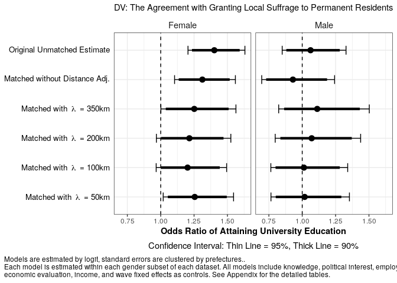
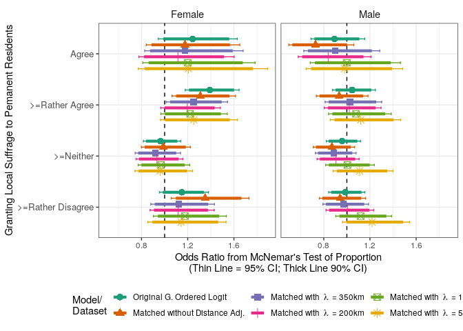

Analysis 2: Main Analysis with Matched Data
================
Fan Lu & Gento Kato
Jan 1, 2020

# Preparation

``` r
## Clean Up Space
rm(list=ls())

## Set Working Directory (Automatically) ##
require(rstudioapi); require(rprojroot)
if (rstudioapi::isAvailable()==TRUE) {
  setwd(dirname(rstudioapi::getActiveDocumentContext()$path)); 
} 
projdir <- find_root(has_file("thisishome.txt"))
cat(paste("Working Directory Set to:\n",projdir))
```

    ## Working Directory Set to:
    ##  /home/gentok/Documents/Projects/ForeignerJapan

``` r
setwd(projdir)

## packages
# devtools::install_github("gentok/estvis")
require(estvis)
require(multiwayvcov)
require(sandwich)
require(lmtest)
require(MASS)
require(ggplot2)
require(texreg)

## Load Image of Main Analysis
load(paste0(projdir,"/out/analysis_main_v4.RData"))

# Import Matched Data
sifcct_young_m1 <- readRDS(paste0(projdir, "/data/sifcct_young_matched_1.rds"))
sifcct_young_m2 <- readRDS(paste0(projdir, "/data/sifcct_young_matched_2.rds"))
sifcct_young_m3 <- readRDS(paste0(projdir, "/data/sifcct_young_matched_3.rds"))
sifcct_young_m4 <- readRDS(paste0(projdir, "/data/sifcct_young_matched_4.rds"))
sifcct_young_m5 <- readRDS(paste0(projdir, "/data/sifcct_young_matched_5.rds"))
head(sifcct$zip_pref)
```

    ## [1] "福井県" "東京都" "福井県" "埼玉県" "福岡県" "福井県"

``` r
# Replace zip_pref variable
sifcct_young_m1$zip_pref <- sifcct$zip_pref[match(sifcct_young_m1$zip,sifcct$zip)]
sifcct_young_m2$zip_pref <- sifcct$zip_pref[match(sifcct_young_m2$zip,sifcct$zip)]
sifcct_young_m3$zip_pref <- sifcct$zip_pref[match(sifcct_young_m3$zip,sifcct$zip)]
sifcct_young_m4$zip_pref <- sifcct$zip_pref[match(sifcct_young_m4$zip,sifcct$zip)]
sifcct_young_m5$zip_pref <- sifcct$zip_pref[match(sifcct_young_m5$zip,sifcct$zip)]

# Replace Education Variable
sifcct_young_m1$edu <- ifelse(sifcct_young_m1$edu==">=College(4yr)",1,0)
sifcct_young_m2$edu <- ifelse(sifcct_young_m2$edu==">=College(4yr)",1,0)
sifcct_young_m3$edu <- ifelse(sifcct_young_m3$edu==">=College(4yr)",1,0)
sifcct_young_m4$edu <- ifelse(sifcct_young_m4$edu==">=College(4yr)",1,0)
sifcct_young_m5$edu <- ifelse(sifcct_young_m5$edu==">=College(4yr)",1,0)

# Reducing Age Category from the Original Formula
basemodAm <- formula(  ~ edu + knowledge + polint + employed
                      + evecon + income + lvpr + as.factor(wave)) # sifcct
```

# Test on Matched Datasets

``` r
## Logit (>=Rather Agree)

### Matched Without Distance Adjustment
smof_4_m1 <- glm(update(foreignsuff>=0.75 ~ ., basemodAm), 
              data=sifcct_young_m1[which(sifcct_young_m1$female==1),],
              family = binomial("logit"))
smom_4_m1 <- glm(update(foreignsuff>=0.75 ~ ., basemodAm), 
              data=sifcct_young_m1[which(sifcct_young_m1$female==0),],
              family = binomial("logit"))
### Matched with Distance Adjustment (Lambda = 50k)
smof_4_m2 <- glm(update(foreignsuff>=0.75 ~ ., basemodAm), 
                 data=sifcct_young_m2[which(sifcct_young_m2$female==1),],
                 family = binomial("logit"))
smom_4_m2 <- glm(update(foreignsuff>=0.75 ~ ., basemodAm), 
                 data=sifcct_young_m2[which(sifcct_young_m2$female==0),],
                 family = binomial("logit"))
### Matched with Distance Adjustment (Lambda = 100k)
smof_4_m3 <- glm(update(foreignsuff>=0.75 ~ ., basemodAm), 
                 data=sifcct_young_m3[which(sifcct_young_m3$female==1),],
                 family = binomial("logit"))
smom_4_m3 <- glm(update(foreignsuff>=0.75 ~ ., basemodAm), 
                 data=sifcct_young_m3[which(sifcct_young_m3$female==0),],
                 family = binomial("logit"))
### Matched with Distance Adjustment (Lambda = 200k)
smof_4_m4 <- glm(update(foreignsuff>=0.75 ~ ., basemodAm), 
                 data=sifcct_young_m4[which(sifcct_young_m4$female==1),],
                 family = binomial("logit"))
smom_4_m4 <- glm(update(foreignsuff>=0.75 ~ ., basemodAm), 
                 data=sifcct_young_m4[which(sifcct_young_m4$female==0),],
                 family = binomial("logit"))
### Matched with Distance Adjustment (Lambda = 350k)
smof_4_m5 <- glm(update(foreignsuff>=0.75 ~ ., basemodAm), 
                 data=sifcct_young_m5[which(sifcct_young_m5$female==1),],
                 family = binomial("logit"))
smom_4_m5 <- glm(update(foreignsuff>=0.75 ~ ., basemodAm), 
                 data=sifcct_young_m5[which(sifcct_young_m5$female==0),],
                 family = binomial("logit"))

## Coefficient Test
smof_4_m1_test <- coeftest(smof_4_m1, vcov.=vcovCL(smof_4_m1,factor(sifcct_young_m1[which(sifcct_young_m1$female==1),]$zip_pref)))
smom_4_m1_test <- coeftest(smom_4_m1, vcov.=vcovCL(smom_4_m1,factor(sifcct_young_m1[which(sifcct_young_m1$female==0),]$zip_pref)))
smof_4_m2_test <- coeftest(smof_4_m2, vcov.=vcovCL(smof_4_m2,factor(sifcct_young_m2[which(sifcct_young_m2$female==1),]$zip_pref)))
smom_4_m2_test <- coeftest(smom_4_m2, vcov.=vcovCL(smom_4_m2,factor(sifcct_young_m2[which(sifcct_young_m2$female==0),]$zip_pref)))
smof_4_m3_test <- coeftest(smof_4_m3, vcov.=vcovCL(smof_4_m3,factor(sifcct_young_m3[which(sifcct_young_m3$female==1),]$zip_pref)))
smom_4_m3_test <- coeftest(smom_4_m3, vcov.=vcovCL(smom_4_m3,factor(sifcct_young_m3[which(sifcct_young_m3$female==0),]$zip_pref)))
smof_4_m4_test <- coeftest(smof_4_m4, vcov.=vcovCL(smof_4_m4,factor(sifcct_young_m4[which(sifcct_young_m4$female==1),]$zip_pref)))
smom_4_m4_test <- coeftest(smom_4_m4, vcov.=vcovCL(smom_4_m4,factor(sifcct_young_m4[which(sifcct_young_m4$female==0),]$zip_pref)))
smof_4_m5_test <- coeftest(smof_4_m5, vcov.=vcovCL(smof_4_m5,factor(sifcct_young_m5[which(sifcct_young_m5$female==1),]$zip_pref)))
smom_4_m5_test <- coeftest(smom_4_m5, vcov.=vcovCL(smom_4_m5,factor(sifcct_young_m5[which(sifcct_young_m5$female==0),]$zip_pref)))

## Export Table
coef_assign_sifcct_matched <- coef_assign_sifcct[-which(names(coef_assign_sifcct)%in%c('agecatMiddle Aged (40-50s)',
                                                                                       'agecatElder (>=60s)',
                                                                                       'edu:agecatMiddle Aged (40-50s)',
                                                                                       'edu:agecatElder (>=60s)'))]

lgtab_smo_m1 <- texreg(list(smof_4_m1,smom_4_m1), single.row = TRUE, 
                    caption = "Education and the Support for Foreigner's Local Suffrage (Logit, SIFCCT with Respondents 30s or Younger: Matched Without Distance Adjustment)", 
                    label = "lgtab_smo_m1",
                    custom.model.names = c("Female","Male"),
                    override.se = list(smof_4_m1_test[,2],smom_4_m1_test[,2]),
                    override.pvalues =  list(smof_4_m1_test[,4],smom_4_m1_test[,4]),
                    stars = c(0.001,0.01,0.05,0.1), symbol="\\dagger",
                    booktabs = TRUE, use.packages = FALSE,
                    custom.coef.map = coef_assign_sifcct_matched,
                    custom.note = gsub("\n","LINEBREAK",lgnote_sifcct, fixed=TRUE),
                    caption.above = TRUE, digits = 3)
lgtab_smo_m1 <- gsub("\\{dagger\\}","\\{\\\\dagger\\}", lgtab_smo_m1)
lgtab_smo_m1 <- gsub("LINEBREAK","\\}\\} \\\\\\\\ \\\\multicolumn\\{3\\}\\{l\\}\\{\\\\scriptsize\\{", lgtab_smo_m1)
lgtab_smo_m1
```

    ## 
    ## \begin{table}
    ## \caption{Education and the Support for Foreigner's Local Suffrage (Logit, SIFCCT with Respondents 30s or Younger: Matched Without Distance Adjustment)}
    ## \begin{center}
    ## \begin{tabular}{l c c }
    ## \toprule
    ##  & Female & Male \\
    ## \midrule
    ## (Intercept)          & $-1.002 \; (0.270)^{***}$ & $-1.340 \; (0.304)^{***}$    \\
    ## University Education & $0.272 \; (0.088)^{**}$   & $-0.072 \; (0.148)$          \\
    ## Knowledge            & $0.102 \; (0.284)$        & $-0.656 \; (0.173)^{***}$    \\
    ## Political Interest   & $0.572 \; (0.191)^{**}$   & $0.353 \; (0.220)$           \\
    ## Employed             & $0.097 \; (0.123)$        & $0.339 \; (0.187)^{\dagger}$ \\
    ## Economic Evaluation  & $0.342 \; (0.220)$        & $0.255 \; (0.315)$           \\
    ## Income               & $-0.131 \; (0.250)$       & $0.235 \; (0.229)$           \\
    ## Length of Residence  & $-0.237 \; (0.174)$       & $-0.384 \; (0.128)^{**}$     \\
    ## \midrule
    ## AIC                  & 2232.187                  & 1815.467                     \\
    ## BIC                  & 2385.812                  & 1967.311                     \\
    ## Log Likelihood       & -1088.094                 & -879.734                     \\
    ## Deviance             & 2176.187                  & 1759.467                     \\
    ## Num. obs.            & 1784                      & 1674                         \\
    ## \bottomrule
    ## \multicolumn{3}{l}{\scriptsize{$^{***}p<0.001$, $^{**}p<0.01$, $^*p<0.05$, $^{\dagger}p<0.1$. Wave fixed effects omitted from the output.}} \\ \multicolumn{3}{l}{\scriptsize{Response ranges from 1 = disagree to 5 = agree for supporting permanent resident's local suffrage.}} \\ \multicolumn{3}{l}{\scriptsize{The model is estimated by logit, standard errors are clustered by prefectures..}}
    ## \end{tabular}
    ## \label{lgtab_smo_m1}
    ## \end{center}
    ## \end{table}

``` r
lgtab_smo_m2 <- texreg(list(smof_4_m2,smom_4_m2), single.row = TRUE, 
                       caption = "Education and the Support for Foreigner's Local Suffrage (Logit, SIFCCT with Respondents 30s or Younger: Matched With $\\lambda$ = 50km)", 
                       label = "lgtab_smo_m2",
                       custom.model.names = c("Female","Male"),
                       override.se = list(smof_4_m2_test[,2],smom_4_m2_test[,2]),
                       override.pvalues =  list(smof_4_m2_test[,4],smom_4_m2_test[,4]),
                       stars = c(0.001,0.01,0.05,0.1), symbol="\\dagger",
                       booktabs = TRUE, use.packages = FALSE,
                       custom.coef.map = coef_assign_sifcct_matched,
                       custom.note = gsub("\n","LINEBREAK",lgnote_sifcct, fixed=TRUE),
                       caption.above = TRUE, digits = 3)
lgtab_smo_m2 <- gsub("\\{dagger\\}","\\{\\\\dagger\\}", lgtab_smo_m2)
lgtab_smo_m2 <- gsub("LINEBREAK","\\}\\} \\\\\\\\ \\\\multicolumn\\{3\\}\\{l\\}\\{\\\\scriptsize\\{", lgtab_smo_m2)
lgtab_smo_m2
```

    ## 
    ## \begin{table}
    ## \caption{Education and the Support for Foreigner's Local Suffrage (Logit, SIFCCT with Respondents 30s or Younger: Matched With $\lambda$ = 50km)}
    ## \begin{center}
    ## \begin{tabular}{l c c }
    ## \toprule
    ##  & Female & Male \\
    ## \midrule
    ## (Intercept)          & $-1.406 \; (0.302)^{***}$ & $-2.013 \; (0.346)^{***}$ \\
    ## University Education & $0.224 \; (0.114)^{*}$    & $0.107 \; (0.153)$        \\
    ## Knowledge            & $-0.385 \; (0.365)$       & $-0.139 \; (0.229)$       \\
    ## Political Interest   & $0.936 \; (0.218)^{***}$  & $0.276 \; (0.246)$        \\
    ## Employed             & $-0.011 \; (0.119)$       & $0.366 \; (0.252)$        \\
    ## Economic Evaluation  & $0.086 \; (0.194)$        & $0.428 \; (0.404)$        \\
    ## Income               & $-0.312 \; (0.419)$       & $0.681 \; (0.244)^{**}$   \\
    ## Length of Residence  & $-0.270 \; (0.213)$       & $-0.461 \; (0.168)^{**}$  \\
    ## \midrule
    ## AIC                  & 1445.007                  & 1413.942                  \\
    ## BIC                  & 1586.628                  & 1557.652                  \\
    ## Log Likelihood       & -694.503                  & -678.971                  \\
    ## Deviance             & 1389.007                  & 1357.942                  \\
    ## Num. obs.            & 1162                      & 1252                      \\
    ## \bottomrule
    ## \multicolumn{3}{l}{\scriptsize{$^{***}p<0.001$, $^{**}p<0.01$, $^*p<0.05$, $^{\dagger}p<0.1$. Wave fixed effects omitted from the output.}} \\ \multicolumn{3}{l}{\scriptsize{Response ranges from 1 = disagree to 5 = agree for supporting permanent resident's local suffrage.}} \\ \multicolumn{3}{l}{\scriptsize{The model is estimated by logit, standard errors are clustered by prefectures..}}
    ## \end{tabular}
    ## \label{lgtab_smo_m2}
    ## \end{center}
    ## \end{table}

``` r
lgtab_smo_m3 <- texreg(list(smof_4_m3,smom_4_m3), single.row = TRUE, 
                       caption = "Education and the Support for Foreigner's Local Suffrage (Logit, SIFCCT with Respondents 30s or Younger: Matched With $\\lambda$ = 100km)", 
                       label = "lgtab_smo_m3",
                       custom.model.names = c("Female","Male"),
                       override.se = list(smof_4_m3_test[,2],smom_4_m3_test[,2]),
                       override.pvalues =  list(smof_4_m3_test[,4],smom_4_m3_test[,4]),
                       stars = c(0.001,0.01,0.05,0.1), symbol="\\dagger",
                       booktabs = TRUE, use.packages = FALSE,
                       custom.coef.map = coef_assign_sifcct_matched,
                       custom.note = gsub("\n","LINEBREAK",lgnote_sifcct, fixed=TRUE),
                       caption.above = TRUE, digits = 3)
lgtab_smo_m3 <- gsub("\\{dagger\\}","\\{\\\\dagger\\}", lgtab_smo_m3)
lgtab_smo_m3 <- gsub("LINEBREAK","\\}\\} \\\\\\\\ \\\\multicolumn\\{3\\}\\{l\\}\\{\\\\scriptsize\\{", lgtab_smo_m3)
lgtab_smo_m3
```

    ## 
    ## \begin{table}
    ## \caption{Education and the Support for Foreigner's Local Suffrage (Logit, SIFCCT with Respondents 30s or Younger: Matched With $\lambda$ = 100km)}
    ## \begin{center}
    ## \begin{tabular}{l c c }
    ## \toprule
    ##  & Female & Male \\
    ## \midrule
    ## (Intercept)          & $-1.442 \; (0.334)^{***}$    & $-1.605 \; (0.369)^{***}$     \\
    ## University Education & $0.195 \; (0.116)^{\dagger}$ & $0.068 \; (0.150)$            \\
    ## Knowledge            & $-0.213 \; (0.302)$          & $-0.373 \; (0.214)^{\dagger}$ \\
    ## Political Interest   & $0.717 \; (0.237)^{**}$      & $0.263 \; (0.211)$            \\
    ## Employed             & $0.028 \; (0.109)$           & $0.360 \; (0.297)$            \\
    ## Economic Evaluation  & $0.250 \; (0.199)$           & $0.254 \; (0.365)$            \\
    ## Income               & $-0.292 \; (0.338)$          & $0.672 \; (0.189)^{***}$      \\
    ## Length of Residence  & $-0.295 \; (0.186)$          & $-0.490 \; (0.136)^{***}$     \\
    ## \midrule
    ## AIC                  & 1792.431                     & 1649.477                      \\
    ## BIC                  & 1939.864                     & 1797.985                      \\
    ## Log Likelihood       & -868.216                     & -796.739                      \\
    ## Deviance             & 1736.431                     & 1593.477                      \\
    ## Num. obs.            & 1430                         & 1486                          \\
    ## \bottomrule
    ## \multicolumn{3}{l}{\scriptsize{$^{***}p<0.001$, $^{**}p<0.01$, $^*p<0.05$, $^{\dagger}p<0.1$. Wave fixed effects omitted from the output.}} \\ \multicolumn{3}{l}{\scriptsize{Response ranges from 1 = disagree to 5 = agree for supporting permanent resident's local suffrage.}} \\ \multicolumn{3}{l}{\scriptsize{The model is estimated by logit, standard errors are clustered by prefectures..}}
    ## \end{tabular}
    ## \label{lgtab_smo_m3}
    ## \end{center}
    ## \end{table}

``` r
lgtab_smo_m4 <- texreg(list(smof_4_m4,smom_4_m4), single.row = TRUE, 
                       caption = "Education and the Support for Foreigner's Local Suffrage (Logit, SIFCCT with Respondents 30s or Younger: Matched With $\\lambda$ = 200km)", 
                       label = "lgtab_smo_m4",
                       custom.model.names = c("Female","Male"),
                       override.se = list(smof_4_m4_test[,2],smom_4_m4_test[,2]),
                       override.pvalues =  list(smof_4_m4_test[,4],smom_4_m4_test[,4]),
                       stars = c(0.001,0.01,0.05,0.1), symbol="\\dagger",
                       booktabs = TRUE, use.packages = FALSE,
                       custom.coef.map = coef_assign_sifcct_matched,
                       custom.note = gsub("\n","LINEBREAK",lgnote_sifcct, fixed=TRUE),
                       caption.above = TRUE, digits = 3)
lgtab_smo_m4 <- gsub("\\{dagger\\}","\\{\\\\dagger\\}", lgtab_smo_m4)
lgtab_smo_m4 <- gsub("LINEBREAK","\\}\\} \\\\\\\\ \\\\multicolumn\\{3\\}\\{l\\}\\{\\\\scriptsize\\{", lgtab_smo_m4)
lgtab_smo_m4
```

    ## 
    ## \begin{table}
    ## \caption{Education and the Support for Foreigner's Local Suffrage (Logit, SIFCCT with Respondents 30s or Younger: Matched With $\lambda$ = 200km)}
    ## \begin{center}
    ## \begin{tabular}{l c c }
    ## \toprule
    ##  & Female & Male \\
    ## \midrule
    ## (Intercept)          & $-1.266 \; (0.267)^{***}$    & $-1.670 \; (0.386)^{***}$ \\
    ## University Education & $0.184 \; (0.111)^{\dagger}$ & $0.012 \; (0.143)$        \\
    ## Knowledge            & $-0.195 \; (0.286)$          & $-0.533 \; (0.185)^{**}$  \\
    ## Political Interest   & $0.691 \; (0.227)^{**}$      & $0.321 \; (0.217)$        \\
    ## Employed             & $0.053 \; (0.108)$           & $0.398 \; (0.278)$        \\
    ## Economic Evaluation  & $0.432 \; (0.196)^{*}$       & $0.281 \; (0.310)$        \\
    ## Income               & $-0.108 \; (0.317)$          & $0.670 \; (0.204)^{**}$   \\
    ## Length of Residence  & $-0.296 \; (0.150)^{*}$      & $-0.417 \; (0.134)^{**}$  \\
    ## \midrule
    ## AIC                  & 2019.884                     & 1754.985                  \\
    ## BIC                  & 2170.878                     & 1905.771                  \\
    ## Log Likelihood       & -981.942                     & -849.492                  \\
    ## Deviance             & 1963.884                     & 1698.985                  \\
    ## Num. obs.            & 1624                         & 1612                      \\
    ## \bottomrule
    ## \multicolumn{3}{l}{\scriptsize{$^{***}p<0.001$, $^{**}p<0.01$, $^*p<0.05$, $^{\dagger}p<0.1$. Wave fixed effects omitted from the output.}} \\ \multicolumn{3}{l}{\scriptsize{Response ranges from 1 = disagree to 5 = agree for supporting permanent resident's local suffrage.}} \\ \multicolumn{3}{l}{\scriptsize{The model is estimated by logit, standard errors are clustered by prefectures..}}
    ## \end{tabular}
    ## \label{lgtab_smo_m4}
    ## \end{center}
    ## \end{table}

``` r
lgtab_smo_m5 <- texreg(list(smof_4_m5,smom_4_m5), single.row = TRUE, 
                       caption = "Education and the Support for Foreigner's Local Suffrage (Logit, SIFCCT with Respondents 30s or Younger: Matched With $\\lambda$ = 350km)", 
                       label = "lgtab_smo_m5",
                       custom.model.names = c("Female","Male"),
                       override.se = list(smof_4_m5_test[,2],smom_4_m5_test[,2]),
                       override.pvalues =  list(smof_4_m5_test[,4],smom_4_m5_test[,4]),
                       stars = c(0.001,0.01,0.05,0.1), symbol="\\dagger",
                       booktabs = TRUE, use.packages = FALSE,
                       custom.coef.map = coef_assign_sifcct_matched,
                       custom.note = gsub("\n","LINEBREAK",lgnote_sifcct, fixed=TRUE),
                       caption.above = TRUE, digits = 3)
lgtab_smo_m5 <- gsub("\\{dagger\\}","\\{\\\\dagger\\}", lgtab_smo_m5)
lgtab_smo_m5 <- gsub("LINEBREAK","\\}\\} \\\\\\\\ \\\\multicolumn\\{3\\}\\{l\\}\\{\\\\scriptsize\\{", lgtab_smo_m5)
lgtab_smo_m5
```

    ## 
    ## \begin{table}
    ## \caption{Education and the Support for Foreigner's Local Suffrage (Logit, SIFCCT with Respondents 30s or Younger: Matched With $\lambda$ = 350km)}
    ## \begin{center}
    ## \begin{tabular}{l c c }
    ## \toprule
    ##  & Female & Male \\
    ## \midrule
    ## (Intercept)          & $-1.304 \; (0.284)^{***}$    & $-1.538 \; (0.366)^{***}$ \\
    ## University Education & $0.227 \; (0.106)^{*}$       & $0.018 \; (0.145)$        \\
    ## Knowledge            & $-0.150 \; (0.289)$          & $-0.627 \; (0.181)^{***}$ \\
    ## Political Interest   & $0.717 \; (0.223)^{**}$      & $0.315 \; (0.213)$        \\
    ## Employed             & $0.061 \; (0.115)$           & $0.256 \; (0.244)$        \\
    ## Economic Evaluation  & $0.337 \; (0.193)^{\dagger}$ & $0.329 \; (0.319)$        \\
    ## Income               & $0.026 \; (0.309)$           & $0.705 \; (0.225)^{**}$   \\
    ## Length of Residence  & $-0.315 \; (0.157)^{*}$      & $-0.441 \; (0.132)^{***}$ \\
    ## \midrule
    ## AIC                  & 2104.617                     & 1794.082                  \\
    ## BIC                  & 2256.793                     & 1945.453                  \\
    ## Log Likelihood       & -1024.309                    & -869.041                  \\
    ## Deviance             & 2048.617                     & 1738.082                  \\
    ## Num. obs.            & 1694                         & 1646                      \\
    ## \bottomrule
    ## \multicolumn{3}{l}{\scriptsize{$^{***}p<0.001$, $^{**}p<0.01$, $^*p<0.05$, $^{\dagger}p<0.1$. Wave fixed effects omitted from the output.}} \\ \multicolumn{3}{l}{\scriptsize{Response ranges from 1 = disagree to 5 = agree for supporting permanent resident's local suffrage.}} \\ \multicolumn{3}{l}{\scriptsize{The model is estimated by logit, standard errors are clustered by prefectures..}}
    ## \end{tabular}
    ## \label{lgtab_smo_m5}
    ## \end{center}
    ## \end{table}

``` r
# Save Tex Files for OLS Tables
writeLines(lgtab_smo_m1, paste0(projdir, "/out/lgtab_smo_m1.tex"), useBytes=T)
writeLines(lgtab_smo_m2, paste0(projdir, "/out/lgtab_smo_m2.tex"), useBytes=T)
writeLines(lgtab_smo_m3, paste0(projdir, "/out/lgtab_smo_m3.tex"), useBytes=T)
writeLines(lgtab_smo_m4, paste0(projdir, "/out/lgtab_smo_m4.tex"), useBytes=T)
writeLines(lgtab_smo_m5, paste0(projdir, "/out/lgtab_smo_m5.tex"), useBytes=T)

## Coefficient CI
smof_4_m1_ci90 <- coefci(smof_4_m1, vcov.=vcovCL(smof_4_m1,factor(sifcct_young_m1[which(sifcct_young_m1$female==1),]$zip_pref)), level=0.90)
smom_4_m1_ci90 <- coefci(smom_4_m1, vcov.=vcovCL(smom_4_m1,factor(sifcct_young_m1[which(sifcct_young_m1$female==0),]$zip_pref)), level=0.90)
smof_4_m2_ci90 <- coefci(smof_4_m2, vcov.=vcovCL(smof_4_m2,factor(sifcct_young_m2[which(sifcct_young_m2$female==1),]$zip_pref)), level=0.90)
smom_4_m2_ci90 <- coefci(smom_4_m2, vcov.=vcovCL(smom_4_m2,factor(sifcct_young_m2[which(sifcct_young_m2$female==0),]$zip_pref)), level=0.90)
smof_4_m3_ci90 <- coefci(smof_4_m3, vcov.=vcovCL(smof_4_m3,factor(sifcct_young_m3[which(sifcct_young_m3$female==1),]$zip_pref)), level=0.90)
smom_4_m3_ci90 <- coefci(smom_4_m3, vcov.=vcovCL(smom_4_m3,factor(sifcct_young_m3[which(sifcct_young_m3$female==0),]$zip_pref)), level=0.90)
smof_4_m4_ci90 <- coefci(smof_4_m4, vcov.=vcovCL(smof_4_m4,factor(sifcct_young_m4[which(sifcct_young_m4$female==1),]$zip_pref)), level=0.90)
smom_4_m4_ci90 <- coefci(smom_4_m4, vcov.=vcovCL(smom_4_m4,factor(sifcct_young_m4[which(sifcct_young_m4$female==0),]$zip_pref)), level=0.90)
smof_4_m5_ci90 <- coefci(smof_4_m5, vcov.=vcovCL(smof_4_m5,factor(sifcct_young_m5[which(sifcct_young_m5$female==1),]$zip_pref)), level=0.90)
smom_4_m5_ci90 <- coefci(smom_4_m5, vcov.=vcovCL(smom_4_m5,factor(sifcct_young_m5[which(sifcct_young_m5$female==0),]$zip_pref)), level=0.90)
smof_4_m1_ci95 <- coefci(smof_4_m1, vcov.=vcovCL(smof_4_m1,factor(sifcct_young_m1[which(sifcct_young_m1$female==1),]$zip_pref)), level=0.95)
smom_4_m1_ci95 <- coefci(smom_4_m1, vcov.=vcovCL(smom_4_m1,factor(sifcct_young_m1[which(sifcct_young_m1$female==0),]$zip_pref)), level=0.95)
smof_4_m2_ci95 <- coefci(smof_4_m2, vcov.=vcovCL(smof_4_m2,factor(sifcct_young_m2[which(sifcct_young_m2$female==1),]$zip_pref)), level=0.95)
smom_4_m2_ci95 <- coefci(smom_4_m2, vcov.=vcovCL(smom_4_m2,factor(sifcct_young_m2[which(sifcct_young_m2$female==0),]$zip_pref)), level=0.95)
smof_4_m3_ci95 <- coefci(smof_4_m3, vcov.=vcovCL(smof_4_m3,factor(sifcct_young_m3[which(sifcct_young_m3$female==1),]$zip_pref)), level=0.95)
smom_4_m3_ci95 <- coefci(smom_4_m3, vcov.=vcovCL(smom_4_m3,factor(sifcct_young_m3[which(sifcct_young_m3$female==0),]$zip_pref)), level=0.95)
smof_4_m4_ci95 <- coefci(smof_4_m4, vcov.=vcovCL(smof_4_m4,factor(sifcct_young_m4[which(sifcct_young_m4$female==1),]$zip_pref)), level=0.95)
smom_4_m4_ci95 <- coefci(smom_4_m4, vcov.=vcovCL(smom_4_m4,factor(sifcct_young_m4[which(sifcct_young_m4$female==0),]$zip_pref)), level=0.95)
smof_4_m5_ci95 <- coefci(smof_4_m5, vcov.=vcovCL(smof_4_m5,factor(sifcct_young_m5[which(sifcct_young_m5$female==1),]$zip_pref)), level=0.95)
smom_4_m5_ci95 <- coefci(smom_4_m5, vcov.=vcovCL(smom_4_m5,factor(sifcct_young_m5[which(sifcct_young_m5$female==0),]$zip_pref)), level=0.95)

lgcfdt_matched <- as.data.frame(rbind(
  c(smof_4_test[2,],smof_4_ci90[2,],smof_4_ci95[2,]),
  c(smof_4_m1_test[2,],smof_4_m1_ci90[2,],smof_4_m1_ci95[2,]),
  c(smof_4_m2_test[2,],smof_4_m2_ci90[2,],smof_4_m2_ci95[2,]),
  c(smof_4_m3_test[2,],smof_4_m3_ci90[2,],smof_4_m3_ci95[2,]),
  c(smof_4_m4_test[2,],smof_4_m4_ci90[2,],smof_4_m4_ci95[2,]),
  c(smof_4_m5_test[2,],smof_4_m5_ci90[2,],smof_4_m5_ci95[2,]),
  c(smom_4_test[2,],smom_4_ci90[2,],smom_4_ci95[2,]),
  c(smom_4_m1_test[2,],smom_4_m1_ci90[2,],smom_4_m1_ci95[2,]),
  c(smom_4_m2_test[2,],smom_4_m2_ci90[2,],smom_4_m2_ci95[2,]),
  c(smom_4_m3_test[2,],smom_4_m3_ci90[2,],smom_4_m3_ci95[2,]),
  c(smom_4_m4_test[2,],smom_4_m4_ci90[2,],smom_4_m4_ci95[2,]),
  c(smom_4_m5_test[2,],smom_4_m5_ci90[2,],smom_4_m5_ci95[2,])
))
colnames(lgcfdt_matched) <- c("est","se","z","p","lci90","uci90","lci95","uci95")

lgcfdt_matched$gender <- rep(c("Female","Male"), each=6)
lgcfdt_matched$gender <- factor(lgcfdt_matched$gender, levels=unique(lgcfdt_matched$gender))

lgcfdt_matched$lambda <- c("Original Unmatched Estimate",
                           "Matched without Distance Adj.",
                           "Matched with Lambda=350km",
                           "Matched with Lambda=200km",
                           "Matched with Lambda=100km",
                           "Matched with Lambda=50km")
lgcfdt_matched$lambda <- factor(lgcfdt_matched$lambda, levels=rev(unique(lgcfdt_matched$lambda)))

cfpnote <- gsub("^%stars.*\\n|\\}","",lgnote_sifcct)
cfpnote <- gsub("\\texttt{","",cfpnote,fixed=TRUE)
cfpnote <- gsub("The model is","Models are", cfpnote)
cfpnote <- paste0(cfpnote,
                  "\nEach model is estimated within each gender subset of each dataset. All models include knowledge, political interest, employment,",
                  "\neconomic evaluation, income, and wave fixed effects as controls. See Appendix for the detailed tables.")

require(ggplot2)
p <- ggplot(lgcfdt_matched, aes(x=lambda, y=exp(est))) + 
  geom_hline(aes(yintercept=1), linetype=2) + 
  geom_errorbar(aes(ymin=exp(lci95),ymax=exp(uci95)), #linetype=pstar 
                position=position_dodge(width=-0.7), size=0.5, width=0.3) + 
  geom_errorbar(aes(ymin=exp(lci90),ymax=exp(uci90)),
                position=position_dodge(width=-0.7), size=1.5, width=0.0) +
  geom_point(position=position_dodge(width=-0.7), size=3) + 
  facet_grid( ~ gender) + 
  #scale_linetype_manual(name="Significance",values=c("solid","longdash","dotted")) + 
  scale_x_discrete(labels = rev(c("Original Unmatched Estimate",
                              "Matched without Distance Adj.",
                              bquote("Matched with" ~ lambda ~ "= 350km"),
                              bquote("Matched with" ~ lambda ~ "= 200km"),
                              bquote("Matched with" ~ lambda ~ "= 100km"),
                              bquote("Matched with" ~ lambda ~ "= 50km")))) + 
  ylab(bquote(atop(bold("Odds Ratio of Attaining University Education"),
                   "Confidence Interval: Thin Line = 95%, Thick Line = 90%"))) + 
  xlab(NULL) + 
  labs(caption=cfpnote, subtitle = "DV: The Agreement with Granting Local Suffrage to Permanent Residents") + 
  coord_flip() + theme_bw() + 
  theme(legend.position = "bottom",
        strip.text.x = element_text(size=11),
        strip.text.y = element_text(angle=0,size=11),
        strip.background = element_rect(fill=NA,color=NA),
        #axis.text.y.left = element_blank(),
        axis.ticks.y = element_blank(),
        plot.caption = element_text(hjust=0),
        plot.caption.position = "plot",
        plot.subtitle = element_text(hjust=0.5),
        axis.text.y = element_text(size=10, color="black"))
p
```

    ## Warning: position_dodge requires non-overlapping x intervals
    
    ## Warning: position_dodge requires non-overlapping x intervals

<!-- -->

``` r
ggsave(paste0(projdir,"/out/lgcoefplot_matched.png"),p,width=8,height=5)
```

    ## Warning: position_dodge requires non-overlapping x intervals
    
    ## Warning: position_dodge requires non-overlapping x intervals

# Ordinal Models

``` r
require(exact2x2)
mcnemarout <- function(dmatch, fem, th) {
  dmatch <- dmatch[which(dmatch$female==fem),]
  tmp <- as.matrix(table(dmatch[which(dmatch$treated==1),]$foreignsuff < th, 
                         dmatch[which(dmatch$treated==0),]$foreignsuff < th))
  rownames(tmp) <- colnames(tmp) <- c("Higher","Lower")
  out <- list(tab=tmp, female=fem, th=th, 
              test90=mcnemar.exact(tmp, conf.level=.90), ## Exact test
              test95=mcnemar.exact(tmp, conf.level=.95)) ## Exact test
  return(out)
}

testdt <- data.frame(fem=rep(c(1,0),4),th=rep(c(0.25,0.5,0.75,1),each=2))


sifcct_young_m1_tests <- apply(testdt, 1, function(k) mcnemarout(sifcct_young_m1, k[1], k[2]))
sifcct_young_m2_tests <- apply(testdt, 1, function(k) mcnemarout(sifcct_young_m2, k[1], k[2]))
sifcct_young_m3_tests <- apply(testdt, 1, function(k) mcnemarout(sifcct_young_m3, k[1], k[2]))
sifcct_young_m4_tests <- apply(testdt, 1, function(k) mcnemarout(sifcct_young_m4, k[1], k[2]))
sifcct_young_m5_tests <- apply(testdt, 1, function(k) mcnemarout(sifcct_young_m5, k[1], k[2]))

## Original's Odds Ratio and Confidence Intervals
smof_3_test <- data.frame(lambda="Original G. Ordered Logit", 
                          th = c(0.25,0.5,0.75,1),
                          female = 1,
                          est = exp(smof_3_sum@coef3[5:8,1]),
                          lci90 = exp(smof_3_sum@coef3[5:8,1] - smof_3_sum@coef3[5:8,2]*qnorm(0.950)),
                          uci90 = exp(smof_3_sum@coef3[5:8,1] + smof_3_sum@coef3[5:8,2]*qnorm(0.950)),
                          lci95 = exp(smof_3_sum@coef3[5:8,1] - smof_3_sum@coef3[5:8,2]*qnorm(0.975)),
                          uci95 = exp(smof_3_sum@coef3[5:8,1] + smof_3_sum@coef3[5:8,2]*qnorm(0.975)))
smom_3_test <- data.frame(lambda="Original G. Ordered Logit", 
                          th = c(0.25,0.5,0.75,1),
                          female = 0,
                          est = exp(smom_3_sum@coef3[5:8,1]),
                          lci90 = exp(smom_3_sum@coef3[5:8,1] - smom_3_sum@coef3[5:8,2]*qnorm(0.950)),
                          uci90 = exp(smom_3_sum@coef3[5:8,1] + smom_3_sum@coef3[5:8,2]*qnorm(0.950)),
                          lci95 = exp(smom_3_sum@coef3[5:8,1] - smom_3_sum@coef3[5:8,2]*qnorm(0.975)),
                          uci95 = exp(smom_3_sum@coef3[5:8,1] + smom_3_sum@coef3[5:8,2]*qnorm(0.975)))
smo3_test <- rbind(smof_3_test,smom_3_test)
smo3_test <- smo3_test[order(smo3_test$th),]

extest <- function(k, lambda) {
  data.frame(lambda=lambda,
             th=k$th,
             female = k$female,
             est = k$test90$estimate,
             lci90 = k$test90$conf.int[1], 
             uci90 = k$test90$conf.int[2], 
             lci95 = k$test95$conf.int[1], 
             uci95 = k$test95$conf.int[2])
}

mntestdt <- 
  rbind(smo3_test,
        do.call("rbind",lapply(sifcct_young_m1_tests, extest, lambda="Matched without Distance Adj.")),
        do.call("rbind",lapply(sifcct_young_m5_tests, extest, lambda="Matched with Lambda=350km")),
        do.call("rbind",lapply(sifcct_young_m4_tests, extest, lambda="Matched with Lambda=200km")),
        do.call("rbind",lapply(sifcct_young_m3_tests, extest, lambda="Matched with Lambda=100km")),
        do.call("rbind",lapply(sifcct_young_m2_tests, extest, lambda="Matched with Lambda=50km")))

mntestdt$cat=factor(rep(c(">=Rather Disagree",">=Neither",
                          ">=Rather Agree","Agree"), each=2),
                    levels=c(">=Rather Disagree",">=Neither",
                             ">=Rather Agree","Agree"))
mntestdt$gender <- c("Female","Male")
mntestdt$lambda <- factor(mntestdt$lambda, levels=unique(mntestdt$lambda))

require(ggplot2)
p <- ggplot(mntestdt, aes(x=cat, y=est)) + 
  geom_hline(aes(yintercept=1), linetype=2) + 
  geom_errorbar(aes(ymin=lci95,ymax=uci95,colour=lambda), #linetype=pstar 
                position=position_dodge(width=-0.7), size=0.5, width=0.3) + 
  geom_errorbar(aes(ymin=lci90,ymax=uci90,colour=lambda),
                position=position_dodge(width=-0.7), size=1.5, width=0.0) +
  geom_point(aes(shape=lambda, colour=lambda), 
             position=position_dodge(width=-0.7), size=3) + 
  facet_grid( ~ gender) + 
  scale_shape_discrete(name="Model/\nDataset", 
                       labels=c("Original G. Ordered Logit",
                                "Matched without Distance Adj.",
                                bquote("Matched with" ~ lambda ~ "= 350km"),
                                bquote("Matched with" ~ lambda ~ "= 200km"),
                                bquote("Matched with" ~ lambda ~ "= 100km"),
                                bquote("Matched with" ~ lambda ~ "= 50km")
                       ) 
                       ) + 
  scale_color_brewer(name="Model/\nDataset", 
                     labels=c("Original G. Ordered Logit",
                              "Matched without Distance Adj.",
                              bquote("Matched with" ~ lambda ~ "= 350km"),
                              bquote("Matched with" ~ lambda ~ "= 200km"),
                              bquote("Matched with" ~ lambda ~ "= 100km"),
                              bquote("Matched with" ~ lambda ~ "= 50km")
                     ), type="qual", palette = 2) + 
  #scale_linetype_manual(name="Significance",values=c("solid","longdash","dotted")) + 
  ylab("Odds Ratio from McNemar's Test of Proportion\n(Thin Line = 95% CI; Thick Line 90% CI)") + 
  xlab("Granting Local Suffrage to Pemanent Residents") + 
  #labs(caption=cfpnote) + 
  coord_flip() + theme_bw() + 
  theme(legend.position = "bottom",
        strip.text.x = element_text(size=11),
        strip.text.y = element_text(angle=0,size=11),
        strip.background = element_rect(fill=NA,color=NA),
        plot.caption = element_text(hjust=0),
        axis.text.y = element_text(size=10))
p
```

    ## Warning: position_dodge requires non-overlapping x intervals
    
    ## Warning: position_dodge requires non-overlapping x intervals

<!-- -->

``` r
ggsave(paste0(projdir,"/out/golcoefplot_matched.png"),p,width=8,height=5)
```

    ## Warning: position_dodge requires non-overlapping x intervals
    
    ## Warning: position_dodge requires non-overlapping x intervals
