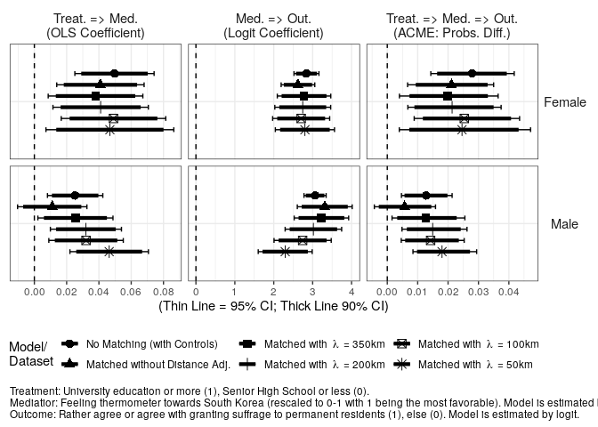

Analysis 3: Mediation Analysis with Feeling Towards Korea
================
Fan Lu & Gento Kato
Dec 31, 2019

# Preparation

``` r
## Clean Up Space
rm(list=ls())

## Set Working Directory (Automatically) ##
require(rstudioapi); require(rprojroot)
if (rstudioapi::isAvailable()==TRUE) {
  setwd(dirname(rstudioapi::getActiveDocumentContext()$path)); 
} 
projdir <- find_root(has_file("thisishome.txt"))
cat(paste("Working Directory Set to:\n",projdir))
```

    ## Working Directory Set to:
    ##  /home/gentok/Documents/Projects/ForeignerJapan

``` r
setwd(projdir)

## Load Image of Main Analysis
load(paste0(projdir,"/out/analysis_main_v4.RData"))

# Import Matched Data
sifcct_m1 <- readRDS("./data/sifcct_young_matched_1.rds")
sifcct_m2 <- readRDS("./data/sifcct_young_matched_2.rds")
sifcct_m3 <- readRDS("./data/sifcct_young_matched_3.rds")
sifcct_m4 <- readRDS("./data/sifcct_young_matched_4.rds")
sifcct_m5 <- readRDS("./data/sifcct_young_matched_5.rds")
head(sifcct$zip_pref)
```

    ## [1] "福井県" "東京都" "福井県" "埼玉県" "福岡県" "福井県"

``` r
# Replace zip_pref variable
sifcct_m1$zip_pref <- sifcct$zip_pref[match(sifcct_m1$zip,sifcct$zip)]
sifcct_m2$zip_pref <- sifcct$zip_pref[match(sifcct_m2$zip,sifcct$zip)]
sifcct_m3$zip_pref <- sifcct$zip_pref[match(sifcct_m3$zip,sifcct$zip)]
sifcct_m4$zip_pref <- sifcct$zip_pref[match(sifcct_m4$zip,sifcct$zip)]
sifcct_m5$zip_pref <- sifcct$zip_pref[match(sifcct_m5$zip,sifcct$zip)]

## packages
# devtools::install_github("gentok/estvis")
require(estvis)
require(multiwayvcov)
require(sandwich)
require(lmtest)
require(MASS)
require(ggplot2)
require(texreg)
require(mediation)
```

# Limit Data to Young People

``` r
table(sifcct$agecat)
```

    ## 
    ##        Young (<=30s) Middle Aged (40-50s)        Elder (>=60s) 
    ##                 8742                10432                 7122

``` r
sifcct <- sifcct[which(sifcct$agecat=="Young (<=30s)"),]

sifcct$wave <- as.factor(sifcct$wave)
sifcct_m1$wave <- as.factor(sifcct_m1$wave)
sifcct_m2$wave <- as.factor(sifcct_m2$wave)
sifcct_m3$wave <- as.factor(sifcct_m3$wave)
sifcct_m4$wave <- as.factor(sifcct_m4$wave)
sifcct_m5$wave <- as.factor(sifcct_m5$wave)

sifcct$foreignsuff_agree <- ifelse(sifcct$foreignsuff>=0.75,1,0)
sifcct_m1$foreignsuff_agree <- ifelse(sifcct_m1$foreignsuff>=0.75,1,0)
sifcct_m2$foreignsuff_agree <- ifelse(sifcct_m2$foreignsuff>=0.75,1,0)
sifcct_m3$foreignsuff_agree <- ifelse(sifcct_m3$foreignsuff>=0.75,1,0)
sifcct_m4$foreignsuff_agree <- ifelse(sifcct_m4$foreignsuff>=0.75,1,0)
sifcct_m5$foreignsuff_agree <- ifelse(sifcct_m5$foreignsuff>=0.75,1,0)

# Reverse Education Variable
sifcct$edu <- 1 - sifcct$edu
sifcct_m1$edu <- ifelse(sifcct_m1$edu=="<=SHS",1,0)
sifcct_m2$edu <- ifelse(sifcct_m2$edu=="<=SHS",1,0)
sifcct_m3$edu <- ifelse(sifcct_m3$edu=="<=SHS",1,0)
sifcct_m4$edu <- ifelse(sifcct_m4$edu=="<=SHS",1,0)
sifcct_m5$edu <- ifelse(sifcct_m5$edu=="<=SHS",1,0)
```

# Models

## SIFCCT (Original)

``` r
fdt <- sifcct[which(sifcct$female==1),]
mdt <- sifcct[which(sifcct$female==0),]

## Mediator Models
medf_KOR <- lm(familialityFT_KOR  ~ edu + knowledge + polint + employed + evecon + income + lvpr + wave, 
               data=fdt)
coeftest(medf_KOR, vcov.=vcovCL(medf_KOR,factor(fdt$zip_pref)))
```

    ## 
    ## t test of coefficients:
    ## 
    ##               Estimate Std. Error t value  Pr(>|t|)    
    ## (Intercept)  0.4886414  0.0204190 23.9307 < 2.2e-16 ***
    ## edu         -0.0496341  0.0125185 -3.9649 7.473e-05 ***
    ## knowledge   -0.0749258  0.0153908 -4.8682 1.170e-06 ***
    ## polint      -0.0698945  0.0179900 -3.8852 0.0001039 ***
    ## employed     0.0013752  0.0089722  0.1533 0.8781908    
    ## evecon       0.0746058  0.0256163  2.9124 0.0036062 ** 
    ## income       0.0115989  0.0102258  1.1343 0.2567458    
    ## lvpr        -0.0259001  0.0117913 -2.1965 0.0281110 *  
    ## wave3       -0.0463676  0.0247213 -1.8756 0.0607826 .  
    ## wave4       -0.0074182  0.0179772 -0.4126 0.6798891    
    ## wave5       -0.0258408  0.0302570 -0.8540 0.3931316    
    ## wave6        0.0073047  0.0251448  0.2905 0.7714442    
    ## wave7        0.0066097  0.0287530  0.2299 0.8181970    
    ## wave8       -0.0478916  0.0232496 -2.0599 0.0394740 *  
    ## wave9       -0.0350360  0.0237190 -1.4771 0.1397218    
    ## wave10      -0.0551931  0.0250213 -2.2058 0.0274521 *  
    ## wave11      -0.1146279  0.0254376 -4.5062 6.789e-06 ***
    ## wave12      -0.1484400  0.0306498 -4.8431 1.327e-06 ***
    ## wave13      -0.1389870  0.0249618 -5.5680 2.748e-08 ***
    ## wave14      -0.1147339  0.0244024 -4.7017 2.667e-06 ***
    ## wave15      -0.1422276  0.0246430 -5.7715 8.457e-09 ***
    ## wave16      -0.1149431  0.0305379 -3.7640 0.0001697 ***
    ## wave17      -0.1296243  0.0283869 -4.5663 5.114e-06 ***
    ## wave18      -0.1242801  0.0203751 -6.0996 1.165e-09 ***
    ## wave19      -0.1158268  0.0235900 -4.9100 9.475e-07 ***
    ## wave20      -0.1277505  0.0223257 -5.7221 1.130e-08 ***
    ## wave21      -0.1290546  0.0307346 -4.1990 2.740e-05 ***
    ## wave22      -0.1185128  0.0239265 -4.9532 7.604e-07 ***
    ## ---
    ## Signif. codes:  0 '***' 0.001 '**' 0.01 '*' 0.05 '.' 0.1 ' ' 1

``` r
medm_KOR <- lm(familialityFT_KOR  ~ edu + knowledge + polint + employed + evecon + income + lvpr + wave, 
               data=mdt)
coeftest(medm_KOR, vcov.=vcovCL(medm_KOR,factor(mdt$zip_pref)))
```

    ## 
    ## t test of coefficients:
    ## 
    ##               Estimate Std. Error t value  Pr(>|t|)    
    ## (Intercept)  0.3659481  0.0229760 15.9274 < 2.2e-16 ***
    ## edu         -0.0252638  0.0087461 -2.8886 0.0038876 ** 
    ## knowledge   -0.0809239  0.0123426 -6.5564 6.102e-11 ***
    ## polint      -0.0433256  0.0119926 -3.6127 0.0003062 ***
    ## employed     0.0084814  0.0107427  0.7895 0.4298611    
    ## evecon       0.0277316  0.0127755  2.1707 0.0300052 *  
    ## income       0.0346399  0.0153701  2.2537 0.0242597 *  
    ## lvpr        -0.0373074  0.0117086 -3.1863 0.0014504 ** 
    ## wave3        0.0207654  0.0227884  0.9112 0.3622222    
    ## wave4        0.0341194  0.0170829  1.9973 0.0458524 *  
    ## wave5        0.0316808  0.0288520  1.0980 0.2722418    
    ## wave6       -0.0020266  0.0183087 -0.1107 0.9118645    
    ## wave7        0.0078858  0.0232146  0.3397 0.7341039    
    ## wave8        0.0549908  0.0230379  2.3870 0.0170271 *  
    ## wave9        0.0101707  0.0241719  0.4208 0.6739467    
    ## wave10       0.0181676  0.0221360  0.8207 0.4118446    
    ## wave11      -0.1386393  0.0185535 -7.4724 9.334e-14 ***
    ## wave12      -0.0923680  0.0164137 -5.6275 1.934e-08 ***
    ## wave13      -0.1119857  0.0202757 -5.5231 3.509e-08 ***
    ## wave14      -0.0593399  0.0250805 -2.3660 0.0180227 *  
    ## wave15      -0.0581716  0.0267453 -2.1750 0.0296784 *  
    ## wave16      -0.0342670  0.0218897 -1.5654 0.1175464    
    ## wave17      -0.0680601  0.0156012 -4.3625 1.313e-05 ***
    ## wave18      -0.0640227  0.0165722 -3.8633 0.0001134 ***
    ## wave19      -0.0715961  0.0273660 -2.6162 0.0089187 ** 
    ## wave20      -0.0922537  0.0227061 -4.0629 4.925e-05 ***
    ## wave21      -0.0987832  0.0214606 -4.6030 4.274e-06 ***
    ## wave22      -0.0901175  0.0205767 -4.3796 1.215e-05 ***
    ## ---
    ## Signif. codes:  0 '***' 0.001 '**' 0.01 '*' 0.05 '.' 0.1 ' ' 1

``` r
## Outcome Models 
outf_KOR <- glm(foreignsuff_agree  ~ edu + familialityFT_KOR + edu:familialityFT_KOR + 
                knowledge + polint + employed + evecon + income + lvpr + wave, data=fdt, family=binomial("logit"))
coeftest(outf_KOR, vcov.=vcovCL(outf_KOR,factor(fdt$zip_pref)))
```

    ## 
    ## z test of coefficients:
    ## 
    ##                         Estimate Std. Error z value  Pr(>|z|)    
    ## (Intercept)           -1.9398725  0.2198127 -8.8251 < 2.2e-16 ***
    ## edu                    0.1608950  0.1321264  1.2177 0.2233246    
    ## familialityFT_KOR      2.8413290  0.1635210 17.3759 < 2.2e-16 ***
    ## knowledge              0.0633763  0.1273105  0.4978 0.6186185    
    ## polint                 0.5636807  0.1506192  3.7424 0.0001823 ***
    ## employed               0.0053764  0.0725682  0.0741 0.9409401    
    ## evecon                 0.4354763  0.1944902  2.2391 0.0251517 *  
    ## income                -0.0530351  0.1591447 -0.3333 0.7389450    
    ## lvpr                  -0.0642172  0.1175434 -0.5463 0.5848410    
    ## wave3                 -0.2279016  0.2031953 -1.1216 0.2620371    
    ## wave4                 -0.3227830  0.2248107 -1.4358 0.1510595    
    ## wave5                 -0.2791027  0.2060147 -1.3548 0.1754907    
    ## wave6                 -0.0827280  0.1873303 -0.4416 0.6587675    
    ## wave7                 -0.2121686  0.2051776 -1.0341 0.3011022    
    ## wave8                 -0.2749184  0.2072063 -1.3268 0.1845795    
    ## wave9                 -0.5341196  0.2141691 -2.4939 0.0126343 *  
    ## wave10                -0.1927711  0.2494553 -0.7728 0.4396595    
    ## wave11                -0.4247940  0.2382687 -1.7828 0.0746129 .  
    ## wave12                 0.0070156  0.1745948  0.0402 0.9679480    
    ## wave13                -0.1962083  0.1984007 -0.9889 0.3226877    
    ## wave14                -0.2080375  0.2384913 -0.8723 0.3830412    
    ## wave15                -0.1289611  0.2086452 -0.6181 0.5365172    
    ## wave16                -0.1673229  0.1855489 -0.9018 0.3671776    
    ## wave17                -0.3228111  0.2199301 -1.4678 0.1421614    
    ## wave18                -0.0679775  0.1960917 -0.3467 0.7288453    
    ## wave19                -0.2943371  0.2255833 -1.3048 0.1919671    
    ## wave20                -0.0606694  0.1803591 -0.3364 0.7365836    
    ## wave21                -0.2969912  0.2117659 -1.4025 0.1607808    
    ## wave22                 0.1222920  0.1976374  0.6188 0.5360684    
    ## edu:familialityFT_KOR -0.9293528  0.2702530 -3.4388 0.0005842 ***
    ## ---
    ## Signif. codes:  0 '***' 0.001 '**' 0.01 '*' 0.05 '.' 0.1 ' ' 1

``` r
outm_KOR <- glm(foreignsuff_agree  ~ edu + familialityFT_KOR + edu:familialityFT_KOR + 
                  knowledge + polint + employed + evecon + income + lvpr + wave, data=mdt, family=binomial("logit"))
coeftest(outm_KOR, vcov.=vcovCL(outm_KOR,factor(mdt$zip_pref)))
```

    ## 
    ## z test of coefficients:
    ## 
    ##                         Estimate Std. Error z value  Pr(>|z|)    
    ## (Intercept)           -2.5852257  0.2636313 -9.8062 < 2.2e-16 ***
    ## edu                    0.2694540  0.1809388  1.4892  0.136435    
    ## familialityFT_KOR      3.0619191  0.1452377 21.0821 < 2.2e-16 ***
    ## knowledge             -0.2616231  0.1170827 -2.2345  0.025449 *  
    ## polint                 0.0929036  0.1612113  0.5763  0.564423    
    ## employed               0.2006214  0.1050280  1.9102  0.056111 .  
    ## evecon                 0.1092278  0.2072794  0.5270  0.598222    
    ## income                 0.3271615  0.1422254  2.3003  0.021431 *  
    ## lvpr                  -0.2523466  0.0813769 -3.1010  0.001929 ** 
    ## wave3                  0.0137482  0.3003929  0.0458  0.963496    
    ## wave4                 -0.0054596  0.2898030 -0.0188  0.984970    
    ## wave5                  0.2130392  0.2135316  0.9977  0.318428    
    ## wave6                  0.2477322  0.2633396  0.9407  0.346842    
    ## wave7                  0.3703926  0.2657313  1.3939  0.163359    
    ## wave8                  0.2120371  0.3347759  0.6334  0.526492    
    ## wave9                  0.2742173  0.2540776  1.0793  0.280469    
    ## wave10                 0.3890407  0.2633773  1.4771  0.139643    
    ## wave11                 0.7840228  0.2597082  3.0189  0.002537 ** 
    ## wave12                 0.6440225  0.2619810  2.4583  0.013960 *  
    ## wave13                 0.3882393  0.3273489  1.1860  0.235618    
    ## wave14                 0.3481279  0.2729620  1.2754  0.202178    
    ## wave15                 0.2204629  0.3379514  0.6524  0.514175    
    ## wave16                 0.4945682  0.2927341  1.6895  0.091128 .  
    ## wave17                 0.4962259  0.2606389  1.9039  0.056925 .  
    ## wave18                 0.3881799  0.2088603  1.8586  0.063089 .  
    ## wave19                 0.3756957  0.2552197  1.4720  0.141008    
    ## wave20                 0.6468099  0.3329997  1.9424  0.052092 .  
    ## wave21                 0.3769520  0.3362346  1.1211  0.262246    
    ## wave22                 0.5314579  0.3285259  1.6177  0.105726    
    ## edu:familialityFT_KOR -0.8880775  0.3961411 -2.2418  0.024973 *  
    ## ---
    ## Signif. codes:  0 '***' 0.001 '**' 0.01 '*' 0.05 '.' 0.1 ' ' 1

``` r
## Causal Mediation Analysis
set.seed(2345)
medoutf_KOR <- mediate(medf_KOR, outf_KOR, treat = "edu", 
                  mediator = "familialityFT_KOR", 
                  cluster=factor(fdt$zip_pref))
summary(medoutf_KOR)
```

    ## 
    ## Causal Mediation Analysis 
    ## 
    ## Quasi-Bayesian Confidence Intervals
    ## 
    ##                          Estimate 95% CI Lower 95% CI Upper p-value    
    ## ACME (control)            -0.0279      -0.0418        -0.01  <2e-16 ***
    ## ACME (treated)            -0.0186      -0.0288        -0.01  <2e-16 ***
    ## ADE (control)             -0.0455      -0.0811        -0.01   0.010 ** 
    ## ADE (treated)             -0.0362      -0.0699         0.00   0.036 *  
    ## Total Effect              -0.0641      -0.0991        -0.03  <2e-16 ***
    ## Prop. Mediated (control)   0.4334       0.2182         0.92  <2e-16 ***
    ## Prop. Mediated (treated)   0.2902       0.1340         0.66  <2e-16 ***
    ## ACME (average)            -0.0233      -0.0351        -0.01  <2e-16 ***
    ## ADE (average)             -0.0409      -0.0752        -0.01   0.016 *  
    ## Prop. Mediated (average)   0.3618       0.1811         0.79  <2e-16 ***
    ## ---
    ## Signif. codes:  0 '***' 0.001 '**' 0.01 '*' 0.05 '.' 0.1 ' ' 1
    ## 
    ## Sample Size Used: 3989 
    ## 
    ## 
    ## Simulations: 1000

``` r
set.seed(2345)
medoutm_KOR <- mediate(medm_KOR, outm_KOR, treat = "edu", 
                       mediator = "familialityFT_KOR", 
                       cluster=factor(mdt$zip_pref))
summary(medoutm_KOR)
```

    ## 
    ## Causal Mediation Analysis 
    ## 
    ## Quasi-Bayesian Confidence Intervals
    ## 
    ##                          Estimate 95% CI Lower 95% CI Upper p-value   
    ## ACME (control)           -0.01278     -0.02133         0.00   0.004 **
    ## ACME (treated)           -0.00941     -0.01744         0.00   0.004 **
    ## ADE (control)            -0.00554     -0.04689         0.04   0.770   
    ## ADE (treated)            -0.00216     -0.04282         0.04   0.910   
    ## Total Effect             -0.01494     -0.05430         0.03   0.470   
    ## Prop. Mediated (control)  0.44066     -5.00599         7.40   0.474   
    ## Prop. Mediated (treated)  0.31357     -3.94102         6.00   0.474   
    ## ACME (average)           -0.01110     -0.01900         0.00   0.004 **
    ## ADE (average)            -0.00385     -0.04396         0.04   0.838   
    ## Prop. Mediated (average)  0.37711     -4.27453         6.78   0.474   
    ## ---
    ## Signif. codes:  0 '***' 0.001 '**' 0.01 '*' 0.05 '.' 0.1 ' ' 1
    ## 
    ## Sample Size Used: 4737 
    ## 
    ## 
    ## Simulations: 1000

## Matched without Distance Adjustment

``` r
fdt_m1 <- sifcct_m1[which(sifcct_m1$female==1),]
mdt_m1 <- sifcct_m1[which(sifcct_m1$female==0),]

## Mediator Models
medf_KOR_m1 <- lm(familialityFT_KOR  ~ edu + #,
                    knowledge + polint + employed + evecon + income + lvpr + wave, 
                    data=fdt_m1)
coeftest(medf_KOR_m1, vcov.=vcovCL(medf_KOR_m1, factor(fdt_m1$zip_pref)))
```

    ## 
    ## t test of coefficients:
    ## 
    ##               Estimate Std. Error t value  Pr(>|t|)    
    ## (Intercept)  0.4495707  0.0375953 11.9582 < 2.2e-16 ***
    ## edu         -0.0409274  0.0138000 -2.9657 0.0030602 ** 
    ## knowledge   -0.0389393  0.0294237 -1.3234 0.1858757    
    ## polint      -0.0851967  0.0300975 -2.8307 0.0046977 ** 
    ## employed     0.0021055  0.0133558  0.1576 0.8747554    
    ## evecon       0.1057405  0.0310209  3.4087 0.0006675 ***
    ## income       0.0207909  0.0210020  0.9899 0.3223350    
    ## lvpr        -0.0297457  0.0156485 -1.9009 0.0574835 .  
    ## wave3       -0.0534111  0.0494579 -1.0799 0.2803219    
    ## wave4        0.0014348  0.0358927  0.0400 0.9681185    
    ## wave5        0.0050070  0.0328589  0.1524 0.8789065    
    ## wave6        0.0397880  0.0366002  1.0871 0.2771423    
    ## wave7       -0.0052469  0.0295213 -0.1777 0.8589526    
    ## wave8       -0.0472408  0.0412253 -1.1459 0.2519854    
    ## wave9       -0.0330858  0.0382538 -0.8649 0.3872098    
    ## wave10       0.0029339  0.0269737  0.1088 0.9133994    
    ## wave11      -0.1190285  0.0396717 -3.0003 0.0027348 ** 
    ## wave12      -0.1308037  0.0292005 -4.4795 7.964e-06 ***
    ## wave13      -0.1193122  0.0433991 -2.7492 0.0060355 ** 
    ## wave14      -0.1069969  0.0360970 -2.9642 0.0030761 ** 
    ## wave15      -0.1327919  0.0345105 -3.8479 0.0001234 ***
    ## wave16      -0.0860213  0.0356877 -2.4104 0.0160377 *  
    ## wave17      -0.0825231  0.0329409 -2.5052 0.0123285 *  
    ## wave18      -0.1152174  0.0359055 -3.2089 0.0013564 ** 
    ## wave19      -0.0621842  0.0307217 -2.0241 0.0431097 *  
    ## wave20      -0.0959440  0.0340567 -2.8172 0.0048989 ** 
    ## wave21      -0.1189704  0.0286072 -4.1588 3.354e-05 ***
    ## wave22      -0.0870677  0.0371727 -2.3422 0.0192791 *  
    ## ---
    ## Signif. codes:  0 '***' 0.001 '**' 0.01 '*' 0.05 '.' 0.1 ' ' 1

``` r
medm_KOR_m1 <- lm(familialityFT_KOR  ~ edu + #,
                    knowledge + polint + employed + evecon + income + lvpr + wave, 
                    data=mdt_m1)
coeftest(medm_KOR_m1, vcov.=vcovCL(medm_KOR_m1,factor(mdt_m1$zip_pref)))
```

    ## 
    ## t test of coefficients:
    ## 
    ##               Estimate Std. Error t value  Pr(>|t|)    
    ## (Intercept)  0.3788897  0.0430080  8.8098 < 2.2e-16 ***
    ## edu         -0.0110790  0.0109526 -1.0115 0.3119078    
    ## knowledge   -0.1201773  0.0205700 -5.8423 6.191e-09 ***
    ## polint      -0.0318508  0.0235402 -1.3530 0.1762300    
    ## employed    -0.0065056  0.0186560 -0.3487 0.7273481    
    ## evecon       0.0548506  0.0213525  2.5688 0.0102921 *  
    ## income       0.0336328  0.0388021  0.8668 0.3861911    
    ## lvpr        -0.0323010  0.0179494 -1.7996 0.0721135 .  
    ## wave3        0.0164609  0.0343875  0.4787 0.6322240    
    ## wave4        0.0221911  0.0381272  0.5820 0.5606263    
    ## wave5        0.0128333  0.0305286  0.4204 0.6742689    
    ## wave6       -0.0035455  0.0410942 -0.0863 0.9312573    
    ## wave7       -0.0639864  0.0255447 -2.5049 0.0123454 *  
    ## wave8        0.0094068  0.0446450  0.2107 0.8331461    
    ## wave9       -0.0060107  0.0466489 -0.1288 0.8974923    
    ## wave10       0.0212310  0.0376248  0.5643 0.5726385    
    ## wave11      -0.1375632  0.0319051 -4.3116 1.717e-05 ***
    ## wave12      -0.1269374  0.0276579 -4.5896 4.779e-06 ***
    ## wave13      -0.1187462  0.0429734 -2.7632 0.0057867 ** 
    ## wave14      -0.0370648  0.0291150 -1.2730 0.2031809    
    ## wave15      -0.0700685  0.0418832 -1.6729 0.0945272 .  
    ## wave16      -0.0433433  0.0408399 -1.0613 0.2887106    
    ## wave17      -0.0881960  0.0331277 -2.6623 0.0078364 ** 
    ## wave18      -0.0949990  0.0243810 -3.8964 0.0001015 ***
    ## wave19      -0.0644009  0.0371612 -1.7330 0.0832807 .  
    ## wave20      -0.1192374  0.0301596 -3.9535 8.026e-05 ***
    ## wave21      -0.1111284  0.0329378 -3.3739 0.0007583 ***
    ## wave22      -0.0818114  0.0371047 -2.2049 0.0276006 *  
    ## ---
    ## Signif. codes:  0 '***' 0.001 '**' 0.01 '*' 0.05 '.' 0.1 ' ' 1

``` r
## Outcome Models
outf_KOR_m1 <- glm(foreignsuff_agree  ~ edu + familialityFT_KOR + edu:familialityFT_KOR + #,
                     knowledge + polint + employed + evecon + income + lvpr + wave, 
                     data=fdt_m1, family=binomial("logit"))
coeftest(outf_KOR_m1, vcov.=vcovCL(outf_KOR_m1,factor(fdt_m1$zip_pref)))
```

    ## 
    ## z test of coefficients:
    ## 
    ##                         Estimate Std. Error z value  Pr(>|z|)    
    ## (Intercept)           -1.9664430  0.2914263 -6.7477 1.503e-11 ***
    ## edu                    0.0641177  0.1359484  0.4716   0.63719    
    ## familialityFT_KOR      2.6223260  0.2205334 11.8908 < 2.2e-16 ***
    ## knowledge              0.1650659  0.2953023  0.5590   0.57618    
    ## polint                 0.8118253  0.1819743  4.4612 8.150e-06 ***
    ## employed               0.0862541  0.1206948  0.7146   0.47483    
    ## evecon                 0.1169626  0.2425622  0.4822   0.62967    
    ## income                -0.1738571  0.2850219 -0.6100   0.54188    
    ## lvpr                  -0.1706860  0.1807028 -0.9446   0.34488    
    ## wave3                 -0.3893310  0.4677832 -0.8323   0.40525    
    ## wave4                 -0.0522742  0.3064353 -0.1706   0.86455    
    ## wave5                 -0.3119895  0.3321993 -0.9392   0.34765    
    ## wave6                  0.1454082  0.2932473  0.4959   0.62000    
    ## wave7                 -0.2799560  0.2459849 -1.1381   0.25508    
    ## wave8                 -0.2660730  0.3855958 -0.6900   0.49017    
    ## wave9                 -0.4341439  0.3480573 -1.2473   0.21227    
    ## wave10                 0.0384678  0.3809260  0.1010   0.91956    
    ## wave11                -0.3935601  0.2798729 -1.4062   0.15966    
    ## wave12                 0.0490843  0.3395355  0.1446   0.88506    
    ## wave13                -0.1113581  0.3613883 -0.3081   0.75798    
    ## wave14                -0.0947036  0.4483908 -0.2112   0.83273    
    ## wave15                -0.0029768  0.3396263 -0.0088   0.99301    
    ## wave16                -0.1123779  0.2894434 -0.3883   0.69783    
    ## wave17                -0.1824470  0.3980116 -0.4584   0.64667    
    ## wave18                -0.1794914  0.2901967 -0.6185   0.53624    
    ## wave19                -0.1350918  0.2942338 -0.4591   0.64614    
    ## wave20                 0.1660545  0.3035428  0.5471   0.58434    
    ## wave21                -0.2176701  0.3108741 -0.7002   0.48381    
    ## wave22                 0.3875336  0.3356663  1.1545   0.24829    
    ## edu:familialityFT_KOR -0.6552831  0.3004514 -2.1810   0.02918 *  
    ## ---
    ## Signif. codes:  0 '***' 0.001 '**' 0.01 '*' 0.05 '.' 0.1 ' ' 1

``` r
outm_KOR_m1 <- glm(foreignsuff_agree  ~ edu + familialityFT_KOR + edu:familialityFT_KOR + #,
                     knowledge + polint + employed + evecon + income + lvpr + wave, 
                     data=mdt_m1, family=binomial("logit"))
coeftest(outm_KOR_m1, vcov.=vcovCL(outm_KOR_m1,factor(mdt_m1$zip_pref)))
```

    ## 
    ## z test of coefficients:
    ## 
    ##                        Estimate Std. Error z value  Pr(>|z|)    
    ## (Intercept)           -2.807495   0.408001 -6.8811 5.939e-12 ***
    ## edu                    0.449745   0.271233  1.6581   0.09729 .  
    ## familialityFT_KOR      3.310891   0.359948  9.1983 < 2.2e-16 ***
    ## knowledge             -0.354017   0.172677 -2.0502   0.04035 *  
    ## polint                 0.489530   0.212280  2.3061   0.02111 *  
    ## employed               0.381327   0.189134  2.0162   0.04378 *  
    ## evecon                 0.109688   0.337394  0.3251   0.74510    
    ## income                 0.158691   0.233001  0.6811   0.49583    
    ## lvpr                  -0.303516   0.143930 -2.1088   0.03496 *  
    ## wave3                 -0.144033   0.394658 -0.3650   0.71514    
    ## wave4                  0.068258   0.534109  0.1278   0.89831    
    ## wave5                 -0.356391   0.444399 -0.8020   0.42257    
    ## wave6                  0.328141   0.468526  0.7004   0.48370    
    ## wave7                  0.385464   0.385524  0.9998   0.31739    
    ## wave8                 -0.107228   0.492160 -0.2179   0.82753    
    ## wave9                 -0.509220   0.468670 -1.0865   0.27725    
    ## wave10                 0.222984   0.452426  0.4929   0.62211    
    ## wave11                 0.768248   0.414677  1.8526   0.06393 .  
    ## wave12                 0.458826   0.388652  1.1806   0.23778    
    ## wave13                 0.233293   0.549641  0.4244   0.67124    
    ## wave14                 0.073780   0.466363  0.1582   0.87430    
    ## wave15                -0.284172   0.481575 -0.5901   0.55513    
    ## wave16                 0.208907   0.506021  0.4128   0.67972    
    ## wave17                 0.186892   0.590105  0.3167   0.75146    
    ## wave18                 0.458491   0.462796  0.9907   0.32183    
    ## wave19                 0.120762   0.487521  0.2477   0.80436    
    ## wave20                 0.189876   0.485397  0.3912   0.69567    
    ## wave21                -0.067542   0.525707 -0.1285   0.89777    
    ## wave22                -0.354880   0.577059 -0.6150   0.53857    
    ## edu:familialityFT_KOR -1.050729   0.563461 -1.8648   0.06221 .  
    ## ---
    ## Signif. codes:  0 '***' 0.001 '**' 0.01 '*' 0.05 '.' 0.1 ' ' 1

``` r
## Causal Mediation Analysis
set.seed(2345)
medoutf_KOR_m1 <- mediate(medf_KOR_m1, outf_KOR_m1, treat = "edu", 
                       mediator = "familialityFT_KOR", 
                       cluster=factor(fdt_m1$zip_pref))
summary(medoutf_KOR_m1)
```

    ## 
    ## Causal Mediation Analysis 
    ## 
    ## Quasi-Bayesian Confidence Intervals
    ## 
    ##                          Estimate 95% CI Lower 95% CI Upper p-value    
    ## ACME (control)            -0.0211      -0.0350        -0.01   0.004 ** 
    ## ACME (treated)            -0.0154      -0.0265         0.00   0.004 ** 
    ## ADE (control)             -0.0416      -0.0794         0.00   0.030 *  
    ## ADE (treated)             -0.0359      -0.0698         0.00   0.060 .  
    ## Total Effect              -0.0570      -0.0960        -0.02  <2e-16 ***
    ## Prop. Mediated (control)   0.3672       0.1379         1.06   0.004 ** 
    ## Prop. Mediated (treated)   0.2665       0.0957         0.87   0.004 ** 
    ## ACME (average)            -0.0183      -0.0308        -0.01   0.004 ** 
    ## ADE (average)             -0.0387      -0.0744         0.00   0.048 *  
    ## Prop. Mediated (average)   0.3169       0.1205         0.97   0.004 ** 
    ## ---
    ## Signif. codes:  0 '***' 0.001 '**' 0.01 '*' 0.05 '.' 0.1 ' ' 1
    ## 
    ## Sample Size Used: 1784 
    ## 
    ## 
    ## Simulations: 1000

``` r
set.seed(2345)
medoutm_KOR_m1 <- mediate(medm_KOR_m1, outm_KOR_m1, treat = "edu", 
                       mediator = "familialityFT_KOR", 
                       cluster=factor(mdt_m1$zip_pref))
summary(medoutm_KOR_m1)
```

    ## 
    ## Causal Mediation Analysis 
    ## 
    ## Quasi-Bayesian Confidence Intervals
    ## 
    ##                          Estimate 95% CI Lower 95% CI Upper p-value
    ## ACME (control)           -0.00567     -0.01587         0.00    0.27
    ## ACME (treated)           -0.00433     -0.01348         0.00    0.27
    ## ADE (control)             0.01539     -0.03648         0.07    0.56
    ## ADE (treated)             0.01673     -0.03536         0.07    0.51
    ## Total Effect              0.01106     -0.04212         0.07    0.68
    ## Prop. Mediated (control) -0.06618     -4.19694         3.63    0.83
    ## Prop. Mediated (treated) -0.05224     -3.34654         2.75    0.83
    ## ACME (average)           -0.00500     -0.01470         0.00    0.27
    ## ADE (average)             0.01606     -0.03566         0.07    0.54
    ## Prop. Mediated (average) -0.05921     -3.61311         3.17    0.83
    ## 
    ## Sample Size Used: 1674 
    ## 
    ## 
    ## Simulations: 1000

## Matched with Distance Adjustment (Lambda=50km)

``` r
fdt_m2 <- sifcct_m2[which(sifcct_m2$female==1),]
mdt_m2 <- sifcct_m2[which(sifcct_m2$female==0),]

## Mediator Models
medf_KOR_m2 <- lm(familialityFT_KOR  ~ edu + #,
                    knowledge + polint + employed + evecon + income + lvpr + wave, 
                    data=fdt_m2)
coeftest(medf_KOR_m2, vcov.=vcovCL(medf_KOR_m2, factor(fdt_m2$zip_pref)))
```

    ## 
    ## t test of coefficients:
    ## 
    ##                Estimate  Std. Error t value  Pr(>|t|)    
    ## (Intercept)  0.40603861  0.04937359  8.2238 5.352e-16 ***
    ## edu         -0.04679119  0.02018540 -2.3181   0.02062 *  
    ## knowledge   -0.07275302  0.03292645 -2.2096   0.02733 *  
    ## polint      -0.07188903  0.03689076 -1.9487   0.05158 .  
    ## employed     0.01597268  0.01928388  0.8283   0.40768    
    ## evecon       0.06463309  0.04006668  1.6131   0.10699    
    ## income       0.05242404  0.02412069  2.1734   0.02996 *  
    ## lvpr        -0.03874543  0.02076937 -1.8655   0.06237 .  
    ## wave3        0.03241756  0.05996136  0.5406   0.58886    
    ## wave4        0.03272473  0.07165681  0.4567   0.64798    
    ## wave5       -0.00589466  0.04990808 -0.1181   0.90600    
    ## wave6        0.03108434  0.05966678  0.5210   0.60249    
    ## wave7        0.07617823  0.05804742  1.3123   0.18967    
    ## wave8        0.05638239  0.06226828  0.9055   0.36541    
    ## wave9        0.03379521  0.06525627  0.5179   0.60464    
    ## wave10       0.00027551  0.07274022  0.0038   0.99698    
    ## wave11      -0.08502792  0.05969091 -1.4245   0.15459    
    ## wave12      -0.03560711  0.04052355 -0.8787   0.37976    
    ## wave13      -0.11811363  0.07959518 -1.4839   0.13811    
    ## wave14      -0.10874327  0.05656372 -1.9225   0.05479 .  
    ## wave15      -0.07885128  0.05406432 -1.4585   0.14499    
    ## wave16      -0.01323623  0.04887767 -0.2708   0.78659    
    ## wave17      -0.07687527  0.06097911 -1.2607   0.20768    
    ## wave18      -0.05974561  0.06063899 -0.9853   0.32470    
    ## wave19      -0.02705365  0.06183288 -0.4375   0.66181    
    ## wave20      -0.06363099  0.06933346 -0.9178   0.35894    
    ## wave21      -0.03966944  0.04202826 -0.9439   0.34543    
    ## wave22      -0.07402388  0.06048426 -1.2239   0.22126    
    ## ---
    ## Signif. codes:  0 '***' 0.001 '**' 0.01 '*' 0.05 '.' 0.1 ' ' 1

``` r
medm_KOR_m2 <- lm(familialityFT_KOR  ~ edu + #,
                    knowledge + polint + employed + evecon + income + lvpr + wave, 
                    data=mdt_m2)
coeftest(medm_KOR_m2, vcov.=vcovCL(medm_KOR_m2,factor(mdt_m2$zip_pref)))
```

    ## 
    ## t test of coefficients:
    ## 
    ##               Estimate Std. Error t value  Pr(>|t|)    
    ## (Intercept)  0.3371122  0.0610702  5.5201 4.133e-08 ***
    ## edu         -0.0463537  0.0123951 -3.7397 0.0001928 ***
    ## knowledge   -0.0819676  0.0275979 -2.9701 0.0030355 ** 
    ## polint      -0.0258443  0.0225624 -1.1455 0.2522441    
    ## employed     0.0496488  0.0340166  1.4595 0.1446713    
    ## evecon       0.0528458  0.0282463  1.8709 0.0615981 .  
    ## income      -0.0022160  0.0422488 -0.0525 0.9581778    
    ## lvpr        -0.0017891  0.0220472 -0.0811 0.9353364    
    ## wave3        0.0448272  0.0355097  1.2624 0.2070474    
    ## wave4        0.0316240  0.0538168  0.5876 0.5568938    
    ## wave5        0.0082590  0.0366218  0.2255 0.8216116    
    ## wave6       -0.0457433  0.0420842 -1.0869 0.2772739    
    ## wave7       -0.0068433  0.0492950 -0.1388 0.8896132    
    ## wave8        0.0016973  0.0536742  0.0316 0.9747784    
    ## wave9       -0.0298068  0.0513578 -0.5804 0.5617685    
    ## wave10      -0.0003543  0.0394244 -0.0090 0.9928311    
    ## wave11      -0.1502064  0.0330297 -4.5476 5.964e-06 ***
    ## wave12      -0.1002916  0.0342964 -2.9243 0.0035163 ** 
    ## wave13      -0.1112227  0.0554672 -2.0052 0.0451617 *  
    ## wave14      -0.0503062  0.0416762 -1.2071 0.2276383    
    ## wave15      -0.1351019  0.0407119 -3.3185 0.0009317 ***
    ## wave16      -0.0553751  0.0500464 -1.1065 0.2687383    
    ## wave17      -0.0511252  0.0393862 -1.2981 0.1945145    
    ## wave18      -0.0819388  0.0258014 -3.1758 0.0015318 ** 
    ## wave19      -0.0678472  0.0318623 -2.1294 0.0334212 *  
    ## wave20      -0.1383083  0.0336013 -4.1162 4.110e-05 ***
    ## wave21      -0.1118381  0.0500942 -2.2326 0.0257586 *  
    ## wave22      -0.0956565  0.0400196 -2.3902 0.0169877 *  
    ## ---
    ## Signif. codes:  0 '***' 0.001 '**' 0.01 '*' 0.05 '.' 0.1 ' ' 1

``` r
## Outcome Models
outf_KOR_m2 <- glm(foreignsuff_agree  ~ edu + familialityFT_KOR + edu:familialityFT_KOR + #,
                     knowledge + polint + employed + evecon + income + lvpr + wave, 
                     data=fdt_m2, family=binomial("logit"))
coeftest(outf_KOR_m2, vcov.=vcovCL(outf_KOR_m2,factor(fdt_m2$zip_pref)))
```

    ## 
    ## z test of coefficients:
    ## 
    ##                        Estimate Std. Error z value  Pr(>|z|)    
    ## (Intercept)           -2.460783   0.389813 -6.3127 2.742e-10 ***
    ## edu                    0.217352   0.218906  0.9929  0.320758    
    ## familialityFT_KOR      2.801159   0.388012  7.2193 5.227e-13 ***
    ## knowledge             -0.257162   0.387184 -0.6642  0.506572    
    ## polint                 1.179615   0.246005  4.7951 1.626e-06 ***
    ## employed              -0.051771   0.124940 -0.4144  0.678605    
    ## evecon                -0.027743   0.229611 -0.1208  0.903829    
    ## income                -0.443931   0.444865 -0.9979  0.318328    
    ## lvpr                  -0.189648   0.202959 -0.9344  0.350088    
    ## wave3                  0.082640   0.650843  0.1270  0.898961    
    ## wave4                  0.469065   0.400371  1.1716  0.241368    
    ## wave5                 -0.682130   0.352427 -1.9355  0.052927 .  
    ## wave6                  0.398511   0.388197  1.0266  0.304624    
    ## wave7                  0.567812   0.344283  1.6493  0.099095 .  
    ## wave8                  0.503543   0.305176  1.6500  0.098941 .  
    ## wave9                  0.155321   0.432404  0.3592  0.719443    
    ## wave10                 0.227724   0.559433  0.4071  0.683962    
    ## wave11                 0.351523   0.345130  1.0185  0.308429    
    ## wave12                 0.589214   0.444837  1.3246  0.185316    
    ## wave13                 0.013754   0.405427  0.0339  0.972936    
    ## wave14                 0.777771   0.514327  1.5122  0.130480    
    ## wave15                 0.689222   0.394656  1.7464  0.080743 .  
    ## wave16                 0.461877   0.380838  1.2128  0.225209    
    ## wave17                -0.192854   0.513408 -0.3756  0.707189    
    ## wave18                 0.751756   0.271145  2.7725  0.005562 ** 
    ## wave19                 0.461948   0.443989  1.0404  0.298132    
    ## wave20                 0.829335   0.298626  2.7772  0.005483 ** 
    ## wave21                 0.668413   0.373665  1.7888  0.073646 .  
    ## wave22                 0.746316   0.402480  1.8543  0.063698 .  
    ## edu:familialityFT_KOR -0.870853   0.482406 -1.8052  0.071039 .  
    ## ---
    ## Signif. codes:  0 '***' 0.001 '**' 0.01 '*' 0.05 '.' 0.1 ' ' 1

``` r
outm_KOR_m2 <- glm(foreignsuff_agree  ~ edu+ familialityFT_KOR + edu:familialityFT_KOR + #,
                     knowledge + polint + employed + evecon + income + lvpr + wave, 
                     data=mdt_m2, family=binomial("logit"))
coeftest(outm_KOR_m2, vcov.=vcovCL(outm_KOR_m2,factor(mdt_m2$zip_pref)))
```

    ## 
    ## z test of coefficients:
    ## 
    ##                        Estimate Std. Error z value  Pr(>|z|)    
    ## (Intercept)           -2.874535   0.403975 -7.1156 1.114e-12 ***
    ## edu                   -0.126558   0.299009 -0.4233  0.672108    
    ## familialityFT_KOR      2.294264   0.353755  6.4855 8.846e-11 ***
    ## knowledge              0.062895   0.245040  0.2567  0.797431    
    ## polint                 0.367540   0.275948  1.3319  0.182887    
    ## employed               0.274977   0.218003  1.2613  0.207185    
    ## evecon                 0.343141   0.400242  0.8573  0.391260    
    ## income                 0.760833   0.243753  3.1213  0.001800 ** 
    ## lvpr                  -0.473055   0.166510 -2.8410  0.004497 ** 
    ## wave3                  0.078674   0.477732  0.1647  0.869195    
    ## wave4                  0.011796   0.495855  0.0238  0.981020    
    ## wave5                  0.085047   0.590858  0.1439  0.885549    
    ## wave6                  0.139174   0.603215  0.2307  0.817533    
    ## wave7                  0.517486   0.543402  0.9523  0.340941    
    ## wave8                  0.161351   0.522059  0.3091  0.757271    
    ## wave9                  0.054905   0.535135  0.1026  0.918281    
    ## wave10                 0.258258   0.525961  0.4910  0.623412    
    ## wave11                 0.799416   0.513941  1.5555  0.119836    
    ## wave12                 0.540304   0.435196  1.2415  0.214415    
    ## wave13                 0.404377   0.627215  0.6447  0.519111    
    ## wave14                -0.038050   0.396063 -0.0961  0.923464    
    ## wave15                 0.163194   0.538144  0.3033  0.761697    
    ## wave16                 0.191873   0.530789  0.3615  0.717735    
    ## wave17                 0.647139   0.521646  1.2406  0.214764    
    ## wave18                 0.603382   0.371844  1.6227  0.104659    
    ## wave19                 0.523504   0.503753  1.0392  0.298708    
    ## wave20                 0.603871   0.539211  1.1199  0.262750    
    ## wave21                 0.075536   0.627498  0.1204  0.904186    
    ## wave22                 0.605819   0.485197  1.2486  0.211810    
    ## edu:familialityFT_KOR  0.405816   0.628355  0.6458  0.518383    
    ## ---
    ## Signif. codes:  0 '***' 0.001 '**' 0.01 '*' 0.05 '.' 0.1 ' ' 1

``` r
## Causal Mediation Analysis
set.seed(2345)
medoutf_KOR_m2 <- mediate(medf_KOR_m2, outf_KOR_m2, treat = "edu", 
                          mediator = "familialityFT_KOR", 
                          cluster=factor(fdt_m2$zip_pref))
summary(medoutf_KOR_m2)
```

    ## 
    ## Causal Mediation Analysis 
    ## 
    ## Quasi-Bayesian Confidence Intervals
    ## 
    ##                          Estimate 95% CI Lower 95% CI Upper p-value  
    ## ACME (control)            -0.0246      -0.0471         0.00   0.020 *
    ## ACME (treated)            -0.0171      -0.0322         0.00   0.020 *
    ## ADE (control)             -0.0279      -0.0700         0.01   0.204  
    ## ADE (treated)             -0.0204      -0.0602         0.02   0.340  
    ## Total Effect              -0.0450      -0.0904         0.00   0.052 .
    ## Prop. Mediated (control)   0.5270      -0.1353         2.73   0.060 .
    ## Prop. Mediated (treated)   0.3656      -0.0739         2.15   0.060 .
    ## ACME (average)            -0.0209      -0.0388         0.00   0.020 *
    ## ADE (average)             -0.0241      -0.0642         0.02   0.276  
    ## Prop. Mediated (average)   0.4463      -0.1046         2.47   0.060 .
    ## ---
    ## Signif. codes:  0 '***' 0.001 '**' 0.01 '*' 0.05 '.' 0.1 ' ' 1
    ## 
    ## Sample Size Used: 1162 
    ## 
    ## 
    ## Simulations: 1000

``` r
set.seed(2345)
medoutm_KOR_m2 <- mediate(medm_KOR_m2, outm_KOR_m2, treat = "edu", 
                          mediator = "familialityFT_KOR", 
                          cluster=factor(mdt_m2$zip_pref))
summary(medoutm_KOR_m2)
```

    ## 
    ## Causal Mediation Analysis 
    ## 
    ## Quasi-Bayesian Confidence Intervals
    ## 
    ##                           Estimate 95% CI Lower 95% CI Upper p-value    
    ## ACME (control)           -0.018012    -0.029404        -0.01  <2e-16 ***
    ## ACME (treated)           -0.020851    -0.035565        -0.01  <2e-16 ***
    ## ADE (control)             0.002035    -0.049121         0.06    0.96    
    ## ADE (treated)            -0.000804    -0.051740         0.05    0.94    
    ## Total Effect             -0.018816    -0.068495         0.04    0.51    
    ## Prop. Mediated (control)  0.470387    -7.431703         6.99    0.51    
    ## Prop. Mediated (treated)  0.542184    -8.394810         8.62    0.51    
    ## ACME (average)           -0.019432    -0.030934        -0.01  <2e-16 ***
    ## ADE (average)             0.000615    -0.050751         0.05    0.99    
    ## Prop. Mediated (average)  0.506286    -7.743706         7.53    0.51    
    ## ---
    ## Signif. codes:  0 '***' 0.001 '**' 0.01 '*' 0.05 '.' 0.1 ' ' 1
    ## 
    ## Sample Size Used: 1252 
    ## 
    ## 
    ## Simulations: 1000

## Matched with Distance Adjustment (Lambda=100km)

``` r
fdt_m3 <- sifcct_m3[which(sifcct_m3$female==1),]
mdt_m3 <- sifcct_m3[which(sifcct_m3$female==0),]

## Mediator Models
medf_KOR_m3 <- lm(familialityFT_KOR  ~ edu + #,
                    knowledge + polint + employed + evecon + income + lvpr + wave, 
                    data=fdt_m3)
coeftest(medf_KOR_m3, vcov.=vcovCL(medf_KOR_m3, factor(fdt_m3$zip_pref)))
```

    ## 
    ## t test of coefficients:
    ## 
    ##                Estimate  Std. Error t value  Pr(>|t|)    
    ## (Intercept)  0.45073530  0.04334866 10.3979 < 2.2e-16 ***
    ## edu         -0.04902573  0.01650753 -2.9699  0.003030 ** 
    ## knowledge   -0.08633721  0.03281040 -2.6314  0.008597 ** 
    ## polint      -0.06648225  0.03557976 -1.8685  0.061895 .  
    ## employed    -0.00076625  0.01796662 -0.0426  0.965988    
    ## evecon       0.08684985  0.03832653  2.2661  0.023600 *  
    ## income       0.02966520  0.02472763  1.1997  0.230467    
    ## lvpr        -0.02492866  0.01898499 -1.3131  0.189374    
    ## wave3       -0.00329140  0.05156770 -0.0638  0.949117    
    ## wave4        0.00117334  0.05732339  0.0205  0.983672    
    ## wave5       -0.04938146  0.04032916 -1.2245  0.220984    
    ## wave6        0.01024306  0.04817448  0.2126  0.831651    
    ## wave7        0.04291368  0.04814736  0.8913  0.372922    
    ## wave8        0.00703601  0.04942644  0.1424  0.886822    
    ## wave9       -0.01646627  0.05276783 -0.3121  0.755048    
    ## wave10      -0.01527792  0.05668307 -0.2695  0.787560    
    ## wave11      -0.11540021  0.04937755 -2.3371  0.019574 *  
    ## wave12      -0.08025707  0.03903031 -2.0563  0.039941 *  
    ## wave13      -0.12361424  0.06527409 -1.8938  0.058461 .  
    ## wave14      -0.12494992  0.04989392 -2.5043  0.012382 *  
    ## wave15      -0.12731431  0.04676890 -2.7222  0.006565 ** 
    ## wave16      -0.05547619  0.04314390 -1.2858  0.198711    
    ## wave17      -0.09457687  0.04948320 -1.9113  0.056171 .  
    ## wave18      -0.13258112  0.04761787 -2.7843  0.005437 ** 
    ## wave19      -0.03937812  0.05177359 -0.7606  0.447034    
    ## wave20      -0.10777029  0.05374032 -2.0054  0.045113 *  
    ## wave21      -0.08181914  0.03826285 -2.1383  0.032661 *  
    ## wave22      -0.11640941  0.05665363 -2.0548  0.040088 *  
    ## ---
    ## Signif. codes:  0 '***' 0.001 '**' 0.01 '*' 0.05 '.' 0.1 ' ' 1

``` r
medm_KOR_m3 <- lm(familialityFT_KOR  ~ edu + #,
                    knowledge + polint + employed + evecon + income + lvpr + wave, 
                    data=mdt_m3)
coeftest(medm_KOR_m3, vcov.=vcovCL(medm_KOR_m3,factor(mdt_m3$zip_pref)))
```

    ## 
    ## t test of coefficients:
    ## 
    ##              Estimate Std. Error t value  Pr(>|t|)    
    ## (Intercept)  0.341177   0.046811  7.2883 5.124e-13 ***
    ## edu         -0.032028   0.011756 -2.7244 0.0065184 ** 
    ## knowledge   -0.100157   0.024342 -4.1145 4.097e-05 ***
    ## polint      -0.026404   0.022299 -1.1841 0.2365751    
    ## employed     0.041695   0.024709  1.6874 0.0917329 .  
    ## evecon       0.054048   0.021840  2.4747 0.0134468 *  
    ## income       0.018971   0.036526  0.5194 0.6035670    
    ## lvpr        -0.012321   0.016950 -0.7269 0.4673980    
    ## wave3        0.044458   0.036176  1.2290 0.2192887    
    ## wave4        0.010453   0.049952  0.2093 0.8342762    
    ## wave5        0.017372   0.033270  0.5222 0.6016360    
    ## wave6       -0.032421   0.038821 -0.8351 0.4037809    
    ## wave7       -0.034817   0.041124 -0.8466 0.3973393    
    ## wave8        0.011034   0.050678  0.2177 0.8276696    
    ## wave9       -0.037805   0.048525 -0.7791 0.4360525    
    ## wave10      -0.005518   0.042554 -0.1297 0.8968445    
    ## wave11      -0.152516   0.033657 -4.5315 6.334e-06 ***
    ## wave12      -0.118226   0.031511 -3.7519 0.0001824 ***
    ## wave13      -0.117579   0.042641 -2.7574 0.0058983 ** 
    ## wave14      -0.025555   0.033329 -0.7668 0.4433454    
    ## wave15      -0.132791   0.029811 -4.4545 9.053e-06 ***
    ## wave16      -0.032207   0.048910 -0.6585 0.5103155    
    ## wave17      -0.053454   0.039667 -1.3476 0.1780053    
    ## wave18      -0.073847   0.030571 -2.4156 0.0158316 *  
    ## wave19      -0.070907   0.034248 -2.0704 0.0385937 *  
    ## wave20      -0.146878   0.035188 -4.1741 3.169e-05 ***
    ## wave21      -0.127348   0.043339 -2.9384 0.0033506 ** 
    ## wave22      -0.092403   0.043694 -2.1148 0.0346179 *  
    ## ---
    ## Signif. codes:  0 '***' 0.001 '**' 0.01 '*' 0.05 '.' 0.1 ' ' 1

``` r
## Outcome Models
outf_KOR_m3 <- glm(foreignsuff_agree  ~ edu + familialityFT_KOR + edu:familialityFT_KOR + #,
                     knowledge + polint + employed + evecon + income + lvpr + wave, 
                     data=fdt_m3, family=binomial("logit"))
coeftest(outf_KOR_m3, vcov.=vcovCL(outf_KOR_m3,factor(fdt_m3$zip_pref)))
```

    ## 
    ## z test of coefficients:
    ## 
    ##                        Estimate Std. Error z value  Pr(>|z|)    
    ## (Intercept)           -2.596783   0.415320 -6.2525 4.040e-10 ***
    ## edu                    0.196017   0.196383  0.9981 0.3182137    
    ## familialityFT_KOR      2.704651   0.374027  7.2312 4.789e-13 ***
    ## knowledge             -0.049149   0.326319 -0.1506 0.8802780    
    ## polint                 0.939251   0.250163  3.7546 0.0001736 ***
    ## employed               0.028334   0.104014  0.2724 0.7853101    
    ## evecon                 0.088738   0.243386  0.3646 0.7154098    
    ## income                -0.360580   0.359899 -1.0019 0.3163959    
    ## lvpr                  -0.246062   0.176789 -1.3918 0.1639718    
    ## wave3                  0.324514   0.547027  0.5932 0.5530250    
    ## wave4                  0.486629   0.374063  1.3009 0.1932831    
    ## wave5                 -0.005380   0.303388 -0.0177 0.9858518    
    ## wave6                  0.760385   0.360267  2.1106 0.0348053 *  
    ## wave7                  0.583749   0.375121  1.5562 0.1196698    
    ## wave8                  0.529265   0.353262  1.4982 0.1340757    
    ## wave9                  0.184790   0.420600  0.4393 0.6604090    
    ## wave10                 0.571654   0.408269  1.4002 0.1614565    
    ## wave11                 0.486459   0.349062  1.3936 0.1634323    
    ## wave12                 0.856796   0.374942  2.2851 0.0223046 *  
    ## wave13                 0.175378   0.369507  0.4746 0.6350531    
    ## wave14                 0.944169   0.439057  2.1505 0.0315196 *  
    ## wave15                 0.854300   0.357883  2.3871 0.0169822 *  
    ## wave16                 0.588975   0.368378  1.5988 0.1098578    
    ## wave17                 0.232671   0.438708  0.5304 0.5958659    
    ## wave18                 0.756118   0.288055  2.6249 0.0086672 ** 
    ## wave19                 0.506289   0.400481  1.2642 0.2061579    
    ## wave20                 0.864843   0.344790  2.5083 0.0121308 *  
    ## wave21                 0.704853   0.404388  1.7430 0.0813318 .  
    ## wave22                 0.990788   0.423075  2.3419 0.0191873 *  
    ## edu:familialityFT_KOR -0.734012   0.461931 -1.5890 0.1120588    
    ## ---
    ## Signif. codes:  0 '***' 0.001 '**' 0.01 '*' 0.05 '.' 0.1 ' ' 1

``` r
outm_KOR_m3 <- glm(foreignsuff_agree  ~ edu + familialityFT_KOR + edu:familialityFT_KOR + #,
                     knowledge + polint + employed + evecon + income + lvpr + wave, 
                     data=mdt_m3, family=binomial("logit"))
coeftest(outm_KOR_m3, vcov.=vcovCL(outm_KOR_m3,factor(mdt_m3$zip_pref)))
```

    ## 
    ## z test of coefficients:
    ## 
    ##                        Estimate Std. Error z value  Pr(>|z|)    
    ## (Intercept)           -2.666769   0.514437 -5.1839 2.173e-07 ***
    ## edu                    0.092147   0.275923  0.3340 0.7384095    
    ## familialityFT_KOR      2.742201   0.375001  7.3125 2.622e-13 ***
    ## knowledge             -0.124618   0.233577 -0.5335 0.5936727    
    ## polint                 0.355423   0.253676  1.4011 0.1611881    
    ## employed               0.297080   0.297743  0.9978 0.3183903    
    ## evecon                 0.136241   0.374166  0.3641 0.7157698    
    ## income                 0.706725   0.186573  3.7879 0.0001519 ***
    ## lvpr                  -0.480674   0.141678 -3.3927 0.0006920 ***
    ## wave3                 -0.257278   0.451139 -0.5703 0.5684839    
    ## wave4                 -0.373408   0.483830 -0.7718 0.4402481    
    ## wave5                 -0.066375   0.484700 -0.1369 0.8910782    
    ## wave6                  0.178812   0.570796  0.3133 0.7540768    
    ## wave7                  0.400901   0.513274  0.7811 0.4347639    
    ## wave8                 -0.030641   0.477249 -0.0642 0.9488089    
    ## wave9                 -0.253865   0.495857 -0.5120 0.6086708    
    ## wave10                 0.026920   0.468293  0.0575 0.9541585    
    ## wave11                 0.701682   0.474158  1.4798 0.1389139    
    ## wave12                 0.399052   0.398137  1.0023 0.3161988    
    ## wave13                 0.139926   0.577584  0.2423 0.8085773    
    ## wave14                -0.056363   0.343301 -0.1642 0.8695889    
    ## wave15                -0.454046   0.459037 -0.9891 0.3226007    
    ## wave16                 0.250977   0.485116  0.5174 0.6049091    
    ## wave17                 0.243887   0.544774  0.4477 0.6543814    
    ## wave18                 0.268861   0.346285  0.7764 0.4375029    
    ## wave19                 0.292755   0.481994  0.6074 0.5435974    
    ## wave20                 0.331892   0.546330  0.6075 0.5435236    
    ## wave21                 0.121335   0.572721  0.2119 0.8322182    
    ## wave22                 0.159096   0.467071  0.3406 0.7333868    
    ## edu:familialityFT_KOR -0.231719   0.588785 -0.3936 0.6939095    
    ## ---
    ## Signif. codes:  0 '***' 0.001 '**' 0.01 '*' 0.05 '.' 0.1 ' ' 1

``` r
## Causal Mediation Analysis
set.seed(2345)
medoutf_KOR_m3 <- mediate(medf_KOR_m3, outf_KOR_m3, treat = "edu", 
                          mediator = "familialityFT_KOR", 
                          cluster=factor(fdt_m3$zip_pref))
summary(medoutf_KOR_m3)
```

    ## 
    ## Causal Mediation Analysis 
    ## 
    ## Quasi-Bayesian Confidence Intervals
    ## 
    ##                          Estimate 95% CI Lower 95% CI Upper p-value    
    ## ACME (control)            -0.0253      -0.0435        -0.01  <2e-16 ***
    ## ACME (treated)            -0.0187      -0.0309        -0.01  <2e-16 ***
    ## ADE (control)             -0.0217      -0.0676         0.03    0.36    
    ## ADE (treated)             -0.0151      -0.0559         0.03    0.49    
    ## Total Effect              -0.0404      -0.0882         0.01    0.10    
    ## Prop. Mediated (control)   0.5842      -2.3566         4.23    0.10    
    ## Prop. Mediated (treated)   0.4181      -1.7585         3.23    0.10    
    ## ACME (average)            -0.0220      -0.0363        -0.01  <2e-16 ***
    ## ADE (average)             -0.0184      -0.0605         0.03    0.42    
    ## Prop. Mediated (average)   0.5012      -1.9958         3.59    0.10    
    ## ---
    ## Signif. codes:  0 '***' 0.001 '**' 0.01 '*' 0.05 '.' 0.1 ' ' 1
    ## 
    ## Sample Size Used: 1430 
    ## 
    ## 
    ## Simulations: 1000

``` r
set.seed(2345)
medoutm_KOR_m3 <- mediate(medm_KOR_m3, outm_KOR_m3, treat = "edu", 
                          mediator = "familialityFT_KOR", 
                          cluster=factor(mdt_m3$zip_pref))
summary(medoutm_KOR_m3)
```

    ## 
    ## Causal Mediation Analysis 
    ## 
    ## Quasi-Bayesian Confidence Intervals
    ## 
    ##                          Estimate 95% CI Lower 95% CI Upper p-value   
    ## ACME (control)           -0.01426     -0.02531         0.00   0.006 **
    ## ACME (treated)           -0.01331     -0.02485         0.00   0.006 **
    ## ADE (control)             0.00133     -0.05357         0.05   0.966   
    ## ADE (treated)             0.00228     -0.05163         0.05   0.924   
    ## Total Effect             -0.01198     -0.06659         0.04   0.638   
    ## Prop. Mediated (control)  0.38153     -6.97780         6.20   0.636   
    ## Prop. Mediated (treated)  0.34069     -6.14846         5.76   0.636   
    ## ACME (average)           -0.01379     -0.02463         0.00   0.006 **
    ## ADE (average)             0.00180     -0.05197         0.05   0.940   
    ## Prop. Mediated (average)  0.36111     -6.56699         5.77   0.636   
    ## ---
    ## Signif. codes:  0 '***' 0.001 '**' 0.01 '*' 0.05 '.' 0.1 ' ' 1
    ## 
    ## Sample Size Used: 1486 
    ## 
    ## 
    ## Simulations: 1000

## Matched with Distance Adjustment (Lambda=200km)

``` r
fdt_m4 <- sifcct_m4[which(sifcct_m4$female==1),]
mdt_m4 <- sifcct_m4[which(sifcct_m4$female==0),]

## Mediator Models
medf_KOR_m4 <- lm(familialityFT_KOR  ~ edu + #,
                    knowledge + polint + employed + evecon + income + lvpr + wave, 
                    data=fdt_m4)
coeftest(medf_KOR_m4, vcov.=vcovCL(medf_KOR_m4, factor(fdt_m4$zip_pref)))
```

    ## 
    ## t test of coefficients:
    ## 
    ##               Estimate Std. Error t value  Pr(>|t|)    
    ## (Intercept)  0.4638607  0.0352683 13.1524 < 2.2e-16 ***
    ## edu         -0.0410704  0.0150687 -2.7255 0.0064898 ** 
    ## knowledge   -0.0533309  0.0350985 -1.5195 0.1288446    
    ## polint      -0.0659032  0.0329961 -1.9973 0.0459619 *  
    ## employed     0.0034504  0.0165917  0.2080 0.8352867    
    ## evecon       0.0902824  0.0325517  2.7735 0.0056101 ** 
    ## income       0.0125813  0.0193469  0.6503 0.5155907    
    ## lvpr        -0.0463133  0.0181121 -2.5570 0.0106489 *  
    ## wave3       -0.0505183  0.0510786 -0.9890 0.3227985    
    ## wave4       -0.0064806  0.0444029 -0.1459 0.8839794    
    ## wave5       -0.0459469  0.0390253 -1.1774 0.2392263    
    ## wave6        0.0170234  0.0411251  0.4139 0.6789726    
    ## wave7        0.0217025  0.0392969  0.5523 0.5808396    
    ## wave8       -0.0238309  0.0400276 -0.5954 0.5516869    
    ## wave9       -0.0449249  0.0463616 -0.9690 0.3326860    
    ## wave10      -0.0018217  0.0495163 -0.0368 0.9706576    
    ## wave11      -0.1213925  0.0475085 -2.5552 0.0107055 *  
    ## wave12      -0.0812499  0.0308854 -2.6307 0.0086032 ** 
    ## wave13      -0.1376013  0.0502364 -2.7391 0.0062298 ** 
    ## wave14      -0.1307124  0.0424730 -3.0775 0.0021227 ** 
    ## wave15      -0.1377401  0.0415277 -3.3168 0.0009309 ***
    ## wave16      -0.0943810  0.0358525 -2.6325 0.0085581 ** 
    ## wave17      -0.1139048  0.0423893 -2.6871 0.0072821 ** 
    ## wave18      -0.1376795  0.0406923 -3.3834 0.0007332 ***
    ## wave19      -0.0827859  0.0434904 -1.9035 0.0571493 .  
    ## wave20      -0.0904869  0.0506425 -1.7868 0.0741629 .  
    ## wave21      -0.1178938  0.0346153 -3.4058 0.0006760 ***
    ## wave22      -0.1360474  0.0474984 -2.8642 0.0042347 ** 
    ## ---
    ## Signif. codes:  0 '***' 0.001 '**' 0.01 '*' 0.05 '.' 0.1 ' ' 1

``` r
medm_KOR_m4 <- lm(familialityFT_KOR  ~ edu + #,
                    knowledge + polint + employed + evecon + income + lvpr + wave, 
                    data=mdt_m4)
coeftest(medm_KOR_m4, vcov.=vcovCL(medm_KOR_m4,factor(mdt_m4$zip_pref)))
```

    ## 
    ## t test of coefficients:
    ## 
    ##              Estimate Std. Error t value  Pr(>|t|)    
    ## (Intercept)  0.343660   0.040879  8.4068 < 2.2e-16 ***
    ## edu         -0.031943   0.011227 -2.8452 0.0044949 ** 
    ## knowledge   -0.104549   0.021244 -4.9213 9.493e-07 ***
    ## polint      -0.020206   0.020957 -0.9642 0.3351147    
    ## employed     0.023834   0.020490  1.1632 0.2449303    
    ## evecon       0.056041   0.019660  2.8505 0.0044219 ** 
    ## income       0.025818   0.035731  0.7226 0.4700511    
    ## lvpr        -0.013631   0.013925 -0.9788 0.3278052    
    ## wave3        0.034863   0.035573  0.9800 0.3272114    
    ## wave4        0.018357   0.045822  0.4006 0.6887467    
    ## wave5        0.012488   0.031844  0.3922 0.6949874    
    ## wave6       -0.022191   0.040164 -0.5525 0.5806657    
    ## wave7       -0.012730   0.031037 -0.4102 0.6817340    
    ## wave8        0.018255   0.047089  0.3877 0.6983076    
    ## wave9       -0.030175   0.040488 -0.7453 0.4562133    
    ## wave10      -0.007553   0.038340 -0.1970 0.8438539    
    ## wave11      -0.140622   0.032066 -4.3853 1.234e-05 ***
    ## wave12      -0.107095   0.031715 -3.3768 0.0007511 ***
    ## wave13      -0.105865   0.039475 -2.6818 0.0073987 ** 
    ## wave14      -0.020804   0.037195 -0.5593 0.5760202    
    ## wave15      -0.103721   0.029681 -3.4945 0.0004880 ***
    ## wave16      -0.028571   0.043858 -0.6514 0.5148634    
    ## wave17      -0.054818   0.035615 -1.5392 0.1239610    
    ## wave18      -0.065680   0.030718 -2.1382 0.0326567 *  
    ## wave19      -0.052329   0.031837 -1.6437 0.1004440    
    ## wave20      -0.118402   0.033182 -3.5683 0.0003700 ***
    ## wave21      -0.117030   0.038930 -3.0062 0.0026872 ** 
    ## wave22      -0.070068   0.040528 -1.7289 0.0840262 .  
    ## ---
    ## Signif. codes:  0 '***' 0.001 '**' 0.01 '*' 0.05 '.' 0.1 ' ' 1

``` r
## Outcome Models
outf_KOR_m4 <- glm(foreignsuff_agree  ~ edu + familialityFT_KOR + edu:familialityFT_KOR + #,
                     knowledge + polint + employed + evecon + income + lvpr + wave, 
                     data=fdt_m4, family=binomial("logit"))
coeftest(outf_KOR_m4, vcov.=vcovCL(outf_KOR_m4,factor(fdt_m4$zip_pref)))
```

    ## 
    ## z test of coefficients:
    ## 
    ##                        Estimate Std. Error z value  Pr(>|z|)    
    ## (Intercept)           -2.468515   0.333796 -7.3953 1.411e-13 ***
    ## edu                    0.193782   0.171853  1.1276  0.259487    
    ## familialityFT_KOR      2.745443   0.366427  7.4925 6.759e-14 ***
    ## knowledge             -0.113769   0.309151 -0.3680  0.712869    
    ## polint                 0.910819   0.218515  4.1682 3.070e-05 ***
    ## employed               0.040610   0.102697  0.3954  0.692519    
    ## evecon                 0.263177   0.245409  1.0724  0.283540    
    ## income                -0.125532   0.346491 -0.3623  0.717132    
    ## lvpr                  -0.192245   0.141039 -1.3631  0.172864    
    ## wave3                 -0.013820   0.439091 -0.0315  0.974892    
    ## wave4                  0.288216   0.312166  0.9233  0.355862    
    ## wave5                 -0.213292   0.290115 -0.7352  0.462219    
    ## wave6                  0.495708   0.315746  1.5700  0.116425    
    ## wave7                  0.200632   0.269978  0.7431  0.457395    
    ## wave8                  0.048645   0.345562  0.1408  0.888050    
    ## wave9                 -0.106651   0.323456 -0.3297  0.741610    
    ## wave10                 0.355241   0.409595  0.8673  0.385778    
    ## wave11                 0.116008   0.296745  0.3909  0.695844    
    ## wave12                 0.616791   0.310540  1.9862  0.047012 *  
    ## wave13                -0.319966   0.328590 -0.9738  0.330178    
    ## wave14                 0.698389   0.420511  1.6608  0.096751 .  
    ## wave15                 0.572734   0.273809  2.0917  0.036463 *  
    ## wave16                 0.165390   0.340305  0.4860  0.626965    
    ## wave17                 0.046952   0.409998  0.1145  0.908827    
    ## wave18                 0.334704   0.258179  1.2964  0.194836    
    ## wave19                 0.199647   0.349857  0.5707  0.568234    
    ## wave20                 0.556458   0.311490  1.7864  0.074028 .  
    ## wave21                 0.340053   0.370083  0.9189  0.358171    
    ## wave22                 0.835150   0.314606  2.6546  0.007941 ** 
    ## edu:familialityFT_KOR -0.738411   0.441879 -1.6711  0.094708 .  
    ## ---
    ## Signif. codes:  0 '***' 0.001 '**' 0.01 '*' 0.05 '.' 0.1 ' ' 1

``` r
outm_KOR_m4 <- glm(foreignsuff_agree  ~ edu + familialityFT_KOR + edu:familialityFT_KOR + #,
                     knowledge + polint + employed + evecon + income + lvpr + wave, 
                     data=mdt_m4, family=binomial("logit"))
coeftest(outm_KOR_m4, vcov.=vcovCL(outm_KOR_m4,factor(mdt_m4$zip_pref)))
```

    ## 
    ## z test of coefficients:
    ## 
    ##                        Estimate Std. Error z value  Pr(>|z|)    
    ## (Intercept)           -2.890217   0.498640 -5.7962 6.783e-09 ***
    ## edu                    0.330757   0.242629  1.3632 0.1728117    
    ## familialityFT_KOR      3.019131   0.370594  8.1467 3.739e-16 ***
    ## knowledge             -0.285882   0.204283 -1.3994 0.1616803    
    ## polint                 0.395011   0.257264  1.5354 0.1246780    
    ## employed               0.372468   0.278684  1.3365 0.1813778    
    ## evecon                 0.160648   0.313257  0.5128 0.6080697    
    ## income                 0.688820   0.202259  3.4056 0.0006601 ***
    ## lvpr                  -0.399633   0.135038 -2.9594 0.0030823 ** 
    ## wave3                 -0.144903   0.417035 -0.3475 0.7282455    
    ## wave4                 -0.346830   0.433508 -0.8001 0.4236800    
    ## wave5                 -0.060246   0.450363 -0.1338 0.8935826    
    ## wave6                  0.215644   0.516633  0.4174 0.6763832    
    ## wave7                  0.469512   0.429774  1.0925 0.2746304    
    ## wave8                 -0.147013   0.462633 -0.3178 0.7506554    
    ## wave9                 -0.488974   0.441802 -1.1068 0.2683926    
    ## wave10                -0.056752   0.429521 -0.1321 0.8948819    
    ## wave11                 0.717345   0.431406  1.6628 0.0963511 .  
    ## wave12                 0.540690   0.352635  1.5333 0.1252049    
    ## wave13                 0.144098   0.533252  0.2702 0.7869880    
    ## wave14                 0.196171   0.384728  0.5099 0.6101259    
    ## wave15                -0.471495   0.463852 -1.0165 0.3094026    
    ## wave16                 0.274667   0.466455  0.5888 0.5559685    
    ## wave17                 0.262715   0.483575  0.5433 0.5869393    
    ## wave18                 0.293324   0.320006  0.9166 0.3593415    
    ## wave19                 0.289840   0.466009  0.6220 0.5339669    
    ## wave20                 0.429603   0.504154  0.8521 0.3941433    
    ## wave21                -0.019989   0.520655 -0.0384 0.9693747    
    ## wave22                 0.235783   0.431408  0.5465 0.5846922    
    ## edu:familialityFT_KOR -0.754388   0.561808 -1.3428 0.1793411    
    ## ---
    ## Signif. codes:  0 '***' 0.001 '**' 0.01 '*' 0.05 '.' 0.1 ' ' 1

``` r
## Causal Mediation Analysis
set.seed(2345)
medoutf_KOR_m4 <- mediate(medf_KOR_m4, outf_KOR_m4, treat = "edu", 
                          mediator = "familialityFT_KOR", 
                          cluster=factor(fdt_m4$zip_pref))
summary(medoutf_KOR_m4)
```

    ## 
    ## Causal Mediation Analysis 
    ## 
    ## Quasi-Bayesian Confidence Intervals
    ## 
    ##                          Estimate 95% CI Lower 95% CI Upper p-value   
    ## ACME (control)            -0.0213      -0.0374        -0.01   0.002 **
    ## ACME (treated)            -0.0158      -0.0273         0.00   0.002 **
    ## ADE (control)             -0.0224      -0.0657         0.02   0.316   
    ## ADE (treated)             -0.0168      -0.0549         0.02   0.402   
    ## Total Effect              -0.0382      -0.0834         0.01   0.118   
    ## Prop. Mediated (control)   0.5228      -2.9149         2.63   0.120   
    ## Prop. Mediated (treated)   0.3762      -2.3988         2.09   0.120   
    ## ACME (average)            -0.0185      -0.0325        -0.01   0.002 **
    ## ADE (average)             -0.0196      -0.0611         0.02   0.358   
    ## Prop. Mediated (average)   0.4495      -2.8448         2.29   0.120   
    ## ---
    ## Signif. codes:  0 '***' 0.001 '**' 0.01 '*' 0.05 '.' 0.1 ' ' 1
    ## 
    ## Sample Size Used: 1624 
    ## 
    ## 
    ## Simulations: 1000

``` r
set.seed(2345)
medoutm_KOR_m4 <- mediate(medm_KOR_m4, outm_KOR_m4, treat = "edu", 
                          mediator = "familialityFT_KOR", 
                          cluster=factor(mdt_m4$zip_pref))
summary(medoutm_KOR_m4)
```

    ## 
    ## Causal Mediation Analysis 
    ## 
    ## Quasi-Bayesian Confidence Intervals
    ## 
    ##                          Estimate 95% CI Lower 95% CI Upper p-value   
    ## ACME (control)           -0.01494     -0.02623         0.00   0.006 **
    ## ACME (treated)           -0.01206     -0.02291         0.00   0.006 **
    ## ADE (control)             0.01051     -0.03944         0.06   0.668   
    ## ADE (treated)             0.01339     -0.03442         0.06   0.572   
    ## Total Effect             -0.00155     -0.05209         0.05   0.946   
    ## Prop. Mediated (control)  0.26986     -9.51021         8.26   0.940   
    ## Prop. Mediated (treated)  0.17927     -7.26611         6.77   0.940   
    ## ACME (average)           -0.01350     -0.02383         0.00   0.006 **
    ## ADE (average)             0.01195     -0.03700         0.06   0.624   
    ## Prop. Mediated (average)  0.22456     -8.60025         7.46   0.940   
    ## ---
    ## Signif. codes:  0 '***' 0.001 '**' 0.01 '*' 0.05 '.' 0.1 ' ' 1
    ## 
    ## Sample Size Used: 1612 
    ## 
    ## 
    ## Simulations: 1000

## Matched with Distance Adjustment (Lambda=200km)

``` r
fdt_m5 <- sifcct_m5[which(sifcct_m5$female==1),]
mdt_m5 <- sifcct_m5[which(sifcct_m5$female==0),]

## Mediator Models
medf_KOR_m5 <- lm(familialityFT_KOR  ~ edu + #,
                    knowledge + polint + employed + evecon + income + lvpr + wave,
                    data=fdt_m5)
coeftest(medf_KOR_m5, vcov.=vcovCL(medf_KOR_m5, factor(fdt_m5$zip_pref)))
```

    ## 
    ## t test of coefficients:
    ## 
    ##               Estimate Std. Error t value  Pr(>|t|)    
    ## (Intercept)  0.4543528  0.0344486 13.1893 < 2.2e-16 ***
    ## edu         -0.0378879  0.0149485 -2.5346 0.0113497 *  
    ## knowledge   -0.0520420  0.0348263 -1.4943 0.1352778    
    ## polint      -0.0613671  0.0325424 -1.8858 0.0595011 .  
    ## employed     0.0049420  0.0163097  0.3030 0.7619224    
    ## evecon       0.0933234  0.0299957  3.1112 0.0018947 ** 
    ## income       0.0054236  0.0169313  0.3203 0.7487569    
    ## lvpr        -0.0453957  0.0198690 -2.2848 0.0224526 *  
    ## wave3       -0.0453469  0.0478706 -0.9473 0.3436331    
    ## wave4        0.0058004  0.0438002  0.1324 0.8946612    
    ## wave5       -0.0417770  0.0380540 -1.0978 0.2724352    
    ## wave6        0.0237855  0.0384856  0.6180 0.5366358    
    ## wave7        0.0118921  0.0382509  0.3109 0.7559172    
    ## wave8       -0.0272544  0.0376372 -0.7241 0.4690849    
    ## wave9       -0.0450484  0.0442754 -1.0175 0.3090830    
    ## wave10      -0.0025640  0.0464484 -0.0552 0.9559846    
    ## wave11      -0.1096835  0.0445721 -2.4608 0.0139632 *  
    ## wave12      -0.0871579  0.0301176 -2.8939 0.0038542 ** 
    ## wave13      -0.1275538  0.0487063 -2.6188 0.0089030 ** 
    ## wave14      -0.1063894  0.0434542 -2.4483 0.0144554 *  
    ## wave15      -0.1237574  0.0399989 -3.0940 0.0020075 ** 
    ## wave16      -0.0899343  0.0374091 -2.4041 0.0163220 *  
    ## wave17      -0.1056761  0.0400873 -2.6361 0.0084632 ** 
    ## wave18      -0.1276586  0.0384773 -3.3178 0.0009269 ***
    ## wave19      -0.0547416  0.0417571 -1.3110 0.1900547    
    ## wave20      -0.0792434  0.0475590 -1.6662 0.0958588 .  
    ## wave21      -0.1190221  0.0299728 -3.9710 7.462e-05 ***
    ## wave22      -0.1226537  0.0454111 -2.7010 0.0069839 ** 
    ## ---
    ## Signif. codes:  0 '***' 0.001 '**' 0.01 '*' 0.05 '.' 0.1 ' ' 1

``` r
medm_KOR_m5 <- lm(familialityFT_KOR  ~ edu + #, 
                    knowledge + polint + employed + evecon + income + lvpr + wave,
                    data=mdt_m5)
coeftest(medm_KOR_m5, vcov.=vcovCL(medm_KOR_m5,factor(mdt_m5$zip_pref)))
```

    ## 
    ## t test of coefficients:
    ## 
    ##               Estimate Std. Error t value  Pr(>|t|)    
    ## (Intercept)  0.3667491  0.0384498  9.5384 < 2.2e-16 ***
    ## edu         -0.0254439  0.0118612 -2.1451 0.0320901 *  
    ## knowledge   -0.1054760  0.0220936 -4.7741 1.968e-06 ***
    ## polint      -0.0335536  0.0208668 -1.6080 0.1080326    
    ## employed     0.0033311  0.0198323  0.1680 0.8666319    
    ## evecon       0.0634590  0.0199357  3.1832 0.0014843 ** 
    ## income       0.0318252  0.0345428  0.9213 0.3570172    
    ## lvpr        -0.0138376  0.0138427 -0.9996 0.3176376    
    ## wave3        0.0193196  0.0354282  0.5453 0.5856116    
    ## wave4        0.0262967  0.0468758  0.5610 0.5748835    
    ## wave5        0.0113421  0.0318376  0.3562 0.7217011    
    ## wave6       -0.0172799  0.0412680 -0.4187 0.6754737    
    ## wave7       -0.0347636  0.0333555 -1.0422 0.2974682    
    ## wave8        0.0162663  0.0470918  0.3454 0.7298268    
    ## wave9       -0.0264796  0.0397354 -0.6664 0.5052516    
    ## wave10      -0.0103352  0.0386337 -0.2675 0.7891049    
    ## wave11      -0.1441495  0.0309513 -4.6573 3.466e-06 ***
    ## wave12      -0.1098474  0.0282449 -3.8891 0.0001047 ***
    ## wave13      -0.1097419  0.0405641 -2.7054 0.0068940 ** 
    ## wave14      -0.0451489  0.0411505 -1.0972 0.2727321    
    ## wave15      -0.1021377  0.0294490 -3.4683 0.0005375 ***
    ## wave16      -0.0338826  0.0427252 -0.7930 0.4278737    
    ## wave17      -0.0561324  0.0355725 -1.5780 0.1147682    
    ## wave18      -0.0637282  0.0299742 -2.1261 0.0336459 *  
    ## wave19      -0.0590599  0.0340684 -1.7336 0.0831847 .  
    ## wave20      -0.1269966  0.0341995 -3.7134 0.0002114 ***
    ## wave21      -0.1191329  0.0401923 -2.9641 0.0030803 ** 
    ## wave22      -0.0502862  0.0425645 -1.1814 0.2376134    
    ## ---
    ## Signif. codes:  0 '***' 0.001 '**' 0.01 '*' 0.05 '.' 0.1 ' ' 1

``` r
## Outcome Models
outf_KOR_m5 <- glm(foreignsuff_agree  ~ edu + familialityFT_KOR + edu:familialityFT_KOR + #,
                     knowledge + polint + employed + evecon + income + lvpr + wave, 
                     data=fdt_m5, family=binomial("logit"))
coeftest(outf_KOR_m5, vcov.=vcovCL(outf_KOR_m5,factor(fdt_m5$zip_pref)))
```

    ## 
    ## z test of coefficients:
    ## 
    ##                         Estimate Std. Error z value  Pr(>|z|)    
    ## (Intercept)           -2.4500934  0.3301156 -7.4219 1.154e-13 ***
    ## edu                    0.1565626  0.1766354  0.8864   0.37542    
    ## familialityFT_KOR      2.7786395  0.3508245  7.9203 2.369e-15 ***
    ## knowledge             -0.0687701  0.3134531 -0.2194   0.82634    
    ## polint                 0.9234002  0.2188737  4.2189 2.455e-05 ***
    ## employed               0.0394211  0.1117899  0.3526   0.72436    
    ## evecon                 0.1457085  0.2434980  0.5984   0.54957    
    ## income                 0.0346736  0.3402406  0.1019   0.91883    
    ## lvpr                  -0.2146392  0.1454766 -1.4754   0.14010    
    ## wave3                 -0.0470933  0.4652866 -0.1012   0.91938    
    ## wave4                  0.2445654  0.3533417  0.6921   0.48884    
    ## wave5                 -0.1832534  0.3039633 -0.6029   0.54659    
    ## wave6                  0.5073985  0.3484976  1.4560   0.14540    
    ## wave7                  0.1324015  0.3021175  0.4382   0.66121    
    ## wave8                  0.1228027  0.3140962  0.3910   0.69582    
    ## wave9                  0.0035259  0.3797753  0.0093   0.99259    
    ## wave10                 0.4344024  0.4296223  1.0111   0.31196    
    ## wave11                -0.0155194  0.3058096 -0.0507   0.95953    
    ## wave12                 0.5687606  0.3437946  1.6544   0.09805 .  
    ## wave13                -0.4263761  0.3295557 -1.2938   0.19574    
    ## wave14                 0.5443242  0.4101153  1.3272   0.18443    
    ## wave15                 0.4741379  0.2872234  1.6508   0.09879 .  
    ## wave16                 0.0776484  0.3144001  0.2470   0.80493    
    ## wave17                 0.0578886  0.4154467  0.1393   0.88918    
    ## wave18                 0.2580183  0.2748836  0.9386   0.34791    
    ## wave19                 0.2354481  0.3637789  0.6472   0.51748    
    ## wave20                 0.5312297  0.3157006  1.6827   0.09243 .  
    ## wave21                 0.2006072  0.3675086  0.5459   0.58516    
    ## wave22                 0.8029802  0.3393661  2.3661   0.01798 *  
    ## edu:familialityFT_KOR -0.7723270  0.4258608 -1.8136   0.06974 .  
    ## ---
    ## Signif. codes:  0 '***' 0.001 '**' 0.01 '*' 0.05 '.' 0.1 ' ' 1

``` r
outm_KOR_m5 <- glm(foreignsuff_agree  ~ edu + familialityFT_KOR + edu:familialityFT_KOR + #,
                     knowledge + polint + employed + evecon + income + lvpr + wave, 
                     data=mdt_m5, family=binomial("logit"))
coeftest(outm_KOR_m5, vcov.=vcovCL(outm_KOR_m5,factor(mdt_m5$zip_pref)))
```

    ## 
    ## z test of coefficients:
    ## 
    ##                         Estimate Std. Error z value  Pr(>|z|)    
    ## (Intercept)           -2.8850128  0.4647481 -6.2077 5.377e-10 ***
    ## edu                    0.3811560  0.2568970  1.4837  0.137891    
    ## familialityFT_KOR      3.2254305  0.3572456  9.0286 < 2.2e-16 ***
    ## knowledge             -0.3843217  0.2037562 -1.8862  0.059270 .  
    ## polint                 0.4284927  0.2532707  1.6918  0.090677 .  
    ## employed               0.2745019  0.2436656  1.1266  0.259932    
    ## evecon                 0.1847736  0.3272036  0.5647  0.572274    
    ## income                 0.7106944  0.2198143  3.2332  0.001224 ** 
    ## lvpr                  -0.4226330  0.1354082 -3.1212  0.001801 ** 
    ## wave3                  0.0137220  0.4784959  0.0287  0.977122    
    ## wave4                 -0.2482849  0.4384738 -0.5662  0.571225    
    ## wave5                 -0.0938916  0.4359268 -0.2154  0.829468    
    ## wave6                  0.3654502  0.4932212  0.7409  0.458726    
    ## wave7                  0.5790464  0.4380238  1.3220  0.186184    
    ## wave8                  0.0283026  0.4651186  0.0609  0.951478    
    ## wave9                 -0.5095278  0.4445057 -1.1463  0.251679    
    ## wave10                -0.0167464  0.4320424 -0.0388  0.969081    
    ## wave11                 0.8423907  0.4331011  1.9450  0.051772 .  
    ## wave12                 0.7050299  0.3564227  1.9781  0.047921 *  
    ## wave13                 0.0983651  0.5661464  0.1737  0.862066    
    ## wave14                 0.2473929  0.3963701  0.6241  0.532532    
    ## wave15                -0.4113616  0.4598259 -0.8946  0.370999    
    ## wave16                 0.3234826  0.4711097  0.6866  0.492310    
    ## wave17                 0.2894603  0.4872864  0.5940  0.552495    
    ## wave18                 0.4004032  0.3480079  1.1506  0.249914    
    ## wave19                 0.2463687  0.4558416  0.5405  0.588873    
    ## wave20                 0.5759312  0.5107944  1.1275  0.259522    
    ## wave21                 0.0075969  0.5290642  0.0144  0.988543    
    ## wave22                 0.1936791  0.4221405  0.4588  0.646376    
    ## edu:familialityFT_KOR -0.9667859  0.5619785 -1.7203  0.085373 .  
    ## ---
    ## Signif. codes:  0 '***' 0.001 '**' 0.01 '*' 0.05 '.' 0.1 ' ' 1

``` r
## Causal Mediation Analysis
set.seed(2345)
medoutf_KOR_m5 <- mediate(medf_KOR_m5, outf_KOR_m5, treat = "edu", 
                          mediator = "familialityFT_KOR", 
                          cluster=factor(fdt_m5$zip_pref))
summary(medoutf_KOR_m5)
```

    ## 
    ## Causal Mediation Analysis 
    ## 
    ## Quasi-Bayesian Confidence Intervals
    ## 
    ##                          Estimate 95% CI Lower 95% CI Upper p-value   
    ## ACME (control)            -0.0199      -0.0365         0.00   0.004 **
    ## ACME (treated)            -0.0143      -0.0258         0.00   0.004 **
    ## ADE (control)             -0.0319      -0.0725         0.01   0.142   
    ## ADE (treated)             -0.0263      -0.0639         0.01   0.206   
    ## Total Effect              -0.0463      -0.0901         0.00   0.038 * 
    ## Prop. Mediated (control)   0.4252       0.0413         1.88   0.042 * 
    ## Prop. Mediated (treated)   0.2986       0.0278         1.52   0.042 * 
    ## ACME (average)            -0.0171      -0.0310         0.00   0.004 **
    ## ADE (average)             -0.0291      -0.0681         0.01   0.182   
    ## Prop. Mediated (average)   0.3619       0.0345         1.69   0.042 * 
    ## ---
    ## Signif. codes:  0 '***' 0.001 '**' 0.01 '*' 0.05 '.' 0.1 ' ' 1
    ## 
    ## Sample Size Used: 1694 
    ## 
    ## 
    ## Simulations: 1000

``` r
set.seed(2345)
medoutm_KOR_m5 <- mediate(medm_KOR_m5, outm_KOR_m5, treat = "edu", 
                          mediator = "familialityFT_KOR", 
                          cluster=factor(mdt_m5$zip_pref))
summary(medoutm_KOR_m5)
```

    ## 
    ## Causal Mediation Analysis 
    ## 
    ## Quasi-Bayesian Confidence Intervals
    ## 
    ##                          Estimate 95% CI Lower 95% CI Upper p-value  
    ## ACME (control)           -0.01268     -0.02553         0.00    0.03 *
    ## ACME (treated)           -0.00958     -0.02010         0.00    0.03 *
    ## ADE (control)             0.00695     -0.04328         0.06    0.78  
    ## ADE (treated)             0.01006     -0.03890         0.06    0.68  
    ## Total Effect             -0.00263     -0.05202         0.05    0.90  
    ## Prop. Mediated (control)  0.24206     -9.14726         9.47    0.89  
    ## Prop. Mediated (treated)  0.15177     -6.41150         7.70    0.89  
    ## ACME (average)           -0.01113     -0.02248         0.00    0.03 *
    ## ADE (average)             0.00850     -0.04147         0.06    0.73  
    ## Prop. Mediated (average)  0.19692     -7.37425         8.70    0.89  
    ## ---
    ## Signif. codes:  0 '***' 0.001 '**' 0.01 '*' 0.05 '.' 0.1 ' ' 1
    ## 
    ## Sample Size Used: 1646 
    ## 
    ## 
    ## Simulations: 1000

# Coefficient Plot

``` r
coefdt <- as.data.frame(rbind(
  c(-coef(medf_KOR)[2],
    -rev(coefci(medf_KOR, vcov.=vcovCL(medf_KOR,factor(fdt$zip_pref)), level=0.90)[2,]),
    -rev(coefci(medf_KOR, vcov.=vcovCL(medf_KOR,factor(fdt$zip_pref)), level=0.95)[2,]),
    coeftest(medf_KOR, vcov.=vcovCL(medf_KOR,factor(fdt$zip_pref)), level=0.95)[2,4]),
  c(coef(outf_KOR)[3],
    coefci(outf_KOR, vcov.=vcovCL(outf_KOR,factor(fdt$zip_pref)), level=0.90)[3,],
    coefci(outf_KOR, vcov.=vcovCL(outf_KOR,factor(fdt$zip_pref)), level=0.95)[3,],
    coeftest(outf_KOR, vcov.=vcovCL(outf_KOR,factor(fdt$zip_pref)), level=0.95)[3,4]),
  c(-medoutf_KOR$d0,-quantile(medoutf_KOR$d0.sims,probs=c(0.95,0.05,0.975,0.025)),medoutf_KOR$d0.p),
  c(-medoutf_KOR$z0,-quantile(medoutf_KOR$z0.sims,probs=c(0.95,0.05,0.975,0.025)),medoutf_KOR$z0.p),
  c(-coef(medm_KOR)[2],
    -rev(coefci(medm_KOR, vcov.=vcovCL(medm_KOR,factor(mdt$zip_pref)), level=0.90)[2,]),
    -rev(coefci(medm_KOR, vcov.=vcovCL(medm_KOR,factor(mdt$zip_pref)), level=0.95)[2,]),
    coeftest(medm_KOR, vcov.=vcovCL(medm_KOR,factor(mdt$zip_pref)), level=0.95)[2,4]),
  c(coef(outm_KOR)[3],
    coefci(outm_KOR, vcov.=vcovCL(outm_KOR,factor(mdt$zip_pref)), level=0.90)[3,],
    coefci(outm_KOR, vcov.=vcovCL(outm_KOR,factor(mdt$zip_pref)), level=0.95)[3,],
    coeftest(outm_KOR, vcov.=vcovCL(outm_KOR,factor(mdt$zip_pref)), level=0.95)[3,4]),
  c(-medoutm_KOR$d0,-quantile(medoutm_KOR$d0.sims,probs=c(0.95,0.05,0.975,0.025)),medoutm_KOR$d0.p),
  c(-medoutm_KOR$z0,-quantile(medoutm_KOR$z0.sims,probs=c(0.95,0.05,0.975,0.025)),medoutm_KOR$z0.p),
  c(-coef(medf_KOR_m1)[2],
    -rev(coefci(medf_KOR_m1, vcov.=vcovCL(medf_KOR_m1,factor(fdt_m1$zip_pref)), level=0.90)[2,]),
    -rev(coefci(medf_KOR_m1, vcov.=vcovCL(medf_KOR_m1,factor(fdt_m1$zip_pref)), level=0.95)[2,]),
    coeftest(medf_KOR_m1, vcov.=vcovCL(medf_KOR_m1,factor(fdt_m1$zip_pref)), level=0.95)[2,4]),
  c(coef(outf_KOR_m1)[3],
    coefci(outf_KOR_m1, vcov.=vcovCL(outf_KOR_m1,factor(fdt_m1$zip_pref)), level=0.90)[3,],
    coefci(outf_KOR_m1, vcov.=vcovCL(outf_KOR_m1,factor(fdt_m1$zip_pref)), level=0.95)[3,],
    coeftest(outf_KOR_m1, vcov.=vcovCL(outf_KOR_m1,factor(fdt_m1$zip_pref)), level=0.95)[3,4]),
  c(-medoutf_KOR_m1$d0,-quantile(medoutf_KOR_m1$d0.sims,probs=c(0.95,0.05,0.975,0.025)),medoutf_KOR_m1$d0.p),
  c(-medoutf_KOR_m1$z0,-quantile(medoutf_KOR_m1$z0.sims,probs=c(0.95,0.05,0.975,0.025)),medoutf_KOR_m1$z0.p),
  c(-coef(medm_KOR_m1)[2],
    -rev(coefci(medm_KOR_m1, vcov.=vcovCL(medm_KOR_m1,factor(mdt_m1$zip_pref)), level=0.90)[2,]),
    -rev(coefci(medm_KOR_m1, vcov.=vcovCL(medm_KOR_m1,factor(mdt_m1$zip_pref)), level=0.95)[2,]),
    coeftest(medm_KOR_m1, vcov.=vcovCL(medm_KOR_m1,factor(mdt_m1$zip_pref)), level=0.95)[2,4]),
  c(coef(outm_KOR_m1)[3],
    coefci(outm_KOR_m1, vcov.=vcovCL(outm_KOR_m1,factor(mdt_m1$zip_pref)), level=0.90)[3,],
    coefci(outm_KOR_m1, vcov.=vcovCL(outm_KOR_m1,factor(mdt_m1$zip_pref)), level=0.95)[3,],
    coeftest(outm_KOR_m1, vcov.=vcovCL(outm_KOR_m1,factor(mdt_m1$zip_pref)), level=0.95)[3,4]),
  c(-medoutm_KOR_m1$d0,-quantile(medoutm_KOR_m1$d0.sims,probs=c(0.95,0.05,0.975,0.025)),medoutm_KOR_m1$d0.p),
  c(-medoutm_KOR_m1$z0,-quantile(medoutm_KOR_m1$z0.sims,probs=c(0.95,0.05,0.975,0.025)),medoutm_KOR_m1$z0.p),
  c(-coef(medf_KOR_m5)[2],
    -rev(coefci(medf_KOR_m5, vcov.=vcovCL(medf_KOR_m5,factor(fdt_m5$zip_pref)), level=0.90)[2,]),
    -rev(coefci(medf_KOR_m5, vcov.=vcovCL(medf_KOR_m5,factor(fdt_m5$zip_pref)), level=0.95)[2,]),
    coeftest(medf_KOR_m5, vcov.=vcovCL(medf_KOR_m5,factor(fdt_m5$zip_pref)), level=0.95)[2,4]),
  c(coef(outf_KOR_m5)[3],
    coefci(outf_KOR_m5, vcov.=vcovCL(outf_KOR_m5,factor(fdt_m5$zip_pref)), level=0.90)[3,],
    coefci(outf_KOR_m5, vcov.=vcovCL(outf_KOR_m5,factor(fdt_m5$zip_pref)), level=0.95)[3,],
    coeftest(outf_KOR_m5, vcov.=vcovCL(outf_KOR_m5,factor(fdt_m5$zip_pref)), level=0.95)[3,4]),
  c(-medoutf_KOR_m5$d0,-quantile(medoutf_KOR_m5$d0.sims,probs=c(0.95,0.05,0.975,0.025)),medoutf_KOR_m5$d0.p),
  c(-medoutf_KOR_m5$z0,-quantile(medoutf_KOR_m5$z0.sims,probs=c(0.95,0.05,0.975,0.025)),medoutf_KOR_m5$z0.p),
  c(-coef(medm_KOR_m5)[2],
    -rev(coefci(medm_KOR_m5, vcov.=vcovCL(medm_KOR_m5,factor(mdt_m5$zip_pref)), level=0.90)[2,]),
    -rev(coefci(medm_KOR_m5, vcov.=vcovCL(medm_KOR_m5,factor(mdt_m5$zip_pref)), level=0.95)[2,]),
    coeftest(medm_KOR_m5, vcov.=vcovCL(medm_KOR_m5,factor(mdt_m5$zip_pref)), level=0.95)[2,4]),
  c(coef(outm_KOR_m5)[3],
    coefci(outm_KOR_m5, vcov.=vcovCL(outm_KOR_m5,factor(mdt_m5$zip_pref)), level=0.90)[3,],
    coefci(outm_KOR_m5, vcov.=vcovCL(outm_KOR_m5,factor(mdt_m5$zip_pref)), level=0.95)[3,],
    coeftest(outm_KOR_m5, vcov.=vcovCL(outm_KOR_m5,factor(mdt_m5$zip_pref)), level=0.95)[3,4]),
  c(-medoutm_KOR_m5$d0,-quantile(medoutm_KOR_m5$d0.sims,probs=c(0.95,0.05,0.975,0.025)),medoutm_KOR_m5$d0.p),
  c(-medoutm_KOR_m5$z0,-quantile(medoutm_KOR_m5$z0.sims,probs=c(0.95,0.05,0.975,0.025)),medoutm_KOR_m5$z0.p),
  c(-coef(medf_KOR_m4)[2],
    -rev(coefci(medf_KOR_m4, vcov.=vcovCL(medf_KOR_m4,factor(fdt_m4$zip_pref)), level=0.90)[2,]),
    -rev(coefci(medf_KOR_m4, vcov.=vcovCL(medf_KOR_m4,factor(fdt_m4$zip_pref)), level=0.95)[2,]),
    coeftest(medf_KOR_m4, vcov.=vcovCL(medf_KOR_m4,factor(fdt_m4$zip_pref)), level=0.95)[2,4]),
  c(coef(outf_KOR_m4)[3],
    coefci(outf_KOR_m4, vcov.=vcovCL(outf_KOR_m4,factor(fdt_m4$zip_pref)), level=0.90)[3,],
    coefci(outf_KOR_m4, vcov.=vcovCL(outf_KOR_m4,factor(fdt_m4$zip_pref)), level=0.95)[3,],
    coeftest(outf_KOR_m4, vcov.=vcovCL(outf_KOR_m4,factor(fdt_m4$zip_pref)), level=0.95)[3,4]),
  c(-medoutf_KOR_m4$d0,-quantile(medoutf_KOR_m4$d0.sims,probs=c(0.95,0.05,0.975,0.025)),medoutf_KOR_m4$d0.p),
  c(-medoutf_KOR_m4$z0,-quantile(medoutf_KOR_m4$z0.sims,probs=c(0.95,0.05,0.975,0.025)),medoutf_KOR_m4$z0.p),
  c(-coef(medm_KOR_m4)[2],
    -rev(coefci(medm_KOR_m4, vcov.=vcovCL(medm_KOR_m4,factor(mdt_m4$zip_pref)), level=0.90)[2,]),
    -rev(coefci(medm_KOR_m4, vcov.=vcovCL(medm_KOR_m4,factor(mdt_m4$zip_pref)), level=0.95)[2,]),
    coeftest(medm_KOR_m4, vcov.=vcovCL(medm_KOR_m4,factor(mdt_m4$zip_pref)), level=0.95)[2,4]),
  c(coef(outm_KOR_m4)[3],
    coefci(outm_KOR_m4, vcov.=vcovCL(outm_KOR_m4,factor(mdt_m4$zip_pref)), level=0.90)[3,],
    coefci(outm_KOR_m4, vcov.=vcovCL(outm_KOR_m4,factor(mdt_m4$zip_pref)), level=0.95)[3,],
    coeftest(outm_KOR_m4, vcov.=vcovCL(outm_KOR_m4,factor(mdt_m4$zip_pref)), level=0.95)[3,4]),
  c(-medoutm_KOR_m4$d0,-quantile(medoutm_KOR_m4$d0.sims,probs=c(0.95,0.05,0.975,0.025)),medoutm_KOR_m4$d0.p),
  c(-medoutm_KOR_m4$z0,-quantile(medoutm_KOR_m4$z0.sims,probs=c(0.95,0.05,0.975,0.025)),medoutm_KOR_m4$z0.p),
  c(-coef(medf_KOR_m3)[2],
    -rev(coefci(medf_KOR_m3, vcov.=vcovCL(medf_KOR_m3,factor(fdt_m3$zip_pref)), level=0.90)[2,]),
    -rev(coefci(medf_KOR_m3, vcov.=vcovCL(medf_KOR_m3,factor(fdt_m3$zip_pref)), level=0.95)[2,]),
    coeftest(medf_KOR_m3, vcov.=vcovCL(medf_KOR_m3,factor(fdt_m3$zip_pref)), level=0.95)[2,4]),
  c(coef(outf_KOR_m3)[3],
    coefci(outf_KOR_m3, vcov.=vcovCL(outf_KOR_m3,factor(fdt_m3$zip_pref)), level=0.90)[3,],
    coefci(outf_KOR_m3, vcov.=vcovCL(outf_KOR_m3,factor(fdt_m3$zip_pref)), level=0.95)[3,],
    coeftest(outf_KOR_m3, vcov.=vcovCL(outf_KOR_m3,factor(fdt_m3$zip_pref)), level=0.95)[3,4]),
  c(-medoutf_KOR_m3$d0,-quantile(medoutf_KOR_m3$d0.sims,probs=c(0.95,0.05,0.975,0.025)),medoutf_KOR_m3$d0.p),
  c(-medoutf_KOR_m3$z0,-quantile(medoutf_KOR_m3$z0.sims,probs=c(0.95,0.05,0.975,0.025)),medoutf_KOR_m3$z0.p),
  c(-coef(medm_KOR_m3)[2],
    -rev(coefci(medm_KOR_m3, vcov.=vcovCL(medm_KOR_m3,factor(mdt_m3$zip_pref)), level=0.90)[2,]),
    -rev(coefci(medm_KOR_m3, vcov.=vcovCL(medm_KOR_m3,factor(mdt_m3$zip_pref)), level=0.95)[2,]),
    coeftest(medm_KOR_m3, vcov.=vcovCL(medm_KOR_m3,factor(mdt_m3$zip_pref)), level=0.95)[2,4]),
  c(coef(outm_KOR_m3)[3],
    coefci(outm_KOR_m3, vcov.=vcovCL(outm_KOR_m3,factor(mdt_m3$zip_pref)), level=0.90)[3,],
    coefci(outm_KOR_m3, vcov.=vcovCL(outm_KOR_m3,factor(mdt_m3$zip_pref)), level=0.95)[3,],
    coeftest(outm_KOR_m3, vcov.=vcovCL(outm_KOR_m3,factor(mdt_m3$zip_pref)), level=0.95)[3,4]),
  c(-medoutm_KOR_m3$d0,-quantile(medoutm_KOR_m3$d0.sims,probs=c(0.95,0.05,0.975,0.025)),medoutm_KOR_m3$d0.p),
  c(-medoutm_KOR_m3$z0,-quantile(medoutm_KOR_m3$z0.sims,probs=c(0.95,0.05,0.975,0.025)),medoutm_KOR_m3$z0.p),
  c(-coef(medf_KOR_m2)[2],
    -rev(coefci(medf_KOR_m2, vcov.=vcovCL(medf_KOR_m2,factor(fdt_m2$zip_pref)), level=0.90)[2,]),
    -rev(coefci(medf_KOR_m2, vcov.=vcovCL(medf_KOR_m2,factor(fdt_m2$zip_pref)), level=0.95)[2,]),
    coeftest(medf_KOR_m2, vcov.=vcovCL(medf_KOR_m2,factor(fdt_m2$zip_pref)), level=0.95)[2,4]),
  c(coef(outf_KOR_m2)[3],
    coefci(outf_KOR_m2, vcov.=vcovCL(outf_KOR_m2,factor(fdt_m2$zip_pref)), level=0.90)[3,],
    coefci(outf_KOR_m2, vcov.=vcovCL(outf_KOR_m2,factor(fdt_m2$zip_pref)), level=0.95)[3,],
    coeftest(outf_KOR_m2, vcov.=vcovCL(outf_KOR_m2,factor(fdt_m2$zip_pref)), level=0.95)[3,4]),
  c(-medoutf_KOR_m2$d0,-quantile(medoutf_KOR_m2$d0.sims,probs=c(0.95,0.05,0.975,0.025)),medoutf_KOR_m2$d0.p),
  c(-medoutf_KOR_m2$z0,-quantile(medoutf_KOR_m2$z0.sims,probs=c(0.95,0.05,0.975,0.025)),medoutf_KOR_m2$z0.p),
  c(-coef(medm_KOR_m2)[2],
    -rev(coefci(medm_KOR_m2, vcov.=vcovCL(medm_KOR_m2,factor(mdt_m2$zip_pref)), level=0.90)[2,]),
    -rev(coefci(medm_KOR_m2, vcov.=vcovCL(medm_KOR_m2,factor(mdt_m2$zip_pref)), level=0.95)[2,]),
    coeftest(medm_KOR_m2, vcov.=vcovCL(medm_KOR_m2,factor(mdt_m2$zip_pref)), level=0.95)[2,4]),
  c(coef(outm_KOR_m2)[3],
    coefci(outm_KOR_m2, vcov.=vcovCL(outm_KOR_m2,factor(mdt_m2$zip_pref)), level=0.90)[3,],
    coefci(outm_KOR_m2, vcov.=vcovCL(outm_KOR_m2,factor(mdt_m2$zip_pref)), level=0.95)[3,],
    coeftest(outm_KOR_m2, vcov.=vcovCL(outm_KOR_m2,factor(mdt_m2$zip_pref)), level=0.95)[3,4]),
  c(-medoutm_KOR_m2$d0,-quantile(medoutm_KOR_m2$d0.sims,probs=c(0.95,0.05,0.975,0.025)),medoutm_KOR_m2$d0.p),
  c(-medoutm_KOR_m2$z0,-quantile(medoutm_KOR_m2$z0.sims,probs=c(0.95,0.05,0.975,0.025)),medoutm_KOR_m2$z0.p)
))
colnames(coefdt) <- c("est","lci90","uci90","lci95","uci95","p")

coefdt$gender <- factor(rep(c("Female","Male"),each=4),levels=c("Female","Male"))
coefdt$mod <- c("Treat. => Med.\n(OLS Coefficient)","Med. => Out.\n(Logit Coefficient)",
                "Treat. => Med. => Out.\n(ACME: Probs. Diff.)","Treat. =>  Out.\n(ADE: Probs. Diff.)")
coefdt$mod <- factor(coefdt$mod, levels=unique(coefdt$mod))
coefdt$lambda <- rep(c("Original", 
                              "Matched without Distance Adj.",
                              "Matched with Lambda = 350km", 
                              "Matched with Lambda = 200km", 
                              "Matched with Lambda = 100km", 
                              "Matched with Lambda = 50km"), each=8)
coefdt$lambda <- factor(coefdt$lambda, levels=unique(coefdt$lambda))

require(ggplot2)
p <- ggplot(coefdt, aes(x=gender, y=est)) + 
  geom_hline(aes(yintercept=0), linetype=2) + 
  geom_errorbar(aes(ymin=lci95,ymax=uci95,colour=lambda), #linetype=pstar 
                position=position_dodge(width=-0.7), size=0.5, width=0.3) + 
  geom_errorbar(aes(ymin=lci90,ymax=uci90,colour=lambda),
                position=position_dodge(width=-0.7), size=1.5, width=0.0) +
  geom_point(aes(shape=lambda, colour=lambda), 
             position=position_dodge(width=-0.7), size=3) + 
  facet_grid(gender ~ mod, scales = "free") + 
  scale_shape_discrete(name="Model/\nDataset", 
                       labels=c("No Matching (with Controls)",
                                "Matched without Distance Adj.",
                                bquote("Matched with" ~ lambda ~ "= 350km"),
                                bquote("Matched with" ~ lambda ~ "= 200km"),
                                bquote("Matched with" ~ lambda ~ "= 100km"),
                                bquote("Matched with" ~ lambda ~ "= 50km")
                       ) 
  ) + 
  scale_color_manual(name="Model/\nDataset", 
                     values=rep("black", 6),
                     labels=c("No Matching (with Controls)",
                              "Matched without Distance Adj.",
                              bquote("Matched with" ~ lambda ~ "= 350km"),
                              bquote("Matched with" ~ lambda ~ "= 200km"),
                              bquote("Matched with" ~ lambda ~ "= 100km"),
                              bquote("Matched with" ~ lambda ~ "= 50km")
                     )) + 
  #scale_linetype_manual(name="Significance",values=c("solid","longdash","dotted")) + 
  ylab("(Thin Line = 95% CI; Thick Line 90% CI)") + 
  xlab(NULL) + 
  labs(caption="Treatment: University education or more (1), Senior High School or less (0). \nMediatior: Feeling thermometer towards South Korea (rescaled to 0-1 with 1 being the most favorable). Model is estimated by OLS. \nOutcome: Rather agree or agree with granting suffrage to permanent residents (1), else (0). Model is estimated by logit.") + 
  coord_flip() + theme_bw() + 
  theme(legend.position = "bottom",
        strip.text.x = element_text(size=11),
        strip.text.y = element_text(angle=0,size=11),
        strip.background = element_rect(fill=NA,color=NA),
        plot.caption = element_text(hjust=0),
        plot.subtitle = element_text(hjust=0.5),
        axis.text.y = element_blank(),
        axis.ticks.y = element_blank())
p
```

    ## Warning: position_dodge requires non-overlapping x intervals
    
    ## Warning: position_dodge requires non-overlapping x intervals
    
    ## Warning: position_dodge requires non-overlapping x intervals
    
    ## Warning: position_dodge requires non-overlapping x intervals
    
    ## Warning: position_dodge requires non-overlapping x intervals
    
    ## Warning: position_dodge requires non-overlapping x intervals
    
    ## Warning: position_dodge requires non-overlapping x intervals
    
    ## Warning: position_dodge requires non-overlapping x intervals

<!-- -->

``` r
ggsave(paste0(projdir,"/out/mediationplot_KOR.png"),p,width=8,height=5)
```

    ## Warning: position_dodge requires non-overlapping x intervals
    
    ## Warning: position_dodge requires non-overlapping x intervals
    
    ## Warning: position_dodge requires non-overlapping x intervals
    
    ## Warning: position_dodge requires non-overlapping x intervals
    
    ## Warning: position_dodge requires non-overlapping x intervals
    
    ## Warning: position_dodge requires non-overlapping x intervals
    
    ## Warning: position_dodge requires non-overlapping x intervals
    
    ## Warning: position_dodge requires non-overlapping x intervals

``` r
require(ggplot2)
p <- ggplot(coefdt[coefdt$mod!="Treat. =>  Out.\n(ADE: Probs. Diff.)",], aes(x=gender, y=est)) + 
  geom_hline(aes(yintercept=0), linetype=2) + 
  geom_errorbar(aes(ymin=lci95,ymax=uci95,colour=lambda), #linetype=pstar 
                position=position_dodge(width=-0.7), size=0.5, width=0.3) + 
  geom_errorbar(aes(ymin=lci90,ymax=uci90,colour=lambda),
                position=position_dodge(width=-0.7), size=1.5, width=0.0) +
  geom_point(aes(shape=lambda, colour=lambda), 
             position=position_dodge(width=-0.7), size=3) + 
  facet_grid(gender ~ mod, scales = "free") + 
  scale_shape_discrete(name="Model/\nDataset", 
                       labels=c("No Matching (with Controls)",
                                "Matched without Distance Adj.",
                                bquote("Matched with" ~ lambda ~ "= 350km"),
                                bquote("Matched with" ~ lambda ~ "= 200km"),
                                bquote("Matched with" ~ lambda ~ "= 100km"),
                                bquote("Matched with" ~ lambda ~ "= 50km")
                       ) 
  ) + 
  scale_color_manual(name="Model/\nDataset", 
                     values=rep("black", 6),
                     labels=c("No Matching (with Controls)",
                              "Matched without Distance Adj.",
                              bquote("Matched with" ~ lambda ~ "= 350km"),
                              bquote("Matched with" ~ lambda ~ "= 200km"),
                              bquote("Matched with" ~ lambda ~ "= 100km"),
                              bquote("Matched with" ~ lambda ~ "= 50km")
                     )) + 
  #scale_linetype_manual(name="Significance",values=c("solid","longdash","dotted")) + 
  ylab("(Thin Line = 95% CI; Thick Line 90% CI)") + 
  xlab(NULL) + 
  labs(caption="Treatment: University education or more (1), Senior High School or less (0). \nMediatior: Feeling thermometer towards South Korea (rescaled to 0-1 with 1 being the most favorable). Model is estimated by OLS. \nOutcome: Rather agree or agree with granting suffrage to permanent residents (1), else (0). Model is estimated by logit.") + 
  coord_flip() + theme_bw() + 
  theme(legend.position = "bottom",
        strip.text.x = element_text(size=11),
        strip.text.y = element_text(angle=0,size=11),
        strip.background = element_rect(fill=NA,color=NA),
        plot.caption = element_text(hjust=0),
        plot.subtitle = element_text(hjust=0.5),
        axis.text.y = element_blank(),
        axis.ticks.y = element_blank())
p
```

    ## Warning: position_dodge requires non-overlapping x intervals
    
    ## Warning: position_dodge requires non-overlapping x intervals
    
    ## Warning: position_dodge requires non-overlapping x intervals
    
    ## Warning: position_dodge requires non-overlapping x intervals
    
    ## Warning: position_dodge requires non-overlapping x intervals
    
    ## Warning: position_dodge requires non-overlapping x intervals

<!-- -->

``` r
ggsave(paste0(projdir,"/out/mediationplot2_KOR.png"),p,width=8,height=5)
```

    ## Warning: position_dodge requires non-overlapping x intervals
    
    ## Warning: position_dodge requires non-overlapping x intervals
    
    ## Warning: position_dodge requires non-overlapping x intervals
    
    ## Warning: position_dodge requires non-overlapping x intervals
    
    ## Warning: position_dodge requires non-overlapping x intervals
    
    ## Warning: position_dodge requires non-overlapping x intervals

``` r
## Save Image

save.image(paste0(projdir,"/out/analysis_3_mediationKOR_v4.RData"))
```
