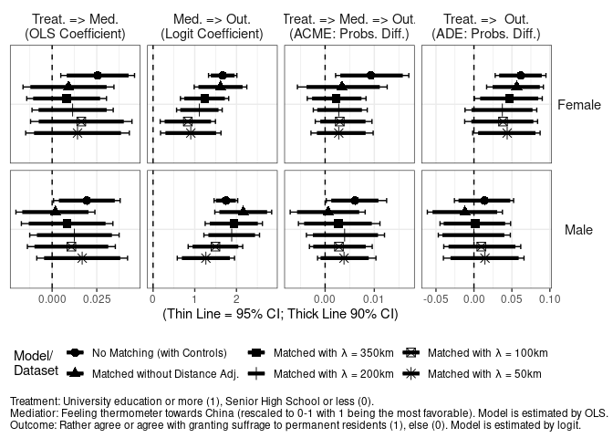
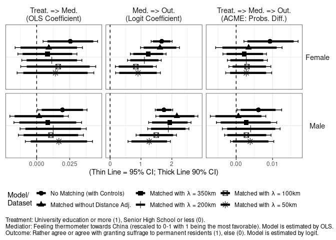

Analysis 3B: Mediation Analysis with Feeling Towards China
================
Fan Lu & Gento Kato
August 31, 2020

# Preparation

``` r
## Clean Up Space
rm(list=ls())

## Set Working Directory (Automatically) ##
require(rstudioapi); require(rprojroot)
if (rstudioapi::isAvailable()==TRUE) {
  setwd(dirname(rstudioapi::getActiveDocumentContext()$path)); 
} 
projdir <- find_root(has_file("thisishome.txt"))
cat(paste("Working Directory Set to:\n",projdir))
```

    ## Working Directory Set to:
    ##  /home/gentok/GoogleDrive/Others/Shared with Fan/ForeignerJapan

``` r
setwd(projdir)

## Load Image of Main Analysis
load(paste0(projdir,"/out/analysis_main_v4.RData"))

# Import Matched Data
sifcct_m1 <- readRDS("./data/sifcct_young_matched_1.rds")
sifcct_m2 <- readRDS("./data/sifcct_young_matched_2.rds")
sifcct_m3 <- readRDS("./data/sifcct_young_matched_3.rds")
sifcct_m4 <- readRDS("./data/sifcct_young_matched_4.rds")
sifcct_m5 <- readRDS("./data/sifcct_young_matched_5.rds")
head(sifcct$zip_pref)
```

    ## [1] "福井県" "東京都" "福井県" "埼玉県" "福岡県" "福井県"

``` r
# Replace zip_pref variable
sifcct_m1$zip_pref <- sifcct$zip_pref[match(sifcct_m1$zip,sifcct$zip)]
sifcct_m2$zip_pref <- sifcct$zip_pref[match(sifcct_m2$zip,sifcct$zip)]
sifcct_m3$zip_pref <- sifcct$zip_pref[match(sifcct_m3$zip,sifcct$zip)]
sifcct_m4$zip_pref <- sifcct$zip_pref[match(sifcct_m4$zip,sifcct$zip)]
sifcct_m5$zip_pref <- sifcct$zip_pref[match(sifcct_m5$zip,sifcct$zip)]

## packages
# devtools::install_github("gentok/estvis")
require(estvis)
```

    ## Loading required package: estvis

    ## Warning in library(package, lib.loc = lib.loc, character.only = TRUE, logical.return = TRUE, : there is no package called 'estvis'

``` r
require(multiwayvcov)
require(sandwich)
require(lmtest)
require(MASS)
require(ggplot2)
require(texreg)
require(mediation)
```

# Limit Data to Young People

``` r
table(sifcct$agecat)
```

    ## 
    ##        Young (<=30s) Middle Aged (40-50s)        Elder (>=60s) 
    ##                 8742                10432                 7122

``` r
sifcct <- sifcct[which(sifcct$agecat=="Young (<=30s)"),]

sifcct$wave <- as.factor(sifcct$wave)
sifcct_m1$wave <- as.factor(sifcct_m1$wave)
sifcct_m2$wave <- as.factor(sifcct_m2$wave)
sifcct_m3$wave <- as.factor(sifcct_m3$wave)
sifcct_m4$wave <- as.factor(sifcct_m4$wave)
sifcct_m5$wave <- as.factor(sifcct_m5$wave)

sifcct$foreignsuff_agree <- ifelse(sifcct$foreignsuff>=0.75,1,0)
sifcct_m1$foreignsuff_agree <- ifelse(sifcct_m1$foreignsuff>=0.75,1,0)
sifcct_m2$foreignsuff_agree <- ifelse(sifcct_m2$foreignsuff>=0.75,1,0)
sifcct_m3$foreignsuff_agree <- ifelse(sifcct_m3$foreignsuff>=0.75,1,0)
sifcct_m4$foreignsuff_agree <- ifelse(sifcct_m4$foreignsuff>=0.75,1,0)
sifcct_m5$foreignsuff_agree <- ifelse(sifcct_m5$foreignsuff>=0.75,1,0)

# Reverse Education Variable
sifcct$edu <- 1 - sifcct$edu
sifcct_m1$edu <- ifelse(sifcct_m1$edu=="<=SHS",1,0)
sifcct_m2$edu <- ifelse(sifcct_m2$edu=="<=SHS",1,0)
sifcct_m3$edu <- ifelse(sifcct_m3$edu=="<=SHS",1,0)
sifcct_m4$edu <- ifelse(sifcct_m4$edu=="<=SHS",1,0)
sifcct_m5$edu <- ifelse(sifcct_m5$edu=="<=SHS",1,0)
```

# Models

## SIFCCT (Original)

``` r
fdt <- sifcct[which(sifcct$female==1 & !is.na(sifcct$familialityFT_CHN)),]
mdt <- sifcct[which(sifcct$female==0 & !is.na(sifcct$familialityFT_CHN)),]

## Mediator Models
medf_CHN <- lm(familialityFT_CHN  ~ edu + knowledge + polint + employed + evecon + income + lvpr + wave, 
               data=fdt)
coeftest(medf_CHN, vcov.=vcovCL(medf_CHN,factor(fdt$zip_pref)))
```

    ## 
    ## t test of coefficients:
    ## 
    ##                Estimate  Std. Error t value  Pr(>|t|)    
    ## (Intercept)  0.30516986  0.01845142 16.5391 < 2.2e-16 ***
    ## edu         -0.02548866  0.01053571 -2.4193 0.0155968 *  
    ## knowledge   -0.01808235  0.01044652 -1.7309 0.0835395 .  
    ## polint      -0.03735196  0.01626280 -2.2968 0.0216838 *  
    ## employed    -0.01735683  0.00482887 -3.5944 0.0003291 ***
    ## evecon       0.07547122  0.02032334  3.7135 0.0002072 ***
    ## income      -0.02849764  0.01486717 -1.9168 0.0553333 .  
    ## lvpr         0.00291701  0.01213042  0.2405 0.8099775    
    ## wave3       -0.06166926  0.01993681 -3.0932 0.0019937 ** 
    ## wave4       -0.00012867  0.02034501 -0.0063 0.9949542    
    ## wave5       -0.00185845  0.02162569 -0.0859 0.9315207    
    ## wave6       -0.00628586  0.01876347 -0.3350 0.7376390    
    ## wave7       -0.01959159  0.02045939 -0.9576 0.3383309    
    ## wave8       -0.00380086  0.02219029 -0.1713 0.8640084    
    ## wave9       -0.02739100  0.02109580 -1.2984 0.1942222    
    ## wave10      -0.01699223  0.02010696 -0.8451 0.3981106    
    ## wave11      -0.06595843  0.01949360 -3.3836 0.0007224 ***
    ## wave12      -0.08904927  0.02117585 -4.2052 2.666e-05 ***
    ## wave13      -0.07631211  0.01911269 -3.9927 6.650e-05 ***
    ## wave14      -0.07441759  0.02239079 -3.3236 0.0008968 ***
    ## wave15      -0.07473887  0.02348827 -3.1820 0.0014741 ** 
    ## wave16      -0.07330145  0.02813050 -2.6058 0.0092013 ** 
    ## wave17      -0.09480839  0.02279339 -4.1595 3.258e-05 ***
    ## wave18      -0.07899301  0.02186256 -3.6132 0.0003062 ***
    ## wave19      -0.11660217  0.02158077 -5.4031 6.937e-08 ***
    ## wave20      -0.09879729  0.01975738 -5.0005 5.965e-07 ***
    ## wave21      -0.06448382  0.01925765 -3.3485 0.0008202 ***
    ## wave22      -0.08518662  0.02210389 -3.8539 0.0001181 ***
    ## ---
    ## Signif. codes:  0 '***' 0.001 '**' 0.01 '*' 0.05 '.' 0.1 ' ' 1

``` r
medm_CHN <- lm(familialityFT_CHN  ~ edu + knowledge + polint + employed + evecon + income + lvpr + wave, 
               data=mdt)
coeftest(medm_CHN, vcov.=vcovCL(medm_CHN,factor(mdt$zip_pref)))
```

    ## 
    ## t test of coefficients:
    ## 
    ##               Estimate Std. Error t value  Pr(>|t|)    
    ## (Intercept)  0.2727985  0.0166991 16.3361 < 2.2e-16 ***
    ## edu         -0.0194390  0.0095142 -2.0432 0.0410917 *  
    ## knowledge   -0.0309253  0.0107901 -2.8661 0.0041743 ** 
    ## polint      -0.0363716  0.0097114 -3.7452 0.0001824 ***
    ## employed    -0.0258595  0.0094219 -2.7446 0.0060813 ** 
    ## evecon       0.0581347  0.0149169  3.8972 9.865e-05 ***
    ## income       0.0011608  0.0153151  0.0758 0.9395873    
    ## lvpr        -0.0171101  0.0090384 -1.8930 0.0584141 .  
    ## wave3       -0.0062685  0.0176081 -0.3560 0.7218554    
    ## wave4        0.0426894  0.0158631  2.6911 0.0071467 ** 
    ## wave5        0.0279905  0.0101213  2.7655 0.0057058 ** 
    ## wave6        0.0243538  0.0196107  1.2419 0.2143480    
    ## wave7        0.0107130  0.0185828  0.5765 0.5643049    
    ## wave8        0.0363606  0.0182449  1.9929 0.0463279 *  
    ## wave9        0.0232454  0.0162437  1.4310 0.1524846    
    ## wave10       0.0199613  0.0160879  1.2408 0.2147564    
    ## wave11      -0.0337572  0.0125697 -2.6856 0.0072656 ** 
    ## wave12      -0.0579041  0.0155278 -3.7291 0.0001945 ***
    ## wave13      -0.0726758  0.0159581 -4.5542 5.392e-06 ***
    ## wave14      -0.0226573  0.0177418 -1.2771 0.2016456    
    ## wave15      -0.0223652  0.0135719 -1.6479 0.0994401 .  
    ## wave16      -0.0031175  0.0134899 -0.2311 0.8172464    
    ## wave17      -0.0609997  0.0142681 -4.2753 1.947e-05 ***
    ## wave18      -0.0442926  0.0173938 -2.5465 0.0109137 *  
    ## wave19      -0.0397718  0.0158749 -2.5053 0.0122672 *  
    ## wave20      -0.0616122  0.0233908 -2.6340 0.0084653 ** 
    ## wave21      -0.0486024  0.0199226 -2.4396 0.0147415 *  
    ## wave22      -0.0387511  0.0179954 -2.1534 0.0313390 *  
    ## ---
    ## Signif. codes:  0 '***' 0.001 '**' 0.01 '*' 0.05 '.' 0.1 ' ' 1

``` r
## Outcome Models 
outf_CHN <- glm(foreignsuff_agree  ~ edu + familialityFT_CHN + edu:familialityFT_CHN + 
                knowledge + polint + employed + evecon + income + lvpr + wave, data=fdt, family=binomial("logit"))
coeftest(outf_CHN, vcov.=vcovCL(outf_CHN,factor(fdt$zip_pref)))
```

    ## 
    ## z test of coefficients:
    ## 
    ##                        Estimate Std. Error z value  Pr(>|z|)    
    ## (Intercept)           -0.998675   0.226468 -4.4098 1.035e-05 ***
    ## edu                   -0.029969   0.098070 -0.3056 0.7599227    
    ## familialityFT_CHN      1.669864   0.173425  9.6288 < 2.2e-16 ***
    ## knowledge             -0.094932   0.131544 -0.7217 0.4704962    
    ## polint                 0.383302   0.148655  2.5785 0.0099239 ** 
    ## employed               0.035127   0.072808  0.4825 0.6294773    
    ## evecon                 0.479056   0.192706  2.4859 0.0129211 *  
    ## income                 0.010145   0.148250  0.0684 0.9454406    
    ## lvpr                  -0.130089   0.121726 -1.0687 0.2852023    
    ## wave3                 -0.244948   0.196227 -1.2483 0.2119252    
    ## wave4                 -0.325178   0.204342 -1.5913 0.1115322    
    ## wave5                 -0.317997   0.183260 -1.7352 0.0827016 .  
    ## wave6                 -0.063537   0.185267 -0.3429 0.7316390    
    ## wave7                 -0.153393   0.190619 -0.8047 0.4209856    
    ## wave8                 -0.374336   0.204632 -1.8293 0.0673531 .  
    ## wave9                 -0.547905   0.212081 -2.5835 0.0097812 ** 
    ## wave10                -0.302945   0.233864 -1.2954 0.1951864    
    ## wave11                -0.592785   0.229608 -2.5817 0.0098308 ** 
    ## wave12                -0.225586   0.175916 -1.2823 0.1997203    
    ## wave13                -0.427760   0.206799 -2.0685 0.0385949 *  
    ## wave14                -0.355775   0.238677 -1.4906 0.1360636    
    ## wave15                -0.379015   0.173320 -2.1868 0.0287579 *  
    ## wave16                -0.342342   0.183368 -1.8670 0.0619054 .  
    ## wave17                -0.466902   0.200457 -2.3292 0.0198494 *  
    ## wave18                -0.263850   0.181325 -1.4551 0.1456346    
    ## wave19                -0.385727   0.215033 -1.7938 0.0728447 .  
    ## wave20                -0.245830   0.171798 -1.4309 0.1524524    
    ## wave21                -0.514080   0.230804 -2.2273 0.0259242 *  
    ## wave22                -0.057153   0.182995 -0.3123 0.7547982    
    ## edu:familialityFT_CHN -1.034357   0.303440 -3.4088 0.0006526 ***
    ## ---
    ## Signif. codes:  0 '***' 0.001 '**' 0.01 '*' 0.05 '.' 0.1 ' ' 1

``` r
outm_CHN <- glm(foreignsuff_agree  ~ edu + familialityFT_CHN + edu:familialityFT_CHN + 
                  knowledge + polint + employed + evecon + income + lvpr + wave, data=mdt, family=binomial("logit"))
coeftest(outm_CHN, vcov.=vcovCL(outm_CHN,factor(mdt$zip_pref)))
```

    ## 
    ## z test of coefficients:
    ## 
    ##                        Estimate Std. Error z value  Pr(>|z|)    
    ## (Intercept)           -1.792145   0.224318 -7.9893 1.357e-15 ***
    ## edu                    0.154234   0.134773  1.1444 0.2524585    
    ## familialityFT_CHN      1.745966   0.144619 12.0729 < 2.2e-16 ***
    ## knowledge             -0.447305   0.113104 -3.9548 7.659e-05 ***
    ## polint                 0.029716   0.163392  0.1819 0.8556843    
    ## employed               0.249245   0.101112  2.4650 0.0137001 *  
    ## evecon                 0.075689   0.221964  0.3410 0.7331049    
    ## income                 0.395694   0.114030  3.4701 0.0005203 ***
    ## lvpr                  -0.331854   0.084574 -3.9239 8.714e-05 ***
    ## wave3                  0.080250   0.284775  0.2818 0.7780959    
    ## wave4                  0.024446   0.246484  0.0992 0.9209963    
    ## wave5                  0.250343   0.175880  1.4234 0.1546274    
    ## wave6                  0.191179   0.231116  0.8272 0.4081244    
    ## wave7                  0.353176   0.231710  1.5242 0.1274547    
    ## wave8                  0.294128   0.292306  1.0062 0.3143025    
    ## wave9                  0.258395   0.223765  1.1548 0.2481878    
    ## wave10                 0.384751   0.218040  1.7646 0.0776325 .  
    ## wave11                 0.364086   0.218091  1.6694 0.0950339 .  
    ## wave12                 0.432999   0.237941  1.8198 0.0687941 .  
    ## wave13                 0.151997   0.288565  0.5267 0.5983794    
    ## wave14                 0.186010   0.245793  0.7568 0.4491840    
    ## wave15                 0.078280   0.287899  0.2719 0.7856971    
    ## wave16                 0.360640   0.274638  1.3131 0.1891336    
    ## wave17                 0.342818   0.237308  1.4446 0.1485664    
    ## wave18                 0.251013   0.203386  1.2342 0.2171395    
    ## wave19                 0.209585   0.213544  0.9815 0.3263652    
    ## wave20                 0.432067   0.309710  1.3951 0.1629951    
    ## wave21                 0.155043   0.279343  0.5550 0.5788747    
    ## wave22                 0.287294   0.308260  0.9320 0.3513447    
    ## edu:familialityFT_CHN -0.985339   0.286219 -3.4426 0.0005761 ***
    ## ---
    ## Signif. codes:  0 '***' 0.001 '**' 0.01 '*' 0.05 '.' 0.1 ' ' 1

``` r
## Causal Mediation Analysis
set.seed(2345)
medoutf_CHN <- mediate(medf_CHN, outf_CHN, treat = "edu", 
                  mediator = "familialityFT_CHN", 
                  cluster=factor(fdt$zip_pref))
summary(medoutf_CHN)
```

    ## 
    ## Causal Mediation Analysis 
    ## 
    ## Quasi-Bayesian Confidence Intervals
    ## 
    ##                          Estimate 95% CI Lower 95% CI Upper p-value    
    ## ACME (control)           -0.00931     -0.01702         0.00   0.014 *  
    ## ACME (treated)           -0.00331     -0.00837         0.00   0.062 .  
    ## ADE (control)            -0.06155     -0.09485        -0.03  <2e-16 ***
    ## ADE (treated)            -0.05555     -0.08669        -0.02   0.002 ** 
    ## Total Effect             -0.06486     -0.09740        -0.03  <2e-16 ***
    ## Prop. Mediated (control)  0.14234      0.02741         0.32   0.014 *  
    ## Prop. Mediated (treated)  0.04705     -0.00122         0.16   0.062 .  
    ## ACME (average)           -0.00631     -0.01239         0.00   0.014 *  
    ## ADE (average)            -0.05855     -0.09024        -0.03  <2e-16 ***
    ## Prop. Mediated (average)  0.09470      0.01661         0.24   0.014 *  
    ## ---
    ## Signif. codes:  0 '***' 0.001 '**' 0.01 '*' 0.05 '.' 0.1 ' ' 1
    ## 
    ## Sample Size Used: 3984 
    ## 
    ## 
    ## Simulations: 1000

``` r
set.seed(2345)
medoutm_CHN <- mediate(medm_CHN, outm_CHN, treat = "edu", 
                       mediator = "familialityFT_CHN", 
                       cluster=factor(mdt$zip_pref))
summary(medoutm_CHN)
```

    ## 
    ## Causal Mediation Analysis 
    ## 
    ## Quasi-Bayesian Confidence Intervals
    ## 
    ##                          Estimate 95% CI Lower 95% CI Upper p-value  
    ## ACME (control)           -0.00608     -0.01251         0.00   0.044 *
    ## ACME (treated)           -0.00262     -0.00650         0.00   0.058 .
    ## ADE (control)            -0.01397     -0.05227         0.03   0.488  
    ## ADE (treated)            -0.01050     -0.04902         0.03   0.590  
    ## Total Effect             -0.01658     -0.05422         0.02   0.426  
    ## Prop. Mediated (control)  0.19998     -2.45921         2.28   0.446  
    ## Prop. Mediated (treated)  0.07564     -1.12926         1.15   0.448  
    ## ACME (average)           -0.00435     -0.00853         0.00   0.044 *
    ## ADE (average)            -0.01223     -0.05047         0.03   0.538  
    ## Prop. Mediated (average)  0.13781     -1.85700         1.67   0.446  
    ## ---
    ## Signif. codes:  0 '***' 0.001 '**' 0.01 '*' 0.05 '.' 0.1 ' ' 1
    ## 
    ## Sample Size Used: 4734 
    ## 
    ## 
    ## Simulations: 1000

## Matched without Distance Adjustment

``` r
## Add China FT and Drop Cases with NAs in China FT
sifcct_m1$familialityFT_CHN <- sifcct$familialityFT_CHN[match(sifcct_m1$id,sifcct$id)]
(dropid <- sifcct_m1$pair_id[which(is.na(sifcct_m1$familialityFT_CHN))])
```

    ## [1] 1312 1326 1360 1485

``` r
sifcct_m1 <- sifcct_m1[which(! sifcct_m1$pair_id %in% dropid),]
# Male and Female Dataset
fdt_m1 <- sifcct_m1[which(sifcct_m1$female==1),]
mdt_m1 <- sifcct_m1[which(sifcct_m1$female==0),]

## Mediator Models
medf_CHN_m1 <- lm(familialityFT_CHN  ~ edu + #,
                    knowledge + polint + employed + evecon + income + lvpr + wave, 
                    data=fdt_m1)
coeftest(medf_CHN_m1, vcov.=vcovCL(medf_CHN_m1, factor(fdt_m1$zip_pref)))
```

    ## 
    ## t test of coefficients:
    ## 
    ##               Estimate Std. Error t value  Pr(>|t|)    
    ## (Intercept)  0.3128311  0.0348965  8.9646 < 2.2e-16 ***
    ## edu         -0.0091566  0.0129816 -0.7054 0.4806841    
    ## knowledge   -0.0286823  0.0198330 -1.4462 0.1483033    
    ## polint      -0.0754928  0.0214662 -3.5168 0.0004479 ***
    ## employed    -0.0173140  0.0083699 -2.0686 0.0387305 *  
    ## evecon       0.1048769  0.0239884  4.3720 1.304e-05 ***
    ## income      -0.0311749  0.0281390 -1.1079 0.2680624    
    ## lvpr         0.0045173  0.0163548  0.2762 0.7824207    
    ## wave3       -0.0950888  0.0313348 -3.0346 0.0024440 ** 
    ## wave4       -0.0179433  0.0339956 -0.5278 0.5976966    
    ## wave5        0.0070765  0.0335641  0.2108 0.8330393    
    ## wave6       -0.0336614  0.0307152 -1.0959 0.2732657    
    ## wave7       -0.0507352  0.0312441 -1.6238 0.1045915    
    ## wave8       -0.0330440  0.0349839 -0.9445 0.3450200    
    ## wave9       -0.0431652  0.0318233 -1.3564 0.1751467    
    ## wave10      -0.0161942  0.0346367 -0.4675 0.6401693    
    ## wave11      -0.0911640  0.0273330 -3.3353 0.0008699 ***
    ## wave12      -0.0890088  0.0302724 -2.9403 0.0033224 ** 
    ## wave13      -0.0909740  0.0370045 -2.4585 0.0140498 *  
    ## wave14      -0.0932421  0.0342530 -2.7222 0.0065500 ** 
    ## wave15      -0.0987835  0.0357669 -2.7619 0.0058072 ** 
    ## wave16      -0.0743495  0.0364818 -2.0380 0.0417012 *  
    ## wave17      -0.0660328  0.0427503 -1.5446 0.1226206    
    ## wave18      -0.0867091  0.0329618 -2.6306 0.0085984 ** 
    ## wave19      -0.1058388  0.0323316 -3.2735 0.0010828 ** 
    ## wave20      -0.1077142  0.0362332 -2.9728 0.0029913 ** 
    ## wave21      -0.0852890  0.0323351 -2.6377 0.0084221 ** 
    ## wave22      -0.0839378  0.0329296 -2.5490 0.0108878 *  
    ## ---
    ## Signif. codes:  0 '***' 0.001 '**' 0.01 '*' 0.05 '.' 0.1 ' ' 1

``` r
medm_CHN_m1 <- lm(familialityFT_CHN  ~ edu + #,
                    knowledge + polint + employed + evecon + income + lvpr + wave, 
                    data=mdt_m1)
coeftest(medm_CHN_m1, vcov.=vcovCL(medm_CHN_m1,factor(mdt_m1$zip_pref)))
```

    ## 
    ## t test of coefficients:
    ## 
    ##                Estimate  Std. Error t value  Pr(>|t|)    
    ## (Intercept)  0.28330458  0.03173003  8.9286 < 2.2e-16 ***
    ## edu         -0.00183240  0.01127524 -0.1625 0.8709196    
    ## knowledge   -0.07790270  0.02128253 -3.6604 0.0002598 ***
    ## polint      -0.02605491  0.01858428 -1.4020 0.1611079    
    ## employed    -0.04051561  0.01917524 -2.1129 0.0347584 *  
    ## evecon       0.07770241  0.01728412  4.4956 7.422e-06 ***
    ## income       0.00983276  0.02879939  0.3414 0.7328292    
    ## lvpr        -0.01925192  0.01340934 -1.4357 0.1512749    
    ## wave3       -0.03911139  0.03895837 -1.0039 0.3155611    
    ## wave4       -0.00108623  0.02967780 -0.0366 0.9708077    
    ## wave5        0.00375324  0.02920364  0.1285 0.8977536    
    ## wave6        0.03068119  0.03944052  0.7779 0.4367337    
    ## wave7       -0.01869804  0.02866559 -0.6523 0.5143106    
    ## wave8       -0.00068446  0.03439784 -0.0199 0.9841268    
    ## wave9       -0.00879643  0.02884939 -0.3049 0.7604743    
    ## wave10       0.01485155  0.02652239  0.5600 0.5755809    
    ## wave11      -0.03222568  0.03338698 -0.9652 0.3345779    
    ## wave12      -0.07985903  0.02558812 -3.1209 0.0018341 ** 
    ## wave13      -0.06960065  0.03152525 -2.2078 0.0273975 *  
    ## wave14      -0.00062504  0.03031744 -0.0206 0.9835541    
    ## wave15      -0.01045203  0.03520437 -0.2969 0.7665834    
    ## wave16       0.00620907  0.02772792  0.2239 0.8228407    
    ## wave17      -0.06741301  0.02837078 -2.3761 0.0176086 *  
    ## wave18      -0.05280428  0.03141065 -1.6811 0.0929343 .  
    ## wave19      -0.01973271  0.02427525 -0.8129 0.4164081    
    ## wave20      -0.08467945  0.03708358 -2.2835 0.0225293 *  
    ## wave21      -0.03025150  0.02772944 -1.0910 0.2754535    
    ## wave22      -0.02877336  0.03351431 -0.8585 0.3907195    
    ## ---
    ## Signif. codes:  0 '***' 0.001 '**' 0.01 '*' 0.05 '.' 0.1 ' ' 1

``` r
## Outcome Models
outf_CHN_m1 <- glm(foreignsuff_agree  ~ edu + familialityFT_CHN + edu:familialityFT_CHN + #,
                     knowledge + polint + employed + evecon + income + lvpr + wave, 
                     data=fdt_m1, family=binomial("logit"))
coeftest(outf_CHN_m1, vcov.=vcovCL(outf_CHN_m1,factor(fdt_m1$zip_pref)))
```

    ## 
    ## z test of coefficients:
    ## 
    ##                        Estimate Std. Error z value  Pr(>|z|)    
    ## (Intercept)           -1.216943   0.282341 -4.3102 1.631e-05 ***
    ## edu                   -0.057217   0.117622 -0.4864  0.626650    
    ## familialityFT_CHN      1.616760   0.321894  5.0227 5.096e-07 ***
    ## knowledge              0.121609   0.286190  0.4249  0.670892    
    ## polint                 0.634272   0.197464  3.2121  0.001318 ** 
    ## employed               0.110545   0.125947  0.8777  0.380101    
    ## evecon                 0.227634   0.218450  1.0420  0.297393    
    ## income                -0.091152   0.256509 -0.3554  0.722322    
    ## lvpr                  -0.231578   0.178361 -1.2984  0.194160    
    ## wave3                 -0.371792   0.417857 -0.8898  0.373596    
    ## wave4                 -0.032435   0.318737 -0.1018  0.918947    
    ## wave5                 -0.290204   0.309245 -0.9384  0.348026    
    ## wave6                  0.265126   0.311539  0.8510  0.394759    
    ## wave7                 -0.210193   0.252834 -0.8313  0.405778    
    ## wave8                 -0.327674   0.392097 -0.8357  0.403326    
    ## wave9                 -0.426085   0.346180 -1.2308  0.218390    
    ## wave10                 0.057094   0.365649  0.1561  0.875919    
    ## wave11                -0.533692   0.270183 -1.9753  0.048234 *  
    ## wave12                -0.083012   0.326449 -0.2543  0.799273    
    ## wave13                -0.229047   0.342866 -0.6680  0.504111    
    ## wave14                -0.193243   0.447805 -0.4315  0.666081    
    ## wave15                -0.176542   0.321170 -0.5497  0.582535    
    ## wave16                -0.206898   0.299169 -0.6916  0.489204    
    ## wave17                -0.202751   0.368448 -0.5503  0.582124    
    ## wave18                -0.324616   0.282173 -1.1504  0.249974    
    ## wave19                -0.121216   0.297527 -0.4074  0.683707    
    ## wave20                 0.072395   0.277663  0.2607  0.794301    
    ## wave21                -0.366000   0.295107 -1.2402  0.214891    
    ## wave22                 0.282722   0.312169  0.9057  0.365111    
    ## edu:familialityFT_CHN -0.889601   0.382390 -2.3264  0.019996 *  
    ## ---
    ## Signif. codes:  0 '***' 0.001 '**' 0.01 '*' 0.05 '.' 0.1 ' ' 1

``` r
outm_CHN_m1 <- glm(foreignsuff_agree  ~ edu + familialityFT_CHN + edu:familialityFT_CHN + #,
                     knowledge + polint + employed + evecon + income + lvpr + wave, 
                     data=mdt_m1, family=binomial("logit"))
coeftest(outm_CHN_m1, vcov.=vcovCL(outm_CHN_m1,factor(mdt_m1$zip_pref)))
```

    ## 
    ## z test of coefficients:
    ## 
    ##                         Estimate Std. Error z value  Pr(>|z|)    
    ## (Intercept)           -2.0043949  0.3234482 -6.1970 5.756e-10 ***
    ## edu                    0.3779779  0.1932043  1.9564 0.0504223 .  
    ## familialityFT_CHN      2.1621809  0.3478175  6.2164 5.086e-10 ***
    ## knowledge             -0.5771446  0.1748023 -3.3017 0.0009610 ***
    ## polint                 0.3998508  0.2144981  1.8641 0.0623045 .  
    ## employed               0.3996322  0.1867262  2.1402 0.0323383 *  
    ## evecon                 0.1484102  0.3274480  0.4532 0.6503812    
    ## income                 0.2144316  0.2208206  0.9711 0.3315148    
    ## lvpr                  -0.3571032  0.1300410 -2.7461 0.0060312 ** 
    ## wave3                 -0.0191317  0.3855819 -0.0496 0.9604269    
    ## wave4                  0.1504789  0.4764600  0.3158 0.7521339    
    ## wave5                 -0.2944028  0.3998162 -0.7363 0.4615206    
    ## wave6                  0.2563127  0.4006631  0.6397 0.5223538    
    ## wave7                  0.2235096  0.3424088  0.6528 0.5139132    
    ## wave8                 -0.0651807  0.4230071 -0.1541 0.8775396    
    ## wave9                 -0.4148135  0.4293751 -0.9661 0.3340008    
    ## wave10                 0.2381909  0.3789157  0.6286 0.5296032    
    ## wave11                 0.3707667  0.3767738  0.9841 0.3250877    
    ## wave12                 0.2045435  0.3594982  0.5690 0.5693768    
    ## wave13                 0.0028604  0.5169982  0.0055 0.9955856    
    ## wave14                -0.0398849  0.4253685 -0.0938 0.9252953    
    ## wave15                -0.4827139  0.4722705 -1.0221 0.3067274    
    ## wave16                 0.0437990  0.4505702  0.0972 0.9225612    
    ## wave17                 0.0267890  0.5231500  0.0512 0.9591604    
    ## wave18                 0.2356298  0.4171071  0.5649 0.5721319    
    ## wave19                -0.0329142  0.4327944 -0.0761 0.9393790    
    ## wave20                -0.0208428  0.4583386 -0.0455 0.9637289    
    ## wave21                -0.3197298  0.4785966 -0.6681 0.5040972    
    ## wave22                -0.5445466  0.5586959 -0.9747 0.3297218    
    ## edu:familialityFT_CHN -1.3690879  0.4026588 -3.4001 0.0006736 ***
    ## ---
    ## Signif. codes:  0 '***' 0.001 '**' 0.01 '*' 0.05 '.' 0.1 ' ' 1

``` r
## Causal Mediation Analysis
set.seed(2345)
medoutf_CHN_m1 <- mediate(medf_CHN_m1, outf_CHN_m1, treat = "edu", 
                       mediator = "familialityFT_CHN", 
                       cluster=factor(fdt_m1$zip_pref))
summary(medoutf_CHN_m1)
```

    ## 
    ## Causal Mediation Analysis 
    ## 
    ## Quasi-Bayesian Confidence Intervals
    ## 
    ##                          Estimate 95% CI Lower 95% CI Upper p-value    
    ## ACME (control)           -0.00344     -0.01262         0.01    0.41    
    ## ACME (treated)           -0.00145     -0.00626         0.00    0.42    
    ## ADE (control)            -0.05637     -0.09148        -0.02  <2e-16 ***
    ## ADE (treated)            -0.05438     -0.08878        -0.02  <2e-16 ***
    ## Total Effect             -0.05782     -0.09345        -0.02  <2e-16 ***
    ## Prop. Mediated (control)  0.05675     -0.12828         0.28    0.41    
    ## Prop. Mediated (treated)  0.01964     -0.06020         0.14    0.42    
    ## ACME (average)           -0.00244     -0.00926         0.00    0.41    
    ## ADE (average)            -0.05538     -0.08990        -0.02  <2e-16 ***
    ## Prop. Mediated (average)  0.03820     -0.09165         0.20    0.41    
    ## ---
    ## Signif. codes:  0 '***' 0.001 '**' 0.01 '*' 0.05 '.' 0.1 ' ' 1
    ## 
    ## Sample Size Used: 1776 
    ## 
    ## 
    ## Simulations: 1000

``` r
set.seed(2345)
medoutm_CHN_m1 <- mediate(medm_CHN_m1, outm_CHN_m1, treat = "edu", 
                       mediator = "familialityFT_CHN", 
                       cluster=factor(mdt_m1$zip_pref))
summary(medoutm_CHN_m1)
```

    ## 
    ## Causal Mediation Analysis 
    ## 
    ## Quasi-Bayesian Confidence Intervals
    ## 
    ##                           Estimate 95% CI Lower 95% CI Upper p-value
    ## ACME (control)           -6.26e-04    -8.14e-03         0.01    0.86
    ## ACME (treated)           -2.49e-04    -3.43e-03         0.00    0.87
    ## ADE (control)             1.19e-02    -3.75e-02         0.06    0.63
    ## ADE (treated)             1.23e-02    -3.75e-02         0.06    0.62
    ## Total Effect              1.16e-02    -3.80e-02         0.06    0.65
    ## Prop. Mediated (control)  1.84e-04    -2.56e+00         1.28    0.99
    ## Prop. Mediated (treated)  8.74e-05    -8.21e-01         0.47    0.99
    ## ACME (average)           -4.38e-04    -5.74e-03         0.00    0.86
    ## ADE (average)             1.21e-02    -3.75e-02         0.06    0.63
    ## Prop. Mediated (average)  1.36e-04    -1.80e+00         0.86    0.99
    ## 
    ## Sample Size Used: 1674 
    ## 
    ## 
    ## Simulations: 1000

## Matched with Distance Adjustment (Lambda=50km)

``` r
## Add China FT and Drop Cases with NAs in China FT
sifcct_m2$familialityFT_CHN <- sifcct$familialityFT_CHN[match(sifcct_m2$id,sifcct$id)]
(dropid <- sifcct_m2$pair_id[which(is.na(sifcct_m2$familialityFT_CHN))])
```

    ## [1] 440 932 965

``` r
sifcct_m2 <- sifcct_m2[which(! sifcct_m2$pair_id %in% dropid),]
# Male and Female Dataset
fdt_m2 <- sifcct_m2[which(sifcct_m2$female==1),]
mdt_m2 <- sifcct_m2[which(sifcct_m2$female==0),]

## Mediator Models
medf_CHN_m2 <- lm(familialityFT_CHN  ~ edu + #,
                    knowledge + polint + employed + evecon + income + lvpr + wave, 
                    data=fdt_m2)
coeftest(medf_CHN_m2, vcov.=vcovCL(medf_CHN_m2, factor(fdt_m2$zip_pref)))
```

    ## 
    ## t test of coefficients:
    ## 
    ##               Estimate Std. Error t value  Pr(>|t|)    
    ## (Intercept)  0.2826506  0.0396858  7.1222 1.887e-12 ***
    ## edu         -0.0142108  0.0147956 -0.9605  0.337021    
    ## knowledge   -0.0507505  0.0304843 -1.6648  0.096228 .  
    ## polint      -0.0678087  0.0248579 -2.7279  0.006474 ** 
    ## employed    -0.0266370  0.0146485 -1.8184  0.069267 .  
    ## evecon       0.0816915  0.0303703  2.6898  0.007254 ** 
    ## income       0.0145388  0.0245741  0.5916  0.554217    
    ## lvpr         0.0155784  0.0219288  0.7104  0.477598    
    ## wave3       -0.0166722  0.0482460 -0.3456  0.729733    
    ## wave4        0.0339795  0.0431118  0.7882  0.430762    
    ## wave5        0.0030908  0.0336727  0.0918  0.926883    
    ## wave6        0.0024782  0.0404406  0.0613  0.951147    
    ## wave7       -0.0262064  0.0392790 -0.6672  0.504790    
    ## wave8        0.0449848  0.0303852  1.4805  0.139023    
    ## wave9       -0.0126482  0.0360790 -0.3506  0.725977    
    ## wave10      -0.0146114  0.0414598 -0.3524  0.724586    
    ## wave11      -0.0642650  0.0324612 -1.9797  0.047974 *  
    ## wave12      -0.0474861  0.0313054 -1.5169  0.129580    
    ## wave13      -0.0659883  0.0450339 -1.4653  0.143116    
    ## wave14      -0.0936609  0.0319316 -2.9332  0.003423 ** 
    ## wave15      -0.0408578  0.0378764 -1.0787  0.280945    
    ## wave16      -0.0428741  0.0350188 -1.2243  0.221088    
    ## wave17      -0.0263961  0.0469284 -0.5625  0.573903    
    ## wave18      -0.0592390  0.0455811 -1.2996  0.193990    
    ## wave19      -0.1056243  0.0382452 -2.7618  0.005842 ** 
    ## wave20      -0.1156426  0.0504983 -2.2900  0.022203 *  
    ## wave21      -0.0305554  0.0317530 -0.9623  0.336113    
    ## wave22      -0.0844950  0.0298960 -2.8263  0.004792 ** 
    ## ---
    ## Signif. codes:  0 '***' 0.001 '**' 0.01 '*' 0.05 '.' 0.1 ' ' 1

``` r
medm_CHN_m2 <- lm(familialityFT_CHN  ~ edu + #,
                    knowledge + polint + employed + evecon + income + lvpr + wave, 
                    data=mdt_m2)
coeftest(medm_CHN_m2, vcov.=vcovCL(medm_CHN_m2,factor(mdt_m2$zip_pref)))
```

    ## 
    ## t test of coefficients:
    ## 
    ##               Estimate Std. Error t value  Pr(>|t|)    
    ## (Intercept)  0.2675964  0.0298742  8.9574 < 2.2e-16 ***
    ## edu         -0.0168133  0.0129565 -1.2977 0.1946453    
    ## knowledge   -0.0635954  0.0297227 -2.1396 0.0325831 *  
    ## polint      -0.0261324  0.0234109 -1.1162 0.2645364    
    ## employed     0.0044887  0.0257097  0.1746 0.8614293    
    ## evecon       0.0776841  0.0205093  3.7878 0.0001594 ***
    ## income      -0.0461105  0.0329411 -1.3998 0.1618309    
    ## lvpr        -0.0027445  0.0151220 -0.1815 0.8560130    
    ## wave3       -0.0409038  0.0425890 -0.9604 0.3370278    
    ## wave4        0.0138528  0.0418324  0.3311 0.7405884    
    ## wave5       -0.0023290  0.0348634 -0.0668 0.9467490    
    ## wave6        0.0199382  0.0400963  0.4973 0.6190958    
    ## wave7        0.0019429  0.0275029  0.0706 0.9436936    
    ## wave8       -0.0196948  0.0370950 -0.5309 0.5955640    
    ## wave9        0.0158244  0.0320050  0.4944 0.6210881    
    ## wave10       0.0008453  0.0356271  0.0237 0.9810748    
    ## wave11      -0.0530411  0.0336047 -1.5784 0.1147368    
    ## wave12      -0.0759887  0.0334680 -2.2705 0.0233517 *  
    ## wave13      -0.0699448  0.0388459 -1.8006 0.0720174 .  
    ## wave14      -0.0244174  0.0277301 -0.8805 0.3787407    
    ## wave15      -0.0648971  0.0317724 -2.0426 0.0413103 *  
    ## wave16      -0.0388844  0.0397828 -0.9774 0.3285562    
    ## wave17      -0.0528047  0.0298457 -1.7693 0.0771005 .  
    ## wave18      -0.0306104  0.0343784 -0.8904 0.3734273    
    ## wave19      -0.0563482  0.0298242 -1.8893 0.0590821 .  
    ## wave20      -0.0938661  0.0384474 -2.4414 0.0147710 *  
    ## wave21      -0.0515639  0.0409178 -1.2602 0.2078435    
    ## wave22      -0.0639851  0.0389362 -1.6433 0.1005717    
    ## ---
    ## Signif. codes:  0 '***' 0.001 '**' 0.01 '*' 0.05 '.' 0.1 ' ' 1

``` r
## Outcome Models
outf_CHN_m2 <- glm(foreignsuff_agree  ~ edu + familialityFT_CHN + edu:familialityFT_CHN + #,
                     knowledge + polint + employed + evecon + income + lvpr + wave, 
                     data=fdt_m2, family=binomial("logit"))
coeftest(outf_CHN_m2, vcov.=vcovCL(outf_CHN_m2,factor(fdt_m2$zip_pref)))
```

    ## 
    ## z test of coefficients:
    ## 
    ##                         Estimate Std. Error z value  Pr(>|z|)    
    ## (Intercept)           -1.4373163  0.3253151 -4.4182 9.951e-06 ***
    ## edu                   -0.2095286  0.1458881 -1.4362  0.150937    
    ## familialityFT_CHN      0.9040449  0.3696911  2.4454  0.014469 *  
    ## knowledge             -0.3323343  0.3642524 -0.9124  0.361572    
    ## polint                 0.9987420  0.2239571  4.4595 8.214e-06 ***
    ## employed               0.0119999  0.1210598  0.0991  0.921040    
    ## evecon                 0.0036909  0.2001935  0.0184  0.985290    
    ## income                -0.3523368  0.4240539 -0.8309  0.406043    
    ## lvpr                  -0.2933324  0.2096045 -1.3995  0.161676    
    ## wave3                  0.1462952  0.5642275  0.2593  0.795416    
    ## wave4                  0.4549620  0.4008334  1.1350  0.256358    
    ## wave5                 -0.6733837  0.3183116 -2.1155  0.034389 *  
    ## wave6                  0.3833080  0.4035214  0.9499  0.342159    
    ## wave7                  0.7275434  0.3592356  2.0253  0.042841 *  
    ## wave8                  0.5310039  0.3215813  1.6512  0.098692 .  
    ## wave9                  0.1731562  0.4397144  0.3938  0.693734    
    ## wave10                 0.1831365  0.5345730  0.3426  0.731911    
    ## wave11                 0.1865510  0.3614396  0.5161  0.605761    
    ## wave12                 0.5623791  0.4666389  1.2052  0.228138    
    ## wave13                -0.1474309  0.3845200 -0.3834  0.701412    
    ## wave14                 0.5308212  0.4814183  1.1026  0.270192    
    ## wave15                 0.4714904  0.3707367  1.2718  0.203456    
    ## wave16                 0.4187029  0.3523631  1.1883  0.234727    
    ## wave17                -0.3476894  0.4616919 -0.7531  0.451404    
    ## wave18                 0.6086529  0.2175809  2.7974  0.005152 ** 
    ## wave19                 0.4796781  0.4786789  1.0021  0.316301    
    ## wave20                 0.7009854  0.2852135  2.4578  0.013981 *  
    ## wave21                 0.5636067  0.3693882  1.5258  0.127064    
    ## wave22                 0.6226059  0.3595539  1.7316  0.083344 .  
    ## edu:familialityFT_CHN -0.0112824  0.5540611 -0.0204  0.983754    
    ## ---
    ## Signif. codes:  0 '***' 0.001 '**' 0.01 '*' 0.05 '.' 0.1 ' ' 1

``` r
outm_CHN_m2 <- glm(foreignsuff_agree  ~ edu+ familialityFT_CHN + edu:familialityFT_CHN + #,
                     knowledge + polint + employed + evecon + income + lvpr + wave, 
                     data=mdt_m2, family=binomial("logit"))
coeftest(outm_CHN_m2, vcov.=vcovCL(outm_CHN_m2,factor(mdt_m2$zip_pref)))
```

    ## 
    ## z test of coefficients:
    ## 
    ##                         Estimate Std. Error z value  Pr(>|z|)    
    ## (Intercept)           -2.2684703  0.3368843 -6.7337 1.654e-11 ***
    ## edu                   -0.0780505  0.2090840 -0.3733 0.7089270    
    ## familialityFT_CHN      1.2665575  0.3502662  3.6160 0.0002992 ***
    ## knowledge             -0.0812582  0.2232166 -0.3640 0.7158334    
    ## polint                 0.2986505  0.2617100  1.1412 0.2538072    
    ## employed               0.3703784  0.2407797  1.5382 0.1239884    
    ## evecon                 0.3280501  0.4125267  0.7952 0.4264847    
    ## income                 0.7625634  0.2335710  3.2648 0.0010954 ** 
    ## lvpr                  -0.4639843  0.1699323 -2.7304 0.0063256 ** 
    ## wave3                  0.2492389  0.4403267  0.5660 0.5713721    
    ## wave4                  0.0846858  0.4558824  0.1858 0.8526310    
    ## wave5                  0.1317979  0.5487900  0.2402 0.8102055    
    ## wave6                 -0.0116353  0.5508430 -0.0211 0.9831477    
    ## wave7                  0.4504966  0.4610470  0.9771 0.3285115    
    ## wave8                  0.1817092  0.4438966  0.4094 0.6822826    
    ## wave9                 -0.0050095  0.4664188 -0.0107 0.9914307    
    ## wave10                 0.2434068  0.4526804  0.5377 0.5907833    
    ## wave11                 0.4375789  0.4567452  0.9580 0.3380440    
    ## wave12                 0.3566067  0.3793219  0.9401 0.3471580    
    ## wave13                 0.2152615  0.5936790  0.3626 0.7169119    
    ## wave14                -0.1259299  0.4006367 -0.3143 0.7532745    
    ## wave15                -0.1217449  0.4831761 -0.2520 0.8010657    
    ## wave16                 0.0909407  0.4745833  0.1916 0.8480382    
    ## wave17                 0.4955253  0.4809284  1.0304 0.3028451    
    ## wave18                 0.4046580  0.3336792  1.2127 0.2252386    
    ## wave19                 0.3855157  0.4688884  0.8222 0.4109684    
    ## wave20                 0.3248235  0.5308788  0.6119 0.5406304    
    ## wave21                -0.1351187  0.5388035 -0.2508 0.8019877    
    ## wave22                 0.4079260  0.4610396  0.8848 0.3762667    
    ## edu:familialityFT_CHN -0.0033297  0.4396369 -0.0076 0.9939571    
    ## ---
    ## Signif. codes:  0 '***' 0.001 '**' 0.01 '*' 0.05 '.' 0.1 ' ' 1

``` r
## Causal Mediation Analysis
set.seed(2345)
medoutf_CHN_m2 <- mediate(medf_CHN_m2, outf_CHN_m2, treat = "edu", 
                          mediator = "familialityFT_CHN", 
                          cluster=factor(fdt_m2$zip_pref))
summary(medoutf_CHN_m2)
```

    ## 
    ## Causal Mediation Analysis 
    ## 
    ## Quasi-Bayesian Confidence Intervals
    ## 
    ##                          Estimate 95% CI Lower 95% CI Upper p-value  
    ## ACME (control)           -0.00277     -0.00977         0.00   0.306  
    ## ACME (treated)           -0.00259     -0.00901         0.00   0.306  
    ## ADE (control)            -0.04377     -0.08716         0.00   0.060 .
    ## ADE (treated)            -0.04359     -0.08713         0.00   0.056 .
    ## Total Effect             -0.04636     -0.09097         0.00   0.052 .
    ## Prop. Mediated (control)  0.05467     -0.16337         0.35   0.346  
    ## Prop. Mediated (treated)  0.04405     -0.20544         0.41   0.350  
    ## ACME (average)           -0.00268     -0.00839         0.00   0.296  
    ## ADE (average)            -0.04368     -0.08694         0.00   0.054 .
    ## Prop. Mediated (average)  0.04936     -0.17502         0.34   0.340  
    ## ---
    ## Signif. codes:  0 '***' 0.001 '**' 0.01 '*' 0.05 '.' 0.1 ' ' 1
    ## 
    ## Sample Size Used: 1158 
    ## 
    ## 
    ## Simulations: 1000

``` r
set.seed(2345)
medoutm_CHN_m2 <- mediate(medm_CHN_m2, outm_CHN_m2, treat = "edu", 
                          mediator = "familialityFT_CHN", 
                          cluster=factor(mdt_m2$zip_pref))
summary(medoutm_CHN_m2)
```

    ## 
    ## Causal Mediation Analysis 
    ## 
    ## Quasi-Bayesian Confidence Intervals
    ## 
    ##                          Estimate 95% CI Lower 95% CI Upper p-value
    ## ACME (control)           -0.00384     -0.01034         0.00    0.18
    ## ACME (treated)           -0.00374     -0.00985         0.00    0.18
    ## ADE (control)            -0.01451     -0.06594         0.04    0.63
    ## ADE (treated)            -0.01441     -0.06608         0.04    0.64
    ## Total Effect             -0.01825     -0.06894         0.04    0.53
    ## Prop. Mediated (control)  0.08800     -1.91530         1.89    0.57
    ## Prop. Mediated (treated)  0.08712     -1.76047         1.65    0.57
    ## ACME (average)           -0.00379     -0.00948         0.00    0.18
    ## ADE (average)            -0.01446     -0.06605         0.04    0.63
    ## Prop. Mediated (average)  0.08756     -1.80330         1.81    0.57
    ## 
    ## Sample Size Used: 1250 
    ## 
    ## 
    ## Simulations: 1000

## Matched with Distance Adjustment (Lambda=100km)

``` r
## Add China FT and Drop Cases with NAs in China FT
sifcct_m3$familialityFT_CHN <- sifcct$familialityFT_CHN[match(sifcct_m3$id,sifcct$id)]
(dropid <- sifcct_m3$pair_id[which(is.na(sifcct_m3$familialityFT_CHN))])
```

    ## [1]  527 1121 1160 1262

``` r
sifcct_m3 <- sifcct_m3[which(! sifcct_m3$pair_id %in% dropid),]
# Male and Female Dataset
fdt_m3 <- sifcct_m3[which(sifcct_m3$female==1),]
mdt_m3 <- sifcct_m3[which(sifcct_m3$female==0),]

## Mediator Models
medf_CHN_m3 <- lm(familialityFT_CHN  ~ edu + #,
                    knowledge + polint + employed + evecon + income + lvpr + wave, 
                    data=fdt_m3)
coeftest(medf_CHN_m3, vcov.=vcovCL(medf_CHN_m3, factor(fdt_m3$zip_pref)))
```

    ## 
    ## t test of coefficients:
    ## 
    ##               Estimate Std. Error t value  Pr(>|t|)    
    ## (Intercept)  0.2902209  0.0377396  7.6901  2.76e-14 ***
    ## edu         -0.0163114  0.0144730 -1.1270 0.2599289    
    ## knowledge   -0.0550124  0.0296683 -1.8543 0.0639141 .  
    ## polint      -0.0511455  0.0225898 -2.2641 0.0237207 *  
    ## employed    -0.0172699  0.0103439 -1.6696 0.0952272 .  
    ## evecon       0.1000737  0.0304064  3.2912 0.0010225 ** 
    ## income       0.0046845  0.0265297  0.1766 0.8598669    
    ## lvpr         0.0199470  0.0175405  1.1372 0.2556524    
    ## wave3       -0.0260534  0.0433054 -0.6016 0.5475256    
    ## wave4        0.0194609  0.0345774  0.5628 0.5736473    
    ## wave5       -0.0309121  0.0301878 -1.0240 0.3060149    
    ## wave6       -0.0285706  0.0337389 -0.8468 0.3972437    
    ## wave7       -0.0428136  0.0347820 -1.2309 0.2185635    
    ## wave8        0.0151189  0.0319059  0.4739 0.6356751    
    ## wave9       -0.0370558  0.0326732 -1.1341 0.2569333    
    ## wave10      -0.0278474  0.0328827 -0.8469 0.3972127    
    ## wave11      -0.0840815  0.0305319 -2.7539 0.0059656 ** 
    ## wave12      -0.0750863  0.0319520 -2.3500 0.0189136 *  
    ## wave13      -0.0956145  0.0426444 -2.2421 0.0251089 *  
    ## wave14      -0.1124921  0.0300139 -3.7480 0.0001855 ***
    ## wave15      -0.0720713  0.0385468 -1.8697 0.0617334 .  
    ## wave16      -0.0495463  0.0354038 -1.3995 0.1618961    
    ## wave17      -0.0511679  0.0435190 -1.1758 0.2398910    
    ## wave18      -0.1212468  0.0343860 -3.5261 0.0004354 ***
    ## wave19      -0.1071670  0.0335474 -3.1945 0.0014321 ** 
    ## wave20      -0.1235006  0.0394660 -3.1293 0.0017886 ** 
    ## wave21      -0.0630019  0.0329472 -1.9122 0.0560537 .  
    ## wave22      -0.1016055  0.0324090 -3.1351 0.0017537 ** 
    ## ---
    ## Signif. codes:  0 '***' 0.001 '**' 0.01 '*' 0.05 '.' 0.1 ' ' 1

``` r
medm_CHN_m3 <- lm(familialityFT_CHN  ~ edu + #,
                    knowledge + polint + employed + evecon + income + lvpr + wave, 
                    data=mdt_m3)
coeftest(medm_CHN_m3, vcov.=vcovCL(medm_CHN_m3,factor(mdt_m3$zip_pref)))
```

    ## 
    ## t test of coefficients:
    ## 
    ##               Estimate Std. Error t value  Pr(>|t|)    
    ## (Intercept)  0.2727147  0.0270860 10.0685 < 2.2e-16 ***
    ## edu         -0.0107595  0.0125543 -0.8570  0.391566    
    ## knowledge   -0.0766689  0.0237364 -3.2300  0.001265 ** 
    ## polint      -0.0311735  0.0197479 -1.5786  0.114652    
    ## employed    -0.0096119  0.0218388 -0.4401  0.659909    
    ## evecon       0.0824398  0.0192971  4.2721 2.062e-05 ***
    ## income      -0.0167511  0.0270047 -0.6203  0.535155    
    ## lvpr        -0.0021781  0.0110881 -0.1964  0.844294    
    ## wave3       -0.0476338  0.0365040 -1.3049  0.192137    
    ## wave4        0.0059463  0.0389332  0.1527  0.878632    
    ## wave5        0.0164407  0.0328994  0.4997  0.617343    
    ## wave6        0.0332106  0.0384074  0.8647  0.387350    
    ## wave7       -0.0160138  0.0277199 -0.5777  0.563555    
    ## wave8       -0.0238158  0.0362493 -0.6570  0.511283    
    ## wave9        0.0041590  0.0310296  0.1340  0.893395    
    ## wave10      -0.0087016  0.0337855 -0.2576  0.796788    
    ## wave11      -0.0556772  0.0359654 -1.5481  0.121821    
    ## wave12      -0.0791493  0.0343048 -2.3072  0.021182 *  
    ## wave13      -0.0704467  0.0321805 -2.1891  0.028747 *  
    ## wave14      -0.0038961  0.0269983 -0.1443  0.885276    
    ## wave15      -0.0626476  0.0275496 -2.2740  0.023112 *  
    ## wave16      -0.0256380  0.0365989 -0.7005  0.483719    
    ## wave17      -0.0580422  0.0289859 -2.0024  0.045424 *  
    ## wave18      -0.0407875  0.0343253 -1.1883  0.234923    
    ## wave19      -0.0400498  0.0324375 -1.2347  0.217150    
    ## wave20      -0.0931875  0.0393399 -2.3688  0.017977 *  
    ## wave21      -0.0624356  0.0355541 -1.7561  0.079286 .  
    ## wave22      -0.0334246  0.0365019 -0.9157  0.359978    
    ## ---
    ## Signif. codes:  0 '***' 0.001 '**' 0.01 '*' 0.05 '.' 0.1 ' ' 1

``` r
## Outcome Models
outf_CHN_m3 <- glm(foreignsuff_agree  ~ edu + familialityFT_CHN + edu:familialityFT_CHN + #,
                     knowledge + polint + employed + evecon + income + lvpr + wave, 
                     data=fdt_m3, family=binomial("logit"))
coeftest(outf_CHN_m3, vcov.=vcovCL(outf_CHN_m3,factor(fdt_m3$zip_pref)))
```

    ## 
    ## z test of coefficients:
    ## 
    ##                        Estimate Std. Error z value  Pr(>|z|)    
    ## (Intercept)           -1.487830   0.359555 -4.1380 3.504e-05 ***
    ## edu                   -0.193566   0.124574 -1.5538  0.120227    
    ## familialityFT_CHN      0.833575   0.338097  2.4655  0.013683 *  
    ## knowledge             -0.155889   0.305105 -0.5109  0.609396    
    ## polint                 0.762951   0.238345  3.2010  0.001369 ** 
    ## employed               0.038289   0.110798  0.3456  0.729666    
    ## evecon                 0.160593   0.196126  0.8188  0.412887    
    ## income                -0.319162   0.340754 -0.9366  0.348946    
    ## lvpr                  -0.319813   0.184846 -1.7302  0.083601 .  
    ## wave3                  0.284990   0.493518  0.5775  0.563624    
    ## wave4                  0.424264   0.373011  1.1374  0.255369    
    ## wave5                 -0.095337   0.306564 -0.3110  0.755813    
    ## wave6                  0.723304   0.380112  1.9029  0.057057 .  
    ## wave7                  0.669905   0.390725  1.7145  0.086434 .  
    ## wave8                  0.475064   0.349532  1.3591  0.174102    
    ## wave9                  0.108011   0.447029  0.2416  0.809075    
    ## wave10                 0.485595   0.402335  1.2069  0.227454    
    ## wave11                 0.260836   0.360034  0.7245  0.468775    
    ## wave12                 0.712703   0.382052  1.8655  0.062117 .  
    ## wave13                -0.010088   0.388884 -0.0259  0.979305    
    ## wave14                 0.681979   0.428586  1.5912  0.111558    
    ## wave15                 0.540882   0.330597  1.6361  0.101823    
    ## wave16                 0.437417   0.341616  1.2804  0.200392    
    ## wave17                 0.075123   0.401938  0.1869  0.851738    
    ## wave18                 0.497140   0.286310  1.7364  0.082499 .  
    ## wave19                 0.472817   0.446139  1.0598  0.289238    
    ## wave20                 0.641444   0.336327  1.9072  0.056494 .  
    ## wave21                 0.519173   0.391753  1.3253  0.185086    
    ## wave22                 0.740624   0.400662  1.8485  0.064530 .  
    ## edu:familialityFT_CHN  0.047487   0.402062  0.1181  0.905982    
    ## ---
    ## Signif. codes:  0 '***' 0.001 '**' 0.01 '*' 0.05 '.' 0.1 ' ' 1

``` r
outm_CHN_m3 <- glm(foreignsuff_agree  ~ edu + familialityFT_CHN + edu:familialityFT_CHN + #,
                     knowledge + polint + employed + evecon + income + lvpr + wave, 
                     data=mdt_m3, family=binomial("logit"))
coeftest(outm_CHN_m3, vcov.=vcovCL(outm_CHN_m3,factor(mdt_m3$zip_pref)))
```

    ## 
    ## z test of coefficients:
    ## 
    ##                        Estimate Std. Error z value  Pr(>|z|)    
    ## (Intercept)           -1.954413   0.408453 -4.7849 1.711e-06 ***
    ## edu                    0.065352   0.190292  0.3434 0.7312758    
    ## familialityFT_CHN      1.495391   0.333500  4.4839 7.328e-06 ***
    ## knowledge             -0.306576   0.218351 -1.4040 0.1603042    
    ## polint                 0.301953   0.229161  1.3176 0.1876211    
    ## employed               0.376929   0.297442  1.2672 0.2050706    
    ## evecon                 0.145727   0.373337  0.3903 0.6962881    
    ## income                 0.712172   0.176029  4.0458 5.215e-05 ***
    ## lvpr                  -0.497225   0.139390 -3.5672 0.0003609 ***
    ## wave3                 -0.038925   0.417636 -0.0932 0.9257430    
    ## wave4                 -0.322292   0.449507 -0.7170 0.4733804    
    ## wave5                 -0.022838   0.436089 -0.0524 0.9582339    
    ## wave6                  0.033678   0.517133  0.0651 0.9480757    
    ## wave7                  0.306870   0.442189  0.6940 0.4876962    
    ## wave8                  0.037135   0.415585  0.0894 0.9287984    
    ## wave9                 -0.308402   0.426881 -0.7225 0.4700149    
    ## wave10                 0.032600   0.390124  0.0836 0.9334035    
    ## wave11                 0.320562   0.422403  0.7589 0.4479121    
    ## wave12                 0.168660   0.344678  0.4893 0.6246115    
    ## wave13                -0.079710   0.523519 -0.1523 0.8789839    
    ## wave14                -0.107702   0.327024 -0.3293 0.7418979    
    ## wave15                -0.733654   0.425997 -1.7222 0.0850323 .  
    ## wave16                 0.186134   0.424003  0.4390 0.6606676    
    ## wave17                 0.104195   0.482392  0.2160 0.8289895    
    ## wave18                 0.117257   0.295114  0.3973 0.6911270    
    ## wave19                 0.137810   0.438565  0.3142 0.7533471    
    ## wave20                 0.036642   0.512738  0.0715 0.9430284    
    ## wave21                -0.122424   0.469899 -0.2605 0.7944530    
    ## wave22                -0.052737   0.432497 -0.1219 0.9029498    
    ## edu:familialityFT_CHN -0.530156   0.449831 -1.1786 0.2385709    
    ## ---
    ## Signif. codes:  0 '***' 0.001 '**' 0.01 '*' 0.05 '.' 0.1 ' ' 1

``` r
## Causal Mediation Analysis
set.seed(2345)
medoutf_CHN_m3 <- mediate(medf_CHN_m3, outf_CHN_m3, treat = "edu", 
                          mediator = "familialityFT_CHN", 
                          cluster=factor(fdt_m3$zip_pref))
summary(medoutf_CHN_m3)
```

    ## 
    ## Causal Mediation Analysis 
    ## 
    ## Quasi-Bayesian Confidence Intervals
    ## 
    ##                          Estimate 95% CI Lower 95% CI Upper p-value
    ## ACME (control)           -0.00298     -0.00953         0.00    0.22
    ## ACME (treated)           -0.00300     -0.00903         0.00    0.22
    ## ADE (control)            -0.03828     -0.08384         0.01    0.15
    ## ADE (treated)            -0.03830     -0.08316         0.01    0.14
    ## Total Effect             -0.04128     -0.08667         0.01    0.11
    ## Prop. Mediated (control)  0.06150     -0.32710         0.67    0.30
    ## Prop. Mediated (treated)  0.05877     -0.37809         0.84    0.29
    ## ACME (average)           -0.00299     -0.00850         0.00    0.22
    ## ADE (average)            -0.03829     -0.08282         0.01    0.14
    ## Prop. Mediated (average)  0.06013     -0.33615         0.78    0.29
    ## 
    ## Sample Size Used: 1424 
    ## 
    ## 
    ## Simulations: 1000

``` r
set.seed(2345)
medoutm_CHN_m3 <- mediate(medm_CHN_m3, outm_CHN_m3, treat = "edu", 
                          mediator = "familialityFT_CHN", 
                          cluster=factor(mdt_m3$zip_pref))
summary(medoutm_CHN_m3)
```

    ## 
    ## Causal Mediation Analysis 
    ## 
    ## Quasi-Bayesian Confidence Intervals
    ## 
    ##                          Estimate 95% CI Lower 95% CI Upper p-value
    ## ACME (control)           -0.00281     -0.00958         0.00    0.38
    ## ACME (treated)           -0.00181     -0.00661         0.00    0.38
    ## ADE (control)            -0.00969     -0.06165         0.04    0.69
    ## ADE (treated)            -0.00869     -0.06062         0.04    0.73
    ## Total Effect             -0.01150     -0.06274         0.04    0.65
    ## Prop. Mediated (control)  0.06224     -1.72865         1.45    0.74
    ## Prop. Mediated (treated)  0.03297     -1.13028         0.94    0.74
    ## ACME (average)           -0.00231     -0.00772         0.00    0.38
    ## ADE (average)            -0.00919     -0.06064         0.04    0.70
    ## Prop. Mediated (average)  0.04760     -1.51036         1.07    0.74
    ## 
    ## Sample Size Used: 1484 
    ## 
    ## 
    ## Simulations: 1000

## Matched with Distance Adjustment (Lambda=200km)

``` r
## Add China FT and Drop Cases with NAs in China FT
sifcct_m4$familialityFT_CHN <- sifcct$familialityFT_CHN[match(sifcct_m4$id,sifcct$id)]
(dropid <- sifcct_m4$pair_id[which(is.na(sifcct_m4$familialityFT_CHN))])
```

    ## [1]  577 1233 1247 1277 1397

``` r
sifcct_m4 <- sifcct_m4[which(! sifcct_m4$pair_id %in% dropid),]
# Male and Female Dataset
fdt_m4 <- sifcct_m4[which(sifcct_m4$female==1),]
mdt_m4 <- sifcct_m4[which(sifcct_m4$female==0),]

## Mediator Models
medf_CHN_m4 <- lm(familialityFT_CHN  ~ edu + #,
                    knowledge + polint + employed + evecon + income + lvpr + wave, 
                    data=fdt_m4)
coeftest(medf_CHN_m4, vcov.=vcovCL(medf_CHN_m4, factor(fdt_m4$zip_pref)))
```

    ## 
    ## t test of coefficients:
    ## 
    ##               Estimate Std. Error t value  Pr(>|t|)    
    ## (Intercept)  0.2989211  0.0349074  8.5633 < 2.2e-16 ***
    ## edu         -0.0114680  0.0115938 -0.9891 0.3227424    
    ## knowledge   -0.0508432  0.0231521 -2.1960 0.0282327 *  
    ## polint      -0.0539507  0.0225981 -2.3874 0.0170846 *  
    ## employed    -0.0121695  0.0092315 -1.3183 0.1876094    
    ## evecon       0.0982881  0.0256177  3.8367 0.0001296 ***
    ## income      -0.0089239  0.0271078 -0.3292 0.7420487    
    ## lvpr        -0.0018907  0.0177184 -0.1067 0.9150334    
    ## wave3       -0.0383180  0.0362699 -1.0565 0.2909160    
    ## wave4       -0.0037409  0.0321105 -0.1165 0.9072693    
    ## wave5       -0.0253557  0.0280373 -0.9044 0.3659455    
    ## wave6       -0.0199186  0.0254454 -0.7828 0.4338622    
    ## wave7       -0.0375418  0.0302209 -1.2422 0.2143290    
    ## wave8       -0.0075943  0.0315143 -0.2410 0.8096011    
    ## wave9       -0.0393039  0.0294980 -1.3324 0.1829108    
    ## wave10      -0.0283249  0.0350932 -0.8071 0.4197099    
    ## wave11      -0.0782498  0.0322892 -2.4234 0.0154871 *  
    ## wave12      -0.0667795  0.0285205 -2.3415 0.0193319 *  
    ## wave13      -0.0926449  0.0364860 -2.5392 0.0112058 *  
    ## wave14      -0.1165406  0.0275579 -4.2289 2.482e-05 ***
    ## wave15      -0.0660536  0.0382958 -1.7248 0.0847537 .  
    ## wave16      -0.0631431  0.0349693 -1.8057 0.0711591 .  
    ## wave17      -0.0598520  0.0345133 -1.7342 0.0830821 .  
    ## wave18      -0.1164717  0.0292591 -3.9807 7.181e-05 ***
    ## wave19      -0.1166788  0.0303751 -3.8413 0.0001272 ***
    ## wave20      -0.1068990  0.0362052 -2.9526 0.0031975 ** 
    ## wave21      -0.0696686  0.0329063 -2.1172 0.0343994 *  
    ## wave22      -0.1142115  0.0294765 -3.8747 0.0001111 ***
    ## ---
    ## Signif. codes:  0 '***' 0.001 '**' 0.01 '*' 0.05 '.' 0.1 ' ' 1

``` r
medm_CHN_m4 <- lm(familialityFT_CHN  ~ edu + #,
                    knowledge + polint + employed + evecon + income + lvpr + wave, 
                    data=mdt_m4)
coeftest(medm_CHN_m4, vcov.=vcovCL(medm_CHN_m4,factor(mdt_m4$zip_pref)))
```

    ## 
    ## t test of coefficients:
    ## 
    ##               Estimate Std. Error t value  Pr(>|t|)    
    ## (Intercept)  0.2733747  0.0253409 10.7879 < 2.2e-16 ***
    ## edu         -0.0124743  0.0127653 -0.9772 0.3286171    
    ## knowledge   -0.0794619  0.0228527 -3.4771 0.0005205 ***
    ## polint      -0.0239061  0.0193731 -1.2340 0.2173917    
    ## employed    -0.0167704  0.0175355 -0.9564 0.3390328    
    ## evecon       0.0855330  0.0152715  5.6008 2.511e-08 ***
    ## income      -0.0114312  0.0264031 -0.4329 0.6651116    
    ## lvpr        -0.0041892  0.0121233 -0.3455 0.7297287    
    ## wave3       -0.0478760  0.0322057 -1.4866 0.1373276    
    ## wave4        0.0191139  0.0381809  0.5006 0.6167115    
    ## wave5        0.0096968  0.0303171  0.3198 0.7491279    
    ## wave6        0.0205110  0.0356523  0.5753 0.5651649    
    ## wave7       -0.0022303  0.0258000 -0.0864 0.9311232    
    ## wave8       -0.0223791  0.0331880 -0.6743 0.5002100    
    ## wave9        0.0120254  0.0299392  0.4017 0.6879881    
    ## wave10      -0.0151623  0.0336047 -0.4512 0.6519101    
    ## wave11      -0.0365252  0.0331002 -1.1035 0.2699892    
    ## wave12      -0.0836096  0.0319205 -2.6193 0.0088949 ** 
    ## wave13      -0.0763801  0.0327429 -2.3327 0.0197874 *  
    ## wave14       0.0044340  0.0307725  0.1441 0.8854492    
    ## wave15      -0.0673733  0.0261773 -2.5737 0.0101513 *  
    ## wave16      -0.0181616  0.0330497 -0.5495 0.5827236    
    ## wave17      -0.0540875  0.0283748 -1.9062 0.0568075 .  
    ## wave18      -0.0390438  0.0343865 -1.1354 0.2563637    
    ## wave19      -0.0442287  0.0264059 -1.6750 0.0941403 .  
    ## wave20      -0.0800345  0.0375693 -2.1303 0.0332996 *  
    ## wave21      -0.0585022  0.0346122 -1.6902 0.0911832 .  
    ## wave22      -0.0273866  0.0363049 -0.7543 0.4507519    
    ## ---
    ## Signif. codes:  0 '***' 0.001 '**' 0.01 '*' 0.05 '.' 0.1 ' ' 1

``` r
## Outcome Models
outf_CHN_m4 <- glm(foreignsuff_agree  ~ edu + familialityFT_CHN + edu:familialityFT_CHN + #,
                     knowledge + polint + employed + evecon + income + lvpr + wave, 
                     data=fdt_m4, family=binomial("logit"))
coeftest(outf_CHN_m4, vcov.=vcovCL(outf_CHN_m4,factor(fdt_m4$zip_pref)))
```

    ## 
    ## z test of coefficients:
    ## 
    ##                        Estimate Std. Error z value  Pr(>|z|)    
    ## (Intercept)           -1.396883   0.289737 -4.8212 1.427e-06 ***
    ## edu                   -0.088346   0.124160 -0.7116  0.476740    
    ## familialityFT_CHN      1.110647   0.278980  3.9811 6.860e-05 ***
    ## knowledge             -0.152103   0.288500 -0.5272  0.598042    
    ## polint                 0.734336   0.227657  3.2256  0.001257 ** 
    ## employed               0.060000   0.109912  0.5459  0.585144    
    ## evecon                 0.334243   0.199842  1.6725  0.094419 .  
    ## income                -0.127328   0.320006 -0.3979  0.690709    
    ## lvpr                  -0.297066   0.148093 -2.0059  0.044862 *  
    ## wave3                 -0.130194   0.393681 -0.3307  0.740863    
    ## wave4                  0.232663   0.305887  0.7606  0.446886    
    ## wave5                 -0.286330   0.281844 -1.0159  0.309670    
    ## wave6                  0.493352   0.342607  1.4400  0.149869    
    ## wave7                  0.259704   0.271063  0.9581  0.338016    
    ## wave8                 -0.019639   0.346529 -0.0567  0.954806    
    ## wave9                 -0.208310   0.346937 -0.6004  0.548223    
    ## wave10                 0.326824   0.412029  0.7932  0.427658    
    ## wave11                -0.108906   0.310214 -0.3511  0.725537    
    ## wave12                 0.508817   0.312895  1.6262  0.103916    
    ## wave13                -0.536908   0.320157 -1.6770  0.093539 .  
    ## wave14                 0.452061   0.407384  1.1097  0.267143    
    ## wave15                 0.251312   0.272204  0.9232  0.355878    
    ## wave16                -0.028590   0.318929 -0.0896  0.928571    
    ## wave17                -0.132418   0.384445 -0.3444  0.730516    
    ## wave18                 0.090638   0.267125  0.3393  0.734377    
    ## wave19                 0.103226   0.378857  0.2725  0.785263    
    ## wave20                 0.390806   0.288794  1.3532  0.175980    
    ## wave21                 0.103294   0.374224  0.2760  0.782532    
    ## wave22                 0.553922   0.299068  1.8522  0.064003 .  
    ## edu:familialityFT_CHN -0.378921   0.360439 -1.0513  0.293132    
    ## ---
    ## Signif. codes:  0 '***' 0.001 '**' 0.01 '*' 0.05 '.' 0.1 ' ' 1

``` r
outm_CHN_m4 <- glm(foreignsuff_agree  ~ edu + familialityFT_CHN + edu:familialityFT_CHN + #,
                     knowledge + polint + employed + evecon + income + lvpr + wave, 
                     data=mdt_m4, family=binomial("logit"))
coeftest(outm_CHN_m4, vcov.=vcovCL(outm_CHN_m4,factor(mdt_m4$zip_pref)))
```

    ## 
    ## z test of coefficients:
    ## 
    ##                        Estimate Std. Error z value  Pr(>|z|)    
    ## (Intercept)           -2.167987   0.423562 -5.1185  3.08e-07 ***
    ## edu                    0.259818   0.175444  1.4809 0.1386278    
    ## familialityFT_CHN      1.885541   0.340228  5.5420  2.99e-08 ***
    ## knowledge             -0.465838   0.192958 -2.4142 0.0157701 *  
    ## polint                 0.352382   0.236668  1.4889 0.1365053    
    ## employed               0.413935   0.271566  1.5243 0.1274453    
    ## evecon                 0.162804   0.323208  0.5037 0.6144637    
    ## income                 0.706234   0.194021  3.6400 0.0002727 ***
    ## lvpr                  -0.419827   0.133920 -3.1349 0.0017191 ** 
    ## wave3                  0.046397   0.402749  0.1152 0.9082860    
    ## wave4                 -0.300673   0.402899 -0.7463 0.4555012    
    ## wave5                 -0.023287   0.407891 -0.0571 0.9544731    
    ## wave6                  0.113754   0.477233  0.2384 0.8116014    
    ## wave7                  0.421562   0.378414  1.1140 0.2652697    
    ## wave8                 -0.054478   0.410957 -0.1326 0.8945379    
    ## wave9                 -0.529768   0.393434 -1.3465 0.1781344    
    ## wave10                -0.044351   0.369038 -0.1202 0.9043396    
    ## wave11                 0.340262   0.400205  0.8502 0.3952031    
    ## wave12                 0.350755   0.308751  1.1360 0.2559380    
    ## wave13                -0.017200   0.472549 -0.0364 0.9709650    
    ## wave14                 0.139686   0.368332  0.3792 0.7045093    
    ## wave15                -0.640930   0.450697 -1.4221 0.1550018    
    ## wave16                 0.206460   0.414825  0.4977 0.6186930    
    ## wave17                 0.113266   0.444912  0.2546 0.7990463    
    ## wave18                 0.162753   0.287482  0.5661 0.5713044    
    ## wave19                 0.219389   0.430630  0.5095 0.6104299    
    ## wave20                 0.201119   0.478271  0.4205 0.6741101    
    ## wave21                -0.223800   0.461078 -0.4854 0.6274037    
    ## wave22                 0.079477   0.409182  0.1942 0.8459929    
    ## edu:familialityFT_CHN -1.128319   0.438296 -2.5743 0.0100434 *  
    ## ---
    ## Signif. codes:  0 '***' 0.001 '**' 0.01 '*' 0.05 '.' 0.1 ' ' 1

``` r
## Causal Mediation Analysis
set.seed(2345)
medoutf_CHN_m4 <- mediate(medf_CHN_m4, outf_CHN_m4, treat = "edu", 
                          mediator = "familialityFT_CHN", 
                          cluster=factor(fdt_m4$zip_pref))
summary(medoutf_CHN_m4)
```

    ## 
    ## Causal Mediation Analysis 
    ## 
    ## Quasi-Bayesian Confidence Intervals
    ## 
    ##                          Estimate 95% CI Lower 95% CI Upper p-value
    ## ACME (control)           -0.00278     -0.00857         0.00    0.29
    ## ACME (treated)           -0.00176     -0.00611         0.00    0.29
    ## ADE (control)            -0.03742     -0.08275         0.01    0.14
    ## ADE (treated)            -0.03640     -0.08203         0.01    0.15
    ## Total Effect             -0.03918     -0.08449         0.01    0.12
    ## Prop. Mediated (control)  0.06279     -0.35036         0.67    0.36
    ## Prop. Mediated (treated)  0.03578     -0.27785         0.53    0.37
    ## ACME (average)           -0.00227     -0.00679         0.00    0.29
    ## ADE (average)            -0.03691     -0.08301         0.01    0.15
    ## Prop. Mediated (average)  0.04929     -0.31219         0.65    0.36
    ## 
    ## Sample Size Used: 1616 
    ## 
    ## 
    ## Simulations: 1000

``` r
set.seed(2345)
medoutm_CHN_m4 <- mediate(medm_CHN_m4, outm_CHN_m4, treat = "edu", 
                          mediator = "familialityFT_CHN", 
                          cluster=factor(mdt_m4$zip_pref))
summary(medoutm_CHN_m4)
```

    ## 
    ## Causal Mediation Analysis 
    ## 
    ## Quasi-Bayesian Confidence Intervals
    ## 
    ##                           Estimate 95% CI Lower 95% CI Upper p-value
    ## ACME (control)           -3.97e-03    -1.21e-02         0.00    0.32
    ## ACME (treated)           -1.66e-03    -6.11e-03         0.00    0.33
    ## ADE (control)             8.53e-05    -4.79e-02         0.05    0.99
    ## ADE (treated)             2.40e-03    -4.50e-02         0.05    0.93
    ## Total Effect             -1.57e-03    -4.92e-02         0.04    0.94
    ## Prop. Mediated (control)  2.65e-02    -2.61e+00         2.83    0.95
    ## Prop. Mediated (treated)  3.83e-03    -1.25e+00         1.19    0.97
    ## ACME (average)           -2.81e-03    -8.49e-03         0.00    0.32
    ## ADE (average)             1.24e-03    -4.68e-02         0.05    0.98
    ## Prop. Mediated (average)  1.51e-02    -1.87e+00         2.04    0.95
    ## 
    ## Sample Size Used: 1610 
    ## 
    ## 
    ## Simulations: 1000

## Matched with Distance Adjustment (Lambda=200km)

``` r
## Add China FT and Drop Cases with NAs in China FT
sifcct_m5$familialityFT_CHN <- sifcct$familialityFT_CHN[match(sifcct_m5$id,sifcct$id)]
(dropid <- sifcct_m5$pair_id[which(is.na(sifcct_m5$familialityFT_CHN))])
```

    ## [1]  588 1270 1284 1314 1438

``` r
sifcct_m5 <- sifcct_m5[which(! sifcct_m5$pair_id %in% dropid),]
# Male and Female Dataset
fdt_m5 <- sifcct_m5[which(sifcct_m5$female==1),]
mdt_m5 <- sifcct_m5[which(sifcct_m5$female==0),]

## Mediator Models
medf_CHN_m5 <- lm(familialityFT_CHN  ~ edu + #,
                    knowledge + polint + employed + evecon + income + lvpr + wave,
                    data=fdt_m5)
coeftest(medf_CHN_m5, vcov.=vcovCL(medf_CHN_m5, factor(fdt_m5$zip_pref)))
```

    ## 
    ## t test of coefficients:
    ## 
    ##               Estimate Std. Error t value  Pr(>|t|)    
    ## (Intercept)  0.2973117  0.0340569  8.7299 < 2.2e-16 ***
    ## edu         -0.0081074  0.0113866 -0.7120 0.4765559    
    ## knowledge   -0.0545543  0.0230460 -2.3672 0.0180381 *  
    ## polint      -0.0521492  0.0217683 -2.3956 0.0167014 *  
    ## employed    -0.0130800  0.0081778 -1.5995 0.1099103    
    ## evecon       0.1059249  0.0245061  4.3224 1.635e-05 ***
    ## income      -0.0227924  0.0247681 -0.9202 0.3575866    
    ## lvpr        -0.0041301  0.0170807 -0.2418 0.8089649    
    ## wave3       -0.0420296  0.0321249 -1.3083 0.1909471    
    ## wave4       -0.0162667  0.0302740 -0.5373 0.5911199    
    ## wave5       -0.0341961  0.0265710 -1.2870 0.1982835    
    ## wave6       -0.0166133  0.0264896 -0.6272 0.5306371    
    ## wave7       -0.0415248  0.0285280 -1.4556 0.1456988    
    ## wave8       -0.0093481  0.0289102 -0.3233 0.7464723    
    ## wave9       -0.0295876  0.0309434 -0.9562 0.3391192    
    ## wave10      -0.0202281  0.0337862 -0.5987 0.5494487    
    ## wave11      -0.0759157  0.0310919 -2.4417 0.0147241 *  
    ## wave12      -0.0628149  0.0266185 -2.3598 0.0183993 *  
    ## wave13      -0.0879185  0.0354898 -2.4773 0.0133374 *  
    ## wave14      -0.1032141  0.0271672 -3.7992 0.0001504 ***
    ## wave15      -0.0631125  0.0373834 -1.6883 0.0915510 .  
    ## wave16      -0.0563624  0.0337405 -1.6705 0.0950159 .  
    ## wave17      -0.0565238  0.0343630 -1.6449 0.1001794    
    ## wave18      -0.1097951  0.0286402 -3.8336 0.0001310 ***
    ## wave19      -0.0985857  0.0312004 -3.1598 0.0016075 ** 
    ## wave20      -0.1013855  0.0346892 -2.9227 0.0035174 ** 
    ## wave21      -0.0770958  0.0277243 -2.7808 0.0054838 ** 
    ## wave22      -0.1076526  0.0297380 -3.6200 0.0003034 ***
    ## ---
    ## Signif. codes:  0 '***' 0.001 '**' 0.01 '*' 0.05 '.' 0.1 ' ' 1

``` r
medm_CHN_m5 <- lm(familialityFT_CHN  ~ edu + #, 
                    knowledge + polint + employed + evecon + income + lvpr + wave,
                    data=mdt_m5)
coeftest(medm_CHN_m5, vcov.=vcovCL(medm_CHN_m5,factor(mdt_m5$zip_pref)))
```

    ## 
    ## t test of coefficients:
    ## 
    ##                Estimate  Std. Error t value  Pr(>|t|)    
    ## (Intercept)  0.29118567  0.02594888 11.2215 < 2.2e-16 ***
    ## edu         -0.00839807  0.01306645 -0.6427 0.5204970    
    ## knowledge   -0.08088278  0.02342187 -3.4533 0.0005681 ***
    ## polint      -0.02674216  0.01979075 -1.3512 0.1768060    
    ## employed    -0.03227319  0.01632365 -1.9771 0.0482021 *  
    ## evecon       0.09129151  0.01714411  5.3249 1.152e-07 ***
    ## income      -0.00961705  0.02614755 -0.3678 0.7130711    
    ## lvpr        -0.00068293  0.01359442 -0.0502 0.9599407    
    ## wave3       -0.05658319  0.03093292 -1.8292 0.0675504 .  
    ## wave4        0.01088809  0.03741944  0.2910 0.7711083    
    ## wave5        0.00491213  0.02915553  0.1685 0.8662265    
    ## wave6        0.01241159  0.04014681  0.3092 0.7572434    
    ## wave7       -0.02069654  0.02600871 -0.7958 0.4262917    
    ## wave8       -0.02009751  0.03226610 -0.6229 0.5334593    
    ## wave9        0.00691579  0.02904132  0.2381 0.8118057    
    ## wave10      -0.02256925  0.03284228 -0.6872 0.4920546    
    ## wave11      -0.04768474  0.03097939 -1.5392 0.1239414    
    ## wave12      -0.08160139  0.03026539 -2.6962 0.0070865 ** 
    ## wave13      -0.08288503  0.03231201 -2.5651 0.0104028 *  
    ## wave14      -0.01181010  0.02917066 -0.4049 0.6856323    
    ## wave15      -0.07102890  0.02639165 -2.6913 0.0071900 ** 
    ## wave16      -0.02509800  0.03290385 -0.7628 0.4457132    
    ## wave17      -0.06629643  0.02954854 -2.2436 0.0249902 *  
    ## wave18      -0.04019804  0.03316152 -1.2122 0.2256171    
    ## wave19      -0.05288896  0.02548344 -2.0754 0.0381051 *  
    ## wave20      -0.09783471  0.03823645 -2.5587 0.0105976 *  
    ## wave21      -0.06454141  0.03451642 -1.8699 0.0616818 .  
    ## wave22      -0.02791048  0.03466900 -0.8051 0.4209059    
    ## ---
    ## Signif. codes:  0 '***' 0.001 '**' 0.01 '*' 0.05 '.' 0.1 ' ' 1

``` r
## Outcome Models
outf_CHN_m5 <- glm(foreignsuff_agree  ~ edu + familialityFT_CHN + edu:familialityFT_CHN + #,
                     knowledge + polint + employed + evecon + income + lvpr + wave, 
                     data=fdt_m5, family=binomial("logit"))
coeftest(outf_CHN_m5, vcov.=vcovCL(outf_CHN_m5,factor(fdt_m5$zip_pref)))
```

    ## 
    ## z test of coefficients:
    ## 
    ##                        Estimate Std. Error z value  Pr(>|z|)    
    ## (Intercept)           -1.427893   0.299768 -4.7633 1.904e-06 ***
    ## edu                   -0.122395   0.128664 -0.9513 0.3414636    
    ## familialityFT_CHN      1.235199   0.295282  4.1831 2.875e-05 ***
    ## knowledge             -0.097476   0.290277 -0.3358 0.7370179    
    ## polint                 0.762495   0.224420  3.3976 0.0006798 ***
    ## employed               0.068156   0.117043  0.5823 0.5603505    
    ## evecon                 0.219205   0.199201  1.1004 0.2711477    
    ## income                 0.025885   0.315453  0.0821 0.9346026    
    ## lvpr                  -0.312049   0.153770 -2.0293 0.0424249 *  
    ## wave3                 -0.141990   0.408554 -0.3475 0.7281838    
    ## wave4                  0.231080   0.334087  0.6917 0.4891410    
    ## wave5                 -0.253739   0.293218 -0.8654 0.3868413    
    ## wave6                  0.517376   0.357446  1.4474 0.1477781    
    ## wave7                  0.190402   0.298727  0.6374 0.5238799    
    ## wave8                  0.033749   0.308567  0.1094 0.9129069    
    ## wave9                 -0.110109   0.389958 -0.2824 0.7776676    
    ## wave10                 0.392579   0.423375  0.9273 0.3537909    
    ## wave11                -0.209805   0.312675 -0.6710 0.5022201    
    ## wave12                 0.445846   0.341067  1.3072 0.1911420    
    ## wave13                -0.623855   0.311962 -1.9998 0.0455243 *  
    ## wave14                 0.366025   0.395822  0.9247 0.3551101    
    ## wave15                 0.188968   0.285893  0.6610 0.5086283    
    ## wave16                -0.095026   0.291998 -0.3254 0.7448524    
    ## wave17                -0.111598   0.383478 -0.2910 0.7710389    
    ## wave18                 0.041008   0.286689  0.1430 0.8862593    
    ## wave19                 0.199420   0.382903  0.5208 0.6024994    
    ## wave20                 0.398466   0.292910  1.3604 0.1737121    
    ## wave21                -0.018239   0.364538 -0.0500 0.9600955    
    ## wave22                 0.559266   0.314222  1.7798 0.0751019 .  
    ## edu:familialityFT_CHN -0.433764   0.367380 -1.1807 0.2377237    
    ## ---
    ## Signif. codes:  0 '***' 0.001 '**' 0.01 '*' 0.05 '.' 0.1 ' ' 1

``` r
outm_CHN_m5 <- glm(foreignsuff_agree  ~ edu + familialityFT_CHN + edu:familialityFT_CHN + #,
                     knowledge + polint + employed + evecon + income + lvpr + wave, 
                     data=mdt_m5, family=binomial("logit"))
coeftest(outm_CHN_m5, vcov.=vcovCL(outm_CHN_m5,factor(mdt_m5$zip_pref)))
```

    ## 
    ## z test of coefficients:
    ## 
    ##                         Estimate Std. Error z value  Pr(>|z|)    
    ## (Intercept)           -2.0666536  0.4085778 -5.0582 4.233e-07 ***
    ## edu                    0.2519100  0.1819419  1.3846 0.1661861    
    ## familialityFT_CHN      1.9356586  0.3501443  5.5282 3.236e-08 ***
    ## knowledge             -0.5594932  0.1893074 -2.9555 0.0031219 ** 
    ## polint                 0.3460652  0.2303749  1.5022 0.1330499    
    ## employed               0.2982063  0.2424396  1.2300 0.2186886    
    ## evecon                 0.1967285  0.3337523  0.5894 0.5555631    
    ## income                 0.7384890  0.2127725  3.4708 0.0005189 ***
    ## lvpr                  -0.4517045  0.1335538 -3.3822 0.0007191 ***
    ## wave3                  0.1694048  0.4359737  0.3886 0.6975968    
    ## wave4                 -0.1633095  0.4089709 -0.3993 0.6896588    
    ## wave5                 -0.0462683  0.3947804 -0.1172 0.9067014    
    ## wave6                  0.2811029  0.4332837  0.6488 0.5164849    
    ## wave7                  0.4921224  0.3773978  1.3040 0.1922375    
    ## wave8                  0.0993310  0.3974470  0.2499 0.8026472    
    ## wave9                 -0.5316458  0.3950525 -1.3458 0.1783800    
    ## wave10                -0.0039859  0.3667716 -0.0109 0.9913292    
    ## wave11                 0.4448529  0.4036656  1.1020 0.2704472    
    ## wave12                 0.4807667  0.3133555  1.5343 0.1249673    
    ## wave13                -0.0767279  0.4952615 -0.1549 0.8768812    
    ## wave14                 0.1197376  0.3381328  0.3541 0.7232534    
    ## wave15                -0.5832798  0.4477875 -1.3026 0.1927177    
    ## wave16                 0.2468628  0.4171523  0.5918 0.5539972    
    ## wave17                 0.1577901  0.4388643  0.3595 0.7191898    
    ## wave18                 0.2618480  0.3141193  0.8336 0.4045097    
    ## wave19                 0.1613134  0.4228475  0.3815 0.7028374    
    ## wave20                 0.3322256  0.4865296  0.6828 0.4947031    
    ## wave21                -0.2040430  0.4612326 -0.4424 0.6582097    
    ## wave22                 0.0826367  0.3953126  0.2090 0.8344158    
    ## edu:familialityFT_CHN -1.1353551  0.4734402 -2.3981 0.0164805 *  
    ## ---
    ## Signif. codes:  0 '***' 0.001 '**' 0.01 '*' 0.05 '.' 0.1 ' ' 1

``` r
## Causal Mediation Analysis
set.seed(2345)
medoutf_CHN_m5 <- mediate(medf_CHN_m5, outf_CHN_m5, treat = "edu", 
                          mediator = "familialityFT_CHN", 
                          cluster=factor(fdt_m5$zip_pref))
summary(medoutf_CHN_m5)
```

    ## 
    ## Causal Mediation Analysis 
    ## 
    ## Quasi-Bayesian Confidence Intervals
    ## 
    ##                          Estimate 95% CI Lower 95% CI Upper p-value  
    ## ACME (control)           -0.00221     -0.00832         0.00   0.458  
    ## ACME (treated)           -0.00136     -0.00567         0.00   0.460  
    ## ADE (control)            -0.04654     -0.08997         0.00   0.050 *
    ## ADE (treated)            -0.04569     -0.08859         0.00   0.052 .
    ## Total Effect             -0.04790     -0.09136         0.00   0.040 *
    ## Prop. Mediated (control)  0.04489     -0.14987         0.37   0.482  
    ## Prop. Mediated (treated)  0.02336     -0.11526         0.25   0.484  
    ## ACME (average)           -0.00179     -0.00670         0.00   0.458  
    ## ADE (average)            -0.04612     -0.08871         0.00   0.050 *
    ## Prop. Mediated (average)  0.03412     -0.14005         0.31   0.482  
    ## ---
    ## Signif. codes:  0 '***' 0.001 '**' 0.01 '*' 0.05 '.' 0.1 ' ' 1
    ## 
    ## Sample Size Used: 1686 
    ## 
    ## 
    ## Simulations: 1000

``` r
set.seed(2345)
medoutm_CHN_m5 <- mediate(medm_CHN_m5, outm_CHN_m5, treat = "edu", 
                          mediator = "familialityFT_CHN", 
                          cluster=factor(mdt_m5$zip_pref))
summary(medoutm_CHN_m5)
```

    ## 
    ## Causal Mediation Analysis 
    ## 
    ## Quasi-Bayesian Confidence Intervals
    ## 
    ##                           Estimate 95% CI Lower 95% CI Upper p-value
    ## ACME (control)           -0.002744    -0.011151         0.01    0.49
    ## ACME (treated)           -0.001174    -0.005406         0.00    0.49
    ## ADE (control)            -0.001448    -0.048304         0.04    0.93
    ## ADE (treated)             0.000122    -0.046355         0.05    0.98
    ## Total Effect             -0.002622    -0.049839         0.04    0.91
    ## Prop. Mediated (control)  0.029223    -2.154515         2.46    0.91
    ## Prop. Mediated (treated)  0.007712    -0.892389         1.01    0.92
    ## ACME (average)           -0.001959    -0.007992         0.00    0.49
    ## ADE (average)            -0.000663    -0.047153         0.05    0.96
    ## Prop. Mediated (average)  0.018468    -1.349711         1.71    0.91
    ## 
    ## Sample Size Used: 1644 
    ## 
    ## 
    ## Simulations: 1000

# Coefficient Plot

``` r
coefdt <- as.data.frame(rbind(
  c(-coef(medf_CHN)[2],
    -rev(coefci(medf_CHN, vcov.=vcovCL(medf_CHN,factor(fdt$zip_pref)), level=0.90)[2,]),
    -rev(coefci(medf_CHN, vcov.=vcovCL(medf_CHN,factor(fdt$zip_pref)), level=0.95)[2,]),
    coeftest(medf_CHN, vcov.=vcovCL(medf_CHN,factor(fdt$zip_pref)), level=0.95)[2,4]),
  c(coef(outf_CHN)[3],
    coefci(outf_CHN, vcov.=vcovCL(outf_CHN,factor(fdt$zip_pref)), level=0.90)[3,],
    coefci(outf_CHN, vcov.=vcovCL(outf_CHN,factor(fdt$zip_pref)), level=0.95)[3,],
    coeftest(outf_CHN, vcov.=vcovCL(outf_CHN,factor(fdt$zip_pref)), level=0.95)[3,4]),
  c(-medoutf_CHN$d0,-quantile(medoutf_CHN$d0.sims,probs=c(0.95,0.05,0.975,0.025)),medoutf_CHN$d0.p),
  c(-medoutf_CHN$z0,-quantile(medoutf_CHN$z0.sims,probs=c(0.95,0.05,0.975,0.025)),medoutf_CHN$z0.p),
  c(-coef(medm_CHN)[2],
    -rev(coefci(medm_CHN, vcov.=vcovCL(medm_CHN,factor(mdt$zip_pref)), level=0.90)[2,]),
    -rev(coefci(medm_CHN, vcov.=vcovCL(medm_CHN,factor(mdt$zip_pref)), level=0.95)[2,]),
    coeftest(medm_CHN, vcov.=vcovCL(medm_CHN,factor(mdt$zip_pref)), level=0.95)[2,4]),
  c(coef(outm_CHN)[3],
    coefci(outm_CHN, vcov.=vcovCL(outm_CHN,factor(mdt$zip_pref)), level=0.90)[3,],
    coefci(outm_CHN, vcov.=vcovCL(outm_CHN,factor(mdt$zip_pref)), level=0.95)[3,],
    coeftest(outm_CHN, vcov.=vcovCL(outm_CHN,factor(mdt$zip_pref)), level=0.95)[3,4]),
  c(-medoutm_CHN$d0,-quantile(medoutm_CHN$d0.sims,probs=c(0.95,0.05,0.975,0.025)),medoutm_CHN$d0.p),
  c(-medoutm_CHN$z0,-quantile(medoutm_CHN$z0.sims,probs=c(0.95,0.05,0.975,0.025)),medoutm_CHN$z0.p),
  c(-coef(medf_CHN_m1)[2],
    -rev(coefci(medf_CHN_m1, vcov.=vcovCL(medf_CHN_m1,factor(fdt_m1$zip_pref)), level=0.90)[2,]),
    -rev(coefci(medf_CHN_m1, vcov.=vcovCL(medf_CHN_m1,factor(fdt_m1$zip_pref)), level=0.95)[2,]),
    coeftest(medf_CHN_m1, vcov.=vcovCL(medf_CHN_m1,factor(fdt_m1$zip_pref)), level=0.95)[2,4]),
  c(coef(outf_CHN_m1)[3],
    coefci(outf_CHN_m1, vcov.=vcovCL(outf_CHN_m1,factor(fdt_m1$zip_pref)), level=0.90)[3,],
    coefci(outf_CHN_m1, vcov.=vcovCL(outf_CHN_m1,factor(fdt_m1$zip_pref)), level=0.95)[3,],
    coeftest(outf_CHN_m1, vcov.=vcovCL(outf_CHN_m1,factor(fdt_m1$zip_pref)), level=0.95)[3,4]),
  c(-medoutf_CHN_m1$d0,-quantile(medoutf_CHN_m1$d0.sims,probs=c(0.95,0.05,0.975,0.025)),medoutf_CHN_m1$d0.p),
  c(-medoutf_CHN_m1$z0,-quantile(medoutf_CHN_m1$z0.sims,probs=c(0.95,0.05,0.975,0.025)),medoutf_CHN_m1$z0.p),
  c(-coef(medm_CHN_m1)[2],
    -rev(coefci(medm_CHN_m1, vcov.=vcovCL(medm_CHN_m1,factor(mdt_m1$zip_pref)), level=0.90)[2,]),
    -rev(coefci(medm_CHN_m1, vcov.=vcovCL(medm_CHN_m1,factor(mdt_m1$zip_pref)), level=0.95)[2,]),
    coeftest(medm_CHN_m1, vcov.=vcovCL(medm_CHN_m1,factor(mdt_m1$zip_pref)), level=0.95)[2,4]),
  c(coef(outm_CHN_m1)[3],
    coefci(outm_CHN_m1, vcov.=vcovCL(outm_CHN_m1,factor(mdt_m1$zip_pref)), level=0.90)[3,],
    coefci(outm_CHN_m1, vcov.=vcovCL(outm_CHN_m1,factor(mdt_m1$zip_pref)), level=0.95)[3,],
    coeftest(outm_CHN_m1, vcov.=vcovCL(outm_CHN_m1,factor(mdt_m1$zip_pref)), level=0.95)[3,4]),
  c(-medoutm_CHN_m1$d0,-quantile(medoutm_CHN_m1$d0.sims,probs=c(0.95,0.05,0.975,0.025)),medoutm_CHN_m1$d0.p),
  c(-medoutm_CHN_m1$z0,-quantile(medoutm_CHN_m1$z0.sims,probs=c(0.95,0.05,0.975,0.025)),medoutm_CHN_m1$z0.p),
  c(-coef(medf_CHN_m5)[2],
    -rev(coefci(medf_CHN_m5, vcov.=vcovCL(medf_CHN_m5,factor(fdt_m5$zip_pref)), level=0.90)[2,]),
    -rev(coefci(medf_CHN_m5, vcov.=vcovCL(medf_CHN_m5,factor(fdt_m5$zip_pref)), level=0.95)[2,]),
    coeftest(medf_CHN_m5, vcov.=vcovCL(medf_CHN_m5,factor(fdt_m5$zip_pref)), level=0.95)[2,4]),
  c(coef(outf_CHN_m5)[3],
    coefci(outf_CHN_m5, vcov.=vcovCL(outf_CHN_m5,factor(fdt_m5$zip_pref)), level=0.90)[3,],
    coefci(outf_CHN_m5, vcov.=vcovCL(outf_CHN_m5,factor(fdt_m5$zip_pref)), level=0.95)[3,],
    coeftest(outf_CHN_m5, vcov.=vcovCL(outf_CHN_m5,factor(fdt_m5$zip_pref)), level=0.95)[3,4]),
  c(-medoutf_CHN_m5$d0,-quantile(medoutf_CHN_m5$d0.sims,probs=c(0.95,0.05,0.975,0.025)),medoutf_CHN_m5$d0.p),
  c(-medoutf_CHN_m5$z0,-quantile(medoutf_CHN_m5$z0.sims,probs=c(0.95,0.05,0.975,0.025)),medoutf_CHN_m5$z0.p),
  c(-coef(medm_CHN_m5)[2],
    -rev(coefci(medm_CHN_m5, vcov.=vcovCL(medm_CHN_m5,factor(mdt_m5$zip_pref)), level=0.90)[2,]),
    -rev(coefci(medm_CHN_m5, vcov.=vcovCL(medm_CHN_m5,factor(mdt_m5$zip_pref)), level=0.95)[2,]),
    coeftest(medm_CHN_m5, vcov.=vcovCL(medm_CHN_m5,factor(mdt_m5$zip_pref)), level=0.95)[2,4]),
  c(coef(outm_CHN_m5)[3],
    coefci(outm_CHN_m5, vcov.=vcovCL(outm_CHN_m5,factor(mdt_m5$zip_pref)), level=0.90)[3,],
    coefci(outm_CHN_m5, vcov.=vcovCL(outm_CHN_m5,factor(mdt_m5$zip_pref)), level=0.95)[3,],
    coeftest(outm_CHN_m5, vcov.=vcovCL(outm_CHN_m5,factor(mdt_m5$zip_pref)), level=0.95)[3,4]),
  c(-medoutm_CHN_m5$d0,-quantile(medoutm_CHN_m5$d0.sims,probs=c(0.95,0.05,0.975,0.025)),medoutm_CHN_m5$d0.p),
  c(-medoutm_CHN_m5$z0,-quantile(medoutm_CHN_m5$z0.sims,probs=c(0.95,0.05,0.975,0.025)),medoutm_CHN_m5$z0.p),
  c(-coef(medf_CHN_m4)[2],
    -rev(coefci(medf_CHN_m4, vcov.=vcovCL(medf_CHN_m4,factor(fdt_m4$zip_pref)), level=0.90)[2,]),
    -rev(coefci(medf_CHN_m4, vcov.=vcovCL(medf_CHN_m4,factor(fdt_m4$zip_pref)), level=0.95)[2,]),
    coeftest(medf_CHN_m4, vcov.=vcovCL(medf_CHN_m4,factor(fdt_m4$zip_pref)), level=0.95)[2,4]),
  c(coef(outf_CHN_m4)[3],
    coefci(outf_CHN_m4, vcov.=vcovCL(outf_CHN_m4,factor(fdt_m4$zip_pref)), level=0.90)[3,],
    coefci(outf_CHN_m4, vcov.=vcovCL(outf_CHN_m4,factor(fdt_m4$zip_pref)), level=0.95)[3,],
    coeftest(outf_CHN_m4, vcov.=vcovCL(outf_CHN_m4,factor(fdt_m4$zip_pref)), level=0.95)[3,4]),
  c(-medoutf_CHN_m4$d0,-quantile(medoutf_CHN_m4$d0.sims,probs=c(0.95,0.05,0.975,0.025)),medoutf_CHN_m4$d0.p),
  c(-medoutf_CHN_m4$z0,-quantile(medoutf_CHN_m4$z0.sims,probs=c(0.95,0.05,0.975,0.025)),medoutf_CHN_m4$z0.p),
  c(-coef(medm_CHN_m4)[2],
    -rev(coefci(medm_CHN_m4, vcov.=vcovCL(medm_CHN_m4,factor(mdt_m4$zip_pref)), level=0.90)[2,]),
    -rev(coefci(medm_CHN_m4, vcov.=vcovCL(medm_CHN_m4,factor(mdt_m4$zip_pref)), level=0.95)[2,]),
    coeftest(medm_CHN_m4, vcov.=vcovCL(medm_CHN_m4,factor(mdt_m4$zip_pref)), level=0.95)[2,4]),
  c(coef(outm_CHN_m4)[3],
    coefci(outm_CHN_m4, vcov.=vcovCL(outm_CHN_m4,factor(mdt_m4$zip_pref)), level=0.90)[3,],
    coefci(outm_CHN_m4, vcov.=vcovCL(outm_CHN_m4,factor(mdt_m4$zip_pref)), level=0.95)[3,],
    coeftest(outm_CHN_m4, vcov.=vcovCL(outm_CHN_m4,factor(mdt_m4$zip_pref)), level=0.95)[3,4]),
  c(-medoutm_CHN_m4$d0,-quantile(medoutm_CHN_m4$d0.sims,probs=c(0.95,0.05,0.975,0.025)),medoutm_CHN_m4$d0.p),
  c(-medoutm_CHN_m4$z0,-quantile(medoutm_CHN_m4$z0.sims,probs=c(0.95,0.05,0.975,0.025)),medoutm_CHN_m4$z0.p),
  c(-coef(medf_CHN_m3)[2],
    -rev(coefci(medf_CHN_m3, vcov.=vcovCL(medf_CHN_m3,factor(fdt_m3$zip_pref)), level=0.90)[2,]),
    -rev(coefci(medf_CHN_m3, vcov.=vcovCL(medf_CHN_m3,factor(fdt_m3$zip_pref)), level=0.95)[2,]),
    coeftest(medf_CHN_m3, vcov.=vcovCL(medf_CHN_m3,factor(fdt_m3$zip_pref)), level=0.95)[2,4]),
  c(coef(outf_CHN_m3)[3],
    coefci(outf_CHN_m3, vcov.=vcovCL(outf_CHN_m3,factor(fdt_m3$zip_pref)), level=0.90)[3,],
    coefci(outf_CHN_m3, vcov.=vcovCL(outf_CHN_m3,factor(fdt_m3$zip_pref)), level=0.95)[3,],
    coeftest(outf_CHN_m3, vcov.=vcovCL(outf_CHN_m3,factor(fdt_m3$zip_pref)), level=0.95)[3,4]),
  c(-medoutf_CHN_m3$d0,-quantile(medoutf_CHN_m3$d0.sims,probs=c(0.95,0.05,0.975,0.025)),medoutf_CHN_m3$d0.p),
  c(-medoutf_CHN_m3$z0,-quantile(medoutf_CHN_m3$z0.sims,probs=c(0.95,0.05,0.975,0.025)),medoutf_CHN_m3$z0.p),
  c(-coef(medm_CHN_m3)[2],
    -rev(coefci(medm_CHN_m3, vcov.=vcovCL(medm_CHN_m3,factor(mdt_m3$zip_pref)), level=0.90)[2,]),
    -rev(coefci(medm_CHN_m3, vcov.=vcovCL(medm_CHN_m3,factor(mdt_m3$zip_pref)), level=0.95)[2,]),
    coeftest(medm_CHN_m3, vcov.=vcovCL(medm_CHN_m3,factor(mdt_m3$zip_pref)), level=0.95)[2,4]),
  c(coef(outm_CHN_m3)[3],
    coefci(outm_CHN_m3, vcov.=vcovCL(outm_CHN_m3,factor(mdt_m3$zip_pref)), level=0.90)[3,],
    coefci(outm_CHN_m3, vcov.=vcovCL(outm_CHN_m3,factor(mdt_m3$zip_pref)), level=0.95)[3,],
    coeftest(outm_CHN_m3, vcov.=vcovCL(outm_CHN_m3,factor(mdt_m3$zip_pref)), level=0.95)[3,4]),
  c(-medoutm_CHN_m3$d0,-quantile(medoutm_CHN_m3$d0.sims,probs=c(0.95,0.05,0.975,0.025)),medoutm_CHN_m3$d0.p),
  c(-medoutm_CHN_m3$z0,-quantile(medoutm_CHN_m3$z0.sims,probs=c(0.95,0.05,0.975,0.025)),medoutm_CHN_m3$z0.p),
  c(-coef(medf_CHN_m2)[2],
    -rev(coefci(medf_CHN_m2, vcov.=vcovCL(medf_CHN_m2,factor(fdt_m2$zip_pref)), level=0.90)[2,]),
    -rev(coefci(medf_CHN_m2, vcov.=vcovCL(medf_CHN_m2,factor(fdt_m2$zip_pref)), level=0.95)[2,]),
    coeftest(medf_CHN_m2, vcov.=vcovCL(medf_CHN_m2,factor(fdt_m2$zip_pref)), level=0.95)[2,4]),
  c(coef(outf_CHN_m2)[3],
    coefci(outf_CHN_m2, vcov.=vcovCL(outf_CHN_m2,factor(fdt_m2$zip_pref)), level=0.90)[3,],
    coefci(outf_CHN_m2, vcov.=vcovCL(outf_CHN_m2,factor(fdt_m2$zip_pref)), level=0.95)[3,],
    coeftest(outf_CHN_m2, vcov.=vcovCL(outf_CHN_m2,factor(fdt_m2$zip_pref)), level=0.95)[3,4]),
  c(-medoutf_CHN_m2$d0,-quantile(medoutf_CHN_m2$d0.sims,probs=c(0.95,0.05,0.975,0.025)),medoutf_CHN_m2$d0.p),
  c(-medoutf_CHN_m2$z0,-quantile(medoutf_CHN_m2$z0.sims,probs=c(0.95,0.05,0.975,0.025)),medoutf_CHN_m2$z0.p),
  c(-coef(medm_CHN_m2)[2],
    -rev(coefci(medm_CHN_m2, vcov.=vcovCL(medm_CHN_m2,factor(mdt_m2$zip_pref)), level=0.90)[2,]),
    -rev(coefci(medm_CHN_m2, vcov.=vcovCL(medm_CHN_m2,factor(mdt_m2$zip_pref)), level=0.95)[2,]),
    coeftest(medm_CHN_m2, vcov.=vcovCL(medm_CHN_m2,factor(mdt_m2$zip_pref)), level=0.95)[2,4]),
  c(coef(outm_CHN_m2)[3],
    coefci(outm_CHN_m2, vcov.=vcovCL(outm_CHN_m2,factor(mdt_m2$zip_pref)), level=0.90)[3,],
    coefci(outm_CHN_m2, vcov.=vcovCL(outm_CHN_m2,factor(mdt_m2$zip_pref)), level=0.95)[3,],
    coeftest(outm_CHN_m2, vcov.=vcovCL(outm_CHN_m2,factor(mdt_m2$zip_pref)), level=0.95)[3,4]),
  c(-medoutm_CHN_m2$d0,-quantile(medoutm_CHN_m2$d0.sims,probs=c(0.95,0.05,0.975,0.025)),medoutm_CHN_m2$d0.p),
  c(-medoutm_CHN_m2$z0,-quantile(medoutm_CHN_m2$z0.sims,probs=c(0.95,0.05,0.975,0.025)),medoutm_CHN_m2$z0.p)
))
colnames(coefdt) <- c("est","lci90","uci90","lci95","uci95","p")

coefdt$gender <- factor(rep(c("Female","Male"),each=4),levels=c("Female","Male"))
coefdt$mod <- c("Treat. => Med.\n(OLS Coefficient)","Med. => Out.\n(Logit Coefficient)",
                "Treat. => Med. => Out.\n(ACME: Probs. Diff.)","Treat. =>  Out.\n(ADE: Probs. Diff.)")
coefdt$mod <- factor(coefdt$mod, levels=unique(coefdt$mod))
coefdt$lambda <- rep(c("Original", 
                              "Matched without Distance Adj.",
                              "Matched with Lambda = 350km", 
                              "Matched with Lambda = 200km", 
                              "Matched with Lambda = 100km", 
                              "Matched with Lambda = 50km"), each=8)
coefdt$lambda <- factor(coefdt$lambda, levels=unique(coefdt$lambda))

require(ggplot2)
p <- ggplot(coefdt, aes(x=gender, y=est)) + 
  geom_hline(aes(yintercept=0), linetype=2) + 
  geom_errorbar(aes(ymin=lci95,ymax=uci95,colour=lambda), #linetype=pstar 
                position=position_dodge(width=-0.7), size=0.5, width=0.3) + 
  geom_errorbar(aes(ymin=lci90,ymax=uci90,colour=lambda),
                position=position_dodge(width=-0.7), size=1.5, width=0.0) +
  geom_point(aes(shape=lambda, colour=lambda), 
             position=position_dodge(width=-0.7), size=3) + 
  facet_grid(gender ~ mod, scales = "free") + 
  scale_shape_discrete(name="Model/\nDataset", 
                       labels=c("No Matching (with Controls)",
                                "Matched without Distance Adj.",
                                bquote("Matched with" ~ lambda ~ "= 350km"),
                                bquote("Matched with" ~ lambda ~ "= 200km"),
                                bquote("Matched with" ~ lambda ~ "= 100km"),
                                bquote("Matched with" ~ lambda ~ "= 50km")
                       ) 
  ) + 
  scale_color_manual(name="Model/\nDataset", 
                     values=rep("black", 6),
                     labels=c("No Matching (with Controls)",
                              "Matched without Distance Adj.",
                              bquote("Matched with" ~ lambda ~ "= 350km"),
                              bquote("Matched with" ~ lambda ~ "= 200km"),
                              bquote("Matched with" ~ lambda ~ "= 100km"),
                              bquote("Matched with" ~ lambda ~ "= 50km")
                     )) + 
  #scale_linetype_manual(name="Significance",values=c("solid","longdash","dotted")) + 
  ylab("(Thin Line = 95% CI; Thick Line 90% CI)") + 
  xlab(NULL) + 
  labs(caption="Treatment: University education or more (1), Senior High School or less (0). \nMediatior: Feeling thermometer towards China (rescaled to 0-1 with 1 being the most favorable). Model is estimated by OLS. \nOutcome: Rather agree or agree with granting suffrage to permanent residents (1), else (0). Model is estimated by logit.") + 
  coord_flip() + theme_bw() + 
  theme(legend.position = "bottom",
        strip.text.x = element_text(size=11),
        strip.text.y = element_text(angle=0,size=11),
        strip.background = element_rect(fill=NA,color=NA),
        plot.caption = element_text(hjust=0),
        plot.subtitle = element_text(hjust=0.5),
        axis.text.y = element_blank(),
        axis.ticks.y = element_blank())
p
```

    ## Warning: position_dodge requires non-overlapping x intervals
    
    ## Warning: position_dodge requires non-overlapping x intervals
    
    ## Warning: position_dodge requires non-overlapping x intervals
    
    ## Warning: position_dodge requires non-overlapping x intervals
    
    ## Warning: position_dodge requires non-overlapping x intervals
    
    ## Warning: position_dodge requires non-overlapping x intervals
    
    ## Warning: position_dodge requires non-overlapping x intervals
    
    ## Warning: position_dodge requires non-overlapping x intervals

<!-- -->

``` r
ggsave(paste0(projdir,"/out/mediationplot_CHN.png"),p,width=8,height=5)
```

    ## Warning: position_dodge requires non-overlapping x intervals
    
    ## Warning: position_dodge requires non-overlapping x intervals
    
    ## Warning: position_dodge requires non-overlapping x intervals
    
    ## Warning: position_dodge requires non-overlapping x intervals
    
    ## Warning: position_dodge requires non-overlapping x intervals
    
    ## Warning: position_dodge requires non-overlapping x intervals
    
    ## Warning: position_dodge requires non-overlapping x intervals
    
    ## Warning: position_dodge requires non-overlapping x intervals

``` r
require(ggplot2)
p <- ggplot(coefdt[coefdt$mod!="Treat. =>  Out.\n(ADE: Probs. Diff.)",], aes(x=gender, y=est)) + 
  geom_hline(aes(yintercept=0), linetype=2) + 
  geom_errorbar(aes(ymin=lci95,ymax=uci95,colour=lambda), #linetype=pstar 
                position=position_dodge(width=-0.7), size=0.5, width=0.3) + 
  geom_errorbar(aes(ymin=lci90,ymax=uci90,colour=lambda),
                position=position_dodge(width=-0.7), size=1.5, width=0.0) +
  geom_point(aes(shape=lambda, colour=lambda), 
             position=position_dodge(width=-0.7), size=3) + 
  facet_grid(gender ~ mod, scales = "free") + 
  scale_shape_discrete(name="Model/\nDataset", 
                       labels=c("No Matching (with Controls)",
                                "Matched without Distance Adj.",
                                bquote("Matched with" ~ lambda ~ "= 350km"),
                                bquote("Matched with" ~ lambda ~ "= 200km"),
                                bquote("Matched with" ~ lambda ~ "= 100km"),
                                bquote("Matched with" ~ lambda ~ "= 50km")
                       ) 
  ) + 
  scale_color_manual(name="Model/\nDataset", 
                     values=rep("black", 6),
                     labels=c("No Matching (with Controls)",
                              "Matched without Distance Adj.",
                              bquote("Matched with" ~ lambda ~ "= 350km"),
                              bquote("Matched with" ~ lambda ~ "= 200km"),
                              bquote("Matched with" ~ lambda ~ "= 100km"),
                              bquote("Matched with" ~ lambda ~ "= 50km")
                     )) + 
  #scale_linetype_manual(name="Significance",values=c("solid","longdash","dotted")) + 
  ylab("(Thin Line = 95% CI; Thick Line 90% CI)") + 
  xlab(NULL) + 
  labs(caption="Treatment: University education or more (1), Senior High School or less (0). \nMediatior: Feeling thermometer towards China (rescaled to 0-1 with 1 being the most favorable). Model is estimated by OLS. \nOutcome: Rather agree or agree with granting suffrage to permanent residents (1), else (0). Model is estimated by logit.") + 
  coord_flip() + theme_bw() + 
  theme(legend.position = "bottom",
        strip.text.x = element_text(size=11),
        strip.text.y = element_text(angle=0,size=11),
        strip.background = element_rect(fill=NA,color=NA),
        plot.caption = element_text(hjust=0),
        plot.subtitle = element_text(hjust=0.5),
        axis.text.y = element_blank(),
        axis.ticks.y = element_blank())
p
```

    ## Warning: position_dodge requires non-overlapping x intervals
    
    ## Warning: position_dodge requires non-overlapping x intervals
    
    ## Warning: position_dodge requires non-overlapping x intervals
    
    ## Warning: position_dodge requires non-overlapping x intervals
    
    ## Warning: position_dodge requires non-overlapping x intervals
    
    ## Warning: position_dodge requires non-overlapping x intervals

<!-- -->

``` r
ggsave(paste0(projdir,"/out/mediationplot2_CHN.png"),p,width=8,height=5)
```

    ## Warning: position_dodge requires non-overlapping x intervals
    
    ## Warning: position_dodge requires non-overlapping x intervals
    
    ## Warning: position_dodge requires non-overlapping x intervals
    
    ## Warning: position_dodge requires non-overlapping x intervals
    
    ## Warning: position_dodge requires non-overlapping x intervals
    
    ## Warning: position_dodge requires non-overlapping x intervals

``` r
## Save Image

save.image(paste0(projdir,"/out/analysis_3b_mediationCHN_v4.RData"))
```
