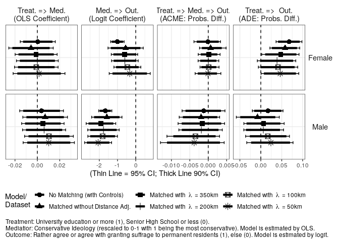
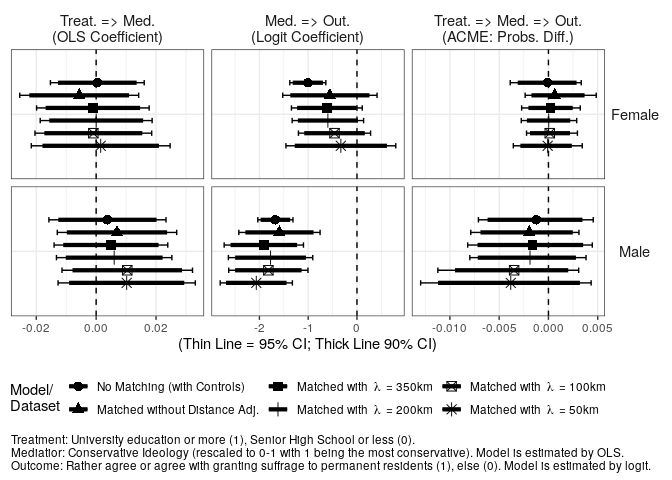

Analysis 4: Mediation Analysis with Ideology
================
Fan Lu & Gento Kato
Dec 31, 2019

# Preparation

``` r
## Clean Up Space
rm(list=ls())

## Set Working Directory (Automatically) ##
require(rstudioapi); require(rprojroot)
if (rstudioapi::isAvailable()==TRUE) {
  setwd(dirname(rstudioapi::getActiveDocumentContext()$path)); 
} 
projdir <- find_root(has_file("thisishome.txt"))
cat(paste("Working Directory Set to:\n",projdir))
```

    ## Working Directory Set to:
    ##  /home/gentok/Documents/Projects/ForeignerJapan

``` r
setwd(projdir)

## Load Image of Main Analysis
load(paste0(projdir,"/out/analysis_main_v4.RData"))

# Import Matched Data
sifcct_m1 <- readRDS("./data/sifcct_young_matched_1.rds")
sifcct_m2 <- readRDS("./data/sifcct_young_matched_2.rds")
sifcct_m3 <- readRDS("./data/sifcct_young_matched_3.rds")
sifcct_m4 <- readRDS("./data/sifcct_young_matched_4.rds")
sifcct_m5 <- readRDS("./data/sifcct_young_matched_5.rds")
head(sifcct$zip_pref)
```

    ## [1] "福井県" "東京都" "福井県" "埼玉県" "福岡県" "福井県"

``` r
# Replace zip_pref variable
sifcct_m1$zip_pref <- sifcct$zip_pref[match(sifcct_m1$zip,sifcct$zip)]
sifcct_m2$zip_pref <- sifcct$zip_pref[match(sifcct_m2$zip,sifcct$zip)]
sifcct_m3$zip_pref <- sifcct$zip_pref[match(sifcct_m3$zip,sifcct$zip)]
sifcct_m4$zip_pref <- sifcct$zip_pref[match(sifcct_m4$zip,sifcct$zip)]
sifcct_m5$zip_pref <- sifcct$zip_pref[match(sifcct_m5$zip,sifcct$zip)]

## packages
# devtools::install_github("gentok/estvis")
require(estvis)
require(multiwayvcov)
require(sandwich)
require(lmtest)
require(MASS)
require(ggplot2)
require(texreg)
require(mediation)
```

# Limit Data to Young People

``` r
table(sifcct$agecat)
```

    ## 
    ##        Young (<=30s) Middle Aged (40-50s)        Elder (>=60s) 
    ##                 8742                10432                 7122

``` r
sifcct <- sifcct[which(sifcct$agecat=="Young (<=30s)"),]

sifcct$wave <- as.factor(sifcct$wave)
sifcct_m1$wave <- as.factor(sifcct_m1$wave)
sifcct_m2$wave <- as.factor(sifcct_m2$wave)
sifcct_m3$wave <- as.factor(sifcct_m3$wave)
sifcct_m4$wave <- as.factor(sifcct_m4$wave)
sifcct_m5$wave <- as.factor(sifcct_m5$wave)

sifcct$foreignsuff_agree <- ifelse(sifcct$foreignsuff>=0.75,1,0)
sifcct_m1$foreignsuff_agree <- ifelse(sifcct_m1$foreignsuff>=0.75,1,0)
sifcct_m2$foreignsuff_agree <- ifelse(sifcct_m2$foreignsuff>=0.75,1,0)
sifcct_m3$foreignsuff_agree <- ifelse(sifcct_m3$foreignsuff>=0.75,1,0)
sifcct_m4$foreignsuff_agree <- ifelse(sifcct_m4$foreignsuff>=0.75,1,0)
sifcct_m5$foreignsuff_agree <- ifelse(sifcct_m5$foreignsuff>=0.75,1,0)

# Reverse Education Variable
sifcct$edu <- 1 - sifcct$edu
sifcct_m1$edu <- ifelse(sifcct_m1$edu=="<=SHS",1,0)
sifcct_m2$edu <- ifelse(sifcct_m2$edu=="<=SHS",1,0)
sifcct_m3$edu <- ifelse(sifcct_m3$edu=="<=SHS",1,0)
sifcct_m4$edu <- ifelse(sifcct_m4$edu=="<=SHS",1,0)
sifcct_m5$edu <- ifelse(sifcct_m5$edu=="<=SHS",1,0)
```

# Models

## SIFCCT (Original)

``` r
fdt <- sifcct[which(sifcct$female==1),]
mdt <- sifcct[which(sifcct$female==0),]

## Mediator Models
medf_IDE <- lm(ideology  ~ edu + knowledge + polint + employed + evecon + income + lvpr + wave, 
               data=fdt)
coeftest(medf_IDE, vcov.=vcovCL(medf_IDE,factor(fdt$zip_pref)))
```

    ## 
    ## t test of coefficients:
    ## 
    ##                Estimate  Std. Error t value  Pr(>|t|)    
    ## (Intercept)  6.0081e-01  2.5231e-02 23.8124 < 2.2e-16 ***
    ## edu         -3.8790e-04  7.9882e-03 -0.0486    0.9613    
    ## knowledge   -6.7286e-03  1.0991e-02 -0.6122    0.5404    
    ## polint      -5.7442e-02  1.3980e-02 -4.1089 4.056e-05 ***
    ## employed    -2.7687e-03  6.7757e-03 -0.4086    0.6828    
    ## evecon       3.3079e-03  1.0815e-02  0.3059    0.7597    
    ## income      -5.4246e-03  9.2997e-03 -0.5833    0.5597    
    ## lvpr         1.9342e-04  1.0005e-02  0.0193    0.9846    
    ## wave3        6.2056e-03  2.4369e-02  0.2547    0.7990    
    ## wave4       -1.5823e-02  2.4776e-02 -0.6387    0.5231    
    ## wave5       -2.6800e-02  3.2402e-02 -0.8271    0.4082    
    ## wave6        1.0187e-02  2.1302e-02  0.4782    0.6325    
    ## wave7       -2.9084e-03  2.4075e-02 -0.1208    0.9038    
    ## wave8       -1.6227e-03  2.7975e-02 -0.0580    0.9537    
    ## wave9        1.7946e-02  2.4789e-02  0.7239    0.4691    
    ## wave10      -7.2901e-03  2.2524e-02 -0.3237    0.7462    
    ## wave11      -3.5909e-03  1.6685e-02 -0.2152    0.8296    
    ## wave12      -2.2966e-02  2.1218e-02 -1.0824    0.2791    
    ## wave13      -2.9006e-03  2.8296e-02 -0.1025    0.9184    
    ## wave14      -9.8018e-05  2.2926e-02 -0.0043    0.9966    
    ## wave15      -4.8632e-03  2.5157e-02 -0.1933    0.8467    
    ## wave16      -1.7753e-02  3.2116e-02 -0.5528    0.5805    
    ## wave17      -3.7477e-02  2.4606e-02 -1.5231    0.1278    
    ## wave18      -5.0652e-03  2.6958e-02 -0.1879    0.8510    
    ## wave19      -2.8344e-02  2.7278e-02 -1.0391    0.2988    
    ## wave20      -1.4483e-03  1.7116e-02 -0.0846    0.9326    
    ## wave21      -9.7129e-03  2.2418e-02 -0.4333    0.6648    
    ## wave22      -5.1821e-03  2.6686e-02 -0.1942    0.8460    
    ## ---
    ## Signif. codes:  0 '***' 0.001 '**' 0.01 '*' 0.05 '.' 0.1 ' ' 1

``` r
medm_IDE <- lm(ideology  ~ edu + knowledge + polint + employed + evecon + income + lvpr + wave, 
               data=mdt)
coeftest(medm_IDE, vcov.=vcovCL(medm_IDE,factor(mdt$zip_pref)))
```

    ## 
    ## t test of coefficients:
    ## 
    ##               Estimate Std. Error t value Pr(>|t|)    
    ## (Intercept)  0.5614863  0.0181073 31.0089  < 2e-16 ***
    ## edu         -0.0037742  0.0099766 -0.3783  0.70522    
    ## knowledge    0.0140946  0.0188750  0.7467  0.45526    
    ## polint      -0.0207671  0.0159563 -1.3015  0.19315    
    ## employed     0.0033303  0.0089343  0.3728  0.70935    
    ## evecon      -0.0371672  0.0167134 -2.2238  0.02621 *  
    ## income      -0.0068600  0.0131630 -0.5212  0.60228    
    ## lvpr         0.0189814  0.0119175  1.5927  0.11129    
    ## wave3       -0.0255464  0.0231018 -1.1058  0.26886    
    ## wave4       -0.0321437  0.0206814 -1.5542  0.12020    
    ## wave5       -0.0518070  0.0254642 -2.0345  0.04196 *  
    ## wave6       -0.0313411  0.0225345 -1.3908  0.16435    
    ## wave7       -0.0339122  0.0229846 -1.4754  0.14016    
    ## wave8       -0.0193413  0.0195902 -0.9873  0.32355    
    ## wave9       -0.0175235  0.0239476 -0.7317  0.46436    
    ## wave10      -0.0028403  0.0271558 -0.1046  0.91670    
    ## wave11       0.0035819  0.0201876  0.1774  0.85918    
    ## wave12      -0.0349415  0.0231169 -1.5115  0.13072    
    ## wave13      -0.0322341  0.0241174 -1.3365  0.18143    
    ## wave14      -0.0188731  0.0208195 -0.9065  0.36471    
    ## wave15      -0.0161765  0.0190793 -0.8479  0.39656    
    ## wave16      -0.0099608  0.0214417 -0.4646  0.64227    
    ## wave17      -0.0078660  0.0184052 -0.4274  0.66912    
    ## wave18      -0.0195092  0.0203403 -0.9591  0.33754    
    ## wave19      -0.0226727  0.0239593 -0.9463  0.34404    
    ## wave20       0.0025122  0.0266611  0.0942  0.92493    
    ## wave21      -0.0021754  0.0204707 -0.1063  0.91537    
    ## wave22      -0.0221161  0.0242635 -0.9115  0.36208    
    ## ---
    ## Signif. codes:  0 '***' 0.001 '**' 0.01 '*' 0.05 '.' 0.1 ' ' 1

``` r
## Outcome Models 
outf_IDE <- glm(foreignsuff_agree  ~ edu + ideology + edu:ideology + 
                  knowledge + polint + employed + evecon + income + lvpr + wave, data=fdt, family=binomial("logit"))
coeftest(outf_IDE, vcov.=vcovCL(outf_IDE,factor(fdt$zip_pref)))
```

    ## 
    ## z test of coefficients:
    ## 
    ##                Estimate Std. Error z value  Pr(>|z|)    
    ## (Intercept)   0.1095598  0.2886496  0.3796 0.7042723    
    ## edu          -1.1259443  0.3381874 -3.3293 0.0008705 ***
    ## ideology     -1.0073900  0.1885840 -5.3419   9.2e-08 ***
    ## knowledge    -0.1287350  0.1243493 -1.0353 0.3005431    
    ## polint        0.2987230  0.1482784  2.0146 0.0439456 *  
    ## employed      0.0039562  0.0741506  0.0534 0.9574506    
    ## evecon        0.5616713  0.2056134  2.7317 0.0063011 ** 
    ## income       -0.0431572  0.1387986 -0.3109 0.7558505    
    ## lvpr         -0.1339195  0.1218028 -1.0995 0.2715598    
    ## wave3        -0.3336261  0.1975010 -1.6892 0.0911739 .  
    ## wave4        -0.3236215  0.2232291 -1.4497 0.1471343    
    ## wave5        -0.3258516  0.1875307 -1.7376 0.0822830 .  
    ## wave6        -0.0506429  0.1877656 -0.2697 0.7873809    
    ## wave7        -0.1923959  0.2089517 -0.9208 0.3571718    
    ## wave8        -0.3765348  0.2142706 -1.7573 0.0788690 .  
    ## wave9        -0.5887141  0.2225986 -2.6447 0.0081755 ** 
    ## wave10       -0.3295778  0.2431160 -1.3556 0.1752136    
    ## wave11       -0.6752721  0.2315184 -2.9167 0.0035374 ** 
    ## wave12       -0.3673863  0.1866375 -1.9684 0.0490165 *  
    ## wave13       -0.5533994  0.2069378 -2.6742 0.0074901 ** 
    ## wave14       -0.4624607  0.2214695 -2.0881 0.0367847 *  
    ## wave15       -0.4804122  0.1715872 -2.7998 0.0051132 ** 
    ## wave16       -0.4736943  0.1725728 -2.7449 0.0060530 ** 
    ## wave17       -0.6536790  0.2059845 -3.1734 0.0015065 ** 
    ## wave18       -0.3604045  0.1943705 -1.8542 0.0637086 .  
    ## wave19       -0.5829534  0.2168439 -2.6884 0.0071805 ** 
    ## wave20       -0.3883202  0.1851888 -2.0969 0.0360035 *  
    ## wave21       -0.6161755  0.2310234 -2.6672 0.0076496 ** 
    ## wave22       -0.1783773  0.1957564 -0.9112 0.3621793    
    ## edu:ideology  1.4645162  0.5864992  2.4970 0.0125232 *  
    ## ---
    ## Signif. codes:  0 '***' 0.001 '**' 0.01 '*' 0.05 '.' 0.1 ' ' 1

``` r
outm_IDE <- glm(foreignsuff_agree  ~ edu + ideology + edu:ideology + 
                  knowledge + polint + employed + evecon + income + lvpr + wave, data=mdt, family=binomial("logit"))
coeftest(outm_IDE, vcov.=vcovCL(outm_IDE,factor(mdt$zip_pref)))
```

    ## 
    ## z test of coefficients:
    ## 
    ##               Estimate Std. Error z value  Pr(>|z|)    
    ## (Intercept)  -0.379602   0.188225 -2.0167  0.043722 *  
    ## edu           0.081342   0.240725  0.3379  0.735437    
    ## ideology     -1.672297   0.183913 -9.0929 < 2.2e-16 ***
    ## knowledge    -0.461346   0.112118 -4.1148 3.875e-05 ***
    ## polint       -0.091404   0.165720 -0.5516  0.581252    
    ## employed      0.215824   0.099498  2.1691  0.030073 *  
    ## evecon        0.103813   0.189707  0.5472  0.584222    
    ## income        0.380001   0.119889  3.1696  0.001526 ** 
    ## lvpr         -0.323596   0.080469 -4.0214 5.785e-05 ***
    ## wave3         0.034072   0.264231  0.1289  0.897400    
    ## wave4         0.035155   0.255541  0.1376  0.890581    
    ## wave5         0.209826   0.181928  1.1533  0.248768    
    ## wave6         0.179245   0.245325  0.7306  0.464997    
    ## wave7         0.316584   0.236831  1.3368  0.181304    
    ## wave8         0.336826   0.277858  1.2122  0.225427    
    ## wave9         0.267338   0.221573  1.2065  0.227607    
    ## wave10        0.423215   0.216284  1.9568  0.050376 .  
    ## wave11        0.312113   0.228692  1.3648  0.172323    
    ## wave12        0.277198   0.236704  1.1711  0.241569    
    ## wave13       -0.038804   0.276532 -0.1403  0.888403    
    ## wave14        0.114183   0.240401  0.4750  0.634809    
    ## wave15        0.021010   0.278819  0.0754  0.939934    
    ## wave16        0.338188   0.271073  1.2476  0.212182    
    ## wave17        0.256779   0.232243  1.1056  0.268878    
    ## wave18        0.148246   0.201979  0.7340  0.462969    
    ## wave19        0.111512   0.209320  0.5327  0.594218    
    ## wave20        0.342309   0.312809  1.0943  0.273821    
    ## wave21        0.069860   0.274222  0.2548  0.798910    
    ## wave22        0.186724   0.298384  0.6258  0.531457    
    ## edu:ideology -0.371651   0.448269 -0.8291  0.407059    
    ## ---
    ## Signif. codes:  0 '***' 0.001 '**' 0.01 '*' 0.05 '.' 0.1 ' ' 1

``` r
## Causal Mediation Analysis
set.seed(2345)
medoutf_IDE <- mediate(medf_IDE, outf_IDE, treat = "edu", 
                       mediator = "ideology", 
                       cluster=factor(fdt$zip_pref))
summary(medoutf_IDE)
```

    ## 
    ## Causal Mediation Analysis 
    ## 
    ## Quasi-Bayesian Confidence Intervals
    ## 
    ##                           Estimate 95% CI Lower 95% CI Upper p-value    
    ## ACME (control)            9.06e-05    -3.33e-03         0.00    0.94    
    ## ACME (treated)           -2.06e-05    -2.41e-03         0.00    0.99    
    ## ADE (control)            -6.78e-02    -9.83e-02        -0.04  <2e-16 ***
    ## ADE (treated)            -6.79e-02    -9.88e-02        -0.04  <2e-16 ***
    ## Total Effect             -6.78e-02    -9.77e-02        -0.04  <2e-16 ***
    ## Prop. Mediated (control) -1.67e-03    -6.80e-02         0.05    0.94    
    ## Prop. Mediated (treated)  1.89e-05    -3.96e-02         0.04    0.99    
    ## ACME (average)            3.50e-05    -1.34e-03         0.00    0.97    
    ## ADE (average)            -6.78e-02    -9.79e-02        -0.04  <2e-16 ***
    ## Prop. Mediated (average) -8.24e-04    -3.03e-02         0.02    0.97    
    ## ---
    ## Signif. codes:  0 '***' 0.001 '**' 0.01 '*' 0.05 '.' 0.1 ' ' 1
    ## 
    ## Sample Size Used: 3989 
    ## 
    ## 
    ## Simulations: 1000

``` r
set.seed(2345)
medoutm_IDE <- mediate(medm_IDE, outm_IDE, treat = "edu", 
                       mediator = "ideology", 
                       cluster=factor(mdt$zip_pref))
summary(medoutm_IDE)
```

    ## 
    ## Causal Mediation Analysis 
    ## 
    ## Quasi-Bayesian Confidence Intervals
    ## 
    ##                          Estimate 95% CI Lower 95% CI Upper p-value
    ## ACME (control)            0.00122     -0.00455         0.01    0.69
    ## ACME (treated)            0.00136     -0.00536         0.01    0.69
    ## ADE (control)            -0.01730     -0.05307         0.02    0.40
    ## ADE (treated)            -0.01716     -0.05333         0.02    0.42
    ## Total Effect             -0.01594     -0.05167         0.02    0.45
    ## Prop. Mediated (control) -0.01927     -1.57730         1.47    0.88
    ## Prop. Mediated (treated) -0.02227     -1.88830         1.42    0.88
    ## ACME (average)            0.00129     -0.00500         0.01    0.69
    ## ADE (average)            -0.01723     -0.05316         0.02    0.41
    ## Prop. Mediated (average) -0.02077     -1.77869         1.43    0.88
    ## 
    ## Sample Size Used: 4737 
    ## 
    ## 
    ## Simulations: 1000

## Matched without Distance Adjustment

``` r
fdt_m1 <- sifcct_m1[which(sifcct_m1$female==1),]
mdt_m1 <- sifcct_m1[which(sifcct_m1$female==0),]

## Mediator Models
medf_IDE_m1 <- lm(ideology  ~ edu + #,
                    knowledge + polint + employed + evecon + income + lvpr + wave, 
                  data=fdt_m1)
coeftest(medf_IDE_m1, vcov.=vcovCL(medf_IDE_m1, factor(fdt_m1$zip_pref)))
```

    ## 
    ## t test of coefficients:
    ## 
    ##                Estimate  Std. Error t value  Pr(>|t|)    
    ## (Intercept)  0.57421192  0.02586120 22.2036 < 2.2e-16 ***
    ## edu          0.00566028  0.01012465  0.5591 0.5761924    
    ## knowledge    0.00678913  0.01656073  0.4100 0.6818900    
    ## polint      -0.06636265  0.01877033 -3.5355 0.0004175 ***
    ## employed    -0.00079842  0.00861306 -0.0927 0.9261538    
    ## evecon       0.02474562  0.01746299  1.4170 0.1566509    
    ## income       0.00923807  0.01572996  0.5873 0.5570837    
    ## lvpr         0.01681601  0.01126815  1.4923 0.1357876    
    ## wave3        0.01748346  0.02928754  0.5970 0.5506117    
    ## wave4       -0.01885760  0.02767956 -0.6813 0.4957825    
    ## wave5       -0.04277723  0.03402989 -1.2570 0.2089031    
    ## wave6       -0.00574191  0.03085851 -0.1861 0.8524098    
    ## wave7        0.02702304  0.02767242  0.9765 0.3289347    
    ## wave8        0.01611139  0.03234904  0.4980 0.6185123    
    ## wave9        0.01743189  0.02654740  0.6566 0.5115034    
    ## wave10      -0.02200193  0.03279906 -0.6708 0.5024298    
    ## wave11      -0.00033616  0.02783317 -0.0121 0.9903651    
    ## wave12      -0.04249880  0.02979574 -1.4263 0.1539486    
    ## wave13      -0.01708120  0.02981312 -0.5729 0.5667570    
    ## wave14       0.06979852  0.04226872  1.6513 0.0988552 .  
    ## wave15      -0.00622730  0.03373095 -0.1846 0.8535510    
    ## wave16      -0.00481255  0.03507193 -0.1372 0.8908730    
    ## wave17      -0.01999477  0.02753594 -0.7261 0.4678537    
    ## wave18      -0.00488466  0.03287462 -0.1486 0.8818985    
    ## wave19      -0.01831922  0.03319628 -0.5518 0.5811243    
    ## wave20      -0.02514498  0.02544236 -0.9883 0.3231364    
    ## wave21      -0.00234348  0.03735797 -0.0627 0.9499883    
    ## wave22       0.00431060  0.03682809  0.1170 0.9068365    
    ## ---
    ## Signif. codes:  0 '***' 0.001 '**' 0.01 '*' 0.05 '.' 0.1 ' ' 1

``` r
medm_IDE_m1 <- lm(ideology  ~ edu + #,
                    knowledge + polint + employed + evecon + income + lvpr + wave, 
                  data=mdt_m1)
coeftest(medm_IDE_m1, vcov.=vcovCL(medm_IDE_m1,factor(mdt_m1$zip_pref)))
```

    ## 
    ## t test of coefficients:
    ## 
    ##                Estimate  Std. Error t value  Pr(>|t|)    
    ## (Intercept)  0.58744065  0.02955412 19.8768 < 2.2e-16 ***
    ## edu         -0.00696093  0.01016790 -0.6846   0.49369    
    ## knowledge   -0.01179924  0.01950905 -0.6048   0.54539    
    ## polint      -0.01919687  0.03244993 -0.5916   0.55421    
    ## employed    -0.00289100  0.01739554 -0.1662   0.86803    
    ## evecon      -0.07726007  0.01915437 -4.0335 5.746e-05 ***
    ## income       0.02650413  0.02080744  1.2738   0.20292    
    ## lvpr         0.01444939  0.01338525  1.0795   0.28052    
    ## wave3       -0.00243227  0.05023645 -0.0484   0.96139    
    ## wave4       -0.06591967  0.02842913 -2.3187   0.02053 *  
    ## wave5       -0.04600522  0.03419669 -1.3453   0.17871    
    ## wave6       -0.02979776  0.03171520 -0.9395   0.34759    
    ## wave7       -0.07408834  0.03409984 -2.1727   0.02995 *  
    ## wave8       -0.00989237  0.03824975 -0.2586   0.79596    
    ## wave9       -0.00025695  0.03710029 -0.0069   0.99447    
    ## wave10       0.01253437  0.02688289  0.4663   0.64109    
    ## wave11      -0.01829443  0.02864422 -0.6387   0.52312    
    ## wave12      -0.02428163  0.02930609 -0.8286   0.40748    
    ## wave13      -0.02739867  0.03053064 -0.8974   0.36963    
    ## wave14      -0.02542237  0.02900474 -0.8765   0.38089    
    ## wave15      -0.02792846  0.02592821 -1.0771   0.28157    
    ## wave16      -0.05153122  0.03009963 -1.7120   0.08708 .  
    ## wave17      -0.01740978  0.02392088 -0.7278   0.46684    
    ## wave18      -0.04443962  0.04890845 -0.9086   0.36368    
    ## wave19      -0.03155742  0.03384883 -0.9323   0.35132    
    ## wave20       0.02374892  0.02951086  0.8048   0.42108    
    ## wave21      -0.00687922  0.03408564 -0.2018   0.84008    
    ## wave22      -0.02076000  0.03607710 -0.5754   0.56508    
    ## ---
    ## Signif. codes:  0 '***' 0.001 '**' 0.01 '*' 0.05 '.' 0.1 ' ' 1

``` r
## Outcome Models
outf_IDE_m1 <- glm(foreignsuff_agree  ~ edu + ideology + edu:ideology + #,
                     knowledge + polint + employed + evecon + income + lvpr + wave, 
                   data=fdt_m1, family=binomial("logit"))
coeftest(outf_IDE_m1, vcov.=vcovCL(outf_IDE_m1,factor(fdt_m1$zip_pref)))
```

    ## 
    ## z test of coefficients:
    ## 
    ##               Estimate Std. Error z value Pr(>|z|)   
    ## (Intercept)  -0.422912   0.386087 -1.0954 0.273351   
    ## edu          -0.883542   0.456391 -1.9359 0.052876 . 
    ## ideology     -0.555501   0.493409 -1.1258 0.260232   
    ## knowledge     0.102593   0.279912  0.3665 0.713978   
    ## polint        0.557118   0.191927  2.9028 0.003699 **
    ## employed      0.089358   0.122859  0.7273 0.467027   
    ## evecon        0.338521   0.222135  1.5239 0.127523   
    ## income       -0.134356   0.254309 -0.5283 0.597279   
    ## lvpr         -0.232485   0.173638 -1.3389 0.180600   
    ## wave3        -0.501655   0.420869 -1.1919 0.233281   
    ## wave4        -0.028906   0.311930 -0.0927 0.926167   
    ## wave5        -0.268448   0.315598 -0.8506 0.394991   
    ## wave6         0.226975   0.302837  0.7495 0.453557   
    ## wave7        -0.277441   0.255318 -1.0866 0.277193   
    ## wave8        -0.367259   0.406008 -0.9046 0.365699   
    ## wave9        -0.513824   0.341878 -1.5029 0.132853   
    ## wave10        0.020612   0.366593  0.0562 0.955162   
    ## wave11       -0.639547   0.279568 -2.2876 0.022159 * 
    ## wave12       -0.253530   0.317284 -0.7991 0.424253   
    ## wave13       -0.403392   0.356778 -1.1307 0.258201   
    ## wave14       -0.281271   0.444995 -0.6321 0.527337   
    ## wave15       -0.299170   0.325782 -0.9183 0.358455   
    ## wave16       -0.319508   0.280279 -1.1400 0.254302   
    ## wave17       -0.332871   0.381095 -0.8735 0.382413   
    ## wave18       -0.401385   0.296497 -1.3538 0.175814   
    ## wave19       -0.254500   0.291874 -0.8720 0.383235   
    ## wave20       -0.077635   0.290625 -0.2671 0.789369   
    ## wave21       -0.487388   0.288211 -1.6911 0.090822 . 
    ## wave22        0.191180   0.317445  0.6022 0.547010   
    ## edu:ideology  1.096878   0.819997  1.3377 0.181007   
    ## ---
    ## Signif. codes:  0 '***' 0.001 '**' 0.01 '*' 0.05 '.' 0.1 ' ' 1

``` r
outm_IDE_m1 <- glm(foreignsuff_agree  ~ edu + ideology + edu:ideology + #,
                     knowledge + polint + employed + evecon + income + lvpr + wave, 
                   data=mdt_m1, family=binomial("logit"))
coeftest(outm_IDE_m1, vcov.=vcovCL(outm_IDE_m1,factor(mdt_m1$zip_pref)))
```

    ## 
    ## z test of coefficients:
    ## 
    ##                Estimate Std. Error z value  Pr(>|z|)    
    ## (Intercept)  -0.4870428  0.3382867 -1.4397 0.1499428    
    ## edu           0.2553057  0.3603051  0.7086 0.4785839    
    ## ideology     -1.5889695  0.4247964 -3.7405 0.0001836 ***
    ## knowledge    -0.6999647  0.1629282 -4.2962 1.738e-05 ***
    ## polint        0.2931694  0.1998287  1.4671 0.1423478    
    ## employed      0.3322713  0.1924451  1.7266 0.0842436 .  
    ## evecon        0.1250264  0.3391015  0.3687 0.7123520    
    ## income        0.2931815  0.2339588  1.2531 0.2101573    
    ## lvpr         -0.3740340  0.1322567 -2.8281 0.0046826 ** 
    ## wave3        -0.0800953  0.3937993 -0.2034 0.8388293    
    ## wave4         0.0182333  0.4652112  0.0392 0.9687360    
    ## wave5        -0.3594791  0.3810855 -0.9433 0.3455260    
    ## wave6         0.2706155  0.4153685  0.6515 0.5147191    
    ## wave7         0.0618172  0.3569152  0.1732 0.8624954    
    ## wave8        -0.0584121  0.4254032 -0.1373 0.8907857    
    ## wave9        -0.4395242  0.4190929 -1.0488 0.2942927    
    ## wave10        0.3206056  0.3978996  0.8057 0.4203899    
    ## wave11        0.2869096  0.3866767  0.7420 0.4580945    
    ## wave12        0.0602214  0.3721943  0.1618 0.8714627    
    ## wave13       -0.1725333  0.5195274 -0.3321 0.7398163    
    ## wave14       -0.0855701  0.4161900 -0.2056 0.8371006    
    ## wave15       -0.4686160  0.4341091 -1.0795 0.2803697    
    ## wave16       -0.0047835  0.4458994 -0.0107 0.9914407    
    ## wave17       -0.0647162  0.5155663 -0.1255 0.9001083    
    ## wave18        0.0831531  0.4416252  0.1883 0.8506503    
    ## wave19       -0.1094389  0.4032142 -0.2714 0.7860709    
    ## wave20       -0.0885874  0.4379696 -0.2023 0.8397069    
    ## wave21       -0.3726853  0.4524751 -0.8237 0.4101332    
    ## wave22       -0.6086393  0.5585326 -1.0897 0.2758403    
    ## edu:ideology -0.4107913  0.6636627 -0.6190 0.5359322    
    ## ---
    ## Signif. codes:  0 '***' 0.001 '**' 0.01 '*' 0.05 '.' 0.1 ' ' 1

``` r
## Causal Mediation Analysis
set.seed(2345)
medoutf_IDE_m1 <- mediate(medf_IDE_m1, outf_IDE_m1, treat = "edu", 
                          mediator = "ideology", 
                          cluster=factor(fdt_m1$zip_pref))
summary(medoutf_IDE_m1)
```

    ## 
    ## Causal Mediation Analysis 
    ## 
    ## Quasi-Bayesian Confidence Intervals
    ## 
    ##                           Estimate 95% CI Lower 95% CI Upper p-value    
    ## ACME (control)           -6.41e-04    -4.85e-03         0.00   0.674    
    ## ACME (treated)            6.10e-04    -2.07e-03         0.00   0.710    
    ## ADE (control)            -5.80e-02    -9.30e-02        -0.02   0.002 ** 
    ## ADE (treated)            -5.68e-02    -9.18e-02        -0.02  <2e-16 ***
    ## Total Effect             -5.74e-02    -9.24e-02        -0.02   0.002 ** 
    ## Prop. Mediated (control)  6.15e-03    -4.96e-02         0.11   0.672    
    ## Prop. Mediated (treated) -5.40e-03    -1.17e-01         0.04   0.708    
    ## ACME (average)           -1.56e-05    -1.52e-03         0.00   1.000    
    ## ADE (average)            -5.74e-02    -9.24e-02        -0.02  <2e-16 ***
    ## Prop. Mediated (average)  3.74e-04    -3.10e-02         0.03   0.998    
    ## ---
    ## Signif. codes:  0 '***' 0.001 '**' 0.01 '*' 0.05 '.' 0.1 ' ' 1
    ## 
    ## Sample Size Used: 1784 
    ## 
    ## 
    ## Simulations: 1000

``` r
set.seed(2345)
medoutm_IDE_m1 <- mediate(medm_IDE_m1, outm_IDE_m1, treat = "edu", 
                          mediator = "ideology", 
                          cluster=factor(mdt_m1$zip_pref))
summary(medoutm_IDE_m1)
```

    ## 
    ## Causal Mediation Analysis 
    ## 
    ## Quasi-Bayesian Confidence Intervals
    ## 
    ##                          Estimate 95% CI Lower 95% CI Upper p-value
    ## ACME (control)            0.00194     -0.00310         0.01    0.44
    ## ACME (treated)            0.00244     -0.00405         0.01    0.44
    ## ADE (control)             0.00799     -0.04416         0.06    0.77
    ## ADE (treated)             0.00850     -0.04403         0.06    0.75
    ## Total Effect              0.01043     -0.04030         0.06    0.69
    ## Prop. Mediated (control)  0.03731     -1.46135         1.33    0.74
    ## Prop. Mediated (treated)  0.05156     -1.63582         1.70    0.74
    ## ACME (average)            0.00219     -0.00363         0.01    0.44
    ## ADE (average)             0.00824     -0.04400         0.06    0.76
    ## Prop. Mediated (average)  0.04444     -1.49635         1.41    0.74
    ## 
    ## Sample Size Used: 1674 
    ## 
    ## 
    ## Simulations: 1000

## Matched with Distance Adjustment (Lambda=50km)

``` r
fdt_m2 <- sifcct_m2[which(sifcct_m2$female==1),]
mdt_m2 <- sifcct_m2[which(sifcct_m2$female==0),]

## Mediator Models
medf_IDE_m2 <- lm(ideology  ~ edu + #,
                    knowledge + polint + employed + evecon + income + lvpr + wave, 
                  data=fdt_m2)
coeftest(medf_IDE_m2, vcov.=vcovCL(medf_IDE_m2, factor(fdt_m2$zip_pref)))
```

    ## 
    ## t test of coefficients:
    ## 
    ##               Estimate Std. Error t value  Pr(>|t|)    
    ## (Intercept)  0.5797328  0.0295216 19.6375 < 2.2e-16 ***
    ## edu         -0.0015178  0.0118157 -0.1285  0.897810    
    ## knowledge    0.0243201  0.0215175  1.1302  0.258611    
    ## polint      -0.0751197  0.0244136 -3.0770  0.002141 ** 
    ## employed    -0.0052312  0.0083928 -0.6233  0.533214    
    ## evecon       0.0202834  0.0205022  0.9893  0.322715    
    ## income       0.0030694  0.0227599  0.1349  0.892746    
    ## lvpr         0.0128541  0.0125098  1.0275  0.304394    
    ## wave3        0.0206459  0.0373737  0.5524  0.580771    
    ## wave4       -0.0165352  0.0350840 -0.4713  0.637516    
    ## wave5       -0.0171807  0.0354402 -0.4848  0.627925    
    ## wave6       -0.0154734  0.0360447 -0.4293  0.667797    
    ## wave7        0.0441256  0.0322367  1.3688  0.171332    
    ## wave8       -0.0032714  0.0428746 -0.0763  0.939192    
    ## wave9        0.0215047  0.0332444  0.6469  0.517850    
    ## wave10       0.0093868  0.0433854  0.2164  0.828747    
    ## wave11       0.0151839  0.0381998  0.3975  0.691083    
    ## wave12      -0.0295717  0.0310375 -0.9528  0.340909    
    ## wave13       0.0362111  0.0366131  0.9890  0.322864    
    ## wave14      -0.0057911  0.0393611 -0.1471  0.883058    
    ## wave15      -0.0127333  0.0389953 -0.3265  0.744081    
    ## wave16      -0.0029752  0.0374397 -0.0795  0.936676    
    ## wave17      -0.0441126  0.0297421 -1.4832  0.138307    
    ## wave18       0.0099040  0.0295205  0.3355  0.737313    
    ## wave19      -0.0130526  0.0373046 -0.3499  0.726485    
    ## wave20      -0.0097347  0.0351814 -0.2767  0.782060    
    ## wave21      -0.0056955  0.0331588 -0.1718  0.863654    
    ## wave22       0.0147664  0.0384162  0.3844  0.700770    
    ## ---
    ## Signif. codes:  0 '***' 0.001 '**' 0.01 '*' 0.05 '.' 0.1 ' ' 1

``` r
medm_IDE_m2 <- lm(ideology  ~ edu + #,
                    knowledge + polint + employed + evecon + income + lvpr + wave, 
                  data=mdt_m2)
coeftest(medm_IDE_m2, vcov.=vcovCL(medm_IDE_m2,factor(mdt_m2$zip_pref)))
```

    ## 
    ## t test of coefficients:
    ## 
    ##               Estimate Std. Error t value Pr(>|t|)    
    ## (Intercept)  0.5322473  0.0424829 12.5285  < 2e-16 ***
    ## edu         -0.0102026  0.0116816 -0.8734  0.38262    
    ## knowledge   -0.0133234  0.0249803 -0.5334  0.59388    
    ## polint      -0.0297361  0.0280528 -1.0600  0.28935    
    ## employed     0.0243069  0.0300273  0.8095  0.41839    
    ## evecon      -0.0447314  0.0208300 -2.1474  0.03195 *  
    ## income       0.0162124  0.0260309  0.6228  0.53352    
    ## lvpr         0.0105902  0.0152161  0.6960  0.48657    
    ## wave3        0.0076427  0.0539718  0.1416  0.88742    
    ## wave4       -0.0137738  0.0285005 -0.4833  0.62898    
    ## wave5        0.0144105  0.0510403  0.2823  0.77773    
    ## wave6        0.0016904  0.0342870  0.0493  0.96069    
    ## wave7       -0.0522510  0.0338834 -1.5421  0.12331    
    ## wave8        0.0770026  0.0405035  1.9011  0.05752 .  
    ## wave9        0.0502804  0.0489028  1.0282  0.30407    
    ## wave10       0.0676416  0.0358358  1.8875  0.05932 .  
    ## wave11       0.0030445  0.0405692  0.0750  0.94019    
    ## wave12      -0.0498757  0.0293584 -1.6989  0.08960 .  
    ## wave13      -0.0320517  0.0302711 -1.0588  0.28989    
    ## wave14       0.0221778  0.0361412  0.6136  0.53956    
    ## wave15       0.0550809  0.0303443  1.8152  0.06974 .  
    ## wave16       0.0018465  0.0434785  0.0425  0.96613    
    ## wave17       0.0194393  0.0266700  0.7289  0.46621    
    ## wave18      -0.0048576  0.0549731 -0.0884  0.92960    
    ## wave19      -0.0066391  0.0349922 -0.1897  0.84955    
    ## wave20       0.0328623  0.0309096  1.0632  0.28791    
    ## wave21       0.0412565  0.0364932  1.1305  0.25848    
    ## wave22      -0.0030505  0.0352227 -0.0866  0.93100    
    ## ---
    ## Signif. codes:  0 '***' 0.001 '**' 0.01 '*' 0.05 '.' 0.1 ' ' 1

``` r
## Outcome Models
outf_IDE_m2 <- glm(foreignsuff_agree  ~ edu + ideology + edu:ideology + #,
                     knowledge + polint + employed + evecon + income + lvpr + wave, 
                   data=fdt_m2, family=binomial("logit"))
coeftest(outf_IDE_m2, vcov.=vcovCL(outf_IDE_m2,factor(fdt_m2$zip_pref)))
```

    ## 
    ## z test of coefficients:
    ## 
    ##               Estimate Std. Error z value Pr(>|z|)    
    ## (Intercept)  -0.998951   0.399317 -2.5017  0.01236 *  
    ## edu          -0.616659   0.497893 -1.2385  0.21552    
    ## ideology     -0.330543   0.574476 -0.5754  0.56503    
    ## knowledge    -0.388377   0.367457 -1.0569  0.29054    
    ## polint        0.930997   0.220407  4.2240  2.4e-05 ***
    ## employed     -0.018241   0.118431 -0.1540  0.87759    
    ## evecon        0.077456   0.191244  0.4050  0.68547    
    ## income       -0.315178   0.420408 -0.7497  0.45344    
    ## lvpr         -0.276650   0.217234 -1.2735  0.20284    
    ## wave3         0.152210   0.575399  0.2645  0.79137    
    ## wave4         0.490704   0.418889  1.1714  0.24142    
    ## wave5        -0.640671   0.319555 -2.0049  0.04498 *  
    ## wave6         0.399915   0.406027  0.9849  0.32465    
    ## wave7         0.709714   0.374791  1.8936  0.05827 .  
    ## wave8         0.576355   0.331252  1.7399  0.08187 .  
    ## wave9         0.142915   0.445514  0.3208  0.74837    
    ## wave10        0.182051   0.540211  0.3370  0.73612    
    ## wave11        0.143674   0.365445  0.3931  0.69421    
    ## wave12        0.486913   0.467276  1.0420  0.29740    
    ## wave13       -0.270601   0.370228 -0.7309  0.46484    
    ## wave14        0.436955   0.490746  0.8904  0.37326    
    ## wave15        0.450468   0.386812  1.1646  0.24419    
    ## wave16        0.369289   0.341791  1.0805  0.27994    
    ## wave17       -0.356040   0.482852 -0.7374  0.46090    
    ## wave18        0.555424   0.222092  2.5009  0.01239 *  
    ## wave19        0.387452   0.498393  0.7774  0.43692    
    ## wave20        0.597558   0.308429  1.9374  0.05269 .  
    ## wave21        0.535519   0.359348  1.4903  0.13616    
    ## wave22        0.559682   0.368902  1.5172  0.12923    
    ## edu:ideology  0.704845   0.791048  0.8910  0.37291    
    ## ---
    ## Signif. codes:  0 '***' 0.001 '**' 0.01 '*' 0.05 '.' 0.1 ' ' 1

``` r
outm_IDE_m2 <- glm(foreignsuff_agree  ~ edu+ ideology + edu:ideology + #,
                     knowledge + polint + employed + evecon + income + lvpr + wave, 
                   data=mdt_m2, family=binomial("logit"))
coeftest(outm_IDE_m2, vcov.=vcovCL(outm_IDE_m2,factor(mdt_m2$zip_pref)))
```

    ## 
    ## z test of coefficients:
    ## 
    ##               Estimate Std. Error z value  Pr(>|z|)    
    ## (Intercept)  -0.912029   0.451921 -2.0181  0.043579 *  
    ## edu          -0.054827   0.335640 -0.1634  0.870242    
    ## ideology     -2.063932   0.377578 -5.4662 4.597e-08 ***
    ## knowledge    -0.172125   0.230695 -0.7461  0.455598    
    ## polint        0.173188   0.231519  0.7481  0.454429    
    ## employed      0.441536   0.262459  1.6823  0.092511 .  
    ## evecon        0.366622   0.388140  0.9446  0.344883    
    ## income        0.753787   0.262918  2.8670  0.004144 ** 
    ## lvpr         -0.442271   0.172967 -2.5570  0.010559 *  
    ## wave3         0.241111   0.428181  0.5631  0.573363    
    ## wave4         0.100016   0.459679  0.2176  0.827758    
    ## wave5         0.154127   0.518334  0.2974  0.766199    
    ## wave6         0.075043   0.607567  0.1235  0.901700    
    ## wave7         0.395816   0.461660  0.8574  0.391237    
    ## wave8         0.371394   0.472314  0.7863  0.431676    
    ## wave9         0.113824   0.467184  0.2436  0.807511    
    ## wave10        0.422349   0.482808  0.8748  0.381695    
    ## wave11        0.412866   0.489721  0.8431  0.399193    
    ## wave12        0.187627   0.389088  0.4822  0.629647    
    ## wave13        0.100825   0.628267  0.1605  0.872502    
    ## wave14       -0.099447   0.417171 -0.2384  0.811583    
    ## wave15       -0.046123   0.487475 -0.0946  0.924620    
    ## wave16        0.057611   0.476521  0.1209  0.903771    
    ## wave17        0.543398   0.483267  1.1244  0.260832    
    ## wave18        0.388487   0.361097  1.0759  0.281994    
    ## wave19        0.321215   0.459845  0.6985  0.484847    
    ## wave20        0.327125   0.535371  0.6110  0.541183    
    ## wave21       -0.087716   0.552520 -0.1588  0.873862    
    ## wave22        0.368126   0.464278  0.7929  0.427836    
    ## edu:ideology -0.170374   0.549631 -0.3100  0.756577    
    ## ---
    ## Signif. codes:  0 '***' 0.001 '**' 0.01 '*' 0.05 '.' 0.1 ' ' 1

``` r
## Causal Mediation Analysis
set.seed(2345)
medoutf_IDE_m2 <- mediate(medf_IDE_m2, outf_IDE_m2, treat = "edu", 
                          mediator = "ideology", 
                          cluster=factor(fdt_m2$zip_pref))
summary(medoutf_IDE_m2)
```

    ## 
    ## Causal Mediation Analysis 
    ## 
    ## Quasi-Bayesian Confidence Intervals
    ## 
    ##                           Estimate 95% CI Lower 95% CI Upper p-value  
    ## ACME (control)            7.75e-05    -3.43e-03         0.00   0.974  
    ## ACME (treated)           -1.02e-04    -4.14e-03         0.00   0.936  
    ## ADE (control)            -4.64e-02    -9.08e-02         0.00   0.046 *
    ## ADE (treated)            -4.66e-02    -9.17e-02         0.00   0.046 *
    ## Total Effect             -4.65e-02    -9.16e-02         0.00   0.044 *
    ## Prop. Mediated (control) -5.92e-04    -1.54e-01         0.12   0.966  
    ## Prop. Mediated (treated)  1.08e-03    -1.43e-01         0.12   0.944  
    ## ACME (average)           -1.23e-05    -2.55e-03         0.00   0.990  
    ## ADE (average)            -4.65e-02    -9.12e-02         0.00   0.044 *
    ## Prop. Mediated (average)  2.42e-04    -1.25e-01         0.09   0.990  
    ## ---
    ## Signif. codes:  0 '***' 0.001 '**' 0.01 '*' 0.05 '.' 0.1 ' ' 1
    ## 
    ## Sample Size Used: 1162 
    ## 
    ## 
    ## Simulations: 1000

``` r
set.seed(2345)
medoutm_IDE_m2 <- mediate(medm_IDE_m2, outm_IDE_m2, treat = "edu", 
                          mediator = "ideology", 
                          cluster=factor(mdt_m2$zip_pref))
summary(medoutm_IDE_m2)
```

    ## 
    ## Causal Mediation Analysis 
    ## 
    ## Quasi-Bayesian Confidence Intervals
    ## 
    ##                          Estimate 95% CI Lower 95% CI Upper p-value
    ## ACME (control)            0.00382     -0.00434         0.01    0.37
    ## ACME (treated)            0.00384     -0.00471         0.01    0.37
    ## ADE (control)            -0.02409     -0.07703         0.03    0.41
    ## ADE (treated)            -0.02408     -0.07797         0.03    0.42
    ## Total Effect             -0.02026     -0.07457         0.04    0.51
    ## Prop. Mediated (control) -0.06270     -1.43213         3.04    0.75
    ## Prop. Mediated (treated) -0.05881     -1.49263         3.43    0.75
    ## ACME (average)            0.00383     -0.00453         0.01    0.37
    ## ADE (average)            -0.02409     -0.07796         0.03    0.40
    ## Prop. Mediated (average) -0.06076     -1.50186         3.12    0.75
    ## 
    ## Sample Size Used: 1252 
    ## 
    ## 
    ## Simulations: 1000

## Matched with Distance Adjustment (Lambda=100km)

``` r
fdt_m3 <- sifcct_m3[which(sifcct_m3$female==1),]
mdt_m3 <- sifcct_m3[which(sifcct_m3$female==0),]

## Mediator Models
medf_IDE_m3 <- lm(ideology  ~ edu + #,
                    knowledge + polint + employed + evecon + income + lvpr + wave, 
                  data=fdt_m3)
coeftest(medf_IDE_m3, vcov.=vcovCL(medf_IDE_m3, factor(fdt_m3$zip_pref)))
```

    ## 
    ## t test of coefficients:
    ## 
    ##                Estimate  Std. Error t value  Pr(>|t|)    
    ## (Intercept)  0.58699237  0.02832338 20.7247 < 2.2e-16 ***
    ## edu          0.00094099  0.00993510  0.0947 0.9245560    
    ## knowledge    0.02028025  0.01872562  1.0830 0.2789851    
    ## polint      -0.07661047  0.02273816 -3.3692 0.0007742 ***
    ## employed    -0.01834478  0.00836675 -2.1926 0.0285014 *  
    ## evecon       0.02454634  0.01395576  1.7589 0.0788179 .  
    ## income      -0.00450071  0.01951190 -0.2307 0.8176089    
    ## lvpr         0.01212624  0.01250635  0.9696 0.3324097    
    ## wave3        0.02386072  0.03446135  0.6924 0.4888067    
    ## wave4       -0.01181139  0.03111445 -0.3796 0.7042915    
    ## wave5       -0.02933976  0.03567333 -0.8225 0.4109570    
    ## wave6       -0.00032203  0.03150963 -0.0102 0.9918472    
    ## wave7        0.03185835  0.02673638  1.1916 0.2336305    
    ## wave8        0.02203864  0.03710131  0.5940 0.5525995    
    ## wave9        0.01483851  0.02692833  0.5510 0.5816961    
    ## wave10      -0.00142523  0.03826257 -0.0372 0.9702921    
    ## wave11       0.02301169  0.03610871  0.6373 0.5240405    
    ## wave12      -0.03478704  0.03363069 -1.0344 0.3011352    
    ## wave13       0.03638541  0.03616804  1.0060 0.3145844    
    ## wave14       0.01066239  0.03406539  0.3130 0.7543290    
    ## wave15      -0.01666367  0.03378028 -0.4933 0.6218808    
    ## wave16       0.00491325  0.03658914  0.1343 0.8931991    
    ## wave17      -0.03943335  0.03082771 -1.2792 0.2010550    
    ## wave18       0.01386210  0.02878084  0.4816 0.6301343    
    ## wave19      -0.00656330  0.03863795 -0.1699 0.8651396    
    ## wave20       0.00521470  0.02989704  0.1744 0.8615591    
    ## wave21       0.02106189  0.02810961  0.7493 0.4538160    
    ## wave22       0.00682605  0.03801560  0.1796 0.8575247    
    ## ---
    ## Signif. codes:  0 '***' 0.001 '**' 0.01 '*' 0.05 '.' 0.1 ' ' 1

``` r
medm_IDE_m3 <- lm(ideology  ~ edu + #,
                    knowledge + polint + employed + evecon + income + lvpr + wave, 
                  data=mdt_m3)
coeftest(medm_IDE_m3, vcov.=vcovCL(medm_IDE_m3,factor(mdt_m3$zip_pref)))
```

    ## 
    ## t test of coefficients:
    ## 
    ##                Estimate  Std. Error t value  Pr(>|t|)    
    ## (Intercept)  0.55102813  0.03600936 15.3024 < 2.2e-16 ***
    ## edu         -0.01038737  0.01111036 -0.9349  0.349981    
    ## knowledge   -0.00227599  0.02146825 -0.1060  0.915584    
    ## polint      -0.02517642  0.02687742 -0.9367  0.349061    
    ## employed     0.00389022  0.02521026  0.1543  0.877386    
    ## evecon      -0.05184735  0.01970581 -2.6311  0.008601 ** 
    ## income      -0.00098458  0.02186792 -0.0450  0.964094    
    ## lvpr         0.00831797  0.01488189  0.5589  0.576294    
    ## wave3        0.04048659  0.04631080  0.8742  0.382134    
    ## wave4       -0.01742544  0.02713125 -0.6423  0.520802    
    ## wave5       -0.00115350  0.04365747 -0.0264  0.978925    
    ## wave6       -0.01542875  0.03237609 -0.4765  0.633756    
    ## wave7       -0.04851468  0.02694669 -1.8004  0.072005 .  
    ## wave8        0.06263839  0.03625755  1.7276  0.084272 .  
    ## wave9        0.06081975  0.04153371  1.4643  0.143315    
    ## wave10       0.05839941  0.02921534  1.9989  0.045801 *  
    ## wave11       0.01873273  0.03054644  0.6133  0.539804    
    ## wave12      -0.02615870  0.02349675 -1.1133  0.265767    
    ## wave13       0.00775748  0.03150357  0.2462  0.805530    
    ## wave14       0.02419990  0.03001499  0.8063  0.420224    
    ## wave15       0.05714566  0.02567332  2.2259  0.026175 *  
    ## wave16      -0.01529946  0.03721871 -0.4111  0.681082    
    ## wave17       0.00822468  0.02352239  0.3497  0.726649    
    ## wave18       0.00175623  0.04623715  0.0380  0.969706    
    ## wave19       0.00660843  0.03354426  0.1970  0.843850    
    ## wave20       0.03432467  0.03358719  1.0220  0.306971    
    ## wave21       0.05368793  0.03081333  1.7424  0.081656 .  
    ## wave22       0.00329409  0.02850742  0.1156  0.908023    
    ## ---
    ## Signif. codes:  0 '***' 0.001 '**' 0.01 '*' 0.05 '.' 0.1 ' ' 1

``` r
## Outcome Models
outf_IDE_m3 <- glm(foreignsuff_agree  ~ edu + ideology + edu:ideology + #,
                     knowledge + polint + employed + evecon + income + lvpr + wave, 
                   data=fdt_m3, family=binomial("logit"))
coeftest(outf_IDE_m3, vcov.=vcovCL(outf_IDE_m3,factor(fdt_m3$zip_pref)))
```

    ## 
    ## z test of coefficients:
    ## 
    ##               Estimate Std. Error z value Pr(>|z|)   
    ## (Intercept)  -0.997586   0.399583 -2.4966 0.012540 * 
    ## edu          -0.752834   0.440050 -1.7108 0.087120 . 
    ## ideology     -0.460330   0.377311 -1.2200 0.222453   
    ## knowledge    -0.216602   0.301653 -0.7181 0.472726   
    ## polint        0.711128   0.234813  3.0285 0.002458 **
    ## employed      0.020289   0.111489  0.1820 0.855598   
    ## evecon        0.240606   0.199108  1.2084 0.226887   
    ## income       -0.306900   0.337571 -0.9091 0.363275   
    ## lvpr         -0.298840   0.190027 -1.5726 0.115808   
    ## wave3         0.286104   0.496661  0.5761 0.564579   
    ## wave4         0.459112   0.387415  1.1851 0.235991   
    ## wave5        -0.087570   0.307168 -0.2851 0.775577   
    ## wave6         0.730522   0.382701  1.9089 0.056280 . 
    ## wave7         0.651803   0.401317  1.6242 0.104341   
    ## wave8         0.509172   0.360835  1.4111 0.158217   
    ## wave9         0.065682   0.454453  0.1445 0.885083   
    ## wave10        0.479298   0.408896  1.1722 0.241125   
    ## wave11        0.215798   0.367072  0.5879 0.556606   
    ## wave12        0.637354   0.392100  1.6255 0.104058   
    ## wave13       -0.123646   0.380199 -0.3252 0.745019   
    ## wave14        0.603357   0.437787  1.3782 0.168143   
    ## wave15        0.505141   0.343404  1.4710 0.141297   
    ## wave16        0.399279   0.332121  1.2022 0.229283   
    ## wave17        0.012792   0.429604  0.0298 0.976245   
    ## wave18        0.414251   0.285636  1.4503 0.146981   
    ## wave19        0.401870   0.450636  0.8918 0.372508   
    ## wave20        0.550472   0.344714  1.5969 0.110289   
    ## wave21        0.478421   0.386421  1.2381 0.215685   
    ## wave22        0.680495   0.400785  1.6979 0.089525 . 
    ## edu:ideology  0.999912   0.706436  1.4154 0.156942   
    ## ---
    ## Signif. codes:  0 '***' 0.001 '**' 0.01 '*' 0.05 '.' 0.1 ' ' 1

``` r
outm_IDE_m3 <- glm(foreignsuff_agree  ~ edu + ideology + edu:ideology + #,
                     knowledge + polint + employed + evecon + income + lvpr + wave, 
                   data=mdt_m3, family=binomial("logit"))
coeftest(outm_IDE_m3, vcov.=vcovCL(outm_IDE_m3,factor(mdt_m3$zip_pref)))
```

    ## 
    ## z test of coefficients:
    ## 
    ##               Estimate Std. Error z value  Pr(>|z|)    
    ## (Intercept)  -0.582175   0.432024 -1.3476 0.1778020    
    ## edu          -0.047120   0.307425 -0.1533 0.8781837    
    ## ideology     -1.816570   0.414321 -4.3845 1.163e-05 ***
    ## knowledge    -0.385649   0.215498 -1.7896 0.0735231 .  
    ## polint        0.184887   0.211514  0.8741 0.3820572    
    ## employed      0.368034   0.303260  1.2136 0.2249034    
    ## evecon        0.185204   0.359005  0.5159 0.6059367    
    ## income        0.696144   0.197678  3.5216 0.0004289 ***
    ## lvpr         -0.483775   0.137143 -3.5275 0.0004195 ***
    ## wave3        -0.025463   0.416126 -0.0612 0.9512071    
    ## wave4        -0.352823   0.438036 -0.8055 0.4205508    
    ## wave5        -0.003364   0.416762 -0.0081 0.9935598    
    ## wave6         0.075167   0.566886  0.1326 0.8945126    
    ## wave7         0.212053   0.453880  0.4672 0.6403563    
    ## wave8         0.146052   0.429386  0.3401 0.7337495    
    ## wave9        -0.198295   0.433482 -0.4574 0.6473505    
    ## wave10        0.139596   0.411586  0.3392 0.7344841    
    ## wave11        0.285466   0.442874  0.6446 0.5192020    
    ## wave12        0.030130   0.356627  0.0845 0.9326690    
    ## wave13       -0.162436   0.545468 -0.2978 0.7658623    
    ## wave14       -0.065091   0.352882 -0.1845 0.8536571    
    ## wave15       -0.699279   0.433543 -1.6129 0.1067574    
    ## wave16        0.138588   0.423675  0.3271 0.7435855    
    ## wave17        0.107164   0.496815  0.2157 0.8292196    
    ## wave18        0.088582   0.329325  0.2690 0.7879448    
    ## wave19        0.098576   0.448593  0.2197 0.8260701    
    ## wave20       -0.010567   0.545867 -0.0194 0.9845560    
    ## wave21       -0.105605   0.487245 -0.2167 0.8284115    
    ## wave22       -0.063390   0.439980 -0.1441 0.8854424    
    ## edu:ideology -0.096219   0.546520 -0.1761 0.8602488    
    ## ---
    ## Signif. codes:  0 '***' 0.001 '**' 0.01 '*' 0.05 '.' 0.1 ' ' 1

``` r
## Causal Mediation Analysis
set.seed(2345)
medoutf_IDE_m3 <- mediate(medf_IDE_m3, outf_IDE_m3, treat = "edu", 
                          mediator = "ideology", 
                          cluster=factor(fdt_m3$zip_pref))
summary(medoutf_IDE_m3)
```

    ## 
    ## Causal Mediation Analysis 
    ## 
    ## Quasi-Bayesian Confidence Intervals
    ## 
    ##                           Estimate 95% CI Lower 95% CI Upper p-value
    ## ACME (control)           -1.33e-04    -2.94e-03         0.00    0.89
    ## ACME (treated)            1.81e-04    -3.10e-03         0.00    0.92
    ## ADE (control)            -4.11e-02    -8.83e-02         0.01    0.11
    ## ADE (treated)            -4.08e-02    -8.96e-02         0.01    0.12
    ## Total Effect             -4.09e-02    -8.85e-02         0.01    0.11
    ## Prop. Mediated (control)  9.00e-04    -1.18e-01         0.15    0.91
    ## Prop. Mediated (treated) -9.85e-04    -1.91e-01         0.19    0.92
    ## ACME (average)            2.40e-05    -1.48e-03         0.00    0.96
    ## ADE (average)            -4.10e-02    -8.86e-02         0.01    0.11
    ## Prop. Mediated (average) -4.26e-05    -8.31e-02         0.09    0.97
    ## 
    ## Sample Size Used: 1430 
    ## 
    ## 
    ## Simulations: 1000

``` r
set.seed(2345)
medoutm_IDE_m3 <- mediate(medm_IDE_m3, outm_IDE_m3, treat = "edu", 
                          mediator = "ideology", 
                          cluster=factor(mdt_m3$zip_pref))
summary(medoutm_IDE_m3)
```

    ## 
    ## Causal Mediation Analysis 
    ## 
    ## Quasi-Bayesian Confidence Intervals
    ## 
    ##                          Estimate 95% CI Lower 95% CI Upper p-value
    ## ACME (control)            0.00348     -0.00307         0.01    0.32
    ## ACME (treated)            0.00344     -0.00335         0.01    0.32
    ## ADE (control)            -0.01668     -0.06846         0.04    0.55
    ## ADE (treated)            -0.01672     -0.06918         0.04    0.53
    ## Total Effect             -0.01324     -0.06400         0.04    0.63
    ## Prop. Mediated (control) -0.04114     -1.34166         2.02    0.82
    ## Prop. Mediated (treated) -0.04258     -1.34408         2.21    0.82
    ## ACME (average)            0.00346     -0.00324         0.01    0.32
    ## ADE (average)            -0.01670     -0.06904         0.04    0.54
    ## Prop. Mediated (average) -0.04186     -1.42009         2.10    0.82
    ## 
    ## Sample Size Used: 1486 
    ## 
    ## 
    ## Simulations: 1000

## Matched with Distance Adjustment (Lambda=200km)

``` r
fdt_m4 <- sifcct_m4[which(sifcct_m4$female==1),]
mdt_m4 <- sifcct_m4[which(sifcct_m4$female==0),]

## Mediator Models
medf_IDE_m4 <- lm(ideology  ~ edu + #,
                    knowledge + polint + employed + evecon + income + lvpr + wave, 
                  data=fdt_m4)
coeftest(medf_IDE_m4, vcov.=vcovCL(medf_IDE_m4, factor(fdt_m4$zip_pref)))
```

    ## 
    ## t test of coefficients:
    ## 
    ##                Estimate  Std. Error t value Pr(>|t|)    
    ## (Intercept)  5.8278e-01  2.7641e-02 21.0840  < 2e-16 ***
    ## edu         -9.1251e-06  9.5276e-03 -0.0010  0.99924    
    ## knowledge    1.5026e-02  1.6590e-02  0.9057  0.36522    
    ## polint      -5.1105e-02  2.2703e-02 -2.2510  0.02452 *  
    ## employed    -9.5118e-03  8.7848e-03 -1.0828  0.27908    
    ## evecon       2.1569e-02  1.7503e-02  1.2323  0.21802    
    ## income      -1.3685e-02  1.8341e-02 -0.7461  0.45569    
    ## lvpr         6.9993e-03  1.2098e-02  0.5786  0.56297    
    ## wave3        3.6644e-02  3.1310e-02  1.1704  0.24203    
    ## wave4       -2.0185e-02  3.1302e-02 -0.6448  0.51912    
    ## wave5       -2.7414e-02  3.4401e-02 -0.7969  0.42563    
    ## wave6        2.3094e-03  3.4364e-02  0.0672  0.94643    
    ## wave7        4.0926e-02  2.8862e-02  1.4180  0.15639    
    ## wave8        3.1126e-02  3.7631e-02  0.8271  0.40828    
    ## wave9        1.3303e-02  3.2235e-02  0.4127  0.67989    
    ## wave10      -7.0834e-03  4.1238e-02 -0.1718  0.86364    
    ## wave11       6.6349e-03  3.6474e-02  0.1819  0.85568    
    ## wave12      -4.3959e-02  3.3415e-02 -1.3155  0.18852    
    ## wave13       3.1762e-02  3.3633e-02  0.9444  0.34512    
    ## wave14       2.4108e-02  3.6214e-02  0.6657  0.50570    
    ## wave15      -9.9922e-03  3.9287e-02 -0.2543  0.79927    
    ## wave16      -9.6651e-03  3.6613e-02 -0.2640  0.79183    
    ## wave17      -4.2655e-02  2.8813e-02 -1.4804  0.13897    
    ## wave18      -1.6400e-03  3.1753e-02 -0.0516  0.95881    
    ## wave19      -2.4810e-02  3.7431e-02 -0.6628  0.50754    
    ## wave20      -7.4155e-04  3.2454e-02 -0.0228  0.98177    
    ## wave21       1.2766e-02  3.1590e-02  0.4041  0.68620    
    ## wave22       6.7727e-03  3.7760e-02  0.1794  0.85768    
    ## ---
    ## Signif. codes:  0 '***' 0.001 '**' 0.01 '*' 0.05 '.' 0.1 ' ' 1

``` r
medm_IDE_m4 <- lm(ideology  ~ edu + #,
                    knowledge + polint + employed + evecon + income + lvpr + wave, 
                  data=mdt_m4)
coeftest(medm_IDE_m4, vcov.=vcovCL(medm_IDE_m4,factor(mdt_m4$zip_pref)))
```

    ## 
    ## t test of coefficients:
    ## 
    ##                Estimate  Std. Error t value Pr(>|t|)    
    ## (Intercept)  0.55609996  0.03222592 17.2563  < 2e-16 ***
    ## edu         -0.00601860  0.00982689 -0.6125  0.54032    
    ## knowledge   -0.00534571  0.01703563 -0.3138  0.75372    
    ## polint      -0.04006994  0.02523569 -1.5878  0.11252    
    ## employed     0.00667544  0.01964783  0.3398  0.73409    
    ## evecon      -0.04729863  0.01979313 -2.3896  0.01698 *  
    ## income       0.00563372  0.02033728  0.2770  0.78181    
    ## lvpr         0.00942998  0.01465997  0.6432  0.52016    
    ## wave3        0.04143957  0.04553947  0.9100  0.36298    
    ## wave4       -0.01605880  0.02941896 -0.5459  0.58524    
    ## wave5       -0.00709741  0.04341806 -0.1635  0.87017    
    ## wave6       -0.01206868  0.03245033 -0.3719  0.71001    
    ## wave7       -0.05270610  0.02785933 -1.8919  0.05869 .  
    ## wave8        0.05333866  0.03845621  1.3870  0.16564    
    ## wave9        0.04733725  0.03938292  1.2020  0.22955    
    ## wave10       0.04801011  0.03175294  1.5120  0.13074    
    ## wave11       0.02647230  0.03344979  0.7914  0.42883    
    ## wave12      -0.04913872  0.02519837 -1.9501  0.05134 .  
    ## wave13       0.01723047  0.03333326  0.5169  0.60529    
    ## wave14       0.01039487  0.03196175  0.3252  0.74505    
    ## wave15       0.04169083  0.03193157  1.3056  0.19187    
    ## wave16      -0.01995257  0.03320050 -0.6010  0.54794    
    ## wave17       0.02631421  0.02448919  1.0745  0.28275    
    ## wave18      -0.00919796  0.04790081 -0.1920  0.84775    
    ## wave19       0.00062546  0.03692056  0.0169  0.98649    
    ## wave20       0.02836030  0.03546763  0.7996  0.42406    
    ## wave21       0.04621404  0.03178210  1.4541  0.14612    
    ## wave22       0.00701815  0.03345636  0.2098  0.83387    
    ## ---
    ## Signif. codes:  0 '***' 0.001 '**' 0.01 '*' 0.05 '.' 0.1 ' ' 1

``` r
## Outcome Models
outf_IDE_m4 <- glm(foreignsuff_agree  ~ edu + ideology + edu:ideology + #,
                     knowledge + polint + employed + evecon + income + lvpr + wave, 
                   data=fdt_m4, family=binomial("logit"))
coeftest(outf_IDE_m4, vcov.=vcovCL(outf_IDE_m4,factor(fdt_m4$zip_pref)))
```

    ## 
    ## z test of coefficients:
    ## 
    ##                 Estimate  Std. Error z value Pr(>|z|)   
    ## (Intercept)  -0.74221039  0.32302843 -2.2977 0.021581 * 
    ## edu          -0.82173560  0.42626156 -1.9278 0.053883 . 
    ## ideology     -0.59647589  0.37362492 -1.5965 0.110387   
    ## knowledge    -0.19387438  0.28780473 -0.6736 0.500546   
    ## polint        0.67809359  0.22620905  2.9976 0.002721 **
    ## employed      0.04302041  0.11057955  0.3890 0.697243   
    ## evecon        0.42457985  0.19730076  2.1519 0.031402 * 
    ## income       -0.12863998  0.31680469 -0.4061 0.684703   
    ## lvpr         -0.29626191  0.15208521 -1.9480 0.051415 . 
    ## wave3        -0.14650381  0.39231235 -0.3734 0.708823   
    ## wave4         0.24636217  0.31375921  0.7852 0.432339   
    ## wave5        -0.28927327  0.29350113 -0.9856 0.324332   
    ## wave6         0.49071701  0.34271843  1.4318 0.152190   
    ## wave7         0.23581282  0.28336858  0.8322 0.405309   
    ## wave8        -0.01051817  0.35907556 -0.0293 0.976631   
    ## wave9        -0.27493676  0.35731116 -0.7695 0.441620   
    ## wave10        0.29239073  0.42302004  0.6912 0.489441   
    ## wave11       -0.16884822  0.32704105 -0.5163 0.605651   
    ## wave12        0.39220250  0.32049400  1.2237 0.221049   
    ## wave13       -0.64919439  0.31229758 -2.0788 0.037639 * 
    ## wave14        0.34439007  0.41164923  0.8366 0.402812   
    ## wave15        0.20067518  0.28290877  0.7093 0.478121   
    ## wave16       -0.10105000  0.30410123 -0.3323 0.739670   
    ## wave17       -0.23511677  0.40249779 -0.5841 0.559123   
    ## wave18        0.00040942  0.28317864  0.0014 0.998846   
    ## wave19       -0.01056505  0.39264592 -0.0269 0.978534   
    ## wave20        0.28220477  0.29296146  0.9633 0.335406   
    ## wave21        0.03864737  0.37787880  0.1023 0.918539   
    ## wave22        0.45127939  0.30490320  1.4801 0.138853   
    ## edu:ideology  1.14015365  0.69793369  1.6336 0.102340   
    ## ---
    ## Signif. codes:  0 '***' 0.001 '**' 0.01 '*' 0.05 '.' 0.1 ' ' 1

``` r
outm_IDE_m4 <- glm(foreignsuff_agree  ~ edu + ideology + edu:ideology + #,
                     knowledge + polint + employed + evecon + income + lvpr + wave, 
                   data=mdt_m4, family=binomial("logit"))
coeftest(outm_IDE_m4, vcov.=vcovCL(outm_IDE_m4,factor(mdt_m4$zip_pref)))
```

    ## 
    ## z test of coefficients:
    ## 
    ##                 Estimate  Std. Error z value  Pr(>|z|)    
    ## (Intercept)  -0.71588681  0.43406727 -1.6493 0.0990958 .  
    ## edu           0.00194654  0.30665742  0.0063 0.9949354    
    ## ideology     -1.77146535  0.44126301 -4.0145 5.956e-05 ***
    ## knowledge    -0.55223390  0.18201577 -3.0340 0.0024134 ** 
    ## polint        0.21575562  0.21477467  1.0046 0.3151052    
    ## employed      0.40621483  0.28623976  1.4191 0.1558577    
    ## evecon        0.21771219  0.29187050  0.7459 0.4557154    
    ## income        0.69936054  0.20635657  3.3891 0.0007013 ***
    ## lvpr         -0.41180295  0.13574978 -3.0335 0.0024170 ** 
    ## wave3         0.05868968  0.39500944  0.1486 0.8818867    
    ## wave4        -0.30752654  0.37868494 -0.8121 0.4167396    
    ## wave5        -0.00074065  0.38609454 -0.0019 0.9984694    
    ## wave6         0.14166870  0.51565397  0.2747 0.7835191    
    ## wave7         0.34094118  0.39009822  0.8740 0.3821248    
    ## wave8         0.04081376  0.41777725  0.0977 0.9221764    
    ## wave9        -0.41802229  0.38696119 -1.0803 0.2800223    
    ## wave10        0.03440026  0.37169876  0.0925 0.9262621    
    ## wave11        0.33948333  0.40986266  0.8283 0.4075088    
    ## wave12        0.17393125  0.31879231  0.5456 0.5853449    
    ## wave13       -0.10825870  0.47929880 -0.2259 0.8213034    
    ## wave14        0.18517042  0.36778526  0.5035 0.6146309    
    ## wave15       -0.65184016  0.45064461 -1.4465 0.1480478    
    ## wave16        0.16642223  0.40386654  0.4121 0.6802864    
    ## wave17        0.16607378  0.43914741  0.3782 0.7053019    
    ## wave18        0.12488463  0.31025898  0.4025 0.6873033    
    ## wave19        0.15400385  0.42318609  0.3639 0.7159213    
    ## wave20        0.16563292  0.49071814  0.3375 0.7357161    
    ## wave21       -0.23561216  0.45735278 -0.5152 0.6064377    
    ## wave22        0.08644468  0.40294149  0.2145 0.8301306    
    ## edu:ideology -0.06758962  0.55723986 -0.1213 0.9034585    
    ## ---
    ## Signif. codes:  0 '***' 0.001 '**' 0.01 '*' 0.05 '.' 0.1 ' ' 1

``` r
## Causal Mediation Analysis
set.seed(2345)
medoutf_IDE_m4 <- mediate(medf_IDE_m4, outf_IDE_m4, treat = "edu", 
                          mediator = "ideology", 
                          cluster=factor(fdt_m4$zip_pref))
summary(medoutf_IDE_m4)
```

    ## 
    ## Causal Mediation Analysis 
    ## 
    ## Quasi-Bayesian Confidence Intervals
    ## 
    ##                           Estimate 95% CI Lower 95% CI Upper p-value
    ## ACME (control)           -2.96e-05    -2.87e-03         0.00    0.97
    ## ACME (treated)            7.35e-05    -3.03e-03         0.00    0.95
    ## ADE (control)            -3.87e-02    -8.36e-02         0.01    0.12
    ## ADE (treated)            -3.86e-02    -8.38e-02         0.01    0.12
    ## Total Effect             -3.87e-02    -8.35e-02         0.01    0.12
    ## Prop. Mediated (control)  3.24e-04    -1.72e-01         0.15    0.97
    ## Prop. Mediated (treated) -1.28e-03    -2.36e-01         0.14    0.93
    ## ACME (average)            2.20e-05    -1.27e-03         0.00    0.96
    ## ADE (average)            -3.87e-02    -8.35e-02         0.01    0.11
    ## Prop. Mediated (average) -4.77e-04    -1.08e-01         0.06    0.96
    ## 
    ## Sample Size Used: 1624 
    ## 
    ## 
    ## Simulations: 1000

``` r
set.seed(2345)
medoutm_IDE_m4 <- mediate(medm_IDE_m4, outm_IDE_m4, treat = "edu", 
                          mediator = "ideology", 
                          cluster=factor(mdt_m4$zip_pref))
summary(medoutm_IDE_m4)
```

    ## 
    ## Causal Mediation Analysis 
    ## 
    ## Quasi-Bayesian Confidence Intervals
    ## 
    ##                          Estimate 95% CI Lower 95% CI Upper p-value
    ## ACME (control)            0.00187     -0.00382         0.01    0.53
    ## ACME (treated)            0.00188     -0.00377         0.01    0.53
    ## ADE (control)            -0.00602     -0.05439         0.04    0.81
    ## ADE (treated)            -0.00601     -0.05412         0.04    0.82
    ## Total Effect             -0.00414     -0.05242         0.04    0.86
    ## Prop. Mediated (control)  0.00428     -2.13155         1.61    0.98
    ## Prop. Mediated (treated)  0.00517     -2.65741         1.66    0.98
    ## ACME (average)            0.00187     -0.00376         0.01    0.53
    ## ADE (average)            -0.00601     -0.05422         0.04    0.81
    ## Prop. Mediated (average)  0.00473     -2.09992         1.56    0.98
    ## 
    ## Sample Size Used: 1612 
    ## 
    ## 
    ## Simulations: 1000

## Matched with Distance Adjustment (Lambda=200km)

``` r
fdt_m5 <- sifcct_m5[which(sifcct_m5$female==1),]
mdt_m5 <- sifcct_m5[which(sifcct_m5$female==0),]

## Mediator Models
medf_IDE_m5 <- lm(ideology  ~ edu + #,
                    knowledge + polint + employed + evecon + income + lvpr + wave,
                  data=fdt_m5)
coeftest(medf_IDE_m5, vcov.=vcovCL(medf_IDE_m5, factor(fdt_m5$zip_pref)))
```

    ## 
    ## t test of coefficients:
    ## 
    ##               Estimate Std. Error t value  Pr(>|t|)    
    ## (Intercept)  0.5958871  0.0295803 20.1448 < 2.2e-16 ***
    ## edu          0.0010909  0.0095837  0.1138  0.909391    
    ## knowledge    0.0074151  0.0169313  0.4380  0.661477    
    ## polint      -0.0595497  0.0214096 -2.7814  0.005473 ** 
    ## employed    -0.0013726  0.0095762 -0.1433  0.886048    
    ## evecon       0.0209931  0.0180793  1.1612  0.245739    
    ## income      -0.0202271  0.0165408 -1.2229  0.221557    
    ## lvpr         0.0059757  0.0115740  0.5163  0.605711    
    ## wave3        0.0232183  0.0306017  0.7587  0.448123    
    ## wave4       -0.0347209  0.0345291 -1.0056  0.314775    
    ## wave5       -0.0256696  0.0357850 -0.7173  0.473272    
    ## wave6       -0.0099976  0.0352530 -0.2836  0.776756    
    ## wave7        0.0373668  0.0307951  1.2134  0.225148    
    ## wave8        0.0252317  0.0391468  0.6445  0.519313    
    ## wave9        0.0075476  0.0336697  0.2242  0.822655    
    ## wave10      -0.0231340  0.0400545 -0.5776  0.563637    
    ## wave11      -0.0120975  0.0372415 -0.3248  0.745343    
    ## wave12      -0.0476657  0.0314670 -1.5148  0.130017    
    ## wave13       0.0213433  0.0342083  0.6239  0.532764    
    ## wave14       0.0140696  0.0362123  0.3885  0.697673    
    ## wave15      -0.0265385  0.0373648 -0.7103  0.477646    
    ## wave16      -0.0108868  0.0390257 -0.2790  0.780306    
    ## wave17      -0.0517043  0.0298243 -1.7336  0.083169 .  
    ## wave18      -0.0105868  0.0341328 -0.3102  0.756474    
    ## wave19      -0.0394933  0.0391892 -1.0078  0.313716    
    ## wave20      -0.0151876  0.0302383 -0.5023  0.615549    
    ## wave21       0.0058162  0.0339836  0.1711  0.864129    
    ## wave22      -0.0021726  0.0379392 -0.0573  0.954341    
    ## ---
    ## Signif. codes:  0 '***' 0.001 '**' 0.01 '*' 0.05 '.' 0.1 ' ' 1

``` r
medm_IDE_m5 <- lm(ideology  ~ edu + #, 
                    knowledge + polint + employed + evecon + income + lvpr + wave,
                  data=mdt_m5)
coeftest(medm_IDE_m5, vcov.=vcovCL(medm_IDE_m5,factor(mdt_m5$zip_pref)))
```

    ## 
    ## t test of coefficients:
    ## 
    ##               Estimate Std. Error t value Pr(>|t|)    
    ## (Intercept)  0.5480563  0.0343869 15.9380  < 2e-16 ***
    ## edu         -0.0049333  0.0096758 -0.5099  0.61022    
    ## knowledge   -0.0102143  0.0172645 -0.5916  0.55418    
    ## polint      -0.0350069  0.0243307 -1.4388  0.15040    
    ## employed     0.0071275  0.0187036  0.3811  0.70320    
    ## evecon      -0.0479690  0.0203233 -2.3603  0.01838 *  
    ## income       0.0058596  0.0205131  0.2856  0.77518    
    ## lvpr         0.0135583  0.0140571  0.9645  0.33493    
    ## wave3        0.0546323  0.0442499  1.2346  0.21715    
    ## wave4       -0.0152027  0.0295663 -0.5142  0.60719    
    ## wave5       -0.0037992  0.0428092 -0.0887  0.92929    
    ## wave6       -0.0133353  0.0311005 -0.4288  0.66814    
    ## wave7       -0.0479321  0.0255974 -1.8725  0.06131 .  
    ## wave8        0.0569434  0.0374551  1.5203  0.12863    
    ## wave9        0.0512729  0.0396478  1.2932  0.19612    
    ## wave10       0.0520341  0.0293964  1.7701  0.07690 .  
    ## wave11       0.0268051  0.0316362  0.8473  0.39696    
    ## wave12      -0.0446923  0.0204411 -2.1864  0.02893 *  
    ## wave13       0.0249299  0.0327841  0.7604  0.44711    
    ## wave14       0.0033280  0.0305321  0.1090  0.91322    
    ## wave15       0.0468932  0.0307645  1.5243  0.12764    
    ## wave16      -0.0097844  0.0322935 -0.3030  0.76194    
    ## wave17       0.0244222  0.0225681  1.0822  0.27934    
    ## wave18      -0.0065496  0.0481583 -0.1360  0.89184    
    ## wave19       0.0126736  0.0369645  0.3429  0.73175    
    ## wave20       0.0402728  0.0328867  1.2246  0.22091    
    ## wave21       0.0492742  0.0302275  1.6301  0.10327    
    ## wave22       0.0031437  0.0310783  0.1012  0.91944    
    ## ---
    ## Signif. codes:  0 '***' 0.001 '**' 0.01 '*' 0.05 '.' 0.1 ' ' 1

``` r
## Outcome Models
outf_IDE_m5 <- glm(foreignsuff_agree  ~ edu + ideology + edu:ideology + #,
                     knowledge + polint + employed + evecon + income + lvpr + wave, 
                   data=fdt_m5, family=binomial("logit"))
coeftest(outf_IDE_m5, vcov.=vcovCL(outf_IDE_m5,factor(fdt_m5$zip_pref)))
```

    ## 
    ## z test of coefficients:
    ## 
    ##                Estimate Std. Error z value Pr(>|z|)   
    ## (Intercept)  -0.7239147  0.3383720 -2.1394 0.032403 * 
    ## edu          -0.8622556  0.3912272 -2.2040 0.027526 * 
    ## ideology     -0.6175130  0.3703832 -1.6672 0.095469 . 
    ## knowledge    -0.1463367  0.2918956 -0.5013 0.616137   
    ## polint        0.6980773  0.2221092  3.1429 0.001673 **
    ## employed      0.0540668  0.1163203  0.4648 0.642068   
    ## evecon        0.3329194  0.1925196  1.7293 0.083760 . 
    ## income        0.0069217  0.3119431  0.0222 0.982297   
    ## lvpr         -0.3137026  0.1580163 -1.9853 0.047116 * 
    ## wave3        -0.1728033  0.4051602 -0.4265 0.669739   
    ## wave4         0.2283544  0.3404524  0.6707 0.502387   
    ## wave5        -0.2824506  0.3020227 -0.9352 0.349687   
    ## wave6         0.5090657  0.3588031  1.4188 0.155961   
    ## wave7         0.1522927  0.3134387  0.4859 0.627054   
    ## wave8         0.0367194  0.3168534  0.1159 0.907742   
    ## wave9        -0.1738691  0.4052051 -0.4291 0.667858   
    ## wave10        0.3556337  0.4366754  0.8144 0.415409   
    ## wave11       -0.2790507  0.3247951 -0.8592 0.390253   
    ## wave12        0.3239735  0.3500149  0.9256 0.354654   
    ## wave13       -0.7405057  0.3061278 -2.4189 0.015566 * 
    ## wave14        0.2581954  0.4008332  0.6441 0.519480   
    ## wave15        0.1279889  0.2973321  0.4305 0.666863   
    ## wave16       -0.1663583  0.2828236 -0.5882 0.556395   
    ## wave17       -0.2255000  0.4049378 -0.5569 0.577612   
    ## wave18       -0.0574704  0.3085841 -0.1862 0.852257   
    ## wave19        0.0868798  0.3942347  0.2204 0.825579   
    ## wave20        0.2757942  0.2951645  0.9344 0.350111   
    ## wave21       -0.1026247  0.3707646 -0.2768 0.781940   
    ## wave22        0.4458093  0.3224451  1.3826 0.166791   
    ## edu:ideology  1.1351305  0.6470325  1.7544 0.079368 . 
    ## ---
    ## Signif. codes:  0 '***' 0.001 '**' 0.01 '*' 0.05 '.' 0.1 ' ' 1

``` r
outm_IDE_m5 <- glm(foreignsuff_agree  ~ edu + ideology + edu:ideology + #,
                     knowledge + polint + employed + evecon + income + lvpr + wave, 
                   data=mdt_m5, family=binomial("logit"))
coeftest(outm_IDE_m5, vcov.=vcovCL(outm_IDE_m5,factor(mdt_m5$zip_pref)))
```

    ## 
    ## z test of coefficients:
    ## 
    ##               Estimate Std. Error z value  Pr(>|z|)    
    ## (Intercept)  -0.519292   0.413393 -1.2562 0.2090534    
    ## edu          -0.040459   0.307293 -0.1317 0.8952511    
    ## ideology     -1.909853   0.414692 -4.6055 4.115e-06 ***
    ## knowledge    -0.657715   0.175052 -3.7573 0.0001718 ***
    ## polint        0.208276   0.209424  0.9945 0.3199709    
    ## employed      0.266175   0.254479  1.0460 0.2955781    
    ## evecon        0.262600   0.299886  0.8757 0.3812116    
    ## income        0.738285   0.226949  3.2531 0.0011416 ** 
    ## lvpr         -0.426795   0.136666 -3.1229 0.0017908 ** 
    ## wave3         0.193296   0.431871  0.4476 0.6544577    
    ## wave4        -0.182364   0.379555 -0.4805 0.6308953    
    ## wave5        -0.025633   0.376103 -0.0682 0.9456622    
    ## wave6         0.290310   0.472236  0.6148 0.5387154    
    ## wave7         0.380137   0.392020  0.9697 0.3322015    
    ## wave8         0.205351   0.406737  0.5049 0.6136481    
    ## wave9        -0.425834   0.387143 -1.0999 0.2713577    
    ## wave10        0.072674   0.372634  0.1950 0.8453711    
    ## wave11        0.426438   0.413385  1.0316 0.3022707    
    ## wave12        0.300950   0.322183  0.9341 0.3502544    
    ## wave13       -0.163579   0.505335 -0.3237 0.7461626    
    ## wave14        0.123869   0.332746  0.3723 0.7096983    
    ## wave15       -0.592037   0.447836 -1.3220 0.1861696    
    ## wave16        0.213088   0.403454  0.5282 0.5973891    
    ## wave17        0.184769   0.435791  0.4240 0.6715768    
    ## wave18        0.226710   0.339129  0.6685 0.5038112    
    ## wave19        0.100499   0.419840  0.2394 0.8108158    
    ## wave20        0.279297   0.502514  0.5558 0.5783485    
    ## wave21       -0.220556   0.457649 -0.4819 0.6298530    
    ## wave22        0.070456   0.392371  0.1796 0.8574940    
    ## edu:ideology  0.014364   0.550910  0.0261 0.9791987    
    ## ---
    ## Signif. codes:  0 '***' 0.001 '**' 0.01 '*' 0.05 '.' 0.1 ' ' 1

``` r
## Causal Mediation Analysis
set.seed(2345)
medoutf_IDE_m5 <- mediate(medf_IDE_m5, outf_IDE_m5, treat = "edu", 
                          mediator = "ideology", 
                          cluster=factor(fdt_m5$zip_pref))
summary(medoutf_IDE_m5)
```

    ## 
    ## Causal Mediation Analysis 
    ## 
    ## Quasi-Bayesian Confidence Intervals
    ## 
    ##                           Estimate 95% CI Lower 95% CI Upper p-value  
    ## ACME (control)           -1.96e-04    -3.23e-03         0.00   0.834  
    ## ACME (treated)            1.94e-04    -2.56e-03         0.00   0.874  
    ## ADE (control)            -4.77e-02    -9.13e-02         0.00   0.040 *
    ## ADE (treated)            -4.73e-02    -9.11e-02         0.00   0.038 *
    ## Total Effect             -4.75e-02    -9.13e-02         0.00   0.038 *
    ## Prop. Mediated (control)  2.20e-03    -8.13e-02         0.12   0.844  
    ## Prop. Mediated (treated) -1.63e-03    -1.37e-01         0.09   0.868  
    ## ACME (average)           -7.85e-07    -1.41e-03         0.00   0.976  
    ## ADE (average)            -4.75e-02    -9.19e-02         0.00   0.036 *
    ## Prop. Mediated (average)  2.85e-04    -5.16e-02         0.05   0.974  
    ## ---
    ## Signif. codes:  0 '***' 0.001 '**' 0.01 '*' 0.05 '.' 0.1 ' ' 1
    ## 
    ## Sample Size Used: 1694 
    ## 
    ## 
    ## Simulations: 1000

``` r
set.seed(2345)
medoutm_IDE_m5 <- mediate(medm_IDE_m5, outm_IDE_m5, treat = "edu", 
                          mediator = "ideology", 
                          cluster=factor(mdt_m5$zip_pref))
summary(medoutm_IDE_m5)
```

    ## 
    ## Causal Mediation Analysis 
    ## 
    ## Quasi-Bayesian Confidence Intervals
    ## 
    ##                          Estimate 95% CI Lower 95% CI Upper p-value
    ## ACME (control)            0.00162     -0.00445         0.01    0.61
    ## ACME (treated)            0.00155     -0.00422         0.01    0.61
    ## ADE (control)            -0.00637     -0.05586         0.04    0.80
    ## ADE (treated)            -0.00644     -0.05560         0.04    0.79
    ## Total Effect             -0.00482     -0.05361         0.04    0.84
    ## Prop. Mediated (control)  0.00356     -2.09261         1.45    0.98
    ## Prop. Mediated (treated)  0.00318     -2.06949         1.38    0.98
    ## ACME (average)            0.00159     -0.00441         0.01    0.61
    ## ADE (average)            -0.00641     -0.05570         0.04    0.80
    ## Prop. Mediated (average)  0.00337     -2.00872         1.41    0.98
    ## 
    ## Sample Size Used: 1646 
    ## 
    ## 
    ## Simulations: 1000

# Coefficient Plot

``` r
coefdt <- as.data.frame(rbind(
  c(-coef(medf_IDE)[2],
    -rev(coefci(medf_IDE, vcov.=vcovCL(medf_IDE,factor(fdt$zip_pref)), level=0.90)[2,]),
    -rev(coefci(medf_IDE, vcov.=vcovCL(medf_IDE,factor(fdt$zip_pref)), level=0.95)[2,]),
    coeftest(medf_IDE, vcov.=vcovCL(medf_IDE,factor(fdt$zip_pref)), level=0.95)[2,4]),
  c(coef(outf_IDE)[3],
    coefci(outf_IDE, vcov.=vcovCL(outf_IDE,factor(fdt$zip_pref)), level=0.90)[3,],
    coefci(outf_IDE, vcov.=vcovCL(outf_IDE,factor(fdt$zip_pref)), level=0.95)[3,],
    coeftest(outf_IDE, vcov.=vcovCL(outf_IDE,factor(fdt$zip_pref)), level=0.95)[3,4]),
  c(-medoutf_IDE$d0,-quantile(medoutf_IDE$d0.sims,probs=c(0.95,0.05,0.975,0.025)),medoutf_IDE$d0.p),
  c(-medoutf_IDE$z0,-quantile(medoutf_IDE$z0.sims,probs=c(0.95,0.05,0.975,0.025)),medoutf_IDE$z0.p),
  c(-coef(medm_IDE)[2],
    -rev(coefci(medm_IDE, vcov.=vcovCL(medm_IDE,factor(mdt$zip_pref)), level=0.90)[2,]),
    -rev(coefci(medm_IDE, vcov.=vcovCL(medm_IDE,factor(mdt$zip_pref)), level=0.95)[2,]),
    coeftest(medm_IDE, vcov.=vcovCL(medm_IDE,factor(mdt$zip_pref)), level=0.95)[2,4]),
  c(coef(outm_IDE)[3],
    coefci(outm_IDE, vcov.=vcovCL(outm_IDE,factor(mdt$zip_pref)), level=0.90)[3,],
    coefci(outm_IDE, vcov.=vcovCL(outm_IDE,factor(mdt$zip_pref)), level=0.95)[3,],
    coeftest(outm_IDE, vcov.=vcovCL(outm_IDE,factor(mdt$zip_pref)), level=0.95)[3,4]),
  c(-medoutm_IDE$d0,-quantile(medoutm_IDE$d0.sims,probs=c(0.95,0.05,0.975,0.025)),medoutm_IDE$d0.p),
  c(-medoutm_IDE$z0,-quantile(medoutm_IDE$z0.sims,probs=c(0.95,0.05,0.975,0.025)),medoutm_IDE$z0.p),
  c(-coef(medf_IDE_m1)[2],
    -rev(coefci(medf_IDE_m1, vcov.=vcovCL(medf_IDE_m1,factor(fdt_m1$zip_pref)), level=0.90)[2,]),
    -rev(coefci(medf_IDE_m1, vcov.=vcovCL(medf_IDE_m1,factor(fdt_m1$zip_pref)), level=0.95)[2,]),
    coeftest(medf_IDE_m1, vcov.=vcovCL(medf_IDE_m1,factor(fdt_m1$zip_pref)), level=0.95)[2,4]),
  c(coef(outf_IDE_m1)[3],
    coefci(outf_IDE_m1, vcov.=vcovCL(outf_IDE_m1,factor(fdt_m1$zip_pref)), level=0.90)[3,],
    coefci(outf_IDE_m1, vcov.=vcovCL(outf_IDE_m1,factor(fdt_m1$zip_pref)), level=0.95)[3,],
    coeftest(outf_IDE_m1, vcov.=vcovCL(outf_IDE_m1,factor(fdt_m1$zip_pref)), level=0.95)[3,4]),
  c(-medoutf_IDE_m1$d0,-quantile(medoutf_IDE_m1$d0.sims,probs=c(0.95,0.05,0.975,0.025)),medoutf_IDE_m1$d0.p),
  c(-medoutf_IDE_m1$z0,-quantile(medoutf_IDE_m1$z0.sims,probs=c(0.95,0.05,0.975,0.025)),medoutf_IDE_m1$z0.p),
  c(-coef(medm_IDE_m1)[2],
    -rev(coefci(medm_IDE_m1, vcov.=vcovCL(medm_IDE_m1,factor(mdt_m1$zip_pref)), level=0.90)[2,]),
    -rev(coefci(medm_IDE_m1, vcov.=vcovCL(medm_IDE_m1,factor(mdt_m1$zip_pref)), level=0.95)[2,]),
    coeftest(medm_IDE_m1, vcov.=vcovCL(medm_IDE_m1,factor(mdt_m1$zip_pref)), level=0.95)[2,4]),
  c(coef(outm_IDE_m1)[3],
    coefci(outm_IDE_m1, vcov.=vcovCL(outm_IDE_m1,factor(mdt_m1$zip_pref)), level=0.90)[3,],
    coefci(outm_IDE_m1, vcov.=vcovCL(outm_IDE_m1,factor(mdt_m1$zip_pref)), level=0.95)[3,],
    coeftest(outm_IDE_m1, vcov.=vcovCL(outm_IDE_m1,factor(mdt_m1$zip_pref)), level=0.95)[3,4]),
  c(-medoutm_IDE_m1$d0,-quantile(medoutm_IDE_m1$d0.sims,probs=c(0.95,0.05,0.975,0.025)),medoutm_IDE_m1$d0.p),
  c(-medoutm_IDE_m1$z0,-quantile(medoutm_IDE_m1$z0.sims,probs=c(0.95,0.05,0.975,0.025)),medoutm_IDE_m1$z0.p),
  c(-coef(medf_IDE_m5)[2],
    -rev(coefci(medf_IDE_m5, vcov.=vcovCL(medf_IDE_m5,factor(fdt_m5$zip_pref)), level=0.90)[2,]),
    -rev(coefci(medf_IDE_m5, vcov.=vcovCL(medf_IDE_m5,factor(fdt_m5$zip_pref)), level=0.95)[2,]),
    coeftest(medf_IDE_m5, vcov.=vcovCL(medf_IDE_m5,factor(fdt_m5$zip_pref)), level=0.95)[2,4]),
  c(coef(outf_IDE_m5)[3],
    coefci(outf_IDE_m5, vcov.=vcovCL(outf_IDE_m5,factor(fdt_m5$zip_pref)), level=0.90)[3,],
    coefci(outf_IDE_m5, vcov.=vcovCL(outf_IDE_m5,factor(fdt_m5$zip_pref)), level=0.95)[3,],
    coeftest(outf_IDE_m5, vcov.=vcovCL(outf_IDE_m5,factor(fdt_m5$zip_pref)), level=0.95)[3,4]),
  c(-medoutf_IDE_m5$d0,-quantile(medoutf_IDE_m5$d0.sims,probs=c(0.95,0.05,0.975,0.025)),medoutf_IDE_m5$d0.p),
  c(-medoutf_IDE_m5$z0,-quantile(medoutf_IDE_m5$z0.sims,probs=c(0.95,0.05,0.975,0.025)),medoutf_IDE_m5$z0.p),
  c(-coef(medm_IDE_m5)[2],
    -rev(coefci(medm_IDE_m5, vcov.=vcovCL(medm_IDE_m5,factor(mdt_m5$zip_pref)), level=0.90)[2,]),
    -rev(coefci(medm_IDE_m5, vcov.=vcovCL(medm_IDE_m5,factor(mdt_m5$zip_pref)), level=0.95)[2,]),
    coeftest(medm_IDE_m5, vcov.=vcovCL(medm_IDE_m5,factor(mdt_m5$zip_pref)), level=0.95)[2,4]),
  c(coef(outm_IDE_m5)[3],
    coefci(outm_IDE_m5, vcov.=vcovCL(outm_IDE_m5,factor(mdt_m5$zip_pref)), level=0.90)[3,],
    coefci(outm_IDE_m5, vcov.=vcovCL(outm_IDE_m5,factor(mdt_m5$zip_pref)), level=0.95)[3,],
    coeftest(outm_IDE_m5, vcov.=vcovCL(outm_IDE_m5,factor(mdt_m5$zip_pref)), level=0.95)[3,4]),
  c(-medoutm_IDE_m5$d0,-quantile(medoutm_IDE_m5$d0.sims,probs=c(0.95,0.05,0.975,0.025)),medoutm_IDE_m5$d0.p),
  c(-medoutm_IDE_m5$z0,-quantile(medoutm_IDE_m5$z0.sims,probs=c(0.95,0.05,0.975,0.025)),medoutm_IDE_m5$z0.p),
  c(-coef(medf_IDE_m4)[2],
    -rev(coefci(medf_IDE_m4, vcov.=vcovCL(medf_IDE_m4,factor(fdt_m4$zip_pref)), level=0.90)[2,]),
    -rev(coefci(medf_IDE_m4, vcov.=vcovCL(medf_IDE_m4,factor(fdt_m4$zip_pref)), level=0.95)[2,]),
    coeftest(medf_IDE_m4, vcov.=vcovCL(medf_IDE_m4,factor(fdt_m4$zip_pref)), level=0.95)[2,4]),
  c(coef(outf_IDE_m4)[3],
    coefci(outf_IDE_m4, vcov.=vcovCL(outf_IDE_m4,factor(fdt_m4$zip_pref)), level=0.90)[3,],
    coefci(outf_IDE_m4, vcov.=vcovCL(outf_IDE_m4,factor(fdt_m4$zip_pref)), level=0.95)[3,],
    coeftest(outf_IDE_m4, vcov.=vcovCL(outf_IDE_m4,factor(fdt_m4$zip_pref)), level=0.95)[3,4]),
  c(-medoutf_IDE_m4$d0,-quantile(medoutf_IDE_m4$d0.sims,probs=c(0.95,0.05,0.975,0.025)),medoutf_IDE_m4$d0.p),
  c(-medoutf_IDE_m4$z0,-quantile(medoutf_IDE_m4$z0.sims,probs=c(0.95,0.05,0.975,0.025)),medoutf_IDE_m4$z0.p),
  c(-coef(medm_IDE_m4)[2],
    -rev(coefci(medm_IDE_m4, vcov.=vcovCL(medm_IDE_m4,factor(mdt_m4$zip_pref)), level=0.90)[2,]),
    -rev(coefci(medm_IDE_m4, vcov.=vcovCL(medm_IDE_m4,factor(mdt_m4$zip_pref)), level=0.95)[2,]),
    coeftest(medm_IDE_m4, vcov.=vcovCL(medm_IDE_m4,factor(mdt_m4$zip_pref)), level=0.95)[2,4]),
  c(coef(outm_IDE_m4)[3],
    coefci(outm_IDE_m4, vcov.=vcovCL(outm_IDE_m4,factor(mdt_m4$zip_pref)), level=0.90)[3,],
    coefci(outm_IDE_m4, vcov.=vcovCL(outm_IDE_m4,factor(mdt_m4$zip_pref)), level=0.95)[3,],
    coeftest(outm_IDE_m4, vcov.=vcovCL(outm_IDE_m4,factor(mdt_m4$zip_pref)), level=0.95)[3,4]),
  c(-medoutm_IDE_m4$d0,-quantile(medoutm_IDE_m4$d0.sims,probs=c(0.95,0.05,0.975,0.025)),medoutm_IDE_m4$d0.p),
  c(-medoutm_IDE_m4$z0,-quantile(medoutm_IDE_m4$z0.sims,probs=c(0.95,0.05,0.975,0.025)),medoutm_IDE_m4$z0.p),
  c(-coef(medf_IDE_m3)[2],
    -rev(coefci(medf_IDE_m3, vcov.=vcovCL(medf_IDE_m3,factor(fdt_m3$zip_pref)), level=0.90)[2,]),
    -rev(coefci(medf_IDE_m3, vcov.=vcovCL(medf_IDE_m3,factor(fdt_m3$zip_pref)), level=0.95)[2,]),
    coeftest(medf_IDE_m3, vcov.=vcovCL(medf_IDE_m3,factor(fdt_m3$zip_pref)), level=0.95)[2,4]),
  c(coef(outf_IDE_m3)[3],
    coefci(outf_IDE_m3, vcov.=vcovCL(outf_IDE_m3,factor(fdt_m3$zip_pref)), level=0.90)[3,],
    coefci(outf_IDE_m3, vcov.=vcovCL(outf_IDE_m3,factor(fdt_m3$zip_pref)), level=0.95)[3,],
    coeftest(outf_IDE_m3, vcov.=vcovCL(outf_IDE_m3,factor(fdt_m3$zip_pref)), level=0.95)[3,4]),
  c(-medoutf_IDE_m3$d0,-quantile(medoutf_IDE_m3$d0.sims,probs=c(0.95,0.05,0.975,0.025)),medoutf_IDE_m3$d0.p),
  c(-medoutf_IDE_m3$z0,-quantile(medoutf_IDE_m3$z0.sims,probs=c(0.95,0.05,0.975,0.025)),medoutf_IDE_m3$z0.p),
  c(-coef(medm_IDE_m3)[2],
    -rev(coefci(medm_IDE_m3, vcov.=vcovCL(medm_IDE_m3,factor(mdt_m3$zip_pref)), level=0.90)[2,]),
    -rev(coefci(medm_IDE_m3, vcov.=vcovCL(medm_IDE_m3,factor(mdt_m3$zip_pref)), level=0.95)[2,]),
    coeftest(medm_IDE_m3, vcov.=vcovCL(medm_IDE_m3,factor(mdt_m3$zip_pref)), level=0.95)[2,4]),
  c(coef(outm_IDE_m3)[3],
    coefci(outm_IDE_m3, vcov.=vcovCL(outm_IDE_m3,factor(mdt_m3$zip_pref)), level=0.90)[3,],
    coefci(outm_IDE_m3, vcov.=vcovCL(outm_IDE_m3,factor(mdt_m3$zip_pref)), level=0.95)[3,],
    coeftest(outm_IDE_m3, vcov.=vcovCL(outm_IDE_m3,factor(mdt_m3$zip_pref)), level=0.95)[3,4]),
  c(-medoutm_IDE_m3$d0,-quantile(medoutm_IDE_m3$d0.sims,probs=c(0.95,0.05,0.975,0.025)),medoutm_IDE_m3$d0.p),
  c(-medoutm_IDE_m3$z0,-quantile(medoutm_IDE_m3$z0.sims,probs=c(0.95,0.05,0.975,0.025)),medoutm_IDE_m3$z0.p),
  c(-coef(medf_IDE_m2)[2],
    -rev(coefci(medf_IDE_m2, vcov.=vcovCL(medf_IDE_m2,factor(fdt_m2$zip_pref)), level=0.90)[2,]),
    -rev(coefci(medf_IDE_m2, vcov.=vcovCL(medf_IDE_m2,factor(fdt_m2$zip_pref)), level=0.95)[2,]),
    coeftest(medf_IDE_m2, vcov.=vcovCL(medf_IDE_m2,factor(fdt_m2$zip_pref)), level=0.95)[2,4]),
  c(coef(outf_IDE_m2)[3],
    coefci(outf_IDE_m2, vcov.=vcovCL(outf_IDE_m2,factor(fdt_m2$zip_pref)), level=0.90)[3,],
    coefci(outf_IDE_m2, vcov.=vcovCL(outf_IDE_m2,factor(fdt_m2$zip_pref)), level=0.95)[3,],
    coeftest(outf_IDE_m2, vcov.=vcovCL(outf_IDE_m2,factor(fdt_m2$zip_pref)), level=0.95)[3,4]),
  c(-medoutf_IDE_m2$d0,-quantile(medoutf_IDE_m2$d0.sims,probs=c(0.95,0.05,0.975,0.025)),medoutf_IDE_m2$d0.p),
  c(-medoutf_IDE_m2$z0,-quantile(medoutf_IDE_m2$z0.sims,probs=c(0.95,0.05,0.975,0.025)),medoutf_IDE_m2$z0.p),
  c(-coef(medm_IDE_m2)[2],
    -rev(coefci(medm_IDE_m2, vcov.=vcovCL(medm_IDE_m2,factor(mdt_m2$zip_pref)), level=0.90)[2,]),
    -rev(coefci(medm_IDE_m2, vcov.=vcovCL(medm_IDE_m2,factor(mdt_m2$zip_pref)), level=0.95)[2,]),
    coeftest(medm_IDE_m2, vcov.=vcovCL(medm_IDE_m2,factor(mdt_m2$zip_pref)), level=0.95)[2,4]),
  c(coef(outm_IDE_m2)[3],
    coefci(outm_IDE_m2, vcov.=vcovCL(outm_IDE_m2,factor(mdt_m2$zip_pref)), level=0.90)[3,],
    coefci(outm_IDE_m2, vcov.=vcovCL(outm_IDE_m2,factor(mdt_m2$zip_pref)), level=0.95)[3,],
    coeftest(outm_IDE_m2, vcov.=vcovCL(outm_IDE_m2,factor(mdt_m2$zip_pref)), level=0.95)[3,4]),
  c(-medoutm_IDE_m2$d0,-quantile(medoutm_IDE_m2$d0.sims,probs=c(0.95,0.05,0.975,0.025)),medoutm_IDE_m2$d0.p),
  c(-medoutm_IDE_m2$z0,-quantile(medoutm_IDE_m2$z0.sims,probs=c(0.95,0.05,0.975,0.025)),medoutm_IDE_m2$z0.p)
))
colnames(coefdt) <- c("est","lci90","uci90","lci95","uci95","p")

coefdt$gender <- factor(rep(c("Female","Male"),each=4),levels=c("Female","Male"))
coefdt$mod <- c("Treat. => Med.\n(OLS Coefficient)","Med. => Out.\n(Logit Coefficient)",
                "Treat. => Med. => Out.\n(ACME: Probs. Diff.)","Treat. =>  Out.\n(ADE: Probs. Diff.)")
coefdt$mod <- factor(coefdt$mod, levels=unique(coefdt$mod))
coefdt$lambda <- rep(c("Original", 
                       "Matched without Distance Adj.",
                       "Matched with Lambda = 350km", 
                       "Matched with Lambda = 200km", 
                       "Matched with Lambda = 100km", 
                       "Matched with Lambda = 50km"), each=8)
coefdt$lambda <- factor(coefdt$lambda, levels=unique(coefdt$lambda))

require(ggplot2)
p <- ggplot(coefdt, aes(x=gender, y=est)) + 
  geom_hline(aes(yintercept=0), linetype=2) + 
  geom_errorbar(aes(ymin=lci95,ymax=uci95,colour=lambda), #linetype=pstar 
                position=position_dodge(width=-0.7), size=0.5, width=0.3) + 
  geom_errorbar(aes(ymin=lci90,ymax=uci90,colour=lambda),
                position=position_dodge(width=-0.7), size=1.5, width=0.0) +
  geom_point(aes(shape=lambda, colour=lambda), 
             position=position_dodge(width=-0.7), size=3) + 
  facet_grid(gender ~ mod, scales = "free") + 
  scale_shape_discrete(name="Model/\nDataset", 
                       labels=c("No Matching (with Controls)",
                                "Matched without Distance Adj.",
                                bquote("Matched with" ~ lambda ~ "= 350km"),
                                bquote("Matched with" ~ lambda ~ "= 200km"),
                                bquote("Matched with" ~ lambda ~ "= 100km"),
                                bquote("Matched with" ~ lambda ~ "= 50km")
                       ) 
  ) + 
  scale_color_manual(name="Model/\nDataset", 
                     values=rep("black", 6),
                     labels=c("No Matching (with Controls)",
                              "Matched without Distance Adj.",
                              bquote("Matched with" ~ lambda ~ "= 350km"),
                              bquote("Matched with" ~ lambda ~ "= 200km"),
                              bquote("Matched with" ~ lambda ~ "= 100km"),
                              bquote("Matched with" ~ lambda ~ "= 50km")
                     )) + 
  #scale_linetype_manual(name="Significance",values=c("solid","longdash","dotted")) + 
  ylab("(Thin Line = 95% CI; Thick Line 90% CI)") + 
  xlab(NULL) + 
  labs(caption="Treatment: University education or more (1), Senior High School or less (0). \nMediatior: Conservative Ideology (rescaled to 0-1 with 1 being the most conservative). Model is estimated by OLS. \nOutcome: Rather agree or agree with granting suffrage to permanent residents (1), else (0). Model is estimated by logit.") + 
  coord_flip() + theme_bw() + 
  theme(legend.position = "bottom",
        strip.text.x = element_text(size=11),
        strip.text.y = element_text(angle=0,size=11),
        strip.background = element_rect(fill=NA,color=NA),
        plot.caption = element_text(hjust=0),
        plot.subtitle = element_text(hjust=0.5),
        axis.text.y = element_blank(),
        axis.ticks.y = element_blank())
p
```

    ## Warning: position_dodge requires non-overlapping x intervals
    
    ## Warning: position_dodge requires non-overlapping x intervals
    
    ## Warning: position_dodge requires non-overlapping x intervals
    
    ## Warning: position_dodge requires non-overlapping x intervals
    
    ## Warning: position_dodge requires non-overlapping x intervals
    
    ## Warning: position_dodge requires non-overlapping x intervals
    
    ## Warning: position_dodge requires non-overlapping x intervals
    
    ## Warning: position_dodge requires non-overlapping x intervals

<!-- -->

``` r
ggsave(paste0(projdir,"/out/mediationplot_IDE.png"),p,width=8,height=5)
```

    ## Warning: position_dodge requires non-overlapping x intervals
    
    ## Warning: position_dodge requires non-overlapping x intervals
    
    ## Warning: position_dodge requires non-overlapping x intervals
    
    ## Warning: position_dodge requires non-overlapping x intervals
    
    ## Warning: position_dodge requires non-overlapping x intervals
    
    ## Warning: position_dodge requires non-overlapping x intervals
    
    ## Warning: position_dodge requires non-overlapping x intervals
    
    ## Warning: position_dodge requires non-overlapping x intervals

``` r
require(ggplot2)
p <- ggplot(coefdt[coefdt$mod!="Treat. =>  Out.\n(ADE: Probs. Diff.)",], aes(x=gender, y=est)) + 
  geom_hline(aes(yintercept=0), linetype=2) + 
  geom_errorbar(aes(ymin=lci95,ymax=uci95,colour=lambda), #linetype=pstar 
                position=position_dodge(width=-0.7), size=0.5, width=0.3) + 
  geom_errorbar(aes(ymin=lci90,ymax=uci90,colour=lambda),
                position=position_dodge(width=-0.7), size=1.5, width=0.0) +
  geom_point(aes(shape=lambda, colour=lambda), 
             position=position_dodge(width=-0.7), size=3) + 
  facet_grid(gender ~ mod, scales = "free") + 
  scale_shape_discrete(name="Model/\nDataset", 
                       labels=c("No Matching (with Controls)",
                                "Matched without Distance Adj.",
                                bquote("Matched with" ~ lambda ~ "= 350km"),
                                bquote("Matched with" ~ lambda ~ "= 200km"),
                                bquote("Matched with" ~ lambda ~ "= 100km"),
                                bquote("Matched with" ~ lambda ~ "= 50km")
                       ) 
  ) + 
  scale_color_manual(name="Model/\nDataset", 
                     values=rep("black", 6),
                     labels=c("No Matching (with Controls)",
                              "Matched without Distance Adj.",
                              bquote("Matched with" ~ lambda ~ "= 350km"),
                              bquote("Matched with" ~ lambda ~ "= 200km"),
                              bquote("Matched with" ~ lambda ~ "= 100km"),
                              bquote("Matched with" ~ lambda ~ "= 50km")
                     )) + 
  #scale_linetype_manual(name="Significance",values=c("solid","longdash","dotted")) + 
  ylab("(Thin Line = 95% CI; Thick Line 90% CI)") + 
  xlab(NULL) + 
  labs(caption="Treatment: University education or more (1), Senior High School or less (0). \nMediatior: Conservative Ideology (rescaled to 0-1 with 1 being the most conservative). Model is estimated by OLS. \nOutcome: Rather agree or agree with granting suffrage to permanent residents (1), else (0). Model is estimated by logit.") + 
  coord_flip() + theme_bw() + 
  theme(legend.position = "bottom",
        strip.text.x = element_text(size=11),
        strip.text.y = element_text(angle=0,size=11),
        strip.background = element_rect(fill=NA,color=NA),
        plot.caption = element_text(hjust=0),
        plot.subtitle = element_text(hjust=0.5),
        axis.text.y = element_blank(),
        axis.ticks.y = element_blank())
p
```

    ## Warning: position_dodge requires non-overlapping x intervals
    
    ## Warning: position_dodge requires non-overlapping x intervals
    
    ## Warning: position_dodge requires non-overlapping x intervals
    
    ## Warning: position_dodge requires non-overlapping x intervals
    
    ## Warning: position_dodge requires non-overlapping x intervals
    
    ## Warning: position_dodge requires non-overlapping x intervals

<!-- -->

``` r
ggsave(paste0(projdir,"/out/mediationplot2_IDE.png"),p,width=8,height=5)
```

    ## Warning: position_dodge requires non-overlapping x intervals
    
    ## Warning: position_dodge requires non-overlapping x intervals
    
    ## Warning: position_dodge requires non-overlapping x intervals
    
    ## Warning: position_dodge requires non-overlapping x intervals
    
    ## Warning: position_dodge requires non-overlapping x intervals
    
    ## Warning: position_dodge requires non-overlapping x intervals

``` r
## Save Image

save.image(paste0(projdir,"/out/analysis_4_mediationIDE_v4.RData"))
```
