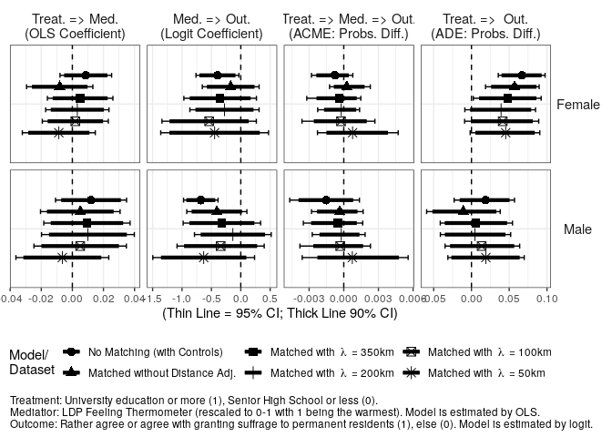
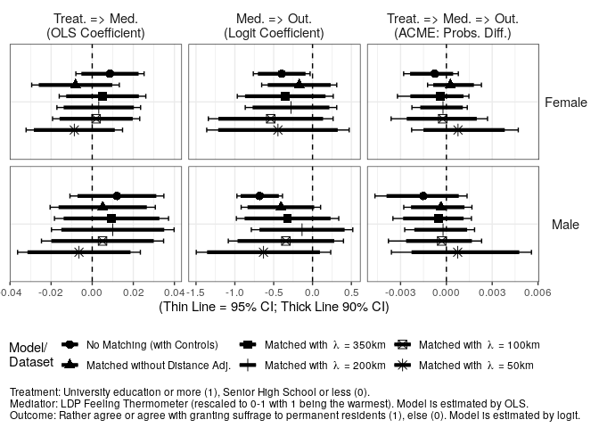

Analysis 5: Mediation Analysis with LDP Feeling Thermometer
================
Fan Lu & Gento Kato
Dec 31, 2019

# Preparation

``` r
## Clean Up Space
rm(list=ls())

## Set Working Directory (Automatically) ##
require(rstudioapi); require(rprojroot)
if (rstudioapi::isAvailable()==TRUE) {
  setwd(dirname(rstudioapi::getActiveDocumentContext()$path)); 
} 
projdir <- find_root(has_file("thisishome.txt"))
cat(paste("Working Directory Set to:\n",projdir))
```

    ## Working Directory Set to:
    ##  /home/gentok/Documents/Projects/ForeignerJapan

``` r
setwd(projdir)

## Load Image of Main Analysis
load(paste0(projdir,"/out/analysis_main_v4.RData"))

# Import Matched Data
sifcct_m1 <- readRDS("./data/sifcct_young_matched_1.rds")
sifcct_m2 <- readRDS("./data/sifcct_young_matched_2.rds")
sifcct_m3 <- readRDS("./data/sifcct_young_matched_3.rds")
sifcct_m4 <- readRDS("./data/sifcct_young_matched_4.rds")
sifcct_m5 <- readRDS("./data/sifcct_young_matched_5.rds")
head(sifcct$zip_pref)
```

    ## [1] "福井県" "東京都" "福井県" "埼玉県" "福岡県" "福井県"

``` r
# Replace zip_pref variable
sifcct_m1$zip_pref <- sifcct$zip_pref[match(sifcct_m1$zip,sifcct$zip)]
sifcct_m2$zip_pref <- sifcct$zip_pref[match(sifcct_m2$zip,sifcct$zip)]
sifcct_m3$zip_pref <- sifcct$zip_pref[match(sifcct_m3$zip,sifcct$zip)]
sifcct_m4$zip_pref <- sifcct$zip_pref[match(sifcct_m4$zip,sifcct$zip)]
sifcct_m5$zip_pref <- sifcct$zip_pref[match(sifcct_m5$zip,sifcct$zip)]


## packages
# devtools::install_github("gentok/estvis")
require(estvis)
require(multiwayvcov)
require(sandwich)
require(lmtest)
require(MASS)
require(ggplot2)
require(texreg)
require(mediation)
```

# Limit Data to Young People

``` r
table(sifcct$agecat)
```

    ## 
    ##        Young (<=30s) Middle Aged (40-50s)        Elder (>=60s) 
    ##                 8742                10432                 7122

``` r
sifcct <- sifcct[which(sifcct$agecat=="Young (<=30s)"),]

sifcct$wave <- as.factor(sifcct$wave)
sifcct_m1$wave <- as.factor(sifcct_m1$wave)
sifcct_m2$wave <- as.factor(sifcct_m2$wave)
sifcct_m3$wave <- as.factor(sifcct_m3$wave)
sifcct_m4$wave <- as.factor(sifcct_m4$wave)
sifcct_m5$wave <- as.factor(sifcct_m5$wave)

sifcct$foreignsuff_agree <- ifelse(sifcct$foreignsuff>=0.75,1,0)
sifcct_m1$foreignsuff_agree <- ifelse(sifcct_m1$foreignsuff>=0.75,1,0)
sifcct_m2$foreignsuff_agree <- ifelse(sifcct_m2$foreignsuff>=0.75,1,0)
sifcct_m3$foreignsuff_agree <- ifelse(sifcct_m3$foreignsuff>=0.75,1,0)
sifcct_m4$foreignsuff_agree <- ifelse(sifcct_m4$foreignsuff>=0.75,1,0)
sifcct_m5$foreignsuff_agree <- ifelse(sifcct_m5$foreignsuff>=0.75,1,0)

# Reverse Education Variable
sifcct$edu <- 1 - sifcct$edu
sifcct_m1$edu <- ifelse(sifcct_m1$edu=="<=SHS",1,0)
sifcct_m2$edu <- ifelse(sifcct_m2$edu=="<=SHS",1,0)
sifcct_m3$edu <- ifelse(sifcct_m3$edu=="<=SHS",1,0)
sifcct_m4$edu <- ifelse(sifcct_m4$edu=="<=SHS",1,0)
sifcct_m5$edu <- ifelse(sifcct_m5$edu=="<=SHS",1,0)

# Generate LDP FT Variable
summary(sifcct$ldpft)
```

    ##    Min. 1st Qu.  Median    Mean 3rd Qu.    Max.    NA's 
    ##   0.000   0.200   0.500   0.431   0.600   1.000      60

``` r
sifcct$ldpft <- ifelse(is.na(sifcct$ldpft),0.5,sifcct$ldpft)
sifcct_m1$ldpft <- sifcct$ldpft[match(sifcct_m1$id,sifcct$id)]
sifcct_m2$ldpft <- sifcct$ldpft[match(sifcct_m2$id,sifcct$id)]
sifcct_m3$ldpft <- sifcct$ldpft[match(sifcct_m3$id,sifcct$id)]
sifcct_m4$ldpft <- sifcct$ldpft[match(sifcct_m4$id,sifcct$id)]
sifcct_m5$ldpft <- sifcct$ldpft[match(sifcct_m5$id,sifcct$id)]
```

# Models

## SIFCCT (Original)

``` r
fdt <- sifcct[which(sifcct$female==1),]
mdt <- sifcct[which(sifcct$female==0),]

## Mediator Models
medf_LDP <- lm(ldpft  ~ edu + knowledge + polint + employed + evecon + income + lvpr + wave, 
               data=fdt)
coeftest(medf_LDP, vcov.=vcovCL(medf_LDP,factor(fdt$zip_pref)))
```

    ## 
    ## t test of coefficients:
    ## 
    ##               Estimate Std. Error t value  Pr(>|t|)    
    ## (Intercept)  0.3282079  0.0190419 17.2361 < 2.2e-16 ***
    ## edu         -0.0086447  0.0084676 -1.0209 0.3073570    
    ## knowledge    0.0048812  0.0140896  0.3464 0.7290303    
    ## polint       0.0337439  0.0119822  2.8162 0.0048842 ** 
    ## employed    -0.0214131  0.0063534 -3.3704 0.0007579 ***
    ## evecon       0.1135421  0.0138596  8.1923 3.423e-16 ***
    ## income      -0.0039132  0.0113647 -0.3443 0.7306159    
    ## lvpr         0.0127436  0.0079550  1.6020 0.1092443    
    ## wave3        0.0246082  0.0254181  0.9681 0.3330349    
    ## wave4        0.0021573  0.0219226  0.0984 0.9216146    
    ## wave5        0.0168230  0.0238292  0.7060 0.4802415    
    ## wave6        0.0252365  0.0296162  0.8521 0.3942008    
    ## wave7        0.0115128  0.0282578  0.4074 0.6837229    
    ## wave8        0.0103569  0.0221809  0.4669 0.6405775    
    ## wave9       -0.0215508  0.0255088 -0.8448 0.3982524    
    ## wave10       0.0159597  0.0203600  0.7839 0.4331619    
    ## wave11      -0.0071482  0.0303791 -0.2353 0.8139887    
    ## wave12       0.0187912  0.0266817  0.7043 0.4813025    
    ## wave13       0.0578284  0.0254927  2.2684 0.0233568 *  
    ## wave14       0.0419249  0.0230961  1.8152 0.0695631 .  
    ## wave15       0.0996781  0.0280341  3.5556 0.0003815 ***
    ## wave16       0.1237042  0.0254485  4.8610 1.213e-06 ***
    ## wave17       0.1155317  0.0235249  4.9110 9.425e-07 ***
    ## wave18       0.1216968  0.0259156  4.6959 2.744e-06 ***
    ## wave19       0.1649613  0.0239331  6.8926 6.347e-12 ***
    ## wave20       0.1126950  0.0241722  4.6622 3.232e-06 ***
    ## wave21       0.1283978  0.0250144  5.1330 2.989e-07 ***
    ## wave22       0.0997269  0.0326609  3.0534 0.0022776 ** 
    ## ---
    ## Signif. codes:  0 '***' 0.001 '**' 0.01 '*' 0.05 '.' 0.1 ' ' 1

``` r
medm_LDP <- lm(ldpft  ~ edu + knowledge + polint + employed + evecon + income + lvpr + wave, 
               data=mdt)
coeftest(medm_LDP, vcov.=vcovCL(medm_LDP,factor(mdt$zip_pref)))
```

    ## 
    ## t test of coefficients:
    ## 
    ##               Estimate Std. Error t value  Pr(>|t|)    
    ## (Intercept)  0.2907341  0.0218939 13.2792 < 2.2e-16 ***
    ## edu         -0.0120182  0.0116585 -1.0309  0.302662    
    ## knowledge    0.0173575  0.0154600  1.1227  0.261606    
    ## polint       0.1197505  0.0227173  5.2713 1.415e-07 ***
    ## employed    -0.0354374  0.0119447 -2.9668  0.003025 ** 
    ## evecon       0.1400790  0.0138597 10.1069 < 2.2e-16 ***
    ## income       0.0099661  0.0126439  0.7882  0.430611    
    ## lvpr         0.0037521  0.0117067  0.3205  0.748597    
    ## wave3       -0.0147943  0.0299549 -0.4939  0.621410    
    ## wave4       -0.0263921  0.0246738 -1.0696  0.284836    
    ## wave5       -0.0899497  0.0206349 -4.3591 1.334e-05 ***
    ## wave6       -0.0360741  0.0257255 -1.4023  0.160901    
    ## wave7       -0.0644619  0.0226005 -2.8522  0.004360 ** 
    ## wave8       -0.0198192  0.0202992 -0.9764  0.328940    
    ## wave9       -0.0576660  0.0215959 -2.6702  0.007606 ** 
    ## wave10      -0.0532692  0.0202010 -2.6370  0.008393 ** 
    ## wave11      -0.0575451  0.0263194 -2.1864  0.028834 *  
    ## wave12      -0.0162825  0.0211321 -0.7705  0.441035    
    ## wave13       0.0302145  0.0308768  0.9785  0.327854    
    ## wave14       0.0324130  0.0311351  1.0410  0.297908    
    ## wave15       0.0844108  0.0246892  3.4189  0.000634 ***
    ## wave16       0.1417529  0.0246681  5.7464 9.691e-09 ***
    ## wave17       0.1600628  0.0259915  6.1583 7.966e-10 ***
    ## wave18       0.1380855  0.0216244  6.3856 1.871e-10 ***
    ## wave19       0.1342718  0.0251507  5.3387 9.802e-08 ***
    ## wave20       0.1394081  0.0200308  6.9597 3.879e-12 ***
    ## wave21       0.1522606  0.0205501  7.4092 1.498e-13 ***
    ## wave22       0.1289585  0.0237386  5.4324 5.838e-08 ***
    ## ---
    ## Signif. codes:  0 '***' 0.001 '**' 0.01 '*' 0.05 '.' 0.1 ' ' 1

``` r
## Outcome Models 
outf_LDP <- glm(foreignsuff_agree  ~ edu + ldpft + edu:ldpft + 
                  knowledge + polint + employed + evecon + income + lvpr + wave, data=fdt, family=binomial("logit"))
coeftest(outf_LDP, vcov.=vcovCL(outf_LDP,factor(fdt$zip_pref)))
```

    ## 
    ## z test of coefficients:
    ## 
    ##               Estimate Std. Error z value Pr(>|z|)   
    ## (Intercept) -0.3567757  0.2424668 -1.4714 0.141172   
    ## edu         -0.3706254  0.1663181 -2.2284 0.025853 * 
    ## ldpft       -0.3968624  0.1865605 -2.1273 0.033399 * 
    ## knowledge   -0.1213326  0.1298829 -0.9342 0.350216   
    ## polint       0.3571483  0.1503215  2.3759 0.017506 * 
    ## employed     0.0043525  0.0744021  0.0585 0.953350   
    ## evecon       0.6106682  0.1980750  3.0830 0.002049 **
    ## income      -0.0361444  0.1385183 -0.2609 0.794142   
    ## lvpr        -0.1261569  0.1220136 -1.0340 0.301156   
    ## wave3       -0.3261486  0.1885512 -1.7298 0.083673 . 
    ## wave4       -0.3191983  0.2136545 -1.4940 0.135177   
    ## wave5       -0.3103869  0.1842711 -1.6844 0.092104 . 
    ## wave6       -0.0617623  0.1784030 -0.3462 0.729196   
    ## wave7       -0.1745326  0.1978758 -0.8820 0.377760   
    ## wave8       -0.3722505  0.2050434 -1.8155 0.069451 . 
    ## wave9       -0.5952504  0.2202621 -2.7025 0.006883 **
    ## wave10      -0.3257415  0.2369973 -1.3745 0.169301   
    ## wave11      -0.6738102  0.2299475 -2.9303 0.003387 **
    ## wave12      -0.3628126  0.1811823 -2.0025 0.045234 * 
    ## wave13      -0.5237162  0.2087759 -2.5085 0.012124 * 
    ## wave14      -0.4495907  0.2107778 -2.1330 0.032924 * 
    ## wave15      -0.4515296  0.1646929 -2.7416 0.006113 **
    ## wave16      -0.4022654  0.1826250 -2.2027 0.027617 * 
    ## wave17      -0.5870679  0.1909110 -3.0751 0.002104 **
    ## wave18      -0.3280080  0.1878523 -1.7461 0.080794 . 
    ## wave19      -0.5046483  0.2052074 -2.4592 0.013924 * 
    ## wave20      -0.3493383  0.1836746 -1.9019 0.057179 . 
    ## wave21      -0.5553813  0.2321290 -2.3926 0.016732 * 
    ## wave22      -0.1444912  0.1958641 -0.7377 0.460690   
    ## edu:ldpft    0.1457415  0.3691033  0.3949 0.692951   
    ## ---
    ## Signif. codes:  0 '***' 0.001 '**' 0.01 '*' 0.05 '.' 0.1 ' ' 1

``` r
outm_LDP <- glm(foreignsuff_agree  ~ edu + ldpft + edu:ldpft + 
                  knowledge + polint + employed + evecon + income + lvpr + wave, data=mdt, family=binomial("logit"))
coeftest(outm_LDP, vcov.=vcovCL(outm_LDP,factor(mdt$zip_pref)))
```

    ## 
    ## z test of coefficients:
    ## 
    ##              Estimate Std. Error z value  Pr(>|z|)    
    ## (Intercept) -1.114519   0.209666 -5.3157 1.063e-07 ***
    ## edu         -0.019984   0.136243 -0.1467   0.88339    
    ## ldpft       -0.680032   0.149707 -4.5424 5.561e-06 ***
    ## knowledge   -0.457590   0.114643 -3.9914 6.568e-05 ***
    ## polint       0.057146   0.166111  0.3440   0.73083    
    ## employed     0.185547   0.102607  1.8083   0.07056 .  
    ## evecon       0.267397   0.209683  1.2752   0.20222    
    ## income       0.388292   0.121857  3.1864   0.00144 ** 
    ## lvpr        -0.346122   0.079550 -4.3510 1.355e-05 ***
    ## wave3        0.060044   0.266839  0.2250   0.82196    
    ## wave4        0.070167   0.245603  0.2857   0.77511    
    ## wave5        0.231503   0.176129  1.3144   0.18871    
    ## wave6        0.196536   0.228229  0.8611   0.38917    
    ## wave7        0.311856   0.215573  1.4466   0.14800    
    ## wave8        0.333694   0.272125  1.2263   0.22010    
    ## wave9        0.247662   0.223038  1.1104   0.26683    
    ## wave10       0.369869   0.209745  1.7634   0.07783 .  
    ## wave11       0.254874   0.213432  1.1942   0.23241    
    ## wave12       0.318611   0.235750  1.3515   0.17654    
    ## wave13       0.035798   0.275747  0.1298   0.89671    
    ## wave14       0.158352   0.248641  0.6369   0.52421    
    ## wave15       0.097882   0.276672  0.3538   0.72350    
    ## wave16       0.453881   0.260867  1.7399   0.08188 .  
    ## wave17       0.371606   0.228279  1.6279   0.10355    
    ## wave18       0.267360   0.197258  1.3554   0.17530    
    ## wave19       0.234046   0.197786  1.1833   0.23668    
    ## wave20       0.420716   0.310869  1.3534   0.17594    
    ## wave21       0.169719   0.282918  0.5999   0.54858    
    ## wave22       0.296133   0.305372  0.9697   0.33217    
    ## edu:ldpft   -0.201340   0.330899 -0.6085   0.54288    
    ## ---
    ## Signif. codes:  0 '***' 0.001 '**' 0.01 '*' 0.05 '.' 0.1 ' ' 1

``` r
## Causal Mediation Analysis
set.seed(2345)
medoutf_LDP <- mediate(medf_LDP, outf_LDP, treat = "edu", 
                       mediator = "ldpft", 
                       cluster=factor(fdt$zip_pref))
summary(medoutf_LDP)
```

    ## 
    ## Causal Mediation Analysis 
    ## 
    ## Quasi-Bayesian Confidence Intervals
    ## 
    ##                           Estimate 95% CI Lower 95% CI Upper p-value    
    ## ACME (control)            0.000769    -0.000782         0.00    0.31    
    ## ACME (treated)            0.000417    -0.000860         0.00    0.53    
    ## ADE (control)            -0.066904    -0.097492        -0.04  <2e-16 ***
    ## ADE (treated)            -0.067256    -0.098030        -0.04  <2e-16 ***
    ## Total Effect             -0.066487    -0.097042        -0.03  <2e-16 ***
    ## Prop. Mediated (control) -0.009364    -0.054555         0.01    0.31    
    ## Prop. Mediated (treated) -0.003903    -0.039808         0.01    0.53    
    ## ACME (average)            0.000593    -0.000571         0.00    0.31    
    ## ADE (average)            -0.067080    -0.097627        -0.04  <2e-16 ***
    ## Prop. Mediated (average) -0.006633    -0.038464         0.01    0.31    
    ## ---
    ## Signif. codes:  0 '***' 0.001 '**' 0.01 '*' 0.05 '.' 0.1 ' ' 1
    ## 
    ## Sample Size Used: 3989 
    ## 
    ## 
    ## Simulations: 1000

``` r
set.seed(2345)
medoutm_LDP <- mediate(medm_LDP, outm_LDP, treat = "edu", 
                       mediator = "ldpft", 
                       cluster=factor(mdt$zip_pref))
summary(medoutm_LDP)
```

    ## 
    ## Causal Mediation Analysis 
    ## 
    ## Quasi-Bayesian Confidence Intervals
    ## 
    ##                          Estimate 95% CI Lower 95% CI Upper p-value
    ## ACME (control)            0.00151     -0.00135         0.00    0.28
    ## ACME (treated)            0.00182     -0.00180         0.01    0.28
    ## ADE (control)            -0.01855     -0.05700         0.02    0.37
    ## ADE (treated)            -0.01825     -0.05579         0.02    0.38
    ## Total Effect             -0.01674     -0.05476         0.02    0.41
    ## Prop. Mediated (control) -0.04125     -1.15762         0.63    0.59
    ## Prop. Mediated (treated) -0.05419     -1.36055         0.65    0.59
    ## ACME (average)            0.00166     -0.00164         0.00    0.28
    ## ADE (average)            -0.01840     -0.05625         0.02    0.37
    ## Prop. Mediated (average) -0.04772     -1.29223         0.68    0.59
    ## 
    ## Sample Size Used: 4737 
    ## 
    ## 
    ## Simulations: 1000

## Matched without Distance Adjustment

``` r
fdt_m1 <- sifcct_m1[which(sifcct_m1$female==1),]
mdt_m1 <- sifcct_m1[which(sifcct_m1$female==0),]

## Mediator Models
medf_LDP_m1 <- lm(ldpft  ~ edu + #,
                    knowledge + polint + employed + evecon + income + lvpr + wave, 
                  data=fdt_m1)
coeftest(medf_LDP_m1, vcov.=vcovCL(medf_LDP_m1, factor(fdt_m1$zip_pref)))
```

    ## 
    ## t test of coefficients:
    ## 
    ##                Estimate  Std. Error t value  Pr(>|t|)    
    ## (Intercept)  0.33234585  0.02597841 12.7932 < 2.2e-16 ***
    ## edu          0.00812834  0.01086972  0.7478 0.4546831    
    ## knowledge    0.03320380  0.02343754  1.4167 0.1567500    
    ## polint       0.02557092  0.02419641  1.0568 0.2907454    
    ## employed    -0.02368150  0.01027635 -2.3045 0.0213126 *  
    ## evecon       0.13715832  0.02309293  5.9394 3.441e-09 ***
    ## income      -0.00324472  0.02320015 -0.1399 0.8887884    
    ## lvpr         0.00875645  0.01526150  0.5738 0.5662033    
    ## wave3       -0.01131754  0.02975422 -0.3804 0.7037186    
    ## wave4       -0.00972132  0.03029101 -0.3209 0.7483010    
    ## wave5        0.00280714  0.03675326  0.0764 0.9391271    
    ## wave6       -0.00039127  0.02902602 -0.0135 0.9892463    
    ## wave7       -0.00962482  0.03391980 -0.2838 0.7766338    
    ## wave8        0.02238349  0.03643394  0.6144 0.5390583    
    ## wave9       -0.06156117  0.02579520 -2.3865 0.0171133 *  
    ## wave10      -0.02554171  0.02795725 -0.9136 0.3610531    
    ## wave11      -0.03008661  0.03737000 -0.8051 0.4208705    
    ## wave12      -0.01392379  0.02214939 -0.6286 0.5296726    
    ## wave13       0.01660344  0.03433224  0.4836 0.6287224    
    ## wave14       0.01975171  0.03665361  0.5389 0.5900415    
    ## wave15       0.06526073  0.03348536  1.9489 0.0514624 .  
    ## wave16       0.09077222  0.02728889  3.3263 0.0008981 ***
    ## wave17       0.09877373  0.03107924  3.1781 0.0015081 ** 
    ## wave18       0.07515573  0.02969327  2.5311 0.0114582 *  
    ## wave19       0.14914645  0.03337175  4.4692 8.351e-06 ***
    ## wave20       0.06241660  0.03511788  1.7773 0.0756845 .  
    ## wave21       0.08241777  0.02982938  2.7630 0.0057875 ** 
    ## wave22       0.04987905  0.03928080  1.2698 0.2043214    
    ## ---
    ## Signif. codes:  0 '***' 0.001 '**' 0.01 '*' 0.05 '.' 0.1 ' ' 1

``` r
medm_LDP_m1 <- lm(ldpft  ~ edu + #,
                    knowledge + polint + employed + evecon + income + lvpr + wave, 
                  data=mdt_m1)
coeftest(medm_LDP_m1, vcov.=vcovCL(medm_LDP_m1,factor(mdt_m1$zip_pref)))
```

    ## 
    ## t test of coefficients:
    ## 
    ##                Estimate  Std. Error t value  Pr(>|t|)    
    ## (Intercept)  0.28064531  0.02938156  9.5517 < 2.2e-16 ***
    ## edu         -0.00510746  0.01305001 -0.3914 0.6955697    
    ## knowledge    0.03688068  0.02446311  1.5076 0.1318478    
    ## polint       0.11015548  0.02654751  4.1494 3.504e-05 ***
    ## employed     0.00031813  0.01891523  0.0168 0.9865834    
    ## evecon       0.15735174  0.02705868  5.8152 7.260e-09 ***
    ## income       0.02417372  0.02890127  0.8364 0.4030377    
    ## lvpr         0.00084106  0.01888898  0.0445 0.9644899    
    ## wave3       -0.05675488  0.04329415 -1.3109 0.1900699    
    ## wave4       -0.06204569  0.03438676 -1.8043 0.0713594 .  
    ## wave5       -0.13510449  0.03158899 -4.2769 2.004e-05 ***
    ## wave6       -0.09706608  0.03260972 -2.9766 0.0029572 ** 
    ## wave7       -0.10771910  0.03258432 -3.3059 0.0009672 ***
    ## wave8       -0.06065461  0.04229435 -1.4341 0.1517318    
    ## wave9       -0.11615075  0.03096482 -3.7511 0.0001822 ***
    ## wave10      -0.09320626  0.03512845 -2.6533 0.0080476 ** 
    ## wave11      -0.08545721  0.02790703 -3.0622 0.0022327 ** 
    ## wave12      -0.03016338  0.03834178 -0.7867 0.4315723    
    ## wave13      -0.00077113  0.04341186 -0.0178 0.9858300    
    ## wave14      -0.02971266  0.04738768 -0.6270 0.5307381    
    ## wave15       0.04720309  0.03821209  1.2353 0.2168982    
    ## wave16       0.08610668  0.03826203  2.2504 0.0245521 *  
    ## wave17       0.10386533  0.04171097  2.4901 0.0128680 *  
    ## wave18       0.10872841  0.03634541  2.9915 0.0028171 ** 
    ## wave19       0.12570818  0.03771247  3.3333 0.0008772 ***
    ## wave20       0.10638387  0.03402350  3.1268 0.0017983 ** 
    ## wave21       0.10271547  0.03425892  2.9982 0.0027564 ** 
    ## wave22       0.03193517  0.03718897  0.8587 0.3906162    
    ## ---
    ## Signif. codes:  0 '***' 0.001 '**' 0.01 '*' 0.05 '.' 0.1 ' ' 1

``` r
## Outcome Models
outf_LDP_m1 <- glm(foreignsuff_agree  ~ edu + ldpft + edu:ldpft + #,
                     knowledge + polint + employed + evecon + income + lvpr + wave, 
                   data=fdt_m1, family=binomial("logit"))
coeftest(outf_LDP_m1, vcov.=vcovCL(outf_LDP_m1,factor(fdt_m1$zip_pref)))
```

    ## 
    ## z test of coefficients:
    ## 
    ##              Estimate Std. Error z value Pr(>|z|)   
    ## (Intercept) -0.680407   0.283359 -2.4012 0.016341 * 
    ## edu         -0.228959   0.174153 -1.3147 0.188613   
    ## ldpft       -0.171506   0.246585 -0.6955 0.486727   
    ## knowledge    0.111620   0.278661  0.4006 0.688744   
    ## polint       0.578470   0.191200  3.0255 0.002483 **
    ## employed     0.092781   0.123660  0.7503 0.453081   
    ## evecon       0.372267   0.214388  1.7364 0.082491 . 
    ## income      -0.129678   0.249696 -0.5193 0.603521   
    ## lvpr        -0.235279   0.174698 -1.3468 0.178052   
    ## wave3       -0.506296   0.425812 -1.1890 0.234435   
    ## wave4       -0.050602   0.308034 -0.1643 0.869514   
    ## wave5       -0.281231   0.319407 -0.8805 0.378599   
    ## wave6        0.207324   0.305044  0.6797 0.496726   
    ## wave7       -0.285563   0.254750 -1.1210 0.262308   
    ## wave8       -0.380368   0.403304 -0.9431 0.345615   
    ## wave9       -0.509896   0.345773 -1.4747 0.140304   
    ## wave10       0.009388   0.365729  0.0257 0.979521   
    ## wave11      -0.654247   0.279696 -2.3391 0.019328 * 
    ## wave12      -0.276229   0.312442 -0.8841 0.376644   
    ## wave13      -0.389202   0.360851 -1.0786 0.280781   
    ## wave14      -0.323062   0.448833 -0.7198 0.471660   
    ## wave15      -0.307273   0.329813 -0.9317 0.351512   
    ## wave16      -0.287106   0.282539 -1.0162 0.309551   
    ## wave17      -0.338404   0.364599 -0.9282 0.353328   
    ## wave18      -0.412785   0.300793 -1.3723 0.169963   
    ## wave19      -0.236792   0.286315 -0.8270 0.408219   
    ## wave20      -0.060430   0.294583 -0.2051 0.837465   
    ## wave21      -0.468717   0.292316 -1.6035 0.108833   
    ## wave22       0.184281   0.316939  0.5814 0.560945   
    ## edu:ldpft   -0.100438   0.340966 -0.2946 0.768323   
    ## ---
    ## Signif. codes:  0 '***' 0.001 '**' 0.01 '*' 0.05 '.' 0.1 ' ' 1

``` r
outm_LDP_m1 <- glm(foreignsuff_agree  ~ edu + ldpft + edu:ldpft + #,
                     knowledge + polint + employed + evecon + income + lvpr + wave, 
                   data=mdt_m1, family=binomial("logit"))
coeftest(outm_LDP_m1, vcov.=vcovCL(outm_LDP_m1,factor(mdt_m1$zip_pref)))
```

    ## 
    ## z test of coefficients:
    ## 
    ##                Estimate  Std. Error z value  Pr(>|z|)    
    ## (Intercept) -1.32776897  0.30588441 -4.3408  1.42e-05 ***
    ## edu          0.25397644  0.17780414  1.4284 0.1531751    
    ## ldpft       -0.40769975  0.26096165 -1.5623 0.1182179    
    ## knowledge   -0.63828999  0.17442238 -3.6594 0.0002528 ***
    ## polint       0.42364130  0.22896042  1.8503 0.0642730 .  
    ## employed     0.34427209  0.18472545  1.8637 0.0623644 .  
    ## evecon       0.37152814  0.32888369  1.1297 0.2586177    
    ## income       0.24110375  0.22863904  1.0545 0.2916463    
    ## lvpr        -0.38939127  0.13077449 -2.9776 0.0029054 ** 
    ## wave3       -0.12556571  0.38760168 -0.3240 0.7459717    
    ## wave4        0.06308666  0.47561680  0.1326 0.8944767    
    ## wave5       -0.35332440  0.37654842 -0.9383 0.3480779    
    ## wave6        0.23203070  0.41149860  0.5639 0.5728443    
    ## wave7        0.08381882  0.34208001  0.2450 0.8064356    
    ## wave8       -0.12911551  0.42037883 -0.3071 0.7587362    
    ## wave9       -0.51819921  0.43947846 -1.1791 0.2383491    
    ## wave10       0.19118193  0.38363424  0.4983 0.6182414    
    ## wave11       0.24717100  0.37789795  0.6541 0.5130679    
    ## wave12       0.06454960  0.37022805  0.1744 0.8615897    
    ## wave13      -0.14375804  0.51042252 -0.2816 0.7782156    
    ## wave14      -0.06423786  0.42731539 -0.1503 0.8805051    
    ## wave15      -0.41970502  0.43237627 -0.9707 0.3317007    
    ## wave16       0.13431961  0.44053288  0.3049 0.7604403    
    ## wave17       0.00077447  0.49742884  0.0016 0.9987577    
    ## wave18       0.21309257  0.39083348  0.5452 0.5855981    
    ## wave19       0.01079466  0.40742352  0.0265 0.9788626    
    ## wave20      -0.09275585  0.42633090 -0.2176 0.8277659    
    ## wave21      -0.31519898  0.45903810 -0.6867 0.4923027    
    ## wave22      -0.57548751  0.54692851 -1.0522 0.2927000    
    ## edu:ldpft   -0.47471631  0.40974562 -1.1586 0.2466342    
    ## ---
    ## Signif. codes:  0 '***' 0.001 '**' 0.01 '*' 0.05 '.' 0.1 ' ' 1

``` r
## Causal Mediation Analysis
set.seed(2345)
medoutf_LDP_m1 <- mediate(medf_LDP_m1, outf_LDP_m1, treat = "edu", 
                          mediator = "ldpft", 
                          cluster=factor(fdt_m1$zip_pref))
summary(medoutf_LDP_m1)
```

    ## 
    ## Causal Mediation Analysis 
    ## 
    ## Quasi-Bayesian Confidence Intervals
    ## 
    ##                           Estimate 95% CI Lower 95% CI Upper p-value   
    ## ACME (control)           -0.000268    -0.002296         0.00   0.750   
    ## ACME (treated)           -0.000435    -0.002487         0.00   0.598   
    ## ADE (control)            -0.057091    -0.089652        -0.02   0.002 **
    ## ADE (treated)            -0.057258    -0.090127        -0.02   0.002 **
    ## Total Effect             -0.057526    -0.090116        -0.02   0.002 **
    ## Prop. Mediated (control)  0.001694    -0.022914         0.05   0.748   
    ## Prop. Mediated (treated)  0.004161    -0.016239         0.06   0.596   
    ## ACME (average)           -0.000351    -0.001968         0.00   0.584   
    ## ADE (average)            -0.057174    -0.089649        -0.02   0.002 **
    ## Prop. Mediated (average)  0.002927    -0.016417         0.04   0.582   
    ## ---
    ## Signif. codes:  0 '***' 0.001 '**' 0.01 '*' 0.05 '.' 0.1 ' ' 1
    ## 
    ## Sample Size Used: 1784 
    ## 
    ## 
    ## Simulations: 1000

``` r
set.seed(2345)
medoutm_LDP_m1 <- mediate(medm_LDP_m1, outm_LDP_m1, treat = "edu", 
                          mediator = "ldpft", 
                          cluster=factor(mdt_m1$zip_pref))
summary(medoutm_LDP_m1)
```

    ## 
    ## Causal Mediation Analysis 
    ## 
    ## Quasi-Bayesian Confidence Intervals
    ## 
    ##                           Estimate 95% CI Lower 95% CI Upper p-value
    ## ACME (control)            0.000350    -0.001674         0.00    0.70
    ## ACME (treated)            0.000761    -0.003220         0.01    0.67
    ## ADE (control)             0.010769    -0.038127         0.06    0.67
    ## ADE (treated)             0.011180    -0.037318         0.06    0.67
    ## Total Effect              0.011530    -0.037043         0.06    0.65
    ## Prop. Mediated (control)  0.003132    -0.485241         0.44    0.90
    ## Prop. Mediated (treated)  0.010383    -1.168985         0.89    0.88
    ## ACME (average)            0.000555    -0.002435         0.00    0.67
    ## ADE (average)             0.010974    -0.037606         0.06    0.66
    ## Prop. Mediated (average)  0.006758    -0.743970         0.68    0.88
    ## 
    ## Sample Size Used: 1674 
    ## 
    ## 
    ## Simulations: 1000

## Matched with Distance Adjustment (Lambda=50km)

``` r
fdt_m2 <- sifcct_m2[which(sifcct_m2$female==1),]
mdt_m2 <- sifcct_m2[which(sifcct_m2$female==0),]

## Mediator Models
medf_LDP_m2 <- lm(ldpft  ~ edu + #,
                    knowledge + polint + employed + evecon + income + lvpr + wave, 
                  data=fdt_m2)
coeftest(medf_LDP_m2, vcov.=vcovCL(medf_LDP_m2, factor(fdt_m2$zip_pref)))
```

    ## 
    ## t test of coefficients:
    ## 
    ##               Estimate Std. Error t value  Pr(>|t|)    
    ## (Intercept)  0.3313967  0.0577137  5.7421 1.200e-08 ***
    ## edu          0.0087090  0.0119638  0.7279  0.466796    
    ## knowledge    0.0544984  0.0301291  1.8088  0.070742 .  
    ## polint      -0.0079993  0.0286715 -0.2790  0.780297    
    ## employed    -0.0185142  0.0133762 -1.3841  0.166595    
    ## evecon       0.1406242  0.0331192  4.2460 2.354e-05 ***
    ## income       0.0252730  0.0319481  0.7911  0.429071    
    ## lvpr        -0.0245866  0.0204176 -1.2042  0.228768    
    ## wave3        0.0244450  0.0473241  0.5165  0.605574    
    ## wave4        0.0262803  0.0468234  0.5613  0.574728    
    ## wave5        0.0351221  0.0485337  0.7237  0.469422    
    ## wave6        0.0173525  0.0374451  0.4634  0.643158    
    ## wave7       -0.0110288  0.0508793 -0.2168  0.828432    
    ## wave8        0.0247533  0.0545550  0.4537  0.650109    
    ## wave9       -0.0607472  0.0441003 -1.3775  0.168637    
    ## wave10       0.0129066  0.0474941  0.2718  0.785863    
    ## wave11      -0.0149471  0.0559479 -0.2672  0.789394    
    ## wave12      -0.0248080  0.0388105 -0.6392  0.522817    
    ## wave13       0.0292414  0.0672072  0.4351  0.663578    
    ## wave14       0.0504456  0.0516875  0.9760  0.329286    
    ## wave15       0.0630246  0.0473356  1.3314  0.183311    
    ## wave16       0.0838095  0.0405695  2.0658  0.039072 *  
    ## wave17       0.0665069  0.0419769  1.5844  0.113389    
    ## wave18       0.0583742  0.0450669  1.2953  0.195488    
    ## wave19       0.1369311  0.0415816  3.2931  0.001022 ** 
    ## wave20       0.0707700  0.0430056  1.6456  0.100123    
    ## wave21       0.1069966  0.0349414  3.0622  0.002249 ** 
    ## wave22       0.0716831  0.0610883  1.1734  0.240868    
    ## ---
    ## Signif. codes:  0 '***' 0.001 '**' 0.01 '*' 0.05 '.' 0.1 ' ' 1

``` r
medm_LDP_m2 <- lm(ldpft  ~ edu + #,
                    knowledge + polint + employed + evecon + income + lvpr + wave, 
                  data=mdt_m2)
coeftest(medm_LDP_m2, vcov.=vcovCL(medm_LDP_m2,factor(mdt_m2$zip_pref)))
```

    ## 
    ## t test of coefficients:
    ## 
    ##               Estimate Std. Error t value  Pr(>|t|)    
    ## (Intercept)  0.2192615  0.0529070  4.1443 3.643e-05 ***
    ## edu          0.0064389  0.0152268  0.4229  0.672470    
    ## knowledge    0.0258781  0.0228523  1.1324  0.257685    
    ## polint       0.1406333  0.0302392  4.6507 3.667e-06 ***
    ## employed     0.0303523  0.0367748  0.8254  0.409330    
    ## evecon       0.1706572  0.0358408  4.7615 2.150e-06 ***
    ## income       0.0061025  0.0268948  0.2269  0.820537    
    ## lvpr         0.0063727  0.0255199  0.2497  0.802850    
    ## wave3       -0.0933863  0.0554149 -1.6852  0.092201 .  
    ## wave4       -0.0812224  0.0373172 -2.1765  0.029705 *  
    ## wave5       -0.1444849  0.0520053 -2.7783  0.005548 ** 
    ## wave6       -0.0436684  0.0456776 -0.9560  0.339254    
    ## wave7       -0.1020346  0.0569308 -1.7923  0.073339 .  
    ## wave8       -0.0679098  0.0553207 -1.2276  0.219846    
    ## wave9       -0.0947117  0.0330401 -2.8666  0.004221 ** 
    ## wave10      -0.0889121  0.0452002 -1.9671  0.049401 *  
    ## wave11      -0.0768963  0.0359870 -2.1368  0.032814 *  
    ## wave12      -0.0270857  0.0401040 -0.6754  0.499558    
    ## wave13       0.0128839  0.0474494  0.2715  0.786030    
    ## wave14      -0.0035894  0.0429209 -0.0836  0.933365    
    ## wave15       0.0772268  0.0385064  2.0056  0.045123 *  
    ## wave16       0.0958403  0.0500575  1.9146  0.055776 .  
    ## wave17       0.1121097  0.0530560  2.1130  0.034799 *  
    ## wave18       0.1333687  0.0384818  3.4658  0.000547 ***
    ## wave19       0.1188782  0.0412274  2.8835  0.004002 ** 
    ## wave20       0.1102659  0.0435956  2.5293  0.011554 *  
    ## wave21       0.1042420  0.0366049  2.8478  0.004476 ** 
    ## wave22       0.1047148  0.0508530  2.0592  0.039689 *  
    ## ---
    ## Signif. codes:  0 '***' 0.001 '**' 0.01 '*' 0.05 '.' 0.1 ' ' 1

``` r
## Outcome Models
outf_LDP_m2 <- glm(foreignsuff_agree  ~ edu + ldpft + edu:ldpft + #,
                     knowledge + polint + employed + evecon + income + lvpr + wave, 
                   data=fdt_m2, family=binomial("logit"))
coeftest(outf_LDP_m2, vcov.=vcovCL(outf_LDP_m2,factor(fdt_m2$zip_pref)))
```

    ## 
    ## z test of coefficients:
    ## 
    ##              Estimate Std. Error z value  Pr(>|z|)    
    ## (Intercept) -1.049392   0.406299 -2.5828  0.009800 ** 
    ## edu         -0.156440   0.288920 -0.5415  0.588186    
    ## ldpft       -0.445221   0.467830 -0.9517  0.341262    
    ## knowledge   -0.356636   0.363024 -0.9824  0.325901    
    ## polint       0.935068   0.219255  4.2648 2.001e-05 ***
    ## employed    -0.020665   0.119769 -0.1725  0.863014    
    ## evecon       0.164002   0.199914  0.8204  0.412010    
    ## income      -0.301945   0.417641 -0.7230  0.469695    
    ## lvpr        -0.282126   0.211500 -1.3339  0.182226    
    ## wave3        0.139016   0.583100  0.2384  0.811565    
    ## wave4        0.494568   0.425547  1.1622  0.245156    
    ## wave5       -0.657254   0.319765 -2.0554  0.039837 *  
    ## wave6        0.388663   0.402488  0.9657  0.334218    
    ## wave7        0.689607   0.386999  1.7819  0.074760 .  
    ## wave8        0.576455   0.350842  1.6431  0.100371    
    ## wave9        0.124236   0.460011  0.2701  0.787105    
    ## wave10       0.171092   0.549972  0.3111  0.755730    
    ## wave11       0.126775   0.378080  0.3353  0.737389    
    ## wave12       0.454955   0.461680  0.9854  0.324410    
    ## wave13      -0.270176   0.383570 -0.7044  0.481201    
    ## wave14       0.465783   0.498070  0.9352  0.349699    
    ## wave15       0.468071   0.396533  1.1804  0.237838    
    ## wave16       0.425145   0.352455  1.2062  0.227726    
    ## wave17      -0.339787   0.484195 -0.7018  0.482831    
    ## wave18       0.578243   0.224113  2.5801  0.009876 ** 
    ## wave19       0.445874   0.493784  0.9030  0.366540    
    ## wave20       0.632650   0.320297  1.9752  0.048246 *  
    ## wave21       0.587159   0.365514  1.6064  0.108188    
    ## wave22       0.581876   0.386136  1.5069  0.131831    
    ## edu:ldpft   -0.151103   0.624937 -0.2418  0.808943    
    ## ---
    ## Signif. codes:  0 '***' 0.001 '**' 0.01 '*' 0.05 '.' 0.1 ' ' 1

``` r
outm_LDP_m2 <- glm(foreignsuff_agree  ~ edu+ ldpft + edu:ldpft + #,
                     knowledge + polint + employed + evecon + income + lvpr + wave, 
                   data=mdt_m2, family=binomial("logit"))
coeftest(outm_LDP_m2, vcov.=vcovCL(outm_LDP_m2,factor(mdt_m2$zip_pref)))
```

    ## 
    ## z test of coefficients:
    ## 
    ##               Estimate Std. Error z value  Pr(>|z|)    
    ## (Intercept) -1.8097213  0.3100778 -5.8363 5.336e-09 ***
    ## edu          0.0515293  0.2363143  0.2181  0.827387    
    ## ldpft       -0.6313804  0.4415558 -1.4299  0.152746    
    ## knowledge   -0.1151147  0.2267636 -0.5076  0.611704    
    ## polint       0.3885828  0.2648712  1.4671  0.142359    
    ## employed     0.3889046  0.2506749  1.5514  0.120799    
    ## evecon       0.5795691  0.4029923  1.4382  0.150388    
    ## income       0.6917623  0.2475460  2.7945  0.005198 ** 
    ## lvpr        -0.4655825  0.1670937 -2.7864  0.005330 ** 
    ## wave3        0.1148742  0.4173555  0.2752  0.783129    
    ## wave4        0.0235076  0.4509227  0.0521  0.958423    
    ## wave5        0.0030491  0.5088416  0.0060  0.995219    
    ## wave6       -0.0303992  0.5692818 -0.0534  0.957414    
    ## wave7        0.3567161  0.4311417  0.8274  0.408024    
    ## wave8        0.0995433  0.4393088  0.2266  0.820742    
    ## wave9       -0.0701252  0.4662104 -0.1504  0.880437    
    ## wave10       0.1690150  0.4362529  0.3874  0.698442    
    ## wave11       0.2925374  0.4527775  0.6461  0.518218    
    ## wave12       0.2366169  0.3815613  0.6201  0.535173    
    ## wave13       0.1280999  0.6040899  0.2121  0.832065    
    ## wave14      -0.1534063  0.4073464 -0.3766  0.706472    
    ## wave15      -0.1413159  0.4644875 -0.3042  0.760945    
    ## wave16       0.1248684  0.4664639  0.2677  0.788937    
    ## wave17       0.5376468  0.4699035  1.1442  0.252555    
    ## wave18       0.4706930  0.3433537  1.3709  0.170416    
    ## wave19       0.4056198  0.4593954  0.8829  0.377267    
    ## wave20       0.2894240  0.5171547  0.5596  0.575720    
    ## wave21      -0.1169410  0.5346457 -0.2187  0.826863    
    ## wave22       0.4059526  0.4610181  0.8806  0.378558    
    ## edu:ldpft   -0.3948176  0.4606973 -0.8570  0.391445    
    ## ---
    ## Signif. codes:  0 '***' 0.001 '**' 0.01 '*' 0.05 '.' 0.1 ' ' 1

``` r
## Causal Mediation Analysis
set.seed(2345)
medoutf_LDP_m2 <- mediate(medf_LDP_m2, outf_LDP_m2, treat = "edu", 
                          mediator = "ldpft", 
                          cluster=factor(fdt_m2$zip_pref))
summary(medoutf_LDP_m2)
```

    ## 
    ## Causal Mediation Analysis 
    ## 
    ## Quasi-Bayesian Confidence Intervals
    ## 
    ##                           Estimate 95% CI Lower 95% CI Upper p-value  
    ## ACME (control)           -0.000762    -0.004708         0.00   0.642  
    ## ACME (treated)           -0.001036    -0.004609         0.00   0.488  
    ## ADE (control)            -0.045353    -0.090530         0.00   0.056 .
    ## ADE (treated)            -0.045626    -0.089719         0.00   0.058 .
    ## Total Effect             -0.046389    -0.091205         0.00   0.052 .
    ## Prop. Mediated (control)  0.007593    -0.107082         0.20   0.670  
    ## Prop. Mediated (treated)  0.014975    -0.131997         0.27   0.516  
    ## ACME (average)           -0.000899    -0.004002         0.00   0.488  
    ## ADE (average)            -0.045490    -0.090119         0.00   0.058 .
    ## Prop. Mediated (average)  0.011284    -0.112720         0.21   0.516  
    ## ---
    ## Signif. codes:  0 '***' 0.001 '**' 0.01 '*' 0.05 '.' 0.1 ' ' 1
    ## 
    ## Sample Size Used: 1162 
    ## 
    ## 
    ## Simulations: 1000

``` r
set.seed(2345)
medoutm_LDP_m2 <- mediate(medm_LDP_m2, outm_LDP_m2, treat = "edu", 
                          mediator = "ldpft", 
                          cluster=factor(mdt_m2$zip_pref))
summary(medoutm_LDP_m2)
```

    ## 
    ## Causal Mediation Analysis 
    ## 
    ## Quasi-Bayesian Confidence Intervals
    ## 
    ##                           Estimate 95% CI Lower 95% CI Upper p-value
    ## ACME (control)           -0.000740    -0.005571         0.00    0.70
    ## ACME (treated)           -0.001223    -0.007284         0.00    0.66
    ## ADE (control)            -0.019027    -0.069879         0.03    0.50
    ## ADE (treated)            -0.019509    -0.069879         0.03    0.48
    ## Total Effect             -0.020250    -0.069923         0.03    0.47
    ## Prop. Mediated (control)  0.007155    -0.757565         0.55    0.82
    ## Prop. Mediated (treated)  0.023630    -1.078919         0.92    0.80
    ## ACME (average)           -0.000982    -0.006137         0.00    0.66
    ## ADE (average)            -0.019268    -0.069883         0.03    0.49
    ## Prop. Mediated (average)  0.015393    -1.002305         0.78    0.80
    ## 
    ## Sample Size Used: 1252 
    ## 
    ## 
    ## Simulations: 1000

## Matched with Distance Adjustment (Lambda=100km)

``` r
fdt_m3 <- sifcct_m3[which(sifcct_m3$female==1),]
mdt_m3 <- sifcct_m3[which(sifcct_m3$female==0),]

## Mediator Models
medf_LDP_m3 <- lm(ldpft  ~ edu + #,
                    knowledge + polint + employed + evecon + income + lvpr + wave, 
                  data=fdt_m3)
coeftest(medf_LDP_m3, vcov.=vcovCL(medf_LDP_m3, factor(fdt_m3$zip_pref)))
```

    ## 
    ## t test of coefficients:
    ## 
    ##               Estimate Std. Error t value  Pr(>|t|)    
    ## (Intercept)  0.3338246  0.0421624  7.9176 4.887e-15 ***
    ## edu         -0.0019136  0.0108151 -0.1769 0.8595806    
    ## knowledge    0.0626772  0.0264268  2.3717 0.0178397 *  
    ## polint       0.0099464  0.0288907  0.3443 0.7306892    
    ## employed    -0.0231117  0.0100989 -2.2885 0.0222539 *  
    ## evecon       0.1323517  0.0277378  4.7715 2.019e-06 ***
    ## income      -0.0154294  0.0254711 -0.6058 0.5447717    
    ## lvpr         0.0071256  0.0207377  0.3436 0.7311953    
    ## wave3        0.0455954  0.0372184  1.2251 0.2207520    
    ## wave4        0.0290025  0.0348600  0.8320 0.4055670    
    ## wave5        0.0159845  0.0420318  0.3803 0.7037836    
    ## wave6        0.0117514  0.0336299  0.3494 0.7268177    
    ## wave7        0.0042379  0.0395833  0.1071 0.9147549    
    ## wave8        0.0446705  0.0451080  0.9903 0.3221970    
    ## wave9       -0.0603727  0.0323400 -1.8668 0.0621367 .  
    ## wave10       0.0097762  0.0402813  0.2427 0.8082757    
    ## wave11      -0.0069099  0.0477898 -0.1446 0.8850552    
    ## wave12      -0.0187039  0.0323264 -0.5786 0.5629546    
    ## wave13       0.0222307  0.0497194  0.4471 0.6548543    
    ## wave14       0.0404587  0.0417814  0.9683 0.3330411    
    ## wave15       0.0714072  0.0440565  1.6208 0.1052829    
    ## wave16       0.1079056  0.0345161  3.1262 0.0018069 ** 
    ## wave17       0.0822455  0.0315431  2.6074 0.0092200 ** 
    ## wave18       0.0800763  0.0400711  1.9984 0.0458710 *  
    ## wave19       0.1480219  0.0373229  3.9660 7.678e-05 ***
    ## wave20       0.0882551  0.0374989  2.3535 0.0187332 *  
    ## wave21       0.0914169  0.0241089  3.7918 0.0001559 ***
    ## wave22       0.0697566  0.0577137  1.2087 0.2269949    
    ## ---
    ## Signif. codes:  0 '***' 0.001 '**' 0.01 '*' 0.05 '.' 0.1 ' ' 1

``` r
medm_LDP_m3 <- lm(ldpft  ~ edu + #,
                    knowledge + polint + employed + evecon + income + lvpr + wave, 
                  data=mdt_m3)
coeftest(medm_LDP_m3, vcov.=vcovCL(medm_LDP_m3,factor(mdt_m3$zip_pref)))
```

    ## 
    ## t test of coefficients:
    ## 
    ##               Estimate Std. Error t value  Pr(>|t|)    
    ## (Intercept)  0.2443011  0.0475516  5.1376 3.159e-07 ***
    ## edu         -0.0050251  0.0151487 -0.3317 0.7401529    
    ## knowledge    0.0100163  0.0194418  0.5152 0.6064967    
    ## polint       0.1391930  0.0288168  4.8303 1.507e-06 ***
    ## employed     0.0058144  0.0327136  0.1777 0.8589543    
    ## evecon       0.1699615  0.0307442  5.5283 3.827e-08 ***
    ## income       0.0096499  0.0287901  0.3352 0.7375378    
    ## lvpr         0.0110431  0.0211682  0.5217 0.6019694    
    ## wave3       -0.0707160  0.0626658 -1.1285 0.2593107    
    ## wave4       -0.0789458  0.0359210 -2.1978 0.0281230 *  
    ## wave5       -0.0975286  0.0477586 -2.0421 0.0413198 *  
    ## wave6       -0.0258418  0.0386430 -0.6687 0.5037718    
    ## wave7       -0.0788403  0.0501708 -1.5714 0.1162978    
    ## wave8       -0.0549435  0.0405789 -1.3540 0.1759484    
    ## wave9       -0.0867723  0.0286729 -3.0263 0.0025192 ** 
    ## wave10      -0.0777663  0.0374894 -2.0744 0.0382213 *  
    ## wave11      -0.0490074  0.0386959 -1.2665 0.2055456    
    ## wave12      -0.0112137  0.0375133 -0.2989 0.7650390    
    ## wave13       0.0543425  0.0482482  1.1263 0.2602187    
    ## wave14       0.0079990  0.0427392  0.1872 0.8515631    
    ## wave15       0.1060554  0.0386955  2.7408 0.0062044 ** 
    ## wave16       0.1068734  0.0427800  2.4982 0.0125917 *  
    ## wave17       0.1175659  0.0477579  2.4617 0.0139429 *  
    ## wave18       0.1202705  0.0364158  3.3027 0.0009808 ***
    ## wave19       0.1318666  0.0364394  3.6188 0.0003061 ***
    ## wave20       0.1296024  0.0429894  3.0148 0.0026163 ** 
    ## wave21       0.1169351  0.0356413  3.2809 0.0010592 ** 
    ## wave22       0.0776996  0.0435599  1.7837 0.0746734 .  
    ## ---
    ## Signif. codes:  0 '***' 0.001 '**' 0.01 '*' 0.05 '.' 0.1 ' ' 1

``` r
## Outcome Models
outf_LDP_m3 <- glm(foreignsuff_agree  ~ edu + ldpft + edu:ldpft + #,
                     knowledge + polint + employed + evecon + income + lvpr + wave, 
                   data=fdt_m3, family=binomial("logit"))
coeftest(outf_LDP_m3, vcov.=vcovCL(outf_LDP_m3,factor(fdt_m3$zip_pref)))
```

    ## 
    ## z test of coefficients:
    ## 
    ##              Estimate Std. Error z value Pr(>|z|)   
    ## (Intercept) -1.075183   0.425495 -2.5269 0.011507 * 
    ## edu         -0.187055   0.256084 -0.7304 0.465118   
    ## ldpft       -0.538187   0.409768 -1.3134 0.189050   
    ## knowledge   -0.178194   0.301202 -0.5916 0.554112   
    ## polint       0.721249   0.234991  3.0693 0.002146 **
    ## employed     0.015466   0.109441  0.1413 0.887616   
    ## evecon       0.327767   0.198899  1.6479 0.099371 . 
    ## income      -0.303321   0.340452 -0.8909 0.372964   
    ## lvpr        -0.293750   0.185062 -1.5873 0.112445   
    ## wave3        0.287578   0.508356  0.5657 0.571597   
    ## wave4        0.458356   0.389065  1.1781 0.238758   
    ## wave5       -0.115088   0.306421 -0.3756 0.707224   
    ## wave6        0.705725   0.382841  1.8434 0.065272 . 
    ## wave7        0.631801   0.414859  1.5229 0.127777   
    ## wave8        0.508811   0.372331  1.3666 0.171765   
    ## wave9        0.042519   0.466191  0.0912 0.927329   
    ## wave10       0.465156   0.418786  1.1107 0.266686   
    ## wave11       0.194755   0.374715  0.5197 0.603243   
    ## wave12       0.600157   0.389455  1.5410 0.123313   
    ## wave13      -0.134064   0.386925 -0.3465 0.728979   
    ## wave14       0.609754   0.435316  1.4007 0.161299   
    ## wave15       0.521586   0.353164  1.4769 0.139704   
    ## wave16       0.457835   0.340338  1.3452 0.178549   
    ## wave17       0.035562   0.418542  0.0850 0.932288   
    ## wave18       0.435785   0.290228  1.5015 0.133219   
    ## wave19       0.457253   0.447603  1.0216 0.306989   
    ## wave20       0.584336   0.352345  1.6584 0.097232 . 
    ## wave21       0.517273   0.386003  1.3401 0.180222   
    ## wave22       0.691660   0.420428  1.6451 0.099943 . 
    ## edu:ldpft   -0.021215   0.585166 -0.0363 0.971079   
    ## ---
    ## Signif. codes:  0 '***' 0.001 '**' 0.01 '*' 0.05 '.' 0.1 ' ' 1

``` r
outm_LDP_m3 <- glm(foreignsuff_agree  ~ edu + ldpft + edu:ldpft + #,
                     knowledge + polint + employed + evecon + income + lvpr + wave, 
                   data=mdt_m3, family=binomial("logit"))
coeftest(outm_LDP_m3, vcov.=vcovCL(outm_LDP_m3,factor(mdt_m3$zip_pref)))
```

    ## 
    ## z test of coefficients:
    ## 
    ##              Estimate Std. Error z value  Pr(>|z|)    
    ## (Intercept) -1.480310   0.376732 -3.9293 8.518e-05 ***
    ## edu          0.116340   0.194928  0.5968 0.5506173    
    ## ldpft       -0.343106   0.378331 -0.9069 0.3644632    
    ## knowledge   -0.366927   0.213535 -1.7183 0.0857336 .  
    ## polint       0.336606   0.219149  1.5360 0.1245464    
    ## employed     0.357177   0.294400  1.2132 0.2250390    
    ## evecon       0.362049   0.379984  0.9528 0.3406907    
    ## income       0.677735   0.191648  3.5364 0.0004057 ***
    ## lvpr        -0.491744   0.135819 -3.6206 0.0002939 ***
    ## wave3       -0.153440   0.416290 -0.3686 0.7124338    
    ## wave4       -0.375464   0.449232 -0.8358 0.4032736    
    ## wave5       -0.059389   0.424819 -0.1398 0.8888189    
    ## wave6        0.042141   0.531815  0.0792 0.9368416    
    ## wave7        0.209553   0.430957  0.4862 0.6267901    
    ## wave8       -0.044170   0.414818 -0.1065 0.9152012    
    ## wave9       -0.361019   0.434613 -0.8307 0.4061610    
    ## wave10      -0.044811   0.382784 -0.1171 0.9068069    
    ## wave11       0.186500   0.412238  0.4524 0.6509744    
    ## wave12       0.056088   0.350637  0.1600 0.8729134    
    ## wave13      -0.176139   0.521574 -0.3377 0.7355842    
    ## wave14      -0.114571   0.323304 -0.3544 0.7230573    
    ## wave15      -0.768552   0.414192 -1.8555 0.0635183 .  
    ## wave16       0.213720   0.412307  0.5184 0.6042127    
    ## wave17       0.125538   0.469768  0.2672 0.7892893    
    ## wave18       0.128170   0.293502  0.4367 0.6623336    
    ## wave19       0.150461   0.429694  0.3502 0.7262206    
    ## wave20      -0.026075   0.509389 -0.0512 0.9591753    
    ## wave21      -0.157695   0.458960 -0.3436 0.7311525    
    ## wave22      -0.065792   0.427387 -0.1539 0.8776577    
    ## edu:ldpft   -0.470617   0.425913 -1.1050 0.2691767    
    ## ---
    ## Signif. codes:  0 '***' 0.001 '**' 0.01 '*' 0.05 '.' 0.1 ' ' 1

``` r
## Causal Mediation Analysis
set.seed(2345)
medoutf_LDP_m3 <- mediate(medf_LDP_m3, outf_LDP_m3, treat = "edu", 
                          mediator = "ldpft", 
                          cluster=factor(fdt_m3$zip_pref))
summary(medoutf_LDP_m3)
```

    ## 
    ## Causal Mediation Analysis 
    ## 
    ## Quasi-Bayesian Confidence Intervals
    ## 
    ##                           Estimate 95% CI Lower 95% CI Upper p-value
    ## ACME (control)            0.000240    -0.002695         0.00    0.86
    ## ACME (treated)            0.000189    -0.002466         0.00    0.85
    ## ADE (control)            -0.041402    -0.089086         0.01    0.10
    ## ADE (treated)            -0.041453    -0.088131         0.01    0.11
    ## Total Effect             -0.041213    -0.087928         0.01    0.11
    ## Prop. Mediated (control) -0.001761    -0.231121         0.26    0.88
    ## Prop. Mediated (treated) -0.002004    -0.195051         0.23    0.88
    ## ACME (average)            0.000214    -0.002294         0.00    0.84
    ## ADE (average)            -0.041427    -0.088604         0.01    0.11
    ## Prop. Mediated (average) -0.001882    -0.196948         0.28    0.87
    ## 
    ## Sample Size Used: 1430 
    ## 
    ## 
    ## Simulations: 1000

``` r
set.seed(2345)
medoutm_LDP_m3 <- mediate(medm_LDP_m3, outm_LDP_m3, treat = "edu", 
                          mediator = "ldpft", 
                          cluster=factor(mdt_m3$zip_pref))
summary(medoutm_LDP_m3)
```

    ## 
    ## Causal Mediation Analysis 
    ## 
    ## Quasi-Bayesian Confidence Intervals
    ## 
    ##                           Estimate 95% CI Lower 95% CI Upper p-value
    ## ACME (control)            0.000307    -0.002308         0.00    0.85
    ## ACME (treated)            0.000646    -0.003538         0.01    0.78
    ## ADE (control)            -0.013517    -0.063849         0.03    0.62
    ## ADE (treated)            -0.013178    -0.063247         0.04    0.62
    ## Total Effect             -0.012871    -0.062443         0.04    0.64
    ## Prop. Mediated (control) -0.000775    -0.598519         0.58    0.97
    ## Prop. Mediated (treated) -0.007860    -1.198623         0.93    0.93
    ## ACME (average)            0.000476    -0.002807         0.00    0.78
    ## ADE (average)            -0.013348    -0.063940         0.04    0.61
    ## Prop. Mediated (average) -0.004317    -0.838402         0.68    0.93
    ## 
    ## Sample Size Used: 1486 
    ## 
    ## 
    ## Simulations: 1000

## Matched with Distance Adjustment (Lambda=200km)

``` r
fdt_m4 <- sifcct_m4[which(sifcct_m4$female==1),]
mdt_m4 <- sifcct_m4[which(sifcct_m4$female==0),]

## Mediator Models
medf_LDP_m4 <- lm(ldpft  ~ edu + #,
                    knowledge + polint + employed + evecon + income + lvpr + wave, 
                  data=fdt_m4)
coeftest(medf_LDP_m4, vcov.=vcovCL(medf_LDP_m4, factor(fdt_m4$zip_pref)))
```

    ## 
    ## t test of coefficients:
    ## 
    ##               Estimate Std. Error t value  Pr(>|t|)    
    ## (Intercept)  0.3320932  0.0348865  9.5193 < 2.2e-16 ***
    ## edu         -0.0031847  0.0103831 -0.3067 0.7590989    
    ## knowledge    0.0452351  0.0224507  2.0149 0.0440866 *  
    ## polint       0.0255115  0.0250816  1.0171 0.3092417    
    ## employed    -0.0243133  0.0093650 -2.5962 0.0095127 ** 
    ## evecon       0.1318693  0.0235501  5.5995 2.526e-08 ***
    ## income       0.0030731  0.0252600  0.1217 0.9031831    
    ## lvpr         0.0120737  0.0196694  0.6138 0.5394149    
    ## wave3        0.0333347  0.0332151  1.0036 0.3157239    
    ## wave4        0.0049425  0.0294075  0.1681 0.8665493    
    ## wave5        0.0134979  0.0373359  0.3615 0.7177533    
    ## wave6       -0.0010920  0.0316634 -0.0345 0.9724929    
    ## wave7        0.0062846  0.0370986  0.1694 0.8655021    
    ## wave8        0.0362250  0.0374350  0.9677 0.3333521    
    ## wave9       -0.0568551  0.0296396 -1.9182 0.0552619 .  
    ## wave10      -0.0040175  0.0350731 -0.1145 0.9088186    
    ## wave11      -0.0172164  0.0404503 -0.4256 0.6704439    
    ## wave12      -0.0129620  0.0298380 -0.4344 0.6640468    
    ## wave13       0.0154059  0.0392336  0.3927 0.6946145    
    ## wave14       0.0155192  0.0400040  0.3879 0.6981118    
    ## wave15       0.0804572  0.0391536  2.0549 0.0400497 *  
    ## wave16       0.0767222  0.0295505  2.5963 0.0095096 ** 
    ## wave17       0.0757372  0.0320532  2.3629 0.0182538 *  
    ## wave18       0.0703160  0.0354271  1.9848 0.0473369 *  
    ## wave19       0.1591818  0.0412761  3.8565 0.0001196 ***
    ## wave20       0.0813064  0.0367553  2.2121 0.0271007 *  
    ## wave21       0.0762930  0.0251875  3.0290 0.0024930 ** 
    ## wave22       0.0615014  0.0467474  1.3156 0.1884936    
    ## ---
    ## Signif. codes:  0 '***' 0.001 '**' 0.01 '*' 0.05 '.' 0.1 ' ' 1

``` r
medm_LDP_m4 <- lm(ldpft  ~ edu + #,
                    knowledge + polint + employed + evecon + income + lvpr + wave, 
                  data=mdt_m4)
coeftest(medm_LDP_m4, vcov.=vcovCL(medm_LDP_m4,factor(mdt_m4$zip_pref)))
```

    ## 
    ## t test of coefficients:
    ## 
    ##               Estimate Std. Error t value  Pr(>|t|)    
    ## (Intercept)  0.2733538  0.0407515  6.7078 2.741e-11 ***
    ## edu         -0.0100078  0.0152152 -0.6577  0.510796    
    ## knowledge    0.0097507  0.0217281  0.4488  0.653667    
    ## polint       0.1357959  0.0276312  4.9146 9.819e-07 ***
    ## employed    -0.0079016  0.0242899 -0.3253  0.744995    
    ## evecon       0.1770036  0.0296151  5.9768 2.806e-09 ***
    ## income       0.0192428  0.0298871  0.6438  0.519767    
    ## lvpr        -0.0049836  0.0187895 -0.2652  0.790865    
    ## wave3       -0.0639957  0.0558520 -1.1458  0.252047    
    ## wave4       -0.0779480  0.0366693 -2.1257  0.033682 *  
    ## wave5       -0.0906717  0.0431174 -2.1029  0.035632 *  
    ## wave6       -0.0295821  0.0405919 -0.7288  0.466250    
    ## wave7       -0.0825968  0.0461553 -1.7895  0.073719 .  
    ## wave8       -0.0363867  0.0417603 -0.8713  0.383709    
    ## wave9       -0.0968762  0.0332219 -2.9160  0.003595 ** 
    ## wave10      -0.0767786  0.0332878 -2.3065  0.021211 *  
    ## wave11      -0.0675243  0.0353280 -1.9114  0.056139 .  
    ## wave12      -0.0514596  0.0397708 -1.2939  0.195888    
    ## wave13       0.0328063  0.0476273  0.6888  0.491041    
    ## wave14      -0.0077569  0.0386814 -0.2005  0.841089    
    ## wave15       0.0917942  0.0390081  2.3532  0.018734 *  
    ## wave16       0.0893300  0.0446036  2.0028  0.045374 *  
    ## wave17       0.1019707  0.0472162  2.1597  0.030949 *  
    ## wave18       0.1163119  0.0414164  2.8084  0.005041 ** 
    ## wave19       0.1223870  0.0416407  2.9391  0.003339 ** 
    ## wave20       0.1035435  0.0474179  2.1836  0.029135 *  
    ## wave21       0.1201872  0.0366223  3.2818  0.001054 ** 
    ## wave22       0.0788989  0.0410148  1.9237  0.054575 .  
    ## ---
    ## Signif. codes:  0 '***' 0.001 '**' 0.01 '*' 0.05 '.' 0.1 ' ' 1

``` r
## Outcome Models
outf_LDP_m4 <- glm(foreignsuff_agree  ~ edu + ldpft + edu:ldpft + #,
                     knowledge + polint + employed + evecon + income + lvpr + wave, 
                   data=fdt_m4, family=binomial("logit"))
coeftest(outf_LDP_m4, vcov.=vcovCL(outf_LDP_m4,factor(fdt_m4$zip_pref)))
```

    ## 
    ## z test of coefficients:
    ## 
    ##                Estimate  Std. Error z value Pr(>|z|)   
    ## (Intercept) -1.00275520  0.32922278 -3.0458 0.002320 **
    ## edu         -0.12431646  0.22195903 -0.5601 0.575420   
    ## ldpft       -0.27744089  0.30046936 -0.9234 0.355820   
    ## knowledge   -0.17779395  0.28312515 -0.6280 0.530024   
    ## polint       0.70116575  0.22787104  3.0770 0.002091 **
    ## employed     0.04560063  0.10904274  0.4182 0.675808   
    ## evecon       0.48065652  0.19079693  2.5192 0.011762 * 
    ## income      -0.10449602  0.31554476 -0.3312 0.740523   
    ## lvpr        -0.29196987  0.15081226 -1.9360 0.052870 . 
    ## wave3       -0.15002776  0.39853972 -0.3764 0.706587   
    ## wave4        0.23726601  0.30913416  0.7675 0.442774   
    ## wave5       -0.31712223  0.29393470 -1.0789 0.280638   
    ## wave6        0.46877973  0.33752544  1.3889 0.164872   
    ## wave7        0.21783851  0.28483508  0.7648 0.444398   
    ## wave8       -0.02263397  0.35522191 -0.0637 0.949195   
    ## wave9       -0.27339249  0.36159284 -0.7561 0.449602   
    ## wave10       0.28315201  0.42847334  0.6608 0.508715   
    ## wave11      -0.18289302  0.32442527 -0.5637 0.572928   
    ## wave12       0.36468338  0.31230128  1.1677 0.242916   
    ## wave13      -0.66219092  0.31297629 -2.1158 0.034363 * 
    ## wave14       0.33311424  0.40300367  0.8266 0.408476   
    ## wave15       0.21067153  0.28412992  0.7415 0.458413   
    ## wave16      -0.05620366  0.31153210 -0.1804 0.856830   
    ## wave17      -0.22115490  0.39227593 -0.5638 0.572908   
    ## wave18      -0.00085778  0.27954896 -0.0031 0.997552   
    ## wave19       0.03590944  0.38768497  0.0926 0.926201   
    ## wave20       0.30965244  0.29562523  1.0474 0.294892   
    ## wave21       0.06108833  0.37532736  0.1628 0.870707   
    ## wave22       0.45816791  0.31415722  1.4584 0.144729   
    ## edu:ldpft   -0.14589971  0.48257080 -0.3023 0.762394   
    ## ---
    ## Signif. codes:  0 '***' 0.001 '**' 0.01 '*' 0.05 '.' 0.1 ' ' 1

``` r
outm_LDP_m4 <- glm(foreignsuff_agree  ~ edu + ldpft + edu:ldpft + #,
                     knowledge + polint + employed + evecon + income + lvpr + wave, 
                   data=mdt_m4, family=binomial("logit"))
coeftest(outm_LDP_m4, vcov.=vcovCL(outm_LDP_m4,factor(mdt_m4$zip_pref)))
```

    ## 
    ## z test of coefficients:
    ## 
    ##              Estimate Std. Error z value  Pr(>|z|)    
    ## (Intercept) -1.658615   0.383540 -4.3245 1.529e-05 ***
    ## edu          0.298077   0.177664  1.6778  0.093395 .  
    ## ldpft       -0.135050   0.333261 -0.4052  0.685304    
    ## knowledge   -0.524189   0.184481 -2.8414  0.004491 ** 
    ## polint       0.380165   0.216635  1.7549  0.079282 .  
    ## employed     0.393931   0.274932  1.4328  0.151906    
    ## evecon       0.388436   0.329370  1.1793  0.238267    
    ## income       0.668027   0.207734  3.2158  0.001301 ** 
    ## lvpr        -0.429868   0.133182 -3.2277  0.001248 ** 
    ## wave3       -0.078844   0.393629 -0.2003  0.841246    
    ## wave4       -0.338423   0.394773 -0.8573  0.391302    
    ## wave5       -0.055172   0.387430 -0.1424  0.886760    
    ## wave6        0.079736   0.482835  0.1651  0.868832    
    ## wave7        0.330232   0.362602  0.9107  0.362439    
    ## wave8       -0.141893   0.400998 -0.3539  0.723451    
    ## wave9       -0.579138   0.394157 -1.4693  0.141749    
    ## wave10      -0.145472   0.355707 -0.4090  0.682564    
    ## wave11       0.210701   0.379454  0.5553  0.578707    
    ## wave12       0.208001   0.317162  0.6558  0.511940    
    ## wave13      -0.170083   0.463618 -0.3669  0.713723    
    ## wave14       0.129540   0.364475  0.3554  0.722279    
    ## wave15      -0.724041   0.442075 -1.6378  0.101459    
    ## wave16       0.227269   0.396032  0.5739  0.566060    
    ## wave17       0.119829   0.428735  0.2795  0.779866    
    ## wave18       0.158057   0.276034  0.5726  0.566915    
    ## wave19       0.187960   0.412175  0.4560  0.648375    
    ## wave20       0.142384   0.472146  0.3016  0.762981    
    ## wave21      -0.295526   0.444495 -0.6649  0.506141    
    ## wave22       0.055655   0.393885  0.1413  0.887635    
    ## edu:ldpft   -0.791120   0.383968 -2.0604  0.039362 *  
    ## ---
    ## Signif. codes:  0 '***' 0.001 '**' 0.01 '*' 0.05 '.' 0.1 ' ' 1

``` r
## Causal Mediation Analysis
set.seed(2345)
medoutf_LDP_m4 <- mediate(medf_LDP_m4, outf_LDP_m4, treat = "edu", 
                          mediator = "ldpft", 
                          cluster=factor(fdt_m4$zip_pref))
summary(medoutf_LDP_m4)
```

    ## 
    ## Causal Mediation Analysis 
    ## 
    ## Quasi-Bayesian Confidence Intervals
    ## 
    ##                           Estimate 95% CI Lower 95% CI Upper p-value
    ## ACME (control)            0.000221    -0.001367         0.00    0.78
    ## ACME (treated)            0.000265    -0.001632         0.00    0.75
    ## ADE (control)            -0.039235    -0.084880         0.01    0.12
    ## ADE (treated)            -0.039191    -0.084032         0.01    0.12
    ## Total Effect             -0.038969    -0.084095         0.01    0.13
    ## Prop. Mediated (control) -0.001814    -0.173409         0.13    0.82
    ## Prop. Mediated (treated) -0.003455    -0.196073         0.19    0.79
    ## ACME (average)            0.000243    -0.001310         0.00    0.72
    ## ADE (average)            -0.039213    -0.084125         0.01    0.12
    ## Prop. Mediated (average) -0.002635    -0.172479         0.17    0.76
    ## 
    ## Sample Size Used: 1624 
    ## 
    ## 
    ## Simulations: 1000

``` r
set.seed(2345)
medoutm_LDP_m4 <- mediate(medm_LDP_m4, outm_LDP_m4, treat = "edu", 
                          mediator = "ldpft", 
                          cluster=factor(mdt_m4$zip_pref))
summary(medoutm_LDP_m4)
```

    ## 
    ## Causal Mediation Analysis 
    ## 
    ## Quasi-Bayesian Confidence Intervals
    ## 
    ##                           Estimate 95% CI Lower 95% CI Upper p-value
    ## ACME (control)            0.000218    -0.001847         0.00    0.86
    ## ACME (treated)            0.001516    -0.003219         0.01    0.52
    ## ADE (control)            -0.004660    -0.051956         0.04    0.85
    ## ADE (treated)            -0.003361    -0.050874         0.04    0.88
    ## Total Effect             -0.003143    -0.050508         0.04    0.89
    ## Prop. Mediated (control)  0.000342    -0.380503         0.43    0.98
    ## Prop. Mediated (treated)  0.000794    -1.701256         1.67    1.00
    ## ACME (average)            0.000867    -0.002130         0.00    0.53
    ## ADE (average)            -0.004010    -0.051489         0.04    0.86
    ## Prop. Mediated (average)  0.000568    -0.996922         0.99    0.99
    ## 
    ## Sample Size Used: 1612 
    ## 
    ## 
    ## Simulations: 1000

## Matched with Distance Adjustment (Lambda=200km)

``` r
fdt_m5 <- sifcct_m5[which(sifcct_m5$female==1),]
mdt_m5 <- sifcct_m5[which(sifcct_m5$female==0),]

## Mediator Models
medf_LDP_m5 <- lm(ldpft  ~ edu + #,
                    knowledge + polint + employed + evecon + income + lvpr + wave,
                  data=fdt_m5)
coeftest(medf_LDP_m5, vcov.=vcovCL(medf_LDP_m5, factor(fdt_m5$zip_pref)))
```

    ## 
    ## t test of coefficients:
    ## 
    ##               Estimate Std. Error t value  Pr(>|t|)    
    ## (Intercept)  0.3354512  0.0335909  9.9864 < 2.2e-16 ***
    ## edu         -0.0050185  0.0107427 -0.4672 0.6404489    
    ## knowledge    0.0435847  0.0221719  1.9658 0.0494920 *  
    ## polint       0.0121962  0.0239053  0.5102 0.6099868    
    ## employed    -0.0154698  0.0100469 -1.5398 0.1238085    
    ## evecon       0.1501927  0.0228976  6.5593 7.193e-11 ***
    ## income       0.0044676  0.0228424  0.1956 0.8449582    
    ## lvpr         0.0080032  0.0189859  0.4215 0.6734216    
    ## wave3        0.0282982  0.0324563  0.8719 0.3833961    
    ## wave4       -0.0185757  0.0259905 -0.7147 0.4748881    
    ## wave5        0.0082669  0.0369467  0.2238 0.8229787    
    ## wave6       -0.0044111  0.0294394 -0.1498 0.8809104    
    ## wave7        0.0024249  0.0362845  0.0668 0.9467244    
    ## wave8        0.0215353  0.0366183  0.5881 0.5565440    
    ## wave9       -0.0567769  0.0299441 -1.8961 0.0581202 .  
    ## wave10      -0.0215299  0.0320017 -0.6728 0.5011853    
    ## wave11      -0.0192966  0.0387245 -0.4983 0.6183345    
    ## wave12      -0.0237744  0.0293154 -0.8110 0.4174891    
    ## wave13       0.0125090  0.0390900  0.3200 0.7490044    
    ## wave14       0.0098743  0.0386832  0.2553 0.7985537    
    ## wave15       0.0641737  0.0366639  1.7503 0.0802465 .  
    ## wave16       0.0771061  0.0303468  2.5408 0.0111491 *  
    ## wave17       0.0701134  0.0322362  2.1750 0.0297713 *  
    ## wave18       0.0689784  0.0323911  2.1295 0.0333556 *  
    ## wave19       0.1461432  0.0411809  3.5488 0.0003977 ***
    ## wave20       0.0844262  0.0365095  2.3124 0.0208745 *  
    ## wave21       0.0657869  0.0231987  2.8358 0.0046263 ** 
    ## wave22       0.0581320  0.0444240  1.3086 0.1908599    
    ## ---
    ## Signif. codes:  0 '***' 0.001 '**' 0.01 '*' 0.05 '.' 0.1 ' ' 1

``` r
medm_LDP_m5 <- lm(ldpft  ~ edu + #, 
                    knowledge + polint + employed + evecon + income + lvpr + wave,
                  data=mdt_m5)
coeftest(medm_LDP_m5, vcov.=vcovCL(medm_LDP_m5,factor(mdt_m5$zip_pref)))
```

    ## 
    ## t test of coefficients:
    ## 
    ##               Estimate Std. Error t value  Pr(>|t|)    
    ## (Intercept)  0.2815108  0.0388912  7.2384 6.986e-13 ***
    ## edu         -0.0093881  0.0141497 -0.6635  0.507117    
    ## knowledge    0.0097607  0.0217151  0.4495  0.653137    
    ## polint       0.1365407  0.0262264  5.2062 2.174e-07 ***
    ## employed    -0.0070185  0.0243233 -0.2885  0.772964    
    ## evecon       0.1791440  0.0288433  6.2109 6.682e-10 ***
    ## income       0.0100034  0.0297115  0.3367  0.736397    
    ## lvpr        -0.0054501  0.0188470 -0.2892  0.772483    
    ## wave3       -0.0796894  0.0554442 -1.4373  0.150829    
    ## wave4       -0.0858032  0.0340897 -2.5170  0.011933 *  
    ## wave5       -0.0994379  0.0404114 -2.4606  0.013973 *  
    ## wave6       -0.0472068  0.0350664 -1.3462  0.178422    
    ## wave7       -0.0934047  0.0411725 -2.2686  0.023423 *  
    ## wave8       -0.0420039  0.0392394 -1.0705  0.284575    
    ## wave9       -0.1036489  0.0323297 -3.2060  0.001372 ** 
    ## wave10      -0.0834078  0.0327738 -2.5450  0.011021 *  
    ## wave11      -0.0763449  0.0332878 -2.2935  0.021948 *  
    ## wave12      -0.0695188  0.0349603 -1.9885  0.046924 *  
    ## wave13       0.0291141  0.0453695  0.6417  0.521151    
    ## wave14      -0.0049907  0.0390622 -0.1278  0.898354    
    ## wave15       0.0867513  0.0385510  2.2503  0.024564 *  
    ## wave16       0.0871804  0.0436045  1.9993  0.045738 *  
    ## wave17       0.0916516  0.0444802  2.0605  0.039510 *  
    ## wave18       0.1028014  0.0402673  2.5530  0.010772 *  
    ## wave19       0.1082426  0.0401345  2.6970  0.007069 ** 
    ## wave20       0.1171572  0.0427000  2.7437  0.006142 ** 
    ## wave21       0.1150489  0.0349708  3.2899  0.001024 ** 
    ## wave22       0.0710450  0.0377729  1.8808  0.060172 .  
    ## ---
    ## Signif. codes:  0 '***' 0.001 '**' 0.01 '*' 0.05 '.' 0.1 ' ' 1

``` r
## Outcome Models
outf_LDP_m5 <- glm(foreignsuff_agree  ~ edu + ldpft + edu:ldpft + #,
                     knowledge + polint + employed + evecon + income + lvpr + wave, 
                   data=fdt_m5, family=binomial("logit"))
coeftest(outf_LDP_m5, vcov.=vcovCL(outf_LDP_m5,factor(fdt_m5$zip_pref)))
```

    ## 
    ## z test of coefficients:
    ## 
    ##               Estimate Std. Error z value Pr(>|z|)   
    ## (Intercept) -0.9614399  0.3323764 -2.8926 0.003820 **
    ## edu         -0.2314846  0.2200557 -1.0519 0.292829   
    ## ldpft       -0.3509195  0.3151764 -1.1134 0.265534   
    ## knowledge   -0.1350242  0.2863572 -0.4715 0.637267   
    ## polint       0.7192033  0.2239573  3.2113 0.001321 **
    ## employed     0.0559765  0.1160287  0.4824 0.629496   
    ## evecon       0.3918133  0.1846779  2.1216 0.033871 * 
    ## income       0.0289514  0.3091372  0.0937 0.925385   
    ## lvpr        -0.3126833  0.1574518 -1.9859 0.047045 * 
    ## wave3       -0.1742275  0.4133055 -0.4215 0.673356   
    ## wave4        0.2125797  0.3372321  0.6304 0.528455   
    ## wave5       -0.3006905  0.3022845 -0.9947 0.319869   
    ## wave6        0.4901942  0.3542677  1.3837 0.166456   
    ## wave7        0.1374682  0.3147716  0.4367 0.662312   
    ## wave8        0.0193189  0.3140747  0.0615 0.950953   
    ## wave9       -0.1762965  0.4064411 -0.4338 0.664465   
    ## wave10       0.3429570  0.4400768  0.7793 0.435796   
    ## wave11      -0.2899445  0.3229522 -0.8978 0.369295   
    ## wave12       0.2962895  0.3422655  0.8657 0.386670   
    ## wave13      -0.7541891  0.3084276 -2.4453 0.014474 * 
    ## wave14       0.2422994  0.3957455  0.6123 0.540365   
    ## wave15       0.1386739  0.3004265  0.4616 0.644375   
    ## wave16      -0.1255363  0.2867012 -0.4379 0.661485   
    ## wave17      -0.2047470  0.3995396 -0.5125 0.608331   
    ## wave18      -0.0605891  0.3060213 -0.1980 0.843053   
    ## wave19       0.1327715  0.3935731  0.3373 0.735854   
    ## wave20       0.3070965  0.3021703  1.0163 0.309485   
    ## wave21      -0.0853030  0.3689282 -0.2312 0.817145   
    ## wave22       0.4533942  0.3310231  1.3697 0.170788   
    ## edu:ldpft    0.0067396  0.4851474  0.0139 0.988916   
    ## ---
    ## Signif. codes:  0 '***' 0.001 '**' 0.01 '*' 0.05 '.' 0.1 ' ' 1

``` r
outm_LDP_m5 <- glm(foreignsuff_agree  ~ edu + ldpft + edu:ldpft + #,
                     knowledge + polint + employed + evecon + income + lvpr + wave, 
                   data=mdt_m5, family=binomial("logit"))
coeftest(outm_LDP_m5, vcov.=vcovCL(outm_LDP_m5,factor(mdt_m5$zip_pref)))
```

    ## 
    ## z test of coefficients:
    ## 
    ##              Estimate Std. Error z value  Pr(>|z|)    
    ## (Intercept) -1.456887   0.372089 -3.9154 9.024e-05 ***
    ## edu          0.198981   0.196727  1.0115 0.3117971    
    ## ldpft       -0.321335   0.336238 -0.9557 0.3392344    
    ## knowledge   -0.620430   0.180937 -3.4290 0.0006059 ***
    ## polint       0.385641   0.212166  1.8176 0.0691187 .  
    ## employed     0.251393   0.242264  1.0377 0.2994189    
    ## evecon       0.451304   0.334930  1.3475 0.1778324    
    ## income       0.705931   0.228290  3.0923 0.0019864 ** 
    ## lvpr        -0.452085   0.130367 -3.4678 0.0005248 ***
    ## wave3        0.021558   0.421840  0.0511 0.9592426    
    ## wave4       -0.218804   0.397953 -0.5498 0.5824405    
    ## wave5       -0.087919   0.377315 -0.2330 0.8157527    
    ## wave6        0.238365   0.444695  0.5360 0.5919446    
    ## wave7        0.362697   0.362654  1.0001 0.3172529    
    ## wave8        0.017181   0.389214  0.0441 0.9647915    
    ## wave9       -0.591718   0.397615 -1.4882 0.1367063    
    ## wave10      -0.119518   0.355522 -0.3362 0.7367379    
    ## wave11       0.291920   0.383352  0.7615 0.4463625    
    ## wave12       0.315726   0.319816  0.9872 0.3235386    
    ## wave13      -0.235330   0.487049 -0.4832 0.6289704    
    ## wave14       0.082851   0.332263  0.2494 0.8030872    
    ## wave15      -0.664609   0.437717 -1.5184 0.1289253    
    ## wave16       0.265413   0.397482  0.6677 0.5043016    
    ## wave17       0.148777   0.423561  0.3513 0.7253977    
    ## wave18       0.263505   0.306341  0.8602 0.3896958    
    ## wave19       0.125207   0.403427  0.3104 0.7562873    
    ## wave20       0.244181   0.486716  0.5017 0.6158842    
    ## wave21      -0.277534   0.446146 -0.6221 0.5338959    
    ## wave22       0.056420   0.381161  0.1480 0.8823259    
    ## edu:ldpft   -0.565473   0.398657 -1.4184 0.1560609    
    ## ---
    ## Signif. codes:  0 '***' 0.001 '**' 0.01 '*' 0.05 '.' 0.1 ' ' 1

``` r
## Causal Mediation Analysis
set.seed(2345)
medoutf_LDP_m5 <- mediate(medf_LDP_m5, outf_LDP_m5, treat = "edu", 
                          mediator = "ldpft", 
                          cluster=factor(fdt_m5$zip_pref))
summary(medoutf_LDP_m5)
```

    ## 
    ## Causal Mediation Analysis 
    ## 
    ## Quasi-Bayesian Confidence Intervals
    ## 
    ##                           Estimate 95% CI Lower 95% CI Upper p-value  
    ## ACME (control)            0.000409    -0.001476         0.00   0.676  
    ## ACME (treated)            0.000328    -0.001405         0.00   0.674  
    ## ADE (control)            -0.048025    -0.092323         0.00   0.036 *
    ## ADE (treated)            -0.048106    -0.092204         0.00   0.036 *
    ## Total Effect             -0.047697    -0.092135         0.00   0.046 *
    ## Prop. Mediated (control) -0.003884    -0.141275         0.09   0.698  
    ## Prop. Mediated (treated) -0.003994    -0.121660         0.06   0.692  
    ## ACME (average)            0.000368    -0.001229         0.00   0.602  
    ## ADE (average)            -0.048065    -0.092264         0.00   0.036 *
    ## Prop. Mediated (average) -0.003939    -0.117604         0.08   0.624  
    ## ---
    ## Signif. codes:  0 '***' 0.001 '**' 0.01 '*' 0.05 '.' 0.1 ' ' 1
    ## 
    ## Sample Size Used: 1694 
    ## 
    ## 
    ## Simulations: 1000

``` r
set.seed(2345)
medoutm_LDP_m5 <- mediate(medm_LDP_m5, outm_LDP_m5, treat = "edu", 
                          mediator = "ldpft", 
                          cluster=factor(mdt_m5$zip_pref))
summary(medoutm_LDP_m5)
```

    ## 
    ## Causal Mediation Analysis 
    ## 
    ## Quasi-Bayesian Confidence Intervals
    ## 
    ##                           Estimate 95% CI Lower 95% CI Upper p-value
    ## ACME (control)            5.18e-04    -1.64e-03         0.00    0.65
    ## ACME (treated)            1.37e-03    -2.98e-03         0.01    0.50
    ## ADE (control)            -5.56e-03    -5.43e-02         0.04    0.82
    ## ADE (treated)            -4.71e-03    -5.32e-02         0.04    0.84
    ## Total Effect             -4.19e-03    -5.33e-02         0.04    0.86
    ## Prop. Mediated (control)  4.39e-05    -5.61e-01         0.46    1.00
    ## Prop. Mediated (treated) -2.35e-03    -1.16e+00         1.41    0.97
    ## ACME (average)            9.44e-04    -2.17e-03         0.00    0.51
    ## ADE (average)            -5.13e-03    -5.39e-02         0.04    0.83
    ## Prop. Mediated (average) -1.15e-03    -8.34e-01         0.92    0.98
    ## 
    ## Sample Size Used: 1646 
    ## 
    ## 
    ## Simulations: 1000

# Coefficient Plot

``` r
coefdt <- as.data.frame(rbind(
  c(-coef(medf_LDP)[2],
    -rev(coefci(medf_LDP, vcov.=vcovCL(medf_LDP,factor(fdt$zip_pref)), level=0.90)[2,]),
    -rev(coefci(medf_LDP, vcov.=vcovCL(medf_LDP,factor(fdt$zip_pref)), level=0.95)[2,]),
    coeftest(medf_LDP, vcov.=vcovCL(medf_LDP,factor(fdt$zip_pref)), level=0.95)[2,4]),
  c(coef(outf_LDP)[3],
    coefci(outf_LDP, vcov.=vcovCL(outf_LDP,factor(fdt$zip_pref)), level=0.90)[3,],
    coefci(outf_LDP, vcov.=vcovCL(outf_LDP,factor(fdt$zip_pref)), level=0.95)[3,],
    coeftest(outf_LDP, vcov.=vcovCL(outf_LDP,factor(fdt$zip_pref)), level=0.95)[3,4]),
  c(-medoutf_LDP$d0,-quantile(medoutf_LDP$d0.sims,probs=c(0.95,0.05,0.975,0.025)),medoutf_LDP$d0.p),
  c(-medoutf_LDP$z0,-quantile(medoutf_LDP$z0.sims,probs=c(0.95,0.05,0.975,0.025)),medoutf_LDP$z0.p),
  c(-coef(medm_LDP)[2],
    -rev(coefci(medm_LDP, vcov.=vcovCL(medm_LDP,factor(mdt$zip_pref)), level=0.90)[2,]),
    -rev(coefci(medm_LDP, vcov.=vcovCL(medm_LDP,factor(mdt$zip_pref)), level=0.95)[2,]),
    coeftest(medm_LDP, vcov.=vcovCL(medm_LDP,factor(mdt$zip_pref)), level=0.95)[2,4]),
  c(coef(outm_LDP)[3],
    coefci(outm_LDP, vcov.=vcovCL(outm_LDP,factor(mdt$zip_pref)), level=0.90)[3,],
    coefci(outm_LDP, vcov.=vcovCL(outm_LDP,factor(mdt$zip_pref)), level=0.95)[3,],
    coeftest(outm_LDP, vcov.=vcovCL(outm_LDP,factor(mdt$zip_pref)), level=0.95)[3,4]),
  c(-medoutm_LDP$d0,-quantile(medoutm_LDP$d0.sims,probs=c(0.95,0.05,0.975,0.025)),medoutm_LDP$d0.p),
  c(-medoutm_LDP$z0,-quantile(medoutm_LDP$z0.sims,probs=c(0.95,0.05,0.975,0.025)),medoutm_LDP$z0.p),
  c(-coef(medf_LDP_m1)[2],
    -rev(coefci(medf_LDP_m1, vcov.=vcovCL(medf_LDP_m1,factor(fdt_m1$zip_pref)), level=0.90)[2,]),
    -rev(coefci(medf_LDP_m1, vcov.=vcovCL(medf_LDP_m1,factor(fdt_m1$zip_pref)), level=0.95)[2,]),
    coeftest(medf_LDP_m1, vcov.=vcovCL(medf_LDP_m1,factor(fdt_m1$zip_pref)), level=0.95)[2,4]),
  c(coef(outf_LDP_m1)[3],
    coefci(outf_LDP_m1, vcov.=vcovCL(outf_LDP_m1,factor(fdt_m1$zip_pref)), level=0.90)[3,],
    coefci(outf_LDP_m1, vcov.=vcovCL(outf_LDP_m1,factor(fdt_m1$zip_pref)), level=0.95)[3,],
    coeftest(outf_LDP_m1, vcov.=vcovCL(outf_LDP_m1,factor(fdt_m1$zip_pref)), level=0.95)[3,4]),
  c(-medoutf_LDP_m1$d0,-quantile(medoutf_LDP_m1$d0.sims,probs=c(0.95,0.05,0.975,0.025)),medoutf_LDP_m1$d0.p),
  c(-medoutf_LDP_m1$z0,-quantile(medoutf_LDP_m1$z0.sims,probs=c(0.95,0.05,0.975,0.025)),medoutf_LDP_m1$z0.p),
  c(-coef(medm_LDP_m1)[2],
    -rev(coefci(medm_LDP_m1, vcov.=vcovCL(medm_LDP_m1,factor(mdt_m1$zip_pref)), level=0.90)[2,]),
    -rev(coefci(medm_LDP_m1, vcov.=vcovCL(medm_LDP_m1,factor(mdt_m1$zip_pref)), level=0.95)[2,]),
    coeftest(medm_LDP_m1, vcov.=vcovCL(medm_LDP_m1,factor(mdt_m1$zip_pref)), level=0.95)[2,4]),
  c(coef(outm_LDP_m1)[3],
    coefci(outm_LDP_m1, vcov.=vcovCL(outm_LDP_m1,factor(mdt_m1$zip_pref)), level=0.90)[3,],
    coefci(outm_LDP_m1, vcov.=vcovCL(outm_LDP_m1,factor(mdt_m1$zip_pref)), level=0.95)[3,],
    coeftest(outm_LDP_m1, vcov.=vcovCL(outm_LDP_m1,factor(mdt_m1$zip_pref)), level=0.95)[3,4]),
  c(-medoutm_LDP_m1$d0,-quantile(medoutm_LDP_m1$d0.sims,probs=c(0.95,0.05,0.975,0.025)),medoutm_LDP_m1$d0.p),
  c(-medoutm_LDP_m1$z0,-quantile(medoutm_LDP_m1$z0.sims,probs=c(0.95,0.05,0.975,0.025)),medoutm_LDP_m1$z0.p),
  c(-coef(medf_LDP_m5)[2],
    -rev(coefci(medf_LDP_m5, vcov.=vcovCL(medf_LDP_m5,factor(fdt_m5$zip_pref)), level=0.90)[2,]),
    -rev(coefci(medf_LDP_m5, vcov.=vcovCL(medf_LDP_m5,factor(fdt_m5$zip_pref)), level=0.95)[2,]),
    coeftest(medf_LDP_m5, vcov.=vcovCL(medf_LDP_m5,factor(fdt_m5$zip_pref)), level=0.95)[2,4]),
  c(coef(outf_LDP_m5)[3],
    coefci(outf_LDP_m5, vcov.=vcovCL(outf_LDP_m5,factor(fdt_m5$zip_pref)), level=0.90)[3,],
    coefci(outf_LDP_m5, vcov.=vcovCL(outf_LDP_m5,factor(fdt_m5$zip_pref)), level=0.95)[3,],
    coeftest(outf_LDP_m5, vcov.=vcovCL(outf_LDP_m5,factor(fdt_m5$zip_pref)), level=0.95)[3,4]),
  c(-medoutf_LDP_m5$d0,-quantile(medoutf_LDP_m5$d0.sims,probs=c(0.95,0.05,0.975,0.025)),medoutf_LDP_m5$d0.p),
  c(-medoutf_LDP_m5$z0,-quantile(medoutf_LDP_m5$z0.sims,probs=c(0.95,0.05,0.975,0.025)),medoutf_LDP_m5$z0.p),
  c(-coef(medm_LDP_m5)[2],
    -rev(coefci(medm_LDP_m5, vcov.=vcovCL(medm_LDP_m5,factor(mdt_m5$zip_pref)), level=0.90)[2,]),
    -rev(coefci(medm_LDP_m5, vcov.=vcovCL(medm_LDP_m5,factor(mdt_m5$zip_pref)), level=0.95)[2,]),
    coeftest(medm_LDP_m5, vcov.=vcovCL(medm_LDP_m5,factor(mdt_m5$zip_pref)), level=0.95)[2,4]),
  c(coef(outm_LDP_m5)[3],
    coefci(outm_LDP_m5, vcov.=vcovCL(outm_LDP_m5,factor(mdt_m5$zip_pref)), level=0.90)[3,],
    coefci(outm_LDP_m5, vcov.=vcovCL(outm_LDP_m5,factor(mdt_m5$zip_pref)), level=0.95)[3,],
    coeftest(outm_LDP_m5, vcov.=vcovCL(outm_LDP_m5,factor(mdt_m5$zip_pref)), level=0.95)[3,4]),
  c(-medoutm_LDP_m5$d0,-quantile(medoutm_LDP_m5$d0.sims,probs=c(0.95,0.05,0.975,0.025)),medoutm_LDP_m5$d0.p),
  c(-medoutm_LDP_m5$z0,-quantile(medoutm_LDP_m5$z0.sims,probs=c(0.95,0.05,0.975,0.025)),medoutm_LDP_m5$z0.p),
  c(-coef(medf_LDP_m4)[2],
    -rev(coefci(medf_LDP_m4, vcov.=vcovCL(medf_LDP_m4,factor(fdt_m4$zip_pref)), level=0.90)[2,]),
    -rev(coefci(medf_LDP_m4, vcov.=vcovCL(medf_LDP_m4,factor(fdt_m4$zip_pref)), level=0.95)[2,]),
    coeftest(medf_LDP_m4, vcov.=vcovCL(medf_LDP_m4,factor(fdt_m4$zip_pref)), level=0.95)[2,4]),
  c(coef(outf_LDP_m4)[3],
    coefci(outf_LDP_m4, vcov.=vcovCL(outf_LDP_m4,factor(fdt_m4$zip_pref)), level=0.90)[3,],
    coefci(outf_LDP_m4, vcov.=vcovCL(outf_LDP_m4,factor(fdt_m4$zip_pref)), level=0.95)[3,],
    coeftest(outf_LDP_m4, vcov.=vcovCL(outf_LDP_m4,factor(fdt_m4$zip_pref)), level=0.95)[3,4]),
  c(-medoutf_LDP_m4$d0,-quantile(medoutf_LDP_m4$d0.sims,probs=c(0.95,0.05,0.975,0.025)),medoutf_LDP_m4$d0.p),
  c(-medoutf_LDP_m4$z0,-quantile(medoutf_LDP_m4$z0.sims,probs=c(0.95,0.05,0.975,0.025)),medoutf_LDP_m4$z0.p),
  c(-coef(medm_LDP_m4)[2],
    -rev(coefci(medm_LDP_m4, vcov.=vcovCL(medm_LDP_m4,factor(mdt_m4$zip_pref)), level=0.90)[2,]),
    -rev(coefci(medm_LDP_m4, vcov.=vcovCL(medm_LDP_m4,factor(mdt_m4$zip_pref)), level=0.95)[2,]),
    coeftest(medm_LDP_m4, vcov.=vcovCL(medm_LDP_m4,factor(mdt_m4$zip_pref)), level=0.95)[2,4]),
  c(coef(outm_LDP_m4)[3],
    coefci(outm_LDP_m4, vcov.=vcovCL(outm_LDP_m4,factor(mdt_m4$zip_pref)), level=0.90)[3,],
    coefci(outm_LDP_m4, vcov.=vcovCL(outm_LDP_m4,factor(mdt_m4$zip_pref)), level=0.95)[3,],
    coeftest(outm_LDP_m4, vcov.=vcovCL(outm_LDP_m4,factor(mdt_m4$zip_pref)), level=0.95)[3,4]),
  c(-medoutm_LDP_m4$d0,-quantile(medoutm_LDP_m4$d0.sims,probs=c(0.95,0.05,0.975,0.025)),medoutm_LDP_m4$d0.p),
  c(-medoutm_LDP_m4$z0,-quantile(medoutm_LDP_m4$z0.sims,probs=c(0.95,0.05,0.975,0.025)),medoutm_LDP_m4$z0.p),
  c(-coef(medf_LDP_m3)[2],
    -rev(coefci(medf_LDP_m3, vcov.=vcovCL(medf_LDP_m3,factor(fdt_m3$zip_pref)), level=0.90)[2,]),
    -rev(coefci(medf_LDP_m3, vcov.=vcovCL(medf_LDP_m3,factor(fdt_m3$zip_pref)), level=0.95)[2,]),
    coeftest(medf_LDP_m3, vcov.=vcovCL(medf_LDP_m3,factor(fdt_m3$zip_pref)), level=0.95)[2,4]),
  c(coef(outf_LDP_m3)[3],
    coefci(outf_LDP_m3, vcov.=vcovCL(outf_LDP_m3,factor(fdt_m3$zip_pref)), level=0.90)[3,],
    coefci(outf_LDP_m3, vcov.=vcovCL(outf_LDP_m3,factor(fdt_m3$zip_pref)), level=0.95)[3,],
    coeftest(outf_LDP_m3, vcov.=vcovCL(outf_LDP_m3,factor(fdt_m3$zip_pref)), level=0.95)[3,4]),
  c(-medoutf_LDP_m3$d0,-quantile(medoutf_LDP_m3$d0.sims,probs=c(0.95,0.05,0.975,0.025)),medoutf_LDP_m3$d0.p),
  c(-medoutf_LDP_m3$z0,-quantile(medoutf_LDP_m3$z0.sims,probs=c(0.95,0.05,0.975,0.025)),medoutf_LDP_m3$z0.p),
  c(-coef(medm_LDP_m3)[2],
    -rev(coefci(medm_LDP_m3, vcov.=vcovCL(medm_LDP_m3,factor(mdt_m3$zip_pref)), level=0.90)[2,]),
    -rev(coefci(medm_LDP_m3, vcov.=vcovCL(medm_LDP_m3,factor(mdt_m3$zip_pref)), level=0.95)[2,]),
    coeftest(medm_LDP_m3, vcov.=vcovCL(medm_LDP_m3,factor(mdt_m3$zip_pref)), level=0.95)[2,4]),
  c(coef(outm_LDP_m3)[3],
    coefci(outm_LDP_m3, vcov.=vcovCL(outm_LDP_m3,factor(mdt_m3$zip_pref)), level=0.90)[3,],
    coefci(outm_LDP_m3, vcov.=vcovCL(outm_LDP_m3,factor(mdt_m3$zip_pref)), level=0.95)[3,],
    coeftest(outm_LDP_m3, vcov.=vcovCL(outm_LDP_m3,factor(mdt_m3$zip_pref)), level=0.95)[3,4]),
  c(-medoutm_LDP_m3$d0,-quantile(medoutm_LDP_m3$d0.sims,probs=c(0.95,0.05,0.975,0.025)),medoutm_LDP_m3$d0.p),
  c(-medoutm_LDP_m3$z0,-quantile(medoutm_LDP_m3$z0.sims,probs=c(0.95,0.05,0.975,0.025)),medoutm_LDP_m3$z0.p),
  c(-coef(medf_LDP_m2)[2],
    -rev(coefci(medf_LDP_m2, vcov.=vcovCL(medf_LDP_m2,factor(fdt_m2$zip_pref)), level=0.90)[2,]),
    -rev(coefci(medf_LDP_m2, vcov.=vcovCL(medf_LDP_m2,factor(fdt_m2$zip_pref)), level=0.95)[2,]),
    coeftest(medf_LDP_m2, vcov.=vcovCL(medf_LDP_m2,factor(fdt_m2$zip_pref)), level=0.95)[2,4]),
  c(coef(outf_LDP_m2)[3],
    coefci(outf_LDP_m2, vcov.=vcovCL(outf_LDP_m2,factor(fdt_m2$zip_pref)), level=0.90)[3,],
    coefci(outf_LDP_m2, vcov.=vcovCL(outf_LDP_m2,factor(fdt_m2$zip_pref)), level=0.95)[3,],
    coeftest(outf_LDP_m2, vcov.=vcovCL(outf_LDP_m2,factor(fdt_m2$zip_pref)), level=0.95)[3,4]),
  c(-medoutf_LDP_m2$d0,-quantile(medoutf_LDP_m2$d0.sims,probs=c(0.95,0.05,0.975,0.025)),medoutf_LDP_m2$d0.p),
  c(-medoutf_LDP_m2$z0,-quantile(medoutf_LDP_m2$z0.sims,probs=c(0.95,0.05,0.975,0.025)),medoutf_LDP_m2$z0.p),
  c(-coef(medm_LDP_m2)[2],
    -rev(coefci(medm_LDP_m2, vcov.=vcovCL(medm_LDP_m2,factor(mdt_m2$zip_pref)), level=0.90)[2,]),
    -rev(coefci(medm_LDP_m2, vcov.=vcovCL(medm_LDP_m2,factor(mdt_m2$zip_pref)), level=0.95)[2,]),
    coeftest(medm_LDP_m2, vcov.=vcovCL(medm_LDP_m2,factor(mdt_m2$zip_pref)), level=0.95)[2,4]),
  c(coef(outm_LDP_m2)[3],
    coefci(outm_LDP_m2, vcov.=vcovCL(outm_LDP_m2,factor(mdt_m2$zip_pref)), level=0.90)[3,],
    coefci(outm_LDP_m2, vcov.=vcovCL(outm_LDP_m2,factor(mdt_m2$zip_pref)), level=0.95)[3,],
    coeftest(outm_LDP_m2, vcov.=vcovCL(outm_LDP_m2,factor(mdt_m2$zip_pref)), level=0.95)[3,4]),
  c(-medoutm_LDP_m2$d0,-quantile(medoutm_LDP_m2$d0.sims,probs=c(0.95,0.05,0.975,0.025)),medoutm_LDP_m2$d0.p),
  c(-medoutm_LDP_m2$z0,-quantile(medoutm_LDP_m2$z0.sims,probs=c(0.95,0.05,0.975,0.025)),medoutm_LDP_m2$z0.p)
))
colnames(coefdt) <- c("est","lci90","uci90","lci95","uci95","p")

coefdt$gender <- factor(rep(c("Female","Male"),each=4),levels=c("Female","Male"))
coefdt$mod <- c("Treat. => Med.\n(OLS Coefficient)","Med. => Out.\n(Logit Coefficient)",
                "Treat. => Med. => Out.\n(ACME: Probs. Diff.)","Treat. =>  Out.\n(ADE: Probs. Diff.)")
coefdt$mod <- factor(coefdt$mod, levels=unique(coefdt$mod))
coefdt$lambda <- rep(c("Original", 
                       "Matched without Distance Adj.",
                       "Matched with Lambda = 350km", 
                       "Matched with Lambda = 200km", 
                       "Matched with Lambda = 100km", 
                       "Matched with Lambda = 50km"), each=8)
coefdt$lambda <- factor(coefdt$lambda, levels=unique(coefdt$lambda))

require(ggplot2)
p <- ggplot(coefdt, aes(x=gender, y=est)) + 
  geom_hline(aes(yintercept=0), linetype=2) + 
  geom_errorbar(aes(ymin=lci95,ymax=uci95,colour=lambda), #linetype=pstar 
                position=position_dodge(width=-0.7), size=0.5, width=0.3) + 
  geom_errorbar(aes(ymin=lci90,ymax=uci90,colour=lambda),
                position=position_dodge(width=-0.7), size=1.5, width=0.0) +
  geom_point(aes(shape=lambda, colour=lambda), 
             position=position_dodge(width=-0.7), size=3) + 
  facet_grid(gender ~ mod, scales = "free") + 
  scale_shape_discrete(name="Model/\nDataset", 
                       labels=c("No Matching (with Controls)",
                                "Matched without Distance Adj.",
                                bquote("Matched with" ~ lambda ~ "= 350km"),
                                bquote("Matched with" ~ lambda ~ "= 200km"),
                                bquote("Matched with" ~ lambda ~ "= 100km"),
                                bquote("Matched with" ~ lambda ~ "= 50km")
                       ) 
  ) + 
  scale_color_manual(name="Model/\nDataset", 
                     values=rep("black", 6),
                     labels=c("No Matching (with Controls)",
                              "Matched without Distance Adj.",
                              bquote("Matched with" ~ lambda ~ "= 350km"),
                              bquote("Matched with" ~ lambda ~ "= 200km"),
                              bquote("Matched with" ~ lambda ~ "= 100km"),
                              bquote("Matched with" ~ lambda ~ "= 50km")
                     )) + 
  #scale_linetype_manual(name="Significance",values=c("solid","longdash","dotted")) + 
  ylab("(Thin Line = 95% CI; Thick Line 90% CI)") + 
  xlab(NULL) + 
  labs(caption="Treatment: University education or more (1), Senior High School or less (0). \nMediatior: LDP Feeling Thermometer (rescaled to 0-1 with 1 being the warmest). Model is estimated by OLS. \nOutcome: Rather agree or agree with granting suffrage to permanent residents (1), else (0). Model is estimated by logit.") + 
  coord_flip() + theme_bw() + 
  theme(legend.position = "bottom",
        strip.text.x = element_text(size=11),
        strip.text.y = element_text(angle=0,size=11),
        strip.background = element_rect(fill=NA,color=NA),
        plot.caption = element_text(hjust=0),
        plot.subtitle = element_text(hjust=0.5),
        axis.text.y = element_blank(),
        axis.ticks.y = element_blank())
p
```

    ## Warning: position_dodge requires non-overlapping x intervals
    
    ## Warning: position_dodge requires non-overlapping x intervals
    
    ## Warning: position_dodge requires non-overlapping x intervals
    
    ## Warning: position_dodge requires non-overlapping x intervals
    
    ## Warning: position_dodge requires non-overlapping x intervals
    
    ## Warning: position_dodge requires non-overlapping x intervals
    
    ## Warning: position_dodge requires non-overlapping x intervals
    
    ## Warning: position_dodge requires non-overlapping x intervals

<!-- -->

``` r
ggsave(paste0(projdir,"/out/mediationplot_LDP.png"),p,width=8,height=5)
```

    ## Warning: position_dodge requires non-overlapping x intervals
    
    ## Warning: position_dodge requires non-overlapping x intervals
    
    ## Warning: position_dodge requires non-overlapping x intervals
    
    ## Warning: position_dodge requires non-overlapping x intervals
    
    ## Warning: position_dodge requires non-overlapping x intervals
    
    ## Warning: position_dodge requires non-overlapping x intervals
    
    ## Warning: position_dodge requires non-overlapping x intervals
    
    ## Warning: position_dodge requires non-overlapping x intervals

``` r
require(ggplot2)
p <- ggplot(coefdt[coefdt$mod!="Treat. =>  Out.\n(ADE: Probs. Diff.)",], aes(x=gender, y=est)) + 
  geom_hline(aes(yintercept=0), linetype=2) + 
  geom_errorbar(aes(ymin=lci95,ymax=uci95,colour=lambda), #linetype=pstar 
                position=position_dodge(width=-0.7), size=0.5, width=0.3) + 
  geom_errorbar(aes(ymin=lci90,ymax=uci90,colour=lambda),
                position=position_dodge(width=-0.7), size=1.5, width=0.0) +
  geom_point(aes(shape=lambda, colour=lambda), 
             position=position_dodge(width=-0.7), size=3) + 
  facet_grid(gender ~ mod, scales = "free") + 
  scale_shape_discrete(name="Model/\nDataset", 
                       labels=c("No Matching (with Controls)",
                                "Matched without Distance Adj.",
                                bquote("Matched with" ~ lambda ~ "= 350km"),
                                bquote("Matched with" ~ lambda ~ "= 200km"),
                                bquote("Matched with" ~ lambda ~ "= 100km"),
                                bquote("Matched with" ~ lambda ~ "= 50km")
                       ) 
  ) + 
  scale_color_manual(name="Model/\nDataset", 
                     values=rep("black", 6),
                     labels=c("No Matching (with Controls)",
                              "Matched without Distance Adj.",
                              bquote("Matched with" ~ lambda ~ "= 350km"),
                              bquote("Matched with" ~ lambda ~ "= 200km"),
                              bquote("Matched with" ~ lambda ~ "= 100km"),
                              bquote("Matched with" ~ lambda ~ "= 50km")
                     )) + 
  #scale_linetype_manual(name="Significance",values=c("solid","longdash","dotted")) + 
  ylab("(Thin Line = 95% CI; Thick Line 90% CI)") + 
  xlab(NULL) + 
  labs(caption="Treatment: University education or more (1), Senior High School or less (0). \nMediatior: LDP Feeling Thermometer (rescaled to 0-1 with 1 being the warmest). Model is estimated by OLS. \nOutcome: Rather agree or agree with granting suffrage to permanent residents (1), else (0). Model is estimated by logit.") + 
  coord_flip() + theme_bw() + 
  theme(legend.position = "bottom",
        strip.text.x = element_text(size=11),
        strip.text.y = element_text(angle=0,size=11),
        strip.background = element_rect(fill=NA,color=NA),
        plot.caption = element_text(hjust=0),
        plot.subtitle = element_text(hjust=0.5),
        axis.text.y = element_blank(),
        axis.ticks.y = element_blank())
p
```

    ## Warning: position_dodge requires non-overlapping x intervals
    
    ## Warning: position_dodge requires non-overlapping x intervals
    
    ## Warning: position_dodge requires non-overlapping x intervals
    
    ## Warning: position_dodge requires non-overlapping x intervals
    
    ## Warning: position_dodge requires non-overlapping x intervals
    
    ## Warning: position_dodge requires non-overlapping x intervals

<!-- -->

``` r
ggsave(paste0(projdir,"/out/mediationplot2_LDP.png"),p,width=8,height=5)
```

    ## Warning: position_dodge requires non-overlapping x intervals
    
    ## Warning: position_dodge requires non-overlapping x intervals
    
    ## Warning: position_dodge requires non-overlapping x intervals
    
    ## Warning: position_dodge requires non-overlapping x intervals
    
    ## Warning: position_dodge requires non-overlapping x intervals
    
    ## Warning: position_dodge requires non-overlapping x intervals

``` r
## Save Image

save.image(paste0(projdir,"/out/analysis_5_mediationLDP_v4.RData"))
```
