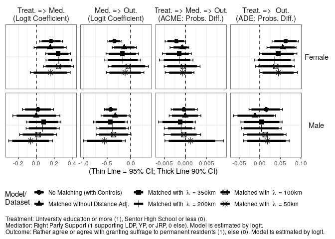

Analysis 6: Mediation Analysis with Right Party Support
================
Fan Lu & Gento Kato
Dec 31, 2019

# Preparation

``` r
## Clean Up Space
rm(list=ls())

## Set Working Directory (Automatically) ##
require(rstudioapi); require(rprojroot)
if (rstudioapi::isAvailable()==TRUE) {
  setwd(dirname(rstudioapi::getActiveDocumentContext()$path)); 
} 
projdir <- find_root(has_file("thisishome.txt"))
cat(paste("Working Directory Set to:\n",projdir))
```

    ## Working Directory Set to:
    ##  /home/gentok/Documents/Projects/ForeignerJapan

``` r
setwd(projdir)

## Load Image of Main Analysis
load(paste0(projdir,"/out/analysis_main_v4.RData"))

# Import Matched Data
sifcct_m1 <- readRDS("./data/sifcct_young_matched_1.rds")
sifcct_m2 <- readRDS("./data/sifcct_young_matched_2.rds")
sifcct_m3 <- readRDS("./data/sifcct_young_matched_3.rds")
sifcct_m4 <- readRDS("./data/sifcct_young_matched_4.rds")
sifcct_m5 <- readRDS("./data/sifcct_young_matched_5.rds")
head(sifcct$zip_pref)
```

    ## [1] "福井県" "東京都" "福井県" "埼玉県" "福岡県" "福井県"

``` r
# Replace zip_pref variable
sifcct_m1$zip_pref <- sifcct$zip_pref[match(sifcct_m1$zip,sifcct$zip)]
sifcct_m2$zip_pref <- sifcct$zip_pref[match(sifcct_m2$zip,sifcct$zip)]
sifcct_m3$zip_pref <- sifcct$zip_pref[match(sifcct_m3$zip,sifcct$zip)]
sifcct_m4$zip_pref <- sifcct$zip_pref[match(sifcct_m4$zip,sifcct$zip)]
sifcct_m5$zip_pref <- sifcct$zip_pref[match(sifcct_m5$zip,sifcct$zip)]


## packages
# devtools::install_github("gentok/estvis")
require(estvis)
require(multiwayvcov)
require(sandwich)
require(lmtest)
require(MASS)
require(ggplot2)
require(texreg)
require(mediation)
```

# Limit Data to Young People

``` r
table(sifcct$agecat)
```

    ## 
    ##        Young (<=30s) Middle Aged (40-50s)        Elder (>=60s) 
    ##                 8742                10432                 7122

``` r
sifcct <- sifcct[which(sifcct$agecat=="Young (<=30s)"),]

sifcct$wave <- as.factor(sifcct$wave)
sifcct_m1$wave <- as.factor(sifcct_m1$wave)
sifcct_m2$wave <- as.factor(sifcct_m2$wave)
sifcct_m3$wave <- as.factor(sifcct_m3$wave)
sifcct_m4$wave <- as.factor(sifcct_m4$wave)
sifcct_m5$wave <- as.factor(sifcct_m5$wave)

sifcct$foreignsuff_agree <- ifelse(sifcct$foreignsuff>=0.75,1,0)
sifcct_m1$foreignsuff_agree <- ifelse(sifcct_m1$foreignsuff>=0.75,1,0)
sifcct_m2$foreignsuff_agree <- ifelse(sifcct_m2$foreignsuff>=0.75,1,0)
sifcct_m3$foreignsuff_agree <- ifelse(sifcct_m3$foreignsuff>=0.75,1,0)
sifcct_m4$foreignsuff_agree <- ifelse(sifcct_m4$foreignsuff>=0.75,1,0)
sifcct_m5$foreignsuff_agree <- ifelse(sifcct_m5$foreignsuff>=0.75,1,0)

# Reverse Education Variable
sifcct$edu <- 1 - sifcct$edu
sifcct_m1$edu <- ifelse(sifcct_m1$edu=="<=SHS",1,0)
sifcct_m2$edu <- ifelse(sifcct_m2$edu=="<=SHS",1,0)
sifcct_m3$edu <- ifelse(sifcct_m3$edu=="<=SHS",1,0)
sifcct_m4$edu <- ifelse(sifcct_m4$edu=="<=SHS",1,0)
sifcct_m5$edu <- ifelse(sifcct_m5$edu=="<=SHS",1,0)

# Generate RPS FT Variable
summary(sifcct$right)
```

    ##    Min. 1st Qu.  Median    Mean 3rd Qu.    Max. 
    ##  0.0000  0.0000  0.0000  0.3035  1.0000  1.0000

``` r
sifcct_m1$right <- sifcct$right[match(sifcct_m1$id,sifcct$id)]
sifcct_m2$right <- sifcct$right[match(sifcct_m2$id,sifcct$id)]
sifcct_m3$right <- sifcct$right[match(sifcct_m3$id,sifcct$id)]
sifcct_m4$right <- sifcct$right[match(sifcct_m4$id,sifcct$id)]
sifcct_m5$right <- sifcct$right[match(sifcct_m5$id,sifcct$id)]
```

# Models

## SIFCCT (Original)

``` r
fdt <- sifcct[which(sifcct$female==1),]
mdt <- sifcct[which(sifcct$female==0),]

## Mediator Models
medf_RPS <- glm(right  ~ edu + knowledge + polint + employed + evecon + income + lvpr + wave, 
               data=fdt, family=binomial("logit"))
coeftest(medf_RPS, vcov.=vcovCL(medf_RPS,factor(fdt$zip_pref)))
```

    ## 
    ## z test of coefficients:
    ## 
    ##              Estimate Std. Error z value  Pr(>|z|)    
    ## (Intercept) -2.626253   0.300870 -8.7289 < 2.2e-16 ***
    ## edu         -0.165150   0.064258 -2.5701 0.0101665 *  
    ## knowledge    0.155470   0.108054  1.4388 0.1502011    
    ## polint       1.259917   0.129656  9.7174 < 2.2e-16 ***
    ## employed    -0.074521   0.071472 -1.0427 0.2971027    
    ## evecon       0.452519   0.153247  2.9529 0.0031483 ** 
    ## income       0.427630   0.153918  2.7783 0.0054645 ** 
    ## lvpr         0.115255   0.139917  0.8237 0.4100868    
    ## wave3       -0.100143   0.339695 -0.2948 0.7681440    
    ## wave4        0.147865   0.346929  0.4262 0.6699544    
    ## wave5        0.155148   0.400437  0.3874 0.6984258    
    ## wave6        0.118445   0.271603  0.4361 0.6627673    
    ## wave7        0.034188   0.393939  0.0868 0.9308424    
    ## wave8        0.090057   0.328795  0.2739 0.7841611    
    ## wave9       -0.026531   0.442616 -0.0599 0.9522015    
    ## wave10       0.198312   0.381036  0.5205 0.6027469    
    ## wave11       0.043858   0.421289  0.1041 0.9170857    
    ## wave12       0.206883   0.318953  0.6486 0.5165763    
    ## wave13       0.542837   0.333933  1.6256 0.1040382    
    ## wave14       0.399173   0.303129  1.3168 0.1878908    
    ## wave15       0.436241   0.433752  1.0057 0.3145416    
    ## wave16       1.066661   0.292109  3.6516 0.0002606 ***
    ## wave17       0.879571   0.318810  2.7589 0.0057992 ** 
    ## wave18       0.686991   0.309214  2.2217 0.0263016 *  
    ## wave19       1.042581   0.285564  3.6509 0.0002613 ***
    ## wave20       0.792033   0.298766  2.6510 0.0080249 ** 
    ## wave21       0.926002   0.300647  3.0800 0.0020698 ** 
    ## wave22       0.764323   0.319141  2.3949 0.0166231 *  
    ## ---
    ## Signif. codes:  0 '***' 0.001 '**' 0.01 '*' 0.05 '.' 0.1 ' ' 1

``` r
medm_RPS <- glm(right  ~ edu + knowledge + polint + employed + evecon + income + lvpr + wave, 
               data=mdt, family=binomial("logit"))
coeftest(medm_RPS, vcov.=vcovCL(medm_RPS,factor(mdt$zip_pref)))
```

    ## 
    ## z test of coefficients:
    ## 
    ##                Estimate  Std. Error z value  Pr(>|z|)    
    ## (Intercept) -1.93054869  0.21082847 -9.1570 < 2.2e-16 ***
    ## edu         -0.01932254  0.08778578 -0.2201 0.8257853    
    ## knowledge   -0.21681814  0.12807035 -1.6930 0.0904628 .  
    ## polint       1.42025022  0.17142626  8.2849 < 2.2e-16 ***
    ## employed     0.05093175  0.15008311  0.3394 0.7343408    
    ## evecon       0.51243475  0.12980221  3.9478 7.887e-05 ***
    ## income       0.23535878  0.11440728  2.0572 0.0396669 *  
    ## lvpr        -0.12254995  0.08773825 -1.3968 0.1624834    
    ## wave3        0.00082645  0.18494112  0.0045 0.9964345    
    ## wave4       -0.07622737  0.17294690 -0.4408 0.6593897    
    ## wave5       -0.44723841  0.23042927 -1.9409 0.0522713 .  
    ## wave6       -0.04176989  0.18635371 -0.2241 0.8226460    
    ## wave7       -0.23641663  0.19935703 -1.1859 0.2356635    
    ## wave8       -0.08581927  0.18765078 -0.4573 0.6474303    
    ## wave9       -0.36812455  0.15128435 -2.4333 0.0149607 *  
    ## wave10      -0.33922122  0.14974913 -2.2653 0.0234965 *  
    ## wave11      -0.14867673  0.16976227 -0.8758 0.3811422    
    ## wave12       0.17314380  0.20354738  0.8506 0.3949741    
    ## wave13       0.16573810  0.23952080  0.6920 0.4889643    
    ## wave14       0.08090941  0.22102336  0.3661 0.7143149    
    ## wave15       0.33778088  0.18009970  1.8755 0.0607210 .  
    ## wave16       0.63207047  0.16952050  3.7286 0.0001926 ***
    ## wave17       0.72772271  0.20736432  3.5094 0.0004491 ***
    ## wave18       0.62739911  0.18848793  3.3286 0.0008729 ***
    ## wave19       0.51390187  0.26173696  1.9634 0.0495964 *  
    ## wave20       0.49448745  0.21429163  2.3075 0.0210245 *  
    ## wave21       0.76035475  0.18011999  4.2214 2.428e-05 ***
    ## wave22       0.74181211  0.19082340  3.8874 0.0001013 ***
    ## ---
    ## Signif. codes:  0 '***' 0.001 '**' 0.01 '*' 0.05 '.' 0.1 ' ' 1

``` r
## Outcome Models 
outf_RPS <- glm(foreignsuff_agree  ~ edu + right + edu:right + 
                  knowledge + polint + employed + evecon + income + lvpr + wave, data=fdt, family=binomial("logit"))
coeftest(outf_RPS, vcov.=vcovCL(outf_RPS,factor(fdt$zip_pref)))
```

    ## 
    ## z test of coefficients:
    ## 
    ##              Estimate Std. Error z value  Pr(>|z|)    
    ## (Intercept) -0.450318   0.222898 -2.0203  0.043354 *  
    ## edu         -0.463925   0.085901 -5.4007 6.637e-08 ***
    ## right       -0.344487   0.072115 -4.7769 1.780e-06 ***
    ## knowledge   -0.130410   0.129974 -1.0034  0.315689    
    ## polint       0.371580   0.152775  2.4322  0.015007 *  
    ## employed     0.009904   0.075544  0.1311  0.895694    
    ## evecon       0.594099   0.205922  2.8851  0.003913 ** 
    ## income      -0.019676   0.143487 -0.1371  0.890929    
    ## lvpr        -0.114457   0.122309 -0.9358  0.349375    
    ## wave3       -0.341675   0.187608 -1.8212  0.068574 .  
    ## wave4       -0.316931   0.215830 -1.4684  0.141988    
    ## wave5       -0.309509   0.183301 -1.6885  0.091310 .  
    ## wave6       -0.060105   0.177863 -0.3379  0.735418    
    ## wave7       -0.169158   0.200395 -0.8441  0.398602    
    ## wave8       -0.380893   0.203357 -1.8730  0.061065 .  
    ## wave9       -0.588337   0.218710 -2.6900  0.007144 ** 
    ## wave10      -0.322711   0.239913 -1.3451  0.178588    
    ## wave11      -0.671128   0.228723 -2.9342  0.003344 ** 
    ## wave12      -0.342304   0.177899 -1.9241  0.054336 .  
    ## wave13      -0.520993   0.214912 -2.4242  0.015341 *  
    ## wave14      -0.451053   0.217111 -2.0775  0.037753 *  
    ## wave15      -0.472851   0.170167 -2.7787  0.005457 ** 
    ## wave16      -0.425788   0.183100 -2.3254  0.020048 *  
    ## wave17      -0.592474   0.198606 -2.9832  0.002853 ** 
    ## wave18      -0.354477   0.188600 -1.8795  0.060173 .  
    ## wave19      -0.514448   0.206913 -2.4863  0.012908 *  
    ## wave20      -0.350277   0.188637 -1.8569  0.063328 .  
    ## wave21      -0.558786   0.235218 -2.3756  0.017520 *  
    ## wave22      -0.155840   0.194354 -0.8018  0.422647    
    ## edu:right    0.679104   0.173194  3.9211 8.816e-05 ***
    ## ---
    ## Signif. codes:  0 '***' 0.001 '**' 0.01 '*' 0.05 '.' 0.1 ' ' 1

``` r
outm_RPS <- glm(foreignsuff_agree  ~ edu + right + edu:right + 
                  knowledge + polint + employed + evecon + income + lvpr + wave, data=mdt, family=binomial("logit"))
coeftest(outm_RPS, vcov.=vcovCL(outm_RPS,factor(mdt$zip_pref)))
```

    ## 
    ## z test of coefficients:
    ## 
    ##              Estimate Std. Error z value  Pr(>|z|)    
    ## (Intercept) -1.270897   0.207198 -6.1337 8.584e-10 ***
    ## edu         -0.113577   0.104790 -1.0839 0.2784287    
    ## right       -0.425250   0.066862 -6.3601 2.016e-10 ***
    ## knowledge   -0.487892   0.115031 -4.2414 2.221e-05 ***
    ## polint       0.091936   0.166732  0.5514 0.5813614    
    ## employed     0.213228   0.101861  2.0933 0.0363197 *  
    ## evecon       0.210243   0.204081  1.0302 0.3029186    
    ## income       0.400897   0.119148  3.3647 0.0007663 ***
    ## lvpr        -0.355911   0.081110 -4.3880 1.144e-05 ***
    ## wave3        0.071823   0.267515  0.2685 0.7883273    
    ## wave4        0.081195   0.247489  0.3281 0.7428541    
    ## wave5        0.258724   0.179674  1.4400 0.1498786    
    ## wave6        0.223935   0.225873  0.9914 0.3214815    
    ## wave7        0.341981   0.222339  1.5381 0.1240222    
    ## wave8        0.340448   0.275916  1.2339 0.2172464    
    ## wave9        0.258992   0.220310  1.1756 0.2397616    
    ## wave10       0.385496   0.213690  1.8040 0.0712318 .  
    ## wave11       0.284882   0.215214  1.3237 0.1855969    
    ## wave12       0.344920   0.228995  1.5062 0.1320065    
    ## wave13       0.030175   0.267080  0.1130 0.9100440    
    ## wave14       0.145352   0.234718  0.6193 0.5357454    
    ## wave15       0.075926   0.272582  0.2785 0.7805952    
    ## wave16       0.411451   0.256911  1.6015 0.1092601    
    ## wave17       0.331977   0.227402  1.4599 0.1443256    
    ## wave18       0.232304   0.196408  1.1828 0.2369029    
    ## wave19       0.182636   0.193782  0.9425 0.3459463    
    ## wave20       0.367286   0.307460  1.1946 0.2322494    
    ## wave21       0.130034   0.275023  0.4728 0.6363491    
    ## wave22       0.279363   0.291380  0.9588 0.3376804    
    ## edu:right    0.078004   0.194516  0.4010 0.6884104    
    ## ---
    ## Signif. codes:  0 '***' 0.001 '**' 0.01 '*' 0.05 '.' 0.1 ' ' 1

``` r
## Causal Mediation Analysis
set.seed(2345)
medoutf_RPS <- mediate(medf_RPS, outf_RPS, treat = "edu", 
                       mediator = "right", 
                       cluster=factor(fdt$zip_pref))
summary(medoutf_RPS)
```

    ## 
    ## Causal Mediation Analysis 
    ## 
    ## Quasi-Bayesian Confidence Intervals
    ## 
    ##                           Estimate 95% CI Lower 95% CI Upper p-value    
    ## ACME (control)            2.15e-03     5.13e-06         0.00   0.050 *  
    ## ACME (treated)           -2.01e-03    -5.87e-03         0.00   0.098 .  
    ## ADE (control)            -6.29e-02    -9.38e-02        -0.03  <2e-16 ***
    ## ADE (treated)            -6.71e-02    -9.82e-02        -0.04  <2e-16 ***
    ## Total Effect             -6.49e-02    -9.57e-02        -0.03  <2e-16 ***
    ## Prop. Mediated (control) -3.20e-02    -8.86e-02         0.00   0.050 *  
    ## Prop. Mediated (treated)  2.69e-02    -4.67e-03         0.12   0.098 .  
    ## ACME (average)            6.76e-05    -1.55e-03         0.00   0.916    
    ## ADE (average)            -6.50e-02    -9.61e-02        -0.03  <2e-16 ***
    ## Prop. Mediated (average) -2.55e-03    -2.49e-02         0.03   0.916    
    ## ---
    ## Signif. codes:  0 '***' 0.001 '**' 0.01 '*' 0.05 '.' 0.1 ' ' 1
    ## 
    ## Sample Size Used: 3989 
    ## 
    ## 
    ## Simulations: 1000

``` r
set.seed(2345)
medoutm_RPS <- mediate(medm_RPS, outm_RPS, treat = "edu", 
                       mediator = "right", 
                       cluster=factor(mdt$zip_pref))
summary(medoutm_RPS)
```

    ## 
    ## Causal Mediation Analysis 
    ## 
    ## Quasi-Bayesian Confidence Intervals
    ## 
    ##                           Estimate 95% CI Lower 95% CI Upper p-value
    ## ACME (control)            0.000347    -0.002835         0.00    0.83
    ## ACME (treated)            0.000253    -0.002411         0.00    0.85
    ## ADE (control)            -0.016134    -0.055523         0.03    0.44
    ## ADE (treated)            -0.016228    -0.055653         0.02    0.44
    ## Total Effect             -0.015881    -0.055946         0.03    0.46
    ## Prop. Mediated (control) -0.003389    -0.580117         0.54    0.97
    ## Prop. Mediated (treated) -0.001889    -0.408236         0.48    0.95
    ## ACME (average)            0.000300    -0.002604         0.00    0.83
    ## ADE (average)            -0.016181    -0.055591         0.03    0.44
    ## Prop. Mediated (average) -0.002639    -0.530151         0.57    0.97
    ## 
    ## Sample Size Used: 4737 
    ## 
    ## 
    ## Simulations: 1000

## Matched without Distance Adjustment

``` r
fdt_m1 <- sifcct_m1[which(sifcct_m1$female==1),]
mdt_m1 <- sifcct_m1[which(sifcct_m1$female==0),]

## Mediator Models
medf_RPS_m1 <- glm(right  ~ edu + #,
                    knowledge + polint + employed + evecon + income + lvpr + wave, 
                  data=fdt_m1, family=binomial("logit"))
coeftest(medf_RPS_m1, vcov.=vcovCL(medf_RPS_m1, factor(fdt_m1$zip_pref)))
```

    ## 
    ## z test of coefficients:
    ## 
    ##              Estimate Std. Error z value  Pr(>|z|)    
    ## (Intercept) -2.937647   0.357634 -8.2141 < 2.2e-16 ***
    ## edu         -0.154792   0.091287 -1.6957  0.089950 .  
    ## knowledge    0.806619   0.375280  2.1494  0.031604 *  
    ## polint       1.538215   0.222199  6.9227 4.431e-12 ***
    ## employed    -0.017098   0.111045 -0.1540  0.877631    
    ## evecon       0.368110   0.296746  1.2405  0.214794    
    ## income       0.687557   0.228253  3.0123  0.002593 ** 
    ## lvpr        -0.108099   0.193553 -0.5585  0.576506    
    ## wave3       -0.309006   0.490866 -0.6295  0.529014    
    ## wave4        0.265335   0.391489  0.6778  0.497925    
    ## wave5       -0.112307   0.521009 -0.2156  0.829334    
    ## wave6        0.150845   0.325749  0.4631  0.643314    
    ## wave7        0.049545   0.523634  0.0946  0.924618    
    ## wave8        0.341698   0.382923  0.8923  0.372211    
    ## wave9       -0.052582   0.433323 -0.1213  0.903417    
    ## wave10      -0.104868   0.535595 -0.1958  0.844769    
    ## wave11      -0.155313   0.570944 -0.2720  0.785600    
    ## wave12      -0.428851   0.371372 -1.1548  0.248183    
    ## wave13       0.452409   0.481810  0.9390  0.347742    
    ## wave14       0.533829   0.406617  1.3129  0.189232    
    ## wave15       0.328498   0.490045  0.6703  0.502640    
    ## wave16       1.215447   0.395717  3.0715  0.002130 ** 
    ## wave17       0.745833   0.393915  1.8934  0.058307 .  
    ## wave18       0.722487   0.341154  2.1178  0.034194 *  
    ## wave19       1.087059   0.446421  2.4351  0.014890 *  
    ## wave20       0.702550   0.420331  1.6714  0.094639 .  
    ## wave21       0.703095   0.375176  1.8740  0.060925 .  
    ## wave22       0.890086   0.366898  2.4260  0.015267 *  
    ## ---
    ## Signif. codes:  0 '***' 0.001 '**' 0.01 '*' 0.05 '.' 0.1 ' ' 1

``` r
medm_RPS_m1 <- glm(right  ~ edu + #,
                    knowledge + polint + employed + evecon + income + lvpr + wave, 
                  data=mdt_m1, family=binomial("logit"))
coeftest(medm_RPS_m1, vcov.=vcovCL(medm_RPS_m1,factor(mdt_m1$zip_pref)))
```

    ## 
    ## z test of coefficients:
    ## 
    ##                Estimate  Std. Error z value  Pr(>|z|)    
    ## (Intercept) -2.07450379  0.32905885 -6.3044 2.894e-10 ***
    ## edu         -0.00069527  0.13354595 -0.0052  0.995846    
    ## knowledge   -0.14392759  0.22519774 -0.6391  0.522747    
    ## polint       1.71340088  0.24290050  7.0539 1.739e-12 ***
    ## employed     0.21203569  0.21161494  1.0020  0.316349    
    ## evecon       0.52351290  0.24544351  2.1329  0.032931 *  
    ## income       0.20854177  0.27984426  0.7452  0.456147    
    ## lvpr        -0.25254322  0.13645100 -1.8508  0.064199 .  
    ## wave3       -0.45934753  0.37361779 -1.2295  0.218900    
    ## wave4        0.08059967  0.36593601  0.2203  0.825672    
    ## wave5       -0.38449755  0.29158251 -1.3187  0.187284    
    ## wave6       -0.20982101  0.32392856 -0.6477  0.517154    
    ## wave7       -0.64211952  0.37766840 -1.7002  0.089089 .  
    ## wave8        0.08293727  0.38526287  0.2153  0.829553    
    ## wave9       -0.41336531  0.33551540 -1.2320  0.217938    
    ## wave10      -0.83763735  0.31941407 -2.6224  0.008731 ** 
    ## wave11      -0.08731258  0.33043143 -0.2642  0.791596    
    ## wave12       0.16916908  0.25915384  0.6528  0.513902    
    ## wave13       0.07268029  0.33884589  0.2145  0.830162    
    ## wave14      -0.63997334  0.37191059 -1.7208  0.085292 .  
    ## wave15      -0.00340059  0.29732837 -0.0114  0.990875    
    ## wave16       0.40342341  0.25433510  1.5862  0.112697    
    ## wave17       0.38636933  0.32225623  1.1990  0.230547    
    ## wave18       0.19322303  0.26854329  0.7195  0.471819    
    ## wave19       0.51334415  0.38366649  1.3380  0.180898    
    ## wave20       0.20739077  0.33424423  0.6205  0.534944    
    ## wave21       0.68096668  0.21423803  3.1786  0.001480 ** 
    ## wave22       0.35398110  0.32269877  1.0969  0.272668    
    ## ---
    ## Signif. codes:  0 '***' 0.001 '**' 0.01 '*' 0.05 '.' 0.1 ' ' 1

``` r
## Outcome Models
outf_RPS_m1 <- glm(foreignsuff_agree  ~ edu + right + edu:right + #,
                     knowledge + polint + employed + evecon + income + lvpr + wave, 
                   data=fdt_m1, family=binomial("logit"))
coeftest(outf_RPS_m1, vcov.=vcovCL(outf_RPS_m1,factor(fdt_m1$zip_pref)))
```

    ## 
    ## z test of coefficients:
    ## 
    ##               Estimate Std. Error z value  Pr(>|z|)    
    ## (Intercept) -0.6745874  0.2704092 -2.4947 0.0126067 *  
    ## edu         -0.3640241  0.0991799 -3.6703 0.0002422 ***
    ## right       -0.1347386  0.1313019 -1.0262 0.3048098    
    ## knowledge    0.0738539  0.2816307  0.2622 0.7931390    
    ## polint       0.5374404  0.1986323  2.7057 0.0068160 ** 
    ## employed     0.0986995  0.1230923  0.8018 0.4226493    
    ## evecon       0.3421642  0.2216796  1.5435 0.1227077    
    ## income      -0.1433242  0.2511974 -0.5706 0.5682952    
    ## lvpr        -0.2280121  0.1739117 -1.3111 0.1898308    
    ## wave3       -0.5132120  0.4306453 -1.1917 0.2333680    
    ## wave4       -0.0502034  0.3070102 -0.1635 0.8701063    
    ## wave5       -0.2822678  0.3171430 -0.8900 0.3734479    
    ## wave6        0.2157256  0.3048671  0.7076 0.4791904    
    ## wave7       -0.2761132  0.2574368 -1.0725 0.2834742    
    ## wave8       -0.3930005  0.4034158 -0.9742 0.3299661    
    ## wave9       -0.4993509  0.3425064 -1.4579 0.1448593    
    ## wave10       0.0098401  0.3626874  0.0271 0.9783551    
    ## wave11      -0.6488135  0.2728980 -2.3775 0.0174307 *  
    ## wave12      -0.2538524  0.3112195 -0.8157 0.4146890    
    ## wave13      -0.3886577  0.3658435 -1.0624 0.2880720    
    ## wave14      -0.3355903  0.4484731 -0.7483 0.4542820    
    ## wave15      -0.3287768  0.3311600 -0.9928 0.3208058    
    ## wave16      -0.3399254  0.2939867 -1.1563 0.2475744    
    ## wave17      -0.3676164  0.3639865 -1.0100 0.3125084    
    ## wave18      -0.4408724  0.3033590 -1.4533 0.1461398    
    ## wave19      -0.2691101  0.2917901 -0.9223 0.3563862    
    ## wave20      -0.0750533  0.2930750 -0.2561 0.7978821    
    ## wave21      -0.4897098  0.2965813 -1.6512 0.0987014 .  
    ## wave22       0.1602389  0.3246318  0.4936 0.6215872    
    ## edu:right    0.4223688  0.1979490  2.1337 0.0328653 *  
    ## ---
    ## Signif. codes:  0 '***' 0.001 '**' 0.01 '*' 0.05 '.' 0.1 ' ' 1

``` r
outm_RPS_m1 <- glm(foreignsuff_agree  ~ edu + right + edu:right + #,
                     knowledge + polint + employed + evecon + income + lvpr + wave, 
                   data=mdt_m1, family=binomial("logit"))
coeftest(outm_RPS_m1, vcov.=vcovCL(outm_RPS_m1,factor(mdt_m1$zip_pref)))
```

    ## 
    ## z test of coefficients:
    ## 
    ##              Estimate Std. Error z value  Pr(>|z|)    
    ## (Intercept) -1.392372   0.303454 -4.5884 4.466e-06 ***
    ## edu          0.079702   0.150583  0.5293  0.596604    
    ## right       -0.330179   0.152669 -2.1627  0.030564 *  
    ## knowledge   -0.669278   0.170282 -3.9304 8.480e-05 ***
    ## polint       0.472502   0.221568  2.1325  0.032962 *  
    ## employed     0.350800   0.187136  1.8746  0.060852 .  
    ## evecon       0.297012   0.311348  0.9540  0.340107    
    ## income       0.243983   0.224245  1.0880  0.276587    
    ## lvpr        -0.399081   0.127123 -3.1393  0.001693 ** 
    ## wave3       -0.122439   0.376070 -0.3256  0.744747    
    ## wave4        0.109583   0.474249  0.2311  0.817264    
    ## wave5       -0.299092   0.372988 -0.8019  0.422623    
    ## wave6        0.283012   0.409526  0.6911  0.489520    
    ## wave7        0.116986   0.339704  0.3444  0.730563    
    ## wave8       -0.079061   0.418789 -0.1888  0.850261    
    ## wave9       -0.476579   0.438919 -1.0858  0.277568    
    ## wave10       0.201503   0.383100  0.5260  0.598902    
    ## wave11       0.290780   0.372515  0.7806  0.435047    
    ## wave12       0.098870   0.363837  0.2717  0.785821    
    ## wave13      -0.147882   0.505918 -0.2923  0.770054    
    ## wave14      -0.087166   0.418034 -0.2085  0.834828    
    ## wave15      -0.452344   0.446030 -1.0142  0.310508    
    ## wave16       0.109054   0.444134  0.2455  0.806035    
    ## wave17      -0.031537   0.497184 -0.0634  0.949423    
    ## wave18       0.161796   0.396662  0.4079  0.683351    
    ## wave19      -0.045829   0.408945 -0.1121  0.910770    
    ## wave20      -0.150252   0.421511 -0.3565  0.721495    
    ## wave21      -0.325053   0.462848 -0.7023  0.482499    
    ## wave22      -0.567750   0.538743 -1.0538  0.291955    
    ## edu:right   -0.027687   0.243087 -0.1139  0.909320    
    ## ---
    ## Signif. codes:  0 '***' 0.001 '**' 0.01 '*' 0.05 '.' 0.1 ' ' 1

``` r
## Causal Mediation Analysis
set.seed(2345)
medoutf_RPS_m1 <- mediate(medf_RPS_m1, outf_RPS_m1, treat = "edu", 
                          mediator = "right", 
                          cluster=factor(fdt_m1$zip_pref))
summary(medoutf_RPS_m1)
```

    ## 
    ## Causal Mediation Analysis 
    ## 
    ## Quasi-Bayesian Confidence Intervals
    ## 
    ##                           Estimate 95% CI Lower 95% CI Upper p-value    
    ## ACME (control)            0.000756    -0.000803         0.00    0.43    
    ## ACME (treated)           -0.001496    -0.005470         0.00    0.29    
    ## ADE (control)            -0.055807    -0.088170        -0.02  <2e-16 ***
    ## ADE (treated)            -0.058059    -0.091286        -0.02  <2e-16 ***
    ## Total Effect             -0.057303    -0.089901        -0.02  <2e-16 ***
    ## Prop. Mediated (control) -0.008792    -0.076264         0.01    0.43    
    ## Prop. Mediated (treated)  0.020437    -0.018882         0.13    0.29    
    ## ACME (average)           -0.000370    -0.002558         0.00    0.67    
    ## ADE (average)            -0.056933    -0.089155        -0.02  <2e-16 ***
    ## Prop. Mediated (average)  0.005823    -0.024026         0.05    0.67    
    ## ---
    ## Signif. codes:  0 '***' 0.001 '**' 0.01 '*' 0.05 '.' 0.1 ' ' 1
    ## 
    ## Sample Size Used: 1784 
    ## 
    ## 
    ## Simulations: 1000

``` r
set.seed(2345)
medoutm_RPS_m1 <- mediate(medm_RPS_m1, outm_RPS_m1, treat = "edu", 
                          mediator = "right", 
                          cluster=factor(mdt_m1$zip_pref))
summary(medoutm_RPS_m1)
```

    ## 
    ## Causal Mediation Analysis 
    ## 
    ## Quasi-Bayesian Confidence Intervals
    ## 
    ##                           Estimate 95% CI Lower 95% CI Upper p-value
    ## ACME (control)            4.87e-05    -3.68e-03         0.00    0.97
    ## ACME (treated)           -6.33e-05    -4.76e-03         0.00    0.99
    ## ADE (control)             1.15e-02    -3.83e-02         0.06    0.65
    ## ADE (treated)             1.14e-02    -3.86e-02         0.06    0.66
    ## Total Effect              1.15e-02    -3.90e-02         0.06    0.66
    ## Prop. Mediated (control)  2.66e-03    -8.16e-01         0.81    0.96
    ## Prop. Mediated (treated)  2.08e-03    -9.75e-01         0.83    0.97
    ## ACME (average)           -7.29e-06    -3.99e-03         0.00    0.98
    ## ADE (average)             1.15e-02    -3.88e-02         0.06    0.65
    ## Prop. Mediated (average)  2.37e-03    -7.94e-01         0.84    0.97
    ## 
    ## Sample Size Used: 1674 
    ## 
    ## 
    ## Simulations: 1000

## Matched with Distance Adjustment (Lambda=50km)

``` r
fdt_m2 <- sifcct_m2[which(sifcct_m2$female==1),]
mdt_m2 <- sifcct_m2[which(sifcct_m2$female==0),]

## Mediator Models
medf_RPS_m2 <- glm(right  ~ edu + #,
                    knowledge + polint + employed + evecon + income + lvpr + wave, 
                  data=fdt_m2, family=binomial("logit"))
coeftest(medf_RPS_m2, vcov.=vcovCL(medf_RPS_m2, factor(fdt_m2$zip_pref)))
```

    ## 
    ## z test of coefficients:
    ## 
    ##               Estimate Std. Error z value  Pr(>|z|)    
    ## (Intercept) -2.8012076  0.5153595 -5.4354 5.466e-08 ***
    ## edu         -0.1563382  0.1130080 -1.3834  0.166534    
    ## knowledge    1.1702873  0.3891831  3.0070  0.002638 ** 
    ## polint       1.5412693  0.2641457  5.8349 5.382e-09 ***
    ## employed    -0.0458150  0.1760791 -0.2602  0.794713    
    ## evecon       0.3724483  0.3541030  1.0518  0.292888    
    ## income       0.5984892  0.3574889  1.6741  0.094102 .  
    ## lvpr        -0.0256621  0.1969233 -0.1303  0.896317    
    ## wave3       -0.0607974  0.6116392 -0.0994  0.920820    
    ## wave4        0.3231543  0.5123190  0.6308  0.528192    
    ## wave5        0.1780077  0.5129439  0.3470  0.728568    
    ## wave6       -0.0088485  0.4346824 -0.0204  0.983759    
    ## wave7       -0.6574089  0.5248229 -1.2526  0.210340    
    ## wave8       -0.1892230  0.4762189 -0.3973  0.691113    
    ## wave9       -0.6648011  0.5084130 -1.3076  0.191009    
    ## wave10      -0.1074963  0.4719066 -0.2278  0.819808    
    ## wave11      -0.1504745  0.5921900 -0.2541  0.799420    
    ## wave12      -0.3031090  0.3449305 -0.8788  0.379535    
    ## wave13       0.2319291  0.4750728  0.4882  0.625410    
    ## wave14       0.1351880  0.5296916  0.2552  0.798553    
    ## wave15      -0.1426962  0.5067707 -0.2816  0.778266    
    ## wave16       1.0550449  0.4496761  2.3462  0.018964 *  
    ## wave17       0.3188285  0.4249806  0.7502  0.453123    
    ## wave18       0.0169103  0.5511359  0.0307  0.975523    
    ## wave19       0.5068021  0.4168041  1.2159  0.224014    
    ## wave20       0.8363656  0.3760055  2.2243  0.026125 *  
    ## wave21       0.1507762  0.4144032  0.3638  0.715978    
    ## wave22       0.6431380  0.4674443  1.3759  0.168865    
    ## ---
    ## Signif. codes:  0 '***' 0.001 '**' 0.01 '*' 0.05 '.' 0.1 ' ' 1

``` r
medm_RPS_m2 <- glm(right  ~ edu + #,
                    knowledge + polint + employed + evecon + income + lvpr + wave, 
                  data=mdt_m2, family=binomial("logit"))
coeftest(medm_RPS_m2, vcov.=vcovCL(medm_RPS_m2,factor(mdt_m2$zip_pref)))
```

    ## 
    ## z test of coefficients:
    ## 
    ##               Estimate Std. Error z value  Pr(>|z|)    
    ## (Intercept) -1.9036011  0.4065121 -4.6828 2.830e-06 ***
    ## edu          0.0628345  0.1244679  0.5048   0.61368    
    ## knowledge   -0.1128066  0.2910491 -0.3876   0.69832    
    ## polint       1.6200550  0.3473301  4.6643 3.097e-06 ***
    ## employed     0.2719546  0.2802534  0.9704   0.33185    
    ## evecon       0.4630229  0.3704795  1.2498   0.21138    
    ## income       0.0244178  0.2273479  0.1074   0.91447    
    ## lvpr        -0.2459285  0.1521471 -1.6164   0.10601    
    ## wave3       -0.8000653  0.3801455 -2.1046   0.03532 *  
    ## wave4       -0.1976295  0.3430037 -0.5762   0.56450    
    ## wave5       -0.5505112  0.4531422 -1.2149   0.22441    
    ## wave6       -0.4462947  0.4046650 -1.1029   0.27008    
    ## wave7       -0.8672298  0.5250303 -1.6518   0.09858 .  
    ## wave8       -0.2746301  0.4518264 -0.6078   0.54331    
    ## wave9       -0.7225373  0.3222279 -2.2423   0.02494 *  
    ## wave10      -1.1047857  0.5371974 -2.0566   0.03973 *  
    ## wave11      -0.3810707  0.4261421 -0.8942   0.37120    
    ## wave12       0.0058644  0.4532597  0.0129   0.98968    
    ## wave13       0.0344218  0.5257945  0.0655   0.94780    
    ## wave14      -0.3053318  0.4185595 -0.7295   0.46571    
    ## wave15       0.0842194  0.4317581  0.1951   0.84534    
    ## wave16       0.6420018  0.2791035  2.3002   0.02144 *  
    ## wave17       0.1670459  0.4845420  0.3448   0.73028    
    ## wave18       0.3311827  0.4335717  0.7638   0.44496    
    ## wave19       0.3675666  0.5590227  0.6575   0.51085    
    ## wave20       0.3293846  0.4489673  0.7336   0.46316    
    ## wave21       0.5496800  0.3551044  1.5479   0.12164    
    ## wave22       0.5746741  0.4930602  1.1655   0.24381    
    ## ---
    ## Signif. codes:  0 '***' 0.001 '**' 0.01 '*' 0.05 '.' 0.1 ' ' 1

``` r
## Outcome Models
outf_RPS_m2 <- glm(foreignsuff_agree  ~ edu + right + edu:right + #,
                     knowledge + polint + employed + evecon + income + lvpr + wave, 
                   data=fdt_m2, family=binomial("logit"))
coeftest(outf_RPS_m2, vcov.=vcovCL(outf_RPS_m2,factor(fdt_m2$zip_pref)))
```

    ## 
    ## z test of coefficients:
    ## 
    ##              Estimate Std. Error z value  Pr(>|z|)    
    ## (Intercept) -1.136860   0.320435 -3.5479 0.0003884 ***
    ## edu         -0.303615   0.138317 -2.1951 0.0281589 *  
    ## right       -0.117049   0.203577 -0.5750 0.5653175    
    ## knowledge   -0.406106   0.354794 -1.1446 0.2523658    
    ## polint       0.914384   0.226365  4.0394 5.358e-05 ***
    ## employed    -0.015008   0.118703 -0.1264 0.8993886    
    ## evecon       0.080955   0.191950  0.4217 0.6732082    
    ## income      -0.321123   0.420453 -0.7638 0.4450130    
    ## lvpr        -0.259966   0.212297 -1.2245 0.2207495    
    ## wave3        0.123409   0.579236  0.2131 0.8312847    
    ## wave4        0.487189   0.418225  1.1649 0.2440598    
    ## wave5       -0.663751   0.320450 -2.0713 0.0383301 *  
    ## wave6        0.390079   0.405301  0.9624 0.3358267    
    ## wave7        0.699541   0.371276  1.8842 0.0595443 .  
    ## wave8        0.550456   0.328183  1.6773 0.0934866 .  
    ## wave9        0.154346   0.445961  0.3461 0.7292687    
    ## wave10       0.156401   0.533044  0.2934 0.7692078    
    ## wave11       0.134684   0.352186  0.3824 0.7021480    
    ## wave12       0.484548   0.453073  1.0695 0.2848586    
    ## wave13      -0.280598   0.374963 -0.7483 0.4542590    
    ## wave14       0.437317   0.492071  0.8887 0.3741498    
    ## wave15       0.435326   0.388889  1.1194 0.2629662    
    ## wave16       0.349769   0.362022  0.9662 0.3339670    
    ## wave17      -0.367724   0.470845 -0.7810 0.4348105    
    ## wave18       0.532481   0.225377  2.3626 0.0181462 *  
    ## wave19       0.366426   0.492783  0.7436 0.4571271    
    ## wave20       0.591137   0.312209  1.8934 0.0583047 .  
    ## wave21       0.527225   0.356061  1.4807 0.1386828    
    ## wave22       0.533586   0.372971  1.4306 0.1525346    
    ## edu:right    0.354933   0.306868  1.1566 0.2474228    
    ## ---
    ## Signif. codes:  0 '***' 0.001 '**' 0.01 '*' 0.05 '.' 0.1 ' ' 1

``` r
outm_RPS_m2 <- glm(foreignsuff_agree  ~ edu+ right + edu:right + #,
                     knowledge + polint + employed + evecon + income + lvpr + wave, 
                   data=mdt_m2, family=binomial("logit"))
coeftest(outm_RPS_m2, vcov.=vcovCL(outm_RPS_m2,factor(mdt_m2$zip_pref)))
```

    ## 
    ## z test of coefficients:
    ## 
    ##              Estimate Std. Error z value  Pr(>|z|)    
    ## (Intercept) -1.881989   0.341803 -5.5061 3.669e-08 ***
    ## edu         -0.066465   0.188349 -0.3529  0.724178    
    ## right       -0.555665   0.226450 -2.4538  0.014135 *  
    ## knowledge   -0.148227   0.232595 -0.6373  0.523946    
    ## polint       0.467249   0.279225  1.6734  0.094252 .  
    ## employed     0.396125   0.241577  1.6397  0.101058    
    ## evecon       0.505919   0.377444  1.3404  0.180122    
    ## income       0.693164   0.239034  2.8999  0.003733 ** 
    ## lvpr        -0.498651   0.172428 -2.8919  0.003829 ** 
    ## wave3        0.107507   0.411449  0.2613  0.793871    
    ## wave4        0.065430   0.448742  0.1458  0.884074    
    ## wave5        0.059690   0.518378  0.1151  0.908328    
    ## wave6       -0.028141   0.555406 -0.0507  0.959590    
    ## wave7        0.344133   0.427506  0.8050  0.420833    
    ## wave8        0.119961   0.443354  0.2706  0.786717    
    ## wave9       -0.075044   0.463055 -0.1621  0.871256    
    ## wave10       0.122330   0.428733  0.2853  0.775391    
    ## wave11       0.313533   0.444775  0.7049  0.480857    
    ## wave12       0.255569   0.361040  0.7079  0.479026    
    ## wave13       0.106910   0.589793  0.1813  0.856158    
    ## wave14      -0.193212   0.380808 -0.5074  0.611893    
    ## wave15      -0.197322   0.456386 -0.4324  0.665481    
    ## wave16       0.133234   0.473352  0.2815  0.778350    
    ## wave17       0.479793   0.434968  1.1031  0.270004    
    ## wave18       0.417162   0.316038  1.3200  0.186845    
    ## wave19       0.350366   0.429067  0.8166  0.414171    
    ## wave20       0.234901   0.484943  0.4844  0.628110    
    ## wave21      -0.126445   0.525736 -0.2405  0.809934    
    ## wave22       0.405002   0.439254  0.9220  0.356517    
    ## edu:right   -0.122750   0.268355 -0.4574  0.647370    
    ## ---
    ## Signif. codes:  0 '***' 0.001 '**' 0.01 '*' 0.05 '.' 0.1 ' ' 1

``` r
## Causal Mediation Analysis
set.seed(2345)
medoutf_RPS_m2 <- mediate(medf_RPS_m2, outf_RPS_m2, treat = "edu", 
                          mediator = "right", 
                          cluster=factor(fdt_m2$zip_pref))
summary(medoutf_RPS_m2)
```

    ## 
    ## Causal Mediation Analysis 
    ## 
    ## Quasi-Bayesian Confidence Intervals
    ## 
    ##                           Estimate 95% CI Lower 95% CI Upper p-value  
    ## ACME (control)            0.000657    -0.002038         0.00    0.68  
    ## ACME (treated)           -0.001146    -0.005962         0.00    0.51  
    ## ADE (control)            -0.045283    -0.091452         0.00    0.05 *
    ## ADE (treated)            -0.047086    -0.091917         0.00    0.04 *
    ## Total Effect             -0.046430    -0.092264         0.00    0.04 *
    ## Prop. Mediated (control) -0.006733    -0.249160         0.06    0.70  
    ## Prop. Mediated (treated)  0.015476    -0.085124         0.27    0.53  
    ## ACME (average)           -0.000245    -0.002535         0.00    0.80  
    ## ADE (average)            -0.046185    -0.091767         0.00    0.04 *
    ## Prop. Mediated (average)  0.004371    -0.085070         0.09    0.82  
    ## ---
    ## Signif. codes:  0 '***' 0.001 '**' 0.01 '*' 0.05 '.' 0.1 ' ' 1
    ## 
    ## Sample Size Used: 1162 
    ## 
    ## 
    ## Simulations: 1000

``` r
set.seed(2345)
medoutm_RPS_m2 <- mediate(medm_RPS_m2, outm_RPS_m2, treat = "edu", 
                          mediator = "right", 
                          cluster=factor(mdt_m2$zip_pref))
summary(medoutm_RPS_m2)
```

    ## 
    ## Causal Mediation Analysis 
    ## 
    ## Quasi-Bayesian Confidence Intervals
    ## 
    ##                          Estimate 95% CI Lower 95% CI Upper p-value
    ## ACME (control)           -0.00123     -0.00903         0.00    0.68
    ## ACME (treated)           -0.00150     -0.00879         0.01    0.68
    ## ADE (control)            -0.01856     -0.07152         0.04    0.50
    ## ADE (treated)            -0.01884     -0.07122         0.04    0.50
    ## Total Effect             -0.02006     -0.07149         0.04    0.47
    ## Prop. Mediated (control)  0.02382     -1.11030         1.27    0.80
    ## Prop. Mediated (treated)  0.02558     -1.48522         1.46    0.80
    ## ACME (average)           -0.00137     -0.00862         0.01    0.68
    ## ADE (average)            -0.01870     -0.07102         0.04    0.50
    ## Prop. Mediated (average)  0.02470     -1.54506         1.21    0.80
    ## 
    ## Sample Size Used: 1252 
    ## 
    ## 
    ## Simulations: 1000

## Matched with Distance Adjustment (Lambda=100km)

``` r
fdt_m3 <- sifcct_m3[which(sifcct_m3$female==1),]
mdt_m3 <- sifcct_m3[which(sifcct_m3$female==0),]

## Mediator Models
medf_RPS_m3 <- glm(right  ~ edu + #,
                    knowledge + polint + employed + evecon + income + lvpr + wave, 
                  data=fdt_m3, family=binomial("logit"))
coeftest(medf_RPS_m3, vcov.=vcovCL(medf_RPS_m3, factor(fdt_m3$zip_pref)))
```

    ## 
    ## z test of coefficients:
    ## 
    ##              Estimate Std. Error z value  Pr(>|z|)    
    ## (Intercept) -2.894624   0.443429 -6.5278 6.673e-11 ***
    ## edu         -0.246127   0.085939 -2.8640  0.004184 ** 
    ## knowledge    0.877644   0.364078  2.4106  0.015927 *  
    ## polint       1.647989   0.202092  8.1546 3.502e-16 ***
    ## employed    -0.223224   0.149561 -1.4925  0.135560    
    ## evecon       0.406399   0.287976  1.4112  0.158177    
    ## income       0.711319   0.326633  2.1777  0.029426 *  
    ## lvpr         0.206494   0.190416  1.0844  0.278171    
    ## wave3       -0.083647   0.494912 -0.1690  0.865786    
    ## wave4        0.252698   0.480107  0.5263  0.598653    
    ## wave5        0.333512   0.486105  0.6861  0.492656    
    ## wave6       -0.046295   0.429215 -0.1079  0.914108    
    ## wave7       -0.655919   0.593509 -1.1052  0.269093    
    ## wave8        0.287802   0.410937  0.7004  0.483705    
    ## wave9       -0.271581   0.549637 -0.4941  0.621229    
    ## wave10      -0.316255   0.546703 -0.5785  0.562942    
    ## wave11       0.150968   0.545089  0.2770  0.781810    
    ## wave12      -0.288596   0.411231 -0.7018  0.482813    
    ## wave13      -0.027673   0.510855 -0.0542  0.956800    
    ## wave14       0.506108   0.533593  0.9485  0.342880    
    ## wave15       0.031077   0.521626  0.0596  0.952492    
    ## wave16       1.321590   0.476609  2.7729  0.005556 ** 
    ## wave17       0.590336   0.461981  1.2778  0.201307    
    ## wave18       0.561249   0.468614  1.1977  0.231041    
    ## wave19       0.862194   0.442373  1.9490  0.051293 .  
    ## wave20       0.947548   0.369563  2.5640  0.010348 *  
    ## wave21       0.291348   0.440605  0.6612  0.508456    
    ## wave22       0.987718   0.479873  2.0583  0.039562 *  
    ## ---
    ## Signif. codes:  0 '***' 0.001 '**' 0.01 '*' 0.05 '.' 0.1 ' ' 1

``` r
medm_RPS_m3 <- glm(right  ~ edu + #,
                    knowledge + polint + employed + evecon + income + lvpr + wave, 
                  data=mdt_m3, family=binomial("logit"))
coeftest(medm_RPS_m3, vcov.=vcovCL(medm_RPS_m3,factor(mdt_m3$zip_pref)))
```

    ## 
    ## z test of coefficients:
    ## 
    ##              Estimate Std. Error z value  Pr(>|z|)    
    ## (Intercept) -1.716048   0.393040 -4.3661 1.265e-05 ***
    ## edu         -0.020654   0.104815 -0.1970   0.84379    
    ## knowledge   -0.204359   0.235238 -0.8687   0.38499    
    ## polint       1.633569   0.292055  5.5934 2.227e-08 ***
    ## employed    -0.042155   0.243583 -0.1731   0.86260    
    ## evecon       0.610008   0.319664  1.9083   0.05636 .  
    ## income       0.242223   0.234454  1.0331   0.30154    
    ## lvpr        -0.175680   0.155067 -1.1329   0.25724    
    ## wave3       -0.590054   0.402549 -1.4658   0.14270    
    ## wave4       -0.072253   0.320889 -0.2252   0.82185    
    ## wave5       -0.526569   0.408508 -1.2890   0.19740    
    ## wave6       -0.443098   0.401862 -1.1026   0.27020    
    ## wave7       -1.048132   0.566767 -1.8493   0.06441 .  
    ## wave8       -0.073465   0.361772 -0.2031   0.83908    
    ## wave9       -0.682313   0.338330 -2.0167   0.04373 *  
    ## wave10      -0.912631   0.420351 -2.1711   0.02992 *  
    ## wave11      -0.308736   0.414754 -0.7444   0.45664    
    ## wave12       0.064443   0.382927  0.1683   0.86635    
    ## wave13       0.186221   0.450541  0.4133   0.67937    
    ## wave14      -0.190541   0.362389 -0.5258   0.59903    
    ## wave15       0.226838   0.329196  0.6891   0.49078    
    ## wave16       0.364295   0.274374  1.3277   0.18427    
    ## wave17       0.319695   0.504033  0.6343   0.52590    
    ## wave18       0.154260   0.359327  0.4293   0.66770    
    ## wave19       0.381857   0.496788  0.7687   0.44210    
    ## wave20       0.103485   0.439021  0.2357   0.81365    
    ## wave21       0.585238   0.327719  1.7858   0.07413 .  
    ## wave22       0.305095   0.424645  0.7185   0.47247    
    ## ---
    ## Signif. codes:  0 '***' 0.001 '**' 0.01 '*' 0.05 '.' 0.1 ' ' 1

``` r
## Outcome Models
outf_RPS_m3 <- glm(foreignsuff_agree  ~ edu + right + edu:right + #,
                     knowledge + polint + employed + evecon + income + lvpr + wave, 
                   data=fdt_m3, family=binomial("logit"))
coeftest(outf_RPS_m3, vcov.=vcovCL(outf_RPS_m3,factor(fdt_m3$zip_pref)))
```

    ## 
    ## z test of coefficients:
    ## 
    ##              Estimate Std. Error z value  Pr(>|z|)    
    ## (Intercept) -1.199506   0.344269 -3.4842 0.0004936 ***
    ## edu         -0.268205   0.130133 -2.0610 0.0393023 *  
    ## right       -0.049320   0.218541 -0.2257 0.8214518    
    ## knowledge   -0.242962   0.293592 -0.8275 0.4079263    
    ## polint       0.680939   0.248775  2.7372 0.0061970 ** 
    ## employed     0.028743   0.106129  0.2708 0.7865178    
    ## evecon       0.242248   0.199050  1.2170 0.2235952    
    ## income      -0.307762   0.339399 -0.9068 0.3645206    
    ## lvpr        -0.293549   0.180774 -1.6238 0.1044084    
    ## wave3        0.258944   0.504925  0.5128 0.6080659    
    ## wave4        0.434274   0.383620  1.1320 0.2576170    
    ## wave5       -0.118199   0.304521 -0.3881 0.6979071    
    ## wave6        0.700952   0.379442  1.8473 0.0647004 .  
    ## wave7        0.636660   0.400966  1.5878 0.1123284    
    ## wave8        0.475531   0.359001  1.3246 0.1853056    
    ## wave9        0.072499   0.448486  0.1617 0.8715799    
    ## wave10       0.454820   0.406337  1.1193 0.2630045    
    ## wave11       0.193078   0.353628  0.5460 0.5850711    
    ## wave12       0.621412   0.380089  1.6349 0.1020670    
    ## wave13      -0.151719   0.381944 -0.3972 0.6911981    
    ## wave14       0.571982   0.427802  1.3370 0.1812144    
    ## wave15       0.479048   0.344971  1.3887 0.1649359    
    ## wave16       0.352535   0.351868  1.0019 0.3163946    
    ## wave17      -0.027030   0.412356 -0.0655 0.9477369    
    ## wave18       0.365932   0.289794  1.2627 0.2066862    
    ## wave19       0.365536   0.444289  0.8227 0.4106534    
    ## wave20       0.526219   0.348413  1.5103 0.1309586    
    ## wave21       0.451622   0.388270  1.1632 0.2447619    
    ## wave22       0.635507   0.403402  1.5754 0.1151716    
    ## edu:right    0.332948   0.281720  1.1818 0.2372697    
    ## ---
    ## Signif. codes:  0 '***' 0.001 '**' 0.01 '*' 0.05 '.' 0.1 ' ' 1

``` r
outm_RPS_m3 <- glm(foreignsuff_agree  ~ edu + right + edu:right + #,
                     knowledge + polint + employed + evecon + income + lvpr + wave, 
                   data=mdt_m3, family=binomial("logit"))
coeftest(outm_RPS_m3, vcov.=vcovCL(outm_RPS_m3,factor(mdt_m3$zip_pref)))
```

    ## 
    ## z test of coefficients:
    ## 
    ##               Estimate Std. Error z value  Pr(>|z|)    
    ## (Intercept) -1.5102546  0.3743350 -4.0345 5.472e-05 ***
    ## edu          0.0048922  0.1573751  0.0311 0.9752009    
    ## right       -0.3622266  0.1885420 -1.9212 0.0547067 .  
    ## knowledge   -0.3879164  0.2111177 -1.8374 0.0661448 .  
    ## polint       0.4211790  0.2297098  1.8335 0.0667244 .  
    ## employed     0.3478282  0.2840500  1.2245 0.2207517    
    ## evecon       0.3277526  0.3477703  0.9424 0.3459676    
    ## income       0.6980838  0.1862643  3.7478 0.0001784 ***
    ## lvpr        -0.5135069  0.1391371 -3.6907 0.0002237 ***
    ## wave3       -0.1722363  0.4040671 -0.4263 0.6699208    
    ## wave4       -0.3465131  0.4466537 -0.7758 0.4378682    
    ## wave5       -0.0445242  0.4202959 -0.1059 0.9156337    
    ## wave6        0.0387765  0.5368537  0.0722 0.9424195    
    ## wave7        0.1729318  0.4177904  0.4139 0.6789328    
    ## wave8       -0.0249827  0.4176541 -0.0598 0.9523017    
    ## wave9       -0.3751880  0.4261907 -0.8803 0.3786812    
    ## wave10      -0.0935420  0.3660397 -0.2556 0.7982972    
    ## wave11       0.1803180  0.4016562  0.4489 0.6534777    
    ## wave12       0.0583719  0.3381235  0.1726 0.8629384    
    ## wave13      -0.2033750  0.5207105 -0.3906 0.6961136    
    ## wave14      -0.1463616  0.3108056 -0.4709 0.6377048    
    ## wave15      -0.8051973  0.4198644 -1.9178 0.0551420 .  
    ## wave16       0.1905126  0.4148184  0.4593 0.6460421    
    ## wave17       0.0963573  0.4418548  0.2181 0.8273710    
    ## wave18       0.0872171  0.2838521  0.3073 0.7586436    
    ## wave19       0.0990816  0.4147988  0.2389 0.8112089    
    ## wave20      -0.0975966  0.4945318 -0.1974 0.8435525    
    ## wave21      -0.1559043  0.4539183 -0.3435 0.7312498    
    ## wave22      -0.0623721  0.4134347 -0.1509 0.8800835    
    ## edu:right   -0.2580467  0.2217614 -1.1636 0.2445767    
    ## ---
    ## Signif. codes:  0 '***' 0.001 '**' 0.01 '*' 0.05 '.' 0.1 ' ' 1

``` r
## Causal Mediation Analysis
set.seed(2345)
medoutf_RPS_m3 <- mediate(medf_RPS_m3, outf_RPS_m3, treat = "edu", 
                          mediator = "right", 
                          cluster=factor(fdt_m3$zip_pref))
summary(medoutf_RPS_m3)
```

    ## 
    ## Causal Mediation Analysis 
    ## 
    ## Quasi-Bayesian Confidence Intervals
    ## 
    ##                           Estimate 95% CI Lower 95% CI Upper p-value
    ## ACME (control)            0.000476    -0.003491         0.01    0.84
    ## ACME (treated)           -0.002268    -0.007513         0.00    0.22
    ## ADE (control)            -0.038935    -0.085036         0.01    0.14
    ## ADE (treated)            -0.041679    -0.088883         0.01    0.10
    ## Total Effect             -0.041203    -0.087154         0.01    0.10
    ## Prop. Mediated (control) -0.006050    -0.426101         0.18    0.86
    ## Prop. Mediated (treated)  0.043635    -0.334228         0.56    0.31
    ## ACME (average)           -0.000896    -0.004362         0.00    0.50
    ## ADE (average)            -0.040307    -0.087258         0.01    0.11
    ## Prop. Mediated (average)  0.018792    -0.172473         0.27    0.56
    ## 
    ## Sample Size Used: 1430 
    ## 
    ## 
    ## Simulations: 1000

``` r
set.seed(2345)
medoutm_RPS_m3 <- mediate(medm_RPS_m3, outm_RPS_m3, treat = "edu", 
                          mediator = "right", 
                          cluster=factor(mdt_m3$zip_pref))
summary(medoutm_RPS_m3)
```

    ## 
    ## Causal Mediation Analysis 
    ## 
    ## Quasi-Bayesian Confidence Intervals
    ## 
    ##                           Estimate 95% CI Lower 95% CI Upper p-value
    ## ACME (control)            0.000387    -0.003642         0.01    0.82
    ## ACME (treated)            0.000492    -0.005076         0.01    0.83
    ## ADE (control)            -0.013142    -0.064028         0.04    0.63
    ## ADE (treated)            -0.013036    -0.065409         0.04    0.63
    ## Total Effect             -0.012649    -0.064456         0.04    0.65
    ## Prop. Mediated (control)  0.000413    -1.118533         0.64    0.99
    ## Prop. Mediated (treated)  0.001696    -1.389427         1.02    0.98
    ## ACME (average)            0.000440    -0.004351         0.01    0.83
    ## ADE (average)            -0.013089    -0.064615         0.04    0.63
    ## Prop. Mediated (average)  0.001055    -1.275202         0.76    0.99
    ## 
    ## Sample Size Used: 1486 
    ## 
    ## 
    ## Simulations: 1000

## Matched with Distance Adjustment (Lambda=200km)

``` r
fdt_m4 <- sifcct_m4[which(sifcct_m4$female==1),]
mdt_m4 <- sifcct_m4[which(sifcct_m4$female==0),]

## Mediator Models
medf_RPS_m4 <- glm(right  ~ edu + #,
                    knowledge + polint + employed + evecon + income + lvpr + wave, 
                  data=fdt_m4, family=binomial("logit"))
coeftest(medf_RPS_m4, vcov.=vcovCL(medf_RPS_m4, factor(fdt_m4$zip_pref)))
```

    ## 
    ## z test of coefficients:
    ## 
    ##              Estimate Std. Error z value  Pr(>|z|)    
    ## (Intercept) -2.885413   0.381428 -7.5648 3.886e-14 ***
    ## edu         -0.250448   0.072445 -3.4571 0.0005461 ***
    ## knowledge    0.814818   0.349755  2.3297 0.0198231 *  
    ## polint       1.606542   0.219372  7.3234 2.418e-13 ***
    ## employed    -0.213472   0.132289 -1.6137 0.1065957    
    ## evecon       0.695571   0.269594  2.5801 0.0098780 ** 
    ## income       0.702446   0.287967  2.4393 0.0147146 *  
    ## lvpr         0.152774   0.185020  0.8257 0.4089662    
    ## wave3       -0.159872   0.499418 -0.3201 0.7488803    
    ## wave4        0.382765   0.444350  0.8614 0.3890144    
    ## wave5        0.285543   0.460165  0.6205 0.5349136    
    ## wave6        0.029793   0.404160  0.0737 0.9412368    
    ## wave7       -0.170090   0.563061 -0.3021 0.7625908    
    ## wave8        0.323637   0.403929  0.8012 0.4230025    
    ## wave9       -0.346151   0.516123 -0.6707 0.5024282    
    ## wave10      -0.153824   0.531946 -0.2892 0.7724495    
    ## wave11      -0.183637   0.517324 -0.3550 0.7226077    
    ## wave12      -0.274031   0.392279 -0.6986 0.4848254    
    ## wave13       0.082033   0.494446  0.1659 0.8682278    
    ## wave14       0.483993   0.506564  0.9554 0.3393537    
    ## wave15       0.180697   0.513644  0.3518 0.7249935    
    ## wave16       1.051084   0.417417  2.5181 0.0118000 *  
    ## wave17       0.482127   0.465697  1.0353 0.3005374    
    ## wave18       0.555968   0.422163  1.3170 0.1878550    
    ## wave19       0.924842   0.452193  2.0452 0.0408314 *  
    ## wave20       0.695253   0.403881  1.7214 0.0851731 .  
    ## wave21       0.273073   0.435504  0.6270 0.5306411    
    ## wave22       0.718065   0.475076  1.5115 0.1306678    
    ## ---
    ## Signif. codes:  0 '***' 0.001 '**' 0.01 '*' 0.05 '.' 0.1 ' ' 1

``` r
medm_RPS_m4 <- glm(right  ~ edu + #,
                    knowledge + polint + employed + evecon + income + lvpr + wave, 
                  data=mdt_m4, family=binomial("logit"))
coeftest(medm_RPS_m4, vcov.=vcovCL(medm_RPS_m4,factor(mdt_m4$zip_pref)))
```

    ## 
    ## z test of coefficients:
    ## 
    ##               Estimate Std. Error z value  Pr(>|z|)    
    ## (Intercept) -1.8892022  0.3582533 -5.2734 1.339e-07 ***
    ## edu         -0.0714126  0.0941759 -0.7583  0.448278    
    ## knowledge   -0.1951554  0.2159327 -0.9038  0.366113    
    ## polint       1.7666628  0.3006890  5.8754 4.219e-09 ***
    ## employed    -0.0058737  0.2462972 -0.0238  0.980974    
    ## evecon       0.5360729  0.2864284  1.8716  0.061265 .  
    ## income       0.2215778  0.2723702  0.8135  0.415922    
    ## lvpr        -0.2501482  0.1509188 -1.6575  0.097418 .  
    ## wave3       -0.4650413  0.4256848 -1.0925  0.274633    
    ## wave4       -0.0529019  0.3660348 -0.1445  0.885084    
    ## wave5       -0.4646173  0.4338619 -1.0709  0.284220    
    ## wave6       -0.1028652  0.4045216 -0.2543  0.799273    
    ## wave7       -0.8422410  0.4731785 -1.7800  0.075082 .  
    ## wave8        0.1285246  0.3704158  0.3470  0.728611    
    ## wave9       -0.4150175  0.3029354 -1.3700  0.170691    
    ## wave10      -0.6100764  0.3322879 -1.8360  0.066360 .  
    ## wave11      -0.1396664  0.4073835 -0.3428  0.731721    
    ## wave12       0.0059416  0.3771327  0.0158  0.987430    
    ## wave13       0.2694228  0.4214976  0.6392  0.522691    
    ## wave14      -0.1261639  0.3942194 -0.3200  0.748942    
    ## wave15       0.0960552  0.3007967  0.3193  0.749472    
    ## wave16       0.4503041  0.2855968  1.5767  0.114862    
    ## wave17       0.4248077  0.4368507  0.9724  0.330836    
    ## wave18       0.4203718  0.3867966  1.0868  0.277124    
    ## wave19       0.5642015  0.4711219  1.1976  0.231084    
    ## wave20       0.2680550  0.4130259  0.6490  0.516336    
    ## wave21       0.7871332  0.2887682  2.7258  0.006414 ** 
    ## wave22       0.5015614  0.4098518  1.2238  0.221042    
    ## ---
    ## Signif. codes:  0 '***' 0.001 '**' 0.01 '*' 0.05 '.' 0.1 ' ' 1

``` r
## Outcome Models
outf_RPS_m4 <- glm(foreignsuff_agree  ~ edu + right + edu:right + #,
                     knowledge + polint + employed + evecon + income + lvpr + wave, 
                   data=fdt_m4, family=binomial("logit"))
coeftest(outf_RPS_m4, vcov.=vcovCL(outf_RPS_m4,factor(fdt_m4$zip_pref)))
```

    ## 
    ## z test of coefficients:
    ## 
    ##              Estimate Std. Error z value  Pr(>|z|)    
    ## (Intercept) -1.017392   0.281458 -3.6147 0.0003007 ***
    ## edu         -0.289575   0.125575 -2.3060 0.0211114 *  
    ## right       -0.167517   0.195137 -0.8585 0.3906389    
    ## knowledge   -0.218625   0.277281 -0.7885 0.4304264    
    ## polint       0.660982   0.241347  2.7387 0.0061678 ** 
    ## employed     0.050171   0.107546  0.4665 0.6408483    
    ## evecon       0.431047   0.197594  2.1815 0.0291483 *  
    ## income      -0.119999   0.319141 -0.3760 0.7069133    
    ## lvpr        -0.285785   0.149692 -1.9092 0.0562421 .  
    ## wave3       -0.166846   0.398488 -0.4187 0.6754368    
    ## wave4        0.230174   0.307083  0.7496 0.4535253    
    ## wave5       -0.313955   0.290356 -1.0813 0.2795746    
    ## wave6        0.477330   0.335603  1.4223 0.1549376    
    ## wave7        0.224342   0.283138  0.7923 0.4281611    
    ## wave8       -0.042563   0.350536 -0.1214 0.9033557    
    ## wave9       -0.267127   0.354281 -0.7540 0.4508507    
    ## wave10       0.285674   0.419018  0.6818 0.4953854    
    ## wave11      -0.175918   0.308428 -0.5704 0.5684268    
    ## wave12       0.389132   0.305407  1.2741 0.2026133    
    ## wave13      -0.670383   0.313094 -2.1412 0.0322613 *  
    ## wave14       0.322438   0.401499  0.8031 0.4219251    
    ## wave15       0.177348   0.280952  0.6312 0.5278848    
    ## wave16      -0.117475   0.313955 -0.3742 0.7082719    
    ## wave17      -0.254802   0.391779 -0.6504 0.5154519    
    ## wave18      -0.039417   0.278363 -0.1416 0.8873928    
    ## wave19      -0.010559   0.384848 -0.0274 0.9781112    
    ## wave20       0.277541   0.297021  0.9344 0.3500885    
    ## wave21       0.023451   0.380144  0.0617 0.9508103    
    ## wave22       0.423384   0.302925  1.3977 0.1622169    
    ## edu:right    0.465216   0.264110  1.7614 0.0781626 .  
    ## ---
    ## Signif. codes:  0 '***' 0.001 '**' 0.01 '*' 0.05 '.' 0.1 ' ' 1

``` r
outm_RPS_m4 <- glm(foreignsuff_agree  ~ edu + right + edu:right + #,
                     knowledge + polint + employed + evecon + income + lvpr + wave, 
                   data=mdt_m4, family=binomial("logit"))
coeftest(outm_RPS_m4, vcov.=vcovCL(outm_RPS_m4,factor(mdt_m4$zip_pref)))
```

    ## 
    ## z test of coefficients:
    ## 
    ##              Estimate Std. Error z value  Pr(>|z|)    
    ## (Intercept) -1.630304   0.385561 -4.2284 2.354e-05 ***
    ## edu          0.015565   0.151673  0.1026 0.9182617    
    ## right       -0.383649   0.171570 -2.2361 0.0253446 *  
    ## knowledge   -0.548270   0.182733 -3.0004 0.0026964 ** 
    ## polint       0.475514   0.230792  2.0604 0.0393642 *  
    ## employed     0.390346   0.268358  1.4546 0.1457883    
    ## evecon       0.345411   0.300036  1.1512 0.2496365    
    ## income       0.685657   0.199849  3.4309 0.0006016 ***
    ## lvpr        -0.439763   0.134449 -3.2709 0.0010722 ** 
    ## wave3       -0.080885   0.382522 -0.2115 0.8325341    
    ## wave4       -0.303220   0.399261 -0.7595 0.4475819    
    ## wave5       -0.039420   0.390129 -0.1010 0.9195168    
    ## wave6        0.127130   0.491317  0.2588 0.7958251    
    ## wave7        0.325973   0.356466  0.9145 0.3604764    
    ## wave8       -0.103466   0.407472 -0.2539 0.7995556    
    ## wave9       -0.559183   0.388250 -1.4403 0.1497918    
    ## wave10      -0.150540   0.343572 -0.4382 0.6612694    
    ## wave11       0.237614   0.374686  0.6342 0.5259714    
    ## wave12       0.222052   0.301641  0.7361 0.4616407    
    ## wave13      -0.167088   0.465563 -0.3589 0.7196747    
    ## wave14       0.120923   0.354149  0.3414 0.7327678    
    ## wave15      -0.750424   0.434195 -1.7283 0.0839322 .  
    ## wave16       0.223315   0.395931  0.5640 0.5727359    
    ## wave17       0.116837   0.409502  0.2853 0.7754024    
    ## wave18       0.148619   0.278209  0.5342 0.5932044    
    ## wave19       0.161937   0.400077  0.4048 0.6856501    
    ## wave20       0.098038   0.460245  0.2130 0.8313175    
    ## wave21      -0.272740   0.444540 -0.6135 0.5395236    
    ## wave22       0.077915   0.384093  0.2029 0.8392497    
    ## edu:right   -0.119929   0.224320 -0.5346 0.5929030    
    ## ---
    ## Signif. codes:  0 '***' 0.001 '**' 0.01 '*' 0.05 '.' 0.1 ' ' 1

``` r
## Causal Mediation Analysis
set.seed(2345)
medoutf_RPS_m4 <- mediate(medf_RPS_m4, outf_RPS_m4, treat = "edu", 
                          mediator = "right", 
                          cluster=factor(fdt_m4$zip_pref))
summary(medoutf_RPS_m4)
```

    ## 
    ## Causal Mediation Analysis 
    ## 
    ## Quasi-Bayesian Confidence Intervals
    ## 
    ##                           Estimate 95% CI Lower 95% CI Upper p-value
    ## ACME (control)            0.001456    -0.001802         0.01    0.44
    ## ACME (treated)           -0.002489    -0.007384         0.00    0.15
    ## ADE (control)            -0.036317    -0.083417         0.01    0.15
    ## ADE (treated)            -0.040262    -0.086750         0.01    0.10
    ## Total Effect             -0.038807    -0.085251         0.01    0.11
    ## Prop. Mediated (control) -0.028303    -0.442569         0.18    0.49
    ## Prop. Mediated (treated)  0.050292    -0.416280         0.69    0.25
    ## ACME (average)           -0.000517    -0.003345         0.00    0.69
    ## ADE (average)            -0.038290    -0.085061         0.01    0.12
    ## Prop. Mediated (average)  0.010994    -0.134110         0.29    0.75
    ## 
    ## Sample Size Used: 1624 
    ## 
    ## 
    ## Simulations: 1000

``` r
set.seed(2345)
medoutm_RPS_m4 <- mediate(medm_RPS_m4, outm_RPS_m4, treat = "edu", 
                          mediator = "right", 
                          cluster=factor(mdt_m4$zip_pref))
summary(medoutm_RPS_m4)
```

    ## 
    ## Causal Mediation Analysis 
    ## 
    ## Quasi-Bayesian Confidence Intervals
    ## 
    ##                           Estimate 95% CI Lower 95% CI Upper p-value
    ## ACME (control)            0.001013    -0.002244         0.01    0.56
    ## ACME (treated)            0.001201    -0.003263         0.01    0.56
    ## ADE (control)            -0.004149    -0.052123         0.04    0.84
    ## ADE (treated)            -0.003962    -0.052044         0.04    0.85
    ## Total Effect             -0.002948    -0.051007         0.05    0.89
    ## Prop. Mediated (control) -0.000994    -1.362807         1.11    0.99
    ## Prop. Mediated (treated) -0.001749    -1.627745         1.39    0.99
    ## ACME (average)            0.001107    -0.002760         0.00    0.55
    ## ADE (average)            -0.004055    -0.052098         0.04    0.85
    ## Prop. Mediated (average) -0.001371    -1.487735         1.28    0.99
    ## 
    ## Sample Size Used: 1612 
    ## 
    ## 
    ## Simulations: 1000

## Matched with Distance Adjustment (Lambda=200km)

``` r
fdt_m5 <- sifcct_m5[which(sifcct_m5$female==1),]
mdt_m5 <- sifcct_m5[which(sifcct_m5$female==0),]

## Mediator Models
medf_RPS_m5 <- glm(right  ~ edu + #,
                    knowledge + polint + employed + evecon + income + lvpr + wave,
                  data=fdt_m5, family=binomial("logit"))
coeftest(medf_RPS_m5, vcov.=vcovCL(medf_RPS_m5, factor(fdt_m5$zip_pref)))
```

    ## 
    ## z test of coefficients:
    ## 
    ##              Estimate Std. Error z value  Pr(>|z|)    
    ## (Intercept) -2.847271   0.407432 -6.9883 2.782e-12 ***
    ## edu         -0.242999   0.070408 -3.4513 0.0005579 ***
    ## knowledge    0.737252   0.340730  2.1637 0.0304841 *  
    ## polint       1.532814   0.182053  8.4196 < 2.2e-16 ***
    ## employed    -0.125780   0.138477 -0.9083 0.3637138    
    ## evecon       0.616615   0.281542  2.1901 0.0285145 *  
    ## income       0.744865   0.251220  2.9650 0.0030269 ** 
    ## lvpr         0.083963   0.182586  0.4599 0.6456180    
    ## wave3       -0.146609   0.506030 -0.2897 0.7720278    
    ## wave4        0.118687   0.433581  0.2737 0.7842877    
    ## wave5        0.220977   0.453602  0.4872 0.6261451    
    ## wave6        0.061456   0.427904  0.1436 0.8857997    
    ## wave7       -0.200893   0.563304 -0.3566 0.7213666    
    ## wave8        0.254997   0.378444  0.6738 0.5004355    
    ## wave9       -0.375070   0.514941 -0.7284 0.4663844    
    ## wave10      -0.210588   0.526754 -0.3998 0.6893162    
    ## wave11      -0.256838   0.488696 -0.5256 0.5991949    
    ## wave12      -0.268893   0.369642 -0.7274 0.4669562    
    ## wave13       0.038028   0.500715  0.0759 0.9394615    
    ## wave14       0.310883   0.510118  0.6094 0.5422365    
    ## wave15       0.107494   0.498910  0.2155 0.8294107    
    ## wave16       0.998148   0.431000  2.3159 0.0205645 *  
    ## wave17       0.535720   0.462051  1.1594 0.2462773    
    ## wave18       0.620471   0.404078  1.5355 0.1246553    
    ## wave19       1.036243   0.465109  2.2280 0.0258834 *  
    ## wave20       0.789378   0.404623  1.9509 0.0510695 .  
    ## wave21       0.494959   0.417839  1.1846 0.2361874    
    ## wave22       0.626021   0.473287  1.3227 0.1859320    
    ## ---
    ## Signif. codes:  0 '***' 0.001 '**' 0.01 '*' 0.05 '.' 0.1 ' ' 1

``` r
medm_RPS_m5 <- glm(right  ~ edu + #, 
                    knowledge + polint + employed + evecon + income + lvpr + wave,
                  data=mdt_m5, family=binomial("logit"))
coeftest(medm_RPS_m5, vcov.=vcovCL(medm_RPS_m5,factor(mdt_m5$zip_pref)))
```

    ## 
    ## z test of coefficients:
    ## 
    ##               Estimate Std. Error z value  Pr(>|z|)    
    ## (Intercept) -1.9968648  0.3567035 -5.5981 2.167e-08 ***
    ## edu         -0.0811090  0.0983508 -0.8247  0.409547    
    ## knowledge   -0.2079887  0.2057648 -1.0108  0.312108    
    ## polint       1.7626643  0.2793796  6.3092 2.805e-10 ***
    ## employed     0.0922600  0.2389681  0.3861  0.699440    
    ## evecon       0.5526468  0.2900701  1.9052  0.056752 .  
    ## income       0.1941800  0.2712486  0.7159  0.474069    
    ## lvpr        -0.2310065  0.1560008 -1.4808  0.138659    
    ## wave3       -0.4409492  0.4213611 -1.0465  0.295336    
    ## wave4       -0.0642423  0.3771100 -0.1704  0.864732    
    ## wave5       -0.4304400  0.4381713 -0.9824  0.325925    
    ## wave6       -0.1574694  0.4051248 -0.3887  0.697503    
    ## wave7       -0.8222934  0.4705645 -1.7475  0.080557 .  
    ## wave8        0.1250860  0.3689447  0.3390  0.734582    
    ## wave9       -0.3417808  0.3264325 -1.0470  0.295091    
    ## wave10      -0.5832660  0.3373415 -1.7290  0.083808 .  
    ## wave11      -0.0834048  0.3912143 -0.2132  0.831175    
    ## wave12      -0.0068908  0.3878847 -0.0178  0.985826    
    ## wave13       0.3742491  0.4467380  0.8377  0.402178    
    ## wave14      -0.0574105  0.3767564 -0.1524  0.878887    
    ## wave15       0.1559960  0.3018301  0.5168  0.605272    
    ## wave16       0.5201188  0.3040520  1.7106  0.087150 .  
    ## wave17       0.4469819  0.4433855  1.0081  0.313401    
    ## wave18       0.3328232  0.4148909  0.8022  0.422440    
    ## wave19       0.5480836  0.4691858  1.1682  0.242743    
    ## wave20       0.4014145  0.3744449  1.0720  0.283709    
    ## wave21       0.8157680  0.3001869  2.7175  0.006577 ** 
    ## wave22       0.4762541  0.4221491  1.1282  0.259250    
    ## ---
    ## Signif. codes:  0 '***' 0.001 '**' 0.01 '*' 0.05 '.' 0.1 ' ' 1

``` r
## Outcome Models
outf_RPS_m5 <- glm(foreignsuff_agree  ~ edu + right + edu:right + #,
                     knowledge + polint + employed + evecon + income + lvpr + wave, 
                   data=fdt_m5, family=binomial("logit"))
coeftest(outf_RPS_m5, vcov.=vcovCL(outf_RPS_m5,factor(fdt_m5$zip_pref)))
```

    ## 
    ## z test of coefficients:
    ## 
    ##               Estimate Std. Error z value  Pr(>|z|)    
    ## (Intercept) -1.0067560  0.3032780 -3.3196 0.0009015 ***
    ## edu         -0.3421808  0.1145359 -2.9875 0.0028123 ** 
    ## right       -0.1775976  0.1763956 -1.0068 0.3140239    
    ## knowledge   -0.1821376  0.2845375 -0.6401 0.5220957    
    ## polint       0.6829238  0.2339164  2.9195 0.0035057 ** 
    ## employed     0.0585518  0.1162743  0.5036 0.6145662    
    ## evecon       0.3357088  0.1910710  1.7570 0.0789205 .  
    ## income       0.0139495  0.3104133  0.0449 0.9641563    
    ## lvpr        -0.3048143  0.1574541 -1.9359 0.0528808 .  
    ## wave3       -0.1899400  0.4156252 -0.4570 0.6476722    
    ## wave4        0.2135090  0.3339612  0.6393 0.5226128    
    ## wave5       -0.2971249  0.2985101 -0.9954 0.3195614    
    ## wave6        0.5026815  0.3519919  1.4281 0.1532616    
    ## wave7        0.1469813  0.3119393  0.4712 0.6375081    
    ## wave8        0.0068633  0.3098671  0.0221 0.9823289    
    ## wave9       -0.1623690  0.4015278 -0.4044 0.6859348    
    ## wave10       0.3547504  0.4347425  0.8160 0.4144995    
    ## wave11      -0.2812604  0.3079638 -0.9133 0.3610898    
    ## wave12       0.3269390  0.3344156  0.9776 0.3282510    
    ## wave13      -0.7599004  0.3065406 -2.4790 0.0131768 *  
    ## wave14       0.2341214  0.3924587  0.5966 0.5508076    
    ## wave15       0.1093496  0.2981176  0.3668 0.7137680    
    ## wave16      -0.1933394  0.2857299 -0.6767 0.4986274    
    ## wave17      -0.2429145  0.3930065 -0.6181 0.5365142    
    ## wave18      -0.1018875  0.3049315 -0.3341 0.7382797    
    ## wave19       0.0925758  0.3879719  0.2386 0.8114044    
    ## wave20       0.2814138  0.2991386  0.9407 0.3468345    
    ## wave21      -0.1143070  0.3735216 -0.3060 0.7595856    
    ## wave22       0.4188399  0.3194139  1.3113 0.1897645    
    ## edu:right    0.5135071  0.2465742  2.0826 0.0372907 *  
    ## ---
    ## Signif. codes:  0 '***' 0.001 '**' 0.01 '*' 0.05 '.' 0.1 ' ' 1

``` r
outm_RPS_m5 <- glm(foreignsuff_agree  ~ edu + right + edu:right + #,
                     knowledge + polint + employed + evecon + income + lvpr + wave, 
                   data=mdt_m5, family=binomial("logit"))
coeftest(outm_RPS_m5, vcov.=vcovCL(outm_RPS_m5,factor(mdt_m5$zip_pref)))
```

    ## 
    ## z test of coefficients:
    ## 
    ##              Estimate Std. Error z value  Pr(>|z|)    
    ## (Intercept) -1.491791   0.371760 -4.0128 6.001e-05 ***
    ## edu         -0.013716   0.163294 -0.0840 0.9330612    
    ## right       -0.428819   0.184003 -2.3305 0.0197798 *  
    ## knowledge   -0.646606   0.179347 -3.6053 0.0003117 ***
    ## polint       0.470146   0.223941  2.0994 0.0357798 *  
    ## employed     0.256202   0.236462  1.0835 0.2785934    
    ## evecon       0.397259   0.308374  1.2882 0.1976633    
    ## income       0.720981   0.221099  3.2609 0.0011106 ** 
    ## lvpr        -0.460080   0.132094 -3.4830 0.0004959 ***
    ## wave3        0.029540   0.414278  0.0713 0.9431547    
    ## wave4       -0.174957   0.404956 -0.4320 0.6657130    
    ## wave5       -0.064518   0.381620 -0.1691 0.8657466    
    ## wave6        0.279285   0.450048  0.6206 0.5348834    
    ## wave7        0.363982   0.358950  1.0140 0.3105740    
    ## wave8        0.055643   0.398181  0.1397 0.8888638    
    ## wave9       -0.561872   0.393251 -1.4288 0.1530656    
    ## wave10      -0.115211   0.346076 -0.3329 0.7392046    
    ## wave11       0.330893   0.381711  0.8669 0.3860145    
    ## wave12       0.346325   0.307234  1.1272 0.2596432    
    ## wave13      -0.227790   0.492365 -0.4626 0.6436189    
    ## wave14       0.077580   0.325512  0.2383 0.8116225    
    ## wave15      -0.691691   0.432820 -1.5981 0.1100205    
    ## wave16       0.261360   0.400798  0.6521 0.5143377    
    ## wave17       0.144550   0.408668  0.3537 0.7235562    
    ## wave18       0.238016   0.310068  0.7676 0.4427096    
    ## wave19       0.094240   0.396973  0.2374 0.8123487    
    ## wave20       0.201283   0.477945  0.4211 0.6736514    
    ## wave21      -0.261819   0.447627 -0.5849 0.5586116    
    ## wave22       0.073180   0.374015  0.1957 0.8448756    
    ## edu:right   -0.039327   0.236058 -0.1666 0.8676858    
    ## ---
    ## Signif. codes:  0 '***' 0.001 '**' 0.01 '*' 0.05 '.' 0.1 ' ' 1

``` r
## Causal Mediation Analysis
set.seed(2345)
medoutf_RPS_m5 <- mediate(medf_RPS_m5, outf_RPS_m5, treat = "edu", 
                          mediator = "right", 
                          cluster=factor(fdt_m5$zip_pref))
summary(medoutf_RPS_m5)
```

    ## 
    ## Causal Mediation Analysis 
    ## 
    ## Quasi-Bayesian Confidence Intervals
    ## 
    ##                           Estimate 95% CI Lower 95% CI Upper p-value  
    ## ACME (control)            0.001459    -0.001427         0.01   0.332  
    ## ACME (treated)           -0.002667    -0.007700         0.00   0.084 .
    ## ADE (control)            -0.044847    -0.090222         0.00   0.054 .
    ## ADE (treated)            -0.048974    -0.092474         0.00   0.030 *
    ## Total Effect             -0.047515    -0.091907         0.00   0.044 *
    ## Prop. Mediated (control) -0.025332    -0.254914         0.05   0.368  
    ## Prop. Mediated (treated)  0.047440    -0.033061         0.37   0.124  
    ## ACME (average)           -0.000604    -0.003384         0.00   0.582  
    ## ADE (average)            -0.046910    -0.090818         0.00   0.046 *
    ## Prop. Mediated (average)  0.011054    -0.073797         0.12   0.606  
    ## ---
    ## Signif. codes:  0 '***' 0.001 '**' 0.01 '*' 0.05 '.' 0.1 ' ' 1
    ## 
    ## Sample Size Used: 1694 
    ## 
    ## 
    ## Simulations: 1000

``` r
set.seed(2345)
medoutm_RPS_m5 <- mediate(medm_RPS_m5, outm_RPS_m5, treat = "edu", 
                          mediator = "right", 
                          cluster=factor(mdt_m5$zip_pref))
summary(medoutm_RPS_m5)
```

    ## 
    ## Causal Mediation Analysis 
    ## 
    ## Quasi-Bayesian Confidence Intervals
    ## 
    ##                           Estimate 95% CI Lower 95% CI Upper p-value
    ## ACME (control)            0.001253    -0.002390         0.01    0.51
    ## ACME (treated)            0.001238    -0.002898         0.01    0.53
    ## ADE (control)            -0.005018    -0.054396         0.05    0.83
    ## ADE (treated)            -0.005033    -0.054449         0.05    0.82
    ## Total Effect             -0.003780    -0.053373         0.05    0.87
    ## Prop. Mediated (control) -0.001377    -1.114282         1.27    0.99
    ## Prop. Mediated (treated) -0.000558    -1.048874         1.20    0.99
    ## ACME (average)            0.001246    -0.002549         0.01    0.51
    ## ADE (average)            -0.005025    -0.054572         0.05    0.83
    ## Prop. Mediated (average) -0.000968    -0.957496         1.25    0.99
    ## 
    ## Sample Size Used: 1646 
    ## 
    ## 
    ## Simulations: 1000

# Coefficient Plot

``` r
coefdt <- as.data.frame(rbind(
  c(-coef(medf_RPS)[2],
    -rev(coefci(medf_RPS, vcov.=vcovCL(medf_RPS,factor(fdt$zip_pref)), level=0.90)[2,]),
    -rev(coefci(medf_RPS, vcov.=vcovCL(medf_RPS,factor(fdt$zip_pref)), level=0.95)[2,]),
    coeftest(medf_RPS, vcov.=vcovCL(medf_RPS,factor(fdt$zip_pref)), level=0.95)[2,4]),
  c(coef(outf_RPS)[3],
    coefci(outf_RPS, vcov.=vcovCL(outf_RPS,factor(fdt$zip_pref)), level=0.90)[3,],
    coefci(outf_RPS, vcov.=vcovCL(outf_RPS,factor(fdt$zip_pref)), level=0.95)[3,],
    coeftest(outf_RPS, vcov.=vcovCL(outf_RPS,factor(fdt$zip_pref)), level=0.95)[3,4]),
  c(-medoutf_RPS$d0,-quantile(medoutf_RPS$d0.sims,probs=c(0.95,0.05,0.975,0.025)),medoutf_RPS$d0.p),
  c(-medoutf_RPS$z0,-quantile(medoutf_RPS$z0.sims,probs=c(0.95,0.05,0.975,0.025)),medoutf_RPS$z0.p),
  c(-coef(medm_RPS)[2],
    -rev(coefci(medm_RPS, vcov.=vcovCL(medm_RPS,factor(mdt$zip_pref)), level=0.90)[2,]),
    -rev(coefci(medm_RPS, vcov.=vcovCL(medm_RPS,factor(mdt$zip_pref)), level=0.95)[2,]),
    coeftest(medm_RPS, vcov.=vcovCL(medm_RPS,factor(mdt$zip_pref)), level=0.95)[2,4]),
  c(coef(outm_RPS)[3],
    coefci(outm_RPS, vcov.=vcovCL(outm_RPS,factor(mdt$zip_pref)), level=0.90)[3,],
    coefci(outm_RPS, vcov.=vcovCL(outm_RPS,factor(mdt$zip_pref)), level=0.95)[3,],
    coeftest(outm_RPS, vcov.=vcovCL(outm_RPS,factor(mdt$zip_pref)), level=0.95)[3,4]),
  c(-medoutm_RPS$d0,-quantile(medoutm_RPS$d0.sims,probs=c(0.95,0.05,0.975,0.025)),medoutm_RPS$d0.p),
  c(-medoutm_RPS$z0,-quantile(medoutm_RPS$z0.sims,probs=c(0.95,0.05,0.975,0.025)),medoutm_RPS$z0.p),
  c(-coef(medf_RPS_m1)[2],
    -rev(coefci(medf_RPS_m1, vcov.=vcovCL(medf_RPS_m1,factor(fdt_m1$zip_pref)), level=0.90)[2,]),
    -rev(coefci(medf_RPS_m1, vcov.=vcovCL(medf_RPS_m1,factor(fdt_m1$zip_pref)), level=0.95)[2,]),
    coeftest(medf_RPS_m1, vcov.=vcovCL(medf_RPS_m1,factor(fdt_m1$zip_pref)), level=0.95)[2,4]),
  c(coef(outf_RPS_m1)[3],
    coefci(outf_RPS_m1, vcov.=vcovCL(outf_RPS_m1,factor(fdt_m1$zip_pref)), level=0.90)[3,],
    coefci(outf_RPS_m1, vcov.=vcovCL(outf_RPS_m1,factor(fdt_m1$zip_pref)), level=0.95)[3,],
    coeftest(outf_RPS_m1, vcov.=vcovCL(outf_RPS_m1,factor(fdt_m1$zip_pref)), level=0.95)[3,4]),
  c(-medoutf_RPS_m1$d0,-quantile(medoutf_RPS_m1$d0.sims,probs=c(0.95,0.05,0.975,0.025)),medoutf_RPS_m1$d0.p),
  c(-medoutf_RPS_m1$z0,-quantile(medoutf_RPS_m1$z0.sims,probs=c(0.95,0.05,0.975,0.025)),medoutf_RPS_m1$z0.p),
  c(-coef(medm_RPS_m1)[2],
    -rev(coefci(medm_RPS_m1, vcov.=vcovCL(medm_RPS_m1,factor(mdt_m1$zip_pref)), level=0.90)[2,]),
    -rev(coefci(medm_RPS_m1, vcov.=vcovCL(medm_RPS_m1,factor(mdt_m1$zip_pref)), level=0.95)[2,]),
    coeftest(medm_RPS_m1, vcov.=vcovCL(medm_RPS_m1,factor(mdt_m1$zip_pref)), level=0.95)[2,4]),
  c(coef(outm_RPS_m1)[3],
    coefci(outm_RPS_m1, vcov.=vcovCL(outm_RPS_m1,factor(mdt_m1$zip_pref)), level=0.90)[3,],
    coefci(outm_RPS_m1, vcov.=vcovCL(outm_RPS_m1,factor(mdt_m1$zip_pref)), level=0.95)[3,],
    coeftest(outm_RPS_m1, vcov.=vcovCL(outm_RPS_m1,factor(mdt_m1$zip_pref)), level=0.95)[3,4]),
  c(-medoutm_RPS_m1$d0,-quantile(medoutm_RPS_m1$d0.sims,probs=c(0.95,0.05,0.975,0.025)),medoutm_RPS_m1$d0.p),
  c(-medoutm_RPS_m1$z0,-quantile(medoutm_RPS_m1$z0.sims,probs=c(0.95,0.05,0.975,0.025)),medoutm_RPS_m1$z0.p),
  c(-coef(medf_RPS_m5)[2],
    -rev(coefci(medf_RPS_m5, vcov.=vcovCL(medf_RPS_m5,factor(fdt_m5$zip_pref)), level=0.90)[2,]),
    -rev(coefci(medf_RPS_m5, vcov.=vcovCL(medf_RPS_m5,factor(fdt_m5$zip_pref)), level=0.95)[2,]),
    coeftest(medf_RPS_m5, vcov.=vcovCL(medf_RPS_m5,factor(fdt_m5$zip_pref)), level=0.95)[2,4]),
  c(coef(outf_RPS_m5)[3],
    coefci(outf_RPS_m5, vcov.=vcovCL(outf_RPS_m5,factor(fdt_m5$zip_pref)), level=0.90)[3,],
    coefci(outf_RPS_m5, vcov.=vcovCL(outf_RPS_m5,factor(fdt_m5$zip_pref)), level=0.95)[3,],
    coeftest(outf_RPS_m5, vcov.=vcovCL(outf_RPS_m5,factor(fdt_m5$zip_pref)), level=0.95)[3,4]),
  c(-medoutf_RPS_m5$d0,-quantile(medoutf_RPS_m5$d0.sims,probs=c(0.95,0.05,0.975,0.025)),medoutf_RPS_m5$d0.p),
  c(-medoutf_RPS_m5$z0,-quantile(medoutf_RPS_m5$z0.sims,probs=c(0.95,0.05,0.975,0.025)),medoutf_RPS_m5$z0.p),
  c(-coef(medm_RPS_m5)[2],
    -rev(coefci(medm_RPS_m5, vcov.=vcovCL(medm_RPS_m5,factor(mdt_m5$zip_pref)), level=0.90)[2,]),
    -rev(coefci(medm_RPS_m5, vcov.=vcovCL(medm_RPS_m5,factor(mdt_m5$zip_pref)), level=0.95)[2,]),
    coeftest(medm_RPS_m5, vcov.=vcovCL(medm_RPS_m5,factor(mdt_m5$zip_pref)), level=0.95)[2,4]),
  c(coef(outm_RPS_m5)[3],
    coefci(outm_RPS_m5, vcov.=vcovCL(outm_RPS_m5,factor(mdt_m5$zip_pref)), level=0.90)[3,],
    coefci(outm_RPS_m5, vcov.=vcovCL(outm_RPS_m5,factor(mdt_m5$zip_pref)), level=0.95)[3,],
    coeftest(outm_RPS_m5, vcov.=vcovCL(outm_RPS_m5,factor(mdt_m5$zip_pref)), level=0.95)[3,4]),
  c(-medoutm_RPS_m5$d0,-quantile(medoutm_RPS_m5$d0.sims,probs=c(0.95,0.05,0.975,0.025)),medoutm_RPS_m5$d0.p),
  c(-medoutm_RPS_m5$z0,-quantile(medoutm_RPS_m5$z0.sims,probs=c(0.95,0.05,0.975,0.025)),medoutm_RPS_m5$z0.p),
  c(-coef(medf_RPS_m4)[2],
    -rev(coefci(medf_RPS_m4, vcov.=vcovCL(medf_RPS_m4,factor(fdt_m4$zip_pref)), level=0.90)[2,]),
    -rev(coefci(medf_RPS_m4, vcov.=vcovCL(medf_RPS_m4,factor(fdt_m4$zip_pref)), level=0.95)[2,]),
    coeftest(medf_RPS_m4, vcov.=vcovCL(medf_RPS_m4,factor(fdt_m4$zip_pref)), level=0.95)[2,4]),
  c(coef(outf_RPS_m4)[3],
    coefci(outf_RPS_m4, vcov.=vcovCL(outf_RPS_m4,factor(fdt_m4$zip_pref)), level=0.90)[3,],
    coefci(outf_RPS_m4, vcov.=vcovCL(outf_RPS_m4,factor(fdt_m4$zip_pref)), level=0.95)[3,],
    coeftest(outf_RPS_m4, vcov.=vcovCL(outf_RPS_m4,factor(fdt_m4$zip_pref)), level=0.95)[3,4]),
  c(-medoutf_RPS_m4$d0,-quantile(medoutf_RPS_m4$d0.sims,probs=c(0.95,0.05,0.975,0.025)),medoutf_RPS_m4$d0.p),
  c(-medoutf_RPS_m4$z0,-quantile(medoutf_RPS_m4$z0.sims,probs=c(0.95,0.05,0.975,0.025)),medoutf_RPS_m4$z0.p),
  c(-coef(medm_RPS_m4)[2],
    -rev(coefci(medm_RPS_m4, vcov.=vcovCL(medm_RPS_m4,factor(mdt_m4$zip_pref)), level=0.90)[2,]),
    -rev(coefci(medm_RPS_m4, vcov.=vcovCL(medm_RPS_m4,factor(mdt_m4$zip_pref)), level=0.95)[2,]),
    coeftest(medm_RPS_m4, vcov.=vcovCL(medm_RPS_m4,factor(mdt_m4$zip_pref)), level=0.95)[2,4]),
  c(coef(outm_RPS_m4)[3],
    coefci(outm_RPS_m4, vcov.=vcovCL(outm_RPS_m4,factor(mdt_m4$zip_pref)), level=0.90)[3,],
    coefci(outm_RPS_m4, vcov.=vcovCL(outm_RPS_m4,factor(mdt_m4$zip_pref)), level=0.95)[3,],
    coeftest(outm_RPS_m4, vcov.=vcovCL(outm_RPS_m4,factor(mdt_m4$zip_pref)), level=0.95)[3,4]),
  c(-medoutm_RPS_m4$d0,-quantile(medoutm_RPS_m4$d0.sims,probs=c(0.95,0.05,0.975,0.025)),medoutm_RPS_m4$d0.p),
  c(-medoutm_RPS_m4$z0,-quantile(medoutm_RPS_m4$z0.sims,probs=c(0.95,0.05,0.975,0.025)),medoutm_RPS_m4$z0.p),
  c(-coef(medf_RPS_m3)[2],
    -rev(coefci(medf_RPS_m3, vcov.=vcovCL(medf_RPS_m3,factor(fdt_m3$zip_pref)), level=0.90)[2,]),
    -rev(coefci(medf_RPS_m3, vcov.=vcovCL(medf_RPS_m3,factor(fdt_m3$zip_pref)), level=0.95)[2,]),
    coeftest(medf_RPS_m3, vcov.=vcovCL(medf_RPS_m3,factor(fdt_m3$zip_pref)), level=0.95)[2,4]),
  c(coef(outf_RPS_m3)[3],
    coefci(outf_RPS_m3, vcov.=vcovCL(outf_RPS_m3,factor(fdt_m3$zip_pref)), level=0.90)[3,],
    coefci(outf_RPS_m3, vcov.=vcovCL(outf_RPS_m3,factor(fdt_m3$zip_pref)), level=0.95)[3,],
    coeftest(outf_RPS_m3, vcov.=vcovCL(outf_RPS_m3,factor(fdt_m3$zip_pref)), level=0.95)[3,4]),
  c(-medoutf_RPS_m3$d0,-quantile(medoutf_RPS_m3$d0.sims,probs=c(0.95,0.05,0.975,0.025)),medoutf_RPS_m3$d0.p),
  c(-medoutf_RPS_m3$z0,-quantile(medoutf_RPS_m3$z0.sims,probs=c(0.95,0.05,0.975,0.025)),medoutf_RPS_m3$z0.p),
  c(-coef(medm_RPS_m3)[2],
    -rev(coefci(medm_RPS_m3, vcov.=vcovCL(medm_RPS_m3,factor(mdt_m3$zip_pref)), level=0.90)[2,]),
    -rev(coefci(medm_RPS_m3, vcov.=vcovCL(medm_RPS_m3,factor(mdt_m3$zip_pref)), level=0.95)[2,]),
    coeftest(medm_RPS_m3, vcov.=vcovCL(medm_RPS_m3,factor(mdt_m3$zip_pref)), level=0.95)[2,4]),
  c(coef(outm_RPS_m3)[3],
    coefci(outm_RPS_m3, vcov.=vcovCL(outm_RPS_m3,factor(mdt_m3$zip_pref)), level=0.90)[3,],
    coefci(outm_RPS_m3, vcov.=vcovCL(outm_RPS_m3,factor(mdt_m3$zip_pref)), level=0.95)[3,],
    coeftest(outm_RPS_m3, vcov.=vcovCL(outm_RPS_m3,factor(mdt_m3$zip_pref)), level=0.95)[3,4]),
  c(-medoutm_RPS_m3$d0,-quantile(medoutm_RPS_m3$d0.sims,probs=c(0.95,0.05,0.975,0.025)),medoutm_RPS_m3$d0.p),
  c(-medoutm_RPS_m3$z0,-quantile(medoutm_RPS_m3$z0.sims,probs=c(0.95,0.05,0.975,0.025)),medoutm_RPS_m3$z0.p),
  c(-coef(medf_RPS_m2)[2],
    -rev(coefci(medf_RPS_m2, vcov.=vcovCL(medf_RPS_m2,factor(fdt_m2$zip_pref)), level=0.90)[2,]),
    -rev(coefci(medf_RPS_m2, vcov.=vcovCL(medf_RPS_m2,factor(fdt_m2$zip_pref)), level=0.95)[2,]),
    coeftest(medf_RPS_m2, vcov.=vcovCL(medf_RPS_m2,factor(fdt_m2$zip_pref)), level=0.95)[2,4]),
  c(coef(outf_RPS_m2)[3],
    coefci(outf_RPS_m2, vcov.=vcovCL(outf_RPS_m2,factor(fdt_m2$zip_pref)), level=0.90)[3,],
    coefci(outf_RPS_m2, vcov.=vcovCL(outf_RPS_m2,factor(fdt_m2$zip_pref)), level=0.95)[3,],
    coeftest(outf_RPS_m2, vcov.=vcovCL(outf_RPS_m2,factor(fdt_m2$zip_pref)), level=0.95)[3,4]),
  c(-medoutf_RPS_m2$d0,-quantile(medoutf_RPS_m2$d0.sims,probs=c(0.95,0.05,0.975,0.025)),medoutf_RPS_m2$d0.p),
  c(-medoutf_RPS_m2$z0,-quantile(medoutf_RPS_m2$z0.sims,probs=c(0.95,0.05,0.975,0.025)),medoutf_RPS_m2$z0.p),
  c(-coef(medm_RPS_m2)[2],
    -rev(coefci(medm_RPS_m2, vcov.=vcovCL(medm_RPS_m2,factor(mdt_m2$zip_pref)), level=0.90)[2,]),
    -rev(coefci(medm_RPS_m2, vcov.=vcovCL(medm_RPS_m2,factor(mdt_m2$zip_pref)), level=0.95)[2,]),
    coeftest(medm_RPS_m2, vcov.=vcovCL(medm_RPS_m2,factor(mdt_m2$zip_pref)), level=0.95)[2,4]),
  c(coef(outm_RPS_m2)[3],
    coefci(outm_RPS_m2, vcov.=vcovCL(outm_RPS_m2,factor(mdt_m2$zip_pref)), level=0.90)[3,],
    coefci(outm_RPS_m2, vcov.=vcovCL(outm_RPS_m2,factor(mdt_m2$zip_pref)), level=0.95)[3,],
    coeftest(outm_RPS_m2, vcov.=vcovCL(outm_RPS_m2,factor(mdt_m2$zip_pref)), level=0.95)[3,4]),
  c(-medoutm_RPS_m2$d0,-quantile(medoutm_RPS_m2$d0.sims,probs=c(0.95,0.05,0.975,0.025)),medoutm_RPS_m2$d0.p),
  c(-medoutm_RPS_m2$z0,-quantile(medoutm_RPS_m2$z0.sims,probs=c(0.95,0.05,0.975,0.025)),medoutm_RPS_m2$z0.p)
))
colnames(coefdt) <- c("est","lci90","uci90","lci95","uci95","p")

coefdt$gender <- factor(rep(c("Female","Male"),each=4),levels=c("Female","Male"))
coefdt$mod <- c("Treat. => Med.\n(Logit Coefficient)","Med. => Out.\n(Logit Coefficient)",
                "Treat. => Med. => Out.\n(ACME: Probs. Diff.)","Treat. =>  Out.\n(ADE: Probs. Diff.)")
coefdt$mod <- factor(coefdt$mod, levels=unique(coefdt$mod))
coefdt$lambda <- rep(c("Original", 
                       "Matched without Distance Adj.",
                       "Matched with Lambda = 350km", 
                       "Matched with Lambda = 200km", 
                       "Matched with Lambda = 100km", 
                       "Matched with Lambda = 50km"), each=8)
coefdt$lambda <- factor(coefdt$lambda, levels=unique(coefdt$lambda))

require(ggplot2)
p <- ggplot(coefdt, aes(x=gender, y=est)) + 
  geom_hline(aes(yintercept=0), linetype=2) + 
  geom_errorbar(aes(ymin=lci95,ymax=uci95,colour=lambda), #linetype=pstar 
                position=position_dodge(width=-0.7), size=0.5, width=0.3) + 
  geom_errorbar(aes(ymin=lci90,ymax=uci90,colour=lambda),
                position=position_dodge(width=-0.7), size=1.5, width=0.0) +
  geom_point(aes(shape=lambda, colour=lambda), 
             position=position_dodge(width=-0.7), size=3) + 
  facet_grid(gender ~ mod, scales = "free") + 
  scale_shape_discrete(name="Model/\nDataset", 
                       labels=c("No Matching (with Controls)",
                                "Matched without Distance Adj.",
                                bquote("Matched with" ~ lambda ~ "= 350km"),
                                bquote("Matched with" ~ lambda ~ "= 200km"),
                                bquote("Matched with" ~ lambda ~ "= 100km"),
                                bquote("Matched with" ~ lambda ~ "= 50km")
                       ) 
  ) + 
  scale_color_manual(name="Model/\nDataset", 
                     values=rep("black", 6),
                     labels=c("No Matching (with Controls)",
                              "Matched without Distance Adj.",
                              bquote("Matched with" ~ lambda ~ "= 350km"),
                              bquote("Matched with" ~ lambda ~ "= 200km"),
                              bquote("Matched with" ~ lambda ~ "= 100km"),
                              bquote("Matched with" ~ lambda ~ "= 50km")
                     )) + 
  #scale_linetype_manual(name="Significance",values=c("solid","longdash","dotted")) + 
  ylab("(Thin Line = 95% CI; Thick Line 90% CI)") + 
  xlab(NULL) + 
  labs(caption="Treatment: University education or more (1), Senior High School or less (0). \nMediatior: Right Party Support (1 supporting LDP, YP, or JRP, 0 else). Model is estimated by logit. \nOutcome: Rather agree or agree with granting suffrage to permanent residents (1), else (0). Model is estimated by logit.") + 
  coord_flip() + theme_bw() + 
  theme(legend.position = "bottom",
        strip.text.x = element_text(size=11),
        strip.text.y = element_text(angle=0,size=11),
        strip.background = element_rect(fill=NA,color=NA),
        plot.caption = element_text(hjust=0),
        plot.subtitle = element_text(hjust=0.5),
        axis.text.y = element_blank(),
        axis.ticks.y = element_blank())
p
```

    ## Warning: position_dodge requires non-overlapping x intervals
    
    ## Warning: position_dodge requires non-overlapping x intervals
    
    ## Warning: position_dodge requires non-overlapping x intervals
    
    ## Warning: position_dodge requires non-overlapping x intervals
    
    ## Warning: position_dodge requires non-overlapping x intervals
    
    ## Warning: position_dodge requires non-overlapping x intervals
    
    ## Warning: position_dodge requires non-overlapping x intervals
    
    ## Warning: position_dodge requires non-overlapping x intervals

<!-- -->

``` r
ggsave(paste0(projdir,"/out/mediationplot_RPS.png"),p,width=8,height=5)
```

    ## Warning: position_dodge requires non-overlapping x intervals
    
    ## Warning: position_dodge requires non-overlapping x intervals
    
    ## Warning: position_dodge requires non-overlapping x intervals
    
    ## Warning: position_dodge requires non-overlapping x intervals
    
    ## Warning: position_dodge requires non-overlapping x intervals
    
    ## Warning: position_dodge requires non-overlapping x intervals
    
    ## Warning: position_dodge requires non-overlapping x intervals
    
    ## Warning: position_dodge requires non-overlapping x intervals

``` r
require(ggplot2)
p <- ggplot(coefdt[coefdt$mod!="Treat. =>  Out.\n(ADE: Probs. Diff.)",], aes(x=gender, y=est)) + 
  geom_hline(aes(yintercept=0), linetype=2) + 
  geom_errorbar(aes(ymin=lci95,ymax=uci95,colour=lambda), #linetype=pstar 
                position=position_dodge(width=-0.7), size=0.5, width=0.3) + 
  geom_errorbar(aes(ymin=lci90,ymax=uci90,colour=lambda),
                position=position_dodge(width=-0.7), size=1.5, width=0.0) +
  geom_point(aes(shape=lambda, colour=lambda), 
             position=position_dodge(width=-0.7), size=3) + 
  facet_grid(gender ~ mod, scales = "free") + 
  scale_shape_discrete(name="Model/\nDataset", 
                       labels=c("No Matching (with Controls)",
                                "Matched without Distance Adj.",
                                bquote("Matched with" ~ lambda ~ "= 350km"),
                                bquote("Matched with" ~ lambda ~ "= 200km"),
                                bquote("Matched with" ~ lambda ~ "= 100km"),
                                bquote("Matched with" ~ lambda ~ "= 50km")
                       ) 
  ) + 
  scale_color_manual(name="Model/\nDataset", 
                     values=rep("black", 6),
                     labels=c("No Matching (with Controls)",
                              "Matched without Distance Adj.",
                              bquote("Matched with" ~ lambda ~ "= 350km"),
                              bquote("Matched with" ~ lambda ~ "= 200km"),
                              bquote("Matched with" ~ lambda ~ "= 100km"),
                              bquote("Matched with" ~ lambda ~ "= 50km")
                     )) + 
  #scale_linetype_manual(name="Significance",values=c("solid","longdash","dotted")) + 
  ylab("(Thin Line = 95% CI; Thick Line 90% CI)") + 
  xlab(NULL) + 
  labs(caption="Treatment: University education or more (1), Senior High School or less (0). \nMediatior: Right Party Support (1 supporting LDP, YP, or JRP, 0 else). Model is estimated by logit. \nOutcome: Rather agree or agree with granting suffrage to permanent residents (1), else (0). Model is estimated by logit.") + 
  coord_flip() + theme_bw() + 
  theme(legend.position = "bottom",
        strip.text.x = element_text(size=11),
        strip.text.y = element_text(angle=0,size=11),
        strip.background = element_rect(fill=NA,color=NA),
        plot.caption = element_text(hjust=0),
        plot.subtitle = element_text(hjust=0.5),
        axis.text.y = element_blank(),
        axis.ticks.y = element_blank())
p
```

    ## Warning: position_dodge requires non-overlapping x intervals
    
    ## Warning: position_dodge requires non-overlapping x intervals
    
    ## Warning: position_dodge requires non-overlapping x intervals
    
    ## Warning: position_dodge requires non-overlapping x intervals
    
    ## Warning: position_dodge requires non-overlapping x intervals
    
    ## Warning: position_dodge requires non-overlapping x intervals

<!-- -->

``` r
ggsave(paste0(projdir,"/out/mediationplot2_RPS.png"),p,width=8,height=5)
```

    ## Warning: position_dodge requires non-overlapping x intervals
    
    ## Warning: position_dodge requires non-overlapping x intervals
    
    ## Warning: position_dodge requires non-overlapping x intervals
    
    ## Warning: position_dodge requires non-overlapping x intervals
    
    ## Warning: position_dodge requires non-overlapping x intervals
    
    ## Warning: position_dodge requires non-overlapping x intervals

``` r
## Save Image

save.image(paste0(projdir,"/out/analysis_6_mediationRPS_v4.RData"))
```
