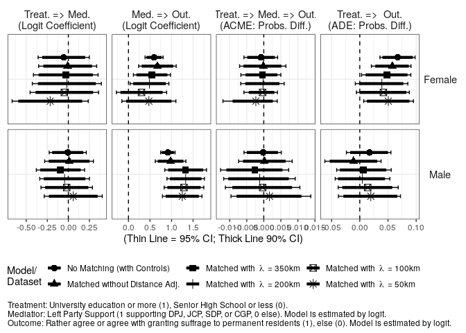
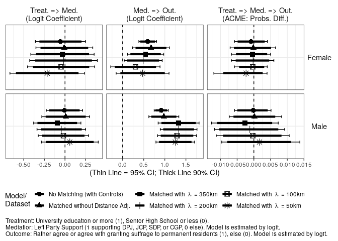

Analysis 7: Mediation Analysis with Left Party Support
================
Fan Lu & Gento Kato
Dec 31, 2019

# Preparation

``` r
## Clean Up Space
rm(list=ls())

## Set Working Directory (Automatically) ##
require(rstudioapi); require(rprojroot)
if (rstudioapi::isAvailable()==TRUE) {
  setwd(dirname(rstudioapi::getActiveDocumentContext()$path)); 
} 
projdir <- find_root(has_file("thisishome.txt"))
cat(paste("Working Directory Set to:\n",projdir))
```

    ## Working Directory Set to:
    ##  /home/gentok/Documents/Projects/ForeignerJapan

``` r
setwd(projdir)

## Load Image of Main Analysis
load(paste0(projdir,"/out/analysis_main_v4.RData"))

# Import Matched Data
sifcct_m1 <- readRDS("./data/sifcct_young_matched_1.rds")
sifcct_m2 <- readRDS("./data/sifcct_young_matched_2.rds")
sifcct_m3 <- readRDS("./data/sifcct_young_matched_3.rds")
sifcct_m4 <- readRDS("./data/sifcct_young_matched_4.rds")
sifcct_m5 <- readRDS("./data/sifcct_young_matched_5.rds")
head(sifcct$zip_pref)
```

    ## [1] "福井県" "東京都" "福井県" "埼玉県" "福岡県" "福井県"

``` r
# Replace zip_pref variable
sifcct_m1$zip_pref <- sifcct$zip_pref[match(sifcct_m1$zip,sifcct$zip)]
sifcct_m2$zip_pref <- sifcct$zip_pref[match(sifcct_m2$zip,sifcct$zip)]
sifcct_m3$zip_pref <- sifcct$zip_pref[match(sifcct_m3$zip,sifcct$zip)]
sifcct_m4$zip_pref <- sifcct$zip_pref[match(sifcct_m4$zip,sifcct$zip)]
sifcct_m5$zip_pref <- sifcct$zip_pref[match(sifcct_m5$zip,sifcct$zip)]


## packages
# devtools::install_github("gentok/estvis")
require(estvis)
require(multiwayvcov)
require(sandwich)
require(lmtest)
require(MASS)
require(ggplot2)
require(texreg)
require(mediation)
```

# Limit Data to Young People

``` r
table(sifcct$agecat)
```

    ## 
    ##        Young (<=30s) Middle Aged (40-50s)        Elder (>=60s) 
    ##                 8742                10432                 7122

``` r
sifcct <- sifcct[which(sifcct$agecat=="Young (<=30s)"),]

sifcct$wave <- as.factor(sifcct$wave)
sifcct_m1$wave <- as.factor(sifcct_m1$wave)
sifcct_m2$wave <- as.factor(sifcct_m2$wave)
sifcct_m3$wave <- as.factor(sifcct_m3$wave)
sifcct_m4$wave <- as.factor(sifcct_m4$wave)
sifcct_m5$wave <- as.factor(sifcct_m5$wave)

sifcct$foreignsuff_agree <- ifelse(sifcct$foreignsuff>=0.75,1,0)
sifcct_m1$foreignsuff_agree <- ifelse(sifcct_m1$foreignsuff>=0.75,1,0)
sifcct_m2$foreignsuff_agree <- ifelse(sifcct_m2$foreignsuff>=0.75,1,0)
sifcct_m3$foreignsuff_agree <- ifelse(sifcct_m3$foreignsuff>=0.75,1,0)
sifcct_m4$foreignsuff_agree <- ifelse(sifcct_m4$foreignsuff>=0.75,1,0)
sifcct_m5$foreignsuff_agree <- ifelse(sifcct_m5$foreignsuff>=0.75,1,0)

# Reverse Education Variable
sifcct$edu <- 1 - sifcct$edu
sifcct_m1$edu <- ifelse(sifcct_m1$edu=="<=SHS",1,0)
sifcct_m2$edu <- ifelse(sifcct_m2$edu=="<=SHS",1,0)
sifcct_m3$edu <- ifelse(sifcct_m3$edu=="<=SHS",1,0)
sifcct_m4$edu <- ifelse(sifcct_m4$edu=="<=SHS",1,0)
sifcct_m5$edu <- ifelse(sifcct_m5$edu=="<=SHS",1,0)

# Generate LPS FT Variable
summary(sifcct$left)
```

    ##    Min. 1st Qu.  Median    Mean 3rd Qu.    Max. 
    ##  0.0000  0.0000  0.0000  0.1278  0.0000  1.0000

``` r
sifcct_m1$left <- sifcct$left[match(sifcct_m1$id,sifcct$id)]
sifcct_m2$left <- sifcct$left[match(sifcct_m2$id,sifcct$id)]
sifcct_m3$left <- sifcct$left[match(sifcct_m3$id,sifcct$id)]
sifcct_m4$left <- sifcct$left[match(sifcct_m4$id,sifcct$id)]
sifcct_m5$left <- sifcct$left[match(sifcct_m5$id,sifcct$id)]
```

# Models

## SIFCCT (Original)

``` r
fdt <- sifcct[which(sifcct$female==1),]
mdt <- sifcct[which(sifcct$female==0),]

## Mediator Models
medf_LPS <- glm(left  ~ edu + knowledge + polint + employed + evecon + income + lvpr + wave, 
                data=fdt, family=binomial("logit"))
coeftest(medf_LPS, vcov.=vcovCL(medf_LPS,factor(fdt$zip_pref)))
```

    ## 
    ## z test of coefficients:
    ## 
    ##              Estimate Std. Error z value  Pr(>|z|)    
    ## (Intercept) -2.270159   0.264142 -8.5945 < 2.2e-16 ***
    ## edu          0.055106   0.154943  0.3557 0.7221018    
    ## knowledge   -0.181914   0.188335 -0.9659 0.3340916    
    ## polint       1.181184   0.292960  4.0319 5.533e-05 ***
    ## employed    -0.127227   0.105579 -1.2050 0.2281872    
    ## evecon       0.368125   0.278103  1.3237 0.1856028    
    ## income       0.320328   0.155820  2.0558 0.0398060 *  
    ## lvpr         0.036446   0.154235  0.2363 0.8131970    
    ## wave3       -0.450334   0.400518 -1.1244 0.2608515    
    ## wave4       -0.638880   0.302749 -2.1103 0.0348355 *  
    ## wave5       -0.589284   0.360374 -1.6352 0.1020064    
    ## wave6       -0.728065   0.385957 -1.8864 0.0592425 .  
    ## wave7       -0.253752   0.282446 -0.8984 0.3689666    
    ## wave8       -0.210297   0.261105 -0.8054 0.4205829    
    ## wave9       -0.170673   0.331838 -0.5143 0.6070251    
    ## wave10      -0.483405   0.309965 -1.5595 0.1188669    
    ## wave11      -0.380348   0.299211 -1.2712 0.2036684    
    ## wave12      -0.782109   0.322969 -2.4216 0.0154515 *  
    ## wave13      -0.980198   0.348998 -2.8086 0.0049756 ** 
    ## wave14      -0.492913   0.296664 -1.6615 0.0966090 .  
    ## wave15      -0.712861   0.487120 -1.4634 0.1433523    
    ## wave16      -0.891430   0.408668 -2.1813 0.0291607 *  
    ## wave17      -1.262916   0.437477 -2.8868 0.0038916 ** 
    ## wave18      -0.841675   0.382855 -2.1984 0.0279196 *  
    ## wave19      -0.654873   0.331330 -1.9765 0.0480981 *  
    ## wave20      -1.227844   0.317567 -3.8664 0.0001104 ***
    ## wave21      -0.676200   0.281074 -2.4058 0.0161382 *  
    ## wave22      -0.552516   0.205155 -2.6932 0.0070778 ** 
    ## ---
    ## Signif. codes:  0 '***' 0.001 '**' 0.01 '*' 0.05 '.' 0.1 ' ' 1

``` r
medm_LPS <- glm(left  ~ edu + knowledge + polint + employed + evecon + income + lvpr + wave, 
                data=mdt, family=binomial("logit"))
coeftest(medm_LPS, vcov.=vcovCL(medm_LPS,factor(mdt$zip_pref)))
```

    ## 
    ## z test of coefficients:
    ## 
    ##               Estimate Std. Error  z value  Pr(>|z|)    
    ## (Intercept) -2.9047097  0.2805208 -10.3547 < 2.2e-16 ***
    ## edu          0.0069768  0.1123871   0.0621   0.95050    
    ## knowledge    0.2927103  0.1665764   1.7572   0.07888 .  
    ## polint       0.7336402  0.1274572   5.7560 8.614e-09 ***
    ## employed     0.2160568  0.1408050   1.5344   0.12492    
    ## evecon       0.0174155  0.2144240   0.0812   0.93527    
    ## income       0.3614369  0.1713712   2.1091   0.03494 *  
    ## lvpr        -0.3284137  0.1375726  -2.3872   0.01698 *  
    ## wave3        0.2190161  0.2604829   0.8408   0.40046    
    ## wave4        0.4573166  0.2950564   1.5499   0.12116    
    ## wave5        0.5650818  0.2385782   2.3685   0.01786 *  
    ## wave6        0.1587976  0.2442566   0.6501   0.51561    
    ## wave7        0.3248935  0.2355353   1.3794   0.16778    
    ## wave8        0.1432691  0.3008663   0.4762   0.63394    
    ## wave9        0.4369550  0.2469202   1.7696   0.07679 .  
    ## wave10       0.2996606  0.2676781   1.1195   0.26293    
    ## wave11       0.1645102  0.2786438   0.5904   0.55493    
    ## wave12       0.2450918  0.2376206   1.0314   0.30233    
    ## wave13      -0.4316897  0.2634907  -1.6383   0.10135    
    ## wave14       0.2049480  0.2598741   0.7886   0.43032    
    ## wave15       0.0034188  0.2480790   0.0138   0.98900    
    ## wave16       0.1953385  0.3104292   0.6293   0.52918    
    ## wave17      -0.0486580  0.2285620  -0.2129   0.83141    
    ## wave18      -0.1722073  0.2746089  -0.6271   0.53059    
    ## wave19      -0.5135706  0.3013176  -1.7044   0.08830 .  
    ## wave20       0.2205701  0.3191532   0.6911   0.48950    
    ## wave21       0.0064677  0.2605006   0.0248   0.98019    
    ## wave22      -0.8474575  0.3870092  -2.1898   0.02854 *  
    ## ---
    ## Signif. codes:  0 '***' 0.001 '**' 0.01 '*' 0.05 '.' 0.1 ' ' 1

``` r
## Outcome Models 
outf_LPS <- glm(foreignsuff_agree  ~ edu + left + edu:left + 
                  knowledge + polint + employed + evecon + income + lvpr + wave, data=fdt, family=binomial("logit"))
coeftest(outf_LPS, vcov.=vcovCL(outf_LPS,factor(fdt$zip_pref)))
```

    ## 
    ## z test of coefficients:
    ## 
    ##              Estimate Std. Error z value  Pr(>|z|)    
    ## (Intercept) -0.556357   0.227194 -2.4488  0.014333 *  
    ## edu         -0.325935   0.076562 -4.2571 2.071e-05 ***
    ## left         0.594499   0.106636  5.5750 2.475e-08 ***
    ## knowledge   -0.107653   0.134424 -0.8008  0.423223    
    ## polint       0.271631   0.147099  1.8466  0.064807 .  
    ## employed     0.019752   0.077556  0.2547  0.798970    
    ## evecon       0.548850   0.193963  2.8297  0.004660 ** 
    ## income      -0.055494   0.139778 -0.3970  0.691354    
    ## lvpr        -0.134402   0.119877 -1.1212  0.262217    
    ## wave3       -0.301717   0.198195 -1.5223  0.127928    
    ## wave4       -0.274258   0.220703 -1.2427  0.213994    
    ## wave5       -0.273427   0.179396 -1.5242  0.127470    
    ## wave6       -0.019318   0.191179 -0.1010  0.919514    
    ## wave7       -0.160208   0.203914 -0.7857  0.432066    
    ## wave8       -0.361060   0.204397 -1.7665  0.077318 .  
    ## wave9       -0.579398   0.227086 -2.5514  0.010728 *  
    ## wave10      -0.296388   0.237786 -1.2465  0.212599    
    ## wave11      -0.648770   0.233248 -2.7815  0.005411 ** 
    ## wave12      -0.316120   0.181905 -1.7378  0.082240 .  
    ## wave13      -0.483092   0.213394 -2.2638  0.023583 *  
    ## wave14      -0.428656   0.222330 -1.9280  0.053853 .  
    ## wave15      -0.440062   0.174619 -2.5201  0.011731 *  
    ## wave16      -0.386941   0.176487 -2.1925  0.028346 *  
    ## wave17      -0.555763   0.198214 -2.8039  0.005050 ** 
    ## wave18      -0.314947   0.192980 -1.6320  0.102676    
    ## wave19      -0.520072   0.206648 -2.5167  0.011846 *  
    ## wave20      -0.315343   0.190630 -1.6542  0.098084 .  
    ## wave21      -0.558117   0.228086 -2.4470  0.014407 *  
    ## wave22      -0.140047   0.192128 -0.7289  0.466045    
    ## edu:left     0.095719   0.205066  0.4668  0.640664    
    ## ---
    ## Signif. codes:  0 '***' 0.001 '**' 0.01 '*' 0.05 '.' 0.1 ' ' 1

``` r
outm_LPS <- glm(foreignsuff_agree  ~ edu + left + edu:left + 
                  knowledge + polint + employed + evecon + income + lvpr + wave, data=mdt, family=binomial("logit"))
coeftest(outm_LPS, vcov.=vcovCL(outm_LPS,factor(mdt$zip_pref)))
```

    ## 
    ## z test of coefficients:
    ## 
    ##              Estimate Std. Error z value  Pr(>|z|)    
    ## (Intercept) -1.330957   0.206181 -6.4553 1.080e-10 ***
    ## edu         -0.073054   0.111964 -0.6525  0.514091    
    ## left         0.914868   0.085050 10.7568 < 2.2e-16 ***
    ## knowledge   -0.512773   0.116169 -4.4140 1.015e-05 ***
    ## polint      -0.106225   0.166185 -0.6392  0.522696    
    ## employed     0.187538   0.099973  1.8759  0.060672 .  
    ## evecon       0.166200   0.201937  0.8230  0.410491    
    ## income       0.345178   0.117790  2.9304  0.003385 ** 
    ## lvpr        -0.316546   0.078189 -4.0485 5.155e-05 ***
    ## wave3        0.046913   0.265083  0.1770  0.859527    
    ## wave4        0.026031   0.239421  0.1087  0.913422    
    ## wave5        0.217488   0.180649  1.2039  0.228617    
    ## wave6        0.208049   0.218443  0.9524  0.340885    
    ## wave7        0.323854   0.223432  1.4495  0.147210    
    ## wave8        0.338212   0.275828  1.2262  0.220135    
    ## wave9        0.233773   0.223214  1.0473  0.294959    
    ## wave10       0.374008   0.214339  1.7449  0.080996 .  
    ## wave11       0.276455   0.196653  1.4058  0.159782    
    ## wave12       0.300059   0.230898  1.2995  0.193762    
    ## wave13       0.055302   0.282275  0.1959  0.844676    
    ## wave14       0.109000   0.238641  0.4568  0.647849    
    ## wave15       0.041921   0.267451  0.1567  0.875447    
    ## wave16       0.329625   0.250916  1.3137  0.188953    
    ## wave17       0.265006   0.223033  1.1882  0.234759    
    ## wave18       0.194757   0.195080  0.9983  0.318112    
    ## wave19       0.183200   0.208881  0.8771  0.380457    
    ## wave20       0.300418   0.295590  1.0163  0.309471    
    ## wave21       0.057325   0.265800  0.2157  0.829244    
    ## wave22       0.275269   0.302089  0.9112  0.362180    
    ## edu:left    -0.120624   0.191356 -0.6304  0.528456    
    ## ---
    ## Signif. codes:  0 '***' 0.001 '**' 0.01 '*' 0.05 '.' 0.1 ' ' 1

``` r
## Causal Mediation Analysis
set.seed(2345)
medoutf_LPS <- mediate(medf_LPS, outf_LPS, treat = "edu", 
                       mediator = "left", 
                       cluster=factor(fdt$zip_pref))
summary(medoutf_LPS)
```

    ## 
    ## Causal Mediation Analysis 
    ## 
    ## Quasi-Bayesian Confidence Intervals
    ## 
    ##                           Estimate 95% CI Lower 95% CI Upper p-value    
    ## ACME (control)            0.000838    -0.004062         0.01    0.75    
    ## ACME (treated)            0.000897    -0.005037         0.01    0.76    
    ## ADE (control)            -0.067232    -0.097964        -0.04  <2e-16 ***
    ## ADE (treated)            -0.067174    -0.097955        -0.04  <2e-16 ***
    ## Total Effect             -0.066335    -0.097096        -0.03  <2e-16 ***
    ## Prop. Mediated (control) -0.011827    -0.119265         0.06    0.75    
    ## Prop. Mediated (treated) -0.011313    -0.144300         0.07    0.76    
    ## ACME (average)            0.000867    -0.004567         0.01    0.76    
    ## ADE (average)            -0.067203    -0.097827        -0.04  <2e-16 ***
    ## Prop. Mediated (average) -0.011570    -0.130907         0.07    0.76    
    ## ---
    ## Signif. codes:  0 '***' 0.001 '**' 0.01 '*' 0.05 '.' 0.1 ' ' 1
    ## 
    ## Sample Size Used: 3989 
    ## 
    ## 
    ## Simulations: 1000

``` r
set.seed(2345)
medoutm_LPS <- mediate(medm_LPS, outm_LPS, treat = "edu", 
                       mediator = "left", 
                       cluster=factor(mdt$zip_pref))
summary(medoutm_LPS)
```

    ## 
    ## Causal Mediation Analysis 
    ## 
    ## Quasi-Bayesian Confidence Intervals
    ## 
    ##                           Estimate 95% CI Lower 95% CI Upper p-value
    ## ACME (control)            0.000174    -0.005139         0.01    0.98
    ## ACME (treated)            0.000136    -0.004618         0.01    0.98
    ## ADE (control)            -0.017129    -0.055197         0.02    0.42
    ## ADE (treated)            -0.017167    -0.055095         0.02    0.42
    ## Total Effect             -0.016993    -0.055605         0.02    0.43
    ## Prop. Mediated (control)  0.003722    -1.351875         0.96    0.98
    ## Prop. Mediated (treated)  0.002771    -1.292242         0.83    0.98
    ## ACME (average)            0.000155    -0.004659         0.01    0.98
    ## ADE (average)            -0.017148    -0.054840         0.02    0.42
    ## Prop. Mediated (average)  0.003247    -1.341009         0.89    0.98
    ## 
    ## Sample Size Used: 4737 
    ## 
    ## 
    ## Simulations: 1000

## Matched without Distance Adjustment

``` r
fdt_m1 <- sifcct_m1[which(sifcct_m1$female==1),]
mdt_m1 <- sifcct_m1[which(sifcct_m1$female==0),]

## Mediator Models
medf_LPS_m1 <- glm(left  ~ edu + #,
                     knowledge + polint + employed + evecon + income + lvpr + wave, 
                   data=fdt_m1, family=binomial("logit"))
coeftest(medf_LPS_m1, vcov.=vcovCL(medf_LPS_m1, factor(fdt_m1$zip_pref)))
```

    ## 
    ## z test of coefficients:
    ## 
    ##               Estimate Std. Error z value  Pr(>|z|)    
    ## (Intercept) -2.5490162  0.3684430 -6.9183 4.569e-12 ***
    ## edu          0.0080137  0.1757033  0.0456   0.96362    
    ## knowledge   -0.5890754  0.4007740 -1.4698   0.14160    
    ## polint       1.7032814  0.3767458  4.5210 6.154e-06 ***
    ## employed    -0.2334160  0.1800511 -1.2964   0.19484    
    ## evecon      -0.1444249  0.3715777 -0.3887   0.69751    
    ## income       0.2922920  0.2793725  1.0462   0.29545    
    ## lvpr         0.0461670  0.2063932  0.2237   0.82300    
    ## wave3        0.0031730  0.3780332  0.0084   0.99330    
    ## wave4       -0.4704879  0.4151415 -1.1333   0.25708    
    ## wave5       -0.1973687  0.4852516 -0.4067   0.68420    
    ## wave6       -0.4948808  0.4769932 -1.0375   0.29950    
    ## wave7        0.0383953  0.3917742  0.0980   0.92193    
    ## wave8        0.0843907  0.3988442  0.2116   0.83243    
    ## wave9        0.6318565  0.3701415  1.7071   0.08781 .  
    ## wave10       0.1668930  0.4053968  0.4117   0.68058    
    ## wave11      -0.2455580  0.4811852 -0.5103   0.60983    
    ## wave12      -0.5051001  0.4393343 -1.1497   0.25027    
    ## wave13      -1.2581899  0.6171097 -2.0388   0.04147 *  
    ## wave14      -0.3624913  0.6012940 -0.6029   0.54661    
    ## wave15      -0.1748593  0.4994318 -0.3501   0.72625    
    ## wave16      -0.3747374  0.6532264 -0.5737   0.56619    
    ## wave17      -1.0210440  0.4610424 -2.2146   0.02678 *  
    ## wave18      -0.5763338  0.4736954 -1.2167   0.22373    
    ## wave19      -0.5882104  0.4028413 -1.4602   0.14425    
    ## wave20      -0.8086509  0.4863343 -1.6627   0.09636 .  
    ## wave21      -0.1816357  0.3641685 -0.4988   0.61794    
    ## wave22      -0.0319699  0.3124804 -0.1023   0.91851    
    ## ---
    ## Signif. codes:  0 '***' 0.001 '**' 0.01 '*' 0.05 '.' 0.1 ' ' 1

``` r
medm_LPS_m1 <- glm(left  ~ edu + #,
                     knowledge + polint + employed + evecon + income + lvpr + wave, 
                   data=mdt_m1, family=binomial("logit"))
coeftest(medm_LPS_m1, vcov.=vcovCL(medm_LPS_m1,factor(mdt_m1$zip_pref)))
```

    ## 
    ## z test of coefficients:
    ## 
    ##               Estimate Std. Error z value  Pr(>|z|)    
    ## (Intercept) -2.6928929  0.4774019 -5.6407 1.693e-08 ***
    ## edu         -0.0083813  0.1476768 -0.0568   0.95474    
    ## knowledge    0.0017706  0.2133919  0.0083   0.99338    
    ## polint       0.6763917  0.2892700  2.3383   0.01937 *  
    ## employed     0.0965667  0.2323009  0.4157   0.67763    
    ## evecon       0.1358265  0.2884385  0.4709   0.63771    
    ## income       0.2326682  0.3710691  0.6270   0.53065    
    ## lvpr        -0.3041337  0.2481685 -1.2255   0.22038    
    ## wave3        0.7368313  0.4528875  1.6270   0.10374    
    ## wave4        0.8027174  0.4125842  1.9456   0.05170 .  
    ## wave5        0.6915134  0.3379814  2.0460   0.04076 *  
    ## wave6        0.4085803  0.4533881  0.9012   0.36750    
    ## wave7        0.2133971  0.4886647  0.4367   0.66233    
    ## wave8        0.5681162  0.4255419  1.3350   0.18186    
    ## wave9        0.4752334  0.3854523  1.2329   0.21760    
    ## wave10       0.3438259  0.3803914  0.9039   0.36606    
    ## wave11      -0.1836765  0.5606404 -0.3276   0.74320    
    ## wave12      -0.0398175  0.5033787 -0.0791   0.93695    
    ## wave13      -0.0809367  0.4610168 -0.1756   0.86064    
    ## wave14      -0.0039645  0.5678551 -0.0070   0.99443    
    ## wave15       0.1054509  0.4636325  0.2274   0.82008    
    ## wave16       0.4146017  0.4613167  0.8987   0.36879    
    ## wave17      -0.0428874  0.3528409 -0.1215   0.90326    
    ## wave18       0.3320460  0.4863540  0.6827   0.49478    
    ## wave19      -0.6731518  0.6572544 -1.0242   0.30575    
    ## wave20       0.5696658  0.4745747  1.2004   0.23000    
    ## wave21      -0.1302157  0.4061143 -0.3206   0.74848    
    ## wave22      -0.6796645  0.6111260 -1.1122   0.26607    
    ## ---
    ## Signif. codes:  0 '***' 0.001 '**' 0.01 '*' 0.05 '.' 0.1 ' ' 1

``` r
## Outcome Models
outf_LPS_m1 <- glm(foreignsuff_agree  ~ edu + left + edu:left + #,
                     knowledge + polint + employed + evecon + income + lvpr + wave, 
                   data=fdt_m1, family=binomial("logit"))
coeftest(outf_LPS_m1, vcov.=vcovCL(outf_LPS_m1,factor(fdt_m1$zip_pref)))
```

    ## 
    ## z test of coefficients:
    ## 
    ##               Estimate Std. Error z value Pr(>|z|)   
    ## (Intercept) -0.7859556  0.2742002 -2.8664 0.004152 **
    ## edu         -0.2829789  0.0945761 -2.9921 0.002771 **
    ## left         0.6722489  0.2223903  3.0228 0.002504 **
    ## knowledge    0.1550751  0.2837709  0.5465 0.584736   
    ## polint       0.4563400  0.1943286  2.3483 0.018860 * 
    ## employed     0.1136330  0.1277543  0.8895 0.373753   
    ## evecon       0.3571504  0.2127991  1.6783 0.093280 . 
    ## income      -0.1563761  0.2478567 -0.6309 0.528097   
    ## lvpr        -0.2439209  0.1756781 -1.3885 0.164999   
    ## wave3       -0.5086633  0.4387157 -1.1594 0.246278   
    ## wave4       -0.0120975  0.3061492 -0.0395 0.968480   
    ## wave5       -0.2677979  0.2950737 -0.9076 0.364109   
    ## wave6        0.2460319  0.3016990  0.8155 0.414793   
    ## wave7       -0.2895577  0.2607843 -1.1103 0.266855   
    ## wave8       -0.3962574  0.3994429 -0.9920 0.321185   
    ## wave9       -0.5753929  0.3386731 -1.6990 0.089326 . 
    ## wave10      -0.0012013  0.3571509 -0.0034 0.997316   
    ## wave11      -0.6338647  0.2721170 -2.3294 0.019839 * 
    ## wave12      -0.2372520  0.3030047 -0.7830 0.433628   
    ## wave13      -0.3243036  0.3661203 -0.8858 0.375734   
    ## wave14      -0.3054041  0.4597753 -0.6642 0.506533   
    ## wave15      -0.3152589  0.3249193 -0.9703 0.331913   
    ## wave16      -0.2780504  0.2659589 -1.0455 0.295809   
    ## wave17      -0.2976535  0.3614522 -0.8235 0.410227   
    ## wave18      -0.3936355  0.2971472 -1.3247 0.185266   
    ## wave19      -0.2288298  0.2875921 -0.7957 0.426221   
    ## wave20      -0.0253603  0.2836629 -0.0894 0.928762   
    ## wave21      -0.4768024  0.2782780 -1.7134 0.086638 . 
    ## wave22       0.1768494  0.3081608  0.5739 0.566044   
    ## edu:left     0.0504594  0.3144309  0.1605 0.872504   
    ## ---
    ## Signif. codes:  0 '***' 0.001 '**' 0.01 '*' 0.05 '.' 0.1 ' ' 1

``` r
outm_LPS_m1 <- glm(foreignsuff_agree  ~ edu + left + edu:left + #,
                     knowledge + polint + employed + evecon + income + lvpr + wave, 
                   data=mdt_m1, family=binomial("logit"))
coeftest(outm_LPS_m1, vcov.=vcovCL(outm_LPS_m1,factor(mdt_m1$zip_pref)))
```

    ## 
    ## z test of coefficients:
    ## 
    ##              Estimate Std. Error z value  Pr(>|z|)    
    ## (Intercept) -1.487218   0.280264 -5.3065 1.118e-07 ***
    ## edu          0.103841   0.150594  0.6895   0.49048    
    ## left         0.977141   0.181162  5.3937 6.901e-08 ***
    ## knowledge   -0.679053   0.170553 -3.9815 6.848e-05 ***
    ## polint       0.292678   0.222440  1.3158   0.18826    
    ## employed     0.335478   0.184019  1.8231   0.06829 .  
    ## evecon       0.254236   0.322180  0.7891   0.43005    
    ## income       0.217161   0.225121  0.9646   0.33473    
    ## lvpr        -0.357396   0.139372 -2.5643   0.01034 *  
    ## wave3       -0.169385   0.371955 -0.4554   0.64883    
    ## wave4        0.016335   0.474125  0.0345   0.97252    
    ## wave5       -0.368163   0.390301 -0.9433   0.34554    
    ## wave6        0.257203   0.407149  0.6317   0.52757    
    ## wave7        0.144220   0.338087  0.4266   0.66969    
    ## wave8       -0.134537   0.411003 -0.3273   0.74341    
    ## wave9       -0.511769   0.439450 -1.1646   0.24419    
    ## wave10       0.220659   0.375840  0.5871   0.55713    
    ## wave11       0.325908   0.371213  0.8780   0.37997    
    ## wave12       0.084792   0.358210  0.2367   0.81288    
    ## wave13      -0.141304   0.511462 -0.2763   0.78234    
    ## wave14      -0.055546   0.410059 -0.1355   0.89225    
    ## wave15      -0.470322   0.435097 -1.0810   0.27972    
    ## wave16       0.032307   0.434566  0.0743   0.94074    
    ## wave17      -0.054473   0.497479 -0.1095   0.91281    
    ## wave18       0.118067   0.388995  0.3035   0.76150    
    ## wave19      -0.029323   0.428518 -0.0684   0.94544    
    ## wave20      -0.233381   0.406756 -0.5738   0.56613    
    ## wave21      -0.370250   0.457265 -0.8097   0.41811    
    ## wave22      -0.548346   0.549198 -0.9984   0.31806    
    ## edu:left    -0.180916   0.280165 -0.6457   0.51844    
    ## ---
    ## Signif. codes:  0 '***' 0.001 '**' 0.01 '*' 0.05 '.' 0.1 ' ' 1

``` r
## Causal Mediation Analysis
set.seed(2345)
medoutf_LPS_m1 <- mediate(medf_LPS_m1, outf_LPS_m1, treat = "edu", 
                          mediator = "left", 
                          cluster=factor(fdt_m1$zip_pref))
summary(medoutf_LPS_m1)
```

    ## 
    ## Causal Mediation Analysis 
    ## 
    ## Quasi-Bayesian Confidence Intervals
    ## 
    ##                           Estimate 95% CI Lower 95% CI Upper p-value   
    ## ACME (control)            0.000141    -0.006497         0.01   0.966   
    ## ACME (treated)            0.000105    -0.006346         0.01   0.958   
    ## ADE (control)            -0.057843    -0.090813        -0.02   0.002 **
    ## ADE (treated)            -0.057878    -0.091151        -0.02   0.002 **
    ## Total Effect             -0.057737    -0.091434        -0.02   0.002 **
    ## Prop. Mediated (control) -0.001927    -0.188818         0.12   0.968   
    ## Prop. Mediated (treated) -0.001631    -0.183502         0.13   0.960   
    ## ACME (average)            0.000123    -0.006228         0.01   0.966   
    ## ADE (average)            -0.057860    -0.091004        -0.02   0.002 **
    ## Prop. Mediated (average) -0.001779    -0.173817         0.13   0.968   
    ## ---
    ## Signif. codes:  0 '***' 0.001 '**' 0.01 '*' 0.05 '.' 0.1 ' ' 1
    ## 
    ## Sample Size Used: 1784 
    ## 
    ## 
    ## Simulations: 1000

``` r
set.seed(2345)
medoutm_LPS_m1 <- mediate(medm_LPS_m1, outm_LPS_m1, treat = "edu", 
                          mediator = "left", 
                          cluster=factor(mdt_m1$zip_pref))
summary(medoutm_LPS_m1)
```

    ## 
    ## Causal Mediation Analysis 
    ## 
    ## Quasi-Bayesian Confidence Intervals
    ## 
    ##                           Estimate 95% CI Lower 95% CI Upper p-value
    ## ACME (control)           -0.000142    -0.008332         0.01    0.95
    ## ACME (treated)           -0.000109    -0.006630         0.01    0.95
    ## ADE (control)             0.011396    -0.037710         0.06    0.66
    ## ADE (treated)             0.011429    -0.037136         0.06    0.67
    ## Total Effect              0.011287    -0.037966         0.06    0.66
    ## Prop. Mediated (control)  0.020200    -1.680798         2.37    0.92
    ## Prop. Mediated (treated)  0.016283    -1.174507         2.04    0.91
    ## ACME (average)           -0.000126    -0.007231         0.01    0.96
    ## ADE (average)             0.011412    -0.037413         0.06    0.66
    ## Prop. Mediated (average)  0.018242    -1.427709         2.19    0.91
    ## 
    ## Sample Size Used: 1674 
    ## 
    ## 
    ## Simulations: 1000

## Matched with Distance Adjustment (Lambda=50km)

``` r
fdt_m2 <- sifcct_m2[which(sifcct_m2$female==1),]
mdt_m2 <- sifcct_m2[which(sifcct_m2$female==0),]

## Mediator Models
medf_LPS_m2 <- glm(left  ~ edu + #,
                     knowledge + polint + employed + evecon + income + lvpr + wave, 
                   data=fdt_m2, family=binomial("logit"))
coeftest(medf_LPS_m2, vcov.=vcovCL(medf_LPS_m2, factor(fdt_m2$zip_pref)))
```

    ## 
    ## z test of coefficients:
    ## 
    ##               Estimate Std. Error z value  Pr(>|z|)    
    ## (Intercept) -2.3830027  0.4989720 -4.7758  1.79e-06 ***
    ## edu          0.2155379  0.2305902  0.9347 0.3499313    
    ## knowledge   -0.8380235  0.4555253 -1.8397 0.0658143 .  
    ## polint       1.4703368  0.4310013  3.4114 0.0006462 ***
    ## employed     0.0010776  0.2246325  0.0048 0.9961723    
    ## evecon       0.0225967  0.3668929  0.0616 0.9508898    
    ## income       0.2694455  0.3534734  0.7623 0.4458932    
    ## lvpr         0.4990084  0.2792854  1.7867 0.0739807 .  
    ## wave3       -0.1825053  0.4129611 -0.4419 0.6585305    
    ## wave4       -0.6863881  0.5918634 -1.1597 0.2461682    
    ## wave5       -1.7353329  0.7523800 -2.3065 0.0210850 *  
    ## wave6       -0.8012877  0.4993866 -1.6045 0.1085943    
    ## wave7       -0.2342150  0.3714854 -0.6305 0.5283789    
    ## wave8       -0.6329168  0.4084772 -1.5495 0.1212726    
    ## wave9        0.0277360  0.3140736  0.0883 0.9296299    
    ## wave10      -0.3361251  0.4146303 -0.8107 0.4175597    
    ## wave11      -0.7542791  0.6105864 -1.2353 0.2167057    
    ## wave12      -0.6401160  0.5490845 -1.1658 0.2437003    
    ## wave13      -1.5180140  0.7877114 -1.9271 0.0539648 .  
    ## wave14      -0.5861973  0.5617840 -1.0435 0.2967368    
    ## wave15      -0.4719063  0.5811179 -0.8121 0.4167536    
    ## wave16      -1.3560247  0.8115549 -1.6709 0.0947420 .  
    ## wave17      -1.7598871  0.5935352 -2.9651 0.0030259 ** 
    ## wave18      -0.4871200  0.5313038 -0.9168 0.3592271    
    ## wave19      -0.8728120  0.4186699 -2.0847 0.0370942 *  
    ## wave20      -0.9790150  0.6387502 -1.5327 0.1253488    
    ## wave21      -0.7083277  0.3324025 -2.1309 0.0330946 *  
    ## wave22      -0.0588102  0.3302909 -0.1781 0.8586792    
    ## ---
    ## Signif. codes:  0 '***' 0.001 '**' 0.01 '*' 0.05 '.' 0.1 ' ' 1

``` r
medm_LPS_m2 <- glm(left  ~ edu + #,
                     knowledge + polint + employed + evecon + income + lvpr + wave, 
                   data=mdt_m2, family=binomial("logit"))
coeftest(medm_LPS_m2, vcov.=vcovCL(medm_LPS_m2,factor(mdt_m2$zip_pref)))
```

    ## 
    ## z test of coefficients:
    ## 
    ##              Estimate Std. Error z value  Pr(>|z|)    
    ## (Intercept) -2.628126   0.554791 -4.7371 2.167e-06 ***
    ## edu         -0.058060   0.175880 -0.3301 0.7413169    
    ## knowledge    0.571829   0.245011  2.3339 0.0196013 *  
    ## polint       0.883790   0.252006  3.5070 0.0004531 ***
    ## employed    -0.145943   0.467977 -0.3119 0.7551472    
    ## evecon      -0.033881   0.548921 -0.0617 0.9507835    
    ## income       0.187440   0.359727  0.5211 0.6023231    
    ## lvpr        -0.327840   0.248786 -1.3178 0.1875844    
    ## wave3        0.480023   0.517426  0.9277 0.3535563    
    ## wave4        0.674569   0.401767  1.6790 0.0931506 .  
    ## wave5        0.483838   0.419562  1.1532 0.2488289    
    ## wave6       -0.781922   0.718393 -1.0884 0.2764039    
    ## wave7        0.371307   0.371524  0.9994 0.3175933    
    ## wave8        0.221605   0.462161  0.4795 0.6315853    
    ## wave9        0.534191   0.409379  1.3049 0.1919327    
    ## wave10       0.132426   0.392130  0.3377 0.7355818    
    ## wave11       0.125650   0.532416  0.2360 0.8134327    
    ## wave12       0.015078   0.508330  0.0297 0.9763370    
    ## wave13      -0.655291   0.599747 -1.0926 0.2745639    
    ## wave14       0.245010   0.485836  0.5043 0.6140468    
    ## wave15      -0.291025   0.400555 -0.7266 0.4674994    
    ## wave16      -0.047089   0.480411 -0.0980 0.9219171    
    ## wave17      -0.053605   0.324270 -0.1653 0.8687005    
    ## wave18      -0.287410   0.425035 -0.6762 0.4989108    
    ## wave19      -1.991506   1.105016 -1.8022 0.0715073 .  
    ## wave20       0.375204   0.596044  0.6295 0.5290279    
    ## wave21       0.315940   0.482807  0.6544 0.5128660    
    ## wave22      -0.738039   0.560256 -1.3173 0.1877299    
    ## ---
    ## Signif. codes:  0 '***' 0.001 '**' 0.01 '*' 0.05 '.' 0.1 ' ' 1

``` r
## Outcome Models
outf_LPS_m2 <- glm(foreignsuff_agree  ~ edu + left + edu:left + #,
                     knowledge + polint + employed + evecon + income + lvpr + wave, 
                   data=fdt_m2, family=binomial("logit"))
coeftest(outf_LPS_m2, vcov.=vcovCL(outf_LPS_m2,factor(fdt_m2$zip_pref)))
```

    ## 
    ## z test of coefficients:
    ## 
    ##              Estimate Std. Error z value  Pr(>|z|)    
    ## (Intercept) -1.242790   0.342614 -3.6274 0.0002863 ***
    ## edu         -0.290676   0.118655 -2.4498 0.0142951 *  
    ## left         0.472799   0.320033  1.4773 0.1395834    
    ## knowledge   -0.306279   0.385526 -0.7944 0.4269372    
    ## polint       0.834205   0.221495  3.7663 0.0001657 ***
    ## employed    -0.008417   0.122401 -0.0688 0.9451758    
    ## evecon       0.083352   0.206721  0.4032 0.6867944    
    ## income      -0.328075   0.417398 -0.7860 0.4318677    
    ## lvpr        -0.309232   0.217346 -1.4228 0.1548054    
    ## wave3        0.151359   0.586288  0.2582 0.7962803    
    ## wave4        0.556385   0.419433  1.3265 0.1846678    
    ## wave5       -0.556835   0.325855 -1.7088 0.0874806 .  
    ## wave6        0.438412   0.399857  1.0964 0.2728932    
    ## wave7        0.724872   0.382161  1.8968 0.0578580 .  
    ## wave8        0.610447   0.332095  1.8382 0.0660376 .  
    ## wave9        0.146384   0.449791  0.3254 0.7448422    
    ## wave10       0.201141   0.529755  0.3797 0.7041773    
    ## wave11       0.190959   0.372086  0.5132 0.6078027    
    ## wave12       0.541590   0.447109  1.2113 0.2257742    
    ## wave13      -0.179901   0.388121 -0.4635 0.6429922    
    ## wave14       0.470885   0.502657  0.9368 0.3488656    
    ## wave15       0.480477   0.374378  1.2834 0.1993518    
    ## wave16       0.473677   0.345917  1.3693 0.1708946    
    ## wave17      -0.264242   0.460374 -0.5740 0.5659861    
    ## wave18       0.592599   0.216494  2.7373 0.0061955 ** 
    ## wave19       0.445154   0.488082  0.9120 0.3617436    
    ## wave20       0.669330   0.303952  2.2021 0.0276591 *  
    ## wave21       0.592599   0.360119  1.6456 0.0998532 .  
    ## wave22       0.556581   0.366849  1.5172 0.1292170    
    ## edu:left     0.328689   0.426145  0.7713 0.4405243    
    ## ---
    ## Signif. codes:  0 '***' 0.001 '**' 0.01 '*' 0.05 '.' 0.1 ' ' 1

``` r
outm_LPS_m2 <- glm(foreignsuff_agree  ~ edu+ left + edu:left + #,
                     knowledge + polint + employed + evecon + income + lvpr + wave, 
                   data=mdt_m2, family=binomial("logit"))
coeftest(outm_LPS_m2, vcov.=vcovCL(outm_LPS_m2,factor(mdt_m2$zip_pref)))
```

    ## 
    ## z test of coefficients:
    ## 
    ##              Estimate Std. Error z value  Pr(>|z|)    
    ## (Intercept) -2.038589   0.348173 -5.8551 4.767e-09 ***
    ## edu         -0.010139   0.157936 -0.0642  0.948816    
    ## left         1.248542   0.233958  5.3366 9.470e-08 ***
    ## knowledge   -0.228284   0.228048 -1.0010  0.316810    
    ## polint       0.165879   0.253303  0.6549  0.512556    
    ## employed     0.375843   0.251614  1.4937  0.135247    
    ## evecon       0.472153   0.393556  1.1997  0.230251    
    ## income       0.698928   0.244456  2.8591  0.004248 ** 
    ## lvpr        -0.441253   0.179823 -2.4538  0.014135 *  
    ## wave3        0.194690   0.404413  0.4814  0.630222    
    ## wave4        0.023335   0.466804  0.0500  0.960132    
    ## wave5        0.059688   0.525920  0.1135  0.909639    
    ## wave6        0.118352   0.533218  0.2220  0.824347    
    ## wave7        0.398907   0.439106  0.9085  0.363638    
    ## wave8        0.145289   0.444887  0.3266  0.743989    
    ## wave9       -0.089543   0.456718 -0.1961  0.844566    
    ## wave10       0.240293   0.435721  0.5515  0.581302    
    ## wave11       0.385273   0.456390  0.8442  0.398572    
    ## wave12       0.255139   0.366084  0.6969  0.485840    
    ## wave13       0.219889   0.596773  0.3685  0.712528    
    ## wave14      -0.229926   0.386681 -0.5946  0.552100    
    ## wave15      -0.157622   0.469895 -0.3354  0.737292    
    ## wave16       0.047485   0.461894  0.1028  0.918118    
    ## wave17       0.476423   0.453359  1.0509  0.293317    
    ## wave18       0.411793   0.322302  1.2777  0.201368    
    ## wave19       0.428172   0.458014  0.9348  0.349869    
    ## wave20       0.173565   0.487712  0.3559  0.721934    
    ## wave21      -0.260892   0.501894 -0.5198  0.603192    
    ## wave22       0.409567   0.467581  0.8759  0.381070    
    ## edu:left    -0.541661   0.355819 -1.5223  0.127936    
    ## ---
    ## Signif. codes:  0 '***' 0.001 '**' 0.01 '*' 0.05 '.' 0.1 ' ' 1

``` r
## Causal Mediation Analysis
set.seed(2345)
medoutf_LPS_m2 <- mediate(medf_LPS_m2, outf_LPS_m2, treat = "edu", 
                          mediator = "left", 
                          cluster=factor(fdt_m2$zip_pref))
summary(medoutf_LPS_m2)
```

    ## 
    ## Causal Mediation Analysis 
    ## 
    ## Quasi-Bayesian Confidence Intervals
    ## 
    ##                          Estimate 95% CI Lower 95% CI Upper p-value  
    ## ACME (control)            0.00233     -0.00395         0.01   0.524  
    ## ACME (treated)            0.00366     -0.00530         0.02   0.414  
    ## ADE (control)            -0.05055     -0.09514        -0.01   0.024 *
    ## ADE (treated)            -0.04923     -0.09429         0.00   0.030 *
    ## Total Effect             -0.04690     -0.09301         0.00   0.036 *
    ## Prop. Mediated (control) -0.03438     -0.43121         0.12   0.540  
    ## Prop. Mediated (treated) -0.06262     -0.76515         0.23   0.450  
    ## ACME (average)            0.00299     -0.00458         0.01   0.412  
    ## ADE (average)            -0.04989     -0.09454        -0.01   0.026 *
    ## Prop. Mediated (average) -0.04850     -0.57175         0.14   0.448  
    ## ---
    ## Signif. codes:  0 '***' 0.001 '**' 0.01 '*' 0.05 '.' 0.1 ' ' 1
    ## 
    ## Sample Size Used: 1162 
    ## 
    ## 
    ## Simulations: 1000

``` r
set.seed(2345)
medoutm_LPS_m2 <- mediate(medm_LPS_m2, outm_LPS_m2, treat = "edu", 
                          mediator = "left", 
                          cluster=factor(mdt_m2$zip_pref))
summary(medoutm_LPS_m2)
```

    ## 
    ## Causal Mediation Analysis 
    ## 
    ## Quasi-Bayesian Confidence Intervals
    ## 
    ##                           Estimate 95% CI Lower 95% CI Upper p-value
    ## ACME (control)           -0.001685    -0.013780         0.01    0.76
    ## ACME (treated)           -0.000906    -0.008332         0.01    0.77
    ## ADE (control)            -0.019614    -0.072134         0.04    0.51
    ## ADE (treated)            -0.018835    -0.070729         0.04    0.52
    ## Total Effect             -0.020520    -0.074213         0.04    0.48
    ## Prop. Mediated (control)  0.039123    -1.853236         1.88    0.84
    ## Prop. Mediated (treated)  0.015840    -1.365422         1.13    0.84
    ## ACME (average)           -0.001296    -0.010455         0.01    0.76
    ## ADE (average)            -0.019225    -0.071231         0.04    0.52
    ## Prop. Mediated (average)  0.027482    -1.591927         1.57    0.84
    ## 
    ## Sample Size Used: 1252 
    ## 
    ## 
    ## Simulations: 1000

## Matched with Distance Adjustment (Lambda=100km)

``` r
fdt_m3 <- sifcct_m3[which(sifcct_m3$female==1),]
mdt_m3 <- sifcct_m3[which(sifcct_m3$female==0),]

## Mediator Models
medf_LPS_m3 <- glm(left  ~ edu + #,
                     knowledge + polint + employed + evecon + income + lvpr + wave, 
                   data=fdt_m3, family=binomial("logit"))
coeftest(medf_LPS_m3, vcov.=vcovCL(medf_LPS_m3, factor(fdt_m3$zip_pref)))
```

    ## 
    ## z test of coefficients:
    ## 
    ##               Estimate Std. Error z value  Pr(>|z|)    
    ## (Intercept) -2.1343173  0.4511667 -4.7307 2.238e-06 ***
    ## edu          0.0474595  0.2074398  0.2288 0.8190347    
    ## knowledge   -0.4307261  0.4097585 -1.0512 0.2931802    
    ## polint       1.3175413  0.4390272  3.0010 0.0026905 ** 
    ## employed     0.0034287  0.1886148  0.0182 0.9854967    
    ## evecon       0.3971719  0.2626421  1.5122 0.1304786    
    ## income       0.0528639  0.2732859  0.1934 0.8466158    
    ## lvpr         0.1700024  0.2501999  0.6795 0.4968426    
    ## wave3       -0.3155006  0.4582115 -0.6885 0.4911078    
    ## wave4       -0.7783485  0.5685377 -1.3690 0.1709881    
    ## wave5       -1.4563453  0.5620665 -2.5911 0.0095682 ** 
    ## wave6       -0.8422783  0.4831782 -1.7432 0.0812979 .  
    ## wave7       -0.1808393  0.4055790 -0.4459 0.6556845    
    ## wave8       -0.9299323  0.3922426 -2.3708 0.0177492 *  
    ## wave9       -0.0664894  0.3496521 -0.1902 0.8491847    
    ## wave10      -0.4175347  0.3786949 -1.1026 0.2702173    
    ## wave11      -0.8869414  0.6393917 -1.3872 0.1653916    
    ## wave12      -0.6488526  0.4482463 -1.4475 0.1477469    
    ## wave13      -1.7857574  0.7463269 -2.3927 0.0167236 *  
    ## wave14      -0.9930157  0.6430309 -1.5443 0.1225220    
    ## wave15      -0.5334074  0.6172054 -0.8642 0.3874616    
    ## wave16      -1.0929618  0.7665277 -1.4259 0.1539085    
    ## wave17      -1.6219434  0.4817934 -3.3665 0.0007614 ***
    ## wave18      -0.8027770  0.5457890 -1.4709 0.1413301    
    ## wave19      -1.4288078  0.4313495 -3.3124 0.0009249 ***
    ## wave20      -1.4537588  0.5973396 -2.4337 0.0149444 *  
    ## wave21      -0.6956603  0.3309696 -2.1019 0.0355632 *  
    ## wave22      -0.4256202  0.2942618 -1.4464 0.1480651    
    ## ---
    ## Signif. codes:  0 '***' 0.001 '**' 0.01 '*' 0.05 '.' 0.1 ' ' 1

``` r
medm_LPS_m3 <- glm(left  ~ edu + #,
                     knowledge + polint + employed + evecon + income + lvpr + wave, 
                   data=mdt_m3, family=binomial("logit"))
coeftest(medm_LPS_m3, vcov.=vcovCL(medm_LPS_m3,factor(mdt_m3$zip_pref)))
```

    ## 
    ## z test of coefficients:
    ## 
    ##              Estimate Std. Error z value  Pr(>|z|)    
    ## (Intercept) -2.534465   0.529136 -4.7898 1.669e-06 ***
    ## edu          0.019484   0.155700  0.1251 0.9004122    
    ## knowledge    0.362581   0.266519  1.3604 0.1736941    
    ## polint       1.004014   0.266370  3.7692 0.0001637 ***
    ## employed     0.022501   0.419869  0.0536 0.9572619    
    ## evecon      -0.112622   0.452978 -0.2486 0.8036500    
    ## income       0.104387   0.336016  0.3107 0.7560594    
    ## lvpr        -0.453279   0.257002 -1.7637 0.0777802 .  
    ## wave3        0.073090   0.475059  0.1539 0.8777253    
    ## wave4        0.486204   0.387395  1.2551 0.2094575    
    ## wave5        0.168846   0.352633  0.4788 0.6320698    
    ## wave6       -0.839769   0.606286 -1.3851 0.1660209    
    ## wave7        0.101785   0.377779  0.2694 0.7875986    
    ## wave8        0.173452   0.360610  0.4810 0.6305196    
    ## wave9        0.366167   0.374426  0.9779 0.3281019    
    ## wave10       0.070980   0.414164  0.1714 0.8639244    
    ## wave11      -0.072031   0.474637 -0.1518 0.8793763    
    ## wave12      -0.416346   0.457683 -0.9097 0.3629904    
    ## wave13      -0.565217   0.517149 -1.0929 0.2744165    
    ## wave14       0.040719   0.457136  0.0891 0.9290230    
    ## wave15      -0.438465   0.397422 -1.1033 0.2699079    
    ## wave16      -0.205342   0.453053 -0.4532 0.6503758    
    ## wave17      -0.381929   0.365648 -1.0445 0.2962409    
    ## wave18      -0.355160   0.430536 -0.8249 0.4094139    
    ## wave19      -1.143418   0.685974 -1.6669 0.0955434 .  
    ## wave20       0.182666   0.497230  0.3674 0.7133448    
    ## wave21       0.065666   0.408521  0.1607 0.8722983    
    ## wave22      -0.828474   0.583887 -1.4189 0.1559298    
    ## ---
    ## Signif. codes:  0 '***' 0.001 '**' 0.01 '*' 0.05 '.' 0.1 ' ' 1

``` r
## Outcome Models
outf_LPS_m3 <- glm(foreignsuff_agree  ~ edu + left + edu:left + #,
                     knowledge + polint + employed + evecon + income + lvpr + wave, 
                   data=fdt_m3, family=binomial("logit"))
coeftest(outf_LPS_m3, vcov.=vcovCL(outf_LPS_m3,factor(fdt_m3$zip_pref)))
```

    ## 
    ## z test of coefficients:
    ## 
    ##              Estimate Std. Error z value  Pr(>|z|)    
    ## (Intercept) -1.295794   0.363876 -3.5611 0.0003693 ***
    ## edu         -0.255263   0.109105 -2.3396 0.0193044 *  
    ## left         0.302531   0.297999  1.0152 0.3100068    
    ## knowledge   -0.160022   0.322065 -0.4969 0.6192865    
    ## polint       0.636396   0.242793  2.6211 0.0087635 ** 
    ## employed     0.031029   0.111851  0.2774 0.7814651    
    ## evecon       0.231052   0.201028  1.1494 0.2504112    
    ## income      -0.294252   0.343298 -0.8571 0.3913704    
    ## lvpr        -0.307546   0.187227 -1.6426 0.1004585    
    ## wave3        0.290886   0.507488  0.5732 0.5665181    
    ## wave4        0.503599   0.385100  1.3077 0.1909723    
    ## wave5       -0.042122   0.294594 -0.1430 0.8863029    
    ## wave6        0.743035   0.386910  1.9204 0.0548032 .  
    ## wave7        0.632630   0.420593  1.5041 0.1325452    
    ## wave8        0.531012   0.356453  1.4897 0.1363006    
    ## wave9        0.070084   0.459085  0.1527 0.8786659    
    ## wave10       0.491795   0.398865  1.2330 0.2175804    
    ## wave11       0.239402   0.374058  0.6400 0.5221646    
    ## wave12       0.667164   0.378896  1.7608 0.0782707 .  
    ## wave13      -0.061729   0.385608 -0.1601 0.8728155    
    ## wave14       0.623782   0.439153  1.4204 0.1554852    
    ## wave15       0.522060   0.343044  1.5218 0.1280483    
    ## wave16       0.465710   0.333032  1.3984 0.1619948    
    ## wave17       0.072118   0.409768  0.1760 0.8602967    
    ## wave18       0.430972   0.300402  1.4347 0.1513858    
    ## wave19       0.447860   0.450772  0.9935 0.3204463    
    ## wave20       0.610158   0.337479  1.8080 0.0706083 .  
    ## wave21       0.514953   0.383247  1.3437 0.1790592    
    ## wave22       0.682014   0.397922  1.7139 0.0865395 .  
    ## edu:left     0.416336   0.396990  1.0487 0.2943015    
    ## ---
    ## Signif. codes:  0 '***' 0.001 '**' 0.01 '*' 0.05 '.' 0.1 ' ' 1

``` r
outm_LPS_m3 <- glm(foreignsuff_agree  ~ edu + left + edu:left + #,
                     knowledge + polint + employed + evecon + income + lvpr + wave, 
                   data=mdt_m3, family=binomial("logit"))
coeftest(outm_LPS_m3, vcov.=vcovCL(outm_LPS_m3,factor(mdt_m3$zip_pref)))
```

    ## 
    ## z test of coefficients:
    ## 
    ##               Estimate Std. Error z value  Pr(>|z|)    
    ## (Intercept) -1.6814330  0.3813346 -4.4093 1.037e-05 ***
    ## edu         -0.0070931  0.1605377 -0.0442 0.9647581    
    ## left         1.2888955  0.2347468  5.4906 4.006e-08 ***
    ## knowledge   -0.4431006  0.2086572 -2.1236 0.0337052 *  
    ## polint       0.1309958  0.2170897  0.6034 0.5462307    
    ## employed     0.3530703  0.2775489  1.2721 0.2033371    
    ## evecon       0.3020802  0.3514445  0.8595 0.3900433    
    ## income       0.7056005  0.1888710  3.7359 0.0001871 ***
    ## lvpr        -0.4524798  0.1440036 -3.1421 0.0016772 ** 
    ## wave3       -0.0773030  0.3950625 -0.1957 0.8448662    
    ## wave4       -0.4035869  0.4535447 -0.8899 0.3735463    
    ## wave5       -0.0144413  0.4377862 -0.0330 0.9736848    
    ## wave6        0.1955100  0.5136482  0.3806 0.7034777    
    ## wave7        0.2680292  0.4292065  0.6245 0.5323150    
    ## wave8        0.0028502  0.4121505  0.0069 0.9944824    
    ## wave9       -0.3934088  0.4260544 -0.9234 0.3558108    
    ## wave10      -0.0087406  0.3748343 -0.0233 0.9813961    
    ## wave11       0.2620487  0.4137870  0.6333 0.5265420    
    ## wave12       0.1301325  0.3416096  0.3809 0.7032484    
    ## wave13      -0.1158955  0.5201939 -0.2228 0.8236968    
    ## wave14      -0.1434084  0.3129311 -0.4583 0.6467551    
    ## wave15      -0.7720959  0.4178733 -1.8477 0.0646487 .  
    ## wave16       0.1894400  0.4182562  0.4529 0.6506004    
    ## wave17       0.1376416  0.4550521  0.3025 0.7622905    
    ## wave18       0.1393642  0.2841673  0.4904 0.6238294    
    ## wave19       0.1949436  0.4400656  0.4430 0.6577747    
    ## wave20      -0.1076506  0.4904662 -0.2195 0.8262712    
    ## wave21      -0.2345552  0.4378246 -0.5357 0.5921461    
    ## wave22       0.0070391  0.4319611  0.0163 0.9869985    
    ## edu:left    -0.4042396  0.3216028 -1.2570 0.2087707    
    ## ---
    ## Signif. codes:  0 '***' 0.001 '**' 0.01 '*' 0.05 '.' 0.1 ' ' 1

``` r
## Causal Mediation Analysis
set.seed(2345)
medoutf_LPS_m3 <- mediate(medf_LPS_m3, outf_LPS_m3, treat = "edu", 
                          mediator = "left", 
                          cluster=factor(fdt_m3$zip_pref))
summary(medoutf_LPS_m3)
```

    ## 
    ## Causal Mediation Analysis 
    ## 
    ## Quasi-Bayesian Confidence Intervals
    ## 
    ##                           Estimate 95% CI Lower 95% CI Upper p-value
    ## ACME (control)            0.000342    -0.004008         0.01    0.90
    ## ACME (treated)            0.000551    -0.008132         0.01    0.85
    ## ADE (control)            -0.041882    -0.087802         0.01    0.10
    ## ADE (treated)            -0.041672    -0.088005         0.01    0.11
    ## Total Effect             -0.041330    -0.088339         0.01    0.10
    ## Prop. Mediated (control) -0.003095    -0.227438         0.16    0.88
    ## Prop. Mediated (treated) -0.010031    -0.582355         0.55    0.89
    ## ACME (average)            0.000447    -0.005456         0.01    0.85
    ## ADE (average)            -0.041777    -0.087592         0.01    0.10
    ## Prop. Mediated (average) -0.006563    -0.361936         0.29    0.88
    ## 
    ## Sample Size Used: 1430 
    ## 
    ## 
    ## Simulations: 1000

``` r
set.seed(2345)
medoutm_LPS_m3 <- mediate(medm_LPS_m3, outm_LPS_m3, treat = "edu", 
                          mediator = "left", 
                          cluster=factor(mdt_m3$zip_pref))
summary(medoutm_LPS_m3)
```

    ## 
    ## Causal Mediation Analysis 
    ## 
    ## Quasi-Bayesian Confidence Intervals
    ## 
    ##                           Estimate 95% CI Lower 95% CI Upper p-value
    ## ACME (control)            0.000321    -0.010582         0.01    0.94
    ## ACME (treated)            0.000222    -0.007038         0.01    0.94
    ## ADE (control)            -0.014082    -0.068114         0.04    0.59
    ## ADE (treated)            -0.014180    -0.067627         0.04    0.60
    ## Total Effect             -0.013860    -0.068383         0.04    0.60
    ## Prop. Mediated (control)  0.020907    -1.623711         2.45    0.91
    ## Prop. Mediated (treated)  0.012724    -0.994349         1.62    0.91
    ## ACME (average)            0.000271    -0.008587         0.01    0.95
    ## ADE (average)            -0.014131    -0.067461         0.04    0.59
    ## Prop. Mediated (average)  0.016816    -1.343266         2.10    0.90
    ## 
    ## Sample Size Used: 1486 
    ## 
    ## 
    ## Simulations: 1000

## Matched with Distance Adjustment (Lambda=200km)

``` r
fdt_m4 <- sifcct_m4[which(sifcct_m4$female==1),]
mdt_m4 <- sifcct_m4[which(sifcct_m4$female==0),]

## Mediator Models
medf_LPS_m4 <- glm(left  ~ edu + #,
                     knowledge + polint + employed + evecon + income + lvpr + wave, 
                   data=fdt_m4, family=binomial("logit"))
coeftest(medf_LPS_m4, vcov.=vcovCL(medf_LPS_m4, factor(fdt_m4$zip_pref)))
```

    ## 
    ## z test of coefficients:
    ## 
    ##              Estimate Std. Error z value  Pr(>|z|)    
    ## (Intercept) -2.139509   0.349909 -6.1145 9.688e-10 ***
    ## edu          0.017871   0.209071  0.0855 0.9318805    
    ## knowledge   -0.226402   0.398772 -0.5677 0.5702066    
    ## polint       1.046034   0.397614  2.6308 0.0085190 ** 
    ## employed    -0.044936   0.179536 -0.2503 0.8023622    
    ## evecon       0.082244   0.260103  0.3162 0.7518509    
    ## income       0.212014   0.246631  0.8596 0.3899868    
    ## lvpr         0.091646   0.263495  0.3478 0.7279840    
    ## wave3       -0.185444   0.401511 -0.4619 0.6441768    
    ## wave4       -0.424503   0.497359 -0.8535 0.3933746    
    ## wave5       -0.840111   0.484022 -1.7357 0.0826187 .  
    ## wave6       -0.744942   0.453195 -1.6438 0.1002268    
    ## wave7       -0.432449   0.448890 -0.9634 0.3353595    
    ## wave8       -0.541452   0.404124 -1.3398 0.1803047    
    ## wave9        0.050074   0.301231  0.1662 0.8679736    
    ## wave10      -0.223946   0.373885 -0.5990 0.5491932    
    ## wave11      -0.462671   0.507996 -0.9108 0.3624134    
    ## wave12      -0.615033   0.393674 -1.5623 0.1182197    
    ## wave13      -1.347491   0.659053 -2.0446 0.0408957 *  
    ## wave14      -0.879113   0.651399 -1.3496 0.1771519    
    ## wave15      -0.407153   0.513363 -0.7931 0.4277141    
    ## wave16      -0.758107   0.636099 -1.1918 0.2333367    
    ## wave17      -1.536146   0.463321 -3.3155 0.0009148 ***
    ## wave18      -0.548573   0.464250 -1.1816 0.2373514    
    ## wave19      -0.829060   0.396626 -2.0903 0.0365925 *  
    ## wave20      -1.141514   0.469938 -2.4291 0.0151374 *  
    ## wave21      -0.507402   0.300603 -1.6879 0.0914219 .  
    ## wave22      -0.269857   0.269251 -1.0023 0.3162215    
    ## ---
    ## Signif. codes:  0 '***' 0.001 '**' 0.01 '*' 0.05 '.' 0.1 ' ' 1

``` r
medm_LPS_m4 <- glm(left  ~ edu + #,
                     knowledge + polint + employed + evecon + income + lvpr + wave, 
                   data=mdt_m4, family=binomial("logit"))
coeftest(medm_LPS_m4, vcov.=vcovCL(medm_LPS_m4,factor(mdt_m4$zip_pref)))
```

    ## 
    ## z test of coefficients:
    ## 
    ##              Estimate Std. Error z value  Pr(>|z|)    
    ## (Intercept) -2.822162   0.509197 -5.5424 2.984e-08 ***
    ## edu          0.044677   0.150351  0.2972   0.76635    
    ## knowledge    0.382993   0.232049  1.6505   0.09884 .  
    ## polint       0.716825   0.288296  2.4864   0.01290 *  
    ## employed     0.186582   0.349219  0.5343   0.59315    
    ## evecon      -0.107222   0.409600 -0.2618   0.79350    
    ## income       0.232242   0.356204  0.6520   0.51441    
    ## lvpr        -0.281917   0.243053 -1.1599   0.24609    
    ## wave3        0.334302   0.498243  0.6710   0.50224    
    ## wave4        0.530482   0.418921  1.2663   0.20540    
    ## wave5        0.394722   0.346458  1.1393   0.25458    
    ## wave6       -1.031920   0.679005 -1.5198   0.12857    
    ## wave7        0.554133   0.422272  1.3123   0.18943    
    ## wave8        0.437174   0.369291  1.1838   0.23648    
    ## wave9        0.385976   0.377981  1.0212   0.30718    
    ## wave10       0.092755   0.421629  0.2200   0.82588    
    ## wave11       0.091861   0.508483  0.1807   0.85664    
    ## wave12      -0.197109   0.443904 -0.4440   0.65702    
    ## wave13      -0.389708   0.511150 -0.7624   0.44581    
    ## wave14       0.293049   0.505443  0.5798   0.56206    
    ## wave15      -0.268086   0.407224 -0.6583   0.51033    
    ## wave16      -0.110803   0.480257 -0.2307   0.81754    
    ## wave17       0.105858   0.312252  0.3390   0.73460    
    ## wave18      -0.156814   0.480174 -0.3266   0.74399    
    ## wave19      -0.780908   0.649503 -1.2023   0.22924    
    ## wave20       0.536080   0.460178  1.1649   0.24404    
    ## wave21      -0.067691   0.429578 -0.1576   0.87479    
    ## wave22      -0.466268   0.518221 -0.8997   0.36826    
    ## ---
    ## Signif. codes:  0 '***' 0.001 '**' 0.01 '*' 0.05 '.' 0.1 ' ' 1

``` r
## Outcome Models
outf_LPS_m4 <- glm(foreignsuff_agree  ~ edu + left + edu:left + #,
                     knowledge + polint + employed + evecon + income + lvpr + wave, 
                   data=fdt_m4, family=binomial("logit"))
coeftest(outf_LPS_m4, vcov.=vcovCL(outf_LPS_m4,factor(fdt_m4$zip_pref)))
```

    ## 
    ## z test of coefficients:
    ## 
    ##               Estimate Std. Error z value  Pr(>|z|)    
    ## (Intercept) -1.1539227  0.2952179 -3.9087 9.279e-05 ***
    ## edu         -0.2091494  0.1091669 -1.9159  0.055382 .  
    ## left         0.4873228  0.2299918  2.1189  0.034101 *  
    ## knowledge   -0.1704034  0.2961824 -0.5753  0.565066    
    ## polint       0.6296754  0.2308734  2.7274  0.006384 ** 
    ## employed     0.0541186  0.1099511  0.4922  0.622574    
    ## evecon       0.4290442  0.1996099  2.1494  0.031602 *  
    ## income      -0.1193914  0.3186020 -0.3747  0.707857    
    ## lvpr        -0.3033402  0.1481454 -2.0476  0.040601 *  
    ## wave3       -0.1391598  0.4022475 -0.3460  0.729376    
    ## wave4        0.2807514  0.3168370  0.8861  0.375560    
    ## wave5       -0.2544739  0.2763542 -0.9208  0.357142    
    ## wave6        0.5252145  0.3380063  1.5539  0.120218    
    ## wave7        0.2486593  0.2865384  0.8678  0.385501    
    ## wave8        0.0078725  0.3521139  0.0224  0.982163    
    ## wave9       -0.2632383  0.3632916 -0.7246  0.468702    
    ## wave10       0.3095674  0.4193116  0.7383  0.460347    
    ## wave11      -0.1447068  0.3248651 -0.4454  0.656004    
    ## wave12       0.4258357  0.3106851  1.3706  0.170489    
    ## wave13      -0.5889598  0.3215809 -1.8315  0.067033 .  
    ## wave14       0.3801340  0.4093957  0.9285  0.353135    
    ## wave15       0.2192153  0.2819174  0.7776  0.436812    
    ## wave16      -0.0284513  0.3042080 -0.0935  0.925486    
    ## wave17      -0.1606127  0.3906925 -0.4111  0.681001    
    ## wave18       0.0156002  0.2786633  0.0560  0.955356    
    ## wave19       0.0370254  0.3922038  0.0944  0.924789    
    ## wave20       0.3542838  0.2910813  1.2171  0.223555    
    ## wave21       0.0762497  0.3681636  0.2071  0.835925    
    ## wave22       0.4655291  0.2970605  1.5671  0.117087    
    ## edu:left     0.1721160  0.3154028  0.5457  0.585271    
    ## ---
    ## Signif. codes:  0 '***' 0.001 '**' 0.01 '*' 0.05 '.' 0.1 ' ' 1

``` r
outm_LPS_m4 <- glm(foreignsuff_agree  ~ edu + left + edu:left + #,
                     knowledge + polint + employed + evecon + income + lvpr + wave, 
                   data=mdt_m4, family=binomial("logit"))
coeftest(outm_LPS_m4, vcov.=vcovCL(outm_LPS_m4,factor(mdt_m4$zip_pref)))
```

    ## 
    ## z test of coefficients:
    ## 
    ##              Estimate Std. Error z value  Pr(>|z|)    
    ## (Intercept) -1.765925   0.389729 -4.5312 5.866e-06 ***
    ## edu          0.068881   0.153343  0.4492 0.6532887    
    ## left         1.327921   0.222164  5.9772 2.270e-09 ***
    ## knowledge   -0.622168   0.185902 -3.3467 0.0008177 ***
    ## polint       0.235030   0.223444  1.0519 0.2928670    
    ## employed     0.368882   0.264862  1.3927 0.1637015    
    ## evecon       0.327361   0.314134  1.0421 0.2973635    
    ## income       0.685177   0.197986  3.4607 0.0005387 ***
    ## lvpr        -0.400743   0.142577 -2.8107 0.0049432 ** 
    ## wave3       -0.040810   0.373021 -0.1094 0.9128825    
    ## wave4       -0.358362   0.397221 -0.9022 0.3669646    
    ## wave5       -0.041946   0.403612 -0.1039 0.9172274    
    ## wave6        0.252882   0.469886  0.5382 0.5904548    
    ## wave7        0.316747   0.352233  0.8993 0.3685173    
    ## wave8       -0.133834   0.394833 -0.3390 0.7346362    
    ## wave9       -0.589650   0.388449 -1.5180 0.1290249    
    ## wave10      -0.105330   0.340677 -0.3092 0.7571852    
    ## wave11       0.269181   0.372719  0.7222 0.4701657    
    ## wave12       0.260906   0.295400  0.8832 0.3771119    
    ## wave13      -0.115769   0.459089 -0.2522 0.8009085    
    ## wave14       0.082245   0.330519  0.2488 0.8034877    
    ## wave15      -0.734354   0.438872 -1.6733 0.0942732 .  
    ## wave16       0.211860   0.385898  0.5490 0.5830015    
    ## wave17       0.082753   0.414693  0.1996 0.8418304    
    ## wave18       0.157722   0.276736  0.5699 0.5687198    
    ## wave19       0.219874   0.420962  0.5223 0.6014521    
    ## wave20       0.021171   0.439405  0.0482 0.9615726    
    ## wave21      -0.330092   0.423669 -0.7791 0.4359042    
    ## wave22       0.089677   0.386817  0.2318 0.8166685    
    ## edu:left    -0.538262   0.316245 -1.7020 0.0887475 .  
    ## ---
    ## Signif. codes:  0 '***' 0.001 '**' 0.01 '*' 0.05 '.' 0.1 ' ' 1

``` r
## Causal Mediation Analysis
set.seed(2345)
medoutf_LPS_m4 <- mediate(medf_LPS_m4, outf_LPS_m4, treat = "edu", 
                          mediator = "left", 
                          cluster=factor(fdt_m4$zip_pref))
summary(medoutf_LPS_m4)
```

    ## 
    ## Causal Mediation Analysis 
    ## 
    ## Quasi-Bayesian Confidence Intervals
    ## 
    ##                           Estimate 95% CI Lower 95% CI Upper p-value
    ## ACME (control)            0.000226    -0.005993         0.01    0.95
    ## ACME (treated)            0.000185    -0.007136         0.01    0.94
    ## ADE (control)            -0.039173    -0.085191         0.01    0.11
    ## ADE (treated)            -0.039215    -0.085579         0.01    0.12
    ## Total Effect             -0.038988    -0.084462         0.01    0.12
    ## Prop. Mediated (control) -0.000405    -0.368392         0.34    0.99
    ## Prop. Mediated (treated) -0.002402    -0.549530         0.50    0.97
    ## ACME (average)            0.000206    -0.006440         0.01    0.94
    ## ADE (average)            -0.039194    -0.085215         0.01    0.11
    ## Prop. Mediated (average) -0.001403    -0.434109         0.47    0.97
    ## 
    ## Sample Size Used: 1624 
    ## 
    ## 
    ## Simulations: 1000

``` r
set.seed(2345)
medoutm_LPS_m4 <- mediate(medm_LPS_m4, outm_LPS_m4, treat = "edu", 
                          mediator = "left", 
                          cluster=factor(mdt_m4$zip_pref))
summary(medoutm_LPS_m4)
```

    ## 
    ## Causal Mediation Analysis 
    ## 
    ## Quasi-Bayesian Confidence Intervals
    ## 
    ##                           Estimate 95% CI Lower 95% CI Upper p-value
    ## ACME (control)            0.001209    -0.009232         0.01    0.79
    ## ACME (treated)            0.000704    -0.005615         0.01    0.79
    ## ADE (control)            -0.004680    -0.053337         0.04    0.86
    ## ADE (treated)            -0.005184    -0.053776         0.04    0.83
    ## Total Effect             -0.003976    -0.051703         0.05    0.89
    ## Prop. Mediated (control)  0.028918    -2.445687         2.67    0.92
    ## Prop. Mediated (treated)  0.012403    -1.334957         1.56    0.93
    ## ACME (average)            0.000956    -0.007346         0.01    0.80
    ## ADE (average)            -0.004932    -0.053394         0.04    0.84
    ## Prop. Mediated (average)  0.020661    -1.997641         2.12    0.92
    ## 
    ## Sample Size Used: 1612 
    ## 
    ## 
    ## Simulations: 1000

## Matched with Distance Adjustment (Lambda=200km)

``` r
fdt_m5 <- sifcct_m5[which(sifcct_m5$female==1),]
mdt_m5 <- sifcct_m5[which(sifcct_m5$female==0),]

## Mediator Models
medf_LPS_m5 <- glm(left  ~ edu + #,
                     knowledge + polint + employed + evecon + income + lvpr + wave,
                   data=fdt_m5, family=binomial("logit"))
coeftest(medf_LPS_m5, vcov.=vcovCL(medf_LPS_m5, factor(fdt_m5$zip_pref)))
```

    ## 
    ## z test of coefficients:
    ## 
    ##              Estimate Std. Error z value  Pr(>|z|)    
    ## (Intercept) -2.241824   0.370153 -6.0565 1.391e-09 ***
    ## edu          0.030609   0.195766  0.1564 0.8757524    
    ## knowledge   -0.277134   0.373140 -0.7427 0.4576584    
    ## polint       1.147920   0.373765  3.0712 0.0021318 ** 
    ## employed    -0.049622   0.175751 -0.2823 0.7776798    
    ## evecon       0.144962   0.275801  0.5256 0.5991626    
    ## income       0.261783   0.257978  1.0147 0.3102255    
    ## lvpr         0.082722   0.240523  0.3439 0.7309022    
    ## wave3       -0.292750   0.387277 -0.7559 0.4496976    
    ## wave4       -0.206917   0.503409 -0.4110 0.6810502    
    ## wave5       -0.746048   0.475407 -1.5693 0.1165820    
    ## wave6       -0.742833   0.449684 -1.6519 0.0985545 .  
    ## wave7       -0.348570   0.385939 -0.9032 0.3664334    
    ## wave8       -0.592544   0.405077 -1.4628 0.1435238    
    ## wave9        0.033921   0.313647  0.1082 0.9138755    
    ## wave10      -0.271688   0.373054 -0.7283 0.4664408    
    ## wave11      -0.495840   0.500218 -0.9912 0.3215647    
    ## wave12      -0.602998   0.394803 -1.5273 0.1266766    
    ## wave13      -1.369909   0.651480 -2.1028 0.0354863 *  
    ## wave14      -0.899555   0.650683 -1.3825 0.1668250    
    ## wave15      -0.416482   0.514834 -0.8090 0.4185364    
    ## wave16      -0.787556   0.641352 -1.2280 0.2194612    
    ## wave17      -1.543807   0.452476 -3.4119 0.0006451 ***
    ## wave18      -0.734531   0.464950 -1.5798 0.1141508    
    ## wave19      -0.565762   0.372767 -1.5177 0.1290808    
    ## wave20      -1.006728   0.412052 -2.4432 0.0145574 *  
    ## wave21      -0.609002   0.321578 -1.8938 0.0582529 .  
    ## wave22      -0.283383   0.271265 -1.0447 0.2961751    
    ## ---
    ## Signif. codes:  0 '***' 0.001 '**' 0.01 '*' 0.05 '.' 0.1 ' ' 1

``` r
medm_LPS_m5 <- glm(left  ~ edu + #, 
                     knowledge + polint + employed + evecon + income + lvpr + wave,
                   data=mdt_m5, family=binomial("logit"))
coeftest(medm_LPS_m5, vcov.=vcovCL(medm_LPS_m5,factor(mdt_m5$zip_pref)))
```

    ## 
    ## z test of coefficients:
    ## 
    ##              Estimate Std. Error z value  Pr(>|z|)    
    ## (Intercept) -2.893394   0.511013 -5.6621 1.496e-08 ***
    ## edu          0.093732   0.146104  0.6415   0.52117    
    ## knowledge    0.295546   0.212328  1.3919   0.16394    
    ## polint       0.663062   0.267915  2.4749   0.01333 *  
    ## employed     0.218427   0.326205  0.6696   0.50311    
    ## evecon      -0.107029   0.403006 -0.2656   0.79056    
    ## income       0.129189   0.348004  0.3712   0.71047    
    ## lvpr        -0.300638   0.238977 -1.2580   0.20838    
    ## wave3        0.481376   0.496467  0.9696   0.33224    
    ## wave4        0.614405   0.394691  1.5567   0.11955    
    ## wave5        0.632655   0.296039  2.1371   0.03259 *  
    ## wave6       -0.555813   0.541098 -1.0272   0.30433    
    ## wave7        0.698106   0.419645  1.6636   0.09620 .  
    ## wave8        0.668528   0.343036  1.9489   0.05131 .  
    ## wave9        0.515117   0.355445  1.4492   0.14728    
    ## wave10       0.240969   0.397262  0.6066   0.54413    
    ## wave11       0.214432   0.482242  0.4447   0.65657    
    ## wave12      -0.029510   0.432142 -0.0683   0.94556    
    ## wave13      -0.249107   0.478586 -0.5205   0.60271    
    ## wave14       0.254188   0.474515  0.5357   0.59218    
    ## wave15      -0.097432   0.383463 -0.2541   0.79943    
    ## wave16      -0.088241   0.513519 -0.1718   0.86357    
    ## wave17       0.135160   0.285240  0.4738   0.63561    
    ## wave18       0.144257   0.492154  0.2931   0.76944    
    ## wave19      -0.648928   0.639667 -1.0145   0.31036    
    ## wave20       0.573175   0.422284  1.3573   0.17468    
    ## wave21       0.052943   0.403119  0.1313   0.89551    
    ## wave22      -0.660222   0.592522 -1.1143   0.26517    
    ## ---
    ## Signif. codes:  0 '***' 0.001 '**' 0.01 '*' 0.05 '.' 0.1 ' ' 1

``` r
## Outcome Models
outf_LPS_m5 <- glm(foreignsuff_agree  ~ edu + left + edu:left + #,
                     knowledge + polint + employed + evecon + income + lvpr + wave, 
                   data=fdt_m5, family=binomial("logit"))
coeftest(outf_LPS_m5, vcov.=vcovCL(outf_LPS_m5,factor(fdt_m5$zip_pref)))
```

    ## 
    ## z test of coefficients:
    ## 
    ##               Estimate Std. Error z value  Pr(>|z|)    
    ## (Intercept) -1.1488927  0.3116834 -3.6861 0.0002277 ***
    ## edu         -0.2375830  0.1078494 -2.2029 0.0276007 *  
    ## left         0.5443936  0.2193321  2.4821 0.0130628 *  
    ## knowledge   -0.1277232  0.3015641 -0.4235 0.6719045    
    ## polint       0.6545035  0.2326391  2.8134 0.0049023 ** 
    ## employed     0.0616582  0.1167220  0.5282 0.5973273    
    ## evecon       0.3304545  0.1932327  1.7101 0.0872404 .  
    ## income       0.0096805  0.3123423  0.0310 0.9752750    
    ## lvpr        -0.3219853  0.1552670 -2.0738 0.0381024 *  
    ## wave3       -0.1569880  0.4178210 -0.3757 0.7071175    
    ## wave4        0.2450029  0.3472264  0.7056 0.4804371    
    ## wave5       -0.2474846  0.2874246 -0.8610 0.3892150    
    ## wave6        0.5489211  0.3557260  1.5431 0.1228063    
    ## wave7        0.1691846  0.3142396  0.5384 0.5903054    
    ## wave8        0.0611793  0.3135570  0.1951 0.8453039    
    ## wave9       -0.1566640  0.4166342 -0.3760 0.7068999    
    ## wave10       0.3791605  0.4343781  0.8729 0.3827278    
    ## wave11      -0.2470217  0.3235475 -0.7635 0.4451780    
    ## wave12       0.3546867  0.3408353  1.0406 0.2980429    
    ## wave13      -0.6815897  0.3148366 -2.1649 0.0303953 *  
    ## wave14       0.3003039  0.4014278  0.7481 0.4544061    
    ## wave15       0.1499961  0.3006123  0.4990 0.6178014    
    ## wave16      -0.0934405  0.2823976 -0.3309 0.7407329    
    ## wave17      -0.1468337  0.3954015 -0.3714 0.7103743    
    ## wave18      -0.0306006  0.3055054 -0.1002 0.9202143    
    ## wave19       0.1289839  0.3986294  0.3236 0.7462647    
    ## wave20       0.3437933  0.2928322  1.1740 0.2403837    
    ## wave21      -0.0626215  0.3627207 -0.1726 0.8629314    
    ## wave22       0.4634996  0.3184261  1.4556 0.1455045    
    ## edu:left     0.0497325  0.2922527  0.1702 0.8648769    
    ## ---
    ## Signif. codes:  0 '***' 0.001 '**' 0.01 '*' 0.05 '.' 0.1 ' ' 1

``` r
outm_LPS_m5 <- glm(foreignsuff_agree  ~ edu + left + edu:left + #,
                     knowledge + polint + employed + evecon + income + lvpr + wave, 
                   data=mdt_m5, family=binomial("logit"))
coeftest(outm_LPS_m5, vcov.=vcovCL(outm_LPS_m5,factor(mdt_m5$zip_pref)))
```

    ## 
    ## z test of coefficients:
    ## 
    ##               Estimate Std. Error z value  Pr(>|z|)    
    ## (Intercept) -1.6161419  0.3637604 -4.4429 8.876e-06 ***
    ## edu          0.0510231  0.1471351  0.3468 0.7287587    
    ## left         1.3271741  0.2474607  5.3632 8.177e-08 ***
    ## knowledge   -0.7038526  0.1802531 -3.9048 9.430e-05 ***
    ## polint       0.2403342  0.2171715  1.1067 0.2684425    
    ## employed     0.2225581  0.2363088  0.9418 0.3462897    
    ## evecon       0.3792340  0.3203120  1.1840 0.2364320    
    ## income       0.7339834  0.2229350  3.2924 0.0009935 ***
    ## lvpr        -0.4228268  0.1378272 -3.0678 0.0021564 ** 
    ## wave3        0.0447094  0.4081751  0.1095 0.9127783    
    ## wave4       -0.2342825  0.4036518 -0.5804 0.5616399    
    ## wave5       -0.1120431  0.3955909 -0.2832 0.7770008    
    ## wave6        0.3574769  0.4364165  0.8191 0.4127187    
    ## wave7        0.3304548  0.3581390  0.9227 0.3561638    
    ## wave8       -0.0099677  0.3878773 -0.0257 0.9794981    
    ## wave9       -0.6188680  0.3970341 -1.5587 0.1190608    
    ## wave10      -0.1008587  0.3446671 -0.2926 0.7698077    
    ## wave11       0.3363226  0.3828912  0.8784 0.3797395    
    ## wave12       0.3572149  0.3007351  1.1878 0.2349100    
    ## wave13      -0.2120543  0.4867877 -0.4356 0.6631127    
    ## wave14       0.0377998  0.3161929  0.1195 0.9048422    
    ## wave15      -0.7099613  0.4426749 -1.6038 0.1087585    
    ## wave16       0.2357008  0.3912264  0.6025 0.5468637    
    ## wave17       0.0999193  0.4175337  0.2393 0.8108664    
    ## wave18       0.2127163  0.3149711  0.6754 0.4994524    
    ## wave19       0.1269376  0.4139327  0.3067 0.7591004    
    ## wave20       0.1129827  0.4672146  0.2418 0.8089182    
    ## wave21      -0.3439918  0.4292713 -0.8013 0.4229355    
    ## wave22       0.0943442  0.3779350  0.2496 0.8028728    
    ## edu:left    -0.5277411  0.3428833 -1.5391 0.1237732    
    ## ---
    ## Signif. codes:  0 '***' 0.001 '**' 0.01 '*' 0.05 '.' 0.1 ' ' 1

``` r
## Causal Mediation Analysis
set.seed(2345)
medoutf_LPS_m5 <- mediate(medf_LPS_m5, outf_LPS_m5, treat = "edu", 
                          mediator = "left", 
                          cluster=factor(fdt_m5$zip_pref))
summary(medoutf_LPS_m5)
```

    ## 
    ## Causal Mediation Analysis 
    ## 
    ## Quasi-Bayesian Confidence Intervals
    ## 
    ##                           Estimate 95% CI Lower 95% CI Upper p-value  
    ## ACME (control)            0.000389    -0.004994         0.01   0.918  
    ## ACME (treated)            0.000354    -0.005341         0.01   0.932  
    ## ADE (control)            -0.048119    -0.090584         0.00   0.032 *
    ## ADE (treated)            -0.048154    -0.091212         0.00   0.034 *
    ## Total Effect             -0.047765    -0.091196         0.00   0.034 *
    ## Prop. Mediated (control) -0.002996    -0.208698         0.18   0.944  
    ## Prop. Mediated (treated) -0.002395    -0.210823         0.23   0.954  
    ## ACME (average)            0.000372    -0.004951         0.01   0.922  
    ## ADE (average)            -0.048137    -0.091097         0.00   0.032 *
    ## Prop. Mediated (average) -0.002695    -0.217123         0.19   0.944  
    ## ---
    ## Signif. codes:  0 '***' 0.001 '**' 0.01 '*' 0.05 '.' 0.1 ' ' 1
    ## 
    ## Sample Size Used: 1694 
    ## 
    ## 
    ## Simulations: 1000

``` r
set.seed(2345)
medoutm_LPS_m5 <- mediate(medm_LPS_m5, outm_LPS_m5, treat = "edu", 
                          mediator = "left", 
                          cluster=factor(mdt_m5$zip_pref))
summary(medoutm_LPS_m5)
```

    ## 
    ## Causal Mediation Analysis 
    ## 
    ## Quasi-Bayesian Confidence Intervals
    ## 
    ##                          Estimate 95% CI Lower 95% CI Upper p-value
    ## ACME (control)            0.00263     -0.00729         0.01    0.61
    ## ACME (treated)            0.00149     -0.00430         0.01    0.61
    ## ADE (control)            -0.00662     -0.05576         0.04    0.79
    ## ADE (treated)            -0.00776     -0.05698         0.04    0.76
    ## Total Effect             -0.00513     -0.05488         0.04    0.84
    ## Prop. Mediated (control) -0.00345     -2.60625         3.59    0.99
    ## Prop. Mediated (treated) -0.00090     -1.64331         1.73    1.00
    ## ACME (average)            0.00206     -0.00585         0.01    0.61
    ## ADE (average)            -0.00719     -0.05571         0.04    0.77
    ## Prop. Mediated (average) -0.00218     -2.12912         2.62    0.99
    ## 
    ## Sample Size Used: 1646 
    ## 
    ## 
    ## Simulations: 1000

# Coefficient Plot

``` r
coefdt <- as.data.frame(rbind(
  c(-coef(medf_LPS)[2],
    -rev(coefci(medf_LPS, vcov.=vcovCL(medf_LPS,factor(fdt$zip_pref)), level=0.90)[2,]),
    -rev(coefci(medf_LPS, vcov.=vcovCL(medf_LPS,factor(fdt$zip_pref)), level=0.95)[2,]),
    coeftest(medf_LPS, vcov.=vcovCL(medf_LPS,factor(fdt$zip_pref)), level=0.95)[2,4]),
  c(coef(outf_LPS)[3],
    coefci(outf_LPS, vcov.=vcovCL(outf_LPS,factor(fdt$zip_pref)), level=0.90)[3,],
    coefci(outf_LPS, vcov.=vcovCL(outf_LPS,factor(fdt$zip_pref)), level=0.95)[3,],
    coeftest(outf_LPS, vcov.=vcovCL(outf_LPS,factor(fdt$zip_pref)), level=0.95)[3,4]),
  c(-medoutf_LPS$d0,-quantile(medoutf_LPS$d0.sims,probs=c(0.95,0.05,0.975,0.025)),medoutf_LPS$d0.p),
  c(-medoutf_LPS$z0,-quantile(medoutf_LPS$z0.sims,probs=c(0.95,0.05,0.975,0.025)),medoutf_LPS$z0.p),
  c(-coef(medm_LPS)[2],
    -rev(coefci(medm_LPS, vcov.=vcovCL(medm_LPS,factor(mdt$zip_pref)), level=0.90)[2,]),
    -rev(coefci(medm_LPS, vcov.=vcovCL(medm_LPS,factor(mdt$zip_pref)), level=0.95)[2,]),
    coeftest(medm_LPS, vcov.=vcovCL(medm_LPS,factor(mdt$zip_pref)), level=0.95)[2,4]),
  c(coef(outm_LPS)[3],
    coefci(outm_LPS, vcov.=vcovCL(outm_LPS,factor(mdt$zip_pref)), level=0.90)[3,],
    coefci(outm_LPS, vcov.=vcovCL(outm_LPS,factor(mdt$zip_pref)), level=0.95)[3,],
    coeftest(outm_LPS, vcov.=vcovCL(outm_LPS,factor(mdt$zip_pref)), level=0.95)[3,4]),
  c(-medoutm_LPS$d0,-quantile(medoutm_LPS$d0.sims,probs=c(0.95,0.05,0.975,0.025)),medoutm_LPS$d0.p),
  c(-medoutm_LPS$z0,-quantile(medoutm_LPS$z0.sims,probs=c(0.95,0.05,0.975,0.025)),medoutm_LPS$z0.p),
  c(-coef(medf_LPS_m1)[2],
    -rev(coefci(medf_LPS_m1, vcov.=vcovCL(medf_LPS_m1,factor(fdt_m1$zip_pref)), level=0.90)[2,]),
    -rev(coefci(medf_LPS_m1, vcov.=vcovCL(medf_LPS_m1,factor(fdt_m1$zip_pref)), level=0.95)[2,]),
    coeftest(medf_LPS_m1, vcov.=vcovCL(medf_LPS_m1,factor(fdt_m1$zip_pref)), level=0.95)[2,4]),
  c(coef(outf_LPS_m1)[3],
    coefci(outf_LPS_m1, vcov.=vcovCL(outf_LPS_m1,factor(fdt_m1$zip_pref)), level=0.90)[3,],
    coefci(outf_LPS_m1, vcov.=vcovCL(outf_LPS_m1,factor(fdt_m1$zip_pref)), level=0.95)[3,],
    coeftest(outf_LPS_m1, vcov.=vcovCL(outf_LPS_m1,factor(fdt_m1$zip_pref)), level=0.95)[3,4]),
  c(-medoutf_LPS_m1$d0,-quantile(medoutf_LPS_m1$d0.sims,probs=c(0.95,0.05,0.975,0.025)),medoutf_LPS_m1$d0.p),
  c(-medoutf_LPS_m1$z0,-quantile(medoutf_LPS_m1$z0.sims,probs=c(0.95,0.05,0.975,0.025)),medoutf_LPS_m1$z0.p),
  c(-coef(medm_LPS_m1)[2],
    -rev(coefci(medm_LPS_m1, vcov.=vcovCL(medm_LPS_m1,factor(mdt_m1$zip_pref)), level=0.90)[2,]),
    -rev(coefci(medm_LPS_m1, vcov.=vcovCL(medm_LPS_m1,factor(mdt_m1$zip_pref)), level=0.95)[2,]),
    coeftest(medm_LPS_m1, vcov.=vcovCL(medm_LPS_m1,factor(mdt_m1$zip_pref)), level=0.95)[2,4]),
  c(coef(outm_LPS_m1)[3],
    coefci(outm_LPS_m1, vcov.=vcovCL(outm_LPS_m1,factor(mdt_m1$zip_pref)), level=0.90)[3,],
    coefci(outm_LPS_m1, vcov.=vcovCL(outm_LPS_m1,factor(mdt_m1$zip_pref)), level=0.95)[3,],
    coeftest(outm_LPS_m1, vcov.=vcovCL(outm_LPS_m1,factor(mdt_m1$zip_pref)), level=0.95)[3,4]),
  c(-medoutm_LPS_m1$d0,-quantile(medoutm_LPS_m1$d0.sims,probs=c(0.95,0.05,0.975,0.025)),medoutm_LPS_m1$d0.p),
  c(-medoutm_LPS_m1$z0,-quantile(medoutm_LPS_m1$z0.sims,probs=c(0.95,0.05,0.975,0.025)),medoutm_LPS_m1$z0.p),
  c(-coef(medf_LPS_m5)[2],
    -rev(coefci(medf_LPS_m5, vcov.=vcovCL(medf_LPS_m5,factor(fdt_m5$zip_pref)), level=0.90)[2,]),
    -rev(coefci(medf_LPS_m5, vcov.=vcovCL(medf_LPS_m5,factor(fdt_m5$zip_pref)), level=0.95)[2,]),
    coeftest(medf_LPS_m5, vcov.=vcovCL(medf_LPS_m5,factor(fdt_m5$zip_pref)), level=0.95)[2,4]),
  c(coef(outf_LPS_m5)[3],
    coefci(outf_LPS_m5, vcov.=vcovCL(outf_LPS_m5,factor(fdt_m5$zip_pref)), level=0.90)[3,],
    coefci(outf_LPS_m5, vcov.=vcovCL(outf_LPS_m5,factor(fdt_m5$zip_pref)), level=0.95)[3,],
    coeftest(outf_LPS_m5, vcov.=vcovCL(outf_LPS_m5,factor(fdt_m5$zip_pref)), level=0.95)[3,4]),
  c(-medoutf_LPS_m5$d0,-quantile(medoutf_LPS_m5$d0.sims,probs=c(0.95,0.05,0.975,0.025)),medoutf_LPS_m5$d0.p),
  c(-medoutf_LPS_m5$z0,-quantile(medoutf_LPS_m5$z0.sims,probs=c(0.95,0.05,0.975,0.025)),medoutf_LPS_m5$z0.p),
  c(-coef(medm_LPS_m5)[2],
    -rev(coefci(medm_LPS_m5, vcov.=vcovCL(medm_LPS_m5,factor(mdt_m5$zip_pref)), level=0.90)[2,]),
    -rev(coefci(medm_LPS_m5, vcov.=vcovCL(medm_LPS_m5,factor(mdt_m5$zip_pref)), level=0.95)[2,]),
    coeftest(medm_LPS_m5, vcov.=vcovCL(medm_LPS_m5,factor(mdt_m5$zip_pref)), level=0.95)[2,4]),
  c(coef(outm_LPS_m5)[3],
    coefci(outm_LPS_m5, vcov.=vcovCL(outm_LPS_m5,factor(mdt_m5$zip_pref)), level=0.90)[3,],
    coefci(outm_LPS_m5, vcov.=vcovCL(outm_LPS_m5,factor(mdt_m5$zip_pref)), level=0.95)[3,],
    coeftest(outm_LPS_m5, vcov.=vcovCL(outm_LPS_m5,factor(mdt_m5$zip_pref)), level=0.95)[3,4]),
  c(-medoutm_LPS_m5$d0,-quantile(medoutm_LPS_m5$d0.sims,probs=c(0.95,0.05,0.975,0.025)),medoutm_LPS_m5$d0.p),
  c(-medoutm_LPS_m5$z0,-quantile(medoutm_LPS_m5$z0.sims,probs=c(0.95,0.05,0.975,0.025)),medoutm_LPS_m5$z0.p),
  c(-coef(medf_LPS_m4)[2],
    -rev(coefci(medf_LPS_m4, vcov.=vcovCL(medf_LPS_m4,factor(fdt_m4$zip_pref)), level=0.90)[2,]),
    -rev(coefci(medf_LPS_m4, vcov.=vcovCL(medf_LPS_m4,factor(fdt_m4$zip_pref)), level=0.95)[2,]),
    coeftest(medf_LPS_m4, vcov.=vcovCL(medf_LPS_m4,factor(fdt_m4$zip_pref)), level=0.95)[2,4]),
  c(coef(outf_LPS_m4)[3],
    coefci(outf_LPS_m4, vcov.=vcovCL(outf_LPS_m4,factor(fdt_m4$zip_pref)), level=0.90)[3,],
    coefci(outf_LPS_m4, vcov.=vcovCL(outf_LPS_m4,factor(fdt_m4$zip_pref)), level=0.95)[3,],
    coeftest(outf_LPS_m4, vcov.=vcovCL(outf_LPS_m4,factor(fdt_m4$zip_pref)), level=0.95)[3,4]),
  c(-medoutf_LPS_m4$d0,-quantile(medoutf_LPS_m4$d0.sims,probs=c(0.95,0.05,0.975,0.025)),medoutf_LPS_m4$d0.p),
  c(-medoutf_LPS_m4$z0,-quantile(medoutf_LPS_m4$z0.sims,probs=c(0.95,0.05,0.975,0.025)),medoutf_LPS_m4$z0.p),
  c(-coef(medm_LPS_m4)[2],
    -rev(coefci(medm_LPS_m4, vcov.=vcovCL(medm_LPS_m4,factor(mdt_m4$zip_pref)), level=0.90)[2,]),
    -rev(coefci(medm_LPS_m4, vcov.=vcovCL(medm_LPS_m4,factor(mdt_m4$zip_pref)), level=0.95)[2,]),
    coeftest(medm_LPS_m4, vcov.=vcovCL(medm_LPS_m4,factor(mdt_m4$zip_pref)), level=0.95)[2,4]),
  c(coef(outm_LPS_m4)[3],
    coefci(outm_LPS_m4, vcov.=vcovCL(outm_LPS_m4,factor(mdt_m4$zip_pref)), level=0.90)[3,],
    coefci(outm_LPS_m4, vcov.=vcovCL(outm_LPS_m4,factor(mdt_m4$zip_pref)), level=0.95)[3,],
    coeftest(outm_LPS_m4, vcov.=vcovCL(outm_LPS_m4,factor(mdt_m4$zip_pref)), level=0.95)[3,4]),
  c(-medoutm_LPS_m4$d0,-quantile(medoutm_LPS_m4$d0.sims,probs=c(0.95,0.05,0.975,0.025)),medoutm_LPS_m4$d0.p),
  c(-medoutm_LPS_m4$z0,-quantile(medoutm_LPS_m4$z0.sims,probs=c(0.95,0.05,0.975,0.025)),medoutm_LPS_m4$z0.p),
  c(-coef(medf_LPS_m3)[2],
    -rev(coefci(medf_LPS_m3, vcov.=vcovCL(medf_LPS_m3,factor(fdt_m3$zip_pref)), level=0.90)[2,]),
    -rev(coefci(medf_LPS_m3, vcov.=vcovCL(medf_LPS_m3,factor(fdt_m3$zip_pref)), level=0.95)[2,]),
    coeftest(medf_LPS_m3, vcov.=vcovCL(medf_LPS_m3,factor(fdt_m3$zip_pref)), level=0.95)[2,4]),
  c(coef(outf_LPS_m3)[3],
    coefci(outf_LPS_m3, vcov.=vcovCL(outf_LPS_m3,factor(fdt_m3$zip_pref)), level=0.90)[3,],
    coefci(outf_LPS_m3, vcov.=vcovCL(outf_LPS_m3,factor(fdt_m3$zip_pref)), level=0.95)[3,],
    coeftest(outf_LPS_m3, vcov.=vcovCL(outf_LPS_m3,factor(fdt_m3$zip_pref)), level=0.95)[3,4]),
  c(-medoutf_LPS_m3$d0,-quantile(medoutf_LPS_m3$d0.sims,probs=c(0.95,0.05,0.975,0.025)),medoutf_LPS_m3$d0.p),
  c(-medoutf_LPS_m3$z0,-quantile(medoutf_LPS_m3$z0.sims,probs=c(0.95,0.05,0.975,0.025)),medoutf_LPS_m3$z0.p),
  c(-coef(medm_LPS_m3)[2],
    -rev(coefci(medm_LPS_m3, vcov.=vcovCL(medm_LPS_m3,factor(mdt_m3$zip_pref)), level=0.90)[2,]),
    -rev(coefci(medm_LPS_m3, vcov.=vcovCL(medm_LPS_m3,factor(mdt_m3$zip_pref)), level=0.95)[2,]),
    coeftest(medm_LPS_m3, vcov.=vcovCL(medm_LPS_m3,factor(mdt_m3$zip_pref)), level=0.95)[2,4]),
  c(coef(outm_LPS_m3)[3],
    coefci(outm_LPS_m3, vcov.=vcovCL(outm_LPS_m3,factor(mdt_m3$zip_pref)), level=0.90)[3,],
    coefci(outm_LPS_m3, vcov.=vcovCL(outm_LPS_m3,factor(mdt_m3$zip_pref)), level=0.95)[3,],
    coeftest(outm_LPS_m3, vcov.=vcovCL(outm_LPS_m3,factor(mdt_m3$zip_pref)), level=0.95)[3,4]),
  c(-medoutm_LPS_m3$d0,-quantile(medoutm_LPS_m3$d0.sims,probs=c(0.95,0.05,0.975,0.025)),medoutm_LPS_m3$d0.p),
  c(-medoutm_LPS_m3$z0,-quantile(medoutm_LPS_m3$z0.sims,probs=c(0.95,0.05,0.975,0.025)),medoutm_LPS_m3$z0.p),
  c(-coef(medf_LPS_m2)[2],
    -rev(coefci(medf_LPS_m2, vcov.=vcovCL(medf_LPS_m2,factor(fdt_m2$zip_pref)), level=0.90)[2,]),
    -rev(coefci(medf_LPS_m2, vcov.=vcovCL(medf_LPS_m2,factor(fdt_m2$zip_pref)), level=0.95)[2,]),
    coeftest(medf_LPS_m2, vcov.=vcovCL(medf_LPS_m2,factor(fdt_m2$zip_pref)), level=0.95)[2,4]),
  c(coef(outf_LPS_m2)[3],
    coefci(outf_LPS_m2, vcov.=vcovCL(outf_LPS_m2,factor(fdt_m2$zip_pref)), level=0.90)[3,],
    coefci(outf_LPS_m2, vcov.=vcovCL(outf_LPS_m2,factor(fdt_m2$zip_pref)), level=0.95)[3,],
    coeftest(outf_LPS_m2, vcov.=vcovCL(outf_LPS_m2,factor(fdt_m2$zip_pref)), level=0.95)[3,4]),
  c(-medoutf_LPS_m2$d0,-quantile(medoutf_LPS_m2$d0.sims,probs=c(0.95,0.05,0.975,0.025)),medoutf_LPS_m2$d0.p),
  c(-medoutf_LPS_m2$z0,-quantile(medoutf_LPS_m2$z0.sims,probs=c(0.95,0.05,0.975,0.025)),medoutf_LPS_m2$z0.p),
  c(-coef(medm_LPS_m2)[2],
    -rev(coefci(medm_LPS_m2, vcov.=vcovCL(medm_LPS_m2,factor(mdt_m2$zip_pref)), level=0.90)[2,]),
    -rev(coefci(medm_LPS_m2, vcov.=vcovCL(medm_LPS_m2,factor(mdt_m2$zip_pref)), level=0.95)[2,]),
    coeftest(medm_LPS_m2, vcov.=vcovCL(medm_LPS_m2,factor(mdt_m2$zip_pref)), level=0.95)[2,4]),
  c(coef(outm_LPS_m2)[3],
    coefci(outm_LPS_m2, vcov.=vcovCL(outm_LPS_m2,factor(mdt_m2$zip_pref)), level=0.90)[3,],
    coefci(outm_LPS_m2, vcov.=vcovCL(outm_LPS_m2,factor(mdt_m2$zip_pref)), level=0.95)[3,],
    coeftest(outm_LPS_m2, vcov.=vcovCL(outm_LPS_m2,factor(mdt_m2$zip_pref)), level=0.95)[3,4]),
  c(-medoutm_LPS_m2$d0,-quantile(medoutm_LPS_m2$d0.sims,probs=c(0.95,0.05,0.975,0.025)),medoutm_LPS_m2$d0.p),
  c(-medoutm_LPS_m2$z0,-quantile(medoutm_LPS_m2$z0.sims,probs=c(0.95,0.05,0.975,0.025)),medoutm_LPS_m2$z0.p)
))
colnames(coefdt) <- c("est","lci90","uci90","lci95","uci95","p")

coefdt$gender <- factor(rep(c("Female","Male"),each=4),levels=c("Female","Male"))
coefdt$mod <- c("Treat. => Med.\n(Logit Coefficient)","Med. => Out.\n(Logit Coefficient)",
                "Treat. => Med. => Out.\n(ACME: Probs. Diff.)","Treat. =>  Out.\n(ADE: Probs. Diff.)")
coefdt$mod <- factor(coefdt$mod, levels=unique(coefdt$mod))
coefdt$lambda <- rep(c("Original", 
                       "Matched without Distance Adj.",
                       "Matched with Lambda = 350km", 
                       "Matched with Lambda = 200km", 
                       "Matched with Lambda = 100km", 
                       "Matched with Lambda = 50km"), each=8)
coefdt$lambda <- factor(coefdt$lambda, levels=unique(coefdt$lambda))

require(ggplot2)
p <- ggplot(coefdt, aes(x=gender, y=est)) + 
  geom_hline(aes(yintercept=0), linetype=2) + 
  geom_errorbar(aes(ymin=lci95,ymax=uci95,colour=lambda), #linetype=pstar 
                position=position_dodge(width=-0.7), size=0.5, width=0.3) + 
  geom_errorbar(aes(ymin=lci90,ymax=uci90,colour=lambda),
                position=position_dodge(width=-0.7), size=1.5, width=0.0) +
  geom_point(aes(shape=lambda, colour=lambda), 
             position=position_dodge(width=-0.7), size=3) + 
  facet_grid(gender ~ mod, scales = "free") + 
  scale_shape_discrete(name="Model/\nDataset", 
                       labels=c("No Matching (with Controls)",
                                "Matched without Distance Adj.",
                                bquote("Matched with" ~ lambda ~ "= 350km"),
                                bquote("Matched with" ~ lambda ~ "= 200km"),
                                bquote("Matched with" ~ lambda ~ "= 100km"),
                                bquote("Matched with" ~ lambda ~ "= 50km")
                       ) 
  ) + 
  scale_color_manual(name="Model/\nDataset", 
                     values=rep("black", 6),
                     labels=c("No Matching (with Controls)",
                              "Matched without Distance Adj.",
                              bquote("Matched with" ~ lambda ~ "= 350km"),
                              bquote("Matched with" ~ lambda ~ "= 200km"),
                              bquote("Matched with" ~ lambda ~ "= 100km"),
                              bquote("Matched with" ~ lambda ~ "= 50km")
                     )) + 
  #scale_linetype_manual(name="Significance",values=c("solid","longdash","dotted")) + 
  ylab("(Thin Line = 95% CI; Thick Line 90% CI)") + 
  xlab(NULL) + 
  labs(caption="Treatment: University education or more (1), Senior High School or less (0). \nMediatior: Left Party Support (1 supporting DPJ, JCP, SDP, or CGP, 0 else). Model is estimated by logit. \nOutcome: Rather agree or agree with granting suffrage to permanent residents (1), else (0). Model is estimated by logit.") + 
  coord_flip() + theme_bw() + 
  theme(legend.position = "bottom",
        strip.text.x = element_text(size=11),
        strip.text.y = element_text(angle=0,size=11),
        strip.background = element_rect(fill=NA,color=NA),
        plot.caption = element_text(hjust=0),
        plot.subtitle = element_text(hjust=0.5),
        axis.text.y = element_blank(),
        axis.ticks.y = element_blank())
p
```

    ## Warning: position_dodge requires non-overlapping x intervals
    
    ## Warning: position_dodge requires non-overlapping x intervals
    
    ## Warning: position_dodge requires non-overlapping x intervals
    
    ## Warning: position_dodge requires non-overlapping x intervals
    
    ## Warning: position_dodge requires non-overlapping x intervals
    
    ## Warning: position_dodge requires non-overlapping x intervals
    
    ## Warning: position_dodge requires non-overlapping x intervals
    
    ## Warning: position_dodge requires non-overlapping x intervals

<!-- -->

``` r
ggsave(paste0(projdir,"/out/mediationplot_LPS.png"),p,width=8,height=5)
```

    ## Warning: position_dodge requires non-overlapping x intervals
    
    ## Warning: position_dodge requires non-overlapping x intervals
    
    ## Warning: position_dodge requires non-overlapping x intervals
    
    ## Warning: position_dodge requires non-overlapping x intervals
    
    ## Warning: position_dodge requires non-overlapping x intervals
    
    ## Warning: position_dodge requires non-overlapping x intervals
    
    ## Warning: position_dodge requires non-overlapping x intervals
    
    ## Warning: position_dodge requires non-overlapping x intervals

``` r
require(ggplot2)
p <- ggplot(coefdt[coefdt$mod!="Treat. =>  Out.\n(ADE: Probs. Diff.)",], aes(x=gender, y=est)) + 
  geom_hline(aes(yintercept=0), linetype=2) + 
  geom_errorbar(aes(ymin=lci95,ymax=uci95,colour=lambda), #linetype=pstar 
                position=position_dodge(width=-0.7), size=0.5, width=0.3) + 
  geom_errorbar(aes(ymin=lci90,ymax=uci90,colour=lambda),
                position=position_dodge(width=-0.7), size=1.5, width=0.0) +
  geom_point(aes(shape=lambda, colour=lambda), 
             position=position_dodge(width=-0.7), size=3) + 
  facet_grid(gender ~ mod, scales = "free") + 
  scale_shape_discrete(name="Model/\nDataset", 
                       labels=c("No Matching (with Controls)",
                                "Matched without Distance Adj.",
                                bquote("Matched with" ~ lambda ~ "= 350km"),
                                bquote("Matched with" ~ lambda ~ "= 200km"),
                                bquote("Matched with" ~ lambda ~ "= 100km"),
                                bquote("Matched with" ~ lambda ~ "= 50km")
                       ) 
  ) + 
  scale_color_manual(name="Model/\nDataset", 
                     values=rep("black", 6),
                     labels=c("No Matching (with Controls)",
                              "Matched without Distance Adj.",
                              bquote("Matched with" ~ lambda ~ "= 350km"),
                              bquote("Matched with" ~ lambda ~ "= 200km"),
                              bquote("Matched with" ~ lambda ~ "= 100km"),
                              bquote("Matched with" ~ lambda ~ "= 50km")
                     )) + 
  #scale_linetype_manual(name="Significance",values=c("solid","longdash","dotted")) + 
  ylab("(Thin Line = 95% CI; Thick Line 90% CI)") + 
  xlab(NULL) + 
  labs(caption="Treatment: University education or more (1), Senior High School or less (0). \nMediatior: Left Party Support (1 supporting DPJ, JCP, SDP, or CGP, 0 else). Model is estimated by logit. \nOutcome: Rather agree or agree with granting suffrage to permanent residents (1), else (0). Model is estimated by logit.") + 
  coord_flip() + theme_bw() + 
  theme(legend.position = "bottom",
        strip.text.x = element_text(size=11),
        strip.text.y = element_text(angle=0,size=11),
        strip.background = element_rect(fill=NA,color=NA),
        plot.caption = element_text(hjust=0),
        plot.subtitle = element_text(hjust=0.5),
        axis.text.y = element_blank(),
        axis.ticks.y = element_blank())
p
```

    ## Warning: position_dodge requires non-overlapping x intervals
    
    ## Warning: position_dodge requires non-overlapping x intervals
    
    ## Warning: position_dodge requires non-overlapping x intervals
    
    ## Warning: position_dodge requires non-overlapping x intervals
    
    ## Warning: position_dodge requires non-overlapping x intervals
    
    ## Warning: position_dodge requires non-overlapping x intervals

<!-- -->

``` r
ggsave(paste0(projdir,"/out/mediationplot2_LPS.png"),p,width=8,height=5)
```

    ## Warning: position_dodge requires non-overlapping x intervals
    
    ## Warning: position_dodge requires non-overlapping x intervals
    
    ## Warning: position_dodge requires non-overlapping x intervals
    
    ## Warning: position_dodge requires non-overlapping x intervals
    
    ## Warning: position_dodge requires non-overlapping x intervals
    
    ## Warning: position_dodge requires non-overlapping x intervals

``` r
## Save Image

save.image(paste0(projdir,"/out/analysis_7_mediationLPS_v4.RData"))
```
