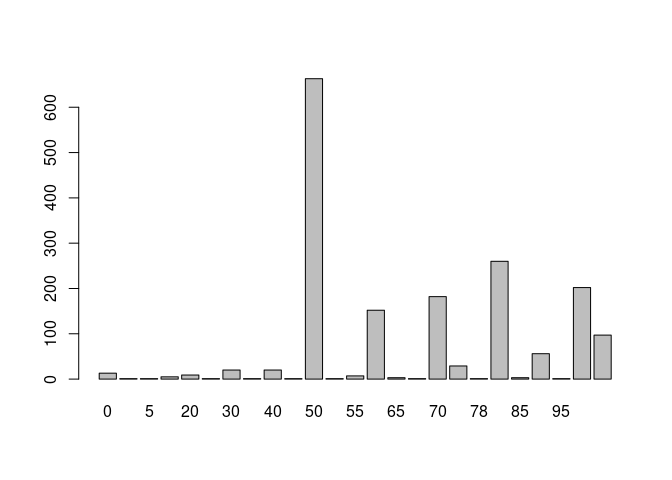
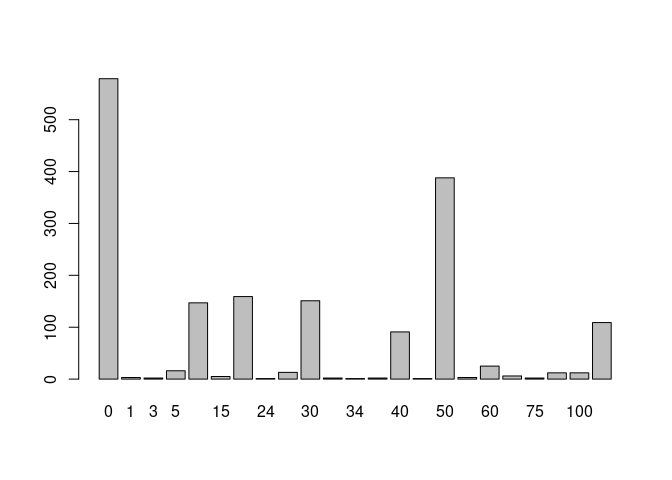
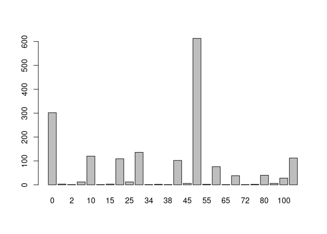
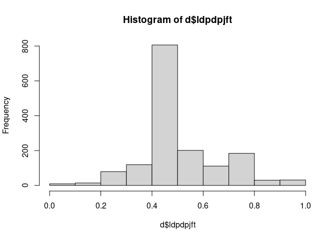

SIFCCT Recoding
================
Fan Lu & Gento Kato
Dec 18, 2020

# Preparation

``` r
## Clean Up Space
rm(list=ls())

## Set Working Directory (Automatically) ##
require(rstudioapi); require(rprojroot)
if (rstudioapi::isAvailable()==TRUE) {
  setwd(dirname(rstudioapi::getActiveDocumentContext()$path)); 
} 
projdir <- find_root(has_file("thisishome.txt"))
cat(paste("Working Directory Set to:\n",projdir))
```

    ## Working Directory Set to:
    ##  /home/gentok/GoogleDrive/Projects/Fan-Gento-Lab/ForeignerJapan

``` r
setwd(projdir)

## Find Data Directory
datadir1 <- paste(projdir,"data/original/sifcct_mail.csv",sep="/")

## Import Original Data
library(readr)
do <- read_csv(datadir1, locale=locale(encoding="CP932"))
```

    ## Parsed with column specification:
    ## cols(
    ##   .default = col_double(),
    ##   F9b = col_character(),
    ##   FA = col_character(),
    ##   回答郵便番号 = col_character()
    ## )

    ## See spec(...) for full column specifications.

``` r
colnames(do)[colnames(do)=="回答郵便番号"] <- "zip"
colnames(do)[colnames(do)=="都道府県コード"] <- "prefcode"

## Library Psych Package
require(psych)
```

# Data Manipulation

``` r
# Initiate New Data Set
d <- data.frame(id = do$SampleNo, 
                wave = NA, 
                panel = 0,
                panelid = NA)
```

## DEPENDENT variables of (potential) interest

### The local election suffrage should be granted to foreigners.

  - Original: 1=Strongly agree 5=Strongly disagree 6=DK 7=NA
  - Recoded: 0=Strongly disagree, 0.5=Neither/DK, 1=Strongly agree,
    Missing=NA

<!-- end list -->

``` r
# Original Variable
tmp <- do$Q11_3 
table(tmp, useNA="always")
```

    ## tmp
    ##    1    2    3    4    5    6    7 <NA> 
    ##  255  339  262  160  376  275   14   49

``` r
# Recoded Variable
d$foreignsuff <- ifelse(tmp==7, 2, ifelse(tmp==6, 2, 5 - as.numeric(tmp)))/4
table(d$foreignsuff, useNA="always")
```

    ## 
    ##    0 0.25  0.5 0.75    1 <NA> 
    ##  376  160  551  339  255   49

``` r
d$foreignsuff3 <- ifelse(d$foreignsuff==0.5,1,ifelse(d$foreignsuff>0.5,3,2))
d$foreignsuff3 <- factor(d$foreignsuff3, labels=c("Neither","Disagree","Agree"))
table(d$foreignsuff3, useNA="always")
```

    ## 
    ##  Neither Disagree    Agree     <NA> 
    ##      551      536      594       49

``` r
d$foreignsuff3x <- factor(d$foreignsuff3, levels=c("Disagree","Neither","Agree"))
table(d$foreignsuff3x, useNA="always")
```

    ## 
    ## Disagree  Neither    Agree     <NA> 
    ##      536      551      594       49

### Increase in long-term resident foreigners (Not Asked)

``` r
d$immigincrease <- NA
d$immigincrease3 <- NA
d$immigincrease3x <- NA
```

### Trustworthiness of Foreigners (Not Asked)

  - Original: 1=Not trustworthy 7=trustworthy
  - Recoded: 0-1 range, 1 is the most trustworthy

<!-- end list -->

``` r
d$trust_old_sko <- d$trust_old_kor <- d$trust_old_chn <- 
  d$trust_new_sko <- d$trust_new_chn <- d$trust_new_bra <- 
  d$trust_new_phl <- d$trust_new_usa <- NA
d$trust_old <- d$trust_new <- NA
```

### Foreign friends/acquaintances in Japan. (Not Asked)

  - Original: 1=1 or 2, 4=11 or more, 5=None, 6= Don’t want to answer
  - Recoded: 0=None, 1=Any Friend
  - Recoded 2: 0=None, 1=1or2, 2=More

<!-- end list -->

``` r
d$foreignfriend_jpn <- NA
d$foreignfriend_jpn2 <- NA
```

### Foreign friends/acquaintances outside of Japan. (Not Asked)

  - Original: 1=1 or 2, 4=11 or more, 5=None, 6= Don’t want to answer
  - Recoded 1: 0=None, 1=Any Friend
  - Recoded 2: 0=None, 1=1or2, 2=More

<!-- end list -->

``` r
d$foreignfriend_out <- NA
d$foreignfriend_out2 <- NA
```

### Foreign relatives. (Not Asked)

  - Original: 1=1 or 2, 4=11 or more, 5=None, 6= Don’t want to answer
  - Recoded: 0=None, 1=Any
  - Recoded 2: 0=None, 1=1or2, 2=More

<!-- end list -->

``` r
d$foreignfamily <- NA
d$foreignfamily2 <- NA
```

### Foreign Acquaintances (Not Asked)

  - Recoded: 0=None, 1=Any
  - Recoded 2: 0=None, 1=1or2 (for only one), 2=More

<!-- end list -->

``` r
d$foreignacqu <- NA
d$foreignacqu2 <- NA
```

### Familiarity with Foreign Countries

``` r
tmp1 <- do$Q16_1
tmp1 <- ifelse(tmp1==999, 50, ifelse(tmp1==888, 50, tmp1))
barplot(table(tmp1, useNA="always"))
```

<!-- -->

``` r
d$familiarityFT_USA <- tmp1/100

tmp2 <- do$Q16_2
tmp2 <- ifelse(tmp2==999, 50, ifelse(tmp2==888, 50, tmp2))
barplot(table(tmp2, useNA="always"))
```

<!-- -->

``` r
d$familiarityFT_CHN <- tmp2/100

tmp3 <- do$Q16_3
tmp3 <- ifelse(tmp3==999, 50, ifelse(tmp3==888, 50, tmp3))
barplot(table(tmp3, useNA="always"))
```

<!-- -->

``` r
d$familiarityFT_KOR <- tmp3/100
```

### Political Knowledge

  - Recoded: Sum of correct answers from 6 factual questions
    (standardized in 0-1 range)

<!-- end list -->

``` r
# Original 
tmp1 <- do$Q19%in%4
table(tmp1, useNA="always")
```

    ## tmp1
    ## FALSE  TRUE  <NA> 
    ##   827   903     0

``` r
tmp2 <- do$Q20%in%3
table(tmp2, useNA="always")
```

    ## tmp2
    ## FALSE  TRUE  <NA> 
    ##   808   922     0

``` r
tmp3 <- do$Q21%in%2
table(tmp3, useNA="always")
```

    ## tmp3
    ## FALSE  TRUE  <NA> 
    ##   553  1177     0

``` r
tmp4 <- do$Q22%in%2
table(tmp4, useNA="always")
```

    ## tmp4
    ## FALSE  TRUE  <NA> 
    ##  1031   699     0

``` r
tmp5 <- do$Q23%in%3
table(tmp5, useNA="always")
```

    ## tmp5
    ## FALSE  TRUE  <NA> 
    ##  1241   489     0

``` r
tmp6 <- do$Q24%in%3
table(tmp6, useNA="always")
```

    ## tmp6
    ## FALSE  TRUE  <NA> 
    ##  1245   485     0

``` r
# Recoded
d$knowledge <- (tmp1 + tmp2 + tmp3 + tmp4 + tmp5 + tmp6)/6
table(d$knowledge, useNA="always")
```

    ## 
    ##                 0 0.166666666666667 0.333333333333333               0.5 0.666666666666667 0.833333333333333                 1 
    ##               369               236               205               257               249               222               192 
    ##              <NA> 
    ##                 0

``` r
# Cronbach's Alpha is 0.77
psych::alpha(cbind(tmp1,tmp2,tmp3,tmp4,tmp5,tmp6))
```

    ## 
    ## Reliability analysis   
    ## Call: psych::alpha(x = cbind(tmp1, tmp2, tmp3, tmp4, tmp5, tmp6))
    ## 
    ##   raw_alpha std.alpha G6(smc) average_r S/N    ase mean   sd median_r
    ##       0.81      0.81    0.78      0.41 4.1 0.0072 0.45 0.34      0.4
    ## 
    ##  lower alpha upper     95% confidence boundaries
    ## 0.79 0.81 0.82 
    ## 
    ##  Reliability if an item is dropped:
    ##      raw_alpha std.alpha G6(smc) average_r S/N alpha se  var.r med.r
    ## tmp1      0.78      0.78    0.75      0.42 3.6   0.0082 0.0066  0.39
    ## tmp2      0.76      0.76    0.72      0.39 3.2   0.0091 0.0045  0.39
    ## tmp3      0.77      0.77    0.73      0.40 3.3   0.0088 0.0038  0.39
    ## tmp4      0.76      0.76    0.73      0.39 3.2   0.0090 0.0066  0.36
    ## tmp5      0.79      0.79    0.76      0.43 3.7   0.0079 0.0076  0.43
    ## tmp6      0.80      0.79    0.76      0.44 3.9   0.0077 0.0058  0.43
    ## 
    ##  Item statistics 
    ##         n raw.r std.r r.cor r.drop mean   sd
    ## tmp1 1730  0.70  0.69  0.60   0.54 0.52 0.50
    ## tmp2 1730  0.77  0.76  0.71   0.64 0.53 0.50
    ## tmp3 1730  0.74  0.74  0.68   0.61 0.68 0.47
    ## tmp4 1730  0.76  0.76  0.70   0.63 0.40 0.49
    ## tmp5 1730  0.66  0.67  0.56   0.50 0.28 0.45
    ## tmp6 1730  0.64  0.65  0.53   0.47 0.28 0.45
    ## 
    ## Non missing response frequency for each item
    ##      FALSE TRUE miss
    ## tmp1  0.48 0.52    0
    ## tmp2  0.47 0.53    0
    ## tmp3  0.32 0.68    0
    ## tmp4  0.60 0.40    0
    ## tmp5  0.72 0.28    0
    ## tmp6  0.72 0.28    0

### Interest in politics.

  - Original: 1= interested 4= Not interested 5=DK 6= Don’t want to
    answer
  - Recoded: 0=Not interested to 1=Interested, Missing=DK/NA

<!-- end list -->

``` r
# Original
tmp <- do$Q3
table(tmp, useNA="always") 
```

    ## tmp
    ##    1    2    3    4    5    6 <NA> 
    ##  490  858  287   70   18    4    3

``` r
# Recoded
d$polint <- ifelse(tmp%in%c(5,6), 0, 4 - tmp)/3
table(d$polint, useNA="always")
```

    ## 
    ##                 0 0.333333333333333 0.666666666666667                 1              <NA> 
    ##                92               287               858               490                 3

### Interest in international issues facing Japan.

  - Original: 1= interested 4= Not interested 5=DK 6= Don’t want to
    answer
  - Recoded: 1=Not interested, 4=Interested, Missing=DK/NA

<!-- end list -->

``` r
# Original
tmp <- do$Q4
table(tmp, useNA="always") 
```

    ## tmp
    ##    1    2    3    4    5    6 <NA> 
    ##  623  829  196   40   33    4    5

``` r
# Recoded
d$intlint <- ifelse(tmp%in%c(5,6), 0, 4 - tmp)/3
table(d$intlint, useNA="always")
```

    ## 
    ##                 0 0.333333333333333 0.666666666666667                 1              <NA> 
    ##                77               196               829               623                 5

## PREDICTORS

### Education (Ordinal)

  - Original: 1= primary/junior-high school, 2=High School, 3=Junior
    College/Vocational School, 4= College/Grad School, 5= NA
  - Recoded: 1= “\<=SHS”, 2=“Junior College/Vocational School”,
    3=“\>=College”

<!-- end list -->

``` r
# Original
tmp <- do$F3
table(tmp, useNA="always")
```

    ## tmp
    ##    1    2    3    4    5 <NA> 
    ##  194  638  347  427   56   68

``` r
# Recoded
d$edu <- ifelse(tmp==5, NA, ifelse(tmp==1, 1, tmp-1))
# Make it a Factor
d$edu <- factor(d$edu, labels = c("<=SHS",
                                  ">SHS & <College(4yr)",
                                  ">=College(4yr)"))
table(d$edu, useNA="always")
```

    ## 
    ##                <=SHS >SHS & <College(4yr)       >=College(4yr)                 <NA> 
    ##                  832                  347                  427                  124

``` r
# Education Treatment 
d$edu2 <- ifelse(d$edu==">=College(4yr)",1,0)
d$edu2x <- d$edu2
d$edu2x[which(d$edu==">SHS & <College(4yr)")] <- NA
table(d$edu2, useNA="always")
```

    ## 
    ##    0    1 <NA> 
    ## 1179  427  124

``` r
table(d$edu2x, useNA="always")
```

    ## 
    ##    0    1 <NA> 
    ##  832  427  471

### Gender

  - Original: 1=male 2=female 3=NA
  - Recoded: 0=male, 1=female

<!-- end list -->

``` r
# Original
tmp <- do$F1
table(tmp, useNA="always")
```

    ## tmp
    ##    1    2    3 <NA> 
    ##  829  798   34   69

``` r
# Recoded
d$female <- ifelse(tmp==3, NA, tmp-1)
table(d$female, useNA="always")
```

    ## 
    ##    0    1 <NA> 
    ##  829  798  103

``` r
d$male <- 1 - d$female
```

### Age

  - Original: 70=70 or over, 99=NA
  - Recoded: NA into Missing
  - Recoded (Categorical):

<!-- end list -->

``` r
# Original
tmp <- do$F2
table(tmp, useNA="always")
```

    ## tmp
    ##   20   21   22   23   24   25   26   27   28   29   30   31   32   33   34   35   36   37   38   39   40   41   42   43   44   45   46   47 
    ##    9   15   12    9   15   22   11    7   22   20   21   14   21   21   18   27   30   24   30   22   44   22   27   33   41   29   21   27 
    ##   48   49   50   51   52   53   54   55   56   57   58   59   60   61   62   63   64   65   66   67   68   69   70   71   72   73   74   75 
    ##   39   28   34   26   30   18   24   33   26   31   33   29   33   33   27   36   48   44   32   22   26   31   44   31   32   24   19   19 
    ##   76   77   78   79   80   81   82   83   84   85   86   87   88   89   90   91   92   94  103 <NA> 
    ##   19   15   16   19   20   10   10   14    6   11    2    1    1    3    2    1    1    1    1  111

``` r
# Recoded
d$age <- ifelse(tmp==99, NA, tmp)
table(d$age, useNA="always")
```

    ## 
    ##   20   21   22   23   24   25   26   27   28   29   30   31   32   33   34   35   36   37   38   39   40   41   42   43   44   45   46   47 
    ##    9   15   12    9   15   22   11    7   22   20   21   14   21   21   18   27   30   24   30   22   44   22   27   33   41   29   21   27 
    ##   48   49   50   51   52   53   54   55   56   57   58   59   60   61   62   63   64   65   66   67   68   69   70   71   72   73   74   75 
    ##   39   28   34   26   30   18   24   33   26   31   33   29   33   33   27   36   48   44   32   22   26   31   44   31   32   24   19   19 
    ##   76   77   78   79   80   81   82   83   84   85   86   87   88   89   90   91   92   94  103 <NA> 
    ##   19   15   16   19   20   10   10   14    6   11    2    1    1    3    2    1    1    1    1  111

``` r
## Recoded Born Year (by Academic Year: April-March)
d$bornyr <- NA
d$bornyr <- 2012 - d$age

# Recoded Categorical
d$agecat <- NA
d$agecat[d$age >= 60] <- "Elder (>=60s)"
d$agecat[d$age >= 40 & d$age < 60] <- "Middle Aged (40-50s)"
d$agecat[d$age < 40] <- "Young (<=30s)"
## coerce new character variable into a factor variable
d$agecat <- factor(d$agecat, levels=c("Young (<=30s)",
                                      "Middle Aged (40-50s)",
                                      "Elder (>=60s)"))
table(d$agecat, useNA="always") 
```

    ## 
    ##        Young (<=30s) Middle Aged (40-50s)        Elder (>=60s)                 <NA> 
    ##                  370                  595                  654                  111

### Marital Status

``` r
tmp <- do$F5
table(tmp)
```

    ## tmp
    ##    1    2    3 
    ## 1197  388   70

``` r
d$married <- ifelse(tmp==3,NA,ifelse(tmp==1,1,0))
table(d$married)
```

    ## 
    ##    0    1 
    ##  388 1197

### Income

``` r
# Original
tmp <- do$F4
table(tmp, useNA="always")
```

    ## tmp
    ##    1    2    3    4    5    6    7    8    9   10 <NA> 
    ##  138  375  299  249  132   86   39   53   88  199   72

``` r
# Recoded
## Percentile Conversion Function
convper <- function(old.var,missing.val){
  r <- old.var
  r[r %in% missing.val] <- NA
  rt <- cumsum(table(r)/sum(table(r))) # Cumulative Percentile
  rt <- rt - diff(c(0,rt))/2 # Take Midpoints 
  r <- rt[match(r, names(rt))]
  return(r)
}
d$income <- convper(tmp, c(9,10))
table(d$income, useNA="always")
```

    ## 
    ## 0.050328227571116 0.237417943107221 0.483223924142961 0.683078045222465 0.822027716994894 0.901531728665208 0.947118891320204 
    ##               138               375               299               249               132                86                39 
    ## 0.980671043034282              <NA> 
    ##                53               359

``` r
d$incomecat <- NA
d$incomecat[which(d$income<=0.33)] <- "Low"
d$incomecat[which(d$income>0.33 & d$income<=0.67)] <- "Middle"
d$incomecat[which(d$income>0.67)] <- "High"
d$incomecat[which(tmp%in%c(9,10))] <- "Missing"
d$incomecat <- factor(d$incomecat, levels=c("Low","Middle","High","Missing"))
table(d$incomecat, useNA="always") 
```

    ## 
    ##     Low  Middle    High Missing    <NA> 
    ##     513     299     559     287      72

### Newspaper which is read the most (Not Asked)

``` r
# Original
d$npmost <- NA 
d$npmost2 <- NA
```

### assessment of current life condition.

Note: Question Wording is randomized among fresh respondents.

  - Original: 1=good 5=bad, 6=DK, 7=NA
  - Recoded: 0=bad, 0.5=Neither/DK, 1=good, NA=NA

<!-- end list -->

``` r
# Original: Combine All randomized responses
tmp <- do$Q7
table(tmp, useNA="always")
```

    ## tmp
    ##    1    2    3    4    5    6    7 <NA> 
    ##  102  562  269  406  332   21    9   29

``` r
# Recoded
d$evlife <- ifelse(tmp==7, 2, ifelse(tmp==6, 2, 5 - tmp))/4
table(d$evlife, useNA="always")
```

    ## 
    ##    0 0.25  0.5 0.75    1 <NA> 
    ##  332  406  299  562  102   29

``` r
# Question Wording Type (just in case)
# 0 = assessment of current life condition
# 1 = assessment of the change in life condition from a month ago
d$evlife_qtype <- 0
```

### assessment of current Japanese economy.

Note: Question Wording is randomized among fresh respondents.

  - Original: 1=good 5=bad, 6=DK, 7=NA
  - Recoded: 0=bad, 0.5=Neither/DK, 1=good, NA=NA

<!-- end list -->

``` r
# Original: Combine All randomized responses
tmp <- do$Q8
table(tmp, useNA="always")
```

    ## tmp
    ##    1    2    3    4    5    6    7 <NA> 
    ##    1   17  148  591  903   42    2   26

``` r
# Recoded
d$evecon <- ifelse(tmp==7 | is.na(tmp), 2, ifelse(tmp==6, 2, 5 - tmp))/4
table(d$evecon, useNA="always")
```

    ## 
    ##    0 0.25  0.5 0.75    1 <NA> 
    ##  903  591  218   17    1    0

``` r
d$evecon_verybad <- ifelse(d$evecon%in%0, 1, 0)
d$evecon_bad <- ifelse(d$evecon%in%0.25, 1, 0)

# Question Wording Type (just in case)
# 0 = assessment of current economy
# 1 = assessment of the change in economy from a month ago
d$evecon_qtype <- 0
```

### Internet Usage

Original: 1=less than 30min 7=about more than 5 hrs, 8=Not using
Internet, 9=NA Recoded: Standardized to 0-1 range. NA=NA

``` r
# Original
tmp <- do$F7
table(tmp, useNA="always")
```

    ## tmp
    ##    1    2    3    4    5    6    7    8    9 <NA> 
    ##  290  291  218  116   46   30   32  645   42   20

``` r
# Recoded
d$netuse <- ifelse(tmp==9,NA,ifelse(tmp==8, 0, tmp))/7
table(d$netuse, useNA="always")
```

    ## 
    ##                 0 0.142857142857143 0.285714285714286 0.428571428571429 0.571428571428571 0.714285714285714 0.857142857142857 
    ##               645               290               291               218               116                46                30 
    ##                 1              <NA> 
    ##                32                62

### party support

Original (e.g., version “a”): 1=Democratic Party of Japan (DPJ),
2=Liberal Democratic Party (LDP), 3=New Komeito (CGP), 4=Japanese
Communist Party (JCP) 5= Social Democratic Party (SDP) 6=Your Party (YP)
7=Other, 8=Don’t support any 9=Don’t want to answer

Recoded (Categorical): 1=Mutoha(No Party), 2=DPJ, 3=LDP, 4=CGP(Komeito),
5=JCP, 6=SDP, 7=YP, 8=JRP (Japan Restoration Party), 9=Others, NA=NA

``` r
# Original: Combine All Responses
tmp <- do$Q25 
table(tmp, useNA="always") # (Version "c")
```

    ## tmp
    ##    1    2    3    4    5    6    7    8    9   10   11   12 <NA> 
    ##  215  391   55   37   13    4   39   21  136   10  688   99   22

``` r
# Original: Response Category Type
tmptype <- "f"
# Original: NA Locations
tmpNA <- rep(0, length(tmp))
tmpNA[which(tmptype=="f" & tmp==12)] <- 1
table(tmpNA, useNA="always")
```

    ## tmpNA
    ##    0    1 <NA> 
    ## 1631   99    0

``` r
# Recoded
## DPJ
d$dpj <- (tmp==1)*1
d$dpj[tmpNA==1] <- NA
table(d$dpj, useNA="always")
```

    ## 
    ##    0    1 <NA> 
    ## 1394  215  121

``` r
## LDP
d$ldp <- (tmp==2)*1
d$ldp[tmpNA==1] <- NA
table(d$ldp, useNA="always")
```

    ## 
    ##    0    1 <NA> 
    ## 1218  391  121

``` r
## CGP
d$cgp <- (tmp==3)*1
d$cgp[tmpNA==1] <- NA
table(d$cgp, useNA="always")
```

    ## 
    ##    0    1 <NA> 
    ## 1554   55  121

``` r
## JCP
d$jcp <- (tmp==4)*1
d$jcp[tmpNA==1] <- NA
table(d$jcp, useNA="always")
```

    ## 
    ##    0    1 <NA> 
    ## 1572   37  121

``` r
## SDP
d$sdp <- (tmp==5)*1
d$sdp[tmpNA==1] <- NA
table(d$sdp, useNA="always")
```

    ## 
    ##    0    1 <NA> 
    ## 1596   13  121

``` r
## YP
d$yp <- ifelse(tmptype%in%c("a","b","c","d"), (tmp==6)*1, (tmp==5)*1)
d$yp[tmpNA==1] <- NA
table(d$yp, useNA="always")
```

    ## 
    ##    0 <NA> 
    ## 1631   99

``` r
## JRP
d$jrp <- (tmp==9)*1
d$jrp[tmpNA==1] <- NA
table(d$jrp, useNA="always")
```

    ## 
    ##    0    1 <NA> 
    ## 1473  136  121

``` r
## PLP Seikatsu/Mirai (People's Life Party)
d$plp <- (tmp==8)*1
d$plp[tmpNA==1] <- NA
table(d$plp, useNA="always")
```

    ## 
    ##    0    1 <NA> 
    ## 1588   21  121

``` r
## other parties 
d$othp <- (tmp%in%c(6,10))*1 
d$othp[tmpNA==1] <- NA
table(d$othp, useNA="always")
```

    ## 
    ##    0    1 <NA> 
    ## 1617   14   99

``` r
## mutoha (No party support)
d$mutoha <- (tmp==11)*1 
d$mutoha[tmpNA==1] <- NA
table(d$mutoha, useNA="always")
```

    ## 
    ##    0    1 <NA> 
    ##  921  688  121

``` r
## Categorical Party Variable
### Check that variables do not overlap
with(d, table(dpj+ldp+cgp+jcp+sdp+yp+jrp+plp+othp+mutoha, useNA="always"))
```

    ## 
    ##    0    1 <NA> 
    ##   39 1570  121

``` r
### Create variable
d$psup <- NA
d$psup[d$mutoha==1] <- "None"
d$psup[d$dpj==1] <- "DPJ"
d$psup[d$ldp==1] <- "LDP"
d$psup[d$cgp==1] <- "CGP(Komei)"
d$psup[d$jcp==1] <- "JCP"
d$psup[d$sdp==1] <- "SDP"
d$psup[d$yp==1] <- "YP"
d$psup[d$jrp==1] <- "JRP"
d$psup[d$plp==1] <- "Other"
d$psup[d$othp==1] <- "Other"
d$psup <- factor(d$psup,
                 levels=c("None","DPJ","LDP","CGP(Komei)",
                          "JCP","SDP","YP","JRP","Other"))
table(d$psup, useNA="always")
```

    ## 
    ##       None        DPJ        LDP CGP(Komei)        JCP        SDP         YP        JRP      Other       <NA> 
    ##        688        215        391         55         37         13          0        136         35        160

``` r
d$psup_original <- d$psup
d$psup <- ifelse(d$psup_original%in%c("DPJ","CGP(Komei)","JCP","SDP"),
                 "Left",ifelse(d$psup_original%in%c("LDP","YP","JRP"),
                               "Right",
                               ifelse(d$psup_original%in%c("None","Other"),"None/Other",NA)))
d$psup <- factor(d$psup,
                 levels=c("None/Other","Left","Right"))
table(d$psup, useNA="always")
```

    ## 
    ## None/Other       Left      Right       <NA> 
    ##        723        320        527        160

``` r
d$left <- ifelse(d$psup%in%"Left",1,0)
d$right <- ifelse(d$psup%in%"Right",1,0)
```

# LDP - DPJ Feeling Thermometer

``` r
tmp <- do$Q6_2
table(tmp)
```

    ## tmp
    ##   0   2   5  10  15  20  25  29  30  35  40  45  50  55  58  60  65  70  75  80  90 100 888 999 
    ## 161   3   6  47   1  70  22   1 136   5  91   7 604   4   1  99   6  57   6  60  11  68 111  28

``` r
d$ldpft <- ifelse(tmp==999,0.5,ifelse(tmp==888,0.5,tmp/100))
summary(d$ldpft)
```

    ##    Min. 1st Qu.  Median    Mean 3rd Qu.    Max.    NA's 
    ##  0.0000  0.3000  0.5000  0.4455  0.5000  1.0000     125

``` r
tmp <- do$Q6_1
table(tmp)
```

    ## tmp
    ##   0   1   5  10  15  18  20  23  25  30  35  40  45  50  55  60  65  70  75  80  90  99 100 888 999 
    ## 296   1   8  53   5   1 114   1  14 150   2  88   4 523   6  77   5  51   2  39   2   1  22 114  31

``` r
d$dpjft <- ifelse(tmp==999,0.5,ifelse(tmp==888,0.5,tmp/100))
summary(d$dpjft)
```

    ##    Min. 1st Qu.  Median    Mean 3rd Qu.    Max.    NA's 
    ##  0.0000  0.2000  0.5000  0.3701  0.5000  1.0000     120

``` r
d$ldpdpjft = (d$ldpft - d$dpjft + 1)/2
summary(d$ldpdpjft)
```

    ##    Min. 1st Qu.  Median    Mean 3rd Qu.    Max.    NA's 
    ##  0.0000  0.5000  0.5000  0.5372  0.6000  1.0000     146

``` r
hist(d$ldpdpjft)
```

<!-- -->

# Ideology

``` r
tmp <- do$Q18
table(tmp)
```

    ## tmp
    ##   0   1   2   3   4   5   6   7   8   9  10  11  12 
    ##  30  20  65 166 162 301 178 156 136  31  60 357  26

``` r
d$ideology <- ifelse(tmp==11,0.5,ifelse(tmp==12,0.5,tmp/10))
table(d$ideology, useNA="always")
```

    ## 
    ##    0  0.1  0.2  0.3  0.4  0.5  0.6  0.7  0.8  0.9    1 <NA> 
    ##   30   20   65  166  162  684  178  156  136   31   60   42

# Stayed in Foreign Country

``` r
tmp <- do$F9a
table(tmp)
```

    ## tmp
    ##    1    2    3 
    ## 1573   85   23

``` r
d$stayforeign <- ifelse(tmp==2, 1, ifelse(tmp==1, 0, NA))
table(d$stayforeign, useNA="always")
```

    ## 
    ##    0    1 <NA> 
    ## 1573   85   72

# Jobs

``` r
## Industry
tmp <- do$F8b
table(tmp)
```

    ## tmp
    ##   1   2   3   4   5   6   7   8   9  10  11  12  13  14  15  16  17  18 
    ##  41  96 166  27  54  40  70  51  33  73  13  30 124  53   8 160  15  16

``` r
d$industry <- ifelse(tmp%in%c(17,18),NA,
                     ifelse(tmp==1,"Primary",
                            ifelse(tmp%in%c(2,3),"Secondary",
                                   ifelse(tmp%in%c(4,5,6,7,8,9),"Teritiary",
                                          "Quarternary"))))
d$industry <- factor(d$industry, levels=c("Primary","Secondary","Teritiary","Quarternary"))
table(d$industry)
```

    ## 
    ##     Primary   Secondary   Teritiary Quarternary 
    ##          41         262         275         461

``` r
d$industry2 <- ifelse(d$industry%in%c("Primary","Secondary"),"Primary/Secondary",as.character(d$industry))
d$industry2 <- factor(d$industry2, levels=c("Primary/Secondary","Teritiary","Quarternary"))
table(d$industry2)
```

    ## 
    ## Primary/Secondary         Teritiary       Quarternary 
    ##               303               275               461

``` r
## Working Status
tmp <- do$F8a
table(tmp)
```

    ## tmp
    ##   1   2   3   4   5   6   7   8   9  10  11 
    ##  83 128 414 235  22 139  50  14 553  10  61

``` r
d$workstat <- ifelse(tmp%in%c(10,11),NA,
                    ifelse(tmp%in%c(2,3),"Full-Time",
                           ifelse(tmp%in%c(4,5),"Part-Time",
                                  ifelse(tmp%in%c(1,6,7),"Self-Employed","Not Employed"))))
d$workstat <- factor(d$workstat, levels=c("Full-Time","Part-Time","Self-Employed","Not Employed"))
table(d$workstat)
```

    ## 
    ##     Full-Time     Part-Time Self-Employed  Not Employed 
    ##           542           257           272           588

``` r
d$employed <- ifelse(d$workstat=="Not Employed",0,1)
table(d$employed)
```

    ## 
    ##    0    1 
    ##  588 1071

# Exporting Residential Locations from Zip-Code

``` r
# Zip Code
tmp <- gsub("-","",do$zip)
table(nchar(tmp))
```

    ## 
    ##    7 
    ## 1643

``` r
tmp[which(nchar(tmp)!=7)] <- NA
tmp[which(tmp==9999999)] <- NA
d$zip <- tmp
table(!is.na(d$zip))
```

    ## 
    ## FALSE  TRUE 
    ##   475  1255

``` r
# Longitude, Latitude, Prefecture, and Municipality from Zip Code

# addloc <- readRDS(paste0(projdir,"/data/original/sifcct_address/addloc.rds"))
# 
# zip_ext <- unique(d$zip[!d$zip%in%addloc$zip])[-1]
# 
# library(RCurl)
# library(RJSONIO)
# library(pbapply)
# appid <- readLines("/home/gentok/Documents/yahoo_appid.txt")
# query_prefix <- paste0("https://map.yahooapis.jp/search/zip/V1/zipCodeSearch?appid=",appid,"&output=json&detail=full&query=")
# 
# # Make Query by 2500 addresses Each
# adddt_ext <- pblapply(zip_ext, function(k) fromJSON(getURL(paste0(query_prefix,k))))
# names(adddt_ext) <- zip_ext
# saveRDS(adddt_ext, "./data/original/sifcct_address/adddt_ext.rds")
# 
# addloc_ext <- data.frame(zip=names(adddt_ext),
#                      coord = sapply(adddt_ext, function(k) ifelse(is.null(k$Feature[[1]]$Geometry[2]),"NA,NA",
#                                                              k$Feature[[1]]$Geometry[2])),
#                      pref = sapply(adddt_ext, function(k) ifelse(is.null(k$Feature[[1]]$Property$AddressElement[[1]][1]),NA,
#                                                              k$Feature[[1]]$Property$AddressElement[[1]][1])),
#                      pref_kana = sapply(adddt_ext, function(k) ifelse(is.null(k$Feature[[1]]$Property$AddressElement[[1]][2]),NA,
#                                                             k$Feature[[1]]$Property$AddressElement[[1]][2])),
#                      muni = sapply(adddt_ext, function(k) ifelse(is.null(k$Feature[[1]]$Property$AddressElement[[2]][1]),NA,
#                                                              k$Feature[[1]]$Property$AddressElement[[2]][1])),
#                      muni_kana = sapply(adddt_ext, function(k) ifelse(is.null(k$Feature[[1]]$Property$AddressElement[[2]][2]),NA,
#                                                                   k$Feature[[1]]$Property$AddressElement[[2]][2])),
#                      stringsAsFactors = FALSE)
# library(stringr)
# coordtmp <- str_split(addloc_ext$coord,",")
# addloc_ext$lon <- as.numeric(sapply(coordtmp, function(k) k[1]))
# addloc_ext$lat <- as.numeric(sapply(coordtmp, function(k) k[2]))
# 
# saveRDS(addloc_ext, "./data/original/sifcct_address/addloc_ext.rds")
# rm(adddt_ext, addloc_ext)

addloc <- rbind(readRDS(paste0(projdir,"/data/original/sifcct_address/addloc.rds")),
                readRDS(paste0(projdir,"/data/original/sifcct_address/addloc_ext.rds")))
unique(d$zip[!d$zip%in%addloc$zip]) ## All Zip found
```

    ## [1] NA

``` r
d$zip_lon <- d$zip_lat <- NA
d$zip_lon[which(!is.na(d$zip))] <- addloc$lon[match(d$zip[which(!is.na(d$zip))],addloc$zip)]
d$zip_lat[which(!is.na(d$zip))] <- addloc$lat[match(d$zip[which(!is.na(d$zip))],addloc$zip)]
d$zip_pref <- d$zip_pref_kana <- NA
d$zip_pref[which(!is.na(d$zip))] <- addloc$pref[match(d$zip[which(!is.na(d$zip))],addloc$zip)]
d$zip_pref_kana[which(!is.na(d$zip))] <- addloc$pref_kana[match(d$zip[which(!is.na(d$zip))],addloc$zip)]
d$zip_muni <- d$zip_muni_kana <- NA
d$zip_muni[which(!is.na(d$zip))] <- addloc$muni[match(d$zip[which(!is.na(d$zip))],addloc$zip)]
d$zip_muni_kana[which(!is.na(d$zip))] <- addloc$muni_kana[match(d$zip[which(!is.na(d$zip))],addloc$zip)]
```

# Living Length

``` r
tmp <- do$F10_2
table(tmp)
```

    ## tmp
    ##   0 0.5   1   2   3   4   5   6   7   8   9  10  11  12  13  14  15  16  17  18  19  20  21  22  23  24  25  26  27  28  29  30  31  32  33 
    ##   4   2  69  61  48  31  43  42  32  38  30  55  20  28  22  22  54  21  32  45  12  68  19  18   7  22  51  14  11  18  12  83   8  13  21 
    ##  34  35  36  37  38  39  40  41  42  43  44  45  46  47  48  49  50  51  52  53  54  55  56  57  58  59  60  61  62  63  64  65  66  67  68 
    ##  21  45  12  15  14   8  65   6  15  11   9  37   8   3  13   6  32   3   7   4   2  12   2   5   4   7  18   1   3   4   7  11   3   2   4 
    ##  69  70  71  72  73  74  75  76  77  78  79  80  82  83  84  85  90 999 
    ##   2  11   4   1   2   1   5   2   2   1   2   6   1   4   2   1   1   1

``` r
d$lvlen <- ifelse(tmp==999,NA,tmp) # Length of Living
d$lvpr <- d$lvlen/d$age # Proportion in Life Living in the Current Address
d$lvpr[d$lvpr>1] <- 1
table(d$lvpr)
```

    ## 
    ##                   0 0.00819672131147541 0.00961538461538462  0.0149253731343284  0.0153846153846154            0.015625  0.0158730158730159 
    ##                   4                   1                   1                   1                   2                   1                   1 
    ##  0.0169491525423729  0.0185185185185185  0.0188679245283019  0.0192307692307692  0.0196078431372549  0.0204081632653061  0.0208333333333333 
    ##                   2                   1                   1                   1                   1                   1                   1 
    ##  0.0212765957446809  0.0217391304347826  0.0222222222222222  0.0227272727272727  0.0238095238095238   0.024390243902439               0.025 
    ##                   1                   1                   1                   2                   2                   3                   1 
    ##  0.0256410256410256  0.0263157894736842  0.0266666666666667  0.0277777777777778  0.0285714285714286  0.0289855072463768  0.0303030303030303 
    ##                   2                   6                   1                   2                   2                   1                   3 
    ##             0.03125  0.0317460317460317   0.032258064516129  0.0327868852459016  0.0333333333333333  0.0344827586206897  0.0350877192982456 
    ##                   4                   1                   1                   1                   4                   5                   2 
    ##  0.0357142857142857   0.037037037037037                0.04  0.0416666666666667  0.0422535211267606  0.0425531914893617  0.0434782608695652 
    ##                   5                   1                   5                   2                   1                   1                   2 
    ##  0.0444444444444444  0.0454545454545455  0.0465116279069767            0.046875  0.0476190476190476  0.0483870967741935  0.0487804878048781 
    ##                   1                   4                   2                   1                   2                   1                   3 
    ##  0.0491803278688525                0.05  0.0512820512820513  0.0526315789473684  0.0540540540540541  0.0545454545454545  0.0555555555555556 
    ##                   1                   6                   1                   5                   1                   1                   4 
    ##  0.0571428571428571  0.0576923076923077  0.0588235294117647                0.06  0.0606060606060606  0.0612244897959184  0.0645161290322581 
    ##                   4                   1                   4                   1                   2                   1                   3 
    ##  0.0666666666666667  0.0681818181818182  0.0689655172413793  0.0697674418604651  0.0714285714285714  0.0740740740740741  0.0746268656716418 
    ##                   4                   1                   2                   1                   1                   3                   2 
    ##               0.075  0.0769230769230769            0.078125  0.0789473684210526                0.08  0.0810810810810811  0.0823529411764706 
    ##                   4                   2                   1                   3                   3                   1                   1 
    ##  0.0833333333333333  0.0847457627118644  0.0857142857142857  0.0862068965517241  0.0869565217391304  0.0882352941176471  0.0888888888888889 
    ##                   5                   1                   4                   1                   4                   2                   1 
    ##  0.0909090909090909             0.09375  0.0945945945945946  0.0952380952380952  0.0958904109589041  0.0961538461538462  0.0967741935483871 
    ##                   3                   2                   1                   5                   1                   2                   2 
    ##  0.0980392156862745  0.0987654320987654                 0.1   0.101694915254237   0.102564102564103   0.103448275862069   0.105263157894737 
    ##                   1                   1                   5                   2                   2                   2                   1 
    ##   0.107142857142857   0.108695652173913   0.111111111111111   0.112903225806452   0.113636363636364   0.114285714285714   0.114754098360656 
    ##                   1                   1                   2                   2                   1                   2                   2 
    ##   0.115384615384615   0.116279069767442   0.117647058823529   0.119047619047619   0.119402985074627   0.121212121212121   0.121951219512195 
    ##                   1                   1                   3                   1                   1                   2                   3 
    ##   0.122448979591837               0.125   0.127272727272727   0.127659574468085   0.128205128205128   0.128571428571429   0.129032258064516 
    ##                   2                  14                   1                   2                   1                   1                   2 
    ##    0.12962962962963    0.12987012987013   0.130434782608696   0.131578947368421   0.132075471698113   0.133333333333333   0.135135135135135 
    ##                   2                   2                   2                   2                   1                   2                   3 
    ##   0.136363636363636   0.137254901960784   0.137931034482759   0.138461538461538   0.138888888888889    0.13953488372093   0.141176470588235 
    ##                   3                   1                   1                   1                   1                   2                   1 
    ##   0.142857142857143   0.144927536231884   0.146341463414634   0.147058823529412                0.15   0.151515151515152   0.153846153846154 
    ##                  10                   1                   1                   3                   1                   3                   9 
    ##   0.155555555555556             0.15625   0.159090909090909                0.16   0.160714285714286   0.161290322580645   0.161764705882353 
    ##                   2                   2                   3                   2                   3                   1                   1 
    ##   0.162162162162162   0.162790697674419   0.163265306122449   0.166666666666667   0.169811320754717   0.171428571428571   0.173076923076923 
    ##                   4                   1                   1                   7                   1                   1                   1 
    ##   0.173913043478261               0.175   0.177777777777778                0.18   0.180327868852459   0.180722891566265   0.181818181818182 
    ##                   2                   2                   1                   1                   1                   2                   3 
    ##   0.183673469387755   0.185185185185185   0.186046511627907   0.186440677966102              0.1875   0.189189189189189   0.189655172413793 
    ##                   1                   1                   3                   1                   2                   1                   2 
    ##   0.191176470588235   0.191489361702128   0.192307692307692   0.193548387096774   0.194444444444444   0.195121951219512   0.195652173913043 
    ##                   1                   1                   1                   1                   1                   2                   2 
    ##   0.196078431372549   0.196428571428571    0.19672131147541   0.197183098591549   0.197368421052632                 0.2   0.202702702702703 
    ##                   2                   3                   2                   1                   1                  19                   2 
    ##   0.202898550724638   0.203389830508475   0.204081632653061   0.204819277108434   0.205479452054795   0.206349206349206   0.208333333333333 
    ##                   1                   1                   2                   1                   1                   1                   5 
    ##   0.209302325581395   0.209677419354839   0.210526315789474   0.211267605633803   0.212121212121212   0.212765957446809   0.214285714285714 
    ##                   1                   1                   2                   1                   2                   2                   2 
    ##   0.215384615384615   0.216216216216216   0.217391304347826   0.218181818181818             0.21875   0.219512195121951   0.220588235294118 
    ##                   1                   2                   1                   1                   1                   1                   1 
    ##   0.220779220779221   0.222222222222222   0.224489795918367               0.225   0.226415094339623   0.227272727272727   0.227848101265823 
    ##                   2                   4                   2                   3                   1                   4                   1 
    ##   0.228070175438596   0.229508196721311   0.230769230769231   0.231884057971014   0.232558139534884   0.232876712328767   0.233009708737864 
    ##                   1                   1                   1                   1                   4                   1                   1 
    ##   0.233766233766234            0.234375   0.235294117647059   0.236842105263158   0.238095238095238   0.239130434782609                0.24 
    ##                   1                   2                   1                   2                   4                   1                   1 
    ##   0.240740740740741   0.241379310344828   0.241935483870968   0.242424242424242   0.243243243243243    0.24390243902439   0.245901639344262 
    ##                   1                   1                   2                   2                   1                   2                   1 
    ##   0.246575342465753   0.247191011235955                0.25   0.253164556962025   0.255813953488372   0.256410256410256   0.257142857142857 
    ##                   1                   1                  13                   3                   3                   1                   3 
    ##   0.258064516129032   0.258620689655172   0.259259259259259   0.261538461538462   0.261904761904762   0.263157894736842   0.264150943396226 
    ##                   1                   3                   2                   1                   1                   2                   1 
    ##    0.26530612244898            0.265625   0.267857142857143   0.269230769230769    0.27027027027027   0.272727272727273   0.274193548387097 
    ##                   1                   1                   1                   1                   3                   6                   1 
    ##   0.275862068965517   0.276595744680851   0.276923076923077   0.277777777777778   0.278688524590164    0.27906976744186   0.279411764705882 
    ##                   1                   3                   2                   3                   1                   2                   1 
    ##             0.28125   0.282051282051282   0.282608695652174   0.283018867924528   0.283333333333333   0.285714285714286   0.288888888888889 
    ##                   2                   1                   1                   1                   1                   5                   2 
    ##   0.290322580645161   0.290909090909091   0.291666666666667   0.294117647058824   0.295454545454545   0.295774647887324   0.296296296296296 
    ##                   1                   1                   1                   1                   1                   1                   1 
    ##   0.297297297297297   0.297872340425532                 0.3   0.303030303030303    0.30379746835443   0.304347826086957   0.306122448979592 
    ##                   1                   1                   4                   3                   1                   3                   1 
    ##   0.307692307692308   0.308641975308642   0.308823529411765   0.310344827586207              0.3125   0.313725490196078   0.314285714285714 
    ##                   4                   1                   2                   2                   4                   2                   1 
    ##   0.314814814814815   0.315789473684211   0.317460317460317   0.318181818181818   0.320754716981132   0.322033898305085    0.32258064516129 
    ##                   2                   3                   1                   2                   2                   1                   2 
    ##   0.325581395348837   0.326923076923077   0.327272727272727            0.328125   0.333333333333333   0.337078651685393   0.337349397590361 
    ##                   1                   2                   1                   1                   8                   1                   1 
    ##   0.338461538461538   0.338709677419355   0.339622641509434                0.34   0.340425531914894   0.340909090909091   0.341463414634146 
    ##                   1                   1                   2                   1                   1                   4                   1 
    ##   0.342105263157895   0.344827586206897   0.347222222222222   0.347826086956522   0.348837209302326   0.349206349206349                0.35 
    ##                   1                   4                   1                   3                   1                   1                   1 
    ##   0.350877192982456   0.352112676056338   0.352941176470588   0.354166666666667   0.357142857142857   0.358208955223881            0.359375 
    ##                   3                   1                   2                   3                   6                   1                   1 
    ##                0.36   0.360655737704918   0.361702127659574   0.362068965517241    0.36231884057971   0.363636363636364    0.36734693877551 
    ##                   4                   1                   1                   1                   1                   4                   1 
    ##   0.367647058823529   0.368421052631579   0.369565217391304    0.37037037037037   0.372093023255814   0.372549019607843   0.373134328358209 
    ##                   2                   2                   1                   1                   1                   1                   1 
    ##               0.375   0.376811594202899   0.377049180327869   0.377777777777778   0.378378378378378   0.378787878787879   0.379310344827586 
    ##                   6                   1                   1                   1                   2                   2                   1 
    ##                0.38   0.380281690140845   0.380952380952381   0.383333333333333   0.383561643835616   0.384615384615385   0.385964912280702 
    ##                   1                   1                   3                   1                   1                  10                   1 
    ##   0.386363636363636    0.38961038961039   0.390243902439024            0.390625   0.391304347826087   0.392405063291139   0.393939393939394 
    ##                   1                   3                   1                   1                   2                   1                   2 
    ##   0.394736842105263   0.396551724137931                 0.4   0.404255319148936   0.405405405405405   0.407407407407407   0.408163265306122 
    ##                   1                   1                   7                   1                   2                   1                   4 
    ##   0.409090909090909   0.409836065573771   0.410958904109589   0.411764705882353   0.413793103448276   0.414634146341463   0.416666666666667 
    ##                   2                   3                   2                   1                   1                   1                   7 
    ##   0.417721518987342   0.418181818181818   0.421052631578947   0.422535211267606   0.423076923076923   0.423529411764706   0.423728813559322 
    ##                   1                   2                   1                   4                   1                   1                   2 
    ##   0.424242424242424   0.425531914893617   0.426229508196721   0.428571428571429   0.430769230769231   0.431034482758621   0.432432432432432 
    ##                   1                   3                   1                   6                   3                   1                   1 
    ##   0.433333333333333   0.434782608695652   0.435483870967742   0.435897435897436   0.436363636363636   0.436619718309859              0.4375 
    ##                   1                   3                   1                   1                   3                   1                   1 
    ##   0.441176470588235   0.441860465116279   0.444444444444444   0.446153846153846   0.446428571428571   0.447761194029851   0.448717948717949 
    ##                   2                   1                   2                   1                   1                   1                   2 
    ##                0.45   0.452054794520548   0.452380952380952   0.452830188679245   0.453333333333333   0.454545454545455   0.455882352941176 
    ##                   1                   1                   1                   1                   1                   5                   1 
    ##   0.458333333333333   0.459016393442623   0.461538461538462   0.462962962962963   0.464285714285714   0.465116279069767    0.46551724137931 
    ##                   3                   1                   4                   1                   1                   2                   1 
    ##   0.466666666666667             0.46875   0.470588235294118   0.471428571428571   0.472972972972973   0.475409836065574   0.476190476190476 
    ##                   2                   5                   4                   1                   3                   2                   6 
    ##   0.477272727272727   0.477611940298507   0.479452054794521                0.48   0.480769230769231   0.482758620689655   0.483870967741935 
    ##                   1                   1                   1                   1                   2                   1                   2 
    ##            0.484375   0.485714285714286   0.486111111111111   0.486486486486487   0.487179487179487   0.490196078431373   0.490566037735849 
    ##                   1                   1                   1                   1                   1                   3                   1 
    ##   0.491228070175439   0.491803278688525   0.492957746478873   0.493827160493827                 0.5   0.506024096385542   0.506172839506173 
    ##                   1                   1                   5                   1                  22                   2                   1 
    ##   0.506329113924051   0.506849315068493   0.507246376811594   0.507462686567164   0.508474576271186   0.509803921568627   0.510204081632653 
    ##                   1                   1                   3                   1                   2                   1                   2 
    ##    0.51219512195122   0.512820512820513   0.513513513513513   0.513888888888889   0.514705882352941   0.515151515151515   0.517241379310345 
    ##                   1                   1                   1                   1                   1                   2                   4 
    ##   0.519480519480519                0.52   0.520833333333333   0.521739130434783   0.522388059701492   0.523076923076923   0.523809523809524 
    ##                   1                   2                   2                   1                   3                   1                   2 
    ##   0.524390243902439   0.526315789473684   0.527777777777778   0.528301886792453   0.528571428571429    0.53030303030303             0.53125 
    ##                   1                   4                   1                   1                   1                   2                   1 
    ##   0.531645569620253   0.531914893617021   0.533333333333333   0.535714285714286   0.536231884057971   0.537037037037037   0.538461538461538 
    ##                   1                   2                   2                   2                   1                   1                   3 
    ##    0.53968253968254                0.54   0.540540540540541   0.540983606557377   0.541666666666667   0.542857142857143   0.545454545454545 
    ##                   1                   1                   3                   2                   1                   3                   3 
    ##            0.546875   0.547169811320755   0.547945205479452   0.548780487804878                0.55   0.551724137931034   0.552238805970149 
    ##                   3                   1                   1                   1                   2                   1                   1 
    ##   0.552631578947368   0.553191489361702   0.555555555555556   0.557142857142857   0.559322033898305    0.56140350877193              0.5625 
    ##                   1                   1                   8                   3                   3                   2                   3 
    ##   0.563380281690141   0.563636363636364   0.564102564102564   0.566666666666667   0.568181818181818   0.569620253164557   0.571428571428571 
    ##                   3                   1                   2                   1                   1                   1                   9 
    ##   0.573333333333333   0.573770491803279   0.574074074074074   0.576271186440678   0.576923076923077            0.578125   0.578947368421053 
    ##                   1                   1                   1                   1                   2                   1                   3 
    ##   0.579710144927536   0.580645161290323   0.581818181818182   0.583333333333333   0.584415584415584   0.587301587301587   0.588235294117647 
    ##                   5                   1                   1                   2                   1                   2                   4 
    ##   0.589041095890411    0.58974358974359   0.591549295774648   0.591836734693878   0.592105263157895             0.59375   0.594202898550725 
    ##                   2                   1                   1                   1                   3                   2                   2 
    ##   0.595238095238095   0.596774193548387   0.597014925373134   0.597222222222222                 0.6   0.602409638554217   0.602739726027397 
    ##                   1                   1                   2                   1                   5                   1                   1 
    ##   0.605263157894737   0.606060606060606    0.60655737704918   0.607142857142857   0.607594936708861   0.608108108108108            0.609375 
    ##                   1                   1                   3                   1                   1                   1                   1 
    ##   0.612903225806452   0.614035087719298   0.615384615384615   0.616666666666667   0.617283950617284   0.622641509433962               0.625 
    ##                   1                   2                   5                   1                   1                   1                  16 
    ##   0.628571428571429   0.629032258064516    0.63013698630137   0.632352941176471   0.633802816901408   0.634920634920635   0.636363636363636 
    ##                   1                   1                   1                   1                   1                   1                   1 
    ##   0.641025641025641   0.642857142857143   0.645161290322581   0.646153846153846                0.65   0.652173913043478   0.653846153846154 
    ##                   1                   2                   2                   2                   1                   2                   1 
    ##   0.655172413793103   0.655737704918033             0.65625   0.656716417910448   0.657534246575342   0.657894736842105   0.661016949152542 
    ##                   2                   2                   1                   1                   1                   1                   1 
    ##   0.661538461538462   0.661764705882353   0.666666666666667   0.670588235294118   0.671052631578947   0.671641791044776   0.675675675675676 
    ##                   1                   1                   1                   1                   1                   1                   1 
    ##   0.676056338028169   0.676470588235294   0.677966101694915    0.67948717948718                0.68   0.681818181818182   0.682926829268293 
    ##                   2                   1                   2                   1                   1                   3                   1 
    ##   0.684210526315789   0.686274509803922              0.6875   0.689655172413793   0.690140845070423   0.694444444444444    0.69620253164557 
    ##                   1                   1                   1                   2                   1                   3                   2 
    ##   0.696969696969697   0.701754385964912            0.703125   0.704225352112676   0.705882352941177   0.707317073170732   0.708333333333333 
    ##                   1                   1                   1                   3                   1                   1                   1 
    ##   0.712328767123288              0.7125   0.714285714285714   0.716417910447761             0.71875                0.72   0.722222222222222 
    ##                   1                   1                   7                   1                   1                   1                   2 
    ##   0.723404255319149   0.723684210526316   0.725806451612903   0.726027397260274   0.727272727272727   0.731707317073171   0.733333333333333 
    ##                   1                   1                   1                   1                   3                   1                   1 
    ##   0.740740740740741   0.742857142857143    0.74468085106383   0.745454545454545   0.747126436781609                0.75   0.755555555555556 
    ##                   2                   1                   1                   1                   1                   5                   1 
    ##   0.758620689655172   0.759493670886076                0.76   0.761904761904762   0.765432098765432            0.765625   0.769230769230769 
    ##                   1                   2                   1                   1                   1                   1                   3 
    ##   0.772727272727273   0.774193548387097   0.777777777777778             0.78125   0.782608695652174   0.784313725490196   0.788461538461538 
    ##                   1                   1                   1                   1                   1                   1                   1 
    ##   0.789473684210526   0.793650793650794   0.795454545454545                 0.8   0.803571428571429    0.80952380952381   0.821917808219178 
    ##                   3                   1                   1                   2                   1                   1                   1 
    ##   0.830508474576271   0.833333333333333   0.839285714285714   0.840579710144927   0.842105263157895   0.842696629213483   0.843373493975904 
    ##                   1                   2                   1                   1                   1                   1                   2 
    ##   0.846153846153846   0.847457627118644                0.85   0.851063829787234   0.857142857142857   0.862068965517241   0.863636363636364 
    ##                   1                   1                   2                   1                   2                   1                   1 
    ##   0.865384615384615               0.875    0.87719298245614   0.882352941176471   0.886075949367089   0.888888888888889   0.892857142857143 
    ##                   1                   1                   2                   1                   1                   3                   3 
    ##                 0.9   0.909090909090909   0.916666666666667   0.923076923076923   0.936507936507937              0.9375                0.94 
    ##                   2                   2                   1                   1                   1                   2                   1 
    ##   0.941176470588235   0.944444444444444                0.95   0.952380952380952   0.954545454545455   0.957446808510638                0.96 
    ##                   1                   1                   1                   3                   1                   1                   1 
    ##   0.961538461538462   0.964285714285714   0.972222222222222   0.972972972972973   0.974358974358974   0.977777777777778   0.981481481481482 
    ##                   1                   1                   2                   1                   1                   1                   1 
    ##                   1 
    ##                 182

# Saving Data

``` r
saveRDS(d, paste0(projdir, "/data/mail_latest_v5.rds"))
```
