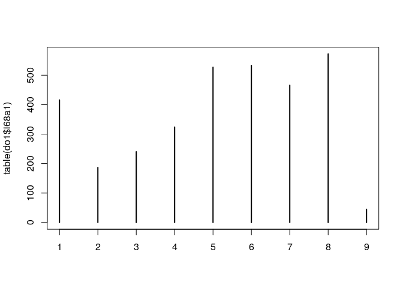
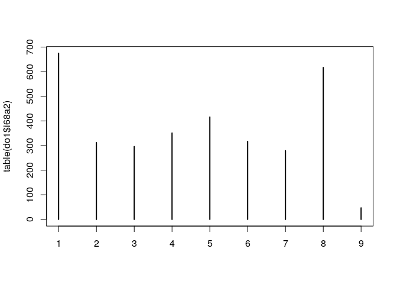
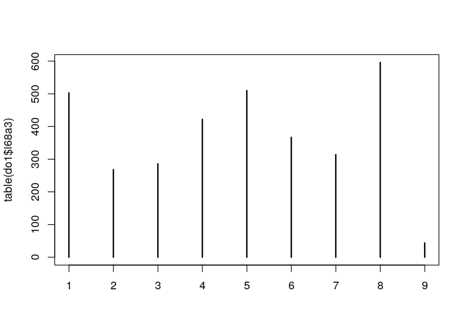
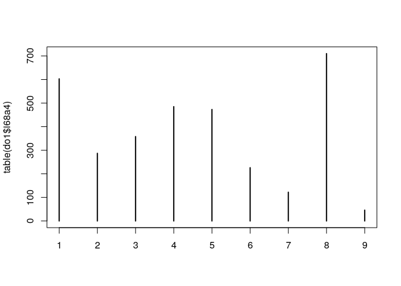
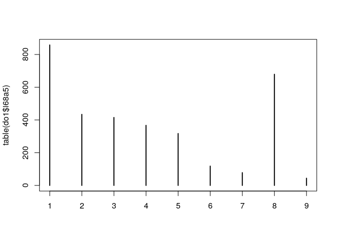
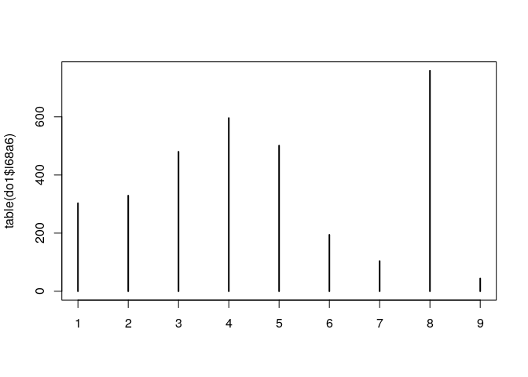
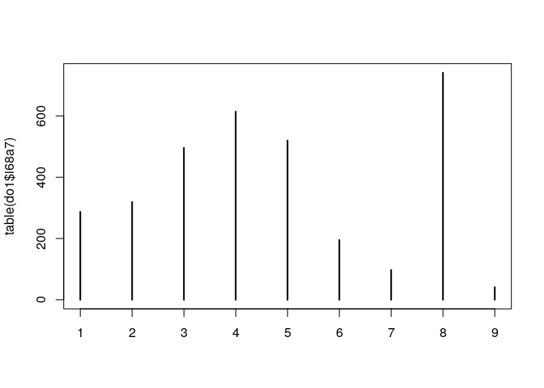
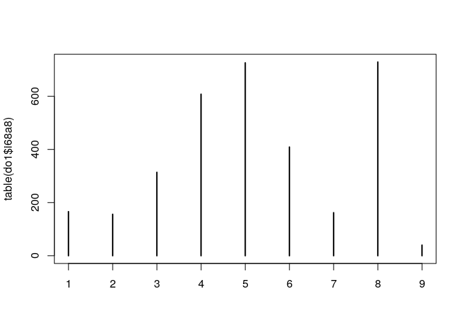
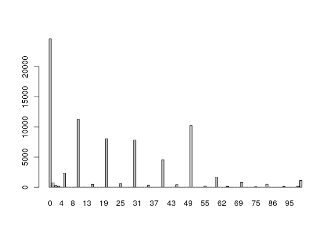
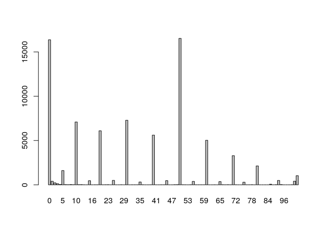

SIFCCT Recoding
================
Fan Lu & Gento Kato
Dec 30, 2019

# Preparation

``` r
## Clean Up Space
rm(list=ls())

## Set Working Directory (Automatically) ##
require(rstudioapi); require(rprojroot)
if (rstudioapi::isAvailable()==TRUE) {
  setwd(dirname(rstudioapi::getActiveDocumentContext()$path)); 
} 
projdir <- find_root(has_file("thisishome.txt"))
cat(paste("Working Directory Set to:\n",projdir))
```

    ## Working Directory Set to:
    ##  /home/gentok/Documents/Projects/ForeignerJapan

``` r
setwd(projdir)

## Find Data Directory
datadir1 <- paste(projdir,"data/original/panel_wave1-12.csv",sep="/")
datadir2 <- paste(projdir,"data/original/panel_wave13-24.csv",sep="/")

## Import Original Data
library(readr)
do1 <- read_csv(datadir1, locale=locale(encoding="UTF-8"), 
                col_types=paste(rep("c",764),collapse=""))
do2 <- read_csv(datadir2, locale=locale(encoding="UTF-8"), 
                col_types=paste(rep("c",548),collapse=""))
# # Use Only Flesh Samples
# do1 <- subset(do1, panel==0)
# do2 <- subset(do2, panel==0)

## Library Psych Package
require(psych)
```

# Data Manipulation

``` r
# Initiate New Data Set
d <- data.frame(id = c(do1$caseid, do2$caseid), 
                wave = as.integer(c(do1$wave, do2$wave)), 
                panel = as.integer(c(do1$panel, do2$panel)),
                panelid = c(do1$panelid, do2$panelid))

# Wave Variable
table(as.numeric(d$wave), useNA="always")
```

    ## 
    ##    1    2    3    4    5    6    7    8    9   10   11   12   13   14   15   16   17   18   19   20   21   22   23   24 <NA> 
    ## 3481 3310 3352 3518 3418 3405 3261 3215 3178 3069 3068 3032 3333 3266 3322 3247 3182 3088 3043 2970 2997 3043 3074 3206    0

## DEPENDENT variables of (potential) interest

### The local election suffrage should be granted to foreigners.

  - Original: 1=Strongly agree 5=Strongly disagree 6=DK 7=NA
  - Recoded: 0=Strongly disagree, 0.5=Neither/DK, 1=Strongly agree,
    Missing=NA

<!-- end list -->

``` r
# Original Variable
tmp <- c(do1$i58a3, do2$i58a3) 
table(d$wave, is.na(tmp)) # Not asked in 1, 23, 24 waves
```

    ##     
    ##      FALSE TRUE
    ##   1      0 3481
    ##   2   3310    0
    ##   3   3352    0
    ##   4   3518    0
    ##   5   3418    0
    ##   6   3405    0
    ##   7   3261    0
    ##   8   3215    0
    ##   9   3178    0
    ##   10  3069    0
    ##   11  3068    0
    ##   12  3032    0
    ##   13  3333    0
    ##   14  3266    0
    ##   15  3322    0
    ##   16  3247    0
    ##   17  3182    0
    ##   18  3088    0
    ##   19  3043    0
    ##   20  2970    0
    ##   21  2997    0
    ##   22  3043    0
    ##   23     0 3074
    ##   24     0 3206

``` r
table(tmp, useNA="always")
```

    ## tmp
    ##     1     2     3     4     5     6     7  <NA> 
    ##  5217 13081 13283  7565 21621  6252   298  9761

``` r
# Recoded Variable
d$foreignsuff <- ifelse(tmp==7, NA, ifelse(tmp==6, 2, 5 - as.numeric(tmp)))/4
table(d$foreignsuff, useNA="always")
```

    ## 
    ##     0  0.25   0.5  0.75     1  <NA> 
    ## 21621  7565 19535 13081  5217 10059

``` r
d$foreignsuff3 <- ifelse(d$foreignsuff==0.5,1,ifelse(d$foreignsuff>0.5,3,2))
d$foreignsuff3 <- factor(d$foreignsuff3, labels=c("Neither","Disagree","Agree"))
table(d$foreignsuff3, useNA="always")
```

    ## 
    ##  Neither Disagree    Agree     <NA> 
    ##    19535    29186    18298    10059

### Trustworthines of Foreigners (Only in Wave 2)

  - Original: 1=Not trustworthy 7=trustworthy
  - Recoded: 0-1 range, 1 is the most
trustworthy

<!-- end list -->

``` r
plot(table(do1$i68a1))
```

<!-- -->

``` r
plot(table(do1$i68a2))
```

<!-- -->

``` r
plot(table(do1$i68a3))
```

<!-- -->

``` r
plot(table(do1$i68a4))
```

<!-- -->

``` r
plot(table(do1$i68a5))
```

<!-- -->

``` r
plot(table(do1$i68a6))
```

<!-- -->

``` r
plot(table(do1$i68a7))
```

<!-- -->

``` r
plot(table(do1$i68a8))
```

<!-- -->

``` r
d$trust_old_sko <- d$trust_old_kor <- d$trust_old_chn <- 
  d$trust_new_sko <- d$trust_new_chn <- d$trust_new_bra <- 
  d$trust_new_phl <- d$trust_new_usa <- NA
d$trust_old_sko[1:nrow(do1)] <- old_sko <- 
  (ifelse(do1$i68a1==8,4,ifelse(do1$i68a1==9,NA,as.numeric(do1$i68a1)))-1)/6 # SK Old Commer
d$trust_old_kor[1:nrow(do1)] <- old_kor <- 
  (ifelse(do1$i68a2==8,4,ifelse(do1$i68a2==9,NA,as.numeric(do1$i68a2)))-1)/6 # Korean Peninsura Old Commer
d$trust_old_chn[1:nrow(do1)] <- old_chn <- 
  (ifelse(do1$i68a3==8,4,ifelse(do1$i68a3==9,NA,as.numeric(do1$i68a3)))-1)/6 # CH Old Commer
d$trust_new_sko[1:nrow(do1)] <- new_sko <- 
  (ifelse(do1$i68a4==8,4,ifelse(do1$i68a4==9,NA,as.numeric(do1$i68a4)))-1)/6 # SK New Commer
d$trust_new_chn[1:nrow(do1)] <- new_chn <- 
  (ifelse(do1$i68a5==8,4,ifelse(do1$i68a5==9,NA,as.numeric(do1$i68a5)))-1)/6 # CH New Commer
d$trust_new_bra[1:nrow(do1)] <- new_bra <- 
  (ifelse(do1$i68a6==8,4,ifelse(do1$i68a6==9,NA,as.numeric(do1$i68a6)))-1)/6 # Brazil New Commer
d$trust_new_phl[1:nrow(do1)] <- new_phl <- 
  (ifelse(do1$i68a7==8,4,ifelse(do1$i68a7==9,NA,as.numeric(do1$i68a7)))-1)/6 # PHL New Commer
d$trust_new_usa[1:nrow(do1)] <- new_usa <- 
  (ifelse(do1$i68a8==8,4,ifelse(do1$i68a8==9,NA,as.numeric(do1$i68a8)))-1)/6 # US New Commer

tmp <- cor(cbind(old_sko,old_kor,old_chn,new_sko,
                 new_chn,new_bra,new_phl,new_usa),use="pairwise") 
round(tmp,3)
```

    ##         old_sko old_kor old_chn new_sko new_chn new_bra new_phl new_usa
    ## old_sko   1.000   0.773   0.816   0.722   0.517   0.421   0.407   0.382
    ## old_kor   0.773   1.000   0.804   0.615   0.583   0.407   0.381   0.284
    ## old_chn   0.816   0.804   1.000   0.646   0.634   0.438   0.432   0.357
    ## new_sko   0.722   0.615   0.646   1.000   0.774   0.642   0.613   0.529
    ## new_chn   0.517   0.583   0.634   0.774   1.000   0.663   0.635   0.445
    ## new_bra   0.421   0.407   0.438   0.642   0.663   1.000   0.873   0.698
    ## new_phl   0.407   0.381   0.432   0.613   0.635   0.873   1.000   0.698
    ## new_usa   0.382   0.284   0.357   0.529   0.445   0.698   0.698   1.000

``` r
# Cronbach's Alpha
alpha(cbind(old_sko,old_kor,old_chn)) # Old Commers
```

    ## 
    ## Reliability analysis   
    ## Call: alpha(x = cbind(old_sko, old_kor, old_chn))
    ## 
    ##   raw_alpha std.alpha G6(smc) average_r S/N     ase mean   sd median_r
    ##       0.92      0.92    0.89       0.8  12 0.00069  0.5 0.29      0.8
    ## 
    ##  lower alpha upper     95% confidence boundaries
    ## 0.92 0.92 0.92 
    ## 
    ##  Reliability if an item is dropped:
    ##         raw_alpha std.alpha G6(smc) average_r S/N alpha se var.r med.r
    ## old_sko      0.89      0.89    0.80      0.80 8.2   0.0011    NA  0.80
    ## old_kor      0.90      0.90    0.82      0.82 8.9   0.0010    NA  0.82
    ## old_chn      0.87      0.87    0.77      0.77 6.8   0.0013    NA  0.77
    ## 
    ##  Item statistics 
    ##            n raw.r std.r r.cor r.drop mean   sd
    ## old_sko 3265  0.93  0.93  0.87   0.84 0.56 0.31
    ## old_kor 3263  0.92  0.92  0.86   0.83 0.45 0.31
    ## old_chn 3266  0.94  0.94  0.90   0.86 0.49 0.30
    ## 
    ## Non missing response frequency for each item
    ##            0 0.166666666666667 0.333333333333333  0.5 0.666666666666667 0.833333333333333    1 miss
    ## old_sko 0.13              0.06              0.07 0.27              0.16              0.16 0.14 0.92
    ## old_kor 0.21              0.10              0.09 0.30              0.13              0.10 0.09 0.92
    ## old_chn 0.15              0.08              0.09 0.31              0.16              0.11 0.10 0.92

``` r
alpha(cbind(new_sko,new_chn,new_bra,new_phl,new_usa)) # New Commers
```

    ## 
    ## Reliability analysis   
    ## Call: alpha(x = cbind(new_sko, new_chn, new_bra, new_phl, new_usa))
    ## 
    ##   raw_alpha std.alpha G6(smc) average_r S/N     ase mean   sd median_r
    ##        0.9      0.91    0.91      0.66 9.6 0.00079 0.45 0.21     0.65
    ## 
    ##  lower alpha upper     95% confidence boundaries
    ## 0.9 0.9 0.9 
    ## 
    ##  Reliability if an item is dropped:
    ##         raw_alpha std.alpha G6(smc) average_r S/N alpha se var.r med.r
    ## new_sko      0.89      0.89    0.88      0.67 8.1  0.00097 0.019  0.68
    ## new_chn      0.89      0.89    0.88      0.68 8.3  0.00095 0.013  0.67
    ## new_bra      0.86      0.86    0.86      0.62 6.4  0.00113 0.014  0.62
    ## new_phl      0.87      0.87    0.87      0.63 6.7  0.00109 0.014  0.65
    ## new_usa      0.90      0.90    0.91      0.70 9.3  0.00085 0.010  0.65
    ## 
    ##  Item statistics 
    ##            n raw.r std.r r.cor r.drop mean   sd
    ## new_sko 3264  0.85  0.84  0.79   0.75 0.43 0.27
    ## new_chn 3266  0.84  0.83  0.78   0.73 0.34 0.27
    ## new_bra 3266  0.90  0.91  0.90   0.84 0.46 0.24
    ## new_phl 3269  0.89  0.90  0.89   0.82 0.46 0.23
    ## new_usa 3270  0.78  0.79  0.72   0.66 0.55 0.23
    ## 
    ## Non missing response frequency for each item
    ##            0 0.166666666666667 0.333333333333333  0.5 0.666666666666667 0.833333333333333    1 miss
    ## new_sko 0.18              0.09              0.11 0.37              0.14              0.07 0.04 0.92
    ## new_chn 0.26              0.13              0.13 0.32              0.10              0.04 0.02 0.92
    ## new_bra 0.09              0.10              0.15 0.41              0.15              0.06 0.03 0.92
    ## new_phl 0.09              0.10              0.15 0.41              0.16              0.06 0.03 0.92
    ## new_usa 0.05              0.05              0.10 0.41              0.22              0.13 0.05 0.92

``` r
# Combine
d$trust_old <- d$trust_new <- NA
d$trust_old[1:nrow(do1)] <- (old_sko + old_kor + old_chn)/3
summary(d$trust_old)
```

    ##    Min. 1st Qu.  Median    Mean 3rd Qu.    Max.    NA's 
    ##    0.00    0.33    0.50    0.50    0.67    1.00   73817

``` r
d$trust_new[1:nrow(do1)] <- (new_sko + new_chn + new_bra + new_phl + new_usa)/5
summary(d$trust_new)
```

    ##    Min. 1st Qu.  Median    Mean 3rd Qu.    Max.    NA's 
    ##    0.00    0.30    0.50    0.45    0.54    1.00   73818

### Foreign friends/acquaintances in Japan. (Only in Wave 2)

  - Original: 1=1 or 2, 4=11 or more, 5=None, 6= Don’t want to answer
  - Recoded: 0=None, 1=Any Friend
  - Recoded 2: 0=None, 1=1or2, 2=More

<!-- end list -->

``` r
# Original: Only in Nov 2011 (Wave 2) survey!
table(do1$i62a1, do1$wave)
```

    ##    
    ##        1   10   11   12    2    3    4    5    6    7    8    9
    ##   1    0    0    0    0  541    0    0    0    0    0    0    0
    ##   2    0    0    0    0  261    0    0    0    0    0    0    0
    ##   3    0    0    0    0   67    0    0    0    0    0    0    0
    ##   4    0    0    0    0   75    0    0    0    0    0    0    0
    ##   5    0    0    0    0 2335    0    0    0    0    0    0    0
    ##   6    0    0    0    0   31    0    0    0    0    0    0    0

``` r
tmp <- c(do1$i62a1, rep(NA, nrow(do2)))
# Recoded 1
d$foreignfriend_jpn <- ifelse(tmp==6, NA, ifelse(tmp==5, 0, 1))
table(d$foreignfriend_jpn, useNA="always")
```

    ## 
    ##     0     1  <NA> 
    ##  2335   944 73799

``` r
# Recoded 2
d$foreignfriend_jpn2 <- ifelse(tmp==6, NA, ifelse(tmp==5, 0, 
                                                  ifelse(tmp%in%c(1), 1, 2)))
table(d$foreignfriend_jpn2, useNA="always")
```

    ## 
    ##     0     1     2  <NA> 
    ##  2335   541   403 73799

### Foreign friends/acquaintances outside of Japan. (Only in Wave2)

  - Original: 1=1 or 2, 4=11 or more, 5=None, 6= Don’t want to answer
  - Recoded 1: 0=None, 1=Any Friend
  - Recoded 2: 0=None, 1=1or2, 2=More

<!-- end list -->

``` r
# Original: Only in Nov 2011 (Wave 2) survey!
table(do1$i62a2, do1$wave) 
```

    ##    
    ##        1   10   11   12    2    3    4    5    6    7    8    9
    ##   1    0    0    0    0  440    0    0    0    0    0    0    0
    ##   2    0    0    0    0  272    0    0    0    0    0    0    0
    ##   3    0    0    0    0   94    0    0    0    0    0    0    0
    ##   4    0    0    0    0  118    0    0    0    0    0    0    0
    ##   5    0    0    0    0 2350    0    0    0    0    0    0    0
    ##   6    0    0    0    0   36    0    0    0    0    0    0    0

``` r
tmp <- c(do1$i62a2, rep(NA, nrow(do2)))
# Recoded 1
d$foreignfriend_out <- ifelse(tmp==6, NA, ifelse(tmp==5, 0, 1))
table(d$foreignfriend_out, useNA="always")
```

    ## 
    ##     0     1  <NA> 
    ##  2350   924 73804

``` r
# Recoded 2
d$foreignfriend_out2 <- ifelse(tmp==6, NA, ifelse(tmp==5, 0, 
                                                  ifelse(tmp%in%c(1), 1, 2)))
table(d$foreignfriend_out2, useNA="always")
```

    ## 
    ##     0     1     2  <NA> 
    ##  2350   440   484 73804

### Foreign relatives. (Only in Wave 2)

  - Original: 1=1 or 2, 4=11 or more, 5=None, 6= Don’t want to answer
  - Recoded: 0=None, 1=Any
  - Recoded 2: 0=None, 1=1or2, 2=More

<!-- end list -->

``` r
# Original: Only in Nov 2011 (Wave 2) survey!
table(do1$i62a3)
```

    ## 
    ##    1    2    3    4    5    6 
    ##  185   98   28   37 2926   36

``` r
tmp <- c(do1$i62a3, rep(NA, nrow(do2)))
# Recoded 1
d$foreignfamily <- ifelse(tmp==6, NA, ifelse(tmp==5, 0, 1))
table(d$foreignfamily, useNA="always")
```

    ## 
    ##     0     1  <NA> 
    ##  2926   348 73804

``` r
# Recoded 2
d$foreignfamily2 <- ifelse(tmp==6, NA, ifelse(tmp==5, 0, 
                                              ifelse(tmp%in%c(1), 1, 2)))
table(d$foreignfamily2, useNA="always")
```

    ## 
    ##     0     1     2  <NA> 
    ##  2926   185   163 73804

### Foreign Acquaintances (Only in Wave 2)

  - Recoded: 0=None, 1=Any
  - Recoded 2: 0=None, 1=1or2 (for only one), 2=More

<!-- end list -->

``` r
d$foreignacqu <- ifelse(d$foreignfriend_jpn + 
                          d$foreignfriend_out + 
                          d$foreignfamily > 0, 1, 0)
table(d$foreignacqu, useNA="always")
```

    ## 
    ##     0     1  <NA> 
    ##  1970  1299 73809

``` r
d$foreignacqu2 <- ifelse(d$foreignfriend_jpn2 + 
                          d$foreignfriend_out2 + 
                          d$foreignfamily2 > 1, 2,
                         d$foreignfriend_jpn2 + 
                           d$foreignfriend_out2 + 
                           d$foreignfamily2)
table(d$foreignacqu2, useNA="always")
```

    ## 
    ##     0     1     2  <NA> 
    ##  1970   443   856 73809

### Familiality with Foreign Countries

``` r
tmp2 <- as.numeric(c(do1$i14a2, do2$i14a2))
tmp2 <- ifelse(tmp2==999, NA, ifelse(tmp2==888, 50, tmp2))
barplot(table(tmp2, useNA="always"))
```

<!-- -->

``` r
d$familialityFT_CHN <- tmp2/100

tmp3 <- as.numeric(c(do1$i14a3, do2$i14a3))
tmp3 <- ifelse(tmp3==999, NA, ifelse(tmp3==888, 50, tmp3))
barplot(table(tmp3, useNA="always"))
```

<!-- -->

``` r
d$familialityFT_KOR <- tmp3/100
```

### Political Knowledge

  - Recoded: Sum of correct answers from 6 factual questions
    (standardized in 0-1 range)

<!-- end list -->

``` r
# Original 
tmp1 <- c(do1$i21, do2$i21)==4
table(tmp1, useNA="always")
```

    ## tmp1
    ## FALSE  TRUE  <NA> 
    ## 27047 39676 10355

``` r
tmp2 <- c(do1$i22, do2$i22)==3
table(tmp2, useNA="always")
```

    ## tmp2
    ## FALSE  TRUE  <NA> 
    ## 25221 41502 10355

``` r
tmp3 <- c(do1$i23, do2$i23)==2
table(tmp3, useNA="always")
```

    ## tmp3
    ## FALSE  TRUE  <NA> 
    ## 11552 55171 10355

``` r
tmp4 <- c(do1$i24, do2$i24)==2
table(tmp4, useNA="always")
```

    ## tmp4
    ## FALSE  TRUE  <NA> 
    ## 29867 36856 10355

``` r
tmp5 <- c(do1$i25, do2$i25)==3
table(tmp5, useNA="always")
```

    ## tmp5
    ## FALSE  TRUE  <NA> 
    ## 42941 23782 10355

``` r
tmp6 <- c(do1$i26, do2$i26)==3
table(tmp6, useNA="always")
```

    ## tmp6
    ## FALSE  TRUE  <NA> 
    ## 45241 21482 10355

``` r
# Recoded
d$knowledge <- (tmp1 + tmp2 + tmp3 + tmp4 + tmp5 + tmp6)/6
table(d$knowledge, useNA="always")
```

    ## 
    ##                 0 0.166666666666667 0.333333333333333               0.5 0.666666666666667 0.833333333333333                 1 
    ##              6887              7796              9019             10387             11384             11562              9688 
    ##              <NA> 
    ##             10355

``` r
# Cronbach's Alpha is 0.77
alpha(cbind(tmp1,tmp2,tmp3,tmp4,tmp5,tmp6))
```

    ## 
    ## Reliability analysis   
    ## Call: alpha(x = cbind(tmp1, tmp2, tmp3, tmp4, tmp5, tmp6))
    ## 
    ##   raw_alpha std.alpha G6(smc) average_r S/N    ase mean   sd median_r
    ##       0.77      0.77    0.74      0.35 3.3 0.0013 0.55 0.32     0.34
    ## 
    ##  lower alpha upper     95% confidence boundaries
    ## 0.76 0.77 0.77 
    ## 
    ##  Reliability if an item is dropped:
    ##      raw_alpha std.alpha G6(smc) average_r S/N alpha se  var.r med.r
    ## tmp1      0.71      0.71    0.67      0.33 2.5   0.0016 0.0047  0.33
    ## tmp2      0.72      0.72    0.68      0.34 2.5   0.0016 0.0048  0.34
    ## tmp3      0.74      0.74    0.70      0.36 2.8   0.0015 0.0030  0.34
    ## tmp4      0.72      0.72    0.68      0.34 2.5   0.0016 0.0053  0.33
    ## tmp5      0.75      0.75    0.71      0.37 3.0   0.0014 0.0050  0.40
    ## tmp6      0.75      0.75    0.71      0.38 3.0   0.0014 0.0044  0.40
    ## 
    ##  Item statistics 
    ##          n raw.r std.r r.cor r.drop mean   sd
    ## tmp1 66723  0.74  0.73  0.66   0.58 0.59 0.49
    ## tmp2 66723  0.72  0.72  0.64   0.56 0.62 0.48
    ## tmp3 66723  0.63  0.66  0.56   0.49 0.83 0.38
    ## tmp4 66723  0.73  0.72  0.65   0.56 0.55 0.50
    ## tmp5 66723  0.63  0.63  0.50   0.44 0.36 0.48
    ## tmp6 66723  0.62  0.62  0.49   0.43 0.32 0.47
    ## 
    ## Non missing response frequency for each item
    ##      FALSE TRUE miss
    ## tmp1  0.41 0.59 0.13
    ## tmp2  0.38 0.62 0.13
    ## tmp3  0.17 0.83 0.13
    ## tmp4  0.45 0.55 0.13
    ## tmp5  0.64 0.36 0.13
    ## tmp6  0.68 0.32 0.13

### Interest in politics.

  - Original: 1= interested 4= Not interested 5=DK 6= Don’t want to
    answer
  - Recoded: 0=Not interested to 1=Interested, Missing=DK/NA

<!-- end list -->

``` r
# Original
tmp <- as.numeric(c(do1$i5, do2$i5))
table(tmp, useNA="always") 
```

    ## tmp
    ##     1     2     3     4     5     6  <NA> 
    ## 19145 39079 13723  4321   644   166     0

``` r
# Recoded
d$polint <- ifelse(tmp%in%c(5,6), NA, 4 - tmp)/3
table(d$polint, useNA="always")
```

    ## 
    ##                 0 0.333333333333333 0.666666666666667                 1              <NA> 
    ##              4321             13723             39079             19145               810

### Interest in international issues facing Japan.

  - Original: 1= interested 4= Not interested 5=DK 6= Don’t want to
    answer
  - Recoded: 1=Not interested, 4=Interested, Missing=DK/NA

<!-- end list -->

``` r
# Original
tmp <- as.numeric(c(do1$i6, do2$i6))
table(tmp, useNA="always") 
```

    ## tmp
    ##     1     2     3     4     5     6  <NA> 
    ## 23271 40507  9593  2789   790   128     0

``` r
# Recoded
d$intlint <- ifelse(tmp%in%c(5,6), NA, 4 - tmp)/3
table(d$intlint, useNA="always")
```

    ## 
    ##                 0 0.333333333333333 0.666666666666667                 1              <NA> 
    ##              2789              9593             40507             23271               918

## PREDICTORS

### Education (Ordinal)

  - Original: 1= primary/junior-high school, 2=High School, 3=Junior
    College/Vocational School, 4= College/Grad School, 5= NA
  - Recoded: 1= “\<=SHS”, 2=“Junior College/Vocational School”,
    3=“\>=College”

<!-- end list -->

``` r
# Original
tmp <- as.numeric(c(do1$i40, do2$i40))
table(tmp, useNA="always")
```

    ## tmp
    ##     1     2     3     4     5  <NA> 
    ##   755 16634 16264 42533   892     0

``` r
# Recoded
d$edu <- ifelse(tmp==5, NA, ifelse(tmp==1, 1, tmp-1))
# Make it a Factor
d$edu <- factor(d$edu, labels = c("<=SHS",
                                  ">SHS & <College(4yr)",
                                  ">=College(4yr)"))
table(d$edu, useNA="always")
```

    ## 
    ##                <=SHS >SHS & <College(4yr)       >=College(4yr)                 <NA> 
    ##                17389                16264                42533                  892

### Gender

  - Original: 1=male 2=female 3=NA
  - Recoded: 0=male, 1=female

<!-- end list -->

``` r
# Original
tmp <- as.numeric(c(do1$i38, do2$i38))
table(tmp, useNA="always")
```

    ## tmp
    ##     1     2     3  <NA> 
    ## 40038 36820   220     0

``` r
# Recoded
d$female <- ifelse(tmp==3, NA, tmp-1)
table(d$female, useNA="always")
```

    ## 
    ##     0     1  <NA> 
    ## 40038 36820   220

``` r
d$male <- 1 - d$female
```

### Age

  - Original: 70=70 or over, 99=NA
  - Recoded: NA into Missing
  - Recoded (Categorical):

<!-- end list -->

``` r
# Original
tmp <- as.numeric(c(do1$i39, do2$i39))
table(tmp, useNA="always")
```

    ## tmp
    ##   19   20   21   22   23   24   25   26   27   28   29   30   31   32   33   34   35   36   37   38   39   40   41   42   43 
    ##   17  868  862 1009  858 1055 1140 1260 1299 1568 1787 1144 1111 1201 1313 1638 1627 1809 2019 2079 2230 1624 1514 1513 1344 
    ##   44   45   46   47   48   49   50   51   52   53   54   55   56   57   58   59   60   61   62   63   64   65   66   67   68 
    ## 1418 1331 1302 1418 1575 1511 2316 2097 1992 1769 1735 1552 1365 1273 1175 1278 2539 2467 2423 2435 2067 1667 1144  981 1042 
    ##   69   70   99 <NA> 
    ## 1089  149   79    0

``` r
# Recoded
d$age <- ifelse(tmp==99, NA, tmp)
table(d$age, useNA="always")
```

    ## 
    ##   19   20   21   22   23   24   25   26   27   28   29   30   31   32   33   34   35   36   37   38   39   40   41   42   43 
    ##   17  868  862 1009  858 1055 1140 1260 1299 1568 1787 1144 1111 1201 1313 1638 1627 1809 2019 2079 2230 1624 1514 1513 1344 
    ##   44   45   46   47   48   49   50   51   52   53   54   55   56   57   58   59   60   61   62   63   64   65   66   67   68 
    ## 1418 1331 1302 1418 1575 1511 2316 2097 1992 1769 1735 1552 1365 1273 1175 1278 2539 2467 2423 2435 2067 1667 1144  981 1042 
    ##   69   70 <NA> 
    ## 1089  149   79

``` r
# Recoded Categorical
d$agecat <- NA
d$agecat[d$age >= 60] <- "Elder (>=60s)"
d$agecat[d$age >= 40 & d$age < 60] <- "Middle Aged (40-50s)"
d$agecat[d$age < 40] <- "Young (<=30s)"
## coerce new character variable into a factor variable
d$agecat <- factor(d$agecat, levels=c("Young (<=30s)",
                                      "Middle Aged (40-50s)",
                                      "Elder (>=60s)"))
table(d$agecat, useNA="always") 
```

    ## 
    ##        Young (<=30s) Middle Aged (40-50s)        Elder (>=60s)                 <NA> 
    ##                27894                31102                18003                   79

### Marital Status

``` r
tmp <- c(do1$i43,do2$i43)
table(tmp)
```

    ## tmp
    ##     1     2     3 
    ## 51285 24980   813

``` r
d$married <- ifelse(tmp==3,NA,ifelse(tmp==1,1,0))
table(d$married)
```

    ## 
    ##     0     1 
    ## 24980 51285

### Income

``` r
# Original
tmp <- as.numeric(c(do1$i41, do2$i41))
table(tmp, useNA="always")
```

    ## tmp
    ##     1     2     3     4     5     6     7     8     9    10  <NA> 
    ##  5566 13973 16493 13115  8413  4626  2335  3389  3955  5213     0

``` r
# Recoded
## Percentile Conversion Function
convper <- function(old.var,missing.val){
  r <- old.var
  r[r %in% missing.val] <- NA
  rt <- cumsum(table(r)/sum(table(r))) # Cummulative Percentile
  rt <- rt - diff(c(0,rt))/2 # Take Midpoints 
  r <- rt[match(r, names(rt))]
  return(r)
}
d$income <- convper(tmp, c(9,10))
table(d$income, useNA="always")
```

    ## 
    ## 0.0409807097629215    0.1848402297158  0.409151818583419  0.627146222942129   0.78565012516566  0.881652186717715 
    ##               5566              13973              16493              13115               8413               4626 
    ##  0.932903843322044  0.975047857458401               <NA> 
    ##               2335               3389               9168

### Newspaper which is read the most

``` r
# Original
tmp <- as.numeric(c(do1$i3, do2$i3))
table(tmp, useNA="always")
```

    ## tmp
    ##     1     2     3     4     5     6     7     8     9    10  <NA> 
    ## 10438 11749  2612 10411  1746 17851   697  1872   217    52 19433

``` r
tmpx <- as.numeric(c(do1$i2,do2$i2))
table(tmp, tmpx, useNA="always")
```

    ##       tmpx
    ## tmp        1     2     3     4     5     6     7  <NA>
    ##   1        0   921   884   975  7658     0     0     0
    ##   2        0   927  1027  1008  8787     0     0     0
    ##   3        0   238   278   238  1858     0     0     0
    ##   4        0  1120  1087  1013  7191     0     0     0
    ##   5        0   190   207   172  1177     0     0     0
    ##   6        0  1833  1739  1587 12692     0     0     0
    ##   7        0   217   172    51   257     0     0     0
    ##   8        0   361   282   188  1041     0     0     0
    ##   9        0   163    23     5    26     0     0     0
    ##   10       0    19    11     6    16     0     0     0
    ##   <NA> 15950   276   290   253  1976   510   178     0

``` r
# Recoded
d$npmost <- ifelse(tmpx==1,0,ifelse(tmp==10, NA, ifelse(tmp%in%c(7,8,9), 7, tmp)))
d$npmost <- factor(d$npmost, labels=c("None","Yomiuri","Asahi","Mainichi","Nikkei",
                                      "Sankei","Regional","Others"))
table(d$npmost, useNA="always")
```

    ## 
    ##     None  Yomiuri    Asahi Mainichi   Nikkei   Sankei Regional   Others     <NA> 
    ##    15950    10438    11749     2612    10411     1746    17851     2786     3535

``` r
# Recoded 2
d$npmost2 <- ifelse(d$npmost=="None","None",
                    ifelse(d$npmost%in%c("Yomiuri","Sankei"),"Yomiuri/Sankei",
                           ifelse(d$npmost%in%c("Asahi","Mainichi"),"Asahi/Mainichi",
                                  ifelse(d$npmost%in%c("Nikkei"),"Nikkei",
                                         ifelse(d$npmost%in%c("Regional","Others"),"Regional/Others",NA)))))
d$npmost2 <- factor(d$npmost2, levels=c("None","Yomiuri/Sankei","Asahi/Mainichi","Nikkei",
                                      "Regional/Others"))
table(d$npmost2, useNA="always")
```

    ## 
    ##            None  Yomiuri/Sankei  Asahi/Mainichi          Nikkei Regional/Others            <NA> 
    ##           15950           12184           14361           10411           20637            3535

### assessment of current life condition.

Note: Question Wording is randomized among fresh respondents.

  - Original: 1=good 5=bad, 6=DK, 7=NA
  - Recoded: 0=bad, 0.5=Neither/DK, 1=good, NA=NA

<!-- end list -->

``` r
# Original: Combine All randomized responses
tmp <- as.numeric(c(do1$i9f1, do2$i9f1))
tmp[is.na(tmp)] <- as.numeric(c(do1$i9f2, do2$i9f2))[is.na(tmp)]
tmp[is.na(tmp)] <- as.numeric(c(do1$i9p, do2$i9p))[is.na(tmp)]
table(tmp, useNA="always")
```

    ## tmp
    ##     1     2     3     4     5     6     7  <NA> 
    ##  1529 16681 27342 15154 15449   724   199     0

``` r
# Recoded
d$evlife <- ifelse(tmp==7, NA, ifelse(tmp==6, 0.5, 5 - tmp))/4
table(d$evlife, useNA="always")
```

    ## 
    ##     0 0.125  0.25   0.5  0.75     1  <NA> 
    ## 15449   724 15154 27342 16681  1529   199

``` r
# Question Wording Type (just in case)
# 0 = assessment of current economy
# 1 = assessment of the change in economy from a month ago
d$evlife_qtype <- (is.na(c(do1$i9f1, do2$i9f1)) & d$panel==1)*1
table(d$evlife_qtype, useNA="always")
```

    ## 
    ##     0     1  <NA> 
    ## 53231 23847     0

### assessment of current japanese economy.

Note: Question Wording is randomized among fresh respondents.

  - Original: 1=good 5=bad, 6=DK, 7=NA
  - Recoded: 0=bad, 0.5=Neither/DK, 1=good, NA=NA

<!-- end list -->

``` r
# Original: Combine All randomized responses
tmp <- as.numeric(c(do1$i11f1, do2$i11f1))
tmp[is.na(tmp)] <- as.numeric(c(do1$i11f2, do2$i11f2))[is.na(tmp)]
tmp[is.na(tmp)] <- as.numeric(c(do1$i11p, do2$i11p))[is.na(tmp)]
table(tmp, useNA="always")
```

    ## tmp
    ##     1     2     3     4     5     6     7  <NA> 
    ##   442  5748 22702 20971 24653  2432   130     0

``` r
# Recoded
d$evecon <- ifelse(tmp==7, NA, ifelse(tmp==6, 2, 5 - tmp))/4
table(d$evecon, useNA="always")
```

    ## 
    ##     0  0.25   0.5  0.75     1  <NA> 
    ## 24653 20971 25134  5748   442   130

``` r
# Question Wording Type (just in case)
# 0 = assessment of current economy
# 1 = assessment of the change in economy from a month ago
d$evecon_qtype <- (is.na(c(do1$i11f1, do2$i11f1)) & d$panel==1)*1
table(d$evecon_qtype, useNA="always")
```

    ## 
    ##     0     1  <NA> 
    ## 53231 23847     0

### Internet Usage

Original: 1=less than 30min 7=about more than 5 hrs, 8=NA Recoded:
Standardized to 0-1 range. NA=NA

``` r
# Original
tmp <- as.numeric(c(do1$i45, do2$i45))
table(tmp, useNA="always")
```

    ## tmp
    ##     1     2     3     4     5     6     7     8  <NA> 
    ##  2330  9985 22376 18818  9917  4803  8373   476     0

``` r
# Recoded
d$netuse <- ifelse(tmp==8, NA, tmp-1)/6
table(d$netuse, useNA="always")
```

    ## 
    ##                 0 0.166666666666667 0.333333333333333               0.5 0.666666666666667 0.833333333333333                 1 
    ##              2330              9985             22376             18818              9917              4803              8373 
    ##              <NA> 
    ##               476

### party support

Original (e.g., version “a”): 1=Democratic Party of Japan (DPJ),
2=Liberal Democratic Party (LDP), 3=New Komeito (CGP), 4=Japanese
Communist Party (JCP) 5= Social Democratic Party (SDP) 6=Your Party (YP)
7=Other, 8=Don’t support any 9=Don’t want to answer

Recoded (Categorical): 1=Mutoha(No Party), 2=DPJ, 3=LDP, 4=CGP(Komeito),
5=JCP, 6=SDP, 7=YP, 8=JRP (Japan Restoration Party), 9=Others, NA=NA

``` r
# Original: Combine All Responses
tmp <- c(do1$i42a, rep(NA,nrow(do2))) 
table(tmp, d$wave, useNA="always") # from wave 1-10 (Version "a")
```

    ##       
    ## tmp       1    2    3    4    5    6    7    8    9   10   11   12   13   14   15   16   17   18   19   20   21   22   23   24
    ##   1     533  551  495  505  440  459  386  399  408  334    0    0    0    0    0    0    0    0    0    0    0    0    0    0
    ##   2     582  506  509  518  472  467  445  467  459  432    0    0    0    0    0    0    0    0    0    0    0    0    0    0
    ##   3      53   47   50   47   47   44   46   41   43   67    0    0    0    0    0    0    0    0    0    0    0    0    0    0
    ##   4      86   91   90   95   86   93   81  100   85   77    0    0    0    0    0    0    0    0    0    0    0    0    0    0
    ##   5      42   41   39   40   45   36   35   42   30   31    0    0    0    0    0    0    0    0    0    0    0    0    0    0
    ##   6     219  245  255  286  251  264  221  206  215  189    0    0    0    0    0    0    0    0    0    0    0    0    0    0
    ##   7      23   24   33   51   52   57   72   55   36   87    0    0    0    0    0    0    0    0    0    0    0    0    0    0
    ##   8    1809 1674 1739 1862 1895 1901 1848 1795 1792 1749    0    0    0    0    0    0    0    0    0    0    0    0    0    0
    ##   9     134  131  142  114  130   84  127  110  110  103    0    0    0    0    0    0    0    0    0    0    0    0    0    0
    ##   <NA>    0    0    0    0    0    0    0    0    0    0 3068 3032 3333 3266 3322 3247 3182 3088 3043 2970 2997 3043 3074 3206
    ##       
    ## tmp    <NA>
    ##   1       0
    ##   2       0
    ##   3       0
    ##   4       0
    ##   5       0
    ##   6       0
    ##   7       0
    ##   8       0
    ##   9       0
    ##   <NA>    0

``` r
tmp[is.na(tmp)] <- c(do1$i42b, rep(NA,nrow(do2)))[is.na(tmp)]
table(tmp, d$wave, useNA="always") # wave 11 only (Version "b")
```

    ##       
    ## tmp       1    2    3    4    5    6    7    8    9   10   11   12   13   14   15   16   17   18   19   20   21   22   23   24
    ##   1     533  551  495  505  440  459  386  399  408  334  309    0    0    0    0    0    0    0    0    0    0    0    0    0
    ##   10      0    0    0    0    0    0    0    0    0    0  130    0    0    0    0    0    0    0    0    0    0    0    0    0
    ##   2     582  506  509  518  472  467  445  467  459  432  451    0    0    0    0    0    0    0    0    0    0    0    0    0
    ##   3      53   47   50   47   47   44   46   41   43   67   45    0    0    0    0    0    0    0    0    0    0    0    0    0
    ##   4      86   91   90   95   86   93   81  100   85   77   67    0    0    0    0    0    0    0    0    0    0    0    0    0
    ##   5      42   41   39   40   45   36   35   42   30   31   24    0    0    0    0    0    0    0    0    0    0    0    0    0
    ##   6     219  245  255  286  251  264  221  206  215  189  182    0    0    0    0    0    0    0    0    0    0    0    0    0
    ##   7      23   24   33   51   52   57   72   55   36   87   67    0    0    0    0    0    0    0    0    0    0    0    0    0
    ##   8    1809 1674 1739 1862 1895 1901 1848 1795 1792 1749   60    0    0    0    0    0    0    0    0    0    0    0    0    0
    ##   9     134  131  142  114  130   84  127  110  110  103 1733    0    0    0    0    0    0    0    0    0    0    0    0    0
    ##   <NA>    0    0    0    0    0    0    0    0    0    0    0 3032 3333 3266 3322 3247 3182 3088 3043 2970 2997 3043 3074 3206
    ##       
    ## tmp    <NA>
    ##   1       0
    ##   10      0
    ##   2       0
    ##   3       0
    ##   4       0
    ##   5       0
    ##   6       0
    ##   7       0
    ##   8       0
    ##   9       0
    ##   <NA>    0

``` r
tmp[is.na(tmp)] <- c(do1$i42c, do2$i42c)[is.na(tmp)]
table(tmp, d$wave, useNA="always") # wave 12-14 (Version "c")
```

    ##       
    ## tmp       1    2    3    4    5    6    7    8    9   10   11   12   13   14   15   16   17   18   19   20   21   22   23   24
    ##   1     533  551  495  505  440  459  386  399  408  334  309  301  386  381    0    0    0    0    0    0    0    0    0    0
    ##   10      0    0    0    0    0    0    0    0    0    0  130 1582 1686 1653    0    0    0    0    0    0    0    0    0    0
    ##   11      0    0    0    0    0    0    0    0    0    0    0  138  160  149    0    0    0    0    0    0    0    0    0    0
    ##   2     582  506  509  518  472  467  445  467  459  432  451  493  540  507    0    0    0    0    0    0    0    0    0    0
    ##   3      53   47   50   47   47   44   46   41   43   67   45   43   58   43    0    0    0    0    0    0    0    0    0    0
    ##   4      86   91   90   95   86   93   81  100   85   77   67   83   77   81    0    0    0    0    0    0    0    0    0    0
    ##   5      42   41   39   40   45   36   35   42   30   31   24   21   43   33    0    0    0    0    0    0    0    0    0    0
    ##   6     219  245  255  286  251  264  221  206  215  189  182   84  116  107    0    0    0    0    0    0    0    0    0    0
    ##   7      23   24   33   51   52   57   72   55   36   87   67   49   55   70    0    0    0    0    0    0    0    0    0    0
    ##   8    1809 1674 1739 1862 1895 1901 1848 1795 1792 1749   60  216  183  213    0    0    0    0    0    0    0    0    0    0
    ##   9     134  131  142  114  130   84  127  110  110  103 1733   22   29   29    0    0    0    0    0    0    0    0    0    0
    ##   <NA>    0    0    0    0    0    0    0    0    0    0    0    0    0    0 3322 3247 3182 3088 3043 2970 2997 3043 3074 3206
    ##       
    ## tmp    <NA>
    ##   1       0
    ##   10      0
    ##   11      0
    ##   2       0
    ##   3       0
    ##   4       0
    ##   5       0
    ##   6       0
    ##   7       0
    ##   8       0
    ##   9       0
    ##   <NA>    0

``` r
tmp[is.na(tmp)] <- c(rep(NA,nrow(do1)), do2$i42d)[is.na(tmp)]
table(tmp, d$wave, useNA="always") # wave 15 only (Version "d")
```

    ##       
    ## tmp       1    2    3    4    5    6    7    8    9   10   11   12   13   14   15   16   17   18   19   20   21   22   23   24
    ##   1     533  551  495  505  440  459  386  399  408  334  309  301  386  381  280    0    0    0    0    0    0    0    0    0
    ##   10      0    0    0    0    0    0    0    0    0    0  130 1582 1686 1653    1    0    0    0    0    0    0    0    0    0
    ##   11      0    0    0    0    0    0    0    0    0    0    0  138  160  149   10    0    0    0    0    0    0    0    0    0
    ##   12      0    0    0    0    0    0    0    0    0    0    0    0    0    0    5    0    0    0    0    0    0    0    0    0
    ##   13      0    0    0    0    0    0    0    0    0    0    0    0    0    0    7    0    0    0    0    0    0    0    0    0
    ##   14      0    0    0    0    0    0    0    0    0    0    0    0    0    0 1624    0    0    0    0    0    0    0    0    0
    ##   15      0    0    0    0    0    0    0    0    0    0    0    0    0    0  128    0    0    0    0    0    0    0    0    0
    ##   2     582  506  509  518  472  467  445  467  459  432  451  493  540  507  572    0    0    0    0    0    0    0    0    0
    ##   3      53   47   50   47   47   44   46   41   43   67   45   43   58   43   58    0    0    0    0    0    0    0    0    0
    ##   4      86   91   90   95   86   93   81  100   85   77   67   83   77   81   66    0    0    0    0    0    0    0    0    0
    ##   5      42   41   39   40   45   36   35   42   30   31   24   21   43   33   95    0    0    0    0    0    0    0    0    0
    ##   6     219  245  255  286  251  264  221  206  215  189  182   84  116  107  197    0    0    0    0    0    0    0    0    0
    ##   7      23   24   33   51   52   57   72   55   36   87   67   49   55   70  242    0    0    0    0    0    0    0    0    0
    ##   8    1809 1674 1739 1862 1895 1901 1848 1795 1792 1749   60  216  183  213   31    0    0    0    0    0    0    0    0    0
    ##   9     134  131  142  114  130   84  127  110  110  103 1733   22   29   29    6    0    0    0    0    0    0    0    0    0
    ##   <NA>    0    0    0    0    0    0    0    0    0    0    0    0    0    0    0 3247 3182 3088 3043 2970 2997 3043 3074 3206
    ##       
    ## tmp    <NA>
    ##   1       0
    ##   10      0
    ##   11      0
    ##   12      0
    ##   13      0
    ##   14      0
    ##   15      0
    ##   2       0
    ##   3       0
    ##   4       0
    ##   5       0
    ##   6       0
    ##   7       0
    ##   8       0
    ##   9       0
    ##   <NA>    0

``` r
tmp[is.na(tmp)] <- c(rep(NA,nrow(do1)), do2$i42e)[is.na(tmp)]
table(tmp, d$wave, useNA="always") # wave 16-24 (Version "e")
```

    ##       
    ## tmp       1    2    3    4    5    6    7    8    9   10   11   12   13   14   15   16   17   18   19   20   21   22   23   24
    ##   1     533  551  495  505  440  459  386  399  408  334  309  301  386  381  280  675  744  736  758  762  739  732  785  746
    ##   10      0    0    0    0    0    0    0    0    0    0  130 1582 1686 1653    1 1529 1415 1421 1444 1423 1421 1390 1382 1591
    ##   11      0    0    0    0    0    0    0    0    0    0    0  138  160  149   10  114  114  120  104  103  120  147  141  147
    ##   12      0    0    0    0    0    0    0    0    0    0    0    0    0    0    5    0    0    0    0    0    0    0    0    0
    ##   13      0    0    0    0    0    0    0    0    0    0    0    0    0    0    7    0    0    0    0    0    0    0    0    0
    ##   14      0    0    0    0    0    0    0    0    0    0    0    0    0    0 1624    0    0    0    0    0    0    0    0    0
    ##   15      0    0    0    0    0    0    0    0    0    0    0    0    0    0  128    0    0    0    0    0    0    0    0    0
    ##   2     582  506  509  518  472  467  445  467  459  432  451  493  540  507  572  228  186  196  157  171  180  161  137  142
    ##   3      53   47   50   47   47   44   46   41   43   67   45   43   58   43   58  258  261  209  224  147  158  202  217  186
    ##   4      86   91   90   95   86   93   81  100   85   77   67   83   77   81   66   60   69   53   52   55   51   54   47   59
    ##   5      42   41   39   40   45   36   35   42   30   31   24   21   43   33   95  210  202  184  153  151  153  149  148  154
    ##   6     219  245  255  286  251  264  221  206  215  189  182   84  116  107  197   36   38   37   31   36   32   38   40   31
    ##   7      23   24   33   51   52   57   72   55   36   87   67   49   55   70  242   77  103   71   72   75   86  113  116  104
    ##   8    1809 1674 1739 1862 1895 1901 1848 1795 1792 1749   60  216  183  213   31   42   40   44   32   36   33   31   29   28
    ##   9     134  131  142  114  130   84  127  110  110  103 1733   22   29   29    6   18   10   17   16   11   24   26   32   18
    ##   <NA>    0    0    0    0    0    0    0    0    0    0    0    0    0    0    0    0    0    0    0    0    0    0    0    0
    ##       
    ## tmp    <NA>
    ##   1       0
    ##   10      0
    ##   11      0
    ##   12      0
    ##   13      0
    ##   14      0
    ##   15      0
    ##   2       0
    ##   3       0
    ##   4       0
    ##   5       0
    ##   6       0
    ##   7       0
    ##   8       0
    ##   9       0
    ##   <NA>    0

``` r
# Original: Response Category Type
tmptype <- ifelse(d$wave%in%c(1:10),"a",
                  ifelse(d$wave%in%c(11),"b",
                         ifelse(d$wave%in%c(12:14),"c",
                                ifelse(d$wave%in%c(15),"d","e"))))
table(tmptype, useNA="always")
```

    ## tmptype
    ##     a     b     c     d     e  <NA> 
    ## 33207  3068  9631  3322 27850     0

``` r
# Original: NA Locations
tmpNA <- rep(0, length(tmp))
tmpNA[which(tmptype=="a" & tmp==9)] <- 1
tmpNA[which(tmptype=="b" & tmp==10)] <- 1
tmpNA[which(tmptype=="c" & tmp==11)] <- 1
tmpNA[which(tmptype=="d" & tmp==15)] <- 1
tmpNA[which(tmptype=="e" & tmp==11)] <- 1
table(tmpNA, useNA="always")
```

    ## tmpNA
    ##     0     1  <NA> 
    ## 74078  3000     0

``` r
# Recoded
## DPJ
d$dpj <- ifelse(tmptype%in%c("a","b","c","d"), (tmp==1)*1, (tmp==2)*1)
d$dpj[tmpNA==1] <- NA
table(d$dpj, useNA="always")
```

    ## 
    ##     0     1  <NA> 
    ## 66353  7725  3000

``` r
## LDP
d$ldp <- ifelse(tmptype%in%c("a","b","c","d"), (tmp==2)*1, (tmp==1)*1)
d$ldp[tmpNA==1] <- NA
table(d$ldp, useNA="always")
```

    ## 
    ##     0     1  <NA> 
    ## 59981 14097  3000

``` r
## CGP
d$cgp <- ifelse(tmptype%in%c("a","b","c"), (tmp==3)*1, (tmp==4)*1)
d$cgp[tmpNA==1] <- NA
table(d$cgp, useNA="always")
```

    ## 
    ##     0     1  <NA> 
    ## 72838  1240  3000

``` r
## JCP
d$jcp <- ifelse(tmptype%in%c("a","b","c"), (tmp==4)*1, 
                ifelse(tmptype=="d", (tmp==5)*1, (tmp==7)*1))
d$jcp[tmpNA==1] <- NA
table(d$jcp, useNA="always")
```

    ## 
    ##     0     1  <NA> 
    ## 71974  2104  3000

``` r
## SDP
d$sdp <- ifelse(tmptype%in%c("a","b","c"), (tmp==5)*1, (tmp==8)*1)
d$sdp[tmpNA==1] <- NA
table(d$sdp, useNA="always")
```

    ## 
    ##     0     1  <NA> 
    ## 73230   848  3000

``` r
## YP
d$yp <- ifelse(tmptype%in%c("a","b","c","d"), (tmp==6)*1, (tmp==5)*1)
d$yp[tmpNA==1] <- NA
table(d$yp, useNA="always")
```

    ## 
    ##     0     1  <NA> 
    ## 69537  4541  3000

``` r
## JRP
d$jrp <- ifelse(tmptype%in%c("a","b"), 0, 
                ifelse(tmptype=="c", (tmp==8)*1, 
                       ifelse(tmptype=="d", (tmp==7)*1, (tmp==3)*1)))
d$jrp[tmpNA==1] <- NA
table(d$jrp, useNA="always")
```

    ## 
    ##     0     1  <NA> 
    ## 71362  2716  3000

``` r
## PLP Seikatsu/Mirai (People's Life Party)
d$plp <- ifelse(tmptype=="a", 0, 
                     ifelse(tmptype%in%c("b","c"), (tmp==7)*1, 
                            ifelse(tmptype=="d", (tmp==3)*1, (tmp==6)*1)))
d$plp[tmpNA==1] <- NA
table(d$plp, useNA="always")
```

    ## 
    ##     0     1  <NA> 
    ## 73460   618  3000

``` r
## other parties 
d$othp <- ifelse(tmptype=="a", (tmp%in%c(7))*1, 
                 ifelse(tmptype=="b", (tmp%in%c(8))*1, 
                        ifelse(tmptype=="c", (tmp%in%c(9))*1,
                               ifelse(tmptype=="d", (tmp%in%c(9,10,11,12,13))*1,
                                      (tmp%in%c(9))*1)))) 
d$othp[tmpNA==1] <- NA
table(d$othp, useNA="always")
```

    ## 
    ##     0     1  <NA> 
    ## 73247   831  3000

``` r
## mutoha (No party support)
d$mutoha <- ifelse(tmptype=="a", (tmp==8)*1, 
                 ifelse(tmptype=="b", (tmp==9)*1, 
                        ifelse(tmptype=="c", (tmp==10)*1,
                               ifelse(tmptype=="d", (tmp==14)*1,
                                      (tmp==10)*1)))) 
d$mutoha[tmpNA==1] <- NA
table(d$mutoha, useNA="always")
```

    ## 
    ##     0     1  <NA> 
    ## 34720 39358  3000

``` r
## Categorical Party Variable
### Check that variables do not overlap
with(d, table(dpj+ldp+cgp+jcp+sdp+yp+jrp+plp+othp+mutoha, useNA="always"))
```

    ## 
    ##     1  <NA> 
    ## 74078  3000

``` r
### Create variable
d$psup <- NA
d$psup[d$mutoha==1] <- "None"
d$psup[d$dpj==1] <- "DPJ"
d$psup[d$ldp==1] <- "LDP"
d$psup[d$cgp==1] <- "CGP(Komei)"
d$psup[d$jcp==1] <- "JCP"
d$psup[d$sdp==1] <- "SDP"
d$psup[d$yp==1] <- "YP"
d$psup[d$jrp==1] <- "JRP"
d$psup[d$plp==1] <- "Other"
d$psup[d$othp==1] <- "Other"
d$psup <- factor(d$psup,
                 levels=c("None","DPJ","LDP","CGP(Komei)",
                          "JCP","SDP","YP","JRP","Other"))
table(d$psup, useNA="always")
```

    ## 
    ##       None        DPJ        LDP CGP(Komei)        JCP        SDP         YP        JRP      Other       <NA> 
    ##      39358       7725      14097       1240       2104        848       4541       2716       1449       3000

``` r
d$psup_original <- d$psup
d$psup <- ifelse(d$psup_original%in%c("DPJ","CGP(Komei)","JCP","SDP"),
                 "Left",ifelse(d$psup_original%in%c("LDP","YP","JRP"),
                               "Right",
                               ifelse(d$psup_original%in%c("None","Other"),"None/Other",NA)))
d$psup <- factor(d$psup,
                 levels=c("None/Other","Left","Right"))
table(d$psup, useNA="always")
```

    ## 
    ## None/Other       Left      Right       <NA> 
    ##      40807      11917      21354       3000

``` r
d$left <- ifelse(d$psup%in%"Left",1,0)
d$right <- ifelse(d$psup%in%"Right",1,0)
```

# LDP Feeling Thermometer

``` r
tmp <- as.numeric(c(do1$i8a2,do2$i8a2))
table(tmp)
```

    ## tmp
    ##     0     1     2     3     4     5     6     7     8     9    10    11    12    13    14    15    16    17    18    19    20 
    ##  8888   228   124   102    33   981    16    28    31    14  4992    11    24    13     5   598    10     2    18     3  5326 
    ##    21    22    23    24    25    26    27    28    29    30    31    32    33    34    35    36    37    38    39    40    41 
    ##     5    13    10     6   768     7     4     4     5  7424     5    14    31     6   492     6     5     9     8  5144     2 
    ##    42    43    44    45    46    47    48    49    50    51    52    53    54    55    56    57    58    59    60    61    62 
    ##     7    10     7   557     1     4    30    43 14564    25    21     8     7   571    12     4    10     4  5894     4     3 
    ##    63    64    65    66    67    68    69    70    71    72    73    74    75    76    77    78    79    80    81    82    83 
    ##     3     4   577    10     7    15     1  4692     2     5     1     2   696     5    11    13     5  4026     5     4     2 
    ##    84    85    86    87    88    89    90    92    93    94    95    96    97    98    99   100   888   999 
    ##     1   267     4    11    31    13  1044     4     2     4   137     5     2    23    41  1660  5192  1350

``` r
d$ldpft <- ifelse(tmp==999,NA,ifelse(tmp==888,0.5,tmp/100))
summary(d$ldpft)
```

    ##    Min. 1st Qu.  Median    Mean 3rd Qu.    Max.    NA's 
    ##  0.0000  0.2000  0.5000  0.4102  0.6000  1.0000    1350

# Ideology

``` r
tmp <- as.numeric(c(do1$i20,do2$i20))
table(tmp)
```

    ## tmp
    ##     0     1     2     3     4     5     6     7     8     9    10    99   999 
    ##  1396   871  2970  7431  8927 12311  9867 10328  7867  2260  2797  9350   703

``` r
d$ideology <- ifelse(tmp==999,NA,ifelse(tmp==99,0.5,tmp/10))
table(d$ideology, useNA="always")
```

    ## 
    ##     0   0.1   0.2   0.3   0.4   0.5   0.6   0.7   0.8   0.9     1  <NA> 
    ##  1396   871  2970  7431  8927 21661  9867 10328  7867  2260  2797   703

# Stayed in Foreign Country

``` r
tmp <- as.numeric(c(do1$i46,do2$i46))
table(tmp)
```

    ## tmp
    ##     1     2     3 
    ## 68470  7914   694

``` r
d$stayforeign <- ifelse(tmp==2, 1, ifelse(tmp==1, 0, NA))
table(d$stayforeign, useNA="always")
```

    ## 
    ##     0     1  <NA> 
    ## 68470  7914   694

# Jobs

``` r
## Industry
tmp <- as.numeric(c(do1$i51,do2$i51))
table(tmp)
```

    ## tmp
    ##     1     2     3     4     5     6     7     8     9    10    11    12    13    14    15    16    17    18 
    ##   535  2771  8719   719  1854  2038  3834  1139  2710  3074   399  3462  3989  4106   739 10566  1689   856

``` r
d$industry <- ifelse(tmp%in%c(17,18),NA,
                     ifelse(tmp==1,"Primary",
                            ifelse(tmp%in%c(2,3),"Secondary",
                                   ifelse(tmp%in%c(4,5,6,7,8,9),"Teritiary",
                                          "Quarternary"))))
d$industry <- factor(d$industry, levels=c("Primary","Secondary","Teritiary","Quarternary"))
table(d$industry)
```

    ## 
    ##     Primary   Secondary   Teritiary Quarternary 
    ##         535       11490       12294       26335

``` r
d$industry2 <- ifelse(d$industry%in%c("Primary","Secondary"),"Primary/Secondary",as.character(d$industry))
d$industry2 <- factor(d$industry2, levels=c("Primary/Secondary","Teritiary","Quarternary"))
table(d$industry2)
```

    ## 
    ## Primary/Secondary         Teritiary       Quarternary 
    ##             12025             12294             26335

``` r
## Working Status
tmp <- as.numeric(c(do1$i50,do2$i50))
table(tmp)
```

    ## tmp
    ##     1     2     3     4     5     6     7     8     9    10    11 
    ##  2071  7230 22384 10821  1822  6365  1893   613 22462   344  1073

``` r
d$workstat <- ifelse(tmp%in%c(10,11),NA,
                    ifelse(tmp%in%c(2,3),"Full-Time",
                           ifelse(tmp%in%c(4,5),"Part-Time",
                                  ifelse(tmp%in%c(1,6,7),"Self-Employed","Not Employed"))))
d$workstat <- factor(d$workstat, levels=c("Full-Time","Part-Time","Self-Employed","Not Employed"))
table(d$workstat)
```

    ## 
    ##     Full-Time     Part-Time Self-Employed  Not Employed 
    ##         29614         12643         10329         23075

``` r
d$employed <- ifelse(d$workstat=="Not Employed",0,1)
table(d$employed)
```

    ## 
    ##     0     1 
    ## 23075 52586

# Exporting Residential Locations from Zip-Code

``` r
# Zip Code
tmp <- c(do1$i54,do2$i54)
tmp[which(nchar(tmp)==5)] <- paste0("00",tmp[which(nchar(tmp)==5)])
tmp[which(nchar(tmp)==6)] <- paste0("0",tmp[which(nchar(tmp)==6)])
tmp[which(nchar(tmp)!=7)] <- NA
tmp[which(tmp==9999999)] <- NA
d$zip <- tmp

# ## Approximately 20000 unique addresses recovered.
# tmpzip1 <- c(do1$i54,do2$i54)
# tmpzip1[which(nchar(tmpzip1)!=7)] <- NA
# tmpzip1[which(tmpzip1==9999999)] <- NA
# zipvec <- unique(na.omit(tmpzip1))
# tmpzip2 <- c(do1$i54,do2$i54)
# tmpzip2[which(nchar(tmpzip2)!=6)] <- NA
# zipvec2 <- paste0("0",unique(na.omit(tmpzip2)))
# tmpzip3 <- c(do1$i54,do2$i54)
# tmpzip3[which(nchar(tmpzip3)!=5)] <- NA
# zipvec3 <- paste0("00",unique(na.omit(tmpzip3)))
# 
# library(RCurl)
# library(RJSONIO)
# library(pbapply)
# appid <- readLines("/home/gentok/Documents/yahoo_appid.txt")
# query_prefix <- paste0("https://map.yahooapis.jp/search/zip/V1/zipCodeSearch?appid=",appid,"&output=json&detail=full&query=")
# 
# # Make Query by 2500 addresses Each
# adddt1 <- pblapply(zipvec[1:2500], function(k) fromJSON(getURL(paste0(query_prefix,k))))
# saveRDS(adddt1, "./data/sifcct_address/adddt1.rds")
# adddt2 <- pblapply(zipvec[2501:5000], function(k) fromJSON(getURL(paste0(query_prefix,k))))
# saveRDS(adddt2, "./data/sifcct_address/adddt2.rds")
# adddt3 <- pblapply(zipvec[5001:7500], function(k) fromJSON(getURL(paste0(query_prefix,k))))
# saveRDS(adddt3, "./data/sifcct_address/adddt3.rds")
# adddt4 <- pblapply(zipvec[7501:10000], function(k) fromJSON(getURL(paste0(query_prefix,k))))
# saveRDS(adddt4, "./data/sifcct_address/adddt4.rds")
# adddt5 <- pblapply(zipvec[10001:12500], function(k) fromJSON(getURL(paste0(query_prefix,k))))
# saveRDS(adddt5, "./data/sifcct_address/adddt5.rds")
# adddt6 <- pblapply(zipvec[12501:15000], function(k) fromJSON(getURL(paste0(query_prefix,k))))
# saveRDS(adddt6, "./data/sifcct_address/adddt6.rds")
# adddt7 <- pblapply(zipvec[15001:17500], function(k) fromJSON(getURL(paste0(query_prefix,k))))
# saveRDS(adddt7, "./data/sifcct_address/adddt7.rds")
# adddt8 <- pblapply(zipvec[17501:length(zipvec)], function(k) fromJSON(getURL(paste0(query_prefix,k))))
# saveRDS(adddt8, "./data/sifcct_address/adddt8.rds")
# adddt9 <- pblapply(c(zipvec2,zipvec3), function(k) fromJSON(getURL(paste0(query_prefix,k))))
# saveRDS(adddt9, "./data/sifcct_address/adddt9.rds")
# 
# adddt1 <- readRDS("./data/sifcct_address/adddt1.rds")
# adddt2 <- readRDS("./data/sifcct_address/adddt2.rds")
# adddt3 <- readRDS("./data/sifcct_address/adddt3.rds")
# adddt4 <- readRDS("./data/sifcct_address/adddt4.rds")
# adddt5 <- readRDS("./data/sifcct_address/adddt5.rds")
# adddt6 <- readRDS("./data/sifcct_address/adddt6.rds")
# adddt7 <- readRDS("./data/sifcct_address/adddt7.rds")
# adddt8 <- readRDS("./data/sifcct_address/adddt8.rds")
# adddt9 <- readRDS("./data/sifcct_address/adddt9.rds")
# 
# ## Combine ALl
# adddt <- c(adddt1,adddt2,adddt3,adddt4,adddt5,adddt6,adddt7,adddt8,adddt9)
# names(adddt) <- c(zipvec,zipvec2)
# saveRDS(adddt, "./data/sifcct_address/adddt_all.rds")
# rm(adddt1,adddt2,adddt3,adddt4,adddt5,adddt6,adddt7,adddt8,adddt9)
# 
# addloc <- data.frame(zip=names(adddt),
#                      coord = sapply(adddt, function(k) ifelse(is.null(k$Feature[[1]]$Geometry[2]),"NA,NA",
#                                                              k$Feature[[1]]$Geometry[2])),
#                      pref = sapply(adddt, function(k) ifelse(is.null(k$Feature[[1]]$Property$AddressElement[[1]][1]),NA,
#                                                              k$Feature[[1]]$Property$AddressElement[[1]][1])),
#                      pref_kana = sapply(adddt, function(k) ifelse(is.null(k$Feature[[1]]$Property$AddressElement[[1]][2]),NA,
#                                                             k$Feature[[1]]$Property$AddressElement[[1]][2])),
#                      muni = sapply(adddt, function(k) ifelse(is.null(k$Feature[[1]]$Property$AddressElement[[2]][1]),NA,
#                                                              k$Feature[[1]]$Property$AddressElement[[2]][1])),
#                      muni_kana = sapply(adddt, function(k) ifelse(is.null(k$Feature[[1]]$Property$AddressElement[[2]][2]),NA,
#                                                                   k$Feature[[1]]$Property$AddressElement[[2]][2])),
#                      stringsAsFactors = FALSE)
# library(stringr)
# coordtmp <- str_split(addloc$coord,",")
# addloc$lon <- as.numeric(sapply(coordtmp, function(k) k[1]))
# addloc$lat <- as.numeric(sapply(coordtmp, function(k) k[2]))
# 
# saveRDS(addloc, "./data/sifcct_address/addloc.rds")
# rm(adddt, addloc)

# Longitude, Latitude, Prefecture, and Municipality from Zip Code
addloc <- readRDS(paste0(projdir,"/data/sifcct_address/addloc.rds"))
d$zip_lon <- d$zip_lat <- NA
d$zip_lon[which(!is.na(d$zip))] <- addloc$lon[match(d$zip[which(!is.na(d$zip))],addloc$zip)]
d$zip_lat[which(!is.na(d$zip))] <- addloc$lat[match(d$zip[which(!is.na(d$zip))],addloc$zip)]
d$zip_pref <- d$zip_pref_kana <- NA
d$zip_pref[which(!is.na(d$zip))] <- addloc$pref[match(d$zip[which(!is.na(d$zip))],addloc$zip)]
d$zip_pref_kana[which(!is.na(d$zip))] <- addloc$pref_kana[match(d$zip[which(!is.na(d$zip))],addloc$zip)]
d$zip_muni <- d$zip_muni_kana <- NA
d$zip_muni[which(!is.na(d$zip))] <- addloc$muni[match(d$zip[which(!is.na(d$zip))],addloc$zip)]
d$zip_muni_kana[which(!is.na(d$zip))] <- addloc$muni_kana[match(d$zip[which(!is.na(d$zip))],addloc$zip)]
```

# Living Length

``` r
tmp <- as.numeric(c(do1$i55,do2$i55))
table(tmp)
```

    ## tmp
    ##    0    1    2    3    4    5    6    7    8    9   10   11   12   13   14   15   16   17   18   19   20   21   22   23   24 
    ## 1994 2853 3296 3730 2420 3189 2489 2098 1826 1254 3223 1691 1906 1495 1119 2486 1493 1504 1487  884 2857 1135 1217 1231 1212 
    ##   25   26   27   28   29   30   31   32   33   34   35   36   37   38   39   40   41   42   43   44   45   46   47   48   49 
    ## 2220 1144 1078 1248  800 2422  869  875  960  807 1438  729  763  778  540 1329  407  439  396  313  525  300  320  338  250 
    ##   50   51   52   53   54   55   56   57   58   59   60   61   62   63   64   65   66   67   68   69  999 
    ##  713  311  357  314  270  324  235  209  224  167  490  254  277  256  193  185   90   62   87   75  608

``` r
d$lvlen <- ifelse(tmp==999,NA,tmp) # Length of Living
d$lvpr <- d$lvlen/d$age # Propotion in Life Living in the Current Address
```

# Use Only Fresh Samples

``` r
d <- d[d$panel==0,]
d <- d[,which(colnames(d)!="panel")]
```

# Saving Data

``` r
saveRDS(d, paste0(projdir, "/data/sifcct_latest_v4.rds"))
```
