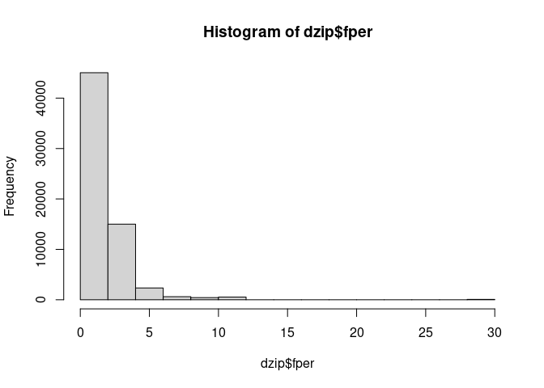

SIFCCT Recoding Ver 5 (Additional Recode)
================
Fan Lu & Gento Kato
December 22, 2020

# Preparation

``` r
## Clean Up Space
rm(list=ls())

## Set Working Directory (Automatically) ##
require(rstudioapi); require(rprojroot)
if (rstudioapi::isAvailable()==TRUE) {
  setwd(dirname(rstudioapi::getActiveDocumentContext()$path)); 
} 
projdir <- find_root(has_file("thisishome.txt"))
cat(paste("Working Directory Set to:\n",projdir))
```

    ## Working Directory Set to:
    ##  /home/gentok/GoogleDrive/Projects/Fan-Gento-Lab/ForeignerJapan

``` r
setwd(projdir)

## Find Data Directory
datadir <- paste(projdir,"data/sifcct_latest_v5.rds",sep="/")
datadir1 <- paste(projdir,"data/original/gaikokujintokei_2012.xlsx",sep="/")
datadir2 <- paste(projdir,"data/original/jinkochosa_2012.xls",sep="/")
datadir3 <- paste(projdir,"data/original/did_data_2010/A16-10_00_DID.shp",sep="/")
datadir4 <- paste(projdir,"data/original/FEH_00200521_201114091011.xlsx",sep="/")
datadir5 <- paste(projdir,"data/original/FEH_00200521_201114090614.xlsx",sep="/")
datadir6 <- paste(projdir,"data/original/addloc_grand.rds", sep="/")
datadir7 <- paste(projdir,"data/original/sreg_content_2010/table02.rds", sep="/")
datadir8 <- paste(projdir,"data/original/sreg_content_2010/table03.rds", sep="/")
datadir9 <- paste(projdir,"data/original/sreg_content_2010/table04.rds", sep="/")
datadir10 <- paste(projdir,"data/original/sreg_content_2010/table05.rds", sep="/")
datadir11 <- paste(projdir,"data/original/sreg_content_2010/table08.rds", sep="/")
datadir12 <- paste(projdir,"data/original/sreg_content_2010/table10.rds", sep="/")
# datadir13 <- paste(projdir,"data/original/sreg_content_2010/table12.rds", sep="/") # labor 
datadir14 <- paste(projdir,"data/original/sreg_content_2010/table13.rds", sep="/")
datadir15 <- paste(projdir,"data/original/sreg_content_2010/table14.rds", sep="/")

## Import Version 5 Data
d <- readRDS(datadir)
### Limit to Cases with ZIP data
dzip <- d[complete.cases(d$zip_lon),]
dzip$zip_prefmuni = paste0(dzip$zip_pref,dzip$zip_muni)

## Import Relevant Geographic Data
require(readxl)

### Foreigner Population Statistics
fs <- read_xlsx(datadir1, skip=4, 
                col_names = c("pref","muni1","muni2","total",
                              "china","taiwan","korea","philippines",
                              "brazil","vietnam","peru","us","others"))
### Adjust Missing Cells (Prefecture)
fs$pref <- sapply(1:nrow(fs), function(k) {
  if (is.na(fs$pref[k])) {
    na.omit(fs$pref[1:k])[length(na.omit(fs$pref[1:k]))]
  } else {
    fs$pref[k]
  }
})
### Adjust Missing Cells (Municipality 1)
fs$muni1 <- sapply(1:nrow(fs), function(k) {
  if (is.na(fs$muni1[k])) {
    na.omit(fs$muni1[1:k])[length(na.omit(fs$muni1[1:k]))]
  } else {
    fs$muni1[k]
  }
})
### Deleting Non-standard Categorization of Geographic Names
fs$muni1[fs$muni1=="特別区"] <- ""
fs$muni1[fs$muni1=="中川郡(天塩)"] <- "中川郡"
fs$muni1[fs$muni1=="中川郡(十勝)"] <- "中川郡"
fs$muni1[fs$muni1=="上川郡(天塩)"] <- "上川郡"
fs$muni1[fs$muni1=="上川郡(十勝)"] <- "上川郡"
fs$muni1[fs$muni1=="上川郡(石狩)"] <- "上川郡"
### Adjust Missing Cells (Municipality 2)
fs$muni2[is.na(fs$muni2)] <- ""
### Create Municipality Variable
fs$muni <- paste0(fs$muni1,fs$muni2)
### Create Prefecture-Municipality
fs$prefmuni <- paste0(fs$pref,fs$muni)
### Reorder Columns
fs <- fs[,c("pref","muni1","muni2","muni","prefmuni","total",
      "china","taiwan","korea","philippines",
      "brazil","vietnam","peru","us","others")]
head(fs, 20)
```

    ## # A tibble: 20 x 15
    ##    pref   muni1   muni2  muni     prefmuni     total china taiwan korea philippines brazil vietnam  peru    us others
    ##    <chr>  <chr>   <chr>  <chr>    <chr>        <dbl> <dbl>  <dbl> <dbl>       <dbl>  <dbl>   <dbl> <dbl> <dbl>  <dbl>
    ##  1 北海道 札幌市  ""     札幌市   北海道札幌市  9562  3741    126  2681         307     48      38    13   475   2133
    ##  2 北海道 札幌市  "中央区"… 札幌市中央区… 北海道札幌市中央区…  1958   807     33   512          47      4       8     5   134    408
    ##  3 北海道 札幌市  "北区" 札幌市北区… 北海道札幌市北区…  2283  1038     34   342          59     11      15     1    72    711
    ##  4 北海道 札幌市  "東区" 札幌市東区… 北海道札幌市東区…  1186   504     24   284          45      3       7     1    34    284
    ##  5 北海道 札幌市  "白石区"… 札幌市白石区… 北海道札幌市白石区…   660   178      5   273          25      9       0     2    36    132
    ##  6 北海道 札幌市  "豊平区"… 札幌市豊平区… 北海道札幌市豊平区…  1201   389     14   522          38      4       0     1    62    171
    ##  7 北海道 札幌市  "南区" 札幌市南区… 北海道札幌市南区…   482   153      1   120          25      0       0     3    56    124
    ##  8 北海道 札幌市  "西区" 札幌市西区… 北海道札幌市西区…   587   201      3   191          28      6       4     0    33    121
    ##  9 北海道 札幌市  "厚別区"… 札幌市厚別区… 北海道札幌市厚別区…   477   263      5   107          18      4       3     0    14     63
    ## 10 北海道 札幌市  "手稲区"… 札幌市手稲区… 北海道札幌市手稲区…   285   133      3    52           9      0       1     0    11     76
    ## 11 北海道 札幌市  "清田区"… 札幌市清田区… 北海道札幌市清田区…   443    75      4   278          13      7       0     0    23     43
    ## 12 北海道 函館市  ""     函館市   北海道函館市   771   357      6   184          38      3      17     3    29    134
    ## 13 北海道 小樽市  ""     小樽市   北海道小樽市   450   129      9    83          14      2       4     0    19    190
    ## 14 北海道 旭川市  ""     旭川市   北海道旭川市   718   194      4   274          63      6      11     0    37    129
    ## 15 北海道 室蘭市  ""     室蘭市   北海道室蘭市   301    95      2    93          13      2       3     0    12     81
    ## 16 北海道 釧路市  ""     釧路市   北海道釧路市   500   174      8   144          35      1      63     0    16     59
    ## 17 北海道 帯広市  ""     帯広市   北海道帯広市   482    98      6   167          27      6       7     0    27    144
    ## 18 北海道 北見市  ""     北見市   北海道北見市   325   129      9    71          39      3       3     2     9     60
    ## 19 北海道 夕張市  ""     夕張市   北海道夕張市    32    21      0     8           0      0       0     0     1      2
    ## 20 北海道 岩見沢市… ""     岩見沢市 北海道岩見沢市…   142    34      2    50          13      0       2     0    18     23

``` r
### Population Statistics
ps <- read_xls(datadir2, skip=4, 
                col_names = c("code","pref","muni","male","female","total","households",
                              "inmigrants","births","inothers","intotal",
                              "outmigrants","deaths","outothers","outtotal",
                              "inoutdif","inoutrate",
                              "naturalincrease","naturalincreaserate",
                              "socialincrease","socialincreaserate"))
head(ps)
```

    ## # A tibble: 6 x 21
    ##   code  pref  muni    male female  total households inmigrants births inothers intotal outmigrants deaths outothers
    ##   <chr> <chr> <chr>  <dbl>  <dbl>  <dbl>      <dbl>      <dbl>  <dbl>    <dbl>   <dbl>       <dbl>  <dbl>     <dbl>
    ## 1 <NA>  合計  <NA>  6.18e7 6.48e7 1.27e8   54171475    5177080 1.05e6    83827 6310460     5252534 1.26e6     65528
    ## 2 0100… 北海道… <NA>  2.59e6 2.88e6 5.47e6    2685761     256525 3.92e4     1813  297517      263279 5.78e4      1177
    ## 3 0110… 北海道… 札幌市… 8.94e5 1.01e6 1.90e6     979158     122363 1.44e4      305  137095      113599 1.62e4       335
    ## 4 0110… 北海道… 札幌市中… 9.79e4 1.18e5 2.16e5     126453      21734 1.68e3       49   23463       18069 1.74e3        16
    ## 5 0110… 北海道… 札幌市北… 1.31e5 1.45e5 2.76e5     139503      16295 1.89e3       38   18219       14782 2.34e3        45
    ## 6 0110… 北海道… 札幌市東… 1.21e5 1.33e5 2.54e5     131687      15295 2.17e3       46   17512       14508 2.11e3        72
    ## # … with 7 more variables: outtotal <dbl>, inoutdif <dbl>, inoutrate <dbl>, naturalincrease <dbl>,
    ## #   naturalincreaserate <dbl>, socialincrease <dbl>, socialincreaserate <dbl>

``` r
### Create Prefecture-Municipality
require(stringr)
ps$muni <- str_replace(ps$muni,"[[:blank:]]","")
ps$prefmuni <- paste0(ps$pref,ps$muni)
### Reorder Columns
ps <- ps[,c("code","pref","muni","prefmuni","male","female","total","households",
            "inmigrants","births","inothers","intotal",
            "outmigrants","deaths","outothers","outtotal",
            "inoutdif","inoutrate",
            "naturalincrease","naturalincreaserate",
            "socialincrease","socialincreaserate")]
ps$codex <- floor(as.numeric(ps$code)/10); max(table(ps$codex))
```

    ## [1] 1

``` r
head(ps, 20)
```

    ## # A tibble: 20 x 23
    ##    code  pref  muni  prefmuni   male female  total households inmigrants births inothers intotal outmigrants deaths
    ##    <chr> <chr> <chr> <chr>     <dbl>  <dbl>  <dbl>      <dbl>      <dbl>  <dbl>    <dbl>   <dbl>       <dbl>  <dbl>
    ##  1 <NA>  合計  <NA>  合計NA   6.18e7 6.48e7 1.27e8   54171475    5177080 1.05e6    83827 6310460     5252534 1.26e6
    ##  2 0100… 北海道… <NA>  北海道NA 2.59e6 2.88e6 5.47e6    2685761     256525 3.92e4     1813  297517      263279 5.78e4
    ##  3 0110… 北海道… 札幌市… 北海道札幌市… 8.94e5 1.01e6 1.90e6     979158     122363 1.44e4      305  137095      113599 1.62e4
    ##  4 0110… 北海道… 札幌市中… 北海道札幌市中… 9.79e4 1.18e5 2.16e5     126453      21734 1.68e3       49   23463       18069 1.74e3
    ##  5 0110… 北海道… 札幌市北… 北海道札幌市北… 1.31e5 1.45e5 2.76e5     139503      16295 1.89e3       38   18219       14782 2.34e3
    ##  6 0110… 北海道… 札幌市東… 北海道札幌市東… 1.21e5 1.33e5 2.54e5     131687      15295 2.17e3       46   17512       14508 2.11e3
    ##  7 0110… 北海道… 札幌市白… 北海道札幌市白… 9.83e4 1.08e5 2.06e5     112334      14320 1.90e3       30   16255       13467 1.76e3
    ##  8 0110… 北海道… 札幌市豊… 北海道札幌市豊… 9.94e4 1.14e5 2.13e5     115783      16214 1.86e3       40   18114       14417 1.76e3
    ##  9 0110… 北海道… 札幌市南… 北海道札幌市南… 6.70e4 7.66e4 1.44e5      70692       7734 7.99e2       17    8550        8262 1.51e3
    ## 10 0110… 北海道… 札幌市西… 北海道札幌市西… 9.79e4 1.12e5 2.10e5     106481      12151 1.70e3       38   13886       12231 1.81e3
    ## 11 0110… 北海道… 札幌市厚… 北海道札幌市厚… 5.99e4 6.96e4 1.30e5      61296       7155 7.47e2       17    7919        6828 1.05e3
    ## 12 0110… 北海道… 札幌市手… 北海道札幌市手… 6.65e4 7.37e4 1.40e5      64934       6409 9.16e2        9    7334        5957 1.20e3
    ## 13 0111… 北海道… 札幌市清… 北海道札幌市清… 5.48e4 6.03e4 1.15e5      49995       5056 7.66e2       21    5843        5078 9.01e2
    ## 14 0120… 北海道… 函館市… 北海道函館市… 1.26e5 1.51e5 2.77e5     142543       9600 1.78e3      280   11658       10990 3.56e3
    ## 15 0120… 北海道… 小樽市… 北海道小樽市… 5.90e4 7.12e4 1.30e5      66854       3541 7.07e2       71    4319        3808 1.96e3
    ## 16 0120… 北海道… 旭川市… 北海道旭川市… 1.63e5 1.87e5 3.51e5     173984      11397 2.55e3      131   14080       11653 3.77e3
    ## 17 0120… 北海道… 室蘭市… 北海道室蘭市… 4.47e4 4.84e4 9.31e4      47589       3552 6.28e2       44    4224        4151 1.17e3
    ## 18 0120… 北海道… 釧路市… 北海道釧路市… 8.62e4 9.61e4 1.82e5      93636       6555 1.26e3       95    7912        7764 1.97e3
    ## 19 0120… 北海道… 帯広市… 北海道帯広市… 8.06e4 8.76e4 1.68e5      82304       7689 1.42e3       54    9167        7870 1.54e3
    ## 20 0120… 北海道… 北見市… 北海道北見市… 5.92e4 6.51e4 1.24e5      60564       4504 8.82e2       45    5431        4646 1.30e3
    ## # … with 9 more variables: outothers <dbl>, outtotal <dbl>, inoutdif <dbl>, inoutrate <dbl>, naturalincrease <dbl>,
    ## #   naturalincreaserate <dbl>, socialincrease <dbl>, socialincreaserate <dbl>, codex <dbl>

``` r
## DID Data
require(sf)   # for read_sf(...)
require(rgeos)   # for gContains(...)
require(ggplot2)
### Read Data
did <- read_sf(datadir3, options="ENCODING=CP932")

## Population Data (2010)
ps10 <- read_xlsx(datadir4, skip=10, n_max=4499,
                  col_names = c("code","name","skip","pop","kumikae",
                                "inoutdif","inoutrate","size","popdens")
                  )
ps10$pop <- as.numeric(ps10$pop)
ps10$kumikae <- as.numeric(ps10$kumikae)
ps10$inoutdif <- as.numeric(ps10$inoutdif)
ps10$inoutrate <- as.numeric(ps10$inoutrate)
ps10$size <- as.numeric(ps10$size)
ps10$popdens <- as.numeric(ps10$size)
ps10$codex <- as.numeric(ps10$code)
```

    ## Warning: NAs introduced by coercion

``` r
tail(ps10)
```

    ## # A tibble: 6 x 10
    ##   code  name              skip    pop kumikae inoutdif inoutrate  size popdens codex
    ##   <chr> <chr>             <lgl> <dbl>   <dbl>    <dbl>     <dbl> <dbl>   <dbl> <dbl>
    ## 1 47344 (旧 344 具志頭村) NA     8054    8035       19     0.236  12.1    12.1 47344
    ## 2 47370 宮古郡            NA     1231    1370     -139   -10.1    21.9    21.9 47370
    ## 3 47375 多良間村          NA     1231    1370     -139   -10.1    21.9    21.9 47375
    ## 4 47380 八重山郡          NA     5516    5988     -472    -7.88  363.    363.  47380
    ## 5 47381 竹富町            NA     3859    4192     -333    -7.94  334.    334.  47381
    ## 6 47382 与那国町          NA     1657    1796     -139    -7.74   29.0    29.0 47382

``` r
## Municipality & Prefecture Names Borrowed from ps data
ps10$pref <- ps$pref[match(ps10$codex, ps$codex)]
ps10$pref[is.na(ps10$codex)] <- NA
ps10$muni <- ps$muni[match(ps10$codex, ps$codex)]
ps10$muni[is.na(ps10$codex)] <- NA

## Check municipalities missing in ps data
ps$muni[which(is.na(match(ps$codex, ps10$codex)))]
```

    ## [1] "色丹郡色丹村"   "国後郡泊村"     "国後郡留夜別村" "択捉郡留別村"   "紗那郡紗那村"   "蘂取郡蘂取村"  
    ## [7] "野々市市"       "長久手市"

``` r
ps$codex[which(is.na(match(ps$codex, ps10$codex)))]
```

    ## [1]  1695  1696  1697  1698  1699  1700 17212 23238

``` r
# 17344 -> 野々市市, 石川県 
# 23304 -> 長久手市, 愛知県
ps10$pref[which(ps10$codex==17344)] <- "石川県"
ps10$muni[which(ps10$codex==17344)] <- "野々市市"
ps10$pref[which(ps10$codex==23304)] <- "愛知県"
ps10$muni[which(ps10$codex==23304)] <- "長久手市"

## Prefecture plus municiparity
ps10$prefmuni <- paste0(ps10$pref,ps10$muni)

# Check municipalities missing in ps10 data 
tmp1 <- ps10$name[which(is.na(match(ps10$codex, ps$codex)))]
tmp1[!grepl("市部$|郡部$|区部$|旧 |振興局|支庁|全国|郡$", tmp1)]
```

    ##  [1] "藤沢町"   "西方町"   "鳩ケ谷市" "野々市町" "長久手町" "一色町"   "吉良町"   "幡豆町"   "東出雲町" "斐川町"

``` r
tmp2 <- ps10$code[which(is.na(match(ps10$codex, ps$codex)))]
tmp2[!grepl("市部$|郡部$|区部$|旧 |振興局|支庁|全国|郡$", tmp1)]
```

    ##  [1] "03422" "09321" "11226" "17344" "23304" "23481" "23482" "23483" "32304" "32401"

``` r
# 藤沢町 (codex=3422) is part of 一関市 (codex=3209) in 2012
ps10$pop[which(ps10$codex==3209)] <- ps10$pop[which(ps10$codex==3209)] + ps10$pop[which(ps10$codex==3422)]
ps10$size[which(ps10$codex==3209)] <- ps10$size[which(ps10$codex==3209)] + ps10$size[which(ps10$codex==3422)]
ps10$popdens[which(ps10$codex==3209)] <- ps10$pop[which(ps10$codex==3209)]/ps10$size[which(ps10$codex==3209)]
# 西方町 (codex=9321) is part of 栃木市 (codex=9203) in 2012
ps10$pop[which(ps10$codex==9203)] <- ps10$pop[which(ps10$codex==9203)] + ps10$pop[which(ps10$codex==9321)]
ps10$size[which(ps10$codex==9203)] <- ps10$size[which(ps10$codex==9203)] + ps10$size[which(ps10$codex==9321)]
ps10$popdens[which(ps10$codex==9203)] <- ps10$pop[which(ps10$codex==9203)]/ps10$size[which(ps10$codex==9203)]
# 鳩ケ谷市 (codex=11226) is part of 川口市 (codex=11203) in 2012
ps10$pop[which(ps10$codex==11203)] <- ps10$pop[which(ps10$codex==11203)] + ps10$pop[which(ps10$codex==11226)]
ps10$size[which(ps10$codex==11203)] <- ps10$size[which(ps10$codex==11203)] + ps10$size[which(ps10$codex==11226)]
ps10$popdens[which(ps10$codex==11203)] <- ps10$pop[which(ps10$codex==11203)]/ps10$size[which(ps10$codex==11203)]
# 一色町 (codex=23481), 吉良町 (codex=23482), 幡豆町 (codex=23483) are part of 西尾市 (codex=23213) in 2012
ps10$pop[which(ps10$codex==23213)] <- ps10$pop[which(ps10$codex==23213)] + 
  ps10$pop[which(ps10$codex==23481)] + ps10$pop[which(ps10$codex==23482)] + ps10$pop[which(ps10$codex==23483)]
ps10$size[which(ps10$codex==23213)] <- ps10$size[which(ps10$codex==23213)] + 
  ps10$size[which(ps10$codex==23481)] + ps10$size[which(ps10$codex==23482)] + ps10$size[which(ps10$codex==23483)]
ps10$popdens[which(ps10$codex==23213)] <- ps10$pop[which(ps10$codex==23213)]/ps10$size[which(ps10$codex==23213)]
# 東出雲町 (codex=32304) is part of 松江市 (codex=32201) in 2012
ps10$pop[which(ps10$codex==32201)] <- ps10$pop[which(ps10$codex==32201)] + ps10$pop[which(ps10$codex==32304)]
ps10$size[which(ps10$codex==32201)] <- ps10$size[which(ps10$codex==32201)] + ps10$size[which(ps10$codex==32304)]
ps10$popdens[which(ps10$codex==32201)] <- ps10$pop[which(ps10$codex==32201)]/ps10$size[which(ps10$codex==32201)]
# 斐川町(codex=32401) is part of 出雲市 (codex=32203) in 2012
ps10$pop[which(ps10$codex==32203)] <- ps10$pop[which(ps10$codex==32203)] + ps10$pop[which(ps10$codex==32401)]
ps10$size[which(ps10$codex==32203)] <- ps10$size[which(ps10$codex==32203)] + ps10$size[which(ps10$codex==32401)]
ps10$popdens[which(ps10$codex==32203)] <- ps10$pop[which(ps10$codex==32203)]/ps10$size[which(ps10$codex==32203)]

## Municipality DID Data (2010)
did10 <- read_xlsx(datadir5, skip=10, na=c("","***"), n_max=4499,
                  col_names = c("code","name","skip","pop_did","kumikae_did",
                                "inoutdif_did","inoutrate_did","size_did","popdens_did")
)
tail(did10)
```

    ## # A tibble: 6 x 9
    ##   code  name              skip  pop_did kumikae_did inoutdif_did inoutrate_did size_did popdens_did
    ##   <chr> <chr>             <lgl> <chr>   <chr>       <chr>        <chr>         <chr>    <chr>      
    ## 1 47344 (旧 344 具志頭村) NA    <NA>    <NA>        <NA>         <NA>          <NA>     <NA>       
    ## 2 47370 宮古郡            NA    <NA>    <NA>        <NA>         <NA>          <NA>     <NA>       
    ## 3 47375 多良間村          NA    <NA>    <NA>        <NA>         <NA>          <NA>     <NA>       
    ## 4 47380 八重山郡          NA    <NA>    <NA>        <NA>         <NA>          <NA>     <NA>       
    ## 5 47381 竹富町            NA    <NA>    <NA>        <NA>         <NA>          <NA>     <NA>       
    ## 6 47382 与那国町          NA    <NA>    <NA>        <NA>         <NA>          <NA>     <NA>

``` r
all(did10$code==did10$code)
```

    ## [1] TRUE

``` r
did10$pop_did <- ifelse(is.na(did10$pop_did),0,as.numeric(did10$pop_did))
did10$kumikae_did <- ifelse(is.na(did10$kumikae_did),0,as.numeric(did10$kumikae_did))
```

    ## Warning in ifelse(is.na(did10$kumikae_did), 0, as.numeric(did10$kumikae_did)): NAs introduced by coercion

``` r
did10$inoutdif_did <- ifelse(is.na(did10$inoutdif_did),0,as.numeric(did10$inoutdif_did))
did10$inoutrate_did <- ifelse(is.na(did10$inoutrate_did),0,as.numeric(did10$inoutrate_did))
```

    ## Warning in ifelse(is.na(did10$inoutrate_did), 0, as.numeric(did10$inoutrate_did)): NAs introduced by coercion

``` r
did10$size_did <- ifelse(is.na(did10$size_did),0,as.numeric(did10$size_did))
did10$popdens_did <- as.numeric(did10$size_did)
did10$codex <- as.numeric(did10$code)
```

    ## Warning: NAs introduced by coercion

``` r
tail(did10)
```

    ## # A tibble: 6 x 10
    ##   code  name              skip  pop_did kumikae_did inoutdif_did inoutrate_did size_did popdens_did codex
    ##   <chr> <chr>             <lgl>   <dbl>       <dbl>        <dbl>         <dbl>    <dbl>       <dbl> <dbl>
    ## 1 47344 (旧 344 具志頭村) NA          0           0            0             0        0           0 47344
    ## 2 47370 宮古郡            NA          0           0            0             0        0           0 47370
    ## 3 47375 多良間村          NA          0           0            0             0        0           0 47375
    ## 4 47380 八重山郡          NA          0           0            0             0        0           0 47380
    ## 5 47381 竹富町            NA          0           0            0             0        0           0 47381
    ## 6 47382 与那国町          NA          0           0            0             0        0           0 47382

``` r
did10$pop_did[which(did10$codex==3422)]
```

    ## [1] 0

``` r
did10$pop_did[which(did10$codex==9321)]
```

    ## [1] 0

``` r
did10$pop_did[which(did10$codex==11226)]
```

    ## [1] 60908

``` r
did10$pop_did[which(did10$codex==23481)]
```

    ## [1] 8296

``` r
did10$pop_did[which(did10$codex==23482)]
```

    ## [1] 0

``` r
did10$pop_did[which(did10$codex==23483)]
```

    ## [1] 0

``` r
did10$pop_did[which(did10$codex==32304)]
```

    ## [1] 0

``` r
# 藤沢町 (codex=3422) is part of 一関市 (codex=3209) in 2012
# did10$pop_did[which(did10$codex==3209)] <- did10$pop_did[which(did10$codex==3209)] + did10$pop_did[which(did10$codex==3422)]
# 西方町 (codex=9321) is part of 栃木市 (codex=9203) in 2012
# did10$pop_did[which(did10$codex==9203)] <- did10$pop_did[which(did10$codex==9203)] + did10$pop_did[which(did10$codex==9321)]
# 鳩ケ谷市 (codex=11226) is part of 川口市 (codex=11203) in 2012
did10$pop_did[which(did10$codex==11203)] <- did10$pop_did[which(did10$codex==11203)] + did10$pop_did[which(did10$codex==11226)]
did10$size_did[which(did10$codex==11203)] <- did10$size_did[which(did10$codex==11203)] + did10$size_did[which(did10$codex==11226)]
did10$popdens_did[which(did10$codex==11203)] <- did10$pop_did[which(did10$codex==11203)]/did10$size_did[which(did10$codex==11203)]
# 一色町 (codex=23481), 吉良町 (codex=23482), 幡豆町 (codex=23483) are part of 西尾市 (codex=23213) in 2012
did10$pop_did[which(did10$codex==23213)] <- did10$pop_did[which(did10$codex==23213)] + 
  did10$pop_did[which(did10$codex==23481)] + did10$pop_did[which(did10$codex==23482)] + did10$pop_did[which(did10$codex==23483)]
did10$size_did[which(did10$codex==23213)] <- did10$size_did[which(did10$codex==23213)] + 
  did10$size_did[which(did10$codex==23481)] + did10$size_did[which(did10$codex==23482)] + did10$size_did[which(did10$codex==23483)]
did10$pop_did[which(did10$codex==23213)] <- did10$pop_did[which(did10$codex==23213)]/did10$size_did[which(did10$codex==23213)]
# 東出雲町 (codex=32304) is part of 松江市 (codex=32201) in 2012
# did10$pop_did[which(did10$codex==32201)] <- did10$pop_did[which(did10$codex==32201)] + did10$pop_did[which(did10$codex==32304)]
# 斐川町(codex=32401) is part of 出雲市 (codex=32203) in 2012
# did10$pop_did[which(did10$codex==32203)] <- did10$pop_did[which(did10$codex==32203)] + did10$pop_did[which(did10$codex==32401)]

# Combine DID data with Population Data (2010)
ps10 <- cbind(ps10[,-which(colnames(ps10)%in%"skip")], 
              did10[,-which(colnames(did10)%in%c("code","codex","name","skip"))])
ps10 <- ps10[!is.na(ps10$muni),]
nrow(ps10)
```

    ## [1] 2227

``` r
head(ps10)
```

    ##     code   name     pop kumikae inoutdif inoutrate    size popdens codex   pref         muni           prefmuni
    ## 7  01100 札幌市 1913545 1880863    32682   1.73761 1121.12 1121.12  1100 北海道       札幌市       北海道札幌市
    ## 8  01101 中央区  220189  202801    17388   8.57392   46.42   46.42  1101 北海道 札幌市中央区 北海道札幌市中央区
    ## 9  01102   北区  278781  272877     5904   2.16361   63.48   63.48  1102 北海道   札幌市北区   北海道札幌市北区
    ## 10 01103   東区  255873  253996     1877   0.73899   57.13   57.13  1103 北海道   札幌市東区   北海道札幌市東区
    ## 11 01104 白石区  204259  201307     2952   1.46642   34.58   34.58  1104 北海道 札幌市白石区 北海道札幌市白石区
    ## 12 01105 豊平区  212118  209428     2690   1.28445   46.35   46.35  1105 北海道 札幌市豊平区 北海道札幌市豊平区
    ##    pop_did kumikae_did inoutdif_did inoutrate_did size_did popdens_did
    ## 7  1846399     1812362        34037       1.87805   230.25      230.25
    ## 8   217633      200393        17240       8.60309    23.00       23.00
    ## 9   261235      254692         6543       2.56899    33.58       33.58
    ## 10  249599      248145         1454       0.58595    29.95       29.95
    ## 11  200377      197396         2981       1.51016    23.62       23.62
    ## 12  210803      208705         2098       1.00525    21.70       21.70

``` r
# Additional Packages
require(pbapply)
```

# Data Manipulation

## Adjusting Municipality Names

``` r
## For fs
table(is.na(match(dzip$zip_prefmuni,fs$prefmuni)))
```

    ## 
    ## FALSE  TRUE 
    ## 63917   119

``` r
tmploc <- which(is.na(match(dzip$zip_prefmuni,fs$prefmuni)))
unique(dzip$zip_prefmuni[tmploc])
```

    ## [1] "宮城県富谷市"       "福岡県糟屋郡須惠町" "千葉県大網白里市"   "福岡県那珂川市"     "兵庫県丹波篠山市"  
    ## [6] "東京都八丈町"

``` r
# fs$prefmuni[grep("黒川郡", fs$prefmuni)]

## For ps
table(is.na(match(dzip$zip_prefmuni,ps$prefmuni)))
```

    ## 
    ## FALSE  TRUE 
    ## 63596   440

``` r
tmploc <- which(is.na(match(dzip$zip_prefmuni,ps$prefmuni)))
unique(dzip$zip_prefmuni[tmploc])
```

    ##  [1] "熊本県熊本市南区"   "宮城県富谷市"       "熊本県熊本市中央区" "熊本県熊本市東区"   "熊本県熊本市北区"  
    ##  [6] "熊本県熊本市西区"   "千葉県大網白里市"   "福岡県那珂川市"     "兵庫県丹波篠山市"   "埼玉県白岡市"      
    ## [11] "東京都八丈町"

``` r
# ps$prefmuni[grep("白岡", ps$prefmuni)]

## Shiraoka-shi was not a city in 2011
ps$prefmuni[which(ps$prefmuni=="埼玉県南埼玉郡白岡町")] <- "埼玉県白岡市"
ps$prefmuni[which(ps$prefmuni=="福岡県糟屋郡須惠町")] <- "福岡県糟屋郡須恵町"
ps10$prefmuni[which(ps10$prefmuni=="埼玉県南埼玉郡白岡町")] <- "埼玉県白岡市"
ps10$prefmuni[which(ps10$prefmuni=="福岡県糟屋郡須惠町")] <- "福岡県糟屋郡須恵町"

### Adjust for Specific Changes in Names in dzip
dzip$zip_prefmuni[which(dzip$zip_prefmuni=="千葉県大網白里市")] <- "千葉県山武郡大網白里町"
dzip$zip_prefmuni[which(dzip$zip_prefmuni=="福岡県那珂川市")] <- "福岡県筑紫郡那珂川町"
dzip$zip_prefmuni[which(dzip$zip_prefmuni=="福岡県糟屋郡須惠町")] <- "福岡県糟屋郡須恵町"
dzip$zip_prefmuni[which(dzip$zip_prefmuni=="兵庫県丹波篠山市")] <- "兵庫県篠山市"
dzip$zip_prefmuni[which(dzip$zip_prefmuni=="兵庫県丹波篠山市")] <- "兵庫県篠山市"
dzip$zip_prefmuni[which(dzip$zip_prefmuni=="東京都八丈町")] <- "東京都八丈島八丈町"
dzip$zip_prefmuni[which(dzip$zip_prefmuni=="宮城県富谷市")] <- "宮城県黒川郡富谷町"
### Kumamoto was not a seirei-shitei toshi in 2011
dzip$zip_prefmuni[grep("熊本県熊本市",dzip$zip_prefmuni)] <- "熊本県熊本市"

table(is.na(match(dzip$zip_prefmuni,fs$prefmuni)))
```

    ## 
    ## FALSE 
    ## 64036

``` r
table(is.na(match(dzip$zip_prefmuni,ps$prefmuni)))
```

    ## 
    ## FALSE 
    ## 64036

``` r
table(is.na(match(dzip$zip_prefmuni,ps10$prefmuni)))
```

    ## 
    ## FALSE 
    ## 64036

## Foreigner Population

``` r
dzip$fpop <- fs$total[match(dzip$zip_prefmuni,fs$prefmuni)] 
dzip$fpop_china <- fs$china[match(dzip$zip_prefmuni,fs$prefmuni)] 
dzip$fpop_taiwan <- fs$taiwan[match(dzip$zip_prefmuni,fs$prefmuni)] 
dzip$fpop_korea <- fs$korea[match(dzip$zip_prefmuni,fs$prefmuni)] 
dzip$fpop_philippines <- fs$philippines[match(dzip$zip_prefmuni,fs$prefmuni)] 
dzip$fpop_brazil <- fs$brazil[match(dzip$zip_prefmuni,fs$prefmuni)] 
dzip$fpop_vietnam <- fs$vietnam[match(dzip$zip_prefmuni,fs$prefmuni)] 
dzip$fpop_peru <- fs$peru[match(dzip$zip_prefmuni,fs$prefmuni)] 
dzip$fpop_us <- fs$us[match(dzip$zip_prefmuni,fs$prefmuni)] 
dzip$fpop_others <- fs$others[match(dzip$zip_prefmuni,fs$prefmuni)] 
```

## Other Municipality Level Population Statistics

``` r
dzip$pop <- ps$total[match(dzip$zip_prefmuni,ps$prefmuni)]
dzip$pop_male <- ps$male[match(dzip$zip_prefmuni,ps$prefmuni)]
dzip$pop_female <- ps$female[match(dzip$zip_prefmuni,ps$prefmuni)]
dzip$pop_households <- ps$households[match(dzip$zip_prefmuni,ps$prefmuni)]

dzip$pop10 <- ps10$pop[match(dzip$zip_prefmuni,ps10$prefmuni)]
dzip$size10 <- ps10$size[match(dzip$zip_prefmuni,ps10$prefmuni)]
dzip$popdens10 <- ps10$popdens[match(dzip$zip_prefmuni,ps10$prefmuni)]

dzip$pop10_did <- ps10$pop_did[match(dzip$zip_prefmuni,ps10$prefmuni)]
dzip$size10_did <- ps10$size_did[match(dzip$zip_prefmuni,ps10$prefmuni)]
dzip$popdens10_did <- ps10$popdens_did[match(dzip$zip_prefmuni,ps10$prefmuni)]
```

## DID Identifier

``` r
### Function to Check if DID
ifDID <- function(lonlat) {
  tmp <- suppressMessages(as.numeric(st_intersects(st_point(lonlat, dim="XY"), did, sparse = FALSE)))
  if (any(tmp==1)) {
    return(1)
  } else if (all(tmp==0)) {
    return(0)
  } else {
    return(NA)
  }
}

# ## Using dzip
# dzip$zip_did <- NA
# dzip$zip_did[dzip$panel==0] <- pbapply(dzip[dzip$panel==0,c("zip_lon","zip_lat")],1,ifDID)
# saveRDS(dzip$zip_did[dzip$panel==0], paste0(projdir,"/data/sifcct_zip_did_v5.rds"))
# dzip$zip_did[dzip$panel==0] <- readRDS(paste0(projdir,"/data/sifcct_zip_did_v5.rds"))
# panelgeoloc <-
#   pbsapply(unique(paste(dzip$zip_lon[dzip$panel==1],dzip$zip_lat[dzip$panel==1])),
#            function (k) which(paste(dzip$zip_lon[dzip$panel==1],dzip$zip_lat[dzip$panel==1])==k))
# tmp2 <- pbapply(dzip[dzip$panel==1,][sapply(panelgeoloc, function(k) k[1]),c("zip_lon","zip_lat")],1,ifDID)
# for (i in 1:length(panelgeoloc)) {
#   dzip[dzip$panel==1,]$zip_did[panelgeoloc[[i]]] <- tmp2[i]
#   cat(paste(i," "))
# }
# table(is.na(dzip$zip_did))
# 
# #+ eval=FALSE
# dzip$zip_did <- pbapply(dzip[,c("zip_lon","zip_lat")],1,ifDID)
# #+ eval=FALSE, echo=FALSE
# saveRDS(dzip$zip_did, paste0(projdir,"/data/sifcct_zip_did_v5.rds"))
```

``` r
table(dzip$zip_did, useNA="always")
```

    ## 
    ##     0     1  <NA> 
    ## 15856 48180     0

## Proportion Variables

``` r
## Foreigner Percentage
dzip$fper <- dzip$fpop/dzip$pop * 100
dzip$fper_china <- dzip$fpop_china/dzip$pop * 100 
dzip$fper_taiwan <- dzip$fpop_taiwan/dzip$pop * 100
dzip$fper_korea <- dzip$fpop_korea/dzip$pop * 100
dzip$fper_philippines <- dzip$fpop_philippines/dzip$pop * 100
dzip$fper_brazil <- dzip$fpop_brazil/dzip$pop * 100 
dzip$fper_vietnam <- dzip$fpop_vietnam/dzip$pop * 100
dzip$fper_peru <- dzip$fpop_peru/dzip$pop * 100 
dzip$fper_us <- dzip$fpop_us/dzip$pop * 100
dzip$fper_others <- dzip$fpop_others/dzip$pop * 100
summary(dzip$fper)
```

    ##    Min. 1st Qu.  Median    Mean 3rd Qu.    Max. 
    ##   0.000   0.769   1.327   1.800   2.217  28.082

``` r
hist(dzip$fper)
```

<!-- -->

``` r
unique(dzip$zip_prefmuni[dzip$fper>20])
```

    ## [1] "大阪府大阪市生野区"

``` r
## DID Population Percentage
dzip$didper <- dzip$pop10_did/dzip$pop10
cor(dzip$didper,dzip$zip_did)
```

    ## [1] 0.609429

``` r
cor(dzip$popdens10,dzip$zip_did)
```

    ## [1] -0.07547054

# Using 2010 Census Small Region Data

``` r
addloc <- readRDS(datadir6)

dzip$c10_key_mun <- as.character(addloc$key_mun[match(dzip$zip,addloc$zip)])
dzip$c10_key_sreg <- as.character(addloc$key_sreg[match(dzip$zip,addloc$zip)])

## Population
t <- readRDS(datadir7) 
colnames(t)
```

    ##  [1] "市区町村コード" "町丁字コード"   "地域識別番号"   "秘匿処理"       "秘匿先情報"     "合算地域"      
    ##  [7] "都道府県名"     "市区町村名"     "大字・町名"     "字・丁目名"     "総数（男女別）" "男"            
    ## [13] "女"             "世帯数"

``` r
for(i in 11:ncol(t)) t[,i][is.na(t[,i])] <- 0
t1 <- subset(t, t$地域識別番号==1)
t2 <- subset(t, t$地域識別番号==2)
t2$秘匿先情報[nchar(t2$秘匿先情報)%in%2] <- as.character(paste0("00",t2$秘匿先情報[nchar(t2$秘匿先情報)%in%2])) 
t2$秘匿先情報[nchar(t2$秘匿先情報)%in%3] <- as.character(paste0("0",t2$秘匿先情報[nchar(t2$秘匿先情報)%in%3])) 
t2$秘匿先情報[nchar(t2$秘匿先情報)%in%5] <- as.character(paste0("0",t2$秘匿先情報[nchar(t2$秘匿先情報)%in%5])) 
dzip$c10_key_mun <- as.character(addloc$key_mun[match(dzip$zip,addloc$zip)])
dzip$c10_key_sreg <- as.character(addloc$key_sreg[match(dzip$zip,addloc$zip)])
tmp1 <- paste0(t2$市区町村コード,t2$町丁字コード)[match(dzip$c10_key_sreg,paste0(t2$市区町村コード,t2$町丁字コード))][which(t2$秘匿処理[match(dzip$c10_key_sreg,paste0(t2$市区町村コード,t2$町丁字コード))]%in%"秘匿地域")]
tmp2 <- paste0(t2$市区町村コード,substr(t2$秘匿先情報,1,4))[match(dzip$c10_key_sreg,paste0(t2$市区町村コード,t2$町丁字コード))][which(t2$秘匿処理[match(dzip$c10_key_sreg,paste0(t2$市区町村コード,t2$町丁字コード))]%in%"秘匿地域")]
for(k in 1:length(tmp1)) {
  dzip$c10_key_sreg[dzip$c10_key_sreg%in%as.character(tmp1[k])] <- as.character(tmp2[k])
}

## No longer have secret
paste0(t2$市区町村コード,t2$町丁字コード)[match(dzip$c10_key_sreg,paste0(t2$市区町村コード,t2$町丁字コード))][which(t2$秘匿処理[match(dzip$c10_key_sreg,paste0(t2$市区町村コード,t2$町丁字コード))]%in%"秘匿地域")]
```

    ## character(0)

``` r
dzip$c10_mun_pop <- t1$`総数（男女別）`[match(dzip$c10_key_mun,t1$市区町村コード)]
dzip$c10_mun_pop_m <- t1$男[match(dzip$c10_key_mun,t1$市区町村コード)]
dzip$c10_mun_pop_f <- t1$女[match(dzip$c10_key_mun,t1$市区町村コード)]
dzip$c10_mun_famN <- t1$世帯数[match(dzip$c10_key_mun,t1$市区町村コード)]

dzip$c10_sreg_pop <- t2$`総数（男女別）`[match(dzip$c10_key_sreg,paste0(t2$市区町村コード,t2$町丁字コード))]
dzip$c10_sreg_pop_m <- t2$男[match(dzip$c10_key_sreg,paste0(t2$市区町村コード,t2$町丁字コード))]
dzip$c10_sreg_pop_f <- t2$女[match(dzip$c10_key_sreg,paste0(t2$市区町村コード,t2$町丁字コード))]
dzip$c10_sreg_famN <- t2$世帯数[match(dzip$c10_key_sreg,paste0(t2$市区町村コード,t2$町丁字コード))]

t <- readRDS(datadir8) 
colnames(t)
```

    ##   [1] "市区町村コード"       "町丁字コード"         "地域識別番号"         "秘匿処理"            
    ##   [5] "秘匿先情報"           "合算地域"             "都道府県名"           "市区町村名"          
    ##   [9] "大字・町名"           "字・丁目名"           "総数（年齢）"         "0～4歳"              
    ##  [13] "5～9歳"               "10～14歳"             "15～19歳"             "20～24歳"            
    ##  [17] "25～29歳"             "30～34歳"             "35～39歳"             "40～44歳"            
    ##  [21] "45～49歳"             "50～54歳"             "55～59歳"             "60～64歳"            
    ##  [25] "65～69歳"             "70～74歳"             "75～79歳"             "80～84歳"            
    ##  [29] "85～89歳"             "90～94歳"             "95～99歳"             "100歳以上"           
    ##  [33] "不詳"                 "（再掲）15歳未満"     "（再掲）15～64歳"     "（再掲）65歳以上"    
    ##  [37] "（再掲）75歳以上"     "（再掲）85歳以上"     "総年齢"               "平均年齢"            
    ##  [41] "（再掲）外国人 1)"    "総数（年齢）_男"      "0～4歳_男"            "5～9歳_男"           
    ##  [45] "10～14歳_男"          "15～19歳_男"          "20～24歳_男"          "25～29歳_男"         
    ##  [49] "30～34歳_男"          "35～39歳_男"          "40～44歳_男"          "45～49歳_男"         
    ##  [53] "50～54歳_男"          "55～59歳_男"          "60～64歳_男"          "65～69歳_男"         
    ##  [57] "70～74歳_男"          "75～79歳_男"          "80～84歳_男"          "85～89歳_男"         
    ##  [61] "90～94歳_男"          "95～99歳_男"          "100歳以上_男"         "不詳_男"             
    ##  [65] "（再掲）15歳未満_男"  "（再掲）15～64歳_男"  "（再掲）65歳以上_男"  "（再掲）75歳以上_男" 
    ##  [69] "（再掲）85歳以上_男"  "総年齢_男"            "平均年齢_男"          "（再掲）外国人 1)_男"
    ##  [73] "総数（年齢）_女"      "0～4歳_女"            "5～9歳_女"            "10～14歳_女"         
    ##  [77] "15～19歳_女"          "20～24歳_女"          "25～29歳_女"          "30～34歳_女"         
    ##  [81] "35～39歳_女"          "40～44歳_女"          "45～49歳_女"          "50～54歳_女"         
    ##  [85] "55～59歳_女"          "60～64歳_女"          "65～69歳_女"          "70～74歳_女"         
    ##  [89] "75～79歳_女"          "80～84歳_女"          "85～89歳_女"          "90～94歳_女"         
    ##  [93] "95～99歳_女"          "100歳以上_女"         "不詳_女"              "（再掲）15歳未満_女" 
    ##  [97] "（再掲）15～64歳_女"  "（再掲）65歳以上_女"  "（再掲）75歳以上_女"  "（再掲）85歳以上_女" 
    ## [101] "総年齢_女"            "平均年齢_女"          "（再掲）外国人 1)_女"

``` r
for(i in 11:ncol(t)) t[,i][is.na(t[,i])] <- 0
t1 <- subset(t, t$地域識別番号==1)
t2 <- subset(t, t$地域識別番号==2)
t2$秘匿先情報[nchar(t2$秘匿先情報)%in%2] <- as.character(paste0("00",t2$秘匿先情報[nchar(t2$秘匿先情報)%in%2])) 
t2$秘匿先情報[nchar(t2$秘匿先情報)%in%3] <- as.character(paste0("0",t2$秘匿先情報[nchar(t2$秘匿先情報)%in%3])) 
t2$秘匿先情報[nchar(t2$秘匿先情報)%in%5] <- as.character(paste0("0",t2$秘匿先情報[nchar(t2$秘匿先情報)%in%5])) 

dzip$c10_key_mun <- addloc$key_mun[match(dzip$zip,addloc$zip)]
dzip$c10_key_sreg <- addloc$key_sreg[match(dzip$zip,addloc$zip)]
tmp1 <- paste0(t2$市区町村コード,t2$町丁字コード)[match(dzip$c10_key_sreg,paste0(t2$市区町村コード,t2$町丁字コード))][which(t2$秘匿処理[match(dzip$c10_key_sreg,paste0(t2$市区町村コード,t2$町丁字コード))]%in%"秘匿地域")]
tmp2 <- paste0(t2$市区町村コード,substr(t2$秘匿先情報,1,4))[match(dzip$c10_key_sreg,paste0(t2$市区町村コード,t2$町丁字コード))][which(t2$秘匿処理[match(dzip$c10_key_sreg,paste0(t2$市区町村コード,t2$町丁字コード))]%in%"秘匿地域")]
for(k in 1:length(tmp1)) {
  dzip$c10_key_sreg[dzip$c10_key_sreg%in%as.character(tmp1[k])] <- as.character(tmp2[k])
}
## No longer have secret
paste0(t2$市区町村コード,t2$町丁字コード)[match(dzip$c10_key_sreg,paste0(t2$市区町村コード,t2$町丁字コード))][which(t2$秘匿処理[match(dzip$c10_key_sreg,paste0(t2$市区町村コード,t2$町丁字コード))]%in%"秘匿地域")]
```

    ## character(0)

``` r
dzip$c10_mun_avage <- t1$平均年齢[match(dzip$c10_key_mun,t1$市区町村コード)]
dzip$c10_mun_avage_m <- t1$平均年齢_男[match(dzip$c10_key_mun,t1$市区町村コード)]
dzip$c10_mun_avage_f <- t1$平均年齢_女[match(dzip$c10_key_mun,t1$市区町村コード)]
dzip$c10_mun_foreignN <- t1$`（再掲）外国人 1)`[match(dzip$c10_key_mun,t1$市区町村コード)]
dzip$c10_mun_foreignN_m <- t1$`（再掲）外国人 1)_男`[match(dzip$c10_key_mun,t1$市区町村コード)]
dzip$c10_mun_foreignN_f <- t1$`（再掲）外国人 1)_女`[match(dzip$c10_key_mun,t1$市区町村コード)]

dzip$c10_sreg_avage <- t2$平均年齢[match(dzip$c10_key_sreg,paste0(t2$市区町村コード,t2$町丁字コード))]
dzip$c10_sreg_avage_m <- t2$平均年齢_男[match(dzip$c10_key_sreg,paste0(t2$市区町村コード,t2$町丁字コード))]
dzip$c10_sreg_avage_f <- t2$平均年齢_女[match(dzip$c10_key_sreg,paste0(t2$市区町村コード,t2$町丁字コード))]
dzip$c10_sreg_foreignN <- t2$`（再掲）外国人 1)`[match(dzip$c10_key_sreg,paste0(t2$市区町村コード,t2$町丁字コード))]
dzip$c10_sreg_foreignN_m <- t2$`（再掲）外国人 1)_男`[match(dzip$c10_key_sreg,paste0(t2$市区町村コード,t2$町丁字コード))]
dzip$c10_sreg_foreignN_f <- t2$`（再掲）外国人 1)_女`[match(dzip$c10_key_sreg,paste0(t2$市区町村コード,t2$町丁字コード))]

t <- readRDS(datadir9) 
colnames(t)
```

    ##  [1] "市区町村コード"      "町丁字コード"        "地域識別番号"        "秘匿処理"            "秘匿先情報"         
    ##  [6] "合算地域"            "都道府県名"          "市区町村名"          "大字・町名"          "字・丁目名"         
    ## [11] "総数（配偶関係）"    "未婚"                "有配偶"              "死別・離別"          "不詳"               
    ## [16] "総数（配偶関係）_男" "未婚_男"             "有配偶_男"           "死別・離別_男"       "不詳_男"            
    ## [21] "総数（配偶関係）_女" "未婚_女"             "有配偶_女"           "死別・離別_女"       "不詳_女"

``` r
for(i in 11:ncol(t)) t[,i][is.na(t[,i])] <- 0
t1 <- subset(t, t$地域識別番号==1)
t2 <- subset(t, t$地域識別番号==2)
t2$秘匿先情報[nchar(t2$秘匿先情報)%in%2] <- as.character(paste0("00",t2$秘匿先情報[nchar(t2$秘匿先情報)%in%2])) 
t2$秘匿先情報[nchar(t2$秘匿先情報)%in%3] <- as.character(paste0("0",t2$秘匿先情報[nchar(t2$秘匿先情報)%in%3])) 
t2$秘匿先情報[nchar(t2$秘匿先情報)%in%5] <- as.character(paste0("0",t2$秘匿先情報[nchar(t2$秘匿先情報)%in%5])) 

dzip$c10_key_mun <- addloc$key_mun[match(dzip$zip,addloc$zip)]
dzip$c10_key_sreg <- addloc$key_sreg[match(dzip$zip,addloc$zip)]
tmp1 <- paste0(t2$市区町村コード,t2$町丁字コード)[match(dzip$c10_key_sreg,paste0(t2$市区町村コード,t2$町丁字コード))][which(t2$秘匿処理[match(dzip$c10_key_sreg,paste0(t2$市区町村コード,t2$町丁字コード))]%in%"秘匿地域")]
tmp2 <- paste0(t2$市区町村コード,substr(t2$秘匿先情報,1,4))[match(dzip$c10_key_sreg,paste0(t2$市区町村コード,t2$町丁字コード))][which(t2$秘匿処理[match(dzip$c10_key_sreg,paste0(t2$市区町村コード,t2$町丁字コード))]%in%"秘匿地域")]
for(k in 1:length(tmp1)) {
  dzip$c10_key_sreg[dzip$c10_key_sreg%in%as.character(tmp1[k])] <- as.character(tmp2[k])
}
## No longer have secret
paste0(t2$市区町村コード,t2$町丁字コード)[match(dzip$c10_key_sreg,paste0(t2$市区町村コード,t2$町丁字コード))][which(t2$秘匿処理[match(dzip$c10_key_sreg,paste0(t2$市区町村コード,t2$町丁字コード))]%in%"秘匿地域")]
```

    ## character(0)

``` r
dzip$c10_mun_pop_15ov <- t1$`総数（配偶関係）`[match(dzip$c10_key_mun,t1$市区町村コード)]
dzip$c10_mun_pop_15ov_m <- t1$`総数（配偶関係）_男`[match(dzip$c10_key_mun,t1$市区町村コード)]
dzip$c10_mun_pop_15ov_f <- t1$`総数（配偶関係）_女`[match(dzip$c10_key_mun,t1$市区町村コード)]

dzip$c10_sreg_pop_15ov <- t2$`総数（配偶関係）`[match(dzip$c10_key_sreg,paste0(t2$市区町村コード,t2$町丁字コード))]
dzip$c10_sreg_pop_15ov_m <- t2$`総数（配偶関係）_男`[match(dzip$c10_key_sreg,paste0(t2$市区町村コード,t2$町丁字コード))]
dzip$c10_sreg_pop_15ov_f <- t2$`総数（配偶関係）_女`[match(dzip$c10_key_sreg,paste0(t2$市区町村コード,t2$町丁字コード))]

t <- readRDS(datadir10) 
for(i in 11:ncol(t)) t[,i][is.na(t[,i])] <- 0
colnames(t)
```

    ##  [1] "市区町村コード"                        "町丁字コード"                         
    ##  [3] "地域識別番号"                          "秘匿処理"                             
    ##  [5] "秘匿先情報"                            "合算地域"                             
    ##  [7] "都道府県名"                            "市区町村名"                           
    ##  [9] "大字・町名"                            "字・丁目名"                           
    ## [11] "（総数）世帯数"                        "（総数）世帯人員"                     
    ## [13] "（一般世帯）世帯数，総数"              "（一般世帯）世帯数，世帯人員が1人"    
    ## [15] "（一般世帯）世帯数，世帯人員が2人"     "（一般世帯）世帯数，世帯人員が3人"    
    ## [17] "（一般世帯）世帯数，世帯人員が4人"     "（一般世帯）世帯数，世帯人員が5人"    
    ## [19] "（一般世帯）世帯数，世帯人員が6人"     "（一般世帯）世帯数，世帯人員が7人以上"
    ## [21] "（一般世帯）世帯人員"                  "（一般世帯）1世帯当たり人員"          
    ## [23] "（施設等の世帯）世帯数"                "（施設等の世帯）世帯人員"             
    ## [25] "（不詳）世帯数"                        "（不詳）世帯人員"

``` r
t1 <- subset(t, t$地域識別番号==1)
t2 <- subset(t, t$地域識別番号==2)
t2$秘匿先情報[nchar(t2$秘匿先情報)%in%2] <- as.character(paste0("00",t2$秘匿先情報[nchar(t2$秘匿先情報)%in%2])) 
t2$秘匿先情報[nchar(t2$秘匿先情報)%in%3] <- as.character(paste0("0",t2$秘匿先情報[nchar(t2$秘匿先情報)%in%3])) 
t2$秘匿先情報[nchar(t2$秘匿先情報)%in%5] <- as.character(paste0("0",t2$秘匿先情報[nchar(t2$秘匿先情報)%in%5])) 

dzip$c10_key_mun <- addloc$key_mun[match(dzip$zip,addloc$zip)]
dzip$c10_key_sreg <- addloc$key_sreg[match(dzip$zip,addloc$zip)]
tmp1 <- paste0(t2$市区町村コード,t2$町丁字コード)[match(dzip$c10_key_sreg,paste0(t2$市区町村コード,t2$町丁字コード))][which(t2$秘匿処理[match(dzip$c10_key_sreg,paste0(t2$市区町村コード,t2$町丁字コード))]%in%"秘匿地域")]
tmp2 <- paste0(t2$市区町村コード,substr(t2$秘匿先情報,1,4))[match(dzip$c10_key_sreg,paste0(t2$市区町村コード,t2$町丁字コード))][which(t2$秘匿処理[match(dzip$c10_key_sreg,paste0(t2$市区町村コード,t2$町丁字コード))]%in%"秘匿地域")]
for(k in 1:length(tmp1)) {
  dzip$c10_key_sreg[dzip$c10_key_sreg%in%as.character(tmp1[k])] <- as.character(tmp2[k])
}
## No longer have secret
paste0(t2$市区町村コード,t2$町丁字コード)[match(dzip$c10_key_sreg,paste0(t2$市区町村コード,t2$町丁字コード))][which(t2$秘匿処理[match(dzip$c10_key_sreg,paste0(t2$市区町村コード,t2$町丁字コード))]%in%"秘匿地域")]
```

    ## character(0)

``` r
dzip$c10_mun_famsize <- t1$`（一般世帯）1世帯当たり人員`[match(dzip$c10_key_mun,t1$市区町村コード)]
dzip$c10_sreg_famsize <- t2$`（一般世帯）1世帯当たり人員`[match(dzip$c10_key_sreg,paste0(t2$市区町村コード,t2$町丁字コード))]

t <- readRDS(datadir11) 
colnames(t)
```

    ##  [1] "市区町村コード"                  "町丁字コード"                    "地域識別番号"                   
    ##  [4] "秘匿処理"                        "秘匿先情報"                      "合算地域"                       
    ##  [7] "都道府県名"                      "市区町村名"                      "大字・町名"                     
    ## [10] "字・丁目名"                      "総数（住宅の建て方）　1)"        "一戸建"                         
    ## [13] "長屋建"                          "共同住宅　2)"                    "（建物全体の階数）1・2階建"     
    ## [16] "（建物全体の階数）3～5階建"      "（建物全体の階数）6～10階建"     "（建物全体の階数）11階建以上"   
    ## [19] "その他"                          "総数（住宅の建て方）　1)_男"     "一戸建_男"                      
    ## [22] "長屋建_男"                       "共同住宅　2)_男"                 "（建物全体の階数）1・2階建_男"  
    ## [25] "（建物全体の階数）3～5階建_男"   "（建物全体の階数）6～10階建_男"  "（建物全体の階数）11階建以上_男"
    ## [28] "その他_男"                       "総数（住宅の建て方）　1)_女"     "一戸建_女"                      
    ## [31] "長屋建_女"                       "共同住宅　2)_女"                 "（建物全体の階数）1・2階建_女"  
    ## [34] "（建物全体の階数）3～5階建_女"   "（建物全体の階数）6～10階建_女"  "（建物全体の階数）11階建以上_女"
    ## [37] "その他_女"

``` r
for(i in 11:ncol(t)) t[,i][is.na(t[,i])] <- 0
t1 <- subset(t, t$地域識別番号==1)
t2 <- subset(t, t$地域識別番号==2)
t2$秘匿先情報[nchar(t2$秘匿先情報)%in%2] <- as.character(paste0("00",t2$秘匿先情報[nchar(t2$秘匿先情報)%in%2])) 
t2$秘匿先情報[nchar(t2$秘匿先情報)%in%3] <- as.character(paste0("0",t2$秘匿先情報[nchar(t2$秘匿先情報)%in%3])) 
t2$秘匿先情報[nchar(t2$秘匿先情報)%in%5] <- as.character(paste0("0",t2$秘匿先情報[nchar(t2$秘匿先情報)%in%5])) 

dzip$c10_key_mun <- addloc$key_mun[match(dzip$zip,addloc$zip)]
dzip$c10_key_sreg <- addloc$key_sreg[match(dzip$zip,addloc$zip)]
tmp1 <- paste0(t2$市区町村コード,t2$町丁字コード)[match(dzip$c10_key_sreg,paste0(t2$市区町村コード,t2$町丁字コード))][which(t2$秘匿処理[match(dzip$c10_key_sreg,paste0(t2$市区町村コード,t2$町丁字コード))]%in%"秘匿地域")]
tmp2 <- paste0(t2$市区町村コード,substr(t2$秘匿先情報,1,4))[match(dzip$c10_key_sreg,paste0(t2$市区町村コード,t2$町丁字コード))][which(t2$秘匿処理[match(dzip$c10_key_sreg,paste0(t2$市区町村コード,t2$町丁字コード))]%in%"秘匿地域")]
for(k in 1:length(tmp1)) {
  dzip$c10_key_sreg[dzip$c10_key_sreg%in%as.character(tmp1[k])] <- as.character(tmp2[k])
}
## No longer have secret
paste0(t2$市区町村コード,t2$町丁字コード)[match(dzip$c10_key_sreg,paste0(t2$市区町村コード,t2$町丁字コード))][which(t2$秘匿処理[match(dzip$c10_key_sreg,paste0(t2$市区町村コード,t2$町丁字コード))]%in%"秘匿地域")]
```

    ## character(0)

``` r
dzip$c10_mun_houseN <- t1$`総数（住宅の建て方）　1)`[match(dzip$c10_key_mun,t1$市区町村コード)]
dzip$c10_mun_singlehouseN <- t1$一戸建[match(dzip$c10_key_mun,t1$市区町村コード)]
dzip$c10_mun_singlehouseP <- (dzip$c10_mun_singlehouseN/dzip$c10_mun_houseN)*100

dzip$c10_sreg_houseN <- t2$`総数（住宅の建て方）　1)`[match(dzip$c10_key_sreg,paste0(t2$市区町村コード,t2$町丁字コード))]
dzip$c10_sreg_singlehouseN <- t2$一戸建[match(dzip$c10_key_sreg,paste0(t2$市区町村コード,t2$町丁字コード))]
dzip$c10_sreg_singlehouseP <- (dzip$c10_sreg_singlehouseN/dzip$c10_sreg_houseN)*100

t <- readRDS(datadir12) 
colnames(t)
```

    ##  [1] "市区町村コード"        "町丁字コード"          "地域識別番号"          "秘匿処理"             
    ##  [5] "秘匿先情報"            "合算地域"              "都道府県名"            "市区町村名"           
    ##  [9] "大字・町名"            "字・丁目名"            "総数（労働力状態）"    "労働力人口"           
    ## [13] "非労働力人口"          "不詳"                  "総数（労働力状態）_男" "労働力人口_男"        
    ## [17] "非労働力人口_男"       "不詳_男"               "総数（労働力状態）_女" "労働力人口_女"        
    ## [21] "非労働力人口_女"       "不詳_女"

``` r
for(i in 11:ncol(t)) t[,i][is.na(t[,i])] <- 0
t1 <- subset(t, t$地域識別番号==1)
t2 <- subset(t, t$地域識別番号==2)
t2$秘匿先情報[nchar(t2$秘匿先情報)%in%2] <- as.character(paste0("00",t2$秘匿先情報[nchar(t2$秘匿先情報)%in%2])) 
t2$秘匿先情報[nchar(t2$秘匿先情報)%in%3] <- as.character(paste0("0",t2$秘匿先情報[nchar(t2$秘匿先情報)%in%3])) 
t2$秘匿先情報[nchar(t2$秘匿先情報)%in%5] <- as.character(paste0("0",t2$秘匿先情報[nchar(t2$秘匿先情報)%in%5])) 

dzip$c10_key_mun <- addloc$key_mun[match(dzip$zip,addloc$zip)]
dzip$c10_key_sreg <- addloc$key_sreg[match(dzip$zip,addloc$zip)]
tmp1 <- paste0(t2$市区町村コード,t2$町丁字コード)[match(dzip$c10_key_sreg,paste0(t2$市区町村コード,t2$町丁字コード))][which(t2$秘匿処理[match(dzip$c10_key_sreg,paste0(t2$市区町村コード,t2$町丁字コード))]%in%"秘匿地域")]
tmp2 <- paste0(t2$市区町村コード,substr(t2$秘匿先情報,1,4))[match(dzip$c10_key_sreg,paste0(t2$市区町村コード,t2$町丁字コード))][which(t2$秘匿処理[match(dzip$c10_key_sreg,paste0(t2$市区町村コード,t2$町丁字コード))]%in%"秘匿地域")]
for(k in 1:length(tmp1)) {
  dzip$c10_key_sreg[dzip$c10_key_sreg%in%as.character(tmp1[k])] <- as.character(tmp2[k])
}
## No longer have secret
paste0(t2$市区町村コード,t2$町丁字コード)[match(dzip$c10_key_sreg,paste0(t2$市区町村コード,t2$町丁字コード))][which(t2$秘匿処理[match(dzip$c10_key_sreg,paste0(t2$市区町村コード,t2$町丁字コード))]%in%"秘匿地域")]
```

    ## character(0)

``` r
dzip$c10_mun_pop_15ov_labor <- t1$労働力人口[match(dzip$c10_key_mun,t1$市区町村コード)]
dzip$c10_mun_pop_15ov_labor_m <- t1$労働力人口_男[match(dzip$c10_key_mun,t1$市区町村コード)]
dzip$c10_mun_pop_15ov_labor_f <- t1$労働力人口_女[match(dzip$c10_key_mun,t1$市区町村コード)]

dzip$c10_sreg_15ov_labor <- t2$労働力人口[match(dzip$c10_key_sreg,paste0(t2$市区町村コード,t2$町丁字コード))]
dzip$c10_sreg_15ov_labor_m <- t2$労働力人口_男[match(dzip$c10_key_sreg,paste0(t2$市区町村コード,t2$町丁字コード))]
dzip$c10_sreg_15ov_labor_f <- t2$労働力人口_女[match(dzip$c10_key_sreg,paste0(t2$市区町村コード,t2$町丁字コード))]


# 
# t <- readRDS(datadir13) 
# colnames(t)
# for(i in 11:ncol(t)) t[,i][is.na(t[,i])] <- 0
# t1 <- subset(t, t$地域識別番号==1)
# t2 <- subset(t, t$地域識別番号==2)
# 
# dzip$c10_key_mun <- addloc$key_mun[match(dzip$zip,addloc$zip)]
# dzip$c10_key_sreg <- addloc$key_sreg[match(dzip$zip,addloc$zip)]
# tmp1 <- paste0(t2$市区町村コード,t2$町丁字コード)[match(dzip$c10_key_sreg,paste0(t2$市区町村コード,t2$町丁字コード))][which(t2$秘匿処理[match(dzip$c10_key_sreg,paste0(t2$市区町村コード,t2$町丁字コード))]%in%"秘匿地域")]
# tmp2 <- paste0(t2$市区町村コード,substr(t2$秘匿先情報,1,4))[match(dzip$c10_key_sreg,paste0(t2$市区町村コード,t2$町丁字コード))][which(t2$秘匿処理[match(dzip$c10_key_sreg,paste0(t2$市区町村コード,t2$町丁字コード))]%in%"秘匿地域")]
# for(k in 1:length(tmp1)) {
#   dzip$c10_key_sreg[dzip$c10_key_sreg%in%as.character(tmp1[k])] <- as.character(tmp2[k])
# }
# ## No longer have secret
# paste0(t2$市区町村コード,t2$町丁字コード)[match(dzip$c10_key_sreg,paste0(t2$市区町村コード,t2$町丁字コード))][which(t2$秘匿処理[match(dzip$c10_key_sreg,paste0(t2$市区町村コード,t2$町丁字コード))]%in%"秘匿地域")]
#

t <- readRDS(datadir14) 
colnames(t)
```

    ##  [1] "市区町村コード"      "町丁字コード"        "地域識別番号"        "秘匿処理"            "秘匿先情報"         
    ##  [6] "合算地域"            "都道府県名"          "市区町村名"          "大字・町名"          "字・丁目名"         
    ## [11] "総数（居住期間）"    "出生時から"          "1年未満"             "1年以上5年未満"      "5年以上10年未満"    
    ## [16] "10年以上20年未満"    "20年以上"            "不詳"                "総数（居住期間）_男" "出生時から_男"      
    ## [21] "1年未満_男"          "1年以上5年未満_男"   "5年以上10年未満_男"  "10年以上20年未満_男" "20年以上_男"        
    ## [26] "不詳_男"             "総数（居住期間）_女" "出生時から_女"       "1年未満_女"          "1年以上5年未満_女"  
    ## [31] "5年以上10年未満_女"  "10年以上20年未満_女" "20年以上_女"         "不詳_女"

``` r
for(i in 11:ncol(t)) t[,i][is.na(t[,i])] <- 0
t1 <- subset(t, t$地域識別番号==1)
t2 <- subset(t, t$地域識別番号==2)
t2$秘匿先情報[nchar(t2$秘匿先情報)%in%2] <- as.character(paste0("00",t2$秘匿先情報[nchar(t2$秘匿先情報)%in%2])) 
t2$秘匿先情報[nchar(t2$秘匿先情報)%in%3] <- as.character(paste0("0",t2$秘匿先情報[nchar(t2$秘匿先情報)%in%3])) 
t2$秘匿先情報[nchar(t2$秘匿先情報)%in%5] <- as.character(paste0("0",t2$秘匿先情報[nchar(t2$秘匿先情報)%in%5])) 

dzip$c10_key_mun <- addloc$key_mun[match(dzip$zip,addloc$zip)]
dzip$c10_key_sreg <- addloc$key_sreg[match(dzip$zip,addloc$zip)]
tmp1 <- paste0(t2$市区町村コード,t2$町丁字コード)[match(dzip$c10_key_sreg,paste0(t2$市区町村コード,t2$町丁字コード))][which(t2$秘匿処理[match(dzip$c10_key_sreg,paste0(t2$市区町村コード,t2$町丁字コード))]%in%"秘匿地域")]
tmp2 <- paste0(t2$市区町村コード,substr(t2$秘匿先情報,1,4))[match(dzip$c10_key_sreg,paste0(t2$市区町村コード,t2$町丁字コード))][which(t2$秘匿処理[match(dzip$c10_key_sreg,paste0(t2$市区町村コード,t2$町丁字コード))]%in%"秘匿地域")]
for(k in 1:length(tmp1)) {
  dzip$c10_key_sreg[dzip$c10_key_sreg%in%as.character(tmp1[k])] <- as.character(tmp2[k])
}
## No longer have secret
paste0(t2$市区町村コード,t2$町丁字コード)[match(dzip$c10_key_sreg,paste0(t2$市区町村コード,t2$町丁字コード))][which(t2$秘匿処理[match(dzip$c10_key_sreg,paste0(t2$市区町村コード,t2$町丁字コード))]%in%"秘匿地域")]
```

    ## character(0)

``` r
dzip$c10_mun_sincebornN <- t1$出生時から[match(dzip$c10_key_mun,t1$市区町村コード)]
dzip$c10_mun_sincebornN_m <- t1$出生時から_男[match(dzip$c10_key_mun,t1$市区町村コード)]
dzip$c10_mun_sincebornN_f <- t1$出生時から_女[match(dzip$c10_key_mun,t1$市区町村コード)]

dzip$c10_sreg_sincebornN <- t2$出生時から[match(dzip$c10_key_sreg,paste0(t2$市区町村コード,t2$町丁字コード))]
dzip$c10_sreg_sincebornN_m <- t2$出生時から_男[match(dzip$c10_key_sreg,paste0(t2$市区町村コード,t2$町丁字コード))]
dzip$c10_sreg_sincebornN_f <- t2$出生時から_女[match(dzip$c10_key_sreg,paste0(t2$市区町村コード,t2$町丁字コード))]

t <- readRDS(datadir15) 
colnames(t)
```

    ##  [1] "市区町村コード"     "町丁字コード"       "地域識別番号"       "秘匿処理"           "秘匿先情報"        
    ##  [6] "合算地域"           "都道府県名"         "市区町村名"         "大字・町名"         "字・丁目名"        
    ## [11] "総数（教育） 1)"    "卒業者"             "小学校・中学校"     "高校・旧中 2)3)"    "短大・高専 2)"     
    ## [16] "大学・大学院 2)"    "不詳"               "在学者"             "未就学者"           "総数（教育） 1)_男"
    ## [21] "卒業者_男"          "小学校・中学校_男"  "高校・旧中 2)3)_男" "短大・高専 2)_男"   "大学・大学院 2)_男"
    ## [26] "不詳_男"            "在学者_男"          "未就学者_男"        "総数（教育） 1)_女" "卒業者_女"         
    ## [31] "小学校・中学校_女"  "高校・旧中 2)3)_女" "短大・高専 2)_女"   "大学・大学院 2)_女" "不詳_女"           
    ## [36] "在学者_女"          "未就学者_女"

``` r
for(i in 11:ncol(t)) t[,i][is.na(t[,i])] <- 0
t1 <- subset(t, t$地域識別番号==1)
t2 <- subset(t, t$地域識別番号==2)
t2$秘匿先情報[nchar(t2$秘匿先情報)%in%2] <- as.character(paste0("00",t2$秘匿先情報[nchar(t2$秘匿先情報)%in%2])) 
t2$秘匿先情報[nchar(t2$秘匿先情報)%in%3] <- as.character(paste0("0",t2$秘匿先情報[nchar(t2$秘匿先情報)%in%3])) 
t2$秘匿先情報[nchar(t2$秘匿先情報)%in%5] <- as.character(paste0("0",t2$秘匿先情報[nchar(t2$秘匿先情報)%in%5])) 

dzip$c10_key_mun <- addloc$key_mun[match(dzip$zip,addloc$zip)]
dzip$c10_key_sreg <- addloc$key_sreg[match(dzip$zip,addloc$zip)]
tmp1 <- paste0(t2$市区町村コード,t2$町丁字コード)[match(dzip$c10_key_sreg,paste0(t2$市区町村コード,t2$町丁字コード))][which(t2$秘匿処理[match(dzip$c10_key_sreg,paste0(t2$市区町村コード,t2$町丁字コード))]%in%"秘匿地域")]
tmp2 <- paste0(t2$市区町村コード,substr(t2$秘匿先情報,1,4))[match(dzip$c10_key_sreg,paste0(t2$市区町村コード,t2$町丁字コード))][which(t2$秘匿処理[match(dzip$c10_key_sreg,paste0(t2$市区町村コード,t2$町丁字コード))]%in%"秘匿地域")]
for(k in 1:length(tmp1)) {
  dzip$c10_key_sreg[dzip$c10_key_sreg%in%as.character(tmp1[k])] <- as.character(tmp2[k])
}
## No longer have secret
paste0(t2$市区町村コード,t2$町丁字コード)[match(dzip$c10_key_sreg,paste0(t2$市区町村コード,t2$町丁字コード))][which(t2$秘匿処理[match(dzip$c10_key_sreg,paste0(t2$市区町村コード,t2$町丁字コード))]%in%"秘匿地域")]
```

    ## character(0)

``` r
dzip$c10_mun_edu_graduated <- t1$卒業者[match(dzip$c10_key_mun,t1$市区町村コード)]
dzip$c10_mun_edu_graduated_m <- t1$卒業者_男[match(dzip$c10_key_mun,t1$市区町村コード)]
dzip$c10_mun_edu_graduated_f <- t1$卒業者_女[match(dzip$c10_key_mun,t1$市区町村コード)]
dzip$c10_mun_edu_esjhs <- t1$`小学校・中学校`[match(dzip$c10_key_mun,t1$市区町村コード)]
dzip$c10_mun_edu_esjhs_m <- t1$`小学校・中学校_男`[match(dzip$c10_key_mun,t1$市区町村コード)]
dzip$c10_mun_edu_esjhs_f <- t1$`小学校・中学校_女`[match(dzip$c10_key_mun,t1$市区町村コード)]
dzip$c10_mun_edu_hs <- t1$`高校・旧中 2)3)`[match(dzip$c10_key_mun,t1$市区町村コード)]
dzip$c10_mun_edu_hs_m <- t1$`高校・旧中 2)3)_男`[match(dzip$c10_key_mun,t1$市区町村コード)]
dzip$c10_mun_edu_hs_f <- t1$`高校・旧中 2)3)_女`[match(dzip$c10_key_mun,t1$市区町村コード)]
dzip$c10_mun_edu_tsjc <- t1$`短大・高専 2)`[match(dzip$c10_key_mun,t1$市区町村コード)]
dzip$c10_mun_edu_tsjc_m <- t1$`短大・高専 2)_男`[match(dzip$c10_key_mun,t1$市区町村コード)]
dzip$c10_mun_edu_tsjc_f <- t1$`短大・高専 2)_女`[match(dzip$c10_key_mun,t1$市区町村コード)]
dzip$c10_mun_edu_ugs <- t1$`大学・大学院 2)`[match(dzip$c10_key_mun,t1$市区町村コード)]
dzip$c10_mun_edu_ugs_m <- t1$`大学・大学院 2)_男`[match(dzip$c10_key_mun,t1$市区町村コード)]
dzip$c10_mun_edu_ugs_f <- t1$`大学・大学院 2)_女`[match(dzip$c10_key_mun,t1$市区町村コード)]
dzip$c10_mun_edu_ugsP <- dzip$c10_mun_edu_ugs/dzip$c10_mun_edu_graduated*100
dzip$c10_mun_edu_ugsP_m <- dzip$c10_mun_edu_ugs_m/dzip$c10_mun_edu_graduated_m*100
dzip$c10_mun_edu_ugsP_f <- dzip$c10_mun_edu_ugs_f/dzip$c10_mun_edu_graduated_f*100

dzip$c10_sreg_edu_graduated <- t2$卒業者[match(dzip$c10_key_sreg,paste0(t2$市区町村コード,t2$町丁字コード))]
dzip$c10_sreg_edu_graduated_m <- t2$卒業者_男[match(dzip$c10_key_sreg,paste0(t2$市区町村コード,t2$町丁字コード))]
dzip$c10_sreg_edu_graduated_f <- t2$卒業者_女[match(dzip$c10_key_sreg,paste0(t2$市区町村コード,t2$町丁字コード))]
dzip$c10_sreg_edu_esjhs <- t2$`小学校・中学校`[match(dzip$c10_key_sreg,paste0(t2$市区町村コード,t2$町丁字コード))]
dzip$c10_sreg_edu_esjhs_m <- t2$`小学校・中学校_男`[match(dzip$c10_key_sreg,paste0(t2$市区町村コード,t2$町丁字コード))]
dzip$c10_sreg_edu_esjhs_f <- t2$`小学校・中学校_女`[match(dzip$c10_key_sreg,paste0(t2$市区町村コード,t2$町丁字コード))]
dzip$c10_sreg_edu_hs <- t2$`高校・旧中 2)3)`[match(dzip$c10_key_sreg,paste0(t2$市区町村コード,t2$町丁字コード))]
dzip$c10_sreg_edu_hs_m <- t2$`高校・旧中 2)3)_男`[match(dzip$c10_key_sreg,paste0(t2$市区町村コード,t2$町丁字コード))]
dzip$c10_sreg_edu_hs_f <- t2$`高校・旧中 2)3)_女`[match(dzip$c10_key_sreg,paste0(t2$市区町村コード,t2$町丁字コード))]
dzip$c10_sreg_edu_tsjc <- t2$`短大・高専 2)`[match(dzip$c10_key_sreg,paste0(t2$市区町村コード,t2$町丁字コード))]
dzip$c10_sreg_edu_tsjc_m <- t2$`短大・高専 2)_男`[match(dzip$c10_key_sreg,paste0(t2$市区町村コード,t2$町丁字コード))]
dzip$c10_sreg_edu_tsjc_f <- t2$`短大・高専 2)_女`[match(dzip$c10_key_sreg,paste0(t2$市区町村コード,t2$町丁字コード))]
dzip$c10_sreg_edu_ugs <- t2$`大学・大学院 2)`[match(dzip$c10_key_sreg,paste0(t2$市区町村コード,t2$町丁字コード))]
dzip$c10_sreg_edu_ugs_m <- t2$`大学・大学院 2)_男`[match(dzip$c10_key_sreg,paste0(t2$市区町村コード,t2$町丁字コード))]
dzip$c10_sreg_edu_ugs_f <- t2$`大学・大学院 2)_女`[match(dzip$c10_key_sreg,paste0(t2$市区町村コード,t2$町丁字コード))]
dzip$c10_sreg_edu_ugsP <- dzip$c10_sreg_edu_ugs/dzip$c10_sreg_edu_graduated*100
dzip$c10_sreg_edu_ugsP_m <- dzip$c10_sreg_edu_ugs_m/dzip$c10_sreg_edu_graduated_m*100
dzip$c10_sreg_edu_ugsP_f <- dzip$c10_sreg_edu_ugs_f/dzip$c10_sreg_edu_graduated_f*100

## Define Names
dzip$c10_key_mun <- addloc$key_mun[match(dzip$zip,addloc$zip)]
dzip$c10_key_sreg <- addloc$key_sreg[match(dzip$zip,addloc$zip)]
dzip$c10_name_pref <- addloc$pref_name[match(dzip$zip,addloc$zip)]
dzip$c10_name_mun <- addloc$city_name[match(dzip$zip,addloc$zip)]
dzip$c10_name_sreg <- addloc$s_name[match(dzip$zip,addloc$zip)]
```

## Splitting Panel and Fresh Data

``` r
dpzip <- subset(dzip, panel==1)
dzip <- subset(dzip, panel==0)
```

# Saving Data

``` r
saveRDS(dzip, paste0(projdir, "/data/sifcct_zip_latest_v5.rds"))
saveRDS(dpzip, paste0(projdir, "/data/sifcct_zip_latest_panel_v5.rds"))
```
