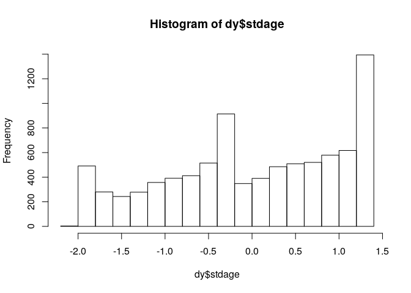
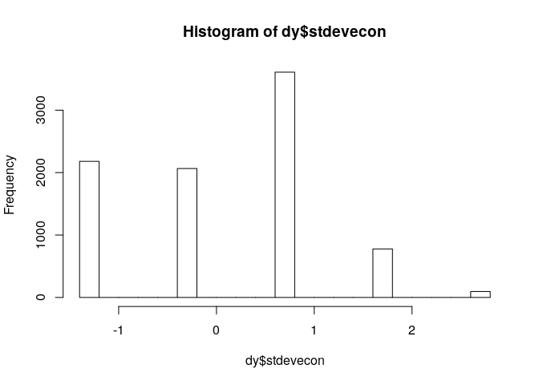
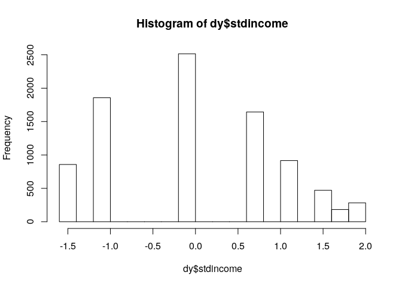
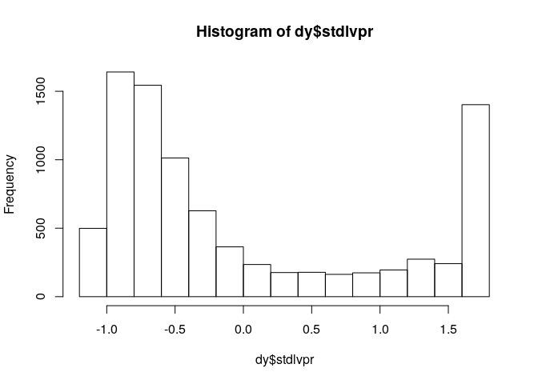

SIFCCT Matching (Young)
================
Fan Lu & Gento Kato
Dec 30, 2019

# Preparation

``` r
## Clean Up Space
rm(list=ls())

## Set Working Directory (Automatically) ##
require(rstudioapi); require(rprojroot)
if (rstudioapi::isAvailable()==TRUE) {
  setwd(dirname(rstudioapi::getActiveDocumentContext()$path)); 
} 
projdir <- find_root(has_file("thisishome.txt"))
cat(paste("Working Directory Set to:\n",projdir))
```

    ## Working Directory Set to:
    ##  /home/gentok/Documents/Projects/ForeignerJapan

``` r
setwd(projdir)

## Import Packages
library(designmatch) # Need GLPK Optimizer Installed. 
library(gurobi) # Need Gurobi Optimizer Installed.
library(fields)
```

# Data Preparation

``` r
## Import Data
d <- readRDS(paste0(projdir, "/data/sifcct_latest_v4.rds"))
table(d$edu,d$female,d$agecat)
```

    ## , ,  = Young (<=30s)
    ## 
    ##                       
    ##                           0    1
    ##   <=SHS                1437 1569
    ##   >SHS & <College(4yr) 1168 2673
    ##   >=College(4yr)       6479 5682
    ## 
    ## , ,  = Middle Aged (40-50s)
    ## 
    ##                       
    ##                           0    1
    ##   <=SHS                2103 2578
    ##   >SHS & <College(4yr) 1260 3820
    ##   >=College(4yr)       7613 3385
    ## 
    ## , ,  = Elder (>=60s)
    ## 
    ##                       
    ##                           0    1
    ##   <=SHS                2068 2408
    ##   >SHS & <College(4yr)  576 1627
    ##   >=College(4yr)       4591 1420

``` r
## Focus on Young Generation

dy <- d[which(d$agecat=="Young (<=30s)"),]
table(is.na(dy$zip_lat), useNA="always")
```

    ## 
    ## FALSE  TRUE  <NA> 
    ## 14538  4788     0

``` r
dy <- dy[,c("id","foreignsuff","familialityFT_KOR","ideology",
            "female","edu","age","agecat","knowledge","polint",
            "employed","evecon","lvpr","income","wave",
            "zip","zip_pref","zip_lat","zip_lon")]
dy <- na.omit(dy)
dy <- dy[dy$edu!=">SHS & <College(4yr)",]

## Treatment 
table(dy$edu,dy$female)
```

    ##                       
    ##                           0    1
    ##   <=SHS                 838  892
    ##   >SHS & <College(4yr)    0    0
    ##   >=College(4yr)       3899 3097

``` r
dy$treated <- ifelse(dy$edu=="<=SHS",0,1)

## Standardized Covariates
dy$stdage <- (dy$age - mean(dy$age))/sd(dy$age)
hist(dy$stdage)
```

<!-- -->

``` r
dy$stdknowledge <- (dy$knowledge - mean(dy$knowledge))/sd(dy$knowledge)
table(dy$stdknowledge)
```

    ## 
    ##   -1.63023991667611   -1.09751050376686  -0.564781090857607 -0.0320516779483563   0.500677734960895    1.03340714787015 
    ##                 959                1166                1415                1436                1410                1281 
    ##     1.5661365607794 
    ##                1059

``` r
dy$stdpolint <- (dy$polint - mean(dy$polint))/sd(dy$polint)
table(dy$stdpolint)
```

    ## 
    ##  -2.15026191132347 -0.975139130700399  0.199983649922675   1.37510643054575 
    ##                696               1940               4243               1847

``` r
dy$stdevecon <- (dy$evecon - mean(dy$evecon))/sd(dy$evecon)
hist(dy$stdevecon)
```

<!-- -->

``` r
dy$stdincome <- (dy$income - mean(dy$income))/sd(dy$income)
hist(dy$stdincome)
```

<!-- -->

``` r
dy$stdlvpr <- (dy$lvpr - mean(dy$lvpr))/sd(dy$lvpr)
hist(dy$stdlvpr)
```

<!-- -->

``` r
## Save Data
saveRDS(dy, paste0(projdir, "/data/sifcct_young_unmatched.rds"))
```

``` r
##############################################
# Match 1
# Optimal subset matching: yes
# Penalties on the distance matrix: no, *distance matrix based on covariates*
# Explicit balancing of the covariates:  
#   mom_covs =  cbind(stdage, stdknowledge, stdpolint, stdevecon, stdincome, stdlvpr)
#   mom_tols = c(0.03, 0.01, 0.02, 0.02, 0.02, 0.02)
#   exact_covs = as.matrix(employed) AND female by construct
#   near_exact_covs = as.matrix(wave) 
#   near_exact_devs = 1
##############################################

dy_matched_1 = rep(NA, 41)
pair_id_count = 0
for (j in 0:1) {    
  
  dy2 = dy[dy$female==j, ] # Gender Subset
  dy2 = dy2[order(dy2$treated, decreasing=FALSE), ] # Not Treated First
  attach(dy2, warn.conflicts=FALSE)
  
  # Treatment indicator (Not treated as 1)
  t_ind = 1-treated
  
  # Matrix of covariates (moment covariates, Age and House price)
  X_mat = cbind(stdage, stdknowledge, stdpolint, stdevecon, stdincome, stdlvpr)
  
  # Distance matrix (designmatch. Mahalanobis distance)
  dist_mat = distmat(t_ind, X_mat)
  # Whether all the treated units need to be used
  subset_weight = 1
  
  # Number of matches
  n_matches = 1
  
  # Moment covariates
  mom_covs = cbind(stdage, stdknowledge, stdpolint, stdevecon, stdincome, stdlvpr)
  mom_tols = c(0.03, 0.01, 0.02, 0.02, 0.02, 0.02)
  mom_weights = NULL #c(0,0,0)
  
  # Covariates for exact, near-exact, fine, and near-fine balance
  exact_covs = as.matrix(employed)
  near_exact_covs = as.matrix(wave)
  near_exact_devs = 1
  fine_covs = NULL
  near_fine_covs =  NULL
  near_fine_devs = NULL
  
  detach(dy2)
  
  # Find the match
  out = bmatch(t_ind=t_ind, dist_mat=dist_mat, n_controls=n_matches,
               subset_weight = subset_weight,
               mom = list(covs=mom_covs,tols=mom_tols),
               exact = list(covs=exact_covs),
               near_exact = list(covs=near_exact_covs,devs=near_exact_devs),
               fine = list(covs=fine_covs),
               near_fine = list(covs=near_fine_covs,devs=near_fine_devs),
               solver = list(name="gurobi", approximate=0, t_max=600, trace=0))
  t_id = out$t_id
  c_id = out$c_id
  pair_id = out$group_id+pair_id_count
  pair_id_count = pair_id_count+length(t_id)
  
  # Save    
  d_aux = dy2[c(t_id, c_id), ]
  d_aux = cbind(d_aux, pair_id)
  dy_matched_1 = rbind(dy_matched_1, d_aux)
  
}
dy_matched_1 = dy_matched_1[-1, ]
saveRDS(dy_matched_1, file = paste0(projdir,"/data/sifcct_young_matched_1.rds"))
```

``` r
dy_matched_1 <- readRDS(paste0(projdir,"/data/sifcct_young_matched_1.rds"))

table(dy_matched_1$treated)
```

    ## 
    ##    0    1 
    ## 1729 1729

``` r
min(table(dy_matched_1$pair_id))
```

    ## [1] 2

``` r
max(table(dy_matched_1$pair_id))
```

    ## [1] 2

``` r
table(is.na(dy_matched_1$pair_id))
```

    ## 
    ## FALSE 
    ##  3458

``` r
length(unique(dy_matched_1$id))
```

    ## [1] 3458

``` r
## Balance
require(ebal)
require(Matching)
### Female
paste(table(dy_matched_1[dy_matched_1$female==1,]$treated)[1],
      table(dy[dy$female==1,]$treated)[1],sep="/") # N of Matched Found
```

    ## [1] "892/892"

``` r
balf_dy_matched_1 <- baltest.collect(MatchBalance(treated ~ age + knowledge + polint + employed + evecon + income + lvpr,
                                                  data = dy_matched_1[dy_matched_1$female==1,], paired=FALSE, print.level=0), 
                                     var.names = c("Age","Knowledge","Political Interest","Employed", 
                                                   "Economic Evaluation","Income","Length of Residence"),
                                     after = FALSE)
round(balf_dy_matched_1,3)[,1:7]
```

    ##                     mean.Tr mean.Co  sdiff sdiff.pooled var.ratio T pval KS pval
    ## Age                  31.503  31.670 -3.179       -3.157     0.973  0.505   0.244
    ## Knowledge             0.245   0.242  1.486        1.268     0.572  0.789   0.000
    ## Political Interest    0.481   0.482 -0.580       -0.547     0.798  0.908   0.062
    ## Employed              0.564   0.564  0.000        0.000     1.000  1.000      NA
    ## Economic Evaluation   0.300   0.296  2.106        2.042     0.886  0.666   0.094
    ## Income                0.374   0.369  2.467        2.376     0.865  0.616   0.104
    ## Length of Residence   0.387   0.394 -1.958       -1.952     0.987  0.680   0.390

``` r
### Male
paste(table(dy_matched_1[dy_matched_1$female==0,]$treated)[1],
      table(dy[dy$female==0,]$treated)[1],sep="/") # N of Matched Found
```

    ## [1] "837/838"

``` r
balm_dy_matched_1 <- baltest.collect(MatchBalance(treated ~ age + knowledge + polint + employed + evecon + income + lvpr,
                                                  data = dy_matched_1[dy_matched_1$female==0,], paired=FALSE, print.level=0), 
                                     var.names = c("Age","Knowledge","Political Interest","Employed", 
                                                   "Economic Evaluation","Income","Length of Residence"),
                                     after = FALSE)
round(balm_dy_matched_1,3)[,1:7]
```

    ##                     mean.Tr mean.Co  sdiff sdiff.pooled var.ratio T pval KS pval
    ## Age                  32.515  32.680 -3.171       -3.172     1.001  0.516   0.600
    ## Knowledge             0.472   0.469  1.052        0.995     0.808  0.839   0.002
    ## Political Interest    0.624   0.618  2.022        1.964     0.894  0.688   0.570
    ## Employed              0.879   0.879  0.000        0.000     1.000  1.000      NA
    ## Economic Evaluation   0.297   0.292  1.861        1.823     0.923  0.709   0.284
    ## Income                0.389   0.384  2.168        2.091     0.870  0.669   0.160
    ## Length of Residence   0.500   0.507 -1.888       -1.874     0.972  0.701   0.572

``` r
## Save Balance Data
saveRDS(list(f = balf_dy_matched_1, m = balm_dy_matched_1), 
        file = paste0(projdir,"/data/sifcct_young_matched_1_balance.rds"))
```

``` r
##############################################
# Match 2
# Optimal subset matching: yes
# Penalties on the distance matrix: yes (lambda = 50km)
# Explicit balancing of the covariates:  
#   mom_covs =  cbind(stdage, stdknowledge, stdpolint, stdevecon, stdincome, stdlvpr)
#   mom_tols = c(0.03, 0.01, 0.02, 0.02, 0.02, 0.02)
#   exact_covs = as.matrix(employed) AND female by construct
#   near_exact_covs = as.matrix(wave) 
#   near_exact_devs = 1
##############################################

dy_matched_2 = rep(NA, 41)
pair_id_count = 0
for (j in 0:1) {    
  
  dy2 = dy[dy$female==j, ]
  dy2 = dy2[order(dy2$treated, decreasing=FALSE), ]
  attach(dy2, warn.conflicts=FALSE)
  
  # Treatment indicator 
  t_ind = 1-treated
  
  # Distance matrix
  lat_t = abs(zip_lat[t_ind==1])
  lat_c = abs(zip_lat[t_ind==0])
  lon_t = abs(zip_lon[t_ind==1])
  lon_c = abs(zip_lon[t_ind==0])
  coords_t = cbind(lon_t, lat_t)
  coords_c = cbind(lon_c, lat_c)    
  dist_mat_orig = rdist.earth(coords_t, coords_c, miles=FALSE)
  dist_mat = round(dist_mat_orig/50, 4)
  # dist_mat = round(dist_mat_orig/median(dist_mat_orig), 2)
  dist_mat = dist_mat+100*(dist_mat_orig>350)
  # Whether all the treated units need to be used
  subset_weight = 1
  
  # Number of matches
  n_matches = 1
  
  # Moment covariates
  mom_covs = cbind(stdage, stdknowledge, stdpolint, stdevecon, stdincome, stdlvpr)
  mom_tols = c(0.03, 0.01, 0.02, 0.02, 0.02, 0.02)
  mom_weights = NULL
  
  # Covariates for exact, near-exact, fine, and near-fine balance
  exact_covs = as.matrix(employed)
  near_exact_covs = as.matrix(wave)
  near_exact_devs = 1
  fine_covs = NULL
  near_fine_covs =  NULL
  near_fine_devs = NULL

  detach(dy2)
  
  # Find the match
  out = bmatch(t_ind=t_ind, dist_mat=dist_mat, n_controls=n_matches,
               subset_weight = subset_weight,
               mom = list(covs=mom_covs,tols=mom_tols),
               exact = list(covs=exact_covs),
               near_exact = list(covs=near_exact_covs,devs=near_exact_devs),
               fine = list(covs=fine_covs),
               near_fine = list(covs=near_fine_covs,devs=near_fine_devs),
               solver = list(name="gurobi", approximate=0, t_max=600, trace=0))
  t_id = out$t_id
  c_id = out$c_id
  pair_id = out$group_id+pair_id_count
  pair_id_count = pair_id_count+length(t_id)
  
  # Save    
  d_aux = dy2[c(t_id, c_id), ]
  d_aux = cbind(d_aux, pair_id)
  dy_matched_2 = rbind(dy_matched_2, d_aux)
  
}
dy_matched_2 = dy_matched_2[-1, ]
saveRDS(dy_matched_2, file = paste0(projdir,"/data/sifcct_young_matched_2.rds"))
```

``` r
dy_matched_2 <- readRDS(paste0(projdir,"/data/sifcct_young_matched_2.rds"))

table(dy_matched_2$treated)
```

    ## 
    ##    0    1 
    ## 1207 1207

``` r
min(table(dy_matched_2$pair_id))
```

    ## [1] 2

``` r
max(table(dy_matched_2$pair_id))
```

    ## [1] 2

``` r
table(is.na(dy_matched_2$pair_id))
```

    ## 
    ## FALSE 
    ##  2414

``` r
length(unique(dy_matched_2$id))
```

    ## [1] 2414

``` r
## Balance
require(ebal)
require(Matching)
### Female
paste(table(dy_matched_2[dy_matched_2$female==1,]$treated)[1],
      table(dy[dy$female==1,]$treated)[1],sep="/") # N of Matched Found
```

    ## [1] "581/892"

``` r
balf_dy_matched_2 <- baltest.collect(MatchBalance(treated ~ age + knowledge + polint + employed + evecon + income + lvpr,
                                                  data = dy_matched_2[dy_matched_2$female==1,], paired=FALSE, print.level=0), 
                                     var.names = c("Age","Knowledge","Political Interest","Employed", 
                                                   "Economic Evaluation","Income","Length of Residence"),
                                     after = FALSE)
round(balf_dy_matched_2,3)[,1:7]
```

    ##                     mean.Tr mean.Co  sdiff sdiff.pooled var.ratio T pval KS pval
    ## Age                  31.262  31.429 -3.116       -3.111     0.993  0.596   0.444
    ## Knowledge             0.267   0.264  1.270        1.129     0.652  0.847   0.000
    ## Political Interest    0.490   0.485  1.628        1.597     0.925  0.786   0.592
    ## Employed              0.620   0.620  0.000        0.000     1.000  1.000      NA
    ## Economic Evaluation   0.306   0.302  2.024        2.009     0.970  0.732   0.330
    ## Income                0.392   0.387  2.156        2.179     1.045  0.710   0.622
    ## Length of Residence   0.351   0.358 -1.987       -2.025     1.081  0.730   0.036

``` r
### Male
paste(table(dy_matched_2[dy_matched_2$female==0,]$treated)[1],
      table(dy[dy$female==0,]$treated)[1],sep="/") # N of Matched Found
```

    ## [1] "626/838"

``` r
balm_dy_matched_2 <- baltest.collect(MatchBalance(treated ~ age + knowledge + polint + employed + evecon + income + lvpr,
                                                  data = dy_matched_2[dy_matched_2$female==0,], paired=FALSE, print.level=0), 
                                     var.names = c("Age","Knowledge","Political Interest","Employed", 
                                                   "Economic Evaluation","Income","Length of Residence"),
                                     after = FALSE)
round(balm_dy_matched_2,3)[,1:7]
```

    ##                     mean.Tr mean.Co  sdiff sdiff.pooled var.ratio T pval KS pval
    ## Age                  32.628  32.796 -3.082       -3.155     1.101  0.577   0.320
    ## Knowledge             0.490   0.487  0.968        0.951     0.931  0.866   0.286
    ## Political Interest    0.626   0.621  1.792        1.801     1.022  0.750   0.520
    ## Employed              0.928   0.928  0.000        0.000     1.000  1.000      NA
    ## Economic Evaluation   0.309   0.304  1.908        1.893     0.970  0.738   0.486
    ## Income                0.411   0.406  2.247        2.182     0.893  0.699   0.232
    ## Length of Residence   0.464   0.471 -1.766       -1.789     1.054  0.752   0.242

``` r
## Save Balance Data
saveRDS(list(f = balf_dy_matched_2, m = balm_dy_matched_2), 
        file = paste0(projdir,"/data/sifcct_young_matched_2_balance.rds"))
```

``` r
##############################################
# Match 3
# Optimal subset matching: yes
# Penalties on the distance matrix: yes (lambda = 100km)
# Explicit balancing of the covariates:  
#   mom_covs =  cbind(stdage, stdknowledge, stdpolint, stdevecon, stdincome, stdlvpr)
#   mom_tols = c(0.03, 0.01, 0.02, 0.02, 0.02, 0.02)
#   exact_covs = as.matrix(employed) AND female by construct
#   near_exact_covs = as.matrix(wave) 
#   near_exact_devs = 1
##############################################

dy_matched_3 = rep(NA, 41)
pair_id_count = 0
for (j in 0:1) {    
  
  dy2 = dy[dy$female==j, ]
  dy2 = dy2[order(dy2$treated, decreasing=FALSE), ]
  attach(dy2, warn.conflicts=FALSE)
  
  # Treatment indicator 
  t_ind = 1-treated
  
  # Distance matrix
  lat_t = abs(zip_lat[t_ind==1])
  lat_c = abs(zip_lat[t_ind==0])
  lon_t = abs(zip_lon[t_ind==1])
  lon_c = abs(zip_lon[t_ind==0])
  coords_t = cbind(lon_t, lat_t)
  coords_c = cbind(lon_c, lat_c)    
  dist_mat_orig = rdist.earth(coords_t, coords_c, miles=FALSE)
  dist_mat = round(dist_mat_orig/100, 4)
  # dist_mat = round(dist_mat_orig/median(dist_mat_orig), 2)
  dist_mat = dist_mat+100*(dist_mat_orig>350)
  # Whether all the treated units need to be used
  subset_weight = 1
  
  # Number of matches
  n_matches = 1
  
  # Moment covariates
  mom_covs = cbind(stdage, stdknowledge, stdpolint, stdevecon, stdincome, stdlvpr)
  mom_tols = c(0.03, 0.01, 0.02, 0.02, 0.02, 0.02)
  mom_weights = NULL
  
  # Covariates for exact, near-exact, fine, and near-fine balance
  exact_covs = as.matrix(employed)
  near_exact_covs = as.matrix(wave)
  near_exact_devs = 1
  fine_covs = NULL
  near_fine_covs =  NULL
  near_fine_devs = NULL
  
  detach(dy2)
  
  # Find the match
  out = bmatch(t_ind=t_ind, dist_mat=dist_mat, n_controls=n_matches,
               subset_weight = subset_weight,
               mom = list(covs=mom_covs,tols=mom_tols),
               exact = list(covs=exact_covs),
               near_exact = list(covs=near_exact_covs,devs=near_exact_devs),
               fine = list(covs=fine_covs),
               near_fine = list(covs=near_fine_covs,devs=near_fine_devs),
               solver = list(name="gurobi", approximate=0, t_max=600, trace=0))
  t_id = out$t_id
  c_id = out$c_id
  pair_id = out$group_id+pair_id_count
  pair_id_count = pair_id_count+length(t_id)
  
  # Save    
  d_aux = dy2[c(t_id, c_id), ]
  d_aux = cbind(d_aux, pair_id)
  dy_matched_3 = rbind(dy_matched_3, d_aux)
  
}
dy_matched_3 = dy_matched_3[-1, ]
saveRDS(dy_matched_3, file = paste0(projdir,"/data/sifcct_young_matched_3.rds"))
```

``` r
dy_matched_3 <- readRDS(paste0(projdir,"/data/sifcct_young_matched_3.rds"))

table(dy_matched_3$treated)
```

    ## 
    ##    0    1 
    ## 1458 1458

``` r
min(table(dy_matched_3$pair_id))
```

    ## [1] 2

``` r
max(table(dy_matched_3$pair_id))
```

    ## [1] 2

``` r
table(is.na(dy_matched_3$pair_id))
```

    ## 
    ## FALSE 
    ##  2916

``` r
length(unique(dy_matched_3$id))
```

    ## [1] 2916

``` r
## Balance
require(ebal)
require(Matching)
### Female
paste(table(dy_matched_3[dy_matched_3$female==1,]$treated)[1],
      table(dy[dy$female==1,]$treated)[1],sep="/") # N of Matched Found
```

    ## [1] "715/892"

``` r
balf_dy_matched_3 <- baltest.collect(MatchBalance(treated ~ age + knowledge + polint + employed + evecon + income + lvpr,
                                                  data = dy_matched_3[dy_matched_3$female==1,], paired=FALSE, print.level=0), 
                                     var.names = c("Age","Knowledge","Political Interest","Employed", 
                                                   "Economic Evaluation","Income","Length of Residence"),
                                     after = FALSE)
round(balf_dy_matched_3,3)[,1:7]
```

    ##                     mean.Tr mean.Co  sdiff sdiff.pooled var.ratio T pval KS pval
    ## Age                  31.345  31.512 -3.119       -3.118     0.999  0.556   0.378
    ## Knowledge             0.256   0.253  1.411        1.236     0.623  0.815   0.000
    ## Political Interest    0.485   0.479  2.007        1.956     0.905  0.712   0.370
    ## Employed              0.596   0.596  0.000        0.000     1.000  1.000      NA
    ## Economic Evaluation   0.309   0.304  2.070        2.061     0.984  0.697   0.518
    ## Income                0.389   0.384  2.243        2.253     1.017  0.670   0.640
    ## Length of Residence   0.369   0.376 -1.952       -1.986     1.072  0.707   0.026

``` r
### Male
paste(table(dy_matched_3[dy_matched_3$female==0,]$treated)[1],
      table(dy[dy$female==0,]$treated)[1],sep="/") # N of Matched Found
```

    ## [1] "743/838"

``` r
balm_dy_matched_3 <- baltest.collect(MatchBalance(treated ~ age + knowledge + polint + employed + evecon + income + lvpr,
                                                  data = dy_matched_3[dy_matched_3$female==0,], paired=FALSE, print.level=0), 
                                     var.names = c("Age","Knowledge","Political Interest","Employed", 
                                                   "Economic Evaluation","Income","Length of Residence"),
                                     after = FALSE)
round(balm_dy_matched_3,3)[,1:7]
```

    ##                     mean.Tr mean.Co  sdiff sdiff.pooled var.ratio T pval KS pval
    ## Age                  32.630  32.797 -3.129       -3.182     1.070  0.540   0.502
    ## Knowledge             0.482   0.479  0.969        0.947     0.914  0.855   0.152
    ## Political Interest    0.630   0.624  1.801        1.829     1.066  0.724   0.188
    ## Employed              0.915   0.915  0.000        0.000     1.000  1.000      NA
    ## Economic Evaluation   0.305   0.300  1.888        1.881     0.984  0.717   0.550
    ## Income                0.401   0.396  2.267        2.206     0.899  0.671   0.198
    ## Length of Residence   0.482   0.489 -1.809       -1.829     1.044  0.725   0.218

``` r
## Save Balance Data
saveRDS(list(f = balf_dy_matched_3, m = balm_dy_matched_3), 
        file = paste0(projdir,"/data/sifcct_young_matched_3_balance.rds"))
```

``` r
##############################################
# Match 4
# Optimal subset matching: yes
# Penalties on the distance matrix: yes (lambda = 200km)
# Explicit balancing of the covariates:  
#   mom_covs =  cbind(stdage, stdknowledge, stdpolint, stdevecon, stdincome, stdlvpr)
#   mom_tols = c(0.03, 0.01, 0.02, 0.02, 0.02, 0.02)
#   exact_covs = as.matrix(employed) AND female by construct
#   near_exact_covs = as.matrix(wave) 
#   near_exact_devs = 1
##############################################

dy_matched_4 = rep(NA, 41)
pair_id_count = 0
for (j in 0:1) {    
  
  dy2 = dy[dy$female==j, ]
  dy2 = dy2[order(dy2$treated, decreasing=FALSE), ]
  attach(dy2, warn.conflicts=FALSE)
  
  # Treatment indicator 
  t_ind = 1-treated
  
  # Distance matrix
  lat_t = abs(zip_lat[t_ind==1])
  lat_c = abs(zip_lat[t_ind==0])
  lon_t = abs(zip_lon[t_ind==1])
  lon_c = abs(zip_lon[t_ind==0])
  coords_t = cbind(lon_t, lat_t)
  coords_c = cbind(lon_c, lat_c)    
  dist_mat_orig = rdist.earth(coords_t, coords_c, miles=FALSE)
  dist_mat = round(dist_mat_orig/200, 4)
  # dist_mat = round(dist_mat_orig/median(dist_mat_orig), 2)
  dist_mat = dist_mat+100*(dist_mat_orig>350)
  # Whether all the treated units need to be used
  subset_weight = 1
  
  # Number of matches
  n_matches = 1
  
  # Moment covariates
  mom_covs = cbind(stdage, stdknowledge, stdpolint, stdevecon, stdincome, stdlvpr)
  mom_tols = c(0.03, 0.01, 0.02, 0.02, 0.02, 0.02)
  mom_weights = NULL
  
  # Covariates for exact, near-exact, fine, and near-fine balance
  exact_covs = as.matrix(employed)
  near_exact_covs = as.matrix(wave)
  near_exact_devs = 1
  fine_covs = NULL
  near_fine_covs =  NULL
  near_fine_devs = NULL
  
  detach(dy2)
  
  # Find the match
  out = bmatch(t_ind=t_ind, dist_mat=dist_mat, n_controls=n_matches,
               subset_weight = subset_weight,
               mom = list(covs=mom_covs,tols=mom_tols),
               exact = list(covs=exact_covs),
               near_exact = list(covs=near_exact_covs,devs=near_exact_devs),
               fine = list(covs=fine_covs),
               near_fine = list(covs=near_fine_covs,devs=near_fine_devs),
               solver = list(name="gurobi", approximate=0, t_max=600, trace=0))
  t_id = out$t_id
  c_id = out$c_id
  pair_id = out$group_id+pair_id_count
  pair_id_count = pair_id_count+length(t_id)
  
  # Save    
  d_aux = dy2[c(t_id, c_id), ]
  d_aux = cbind(d_aux, pair_id)
  dy_matched_4 = rbind(dy_matched_4, d_aux)
  
}
dy_matched_4 = dy_matched_4[-1, ]
saveRDS(dy_matched_4, file = paste0(projdir,"/data/sifcct_young_matched_4.rds"))
```

``` r
dy_matched_4 <- readRDS(paste0(projdir,"/data/sifcct_young_matched_4.rds"))

table(dy_matched_4$treated)
```

    ## 
    ##    0    1 
    ## 1618 1618

``` r
min(table(dy_matched_4$pair_id))
```

    ## [1] 2

``` r
max(table(dy_matched_4$pair_id))
```

    ## [1] 2

``` r
table(is.na(dy_matched_4$pair_id))
```

    ## 
    ## FALSE 
    ##  3236

``` r
length(unique(dy_matched_4$id))
```

    ## [1] 3236

``` r
## Balance
require(ebal)
require(Matching)
### Female
paste(table(dy_matched_4[dy_matched_4$female==1,]$treated)[1],
      table(dy[dy$female==1,]$treated)[1],sep="/") # N of Matched Found
```

    ## [1] "812/892"

``` r
balf_dy_matched_4 <- baltest.collect(MatchBalance(treated ~ age + knowledge + polint + employed + evecon + income + lvpr,
                                                  data = dy_matched_4[dy_matched_4$female==1,], paired=FALSE, print.level=0), 
                                     var.names = c("Age","Knowledge","Political Interest","Employed", 
                                                   "Economic Evaluation","Income","Length of Residence"),
                                     after = FALSE)
round(balf_dy_matched_4,3)[,1:7]
```

    ##                     mean.Tr mean.Co  sdiff sdiff.pooled var.ratio T pval KS pval
    ## Age                  31.408  31.575 -3.102       -3.112     1.012  0.531   0.238
    ## Knowledge             0.250   0.247  1.421        1.262     0.651  0.799   0.000
    ## Political Interest    0.487   0.482  1.937        1.881     0.892  0.705   0.370
    ## Employed              0.580   0.580  0.000        0.000     1.000  1.000      NA
    ## Economic Evaluation   0.306   0.301  2.058        2.054     0.993  0.679   0.504
    ## Income                0.384   0.379  2.224        2.235     1.020  0.653   0.716
    ## Length of Residence   0.376   0.383 -1.969       -1.989     1.041  0.689   0.066

``` r
### Male
paste(table(dy_matched_4[dy_matched_4$female==0,]$treated)[1],
      table(dy[dy$female==0,]$treated)[1],sep="/") # N of Matched Found
```

    ## [1] "806/838"

``` r
balm_dy_matched_4 <- baltest.collect(MatchBalance(treated ~ age + knowledge + polint + employed + evecon + income + lvpr,
                                                  data = dy_matched_4[dy_matched_4$female==0,], paired=FALSE, print.level=0), 
                                     var.names = c("Age","Knowledge","Political Interest","Employed", 
                                                   "Economic Evaluation","Income","Length of Residence"),
                                     after = FALSE)
round(balm_dy_matched_4,3)[,1:7]
```

    ##                     mean.Tr mean.Co  sdiff sdiff.pooled var.ratio T pval KS pval
    ## Age                  32.610  32.778 -3.103       -3.170     1.092  0.525   0.686
    ## Knowledge             0.473   0.470  1.023        1.002     0.922  0.841   0.172
    ## Political Interest    0.627   0.621  1.799        1.827     1.066  0.714   0.226
    ## Employed              0.896   0.896  0.000        0.000     1.000  1.000      NA
    ## Economic Evaluation   0.296   0.292  1.752        1.742     0.977  0.727   0.506
    ## Income                0.394   0.389  2.219        2.178     0.930  0.662   0.456
    ## Length of Residence   0.494   0.501 -1.858       -1.866     1.018  0.708   0.522

``` r
## Save Balance Data
saveRDS(list(f = balf_dy_matched_4, m = balm_dy_matched_4), 
        file = paste0(projdir,"/data/sifcct_young_matched_4_balance.rds"))
```

``` r
##############################################
# Match 5
# Optimal subset matching: yes
# Penalties on the distance matrix: yes (lambda = 350km)
# Explicit balancing of the covariates:  
#   mom_covs =  cbind(stdage, stdknowledge, stdpolint, stdevecon, stdincome, stdlvpr)
#   mom_tols = c(0.03, 0.01, 0.02, 0.02, 0.02, 0.02)
#   exact_covs = as.matrix(employed) AND female by construct
#   near_exact_covs = as.matrix(wave) 
#   near_exact_devs = 1
##############################################

dy_matched_5 = rep(NA, 41)
pair_id_count = 0
for (j in 0:1) {    
  
  dy2 = dy[dy$female==j, ]
  dy2 = dy2[order(dy2$treated, decreasing=FALSE), ]
  attach(dy2, warn.conflicts=FALSE)
  
  # Treatment indicator 
  t_ind = 1-treated
  
  # Distance matrix
  lat_t = abs(zip_lat[t_ind==1])
  lat_c = abs(zip_lat[t_ind==0])
  lon_t = abs(zip_lon[t_ind==1])
  lon_c = abs(zip_lon[t_ind==0])
  coords_t = cbind(lon_t, lat_t)
  coords_c = cbind(lon_c, lat_c)    
  dist_mat_orig = rdist.earth(coords_t, coords_c, miles=FALSE)
  dist_mat = round(dist_mat_orig/350, 4)
  # dist_mat = round(dist_mat_orig/median(dist_mat_orig), 2)
  dist_mat = dist_mat+100*(dist_mat_orig>350)
  # Whether all the treated units need to be used
  subset_weight = 1
  
  # Number of matches
  n_matches = 1
  
  # Moment covariates
  mom_covs = cbind(stdage, stdknowledge, stdpolint, stdevecon, stdincome, stdlvpr)
  mom_tols = c(0.03, 0.01, 0.02, 0.02, 0.02, 0.02)
  mom_weights = NULL
  
  # Covariates for exact, near-exact, fine, and near-fine balance
  exact_covs = as.matrix(employed)
  near_exact_covs = as.matrix(wave)
  near_exact_devs = 1
  fine_covs = NULL
  near_fine_covs =  NULL
  near_fine_devs = NULL
  
  detach(dy2)
  
  # Find the match
  out = bmatch(t_ind=t_ind, dist_mat=dist_mat, n_controls=n_matches,
               subset_weight = subset_weight,
               mom = list(covs=mom_covs,tols=mom_tols),
               exact = list(covs=exact_covs),
               near_exact = list(covs=near_exact_covs,devs=near_exact_devs),
               fine = list(covs=fine_covs),
               near_fine = list(covs=near_fine_covs,devs=near_fine_devs),
               solver = list(name="gurobi", approximate=0, t_max=600, trace=0))
  t_id = out$t_id
  c_id = out$c_id
  pair_id = out$group_id+pair_id_count
  pair_id_count = pair_id_count+length(t_id)
  
  # Save    
  d_aux = dy2[c(t_id, c_id), ]
  d_aux = cbind(d_aux, pair_id)
  dy_matched_5 = rbind(dy_matched_5, d_aux)
  
}
dy_matched_5 = dy_matched_5[-1, ]
saveRDS(dy_matched_5, file = paste0(projdir,"/data/sifcct_young_matched_5.rds"))
```

``` r
dy_matched_5 <- readRDS(paste0(projdir,"/data/sifcct_young_matched_5.rds"))

table(dy_matched_5$treated)
```

    ## 
    ##    0    1 
    ## 1670 1670

``` r
min(table(dy_matched_5$pair_id))
```

    ## [1] 2

``` r
max(table(dy_matched_5$pair_id))
```

    ## [1] 2

``` r
table(is.na(dy_matched_5$pair_id))
```

    ## 
    ## FALSE 
    ##  3340

``` r
length(unique(dy_matched_5$id))
```

    ## [1] 3340

``` r
## Balance
require(ebal)
require(Matching)
### Female
paste(table(dy_matched_5[dy_matched_5$female==1,]$treated)[1],
      table(dy[dy$female==1,]$treated)[1],sep="/") # N of Matched Found
```

    ## [1] "847/892"

``` r
balf_dy_matched_5 <- baltest.collect(MatchBalance(treated ~ age + knowledge + polint + employed + evecon + income + lvpr,
                                                  data = dy_matched_5[dy_matched_5$female==1,], paired=FALSE, print.level=0), 
                                     var.names = c("Age","Knowledge","Political Interest","Employed", 
                                                   "Economic Evaluation","Income","Length of Residence"),
                                     after = FALSE)
round(balf_dy_matched_5,3)[,1:7]
```

    ##                     mean.Tr mean.Co  sdiff sdiff.pooled var.ratio T pval KS pval
    ## Age                  31.407  31.573 -3.013       -3.054     1.056  0.530   0.164
    ## Knowledge             0.247   0.244  1.375        1.217     0.644  0.802   0.000
    ## Political Interest    0.484   0.479  1.717        1.668     0.893  0.731   0.422
    ## Employed              0.573   0.573  0.000        0.000     1.000  1.000      NA
    ## Economic Evaluation   0.304   0.299  1.981        1.972     0.981  0.685   0.352
    ## Income                0.380   0.375  2.224        2.246     1.039  0.644   0.542
    ## Length of Residence   0.385   0.392 -1.959       -1.971     1.024  0.685   0.222

``` r
### Male
paste(table(dy_matched_5[dy_matched_5$female==0,]$treated)[1],
      table(dy[dy$female==0,]$treated)[1],sep="/") # N of Matched Found
```

    ## [1] "823/838"

``` r
balm_dy_matched_5 <- baltest.collect(MatchBalance(treated ~ age + knowledge + polint + employed + evecon + income + lvpr,
                                                  data = dy_matched_5[dy_matched_5$female==0,], paired=FALSE, print.level=0), 
                                     var.names = c("Age","Knowledge","Political Interest","Employed", 
                                                   "Economic Evaluation","Income","Length of Residence"),
                                     after = FALSE)
round(balm_dy_matched_5,3)[,1:7]
```

    ##                     mean.Tr mean.Co  sdiff sdiff.pooled var.ratio T pval KS pval
    ## Age                  32.591  32.757 -3.058       -3.134     1.105  0.525   0.544
    ## Knowledge             0.473   0.470  1.008        0.984     0.909  0.842   0.168
    ## Political Interest    0.624   0.618  1.881        1.912     1.070  0.698   0.194
    ## Employed              0.883   0.883  0.000        0.000     1.000  1.000      NA
    ## Economic Evaluation   0.296   0.291  1.973        1.956     0.967  0.692   0.376
    ## Income                0.391   0.385  2.100        2.064     0.935  0.675   0.430
    ## Length of Residence   0.499   0.506 -1.767       -1.771     1.009  0.719   0.420

``` r
## Save Balance Data
saveRDS(list(f = balf_dy_matched_5, m = balm_dy_matched_5), 
        file = paste0(projdir,"data/sifcct_young_matched_5_balance.rds"))
```
