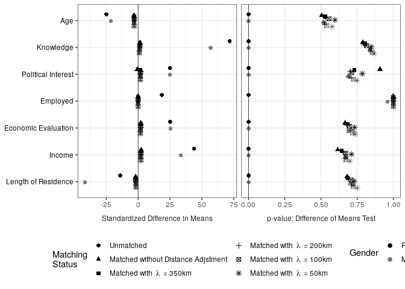
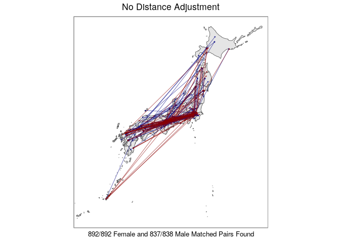
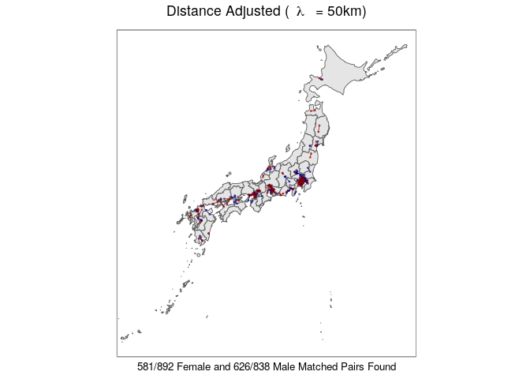
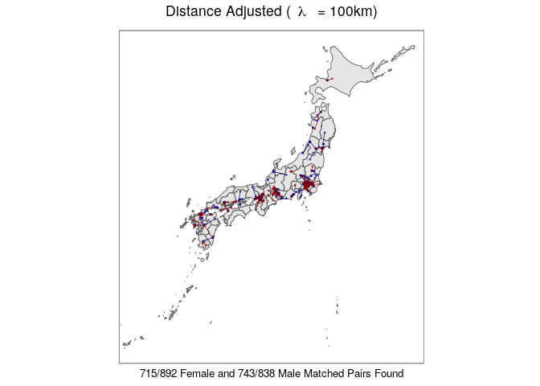
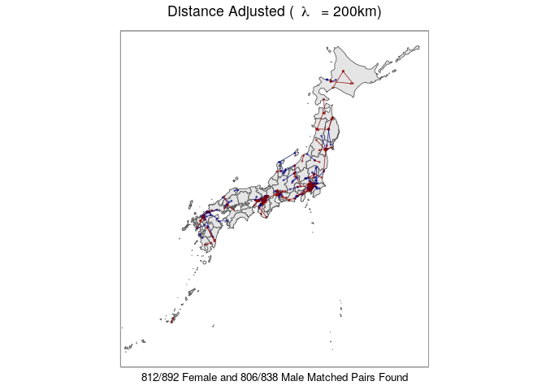
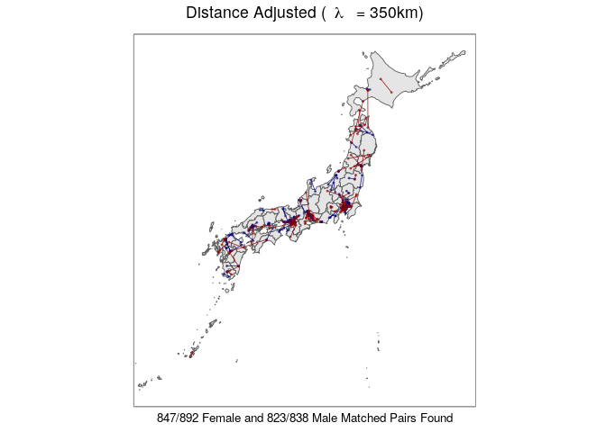
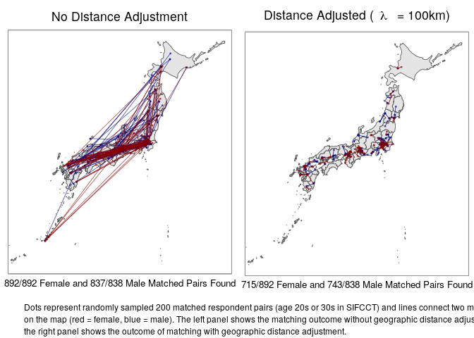
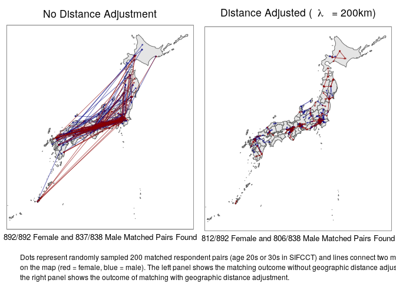
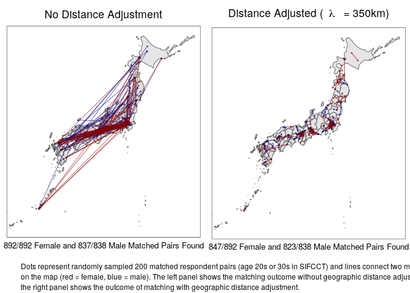

SIFCCT Matching Visualization
================
Fan Lu & Gento Kato
Jan 1, 2020

# Preparation

``` r
## Clean Up Space
rm(list=ls())

## Set Working Directory (Automatically) ##
require(rstudioapi); require(rprojroot)
if (rstudioapi::isAvailable()==TRUE) {
  setwd(dirname(rstudioapi::getActiveDocumentContext()$path)); 
} 
projdir <- find_root(has_file("thisishome.txt"))
cat(paste("Working Directory Set to:\n",projdir))
```

    ## Working Directory Set to:
    ##  /home/gentok/Documents/Projects/ForeignerJapan

``` r
setwd(projdir)

## Import Matched Data

d <- readRDS(paste0(projdir, "/data/sifcct_latest_v4.rds"))
dy <- readRDS(paste0(projdir, "/data/sifcct_young_unmatched.rds"))
dym1 <- readRDS(paste0(projdir, "/data/sifcct_young_matched_1.rds"))
dym2 <- readRDS(paste0(projdir, "/data/sifcct_young_matched_2.rds"))
dym3 <- readRDS(paste0(projdir, "/data/sifcct_young_matched_3.rds"))
dym4 <- readRDS(paste0(projdir, "/data/sifcct_young_matched_4.rds"))
dym5 <- readRDS(paste0(projdir, "/data/sifcct_young_matched_5.rds"))

## Packages
library(lmtest) # For Statistical Test
library(sandwich) # Cluster Robust Standard Error
library(ggplot2) # Plotting 
library(grid) # Plotting  
library(gridExtra) # Plotting
library(sf) # Plotting Map
library(ggimage) # Plotting Map
library(jpndistrict) # Plotting Japanese Map
library(magrittr) # Data Management/Plotting
library(purrr) # Data Management
library(pbapply) # Apply with Progress Bar
require(ebal) # Matching Balance
require(Matching) # Matching Balance
```

# Plotting Individual-Level Predictors Balance

``` r
## Import Data
bal_dy_matched_1 <- readRDS(paste0(projdir, "/data/sifcct_young_matched_1_balance.rds")) # Young, No Distance Adjustment
bal_dy_matched_2 <- readRDS(paste0(projdir, "/data/sifcct_young_matched_2_balance.rds")) # Young, Distance Adjusted 50km
bal_dy_matched_3  <- readRDS(paste0(projdir, "/data/sifcct_young_matched_3_balance.rds")) # Young, Distance Adjusted 100km
bal_dy_matched_4  <- readRDS(paste0(projdir, "/data/sifcct_young_matched_4_balance.rds")) # Young, Distance Adjusted 200km
bal_dy_matched_5  <- readRDS(paste0(projdir, "/data/sifcct_young_matched_5_balance.rds")) # Young, Distance Adjusted 350km

## Raw data balance
### Female
balf_dy_unmatched <- baltest.collect(MatchBalance(treated ~ age + knowledge + polint + employed + evecon + income + lvpr,
                                                  data = dy[dy$female==1,], paired=FALSE, print.level=0), 
                                     var.names = c("Age","Knowledge","Political Interest","Employed", 
                                                   "Economic Evaluation","Income","Length of Residence"),
                                     after = FALSE)
round(balf_dy_unmatched,3)[,1:7]
```

    ##                     mean.Tr mean.Co   sdiff sdiff.pooled var.ratio T pval KS pval
    ## Age                  30.286  31.670 -24.897      -25.426     1.090      0       0
    ## Knowledge             0.446   0.242  71.875       74.209     1.141      0       0
    ## Political Interest    0.550   0.482  25.062       24.144     0.866      0       0
    ## Employed              0.653   0.564  18.618       18.232     0.921      0      NA
    ## Economic Evaluation   0.355   0.296  25.105       24.862     0.962      0       0
    ## Income                0.491   0.369  43.952       47.347     1.382      0       0
    ## Length of Residence   0.345   0.394 -14.050      -13.807     0.934      0       0

``` r
### Male
balm_dy_unmatched <- baltest.collect(MatchBalance(treated ~ age + knowledge + polint + employed + evecon + income + lvpr,
                                                  data = dy[dy$female==0,], paired=FALSE, print.level=0), 
                                     var.names = c("Age","Knowledge","Political Interest","Employed", 
                                                   "Economic Evaluation","Income","Length of Residence"),
                                     after = FALSE)
round(balm_dy_unmatched,3)[,1:7]
```

    ##                     mean.Tr mean.Co   sdiff sdiff.pooled var.ratio T pval KS pval
    ## Age                  31.479  32.685 -21.274      -22.180     1.191   0.00       0
    ## Knowledge             0.631   0.468  56.860       54.064     0.825   0.00       0
    ## Political Interest    0.685   0.618  24.944       24.004     0.862   0.00       0
    ## Employed              0.878   0.878  -0.189       -0.190     1.003   0.96      NA
    ## Economic Evaluation   0.357   0.292  25.463       25.635     1.028   0.00       0
    ## Income                0.474   0.384  33.587       34.743     1.151   0.00       0
    ## Length of Residence   0.360   0.507 -41.757      -40.082     0.854   0.00       0

``` r
## Matched Sample Proportions
matchprdt <- data.frame(
  labs = c("Unmatched",
           "Matched without Distance Adjstment",
           "Matched with Lambda = 350km",
           "Matched with Lambda = 200km",
           "Matched with Lambda = 100km",
           "Matched with Lambda = 50km"),
  notF = c(table(dy[dy$female==1,]$treated)[1],
           table(dym1[dym1$female==1,]$treated)[1],
           table(dym5[dym5$female==1,]$treated)[1],
           table(dym4[dym4$female==1,]$treated)[1],
           table(dym3[dym3$female==1,]$treated)[1],
           table(dym2[dym2$female==1,]$treated)[1]),
  treatedF = c(table(dy[dy$female==1,]$treated)[2],
               table(dym1[dym1$female==1,]$treated)[2],
               table(dym5[dym5$female==1,]$treated)[2],
               table(dym4[dym4$female==1,]$treated)[2],
               table(dym3[dym3$female==1,]$treated)[2],
               table(dym2[dym2$female==1,]$treated)[2]), 
  notM = c(table(dy[dy$female==0,]$treated)[1],
           table(dym1[dym1$female==0,]$treated)[1],
           table(dym5[dym5$female==0,]$treated)[1],
           table(dym4[dym4$female==0,]$treated)[1],
           table(dym3[dym3$female==0,]$treated)[1],
           table(dym2[dym2$female==0,]$treated)[1]),  
  treatedM = c(table(dy[dy$female==0,]$treated)[2],
               table(dym1[dym1$female==0,]$treated)[2],
               table(dym5[dym5$female==0,]$treated)[2],
               table(dym4[dym4$female==0,]$treated)[2],
               table(dym3[dym3$female==0,]$treated)[2],
               table(dym2[dym2$female==0,]$treated)[2]))
matchprdt$prF <- round((matchprdt$notF/table(dy[dy$female==1,]$treated)[1])*100,1)
matchprdt$prM <- round((matchprdt$notM/table(dy[dy$female==0,]$treated)[1])*100,1)
matchprdt <- matchprdt[,c("labs","notF","treatedF","prF","notM","treatedM","prM")]

matchprdt <- as.matrix(matchprdt)
colnames(matchprdt) <- c("", "Not Treated", "Treated", "% Matched", 
                         "Not Treated", "Treated", "% Matched")

require(knitr)
require(kableExtra)
tmp <- add_header_above(kable(matchprdt,"latex"), c(" ", "Female"=3, "Male"=3))
cat(tmp)
```

    ## 
    ## \begin{tabular}{l|l|l|l|l|l|l}
    ## \hline
    ## \multicolumn{1}{c|}{ } & \multicolumn{3}{c|}{Female} & \multicolumn{3}{c}{Male} \\
    ## \cline{2-4} \cline{5-7}
    ##  & Not Treated & Treated & \% Matched & Not Treated & Treated & \% Matched\\
    ## \hline
    ## Unmatched & 892 & 3097 & 100.0 & 838 & 3899 & 100.0\\
    ## \hline
    ## Matched without Distance Adjstment & 892 & 892 & 100.0 & 837 & 837 & 99.9\\
    ## \hline
    ## Matched with Lambda = 350km & 847 & 847 & 95.0 & 823 & 823 & 98.2\\
    ## \hline
    ## Matched with Lambda = 200km & 812 & 812 & 91.0 & 806 & 806 & 96.2\\
    ## \hline
    ## Matched with Lambda = 100km & 715 & 715 & 80.2 & 743 & 743 & 88.7\\
    ## \hline
    ## Matched with Lambda = 50km & 581 & 581 & 65.1 & 626 & 626 & 74.7\\
    ## \hline
    ## \end{tabular}

``` r
baldt <- as.data.frame(rbind(balf_dy_unmatched,
               bal_dy_matched_1$f,
               bal_dy_matched_5$f,
               bal_dy_matched_4$f,
               bal_dy_matched_3$f,
               bal_dy_matched_2$f,
               balm_dy_unmatched,
               bal_dy_matched_1$m,
               bal_dy_matched_5$m,
               bal_dy_matched_4$m,
               bal_dy_matched_3$m,
               bal_dy_matched_2$m))
baldt <- data.frame(stat = c(baldt$sdiff,baldt$`T pval`))
baldt$data <- rep(c("Unmatched",
                "Matched without Distance Adjstment",
                "Matched with Lambda = 350km",
                "Matched with Lambda = 200km",
                "Matched with Lambda = 100km",
                "Matched with Lambda = 50km"), each=nrow(balf_dy_unmatched))
baldt$data <- factor(baldt$data, levels=unique(baldt$data))
baldt$vn <- factor(rownames(balf_dy_unmatched), 
                   levels=rev(rownames(balf_dy_unmatched)))
baldt$stat_cat <- rep(c("Standardized Difference in Means",
                        "p-value: Difference of Means Test"),
                      each = nrow(balf_dy_unmatched)*12)
baldt$stat_cat <- factor(baldt$stat_cat, levels=unique(baldt$stat_cat))
baldt$gender <- rep(c("Female","Male"), each=nrow(balf_dy_unmatched)*6)
baldt$gender <- factor(baldt$gender, levels=unique(baldt$gender))


require(ggplot2)
p <- ggplot(baldt, aes(x=vn,y=stat)) + 
  geom_hline(aes(yintercept=0), size=0.25, linetype=1) + 
  geom_point(aes(alpha=gender, shape=data), color="black",
             position=position_dodge(width=-0.5), size=2) + 
  facet_grid( ~ stat_cat, scales="free_x", switch="x") + 
  scale_shape_discrete(name="Matching\nStatus", 
                       labels = c("Unmatched",
                                  "Matched without Distance Adjstment",
                                  bquote("Matched with"~lambda~"= 350km"),
                                  bquote("Matched with"~lambda~"= 200km"),
                                  bquote("Matched with"~lambda~"= 100km"),
                                  bquote("Matched with"~lambda~"= 50km"))) + 
  scale_alpha_manual(name="Gender", values=c("Female"=1,"Male"=0.5)) + 
  coord_flip() +
  ylab(NULL) + xlab(NULL) + 
  guides(alpha = guide_legend(nrow = 2), 
         shape = guide_legend(nrow = 3)) + 
  theme_bw() +  
  theme(legend.position="bottom",
        axis.text.y = element_text(color="black"),
        strip.background.x = element_blank(),
        strip.text.y = element_text(angle=0,size=10),
        strip.placement = "outside")
p
```

    ## Warning: position_dodge requires non-overlapping x intervals
    
    ## Warning: position_dodge requires non-overlapping x intervals

<!-- -->

``` r
ggsave(paste0(projdir,"/out/matchbalanceplot_sifcct.pdf"),p,width=8,height=5)
```

# Plotting Geographic Distance Balance

## Prepare Japanese Map Data

``` r
## Referenced from https://uribo.hatenablog.com/entry/2017/12/08/144549
## All w/o Tokyo and Okinawa
alljp_no1347 <- do.call("rbind", pblapply(seq(1,47)[-c(13,47)], 
                                          function(k) jpn_pref(pref_code = k, district=FALSE)))
## Tokyo 
tokyo13 <- jpn_pref(pref_code = 13, district = FALSE) %>% 
  st_simplify(dTolerance = 0.01)
```

    ## Warning in st_simplify.sfc(st_geometry(x), preserveTopology, dTolerance): st_simplify does not correctly simplify longitude/latitude data, dTolerance needs
    ## to be in decimal degrees

``` r
## (Excluding Southern Islands) # Deprecated
# tokyo13 <- jpn_pref(pref_code = 13, district = TRUE) %>% 
#   st_simplify(dTolerance = 0.01) %>% 
#   mutate(city_code = as.numeric(city_code)) %>% 
#   filter(city_code != 13421) %>% st_union() %>% 
#   as.data.frame() %>% mutate(jis_code = "13", 
#                              prefecture = "東京都") %>% magrittr::set_names(c("geometry", 
#                                                                            "jis_code", "prefecture")) %>% st_as_sf()
## Okinawa 
okinawa47 <- jpn_pref(pref_code = 47, district = FALSE)
okinawa47 <- okinawa47 %>% st_set_crs(value = 4326)
```

## Prepare Respondents Data

``` r
# Sample N Respondents
N = 200
set.seed(3451)
dymap1 <- dym1[which(dym1$pair_id%in%sample(max(dym1$pair_id),N)),]
set.seed(5412)
dymap2 <- dym2[which(dym2$pair_id%in%sample(max(dym2$pair_id),N)),]
set.seed(5241)
dymap3 <- dym3[which(dym3$pair_id%in%sample(max(dym3$pair_id),N)),]
set.seed(5441)
dymap4 <- dym4[which(dym4$pair_id%in%sample(max(dym4$pair_id),N)),]
set.seed(5141)
dymap5 <- dym5[which(dym5$pair_id%in%sample(max(dym5$pair_id),N)),]

# Move Okinawa location to left-upper corner (not done for now) 
# okinawa47$geometry <- okinawa47$geometry %>% magrittr::add(c(5.6, 17.5))
# dymap1$zip_lon[which(dymap1$zip_pref=="沖縄県")] <- dymap1$zip_lon[which(dymap1$zip_pref=="沖縄県")] + 5.6
# dymap1$zip_lat[which(dymap1$zip_pref=="沖縄県")] <- dymap1$zip_lat[which(dymap1$zip_pref=="沖縄県")] + 17.5
# dymap2$zip_lon[which(dymap2$zip_pref=="沖縄県")] <- dymap2$zip_lon[which(dymap2$zip_pref=="沖縄県")] + 5.6
# dymap2$zip_lat[which(dymap2$zip_pref=="沖縄県")] <- dymap2$zip_lat[which(dymap2$zip_pref=="沖縄県")] + 17.5
# dmmap1$zip_lon[which(dmmap1$zip_pref=="沖縄県")] <- dmmap1$zip_lon[which(dmmap1$zip_pref=="沖縄県")] + 5.6
# dmmap1$zip_lat[which(dmmap1$zip_pref=="沖縄県")] <- dmmap1$zip_lat[which(dmmap1$zip_pref=="沖縄県")] + 17.5
# dmmap2$zip_lon[which(dmmap2$zip_pref=="沖縄県")] <- dmmap2$zip_lon[which(dmmap2$zip_pref=="沖縄県")] + 5.6
# dmmap2$zip_lat[which(dmmap2$zip_pref=="沖縄県")] <- dmmap2$zip_lat[which(dmmap2$zip_pref=="沖縄県")] + 17.5
# demap1$zip_lon[which(demap1$zip_pref=="沖縄県")] <- demap1$zip_lon[which(demap1$zip_pref=="沖縄県")] + 5.6
# demap1$zip_lat[which(demap1$zip_pref=="沖縄県")] <- demap1$zip_lat[which(demap1$zip_pref=="沖縄県")] + 17.5
# demap2$zip_lon[which(demap2$zip_pref=="沖縄県")] <- demap2$zip_lon[which(demap2$zip_pref=="沖縄県")] + 5.6
# demap2$zip_lat[which(demap2$zip_pref=="沖縄県")] <- demap2$zip_lat[which(demap2$zip_pref=="沖縄県")] + 17.5
```

## Plot

``` r
p1 <- ggplot() + 
  geom_sf(data=alljp_no1347 %>% st_simplify(dTolerance = 0.01), size=0.3) + 
  geom_sf(data = tokyo13, inherit.aes = TRUE, size=0.3) + 
  geom_sf(data = okinawa47 %>% st_simplify(dTolerance = 0.01), inherit.aes = TRUE, size=0.3) +   
  # geom_segment(aes(x = round(st_bbox(alljp_no1347)[1], 0), xend = 132.5, y = 40, yend = 40)) + 
  # geom_segment(aes(x = 132.5, xend = 138, y = 40, yend = 42)) + 
  # geom_segment(aes(x = 138, xend = 138, y = 42, yend = round(st_bbox(alljp_no1347)[4],0))) + 
  geom_point(data = dymap1, aes(x=zip_lon,y=zip_lat, color=as.factor(1-female)), alpha=0.5, size=0.4) + 
  geom_path(data = dymap1, aes(x=zip_lon,y=zip_lat, group=pair_id, color=as.factor(1-female)), alpha=0.65, size=0.3) + 
  scale_color_manual(name="Gender", values=c("darkred","navyblue")) + 
  coord_sf(xlim=c(124.5,148.5)) + 
  #coord_sf(xlim=c(128,148.5),ylim=c(27,46)) + 
  labs(x=paste0(table(dym1[dym1$female==1,]$treated)[1],"/",table(dy[dy$female==1,]$treated)[1]," Female and ",
                table(dym1[dym1$female==0,]$treated)[1],"/",table(dy[dy$female==0,]$treated)[1],
                " Male Matched Pairs Found"),
       y=NULL,title="No Distance Adjustment") + theme_light() + 
  theme(plot.title=element_text(hjust=0.5),
        panel.background = element_rect(color="black",fill="white"),
        axis.ticks = element_blank(),
        axis.text = element_blank(),
        line = element_blank(), 
        axis.title.x = element_text(size=10),
        legend.position = "none")
```

    ## Warning in st_simplify.sfc(st_geometry(x), preserveTopology, dTolerance): st_simplify does not correctly simplify longitude/latitude data, dTolerance needs
    ## to be in decimal degrees
    
    ## Warning in st_simplify.sfc(st_geometry(x), preserveTopology, dTolerance): st_simplify does not correctly simplify longitude/latitude data, dTolerance needs
    ## to be in decimal degrees

``` r
p1
```

<!-- -->

``` r
p2 <- ggplot() + 
  geom_sf(data=alljp_no1347 %>% st_simplify(dTolerance = 0.01), size=0.3) + 
  geom_sf(data = tokyo13, inherit.aes = TRUE, size=0.3) + 
  geom_sf(data = okinawa47 %>% st_simplify(dTolerance = 0.01), inherit.aes = TRUE, size=0.3) +   
  # geom_segment(aes(x = round(st_bbox(alljp_no1347)[1], 0), xend = 132.5, y = 40, yend = 40)) + 
  # geom_segment(aes(x = 132.5, xend = 138, y = 40, yend = 42)) + 
  # geom_segment(aes(x = 138, xend = 138, y = 42, yend = round(st_bbox(alljp_no1347)[4],0))) + 
  geom_point(data = dymap2, aes(x=zip_lon,y=zip_lat, color=as.factor(1-female)), alpha=0.5, size=0.4) + 
  geom_path(data = dymap2, aes(x=zip_lon,y=zip_lat, group=pair_id, color=as.factor(1-female)), alpha=0.8, size=0.3) + 
  scale_color_manual(name="Gender", values=c("darkred","navyblue")) + 
  coord_sf(xlim=c(124.5,148.5)) + 
  #coord_sf(xlim=c(128,148.5),ylim=c(27,46)) + 
  labs(x=paste0(table(dym2[dym2$female==1,]$treated)[1],"/",table(dy[dy$female==1,]$treated)[1]," Female and ",
                table(dym2[dym2$female==0,]$treated)[1],"/",table(dy[dy$female==0,]$treated)[1],
                " Male Matched Pairs Found"),
       y=NULL,title=bquote("Distance Adjusted ("~lambda~" = 50km)")) + theme_light() + 
  theme(plot.title=element_text(hjust=0.5),
        panel.background = element_rect(color="black",fill="white"),
        axis.ticks = element_blank(),
        axis.text = element_blank(),
        line = element_blank(), 
        axis.title.x = element_text(size=10),
        legend.position = "none")
```

    ## Warning in st_simplify.sfc(st_geometry(x), preserveTopology, dTolerance): st_simplify does not correctly simplify longitude/latitude data, dTolerance needs
    ## to be in decimal degrees
    
    ## Warning in st_simplify.sfc(st_geometry(x), preserveTopology, dTolerance): st_simplify does not correctly simplify longitude/latitude data, dTolerance needs
    ## to be in decimal degrees

``` r
p2
```

<!-- -->

``` r
p3 <- ggplot() + 
  geom_sf(data=alljp_no1347 %>% st_simplify(dTolerance = 0.01), size=0.3) + 
  geom_sf(data = tokyo13, inherit.aes = TRUE, size=0.3) + 
  geom_sf(data = okinawa47 %>% st_simplify(dTolerance = 0.01), inherit.aes = TRUE, size=0.3) +   
  # geom_segment(aes(x = round(st_bbox(alljp_no1347)[1], 0), xend = 132.5, y = 40, yend = 40)) + 
  # geom_segment(aes(x = 132.5, xend = 138, y = 40, yend = 42)) + 
  # geom_segment(aes(x = 138, xend = 138, y = 42, yend = round(st_bbox(alljp_no1347)[4],0))) + 
  geom_point(data = dymap3, aes(x=zip_lon,y=zip_lat, color=as.factor(1-female)), alpha=0.5, size=0.4) + 
  geom_path(data = dymap3, aes(x=zip_lon,y=zip_lat, group=pair_id, color=as.factor(1-female)), alpha=0.8, size=0.3) + 
  scale_color_manual(name="Gender", values=c("darkred","navyblue")) + 
  coord_sf(xlim=c(124.5,148.5)) + 
  #coord_sf(xlim=c(128,148.5),ylim=c(27,46)) + 
  labs(x=paste0(table(dym3[dym3$female==1,]$treated)[1],"/",table(dy[dy$female==1,]$treated)[1]," Female and ",
                table(dym3[dym3$female==0,]$treated)[1],"/",table(dy[dy$female==0,]$treated)[1],
                " Male Matched Pairs Found"),
       y=NULL,title=bquote("Distance Adjusted ("~lambda~" = 100km)")) + theme_light() + 
  theme(plot.title=element_text(hjust=0.5),
        panel.background = element_rect(color="black",fill="white"),
        axis.ticks = element_blank(),
        axis.text = element_blank(),
        line = element_blank(), 
        axis.title.x = element_text(size=10),
        legend.position = "none")
```

    ## Warning in st_simplify.sfc(st_geometry(x), preserveTopology, dTolerance): st_simplify does not correctly simplify longitude/latitude data, dTolerance needs
    ## to be in decimal degrees
    
    ## Warning in st_simplify.sfc(st_geometry(x), preserveTopology, dTolerance): st_simplify does not correctly simplify longitude/latitude data, dTolerance needs
    ## to be in decimal degrees

``` r
p3
```

<!-- -->

``` r
p4 <- ggplot() + 
  geom_sf(data=alljp_no1347 %>% st_simplify(dTolerance = 0.01), size=0.3) + 
  geom_sf(data = tokyo13, inherit.aes = TRUE, size=0.3) + 
  geom_sf(data = okinawa47 %>% st_simplify(dTolerance = 0.01), inherit.aes = TRUE, size=0.3) +   
  # geom_segment(aes(x = round(st_bbox(alljp_no1347)[1], 0), xend = 132.5, y = 40, yend = 40)) + 
  # geom_segment(aes(x = 132.5, xend = 138, y = 40, yend = 42)) + 
  # geom_segment(aes(x = 138, xend = 138, y = 42, yend = round(st_bbox(alljp_no1347)[4],0))) + 
  geom_point(data = dymap4, aes(x=zip_lon,y=zip_lat, color=as.factor(1-female)), alpha=0.5, size=0.4) + 
  geom_path(data = dymap4, aes(x=zip_lon,y=zip_lat, group=pair_id, color=as.factor(1-female)), alpha=0.8, size=0.3) + 
  scale_color_manual(name="Gender", values=c("darkred","navyblue")) + 
  coord_sf(xlim=c(124.5,148.5)) + 
  #coord_sf(xlim=c(128,148.5),ylim=c(27,46)) + 
  labs(x=paste0(table(dym4[dym4$female==1,]$treated)[1],"/",table(dy[dy$female==1,]$treated)[1]," Female and ",
                table(dym4[dym4$female==0,]$treated)[1],"/",table(dy[dy$female==0,]$treated)[1],
                " Male Matched Pairs Found"),
       y=NULL,title=bquote("Distance Adjusted ("~lambda~" = 200km)")) + theme_light() + 
  theme(plot.title=element_text(hjust=0.5),
        panel.background = element_rect(color="black",fill="white"),
        axis.ticks = element_blank(),
        axis.text = element_blank(),
        line = element_blank(), 
        axis.title.x = element_text(size=10),
        legend.position = "none")
```

    ## Warning in st_simplify.sfc(st_geometry(x), preserveTopology, dTolerance): st_simplify does not correctly simplify longitude/latitude data, dTolerance needs
    ## to be in decimal degrees
    
    ## Warning in st_simplify.sfc(st_geometry(x), preserveTopology, dTolerance): st_simplify does not correctly simplify longitude/latitude data, dTolerance needs
    ## to be in decimal degrees

``` r
p4
```

<!-- -->

``` r
p5 <- ggplot() + 
  geom_sf(data=alljp_no1347 %>% st_simplify(dTolerance = 0.01), size=0.3) + 
  geom_sf(data = tokyo13, inherit.aes = TRUE, size=0.3) + 
  geom_sf(data = okinawa47 %>% st_simplify(dTolerance = 0.01), inherit.aes = TRUE, size=0.3) +   
  # geom_segment(aes(x = round(st_bbox(alljp_no1347)[1], 0), xend = 132.5, y = 40, yend = 40)) + 
  # geom_segment(aes(x = 132.5, xend = 138, y = 40, yend = 42)) + 
  # geom_segment(aes(x = 138, xend = 138, y = 42, yend = round(st_bbox(alljp_no1347)[4],0))) + 
  geom_point(data = dymap5, aes(x=zip_lon,y=zip_lat, color=as.factor(1-female)), alpha=0.5, size=0.4) + 
  geom_path(data = dymap5, aes(x=zip_lon,y=zip_lat, group=pair_id, color=as.factor(1-female)), alpha=0.8, size=0.3) + 
  scale_color_manual(name="Gender", values=c("darkred","navyblue")) + 
  coord_sf(xlim=c(124.5,148.5)) + 
  #coord_sf(xlim=c(128,148.5),ylim=c(27,46)) + 
  labs(x=paste0(table(dym5[dym5$female==1,]$treated)[1],"/",table(dy[dy$female==1,]$treated)[1]," Female and ",
                table(dym5[dym5$female==0,]$treated)[1],"/",table(dy[dy$female==0,]$treated)[1],
                " Male Matched Pairs Found"),
       y=NULL,title=bquote("Distance Adjusted ("~lambda~" = 350km)")) + theme_light() + 
  theme(plot.title=element_text(hjust=0.5),
        panel.background = element_rect(color="black",fill="white"),
        axis.ticks = element_blank(),
        axis.text = element_blank(),
        line = element_blank(), 
        axis.title.x = element_text(size=10),
        legend.position = "none")
```

    ## Warning in st_simplify.sfc(st_geometry(x), preserveTopology, dTolerance): st_simplify does not correctly simplify longitude/latitude data, dTolerance needs
    ## to be in decimal degrees
    
    ## Warning in st_simplify.sfc(st_geometry(x), preserveTopology, dTolerance): st_simplify does not correctly simplify longitude/latitude data, dTolerance needs
    ## to be in decimal degrees

``` r
p5
```

<!-- -->

## Export Map Plots

``` r
foottxt <- paste0("Dots represent randomly sampled ", N, " matched respondent pairs (age 20s or 30s in SIFCCT)",
                  " and lines connect two matched pairs ",
                  "\non the map (red = female, blue = male). The left panel shows the matching outcome ",
                  "without geographic distance adjustment and ",
                  "\nthe right panel shows the outcome of matching with geographic distance adjustment.")

p <- arrangeGrob(p1,p2, nrow=1,
                 bottom=textGrob(foottxt, vjust=0.5,just="left",x=unit(0.05,"npc"),
                                 gp=gpar(fontsize=9)))
grid.arrange(p)
```

<!-- -->

``` r
ggsave(paste0(projdir,"/out/geomatchplot_l50_young_sifcct.pdf"),p,width=8,height=5)
```

``` r
p <- arrangeGrob(p1,p3, nrow=1,
                 bottom=textGrob(foottxt,
                                 vjust=0.5,just="left",x=unit(0.05,"npc"),
                                 gp=gpar(fontsize=9)))
grid.arrange(p)
```

<!-- -->

``` r
ggsave(paste0(projdir,"/out/geomatchplot_l100_young_sifcct.pdf"),p,width=8,height=5)
```

``` r
p <- arrangeGrob(p1,p4, nrow=1,
                 bottom=textGrob(foottxt, vjust=0.5,just="left",x=unit(0.05,"npc"),
                                 gp=gpar(fontsize=9)))
grid.arrange(p)
```

<!-- -->

``` r
ggsave(paste0(projdir,"/out/geomatchplot_l200_young_sifcct.pdf"),p,width=8,height=5)
```

``` r
p <- arrangeGrob(p1,p5, nrow=1,
                 bottom=textGrob(foottxt, vjust=0.5,just="left",x=unit(0.05,"npc"),
                                 gp=gpar(fontsize=9)))
grid.arrange(p)
```

<!-- -->

``` r
ggsave(paste0(projdir,"/out/geomatchplot_l350_young_sifcct.pdf"),p,width=8,height=5)
```
