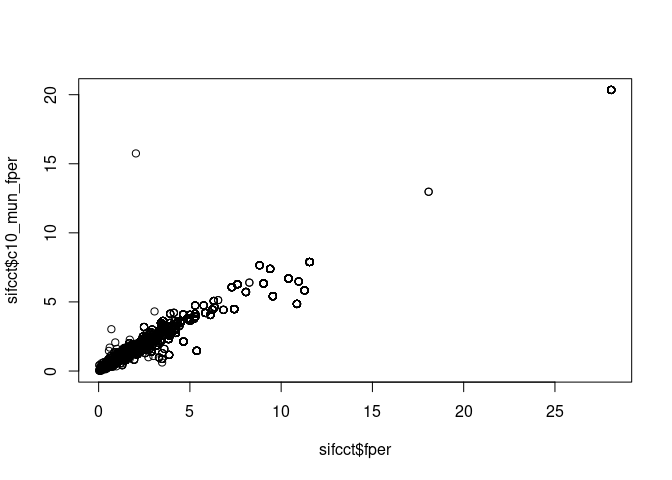
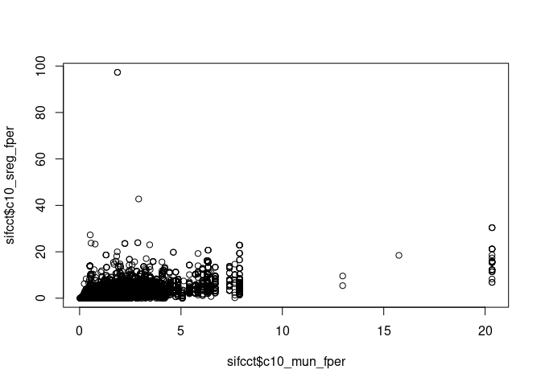
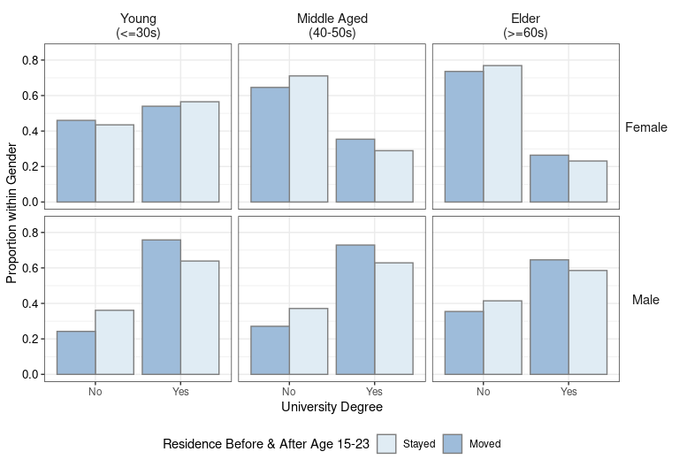
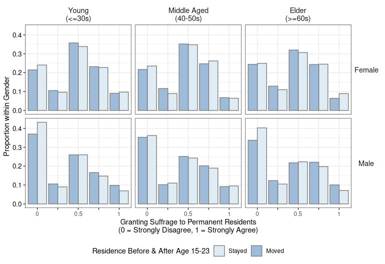
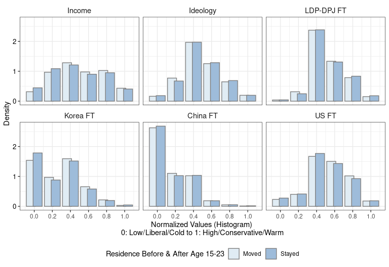

Visualization 1: Descriptive Statistics
================
Fan Lu & Gento Kato
January 26, 2020

# Preparation

``` r
## Clean Up Space
rm(list=ls())

## Set Working Directory (Automatically) ##
require(rstudioapi); require(rprojroot)
if (rstudioapi::isAvailable()==TRUE) {
  setwd(dirname(rstudioapi::getActiveDocumentContext()$path)); 
} 
projdir <- find_root(has_file("thisishome.txt"))
cat(paste("Working Directory Set to:\n",projdir))
```

    ## Working Directory Set to:
    ##  /home/gentok/GoogleDrive/Projects/Fan-Gento-Lab/ForeignerJapan

``` r
setwd(projdir)

## Original Data
datadir1a <- paste0(projdir, "/data/sifcct_zip_latest_v5.rds")
datadir1b <- paste0(projdir, "/data/sifcct_zip_latest_panel_v5.rds")
datadir2 <- paste0(projdir, "/data/mail_zip_latest_v5.rds")

## packages
library(ggplot2)
```

# Import and clean data

``` r
###################
## SIFCCT Online ##
###################

sifcct <- rbind(readRDS(datadir1a),readRDS(datadir1b))

## Knowledge Variable (Replaced)
sifcct$knowledge[sifcct$panel==1 & sifcct$wave==2] <- sifcct$knowledge[sifcct$panel==1 & sifcct$wave==1][match(sifcct$panelid[sifcct$panel==1 & sifcct$wave==2],sifcct$panelid[sifcct$panel==1 & sifcct$wave==1])]
sifcct$knowledge[sifcct$panel==1 & sifcct$wave==3] <- sifcct$knowledge[sifcct$panel==1 & sifcct$wave==1][match(sifcct$panelid[sifcct$panel==1 & sifcct$wave==3],sifcct$panelid[sifcct$panel==1 & sifcct$wave==1])]
sifcct$knowledge[sifcct$panel==1 & sifcct$wave==4] <- sifcct$knowledge[sifcct$panel==1 & sifcct$wave==1][match(sifcct$panelid[sifcct$panel==1 & sifcct$wave==4],sifcct$panelid[sifcct$panel==1 & sifcct$wave==1])]
sifcct$knowledge[sifcct$panel==1 & sifcct$wave==5] <- sifcct$knowledge[sifcct$panel==1 & sifcct$wave==1][match(sifcct$panelid[sifcct$panel==1 & sifcct$wave==5],sifcct$panelid[sifcct$panel==1 & sifcct$wave==1])]
sifcct$knowledge[sifcct$panel==1 & sifcct$wave==6] <- sifcct$knowledge[sifcct$panel==1 & sifcct$wave==1][match(sifcct$panelid[sifcct$panel==1 & sifcct$wave==6],sifcct$panelid[sifcct$panel==1 & sifcct$wave==1])]
sifcct$knowledge[sifcct$panel==1 & sifcct$wave==7] <- sifcct$knowledge[sifcct$panel==1 & sifcct$wave==1][match(sifcct$panelid[sifcct$panel==1 & sifcct$wave==7],sifcct$panelid[sifcct$panel==1 & sifcct$wave==1])]
sifcct$knowledge[sifcct$panel==1 & sifcct$wave==8] <- sifcct$knowledge[sifcct$panel==1 & sifcct$wave==1][match(sifcct$panelid[sifcct$panel==1 & sifcct$wave==8],sifcct$panelid[sifcct$panel==1 & sifcct$wave==1])]
sifcct$knowledge[sifcct$panel==1 & sifcct$wave==9] <- sifcct$knowledge[sifcct$panel==1 & sifcct$wave==1][match(sifcct$panelid[sifcct$panel==1 & sifcct$wave==9],sifcct$panelid[sifcct$panel==1 & sifcct$wave==1])]
sifcct$knowledge[sifcct$panel==1 & sifcct$wave==10] <- sifcct$knowledge[sifcct$panel==1 & sifcct$wave==1][match(sifcct$panelid[sifcct$panel==1 & sifcct$wave==10],sifcct$panelid[sifcct$panel==1 & sifcct$wave==1])]
sifcct$knowledge[sifcct$panel==1 & sifcct$wave==11] <- sifcct$knowledge[sifcct$panel==1 & sifcct$wave==1][match(sifcct$panelid[sifcct$panel==1 & sifcct$wave==11],sifcct$panelid[sifcct$panel==1 & sifcct$wave==1])]
sifcct$knowledge[sifcct$panel==1 & sifcct$wave==12] <- sifcct$knowledge[sifcct$panel==1 & sifcct$wave==1][match(sifcct$panelid[sifcct$panel==1 & sifcct$wave==12],sifcct$panelid[sifcct$panel==1 & sifcct$wave==1])]
## Knowledge Variable (Replaced)
sifcct$knowledge[sifcct$panel==1 & sifcct$wave==14] <- sifcct$knowledge[sifcct$panel==1 & sifcct$wave==13][match(sifcct$panelid[sifcct$panel==1 & sifcct$wave==14],sifcct$panelid[sifcct$panel==1 & sifcct$wave==13])]
sifcct$knowledge[sifcct$panel==1 & sifcct$wave==15] <- sifcct$knowledge[sifcct$panel==1 & sifcct$wave==13][match(sifcct$panelid[sifcct$panel==1 & sifcct$wave==15],sifcct$panelid[sifcct$panel==1 & sifcct$wave==13])]
sifcct$knowledge[sifcct$panel==1 & sifcct$wave==16] <- sifcct$knowledge[sifcct$panel==1 & sifcct$wave==13][match(sifcct$panelid[sifcct$panel==1 & sifcct$wave==16],sifcct$panelid[sifcct$panel==1 & sifcct$wave==13])]
sifcct$knowledge[sifcct$panel==1 & sifcct$wave==17] <- sifcct$knowledge[sifcct$panel==1 & sifcct$wave==13][match(sifcct$panelid[sifcct$panel==1 & sifcct$wave==17],sifcct$panelid[sifcct$panel==1 & sifcct$wave==13])]
sifcct$knowledge[sifcct$panel==1 & sifcct$wave==18] <- sifcct$knowledge[sifcct$panel==1 & sifcct$wave==13][match(sifcct$panelid[sifcct$panel==1 & sifcct$wave==18],sifcct$panelid[sifcct$panel==1 & sifcct$wave==13])]
sifcct$knowledge[sifcct$panel==1 & sifcct$wave==19] <- sifcct$knowledge[sifcct$panel==1 & sifcct$wave==13][match(sifcct$panelid[sifcct$panel==1 & sifcct$wave==19],sifcct$panelid[sifcct$panel==1 & sifcct$wave==13])]
sifcct$knowledge[sifcct$panel==1 & sifcct$wave==20] <- sifcct$knowledge[sifcct$panel==1 & sifcct$wave==13][match(sifcct$panelid[sifcct$panel==1 & sifcct$wave==20],sifcct$panelid[sifcct$panel==1 & sifcct$wave==13])]
sifcct$knowledge[sifcct$panel==1 & sifcct$wave==21] <- sifcct$knowledge[sifcct$panel==1 & sifcct$wave==13][match(sifcct$panelid[sifcct$panel==1 & sifcct$wave==21],sifcct$panelid[sifcct$panel==1 & sifcct$wave==13])]
sifcct$knowledge[sifcct$panel==1 & sifcct$wave==22] <- sifcct$knowledge[sifcct$panel==1 & sifcct$wave==13][match(sifcct$panelid[sifcct$panel==1 & sifcct$wave==22],sifcct$panelid[sifcct$panel==1 & sifcct$wave==13])]
sifcct$knowledge[sifcct$panel==1 & sifcct$wave==23] <- sifcct$knowledge[sifcct$panel==1 & sifcct$wave==13][match(sifcct$panelid[sifcct$panel==1 & sifcct$wave==23],sifcct$panelid[sifcct$panel==1 & sifcct$wave==13])]
sifcct$knowledge[sifcct$panel==1 & sifcct$wave==24] <- sifcct$knowledge[sifcct$panel==1 & sifcct$wave==13][match(sifcct$panelid[sifcct$panel==1 & sifcct$wave==24],sifcct$panelid[sifcct$panel==1 & sifcct$wave==13])]

## Subset Waves
sifcct <- subset(sifcct, !wave%in%c(1,23,24) & !(panel==1 & wave%in%c(1,3:12,14:24)))
table(sifcct$wave,sifcct$panel)
```

    ##     
    ##         0    1
    ##   2  1626 1054
    ##   3  1748    0
    ##   4  1918    0
    ##   5  1873    0
    ##   6  1916    0
    ##   7  1779    0
    ##   8  1774    0
    ##   9  1789    0
    ##   10 1674    0
    ##   11 1731    0
    ##   12 1668    0
    ##   13 1636  982
    ##   14 1648    0
    ##   15 1758    0
    ##   16 1744    0
    ##   17 1673    0
    ##   18 1724    0
    ##   19 1728    0
    ##   20 1672    0
    ##   21 1717    0
    ##   22 1787    0

``` r
## sreg with no population as NA
sifcct$c10_sreg_pop[which(sifcct$c10_sreg_pop==0)] <- NA 

## Income Missing Percentage (8.9%)
table(is.na(sifcct$income))/sum(table(is.na(sifcct$income)))
```

    ## 
    ##      FALSE       TRUE 
    ## 0.91032911 0.08967089

``` r
## Exclude Missing Values
sifcctx <- sifcct[,c("id","foreignsuff","foreignsuff3","foreignsuff3x",
                     "knowledge","polint","ideology","ldpdpjft",
                     "familiarityFT_KOR","familiarityFT_CHN","familiarityFT_USA",
                     # "evecon","evecon_verybad","evecon_bad","evecon_notbad","evecon_qtype",
                     "income", #"employed",
                     "female","male","edu","edu2","age","agecat","bornyr",
                     "lvlen","lvpr",
                     "zip_did","c10_sreg_foreignN","c10_sreg_pop",
                     "c10_sreg_edu_ugsP","c10_sreg_edu_ugs","c10_sreg_edu_graduated",
                     "didper","c10_mun_foreignN","c10_mun_pop",
                     "c10_mun_edu_ugsP","c10_mun_edu_ugs","c10_mun_edu_graduated",
                     "zip","c10_name_pref","c10_name_mun","c10_name_sreg",
                     "zip_lat","zip_lon",
                     "wave","panel")]
sifcctx <- na.omit(sifcctx)
nrow(sifcctx)
```

    ## [1] 34703

``` r
## Add Income and fper
sifcctx$income <- sifcct$income[match(paste(sifcctx$id,sifcctx$wave),paste(sifcct$id,sifcct$wave))]
summary(sifcctx$income)
```

    ##    Min. 1st Qu.  Median    Mean 3rd Qu.    Max. 
    ## 0.04098 0.18484 0.40915 0.50079 0.78565 0.97505

``` r
sifcctx$fper <- sifcct$fper[match(paste(sifcctx$id,sifcctx$wave),paste(sifcct$id,sifcct$wave))]
summary(sifcctx$fper)
```

    ##     Min.  1st Qu.   Median     Mean  3rd Qu.     Max. 
    ##  0.03136  0.77811  1.35848  1.79431  2.24808 28.08225

``` r
## Replace Data
sifcct <- sifcctx
rm(sifcctx)

nrow(sifcct[which(sifcct$age - sifcct$lvlen<=15),])
```

    ## [1] 7827

# Recoding Variables

``` r
## SIFCCT ##

## Binary Age Cohort (50s or over)
sifcct$age2 <- ifelse(sifcct$age >=50, 1, 0)
sifcct$agex <- sifcct$age/10 - 4.5
## Small Region Foreiner Percent
sifcct$c10_sreg_fper <- sifcct$c10_sreg_foreignN/sifcct$c10_sreg_pop*100
## Municipality Foreigner Percent
sifcct$c10_mun_fper <- sifcct$c10_mun_foreignN/sifcct$c10_mun_pop*100
## Compare Census and Foreinger Registry Numbers
plot(sifcct$fper, sifcct$c10_mun_fper)
```

<!-- -->

``` r
cor(sifcct$fper, sifcct$c10_mun_fper, use="pairwise")
```

    ## [1] 0.972352

``` r
plot(sifcct$c10_mun_fper, sifcct$c10_sreg_fper)
```

<!-- -->

``` r
cor(sifcct$c10_mun_fper, sifcct$c10_sreg_fper, use="pairwise")
```

    ## [1] 0.6087222

# Subset Data

``` r
sifcct_stayed <- subset(sifcct, sifcct$age - sifcct$lvlen<=15)
sifcct_moved <- subset(sifcct, sifcct$age - sifcct$lvlen>=23)
```

# Education

``` r
tmp1 <- t(t(table(sifcct_stayed[sifcct_stayed$female==1,]$edu2, sifcct_stayed[sifcct_stayed$female==1,]$agecat))/colSums(table(sifcct_stayed[sifcct_stayed$female==1,]$edu2, sifcct_stayed[sifcct_stayed$female==1,]$agecat)))
tmp2 <- t(t(table(sifcct_stayed[sifcct_stayed$female==0,]$edu2, sifcct_stayed[sifcct_stayed$female==0,]$agecat))/colSums(table(sifcct_stayed[sifcct_stayed$female==0,]$edu2, sifcct_stayed[sifcct_stayed$female==0,]$agecat)))
tmp3 <- t(t(table(sifcct_moved[sifcct_moved$female==1,]$edu2, sifcct_moved[sifcct_moved$female==1,]$agecat))/colSums(table(sifcct_moved[sifcct_moved$female==1,]$edu2, sifcct_moved[sifcct_moved$female==1,]$agecat)))
tmp4 <- t(t(table(sifcct_moved[sifcct_moved$female==0,]$edu2, sifcct_moved[sifcct_moved$female==0,]$agecat))/colSums(table(sifcct_moved[sifcct_moved$female==0,]$edu2, sifcct_moved[sifcct_moved$female==0,]$agecat)))

pd <- data.frame(prop=c(tmp1[,1],tmp2[,1],tmp3[,1],tmp4[,1],
                        tmp1[,2],tmp2[,2],tmp3[,2],tmp4[,2],
                        tmp1[,3],tmp2[,3],tmp3[,3],tmp4[,3]))
pd$gender <- factor(rep(c("Female","Male"),each=2), levels=c("Female","Male"))
pd$cat <- rep(c("No","Yes"),each=1)
pd$cat <- factor(pd$cat, levels=unique(pd$cat))
pd$sample <- rep(c("Stayed","Moved"),each=4)
pd$sample <- factor(pd$sample, levels=unique(pd$sample))
pd$agecat <- rep(c("Young\n(<=30s)",
                   "Middle Aged\n(40-50s)","Elder\n(>=60s)"),each=8)
pd$agecat <- factor(pd$agecat, levels=unique(pd$agecat))

# Plot
p <- ggplot(data=pd, aes(x=cat,y=prop)) + 
  geom_col(aes(fill=sample), color = "gray50", position=position_dodge(width=-0.9)) +  
  facet_grid(gender~agecat, scale="free_x") +
  #coord_flip() + 
  xlab("University Degree") + ylab("Proportion within Gender") +
  scale_fill_brewer(name="Residence Before & After Age 15-23", type = "seq", palette = 3) + 
  scale_y_continuous(limits=c(0,0.85)) +
  theme_bw() + 
  theme(legend.position = "bottom",
        strip.text.x = element_text(size=11),
        strip.text.y = element_text(angle=0,size=11),
        strip.background = element_rect(fill=NA,color=NA),
        plot.caption = element_text(hjust=0),
        plot.caption.position = "plot",
        axis.text.y = element_text(size=10, color="black"))
```

``` r
p
```

<!-- -->

``` r
ggsave(paste0(projdir,"/out/descrplot_edu2.png"),p, width=8, height=5.5)
ggsave(paste0(projdir,"/out/descrplot_edu2.pdf"),p, width=8, height=5.5)
```

# Outcome Policy Variable

``` r
# Plotting Data
tmp1 <- t(t(table(sifcct_stayed[sifcct_stayed$female==1,]$foreignsuff, sifcct_stayed[sifcct_stayed$female==1,]$agecat))/colSums(table(sifcct_stayed[sifcct_stayed$female==1,]$foreignsuff, sifcct_stayed[sifcct_stayed$female==1,]$agecat)))
tmp2 <- t(t(table(sifcct_stayed[sifcct_stayed$female==0,]$foreignsuff, sifcct_stayed[sifcct_stayed$female==0,]$agecat))/colSums(table(sifcct_stayed[sifcct_stayed$female==0,]$foreignsuff, sifcct_stayed[sifcct_stayed$female==0,]$agecat)))
tmp3 <- t(t(table(sifcct_moved[sifcct_moved$female==1,]$foreignsuff, sifcct_moved[sifcct_moved$female==1,]$agecat))/colSums(table(sifcct_moved[sifcct_moved$female==1,]$foreignsuff, sifcct_moved[sifcct_moved$female==1,]$agecat)))
tmp4 <- t(t(table(sifcct_moved[sifcct_moved$female==0,]$foreignsuff, sifcct_moved[sifcct_moved$female==0,]$agecat))/colSums(table(sifcct_moved[sifcct_moved$female==0,]$foreignsuff, sifcct_moved[sifcct_moved$female==0,]$agecat)))

pd <- data.frame(prop=c(tmp1[,1],tmp2[,1],tmp3[,1],tmp4[,1],
                        tmp1[,2],tmp2[,2],tmp3[,2],tmp4[,2],
                        tmp1[,3],tmp2[,3],tmp3[,3],tmp4[,3]))
pd$gender <- factor(rep(c("Female","Male"),each=5), levels=c("Female","Male"))
pd$cat <- c("Strongly Disagree","Disagree","Neither/DK","Agree","Strongly Agree")
pd$cat <- factor(pd$cat, levels=(unique(pd$cat)))
pd$num <- as.numeric(names(table(sifcct$foreignsuff)))
pd$num <- factor(pd$num, levels=(unique(pd$num)))
pd$sample <- rep(c("Stayed","Moved"),each=10)
pd$sample <- factor(pd$sample, levels=unique(pd$sample))
pd$agecat <- rep(c("Young\n(<=30s)","Middle Aged\n(40-50s)","Elder\n(>=60s)"),each=20)
pd$agecat <- factor(pd$agecat, levels=unique(pd$agecat))

# Plot
p <- ggplot(data=pd, aes(x=num,y=prop)) + 
  geom_col(aes(fill=sample), color = "gray50", position=position_dodge(width=-0.9)) +  
  facet_grid(gender~agecat, scale="free_x") +
  # coord_flip() + 
  xlab("Granting Suffrage to Permanent Residents\n(0 = Strongly Disagree, 1 = Strongly Agree)") + 
  ylab("Proportion within Gender") +
  scale_fill_brewer(name="Residence Before & After Age 15-23", type = "seq", palette = 3) + 
  # scale_y_continuous(limits=c(0,0.7)) +
  scale_x_discrete(labels=c("0","","0.5","","1")) + 
  theme_bw() + 
  theme(legend.position = "bottom",
        strip.text.x = element_text(size=11),
        strip.text.y = element_text(angle=0,size=11),
        strip.background = element_rect(fill=NA,color=NA),
        plot.caption = element_text(hjust=0),
        plot.caption.position = "plot",
        axis.text.y = element_text(size=10, color="black"))
```

``` r
p
```

<!-- -->

``` r
ggsave(paste0(projdir,"/out/descrplot_out.png"),p, width=8, height=5.5)
ggsave(paste0(projdir,"/out/descrplot_out.pdf"),p, width=8, height=5.5)
```

# Mediator Variables

``` r
# Data
pd <- data.frame(med = c(sifcct_stayed$income,sifcct_moved$income,
                         sifcct_stayed$ideology,sifcct_moved$ideology,
                         sifcct_stayed$ldpdpjft,sifcct_moved$ldpdpjft,
                         sifcct_stayed$familiarityFT_KOR,sifcct_moved$familiarityFT_KOR,
                         sifcct_stayed$familiarityFT_CHN,sifcct_moved$familiarityFT_CHN,
                         sifcct_stayed$familiarityFT_USA,sifcct_moved$familiarityFT_USA),
                 sample = c(rep("Stayed",nrow(sifcct_stayed)),
                            rep("Moved",nrow(sifcct_moved))),
                 vn = rep(c("Income","Ideology","LDP-DPJ FT", 
                            "Korea FT", "China FT", "US FT"),
                          each = nrow(sifcct_stayed) + nrow(sifcct_moved)))
pd$vn <- factor(pd$vn, levels=unique(pd$vn))

# Plot
require(ggplot2)
p <- ggplot(data = pd, aes(x=med,y=..density..)) + 
  geom_histogram(aes(fill=sample), color = "gray50", 
                 position=position_dodge(width=0.15),
                 binwidth = 0.2) +
  facet_wrap(pd$vn) + 
  xlab("Normalized Values (Histogram) \n0: Low/Liberal/Cold to 1: High/Conservative/Warm") +
  ylab("Density") +
  scale_fill_brewer(name="Residence Before & After Age 15-23", type = "seq", palette = 3) +
  scale_x_continuous(limits=c(-0.1,1.1), breaks=seq(0,1,by=0.2)) +
  # scale_x_discrete(labels=c("0","","0.5","","1")) +
  theme_bw() +
  theme(legend.position = "bottom",
        strip.text.x = element_text(size=11),
        strip.text.y = element_text(angle=0,size=11),
        strip.background = element_rect(fill=NA,color=NA),
        plot.caption = element_text(hjust=0),
        plot.caption.position = "plot",
        axis.text.y = element_text(size=10, color="black"))
```

``` r
p
```

<!-- -->

``` r
ggsave(paste0(projdir,"/out/descrplot_med.png"),p, width=8, height=5.5)
ggsave(paste0(projdir,"/out/descrplot_med.pdf"),p, width=8, height=5.5)
```
