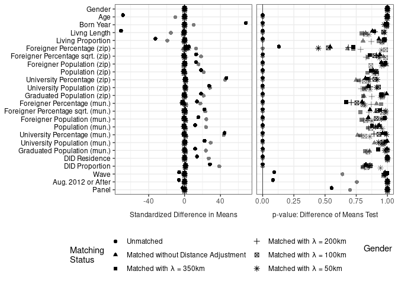
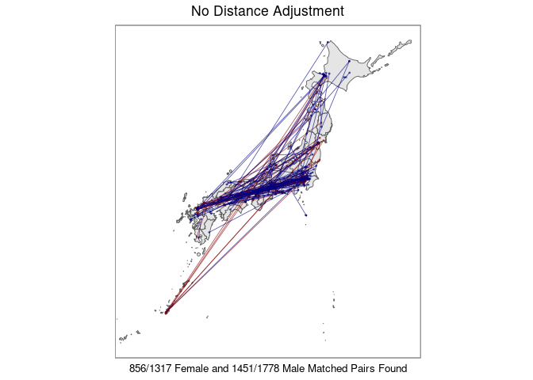
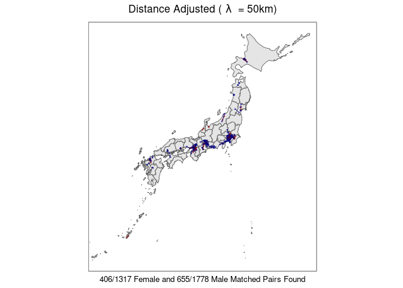
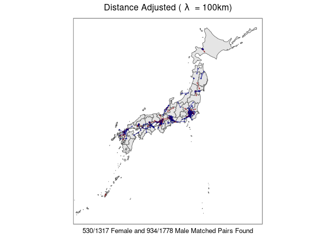
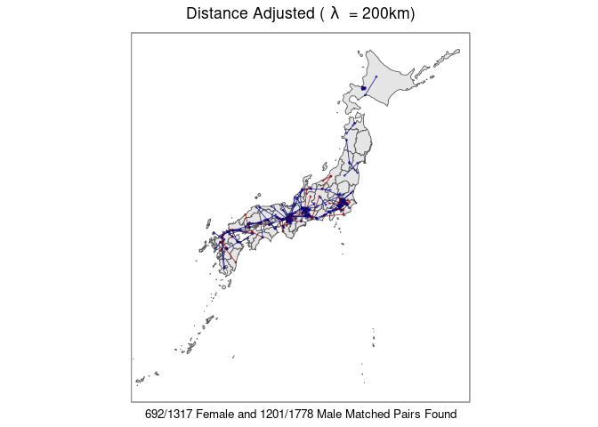
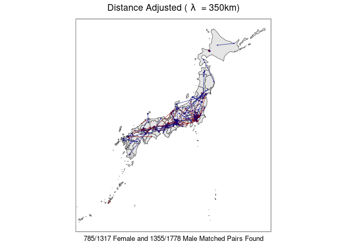
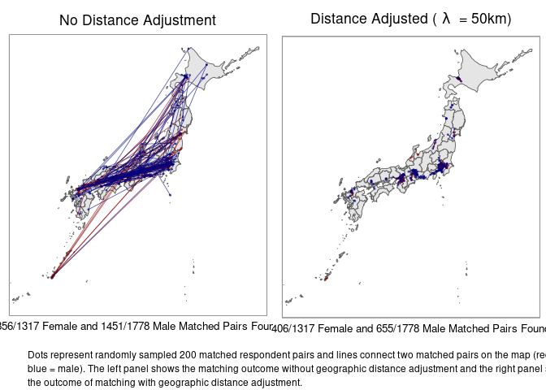
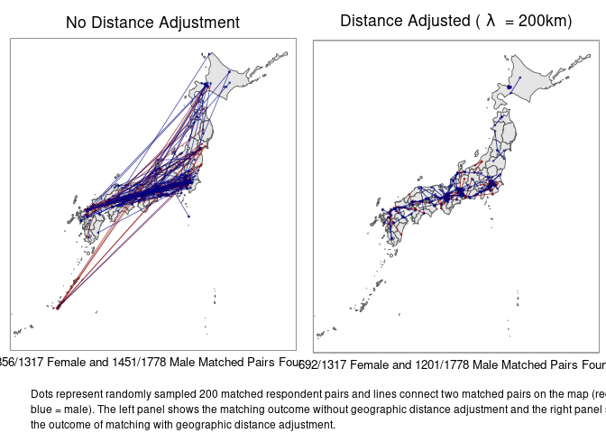
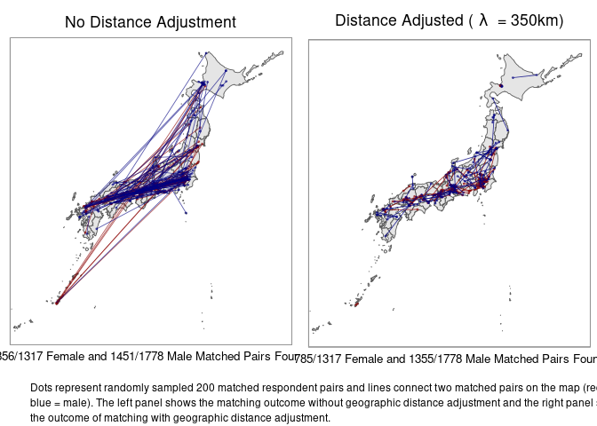

Visualization 2: Matching Results
================
Fan Lu & Gento Kato
January 26, 2021

# Preparation

``` r
## Clean Up Space
rm(list=ls())

## Set Working Directory (Automatically) ##
require(rstudioapi); require(rprojroot)
if (rstudioapi::isAvailable()==TRUE) {
  setwd(dirname(rstudioapi::getActiveDocumentContext()$path)); 
} 
projdir <- find_root(has_file("thisishome.txt"))
cat(paste("Working Directory Set to:\n",projdir))
```

    ## Working Directory Set to:
    ##  /home/gentok/GoogleDrive/Projects/Fan-Gento-Lab/ForeignerJapan

``` r
setwd(projdir)

## Import Matched Data

d <- readRDS(paste0(projdir, "/data/sifcct_zip_latest_v5.rds"))
dy <- readRDS(paste0(projdir, "/data/sifcct_unmatched_v5.rds"))
dym1 <- readRDS(paste0(projdir, "/data/sifcct_matched_1_all_v5.rds"))
dym2 <- readRDS(paste0(projdir, "/data/sifcct_matched_2_all_v5.rds"))
dym3 <- readRDS(paste0(projdir, "/data/sifcct_matched_3_all_v5.rds"))
dym4 <- readRDS(paste0(projdir, "/data/sifcct_matched_4_all_v5.rds"))
dym5 <- readRDS(paste0(projdir, "/data/sifcct_matched_5_all_v5.rds"))

## Fix Pair ID 
updatepairid <- function(dym1) {
  dym1$pair_id[which(dym1$femalebefore==1)] <- paste0("fb_",dym1$pair_id[which(dym1$femalebefore==1)]) 
  dym1$pair_id[which(dym1$femaleafter==1)] <- paste0("fa_",dym1$pair_id[which(dym1$femaleafter==1)]) 
  dym1$pair_id[which(dym1$malebefore==1)] <- paste0("mb_",dym1$pair_id[which(dym1$malebefore==1)]) 
  dym1$pair_id[which(dym1$maleafter==1)] <- paste0("ma_",dym1$pair_id[which(dym1$maleafter==1)]) 
  return(dym1)
}
dym1 <- updatepairid(dym1)
dym2 <- updatepairid(dym2)
dym3 <- updatepairid(dym3)
dym4 <- updatepairid(dym4)
dym5 <- updatepairid(dym5)

## Packages
library(lmtest) # For Statistical Test
library(sandwich) # Cluster Robust Standard Error
library(ggplot2) # Plotting 
library(grid) # Plotting  
library(gridExtra) # Plotting
library(sf) # Plotting Map
library(ggimage) # Plotting Map
library(jpndistrict) # Plotting Japanese Map
library(magrittr) # Data Management/Plotting
library(purrr) # Data Management
library(pbapply) # Apply with Progress Bar
require(ebal) # Matching Balance
require(Matching) # Matching Balance
```

# Plotting Individual-Level Predictors Balance

``` r
## Import Data
bal_dy_unmatched <- readRDS(paste0(projdir, "/data/sifcct_unmatched_balance_v5.rds")) # Young, No Distance Adjustment
bal_dy_matched_1 <- readRDS(paste0(projdir, "/data/sifcct_matched_1_balance_v5.rds")) # Young, No Distance Adjustment
bal_dy_matched_2 <- readRDS(paste0(projdir, "/data/sifcct_matched_2_balance_v5.rds")) # Young, Distance Adjusted 50km
bal_dy_matched_3  <- readRDS(paste0(projdir, "/data/sifcct_matched_3_balance_v5.rds")) # Young, Distance Adjusted 100km
bal_dy_matched_4  <- readRDS(paste0(projdir, "/data/sifcct_matched_4_balance_v5.rds")) # Young, Distance Adjusted 200km
bal_dy_matched_5  <- readRDS(paste0(projdir, "/data/sifcct_matched_5_balance_v5.rds")) # Young, Distance Adjusted 350km

## Raw data balance

## Matching Function
source(paste0(projdir,"/src/findmatch.R"))

fmbal = formula(edu2 ~ female + age + bornyr + lvlen + lvpr + 
                  c10_sreg_fper + I(sqrt(c10_sreg_fper)) + c10_sreg_foreignN + c10_sreg_pop + 
                  c10_sreg_edu_ugsP + c10_sreg_edu_ugs + c10_sreg_edu_graduated + 
                  c10_mun_fper + I(sqrt(c10_mun_fper)) + c10_mun_foreignN + c10_mun_pop + 
                  c10_mun_edu_ugsP + c10_mun_edu_ugs + c10_mun_edu_graduated + 
                  zip_did + didper + wave + after + panel)
vnbal = c("Gender","Age","Born Year","Livng Length","Living Proportion",
          "Foreigner Percentage (zip)", "Foreigner Percentage sqrt. (zip)", 
          "Foreigner Population (zip)", "Population (zip)",
          "University Percentage (zip)",  
          "University Population (zip)", "Graduated Population (zip)",
          "Foreigner Percentage (mun.)", "Foreigner Percentage sqrt. (mun.)", 
          "Foreigner Population (mun.)", "Population (mun.)",
          "University Percentage (mun.)",  
          "University Population (mun.)", "Graduated Population (mun.)",
          "DID Residence","DID Proportion","Wave","Aug. 2012 or After","Panel")

### Female
balf_dy_unmatched <- findbalance(dy[dy$female==1,], fmbal, vnbal)
round(balf_dy_unmatched,3)[,1:7]
```

    ##                                      mean.Tr    mean.Co   sdiff sdiff.pooled var.ratio T pval KS pval
    ## Gender                                 1.000      1.000   0.000        0.000       NaN  1.000      NA
    ## Age                                   35.614     44.297 -68.600      -67.072     0.916  0.000   0.000
    ## Born Year                           1976.308   1967.666  68.299       66.794     0.916  0.000   0.000
    ## Livng Length                          31.581     41.358 -70.775      -69.669     0.940  0.000   0.000
    ## Living Proportion                      0.870      0.924 -32.565      -36.994     1.819  0.000   0.000
    ## Foreigner Percentage (zip)             1.487      1.332   4.831        5.651     2.167  0.130   0.000
    ## Foreigner Percentage sqrt. (zip)       1.038      0.955  12.966       12.880     0.974  0.000   0.000
    ## Foreigner Population (zip)           127.311     92.861  12.784       14.230     1.629  0.000   0.000
    ## Population (zip)                    6898.757   5559.082  18.482       19.867     1.368  0.000   0.000
    ## University Percentage (zip)           21.319     17.098  46.515       48.944     1.240  0.000   0.000
    ## University Population (zip)         1320.148    858.543  27.479       31.602     1.952  0.000   0.000
    ## Graduated Population (zip)          5489.361   4428.532  18.265       19.646     1.373  0.000   0.000
    ## Foreigner Percentage (mun.)            1.447      1.279  13.905       12.678     0.711  0.000   0.000
    ## Foreigner Percentage sqrt. (mun.)      1.124      1.028  22.181       21.143     0.832  0.000   0.000
    ## Foreigner Population (mun.)         3644.498   2976.128  15.311       15.792     1.136  0.000   0.000
    ## Population (mun.)                 238367.915 217214.812  11.825       12.246     1.156  0.001   0.006
    ## University Percentage (mun.)          19.910     16.898  44.492       45.851     1.132  0.000   0.000
    ## University Population (mun.)       40337.562  32009.598  22.331       24.394     1.479  0.000   0.000
    ## Graduated Population (mun.)       189577.702 172755.826  11.767       12.236     1.177  0.001   0.008
    ## DID Residence                          0.738      0.677  13.967       13.530     0.884  0.000      NA
    ## DID Proportion                         0.781      0.704  28.269       26.907     0.828  0.000   0.000
    ## Wave                                  11.649     12.030  -6.024       -6.133     1.076  0.093   0.030
    ## Aug. 2012 or After                     0.545      0.576  -6.286       -6.310     1.016  0.083      NA
    ## Panel                                  0.047      0.052  -2.203       -2.153     0.914  0.552      NA

``` r
### Male
balm_dy_unmatched <- findbalance(dy[dy$male==1,], fmbal, vnbal)
round(balm_dy_unmatched,3)[,1:7]
```

    ##                                      mean.Tr    mean.Co   sdiff sdiff.pooled var.ratio T pval KS pval
    ## Gender                                 0.000      0.000   0.000        0.000       NaN  1.000      NA
    ## Age                                   44.016     45.479 -10.370      -10.580     1.085  0.000    0.00
    ## Born Year                           1967.901   1966.461  10.195       10.396     1.083  0.001    0.00
    ## Livng Length                          40.305     42.622 -15.328      -15.653     1.089  0.000    0.00
    ## Living Proportion                      0.902      0.928 -19.177      -20.225     1.253  0.000    0.00
    ## Foreigner Percentage (zip)             1.357      1.126  12.843       14.015     1.472  0.000    0.00
    ## Foreigner Percentage sqrt. (zip)       1.006      0.898  18.348       18.704     1.082  0.000    0.00
    ## Foreigner Population (zip)           106.053     71.883  15.496       17.307     1.657  0.000    0.00
    ## Population (zip)                    6393.051   4935.819  21.400       23.130     1.405  0.000    0.00
    ## University Percentage (zip)           19.695     15.798  45.201       47.934     1.285  0.000    0.00
    ## University Population (zip)         1161.691    724.864  28.244       32.963     2.135  0.000    0.00
    ## Graduated Population (zip)          5101.522   3942.693  21.242       22.959     1.405  0.000    0.00
    ## Foreigner Percentage (mun.)            1.405      1.174  17.590       19.557     1.619  0.000    0.00
    ## Foreigner Percentage sqrt. (mun.)      1.103      1.002  23.025       23.656     1.118  0.000    0.00
    ## Foreigner Population (mun.)         3482.812   2456.075  24.170       27.236     1.739  0.000    0.00
    ## Population (mun.)                 234059.670 190426.378  23.929       25.812     1.391  0.000    0.00
    ## University Percentage (mun.)          18.965     16.032  43.664       45.625     1.202  0.000    0.00
    ## University Population (mun.)       38297.775  27569.190  29.116       32.893     1.763  0.000    0.00
    ## Graduated Population (mun.)       186083.053 151516.953  23.831       25.785     1.412  0.000    0.00
    ## DID Residence                          0.713      0.591  26.963       25.820     0.847  0.000      NA
    ## DID Proportion                         0.747      0.635  38.766       36.383     0.787  0.000    0.00
    ## Wave                                  11.670     11.755  -1.389       -1.404     1.045  0.639    0.19
    ## Aug. 2012 or After                     0.557      0.562  -0.937       -0.938     1.002  0.755      NA
    ## Panel                                  0.050      0.052  -1.169       -1.155     0.954  0.701      NA

``` r
## Matched Sample Proportions
matchprdt <- data.frame(
  labs = c("Unmatched",
           "Matched without Distance Adjustment",
           "Matched with Lambda = 350km",
           "Matched with Lambda = 200km",
           "Matched with Lambda = 100km",
           "Matched with Lambda = 50km"),
  notF = c(table(dy[dy$female==1,]$edu2)[1],
           table(dym1[dym1$female==1,]$edu2)[1],
           table(dym5[dym5$female==1,]$edu2)[1],
           table(dym4[dym4$female==1,]$edu2)[1],
           table(dym3[dym3$female==1,]$edu2)[1],
           table(dym2[dym2$female==1,]$edu2)[1]),
  treatedF = c(table(dy[dy$female==1,]$edu2)[2],
               table(dym1[dym1$female==1,]$edu2)[2],
               table(dym5[dym5$female==1,]$edu2)[2],
               table(dym4[dym4$female==1,]$edu2)[2],
               table(dym3[dym3$female==1,]$edu2)[2],
               table(dym2[dym2$female==1,]$edu2)[2]), 
  notM = c(table(dy[dy$female==0,]$edu2)[1],
           table(dym1[dym1$female==0,]$edu2)[1],
           table(dym5[dym5$female==0,]$edu2)[1],
           table(dym4[dym4$female==0,]$edu2)[1],
           table(dym3[dym3$female==0,]$edu2)[1],
           table(dym2[dym2$female==0,]$edu2)[1]),  
  treatedM = c(table(dy[dy$female==0,]$edu2)[2],
               table(dym1[dym1$female==0,]$edu2)[2],
               table(dym5[dym5$female==0,]$edu2)[2],
               table(dym4[dym4$female==0,]$edu2)[2],
               table(dym3[dym3$female==0,]$edu2)[2],
               table(dym2[dym2$female==0,]$edu2)[2]))
matchprdt$prF <- round((matchprdt$notF/table(dy[dy$female==1,]$edu2)[2])*100,1)
matchprdt$prM <- round((matchprdt$notM/table(dy[dy$female==0,]$edu2)[1])*100,1)
matchprdt <- matchprdt[,c("labs","notF","treatedF","prF","notM","treatedM","prM")]

matchprdt <- as.matrix(matchprdt)
colnames(matchprdt) <- c("", "No Univ.", "Univ.", "% Matched", 
                         "No Univ.", "Univ.", "% Matched")

### Table of Data Sizes
require(knitr)
require(kableExtra)
tmp <- add_header_above(kable(matchprdt,"latex", booktabs = TRUE, linesep = ""), 
                        c(" ", "Female"=3, "Male"=3))
cat(tmp)
```

    ## 
    ## \begin{tabular}{lllllll}
    ## \toprule
    ## \multicolumn{1}{c}{ } & \multicolumn{3}{c}{Female} & \multicolumn{3}{c}{Male} \\
    ## \cmidrule(l{3pt}r{3pt}){2-4} \cmidrule(l{3pt}r{3pt}){5-7}
    ##  & No Univ. & Univ. & \% Matched & No Univ. & Univ. & \% Matched\\
    ## \midrule
    ## Unmatched & 1778 & 1317 & 135.0 & 1778 & 2954 & 100.0\\
    ## Matched without Distance Adjustment & 856 & 856 & 65.0 & 1451 & 1451 & 81.6\\
    ## Matched with Lambda = 350km & 785 & 785 & 59.6 & 1355 & 1355 & 76.2\\
    ## Matched with Lambda = 200km & 692 & 692 & 52.5 & 1201 & 1201 & 67.5\\
    ## Matched with Lambda = 100km & 530 & 530 & 40.2 & 934 & 934 & 52.5\\
    ## Matched with Lambda = 50km & 406 & 406 & 30.8 & 655 & 655 & 36.8\\
    ## \bottomrule
    ## \end{tabular}

``` r
writeLines(tmp, paste0(projdir, "/out/matchedsizes.tex"))

### Balance Data
baldt <- as.data.frame(rbind(balf_dy_unmatched,
               bal_dy_matched_1$f,
               bal_dy_matched_5$f,
               bal_dy_matched_4$f,
               bal_dy_matched_3$f,
               bal_dy_matched_2$f,
               balm_dy_unmatched,
               bal_dy_matched_1$m,
               bal_dy_matched_5$m,
               bal_dy_matched_4$m,
               bal_dy_matched_3$m,
               bal_dy_matched_2$m))
baldt <- data.frame(stat = c(baldt$sdiff,baldt$`T pval`))
baldt$data <- rep(c("Unmatched",
                "Matched without Distance Adjustment",
                "Matched with Lambda = 350km",
                "Matched with Lambda = 200km",
                "Matched with Lambda = 100km",
                "Matched with Lambda = 50km"), each=nrow(balf_dy_unmatched))
baldt$data <- factor(baldt$data, levels=unique(baldt$data))
baldt$vn <- factor(rownames(balf_dy_unmatched), 
                   levels=rev(rownames(balf_dy_unmatched)))
baldt$stat_cat <- rep(c("Standardized Difference in Means",
                        "p-value: Difference of Means Test"),
                      each = nrow(balf_dy_unmatched)*12)
baldt$stat_cat <- factor(baldt$stat_cat, levels=unique(baldt$stat_cat))
baldt$gender <- rep(c("Female","Male"), each=nrow(balf_dy_unmatched)*6)
baldt$gender <- factor(baldt$gender, levels=unique(baldt$gender))


require(ggplot2)
p <- ggplot(baldt, aes(x=vn,y=stat)) + 
  geom_hline(aes(yintercept=0), size=0.25, linetype=1) + 
  geom_point(aes(alpha=gender, shape=data), color="black",
             position=position_dodge(width=-0.5), size=2) + 
  facet_grid( ~ stat_cat, scales="free_x", switch="x") + 
  scale_shape_discrete(name="Matching\nStatus", 
                       labels = c("Unmatched",
                                  "Matched without Distance Adjustment",
                                  bquote("Matched with"~lambda~"= 350km"),
                                  bquote("Matched with"~lambda~"= 200km"),
                                  bquote("Matched with"~lambda~"= 100km"),
                                  bquote("Matched with"~lambda~"= 50km"))) + 
  scale_alpha_manual(name="Gender", values=c("Female"=1,"Male"=0.5)) + 
  coord_flip() +
  ylab(NULL) + xlab(NULL) + 
  guides(alpha = guide_legend(nrow = 2), 
         shape = guide_legend(nrow = 3)) + 
  theme_bw() +  
  theme(legend.position="bottom",
        axis.text.y = element_text(color="black"),
        strip.background.x = element_blank(),
        strip.text.y = element_text(angle=0,size=10),
        strip.placement = "outside")
p
```

    ## Warning: position_dodge requires non-overlapping x intervals
    
    ## Warning: position_dodge requires non-overlapping x intervals

<!-- -->

``` r
ggsave(paste0(projdir,"/out/matchbalanceplot_sifcct_v5.pdf"),p,width=8,height=5)
```

# Plotting Geographic Distance Balance

## Prepare Japanese Map Data

``` r
## Referenced from https://uribo.hatenablog.com/entry/2017/12/08/144549
## All w/o Tokyo and Okinawa
alljp_no1347 <- do.call("rbind", pblapply(seq(1,47)[-c(13,47)], 
                                          function(k) jpn_pref(pref_code = k, district=FALSE)))
## Tokyo 
tokyo13 <- jpn_pref(pref_code = 13, district = FALSE) %>% 
  st_simplify(dTolerance = 0.01)
```

    ## Warning in st_simplify.sfc(st_geometry(x), preserveTopology, dTolerance): st_simplify does not correctly simplify
    ## longitude/latitude data, dTolerance needs to be in decimal degrees

``` r
## (Excluding Southern Islands) # Deprecated
# tokyo13 <- jpn_pref(pref_code = 13, district = TRUE) %>% 
#   st_simplify(dTolerance = 0.01) %>% 
#   mutate(city_code = as.numeric(city_code)) %>% 
#   filter(city_code != 13421) %>% st_union() %>% 
#   as.data.frame() %>% mutate(jis_code = "13", 
#                              prefecture = "東京都") %>% magrittr::set_names(c("geometry", 
#                                                                            "jis_code", "prefecture")) %>% st_as_sf()
## Okinawa 
okinawa47 <- jpn_pref(pref_code = 47, district = FALSE)
okinawa47 <- okinawa47 %>% st_set_crs(value = 4326)
```

## Prepare Respondents Data

``` r
# Sample N Respondents
N = 200
set.seed(3451)
dymap1 <- dym1[which(dym1$pair_id%in%sample(dym1$pair_id,N)),]
set.seed(5412)
dymap2 <- dym2[which(dym2$pair_id%in%sample(dym2$pair_id,N)),]
set.seed(5241)
dymap3 <- dym3[which(dym3$pair_id%in%sample(dym3$pair_id,N)),]
set.seed(5441)
dymap4 <- dym4[which(dym4$pair_id%in%sample(dym4$pair_id,N)),]
set.seed(5141)
dymap5 <- dym5[which(dym5$pair_id%in%sample(dym5$pair_id,N)),]

# Move Okinawa location to left-upper corner (not done for now) 
# okinawa47$geometry <- okinawa47$geometry %>% magrittr::add(c(5.6, 17.5))
# dymap1$zip_lon[which(dymap1$zip_pref=="沖縄県")] <- dymap1$zip_lon[which(dymap1$zip_pref=="沖縄県")] + 5.6
# dymap1$zip_lat[which(dymap1$zip_pref=="沖縄県")] <- dymap1$zip_lat[which(dymap1$zip_pref=="沖縄県")] + 17.5
# dymap2$zip_lon[which(dymap2$zip_pref=="沖縄県")] <- dymap2$zip_lon[which(dymap2$zip_pref=="沖縄県")] + 5.6
# dymap2$zip_lat[which(dymap2$zip_pref=="沖縄県")] <- dymap2$zip_lat[which(dymap2$zip_pref=="沖縄県")] + 17.5
# dmmap1$zip_lon[which(dmmap1$zip_pref=="沖縄県")] <- dmmap1$zip_lon[which(dmmap1$zip_pref=="沖縄県")] + 5.6
# dmmap1$zip_lat[which(dmmap1$zip_pref=="沖縄県")] <- dmmap1$zip_lat[which(dmmap1$zip_pref=="沖縄県")] + 17.5
# dmmap2$zip_lon[which(dmmap2$zip_pref=="沖縄県")] <- dmmap2$zip_lon[which(dmmap2$zip_pref=="沖縄県")] + 5.6
# dmmap2$zip_lat[which(dmmap2$zip_pref=="沖縄県")] <- dmmap2$zip_lat[which(dmmap2$zip_pref=="沖縄県")] + 17.5
# demap1$zip_lon[which(demap1$zip_pref=="沖縄県")] <- demap1$zip_lon[which(demap1$zip_pref=="沖縄県")] + 5.6
# demap1$zip_lat[which(demap1$zip_pref=="沖縄県")] <- demap1$zip_lat[which(demap1$zip_pref=="沖縄県")] + 17.5
# demap2$zip_lon[which(demap2$zip_pref=="沖縄県")] <- demap2$zip_lon[which(demap2$zip_pref=="沖縄県")] + 5.6
# demap2$zip_lat[which(demap2$zip_pref=="沖縄県")] <- demap2$zip_lat[which(demap2$zip_pref=="沖縄県")] + 17.5
```

## Plot

``` r
p1 <- ggplot() + 
  geom_sf(data=alljp_no1347 %>% st_simplify(dTolerance = 0.01), size=0.3) + 
  geom_sf(data = tokyo13, inherit.aes = TRUE, size=0.3) + 
  geom_sf(data = okinawa47 %>% st_simplify(dTolerance = 0.01), inherit.aes = TRUE, size=0.3) +   
  # geom_segment(aes(x = round(st_bbox(alljp_no1347)[1], 0), xend = 132.5, y = 40, yend = 40)) + 
  # geom_segment(aes(x = 132.5, xend = 138, y = 40, yend = 42)) + 
  # geom_segment(aes(x = 138, xend = 138, y = 42, yend = round(st_bbox(alljp_no1347)[4],0))) + 
  geom_point(data = dymap1, aes(x=zip_lon,y=zip_lat, color=as.factor(1-female)), alpha=0.5, size=0.4) + 
  geom_path(data = dymap1, aes(x=zip_lon,y=zip_lat, group=pair_id, color=as.factor(1-female)), alpha=0.65, size=0.3) + 
  scale_color_manual(name="Gender", values=c("darkred","navyblue")) + 
  coord_sf(xlim=c(124.5,148.5)) + 
  #coord_sf(xlim=c(128,148.5),ylim=c(27,46)) + 
  labs(x=paste0(table(dym1[dym1$female==1,]$treated)[1],"/",table(dy[dy$female==1,]$edu2)[2]," Female and ",
                table(dym1[dym1$female==0,]$treated)[1],"/",table(dy[dy$female==0,]$edu2)[1],
                " Male Matched Pairs Found"),
       y=NULL,title="No Distance Adjustment") + theme_light() + 
  theme(plot.title=element_text(hjust=0.5),
        panel.background = element_rect(color="black",fill="white"),
        axis.ticks = element_blank(),
        axis.text = element_blank(),
        line = element_blank(), 
        axis.title.x = element_text(size=10),
        legend.position = "none")
```

    ## Warning in st_simplify.sfc(st_geometry(x), preserveTopology, dTolerance): st_simplify does not correctly simplify
    ## longitude/latitude data, dTolerance needs to be in decimal degrees
    
    ## Warning in st_simplify.sfc(st_geometry(x), preserveTopology, dTolerance): st_simplify does not correctly simplify
    ## longitude/latitude data, dTolerance needs to be in decimal degrees

``` r
p1
```

<!-- -->

``` r
p2 <- ggplot() + 
  geom_sf(data=alljp_no1347 %>% st_simplify(dTolerance = 0.01), size=0.3) + 
  geom_sf(data = tokyo13, inherit.aes = TRUE, size=0.3) + 
  geom_sf(data = okinawa47 %>% st_simplify(dTolerance = 0.01), inherit.aes = TRUE, size=0.3) +   
  # geom_segment(aes(x = round(st_bbox(alljp_no1347)[1], 0), xend = 132.5, y = 40, yend = 40)) + 
  # geom_segment(aes(x = 132.5, xend = 138, y = 40, yend = 42)) + 
  # geom_segment(aes(x = 138, xend = 138, y = 42, yend = round(st_bbox(alljp_no1347)[4],0))) + 
  geom_point(data = dymap2, aes(x=zip_lon,y=zip_lat, color=as.factor(1-female)), alpha=0.5, size=0.4) + 
  geom_path(data = dymap2, aes(x=zip_lon,y=zip_lat, group=pair_id, color=as.factor(1-female)), alpha=0.8, size=0.3) + 
  scale_color_manual(name="Gender", values=c("darkred","navyblue")) + 
  coord_sf(xlim=c(124.5,148.5)) + 
  #coord_sf(xlim=c(128,148.5),ylim=c(27,46)) + 
  labs(x=paste0(table(dym2[dym2$female==1,]$treated)[1],"/",table(dy[dy$female==1,]$edu2)[2]," Female and ",
                table(dym2[dym2$female==0,]$treated)[1],"/",table(dy[dy$female==0,]$edu2)[1],
                " Male Matched Pairs Found"),
       y=NULL,title=bquote("Distance Adjusted ("~lambda~" = 50km)")) + theme_light() + 
  theme(plot.title=element_text(hjust=0.5),
        panel.background = element_rect(color="black",fill="white"),
        axis.ticks = element_blank(),
        axis.text = element_blank(),
        line = element_blank(), 
        axis.title.x = element_text(size=10),
        legend.position = "none")
```

    ## Warning in st_simplify.sfc(st_geometry(x), preserveTopology, dTolerance): st_simplify does not correctly simplify
    ## longitude/latitude data, dTolerance needs to be in decimal degrees
    
    ## Warning in st_simplify.sfc(st_geometry(x), preserveTopology, dTolerance): st_simplify does not correctly simplify
    ## longitude/latitude data, dTolerance needs to be in decimal degrees

``` r
p2
```

<!-- -->

``` r
p3 <- ggplot() + 
  geom_sf(data=alljp_no1347 %>% st_simplify(dTolerance = 0.01), size=0.3) + 
  geom_sf(data = tokyo13, inherit.aes = TRUE, size=0.3) + 
  geom_sf(data = okinawa47 %>% st_simplify(dTolerance = 0.01), inherit.aes = TRUE, size=0.3) +   
  # geom_segment(aes(x = round(st_bbox(alljp_no1347)[1], 0), xend = 132.5, y = 40, yend = 40)) + 
  # geom_segment(aes(x = 132.5, xend = 138, y = 40, yend = 42)) + 
  # geom_segment(aes(x = 138, xend = 138, y = 42, yend = round(st_bbox(alljp_no1347)[4],0))) + 
  geom_point(data = dymap3, aes(x=zip_lon,y=zip_lat, color=as.factor(1-female)), alpha=0.5, size=0.4) + 
  geom_path(data = dymap3, aes(x=zip_lon,y=zip_lat, group=pair_id, color=as.factor(1-female)), alpha=0.8, size=0.3) + 
  scale_color_manual(name="Gender", values=c("darkred","navyblue")) + 
  coord_sf(xlim=c(124.5,148.5)) + 
  #coord_sf(xlim=c(128,148.5),ylim=c(27,46)) + 
  labs(x=paste0(table(dym3[dym3$female==1,]$treated)[1],"/",table(dy[dy$female==1,]$edu2)[2]," Female and ",
                table(dym3[dym3$female==0,]$treated)[1],"/",table(dy[dy$female==0,]$edu2)[1],
                " Male Matched Pairs Found"),
       y=NULL,title=bquote("Distance Adjusted ("~lambda~" = 100km)")) + theme_light() + 
  theme(plot.title=element_text(hjust=0.5),
        panel.background = element_rect(color="black",fill="white"),
        axis.ticks = element_blank(),
        axis.text = element_blank(),
        line = element_blank(), 
        axis.title.x = element_text(size=10),
        legend.position = "none")
```

    ## Warning in st_simplify.sfc(st_geometry(x), preserveTopology, dTolerance): st_simplify does not correctly simplify
    ## longitude/latitude data, dTolerance needs to be in decimal degrees
    
    ## Warning in st_simplify.sfc(st_geometry(x), preserveTopology, dTolerance): st_simplify does not correctly simplify
    ## longitude/latitude data, dTolerance needs to be in decimal degrees

``` r
p3
```

<!-- -->

``` r
p4 <- ggplot() + 
  geom_sf(data=alljp_no1347 %>% st_simplify(dTolerance = 0.01), size=0.3) + 
  geom_sf(data = tokyo13, inherit.aes = TRUE, size=0.3) + 
  geom_sf(data = okinawa47 %>% st_simplify(dTolerance = 0.01), inherit.aes = TRUE, size=0.3) +   
  # geom_segment(aes(x = round(st_bbox(alljp_no1347)[1], 0), xend = 132.5, y = 40, yend = 40)) + 
  # geom_segment(aes(x = 132.5, xend = 138, y = 40, yend = 42)) + 
  # geom_segment(aes(x = 138, xend = 138, y = 42, yend = round(st_bbox(alljp_no1347)[4],0))) + 
  geom_point(data = dymap4, aes(x=zip_lon,y=zip_lat, color=as.factor(1-female)), alpha=0.5, size=0.4) + 
  geom_path(data = dymap4, aes(x=zip_lon,y=zip_lat, group=pair_id, color=as.factor(1-female)), alpha=0.8, size=0.3) + 
  scale_color_manual(name="Gender", values=c("darkred","navyblue")) + 
  coord_sf(xlim=c(124.5,148.5)) + 
  #coord_sf(xlim=c(128,148.5),ylim=c(27,46)) + 
  labs(x=paste0(table(dym4[dym4$female==1,]$treated)[1],"/",table(dy[dy$female==1,]$edu2)[2]," Female and ",
                table(dym4[dym4$female==0,]$treated)[1],"/",table(dy[dy$female==0,]$edu2)[1],
                " Male Matched Pairs Found"),
       y=NULL,title=bquote("Distance Adjusted ("~lambda~" = 200km)")) + theme_light() + 
  theme(plot.title=element_text(hjust=0.5),
        panel.background = element_rect(color="black",fill="white"),
        axis.ticks = element_blank(),
        axis.text = element_blank(),
        line = element_blank(), 
        axis.title.x = element_text(size=10),
        legend.position = "none")
```

    ## Warning in st_simplify.sfc(st_geometry(x), preserveTopology, dTolerance): st_simplify does not correctly simplify
    ## longitude/latitude data, dTolerance needs to be in decimal degrees
    
    ## Warning in st_simplify.sfc(st_geometry(x), preserveTopology, dTolerance): st_simplify does not correctly simplify
    ## longitude/latitude data, dTolerance needs to be in decimal degrees

``` r
p4
```

<!-- -->

``` r
p5 <- ggplot() + 
  geom_sf(data=alljp_no1347 %>% st_simplify(dTolerance = 0.01), size=0.3) + 
  geom_sf(data = tokyo13, inherit.aes = TRUE, size=0.3) + 
  geom_sf(data = okinawa47 %>% st_simplify(dTolerance = 0.01), inherit.aes = TRUE, size=0.3) +   
  # geom_segment(aes(x = round(st_bbox(alljp_no1347)[1], 0), xend = 132.5, y = 40, yend = 40)) + 
  # geom_segment(aes(x = 132.5, xend = 138, y = 40, yend = 42)) + 
  # geom_segment(aes(x = 138, xend = 138, y = 42, yend = round(st_bbox(alljp_no1347)[4],0))) + 
  geom_point(data = dymap5, aes(x=zip_lon,y=zip_lat, color=as.factor(1-female)), alpha=0.5, size=0.4) + 
  geom_path(data = dymap5, aes(x=zip_lon,y=zip_lat, group=pair_id, color=as.factor(1-female)), alpha=0.8, size=0.3) + 
  scale_color_manual(name="Gender", values=c("darkred","navyblue")) + 
  coord_sf(xlim=c(124.5,148.5)) + 
  #coord_sf(xlim=c(128,148.5),ylim=c(27,46)) + 
  labs(x=paste0(table(dym5[dym5$female==1,]$treated)[1],"/",table(dy[dy$female==1,]$edu2)[2]," Female and ",
                table(dym5[dym5$female==0,]$treated)[1],"/",table(dy[dy$female==0,]$edu2)[1],
                " Male Matched Pairs Found"),
       y=NULL,title=bquote("Distance Adjusted ("~lambda~" = 350km)")) + theme_light() + 
  theme(plot.title=element_text(hjust=0.5),
        panel.background = element_rect(color="black",fill="white"),
        axis.ticks = element_blank(),
        axis.text = element_blank(),
        line = element_blank(), 
        axis.title.x = element_text(size=10),
        legend.position = "none")
```

    ## Warning in st_simplify.sfc(st_geometry(x), preserveTopology, dTolerance): st_simplify does not correctly simplify
    ## longitude/latitude data, dTolerance needs to be in decimal degrees
    
    ## Warning in st_simplify.sfc(st_geometry(x), preserveTopology, dTolerance): st_simplify does not correctly simplify
    ## longitude/latitude data, dTolerance needs to be in decimal degrees

``` r
p5
```

<!-- -->

## Export Map Plots

``` r
foottxt <- paste0("Dots represent randomly sampled ", N, " matched respondent pairs",
                  " and lines connect two matched pairs ",
                  "on the map (red = female, \nblue = male). The left panel shows the matching outcome ",
                  "without geographic distance adjustment and ",
                  "the right panel shows \nthe outcome of matching with geographic distance adjustment.")

p <- arrangeGrob(p1,p2, nrow=1,
                 bottom=textGrob(foottxt, vjust=0.5,just="left",x=unit(0.05,"npc"),
                                 gp=gpar(fontsize=9)))
grid.arrange(p)
```

<!-- -->

``` r
ggsave(paste0(projdir,"/out/geomatchplot_l50_sifcct_v5.pdf"),p,width=8,height=5)
```

``` r
p <- arrangeGrob(p1,p3, nrow=1,
                 bottom=textGrob(foottxt,
                                 vjust=0.5,just="left",x=unit(0.05,"npc"),
                                 gp=gpar(fontsize=9)))
grid.arrange(p)
```

<!-- -->

``` r
ggsave(paste0(projdir,"/out/geomatchplot_l100_sifcct_v5.pdf"),p,width=8,height=5)
```

``` r
p <- arrangeGrob(p1,p4, nrow=1,
                 bottom=textGrob(foottxt, vjust=0.5,just="left",x=unit(0.05,"npc"),
                                 gp=gpar(fontsize=9)))
grid.arrange(p)
```

<!-- -->

``` r
ggsave(paste0(projdir,"/out/geomatchplot_l200_sifcct_v5.pdf"),p,width=8,height=5)
```

``` r
p <- arrangeGrob(p1,p5, nrow=1,
                 bottom=textGrob(foottxt, vjust=0.5,just="left",x=unit(0.05,"npc"),
                                 gp=gpar(fontsize=9)))
grid.arrange(p)
```

<!-- -->

``` r
ggsave(paste0(projdir,"/out/geomatchplot_l350_sifcct_v5.pdf"),p,width=8,height=5)
```
