Visualization 3: Analysis Results
================
Fan Lu & Gento Kato
January 26, 2020

# Preparation

``` r
## Clean Up Space
rm(list=ls())

## Set Working Directory (Automatically) ##
require(rstudioapi); require(rprojroot)
if (rstudioapi::isAvailable()==TRUE) {
  setwd(dirname(rstudioapi::getActiveDocumentContext()$path)); 
} 
projdir <- find_root(has_file("thisishome.txt"))
cat(paste("Working Directory Set to:\n",projdir))
```

    ## Working Directory Set to:
    ##  /home/gentok/GoogleDrive/Projects/Fan-Gento-Lab/ForeignerJapan

``` r
setwd(projdir)

## Directories for Main Effect Data
visdtdir <- paste0(projdir, "/out/visdt.rds")
visdtmdir <- paste0(projdir, "/out/visdtm.rds")
visdtalldir <- paste0(projdir, "/out/visdtall.rds")
visdtxdir <- paste0(projdir, "/out/visdtx.rds")
visdtxmdir <- paste0(projdir, "/out/visdtxm.rds")
visdtxalldir <- paste0(projdir, "/out/visdtxall.rds")

## Directories for Mediation Effect Data
coefdtdir0 <- paste0(projdir,"/out/medoutcoefdt_unmatched_v5.rds")
coefdtdir1 <- paste0(projdir,"/out/medoutcoefdt_matchednoL_v5.rds")
coefdtdir2 <- paste0(projdir,"/out/medoutcoefdt_matchedL50_v5.rds")
coefdtdir3 <- paste0(projdir,"/out/medoutcoefdt_matchedL100_v5.rds")
coefdtdir4 <- paste0(projdir,"/out/medoutcoefdt_matchedL200_v5.rds")
coefdtdir5 <- paste0(projdir,"/out/medoutcoefdt_matchedL350_v5.rds")

## Packages
require(ggplot2)
```

# Main Effects

``` r
## Import Required Data
visdt <- readRDS(visdtdir)
visdtm <- readRDS(visdtmdir)
visdtall <- readRDS(visdtalldir)
```

## OLS

``` r
require(ggplot2)
p <- ggplot(visdt, aes(x=factor(age, levels=rev(names(table(age)))), y=est)) +
  geom_hline(aes(yintercept=0), linetype=2) +
  geom_errorbar(aes(ymin=lci95,ymax=uci95,alpha=pstar), 
                position=position_dodge(width=-0.7), size=0.5, width=0.3) +
  geom_errorbar(aes(ymin=lci90,ymax=uci90,alpha=pstar),
                position=position_dodge(width=-0.7), size=1.5, width=0.0) +
  geom_point(aes(alpha=pstar),
             position=position_dodge(width=-0.7), size=3) +
  facet_grid(gender ~ data) +
  scale_y_continuous(breaks = c(-0.1,-0.05,0.00,0.05)) + 
  scale_alpha_manual(name="Significance",values=c(1,0.5,0.2), drop=FALSE) +
  ylab("OLS Coefficient\n(Thin Line = 95% CI; Thick Line 90% CI)") +
  xlab("Age") +
  labs(caption="Treatment: University education (1:attained, 0:not attained). \nOutcome: Agreement with granting suffrage to permanent residents (rescaled to 0-1).") +
  coord_flip() + theme_bw() +
  theme(legend.position = "bottom",
        strip.text.x = element_text(size=9),
        strip.text.y = element_text(angle=0,size=11),
        strip.background = element_rect(fill=NA,color=NA),
        plot.caption = element_text(hjust=0),
        plot.subtitle = element_text(hjust=0.5))
p
```

    ## Warning: position_dodge requires non-overlapping x intervals
    
    ## Warning: position_dodge requires non-overlapping x intervals
    
    ## Warning: position_dodge requires non-overlapping x intervals
    
    ## Warning: position_dodge requires non-overlapping x intervals
    
    ## Warning: position_dodge requires non-overlapping x intervals
    
    ## Warning: position_dodge requires non-overlapping x intervals
    
    ## Warning: position_dodge requires non-overlapping x intervals
    
    ## Warning: position_dodge requires non-overlapping x intervals
    
    ## Warning: position_dodge requires non-overlapping x intervals
    
    ## Warning: position_dodge requires non-overlapping x intervals
    
    ## Warning: position_dodge requires non-overlapping x intervals
    
    ## Warning: position_dodge requires non-overlapping x intervals

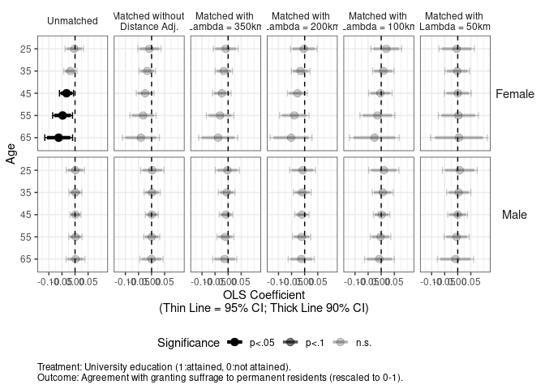<!-- -->

``` r
ggsave(paste0(projdir,"/out/maineffectplot1.png"),p,width=8,height=5)
```

    ## Warning: position_dodge requires non-overlapping x intervals
    
    ## Warning: position_dodge requires non-overlapping x intervals
    
    ## Warning: position_dodge requires non-overlapping x intervals
    
    ## Warning: position_dodge requires non-overlapping x intervals
    
    ## Warning: position_dodge requires non-overlapping x intervals
    
    ## Warning: position_dodge requires non-overlapping x intervals
    
    ## Warning: position_dodge requires non-overlapping x intervals
    
    ## Warning: position_dodge requires non-overlapping x intervals
    
    ## Warning: position_dodge requires non-overlapping x intervals
    
    ## Warning: position_dodge requires non-overlapping x intervals
    
    ## Warning: position_dodge requires non-overlapping x intervals
    
    ## Warning: position_dodge requires non-overlapping x intervals

``` r
ggsave(paste0(projdir,"/out/maineffectplot1.pdf"),p,width=8,height=5)
```

    ## Warning: position_dodge requires non-overlapping x intervals
    
    ## Warning: position_dodge requires non-overlapping x intervals
    
    ## Warning: position_dodge requires non-overlapping x intervals
    
    ## Warning: position_dodge requires non-overlapping x intervals
    
    ## Warning: position_dodge requires non-overlapping x intervals
    
    ## Warning: position_dodge requires non-overlapping x intervals
    
    ## Warning: position_dodge requires non-overlapping x intervals
    
    ## Warning: position_dodge requires non-overlapping x intervals
    
    ## Warning: position_dodge requires non-overlapping x intervals
    
    ## Warning: position_dodge requires non-overlapping x intervals
    
    ## Warning: position_dodge requires non-overlapping x intervals
    
    ## Warning: position_dodge requires non-overlapping x intervals

``` r
require(ggplot2)
p <- ggplot(visdt[which(visdt$data%in%c("Unmatched",
                                        "Matched without \nDistance Adj.",
                                        "Matched with \nLambda = 100km")),], 
            aes(x=factor(age, levels=rev(names(table(age)))), y=est)) +
  geom_hline(aes(yintercept=0), linetype=2) +
  geom_errorbar(aes(ymin=lci95,ymax=uci95,alpha=pstar), 
                position=position_dodge(width=-0.7), size=0.5, width=0.3) +
  geom_errorbar(aes(ymin=lci90,ymax=uci90,alpha=pstar),
                position=position_dodge(width=-0.7), size=1.5, width=0.0) +
  geom_point(aes(alpha=pstar),
             position=position_dodge(width=-0.7), size=3) +
  facet_grid(gender ~ data) +
  scale_y_continuous(breaks = c(-0.1,-0.05,0.00,0.05)) + 
  scale_alpha_manual(name="Significance",values=c(1,0.5,0.2), drop=FALSE) +
  ylab("OLS Coefficient\n(Thin Line = 95% CI; Thick Line 90% CI)") +
  xlab("Age") +
  labs(caption="Treatment: University education (1:attained, 0:not attained). \nOutcome: Agreement with granting suffrage to permanent residents (rescaled to 0-1).") +
  coord_flip() + theme_bw() +
  theme(legend.position = "bottom",
        strip.text.x = element_text(size=11),
        strip.text.y = element_text(angle=0,size=11),
        strip.background = element_rect(fill=NA,color=NA),
        plot.caption = element_text(hjust=0),
        plot.subtitle = element_text(hjust=0.5))
p
```

    ## Warning: position_dodge requires non-overlapping x intervals
    
    ## Warning: position_dodge requires non-overlapping x intervals
    
    ## Warning: position_dodge requires non-overlapping x intervals
    
    ## Warning: position_dodge requires non-overlapping x intervals
    
    ## Warning: position_dodge requires non-overlapping x intervals
    
    ## Warning: position_dodge requires non-overlapping x intervals

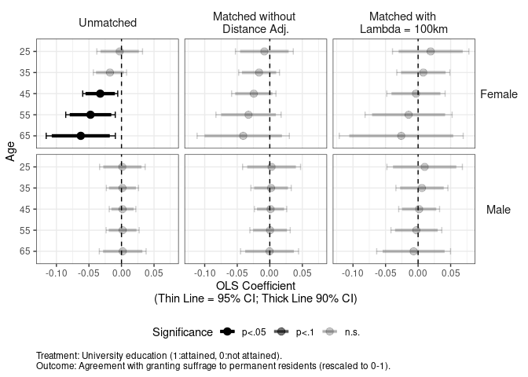<!-- -->

``` r
ggsave(paste0(projdir,"/out/maineffectplot2.png"),p,width=8,height=5)
```

    ## Warning: position_dodge requires non-overlapping x intervals
    
    ## Warning: position_dodge requires non-overlapping x intervals
    
    ## Warning: position_dodge requires non-overlapping x intervals
    
    ## Warning: position_dodge requires non-overlapping x intervals
    
    ## Warning: position_dodge requires non-overlapping x intervals
    
    ## Warning: position_dodge requires non-overlapping x intervals

``` r
ggsave(paste0(projdir,"/out/maineffectplot2.pdf"),p,width=8,height=5)
```

    ## Warning: position_dodge requires non-overlapping x intervals
    
    ## Warning: position_dodge requires non-overlapping x intervals
    
    ## Warning: position_dodge requires non-overlapping x intervals
    
    ## Warning: position_dodge requires non-overlapping x intervals
    
    ## Warning: position_dodge requires non-overlapping x intervals
    
    ## Warning: position_dodge requires non-overlapping x intervals

## Multinomial Logit (Disagree vs. Agree)

``` r
require(ggplot2)
p <- ggplot(visdtm, aes(x=factor(age, levels=rev(names(table(age)))), y=est)) +
  geom_hline(aes(yintercept=0), linetype=2) +
  geom_errorbar(aes(ymin=lci95,ymax=uci95,alpha=pstar), 
                position=position_dodge(width=-0.7), size=0.5, width=0.3) +
  geom_errorbar(aes(ymin=lci90,ymax=uci90,alpha=pstar),
                position=position_dodge(width=-0.7), size=1.5, width=0.0) +
  geom_point(aes(alpha=pstar),
             position=position_dodge(width=-0.7), size=3) +
  facet_grid(gender ~ data) +
  scale_alpha_manual(name="Significance",values=c(1,0.5,0.2), drop=FALSE) +
  ylab("Multinomial Logit Coefficient: Agree over Disagree\n(Thin Line = 95% CI; Thick Line 90% CI)") +
  xlab("Age") +
  labs(caption="Treatment: University education (1:attained, 0:not attained). \nOutcome: Agreement with granting suffrage to permanent residents (rescaled to 0-1).") +
  coord_flip() + theme_bw() +
  theme(legend.position = "bottom",
        strip.text.x = element_text(size=9),
        strip.text.y = element_text(angle=0,size=11),
        strip.background = element_rect(fill=NA,color=NA),
        plot.caption = element_text(hjust=0),
        plot.subtitle = element_text(hjust=0.5))
p
```

    ## Warning: position_dodge requires non-overlapping x intervals
    
    ## Warning: position_dodge requires non-overlapping x intervals
    
    ## Warning: position_dodge requires non-overlapping x intervals
    
    ## Warning: position_dodge requires non-overlapping x intervals
    
    ## Warning: position_dodge requires non-overlapping x intervals
    
    ## Warning: position_dodge requires non-overlapping x intervals
    
    ## Warning: position_dodge requires non-overlapping x intervals
    
    ## Warning: position_dodge requires non-overlapping x intervals
    
    ## Warning: position_dodge requires non-overlapping x intervals
    
    ## Warning: position_dodge requires non-overlapping x intervals
    
    ## Warning: position_dodge requires non-overlapping x intervals
    
    ## Warning: position_dodge requires non-overlapping x intervals

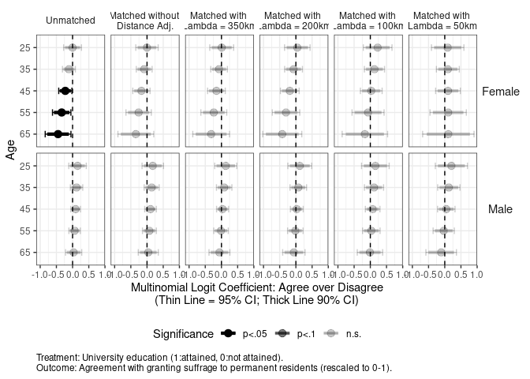<!-- -->

``` r
ggsave(paste0(projdir,"/out/maineffectplot1m.png"),p,width=8,height=5)
```

    ## Warning: position_dodge requires non-overlapping x intervals
    
    ## Warning: position_dodge requires non-overlapping x intervals
    
    ## Warning: position_dodge requires non-overlapping x intervals
    
    ## Warning: position_dodge requires non-overlapping x intervals
    
    ## Warning: position_dodge requires non-overlapping x intervals
    
    ## Warning: position_dodge requires non-overlapping x intervals
    
    ## Warning: position_dodge requires non-overlapping x intervals
    
    ## Warning: position_dodge requires non-overlapping x intervals
    
    ## Warning: position_dodge requires non-overlapping x intervals
    
    ## Warning: position_dodge requires non-overlapping x intervals
    
    ## Warning: position_dodge requires non-overlapping x intervals
    
    ## Warning: position_dodge requires non-overlapping x intervals

``` r
ggsave(paste0(projdir,"/out/maineffectplot1m.pdf"),p,width=8,height=5)
```

    ## Warning: position_dodge requires non-overlapping x intervals
    
    ## Warning: position_dodge requires non-overlapping x intervals
    
    ## Warning: position_dodge requires non-overlapping x intervals
    
    ## Warning: position_dodge requires non-overlapping x intervals
    
    ## Warning: position_dodge requires non-overlapping x intervals
    
    ## Warning: position_dodge requires non-overlapping x intervals
    
    ## Warning: position_dodge requires non-overlapping x intervals
    
    ## Warning: position_dodge requires non-overlapping x intervals
    
    ## Warning: position_dodge requires non-overlapping x intervals
    
    ## Warning: position_dodge requires non-overlapping x intervals
    
    ## Warning: position_dodge requires non-overlapping x intervals
    
    ## Warning: position_dodge requires non-overlapping x intervals

``` r
require(ggplot2)
p <- ggplot(visdtm[which(visdtm$data%in%c("Unmatched",
                                          "Matched without \nDistance Adj.",
                                          "Matched with \nLambda = 100km")),], 
            aes(x=factor(age, levels=rev(names(table(age)))), y=est)) +
  geom_hline(aes(yintercept=0), linetype=2) +
  geom_errorbar(aes(ymin=lci95,ymax=uci95,alpha=pstar), 
                position=position_dodge(width=-0.7), size=0.5, width=0.3) +
  geom_errorbar(aes(ymin=lci90,ymax=uci90,alpha=pstar),
                position=position_dodge(width=-0.7), size=1.5, width=0.0) +
  geom_point(aes(alpha=pstar),
             position=position_dodge(width=-0.7), size=3) +
  facet_grid(gender ~ data) +
  scale_alpha_manual(name="Significance",values=c(1,0.5,0.2), drop=FALSE) +
  ylab("Multinomial Logit Coefficient: Agree over Disagree\n(Thin Line = 95% CI; Thick Line 90% CI)") +
  xlab("Age") +
  labs(caption="Treatment: University education (1:attained, 0:not attained). \nOutcome: Agreement with granting suffrage to permanent residents (rescaled to 0-1).") +
  coord_flip() + theme_bw() +
  theme(legend.position = "bottom",
        strip.text.x = element_text(size=11),
        strip.text.y = element_text(angle=0,size=11),
        strip.background = element_rect(fill=NA,color=NA),
        plot.caption = element_text(hjust=0),
        plot.subtitle = element_text(hjust=0.5))
p
```

    ## Warning: position_dodge requires non-overlapping x intervals
    
    ## Warning: position_dodge requires non-overlapping x intervals
    
    ## Warning: position_dodge requires non-overlapping x intervals
    
    ## Warning: position_dodge requires non-overlapping x intervals
    
    ## Warning: position_dodge requires non-overlapping x intervals
    
    ## Warning: position_dodge requires non-overlapping x intervals

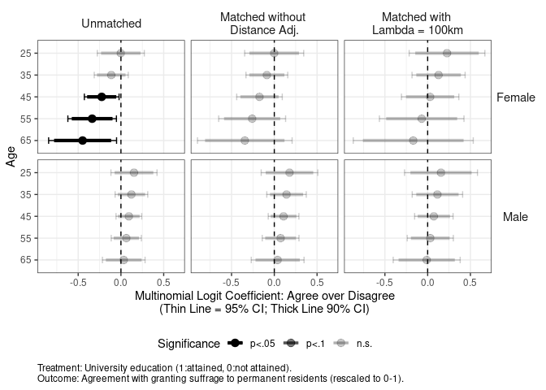<!-- -->

``` r
ggsave(paste0(projdir,"/out/maineffectplot2m.png"),p,width=8,height=5)
```

    ## Warning: position_dodge requires non-overlapping x intervals
    
    ## Warning: position_dodge requires non-overlapping x intervals
    
    ## Warning: position_dodge requires non-overlapping x intervals
    
    ## Warning: position_dodge requires non-overlapping x intervals
    
    ## Warning: position_dodge requires non-overlapping x intervals
    
    ## Warning: position_dodge requires non-overlapping x intervals

``` r
ggsave(paste0(projdir,"/out/maineffectplot2m.pdf"),p,width=8,height=5)
```

    ## Warning: position_dodge requires non-overlapping x intervals
    
    ## Warning: position_dodge requires non-overlapping x intervals
    
    ## Warning: position_dodge requires non-overlapping x intervals
    
    ## Warning: position_dodge requires non-overlapping x intervals
    
    ## Warning: position_dodge requires non-overlapping x intervals
    
    ## Warning: position_dodge requires non-overlapping x intervals

## Compare OLS and Multinomial Logit

``` r
visdtsub <- subset(visdtall, data=="Unmatched")

require(ggplot2)
p <- ggplot(visdtsub, aes(x=factor(age, levels=rev(names(table(age)))), y=est)) +
  geom_hline(aes(yintercept=0), linetype=2) +
  geom_errorbar(aes(ymin=lci95,ymax=uci95,alpha=pstar), 
                position=position_dodge(width=-0.7), size=0.5, width=0.3) +
  geom_errorbar(aes(ymin=lci90,ymax=uci90,alpha=pstar),
                position=position_dodge(width=-0.7), size=1.5, width=0.0) +
  geom_point(aes(alpha=pstar),
             position=position_dodge(width=-0.7), size=3) +
  facet_grid(gender ~ method, scales = "free_x") +
  scale_alpha_manual(name="Significance",values=c(1,0.5,0.2), drop = FALSE) +
  ylab("University Education (1:Attained, 0:Not Attained) Coefficient\n(Thin Line = 95% CI; Thick Line 90% CI)") +
  xlab("Age") +
  labs(caption="Outcome: Agreement with granting suffrage to permanent residents \n(OLS: Five categories, rescaled to 0-1; Multinomial logit: Three categories, disagree, neigher, and agree).") +
  coord_flip() + theme_bw() +
  theme(legend.position = "bottom",
        strip.text.x = element_text(size=11),
        strip.text.y = element_text(angle=0,size=11),
        strip.background = element_rect(fill=NA,color=NA),
        plot.caption = element_text(hjust=0),
        plot.subtitle = element_text(hjust=0.5))
p
```

    ## Warning: position_dodge requires non-overlapping x intervals
    
    ## Warning: position_dodge requires non-overlapping x intervals
    
    ## Warning: position_dodge requires non-overlapping x intervals
    
    ## Warning: position_dodge requires non-overlapping x intervals

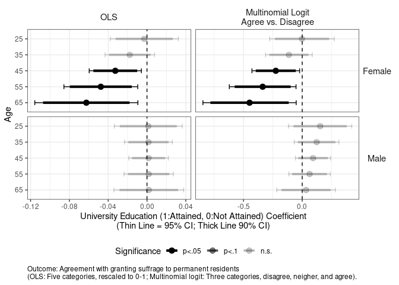<!-- -->

``` r
ggsave(paste0(projdir,"/out/maineffectcompareolsmultinom.png"),p,width=8,height=5)
```

    ## Warning: position_dodge requires non-overlapping x intervals
    
    ## Warning: position_dodge requires non-overlapping x intervals
    
    ## Warning: position_dodge requires non-overlapping x intervals
    
    ## Warning: position_dodge requires non-overlapping x intervals

``` r
ggsave(paste0(projdir,"/out/maineffectcompareolsmultinom.pdf"),p,width=8,height=5)
```

    ## Warning: position_dodge requires non-overlapping x intervals
    
    ## Warning: position_dodge requires non-overlapping x intervals
    
    ## Warning: position_dodge requires non-overlapping x intervals
    
    ## Warning: position_dodge requires non-overlapping x intervals

## For Robustness Check

``` r
visdtsub <- subset(visdtall, data%in%c("Matched without \nDistance Adj.",
                                       "Matched with \nLambda = 200km",
                                       "Mail-in"))

require(ggplot2)
p <- ggplot(visdtsub, aes(x=factor(age, levels=rev(names(table(age)))), y=est)) +
  geom_hline(aes(yintercept=0), linetype=2) +
  geom_errorbar(aes(ymin=lci95,ymax=uci95,alpha=pstar, color=data), 
                position=position_dodge(width=-0.9), size=0.5, width=0.3) +
  geom_errorbar(aes(ymin=lci90,ymax=uci90,alpha=pstar, color=data),
                position=position_dodge(width=-0.9), size=1.5, width=0.0) +
  geom_point(aes(alpha=pstar, shape=data, color=data),
             position=position_dodge(width=-0.9), size=3) +
  facet_grid(gender ~ method, scales = "free_x") +
  scale_color_manual(name="Data", values = rep("black", 3)) + 
  scale_shape_discrete(name="Data") + 
  scale_alpha_manual(name="Significance",values=c(1,0.5,0.2), drop = FALSE) +
  ylab("University Education (1:Attained, 0:Not Attained) Coefficient\n(Thin Line = 95% CI; Thick Line 90% CI; Omitted for Mail-in Results)") +
  xlab("Age") +
  labs(caption="Outcome: Agreement with granting suffrage to permanent residents \n(OLS: Five categories, rescaled to 0-1; Multinomial logit: Three categories, disagree, neigher, and agree).") +
  coord_flip() + theme_bw() +
  theme(legend.position = "bottom",
        strip.text.x = element_text(size=11),
        strip.text.y = element_text(angle=0,size=11),
        strip.background = element_rect(fill=NA,color=NA),
        plot.caption = element_text(hjust=0),
        plot.subtitle = element_text(hjust=0.5))
p
```

    ## Warning: position_dodge requires non-overlapping x intervals
    
    ## Warning: position_dodge requires non-overlapping x intervals
    
    ## Warning: position_dodge requires non-overlapping x intervals
    
    ## Warning: position_dodge requires non-overlapping x intervals

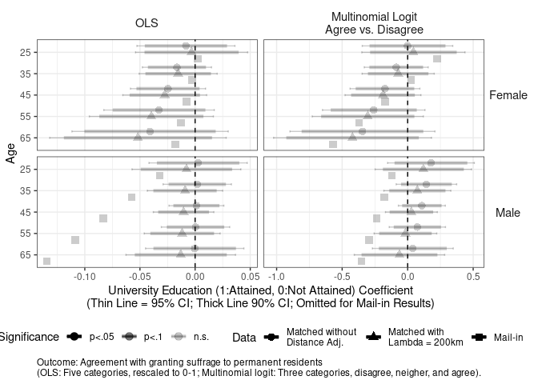<!-- -->

``` r
ggsave(paste0(projdir,"/out/maineffectrobustnesscheck.png"),p,width=8,height=5)
```

    ## Warning: position_dodge requires non-overlapping x intervals
    
    ## Warning: position_dodge requires non-overlapping x intervals
    
    ## Warning: position_dodge requires non-overlapping x intervals
    
    ## Warning: position_dodge requires non-overlapping x intervals

``` r
ggsave(paste0(projdir,"/out/maineffectrobustnesscheck.pdf"),p,width=8,height=5)
```

    ## Warning: position_dodge requires non-overlapping x intervals
    
    ## Warning: position_dodge requires non-overlapping x intervals
    
    ## Warning: position_dodge requires non-overlapping x intervals
    
    ## Warning: position_dodge requires non-overlapping x intervals

# Main Effects (Movers)

``` r
## Import Required Data
visdtx <- readRDS(visdtxdir)
visdtxm <- readRDS(visdtxmdir)
visdtxall <- readRDS(visdtxalldir)
```

## OLS

``` r
require(ggplot2)
p <- ggplot(visdtx, aes(x=factor(age, levels=rev(names(table(age)))), y=est)) +
  geom_hline(aes(yintercept=0), linetype=2) +
  geom_errorbar(aes(ymin=lci95,ymax=uci95,alpha=pstar), 
                position=position_dodge(width=-0.7), size=0.5, width=0.3) +
  geom_errorbar(aes(ymin=lci90,ymax=uci90,alpha=pstar),
                position=position_dodge(width=-0.7), size=1.5, width=0.0) +
  geom_point(aes(alpha=pstar),
             position=position_dodge(width=-0.7), size=3) +
  facet_grid(gender ~ data) +
  scale_y_continuous(breaks = c(-0.1,-0.05,0.00,0.05)) + 
  scale_alpha_manual(name="Significance",values=c(1,0.5,0.2), drop=FALSE) +
  ylab("OLS Coefficient\n(Thin Line = 95% CI; Thick Line 90% CI)") +
  xlab("Age") +
  labs(caption="Treatment: University education (1:attained, 0:not attained). \nOutcome: Agreement with granting suffrage to permanent residents (rescaled to 0-1).") +
  coord_flip() + theme_bw() +
  theme(legend.position = "bottom",
        strip.text.x = element_text(size=11),
        strip.text.y = element_text(angle=0,size=11),
        strip.background = element_rect(fill=NA,color=NA),
        plot.caption = element_text(hjust=0),
        plot.subtitle = element_text(hjust=0.5))
p
```

    ## Warning: position_dodge requires non-overlapping x intervals
    
    ## Warning: position_dodge requires non-overlapping x intervals
    
    ## Warning: position_dodge requires non-overlapping x intervals
    
    ## Warning: position_dodge requires non-overlapping x intervals

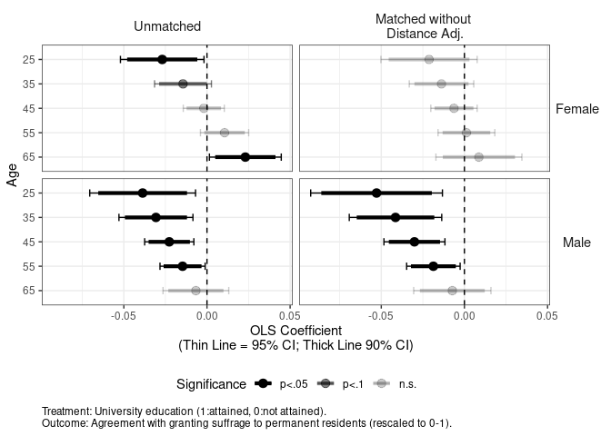<!-- -->

``` r
ggsave(paste0(projdir,"/out/maineffectplotx.png"),p,width=8,height=5)
```

    ## Warning: position_dodge requires non-overlapping x intervals
    
    ## Warning: position_dodge requires non-overlapping x intervals
    
    ## Warning: position_dodge requires non-overlapping x intervals
    
    ## Warning: position_dodge requires non-overlapping x intervals

``` r
ggsave(paste0(projdir,"/out/maineffectplotx.pdf"),p,width=8,height=5)
```

    ## Warning: position_dodge requires non-overlapping x intervals
    
    ## Warning: position_dodge requires non-overlapping x intervals
    
    ## Warning: position_dodge requires non-overlapping x intervals
    
    ## Warning: position_dodge requires non-overlapping x intervals

## Multinomial Logit (Disagree vs. Agree)

``` r
require(ggplot2)
p <- ggplot(visdtxm, aes(x=factor(age, levels=rev(names(table(age)))), y=est)) +
  geom_hline(aes(yintercept=0), linetype=2) +
  geom_errorbar(aes(ymin=lci95,ymax=uci95,alpha=pstar), 
                position=position_dodge(width=-0.7), size=0.5, width=0.3) +
  geom_errorbar(aes(ymin=lci90,ymax=uci90,alpha=pstar),
                position=position_dodge(width=-0.7), size=1.5, width=0.0) +
  geom_point(aes(alpha=pstar),
             position=position_dodge(width=-0.7), size=3) +
  facet_grid(gender ~ data) +
  scale_alpha_manual(name="Significance",values=c(1,0.5,0.2), drop=FALSE) +
  ylab("Multinomial Logit Coefficient: Agree over Disagree\n(Thin Line = 95% CI; Thick Line 90% CI)") +
  xlab("Age") +
  labs(caption="Treatment: University education (1:attained, 0:not attained). \nOutcome: Agreement with granting suffrage to permanent residents (rescaled to 0-1).") +
  coord_flip() + theme_bw() +
  theme(legend.position = "bottom",
        strip.text.x = element_text(size=11),
        strip.text.y = element_text(angle=0,size=11),
        strip.background = element_rect(fill=NA,color=NA),
        plot.caption = element_text(hjust=0),
        plot.subtitle = element_text(hjust=0.5))
p
```

    ## Warning: position_dodge requires non-overlapping x intervals
    
    ## Warning: position_dodge requires non-overlapping x intervals
    
    ## Warning: position_dodge requires non-overlapping x intervals
    
    ## Warning: position_dodge requires non-overlapping x intervals

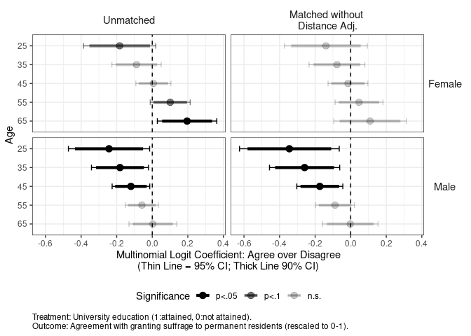<!-- -->

``` r
ggsave(paste0(projdir,"/out/maineffectplotxm.png"),p,width=8,height=5)
```

    ## Warning: position_dodge requires non-overlapping x intervals
    
    ## Warning: position_dodge requires non-overlapping x intervals
    
    ## Warning: position_dodge requires non-overlapping x intervals
    
    ## Warning: position_dodge requires non-overlapping x intervals

``` r
ggsave(paste0(projdir,"/out/maineffectplotxm.pdf"),p,width=8,height=5)
```

    ## Warning: position_dodge requires non-overlapping x intervals
    
    ## Warning: position_dodge requires non-overlapping x intervals
    
    ## Warning: position_dodge requires non-overlapping x intervals
    
    ## Warning: position_dodge requires non-overlapping x intervals

## Compare OLS and Multinomial Logit

``` r
visdtxsub <- subset(visdtxall, data=="Unmatched")

require(ggplot2)
p <- ggplot(visdtxsub, aes(x=factor(age, levels=rev(names(table(age)))), y=est)) +
  geom_hline(aes(yintercept=0), linetype=2) +
  geom_errorbar(aes(ymin=lci95,ymax=uci95,alpha=pstar), 
                position=position_dodge(width=-0.7), size=0.5, width=0.3) +
  geom_errorbar(aes(ymin=lci90,ymax=uci90,alpha=pstar),
                position=position_dodge(width=-0.7), size=1.5, width=0.0) +
  geom_point(aes(alpha=pstar),
             position=position_dodge(width=-0.7), size=3) +
  facet_grid(gender ~ method, scales = "free_x") +
  scale_alpha_manual(name="Significance",values=c(1,0.5,0.2), drop = FALSE) +
  ylab("University Education (1:Attained, 0:Not Attained) Coefficient\n(Thin Line = 95% CI; Thick Line 90% CI)") +
  xlab("Age") +
  labs(caption="Outcome: Agreement with granting suffrage to permanent residents \n(OLS: Five categories, rescaled to 0-1; Multinomial logit: Three categories, disagree, neigher, and agree).") +
  coord_flip() + theme_bw() +
  theme(legend.position = "bottom",
        strip.text.x = element_text(size=11),
        strip.text.y = element_text(angle=0,size=11),
        strip.background = element_rect(fill=NA,color=NA),
        plot.caption = element_text(hjust=0),
        plot.subtitle = element_text(hjust=0.5))
p
```

    ## Warning: position_dodge requires non-overlapping x intervals
    
    ## Warning: position_dodge requires non-overlapping x intervals
    
    ## Warning: position_dodge requires non-overlapping x intervals
    
    ## Warning: position_dodge requires non-overlapping x intervals

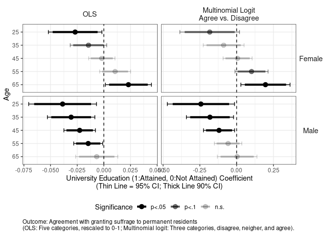<!-- -->

``` r
ggsave(paste0(projdir,"/out/maineffectcompareolsmultinomx.png"),p,width=8,height=5)
```

    ## Warning: position_dodge requires non-overlapping x intervals
    
    ## Warning: position_dodge requires non-overlapping x intervals
    
    ## Warning: position_dodge requires non-overlapping x intervals
    
    ## Warning: position_dodge requires non-overlapping x intervals

``` r
ggsave(paste0(projdir,"/out/maineffectcompareolsmultinomx.pdf"),p,width=8,height=5)
```

    ## Warning: position_dodge requires non-overlapping x intervals
    
    ## Warning: position_dodge requires non-overlapping x intervals
    
    ## Warning: position_dodge requires non-overlapping x intervals
    
    ## Warning: position_dodge requires non-overlapping x intervals

## For Robustness Check

``` r
visdtxsub <- subset(visdtxall, data%in%c("Matched without \nDistance Adj.",
                                       "Mail-in"))

require(ggplot2)
p <- ggplot(visdtxsub, aes(x=factor(age, levels=rev(names(table(age)))), y=est)) +
  geom_hline(aes(yintercept=0), linetype=2) +
  geom_errorbar(aes(ymin=lci95,ymax=uci95,alpha=pstar, color=data), 
                position=position_dodge(width=-0.9), size=0.5, width=0.3) +
  geom_errorbar(aes(ymin=lci90,ymax=uci90,alpha=pstar, color=data),
                position=position_dodge(width=-0.9), size=1.5, width=0.0) +
  geom_point(aes(alpha=pstar, shape=data, color=data),
             position=position_dodge(width=-0.9), size=3) +
  facet_grid(gender ~ method, scales = "free_x") +
  scale_color_manual(name="Data", values = rep("black", 3)) + 
  scale_shape_discrete(name="Data") + 
  scale_alpha_manual(name="Significance",values=c(1,0.5,0.2), drop = FALSE) +
  ylab("University Education (1:Attained, 0:Not Attained) Coefficient\n(Thin Line = 95% CI; Thick Line 90% CI; Omitted for Mail-in Results)") +
  xlab("Age") +
  labs(caption="Outcome: Agreement with granting suffrage to permanent residents \n(OLS: Five categories, rescaled to 0-1; Multinomial logit: Three categories, disagree, neigher, and agree).") +
  coord_flip() + theme_bw() +
  theme(legend.position = "bottom",
        strip.text.x = element_text(size=11),
        strip.text.y = element_text(angle=0,size=11),
        strip.background = element_rect(fill=NA,color=NA),
        plot.caption = element_text(hjust=0),
        plot.subtitle = element_text(hjust=0.5))
p
```

    ## Warning: position_dodge requires non-overlapping x intervals
    
    ## Warning: position_dodge requires non-overlapping x intervals
    
    ## Warning: position_dodge requires non-overlapping x intervals
    
    ## Warning: position_dodge requires non-overlapping x intervals

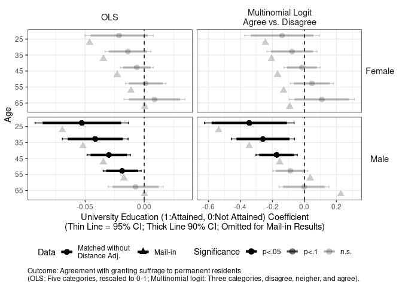<!-- -->

``` r
ggsave(paste0(projdir,"/out/maineffectrobustnesscheckx.png"),p,width=8,height=5)
```

    ## Warning: position_dodge requires non-overlapping x intervals
    
    ## Warning: position_dodge requires non-overlapping x intervals
    
    ## Warning: position_dodge requires non-overlapping x intervals
    
    ## Warning: position_dodge requires non-overlapping x intervals

``` r
ggsave(paste0(projdir,"/out/maineffectrobustnesscheckx.pdf"),p,width=8,height=5)
```

    ## Warning: position_dodge requires non-overlapping x intervals
    
    ## Warning: position_dodge requires non-overlapping x intervals
    
    ## Warning: position_dodge requires non-overlapping x intervals
    
    ## Warning: position_dodge requires non-overlapping x intervals

# Mediation Effects

## Function to Subset Data (Except for knowledge)

``` r
gencoefdts <- function(coefdt) {
  
  coefdt$med <- factor(coefdt$med, levels=c("income","knowledge","ideology","ldpdpjft",
                                            "familiarityFT_KOR","familiarityFT_CHN",
                                            "familiarityFT_USA"),
                       labels = c("Income\n(Percentile)",
                                  "Political\nKnowledge",
                                  "Political\nIdeology",
                                  "LDP - DPJ\nFeeling\nThermometer",
                                  "South Korea\nFeeling\nThermometer",
                                  "China\nFeeling\nThermometer",
                                  "United States\nFeeling\nThermometer"))
  
  
  coefdts <- subset(coefdt, med!="Political\nKnowledge" & 
                      mod!="Treatment => Outcome\n(ADE)" & 
                      age %in% c(25,45,65))
  
  return(coefdts)

}
```

## Unmatched

``` r
coefdts <- gencoefdts(readRDS(coefdtdir0))

require(ggplot2)
p <- ggplot(coefdts, 
            aes(x=factor(age, levels=rev(names(table(age)))), y=est)) +
  geom_hline(aes(yintercept=0), linetype=2) +
  geom_errorbar(aes(ymin=lci95,ymax=uci95,color=gender,alpha=pstar), #linetype=pstar
                position=position_dodge(width=-0.9), size=0.5, width=0.3) +
  geom_errorbar(aes(ymin=lci90,ymax=uci90,color=gender,alpha=pstar),
                position=position_dodge(width=-0.9), size=1.5, width=0.0) +
  geom_point(aes(shape=gender,alpha=pstar),
             position=position_dodge(width=-0.9), size=3) +
  facet_grid(med ~ mod, scales = "free") +
  scale_alpha_manual(name="Significance (Transparency)",values=c(1,0.5,0.2), drop=FALSE) +
  scale_shape_discrete(name="Gender (Point Shape)") + 
  scale_color_manual(name="Gender (Point Shape)", values = rep("black",2)) + 
  ylab("Effect Size\n(Thin Line = 95% CI; Thick Line 90% CI; Omitted for Mail-in Results)") +
  xlab("Age") +
  labs(caption="Treatment: University education (1:attained, 0:not attained). Mediatiors: All rescaled to 0=minimum and 1=maximum.\nOutcome: Agreement with granting suffrage to permanent residents (rescaled to 0-1). All models are estimated by OLS.") +
  coord_flip() + theme_bw() +
  theme(legend.position = "bottom",
        strip.text.x = element_text(size=9),
        strip.text.y = element_text(angle=0,size=11),
        strip.background = element_rect(fill=NA,color=NA),
        plot.caption = element_text(hjust=0),
        plot.subtitle = element_text(hjust=0.5))
p
```

    ## Warning: position_dodge requires non-overlapping x intervals
    
    ## Warning: position_dodge requires non-overlapping x intervals
    
    ## Warning: position_dodge requires non-overlapping x intervals
    
    ## Warning: position_dodge requires non-overlapping x intervals
    
    ## Warning: position_dodge requires non-overlapping x intervals
    
    ## Warning: position_dodge requires non-overlapping x intervals
    
    ## Warning: position_dodge requires non-overlapping x intervals
    
    ## Warning: position_dodge requires non-overlapping x intervals
    
    ## Warning: position_dodge requires non-overlapping x intervals
    
    ## Warning: position_dodge requires non-overlapping x intervals
    
    ## Warning: position_dodge requires non-overlapping x intervals
    
    ## Warning: position_dodge requires non-overlapping x intervals
    
    ## Warning: position_dodge requires non-overlapping x intervals
    
    ## Warning: position_dodge requires non-overlapping x intervals
    
    ## Warning: position_dodge requires non-overlapping x intervals
    
    ## Warning: position_dodge requires non-overlapping x intervals
    
    ## Warning: position_dodge requires non-overlapping x intervals
    
    ## Warning: position_dodge requires non-overlapping x intervals

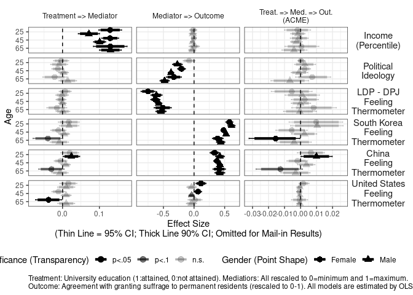<!-- -->

``` r
ggsave(paste0(projdir,"/out/mediationplot_all_unmatched_v5.png"),p,width=10,height=7)
```

    ## Warning: position_dodge requires non-overlapping x intervals
    
    ## Warning: position_dodge requires non-overlapping x intervals
    
    ## Warning: position_dodge requires non-overlapping x intervals
    
    ## Warning: position_dodge requires non-overlapping x intervals
    
    ## Warning: position_dodge requires non-overlapping x intervals
    
    ## Warning: position_dodge requires non-overlapping x intervals
    
    ## Warning: position_dodge requires non-overlapping x intervals
    
    ## Warning: position_dodge requires non-overlapping x intervals
    
    ## Warning: position_dodge requires non-overlapping x intervals
    
    ## Warning: position_dodge requires non-overlapping x intervals
    
    ## Warning: position_dodge requires non-overlapping x intervals
    
    ## Warning: position_dodge requires non-overlapping x intervals
    
    ## Warning: position_dodge requires non-overlapping x intervals
    
    ## Warning: position_dodge requires non-overlapping x intervals
    
    ## Warning: position_dodge requires non-overlapping x intervals
    
    ## Warning: position_dodge requires non-overlapping x intervals
    
    ## Warning: position_dodge requires non-overlapping x intervals
    
    ## Warning: position_dodge requires non-overlapping x intervals

``` r
ggsave(paste0(projdir,"/out/mediationplot_all_unmatched_v5.pdf"),p,width=10,height=7)
```

    ## Warning: position_dodge requires non-overlapping x intervals
    
    ## Warning: position_dodge requires non-overlapping x intervals
    
    ## Warning: position_dodge requires non-overlapping x intervals
    
    ## Warning: position_dodge requires non-overlapping x intervals
    
    ## Warning: position_dodge requires non-overlapping x intervals
    
    ## Warning: position_dodge requires non-overlapping x intervals
    
    ## Warning: position_dodge requires non-overlapping x intervals
    
    ## Warning: position_dodge requires non-overlapping x intervals
    
    ## Warning: position_dodge requires non-overlapping x intervals
    
    ## Warning: position_dodge requires non-overlapping x intervals
    
    ## Warning: position_dodge requires non-overlapping x intervals
    
    ## Warning: position_dodge requires non-overlapping x intervals
    
    ## Warning: position_dodge requires non-overlapping x intervals
    
    ## Warning: position_dodge requires non-overlapping x intervals
    
    ## Warning: position_dodge requires non-overlapping x intervals
    
    ## Warning: position_dodge requires non-overlapping x intervals
    
    ## Warning: position_dodge requires non-overlapping x intervals
    
    ## Warning: position_dodge requires non-overlapping x intervals

## Matched without Distance Adjustment

``` r
coefdts <- gencoefdts(readRDS(coefdtdir1))

require(ggplot2)
p <- ggplot(coefdts, 
            aes(x=factor(age, levels=rev(names(table(age)))), y=est)) +
  geom_hline(aes(yintercept=0), linetype=2) +
  geom_errorbar(aes(ymin=lci95,ymax=uci95,color=gender,alpha=pstar), #linetype=pstar
                position=position_dodge(width=-0.9), size=0.5, width=0.3) +
  geom_errorbar(aes(ymin=lci90,ymax=uci90,color=gender,alpha=pstar),
                position=position_dodge(width=-0.9), size=1.5, width=0.0) +
  geom_point(aes(shape=gender,alpha=pstar),
             position=position_dodge(width=-0.9), size=3) +
  facet_grid(med ~ mod, scales = "free") +
  scale_alpha_manual(name="Significance (Transparency)",values=c(1,0.5,0.2), drop=FALSE) +
  scale_shape_discrete(name="Gender (Point Shape)") + 
  scale_color_manual(name="Gender (Point Shape)", values = rep("black",2)) + 
  ylab("Effect Size\n(Thin Line = 95% CI; Thick Line 90% CI; Omitted for Mail-in Results)") +
  xlab("Age") +
  labs(caption="Treatment: University education (1:attained, 0:not attained). Mediatiors: All rescaled to 0=minimum and 1=maximum.\nOutcome: Agreement with granting suffrage to permanent residents (rescaled to 0-1). All models are estimated by OLS.") +
  coord_flip() + theme_bw() +
  theme(legend.position = "bottom",
        strip.text.x = element_text(size=9),
        strip.text.y = element_text(angle=0,size=11),
        strip.background = element_rect(fill=NA,color=NA),
        plot.caption = element_text(hjust=0),
        plot.subtitle = element_text(hjust=0.5))
p
```

    ## Warning: position_dodge requires non-overlapping x intervals
    
    ## Warning: position_dodge requires non-overlapping x intervals
    
    ## Warning: position_dodge requires non-overlapping x intervals
    
    ## Warning: position_dodge requires non-overlapping x intervals
    
    ## Warning: position_dodge requires non-overlapping x intervals
    
    ## Warning: position_dodge requires non-overlapping x intervals
    
    ## Warning: position_dodge requires non-overlapping x intervals
    
    ## Warning: position_dodge requires non-overlapping x intervals
    
    ## Warning: position_dodge requires non-overlapping x intervals
    
    ## Warning: position_dodge requires non-overlapping x intervals
    
    ## Warning: position_dodge requires non-overlapping x intervals
    
    ## Warning: position_dodge requires non-overlapping x intervals
    
    ## Warning: position_dodge requires non-overlapping x intervals
    
    ## Warning: position_dodge requires non-overlapping x intervals
    
    ## Warning: position_dodge requires non-overlapping x intervals
    
    ## Warning: position_dodge requires non-overlapping x intervals
    
    ## Warning: position_dodge requires non-overlapping x intervals
    
    ## Warning: position_dodge requires non-overlapping x intervals

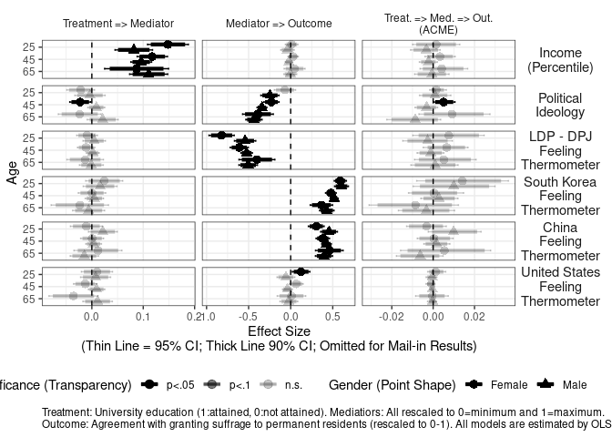<!-- -->

``` r
ggsave(paste0(projdir,"/out/mediationplot_all_matchednoL_v5.png"),p,width=10,height=7)
```

    ## Warning: position_dodge requires non-overlapping x intervals
    
    ## Warning: position_dodge requires non-overlapping x intervals
    
    ## Warning: position_dodge requires non-overlapping x intervals
    
    ## Warning: position_dodge requires non-overlapping x intervals
    
    ## Warning: position_dodge requires non-overlapping x intervals
    
    ## Warning: position_dodge requires non-overlapping x intervals
    
    ## Warning: position_dodge requires non-overlapping x intervals
    
    ## Warning: position_dodge requires non-overlapping x intervals
    
    ## Warning: position_dodge requires non-overlapping x intervals
    
    ## Warning: position_dodge requires non-overlapping x intervals
    
    ## Warning: position_dodge requires non-overlapping x intervals
    
    ## Warning: position_dodge requires non-overlapping x intervals
    
    ## Warning: position_dodge requires non-overlapping x intervals
    
    ## Warning: position_dodge requires non-overlapping x intervals
    
    ## Warning: position_dodge requires non-overlapping x intervals
    
    ## Warning: position_dodge requires non-overlapping x intervals
    
    ## Warning: position_dodge requires non-overlapping x intervals
    
    ## Warning: position_dodge requires non-overlapping x intervals

``` r
ggsave(paste0(projdir,"/out/mediationplot_all_matchednoL_v5.pdf"),p,width=10,height=7)
```

    ## Warning: position_dodge requires non-overlapping x intervals
    
    ## Warning: position_dodge requires non-overlapping x intervals
    
    ## Warning: position_dodge requires non-overlapping x intervals
    
    ## Warning: position_dodge requires non-overlapping x intervals
    
    ## Warning: position_dodge requires non-overlapping x intervals
    
    ## Warning: position_dodge requires non-overlapping x intervals
    
    ## Warning: position_dodge requires non-overlapping x intervals
    
    ## Warning: position_dodge requires non-overlapping x intervals
    
    ## Warning: position_dodge requires non-overlapping x intervals
    
    ## Warning: position_dodge requires non-overlapping x intervals
    
    ## Warning: position_dodge requires non-overlapping x intervals
    
    ## Warning: position_dodge requires non-overlapping x intervals
    
    ## Warning: position_dodge requires non-overlapping x intervals
    
    ## Warning: position_dodge requires non-overlapping x intervals
    
    ## Warning: position_dodge requires non-overlapping x intervals
    
    ## Warning: position_dodge requires non-overlapping x intervals
    
    ## Warning: position_dodge requires non-overlapping x intervals
    
    ## Warning: position_dodge requires non-overlapping x intervals

## Matched with Lambda = 50km

``` r
coefdts <- gencoefdts(readRDS(coefdtdir2))

require(ggplot2)
p <- ggplot(coefdts, 
            aes(x=factor(age, levels=rev(names(table(age)))), y=est)) +
  geom_hline(aes(yintercept=0), linetype=2) +
  geom_errorbar(aes(ymin=lci95,ymax=uci95,color=gender,alpha=pstar), #linetype=pstar
                position=position_dodge(width=-0.9), size=0.5, width=0.3) +
  geom_errorbar(aes(ymin=lci90,ymax=uci90,color=gender,alpha=pstar),
                position=position_dodge(width=-0.9), size=1.5, width=0.0) +
  geom_point(aes(shape=gender,alpha=pstar),
             position=position_dodge(width=-0.9), size=3) +
  facet_grid(med ~ mod, scales = "free") +
  scale_alpha_manual(name="Significance (Transparency)",values=c(1,0.5,0.2), drop=FALSE) +
  scale_shape_discrete(name="Gender (Point Shape)") + 
  scale_color_manual(name="Gender (Point Shape)", values = rep("black",2)) + 
  ylab("Effect Size\n(Thin Line = 95% CI; Thick Line 90% CI; Omitted for Mail-in Results)") +
  xlab("Age") +
  labs(caption="Treatment: University education (1:attained, 0:not attained). Mediatiors: All rescaled to 0=minimum and 1=maximum.\nOutcome: Agreement with granting suffrage to permanent residents (rescaled to 0-1). All models are estimated by OLS.") +
  coord_flip() + theme_bw() +
  theme(legend.position = "bottom",
        strip.text.x = element_text(size=9),
        strip.text.y = element_text(angle=0,size=11),
        strip.background = element_rect(fill=NA,color=NA),
        plot.caption = element_text(hjust=0),
        plot.subtitle = element_text(hjust=0.5))
p
```

    ## Warning: position_dodge requires non-overlapping x intervals
    
    ## Warning: position_dodge requires non-overlapping x intervals
    
    ## Warning: position_dodge requires non-overlapping x intervals
    
    ## Warning: position_dodge requires non-overlapping x intervals
    
    ## Warning: position_dodge requires non-overlapping x intervals
    
    ## Warning: position_dodge requires non-overlapping x intervals
    
    ## Warning: position_dodge requires non-overlapping x intervals
    
    ## Warning: position_dodge requires non-overlapping x intervals
    
    ## Warning: position_dodge requires non-overlapping x intervals
    
    ## Warning: position_dodge requires non-overlapping x intervals
    
    ## Warning: position_dodge requires non-overlapping x intervals
    
    ## Warning: position_dodge requires non-overlapping x intervals
    
    ## Warning: position_dodge requires non-overlapping x intervals
    
    ## Warning: position_dodge requires non-overlapping x intervals
    
    ## Warning: position_dodge requires non-overlapping x intervals
    
    ## Warning: position_dodge requires non-overlapping x intervals
    
    ## Warning: position_dodge requires non-overlapping x intervals
    
    ## Warning: position_dodge requires non-overlapping x intervals

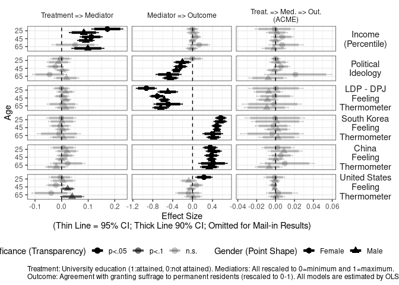<!-- -->

``` r
ggsave(paste0(projdir,"/out/mediationplot_all_matchedL50_v5.png"),p,width=10,height=7)
```

    ## Warning: position_dodge requires non-overlapping x intervals
    
    ## Warning: position_dodge requires non-overlapping x intervals
    
    ## Warning: position_dodge requires non-overlapping x intervals
    
    ## Warning: position_dodge requires non-overlapping x intervals
    
    ## Warning: position_dodge requires non-overlapping x intervals
    
    ## Warning: position_dodge requires non-overlapping x intervals
    
    ## Warning: position_dodge requires non-overlapping x intervals
    
    ## Warning: position_dodge requires non-overlapping x intervals
    
    ## Warning: position_dodge requires non-overlapping x intervals
    
    ## Warning: position_dodge requires non-overlapping x intervals
    
    ## Warning: position_dodge requires non-overlapping x intervals
    
    ## Warning: position_dodge requires non-overlapping x intervals
    
    ## Warning: position_dodge requires non-overlapping x intervals
    
    ## Warning: position_dodge requires non-overlapping x intervals
    
    ## Warning: position_dodge requires non-overlapping x intervals
    
    ## Warning: position_dodge requires non-overlapping x intervals
    
    ## Warning: position_dodge requires non-overlapping x intervals
    
    ## Warning: position_dodge requires non-overlapping x intervals

``` r
ggsave(paste0(projdir,"/out/mediationplot_all_matchedL50_v5.pdf"),p,width=10,height=7)
```

    ## Warning: position_dodge requires non-overlapping x intervals
    
    ## Warning: position_dodge requires non-overlapping x intervals
    
    ## Warning: position_dodge requires non-overlapping x intervals
    
    ## Warning: position_dodge requires non-overlapping x intervals
    
    ## Warning: position_dodge requires non-overlapping x intervals
    
    ## Warning: position_dodge requires non-overlapping x intervals
    
    ## Warning: position_dodge requires non-overlapping x intervals
    
    ## Warning: position_dodge requires non-overlapping x intervals
    
    ## Warning: position_dodge requires non-overlapping x intervals
    
    ## Warning: position_dodge requires non-overlapping x intervals
    
    ## Warning: position_dodge requires non-overlapping x intervals
    
    ## Warning: position_dodge requires non-overlapping x intervals
    
    ## Warning: position_dodge requires non-overlapping x intervals
    
    ## Warning: position_dodge requires non-overlapping x intervals
    
    ## Warning: position_dodge requires non-overlapping x intervals
    
    ## Warning: position_dodge requires non-overlapping x intervals
    
    ## Warning: position_dodge requires non-overlapping x intervals
    
    ## Warning: position_dodge requires non-overlapping x intervals

## Matched with Lambda = 100km

``` r
coefdts <- gencoefdts(readRDS(coefdtdir3))

require(ggplot2)
p <- ggplot(coefdts, 
            aes(x=factor(age, levels=rev(names(table(age)))), y=est)) +
  geom_hline(aes(yintercept=0), linetype=2) +
  geom_errorbar(aes(ymin=lci95,ymax=uci95,color=gender,alpha=pstar), #linetype=pstar
                position=position_dodge(width=-0.9), size=0.5, width=0.3) +
  geom_errorbar(aes(ymin=lci90,ymax=uci90,color=gender,alpha=pstar),
                position=position_dodge(width=-0.9), size=1.5, width=0.0) +
  geom_point(aes(shape=gender,alpha=pstar),
             position=position_dodge(width=-0.9), size=3) +
  facet_grid(med ~ mod, scales = "free") +
  scale_alpha_manual(name="Significance (Transparency)",values=c(1,0.5,0.2), drop=FALSE) +
  scale_shape_discrete(name="Gender (Point Shape)") + 
  scale_color_manual(name="Gender (Point Shape)", values = rep("black",2)) + 
  ylab("Effect Size\n(Thin Line = 95% CI; Thick Line 90% CI; Omitted for Mail-in Results)") +
  xlab("Age") +
  labs(caption="Treatment: University education (1:attained, 0:not attained). Mediatiors: All rescaled to 0=minimum and 1=maximum.\nOutcome: Agreement with granting suffrage to permanent residents (rescaled to 0-1). All models are estimated by OLS.") +
  coord_flip() + theme_bw() +
  theme(legend.position = "bottom",
        strip.text.x = element_text(size=9),
        strip.text.y = element_text(angle=0,size=11),
        strip.background = element_rect(fill=NA,color=NA),
        plot.caption = element_text(hjust=0),
        plot.subtitle = element_text(hjust=0.5))
p
```

    ## Warning: position_dodge requires non-overlapping x intervals
    
    ## Warning: position_dodge requires non-overlapping x intervals
    
    ## Warning: position_dodge requires non-overlapping x intervals
    
    ## Warning: position_dodge requires non-overlapping x intervals
    
    ## Warning: position_dodge requires non-overlapping x intervals
    
    ## Warning: position_dodge requires non-overlapping x intervals
    
    ## Warning: position_dodge requires non-overlapping x intervals
    
    ## Warning: position_dodge requires non-overlapping x intervals
    
    ## Warning: position_dodge requires non-overlapping x intervals
    
    ## Warning: position_dodge requires non-overlapping x intervals
    
    ## Warning: position_dodge requires non-overlapping x intervals
    
    ## Warning: position_dodge requires non-overlapping x intervals
    
    ## Warning: position_dodge requires non-overlapping x intervals
    
    ## Warning: position_dodge requires non-overlapping x intervals
    
    ## Warning: position_dodge requires non-overlapping x intervals
    
    ## Warning: position_dodge requires non-overlapping x intervals
    
    ## Warning: position_dodge requires non-overlapping x intervals
    
    ## Warning: position_dodge requires non-overlapping x intervals

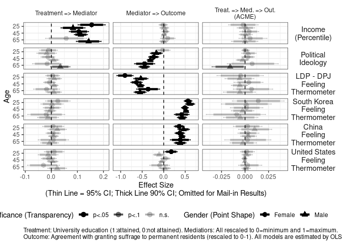<!-- -->

``` r
ggsave(paste0(projdir,"/out/mediationplot_all_matchedL100_v5.png"),p,width=10,height=7)
```

    ## Warning: position_dodge requires non-overlapping x intervals
    
    ## Warning: position_dodge requires non-overlapping x intervals
    
    ## Warning: position_dodge requires non-overlapping x intervals
    
    ## Warning: position_dodge requires non-overlapping x intervals
    
    ## Warning: position_dodge requires non-overlapping x intervals
    
    ## Warning: position_dodge requires non-overlapping x intervals
    
    ## Warning: position_dodge requires non-overlapping x intervals
    
    ## Warning: position_dodge requires non-overlapping x intervals
    
    ## Warning: position_dodge requires non-overlapping x intervals
    
    ## Warning: position_dodge requires non-overlapping x intervals
    
    ## Warning: position_dodge requires non-overlapping x intervals
    
    ## Warning: position_dodge requires non-overlapping x intervals
    
    ## Warning: position_dodge requires non-overlapping x intervals
    
    ## Warning: position_dodge requires non-overlapping x intervals
    
    ## Warning: position_dodge requires non-overlapping x intervals
    
    ## Warning: position_dodge requires non-overlapping x intervals
    
    ## Warning: position_dodge requires non-overlapping x intervals
    
    ## Warning: position_dodge requires non-overlapping x intervals

``` r
ggsave(paste0(projdir,"/out/mediationplot_all_matchedL100_v5.pdf"),p,width=10,height=7)
```

    ## Warning: position_dodge requires non-overlapping x intervals
    
    ## Warning: position_dodge requires non-overlapping x intervals
    
    ## Warning: position_dodge requires non-overlapping x intervals
    
    ## Warning: position_dodge requires non-overlapping x intervals
    
    ## Warning: position_dodge requires non-overlapping x intervals
    
    ## Warning: position_dodge requires non-overlapping x intervals
    
    ## Warning: position_dodge requires non-overlapping x intervals
    
    ## Warning: position_dodge requires non-overlapping x intervals
    
    ## Warning: position_dodge requires non-overlapping x intervals
    
    ## Warning: position_dodge requires non-overlapping x intervals
    
    ## Warning: position_dodge requires non-overlapping x intervals
    
    ## Warning: position_dodge requires non-overlapping x intervals
    
    ## Warning: position_dodge requires non-overlapping x intervals
    
    ## Warning: position_dodge requires non-overlapping x intervals
    
    ## Warning: position_dodge requires non-overlapping x intervals
    
    ## Warning: position_dodge requires non-overlapping x intervals
    
    ## Warning: position_dodge requires non-overlapping x intervals
    
    ## Warning: position_dodge requires non-overlapping x intervals

## Matched with Lambda = 200km

``` r
coefdts <- gencoefdts(readRDS(coefdtdir4))

require(ggplot2)
p <- ggplot(coefdts, 
            aes(x=factor(age, levels=rev(names(table(age)))), y=est)) +
  geom_hline(aes(yintercept=0), linetype=2) +
  geom_errorbar(aes(ymin=lci95,ymax=uci95,color=gender,alpha=pstar), #linetype=pstar
                position=position_dodge(width=-0.9), size=0.5, width=0.3) +
  geom_errorbar(aes(ymin=lci90,ymax=uci90,color=gender,alpha=pstar),
                position=position_dodge(width=-0.9), size=1.5, width=0.0) +
  geom_point(aes(shape=gender,alpha=pstar),
             position=position_dodge(width=-0.9), size=3) +
  facet_grid(med ~ mod, scales = "free") +
  scale_alpha_manual(name="Significance (Transparency)",values=c(1,0.5,0.2), drop=FALSE) +
  scale_shape_discrete(name="Gender (Point Shape)") + 
  scale_color_manual(name="Gender (Point Shape)", values = rep("black",2)) + 
  ylab("Effect Size\n(Thin Line = 95% CI; Thick Line 90% CI; Omitted for Mail-in Results)") +
  xlab("Age") +
  labs(caption="Treatment: University education (1:attained, 0:not attained). Mediatiors: All rescaled to 0=minimum and 1=maximum.\nOutcome: Agreement with granting suffrage to permanent residents (rescaled to 0-1). All models are estimated by OLS.") +
  coord_flip() + theme_bw() +
  theme(legend.position = "bottom",
        strip.text.x = element_text(size=9),
        strip.text.y = element_text(angle=0,size=11),
        strip.background = element_rect(fill=NA,color=NA),
        plot.caption = element_text(hjust=0),
        plot.subtitle = element_text(hjust=0.5))
p
```

    ## Warning: position_dodge requires non-overlapping x intervals
    
    ## Warning: position_dodge requires non-overlapping x intervals
    
    ## Warning: position_dodge requires non-overlapping x intervals
    
    ## Warning: position_dodge requires non-overlapping x intervals
    
    ## Warning: position_dodge requires non-overlapping x intervals
    
    ## Warning: position_dodge requires non-overlapping x intervals
    
    ## Warning: position_dodge requires non-overlapping x intervals
    
    ## Warning: position_dodge requires non-overlapping x intervals
    
    ## Warning: position_dodge requires non-overlapping x intervals
    
    ## Warning: position_dodge requires non-overlapping x intervals
    
    ## Warning: position_dodge requires non-overlapping x intervals
    
    ## Warning: position_dodge requires non-overlapping x intervals
    
    ## Warning: position_dodge requires non-overlapping x intervals
    
    ## Warning: position_dodge requires non-overlapping x intervals
    
    ## Warning: position_dodge requires non-overlapping x intervals
    
    ## Warning: position_dodge requires non-overlapping x intervals
    
    ## Warning: position_dodge requires non-overlapping x intervals
    
    ## Warning: position_dodge requires non-overlapping x intervals

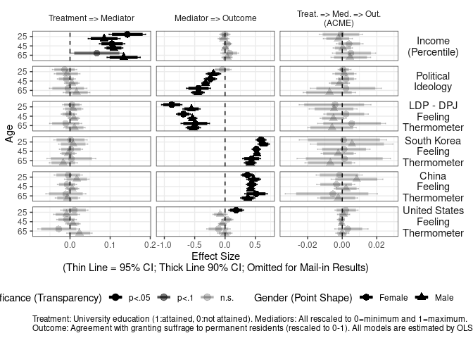<!-- -->

``` r
ggsave(paste0(projdir,"/out/mediationplot_all_matchedL200_v5.png"),p,width=10,height=7)
```

    ## Warning: position_dodge requires non-overlapping x intervals
    
    ## Warning: position_dodge requires non-overlapping x intervals
    
    ## Warning: position_dodge requires non-overlapping x intervals
    
    ## Warning: position_dodge requires non-overlapping x intervals
    
    ## Warning: position_dodge requires non-overlapping x intervals
    
    ## Warning: position_dodge requires non-overlapping x intervals
    
    ## Warning: position_dodge requires non-overlapping x intervals
    
    ## Warning: position_dodge requires non-overlapping x intervals
    
    ## Warning: position_dodge requires non-overlapping x intervals
    
    ## Warning: position_dodge requires non-overlapping x intervals
    
    ## Warning: position_dodge requires non-overlapping x intervals
    
    ## Warning: position_dodge requires non-overlapping x intervals
    
    ## Warning: position_dodge requires non-overlapping x intervals
    
    ## Warning: position_dodge requires non-overlapping x intervals
    
    ## Warning: position_dodge requires non-overlapping x intervals
    
    ## Warning: position_dodge requires non-overlapping x intervals
    
    ## Warning: position_dodge requires non-overlapping x intervals
    
    ## Warning: position_dodge requires non-overlapping x intervals

``` r
ggsave(paste0(projdir,"/out/mediationplot_all_matchedL200_v5.pdf"),p,width=10,height=7)
```

    ## Warning: position_dodge requires non-overlapping x intervals
    
    ## Warning: position_dodge requires non-overlapping x intervals
    
    ## Warning: position_dodge requires non-overlapping x intervals
    
    ## Warning: position_dodge requires non-overlapping x intervals
    
    ## Warning: position_dodge requires non-overlapping x intervals
    
    ## Warning: position_dodge requires non-overlapping x intervals
    
    ## Warning: position_dodge requires non-overlapping x intervals
    
    ## Warning: position_dodge requires non-overlapping x intervals
    
    ## Warning: position_dodge requires non-overlapping x intervals
    
    ## Warning: position_dodge requires non-overlapping x intervals
    
    ## Warning: position_dodge requires non-overlapping x intervals
    
    ## Warning: position_dodge requires non-overlapping x intervals
    
    ## Warning: position_dodge requires non-overlapping x intervals
    
    ## Warning: position_dodge requires non-overlapping x intervals
    
    ## Warning: position_dodge requires non-overlapping x intervals
    
    ## Warning: position_dodge requires non-overlapping x intervals
    
    ## Warning: position_dodge requires non-overlapping x intervals
    
    ## Warning: position_dodge requires non-overlapping x intervals

## Matched with Lambda = 100km

``` r
coefdts <- gencoefdts(readRDS(coefdtdir5))

require(ggplot2)
p <- ggplot(coefdts, 
            aes(x=factor(age, levels=rev(names(table(age)))), y=est)) +
  geom_hline(aes(yintercept=0), linetype=2) +
  geom_errorbar(aes(ymin=lci95,ymax=uci95,color=gender,alpha=pstar), #linetype=pstar
                position=position_dodge(width=-0.9), size=0.5, width=0.3) +
  geom_errorbar(aes(ymin=lci90,ymax=uci90,color=gender,alpha=pstar),
                position=position_dodge(width=-0.9), size=1.5, width=0.0) +
  geom_point(aes(shape=gender,alpha=pstar),
             position=position_dodge(width=-0.9), size=3) +
  facet_grid(med ~ mod, scales = "free") +
  scale_alpha_manual(name="Significance (Transparency)",values=c(1,0.5,0.2), drop=FALSE) +
  scale_shape_discrete(name="Gender (Point Shape)") + 
  scale_color_manual(name="Gender (Point Shape)", values = rep("black",2)) + 
  ylab("Effect Size\n(Thin Line = 95% CI; Thick Line 90% CI; Omitted for Mail-in Results)") +
  xlab("Age") +
  labs(caption="Treatment: University education (1:attained, 0:not attained). Mediatiors: All rescaled to 0=minimum and 1=maximum.\nOutcome: Agreement with granting suffrage to permanent residents (rescaled to 0-1). All models are estimated by OLS.") +
  coord_flip() + theme_bw() +
  theme(legend.position = "bottom",
        strip.text.x = element_text(size=9),
        strip.text.y = element_text(angle=0,size=11),
        strip.background = element_rect(fill=NA,color=NA),
        plot.caption = element_text(hjust=0),
        plot.subtitle = element_text(hjust=0.5))
p
```

    ## Warning: position_dodge requires non-overlapping x intervals
    
    ## Warning: position_dodge requires non-overlapping x intervals
    
    ## Warning: position_dodge requires non-overlapping x intervals
    
    ## Warning: position_dodge requires non-overlapping x intervals
    
    ## Warning: position_dodge requires non-overlapping x intervals
    
    ## Warning: position_dodge requires non-overlapping x intervals
    
    ## Warning: position_dodge requires non-overlapping x intervals
    
    ## Warning: position_dodge requires non-overlapping x intervals
    
    ## Warning: position_dodge requires non-overlapping x intervals
    
    ## Warning: position_dodge requires non-overlapping x intervals
    
    ## Warning: position_dodge requires non-overlapping x intervals
    
    ## Warning: position_dodge requires non-overlapping x intervals
    
    ## Warning: position_dodge requires non-overlapping x intervals
    
    ## Warning: position_dodge requires non-overlapping x intervals
    
    ## Warning: position_dodge requires non-overlapping x intervals
    
    ## Warning: position_dodge requires non-overlapping x intervals
    
    ## Warning: position_dodge requires non-overlapping x intervals
    
    ## Warning: position_dodge requires non-overlapping x intervals

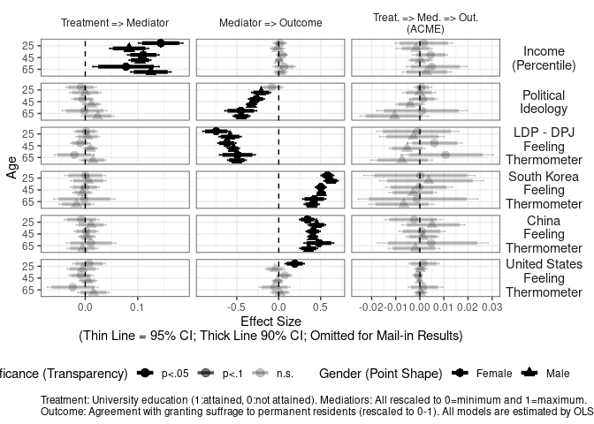<!-- -->

``` r
ggsave(paste0(projdir,"/out/mediationplot_all_matchedL350_v5.png"),p,width=10,height=7)
```

    ## Warning: position_dodge requires non-overlapping x intervals
    
    ## Warning: position_dodge requires non-overlapping x intervals
    
    ## Warning: position_dodge requires non-overlapping x intervals
    
    ## Warning: position_dodge requires non-overlapping x intervals
    
    ## Warning: position_dodge requires non-overlapping x intervals
    
    ## Warning: position_dodge requires non-overlapping x intervals
    
    ## Warning: position_dodge requires non-overlapping x intervals
    
    ## Warning: position_dodge requires non-overlapping x intervals
    
    ## Warning: position_dodge requires non-overlapping x intervals
    
    ## Warning: position_dodge requires non-overlapping x intervals
    
    ## Warning: position_dodge requires non-overlapping x intervals
    
    ## Warning: position_dodge requires non-overlapping x intervals
    
    ## Warning: position_dodge requires non-overlapping x intervals
    
    ## Warning: position_dodge requires non-overlapping x intervals
    
    ## Warning: position_dodge requires non-overlapping x intervals
    
    ## Warning: position_dodge requires non-overlapping x intervals
    
    ## Warning: position_dodge requires non-overlapping x intervals
    
    ## Warning: position_dodge requires non-overlapping x intervals

``` r
ggsave(paste0(projdir,"/out/mediationplot_all_matchedL350_v5.pdf"),p,width=10,height=7)
```

    ## Warning: position_dodge requires non-overlapping x intervals
    
    ## Warning: position_dodge requires non-overlapping x intervals
    
    ## Warning: position_dodge requires non-overlapping x intervals
    
    ## Warning: position_dodge requires non-overlapping x intervals
    
    ## Warning: position_dodge requires non-overlapping x intervals
    
    ## Warning: position_dodge requires non-overlapping x intervals
    
    ## Warning: position_dodge requires non-overlapping x intervals
    
    ## Warning: position_dodge requires non-overlapping x intervals
    
    ## Warning: position_dodge requires non-overlapping x intervals
    
    ## Warning: position_dodge requires non-overlapping x intervals
    
    ## Warning: position_dodge requires non-overlapping x intervals
    
    ## Warning: position_dodge requires non-overlapping x intervals
    
    ## Warning: position_dodge requires non-overlapping x intervals
    
    ## Warning: position_dodge requires non-overlapping x intervals
    
    ## Warning: position_dodge requires non-overlapping x intervals
    
    ## Warning: position_dodge requires non-overlapping x intervals
    
    ## Warning: position_dodge requires non-overlapping x intervals
    
    ## Warning: position_dodge requires non-overlapping x intervals
